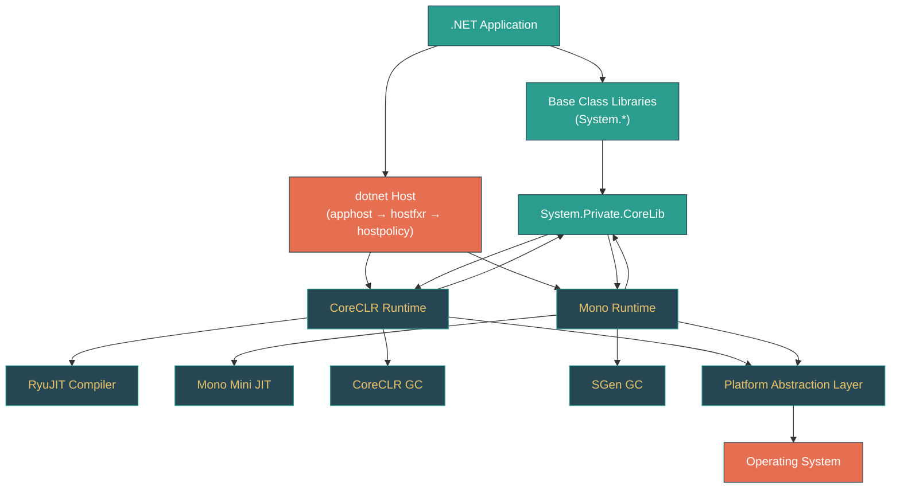
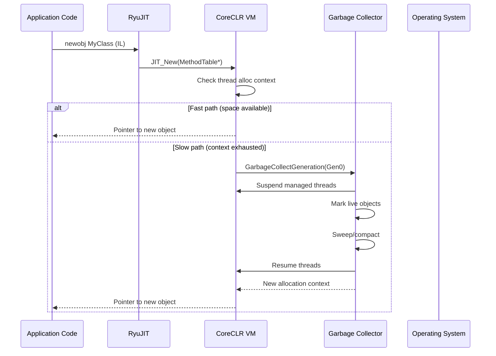
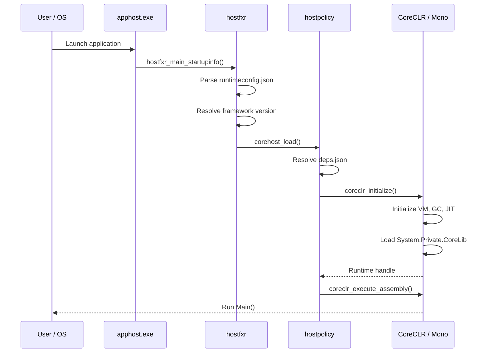
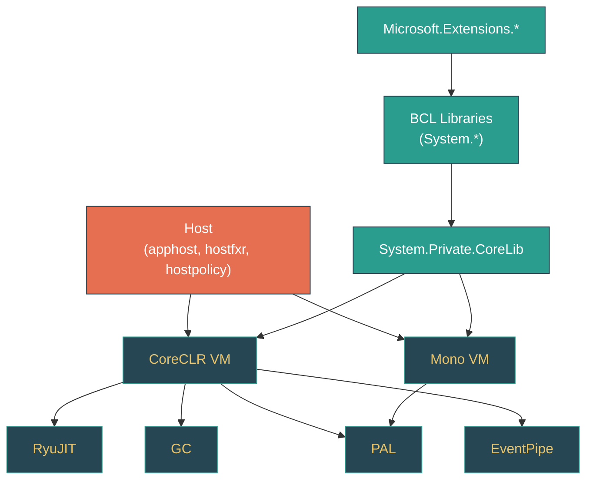

# .NET Runtime — Full Repository Architecture

> 🌐 [Versión en español](../es/runtime-architecture.md)

---

## 1. OVERVIEW

The `dotnet/runtime` repository is the monorepo that contains the core execution engines, managed class libraries, and hosting infrastructure for the .NET platform. It ships as the .NET Runtime and the .NET SDK base layer, powering every .NET application — from cloud services and desktop apps to mobile clients and WebAssembly modules.

The repository is organized into four major pillars:

| Pillar | Root Path | Language | Purpose |
|--------|-----------|----------|---------|
| **CoreCLR** | `src/coreclr/` | C/C++ | Primary execution engine: JIT compiler (RyuJIT), garbage collector, type system, exception handling |
| **Mono** | `src/mono/` | C/C++ | Lightweight alternative runtime for mobile (iOS/Android), WebAssembly, and constrained environments |
| **Libraries (BCL)** | `src/libraries/` | C# | Managed class libraries — `System.Collections`, `System.Net.Http`, `System.Text.Json`, and 240+ more |
| **Host** | `src/native/corehost/` | C/C++ | The native `dotnet` executable that bootstraps the runtime and resolves frameworks |

Understanding this repository is essential for anyone who wants to go beyond *using* .NET and understand how it *works* — from how `new object()` allocates memory, to how `HttpClient` sends bytes over the wire, to how `async/await` transforms your code into a state machine.

---

## 2. LOCATION MAP

### Top-level directories

| Path | Responsibility | Language |
|------|---------------|----------|
| `src/coreclr/` | CoreCLR runtime engine (VM, JIT, GC) | C/C++ |
| `src/coreclr/vm/` | Virtual machine: type system, method dispatch, threading, exception handling | C++ |
| `src/coreclr/jit/` | RyuJIT compiler: IL → native code | C++ |
| `src/coreclr/gc/` | Garbage collector: allocation, collection, heap management | C++ |
| `src/coreclr/nativeaot/` | Native AOT compilation infrastructure | C++/C# |
| `src/coreclr/pal/` | Platform Abstraction Layer (OS-specific primitives) | C/C++ |
| `src/coreclr/System.Private.CoreLib/` | CoreCLR-specific managed CoreLib code | C# |
| `src/mono/` | Mono runtime engine | C/C++ |
| `src/mono/mono/mini/` | Mono JIT compiler | C |
| `src/mono/mono/sgen/` | SGen garbage collector | C |
| `src/mono/mono/metadata/` | Mono metadata and type system | C |
| `src/mono/browser/` | WebAssembly browser integration | C/JS |
| `src/mono/wasm/` | WebAssembly build and runtime support | C/C# |
| `src/mono/System.Private.CoreLib/` | Mono-specific managed CoreLib code | C# |
| `src/libraries/` | 245+ managed class libraries (BCL) | C# |
| `src/libraries/System.Private.CoreLib/` | Shared (runtime-agnostic) CoreLib implementation | C# |
| `src/libraries/Common/src/Interop/` | Shared P/Invoke declarations, organized by OS and native library | C# |
| `src/native/corehost/` | Native host: `apphost`, `hostfxr`, `hostpolicy` | C++ |
| `src/native/eventpipe/` | EventPipe diagnostics infrastructure | C/C++ |
| `src/installer/` | Installer and packaging logic | MSBuild/C# |
| `src/tests/` | CoreCLR runtime tests (JIT, GC, interop, tracing) | C#/IL |
| `eng/` | Build infrastructure: MSBuild props/targets, CI pipeline definitions | MSBuild/PS/Bash |
| `docs/` | Documentation: build workflows, design docs, coding guidelines | Markdown |
| `docs/design/coreclr/botr/` | "Book of the Runtime" — deep architectural documentation | Markdown |

### Library project layout (each of the 245+ libraries)

| Directory | Purpose |
|-----------|---------|
| `ref/` | Reference assembly — defines the public API surface |
| `src/` | Implementation source code |
| `tests/` | Test projects |
| `gen/` | Source generators (if any) |

---

## 3. ARCHITECTURE

### Component diagram



### Layer breakdown

The runtime follows a layered architecture with clear managed/native boundaries:

**Layer 1 — Host (C++)**
The native `dotnet` executable (`apphost`) locates the correct runtime version via `hostfxr`, then `hostpolicy` loads the runtime DLL and hands control to managed code. This is where framework resolution, `runtimeconfig.json` parsing, and single-file bundle extraction happen.

**Layer 2 — Execution Engine (C/C++)**
Either CoreCLR or Mono. The engine provides:
- **JIT compilation** — CoreCLR uses RyuJIT (`src/coreclr/jit/`); Mono uses its Mini JIT (`src/mono/mono/mini/`). Both convert IL to native machine code. CoreCLR also supports Native AOT (`src/coreclr/nativeaot/`) for ahead-of-time compilation.
- **Garbage collection** — CoreCLR uses a generational, concurrent mark-and-sweep GC (`src/coreclr/gc/`); Mono uses SGen (`src/mono/mono/sgen/`).
- **Type system** — Runtime representation of types, methods, and fields. CoreCLR uses `MethodTable`/`EEClass` structures in `src/coreclr/vm/`; Mono uses its metadata system in `src/mono/mono/metadata/`.
- **Threading** — Thread creation, synchronization primitives, and cooperative/preemptive GC mode transitions.
- **Exception handling** — Structured exception handling that bridges managed exceptions and OS-level SEH/signals.

**Layer 3 — System.Private.CoreLib (C#)**
The fundamental managed library that every .NET application loads. It contains `Object`, `String`, `Array`, `Task`, `Span<T>`, and other types that the runtime itself depends on. It is split across three locations:
- `src/libraries/System.Private.CoreLib/` — Runtime-agnostic shared code
- `src/coreclr/System.Private.CoreLib/` — CoreCLR-specific implementations
- `src/mono/System.Private.CoreLib/` — Mono-specific implementations

**Layer 4 — Base Class Libraries (C#)**
The 245+ `System.*` and `Microsoft.Extensions.*` libraries that form the .NET BCL. These are pure managed code that builds on top of CoreLib and the runtime. Each library has a reference assembly (`ref/`) defining its public API and an implementation (`src/`).

### Threading model

CoreCLR operates in two GC modes per thread:
- **Cooperative mode**: The thread promises not to touch GC heap memory in ways that could break a collection. It checks for GC suspension at safe points.
- **Preemptive mode**: The thread is running native code and can be suspended at any time for GC.

Transitions between modes happen at managed/native boundaries (P/Invoke calls, internal calls). The GC can only perform a collection when all threads are at a safe point — either suspended or in preemptive mode.

### Memory model

- **Managed heap**: Divided into generations (Gen0, Gen1, Gen2) plus the Large Object Heap (LOH) and Pinned Object Heap (POH). Allocations happen in per-thread allocation contexts for lock-free fast paths.
- **Native heap**: Used by the runtime itself for metadata structures (`MethodTable`, `EEClass`, JIT code buffers). Managed through loader heaps with arena-style allocation.
- **Stack**: Each managed thread has a stack for local variables and method frames. The GC scans stacks using GC info emitted by the JIT.

---

## 4. KEY TYPES AND THEIR ROLES

### CoreCLR VM types (C++)

#### `MethodTable` — Runtime representation of a loaded type
- **Defined in:** `src/coreclr/vm/methodtable.h`
- **Visibility:** native (internal to runtime)
- **Lifecycle:** Per-type, lives for the lifetime of the `LoaderAllocator`
- **Key fields:**
  - `m_pEEClass` — Pointer to the "cold" type data (reflection info, field layout)
  - `m_pParentMethodTable` — Base type's MethodTable
  - `m_wNumInterfaces` — Count of implemented interfaces
  - Virtual slot table — Array of method pointers for virtual dispatch
- **Key methods:**
  - `GetNumVirtuals()` — Number of virtual method slots
  - `CanCastTo(MethodTable*)` — Type compatibility check (powers `is`/`as`)
  - `GetModule()` — Owning module
- **Thread safety:** Read-only after construction; no synchronization needed

#### `MethodDesc` — Runtime representation of a method
- **Defined in:** `src/coreclr/vm/method.hpp`
- **Visibility:** native
- **Lifecycle:** Per-method, persistent
- **Key fields:**
  - `m_pszDebugMethodName` — Method name (debug builds)
  - `m_wFlags` — Method attributes (static, virtual, generic, etc.)
  - Native code pointer — Set after JIT compilation
- **Key methods:**
  - `GetNativeCode()` — Returns JITted native code address
  - `IsGenericMethodDefinition()` — Whether this is an open generic method
  - `MakeJitWorker()` — Triggers JIT compilation
- **Design pattern:** Flyweight — different subclasses for different method kinds (FCall, NDirect, EEImpl, etc.)

#### `Object` — Base of all managed objects in memory
- **Defined in:** `src/coreclr/vm/object.h`
- **Visibility:** native
- **Key fields:**
  - `m_pMethTab` — MethodTable pointer (first word of every object; used for type checks, virtual dispatch, and GC)
- **Design pattern:** Every managed object on the GC heap starts with this header. The GC uses the MethodTable pointer to determine object size and which fields contain references.

### CoreCLR JIT types (C++)

#### `Compiler` — Main JIT compilation driver
- **Defined in:** `src/coreclr/jit/compiler.h`, `src/coreclr/jit/compiler.cpp`
- **Visibility:** native
- **Lifecycle:** Per-method compilation (transient)
- **Key methods:**
  - `compCompile()` — Main compilation pipeline entry point
  - `fgImport()` — Import IL into JIT IR (GenTree nodes)
  - `optOptimizeLayout()` — Basic block layout optimization
  - `lsraBuildIntervals()` / `lsraAllocate()` — Register allocation (LSRA)
  - `genGenerateCode()` — Final native code emission
- **Design pattern:** Pipeline — compilation proceeds through ordered phases (import → morph → optimize → lower → register allocate → emit)

### CoreCLR GC types (C++)

#### `GCHeap` — GC heap manager
- **Defined in:** `src/coreclr/gc/gcinterface.h`, `src/coreclr/gc/gc.cpp`
- **Visibility:** native
- **Lifecycle:** Singleton
- **Key methods:**
  - `Alloc()` — Allocate an object on the managed heap
  - `GarbageCollect()` — Trigger a collection
  - `WaitUntilGCComplete()` — Block until an in-progress GC finishes
- **Threading model:** Allocation is lock-free via per-thread allocation contexts. Collections require stop-the-world pauses (though concurrent/background GC minimizes pause time for Gen2).

### Managed types (C#)

#### `System.Object` — Root of the managed type hierarchy
- **Defined in:** `src/libraries/System.Private.CoreLib/src/System/Object.cs`
- **Visibility:** public
- **Key methods:**
  - `GetType()` — Returns runtime type (backed by MethodTable lookup)
  - `GetHashCode()` — Identity hash (default uses sync block or header bits)
  - `ToString()` — String representation
  - `MemberwiseClone()` — Shallow copy
- **Thread safety:** `GetType()` is safe; other methods depend on subclass

#### `System.Threading.ThreadPool` — Managed thread pool
- **Defined in:** `src/libraries/System.Private.CoreLib/src/System/Threading/ThreadPool.cs`
- **Visibility:** public
- **Lifecycle:** Singleton (process-wide)
- **Key methods:**
  - `QueueUserWorkItem()` — Enqueue work for execution
  - `UnsafeQueueUserWorkItem()` — Enqueue without capturing ExecutionContext
- **Design pattern:** Work-stealing queues with a hill-climbing algorithm for dynamic thread injection. Implementation in `PortableThreadPool.cs`.

#### `System.Runtime.CompilerServices.AsyncTaskMethodBuilder` — async/await machinery
- **Defined in:** `src/libraries/System.Private.CoreLib/src/System/Runtime/CompilerServices/AsyncTaskMethodBuilder.cs`
- **Visibility:** public
- **Lifecycle:** Per-async-method invocation
- **Key methods:**
  - `Start()` — Begin executing the state machine
  - `AwaitUnsafeOnCompleted()` — Register continuation when an awaiter is not complete
  - `SetResult()` / `SetException()` — Complete the returned Task
- **Design pattern:** Builder — the C# compiler generates a state machine struct and the builder drives its execution through suspensions and resumptions

---

## 5. EXECUTION FLOW

### Representative flow: Object allocation and garbage collection

This flow demonstrates how the managed heap, JIT, runtime, and GC interact when you write `var obj = new MyClass()`.

**Step 1 — JIT compilation of `new`**
When the JIT encounters a `newobj` IL instruction, it emits a call to one of the runtime's allocation helpers (e.g., `JIT_New`). The JIT knows the object size from the `MethodTable` and may emit an inlined fast path for small objects.

**Step 2 — Fast allocation path**
`JIT_New` checks the current thread's allocation context (a bump pointer within the Gen0 nursery). If there is space, it bumps the pointer and returns — no lock, no syscall.

**Step 3 — Slow allocation path**
If the allocation context is exhausted, the runtime calls into the GC to get a new allocation region. This may trigger a Gen0 collection.

**Step 4 — Garbage collection**
The GC suspends all managed threads (stop-the-world), scans roots (stack, statics, handles), traces live objects, and reclaims dead ones. Gen0 collections are fast (milliseconds); Gen2 collections can run concurrently in background mode.

**Step 5 — Object usage and finalization**
The object lives on the heap until no roots reference it. If it has a finalizer, it is moved to the finalization queue and its destructor runs on a dedicated finalizer thread.



### Representative flow: Host startup



---

## 6. CONFIGURATION AND KNOBS

### CoreCLR runtime knobs

| Knob | Type | Default | Effect |
|------|------|---------|--------|
| `DOTNET_GCHeapCount` | env var | auto | Number of GC heaps (server GC mode) |
| `DOTNET_gcServer` | env var | `0` | Enable server GC (`1`) vs workstation GC (`0`) |
| `DOTNET_GCConserveMemory` | env var | `0` | GC conserves memory more aggressively (0–9 scale) |
| `DOTNET_TieredCompilation` | env var | `1` | Enable tiered JIT compilation |
| `DOTNET_ReadyToRun` | env var | `1` | Use pre-compiled Ready-to-Run images |
| `DOTNET_TC_QuickJitForLoops` | env var | `1` | Allow quick JIT for methods containing loops |
| `DOTNET_JitDisasm` | env var | — | Print JIT disassembly for matching methods (diagnostic) |
| `DOTNET_EnableDiagnostics` | env var | `1` | Enable runtime diagnostics (EventPipe, debugger) |
| `DOTNET_ThreadPool_UnfairSemaphoreSpinLimit` | env var | auto | Thread pool spin count before blocking |

### Host knobs

| Knob | Type | Default | Effect |
|------|------|---------|--------|
| `DOTNET_ROOT` | env var | — | Override .NET installation directory |
| `DOTNET_ROLL_FORWARD` | env var / `runtimeconfig.json` | `Minor` | Framework version roll-forward policy |
| `DOTNET_MULTILEVEL_LOOKUP` | env var | `1` | Search multiple install locations |

### AppContext switches

| Switch | Default | Effect |
|--------|---------|--------|
| `System.Net.Http.UseSocketsHttpHandler` | `true` | Use managed sockets HTTP handler |
| `System.Threading.ThreadPool.MinThreads` | auto | Minimum thread pool threads |
| `System.Runtime.Serialization.EnableUnsafeBinaryFormatterSerialization` | `false` | Enable deprecated BinaryFormatter |
| `System.Text.Json.Serialization.RespectNullableAnnotations` | `false` | Respect `?` nullability in JSON serialization |

### Build configuration flags

| Flag | Short | Values | Purpose |
|------|-------|--------|---------|
| `-runtimeConfiguration` | `-rc` | Debug / Checked / Release | CoreCLR build configuration |
| `-librariesConfiguration` | `-lc` | Debug / Release | Libraries build configuration |
| `-hostConfiguration` | `-hc` | Debug / Release | Host build configuration |
| `-configuration` | `-c` | Debug / Release | Default for all unqualified subsets |
| `-os` | — | windows, linux, osx, browser, android, ios, wasi | Target operating system |
| `-arch` | `-a` | x64, x86, arm, arm64, wasm | Target architecture |

---

## 7. IMPLEMENTATION PATTERNS

### P/Invoke and InternalCall boundaries

The managed/native boundary is one of the most important architectural seams in the runtime.

**LibraryImport (source-generated P/Invoke)** — Preferred for new code:
```csharp
internal static partial class Interop
{
    internal static partial class Kernel32
    {
        [LibraryImport(Libraries.Kernel32, SetLastError = true)]
        internal static partial int GetCurrentProcessId();
    }
}
```

Interop declarations live in `src/libraries/Common/src/Interop/`, organized by platform (`Windows/`, `Unix/`, `OSX/`) and native library (`Kernel32/`, `libc/`, etc.).

**InternalCall / FCall** — For calls directly into the runtime VM:
```csharp
[MethodImpl(MethodImplOptions.InternalCall)]
private static extern void _Collect(int generation, int mode);
```

These are resolved at runtime startup to C++ functions in the VM (typically in `src/coreclr/vm/ecalllist.h`).

**QCall** — For calls that need to transition to preemptive GC mode:
```csharp
[LibraryImport(RuntimeHelpers.QCall, EntryPoint = "TypeHandle_GetActivationInfo")]
private static partial void GetActivationInfo(...);
```

### Error handling conventions

- **Managed code**: Standard .NET exception types. `ThrowHelper` pattern for performance-sensitive paths (avoids inlining penalty of `throw`).
- **Native code**: HRESULT return codes. The VM translates HRESULTs to managed exceptions at the boundary.
- `ArgumentNullException.ThrowIfNull()`, `ObjectDisposedException.ThrowIf()` — preferred for argument validation.

### Performance patterns

- **`Span<T>` and `Memory<T>`**: Used pervasively for zero-copy buffer operations
- **`stackalloc`**: Stack allocation for small, bounded temporary buffers
- **`ValueTask<T>`**: Avoids Task allocation when operations complete synchronously
- **Object pooling**: `ArrayPool<T>.Shared`, `ObjectPool<T>` for reusable buffers
- **`[SkipLocalsInit]`**: Skips zero-initialization of locals in hot paths
- **`[InlineArray]`**: Stack-allocated fixed-size arrays (new in .NET 8)

### Conditional compilation

- **Platform-specific files**: `*.Windows.cs`, `*.Unix.cs`, `*.OSX.cs` — preferred approach using partial classes
- **`#if` directives**: Used sparingly, mainly for `TARGET_WINDOWS`, `TARGET_BROWSER`, `MONO`, `FEATURE_*` flags
- **Feature switches**: `ILLink.Substitutions.xml` files define trim-time feature toggles

### Code generation

- **`[LibraryImport]`**: Source generator for P/Invoke marshaling (replaces legacy `[DllImport]` runtime marshaling)
- **`System.Text.Json` source generators**: `[JsonSerializable]` generates serialization code at compile time
- **`[GeneratedRegex]`**: Compile-time regex generation
- **`[LoggerMessage]`**: High-performance logging source generator

---

## 8. PRACTICAL USAGE AND EXAMPLES

### Standard usage — Understanding what happens when you call `GC.Collect()`

```csharp
// This line triggers the following chain:
GC.Collect(generation: 2, mode: GCCollectionMode.Forced);
```

1. `GC.Collect()` in `src/libraries/System.Private.CoreLib/src/System/GC.cs` calls `_Collect()` (InternalCall)
2. The runtime VM dispatches to `GCInterface::Collect()` in `src/coreclr/vm/comutilnative.cpp`
3. This calls `GCHeap::GarbageCollect()` in `src/coreclr/gc/gc.cpp`
4. The GC suspends all managed threads (EE suspension)
5. Mark phase traces from roots; sweep/compact phase reclaims memory
6. Threads are resumed

### Advanced usage — Diagnosing GC pressure with runtime events

```csharp
// Enable GC event listening to understand allocation patterns
using System.Diagnostics.Tracing;

var listener = new GCEventListener();

// The events come from the runtime's EventPipe infrastructure
// (src/native/eventpipe/) triggered by GC operations in
// src/coreclr/gc/gc.cpp → diagnostics.cpp
sealed class GCEventListener : EventListener
{
    protected override void OnEventSourceCreated(EventSource eventSource)
    {
        if (eventSource.Name == "Microsoft-Windows-DotNETRuntime")
            EnableEvents(eventSource, EventLevel.Informational, (EventKeywords)1 /* GC */);
    }

    protected override void OnEventWritten(EventWrittenEventArgs eventData)
    {
        // GCStart_V2, GCEnd_V1, GCHeapStats_V2, etc.
        Console.WriteLine($"{eventData.EventName}: {string.Join(", ", eventData.Payload!)}");
    }
}
```

### Debugging scenario — "Why is my `HttpClient` leaking connections?"

A common issue is creating `HttpClient` instances per-request, exhausting sockets:

```csharp
// BAD: each instance creates a new SocketsHttpHandler and connection pool
for (int i = 0; i < 1000; i++)
{
    using var client = new HttpClient();
    await client.GetAsync("https://example.com");
}
// Even after Dispose, TIME_WAIT sockets linger for ~2 minutes
```

Understanding the internals helps:
- `HttpClient` (in `src/libraries/System.Net.Http/src/System/Net/Http/HttpClient.cs`) wraps an `HttpMessageHandler`
- Default handler is `SocketsHttpHandler` (`src/libraries/System.Net.Http/src/System/Net/Http/SocketsHttpHandler/`)
- Each `SocketsHttpHandler` maintains its own connection pool (`HttpConnectionPool`)
- Disposing the client disposes the handler, closing all pooled connections
- Solution: Reuse `HttpClient` instances or use `IHttpClientFactory`

```csharp
// GOOD: single instance reuses connections
private static readonly HttpClient s_client = new();

// BETTER: IHttpClientFactory manages handler lifetime
services.AddHttpClient("api", client =>
{
    client.BaseAddress = new Uri("https://example.com");
});
```

### Extension point — Custom `Stream` implementation

When implementing a custom `Stream`, the runtime calls your overrides through a well-defined virtual dispatch path:

```csharp
// The runtime uses MethodTable virtual slots for dispatch
// (src/coreclr/vm/methodtable.h → virtual slot table)
public class InstrumentedStream : Stream
{
    private readonly Stream _inner;
    private long _bytesRead;

    // Override ReadAsync — the BCL prefers this over synchronous Read
    // See src/libraries/System.Private.CoreLib/src/System/IO/Stream.cs
    public override async ValueTask<int> ReadAsync(
        Memory<byte> buffer,
        CancellationToken cancellationToken = default)
    {
        int read = await _inner.ReadAsync(buffer, cancellationToken);
        Interlocked.Add(ref _bytesRead, read);
        return read;
    }

    // Must override these abstract members
    public override bool CanRead => _inner.CanRead;
    public override bool CanSeek => _inner.CanSeek;
    public override bool CanWrite => _inner.CanWrite;
    public override long Length => _inner.Length;
    public override long Position
    {
        get => _inner.Position;
        set => _inner.Position = value;
    }
    public override void Flush() => _inner.Flush();
    public override int Read(byte[] buffer, int offset, int count) =>
        _inner.Read(buffer, offset, count);
    public override long Seek(long offset, SeekOrigin origin) =>
        _inner.Seek(offset, origin);
    public override void SetLength(long value) => _inner.SetLength(value);
    public override void Write(byte[] buffer, int offset, int count) =>
        _inner.Write(buffer, offset, count);
}
```

---

## 9. DEPENDENCY MAP

### Internal dependency flow



### Depends on (external)

- **Operating system APIs** — Win32, POSIX, Darwin, browser APIs (via PAL and Interop layers)
- **LLVM** — Used by Mono's AOT backend (`src/mono/llvm/`)
- **Emscripten** — WebAssembly toolchain for browser scenarios
- **CMake** — Native build system for C/C++ components
- **Arcade SDK** — Microsoft's shared build infrastructure (`eng/common/`)

### Depended on by (downstream)

- **ASP.NET Core** (`dotnet/aspnetcore`) — Web framework built on the runtime
- **Entity Framework Core** (`dotnet/efcore`) — ORM
- **.NET SDK** (`dotnet/sdk`) — CLI tooling, project system
- **WPF / WinForms** — Desktop UI frameworks
- **MAUI** — Cross-platform UI framework (uses Mono on mobile)
- Every .NET application ever built

---

## 10. GLOSSARY

| Term (EN) | Término (ES) | Definition |
|-----------|-------------|------------|
| BCL | BCL (Biblioteca de Clases Base) | Base Class Libraries — the `System.*` managed libraries shipped with the runtime |
| CoreCLR | CoreCLR | The primary .NET execution engine, containing the JIT, GC, and type system |
| CoreLib | CoreLib | `System.Private.CoreLib` — the lowest-level managed assembly, loaded by the runtime itself |
| EEClass | EEClass | "Execution Engine Class" — the cold (rarely-accessed) portion of type metadata in CoreCLR |
| EventPipe | EventPipe | Cross-platform in-process diagnostics and tracing infrastructure |
| GC Heap | Montón del GC | The managed memory regions (Gen0/1/2, LOH, POH) where .NET objects are allocated |
| Host | Host (anfitrión) | The native `dotnet` executable chain (`apphost` → `hostfxr` → `hostpolicy`) that bootstraps the runtime |
| IL | IL (Lenguaje Intermedio) | Intermediate Language — the bytecode format that C# compiles to, before JIT compilation |
| JIT | Compilador JIT | Just-In-Time compiler that converts IL to native machine code at runtime |
| LOH | LOH (Montón de Objetos Grandes) | Large Object Heap — region for objects ≥ 85,000 bytes, collected only in Gen2 |
| MethodDesc | MethodDesc | Runtime data structure representing a single method, including its native code pointer |
| MethodTable | Tabla de métodos | Runtime data structure representing a type — the first word of every managed object |
| Mono | Mono | Lightweight alternative runtime for mobile, WebAssembly, and constrained environments |
| Native AOT | AOT Nativo | Ahead-of-time compilation that produces a self-contained native executable without a JIT |
| PAL | PAL (Capa de Abstracción de Plataforma) | Platform Abstraction Layer — OS-specific primitives used by the runtime |
| POH | POH (Montón de Objetos Fijados) | Pinned Object Heap — region for objects that must not be moved by GC |
| R2R | R2R (Ready-to-Run) | Pre-compiled native code format that speeds up startup while still allowing JIT recompilation |
| RyuJIT | RyuJIT | CoreCLR's JIT compiler, supporting x64, x86, ARM, ARM64, LoongArch64, RISC-V |
| SGen | SGen | Mono's generational garbage collector |
| Tiered Compilation | Compilación por niveles | JIT strategy that first compiles methods quickly (Tier 0), then recompiles hot methods with optimizations (Tier 1) |
| Type System | Sistema de tipos | Runtime representation of types, including layout, hierarchy, interfaces, and generic instantiations |
