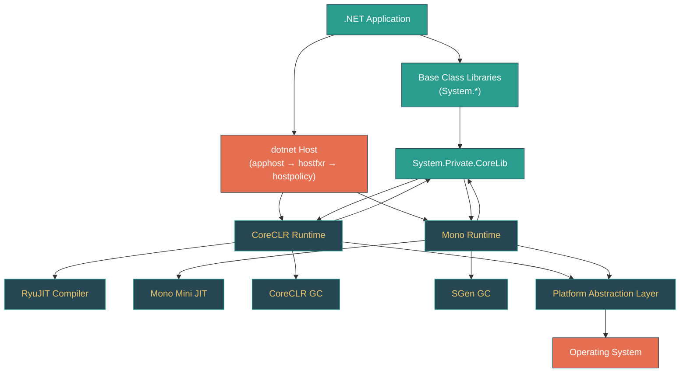
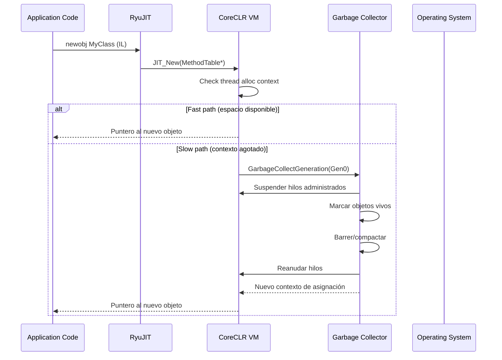
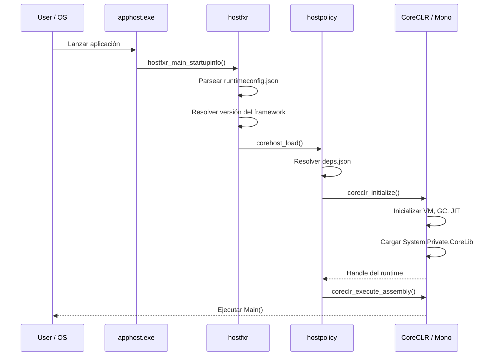
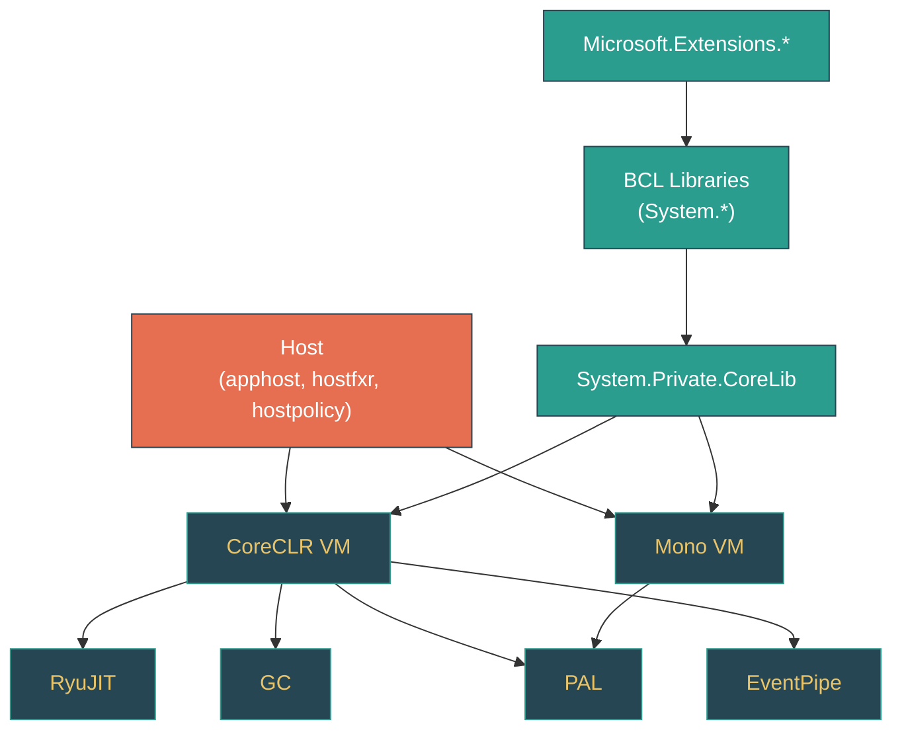

# .NET Runtime — Arquitectura Completa del Repositorio

> 🌐 [English version](../en/runtime-architecture.md)

---

## 1. DESCRIPCIÓN GENERAL

El repositorio `dotnet/runtime` es el monorepo que contiene los motores de ejecución principales, las bibliotecas de clases administradas y la infraestructura de hosting de la plataforma .NET. Se distribuye como el .NET Runtime y la capa base del .NET SDK, impulsando cada aplicación .NET — desde servicios en la nube y aplicaciones de escritorio hasta clientes móviles y módulos WebAssembly.

El repositorio se organiza en cuatro pilares principales:

| Pilar | Ruta raíz | Lenguaje | Propósito |
|-------|-----------|----------|-----------|
| **CoreCLR** | `src/coreclr/` | C/C++ | Motor de ejecución principal: compilador JIT (RyuJIT), recolector de basura, sistema de tipos, manejo de excepciones |
| **Mono** | `src/mono/` | C/C++ | Runtime alternativo liviano para móviles (iOS/Android), WebAssembly y entornos restringidos |
| **Bibliotecas (BCL)** | `src/libraries/` | C# | Bibliotecas de clases administradas — `System.Collections`, `System.Net.Http`, `System.Text.Json`, y más de 240 adicionales |
| **Host** | `src/native/corehost/` | C/C++ | El ejecutable nativo `dotnet` que inicializa el runtime y resuelve frameworks |

Comprender este repositorio es esencial para quien quiera ir más allá de *usar* .NET y entender cómo *funciona* — desde cómo `new object()` asigna memoria, hasta cómo `HttpClient` envía bytes por la red, hasta cómo `async/await` transforma tu código en una máquina de estados.

---

## 2. MAPA DE UBICACIONES

### Directorios de nivel superior

| Ruta | Responsabilidad | Lenguaje |
|------|----------------|----------|
| `src/coreclr/` | Motor CoreCLR (VM, JIT, GC) | C/C++ |
| `src/coreclr/vm/` | Máquina virtual: sistema de tipos, despacho de métodos, hilos, manejo de excepciones | C++ |
| `src/coreclr/jit/` | Compilador RyuJIT: IL → código nativo | C++ |
| `src/coreclr/gc/` | Recolector de basura: asignación, recolección, gestión del montón | C++ |
| `src/coreclr/nativeaot/` | Infraestructura de compilación Native AOT | C++/C# |
| `src/coreclr/pal/` | Capa de Abstracción de Plataforma (primitivas específicas del SO) | C/C++ |
| `src/coreclr/System.Private.CoreLib/` | Código administrado de CoreLib específico de CoreCLR | C# |
| `src/mono/` | Motor Mono | C/C++ |
| `src/mono/mono/mini/` | Compilador JIT de Mono | C |
| `src/mono/mono/sgen/` | Recolector de basura SGen | C |
| `src/mono/mono/metadata/` | Metadatos y sistema de tipos de Mono | C |
| `src/mono/browser/` | Integración WebAssembly para navegador | C/JS |
| `src/mono/wasm/` | Soporte de compilación y runtime WebAssembly | C/C# |
| `src/mono/System.Private.CoreLib/` | Código administrado de CoreLib específico de Mono | C# |
| `src/libraries/` | Más de 245 bibliotecas de clases administradas (BCL) | C# |
| `src/libraries/System.Private.CoreLib/` | Implementación de CoreLib compartida (agnóstica del runtime) | C# |
| `src/libraries/Common/src/Interop/` | Declaraciones P/Invoke compartidas, organizadas por SO y biblioteca nativa | C# |
| `src/native/corehost/` | Host nativo: `apphost`, `hostfxr`, `hostpolicy` | C++ |
| `src/native/eventpipe/` | Infraestructura de diagnósticos EventPipe | C/C++ |
| `src/installer/` | Lógica de instaladores y empaquetado | MSBuild/C# |
| `src/tests/` | Pruebas del runtime CoreCLR (JIT, GC, interop, tracing) | C#/IL |
| `eng/` | Infraestructura de compilación: props/targets de MSBuild, definiciones de pipelines CI | MSBuild/PS/Bash |
| `docs/` | Documentación: flujos de compilación, documentos de diseño, guías de estilo | Markdown |
| `docs/design/coreclr/botr/` | "Book of the Runtime" — documentación arquitectónica profunda | Markdown |

### Estructura de cada proyecto de biblioteca (245+ bibliotecas)

| Directorio | Propósito |
|------------|-----------|
| `ref/` | Assembly de referencia — define la superficie de API pública |
| `src/` | Código fuente de implementación |
| `tests/` | Proyectos de pruebas |
| `gen/` | Generadores de código fuente (si aplica) |

---

## 3. ARQUITECTURA

### Diagrama de componentes



### Desglose por capas

El runtime sigue una arquitectura en capas con límites claros entre código administrado y nativo:

**Capa 1 — Host (C++)**
El ejecutable nativo `dotnet` (`apphost`) localiza la versión correcta del runtime mediante `hostfxr`, luego `hostpolicy` carga la DLL del runtime y transfiere el control al código administrado. Aquí ocurre la resolución de frameworks, el análisis de `runtimeconfig.json` y la extracción de bundles de archivo único.

**Capa 2 — Motor de ejecución (C/C++)**
CoreCLR o Mono. El motor proporciona:
- **Compilación JIT** — CoreCLR usa RyuJIT (`src/coreclr/jit/`); Mono usa su Mini JIT (`src/mono/mono/mini/`). Ambos convierten IL a código nativo. CoreCLR también soporta Native AOT (`src/coreclr/nativeaot/`) para compilación anticipada.
- **Recolección de basura** — CoreCLR usa un GC generacional con recolección concurrente mark-and-sweep (`src/coreclr/gc/`); Mono usa SGen (`src/mono/mono/sgen/`).
- **Sistema de tipos** — Representación en runtime de tipos, métodos y campos. CoreCLR usa estructuras `MethodTable`/`EEClass` en `src/coreclr/vm/`; Mono usa su sistema de metadatos en `src/mono/mono/metadata/`.
- **Hilos** — Creación de hilos, primitivas de sincronización, y transiciones de modo GC cooperativo/preventivo.
- **Manejo de excepciones** — Manejo estructurado de excepciones que conecta las excepciones administradas con SEH/señales del SO.

**Capa 3 — System.Private.CoreLib (C#)**
La biblioteca administrada fundamental que toda aplicación .NET carga. Contiene `Object`, `String`, `Array`, `Task`, `Span<T>`, y otros tipos de los que el runtime mismo depende. Está dividida en tres ubicaciones:
- `src/libraries/System.Private.CoreLib/` — Código compartido agnóstico del runtime
- `src/coreclr/System.Private.CoreLib/` — Implementaciones específicas de CoreCLR
- `src/mono/System.Private.CoreLib/` — Implementaciones específicas de Mono

**Capa 4 — Bibliotecas de Clases Base (C#)**
Las más de 245 bibliotecas `System.*` y `Microsoft.Extensions.*` que forman la BCL de .NET. Son código puramente administrado que se construye sobre CoreLib y el runtime. Cada biblioteca tiene un assembly de referencia (`ref/`) que define su API pública y una implementación (`src/`).

### Modelo de hilos

CoreCLR opera en dos modos de GC por hilo:
- **Modo cooperativo**: El hilo promete no tocar la memoria del montón del GC de formas que puedan interrumpir una recolección. Verifica puntos de suspensión del GC en puntos seguros.
- **Modo preventivo**: El hilo está ejecutando código nativo y puede ser suspendido en cualquier momento para GC.

Las transiciones entre modos ocurren en los límites administrado/nativo (llamadas P/Invoke, llamadas internas). El GC solo puede realizar una recolección cuando todos los hilos están en un punto seguro — ya sea suspendidos o en modo preventivo.

### Modelo de memoria

- **Montón administrado**: Dividido en generaciones (Gen0, Gen1, Gen2) más el Large Object Heap (LOH) y el Pinned Object Heap (POH). Las asignaciones ocurren en contextos de asignación por hilo para caminos rápidos sin bloqueos.
- **Montón nativo**: Usado por el runtime para estructuras de metadatos (`MethodTable`, `EEClass`, buffers de código JIT). Gestionado mediante loader heaps con asignación estilo arena.
- **Stack**: Cada hilo administrado tiene un stack para variables locales y marcos de método. El GC escanea los stacks usando información de GC emitida por el JIT.

---

## 4. TIPOS CLAVE Y SUS ROLES

### Tipos de la VM de CoreCLR (C++)

#### `MethodTable` — Representación en runtime de un tipo cargado
- **Definido en:** `src/coreclr/vm/methodtable.h`
- **Visibilidad:** nativo (interno al runtime)
- **Ciclo de vida:** Por tipo, vive durante el tiempo de vida del `LoaderAllocator`
- **Campos clave:**
  - `m_pEEClass` — Puntero a los datos "fríos" del tipo (información de reflexión, layout de campos)
  - `m_pParentMethodTable` — MethodTable del tipo base
  - `m_wNumInterfaces` — Cantidad de interfaces implementadas
  - Tabla de slots virtuales — Array de punteros a métodos para despacho virtual
- **Métodos clave:**
  - `GetNumVirtuals()` — Número de slots de métodos virtuales
  - `CanCastTo(MethodTable*)` — Verificación de compatibilidad de tipos (implementa `is`/`as`)
  - `GetModule()` — Módulo propietario
- **Seguridad de hilos:** Solo lectura después de la construcción; no requiere sincronización

#### `MethodDesc` — Representación en runtime de un método
- **Definido en:** `src/coreclr/vm/method.hpp`
- **Visibilidad:** nativo
- **Ciclo de vida:** Por método, persistente
- **Campos clave:**
  - `m_pszDebugMethodName` — Nombre del método (en builds de depuración)
  - `m_wFlags` — Atributos del método (estático, virtual, genérico, etc.)
  - Puntero a código nativo — Se establece después de la compilación JIT
- **Métodos clave:**
  - `GetNativeCode()` — Retorna la dirección del código nativo compilado
  - `IsGenericMethodDefinition()` — Si es un método genérico abierto
  - `MakeJitWorker()` — Activa la compilación JIT
- **Patrón de diseño:** Flyweight — diferentes subclases para diferentes tipos de método (FCall, NDirect, EEImpl, etc.)

#### `Object` — Base de todos los objetos administrados en memoria
- **Definido en:** `src/coreclr/vm/object.h`
- **Visibilidad:** nativo
- **Campos clave:**
  - `m_pMethTab` — Puntero a MethodTable (primera palabra de cada objeto; usado para verificación de tipos, despacho virtual y GC)
- **Patrón de diseño:** Todo objeto administrado en el montón del GC comienza con este encabezado. El GC usa el puntero a MethodTable para determinar el tamaño del objeto y qué campos contienen referencias.

### Tipos del JIT de CoreCLR (C++)

#### `Compiler` — Controlador principal de compilación JIT
- **Definido en:** `src/coreclr/jit/compiler.h`, `src/coreclr/jit/compiler.cpp`
- **Visibilidad:** nativo
- **Ciclo de vida:** Por compilación de método (transitorio)
- **Métodos clave:**
  - `compCompile()` — Punto de entrada del pipeline de compilación principal
  - `fgImport()` — Importar IL al IR del JIT (nodos GenTree)
  - `optOptimizeLayout()` — Optimización de layout de bloques básicos
  - `lsraBuildIntervals()` / `lsraAllocate()` — Asignación de registros (LSRA)
  - `genGenerateCode()` — Emisión final de código nativo
- **Patrón de diseño:** Pipeline — la compilación procede a través de fases ordenadas (importar → transformar → optimizar → bajar nivel → asignar registros → emitir)

### Tipos del GC de CoreCLR (C++)

#### `GCHeap` — Gestor del montón del GC
- **Definido en:** `src/coreclr/gc/gcinterface.h`, `src/coreclr/gc/gc.cpp`
- **Visibilidad:** nativo
- **Ciclo de vida:** Singleton
- **Métodos clave:**
  - `Alloc()` — Asignar un objeto en el montón administrado
  - `GarbageCollect()` — Activar una recolección
  - `WaitUntilGCComplete()` — Bloquear hasta que termine un GC en progreso
- **Modelo de hilos:** La asignación es sin bloqueos mediante contextos de asignación por hilo. Las recolecciones requieren pausas stop-the-world (aunque el GC concurrente/en segundo plano minimiza el tiempo de pausa para Gen2).

### Tipos administrados (C#)

#### `System.Object` — Raíz de la jerarquía de tipos administrados
- **Definido en:** `src/libraries/System.Private.CoreLib/src/System/Object.cs`
- **Visibilidad:** público
- **Métodos clave:**
  - `GetType()` — Retorna el tipo en runtime (respaldado por búsqueda en MethodTable)
  - `GetHashCode()` — Hash de identidad (por defecto usa sync block o bits del encabezado)
  - `ToString()` — Representación en cadena
  - `MemberwiseClone()` — Copia superficial
- **Seguridad de hilos:** `GetType()` es seguro; otros métodos dependen de la subclase

#### `System.Threading.ThreadPool` — Pool de hilos administrado
- **Definido en:** `src/libraries/System.Private.CoreLib/src/System/Threading/ThreadPool.cs`
- **Visibilidad:** público
- **Ciclo de vida:** Singleton (a nivel de proceso)
- **Métodos clave:**
  - `QueueUserWorkItem()` — Encolar trabajo para ejecución
  - `UnsafeQueueUserWorkItem()` — Encolar sin capturar ExecutionContext
- **Patrón de diseño:** Colas de trabajo con robo (work-stealing) con un algoritmo de hill-climbing para inyección dinámica de hilos. Implementación en `PortableThreadPool.cs`.

#### `System.Runtime.CompilerServices.AsyncTaskMethodBuilder` — Maquinaria de async/await
- **Definido en:** `src/libraries/System.Private.CoreLib/src/System/Runtime/CompilerServices/AsyncTaskMethodBuilder.cs`
- **Visibilidad:** público
- **Ciclo de vida:** Por invocación de método async
- **Métodos clave:**
  - `Start()` — Iniciar la ejecución de la máquina de estados
  - `AwaitUnsafeOnCompleted()` — Registrar continuación cuando un awaiter no está completo
  - `SetResult()` / `SetException()` — Completar el Task retornado
- **Patrón de diseño:** Builder — el compilador de C# genera una struct de máquina de estados y el builder controla su ejecución a través de suspensiones y reanudaciones

---

## 5. FLUJO DE EJECUCIÓN

### Flujo representativo: Asignación de objetos y recolección de basura

Este flujo demuestra cómo interactúan el montón administrado, el JIT, el runtime y el GC cuando escribes `var obj = new MyClass()`.

**Paso 1 — Compilación JIT de `new`**
Cuando el JIT encuentra una instrucción IL `newobj`, emite una llamada a uno de los helpers de asignación del runtime (por ejemplo, `JIT_New`). El JIT conoce el tamaño del objeto por el `MethodTable` y puede emitir un camino rápido en línea para objetos pequeños.

**Paso 2 — Camino rápido de asignación**
`JIT_New` verifica el contexto de asignación del hilo actual (un puntero bump dentro del nursery Gen0). Si hay espacio, avanza el puntero y retorna — sin bloqueos, sin llamadas al sistema.

**Paso 3 — Camino lento de asignación**
Si el contexto de asignación se agotó, el runtime llama al GC para obtener una nueva región de asignación. Esto puede activar una recolección Gen0.

**Paso 4 — Recolección de basura**
El GC suspende todos los hilos administrados (stop-the-world), escanea las raíces (stack, estáticos, handles), traza los objetos vivos y reclama los muertos. Las recolecciones Gen0 son rápidas (milisegundos); las recolecciones Gen2 pueden ejecutarse concurrentemente en modo de segundo plano.

**Paso 5 — Uso del objeto y finalización**
El objeto vive en el montón hasta que ninguna raíz lo referencia. Si tiene un finalizador, se mueve a la cola de finalización y su destructor se ejecuta en un hilo dedicado de finalización.



### Flujo representativo: Inicio del host



---

## 6. CONFIGURACIÓN Y OPCIONES DE AJUSTE

### Opciones del runtime CoreCLR

| Opción | Tipo | Valor por defecto | Efecto |
|--------|------|-------------------|--------|
| `DOTNET_GCHeapCount` | var. de entorno | auto | Número de montones del GC (modo servidor) |
| `DOTNET_gcServer` | var. de entorno | `0` | Habilitar GC de servidor (`1`) vs GC de estación de trabajo (`0`) |
| `DOTNET_GCConserveMemory` | var. de entorno | `0` | El GC conserva memoria más agresivamente (escala 0–9) |
| `DOTNET_TieredCompilation` | var. de entorno | `1` | Habilitar compilación JIT por niveles |
| `DOTNET_ReadyToRun` | var. de entorno | `1` | Usar imágenes Ready-to-Run precompiladas |
| `DOTNET_TC_QuickJitForLoops` | var. de entorno | `1` | Permitir JIT rápido para métodos con bucles |
| `DOTNET_JitDisasm` | var. de entorno | — | Imprimir desensamblado JIT para métodos coincidentes (diagnóstico) |
| `DOTNET_EnableDiagnostics` | var. de entorno | `1` | Habilitar diagnósticos del runtime (EventPipe, depurador) |
| `DOTNET_ThreadPool_UnfairSemaphoreSpinLimit` | var. de entorno | auto | Conteo de spin del pool de hilos antes de bloquear |

### Opciones del host

| Opción | Tipo | Valor por defecto | Efecto |
|--------|------|-------------------|--------|
| `DOTNET_ROOT` | var. de entorno | — | Sobreescribir directorio de instalación de .NET |
| `DOTNET_ROLL_FORWARD` | var. de entorno / `runtimeconfig.json` | `Minor` | Política de roll-forward de versión del framework |
| `DOTNET_MULTILEVEL_LOOKUP` | var. de entorno | `1` | Buscar en múltiples ubicaciones de instalación |

### Switches de AppContext

| Switch | Valor por defecto | Efecto |
|--------|-------------------|--------|
| `System.Net.Http.UseSocketsHttpHandler` | `true` | Usar handler HTTP basado en sockets administrados |
| `System.Threading.ThreadPool.MinThreads` | auto | Mínimo de hilos del pool |
| `System.Runtime.Serialization.EnableUnsafeBinaryFormatterSerialization` | `false` | Habilitar BinaryFormatter (obsoleto) |
| `System.Text.Json.Serialization.RespectNullableAnnotations` | `false` | Respetar anotaciones `?` de nulabilidad en serialización JSON |

### Flags de configuración de compilación

| Flag | Abreviación | Valores | Propósito |
|------|-------------|---------|-----------|
| `-runtimeConfiguration` | `-rc` | Debug / Checked / Release | Configuración de compilación de CoreCLR |
| `-librariesConfiguration` | `-lc` | Debug / Release | Configuración de compilación de bibliotecas |
| `-hostConfiguration` | `-hc` | Debug / Release | Configuración de compilación del host |
| `-configuration` | `-c` | Debug / Release | Valor por defecto para todos los subconjuntos no calificados |
| `-os` | — | windows, linux, osx, browser, android, ios, wasi | Sistema operativo destino |
| `-arch` | `-a` | x64, x86, arm, arm64, wasm | Arquitectura destino |

---

## 7. PATRONES DE IMPLEMENTACIÓN

### Límites P/Invoke e InternalCall

El límite entre código administrado y nativo es una de las costuras arquitectónicas más importantes del runtime.

**LibraryImport (P/Invoke generado por código fuente)** — Preferido para código nuevo:
```csharp
internal static partial class Interop
{
    internal static partial class Kernel32
    {
        [LibraryImport(Libraries.Kernel32, SetLastError = true)]
        internal static partial int GetCurrentProcessId();
    }
}
```

Las declaraciones de interop viven en `src/libraries/Common/src/Interop/`, organizadas por plataforma (`Windows/`, `Unix/`, `OSX/`) y biblioteca nativa (`Kernel32/`, `libc/`, etc.).

**InternalCall / FCall** — Para llamadas directas a la VM del runtime:
```csharp
[MethodImpl(MethodImplOptions.InternalCall)]
private static extern void _Collect(int generation, int mode);
```

Estas se resuelven al inicio del runtime a funciones C++ en la VM (típicamente en `src/coreclr/vm/ecalllist.h`).

**QCall** — Para llamadas que necesitan transicionar a modo GC preventivo:
```csharp
[LibraryImport(RuntimeHelpers.QCall, EntryPoint = "TypeHandle_GetActivationInfo")]
private static partial void GetActivationInfo(...);
```

### Convenciones de manejo de errores

- **Código administrado**: Tipos de excepción estándar de .NET. Patrón `ThrowHelper` para caminos sensibles al rendimiento (evita la penalización de inlining del `throw`).
- **Código nativo**: Códigos de retorno HRESULT. La VM traduce HRESULTs a excepciones administradas en el límite.
- `ArgumentNullException.ThrowIfNull()`, `ObjectDisposedException.ThrowIf()` — preferidos para validación de argumentos.

### Patrones de rendimiento

- **`Span<T>` y `Memory<T>`**: Usados de forma generalizada para operaciones de buffer sin copia
- **`stackalloc`**: Asignación en el stack para buffers temporales pequeños y acotados
- **`ValueTask<T>`**: Evita la asignación de Task cuando las operaciones se completan sincrónicamente
- **Pool de objetos**: `ArrayPool<T>.Shared`, `ObjectPool<T>` para buffers reutilizables
- **`[SkipLocalsInit]`**: Omite la inicialización a cero de locales en caminos calientes
- **`[InlineArray]`**: Arrays de tamaño fijo asignados en el stack (nuevo en .NET 8)

### Compilación condicional

- **Archivos específicos de plataforma**: `*.Windows.cs`, `*.Unix.cs`, `*.OSX.cs` — enfoque preferido usando clases parciales
- **Directivas `#if`**: Usadas con moderación, principalmente para `TARGET_WINDOWS`, `TARGET_BROWSER`, `MONO`, flags `FEATURE_*`
- **Switches de características**: Archivos `ILLink.Substitutions.xml` definen toggles de características en tiempo de trimming

### Generación de código

- **`[LibraryImport]`**: Generador de código fuente para marshaling P/Invoke (reemplaza el marshaling en runtime del `[DllImport]` legacy)
- **Generadores de `System.Text.Json`**: `[JsonSerializable]` genera código de serialización en tiempo de compilación
- **`[GeneratedRegex]`**: Generación de regex en tiempo de compilación
- **`[LoggerMessage]`**: Generador de código fuente para logging de alto rendimiento

---

## 8. USO PRÁCTICO Y EJEMPLOS

### Uso estándar — Entendiendo qué pasa cuando llamas `GC.Collect()`

```csharp
// Esta línea desencadena la siguiente cadena:
GC.Collect(generation: 2, mode: GCCollectionMode.Forced);
```

1. `GC.Collect()` en `src/libraries/System.Private.CoreLib/src/System/GC.cs` llama a `_Collect()` (InternalCall)
2. La VM del runtime despacha a `GCInterface::Collect()` en `src/coreclr/vm/comutilnative.cpp`
3. Esto llama a `GCHeap::GarbageCollect()` en `src/coreclr/gc/gc.cpp`
4. El GC suspende todos los hilos administrados (suspensión del EE)
5. La fase de marcado traza desde las raíces; la fase de barrido/compactación reclama memoria
6. Los hilos se reanudan

### Uso avanzado — Diagnosticando presión del GC con eventos del runtime

```csharp
// Habilitar escucha de eventos del GC para entender patrones de asignación
using System.Diagnostics.Tracing;

var listener = new GCEventListener();

// Los eventos provienen de la infraestructura EventPipe del runtime
// (src/native/eventpipe/) activados por operaciones del GC en
// src/coreclr/gc/gc.cpp → diagnostics.cpp
sealed class GCEventListener : EventListener
{
    protected override void OnEventSourceCreated(EventSource eventSource)
    {
        if (eventSource.Name == "Microsoft-Windows-DotNETRuntime")
            EnableEvents(eventSource, EventLevel.Informational, (EventKeywords)1 /* GC */);
    }

    protected override void OnEventWritten(EventWrittenEventArgs eventData)
    {
        // GCStart_V2, GCEnd_V1, GCHeapStats_V2, etc.
        Console.WriteLine($"{eventData.EventName}: {string.Join(", ", eventData.Payload!)}");
    }
}
```

### Escenario de depuración — "¿Por qué mi `HttpClient` está perdiendo conexiones?"

Un problema común es crear instancias de `HttpClient` por cada petición, agotando los sockets:

```csharp
// MAL: cada instancia crea un nuevo SocketsHttpHandler y pool de conexiones
for (int i = 0; i < 1000; i++)
{
    using var client = new HttpClient();
    await client.GetAsync("https://example.com");
}
// Incluso después de Dispose, los sockets en TIME_WAIT persisten ~2 minutos
```

Entender los internos ayuda:
- `HttpClient` (en `src/libraries/System.Net.Http/src/System/Net/Http/HttpClient.cs`) envuelve un `HttpMessageHandler`
- El handler por defecto es `SocketsHttpHandler` (`src/libraries/System.Net.Http/src/System/Net/Http/SocketsHttpHandler/`)
- Cada `SocketsHttpHandler` mantiene su propio pool de conexiones (`HttpConnectionPool`)
- Disponer el client dispone el handler, cerrando todas las conexiones del pool
- Solución: Reusar instancias de `HttpClient` o usar `IHttpClientFactory`

```csharp
// BIEN: una sola instancia reutiliza conexiones
private static readonly HttpClient s_client = new();

// MEJOR: IHttpClientFactory gestiona el tiempo de vida del handler
services.AddHttpClient("api", client =>
{
    client.BaseAddress = new Uri("https://example.com");
});
```

### Punto de extensión — Implementación personalizada de `Stream`

Cuando implementas un `Stream` personalizado, el runtime llama tus overrides a través de un camino bien definido de despacho virtual:

```csharp
// El runtime usa slots virtuales de MethodTable para el despacho
// (src/coreclr/vm/methodtable.h → tabla de slots virtuales)
public class InstrumentedStream : Stream
{
    private readonly Stream _inner;
    private long _bytesRead;

    // Sobreescribir ReadAsync — la BCL prefiere este sobre Read síncrono
    // Ver src/libraries/System.Private.CoreLib/src/System/IO/Stream.cs
    public override async ValueTask<int> ReadAsync(
        Memory<byte> buffer,
        CancellationToken cancellationToken = default)
    {
        int read = await _inner.ReadAsync(buffer, cancellationToken);
        Interlocked.Add(ref _bytesRead, read);
        return read;
    }

    // Se deben sobreescribir estos miembros abstractos
    public override bool CanRead => _inner.CanRead;
    public override bool CanSeek => _inner.CanSeek;
    public override bool CanWrite => _inner.CanWrite;
    public override long Length => _inner.Length;
    public override long Position
    {
        get => _inner.Position;
        set => _inner.Position = value;
    }
    public override void Flush() => _inner.Flush();
    public override int Read(byte[] buffer, int offset, int count) =>
        _inner.Read(buffer, offset, count);
    public override long Seek(long offset, SeekOrigin origin) =>
        _inner.Seek(offset, origin);
    public override void SetLength(long value) => _inner.SetLength(value);
    public override void Write(byte[] buffer, int offset, int count) =>
        _inner.Write(buffer, offset, count);
}
```

---

## 9. MAPA DE DEPENDENCIAS

### Flujo de dependencias internas



### Depende de (externo)

- **APIs del sistema operativo** — Win32, POSIX, Darwin, APIs del navegador (a través del PAL y las capas de Interop)
- **LLVM** — Usado por el backend AOT de Mono (`src/mono/llvm/`)
- **Emscripten** — Toolchain de WebAssembly para escenarios de navegador
- **CMake** — Sistema de compilación nativa para componentes C/C++
- **Arcade SDK** — Infraestructura de compilación compartida de Microsoft (`eng/common/`)

### Dependido por (downstream)

- **ASP.NET Core** (`dotnet/aspnetcore`) — Framework web construido sobre el runtime
- **Entity Framework Core** (`dotnet/efcore`) — ORM
- **.NET SDK** (`dotnet/sdk`) — Herramientas CLI, sistema de proyectos
- **WPF / WinForms** — Frameworks de UI de escritorio
- **MAUI** — Framework de UI multiplataforma (usa Mono en móviles)
- Toda aplicación .NET jamás construida

---

## 10. GLOSARIO

| Término (ES) | Term (EN) | Definición |
|--------------|-----------|------------|
| BCL (Biblioteca de Clases Base) | BCL | Las bibliotecas administradas `System.*` distribuidas con el runtime |
| Compilación por niveles | Tiered Compilation | Estrategia del JIT que primero compila métodos rápidamente (Tier 0), luego recompila métodos calientes con optimizaciones (Tier 1) |
| Compilador JIT | JIT | Compilador Just-In-Time que convierte IL a código nativo de máquina en tiempo de ejecución |
| CoreCLR | CoreCLR | El motor de ejecución principal de .NET, que contiene el JIT, el GC y el sistema de tipos |
| CoreLib | CoreLib | `System.Private.CoreLib` — el assembly administrado de más bajo nivel, cargado por el runtime mismo |
| EEClass | EEClass | "Execution Engine Class" — la porción fría (raramente accedida) de los metadatos de tipo en CoreCLR |
| EventPipe | EventPipe | Infraestructura de diagnósticos y tracing en proceso, multiplataforma |
| Hilo | Thread | Unidad de ejecución del procesador gestionada por el runtime |
| IL (Lenguaje Intermedio) | IL | Intermediate Language — el formato de bytecode al que C# se compila, antes de la compilación JIT |
| LOH (Montón de Objetos Grandes) | LOH | Large Object Heap — región para objetos ≥ 85,000 bytes, recolectada solo en Gen2 |
| MethodDesc | MethodDesc | Estructura de datos del runtime que representa un método individual, incluyendo su puntero a código nativo |
| Montón del GC | GC Heap | Las regiones de memoria administrada (Gen0/1/2, LOH, POH) donde se asignan los objetos .NET |
| Mono | Mono | Runtime alternativo liviano para móviles, WebAssembly y entornos restringidos |
| Native AOT (AOT Nativo) | Native AOT | Compilación anticipada que produce un ejecutable nativo autónomo sin JIT |
| PAL (Capa de Abstracción de Plataforma) | PAL | Platform Abstraction Layer — primitivas específicas del SO usadas por el runtime |
| POH (Montón de Objetos Fijados) | POH | Pinned Object Heap — región para objetos que no deben ser movidos por el GC |
| R2R (Ready-to-Run) | R2R | Formato de código nativo precompilado que acelera el inicio mientras permite recompilación JIT |
| Recolector de basura | GC | Sistema que gestiona la memoria automáticamente, liberando objetos que ya no se referencian |
| RyuJIT | RyuJIT | Compilador JIT de CoreCLR, que soporta x64, x86, ARM, ARM64, LoongArch64, RISC-V |
| SGen | SGen | Recolector de basura generacional de Mono |
| Sistema de tipos | Type System | Representación en runtime de tipos, incluyendo layout, jerarquía, interfaces e instanciaciones genéricas |
| Tabla de métodos | MethodTable | Estructura de datos del runtime que representa un tipo — la primera palabra de cada objeto administrado |
