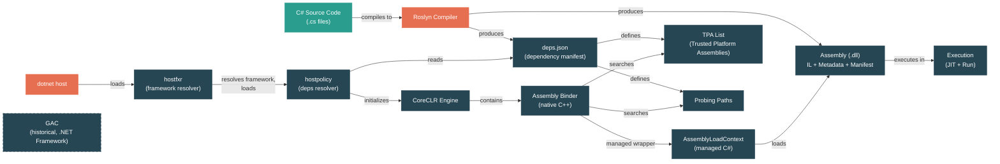

# Level 1: Foundations — Assemblies, Namespaces, and the Loader

> **Target profile:** Developer who uses namespaces and references NuGet packages but doesn't know how assemblies are found and loaded
> **Estimated effort:** 3 hours
> **Prerequisites:** [Modules 1.1–1.4](01-foundations-ecosystem-overview.md)
> [Version en espanol](../es/01-foundations-assemblies.md)

---

## Learning Objectives

By the end of this module you will be able to:

1. Explain the difference between a namespace and an assembly, and why they do not map one-to-one.
2. Describe what a `.dll` file physically contains: IL code, metadata, and a manifest.
3. Read an `AssemblyName` and explain what each component (name, version, culture, public key token) means.
4. Trace how the runtime finds an assembly at startup using `deps.json` and probing paths.
5. Identify the role of `AssemblyLoadContext` as an isolation boundary for loaded assemblies.
6. Explain the host chain: `dotnet` -> `hostfxr` -> `hostpolicy` -> CoreCLR.
7. Use `dotnet --info`, `dotnet publish`, and ILSpy/`ildasm` to inspect assemblies.
8. Navigate the assembly binder source in `src/coreclr/binder/`.

---

## Concept Map



---

## Lesson 1: What Is an Assembly?

### What you'll learn

What a .NET assembly actually is, beyond "a compiled file."

### The concept

When you compile C# code, the compiler does not produce native machine code. It produces an **assembly** — a `.dll` (or `.exe`) file that contains three things:

1. **Intermediate Language (IL):** Platform-independent instructions that the JIT compiler will later convert to native code. Think of IL as a portable bytecode, similar to Java's bytecode but designed for the CLR.

2. **Metadata:** A complete description of every type, method, field, property, and event defined in the assembly. The runtime uses metadata to verify type safety, resolve method calls, and support reflection. Metadata is why you can call `typeof(Foo).GetMethods()` at runtime — that information is baked into the file.

3. **Manifest:** A special section of metadata that describes the assembly itself: its name, version, culture, public key token, and the list of other assemblies it depends on. The manifest is what turns a collection of types into a versioned, identifiable unit.

An assembly is the **unit of deployment, versioning, and security** in .NET. You don't version individual classes or namespaces — you version assemblies.

Here is what an assembly's identity looks like:

```
System.Runtime, Version=9.0.0.0, Culture=neutral, PublicKeyToken=b03f5f7f11d50a3a
```

Each part matters:
- **Name:** `System.Runtime` — the simple name, matching the file name without the extension
- **Version:** `9.0.0.0` — four-part version (major.minor.build.revision)
- **Culture:** `neutral` — for non-satellite (non-localized) assemblies
- **PublicKeyToken:** `b03f5f7f11d50a3a` — a hash of the publisher's public key, used to verify identity

### In the source code

The managed representation of an assembly lives in `src/libraries/System.Private.CoreLib/src/System/Reflection/Assembly.cs`. Open it and notice:

```csharp
public abstract partial class Assembly : ICustomAttributeProvider, ISerializable
{
    // ...
    public virtual string? FullName => throw NotImplemented.ByDesign;
    public virtual string Location => throw NotImplemented.ByDesign;
    public virtual MethodInfo? EntryPoint => throw NotImplemented.ByDesign;
    // ...
    public virtual Stream? GetManifestResourceStream(string name) { throw NotImplemented.ByDesign; }
    public virtual string[] GetManifestResourceNames() { throw NotImplemented.ByDesign; }
}
```

This is an abstract class — the actual implementation comes from the runtime. CoreCLR provides `RuntimeAssembly`, Mono provides its own. The `partial` keyword tells you that part of this class is in this file, and the rest is in runtime-specific files.

The assembly's identity is parsed by `AssemblyName` in `src/libraries/System.Private.CoreLib/src/System/Reflection/AssemblyName.cs`:

```csharp
public sealed partial class AssemblyName : ICloneable, IDeserializationCallback, ISerializable
{
    private string? _name;
    private byte[]? _publicKey;
    private byte[]? _publicKeyToken;
    private CultureInfo? _cultureInfo;
    private Version? _version;
    // ...
}
```

These fields map directly to the identity components we described above.

### Hands-on exercise

1. Create a new console app: `dotnet new console -n AssemblyExplorer`
2. Add this code to `Program.cs`:
   ```csharp
   using System.Reflection;

   // Inspect the current assembly
   Assembly me = Assembly.GetExecutingAssembly();
   Console.WriteLine($"Name: {me.GetName().Name}");
   Console.WriteLine($"Version: {me.GetName().Version}");
   Console.WriteLine($"Location: {me.Location}");
   Console.WriteLine();

   // Inspect a framework assembly
   Assembly runtime = typeof(object).Assembly;
   Console.WriteLine($"CoreLib: {runtime.FullName}");
   Console.WriteLine($"Location: {runtime.Location}");
   Console.WriteLine();

   // List all loaded assemblies
   foreach (Assembly asm in AppDomain.CurrentDomain.GetAssemblies())
   {
       Console.WriteLine($"  {asm.GetName().Name} v{asm.GetName().Version}");
   }
   ```
3. Run with `dotnet run` and observe the output. Notice how many assemblies are loaded even for a trivial program.

### Key takeaway

An assembly is not just "a compiled file." It is a versioned, self-describing package of IL code and metadata that the runtime can identify, verify, and load independently.

---

## Lesson 2: Namespaces vs. Assemblies

### What you'll learn

Why namespaces and assemblies are independent concepts, and how they relate in practice.

### The concept

One of the most common sources of confusion in .NET: **namespaces and assemblies are not the same thing, and they do not map one-to-one.**

A **namespace** is a compile-time organizational tool. It groups related types to avoid name collisions. The runtime does not know or care about namespaces at load time — it resolves types by their full name (namespace + type name) *within* an assembly.

An **assembly** is a runtime deployment unit. It is the thing the loader actually loads.

The relationship is many-to-many:

- **One assembly can contain types from many namespaces.** For example, `System.Runtime.dll` contains types in `System`, `System.Collections`, `System.Collections.Generic`, `System.Reflection`, `System.Threading`, and dozens more namespaces.

- **One namespace can span many assemblies.** For example, types in the `System.Collections.Generic` namespace live in `System.Runtime.dll` (for `List<T>`, `Dictionary<TKey, TValue>`), `System.Collections.dll` (for `SortedList<TKey, TValue>`), and others.

This is why `using System.Collections.Generic;` is not the same as "referencing the `System.Collections.Generic` assembly" — there is no such assembly. The `using` directive is about namespace resolution in the compiler; assembly references are about which `.dll` files the runtime needs.

### Real-world example

Consider this code:

```csharp
using System.Collections.Generic;  // namespace
using System.Text.Json;             // namespace

var list = new List<string>();       // List<T> lives in System.Runtime.dll
var json = JsonSerializer.Serialize(list); // JsonSerializer lives in System.Text.Json.dll
```

Two namespaces are used. Two assemblies are loaded. But there is no correspondence between the namespace names and the assembly names — `List<T>` is in the `System.Collections.Generic` namespace but the `System.Runtime` assembly.

### In the source code

Look at the `src/libraries/` directory structure. Each subdirectory is a **library project** that builds into an assembly:

```
src/libraries/System.Runtime/             -> produces System.Runtime.dll
src/libraries/System.Text.Json/           -> produces System.Text.Json.dll
src/libraries/System.Collections/         -> produces System.Collections.dll
```

Now look inside `src/libraries/System.Runtime/src/`. You will find source files whose types belong to many different namespaces — `System`, `System.Collections.Generic`, `System.Globalization`, etc. — all compiled into one `System.Runtime.dll`.

### Hands-on exercise

1. In your `AssemblyExplorer` project, add this code:
   ```csharp
   // Where does List<T> actually live?
   Type listType = typeof(List<int>);
   Console.WriteLine($"List<int> namespace: {listType.Namespace}");
   Console.WriteLine($"List<int> assembly:  {listType.Assembly.GetName().Name}");
   Console.WriteLine();

   // Where does JsonSerializer live?
   // (add: using System.Text.Json; and a PackageReference if needed)
   Type jsonType = typeof(System.Text.Json.JsonSerializer);
   Console.WriteLine($"JsonSerializer namespace: {jsonType.Namespace}");
   Console.WriteLine($"JsonSerializer assembly:  {jsonType.Assembly.GetName().Name}");
   ```
2. Run and observe: the namespaces do not match the assembly names.

### Key takeaway

Namespaces organize code for developers at compile time. Assemblies package code for the runtime at load time. They are orthogonal concepts that happen to share naming conventions for convenience.

---

## Lesson 3: The Assembly Loader — How the Runtime Finds Your Code

### What you'll learn

The step-by-step process the runtime uses to locate and load assemblies, centered on `deps.json` and probing paths.

### The concept

When your program references a type from another assembly, the runtime needs to find the `.dll` file on disk. This is not magic — there is a well-defined resolution algorithm.

#### The deps.json file

When you build a .NET application, the SDK generates a file called `<AppName>.deps.json` alongside your output. This is the **dependency manifest** — a JSON file that lists every assembly your application needs, along with:

- The NuGet package that provides it (and its version)
- The relative path to the `.dll` within the package layout
- The asset type (runtime, native, resources)
- Assembly and file version information

Here is a simplified example:

```json
{
  "runtimeTarget": {
    "name": ".NETCoreApp,Version=v9.0"
  },
  "targets": {
    ".NETCoreApp,Version=v9.0": {
      "MyApp/1.0.0": {
        "runtime": {
          "MyApp.dll": {}
        }
      },
      "System.Text.Json/9.0.0": {
        "runtime": {
          "lib/net9.0/System.Text.Json.dll": {}
        }
      }
    }
  }
}
```

#### The resolution pipeline

When the runtime needs to load an assembly, it goes through this pipeline:

1. **Check if already loaded.** The binder maintains a cache of assemblies already loaded in the current `AssemblyLoadContext`. If found, return immediately.

2. **Check the TPA list (Trusted Platform Assemblies).** At startup, `hostpolicy` reads `deps.json` and builds a flat list of every assembly the app needs, with full file paths. This is the TPA list. Framework assemblies (like `System.Runtime.dll`) come from the runtime pack; app assemblies come from the publish output.

3. **Probe additional paths.** If not found in the TPA list, the binder probes additional directories (app directory, shared stores, NuGet package cache) according to the paths configured in `deps.json`.

4. **Invoke managed resolution.** If the native binder cannot find the assembly, it calls back into managed code — the `AssemblyLoadContext.Load()` method and the `Resolving` event — giving your code a chance to supply the assembly.

5. **Fail.** If no one provides the assembly, a `FileNotFoundException` is thrown.

#### How deps.json is read

The `deps.json` parsing happens in native C++ code, in the `hostpolicy` component. The key class is `deps_json_t` in `src/native/corehost/hostpolicy/deps_format.h`:

```cpp
class deps_json_t
{
    // An entry for each asset type: runtime (.dll), resources (satellite), native (.so/.dll)
    std::vector<deps_entry_t> m_deps_entries[deps_entry_t::asset_types::count];
    // ...
};
```

Each dependency entry (`deps_entry_t` in `src/native/corehost/hostpolicy/deps_entry.h`) has:

```cpp
struct deps_entry_t
{
    enum asset_types { runtime = 0, resources, native, count };

    pal::string_t library_name;
    pal::string_t library_version;
    asset_types asset_type;
    deps_asset_t asset;
    // ...
};
```

The resolver (`deps_resolver_t` in `src/native/corehost/hostpolicy/deps_resolver.h`) builds the TPA list and probe paths from these entries:

```cpp
class deps_resolver_t
{
    // Resolve order for TPA lookup.
    bool resolve_tpa_list(pal::string_t* output, ...);

    // Resolve order for culture and native DLL lookup.
    bool resolve_probe_dirs(deps_entry_t::asset_types asset_type, ...);
};
```

### In the source code

The complete pipeline, from host to runtime:

| Step | File | What it does |
|------|------|-------------|
| 1 | `src/native/corehost/fxr/hostfxr.cpp` | Entry point; calls `fx_muxer_t::execute()` |
| 2 | `src/native/corehost/fxr/fx_muxer.cpp` | Resolves framework versions, loads `hostpolicy` |
| 3 | `src/native/corehost/hostpolicy/hostpolicy.cpp` | Creates `deps_resolver_t`, builds TPA list, starts CoreCLR |
| 4 | `src/native/corehost/hostpolicy/deps_resolver.cpp` | Reads `deps.json`, resolves probing paths |
| 5 | `src/coreclr/binder/assemblybindercommon.cpp` | Native assembly binder — finds and loads `.dll` files |
| 6 | `src/coreclr/binder/defaultassemblybinder.cpp` | Default binder for TPA-bound assemblies |

### Hands-on exercise

1. Build and publish your `AssemblyExplorer` app:
   ```bash
   dotnet publish -c Release -o ./published
   ```
2. Open the `published/` directory and find `AssemblyExplorer.deps.json`.
3. Open the file in a text editor. Find the `"targets"` section.
4. For each library listed, note:
   - The package name and version
   - The `"runtime"` entries (the `.dll` files the runtime will load)
   - How framework assemblies differ from your app assembly
5. Also look at `AssemblyExplorer.runtimeconfig.json` — this tells `hostfxr` which shared framework to use.

### Key takeaway

The runtime does not search the disk randomly. It reads `deps.json` to build a precise list of assemblies and their locations, then uses probing paths as fallback. The entire resolution happens in native C++ code before your managed `Main()` ever runs.

---

## Lesson 4: AssemblyLoadContext — Isolation Boundaries

### What you'll learn

What `AssemblyLoadContext` is, why it exists, and how it provides assembly isolation.

### The concept

In .NET Framework, all assemblies loaded into an `AppDomain` shared a single flat namespace of loaded assemblies. If two plugins needed different versions of the same library, you had a conflict. The only solution was to create separate `AppDomain`s, which were heavyweight and had complex communication semantics.

.NET (Core) replaced `AppDomain` isolation with **`AssemblyLoadContext`** (ALC) — a lightweight mechanism for loading assemblies into isolated contexts within the same process.

#### Key properties of AssemblyLoadContext:

- **Each ALC is an independent set of loaded assemblies.** Two ALCs can load different versions of the same assembly simultaneously.
- **There is always a Default ALC.** It holds the assemblies loaded at startup from the TPA list. You cannot unload it.
- **Custom ALCs can be created for plugin scenarios.** Each plugin gets its own ALC, isolating its dependencies.
- **Collectible ALCs can be unloaded.** When you set `isCollectible: true`, the ALC (and all its assemblies) can be garbage collected when no longer referenced.

#### The lookup order for a custom ALC

When a custom `AssemblyLoadContext` needs to resolve an assembly, it follows a specific order. This is documented directly in the native binder code at `src/coreclr/binder/customassemblybinder.cpp`:

```
1) Lookup the assembly within the LoadContext itself. If found, use it.
2) Invoke the LoadContext's Load method implementation. If found, use it.
3) Lookup the assembly within DefaultBinder (except for satellite requests). If found, use it.
4) Invoke the LoadContext's ResolveSatelliteAssembly method (for satellite requests). If found, use it.
5) Invoke the LoadContext's Resolving event. If found, use it.
6) Raise exception.
```

This means a custom ALC can override assemblies from the default context by returning them from its `Load()` method (step 2), but framework assemblies from the TPA list are also available as a fallback (step 3).

### In the source code

The public API surface is defined in `src/libraries/System.Runtime.Loader/ref/System.Runtime.Loader.cs`:

```csharp
public partial class AssemblyLoadContext
{
    public AssemblyLoadContext(string? name, bool isCollectible = false) { }
    public static AssemblyLoadContext Default { get { throw null; } }
    public static IEnumerable<AssemblyLoadContext> All { get { throw null; } }
    public IEnumerable<Assembly> Assemblies { get { throw null; } }
    public bool IsCollectible { get { throw null; } }

    protected virtual Assembly? Load(AssemblyName assemblyName) { throw null; }
    public Assembly LoadFromAssemblyPath(string assemblyPath) { throw null; }
    public Assembly LoadFromStream(Stream assembly) { throw null; }
    public void Unload() { }

    public event Func<AssemblyLoadContext, AssemblyName, Assembly?>? Resolving;
    public event Action<AssemblyLoadContext>? Unloading;
}
```

The CoreCLR-specific implementation is in `src/coreclr/System.Private.CoreLib/src/System/Runtime/Loader/AssemblyLoadContext.CoreCLR.cs`. Notice the P/Invoke bridge to the native binder:

```csharp
[LibraryImport(RuntimeHelpers.QCall, EntryPoint = "AssemblyNative_InitializeAssemblyLoadContext")]
private static partial IntPtr InitializeAssemblyLoadContext(IntPtr ptrAssemblyLoadContext,
    bool fRepresentsTPALoadContext, bool isCollectible);
```

Each managed `AssemblyLoadContext` has a corresponding native binder object. The `Default` ALC maps to `DefaultAssemblyBinder` (`src/coreclr/binder/defaultassemblybinder.cpp`), and custom ALCs map to `CustomAssemblyBinder` (`src/coreclr/binder/customassemblybinder.cpp`).

### Hands-on exercise

1. Create a simple plugin loader to see ALC isolation in action:
   ```csharp
   using System.Reflection;
   using System.Runtime.Loader;

   // See which ALC the main assembly is in
   Assembly mainAsm = Assembly.GetExecutingAssembly();
   var mainAlc = AssemblyLoadContext.GetLoadContext(mainAsm);
   Console.WriteLine($"Main assembly ALC: {mainAlc?.Name ?? "Default"}");
   Console.WriteLine($"Is Default: {mainAlc == AssemblyLoadContext.Default}");
   Console.WriteLine();

   // List all ALCs and their assemblies
   foreach (var alc in AssemblyLoadContext.All)
   {
       Console.WriteLine($"ALC: {alc.Name ?? "(unnamed)"}, Collectible: {alc.IsCollectible}");
       foreach (var asm in alc.Assemblies)
       {
           Console.WriteLine($"  - {asm.GetName().Name}");
       }
   }
   ```
2. Run and observe: all your assemblies are in the `Default` ALC.
3. (Bonus) Create a custom ALC and load an assembly into it:
   ```csharp
   var myAlc = new AssemblyLoadContext("MyPluginContext", isCollectible: true);
   // myAlc.LoadFromAssemblyPath("path/to/plugin.dll");
   ```

### Key takeaway

`AssemblyLoadContext` is the managed API for assembly isolation. The Default ALC holds your main application's assemblies. Custom ALCs let you load plugins with their own dependency graphs, and collectible ALCs can be unloaded to reclaim memory.

---

## Lesson 5: The Native Host Chain — From `dotnet` to CoreCLR

### What you'll learn

The sequence of native components that execute before your managed code runs: `dotnet` -> `hostfxr` -> `hostpolicy` -> CoreCLR.

### The concept

When you type `dotnet run` or execute a published application, a chain of native (C/C++) components runs before your C# `Main()` method:

#### 1. The host executable (`dotnet` or `apphost`)

- For `dotnet run`: the `dotnet` executable is a **muxer** — it decides whether to invoke the SDK (for commands like `build`, `test`) or run an application.
- For published apps: the `apphost` is a small native executable (e.g., `MyApp.exe` on Windows) that knows the path to the app's `.dll`.

#### 2. hostfxr (Framework Resolver)

**Source:** `src/native/corehost/fxr/`

`hostfxr` is a native shared library (`hostfxr.dll` / `libhostfxr.so`) responsible for:
- Reading `runtimeconfig.json` to determine which shared framework version to use
- Locating the correct version of the framework on disk (version resolution, roll-forward policies)
- Loading `hostpolicy`

The entry point is `hostfxr_main` in `src/native/corehost/fxr/hostfxr.cpp`, which delegates to `fx_muxer_t::execute()` in `src/native/corehost/fxr/fx_muxer.cpp`.

#### 3. hostpolicy (Dependency Resolver)

**Source:** `src/native/corehost/hostpolicy/`

`hostpolicy` is the component that:
- Reads `deps.json` to understand all dependencies
- Builds the TPA (Trusted Platform Assemblies) list — a semicolon-separated list of full paths to every assembly the app might need
- Builds native library probe paths
- Initializes CoreCLR by passing these lists as properties

The core function `create_coreclr()` in `src/native/corehost/hostpolicy/hostpolicy.cpp` calls `coreclr_t::create()`, which loads the CLR shared library and calls its initialization function.

#### 4. CoreCLR

Once CoreCLR is initialized, it:
- Sets up the GC, JIT, type system, and thread pool
- Creates the default `AssemblyLoadContext` (which maps to `DefaultAssemblyBinder`)
- Loads and JIT-compiles your application's entry point assembly
- Calls your `Main()` method

#### The complete sequence

```
dotnet MyApp.dll
  |
  v
dotnet (muxer) -- is this an SDK command? No, it's an app.
  |
  v
hostfxr -- reads MyApp.runtimeconfig.json
         -- resolves framework: Microsoft.NETCore.App 9.0.x
         -- finds hostpolicy in the framework directory
  |
  v
hostpolicy -- reads MyApp.deps.json + framework deps.json
            -- builds TPA list: [full paths to ~150 assemblies]
            -- builds native probe paths
            -- calls coreclr_initialize() with these properties
  |
  v
CoreCLR -- initializes GC, JIT, type system
         -- creates Default AssemblyLoadContext
         -- loads MyApp.dll from TPA list
         -- JIT-compiles Main()
         -- calls Main()
  |
  v
Your C# code runs!
```

### In the source code

| Component | Key files |
|-----------|----------|
| hostfxr | `src/native/corehost/fxr/hostfxr.cpp` — entry points (`hostfxr_main`, etc.) |
| | `src/native/corehost/fxr/fx_muxer.cpp` — framework resolution and `hostpolicy` loading |
| | `src/native/corehost/fxr/fx_resolver.cpp` — version roll-forward logic |
| hostpolicy | `src/native/corehost/hostpolicy/hostpolicy.cpp` — `create_coreclr()` |
| | `src/native/corehost/hostpolicy/deps_resolver.cpp` — reads `deps.json`, builds TPA |
| | `src/native/corehost/hostpolicy/deps_format.cpp` — parses the JSON format |
| CoreCLR binder | `src/coreclr/binder/assemblybindercommon.cpp` — `BindAssembly()` |
| | `src/coreclr/binder/defaultassemblybinder.cpp` — default ALC's native side |
| | `src/coreclr/binder/customassemblybinder.cpp` — custom ALC's native side |

### Hands-on exercise

1. Run `dotnet --info` and examine the output. Find:
   - The runtime version and location (this is where `hostfxr` and the framework live)
   - The shared framework path (where `System.Runtime.dll` and friends live)
2. Navigate to the shared framework directory listed by `dotnet --info`. List the files — you will see hundreds of `.dll` files. These are the TPA candidates.
3. Enable host tracing to see the full resolution process:
   ```bash
   # On Linux/macOS:
   DOTNET_TRACE_HOST=1 dotnet run 2>&1 | head -100

   # On Windows (PowerShell):
   $env:DOTNET_TRACE_HOST=1; dotnet run 2>&1 | Select-Object -First 100
   ```
   Look for lines showing `hostfxr`, `hostpolicy`, `deps.json` parsing, and TPA list construction.

### Key takeaway

Before your `Main()` runs, three native components — `hostfxr`, `hostpolicy`, and CoreCLR — have already resolved your framework, parsed your dependencies, built a complete list of assembly paths, and initialized the runtime. Understanding this chain explains why certain errors (like missing framework or mismatched versions) occur before any managed code executes.

---

## Source Code Reading Guide

These files are ordered from most approachable to most complex. All are relevant at Level 1 difficulty.

| # | File | Difficulty | What to look for |
|---|------|-----------|-----------------|
| 1 | `src/libraries/System.Private.CoreLib/src/System/Reflection/AssemblyName.cs` | Easy | The fields that define an assembly's identity: `_name`, `_version`, `_publicKey`, `_cultureInfo` |
| 2 | `src/libraries/System.Private.CoreLib/src/System/Reflection/Assembly.cs` | Easy | The abstract API: `FullName`, `Location`, `GetTypes()`, `GetManifestResourceStream()` |
| 3 | `src/libraries/System.Runtime.Loader/ref/System.Runtime.Loader.cs` | Easy | The public API surface of `AssemblyLoadContext` — all methods and events available to you |
| 4 | `src/native/corehost/hostpolicy/deps_entry.h` | Medium | The `deps_entry_t` struct — how a single dependency entry is represented in native code |
| 5 | `src/native/corehost/hostpolicy/deps_format.h` | Medium | The `deps_json_t` class — how the entire `deps.json` file is parsed and stored |
| 6 | `src/native/corehost/hostpolicy/deps_resolver.h` | Medium | The `deps_resolver_t` class — TPA list construction and probing, including `probe_paths_t` |
| 7 | `src/coreclr/binder/customassemblybinder.cpp` | Medium | The 6-step lookup order for custom ALCs (documented in comments at line ~42) |
| 8 | `src/coreclr/System.Private.CoreLib/src/System/Runtime/Loader/AssemblyLoadContext.CoreCLR.cs` | Medium | How managed `AssemblyLoadContext` bridges to native code via `LibraryImport` P/Invokes |

---

## Diagnostic Tools

These tools help you inspect assemblies and understand the loading process. All are appropriate for Level 1.

### `dotnet --info`
Shows the installed SDKs, runtimes, and their paths. Use this to find where framework assemblies live on disk.

### `dotnet publish` output inspection
After publishing, examine the output directory. You will find your app's `.dll`, `deps.json`, `runtimeconfig.json`, and (for self-contained publishes) all framework assemblies.

### ILSpy or `ildasm`
ILSpy (free, cross-platform GUI) and `ildasm` (part of the SDK) let you open a `.dll` and inspect its IL code, metadata, and manifest. Use ILSpy to:
- See the types and namespaces inside an assembly
- View the assembly manifest (name, version, references)
- Read IL code for individual methods

### `DOTNET_TRACE_HOST=1`
Set this environment variable before running your app to see detailed host tracing output. It shows every step of the `hostfxr` -> `hostpolicy` -> CoreCLR chain, including `deps.json` parsing and TPA list construction.

### `AssemblyLoadContext` events
Subscribe to events in your code:
```csharp
AssemblyLoadContext.Default.Resolving += (alc, name) =>
{
    Console.WriteLine($"Resolving: {name}");
    return null; // let default resolution continue
};
```

---

## Self-Assessment

### Conceptual questions

1. **A coworker says "the `System.Collections.Generic` assembly." What is wrong with this statement?**

2. **What three things does a `.dll` assembly file contain?**

3. **You get a `FileNotFoundException` for `MyLibrary.dll` at runtime. The file exists in your `bin/` directory. What is a likely cause?**

4. **Explain why the `Default` AssemblyLoadContext cannot be unloaded.**

5. **What is the TPA list, and which native component builds it?**

6. **In the custom ALC lookup order, why does step 3 (check Default binder) come after step 2 (invoke Load method)?**

### Practical challenge

**Build a mini assembly inspector:**

Create a console application that takes a `.dll` path as a command-line argument and prints:
- The assembly's full name (name, version, culture, public key token)
- The number of types defined in the assembly
- The list of referenced assemblies (other assemblies it depends on)
- Which `AssemblyLoadContext` it was loaded into

Use `Assembly.LoadFrom()` or `AssemblyLoadContext.Default.LoadFromAssemblyPath()` and the reflection APIs you learned about.

Expected output:
```
Assembly: System.Text.Json, Version=9.0.0.0, Culture=neutral, PublicKeyToken=cc7b13ffcd2ddd51
Types: 312
References:
  System.Runtime, Version=9.0.0.0
  System.Collections, Version=9.0.0.0
  System.Memory, Version=9.0.0.0
  ...
Load context: Default
```

---

## Connections

| Direction | Module | Relationship |
|-----------|--------|-------------|
| Previous | [1.4 — Control Flow, Exceptions, and the Call Stack](01-foundations-control-flow.md) | Now you know what the runtime loads; previously you learned how it executes |
| Next | [1.6 — Basic I/O: Files, Console, and Streams](01-foundations-basic-io.md) | I/O libraries are assemblies loaded by the mechanisms you just learned |
| Related | [1.2 — Project Structure and the Build System](01-foundations-project-structure.md) | The build system produces assemblies and `deps.json` — now you know what they are |
| Related | [1.7 — Your First Look at the Runtime Source](01-foundations-first-source-reading.md) | You navigated real source files in this module; 1.7 will formalize that skill |
| Deeper | [4.6 — Assembly Loading: Binder, ALC, and Fusion](04-internals-assembly-loading.md) | Level 4 goes deep into the native binder, version unification, and binding tracing |

---

## Glossary

| Term | Definition |
|------|-----------|
| **Assembly** | A `.dll` or `.exe` file containing IL code, metadata, and a manifest. The unit of deployment, versioning, and loading in .NET. |
| **Manifest** | The section of an assembly's metadata that describes the assembly itself: name, version, culture, public key token, and dependency references. |
| **IL (Intermediate Language)** | The platform-independent instruction set that C# compiles to. Also called MSIL or CIL. The JIT compiler converts it to native code at runtime. |
| **Metadata** | Structured descriptions of types, methods, fields, and other elements stored inside an assembly. Used by the runtime for type safety, reflection, and binding. |
| **Namespace** | A compile-time organizational grouping for types. Has no direct runtime loading semantics. |
| **AssemblyLoadContext (ALC)** | A managed object representing an isolated set of loaded assemblies. Each ALC can load different versions of the same assembly. |
| **deps.json** | A JSON file generated at build time that lists all of an application's dependencies with their paths and versions. Read by `hostpolicy` at startup. |
| **Probing** | The process of searching directories for an assembly file. The runtime probes the app directory, shared stores, and paths specified in `deps.json`. |
| **TPA (Trusted Platform Assemblies)** | A flat list of full file paths to every assembly the application might need, built by `hostpolicy` from `deps.json`. Passed to CoreCLR at initialization. |
| **hostfxr** | The native framework resolver library. Reads `runtimeconfig.json`, resolves the framework version, and loads `hostpolicy`. |
| **hostpolicy** | The native dependency resolver library. Reads `deps.json`, builds the TPA list and probe paths, and initializes CoreCLR. |
| **Assembly binder** | The native C++ component inside CoreCLR (`src/coreclr/binder/`) that actually locates and loads assembly files, checking the TPA list and probing paths. |
| **runtimeconfig.json** | A JSON file that specifies which shared framework (and version) the application requires. Read by `hostfxr`. |

---

## References

| Resource | Type | Relevance |
|----------|------|-----------|
| [Assembly loading in .NET](https://learn.microsoft.com/en-us/dotnet/core/dependency-loading/overview) | Official docs | Complete overview of the dependency loading model |
| [AssemblyLoadContext documentation](https://learn.microsoft.com/en-us/dotnet/core/dependency-loading/understanding-assemblyloadcontext) | Official docs | Detailed explanation of ALC behavior and usage |
| [.NET runtime host design](https://github.com/dotnet/runtime/blob/main/docs/design/features/host-components.md) | Design doc | Architecture of `hostfxr` and `hostpolicy` |
| [deps.json format specification](https://github.com/dotnet/sdk/blob/main/documentation/specs/runtime-configuration-file.md) | Spec | Complete specification of the `deps.json` and `runtimeconfig.json` formats |
| [Book of the Runtime — Assembly Loader Design](https://github.com/dotnet/runtime/tree/main/docs/design/coreclr/botr) | Deep doc | CoreCLR-internal design of the assembly binder |
| [ILSpy](https://github.com/icsharpcode/ILSpy) | Tool | Free, open-source assembly browser and decompiler |

---

*Last updated: 2026-04-14*
