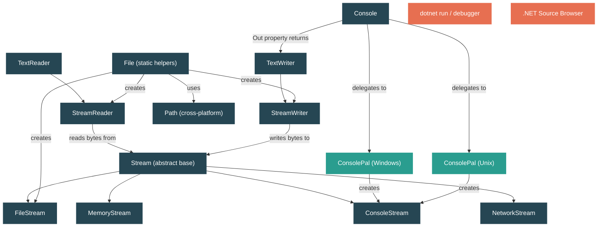

# Level 1: Foundations — Basic I/O: Files, Console, and Streams

> **Target profile:** Developer who uses `File.ReadAllText` and `Console.WriteLine` but doesn't understand the Stream abstraction beneath them
> **Estimated effort:** 3 hours
> **Prerequisites:** [Modules 1.1–1.5](01-foundations-ecosystem-overview.md)
> [Version en espanol](../es/01-foundations-basic-io.md)

---

## Learning Objectives

By the end of this module you will be able to:

1. **Explain the `Stream` abstraction** and why it is the foundation of all I/O in .NET.
2. **Trace what `Console.WriteLine` does** from the managed call through `ConsolePal` down to the operating-system handle.
3. **Distinguish between `File` convenience methods and `FileStream`-based approaches** and articulate when each is appropriate.
4. **Identify platform-specific I/O implementations** (Windows vs Unix) in the `dotnet/runtime` source and explain why they are separated.
5. **Use `StreamReader` and `StreamWriter`** and understand the role of encoding in bridging bytes and characters.
6. **Describe the relationship between `TextWriter`, `StreamWriter`, and `Stream`** in the Console output pipeline.
7. **Use `System.IO.Path`** correctly for cross-platform path manipulation.
8. **Apply the dispose pattern** to streams and explain why failing to do so causes resource leaks.

---

## Concept Map



---

## Curriculum

### Lesson 1 — Console.WriteLine: Tracing the Call

#### What you'll learn
How a single line of C# — `Console.WriteLine("hello")` — travels through four layers of abstraction before bytes reach your terminal.

#### The concept

When you call `Console.WriteLine(string)`, the runtime does not directly invoke an operating-system function. Instead, a chain of objects cooperates:

1. **`Console.WriteLine`** (in `Console.cs`, line ~858) calls `Out.WriteLine(value)`.
2. **`Console.Out`** is a `TextWriter` — specifically a `StreamWriter` wrapped by `TextWriter.Synchronized(...)`. It is lazily initialized the first time `Out` is accessed (line ~209): `CreateOutputWriter(ConsolePal.OpenStandardOutput())`.
3. **`CreateOutputWriter`** (line ~237) builds a `StreamWriter` with `AutoFlush = true`, a 256-byte buffer, and the current `OutputEncoding` with its BOM preamble removed.
4. **`ConsolePal.OpenStandardOutput()`** is the platform-specific entry point.
   - On **Windows**, it calls `Interop.Kernel32.GetStdHandle(STD_OUTPUT_HANDLE)` and returns a `WindowsConsoleStream` (line ~70 in `ConsolePal.Windows.cs`).
   - On **Unix**, it opens file-descriptor 1 via `SafeFileHandle` and returns a `UnixConsoleStream` (line ~54 in `ConsolePal.Unix.cs`).
5. The `StreamWriter.Write` method encodes the string to bytes using the `Encoding`, then calls `Stream.Write(byte[], ...)` on the underlying `ConsoleStream`.
6. The `ConsoleStream` subclass calls the OS — `WriteFile` on Windows, `write(2)` on Unix.

The key insight: **`Console.Out` is just a `StreamWriter` wrapping a platform-specific `Stream`**. There is nothing magical about console output — it follows the exact same Stream abstraction as file or network I/O.

#### In the source code

| File | What to look at |
|---|---|
| `src/libraries/System.Console/src/System/Console.cs` | `Out` property (line ~188), `CreateOutputWriter` (line ~237), `WriteLine` (line ~858) |
| `src/libraries/System.Console/src/System/ConsolePal.Windows.cs` | `OpenStandardOutput()` (line ~34), `GetStandardFile` (line ~55), `WindowsConsoleStream` |
| `src/libraries/System.Console/src/System/ConsolePal.Unix.cs` | `OpenStandardOutput()` (line ~52), `UnixConsoleStream` |
| `src/libraries/System.Console/src/System/ConsolePal.Unix.ConsoleStream.cs` | `UnixConsoleStream.Write` (line ~49) — the final call before the OS |
| `src/libraries/System.Console/src/System/IO/ConsoleStream.cs` | Abstract `ConsoleStream` base class — sets `CanRead`/`CanWrite` based on `FileAccess` |

#### Hands-on exercise

1. Create a new console application: `dotnet new console -n TraceConsole`.
2. Set a breakpoint on `Console.WriteLine("hello")`.
3. Using your IDE's "Step Into" feature (make sure "Enable .NET Framework source stepping" or "Source Link" is on), step through the call until you reach the `StreamWriter.Write` method.
4. In the debugger, inspect `Console.Out` — note its type is `TextWriter+SyncTextWriter`. Expand its fields to find the inner `StreamWriter` and the `_stream` field inside it.
5. **Question to answer:** What is the `_encoding` field set to? What is the `_autoFlush` value?

#### Key takeaway

`Console.WriteLine` is syntactic sugar over a `StreamWriter` that wraps a platform-specific `Stream` connected to the OS standard output handle. There are no special "console" APIs at the managed level — just the universal Stream + TextWriter pattern.

---

### Lesson 2 — The Stream Abstraction

#### What you'll learn
Why `System.IO.Stream` is the universal I/O contract in .NET and what its core operations mean.

#### The concept

`Stream` is an abstract class that represents a sequence of bytes you can read from, write to, or both. It is declared in `System.IO.Stream` and inherits from `MarshalByRefObject`, implementing both `IDisposable` and `IAsyncDisposable`.

The **core contract** consists of these abstract members:

| Member | Purpose |
|---|---|
| `bool CanRead` | Can this stream be read from? |
| `bool CanWrite` | Can this stream be written to? |
| `bool CanSeek` | Can you jump to arbitrary positions? |
| `long Length` | Total size of the stream (if seekable) |
| `long Position` | Current read/write head (if seekable) |
| `int Read(byte[], int, int)` | Read bytes into a buffer, return count read |
| `void Write(byte[], int, int)` | Write bytes from a buffer |
| `long Seek(long, SeekOrigin)` | Move the read/write position |
| `void Flush()` | Push any buffered data to the underlying destination |

Every concrete stream — `FileStream`, `MemoryStream`, `NetworkStream`, `ConsoleStream`, `GZipStream` — implements this same contract. Code that accepts a `Stream` parameter works with any of them.

**Why this matters:** Because the interface is uniform, the BCL can compose streams freely. A `StreamReader` doesn't care whether its underlying stream comes from a file, a network socket, or a memory buffer. A `GZipStream` can wrap any stream to add compression. This composability is one of the most powerful patterns in .NET's I/O design.

Notice the `CopyTo` method (line ~49 in `Stream.cs`): it rents a buffer from `ArrayPool<byte>.Shared`, reads in a loop, and writes to the destination. This is a concrete example of how `Stream` enables generic, efficient data transfer between any two I/O endpoints.

The `Stream.Null` singleton (line ~16) is a stream that discards all writes and returns zero bytes on reads — the null-object pattern applied to I/O.

#### In the source code

| File | What to look at |
|---|---|
| `src/libraries/System.Private.CoreLib/src/System/IO/Stream.cs` | Class declaration (line ~14), abstract members (lines ~29-36), `CopyTo` (line ~49), `Dispose` (line ~156) |

#### Hands-on exercise

1. Write a small program that creates a `MemoryStream`, writes the bytes of "Hello, Stream!" to it using `stream.Write(bytes, 0, bytes.Length)`, resets `Position` to 0, then reads them back.
2. Now change the program to use `Stream.CopyTo` to copy from one `MemoryStream` to another.
3. **Challenge:** Create a method `void ProcessData(Stream input, Stream output)` that reads all bytes from `input` and writes them to `output`. Test it with two `MemoryStream` instances, then test it with a `FileStream` as output. Notice that you didn't need to change the method — that's the power of the abstraction.

#### Key takeaway

`Stream` is a byte-oriented, sequential I/O abstraction. Every I/O operation in .NET — files, console, network, compression, encryption — goes through this contract. Understanding `Stream` means understanding all of .NET I/O.

---

### Lesson 3 — Files: From Convenience to Control

#### What you'll learn
The three levels of file I/O in .NET: `File` static methods, `StreamReader`/`StreamWriter`, and `FileStream` — and when each is the right choice.

#### The concept

.NET provides three tiers of file access, each offering more control at the cost of more code:

**Tier 1: `File` convenience methods** — Read or write an entire file in one call.

```csharp
string content = File.ReadAllText("data.txt");           // returns the whole file as a string
string[] lines = File.ReadAllLines("data.txt");           // returns an array of lines
byte[] bytes   = File.ReadAllBytes("data.bin");            // returns raw bytes
File.WriteAllText("output.txt", "Hello");                  // writes and closes
```

If you look at `File.ReadAllText` in the source (`File.cs`, line ~649), you'll see it creates a `StreamReader` internally and calls `ReadToEnd()`:

```csharp
public static string ReadAllText(string path, Encoding encoding)
{
    Validate(path, encoding);
    using StreamReader sr = new StreamReader(path, encoding, detectEncodingFromByteOrderMarks: true);
    return sr.ReadToEnd();
}
```

These methods are great for small files and scripts. They are **not** suitable for large files because they load the entire content into memory.

**Tier 2: `StreamReader` / `StreamWriter`** — Character-oriented, line-by-line access.

`StreamReader` (declared in `StreamReader.cs`) wraps a `Stream` and adds encoding-aware character reading. It maintains a byte buffer (default 1024 bytes — see line ~27) and a character buffer, decoding bytes to characters using the configured `Encoding` and `Decoder`.

Key details from the source:
- `_stream` field (line ~30): the underlying byte stream.
- `_encoding` and `_decoder` fields (lines ~31-32): the encoding pair used for byte-to-char conversion.
- `_detectEncoding` (line ~53): whether to auto-detect encoding from a BOM at the start.
- `_closable` (line ~70): controls whether disposing the `StreamReader` also closes the underlying stream.

`StreamWriter` (declared in `StreamWriter.cs`) is the mirror image: it encodes characters to bytes and writes them to a `Stream`. Its `_autoFlush` field (line ~39) determines whether every `Write` also flushes — this is set to `true` for `Console.Out` but defaults to `false` for file writers.

**Tier 3: `FileStream`** — Byte-level access with full control.

`FileStream` (`FileStream.cs`) extends `Stream` and gives you control over file mode, access, sharing, buffer size, and async behavior. Internally, it delegates to a `FileStreamStrategy` (line ~19): the runtime selects a platform-specific strategy at construction time. The strategy hierarchy is:

- `FileStreamStrategy` (abstract base in `Strategies/FileStreamStrategy.cs`)
- `OSFileStreamStrategy` (shared OS-level logic)
- `UnixFileStreamStrategy` / `SyncWindowsFileStreamStrategy` / `AsyncWindowsFileStreamStrategy` (platform-specific)
- `BufferedFileStreamStrategy` (wraps any of the above to add user-space buffering)

#### In the source code

| File | What to look at |
|---|---|
| `src/libraries/System.Private.CoreLib/src/System/IO/File.cs` | `ReadAllText` (line ~649), `OpenText` (line ~29), `Create` (line ~62), `DefaultBufferSize` (line ~27) |
| `src/libraries/System.Private.CoreLib/src/System/IO/StreamReader.cs` | Class fields (lines ~27-70), the relationship between byte and char buffers |
| `src/libraries/System.Private.CoreLib/src/System/IO/StreamWriter.cs` | `_autoFlush` (line ~39), `_encoding` (line ~33), buffer fields |
| `src/libraries/System.Private.CoreLib/src/System/IO/FileStream.cs` | `_strategy` field (line ~19), `DefaultBufferSize` (line ~15) |
| `src/libraries/System.Private.CoreLib/src/System/IO/Strategies/FileStreamStrategy.cs` | Abstract base for all platform strategies |
| `src/libraries/System.Private.CoreLib/src/System/IO/Strategies/UnixFileStreamStrategy.cs` | Unix implementation |
| `src/libraries/System.Private.CoreLib/src/System/IO/Strategies/SyncWindowsFileStreamStrategy.cs` | Windows synchronous implementation |

#### Hands-on exercise

1. Create a text file with ~100 lines of content.
2. Write three programs that read the file:
   - **Program A:** `File.ReadAllLines()` — observe that it returns a complete `string[]`.
   - **Program B:** `using var reader = new StreamReader("file.txt"); while (reader.ReadLine() is { } line) { ... }` — observe that you process one line at a time.
   - **Program C:** `using var fs = new FileStream("file.txt", FileMode.Open, FileAccess.Read); byte[] buffer = new byte[64]; int bytesRead; while ((bytesRead = fs.Read(buffer, 0, buffer.Length)) > 0) { ... }` — observe you're reading raw bytes.
3. **Question to answer:** If the file were 2 GB, which approach would run out of memory first? Why?

#### Key takeaway

`File` static methods are wrappers around `StreamReader`/`StreamWriter`, which are themselves wrappers around `FileStream`. Each layer adds convenience but removes control. For small files use `File.*`, for line-by-line processing use `StreamReader`, for byte-level control or large files use `FileStream` directly.

---

### Lesson 4 — Platform-Specific I/O

#### What you'll learn
How .NET handles the fundamental difference between Windows and Unix I/O without exposing platform details to application code.

#### The concept

The .NET I/O libraries must work on Windows, Linux, macOS, Android, iOS, WASI, and WebAssembly. The runtime achieves this through a consistent pattern: **partial classes with platform-specific files**.

Consider how `Console` reaches the OS:

**On Windows** (`ConsolePal.Windows.cs`):
- `OpenStandardOutput()` calls `Interop.Kernel32.GetStdHandle(STD_OUTPUT_HANDLE)` to get the Win32 handle.
- It creates a `WindowsConsoleStream` that uses either `WriteFile` (for byte-based encoding) or `WriteConsole` (for Unicode) depending on whether the console is redirected and the encoding.
- Invalid path chars include `\`, `:`, `*`, `?`, `<`, `>`, `"`, `|` and control characters.

**On Unix** (`ConsolePal.Unix.cs`):
- `OpenStandardOutput()` creates a `SafeFileHandle` for file-descriptor 1 (stdout) and returns a `UnixConsoleStream`.
- `UnixConsoleStream.Write` calls `ConsolePal.WriteFromConsoleStream`, which ultimately calls `write(2)`.
- Invalid path chars include only `\0` — almost everything else is legal in a Unix path.

The same pattern applies to `System.IO.Path`:
- `Path.cs` (shared) defines the public API surface.
- `Path.Windows.cs` adds Windows-specific invalid characters and UNC path logic.
- `Path.Unix.cs` adds Unix-specific minimal restrictions.

The build system selects which platform file to compile using `Condition` attributes in the `.csproj`. You'll never see an `#if WINDOWS` in the main `Path.cs` — the separation is at the file level.

This pattern appears throughout the I/O stack:
- `FileStreamStrategy` has `UnixFileStreamStrategy`, `SyncWindowsFileStreamStrategy`, and `AsyncWindowsFileStreamStrategy`.
- `ConsolePal` has files for Windows, Unix, Android, iOS, Browser, and WASI.
- `File` has `File.cs` (shared) and delegates to `FileSystem` which has platform-specific implementations.

#### In the source code

| File | What to look at |
|---|---|
| `src/libraries/System.Console/src/System/ConsolePal.Windows.cs` | `OpenStandardOutput` (line ~34), `WindowsConsoleStream`, `GetStdHandle` calls |
| `src/libraries/System.Console/src/System/ConsolePal.Unix.cs` | `OpenStandardOutput` (line ~52), file-descriptor 1, `UnixConsoleStream` |
| `src/libraries/System.Console/src/System/ConsolePal.Unix.ConsoleStream.cs` | `Write` method (line ~49) |
| `src/libraries/System.Private.CoreLib/src/System/IO/Path.Windows.cs` | `GetInvalidFileNameChars` — 36 invalid characters (line ~15) |
| `src/libraries/System.Private.CoreLib/src/System/IO/Path.Unix.cs` | `GetInvalidFileNameChars` — only `\0` and `/` (line ~12) |
| `src/libraries/System.Private.CoreLib/src/System/IO/Strategies/UnixFileStreamStrategy.cs` | Unix file strategy |
| `src/libraries/System.Private.CoreLib/src/System/IO/Strategies/SyncWindowsFileStreamStrategy.cs` | Windows sync file strategy |

#### Hands-on exercise

1. In the .NET Source Browser (https://source.dot.net/), search for `ConsolePal` and browse all platform variants. Count how many platforms have their own implementation.
2. Write a program that prints `Path.DirectorySeparatorChar`, `Path.AltDirectorySeparatorChar`, and `Path.GetInvalidFileNameChars().Length`. Run it (or research the expected output) on Windows and Linux. Notice the differences.
3. **Question to answer:** Why does .NET use partial classes with separate files instead of `#if` preprocessor directives? (Hint: think about readability, testing, and code review.)

#### Key takeaway

Platform-specific I/O is handled by partial classes in separate files — one per platform. The build system includes only the relevant file. Application code never sees platform differences because the public API surface (`Console`, `File`, `Stream`, `Path`) is the same everywhere.

---

### Lesson 5 — Paths and the File System

#### What you'll learn
How `System.IO.Path` provides cross-platform path manipulation and why you should never concatenate strings with `"/"` or `"\\"` to build paths.

#### The concept

`System.IO.Path` (`Path.cs`) is a `static partial class` that provides methods for manipulating file system paths without touching the actual file system. Its core design principle: **paths are strings, but they have platform-specific grammar**.

Key methods and what they do:

| Method | Purpose |
|---|---|
| `Path.Combine(a, b)` | Joins two path segments using the correct separator |
| `Path.GetFullPath(path)` | Resolves a relative path to an absolute one |
| `Path.GetFileName(path)` | Extracts `"file.txt"` from `"/home/user/file.txt"` |
| `Path.GetExtension(path)` | Extracts `".txt"` |
| `Path.GetDirectoryName(path)` | Extracts `"/home/user"` |
| `Path.GetTempPath()` | Returns the OS temporary directory |
| `Path.GetRandomFileName()` | Generates a cryptographically random `"xxxxxxxx.xxx"` name |
| `Path.ChangeExtension(path, ext)` | Replaces or removes the extension |

Critical platform differences (from the source):

```
Path.DirectorySeparatorChar:      '\' on Windows, '/' on Unix
Path.AltDirectorySeparatorChar:   '/' on Windows, '/' on Unix
Path.VolumeSeparatorChar:         ':' on Windows, '/' on Unix
Path.PathSeparator:               ';' on Windows, ':' on Unix
```

These are defined via `PathInternal` constants — the `readonly` public fields in `Path.cs` (lines ~18-21) delegate to `PathInternal.DirectorySeparatorChar` etc., which are compile-time constants in platform-specific files.

**Why `Path.Combine` exists:** Naively concatenating paths with `"/"` breaks on Windows UNC paths, drive-rooted paths, and paths that already end with a separator. `Path.Combine` handles all these edge cases. Never build paths with string concatenation.

#### In the source code

| File | What to look at |
|---|---|
| `src/libraries/System.Private.CoreLib/src/System/IO/Path.cs` | Separator fields (lines ~18-21), `ChangeExtension` (line ~42), `KeyLength` for random names (line ~25) |
| `src/libraries/System.Private.CoreLib/src/System/IO/Path.Windows.cs` | `GetInvalidFileNameChars` — the full set of Windows-forbidden characters |
| `src/libraries/System.Private.CoreLib/src/System/IO/Path.Unix.cs` | `GetInvalidFileNameChars` — only `\0` and `/` forbidden, `GetFullPath` with Unix semantics |

#### Hands-on exercise

1. Write a program that:
   ```csharp
   string dir = Path.GetTempPath();
   string file = Path.GetRandomFileName();
   string full = Path.Combine(dir, file);
   Console.WriteLine($"Temp dir:  {dir}");
   Console.WriteLine($"Random:    {file}");
   Console.WriteLine($"Combined:  {full}");
   Console.WriteLine($"Extension: {Path.GetExtension(full)}");
   Console.WriteLine($"Dir name:  {Path.GetDirectoryName(full)}");
   ```
2. Try `Path.Combine("/home/user", "/etc/passwd")`. What happens? Read the docs or the source to understand why `Path.Combine` returns the second argument when it is rooted.
3. **Challenge:** Write a utility method that sanitizes a user-provided filename by replacing all characters in `Path.GetInvalidFileNameChars()` with `'_'`. Test it on both Windows-style and Unix-style invalid names.

#### Key takeaway

`Path` is a stateless utility class that manipulates path strings according to platform rules. Always use `Path.Combine` instead of string concatenation, and always use `Path.GetInvalidFileNameChars` instead of hardcoding forbidden characters. The platform-specific partial class files ensure correct behavior on each OS.

---

## Source Code Reading Guide

These files are ordered for progressive reading. Start with the files marked with a single star, then progress to two stars.

| # | File | Difficulty | What you'll learn |
|---|---|---|---|
| 1 | `src/libraries/System.Console/src/System/Console.cs` | Star | How `Out`, `Error`, and `In` are lazily initialized; how `WriteLine` delegates to `Out` |
| 2 | `src/libraries/System.Console/src/System/IO/ConsoleStream.cs` | Star | The platform-agnostic abstract base for console streams |
| 3 | `src/libraries/System.Console/src/System/ConsolePal.Windows.cs` | Star | How Windows standard handles are obtained via `GetStdHandle` |
| 4 | `src/libraries/System.Console/src/System/ConsolePal.Unix.cs` | Star | How Unix file descriptors 0/1/2 become managed `Stream` objects |
| 5 | `src/libraries/System.Private.CoreLib/src/System/IO/Stream.cs` | Star-Star | The complete `Stream` abstract base — all abstract members, `CopyTo`, `Dispose`, async methods |
| 6 | `src/libraries/System.Private.CoreLib/src/System/IO/File.cs` | Star | Convenience methods and how they delegate to `StreamReader`/`FileStream` |
| 7 | `src/libraries/System.Private.CoreLib/src/System/IO/FileStream.cs` | Star-Star | The `_strategy` pattern — how `FileStream` delegates to platform-specific strategies |
| 8 | `src/libraries/System.Private.CoreLib/src/System/IO/Path.cs` | Star | Separator constants and stateless path manipulation |

---

## Diagnostic Tools

At Level 1, you'll use these tools to explore I/O behavior:

| Tool | What it helps you see |
|---|---|
| **Debugger (Visual Studio / VS Code + Source Link)** | Step into BCL code to see `Console.Out` initialization, `StreamWriter.Write`, `FileStream.Read` |
| **`dotnet run`** | Execute console programs and observe standard output/error |
| **File system explorer** | Verify that files created by `File.WriteAllText` or `FileStream` appear with expected content and encoding |
| **`hexdump` / hex editor** | Inspect raw bytes written to files to verify encoding (UTF-8 BOM, line endings) |
| **`Console.OutputEncoding`** | Print this at runtime to see what encoding your console is using |

**Tip:** To step into BCL source from Visual Studio, go to **Tools > Options > Debugging > General** and enable **"Enable .NET Framework source stepping"** and **"Enable Source Link support"**. In VS Code, the C# extension supports Source Link navigation automatically.

---

## Self-Assessment

### Knowledge check

1. **What type does `Console.Out` return?** Explain why it is a `TextWriter` rather than a `StreamWriter` or a `Stream`.

2. **What is the difference between `Stream.Flush()` and `Stream.Dispose()`?** When would you call each?

3. **Why does `File.ReadAllText` create a `StreamReader` internally** instead of using `FileStream` directly?

4. **If you forget to dispose a `FileStream`**, what resource is leaked? How would you eventually notice?

5. **How does .NET decide whether to use `SyncWindowsFileStreamStrategy` or `AsyncWindowsFileStreamStrategy`?** (Hint: look at the `isAsync` parameter and `FileOptions.Asynchronous`.)

6. **What is the value of `Path.GetInvalidFileNameChars().Length` on Windows vs Unix?** Why is the difference so large?

### Practical challenge

Write a program called `FileCopy` that:
1. Accepts a source path and destination path from command-line arguments.
2. Opens the source as a `FileStream` with `FileAccess.Read`.
3. Opens the destination as a `FileStream` with `FileMode.Create`.
4. Copies data using a manual `byte[]` buffer of 8192 bytes in a loop (do NOT use `Stream.CopyTo` — the point is to practice the Read/Write loop).
5. Properly disposes both streams using `using` statements.
6. Prints the number of bytes copied.

Then refactor the program to use `Stream.CopyTo` and compare the code. Reflect on what `CopyTo` does internally (hint: look at `Stream.cs` line ~49 — it uses `ArrayPool<byte>.Shared.Rent` and the same Read/Write loop).

---

## Connections

| Direction | Module | Relationship |
|---|---|---|
| **Previous** | [1.5 — Assemblies, Namespaces, and the Loader](01-foundations-assemblies.md) | Assemblies contain the types like `Stream` and `File` that you now understand |
| **Next** | [1.7 — Your First Look at the Runtime Source](01-foundations-first-source-reading.md) | You'll apply source-reading skills developed here across the whole repository |
| **Related** | [1.3 — The Type System](01-foundations-type-system.md) | `IDisposable` (the dispose pattern for streams) is a fundamental type-system concept |
| **Forward** | [2.9 — The IDisposable Contract](02-practitioner-disposable.md) | Deep dive into why `using` matters for Stream-based resources |
| **Forward** | [3.5 — System.IO.Pipelines](03-advanced-pipelines.md) | The high-performance evolution of the Stream pattern |

---

## Glossary

| Term | Definition |
|---|---|
| **Stream** | Abstract base class (`System.IO.Stream`) representing a sequence of bytes that can be read, written, or seeked. The universal I/O contract in .NET. |
| **FileStream** | Concrete `Stream` implementation for reading/writing files on disk. Delegates to platform-specific strategies internally. |
| **MemoryStream** | A `Stream` backed by an in-memory byte array rather than an external resource. Useful for testing and in-memory I/O. |
| **TextReader / TextWriter** | Abstract classes for character-oriented (not byte-oriented) I/O. `StreamReader` and `StreamWriter` bridge `TextReader`/`TextWriter` to `Stream`. |
| **StreamReader** | Reads characters from a `Stream` using a specified encoding. Handles BOM detection, buffering, and byte-to-char decoding. |
| **StreamWriter** | Writes characters to a `Stream` using a specified encoding. Handles char-to-byte encoding and optional auto-flush. |
| **Encoding** | Defines a mapping between characters and bytes (e.g., UTF-8, UTF-16). `StreamReader` and `StreamWriter` use an `Encoding` to convert between the two. |
| **Buffer** | A temporary byte or char array used to batch I/O operations for efficiency. Both `StreamReader` (1024-byte default) and `FileStream` (4096-byte default) maintain internal buffers. |
| **Flush** | Forces buffered data to be written to the underlying stream or device. Auto-flush mode (`StreamWriter.AutoFlush = true`) flushes after every write. |
| **Dispose** | Releases unmanaged resources (file handles, OS descriptors) held by a stream. The `using` statement calls `Dispose()` automatically. Failing to dispose leaks handles. |
| **Platform abstraction** | The pattern of using partial classes with platform-specific files (`.Windows.cs`, `.Unix.cs`) so that a single public API works across all operating systems. |
| **ConsolePal** | The internal platform-abstraction layer for console I/O. Separate implementations exist for Windows, Unix, Android, iOS, Browser, and WASI. |
| **FileStreamStrategy** | The internal strategy pattern used by `FileStream` to delegate to platform-specific file I/O implementations. |
| **ConsoleStream** | Abstract internal base class for platform-specific console I/O streams (`WindowsConsoleStream`, `UnixConsoleStream`). |

---

## References

| Resource | Type | Relevance |
|---|---|---|
| [.NET Source Browser — System.IO.Stream](https://source.dot.net/#System.Private.CoreLib/src/libraries/System.Private.CoreLib/src/System/IO/Stream.cs) | Source | Browse the complete `Stream` class with cross-references |
| [.NET Source Browser — System.Console](https://source.dot.net/#System.Console/src/System/Console.cs) | Source | Browse console implementation with all platform variants |
| [Microsoft Docs — File and Stream I/O](https://learn.microsoft.com/en-us/dotnet/standard/io/) | Docs | Official overview of the I/O type hierarchy |
| [Microsoft Docs — How to: Read and Write to a Newly Created Data File](https://learn.microsoft.com/en-us/dotnet/standard/io/how-to-read-and-write-to-a-newly-created-data-file) | Tutorial | Step-by-step guide using `FileStream`, `BinaryWriter`, `BinaryReader` |
| [Stephen Toub — Performance Improvements in .NET (series)](https://devblogs.microsoft.com/dotnet/) | Blog | Covers `FileStream` strategy refactoring, `RandomAccess`, and other I/O performance improvements |
| [Book of the Runtime](https://github.com/dotnet/runtime/tree/main/docs/design/coreclr/botr) | Deep docs | Background on how the runtime interacts with the OS |

---

*Last updated: 2026-04-14*
