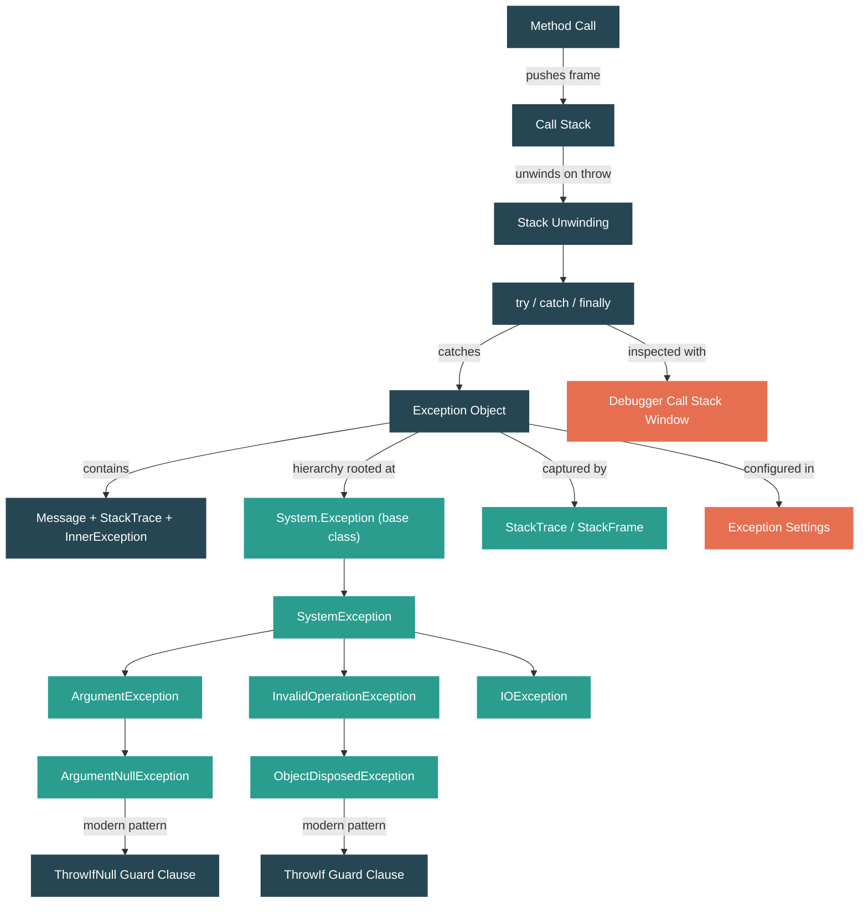

# Level 1: Foundations -- Control Flow, Exceptions, and the Call Stack

> **Target profile:** Developer who uses try/catch but doesn't understand the exception machinery
> **Estimated effort:** 3 hours
> **Prerequisites:** [Modules 1.1--1.3](01-foundations-ecosystem-overview.md)
> [Version en espanol](../es/01-foundations-control-flow.md)

---

## Learning Objectives

By the end of this module, you will be able to:

1. Explain how method calls build and unwind the call stack, frame by frame.
2. Navigate the `System.Exception` class hierarchy in the `dotnet/runtime` source code.
3. Describe the key properties every exception carries: `Message`, `StackTrace`, `InnerException`, `HResult`.
4. Distinguish between exception families (`ArgumentException`, `InvalidOperationException`, `IOException`) and know when to use each.
5. Trace the flow of a `throw` through `try`/`catch`/`finally` blocks and predict execution order.
6. Use the modern `ThrowIf` guard-clause patterns (`ArgumentNullException.ThrowIfNull`, `ObjectDisposedException.ThrowIf`).
7. Explain why exceptions are expensive relative to normal control flow and identify alternatives.
8. Read a stack trace to locate the origin of an error in both your code and framework code.
9. Use Visual Studio's Exception Settings and Call Stack window to diagnose exceptions during debugging.

---

## Concept Map



**Legend:** Dark teal = concept, Green = source file/class, Coral = tool

---

## Lesson 1: The Call Stack -- What It Is and How It Works

### What you'll learn

How method calls create a chain of stack frames, and why this chain matters for understanding exceptions.

### The concept

Every time you call a method in C#, the runtime pushes a **stack frame** onto the **call stack**. A stack frame holds:

- The return address (where to go back when the method finishes)
- The method's local variables
- The method's parameters
- Temporary values used during computation

The call stack is a Last-In-First-Out (LIFO) structure. When method `A` calls method `B`, which calls method `C`, the stack looks like this:

```
Top of stack
+-----------+
|  Frame C  |  <-- currently executing
+-----------+
|  Frame B  |
+-----------+
|  Frame A  |
+-----------+
|   Main    |
+-----------+
Bottom of stack
```

When `C` finishes (returns), its frame is **popped** off the stack, and execution resumes in `B`. This process repeats until you're back at the entry point.

If the call stack grows too deep -- for instance, a method that calls itself recursively without a base case -- you exhaust the available stack space and get a `StackOverflowException`. This is one of the few exceptions you **cannot catch** in .NET: the runtime terminates the process.

### In the source code

Open `src/libraries/System.Private.CoreLib/src/System/StackOverflowException.cs`. Notice how compact it is:

```csharp
public sealed class StackOverflowException : SystemException
{
    public StackOverflowException()
        : base(SR.Arg_StackOverflowException)
    {
        HResult = HResults.COR_E_STACKOVERFLOW;
    }
}
```

Key observations:
- It's `sealed` -- you cannot derive from it. The runtime controls when this exception is thrown.
- It inherits from `SystemException`, which inherits from `Exception`. This is the standard hierarchy.
- It sets an `HResult`, which is a COM-era error code. Every exception type has one.

Now open `src/libraries/System.Private.CoreLib/src/System/Diagnostics/StackFrame.cs`. The `StackFrame` class represents a single frame in the call stack:

```csharp
public partial class StackFrame
{
    private MethodBase? _method;       // Which method this frame is in
    private int _nativeOffset;         // Offset within the native (JIT-compiled) code
    private int _ilOffset;             // Offset within the IL code
    private string? _fileName;         // Source file (if debug info available)
    private int _lineNumber;           // Source line number
    private int _columnNumber;         // Source column number
}
```

Each `StackFrame` stores exactly the information you see when you read a stack trace: the method, the file, and the line number.

### Hands-on exercise

1. Create a console app with three methods that call each other: `Main` -> `MethodA` -> `MethodB`.
2. In `MethodB`, add: `Console.WriteLine(Environment.StackTrace);`
3. Run the app and read the output. Identify each stack frame. How many frames are there beyond your three methods?
4. Set a breakpoint in `MethodB` and open the **Call Stack** window in your debugger. Compare it with the text output.

### Key takeaway

The call stack is a living record of "how did I get here?" Every method call pushes a frame; every return pops one. When something goes wrong, this chain is what tells you the story.

### Common misconception

> "The call stack and the heap are the same thing."

They are completely different memory areas. The stack holds method frames (local variables, return addresses) and is managed automatically as methods enter and exit. The heap holds objects created with `new` and is managed by the garbage collector. You explored the heap in Module 1.3; the call stack is its counterpart for execution flow.

---

## Lesson 2: System.Exception -- Anatomy of an Error

### What you'll learn

What information an exception object carries and how the `Exception` base class is structured in the runtime source.

### The concept

When something goes wrong, .NET represents the error as an **exception object** -- an instance of `System.Exception` or one of its subclasses. Every exception carries these key properties:

| Property | Type | What it tells you |
|---|---|---|
| `Message` | `string` | A human-readable description of what went wrong |
| `StackTrace` | `string?` | The call stack at the point the exception was thrown |
| `InnerException` | `Exception?` | A wrapped lower-level exception (the original cause) |
| `Source` | `string?` | The assembly name where the exception originated |
| `HResult` | `int` | A COM-compatible numeric error code |
| `Data` | `IDictionary` | An arbitrary key-value bag for extra context |
| `TargetSite` | `MethodBase?` | The method that threw the exception |

The `StackTrace` property is **not populated when you create the exception** -- it's filled in when you `throw` it. This is an important detail: constructing an exception is just creating an object; throwing it triggers the runtime's stack-walking machinery.

### In the source code

Open `src/libraries/System.Private.CoreLib/src/System/Exception.cs`. Look at the constructors (lines 20-41):

```csharp
public Exception()
{
    _HResult = HResults.COR_E_EXCEPTION;
}

public Exception(string? message)
    : this()
{
    _message = message;
}

// Creates a new Exception.  All derived classes should
// provide this constructor.
// Note: the stack trace is not started until the exception
// is thrown
public Exception(string? message, Exception? innerException)
    : this()
{
    _message = message;
    _innerException = innerException;
}
```

Notice the comment: *"the stack trace is not started until the exception is thrown."* This confirms that construction and throwing are separate operations.

Now look at the `StackTrace` property (line 208):

```csharp
public virtual string? StackTrace
{
    get
    {
        string? stackTraceString = _stackTraceString;
        string? remoteStackTraceString = _remoteStackTraceString;

        // if no stack trace, try to get one
        if (stackTraceString != null)
        {
            return remoteStackTraceString + stackTraceString;
        }
        // ...
    }
}
```

And the `ToString()` method (line 124) which assembles the full text you see in logs:

```csharp
public override string ToString()
{
    string className = GetClassName();
    string? message = Message;
    string innerExceptionString = _innerException?.ToString() ?? "";
    // ...builds: "ClassName: Message ---> InnerException\n   --- End ---\nStackTrace"
}
```

The `" ---> "` prefix for inner exceptions is defined as a constant:

```csharp
private protected const string InnerExceptionPrefix = " ---> ";
```

This is the literal string you see in exception output when inner exceptions are present.

### Hands-on exercise

1. Write this code and predict what each `Console.WriteLine` will print before running it:

```csharp
var ex = new InvalidOperationException("Something broke");
Console.WriteLine(ex.StackTrace is null);  // What do you expect?

try
{
    throw ex;
}
catch (Exception caught)
{
    Console.WriteLine(caught.StackTrace is null);  // What now?
    Console.WriteLine(caught.Message);
    Console.WriteLine(caught.GetType().FullName);
}
```

2. Now modify the code to wrap an inner exception:

```csharp
try
{
    try
    {
        int.Parse("not-a-number");
    }
    catch (FormatException fe)
    {
        throw new InvalidOperationException("Failed to parse config", fe);
    }
}
catch (Exception ex)
{
    Console.WriteLine(ex.ToString());
}
```

Read the output carefully. Find the `" ---> "` separator and identify both stack traces.

### Key takeaway

An exception is a regular C# object with well-defined properties. The stack trace is captured at `throw` time, not construction time. The `InnerException` chain lets you preserve the original cause when you wrap and rethrow.

---

## Lesson 3: The Exception Hierarchy -- Choosing the Right Exception

### What you'll learn

How exceptions are organized in a class hierarchy, and how to pick the right exception type when writing your own code.

### The concept

.NET exceptions form an inheritance tree rooted at `System.Exception`:

```
Exception
  +-- SystemException
  |     +-- ArgumentException
  |     |     +-- ArgumentNullException
  |     |     +-- ArgumentOutOfRangeException
  |     +-- InvalidOperationException
  |     |     +-- ObjectDisposedException
  |     +-- IOException
  |     |     +-- FileNotFoundException
  |     |     +-- DirectoryNotFoundException
  |     +-- NullReferenceException
  |     +-- IndexOutOfRangeException
  |     +-- StackOverflowException
  |     +-- OutOfMemoryException
  |     +-- NotSupportedException
  |     +-- NotImplementedException
  +-- ApplicationException  (historical; avoid in new code)
```

The key families and when to use them:

| Family | When to throw | Example |
|---|---|---|
| `ArgumentException` / subclasses | A method received an invalid argument | `ThrowIfNull`, value out of expected range |
| `InvalidOperationException` | The object is in a state where this operation doesn't make sense | Calling `Start()` on an already-started timer |
| `ObjectDisposedException` | You called a method on an object that's been disposed | Using a `Stream` after calling `Dispose()` |
| `IOException` / subclasses | An I/O operation failed | File not found, disk full, network error |
| `NotSupportedException` | The operation is inherently unsupported | Calling `Write()` on a read-only stream |
| `NotImplementedException` | The code hasn't been written yet (placeholder) | A TODO stub in development |

**Rule of thumb:** Pick the most specific exception type that accurately describes the problem. Catch the most general type that you can meaningfully handle.

### In the source code

Open `src/libraries/System.Private.CoreLib/src/System/ArgumentException.cs`. Notice the extra `_paramName` field (line 18):

```csharp
public class ArgumentException : SystemException
{
    private readonly string? _paramName;
```

This field exists because argument exceptions should tell you *which* parameter was wrong. The `Message` property (line 73) appends it:

```csharp
public override string Message
{
    get
    {
        SetMessageField();
        string s = base.Message;
        if (!string.IsNullOrEmpty(_paramName))
        {
            s += " " + SR.Format(SR.Arg_ParamName_Name, _paramName);
        }
        return s;
    }
}
```

Now open `src/libraries/System.Private.CoreLib/src/System/InvalidOperationException.cs`. It's much simpler -- just the standard three constructors and an `HResult`:

```csharp
public class InvalidOperationException : SystemException
{
    public InvalidOperationException()
        : base(SR.Arg_InvalidOperationException)
    {
        HResult = HResults.COR_E_INVALIDOPERATION;
    }
}
```

Compare with `src/libraries/System.Private.CoreLib/src/System/ObjectDisposedException.cs`. It inherits from `InvalidOperationException` (not directly from `SystemException`) and adds an `_objectName` field:

```csharp
public class ObjectDisposedException : InvalidOperationException
{
    private readonly string? _objectName;
```

This means `catch (InvalidOperationException)` will also catch `ObjectDisposedException` -- the inheritance hierarchy matters for catch blocks.

### Hands-on exercise

1. Open the three files mentioned above in your editor. Trace the inheritance chain from `ObjectDisposedException` up to `Exception`. Write it out: `ObjectDisposedException` -> `InvalidOperationException` -> `SystemException` -> `Exception`.

2. Write a method that validates its inputs and throws the appropriate exception types:

```csharp
public static decimal CalculateDiscount(string productName, decimal price, decimal discountPercent)
{
    // Validate: productName not null/empty, price > 0, discountPercent 0-100
    // Use the right exception type for each case
}
```

3. Write a test with two catch blocks:

```csharp
try
{
    // call CalculateDiscount with bad arguments
}
catch (ArgumentNullException ex)
{
    Console.WriteLine($"Null argument: {ex.ParamName}");
}
catch (ArgumentException ex)
{
    Console.WriteLine($"Bad argument: {ex.ParamName} - {ex.Message}");
}
```

Why does the order of catch blocks matter? What happens if you swap them?

### Key takeaway

The exception hierarchy is a tree. Catch blocks match from most specific to most general. When throwing, pick the most specific type. When catching, catch the broadest type you can meaningfully handle.

---

## Lesson 4: try/catch/finally and Stack Unwinding

### What you'll learn

What exactly happens at runtime when an exception is thrown, and how `try`/`catch`/`finally` interact.

### The concept

When a `throw` statement executes, the runtime begins **stack unwinding** -- a two-phase process:

**Phase 1: Find a handler**
The runtime walks up the call stack, frame by frame, looking for a `catch` block whose exception type matches (or is a base class of) the thrown exception. If no handler is found anywhere on the stack, the runtime calls `Environment.FailFast` and terminates the process.

**Phase 2: Unwind to the handler**
Once a matching handler is found, the runtime unwinds the stack from the throw point to the handler. During unwinding:
- Each `finally` block on the path is executed, in order from innermost to outermost
- Local variables in unwound frames become unreachable (eligible for GC)
- The `catch` block's variable receives the exception object

Here's the execution order for a throw:

```csharp
void MethodA()
{
    try
    {
        Console.WriteLine("1: Before call");
        MethodB();
        Console.WriteLine("2: After call");     // SKIPPED
    }
    catch (Exception ex)
    {
        Console.WriteLine("5: Caught in A");
    }
    finally
    {
        Console.WriteLine("6: Finally in A");
    }
}

void MethodB()
{
    try
    {
        Console.WriteLine("3: Before throw");
        throw new InvalidOperationException("boom");
        Console.WriteLine("NEVER: After throw"); // UNREACHABLE
    }
    finally
    {
        Console.WriteLine("4: Finally in B");
    }
}
```

Execution order: 1 -> 3 -> 4 -> 5 -> 6. Points "2" and "NEVER" are never reached.

Key rules:
- `finally` blocks **always** execute (except if the process is killed or `Environment.FailFast` is called).
- You can have `try`/`finally` without a `catch` -- useful for cleanup code.
- You can rethrow with `throw;` (preserves original stack trace) vs `throw ex;` (resets stack trace -- almost always wrong).
- `when` filters on catch blocks let you conditionally handle: `catch (IOException ex) when (ex.HResult == -2147024864)`.

### In the source code

Look at `src/coreclr/System.Private.CoreLib/src/System/Environment.CoreCLR.cs` (line 39):

```csharp
[DoesNotReturn]
public static void FailFast(string? message)
{
    // Note: The CLR's Watson bucketization code looks at the our caller
    // to assign blame for crashes.
```

`Environment.FailFast` is the "nuclear option" -- it terminates the process immediately without running `finally` blocks. It's used when the application detects a state so corrupt that continuing is dangerous.

Also notice the `[DoesNotReturn]` attribute -- this tells the compiler that any code after a call to `FailFast` is unreachable, which prevents false warnings about uninitialized variables.

### Hands-on exercise

1. Predict the output of this code, then run it to verify:

```csharp
static void Main()
{
    try
    {
        Console.WriteLine("A");
        try
        {
            Console.WriteLine("B");
            throw new InvalidOperationException();
        }
        catch (ArgumentException)  // Does NOT match
        {
            Console.WriteLine("C");
        }
        finally
        {
            Console.WriteLine("D");
        }
        Console.WriteLine("E");
    }
    catch (Exception)
    {
        Console.WriteLine("F");
    }
    finally
    {
        Console.WriteLine("G");
    }
    Console.WriteLine("H");
}
```

2. Now modify the inner catch to use `catch (InvalidOperationException)`. How does the output change?

3. Experiment with rethrowing. Add this inside the inner catch:

```csharp
catch (InvalidOperationException ex)
{
    Console.WriteLine("Caught inner");
    throw;  // vs: throw ex;  vs: throw new Exception("wrapped", ex);
}
```

Observe the stack trace differences for each approach.

### Key takeaway

Stack unwinding is orderly: the runtime finds the handler first, then unwinds frame by frame, running `finally` blocks along the way. Use `throw;` (not `throw ex;`) to preserve the original stack trace. Use `finally` for cleanup that must happen regardless of success or failure.

### Common misconception

> "`catch (Exception)` catches everything."

Almost. It catches all managed exceptions. But `StackOverflowException` and some native exceptions (access violations, for example) may terminate the process before your catch block runs. The runtime treats these as **corrupted state exceptions** and does not deliver them to managed `catch` blocks by default.

---

## Lesson 5: Modern Patterns -- ThrowIf and Guard Clauses

### What you'll learn

The modern .NET pattern for input validation using static `ThrowIf` methods, why it exists, and how it reduces code size.

### The concept

A **guard clause** is a validation check at the beginning of a method that rejects bad input early:

```csharp
// Traditional guard clause
public void Process(string name)
{
    if (name is null)
        throw new ArgumentNullException(nameof(name));

    // ... main logic
}
```

Starting with .NET 6, the BCL introduced static `ThrowIf` methods on common exception types:

```csharp
// Modern guard clause
public void Process(string name)
{
    ArgumentNullException.ThrowIfNull(name);

    // ... main logic
}
```

Why the change? Three reasons:

1. **Less code at the call site.** The `ThrowIfNull` method is a tiny check (`if (argument is null) Throw(paramName)`) that the JIT can inline. The `throw new ...` path is kept in a separate non-inlined method. This matters because methods containing `throw` statements are harder for the JIT to optimize.

2. **Automatic parameter names.** The `[CallerArgumentExpression]` attribute automatically captures the name of the argument you passed, so you don't need `nameof()`.

3. **Consistency.** Every method in the BCL uses the same pattern, making the codebase uniform and easy to audit.

### In the source code

Open `src/libraries/System.Private.CoreLib/src/System/ArgumentNullException.cs` (lines 54-61):

```csharp
[Intrinsic] // Tier0 intrinsic to avoid redundant boxing in generics
public static void ThrowIfNull(
    [NotNull] object? argument,
    [CallerArgumentExpression(nameof(argument))] string? paramName = null)
{
    if (argument is null)
    {
        Throw(paramName);
    }
}
```

Notice these attributes:
- `[Intrinsic]` -- The JIT recognizes this method and can optimize it specially at Tier 0 compilation.
- `[NotNull]` -- After `ThrowIfNull` returns, the compiler knows `argument` is not null (flow analysis).
- `[CallerArgumentExpression]` -- The compiler fills in `paramName` with the text of whatever you passed as `argument`. If you write `ThrowIfNull(myVar)`, `paramName` becomes `"myVar"` automatically.

The actual throw is in a separate method (line 96):

```csharp
[DoesNotReturn]
internal static void Throw(string? paramName) =>
    throw new ArgumentNullException(paramName);
```

The `[DoesNotReturn]` attribute tells the compiler this method never returns normally. Separating the throw into its own method is intentional: it keeps the fast path (argument is not null) small and inlinable.

Now open `src/libraries/System.Private.CoreLib/src/System/ObjectDisposedException.cs` (lines 56-63):

```csharp
[StackTraceHidden]
public static void ThrowIf([DoesNotReturnIf(true)] bool condition, object instance)
{
    if (condition)
    {
        ThrowHelper.ThrowObjectDisposedException(instance);
    }
}
```

Note the `[StackTraceHidden]` attribute. This means the `ThrowIf` method itself won't appear in the stack trace -- the trace will show the method that called `ThrowIf`, which is exactly where the problem is.

Also note that `ArgumentException` (lines 104-110) provides `ThrowIfNullOrEmpty` and `ThrowIfNullOrWhiteSpace`:

```csharp
public static void ThrowIfNullOrEmpty(
    [NotNull] string? argument,
    [CallerArgumentExpression(nameof(argument))] string? paramName = null)
{
    if (string.IsNullOrEmpty(argument))
    {
        ThrowNullOrEmptyException(argument, paramName);
    }
}
```

### The ThrowHelper pattern

Open `src/libraries/System.Private.CoreLib/src/System/ThrowHelper.cs`. Read the comment at the top of the file (lines 5-31):

```
// This file defines an internal static class used to throw exceptions in BCL code.
// The main purpose is to reduce code size.
//
// The old way to throw an exception generates quite a lot IL code and assembly code.
// Following is an example:
//     C# source
//          throw new ArgumentNullException(nameof(key), SR.ArgumentNull_Key);
//     IL code:
//          IL_0003:  ldstr      "key"
//          IL_0008:  ldstr      "ArgumentNull_Key"
//          IL_000d:  call       string System.Environment::GetResourceString(string)
//          IL_0012:  newobj     instance void System.ArgumentNullException::.ctor(string,string)
//          IL_0017:  throw
//    which is 21bytes in IL.
//
// So we want to get rid of the ldstr and call to Environment.GetResource in IL.
// ...
// The IL code will be 7 bytes.
```

The `ThrowHelper` class is marked with `[StackTraceHidden]` so it never appears in stack traces. This is an internal optimization pattern -- you'll see it used heavily throughout the BCL.

### Hands-on exercise

1. Refactor this method to use modern guard clauses:

```csharp
public void SendEmail(string to, string subject, string body)
{
    if (to == null) throw new ArgumentNullException(nameof(to));
    if (string.IsNullOrEmpty(subject)) throw new ArgumentException("Subject cannot be empty", nameof(subject));
    if (body == null) throw new ArgumentNullException(nameof(body));

    // ...send logic
}
```

2. Write a class with a `bool _disposed` field and a method that uses `ObjectDisposedException.ThrowIf`:

```csharp
public class MyResource : IDisposable
{
    private bool _disposed;

    public void DoWork()
    {
        ObjectDisposedException.ThrowIf(_disposed, this);
        // ...work
    }

    public void Dispose()
    {
        _disposed = true;
    }
}
```

Call `DoWork()` after `Dispose()` and read the exception message. What does it say? Where does the stack trace point?

3. In the `dotnet/runtime` source, search for uses of `ArgumentNullException.ThrowIfNull` in `Exception.cs` itself (hint: look at the serialization constructor on line 47). Why does even the `Exception` class use this pattern?

### Key takeaway

The `ThrowIf` pattern is not just syntactic sugar -- it's a deliberate design for performance (smaller IL at call sites, better JIT inlining) and correctness (automatic parameter names, null-state flow analysis). When writing validation code, prefer these static methods over manual `if`/`throw`.

---

## Source Code Reading Guide

These files are ordered from easiest to most complex. Start with the ones marked with a single star.

| File | Difficulty | What you'll learn |
|---|---|---|
| `src/libraries/System.Private.CoreLib/src/System/InvalidOperationException.cs` | * | Simplest exception class -- just constructors and an HResult |
| `src/libraries/System.Private.CoreLib/src/System/StackOverflowException.cs` | * | A `sealed` exception the runtime throws -- you can't subclass it |
| `src/libraries/System.Private.CoreLib/src/System/SystemException.cs` | * | The base class sitting between `Exception` and most framework exceptions |
| `src/libraries/System.Private.CoreLib/src/System/ArgumentNullException.cs` | ** | The `ThrowIfNull` pattern with `[CallerArgumentExpression]` and `[Intrinsic]` |
| `src/libraries/System.Private.CoreLib/src/System/ArgumentException.cs` | ** | The `ParamName` property and `ThrowIfNullOrEmpty` |
| `src/libraries/System.Private.CoreLib/src/System/ObjectDisposedException.cs` | ** | `ThrowIf` with `[StackTraceHidden]`, inheritance from `InvalidOperationException` |
| `src/libraries/System.Private.CoreLib/src/System/Exception.cs` | ** | The root exception class: `Message`, `StackTrace`, `InnerException`, `ToString()` |
| `src/libraries/System.Private.CoreLib/src/System/Diagnostics/StackFrame.cs` | ** | What data a single stack frame holds |
| `src/libraries/System.Private.CoreLib/src/System/Diagnostics/StackTrace.cs` | ** | How a stack trace is constructed from an array of `StackFrame` objects |
| `src/libraries/System.Private.CoreLib/src/System/Diagnostics/StackTraceHiddenAttribute.cs` | * | Small attribute that hides methods from stack traces |
| `src/libraries/System.Private.CoreLib/src/System/ThrowHelper.cs` | ** | The IL-size-reduction pattern used throughout the BCL (read the header comment) |

### Reading strategy

1. Start with `InvalidOperationException.cs` -- at ~40 lines, it's a complete exception class you can understand in 2 minutes.
2. Then read `Exception.cs` focusing on the constructors, `Message`, `StackTrace`, `InnerException`, and `ToString()`. Skip the serialization code.
3. Compare `ArgumentException.cs` and `ArgumentNullException.cs` to see how the hierarchy adds properties (`ParamName`) and behavior (`ThrowIfNull`).
4. Read the header comment in `ThrowHelper.cs` to understand the IL-size motivation.

---

## Diagnostic Tools

At this level, you need three debugger skills:

### 1. The Call Stack Window (Visual Studio / VS Code)

When you hit a breakpoint, the **Call Stack** window shows the current chain of method calls. Each line is a stack frame.

- **How to open:** Debug menu > Windows > Call Stack (or Ctrl+Alt+C in Visual Studio)
- **What to look for:** Your code frames (in normal text) vs framework code frames (grayed out). Double-click any frame to navigate to that point in the code.
- **Tip:** Right-click and select "Show External Code" to see framework frames you normally don't see.

### 2. Exception Settings

The **Exception Settings** window lets you control which exceptions break into the debugger.

- **How to open:** Debug menu > Windows > Exception Settings (or Ctrl+Alt+E)
- **First-chance exceptions:** By default, the debugger only breaks when an exception is *unhandled*. If you check a specific exception type in Exception Settings, the debugger breaks *when the exception is thrown*, even if there's a catch block. This is called a **first-chance exception** break.
- **When to use it:** You suspect an exception is being thrown and caught silently somewhere. Enable first-chance breaking for that type to find the throw site.

### 3. Reading the Exception Helper

When an exception breaks in the debugger, Visual Studio shows an **Exception Helper** popup with:
- The exception type and message
- The inner exception (if any) -- click to expand
- A "Copy Details" button that copies the full `ToString()` output

**Practice:** Deliberately throw an exception in a try/catch block, set a first-chance break on that exception type, and examine all three tools.

---

## Self-Assessment

### Knowledge check

1. **What data does a stack frame hold?** Name at least four pieces of information stored in a `StackFrame`.

2. **When is the `StackTrace` property of an exception populated?** At construction time or at throw time? What evidence in the source code confirms this?

3. **What is the inheritance chain from `ObjectDisposedException` to `Exception`?** Write out all classes in the chain.

4. **What happens to `finally` blocks during stack unwinding?** Are they guaranteed to run? When might they NOT run?

5. **What is the difference between `throw;` and `throw ex;`?** Which preserves the original stack trace?

6. **Why is `ThrowIfNull` a static method on `ArgumentNullException` rather than a standalone helper?** Name at least two benefits (hint: think about discoverability and IL size).

7. **What does the `[StackTraceHidden]` attribute do?** Name a class in the BCL that uses it.

### Practical challenge

Write a `SafeFileReader` class that:

1. Takes a file path in the constructor and validates it with `ArgumentException.ThrowIfNullOrEmpty`.
2. Has a `ReadAllText()` method that:
   - Checks disposed state with `ObjectDisposedException.ThrowIf`
   - Wraps `File.ReadAllText` in a try/catch
   - If a `FileNotFoundException` occurs, wraps it in an `InvalidOperationException` with a helpful message and the original exception as `InnerException`
3. Implements `IDisposable`.
4. Write a caller that exercises all the error paths and prints the exception details (type, message, inner exception, stack trace).

Verify that:
- The `ParamName` is correct when you pass null
- The inner exception chain is preserved when the file doesn't exist
- The `ObjectDisposedException` message includes your class name
- The stack trace does NOT include `ThrowIf` or `ThrowHelper` frames

---

## Connections

| Direction | Module | Relationship |
|---|---|---|
| Previous | [1.3 The Type System](01-foundations-type-system.md) | Exceptions are reference types allocated on the heap -- you learned about that allocation model in 1.3 |
| Next | [1.5 Assemblies, Namespaces, and the Loader](01-foundations-assemblies.md) | The `Source` property of an exception tells you which assembly threw it -- 1.5 explains how assemblies work |
| Deeper | [4.8 Exception Handling Machinery](../en/04-internals-exceptions.md) | Level 4 covers the native implementation: SEH on Windows, PAL on Unix, how the runtime actually walks the stack |

---

## Glossary

| Term | Definition |
|---|---|
| **Call stack** | The chain of method frames representing the current execution path. LIFO structure: the most recently called method is on top. |
| **Stack frame** | One entry in the call stack, corresponding to a single method invocation. Holds local variables, parameters, and the return address. |
| **Exception** | An object (instance of `System.Exception` or a subclass) that represents an error condition. Carries a message, stack trace, and optionally an inner exception. |
| **Stack unwinding** | The process of walking back up the call stack when an exception is thrown, executing `finally` blocks and popping frames until a matching `catch` is found. |
| **First-chance exception** | A debugger event that fires *when an exception is thrown*, before the runtime searches for a handler. Useful for finding hidden throws. |
| **Inner exception** | An exception stored in the `InnerException` property of another exception, representing the original cause that was wrapped. |
| **Guard clause** | A validation check at the top of a method that rejects invalid input early, typically using `ThrowIf` methods or `if`/`throw` patterns. |
| **HResult** | A 32-bit integer error code inherited from COM. Every .NET exception type has a default `HResult` value. |
| **`[DoesNotReturn]`** | An attribute that tells the compiler a method never returns normally (it always throws). Prevents false warnings about uninitialized variables. |
| **`[StackTraceHidden]`** | An attribute that causes a method or class to be omitted from stack traces, producing cleaner output for helper/infrastructure methods. |
| **`[CallerArgumentExpression]`** | An attribute that causes the compiler to pass the source text of an argument as a string parameter, enabling automatic parameter name capture. |

---

## References

| Resource | Type | Relevance |
|---|---|---|
| [Exception class source](https://source.dot.net/#System.Private.CoreLib/src/libraries/System.Private.CoreLib/src/System/Exception.cs) | Source | The root exception class with all properties |
| [ArgumentNullException.ThrowIfNull source](https://source.dot.net/#System.Private.CoreLib/src/libraries/System.Private.CoreLib/src/System/ArgumentNullException.cs) | Source | The modern guard-clause pattern |
| [ThrowHelper.cs header comment](https://source.dot.net/#System.Private.CoreLib/src/libraries/System.Private.CoreLib/src/System/ThrowHelper.cs) | Source | Explains the IL-size motivation for centralized throw helpers |
| [Exception handling in .NET -- Microsoft Learn](https://learn.microsoft.com/dotnet/csharp/fundamentals/exceptions/) | Docs | Official guide to try/catch/finally |
| [Best practices for exceptions -- Microsoft Learn](https://learn.microsoft.com/dotnet/standard/exceptions/best-practices-for-exceptions) | Docs | When to throw, what to catch, error handling guidelines |
| [SharpLab](https://sharplab.io/) | Tool | Paste a try/catch snippet and view the generated IL to see how the runtime implements exception handling |
| [Book of the Runtime -- Exception Handling](https://github.com/dotnet/runtime/blob/main/docs/design/coreclr/botr/exceptions.md) | Design doc | Deep dive into the native exception handling machinery (Level 4 preview) |

---

*Last updated: 2026-04-14*
