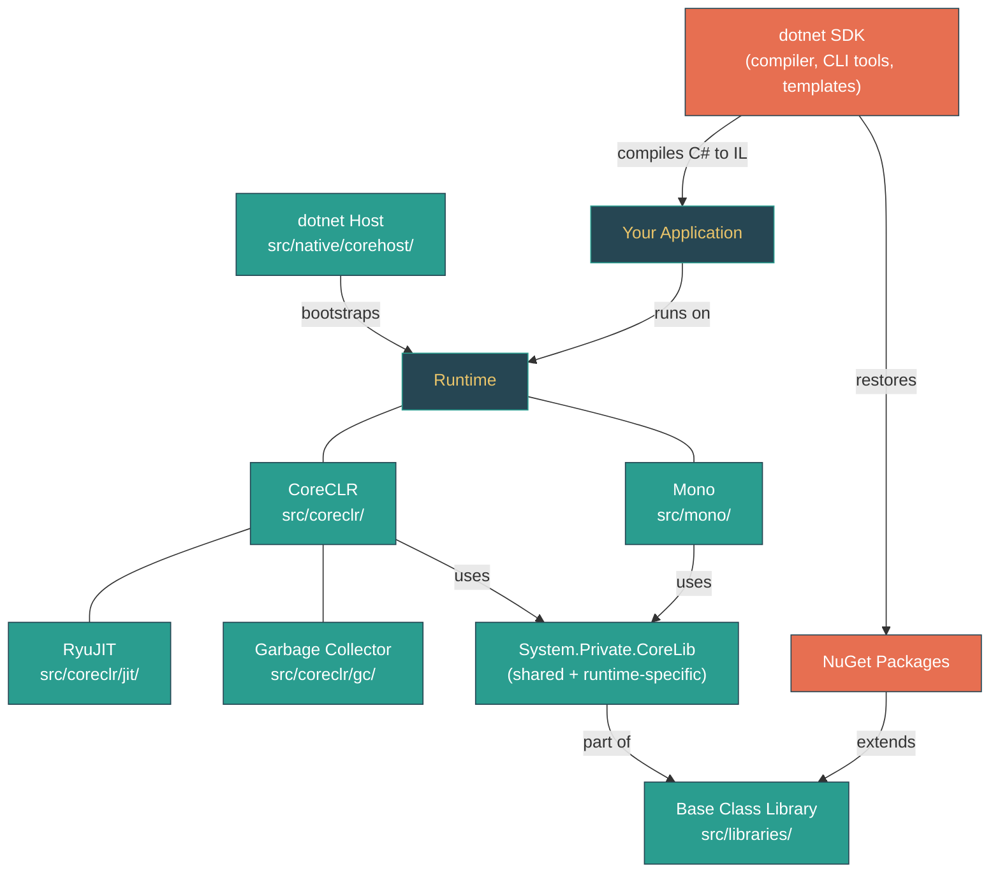

# Level 1: Foundations -- .NET Ecosystem Overview

> **Target profile:** Developer new to .NET or coming from another language ecosystem
> **Estimated effort:** 2 hours
> **Prerequisites:** Basic programming knowledge in any language
> [Version en espanol](../es/01-foundations-ecosystem-overview.md)

---

## Learning Objectives

After completing this module, you will be able to:

1. **Explain** the relationship between the .NET SDK, the runtime, and the Base Class Library (BCL).
2. **Identify** which component -- CoreCLR, Mono, or Libraries -- owns a given piece of functionality.
3. **Describe** the journey of C# source code from text file to running process (compilation pipeline).
4. **Navigate** the top-level directory structure of the `dotnet/runtime` repository.
5. **Locate** the source code for fundamental types like `System.Object` and `System.String`.
6. **Distinguish** between CoreCLR and Mono and explain when each runtime is used.
7. **Use** basic `dotnet` CLI commands (`new`, `build`, `run`, `--info`) and understand what each invokes.
8. **Read** a simple BCL source file and identify its role within the ecosystem.

---

## Concept Map



---

## Curriculum

### Lesson 1.1.1: What Is .NET? -- Three Pieces, One Platform

**What you'll learn:** The .NET platform consists of three distinct components -- the SDK, the runtime, and the Base Class Library -- each with a clear responsibility.

**The concept:**

Think of .NET as a restaurant. The **SDK** is the kitchen: it contains the tools (compiler, project templates, package manager) that transform your recipe (source code) into a finished dish (compiled application). The **runtime** is the dining room infrastructure: the tables, chairs, lighting, and air conditioning that make it possible to serve the dish. The **Base Class Library (BCL)** is the menu: a vast catalog of pre-built functionality (collections, networking, file I/O, cryptography) available to every application.

Here is how the three map to concrete concepts:

| Component | What it is | Analogy | Where it lives |
|---|---|---|---|
| **SDK** | The `dotnet` CLI, the Roslyn C# compiler, MSBuild, project templates, NuGet client | The kitchen and its tools | Installed via `dotnet-install` scripts; this repo builds the *runtime* portion |
| **Runtime** | The execution engine that loads and runs compiled IL code. .NET has *two* runtimes: CoreCLR and Mono | The dining room infrastructure | `src/coreclr/` and `src/mono/` |
| **BCL** | The managed class libraries (`System.*`, `Microsoft.Extensions.*`) that ship with .NET | The menu | `src/libraries/` |

The version you see when you run `dotnet --version` reflects the SDK version. The runtime version is separate. You can verify both by running `dotnet --info`.

**In the source code:**
- The runtime version is defined in `eng/Versions.props` -- look for `<ProductVersion>11.0.0</ProductVersion>` and `<MajorVersion>11</MajorVersion>`.
- The SDK version referenced by this repository is in `global.json` -- currently `"version": "11.0.100-preview.3.26170.106"`.

**Hands-on exercise:**

1. Open a terminal and run:
   ```bash
   dotnet --info
   ```
2. Identify three things in the output: the SDK version, the runtime version(s) installed, and your operating system RID (Runtime Identifier, like `win-x64` or `linux-arm64`).
3. Now run:
   ```bash
   dotnet new console -n HelloEcosystem
   cd HelloEcosystem
   dotnet run
   ```
4. You just used the SDK (to scaffold and compile), the runtime (to execute), and the BCL (`System.Console.WriteLine` comes from the libraries).

**Key takeaway:** The SDK *builds* your code, the runtime *executes* it, and the BCL *provides* the foundational APIs. They are developed and versioned independently, though they ship together.

**Common misconception:** "The SDK and the runtime are the same thing." They are not. You can have SDK 11.0.100 installed alongside runtime 10.0.x and 9.0.x. The SDK *targets* a specific runtime version, but multiple runtimes can coexist on the same machine.

---

### Lesson 1.1.2: CoreCLR vs Mono -- Two Runtimes, One BCL

**What you'll learn:** .NET ships with two execution engines optimized for different scenarios, but they share the same class library.

**The concept:**

Having two runtimes might seem redundant, but each is optimized for different constraints:

| | CoreCLR | Mono |
|---|---|---|
| **Optimized for** | Server, desktop, cloud workloads | Mobile (iOS/Android), WebAssembly, constrained environments |
| **JIT compiler** | RyuJIT -- highly optimizing, tiered compilation | Mini JIT -- lighter, supports AOT interpretation |
| **GC** | Generational, region-based, server/workstation modes | SGen -- simpler, tuned for smaller heaps |
| **Language** | Primarily C/C++ | Primarily C |
| **Source location** | `src/coreclr/` | `src/mono/` |

The key insight is that both runtimes share the same Base Class Library. When you write `new List<int>()`, the `List<T>` implementation in `src/libraries/System.Collections/` works identically on both CoreCLR and Mono. The runtimes differ in *how they execute IL*, not in *what APIs are available*.

The bridge between the shared BCL and the runtime-specific behavior is **System.Private.CoreLib** -- a special assembly that contains the most fundamental types (`Object`, `String`, `Array`, `Type`). It has three locations:

- **Shared code:** `src/libraries/System.Private.CoreLib/src/` -- runtime-agnostic implementations
- **CoreCLR-specific:** `src/coreclr/System.Private.CoreLib/src/` -- implementations that call into the CoreCLR VM
- **Mono-specific:** `src/mono/System.Private.CoreLib/src/` -- implementations that call into the Mono runtime

**In the source code:**

Compare how `System.Object` is implemented across these locations:

1. **Shared part** (`src/libraries/System.Private.CoreLib/src/System/Object.cs`):
   - Defines the `partial class Object` with `ToString()`, `Equals()`, `GetHashCode()`
   - These work the same on any runtime

2. **CoreCLR part** (`src/coreclr/System.Private.CoreLib/src/System/Object.CoreCLR.cs`):
   - Implements `GetType()` by calling `RuntimeHelpers.GetMethodTable(this)` -- a CoreCLR-specific internal
   - Implements `MemberwiseClone()` using `RuntimeHelpers.AllocateUninitializedClone`

3. **Mono part** (`src/mono/System.Private.CoreLib/src/System/Object.Mono.cs`):
   - Implements `GetType()` with `[MethodImplAttribute(MethodImplOptions.InternalCall)]` -- delegating directly to the Mono C runtime
   - Much shorter -- Mono handles more logic on the native side

**Hands-on exercise:**

1. Open `src/libraries/System.Private.CoreLib/src/System/Object.cs` and read the class comment on line 11. Note it says "the root class for all objects in the CLR System."
2. Open `src/coreclr/System.Private.CoreLib/src/System/Object.CoreCLR.cs`. Notice how `GetType()` uses `RuntimeHelpers.GetMethodTable(this)` -- this is calling into CoreCLR's C++ type system.
3. Open `src/mono/System.Private.CoreLib/src/System/Object.Mono.cs`. Notice the `[MethodImplAttribute(MethodImplOptions.InternalCall)]` -- this tells Mono to resolve the method in its C runtime.
4. Reflect: the same `object.GetType()` you call in C# reaches *completely different native code* depending on which runtime executes your app.

**Key takeaway:** CoreCLR is the workhorse for servers and desktops; Mono powers mobile and WebAssembly. They share the BCL, but the lowest-level types have runtime-specific implementations in System.Private.CoreLib.

---

### Lesson 1.1.3: The Base Class Library -- Your Built-In Toolkit

**What you'll learn:** The BCL is a vast collection of managed libraries organized by namespace, and you can read their source code directly.

**The concept:**

The Base Class Library is everything under `src/libraries/`. It currently contains over 200 individual library projects. Every time you use `List<T>`, `HttpClient`, `JsonSerializer`, `File.ReadAllText`, or `Console.WriteLine`, you are calling into BCL code that lives in this repository.

Libraries are organized by namespace, with each one following a consistent directory structure:

```
src/libraries/System.Collections/
    ref/         -- Reference assembly (public API surface only)
    src/         -- Actual implementation
    tests/       -- Unit and integration tests
```

Here are some of the libraries you will use most frequently:

| Library | What it provides | Source path |
|---|---|---|
| `System.Collections` | `SortedDictionary`, `LinkedList`, `Stack`, `Queue`, `PriorityQueue` | `src/libraries/System.Collections/` |
| `System.Net.Http` | `HttpClient`, HTTP/2 and HTTP/3 support | `src/libraries/System.Net.Http/` |
| `System.Text.Json` | High-performance JSON serialization | `src/libraries/System.Text.Json/` |
| `System.Console` | `Console.ReadLine`, `Console.WriteLine` | `src/libraries/System.Console/` |
| `System.IO.FileSystem` | `File`, `Directory`, file I/O | `src/libraries/System.IO.FileSystem/` |
| `Microsoft.Extensions.DependencyInjection` | DI container | `src/libraries/Microsoft.Extensions.DependencyInjection/` |

Then there is **System.Private.CoreLib**, the special library that contains types so fundamental that the runtime itself depends on them: `Object`, `String`, `Int32`, `Array`, `Type`, `Exception`, `Task`. CoreLib is *not* a normal library -- it must be built together with the runtime because the runtime and CoreLib have a two-way dependency.

**In the source code:**

- `src/libraries/System.Console/src/System/Console.cs` -- Open this file and look at line 16: `public static class Console`. This is the actual implementation of `Console.WriteLine` that your programs call. Note the `ReadBufferSize` constant on line 23 and the comment explaining why it is 4096 bytes.
- `src/libraries/System.Collections/src/System/Collections/Generic/` -- This directory contains implementations of `SortedDictionary.cs`, `Stack.cs`, `PriorityQueue.cs`, and more. These are the exact data structures you use in your C# code.
- `src/libraries/System.Private.CoreLib/src/System/String.cs` -- Line 18 has the comment: "The String class represents a static string of characters." Note that `String` is `sealed partial class` -- the `partial` allows runtime-specific parts to be added by CoreCLR or Mono.

**Hands-on exercise:**

1. Create a simple program that uses three different BCL libraries:
   ```csharp
   using System.Collections.Generic;
   using System.Text.Json;

   var names = new PriorityQueue<string, int>();
   names.Enqueue("Alice", 2);
   names.Enqueue("Bob", 1);
   names.Enqueue("Charlie", 3);

   while (names.TryDequeue(out var name, out var priority))
   {
       Console.WriteLine($"{priority}: {name}");
   }

   var json = JsonSerializer.Serialize(new { greeting = "Hello from the BCL!" });
   Console.WriteLine(json);
   ```
2. Run it with `dotnet run`. You just used `System.Collections` (PriorityQueue), `System.Text.Json` (JsonSerializer), and `System.Console` (Console.WriteLine).
3. Open `src/libraries/System.Collections/src/System/Collections/Generic/PriorityQueue.cs` and skim the first 50 lines. You are reading the exact code that just ran on your machine.

**Key takeaway:** The BCL is not a black box. Every type you use in .NET has readable source code in `src/libraries/`. Learning to navigate this code is one of the most valuable skills a .NET developer can develop.

---

### Lesson 1.1.4: The dotnet CLI and Host -- From Command to Process

**What you'll learn:** What actually happens when you type `dotnet run`, and how the native host bootstraps the runtime.

**The concept:**

When you type `dotnet run` in your terminal, a surprisingly deep chain of events unfolds:

1. **The native host** (`dotnet` executable) starts. Its source lives at `src/native/corehost/dotnet/`. This is a small C++ program -- not managed .NET code.

2. **hostfxr** (Host Framework Resolver) is loaded. Located at `src/native/corehost/fxr/`, it resolves which runtime version to use by reading your project's configuration and the installed runtimes. The key files here are `fx_muxer.cpp` (the framework multiplexer) and `sdk_resolver.cpp`.

3. **hostpolicy** is loaded next, from `src/native/corehost/hostpolicy/`. It loads the actual runtime (CoreCLR or Mono), resolves all assembly dependencies, and configures the runtime. Look at `hostpolicy.cpp` and `deps_resolver.cpp`.

4. **The runtime starts**, loading System.Private.CoreLib and your application's assemblies, JIT-compiling your `Main()` method, and executing it.

This layered design allows multiple .NET versions to coexist on the same machine. The host acts as a traffic controller, directing each application to the correct runtime.

```
dotnet run
    |
    v
dotnet (native executable)             src/native/corehost/dotnet/
    |
    v
hostfxr (framework resolver)           src/native/corehost/fxr/
    |
    v
hostpolicy (runtime loader)            src/native/corehost/hostpolicy/
    |
    v
CoreCLR or Mono (runtime engine)       src/coreclr/ or src/mono/
    |
    v
Your Main() method executes
```

**In the source code:**

- `src/native/corehost/dotnet/` -- Contains `dotnet.ico`, `dotnet.manifest`, and the CMake build for the main `dotnet` executable. This is the entry point for every `dotnet` command.
- `src/native/corehost/fxr/fx_muxer.cpp` -- The "mux" (multiplexer) that decides: is the user running an SDK command (`dotnet build`) or an app (`dotnet myapp.dll`)?
- `src/native/corehost/fxr/sdk_resolver.cpp` -- Discovers which SDK is installed and selects the right one.
- `src/native/corehost/hostpolicy/deps_resolver.cpp` -- Resolves the dependency graph of your application's assemblies.
- `src/native/corehost/hostpolicy/coreclr.cpp` -- The bridge that calls into CoreCLR to actually start the runtime.

**Hands-on exercise:**

1. Run the following command to see exactly which runtime your system uses:
   ```bash
   dotnet --info
   ```
   Look for the "Host" section -- it shows the host version and commit hash.

2. Run a simple app with diagnostic output:
   ```bash
   dotnet new console -n HostDemo
   cd HostDemo
   COREHOST_TRACE=1 dotnet run 2>&1 | head -50
   ```
   (On Windows, set `set COREHOST_TRACE=1` before running, or use PowerShell: `$env:COREHOST_TRACE=1`)

   The trace output shows the exact sequence: the host starting, hostfxr loading, runtime resolution, and finally your app executing.

3. Look at the trace output for lines containing "hostfxr" and "hostpolicy" -- you can see the layered loading in action.

**Key takeaway:** The `dotnet` command is a thin native launcher. The real work happens in hostfxr (choosing the right runtime) and hostpolicy (loading it). This design enables side-by-side runtime installations.

---

### Lesson 1.1.5: The Repository Map -- Navigating dotnet/runtime

**What you'll learn:** How to orient yourself in the `dotnet/runtime` repository and find the source for any piece of .NET you are curious about.

**The concept:**

The `dotnet/runtime` repository is one of the largest open-source projects in the world. It can feel overwhelming at first, but its structure follows a clear, logical pattern. Here is your mental map:

```
dotnet/runtime/
|
|-- src/
|   |-- coreclr/           -- The CoreCLR runtime engine
|   |   |-- jit/           -- RyuJIT compiler (C++)
|   |   |-- gc/            -- Garbage collector (C++)
|   |   |-- vm/            -- Virtual machine: type system, class loading, threads (C++)
|   |   |-- debug/         -- Managed debugging support
|   |   |-- interpreter/   -- Experimental CLR interpreter
|   |   |-- nativeaot/     -- NativeAOT ahead-of-time compilation
|   |   |-- pal/           -- Platform Abstraction Layer (OS portability)
|   |   |-- interop/       -- Native interop support
|   |   |-- System.Private.CoreLib/  -- CoreCLR-specific CoreLib parts
|   |
|   |-- mono/              -- The Mono runtime
|   |   |-- mono/          -- Mono C runtime implementation
|   |   |-- wasm/          -- WebAssembly-specific tooling
|   |   |-- browser/       -- Browser-specific runtime pieces
|   |   |-- System.Private.CoreLib/  -- Mono-specific CoreLib parts
|   |
|   |-- libraries/         -- All managed libraries (the BCL)
|   |   |-- System.Collections/
|   |   |-- System.Net.Http/
|   |   |-- System.Text.Json/
|   |   |-- System.Console/
|   |   |-- System.Private.CoreLib/  -- Shared CoreLib code
|   |   |-- Microsoft.Extensions.*/  -- Extensions libraries
|   |   |-- Common/        -- Shared source files used across libraries
|   |   `-- ...200+ more
|   |
|   `-- native/
|       `-- corehost/      -- Native host (dotnet executable)
|           |-- dotnet/    -- The dotnet launcher
|           |-- fxr/       -- hostfxr (framework resolver)
|           `-- hostpolicy/ -- hostpolicy (runtime loader)
|
|-- docs/
|   |-- design/            -- Design documents
|   |   |-- coreclr/botr/  -- Book of the Runtime (deep CLR docs)
|   |   |-- mono/          -- Mono design docs
|   |   `-- libraries/     -- Library design docs
|   |-- workflow/           -- Build and test workflows
|   `-- coding-guidelines/ -- Coding conventions
|
|-- eng/                   -- Build engineering (MSBuild props, versioning)
|   |-- Versions.props     -- Product version numbers
|   `-- Version.Details.xml -- Dependency version details
|
|-- global.json            -- SDK version pinned for this repo
|-- build.sh / build.cmd   -- Top-level build scripts
`-- CLAUDE.md              -- AI assistant guidance (you're using it now!)
```

**The rule of thumb for finding source code:**

- **"Where is the implementation of `System.Foo.Bar`?"** -- Look in `src/libraries/System.Foo/src/`
- **"Where is the runtime-level implementation?"** -- Look in `src/coreclr/vm/` (CoreCLR) or `src/mono/mono/` (Mono)
- **"Where is the JIT?"** -- `src/coreclr/jit/`
- **"Where is the GC?"** -- `src/coreclr/gc/`
- **"Where is the fundamental type `X`?"** -- `src/libraries/System.Private.CoreLib/src/System/X.cs`

**In the source code:**

- `docs/design/coreclr/botr/` -- The "Book of the Runtime" is an excellent collection of deep documents written by runtime engineers. Start with `intro-to-clr.md` by Vance Morrison, which opens with: *"The Common Language Runtime (CLR) is a complete, high level virtual machine designed to support a broad variety of programming languages and interoperation among them."*
- `eng/Versions.props` -- Defines the product version (currently `11.0.0`), the major/minor/patch scheme, and the prerelease label (`preview`).
- `global.json` -- Pins the SDK version the repository builds with (`11.0.100-preview.3.26170.106`).

**Hands-on exercise:**

1. Open the repository in your editor or file browser. Navigate to `src/libraries/` and count roughly how many `System.*` folders you see. (There are over 150!)
2. Pick three types you use frequently (e.g., `List<T>`, `HttpClient`, `Task`). Try to find their source files using the naming pattern above.
   - Hint: `List<T>` is in `src/libraries/System.Private.CoreLib/src/System/Collections/Generic/List.cs` (it is in CoreLib because it is a fundamental type).
   - `HttpClient` is in `src/libraries/System.Net.Http/src/System/Net/Http/HttpClient.cs`.
3. Open `docs/design/coreclr/botr/intro-to-clr.md` and read the first three paragraphs. This document is your gateway to understanding the CLR at a deeper level when you are ready.

**Key takeaway:** The repository has a predictable structure: `src/coreclr/` for the runtime engine, `src/libraries/` for managed APIs, `src/mono/` for the alternative runtime, and `src/native/corehost/` for the launcher. Once you internalize this map, you can find the source for any .NET feature.

---

## Source Code Reading Guide

Start with these files to build your understanding. Read them in order -- each builds on the previous.

| Order | File | What to focus on | Difficulty |
|---|---|---|---|
| 1 | `src/libraries/System.Private.CoreLib/src/System/Object.cs` | The root of every .NET type. Read the class comment and the `ToString()`, `Equals()`, and `GetHashCode()` methods. | :star: |
| 2 | `src/coreclr/System.Private.CoreLib/src/System/Object.CoreCLR.cs` | The CoreCLR-specific `GetType()` implementation. Notice `RuntimeHelpers.GetMethodTable(this)`. | :star: |
| 3 | `src/mono/System.Private.CoreLib/src/System/Object.Mono.cs` | Compare with the CoreCLR version. Notice `[MethodImplAttribute(MethodImplOptions.InternalCall)]`. | :star: |
| 4 | `src/libraries/System.Private.CoreLib/src/System/String.cs` | The `String` class -- `sealed partial class`. Read the class comment about immutability. | :star: |
| 5 | `src/libraries/System.Console/src/System/Console.cs` | The `Console` class. Note the `ReadBufferSize` and `WriteBufferSize` constants and why they differ. | :star::star: |
| 6 | `global.json` | The SDK version pinning. Understand why the repo needs a specific SDK version. | :star: |
| 7 | `eng/Versions.props` | Product versioning. Read `ProductVersion`, `MajorVersion`, and `PreReleaseVersionLabel`. | :star::star: |
| 8 | `docs/design/coreclr/botr/intro-to-clr.md` | Vance Morrison's CLR introduction. Read at least the first three sections. | :star::star: |

---

## Diagnostic Tools and Commands

At this level, focus on mastering these foundational commands:

| Command | What it does | When to use it |
|---|---|---|
| `dotnet --info` | Shows SDK version, installed runtimes, OS RID, and architecture | First thing to run on any new machine or when debugging version issues |
| `dotnet --list-sdks` | Lists all installed SDK versions | When you need to check which SDKs are available |
| `dotnet --list-runtimes` | Lists all installed runtime versions | When you need to verify which runtimes are available |
| `dotnet new console -n MyApp` | Scaffolds a new console application | Starting a new project from scratch |
| `dotnet build` | Compiles the project (C# to IL) | After making changes, to check for compilation errors |
| `dotnet run` | Builds and runs the project | To execute your application |
| `dotnet publish` | Produces a deployment-ready output | When preparing to deploy |
| `COREHOST_TRACE=1 dotnet run` | Runs with host tracing enabled | When you want to see the host loading sequence |

---

## Self-Assessment

Test your understanding with these questions. Try answering before revealing the answer.

### Question 1: What are the three main components of the .NET platform?

<details>
<summary>Show answer</summary>

The three components are:
1. **The SDK** -- tools for building (compiler, CLI, templates, NuGet client)
2. **The Runtime** -- the execution engine (CoreCLR or Mono) that runs compiled IL code
3. **The Base Class Library (BCL)** -- managed libraries (`System.*`, `Microsoft.Extensions.*`) providing foundational APIs

</details>

### Question 2: If you wanted to read the source code for `System.Text.Json.JsonSerializer`, which directory would you look in?

<details>
<summary>Show answer</summary>

`src/libraries/System.Text.Json/src/` -- following the naming convention where `System.Text.Json` maps to the library directory of the same name.

</details>

### Question 3: Why does System.Private.CoreLib exist in three different locations?

<details>
<summary>Show answer</summary>

System.Private.CoreLib contains types so fundamental (`Object`, `String`, `Type`) that the runtime itself depends on them. The shared code lives in `src/libraries/System.Private.CoreLib/`, but some methods need runtime-specific implementations:
- `src/coreclr/System.Private.CoreLib/` contains CoreCLR-specific code (calls into the CoreCLR VM via `RuntimeHelpers`)
- `src/mono/System.Private.CoreLib/` contains Mono-specific code (uses `[MethodImpl(MethodImplOptions.InternalCall)]` to call into the Mono C runtime)

This `partial class` pattern allows the same public API to have different internal implementations per runtime.

</details>

### Question 4: What is the difference between hostfxr and hostpolicy?

<details>
<summary>Show answer</summary>

**hostfxr** (Host Framework Resolver) resolves which runtime and SDK version to use. It reads project configuration and discovers installed runtimes. Source: `src/native/corehost/fxr/`.

**hostpolicy** loads the chosen runtime (CoreCLR or Mono), resolves all assembly dependencies, and initializes the runtime. Source: `src/native/corehost/hostpolicy/`.

The flow is: `dotnet` (launcher) -> hostfxr (picks versions) -> hostpolicy (loads runtime) -> CoreCLR/Mono (executes code).

</details>

### Question 5: When would you use Mono instead of CoreCLR?

<details>
<summary>Show answer</summary>

Mono is used for:
- **Mobile apps** (iOS, Android via .NET MAUI) -- Mono supports AOT compilation required by iOS
- **WebAssembly** (Blazor WASM) -- Mono has a WASM backend in `src/mono/wasm/`
- **Constrained environments** where a lighter runtime footprint is needed

CoreCLR is used for servers, desktops, cloud, and any scenario where maximum throughput and JIT optimization matter.

</details>

### Question 6: What does `global.json` control in this repository?

<details>
<summary>Show answer</summary>

`global.json` pins the exact SDK version used to build the repository (currently `11.0.100-preview.3.26170.106`). This ensures all contributors and CI builds use the same SDK, preventing "works on my machine" issues caused by SDK version differences. The `"rollForward": "major"` setting allows rolling forward to a newer major SDK if the exact version is not installed.

</details>

### Practical Challenge (30-60 minutes)

**Build a "Component Finder" reference sheet:**

1. Create a new console app with `dotnet new console -n ComponentFinder`.
2. Write a program that uses at least one type from each of these namespaces:
   - `System` (e.g., `Console`, `Environment`)
   - `System.Collections.Generic` (e.g., `Dictionary<TKey, TValue>`)
   - `System.IO` (e.g., `File`, `Path`)
   - `System.Text.Json` (e.g., `JsonSerializer`)
3. For each type you used, find its source file in the `dotnet/runtime` repository. Write down the file path.
4. For each source file, note whether it lives in `src/libraries/System.Private.CoreLib/` (fundamental type) or in a separate library directory under `src/libraries/` (standard library type).
5. Bonus: Open `src/libraries/System.Private.CoreLib/src/System/Environment.cs` and find what method returns the current OS. Verify by calling it in your program.

---

## Connections

| Direction | Module | Topic |
|---|---|---|
| **Next** | [1.2: Project Structure and the Build System](01-foundations-project-structure.md) | What happens when you run `dotnet build`? What are all the generated files? |
| **Related (future)** | [1.7: Your First Look at the Runtime Source](01-foundations-first-source-reading.md) | A guided tour of the repository for first-time source readers |
| **Previous** | None | This is the first module in the learning path |
| **Index** | [Learning Path Index](00-index.md) | Full module listing and self-assessment |

---

## Glossary

| Term (EN) | Termino (ES) | Definition |
|---|---|---|
| **CLR** (Common Language Runtime) | CLR (Common Language Runtime) | The virtual machine that executes .NET programs. It provides services like garbage collection, type safety, and JIT compilation. |
| **BCL** (Base Class Library) | BCL (Biblioteca de Clases Base) | The set of managed libraries (`System.*`) that ship with .NET, providing foundational APIs for collections, I/O, networking, and more. |
| **SDK** (Software Development Kit) | SDK (Kit de Desarrollo de Software) | The toolset for building .NET applications: includes the compiler (Roslyn), CLI (`dotnet`), MSBuild, and project templates. |
| **CoreCLR** | CoreCLR | The primary .NET runtime optimized for server, desktop, and cloud workloads. Contains RyuJIT, the GC, and the type system. |
| **Mono** | Mono | The alternative .NET runtime optimized for mobile (iOS/Android), WebAssembly, and constrained environments. |
| **JIT** (Just-In-Time compilation) | JIT (compilacion Just-In-Time) | The process of compiling IL (Intermediate Language) to native machine code at runtime, right before execution. |
| **IL** (Intermediate Language) | IL (Lenguaje Intermedio) | The CPU-independent bytecode that the C# compiler produces. Also called CIL (Common Intermediate Language) or MSIL. |
| **NuGet** | NuGet | The package manager for .NET. Libraries are distributed as NuGet packages (`.nupkg` files) and restored during build. |
| **TFM** (Target Framework Moniker) | TFM (Target Framework Moniker) | A standardized token (e.g., `net11.0`) that identifies which version of .NET a library or application targets. |

---

## References

| Resource | Type | What it covers |
|---|---|---|
| [.NET Documentation](https://learn.microsoft.com/en-us/dotnet/) | Official docs | Comprehensive guides, tutorials, and API reference |
| [Book of the Runtime (BotR)](https://github.com/dotnet/runtime/tree/main/docs/design/coreclr/botr) | Design docs | Deep dives into CLR internals -- start with `intro-to-clr.md` |
| [.NET Source Browser](https://source.dot.net/) | Tool | Searchable, indexed view of the entire runtime source code |
| [SharpLab](https://sharplab.io/) | Tool | Instantly see the IL, JIT assembly, and lowered C# for any code snippet |
| [dotnet/runtime README](https://github.com/dotnet/runtime/blob/main/README.md) | Overview | Official repository introduction and build instructions |
| [.NET Runtime Design Docs](https://github.com/dotnet/runtime/tree/main/docs/design) | Design docs | Architecture decisions and feature specifications |
| [Stephen Toub -- Performance Improvements in .NET (annual series)](https://devblogs.microsoft.com/dotnet/) | Blog | Detailed annual performance changelog with direct links to source code |
| [.NET CLI Overview](https://learn.microsoft.com/en-us/dotnet/core/tools/) | Official docs | Complete reference for `dotnet` CLI commands |

---

*Last updated: 2026-04-14*
