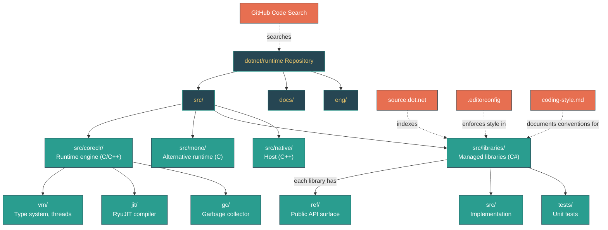

# Level 1: Foundations -- Your First Look at the Runtime Source

> **Target profile:** Developer who has never navigated a large open-source runtime codebase
> **Estimated effort:** 2 hours
> **Prerequisites:** [Modules 1.1--1.6](01-foundations-ecosystem-overview.md)
> [Version en espanol](../es/01-foundations-first-source-reading.md)

---

## Learning Objectives

After completing this module, you will be able to:

1. **Navigate** the `dotnet/runtime` repository structure confidently, knowing what each top-level directory contains.
2. **Read** a BCL source file (like `List<T>`) and understand its organization: license header, using directives, namespace, class declaration, fields, constructors, and methods.
3. **Identify** the `ref/src/tests` convention used by every library project and know which directory to look in for public API surface, implementation, and tests.
4. **Use** [source.dot.net](https://source.dot.net/) and GitHub code search to find implementations quickly without cloning the repository.
5. **Recognize** coding conventions -- field naming (`_camelCase`, `s_` prefix), Allman-style braces, `partial class` usage -- used throughout the codebase.
6. **Distinguish** between types that live in `System.Private.CoreLib` (fundamental types the runtime depends on) and types that live in standalone library projects.
7. **Locate** the `.editorconfig` and `docs/coding-guidelines/coding-style.md` files that define the rules you will see enforced in every source file.
8. **Read** the first 50 lines of an unfamiliar source file and extract meaningful information about the type's purpose, design, and constraints.

---

## Concept Map



---

## Curriculum

### Lesson 1.7.1: The Repository Map -- A Top-Level Tour

**What you'll learn:** How the `dotnet/runtime` repository is organized at the top level, and what each major directory contains.

**The concept:**

The `dotnet/runtime` repository contains over 300,000 files. That sounds terrifying, but you do not need to know all of them. You need a mental map with roughly a dozen landmarks. Here is the map:

```
dotnet/runtime/
|
|-- src/                        -- ALL source code lives here
|   |-- coreclr/                -- CoreCLR runtime engine
|   |   |-- vm/                 -- Virtual machine (type system, class loader, threads)
|   |   |-- jit/                -- RyuJIT just-in-time compiler
|   |   |-- gc/                 -- Garbage collector
|   |   |-- debug/              -- Debugging infrastructure
|   |   |-- interpreter/        -- Experimental CLR interpreter
|   |   |-- nativeaot/          -- NativeAOT compiler and runtime
|   |   |-- pal/                -- Platform Abstraction Layer (OS portability)
|   |   `-- System.Private.CoreLib/  -- CoreCLR-specific CoreLib parts
|   |
|   |-- mono/                   -- Mono alternative runtime
|   |   |-- mono/               -- Mono C runtime implementation
|   |   |-- wasm/               -- WebAssembly tooling
|   |   `-- System.Private.CoreLib/  -- Mono-specific CoreLib parts
|   |
|   |-- libraries/              -- 200+ managed class libraries (the BCL)
|   |   |-- System.Collections/
|   |   |-- System.Net.Http/
|   |   |-- System.Text.Json/
|   |   |-- System.Private.CoreLib/  -- Shared (runtime-agnostic) CoreLib code
|   |   `-- ...
|   |
|   `-- native/corehost/        -- Native host (dotnet executable)
|
|-- docs/                       -- Documentation
|   |-- design/coreclr/botr/    -- Book of the Runtime (deep CLR docs)
|   |-- workflow/building/       -- Build instructions
|   `-- coding-guidelines/       -- Coding conventions
|
|-- eng/                        -- Build engineering (versioning, CI)
|-- .editorconfig               -- Code style enforcement
|-- build.sh / build.cmd        -- Top-level build scripts
`-- global.json                 -- SDK version pin
```

The rule is simple: everything you will want to read as a .NET developer starts in `src/`. If you are looking for a managed API, go to `src/libraries/`. If you are looking for how the runtime works internally, go to `src/coreclr/` or `src/mono/`.

**In the source code:**

The `src/coreclr/vm/` directory alone contains over 200 C/C++ files. Here is a sampling of what lives there:

| File | Purpose |
|---|---|
| `object.h` / `object.cpp` | Defines the native layout of managed objects |
| `appdomain.cpp` | Application domain management |
| `assembly.cpp` | Assembly loading |
| `methodtable.cpp` | The MethodTable structure (runtime type representation) |
| `gchelpers.cpp` | Helpers for allocating objects on the managed heap |
| `jitinterface.cpp` | The interface between the VM and the JIT compiler |
| `threads.cpp` | Managed thread implementation |
| `castcache.cpp` | Fast type-cast checking |

You do not need to understand these files now. The point is: they exist, they are readable, and when you are ready (Level 4), you will know exactly where to look.

**Hands-on exercise:**

1. Open the repository in your editor or file browser. Navigate to `src/` and list the top-level directories. Confirm you see `coreclr/`, `mono/`, `libraries/`, `native/`, and a few others (`installer/`, `tests/`, `tools/`).
2. Navigate to `src/coreclr/vm/` and scan the file names. You do not need to open them -- just notice the naming pattern: lowercase, descriptive, often matching a CLR concept (e.g., `methodtable.cpp`, `assembly.cpp`, `threads.cpp`).
3. Navigate to `src/libraries/` and scroll through the folder list. Notice how each folder is named after a .NET namespace (`System.Collections`, `System.Net.Http`, `System.Text.Json`, etc.).
4. Count roughly how many `System.*` folders you see. There are over 150.

**Key takeaway:** The repository is large but logically organized. `src/libraries/` is where you will spend most of your time as a .NET developer reading source code. `src/coreclr/vm/` is the C++ heart of the runtime. Knowing these two landmarks is enough to get started.

---

### Lesson 1.7.2: Reading Your First BCL File -- List&lt;T&gt;

**What you'll learn:** How to open a real BCL source file, understand its structure, and extract useful information from it.

**The concept:**

Every .NET developer uses `List<T>`. It is the most common collection in C#. Let us open its implementation and read it together. The file is:

```
src/libraries/System.Private.CoreLib/src/System/Collections/Generic/List.cs
```

Note that `List<T>` lives in `System.Private.CoreLib`, not in `System.Collections`. This is because `List<T>` is considered a fundamental type -- the runtime itself uses it internally, so it must be part of CoreLib.

Here is the anatomy of the first 40 lines of `List.cs`:

```csharp
// Licensed to the .NET Foundation under one or more agreements.       // <-- License header (every file)
// The .NET Foundation licenses this file to you under the MIT license.

using System.Collections.ObjectModel;                                  // <-- Using directives (alphabetical)
using System.Diagnostics;
using System.Diagnostics.CodeAnalysis;
using System.Runtime.CompilerServices;

namespace System.Collections.Generic                                   // <-- Namespace declaration
{
    // Implements a variable-size List that uses an array of objects    // <-- Class-level comment
    // to store the elements. A List has a capacity, which is the
    // allocated length of the internal array.
    //
    [DebuggerTypeProxy(typeof(ICollectionDebugView<>))]                // <-- Attributes
    [DebuggerDisplay("Count = {Count}")]
    [Serializable]
    [TypeForwardedFrom("mscorlib, Version=4.0.0.0, ...")]
    public class List<T> : IList<T>, IList, IReadOnlyList<T>           // <-- Class declaration + interfaces
    {
        private const int DefaultCapacity = 4;                         // <-- Constants first

        internal T[] _items;                                           // <-- Fields next (_camelCase)
        internal int _size;
        internal int _version;

        private static readonly T[] s_emptyArray = new T[0];           // <-- Static field (s_ prefix)

        public List()                                                  // <-- Constructors
        {
            _items = s_emptyArray;
        }
```

Let us unpack the patterns:

1. **License header** -- Every file in the repository starts with these two lines. No exceptions.
2. **Using directives** -- Outside the namespace, sorted alphabetically, with `System.*` first.
3. **Class-level comment** -- A plain `//` comment (not XML doc) explaining the purpose. Many BCL classes have these historical comments dating back to the early .NET Framework.
4. **Attributes** -- `[DebuggerDisplay]` makes debugging nicer. `[Serializable]` marks legacy serialization support. `[TypeForwardedFrom]` enables binary compatibility with old mscorlib assemblies.
5. **Fields at the top** -- Per coding guidelines, fields are declared before any methods. Note the naming: `_items` (private instance, underscore prefix), `s_emptyArray` (private static, `s_` prefix).
6. **Interesting detail** -- `DefaultCapacity = 4`. This means the first time you add an element to an empty `List<T>`, it allocates an array of 4 elements. When that fills up, it doubles. This is a real implementation detail you can only learn by reading the source.

**In the source code:**

- `_items` has the comment "Do not rename (binary serialization)" -- this field name is baked into serialized data across the .NET ecosystem. Changing it would break backward compatibility.
- `s_emptyArray` uses `new T[0]` instead of `Array.Empty<T>()` with a `#pragma warning disable` -- the comment explains this avoids an extra generic instantiation for `Array.Empty<T>()`, which is an optimization for the type system.
- The `List(IEnumerable<T> collection)` constructor (around line 61) checks whether the input is `ICollection<T>` first, and if so, copies directly using `CopyTo` instead of iterating one by one. This is a performance optimization you would never know about without reading the source.

**Hands-on exercise:**

1. Open `src/libraries/System.Private.CoreLib/src/System/Collections/Generic/List.cs`.
2. Find the `DefaultCapacity` constant. What value is it? (Answer: 4.)
3. Read the `Add` method. Find where capacity growth happens -- look for the method `Grow` or `EnsureCapacity`. How does the list decide the new capacity? (Answer: it doubles the current capacity, or uses `DefaultCapacity` if the array is empty.)
4. Find the `Sort()` method. Notice how it delegates to `Array.Sort` -- `List<T>` does not implement its own sorting algorithm.
5. Look at the `Enumerator` struct at the bottom of the file. Notice it is a `struct`, not a `class` -- this is a deliberate optimization to avoid heap allocation when iterating with `foreach`.

**Key takeaway:** BCL source files follow a consistent structure: license, usings, namespace, comments, attributes, class declaration, fields, constructors, properties, methods. Once you see this pattern in one file, you will recognize it everywhere.

---

### Lesson 1.7.3: The ref/src/tests Convention -- Three Projects, One Library

**What you'll learn:** Why every library in `src/libraries/` has three subdirectories, what each contains, and which one to look at when you want to understand behavior.

**The concept:**

Open `src/libraries/System.Collections/` and you will see:

```
System.Collections/
    ref/             -- Reference assembly (public API surface)
    src/             -- Implementation source code
    tests/           -- Test projects
```

This is the universal pattern for every library in the repository. Understanding what each directory does will save you time:

**`ref/` -- The API contract:**

The `ref/` directory contains a "reference assembly" -- a file that declares every public type and member but has no real implementations. Method bodies are replaced with `throw null;`. Here is what it looks like in `System.Collections/ref/System.Collections.cs`:

```csharp
namespace System.Collections.Generic
{
    public sealed partial class LinkedListNode<T>
    {
        public LinkedListNode(T value) { }
        public System.Collections.Generic.LinkedList<T>? List { get { throw null; } }
        public System.Collections.Generic.LinkedListNode<T>? Next { get { throw null; } }
    }
}
```

Every method returns `throw null;`. This file exists solely to define the public API surface. When the .NET team reviews a new API proposal, the `ref/` file is what changes first. If you want to see "what public members does this type have?" -- look in `ref/`.

The `ref/` assembly also contains a comment at the top:

```csharp
// Changes to this file must follow the https://aka.ms/api-review process.
```

This means adding a new public API to .NET requires an official API review. The `ref/` file is the gatekeeper.

**`src/` -- The real implementation:**

This is where the actual logic lives. When you want to understand *how* something works -- how `SortedDictionary` maintains order, how `PriorityQueue` manages its heap -- you look in `src/`.

For `System.Collections`, the `src/` directory contains:

```
src/System/Collections/Generic/
    LinkedList.cs
    OrderedDictionary.cs
    PriorityQueue.cs
    SortedDictionary.cs
    SortedList.cs
    SortedSet.cs
    Stack.cs
```

**`tests/` -- How the team verifies correctness:**

The `tests/` directory contains xUnit test projects. These tests are an excellent learning resource -- they show you exactly how a type is intended to be used, including edge cases.

**Where does `List<T>` fit in?**

You might notice that `List<T>` is *not* in `src/libraries/System.Collections/src/`. It is in `src/libraries/System.Private.CoreLib/src/System/Collections/Generic/List.cs`. Types that are fundamental enough for the runtime to depend on live in CoreLib. Types in `System.Collections` are the "extended" collections: `SortedDictionary`, `LinkedList`, `PriorityQueue`, etc.

Here is the split:

| In System.Private.CoreLib | In System.Collections |
|---|---|
| `List<T>`, `Dictionary<TKey,TValue>` | `SortedDictionary<TKey,TValue>` |
| `Queue<T>`, `HashSet<T>` | `SortedList<TKey,TValue>` |
| `Stack<T>` (the generic one) | `SortedSet<T>`, `LinkedList<T>` |
| `KeyValuePair<TKey,TValue>` | `PriorityQueue<TElement,TPriority>` |

**In the source code:**

- `src/libraries/System.Collections/ref/System.Collections.cs` starts with the API review comment on line 4, followed by a `#if !BUILDING_CORELIB_REFERENCE` guard -- this prevents accidentally including CoreLib types in the reference assembly.
- `src/libraries/System.Collections/tests/` has subdirectories for `Generic/` and `BitArray/`, plus a `.csproj` file that lists all test files.

**Hands-on exercise:**

1. Navigate to `src/libraries/System.Collections/ref/System.Collections.cs`. Open it and look for `PriorityQueue`. Notice every method has `{ throw null; }` -- this is the API contract, not the implementation.
2. Now navigate to `src/libraries/System.Collections/src/System/Collections/Generic/PriorityQueue.cs`. This is the real implementation. Open it and find the private field that stores the heap data structure.
3. Navigate to `src/libraries/System.Collections/tests/Generic/` and find the PriorityQueue test file. Open it and read two or three test methods. Notice how each test demonstrates a specific behavior.
4. Repeat this ref/src/tests exploration for `SortedDictionary` or `LinkedList`.

**Key takeaway:** `ref/` defines what the public sees, `src/` contains how it works, and `tests/` proves it works correctly. When you want to understand behavior, always go to `src/`. When you want to see the full API at a glance, check `ref/`.

---

### Lesson 1.7.4: Tools for Source Navigation

**What you'll learn:** Three practical tools for finding and reading .NET runtime source code without getting lost.

**The concept:**

You do not have to clone the repository and grep through 300,000 files to find what you need. The .NET ecosystem provides purpose-built tools for source navigation.

**Tool 1: source.dot.net**

[https://source.dot.net/](https://source.dot.net/) is a searchable, indexed view of the entire `dotnet/runtime` source code. It is the fastest way to find a type or method.

How to use it:
- Type a type name in the search box: `List<T>`, `Dictionary`, `HttpClient`
- Click a result to see the full source file with syntax highlighting
- Click on any type or method reference to jump to its definition (like "Go to Definition" in an IDE)
- Use the left panel to browse by namespace

This tool is maintained by the .NET team and stays up to date with the latest source. It is the single best tool for casual source exploration.

**Tool 2: GitHub code search**

GitHub's code search works well for the `dotnet/runtime` repository. Navigate to [https://github.com/dotnet/runtime](https://github.com/dotnet/runtime) and press `/` to open the search box, or use the search bar directly.

Useful search patterns:
- `repo:dotnet/runtime path:src/libraries List.cs` -- Find files named `List.cs` in libraries
- `repo:dotnet/runtime "DefaultCapacity" path:*.cs` -- Find where `DefaultCapacity` is defined
- `repo:dotnet/runtime language:csharp "public class Dictionary"` -- Find Dictionary class declarations

**Tool 3: Your IDE with Source Link**

If you use Visual Studio or Rider, Source Link lets you step into framework source code while debugging. When you press F12 ("Go to Definition") on a BCL type like `List<T>`, the IDE downloads the actual source file from the NuGet package and opens it.

To enable this in Visual Studio:
1. Go to Tools > Options > Debugging > General
2. Check "Enable Source Link support"
3. Uncheck "Enable Just My Code" (so the debugger can step into framework code)

Now when you debug a program that calls `list.Add(item)`, you can step into the `List<T>.Add` method and see the actual runtime implementation.

**In the source code:**

Try using source.dot.net right now:
1. Go to [https://source.dot.net/](https://source.dot.net/)
2. Search for `Math.Abs`
3. You should land on `src/libraries/System.Private.CoreLib/src/System/Math.cs` -- the same file at line 48 where `Abs(short)` is defined with `[MethodImpl(MethodImplOptions.AggressiveInlining)]`
4. Click on `ThrowNegateTwosCompOverflow` to see where the exception helper is defined

**Hands-on exercise:**

1. Open [source.dot.net](https://source.dot.net/) and search for `Console.WriteLine`. Click through to the implementation. How many overloads of `WriteLine` are there?
2. On GitHub, search `repo:dotnet/runtime "private const int DefaultCapacity" path:List.cs`. Confirm it returns the `List.cs` file with value 4.
3. If you have Visual Studio, create a console app, put a breakpoint on a `List<T>.Add()` call, and step into it (F11). You should see the actual `List<T>` source code.
4. On source.dot.net, search for `PriorityQueue`. Click through to the source. Find the `Enqueue` method and read how the heap "sift up" operation works.

**Key takeaway:** You do not need to clone the repository to read runtime source. [source.dot.net](https://source.dot.net/) is the fastest tool for exploring, GitHub search is good for targeted queries, and Source Link in your IDE lets you step into framework code while debugging.

---

### Lesson 1.7.5: Coding Conventions at a Glance

**What you'll learn:** The coding style rules that are enforced across the entire repository, so you can read source code fluently and recognize patterns instantly.

**The concept:**

The `dotnet/runtime` repository has strict, consistent coding conventions. Once you learn them, every source file in the repository will feel familiar. The rules are documented in two places:

1. `.editorconfig` at the repository root -- machine-enforceable formatting rules
2. `docs/coding-guidelines/coding-style.md` -- human-readable style guide

Here are the conventions you will encounter most often:

**Braces and indentation:**

```csharp
// Allman style -- each brace on its own line, always
public int Count
{
    get => _size;
}

if (index < 0)
{
    ThrowHelper.ThrowArgumentOutOfRangeException(...);
}
```

Four spaces, no tabs. Every brace gets its own line. This is called "Allman style" and is non-negotiable in this repository.

**Field naming:**

```csharp
private T[] _items;              // Private instance field: _camelCase
private static readonly T[] s_emptyArray;  // Static field: s_camelCase
[ThreadStatic]
private static int t_count;      // ThreadStatic field: t_camelCase
public int Count { get; }        // Public property: PascalCase
```

This naming convention is so consistent that when you see `s_` in any file, you instantly know it is a static field. When you see `_`, you know it is an instance field.

**Visibility is always explicit:**

```csharp
private string _name;       // Good: explicit private
internal int _size;          // Good: explicit internal
public bool IsEmpty { get; } // Good: explicit public
```

You will never see a field without a visibility modifier. The coding style requires visibility as the first modifier.

**Use language keywords, not BCL types:**

```csharp
int count = 0;       // Good: language keyword
string name = "";    // Good: language keyword
// Int32 count = 0;  // Wrong: BCL type name
// String name = ""; // Wrong: BCL type name
```

**Null checks use pattern matching:**

```csharp
if (collection is null)              // Good: pattern matching
    ThrowHelper.ThrowArgumentNullException(...);

if (comparer is not null)            // Good: pattern matching
    _comparer = comparer;

// if (collection == null)           // Avoided: operator equality
```

**The `.editorconfig` file:**

The `.editorconfig` at the repository root starts with:

```ini
root = true

[*]
insert_final_newline = true
indent_style = space
indent_size = 4
trim_trailing_whitespace = true

[*.cs]
csharp_new_line_before_open_brace = all
csharp_new_line_before_else = true
csharp_new_line_before_catch = true
csharp_preferred_modifier_order = public,private,protected,internal,...
dotnet_style_qualification_for_field = false:suggestion
```

This file is picked up by Visual Studio, VS Code, Rider, and other editors automatically. It ensures that everyone who touches the codebase follows the same formatting rules.

**In the source code:**

Open any of the files you have read so far and verify these conventions:

- `List.cs`: `_items`, `_size`, `_version` (instance fields), `s_emptyArray` (static field), `DefaultCapacity` (PascalCase constant)
- `Dictionary.cs`: `_buckets`, `_entries`, `_count`, `_freeList`, `_freeCount`, `_version`, `_comparer`, `s_` is not used because there are no static fields here, but look at `StartOfFreeList` (constant, PascalCase)
- `Object.cs`: uses `is null` check style (visible in `Equals(object? objA, object? objB)` where `objA == null` is used -- note this is legacy code that predates the convention)
- `Math.cs`: `maxRoundingDigits` and `doubleRoundLimit` use camelCase because they are `private const` -- wait, that contradicts the PascalCase rule for constants! This is an example of rule 9 in the coding style: "If a file happens to differ in style from these guidelines, the existing style in that file takes precedence."

**Hands-on exercise:**

1. Open `.editorconfig` at the repository root. Find the rule for "avoid this." -- it is `dotnet_style_qualification_for_field = false:suggestion`.
2. Open `docs/coding-guidelines/coding-style.md`. Read rules 1 through 5. These are the most important.
3. Open `src/libraries/System.Private.CoreLib/src/System/Collections/Generic/Dictionary.cs`. Identify:
   - Three instance fields with `_` prefix
   - One constant with PascalCase naming
   - The use of `is not null` on line 78 (or nearby)
4. Open `src/libraries/System.Private.CoreLib/src/System/Object.cs`. Notice that `Equals(object? objA, object? objB)` on line 53 uses `==` instead of `is null` -- this is acceptable because the convention was established after this code was written, and rule 9 says existing style takes precedence.

**Key takeaway:** The coding conventions are strict and consistent: Allman braces, four spaces, `_camelCase` for fields, `s_` for statics, explicit visibility, language keywords over BCL types. Learning these patterns lets you read any file in the repository fluently.

---

## Source Code Reading Guide -- Your Starter Kit

This module's reading guide is a curated collection of the most approachable files in the repository. These are files you can open right now, read from top to bottom, and understand. They are ordered from simplest to most complex.

| Order | File | What to focus on | Why it is approachable | Difficulty |
|---|---|---|---|---|
| 1 | `src/libraries/System.Private.CoreLib/src/System/Object.cs` | The root of every .NET type. Only 88 lines. Read `ToString()`, `Equals()`, `GetHashCode()`. Notice `partial class` -- the runtime-specific parts are in separate files. | Tiny file, fundamental concept | :star: |
| 2 | `src/coreclr/System.Private.CoreLib/src/System/Object.CoreCLR.cs` | The CoreCLR-specific half of `Object`. See how `GetType()` calls `RuntimeHelpers.GetMethodTable(this)` and how `MemberwiseClone()` copies raw bytes with write barriers. | Short file (47 lines), shows the partial class pattern in action | :star: |
| 3 | `src/libraries/System.Private.CoreLib/src/System/Math.cs` | Constants (`E`, `PI`, `Tau`), the `RoundPower10Double` lookup table, and `Abs()` overloads. Notice `[MethodImpl(MethodImplOptions.AggressiveInlining)]`. | Static methods, no state to track, familiar math operations | :star: |
| 4 | `src/libraries/System.Private.CoreLib/src/System/Collections/Generic/List.cs` | `DefaultCapacity = 4`, the `_items` array, the `Add` method, and the growth strategy. The `Enumerator` struct at the bottom. | Everyone uses `List<T>` -- now see how it works | :star::star: |
| 5 | `src/libraries/System.Private.CoreLib/src/System/String.cs` | `sealed partial class String`, `MaxLength = 0x3FFFFFDF`, the `_stringLength` and `_firstChar` fields, the comment about EE StringObject. | You use strings every day -- see why they are special | :star::star: |
| 6 | `src/libraries/System.Private.CoreLib/src/System/Collections/Generic/Dictionary.cs` | The `Entry` struct, `_buckets` and `_entries` arrays, the hash collision strategy, and the `_fastModMultiplier` for 64-bit platforms. Read the constructor comment about reference types vs value types for comparer optimization. | More complex, but the data structure is familiar | :star::star::star: |
| 7 | `docs/coding-guidelines/coding-style.md` | The 20 coding rules. Read all of them -- they are short and practical. | Not code, but essential for reading all other files | :star: |
| 8 | `.editorconfig` | Machine-enforceable rules: brace style, indentation, modifier order, `this.` avoidance, `var` preferences. | Configuration file, easy to scan | :star: |

**Reading strategy:** For files 1-6, follow this pattern for each file:

1. Read the license header (confirm it is the standard two-line MIT license).
2. Scan the `using` directives -- they tell you what subsystems the type depends on.
3. Read the class comment and class declaration line -- this tells you the purpose and what interfaces it implements.
4. Read the fields -- they reveal the internal data structure.
5. Read the constructors -- they show how the type initializes itself.
6. Skim the public methods -- pick one or two and read the implementation.

---

## Diagnostic Tools and Commands

At this level, your "diagnostic tools" are source navigation tools. Here is your toolkit:

| Tool | What it does | When to use it |
|---|---|---|
| [source.dot.net](https://source.dot.net/) | Searchable, indexed view of the entire runtime source. Click-through navigation like an IDE. | When you want to quickly find and read any .NET type's source code |
| [GitHub code search](https://github.com/dotnet/runtime) | Full-text search across the repository. Supports file path filters, language filters, and regex. | When you need to find a specific string, constant, or pattern across the codebase |
| **IDE "Go to Definition" + Source Link** | F12 in Visual Studio or Rider. Downloads and displays the actual source from NuGet packages. | When you are debugging and want to step into framework code |
| `grep` / `rg` (ripgrep) on a local clone | Fast local search across all files. `rg "DefaultCapacity" src/libraries/` | When you have the repository cloned and need fast, repeated searches |
| [SharpLab](https://sharplab.io/) | Shows the IL, JIT assembly, and lowered C# for any code snippet. | When you want to see what the compiler generates for a specific C# expression |

**Searching effectively on source.dot.net:**

- Search by type name: `Dictionary<TKey, TValue>`
- Search by member name: `List<T>.Add`
- Search by file path: use the left navigation panel to browse by namespace
- Pro tip: search for `partial class YourType` to find all the partial files that make up a type

**Searching effectively on GitHub:**

```
repo:dotnet/runtime path:src/libraries "public class Stack"
repo:dotnet/runtime path:src/coreclr/vm "MethodTable"
repo:dotnet/runtime language:csharp "ThrowHelper.Throw"
```

---

## Self-Assessment

Test your understanding with these questions. Try answering before revealing the answer.

### Question 1: You want to find how `HashSet<T>.Contains()` works. Which directory do you look in?

<details>
<summary>Show answer</summary>

`HashSet<T>` is a fundamental collection, so it lives in CoreLib: `src/libraries/System.Private.CoreLib/src/System/Collections/Generic/HashSet.cs`. You would search for the `Contains` method in that file. You could also find it instantly at [source.dot.net](https://source.dot.net/) by searching for `HashSet<T>.Contains`.

</details>

### Question 2: What is the difference between the `ref/` and `src/` directories in a library project?

<details>
<summary>Show answer</summary>

- `ref/` contains the **reference assembly** -- it declares the public API surface (all public types and members) with `throw null;` method bodies. It defines *what* is available. Changes to `ref/` require an official API review.
- `src/` contains the **implementation** -- the actual working code with real method bodies. It defines *how* things work.

When you want to understand behavior, look in `src/`. When you want to see the full public API at a glance, look in `ref/`.

</details>

### Question 3: A field named `s_defaultComparer` -- what can you infer about it just from the name?

<details>
<summary>Show answer</summary>

The `s_` prefix tells you it is a **static** field. The `_` after the prefix and the camelCase tells you it is **private or internal** (non-public). The name `defaultComparer` tells you it stores some kind of default comparer instance. Per the coding conventions, a `public` static field would use PascalCase without a prefix.

</details>

### Question 4: Why does `List<T>` live in `System.Private.CoreLib` instead of `System.Collections`?

<details>
<summary>Show answer</summary>

`List<T>` is a fundamental type that the runtime itself depends on internally. Types that are essential to the runtime must be part of CoreLib because CoreLib is loaded as part of the runtime initialization, before any other assemblies. `System.Collections` contains "extended" collections like `SortedDictionary`, `LinkedList`, and `PriorityQueue` that are not needed by the runtime itself.

</details>

### Question 5: What does the `[TypeForwardedFrom("mscorlib, Version=4.0.0.0, ...")]` attribute on `List<T>` do?

<details>
<summary>Show answer</summary>

This attribute enables backward compatibility with serialized data from the old .NET Framework. In .NET Framework, `List<T>` lived in an assembly called `mscorlib`. In modern .NET, it lives in `System.Private.CoreLib`. The `TypeForwardedFrom` attribute tells the deserializer: "If you encounter data serialized as `mscorlib.List<T>`, that is the same type as this one." Without it, old serialized data would fail to deserialize.

</details>

### Question 6: You see `#if TARGET_64BIT` in `Dictionary.cs`. What does this mean?

<details>
<summary>Show answer</summary>

This is a conditional compilation directive. The code inside the `#if TARGET_64BIT` block only compiles when building for 64-bit platforms (x64, arm64). In `Dictionary.cs`, this is used for `_fastModMultiplier`, which is an optimization for computing hash bucket indices that is only available on 64-bit platforms. On 32-bit platforms, a different (slower) modulo operation is used.

</details>

### Practical Challenge (30-60 minutes)

**Explore a type you use daily:**

1. Pick a BCL type you use regularly in your code. Some suggestions: `StringBuilder`, `FileStream`, `Stopwatch`, `CancellationToken`, `Guid`, `TimeSpan`, `Regex`, `Channel<T>`.
2. Find its source file in the repository. Use [source.dot.net](https://source.dot.net/) or GitHub search. Write down the full file path.
3. Open the file and read the first 60 lines. Identify:
   - The license header
   - The using directives (what subsystems does this type depend on?)
   - The class declaration (is it `sealed`? `partial`? What interfaces does it implement?)
   - The fields (what is the internal data representation?)
4. Find one public method you use frequently. Read its implementation. Was there anything surprising?
5. Write a one-paragraph summary of something you learned about this type that you did not know before.

This is the most important exercise in the module. The goal is to prove to yourself that you *can* read runtime source code, that it is not magic, and that doing so teaches you things you cannot learn any other way.

---

## Connections

| Direction | Module | Topic |
|---|---|---|
| **Previous** | [1.6: Basic I/O: Files, Console, and Streams](01-foundations-basic-io.md) | How does `Console.WriteLine` actually write to the terminal? |
| **Next** | [2.1: Generics: From Syntax to Runtime Specialization](02-practitioner-generics.md) | Why can `List<int>` be faster than `ArrayList`? Now that you can read `List.cs`, you are ready to understand how generics work at the runtime level. |
| **Related** | [1.1: .NET Ecosystem Overview](01-foundations-ecosystem-overview.md) | This module builds directly on the repository map from Lesson 1.1.5. |
| **Index** | [Learning Path Index](00-index.md) | Full module listing and self-assessment |

**You have completed Level 1 -- Foundations.**

You now have a solid mental model of the .NET ecosystem, the compilation pipeline, the type system, and the repository structure. More importantly, you have opened real source files, read real implementations, and learned things you cannot learn from documentation alone.

Level 2 will build on this foundation. You will start reading source code regularly -- not as a special exercise, but as a natural part of understanding how .NET works. The transition from "I know how to use List<T>" to "I know how List<T> works" is what separates a capable developer from an expert.

---

## Glossary

| Term (EN) | Termino (ES) | Definition |
|---|---|---|
| **BCL** (Base Class Library) | BCL (Biblioteca de Clases Base) | The set of managed libraries (`System.*`) that ship with .NET, providing foundational APIs for collections, I/O, networking, and more. |
| **CoreLib** (System.Private.CoreLib) | CoreLib (System.Private.CoreLib) | The special assembly containing types so fundamental (`Object`, `String`, `List<T>`) that the runtime itself depends on them. Split across three locations: shared, CoreCLR-specific, and Mono-specific. |
| **Reference assembly** | Assembly de referencia | A special assembly that declares the public API surface (`ref/` directory) with no real implementations. Used by the compiler to verify your code against the available API without needing the full implementation. |
| **Source Link** | Source Link | A technology that allows debuggers (Visual Studio, Rider) to download and display the original source code of NuGet packages, enabling you to step into framework code during debugging. |
| **.editorconfig** | .editorconfig | A standardized configuration file that defines coding style rules (indentation, brace style, naming conventions) and is automatically picked up by most editors and IDEs. |
| **Partial class** | Clase parcial | A C# feature that allows a class definition to be split across multiple files. Used extensively in the runtime to separate shared code from runtime-specific implementations (e.g., `Object.cs` + `Object.CoreCLR.cs`). |
| **Platform-specific file** | Archivo especifico de plataforma | A source file that contains code for a specific OS or architecture, typically named with a suffix like `.Windows.cs`, `.Unix.cs`, or `.CoreCLR.cs`. |
| **API review** | Revision de API | The formal process (`https://aka.ms/api-review`) required before any new public API can be added to the BCL. The `ref/` assembly is the artifact that captures approved API changes. |
| **Type forwarding** | Reenvio de tipos | A mechanism (`[TypeForwardedFrom]`) that redirects type lookups from an old assembly name to a new one, enabling backward compatibility when types are moved between assemblies. |

---

## References

| Resource | Type | What it covers |
|---|---|---|
| [.NET Source Browser (source.dot.net)](https://source.dot.net/) | Tool | Searchable, indexed view of the entire runtime source code. The best starting point for any source exploration. |
| [GitHub: dotnet/runtime](https://github.com/dotnet/runtime) | Repository | The official repository. Use GitHub code search for targeted queries. |
| [SharpLab](https://sharplab.io/) | Tool | See IL, JIT assembly, and lowered C# for any code snippet. |
| [docs/coding-guidelines/coding-style.md](https://github.com/dotnet/runtime/blob/main/docs/coding-guidelines/coding-style.md) | Coding guide | The 20 coding style rules used throughout the repository. |
| [.editorconfig](https://github.com/dotnet/runtime/blob/main/.editorconfig) | Config file | Machine-enforceable formatting rules picked up by all major editors. |
| [API Review Process](https://github.com/dotnet/runtime/blob/main/docs/project/api-review-process.md) | Process doc | How new public APIs are proposed, reviewed, and approved. |
| [Book of the Runtime (BotR)](https://github.com/dotnet/runtime/tree/main/docs/design/coreclr/botr) | Design docs | Deep dives into CLR internals. Start with `intro-to-clr.md`. |
| [Stephen Toub -- Performance Improvements in .NET (annual series)](https://devblogs.microsoft.com/dotnet/) | Blog | Annual posts with detailed source code links showing performance optimizations. Excellent for seeing how BCL code evolves. |
| [src/libraries/README.md](https://github.com/dotnet/runtime/blob/main/src/libraries/README.md) | Overview | Explains the contribution bar and expectations for library changes. |

---

*Last updated: 2026-04-14*
