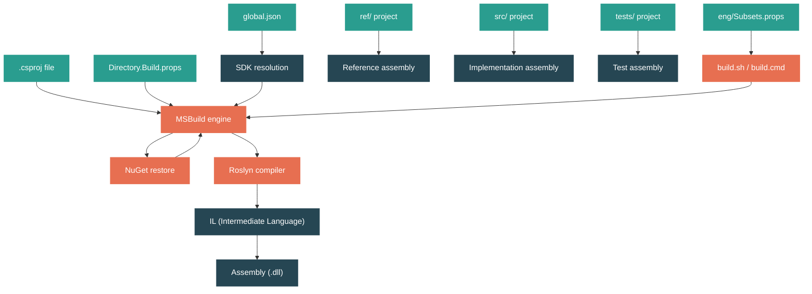

# Level 1: Foundations -- Project Structure and the Build System

> **Target profile:** Developer who can create .NET projects but doesn't understand the build pipeline
> **Estimated effort:** 3 hours
> **Prerequisites:** [Module 1.1: .NET Ecosystem Overview](01-foundations-ecosystem-overview.md)
> [Version en espanol](../es/01-foundations-project-structure.md)

---

## Learning Objectives

By the end of this module you will be able to:

1. Explain what a `.csproj` file controls and how MSBuild processes it.
2. Describe the `ref/`, `src/`, `tests/` layout convention used by every library in the repository.
3. Trace what happens when you run `dotnet build` -- from NuGet restore through Roslyn compilation to output assembly.
4. Identify the role of `Directory.Build.props` and explain how property inheritance flows from the repository root down to individual projects.
5. Read `global.json` and explain why the repository pins a specific SDK version.
6. Distinguish between a **reference assembly** and an **implementation assembly** and explain why both exist.
7. Use `build.sh` / `build.cmd` with subset flags to build specific components of the repository.
8. Inspect build output using diagnostic verbosity and the MSBuild preprocessor.

---

## Concept Map



**How to read this map:** Your C# source code lives in `.csproj` projects. MSBuild orchestrates the entire build: it reads the project file, inherits properties from `Directory.Build.props` files up the directory tree, restores NuGet packages, then invokes the Roslyn compiler. Roslyn produces **IL** (Intermediate Language), which is packaged into an **assembly** (`.dll`). In the `dotnet/runtime` repository, every library has three related projects -- `ref/` (API surface), `src/` (implementation), and `tests/` -- each producing a different kind of assembly.

---

## Curriculum

### Lesson 1.2.1: The .csproj File Decoded

**What you'll learn:** What each element in a `.csproj` file means, and how MSBuild interprets it.

**The concept:**

A `.csproj` file is an XML document that tells MSBuild everything it needs to know to compile your project. It is *not* just a list of files -- it is a full build script. Here are the key elements:

| Element | Purpose |
|---------|---------|
| `<Project Sdk="Microsoft.NET.Sdk">` | Declares the SDK, which imports hundreds of default targets and props |
| `<TargetFramework>` | Which version of .NET (or .NET Framework) to compile against |
| `<OutputType>` | `Library` (default) or `Exe` -- determines if you get a `.dll` or an entry point |
| `<PropertyGroup>` | Sets build properties (key-value configuration) |
| `<ItemGroup>` | Declares inputs: source files (`<Compile>`), packages (`<PackageReference>`), project references (`<ProjectReference>`) |
| `<AllowUnsafeBlocks>` | Enables `unsafe` C# code (pointer arithmetic) |

In the `dotnet/runtime` repository, you will notice something unusual: projects use `$(NetCoreAppCurrent)` instead of a hardcoded target framework like `net11.0`. This is an MSBuild property defined centrally so that when a new .NET version is released, only one place needs to change.

**In the source code:**

Open `src/libraries/System.Collections/src/System.Collections.csproj`:

```xml
<Project Sdk="Microsoft.NET.Sdk">
  <PropertyGroup>
    <TargetFramework>$(NetCoreAppCurrent)</TargetFramework>
    <AllowUnsafeBlocks>true</AllowUnsafeBlocks>
    <IsPartialFacadeAssembly>true</IsPartialFacadeAssembly>
    <DefineConstants>SYSTEM_COLLECTIONS;$(DefineConstants)</DefineConstants>
  </PropertyGroup>

  <ItemGroup>
    <Compile Include="System\Collections\ThrowHelper.cs" />
    <Compile Include="$(CoreLibSharedDir)System\Collections\Generic\DebugViewDictionaryItem.cs"
             Link="Common\System\Collections\Generic\DebugViewDictionaryItem.cs" />
    <!-- ... more files ... -->
  </ItemGroup>

  <ItemGroup>
    <ProjectReference Include="$(CoreLibProject)" />
  </ItemGroup>
</Project>
```

Notice a few things:

- **`$(NetCoreAppCurrent)`** -- a variable, not a literal TFM. This is resolved by MSBuild from a `.props` file higher up the tree.
- **`<Compile Include="...">`** -- each source file is listed explicitly. The `dotnet/runtime` repo sets `<EnableDefaultItems>false</EnableDefaultItems>` (in `src/libraries/Directory.Build.props`, line 34), which turns off SDK-style automatic file inclusion. This gives precise control over what gets compiled.
- **`$(CoreLibSharedDir)`** -- a variable pointing to shared CoreLib source. Files from other directories can be included with the `Link` attribute, which tells Visual Studio how to display them in Solution Explorer.
- **`<ProjectReference Include="$(CoreLibProject)" />`** -- this project depends on `System.Private.CoreLib`, the foundational library that contains types like `object`, `string`, and `int`.

**Hands-on exercise:**

1. Open `src/libraries/System.Collections/src/System.Collections.csproj` in your editor.
2. Count how many `<Compile>` items reference files outside the project's own directory (hint: look for `$(CoreLibSharedDir)` and `$(CommonPath)`).
3. Now open a small project you've created with `dotnet new classlib`. Compare the two `.csproj` files. What does the SDK-style project get "for free" that the runtime project specifies explicitly?

**Key takeaway:** A `.csproj` file is a build script, not just a file list. In `dotnet/runtime`, projects disable automatic file inclusion and list every source file explicitly for maximum control. Properties like `$(NetCoreAppCurrent)` are defined centrally to avoid version duplication.

**Common misconception:** "The `.csproj` file only lists my source files." In reality, the `Sdk` attribute imports hundreds of targets and properties. Your project file is the *tip* of a much larger MSBuild evaluation tree. Running `dotnet msbuild -pp` will reveal the full evaluated project -- often thousands of lines.

---

### Lesson 1.2.2: MSBuild -- The Engine Behind `dotnet build`

**What you'll learn:** How MSBuild orchestrates the entire build process, and how targets and properties work.

**The concept:**

When you run `dotnet build`, the `dotnet` CLI delegates to **MSBuild**, the build engine. MSBuild works by evaluating a tree of XML files (`.csproj`, `.props`, `.targets`) and executing **targets** in a dependency order. Here is the simplified flow:

```
dotnet build
    |
    v
MSBuild loads the .csproj
    |
    v
Imports Sdk props (Microsoft.NET.Sdk)
    |
    v
Walks up directory tree, importing Directory.Build.props at each level
    |
    v
Evaluates all PropertyGroup / ItemGroup elements
    |
    v
Executes targets in order:
    Restore --> Build --> (Compile) --> (CopyFilesToOutputDirectory)
```

Key MSBuild terminology:

- **Property**: A named string value, like `<TargetFramework>net11.0</TargetFramework>`. Properties are set in `<PropertyGroup>` blocks and referenced as `$(PropertyName)`.
- **Item**: A named collection of inputs, like `<Compile Include="*.cs" />`. Items live in `<ItemGroup>` blocks and are referenced as `@(ItemName)`.
- **Target**: A named block of build steps (tasks). Targets declare dependencies on each other. For example, the `Build` target depends on `Compile`, which depends on `ResolveReferences`.
- **Props file** (`.props`): Imported *before* the project body -- sets defaults.
- **Targets file** (`.targets`): Imported *after* the project body -- defines build logic.

The distinction between `.props` and `.targets` is important: properties set in `.props` can be overridden by the project, while `.targets` execute after the project's properties are finalized.

**In the source code:**

Look at `eng/Versions.props` (lines 1-20). This file defines the product version, major/minor/patch numbers, and prerelease labels for the entire repository:

```xml
<PropertyGroup>
    <ProductVersion>11.0.0</ProductVersion>
    <MajorVersion>11</MajorVersion>
    <MinorVersion>0</MinorVersion>
    <PatchVersion>0</PatchVersion>
    <PreReleaseVersionLabel>preview</PreReleaseVersionLabel>
    <PreReleaseVersionIteration>4</PreReleaseVersionIteration>
</PropertyGroup>
```

Every project in the repository inherits these values automatically. When the team increments the version for a new preview, they change it in *one* place.

**Hands-on exercise:**

1. Open a terminal in any library directory, for example `src/libraries/System.Collections/src/`.
2. Run: `dotnet msbuild -pp:fullproject.xml System.Collections.csproj` (this "preprocesses" the project, expanding all imports into a single file).
3. Open `fullproject.xml` and search for `TargetFramework`. You will see the chain of imports that leads to the final resolved value.
4. Search for `NetCoreAppCurrent` to find where the TFM variable is defined.

**Key takeaway:** MSBuild is a property-and-target evaluation engine. The `.csproj` file is just the entry point into a tree of `.props` and `.targets` files. Understanding this hierarchy is essential for navigating a large repo like `dotnet/runtime`.

---

### Lesson 1.2.3: The ref/src/tests Convention

**What you'll learn:** Why every library in `dotnet/runtime` has three separate projects, and what role each one plays.

**The concept:**

Look inside any library directory under `src/libraries/`. You will find (at minimum) three subdirectories:

```
src/libraries/System.Collections/
    ref/                 -- Reference assembly project
    src/                 -- Implementation project
    tests/               -- Test project
    Directory.Build.props
    System.Collections.slnx
```

Each serves a distinct purpose:

| Directory | What it produces | Purpose |
|-----------|-----------------|---------|
| `ref/` | **Reference assembly** | Defines the *public API surface* -- the types, methods, and their signatures. The method bodies are all `throw null;`. This assembly is what other projects compile *against*. |
| `src/` | **Implementation assembly** | Contains the real code that runs at execution time. |
| `tests/` | **Test assembly** | xUnit test projects that validate the implementation. |

**Why separate ref and src?**

Reference assemblies solve several problems:

1. **API contract enforcement**: The ref assembly is the single source of truth for what is public. Changes to the ref assembly go through API review.
2. **Compilation speed**: Downstream projects compile against the tiny ref assembly (just signatures), not the full implementation.
3. **Binary compatibility**: The runtime can ship different implementations for different platforms, but all must match the same ref assembly contract.

**In the source code:**

Compare the ref project and the src project for System.Collections:

**`src/libraries/System.Collections/ref/System.Collections.csproj`:**
```xml
<Project Sdk="Microsoft.NET.Sdk">
  <PropertyGroup>
    <TargetFramework>$(NetCoreAppCurrent)</TargetFramework>
  </PropertyGroup>
  <ItemGroup>
    <Compile Include="System.Collections.cs" />
    <Compile Include="System.Collections.Forwards.cs" />
  </ItemGroup>
  <ItemGroup>
    <ProjectReference Include="..\..\System.Runtime\ref\System.Runtime.csproj" />
  </ItemGroup>
</Project>
```

The ref project compiles only two files. Now look at what `System.Collections.cs` (the ref source) contains:

```csharp
namespace System.Collections.Generic
{
    public sealed partial class LinkedListNode<T>
    {
        public LinkedListNode(T value) { }
        public System.Collections.Generic.LinkedList<T>? List { get { throw null; } }
        public System.Collections.Generic.LinkedListNode<T>? Next { get { throw null; } }
        // ... all methods throw null
    }
}
```

Every property getter and method body is `{ throw null; }`. This is intentional -- the ref assembly only needs type information and signatures. No real logic.

Meanwhile, `src/System.Collections.csproj` includes dozens of real implementation files like `LinkedList.cs`, `SortedDictionary.cs`, `PriorityQueue.cs`, etc.

**Hands-on exercise:**

1. Open `src/libraries/System.Collections/ref/System.Collections.cs` and pick any type (e.g., `LinkedList<T>`).
2. Find the corresponding implementation file in `src/libraries/System.Collections/src/` (hint: look at the `<Compile>` items in the src `.csproj`).
3. Compare the two: how many methods are listed in the ref file? Are there any `internal` or `private` methods in the ref file? (Spoiler: there should not be.)
4. Look at `src/libraries/System.Collections/tests/System.Collections.Tests.csproj` and notice how tests reference shared test infrastructure from `$(CommonTestPath)`.

**Key takeaway:** The three-project convention (`ref/src/tests`) separates the API contract from the implementation. This pattern enables API review governance, faster compilation for consumers, and platform-specific implementations behind a single contract.

---

### Lesson 1.2.4: Directory.Build.props and Property Inheritance

**What you'll learn:** How shared configuration flows from the repository root down to individual projects through a hierarchy of `.props` files.

**The concept:**

MSBuild has a special convention: before evaluating any `.csproj`, it automatically walks *up* the directory tree looking for files named `Directory.Build.props`. Each one it finds is imported, innermost last (so closer files can override distant ones). This creates a property inheritance chain:

```
Directory.Build.props                    (repo root)
  |
  +-- src/libraries/Directory.Build.props  (libraries-wide settings)
        |
        +-- src/libraries/System.Collections/Directory.Build.props  (library-specific)
              |
              +-- src/libraries/System.Collections/src/System.Collections.csproj
```

Each level adds or overrides properties. This is how the repository applies consistent settings to hundreds of projects without repeating configuration.

**In the source code:**

**Repository root -- `Directory.Build.props`** (lines 1-18):

This file sets foundational properties for the *entire* repository:
- `ImportDirectoryBuildProps` is set to `false` to prevent double-importing.
- Platform minimum versions are defined (e.g., `<iOSVersionMin>13.0</iOSVersionMin>`, `<macOSVersionMin>14.0</macOSVersionMin>`).
- The file imports `eng/OSArch.props` to detect the current operating system and architecture.

**Libraries level -- `src/libraries/Directory.Build.props`** (lines 1-50):

This file configures all library projects:
- `<DisableArcadeTestFramework>true</DisableArcadeTestFramework>` -- disables the Arcade SDK's default test framework.
- `<EnableDefaultItems>false</EnableDefaultItems>` (line 34) -- forces explicit file listing in every `.csproj`.
- `<Nullable>enable</Nullable>` for source projects, `annotations` for tests.
- `<IsAotCompatible>` is enabled for src and ref projects by default.
- `<StrongNameKeyId>Open</StrongNameKeyId>` -- default signing key.
- It imports `NetCoreAppLibrary.props`, which defines the list of libraries that ship as part of the shared framework.

**Library-specific -- `src/libraries/System.Collections/Directory.Build.props`:**

```xml
<Project>
  <Import Project="..\Directory.Build.props" />
  <PropertyGroup>
    <StrongNameKeyId>Microsoft</StrongNameKeyId>
  </PropertyGroup>
</Project>
```

This overrides the signing key to `Microsoft` (because `System.Collections` is a core framework assembly that requires the Microsoft strong name key).

**Hands-on exercise:**

1. Open `src/libraries/Directory.Build.props` and find the line that sets `<EnableDefaultItems>false</EnableDefaultItems>`.
2. Now create a test: open any library's `.csproj` and try *removing* a `<Compile>` item. What would happen? (The file would no longer be compiled, because auto-inclusion is off.)
3. Find `<Nullable>` in `src/libraries/Directory.Build.props`. What value does it get for test projects vs source projects?
4. Trace the import chain: `System.Collections.csproj` --> its `Directory.Build.props` --> `src/libraries/Directory.Build.props` --> `../../Directory.Build.props` (repo root). How many levels is that?

**Key takeaway:** `Directory.Build.props` files create a cascading configuration system. The repo root sets global defaults, `src/libraries/` adds library-wide conventions, and individual libraries can override specific properties. This is how hundreds of projects stay consistent.

---

### Lesson 1.2.5: From Source to Assembly -- The Compilation Pipeline

**What you'll learn:** What happens between your C# source code and the final `.dll` assembly file.

**The concept:**

When MSBuild reaches the compilation step, it invokes the **Roslyn** compiler (`csc.dll`). Here is what Roslyn does:

```
C# source files (.cs)
        |
        v
    Roslyn Compiler (csc)
        |
        +-- Parses C# into a syntax tree
        +-- Performs semantic analysis (type checking, overload resolution)
        +-- Emits IL (Intermediate Language)
        |
        v
    Assembly (.dll)
        |
        +-- PE header (Portable Executable format)
        +-- Metadata (types, methods, signatures, references)
        +-- IL code (method bodies in stack-based bytecode)
        +-- Resources (embedded strings, images, etc.)
```

**IL (Intermediate Language)** is a platform-independent bytecode. It is *not* machine code -- it cannot run directly on the CPU. When you run a .NET application, the runtime's **JIT compiler** (RyuJIT in CoreCLR) converts IL to native machine code on the fly. This is why .NET applications are "compile once, run anywhere" on supported platforms.

An **assembly** is the unit of deployment in .NET. A single `.dll` file contains:
- **Metadata**: A complete description of every type, method, field, and their relationships. This is what makes reflection possible.
- **IL code**: The actual method implementations in bytecode form.
- **Assembly identity**: Name, version, culture, public key token.

**In the source code:**

The output of building `System.Collections` ends up in:
```
artifacts/bin/System.Collections/Debug/net11.0/System.Collections.dll
```

The `artifacts/` directory at the repository root is where all build output goes. The path structure mirrors the configuration:
```
artifacts/
    bin/            -- compiled assemblies
    obj/            -- intermediate build files
    log/            -- build logs
    packages/       -- NuGet packages
```

**Hands-on exercise:**

1. If you have the .NET SDK installed, create a simple console app:
   ```bash
   dotnet new console -n PipelineDemo
   cd PipelineDemo
   ```
2. Build it with diagnostic verbosity:
   ```bash
   dotnet build -v diag > build.log
   ```
3. Open `build.log` and search for `Csc` -- this is the Roslyn compiler task. Look at the command-line arguments passed to it. You will see `-target:exe`, `-out:...`, and every `.cs` file listed.
4. (Optional) If you have `ildasm` or ILSpy, open the output `.dll` and browse the IL. Look for a simple method like `Main` and read the IL instructions (`ldstr`, `call`, `ret`).

**Key takeaway:** Roslyn compiles C# into IL (Intermediate Language), which is stored in assembly `.dll` files alongside metadata. The assembly is not machine code -- it is an intermediate format that the runtime's JIT compiler converts to native code at execution time.

---

### Lesson 1.2.6: Build Scripts and Subsets

**What you'll learn:** How `build.sh` / `build.cmd` orchestrate building the entire `dotnet/runtime` repository, and what "subsets" are.

**The concept:**

The `dotnet/runtime` repository is enormous. It contains the CoreCLR runtime (C/C++), the Mono runtime (C), the managed libraries (C#), the native host (C/C++), installers, and test infrastructure. Building *everything* from scratch takes 30-40 minutes. You rarely want to do that.

The repository uses a **subset** system to let you build only what you need. The entry points are:

- **`build.sh`** (Linux/macOS) -- a thin shell script that delegates to `eng/build.sh`
- **`build.cmd`** (Windows) -- a thin batch script that delegates to `eng/build.ps1`

Both ultimately invoke MSBuild with the `eng/Subsets.props` file, which defines how the repository is divided into buildable units.

**In the source code:**

Look at `build.sh` at the repository root (the first 33 lines). It is remarkably simple -- it resolves symlinks and then calls `eng/build.sh` with all arguments passed through:

```bash
if is_cygwin_or_mingw; then
  "$scriptroot/build.cmd" "$@"
else
  "$scriptroot/eng/build.sh" "$@"
fi
```

The real logic lives in `eng/Subsets.props`. Open it and look at line 72:

```xml
<DefaultSubsets>clr+mono+libs+tools+host+packs</DefaultSubsets>
```

This is what gets built when you run `./build.sh` with no arguments -- *everything*. The `+` delimiter separates subset names. Each subset expands to further sub-subsets:

| Subset | What it builds |
|--------|---------------|
| `clr` | CoreCLR runtime (JIT, GC, type system, native code) |
| `mono` | Mono runtime |
| `libs` | Managed libraries (BCL) |
| `host` | Native host (`dotnet` executable, `hostfxr`, `hostpolicy`) |
| `tools` | Build tools (IL linker, cDAC) |
| `packs` | NuGet packages and installers |

Common build commands:

```bash
# Build CoreCLR + libraries + host (typical for library development)
./build.sh clr+libs+host

# Build only libraries in Release
./build.sh libs -lc release

# Build Mono + libraries (for mobile/WASM)
./build.sh mono+libs
```

Configuration flags:
- `-rc` / `-runtimeConfiguration`: CoreCLR config (`Debug`, `Checked`, `Release`)
- `-lc` / `-librariesConfiguration`: Libraries config (`Debug`, `Release`)
- `-c` / `-configuration`: Default for all if not otherwise specified

**In the source code:**

`global.json` at the repository root pins the exact SDK version:

```json
{
  "sdk": {
    "version": "11.0.100-preview.3.26170.106",
    "allowPrerelease": true,
    "rollForward": "major"
  },
  "msbuild-sdks": {
    "Microsoft.DotNet.Arcade.Sdk": "11.0.0-beta.26210.111",
    "Microsoft.DotNet.Helix.Sdk": "11.0.0-beta.26210.111"
  }
}
```

This ensures every developer and CI machine uses the *exact same* SDK version. The `"rollForward": "major"` setting means it will accept higher major versions if the pinned one is not installed, but in practice the CI scripts install the pinned version.

The `msbuild-sdks` section declares custom SDKs used by the build system:
- **Arcade SDK**: Microsoft's shared build infrastructure for all `dotnet/*` repos.
- **Helix SDK**: Integration with the Helix test infrastructure for running tests in CI.

**Hands-on exercise:**

1. Open `eng/Subsets.props` and find the `<DefaultSubsets>` property. What subsets are included by default for `TargetsMobile`?
2. Read the usage help by running `./build.sh -h` (or `build.cmd -?` on Windows). Identify the flags for setting runtime configuration and libraries configuration separately.
3. Look at `global.json`. What SDK version is pinned? What Arcade SDK version is it using?
4. (Advanced) Open `eng/build.sh` and read the first 50 lines. Find where it defines the `--subset` argument.

**Key takeaway:** The `dotnet/runtime` build system uses subsets to make incremental builds feasible. You select what to build (`clr`, `libs`, `mono`, etc.) and the configuration for each component. `global.json` pins exact tool versions, and `eng/Subsets.props` defines how the repository is partitioned.

---

## Source Code Reading Guide

These files are recommended reading for this module, ordered from easiest to most involved:

| File | Difficulty | What you'll learn |
|------|-----------|-------------------|
| `src/libraries/System.Collections/src/System.Collections.csproj` | Easy | Anatomy of a real `.csproj` in the repo |
| `src/libraries/System.Collections/ref/System.Collections.csproj` | Easy | How a ref assembly project differs from an implementation project |
| `src/libraries/System.Collections/ref/System.Collections.cs` | Easy | What a reference assembly source file looks like (`throw null;` bodies) |
| `global.json` | Easy | SDK pinning and custom MSBuild SDK declarations |
| `src/libraries/System.Collections/Directory.Build.props` | Easy | How a single library overrides shared properties |
| `src/libraries/Directory.Build.props` | Medium | Library-wide shared configuration (50+ lines of conventions) |
| `Directory.Build.props` | Medium | Repository-root properties (platform versions, output directories) |
| `eng/Subsets.props` | Medium | How the build system divides the repo into buildable subsets |

---

## Diagnostic Tools and Commands

These commands help you understand what MSBuild is doing:

### `dotnet build -v diag`
Diagnostic verbosity -- prints every property evaluation, target invocation, and task execution. The output is very large (thousands of lines), so redirect it to a file:
```bash
dotnet build -v diag > build.log
```
Search the log for `Csc` to find the compiler invocation, or for a property name to see where it was set.

### `dotnet msbuild -pp:<output-file>`
Preprocesses the project, expanding all imports into a single XML file. This shows you the *complete* evaluated project, including everything inherited from `Directory.Build.props`, SDK props, and SDK targets:
```bash
dotnet msbuild -pp:full.xml src/libraries/System.Collections/src/System.Collections.csproj
```

### `dotnet build --no-incremental`
Forces a full rebuild, ignoring incremental build caches. Useful when you suspect stale outputs.

### `dotnet build -bl`
Produces a binary log (`msbuild.binlog`). You can view it with the [MSBuild Structured Log Viewer](https://msbuildlog.com/) for a rich, searchable, tree-structured view of the build.

### `ildasm` / ILSpy
Disassemble a compiled `.dll` to inspect its IL code and metadata:
```bash
# Using the SDK's ildasm
ildasm artifacts/bin/System.Collections/Debug/net11.0/System.Collections.dll
```
Or use [ILSpy](https://github.com/icsharpcode/ILSpy) for a GUI-based view with C# decompilation.

---

## Self-Assessment

Test your understanding of this module:

### Knowledge Checks

<details>
<summary>1. What does <code>$(NetCoreAppCurrent)</code> resolve to, and why doesn't the repository use a hardcoded TFM like <code>net11.0</code>?</summary>

`$(NetCoreAppCurrent)` resolves to the current .NET TFM (e.g., `net11.0`). The repository uses a variable so that when a new version is released, the TFM only needs to change in one central `.props` file rather than in hundreds of individual `.csproj` files.
</details>

<details>
<summary>2. Why does the <code>ref/</code> project for a library have method bodies that say <code>throw null;</code>?</summary>

Reference assemblies define only the public API surface -- type names, method signatures, and their visibility. The method bodies are irrelevant because no one ever *executes* a reference assembly. The `throw null;` is a minimal valid body that satisfies the compiler. Downstream projects compile against the ref assembly for type checking, but at runtime they use the implementation assembly from `src/`.
</details>

<details>
<summary>3. What is the difference between a <code>.props</code> file and a <code>.targets</code> file?</summary>

`.props` files are imported *before* the project body and set default property values that the project can override. `.targets` files are imported *after* the project body and define build logic (targets and tasks) that execute during the build. The convention is: use `.props` for configuration, `.targets` for behavior.
</details>

<details>
<summary>4. If you run <code>./build.sh libs -lc release</code>, what does it build and in what configuration?</summary>

It builds only the **libraries** subset (managed class libraries / BCL) in **Release** configuration. The `-lc release` flag sets the libraries configuration to Release. It does not build the CLR runtime, Mono, host, or other subsets.
</details>

<details>
<summary>5. Why does <code>src/libraries/Directory.Build.props</code> set <code>EnableDefaultItems</code> to <code>false</code>?</summary>

With `EnableDefaultItems` set to `true` (the SDK default), MSBuild automatically includes all `.cs` files in the project directory. The `dotnet/runtime` repo disables this so that every source file must be listed explicitly in the `.csproj`. This gives precise control over what gets compiled -- essential in a large repo where files might be conditionally included for specific platforms or shared across multiple projects.
</details>

### Practical Challenge

**Map the property inheritance chain for `System.Collections`:**

1. Starting from `src/libraries/System.Collections/src/System.Collections.csproj`, trace every `Directory.Build.props` file that gets imported up to the repository root.
2. For each file, write down 2-3 key properties it sets.
3. Find where `$(NetCoreAppCurrent)` is ultimately defined (hint: it is in the `eng/` directory).
4. Draw the import chain as a simple diagram with arrows.

This exercise should take about 20 minutes and will give you a concrete mental model of how MSBuild property inheritance works in this repository.

---

## Connections

| Direction | Module | Relationship |
|-----------|--------|-------------|
| Previous | [1.1: .NET Ecosystem Overview](01-foundations-ecosystem-overview.md) | Module 1.1 introduced the components (SDK, runtime, BCL). This module shows how those components are organized in the source tree and how the build system ties them together. |
| Next | [1.3: The Type System](01-foundations-type-system.md) | Now that you understand how code gets compiled into assemblies, Module 1.3 explores what happens when those assemblies are loaded and types are used at runtime. |
| Related | [1.5: Assemblies, Namespaces, and the Loader](01-foundations-assemblies.md) | Deepens the concept of assemblies introduced here -- how they are loaded, resolved, and versioned. |
| Related | [1.7: Your First Look at the Runtime Source](01-foundations-first-source-reading.md) | Applies the project structure knowledge from this module to a guided reading of real runtime source code. |

---

## Glossary

| Term | Definition |
|------|-----------|
| **MSBuild** | The build engine that processes `.csproj` files, evaluates properties, and orchestrates compilation. Invoked by `dotnet build`. |
| **csproj** | An XML project file (C# project) that declares build properties, source files, dependencies, and configuration for MSBuild. |
| **TFM (Target Framework Moniker)** | A string like `net11.0` or `netstandard2.0` that identifies which version of .NET a project targets. Determines which APIs are available. |
| **Reference assembly** | An assembly containing only public API signatures (no implementation). Used at compile time for type checking. Method bodies are typically `throw null;`. |
| **Implementation assembly** | The "real" assembly with actual method implementations. Used at runtime. |
| **IL (Intermediate Language)** | A platform-independent, stack-based bytecode produced by the Roslyn compiler. Stored in assemblies and converted to native code by the JIT at runtime. |
| **Roslyn** | The C# (and VB.NET) compiler platform. Produces IL from C# source code. Also provides APIs for code analysis and generation. |
| **NuGet** | The .NET package manager. Restores dependency packages before compilation and packages libraries for distribution. |
| **Props file (.props)** | An MSBuild file imported *before* the project body. Used to set default property values. |
| **Targets file (.targets)** | An MSBuild file imported *after* the project body. Used to define build targets and tasks. |
| **Subset** | A named group of projects in `dotnet/runtime` that can be built independently (e.g., `clr`, `libs`, `mono`). Defined in `eng/Subsets.props`. |
| **Arcade SDK** | Microsoft's shared build infrastructure used across all `dotnet/*` repositories. Provides common targets, versioning, and CI integration. |
| **global.json** | A file at the repository root that pins the exact .NET SDK version and declares custom MSBuild SDKs. |

---

## References

| Resource | Type | Why it's relevant |
|----------|------|-------------------|
| [MSBuild documentation](https://learn.microsoft.com/en-us/visualstudio/msbuild/msbuild) | Official docs | Comprehensive reference for MSBuild properties, items, targets |
| [.NET SDK project properties](https://learn.microsoft.com/en-us/dotnet/core/project-sdk/msbuild-props) | Official docs | All SDK-style project properties explained |
| [docs/workflow/building/libraries/](https://github.com/dotnet/runtime/tree/main/docs/workflow/building/libraries) | Repo docs | How to build the libraries subset |
| [docs/workflow/building/coreclr/](https://github.com/dotnet/runtime/tree/main/docs/workflow/building/coreclr) | Repo docs | How to build the CoreCLR subset |
| [Reference assemblies (concept)](https://learn.microsoft.com/en-us/dotnet/standard/assembly/reference-assemblies) | Official docs | Deep explanation of what reference assemblies are and why they exist |
| [MSBuild Structured Log Viewer](https://msbuildlog.com/) | Tool | Visualize `.binlog` files for detailed build analysis |
| [SharpLab](https://sharplab.io/) | Tool | See IL output for any C# snippet -- great for understanding compilation |
| [`eng/Subsets.props`](https://github.com/dotnet/runtime/blob/main/eng/Subsets.props) | Source | The file that defines all build subsets for the repository |

---

*This module is part of the [.NET Runtime Learning Path](00-index.md). Last updated: 2026-04-14.*
