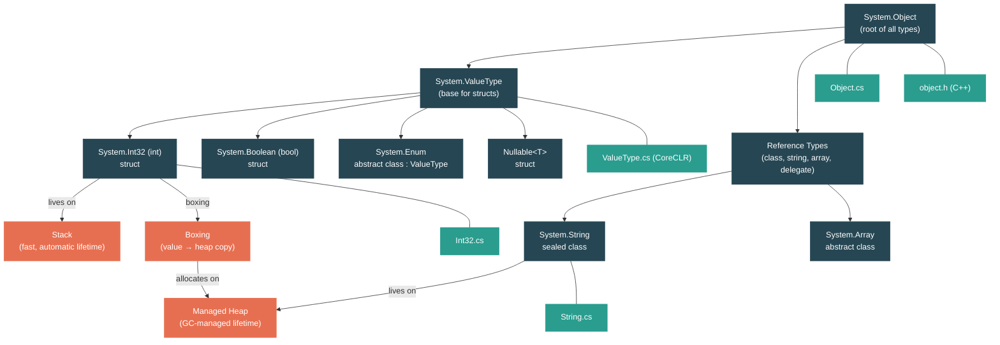

# Level 1: Foundations — The Type System: Values, References, and the Heap

> **Target profile:** Developer who uses classes and structs but doesn't fully understand memory implications
> **Estimated effort:** 4 hours
> **Prerequisites:** [Module 1.1](01-foundations-ecosystem-overview.md), [Module 1.2](01-foundations-project-structure.md)
> [Version en espanol](../es/01-foundations-type-system.md)

---

## Learning Objectives

By the end of this module you will be able to:

1. Explain the difference between value types and reference types at the memory level (stack vs heap).
2. Identify where `System.Object` is defined in the runtime source and describe the four methods it provides to every .NET object.
3. Trace the inheritance chain from `int` through `System.Int32`, `System.ValueType`, and up to `System.Object`.
4. Describe the native memory layout of any object on the managed heap (object header + MethodTable pointer + fields).
5. Explain what happens in memory when you box a value type and why it costs a heap allocation.
6. Describe why `System.String` is immutable and what string interning means.
7. Explain the structure of `Nullable<T>` and why it is itself a value type.
8. Read and navigate the relevant CoreLib source files that define these fundamental types.

---

## Concept Map



---

## Curriculum

### Lesson 1 — Everything Inherits from Object

#### What you'll learn

Every single type in .NET — `int`, `string`, your custom classes, even arrays — ultimately inherits from one class: `System.Object`. In this lesson you will see exactly what that root class provides.

#### The concept

`System.Object` defines four virtual instance methods that every .NET object inherits:

| Method | Purpose |
|---|---|
| `ToString()` | Returns a string representation. The default implementation returns the type's fully qualified name. |
| `Equals(object?)` | Tests value equality. The default for reference types is reference equality (`this == obj`). |
| `GetHashCode()` | Returns a hash code. The default is based on the object's sync block index (essentially its identity). |
| `~Object()` (Finalizer) | Called by the GC before reclaiming memory. The virtual slot for the finalizer is hardcoded in the runtime. |

There are also two important static methods:

- `ReferenceEquals(object?, object?)` — tests whether two references point to the same object.
- `Equals(object?, object?)` — a null-safe wrapper that calls the instance `Equals`.

Every .NET type can override `ToString()`, `Equals()`, and `GetHashCode()` because those are defined here at the root.

#### In the source code

Open `src/libraries/System.Private.CoreLib/src/System/Object.cs`. This is the shared (runtime-agnostic) definition:

```csharp
// The Object is the root class for all object in the CLR System. Object
// is the super class for all other CLR objects and provide a set of methods
// and low level services to subclasses.
public partial class Object
{
    [NonVersionable]
    public Object() { }

    // Allow an object to free resources before the object is reclaimed by the GC.
    // This method's virtual slot number is hardcoded in runtimes.
    // Do not add any virtual methods ahead of this.
    [NonVersionable]
    ~Object() { }

    public virtual string? ToString()
    {
        return GetType().ToString();
    }

    public virtual bool Equals(object? obj)
    {
        return this == obj;
    }

    public virtual int GetHashCode()
    {
        return RuntimeHelpers.GetHashCode(this);
    }
}
```

Notice the comment on the finalizer: *"This method's virtual slot number is hardcoded in runtimes. Do not add any virtual methods ahead of this."* This tells you that the runtime (written in C++) depends on the exact position of this method in the vtable. The managed C# code and the native C++ code must agree.

Also notice that `Object` is a `partial class`. The other parts live in runtime-specific directories (`src/coreclr/System.Private.CoreLib/` and `src/mono/System.Private.CoreLib/`) and add methods like `GetType()` and `MemberwiseClone()` that require runtime-specific implementations.

#### Hands-on exercise

1. Open the file `src/libraries/System.Private.CoreLib/src/System/Object.cs` in your editor.
2. Count the virtual methods. There are exactly three virtual instance methods plus the finalizer.
3. Search the repository for other partial definitions of `Object` using `grep -r "partial class Object" src/coreclr/System.Private.CoreLib/` — you will find the runtime-specific half that defines `GetType()`.
4. Write a small program:
   ```csharp
   object o = new object();
   Console.WriteLine(o.ToString());        // "System.Object"
   Console.WriteLine(o.GetHashCode());     // some integer
   Console.WriteLine(o.Equals(o));         // True
   Console.WriteLine(o.Equals(new object())); // False — different instance
   ```

#### Key takeaway

`System.Object` is small on purpose. It defines the minimum contract that every .NET object must satisfy: identity (`GetHashCode`, `Equals`), description (`ToString`), and lifetime management (finalizer). Everything else is built on top.

#### Common misconception

> *"`GetType()` is defined in Object.cs"*
>
> Not exactly. The method signature is part of `System.Object`, but the implementation is runtime-specific. It lives in `src/coreclr/System.Private.CoreLib/src/System/Object.CoreCLR.cs` for CoreCLR and a different file for Mono. This is the "partial class" pattern used throughout CoreLib.

---

### Lesson 2 — Value Types: Living on the Stack

#### What you'll learn

Value types (`struct`) store their data directly in the variable — typically on the stack or inline in the containing object. You will see how `System.ValueType` and `System.Int32` are defined in the runtime source.

#### The concept

In .NET, all types fall into two categories:

| | Value Types | Reference Types |
|---|---|---|
| **Keyword** | `struct`, `enum` | `class`, `interface`, `delegate`, `record class` |
| **Storage** | Data stored directly in the variable | Variable holds a pointer (reference) to data on the heap |
| **Assignment** | Copies the data | Copies the reference (both variables point to the same object) |
| **Default** | All bits zero (e.g., `0` for `int`, `false` for `bool`) | `null` |
| **Inheritance** | Cannot inherit from other structs | Full single-inheritance hierarchy |
| **Base class** | Implicitly inherits from `System.ValueType` | Inherits from `System.Object` (or another class) |

The inheritance chain for `int` is:

```
int  (C# alias)
  → System.Int32  (the actual struct)
    → System.ValueType  (abstract class — overrides Equals/GetHashCode)
      → System.Object  (root of everything)
```

This is paradoxical: `Int32` is a *struct* but its base class `ValueType` is declared as a *class*. This is a special case that the runtime handles. You cannot create your own class that inherits from `ValueType` — only the `struct` keyword can do that.

#### In the source code

**`System.ValueType`** is defined in the CoreCLR-specific part of CoreLib at `src/coreclr/System.Private.CoreLib/src/System/ValueType.cs`:

```csharp
// Purpose: Base class for all value classes.
public abstract partial class ValueType
{
    public override unsafe bool Equals([NotNullWhen(true)] object? obj)
    {
        if (null == obj) return false;
        if (GetType() != obj.GetType()) return false;

        // if there are no GC references in this object we can avoid reflection
        // and do a fast memcmp
        if (CanCompareBitsOrUseFastGetHashCode(RuntimeHelpers.GetMethodTable(obj)))
        {
            return SpanHelpers.SequenceEqual(
                ref RuntimeHelpers.GetRawData(this),
                ref RuntimeHelpers.GetRawData(obj),
                RuntimeHelpers.GetMethodTable(this)->GetNumInstanceFieldBytes());
        }

        // Fall back to field-by-field comparison via reflection
        FieldInfo[] thisFields = GetType().GetFields(...);
        // ...compare each field...
    }
}
```

Key insight: `ValueType.Equals()` has two paths:
1. **Fast path** — if the struct has no reference-type fields, it does a raw memory comparison (`SequenceEqual` on the bytes). This is very fast.
2. **Slow path** — if the struct contains references, it falls back to reflection, comparing field by field. This is why you should always override `Equals()` on your own structs.

**`System.Int32`** is defined at `src/libraries/System.Private.CoreLib/src/System/Int32.cs`:

```csharp
[StructLayout(LayoutKind.Sequential)]
public readonly struct Int32
    : IComparable, IConvertible, ISpanFormattable,
      IComparable<int>, IEquatable<int>,
      IBinaryInteger<int>, IMinMaxValue<int>, ...
{
    private readonly int m_value; // Do not rename (binary serialization)

    public const int MaxValue = 0x7fffffff;
    public const int MinValue = unchecked((int)0x80000000);
}
```

Notice: `Int32` is a `readonly struct` with a single field `m_value`. The entire struct is exactly 4 bytes of data. There is no overhead — no object header, no method table pointer. When it lives on the stack, it is literally just those 4 bytes.

#### Hands-on exercise

1. Write a program that demonstrates the copy semantics of value types:
   ```csharp
   int a = 42;
   int b = a;    // copies the value
   b = 99;
   Console.WriteLine(a); // still 42 — a and b are independent copies
   ```
2. Now try the same with a custom struct:
   ```csharp
   struct Point { public int X; public int Y; }

   Point p1 = new Point { X = 1, Y = 2 };
   Point p2 = p1;  // copies all fields
   p2.X = 99;
   Console.WriteLine(p1.X); // still 1
   ```
3. Verify the size: `Console.WriteLine(sizeof(int));` prints `4`. Try `sizeof(double)` (8), `sizeof(bool)` (1).

#### Key takeaway

Value types store data directly. Assigning or passing them creates a copy. This makes them cheap for small data (no heap allocation, no GC pressure) but potentially expensive for large structs (copying many bytes).

#### Common misconception

> *"Value types always live on the stack."*
>
> Not true. A value type lives on the stack only when it is a local variable or parameter. If a value type is a field of a class (reference type), it lives on the heap as part of that object. If it is captured by a lambda or used in an async method, the compiler may move it to the heap. "Value type" describes *copy semantics*, not *storage location*.

---

### Lesson 3 — Reference Types: The Heap and the Garbage Collector

#### What you'll learn

Reference types live on the managed heap. A variable of a reference type holds a pointer to the actual data. You will see the native memory layout that the runtime uses for every heap object.

#### The concept

When you write `var list = new List<int>();`, two things are created:

1. **The variable `list`** — on the stack, holding a pointer (typically 8 bytes on a 64-bit system).
2. **The object** — on the managed heap, containing an object header, a MethodTable pointer, and the object's fields.

The native layout of every object on the heap is defined in C++ in `src/coreclr/vm/object.h`:

```
┌─────────────────────────┐  ← negative offset from object pointer
│  Object Header          │     (sync block index, lock state, GC bits)
│  (OBJHEADER_SIZE)       │     8 bytes on 64-bit (4-byte align pad + 4-byte sync block)
├─────────────────────────┤  ← this is where the object reference actually points
│  MethodTable* m_pMethTab│     8 bytes on 64-bit — pointer to type metadata
├─────────────────────────┤
│  Instance fields...     │     varies by type
│                         │
└─────────────────────────┘
```

Every object on the heap has at least:
- **Object Header** (at a negative offset) — used for synchronization (`lock`), GC marking, and hash code storage.
- **MethodTable pointer** — tells the runtime what type this object is. This is how `GetType()` works: the runtime reads this pointer and returns the corresponding `Type` object.

The minimum object size on the heap is defined in `object.h`:

```cpp
#define MIN_OBJECT_SIZE     (2*TARGET_POINTER_SIZE + OBJHEADER_SIZE)
```

On a 64-bit system this is `2*8 + 8 = 24 bytes`. Even an empty class takes 24 bytes on the heap. This is the cost of being a reference type.

#### In the source code

Open `src/coreclr/vm/object.h` and look at the C++ `Object` class:

```cpp
// code:Object is the representation of a managed object on the GC heap.
class Object
{
  protected:
    PTR_MethodTable m_pMethTab;
    // ...
  public:
    MethodTable *RawGetMethodTable() const
    {
        return m_pMethTab;
    }
};
```

The only mandatory field is `m_pMethTab` — the MethodTable pointer. The object header sits *before* this pointer in memory (at a negative offset). This design lets the GC and runtime navigate objects extremely efficiently.

The comment at the top of `object.h` shows the full CLR object model hierarchy:

```
Object              ← common base for all CLR objects
 ├── StringObject   ← specialized for string storage (UTF-16)
 ├── ArrayBase      ← base for all arrays (has NumComponents)
 │    ├── I1Array, I2Array, ...
 │    └── PtrArray  ← array of object references
 └── ...
```

#### Hands-on exercise

1. Demonstrate reference semantics:
   ```csharp
   var a = new List<int> { 1, 2, 3 };
   var b = a;       // copies the reference, not the list
   b.Add(4);
   Console.WriteLine(a.Count); // 4 — both variables point to the same object
   ```
2. Test reference equality vs value equality:
   ```csharp
   string s1 = new string("hello".ToCharArray());
   string s2 = new string("hello".ToCharArray());
   Console.WriteLine(ReferenceEquals(s1, s2)); // False — different objects
   Console.WriteLine(s1 == s2);                // True — string overrides ==
   Console.WriteLine(s1.Equals(s2));           // True — value equality
   ```
3. Use `typeof()` and `GetType()` to inspect the MethodTable connection:
   ```csharp
   object o = 42;
   Console.WriteLine(o.GetType().Name);          // "Int32"
   Console.WriteLine(typeof(int) == o.GetType()); // True
   ```

#### Key takeaway

Every reference type object on the heap carries overhead: an object header and a MethodTable pointer. This is the price you pay for polymorphism, synchronization, and garbage collection. Value types avoid this overhead — until they get boxed.

---

### Lesson 4 — Boxing and Unboxing

#### What you'll learn

When a value type needs to be treated as a `System.Object` (or an interface), the runtime creates a copy of it on the heap in a process called *boxing*. The reverse operation — extracting the value back — is called *unboxing*. This lesson explains the mechanics and the performance cost.

#### The concept

Consider this code:

```csharp
int number = 42;
object boxed = number;  // boxing happens here
int unboxed = (int)boxed; // unboxing happens here
```

**What boxing does step by step:**

1. Allocates a new object on the managed heap (minimum 24 bytes on 64-bit, even for a 4-byte `int`).
2. Writes the object header (sync block index).
3. Writes the MethodTable pointer for `System.Int32`.
4. Copies the 4-byte value `42` into the object's field area.
5. Returns a reference to this new heap object.

**What unboxing does:**

1. Checks that the object's MethodTable matches the expected type (`Int32`). Throws `InvalidCastException` if not.
2. Returns a pointer to the value data inside the boxed object.
3. Copies the value from the heap into the stack variable.

The performance cost is not trivial:
- **Boxing** allocates on the heap, which means eventual garbage collection.
- **Unboxing** requires a type check and a copy.
- In a tight loop, repeated boxing can create significant GC pressure.

#### In the source code

You already know from `object.h` that every heap object has a header + MethodTable + fields. A boxed `int` on the heap looks like this:

```
┌───────────────────────┐
│  Object Header (8 B)  │  ← sync block, GC bits
├───────────────────────┤
│  MethodTable* (8 B)   │  ← points to Int32's MethodTable
├───────────────────────┤
│  int value (4 B)      │  ← the actual data: 42
├───────────────────────┤
│  padding (4 B)        │  ← alignment to MIN_OBJECT_SIZE
└───────────────────────┘
   Total: 24 bytes for a 4-byte value
```

The `ValueType.Equals()` method in `src/coreclr/System.Private.CoreLib/src/System/ValueType.cs` is relevant here because boxing is what makes `ValueType.Equals(object?)` possible — the parameter is `object?`, so passing a struct to it requires boxing the argument (unless the JIT can optimize it away).

#### Hands-on exercise

1. See boxing in action with a list that uses `object`:
   ```csharp
   // This causes boxing for every Add call
   var list = new System.Collections.ArrayList();
   for (int i = 0; i < 1000; i++)
   {
       list.Add(i); // boxing: int → object
   }

   // This does NOT box — generic List<int> stores ints directly
   var typedList = new List<int>();
   for (int i = 0; i < 1000; i++)
   {
       typedList.Add(i); // no boxing
   }
   ```
2. Detect boxing by looking at the IL. Use [SharpLab](https://sharplab.io/) to paste this code and look for the `box` IL instruction:
   ```csharp
   int x = 42;
   object o = x;  // IL will show: box [System.Runtime]System.Int32
   ```
3. Interface dispatch can also cause boxing:
   ```csharp
   int x = 42;
   IComparable c = x;  // boxing! int must become a heap object to be an IComparable reference
   ```

#### Key takeaway

Boxing converts a cheap stack-allocated value into an expensive heap-allocated object. Generics (`List<int>` instead of `ArrayList`) were introduced specifically to eliminate boxing. Whenever you see a value type being assigned to `object` or an interface, boxing is happening.

#### Common misconception

> *"The JIT always optimizes away boxing."*
>
> The JIT can eliminate boxing in some specific patterns (e.g., `typeof(T)` checks in generic methods), but in general, if you write `object o = myInt;`, boxing will happen. The best strategy is to avoid the pattern entirely — use generics instead of `object`.

---

### Lesson 5 — Strings: Immutable Reference Types

#### What you'll learn

`System.String` is a reference type, but it behaves differently from most classes: it is immutable, sealed, and the runtime treats it with special care. You will see how strings are laid out in memory and what interning means.

#### The concept

Strings in .NET have these special properties:

1. **Immutable** — once created, a string's characters can never change. Every "modification" (concatenation, `Replace`, `ToUpper`) creates a new string.
2. **Sealed** — you cannot inherit from `String`. This lets the runtime make layout assumptions.
3. **Variable length** — unlike most objects, a string's size depends on its content. The characters are stored inline in the object (not as a separate array).
4. **Interned** — the runtime maintains an intern table of string literals. Two identical string literals in your code may point to the exact same object.

A string object in memory looks like this:

```
┌───────────────────────────┐
│  Object Header (8 B)      │
├───────────────────────────┤
│  MethodTable* (8 B)       │  ← points to String's MethodTable
├───────────────────────────┤
│  _stringLength (4 B)      │  ← number of characters
├───────────────────────────┤
│  _firstChar (2 B)         │  ← first UTF-16 character
│  ... remaining chars ...  │  ← subsequent characters, inline
│  '\0' (2 B)               │  ← null terminator (for interop)
└───────────────────────────┘
```

Strings are both length-prefixed (`_stringLength`) *and* null-terminated (for easy interop with C-style APIs). The characters are stored as UTF-16 (`char` = 2 bytes each).

#### In the source code

Open `src/libraries/System.Private.CoreLib/src/System/String.cs`:

```csharp
// The String class represents a static string of characters. Many of
// the string methods perform some type of transformation on the current
// instance and return the result as a new string. As with arrays,
// character positions (indices) are zero-based.
public sealed partial class String
    : IComparable, IEnumerable, IConvertible, IEnumerable<char>,
      IComparable<string?>, IEquatable<string?>, ICloneable, ISpanParsable<string>
{
    /// <summary>Maximum length allowed for a string.</summary>
    /// <remarks>Keep in sync with AllocateString in gchelpers.cpp.</remarks>
    internal const int MaxLength = 0x3FFFFFDF;

    // These fields map directly onto the fields in an EE StringObject.
    // See object.h for the layout.
    [NonSerialized] private readonly int _stringLength;
    [NonSerialized] private char _firstChar;
}
```

Key things to notice:

1. The comment says *"These fields map directly onto the fields in an EE StringObject. See object.h for the layout."* — the managed field order must match the native C++ layout exactly.
2. `_firstChar` is not an array. The remaining characters follow it in memory, accessed with pointer arithmetic by the runtime. This avoids the overhead of a separate array allocation.
3. `MaxLength` is `0x3FFFFFDF` (about 1 billion characters). This is coordinated with the native allocation code in `gchelpers.cpp`.
4. `String.Empty` is initialized by the execution engine during startup and treated as an intrinsic by the JIT.

#### Hands-on exercise

1. Demonstrate immutability:
   ```csharp
   string s = "Hello";
   string s2 = s.Replace("H", "J");
   Console.WriteLine(s);   // "Hello" — original unchanged
   Console.WriteLine(s2);  // "Jello" — new string created
   ```
2. Demonstrate string interning:
   ```csharp
   string a = "hello";
   string b = "hello";
   Console.WriteLine(ReferenceEquals(a, b)); // True — same interned object

   string c = new string("hello".ToCharArray());
   Console.WriteLine(ReferenceEquals(a, c)); // False — 'c' is a new object

   string d = string.Intern(c);
   Console.WriteLine(ReferenceEquals(a, d)); // True — Intern returns the interned copy
   ```
3. Check the object size difference: a `string` with 10 characters uses approximately `26 + 10*2 = 46` bytes (header + MethodTable + length + 10 chars + null terminator), rounded up for alignment.

#### Key takeaway

`System.String` is a reference type with special runtime support for inline character storage, immutability, and interning. Understanding this explains why string concatenation in a loop is expensive (each `+` creates a new heap object) and why `StringBuilder` exists.

---

### Lesson 6 — Arrays and Nullable

#### What you'll learn

`System.Array` is the base class for all array types in .NET. `Nullable<T>` is a struct that wraps value types to allow null values. Both are fundamental building blocks with interesting type system properties.

#### The concept: Arrays

Arrays are reference types with a special memory layout. Unlike regular objects, arrays have a **component count** stored right after the MethodTable pointer:

```
┌───────────────────────────┐
│  Object Header (8 B)      │
├───────────────────────────┤
│  MethodTable* (8 B)       │  ← points to the specific array type (e.g., int[])
├───────────────────────────┤
│  NumComponents (4 B)      │  ← the Length of the array
├───────────────────────────┤
│  padding (4 B)            │  ← alignment on 64-bit
├───────────────────────────┤
│  element[0]               │  ← array data starts here
│  element[1]               │
│  ...                      │
│  element[N-1]             │
└───────────────────────────┘
```

This layout is defined in `object.h`:

```cpp
#define ARRAYBASE_SIZE  (OBJECT_SIZE + sizeof(DWORD) /* m_NumComponents */ + sizeof(DWORD) /* pad */)
```

Important properties of arrays:
- `System.Array` is an `abstract class` — you cannot instantiate it directly. You use `new int[10]` or `Array.CreateInstance()`.
- Arrays are always zero-indexed.
- The runtime performs bounds checking on every access (the JIT can sometimes eliminate this).
- Arrays of value types store elements inline (no boxing). An `int[]` of 100 elements stores 100 contiguous 4-byte integers.
- Arrays of reference types store object references (pointers).

#### The concept: Nullable<T>

`Nullable<T>` solves the problem of "I need an `int` that can also be null." It is a struct with just two fields:

```csharp
public struct Nullable<T> where T : struct
{
    private readonly bool hasValue;
    internal T value;
}
```

Because `Nullable<T>` is itself a struct, it lives on the stack just like `T` would. The C# `?` suffix is syntactic sugar: `int?` is `Nullable<int>`.

The clever part is boxing behavior. The runtime has special support: when you box a `Nullable<T>`, it does NOT create a boxed `Nullable<T>`. Instead:
- If `hasValue` is `true`, it boxes just the inner `T` value.
- If `hasValue` is `false`, the result is `null` (no allocation at all).

This is why the comment in `Nullable.cs` says:

> *"Because we have special type system support that says a boxed Nullable<T> can be used where a boxed T is used, Nullable<T> can not implement any interfaces at all (since T may not)."*

#### In the source code

**`System.Array`** at `src/libraries/System.Private.CoreLib/src/System/Array.cs`:

```csharp
public abstract partial class Array : ICloneable, IList, IStructuralComparable, IStructuralEquatable
{
    // This ctor exists solely to prevent C# from generating a protected .ctor
    // that violates the surface area.
    private protected Array() { }
}
```

Notice: the constructor is `private protected` — only the runtime itself can create array instances.

**`Nullable<T>`** at `src/libraries/System.Private.CoreLib/src/System/Nullable.cs`:

```csharp
public partial struct Nullable<T> where T : struct
{
    private readonly bool hasValue;
    internal T value;

    public Nullable(T value)
    {
        this.value = value;
        hasValue = true;
    }

    public readonly bool HasValue => hasValue;

    public readonly T Value
    {
        get
        {
            if (!hasValue)
                ThrowHelper.ThrowInvalidOperationException_InvalidOperation_NoValue();
            return value;
        }
    }

    public override bool Equals(object? other)
    {
        if (!hasValue) return other == null;
        if (other == null) return false;
        return value.Equals(other);
    }

    public override int GetHashCode() => hasValue ? value.GetHashCode() : 0;

    public override string? ToString() => hasValue ? value.ToString() : "";
}
```

Key details:
- `value` is `internal` (not private) — other parts of the runtime need to access it.
- The `Equals` method has special logic: a `Nullable<T>` with no value equals `null`.
- `ToString()` returns `""` (empty string, not `"null"`) when there is no value.
- No interfaces are implemented — the comment explains why this is necessary for the boxing optimization.

#### Hands-on exercise

1. Array reference semantics:
   ```csharp
   int[] arr1 = { 1, 2, 3 };
   int[] arr2 = arr1;     // copies the reference, not the array
   arr2[0] = 99;
   Console.WriteLine(arr1[0]); // 99 — same array object
   ```
2. Nullable boxing behavior:
   ```csharp
   int? a = 42;
   int? b = null;

   object boxedA = a;  // boxes as Int32, not Nullable<Int32>
   object boxedB = b;  // becomes null, no allocation

   Console.WriteLine(boxedA.GetType().Name); // "Int32" — not "Nullable`1"
   Console.WriteLine(boxedB is null);         // True
   ```
3. Size comparison:
   ```csharp
   // Nullable<int> is 8 bytes: 4 for bool (+ padding) + 4 for int
   Console.WriteLine(System.Runtime.InteropServices.Marshal.SizeOf<int?>());
   // int is 4 bytes
   Console.WriteLine(sizeof(int));
   ```

#### Key takeaway

Arrays are reference types with a special inline layout that makes element access fast. `Nullable<T>` is a value type wrapper with runtime magic for boxing. Both demonstrate how the .NET type system provides powerful abstractions while the runtime handles the tricky details.

---

## Source Code Reading Guide

These are the key files for this module. Difficulty ratings reflect the conceptual complexity for a Level 1 reader.

| # | File | Difficulty | What to look for |
|---|---|---|---|
| 1 | `src/libraries/System.Private.CoreLib/src/System/Object.cs` | One star | The four virtual methods. The comment about the finalizer's virtual slot. |
| 2 | `src/coreclr/System.Private.CoreLib/src/System/ValueType.cs` | Two stars | The fast path vs slow path in `Equals()`. The use of `CanCompareBitsOrUseFastGetHashCode`. |
| 3 | `src/libraries/System.Private.CoreLib/src/System/Int32.cs` | One star | `readonly struct`, the `m_value` field, the interface list. |
| 4 | `src/libraries/System.Private.CoreLib/src/System/String.cs` | Two stars | The `_stringLength` and `_firstChar` fields. The comment about matching `StringObject` layout. |
| 5 | `src/libraries/System.Private.CoreLib/src/System/Nullable.cs` | One star | The two fields, the boxing comment at the top, the `Equals` implementation. |
| 6 | `src/libraries/System.Private.CoreLib/src/System/Array.cs` | One star | The `private protected` constructor. The `ICloneable` and `IList` interfaces. |
| 7 | `src/libraries/System.Private.CoreLib/src/System/Enum.cs` | Two stars | `Enum : ValueType` — how enums fit in the type hierarchy. |
| 8 | `src/coreclr/vm/object.h` | Two stars | The `#ObjectModel` comment, `OBJHEADER_SIZE`, `MIN_OBJECT_SIZE`, the C++ `Object` class with `m_pMethTab`. |

**Reading strategy**: Start with files 1, 3, and 5 (one star). They are short and straightforward. Then move to files 2 and 4 (two stars), where you will see runtime-specific implementation details. Save `object.h` (file 8) for last — it is C++, but the comments are excellent and the structure maps directly to what you learned in the lessons.

---

## Diagnostic Tools and Commands

At Level 1, you do not need advanced profiling tools yet. Here are the tools that help you explore the type system:

| Tool / Technique | What it shows | How to use |
|---|---|---|
| `typeof(T)` | The `System.Type` object for a type at compile time | `Console.WriteLine(typeof(int));` outputs `System.Int32` |
| `obj.GetType()` | The runtime type of an object (reads the MethodTable) | `object o = 42; Console.WriteLine(o.GetType());` outputs `System.Int32` |
| `sizeof(T)` | Size in bytes of a value type (compile-time for primitives) | `Console.WriteLine(sizeof(int));` outputs `4` |
| `System.Runtime.InteropServices.Marshal.SizeOf<T>()` | Marshalled size of a type | Useful for seeing `Nullable<int>` size |
| Debugger Watch window | Inspect object type, fields, and references | Set a breakpoint, hover over variables, expand properties |
| Visual Studio Memory window | View raw bytes in memory | Debug > Windows > Memory to see object layout |
| [SharpLab](https://sharplab.io/) | View IL, JIT ASM, and lowered C# | Paste code, select IL or JIT ASM output to see `box`/`unbox` instructions |
| `is` / `as` operators | Runtime type checking | `if (obj is int i) { ... }` — safe unboxing pattern |

---

## Self-Assessment

Test your understanding with these questions. Try to answer them before checking the answers.

### Questions

1. **What are the four virtual instance methods defined in `System.Object`?** What does each one do by default?

2. **Why is `ValueType` declared as `abstract class` if all value types are structs?** Can you create your own class that inherits from `ValueType`?

3. **You have a `struct` with two `int` fields and one `string` field. How does `ValueType.Equals()` compare two instances of this struct** (assuming you haven't overridden `Equals`)?

4. **How many bytes does a boxed `int` occupy on the heap (64-bit system)?** Break down the components.

5. **Why can't `Nullable<T>` implement any interfaces?** What happens when you box a `Nullable<int>` that has a value? What about one without a value?

6. **What is the difference between `string.Empty` and `""`?** Can you think of a scenario where `ReferenceEquals(string.Empty, "")` might return `true`?

### Practical Challenge

Write a program that demonstrates all three storage scenarios for value types:

1. A `struct Point { public int X; public int Y; }` as a local variable (stack).
2. The same `Point` as a field of a class (heap, inline in the object).
3. The `Point` assigned to an `object` variable (boxed on the heap).

For each case, use `GetType()` and the debugger to verify the type. For the boxed case, show that modifying the original `Point` does NOT affect the boxed copy.

<details>
<summary>Hint</summary>

```csharp
struct Point { public int X; public int Y; }

class Container { public Point Location; }

// Case 1: Stack
Point p = new Point { X = 1, Y = 2 };

// Case 2: Heap (inside a class)
var c = new Container { Location = new Point { X = 3, Y = 4 } };

// Case 3: Boxing
object boxed = p;

p.X = 99;
Console.WriteLine(((Point)boxed).X); // Still 1 — boxed is an independent copy
```
</details>

---

## Connections

| Direction | Module | Relationship |
|---|---|---|
| **Previous** | [1.2 — Project Structure and the Build System](01-foundations-project-structure.md) | You now know where types are defined; Module 1.2 taught you how the project files reference them. |
| **Next** | [1.4 — Control Flow, Exceptions, and the Call Stack](01-foundations-control-flow.md) | Understanding stack vs heap from this module is essential for understanding the call stack and exception unwinding. |
| **Related** | [1.5 — Assemblies, Namespaces, and the Loader](01-foundations-assemblies.md) | Types are organized into assemblies; the loader resolves them at runtime. |
| **Deeper** | [2.1 — Generics: From Syntax to Runtime Specialization](../en/02-practitioner-generics.md) | Generics are the type system's solution to the boxing problem you learned about here. |
| **Deeper** | [3.1 — Memory Model: Stack, Heap, Span, and Memory](../en/03-advanced-memory-model.md) | A detailed treatment of memory management building on the foundations here. |

---

## Glossary

| Term | Definition |
|---|---|
| **Value type** | A type whose data is stored directly in the variable. Declared with `struct` or `enum` in C#. Inherits from `System.ValueType`. |
| **Reference type** | A type whose variable holds a pointer (reference) to data on the managed heap. Declared with `class`, `interface`, `delegate`, or `record class`. |
| **Stack** | A LIFO (last-in, first-out) memory region used for local variables, method parameters, and return addresses. Allocation and deallocation are automatic and fast. |
| **Heap** | The managed heap is a region of memory managed by the Garbage Collector. Reference type objects live here. Allocation is fast (bump pointer) but deallocation requires GC. |
| **Boxing** | The process of wrapping a value type in a heap-allocated `System.Object`. Involves memory allocation and data copying. |
| **Unboxing** | The process of extracting a value type from a boxed object. Involves a type check and data copying. |
| **GC (Garbage Collector)** | The runtime component that automatically reclaims heap memory that is no longer referenced. Avoids manual memory management. |
| **Immutable** | An object that cannot be modified after creation. `System.String` is immutable — every modification creates a new string. |
| **Interning** | The process by which the runtime reuses a single string instance for all identical string literals. Reduces memory for repeated strings. |
| **Nullable** | `Nullable<T>` (C# syntax: `T?`) — a value type wrapper that adds a `hasValue` flag, allowing value types to represent the absence of a value. |
| **MethodTable** | A native runtime structure (C++) that describes a type: its methods, interfaces, base type, size, etc. Every heap object has a pointer to its MethodTable. |
| **Object header** | A native runtime structure stored at a negative offset from the object pointer. Contains the sync block index (used for locks and hash codes) and GC flags. |

---

## References

| Resource | Type | Relevance |
|---|---|---|
| [Book of the Runtime — Type System Overview](https://github.com/dotnet/runtime/blob/main/docs/design/coreclr/botr/type-system.md) | Design doc | Comprehensive description of how the CLR represents types |
| [Book of the Runtime — Managed Object Internals](https://github.com/dotnet/runtime/blob/main/docs/design/coreclr/botr/object-layout.md) | Design doc | Object layout, MethodTable, and sync block details |
| [.NET Source Browser — System.Object](https://source.dot.net/#System.Private.CoreLib/src/System/Object.cs) | Source | Browsable, indexed version of Object.cs |
| [SharpLab](https://sharplab.io/) | Tool | See IL and JIT output for boxing/unboxing scenarios |
| [Pro .NET Memory Management — Konrad Kokosa](https://prodotnetmemory.com/) | Book | Chapters 3-5 cover object layout, value types, and the GC heap in depth |
| [Stephen Toub — Performance Improvements in .NET (annual)](https://devblogs.microsoft.com/dotnet/) | Blog | Boxing elimination, struct improvements, and type system optimizations |

---

*Next module: [1.4 — Control Flow, Exceptions, and the Call Stack](01-foundations-control-flow.md)*
