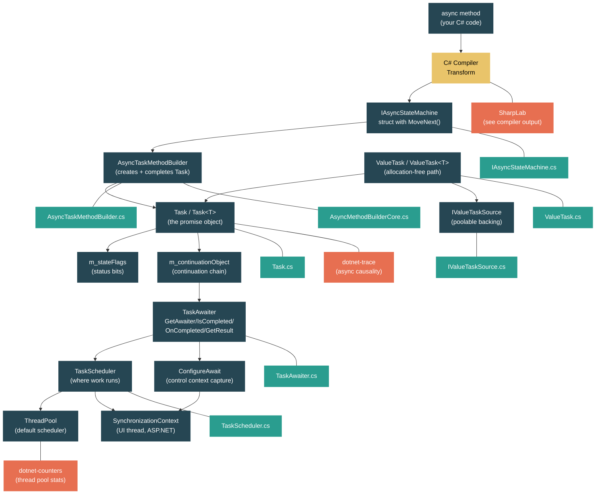

# Level 2: Practitioner -- Async/Await and the Task Machinery

> **Target profile:** Developer who uses async/await daily but doesn't understand the compiler transform or Task internals
> **Estimated effort:** 6 hours
> **Prerequisites:** [Module 2.1 -- Generics](02-practitioner-generics.md), [Level 1](01-foundations-ecosystem-overview.md)
> [Version en espanol](../es/02-practitioner-async-await.md)

---

## Learning Objectives

By the end of this module you will be able to:

1. Explain how the C# compiler transforms an `async` method into a struct that implements `IAsyncStateMachine`, with a `MoveNext()` method and a `<>1__state` field.
2. Describe the lifecycle of a `Task` object: its status flags (`m_stateFlags`), its continuation object (`m_continuationObject`), and its `ContingentProperties`.
3. Trace the awaiter pattern -- `GetAwaiter()`, `IsCompleted`, `OnCompleted()`, `GetResult()` -- and explain what happens at each `await` keyword.
4. Explain how `TaskScheduler` and `SynchronizationContext` determine where a continuation runs, and why `ConfigureAwait(false)` matters in library code.
5. Describe when `Task` allocates on the heap and how `ValueTask` and `IValueTaskSource` avoid that allocation.
6. Identify common pitfalls: `async void`, deadlocks from `.Result`/`.Wait()`, fire-and-forget risks, and double-await on `ValueTask`.

---

## Concept Map



---

## Curriculum

### Lesson 1 -- What `async` Does to Your Method

#### What you'll learn

The `async` keyword does not make your method run on another thread. It is a signal to the compiler to rewrite your method into a state machine. In this lesson you will see exactly what the compiler generates.

#### The concept

When you write:

```csharp
public async Task<string> FetchDataAsync(string url)
{
    var client = new HttpClient();
    string html = await client.GetStringAsync(url);
    return html.ToUpper();
}
```

The compiler transforms this into something conceptually equivalent to:

```csharp
// The compiler generates a struct (for release builds) implementing IAsyncStateMachine
[CompilerGenerated]
private struct <FetchDataAsync>d__0 : IAsyncStateMachine
{
    // State field: -1 = not started, 0 = awaiting first await, -2 = completed
    public int <>1__state;

    // The builder that creates and completes the Task<string>
    public AsyncTaskMethodBuilder<string> <>t__builder;

    // Method parameters become fields (they must survive across awaits)
    public string url;

    // Local variables that live across an await become fields
    private HttpClient <client>5__1;
    private string <html>5__2;

    // The awaiter for the pending operation
    private TaskAwaiter<string> <>u__1;

    public void MoveNext()
    {
        int num = <>1__state;
        string result;
        try
        {
            TaskAwaiter<string> awaiter;
            if (num != 0)
            {
                // First entry: state was -1
                <client>5__1 = new HttpClient();
                awaiter = <client>5__1.GetStringAsync(url).GetAwaiter();

                if (!awaiter.IsCompleted)
                {
                    // The operation is not done yet -- suspend
                    <>1__state = 0;
                    <>u__1 = awaiter;
                    <>t__builder.AwaitUnsafeOnCompleted(ref awaiter, ref this);
                    return; // <-- method returns here, Task is not yet complete
                }
            }
            else
            {
                // Resuming after the await
                awaiter = <>u__1;
                <>u__1 = default;
                <>1__state = -1;
            }

            // awaiter.GetResult() either returns the value or throws
            <html>5__2 = awaiter.GetResult();
            result = <html>5__2.ToUpper();
        }
        catch (Exception ex)
        {
            <>1__state = -2;
            <>t__builder.SetException(ex);
            return;
        }

        <>1__state = -2;
        <>t__builder.SetResult(result);
    }

    void IAsyncStateMachine.SetStateMachine(IAsyncStateMachine stateMachine)
    {
        <>t__builder.SetStateMachine(stateMachine);
    }
}
```

And the original method becomes a stub:

```csharp
public Task<string> FetchDataAsync(string url)
{
    var stateMachine = new <FetchDataAsync>d__0();
    stateMachine.url = url;
    stateMachine.<>t__builder = AsyncTaskMethodBuilder<string>.Create();
    stateMachine.<>1__state = -1;
    stateMachine.<>t__builder.Start(ref stateMachine);
    return stateMachine.<>t__builder.Task;
}
```

Key observations:

1. **The state machine is a struct** (in release builds). This avoids a heap allocation when the method completes synchronously.
2. **Parameters and locals that span an `await` become fields** of the struct. Locals that do not cross an `await` boundary remain true locals inside `MoveNext()`.
3. **The `<>1__state` field** tracks which `await` the method is at. The value `-1` means "running", `0, 1, 2...` correspond to specific await points, and `-2` means completed.
4. **`MoveNext()` is called once for the initial invocation**, then once more each time a pending operation completes.
5. **The method returns to the caller at the first incomplete `await`**. The Task is returned immediately but is not yet completed.

#### In the source code

The `IAsyncStateMachine` interface that the compiler targets is defined at `src/libraries/System.Private.CoreLib/src/System/Runtime/CompilerServices/IAsyncStateMachine.cs`:

```csharp
public interface IAsyncStateMachine
{
    /// <summary>Moves the state machine to its next state.</summary>
    void MoveNext();
    /// <summary>Configures the state machine with a heap-allocated replica.</summary>
    void SetStateMachine(IAsyncStateMachine stateMachine);
}
```

Just two methods. `MoveNext()` is the heart of every async method -- it contains all your original code, restructured as a state machine. `SetStateMachine` is a legacy method from before the current boxing-avoidance optimization (the source code comment says *"SetStateMachine should not be used"*).

The initial call goes through `AsyncMethodBuilderCore.Start()` at `src/libraries/System.Private.CoreLib/src/System/Runtime/CompilerServices/AsyncMethodBuilderCore.cs`:

```csharp
public static void Start<TStateMachine>(ref TStateMachine stateMachine)
    where TStateMachine : IAsyncStateMachine
{
    Thread currentThread = Thread.CurrentThread;
    ExecutionContext? previousExecutionCtx = currentThread._executionContext;
    SynchronizationContext? previousSyncCtx = currentThread._synchronizationContext;

    try
    {
        stateMachine.MoveNext();
    }
    finally
    {
        // Restore contexts so they don't leak out of the first await
        if (previousSyncCtx != currentThread._synchronizationContext)
            currentThread._synchronizationContext = previousSyncCtx;

        ExecutionContext? currentExecutionCtx = currentThread._executionContext;
        if (previousExecutionCtx != currentExecutionCtx)
            ExecutionContext.RestoreChangedContextToThread(currentThread, previousExecutionCtx, currentExecutionCtx);
    }
}
```

Notice: `Start()` saves and restores both `ExecutionContext` and `SynchronizationContext`. This prevents any context changes inside the first synchronous portion of your async method from leaking to the caller.

#### Hands-on exercise

1. Go to [SharpLab](https://sharplab.io/) and paste:
   ```csharp
   using System.Threading.Tasks;

   public class Example
   {
       public async Task<int> AddAsync(int a, int b)
       {
           await Task.Delay(100);
           return a + b;
       }
   }
   ```
   Switch the output to "C#" (lowered) to see the generated state machine. Identify the `<>1__state` field, the `MoveNext()` method, and the awaiter field.

2. Add a second `await` and observe how the state machine gains another state value and another awaiter field.

3. Change the method to return synchronously (`return a + b;` without any `await`). Observe that the compiler still generates a state machine, but the builder uses `Task.FromResult` (via `SetResult`) without ever suspending.

#### Key takeaway

`async` is a compiler feature, not a runtime feature. The compiler rewrites your method into a state machine struct that implements `IAsyncStateMachine`. The runtime provides `AsyncTaskMethodBuilder` and `TaskAwaiter` to drive this state machine forward. Understanding this transform is the key to understanding everything else about async in .NET.

#### Common misconception

> *"`async` makes my method run on a background thread."*
>
> No. The `async` keyword only enables the `await` keyword inside the method. The method starts running synchronously on the caller's thread. It only yields control (returns) when it hits an `await` on an operation that is not yet completed. If the awaited operation is already done (e.g., `Task.FromResult`), no suspension happens at all.

---

### Lesson 2 -- Task: More Than a Promise

#### What you'll learn

`Task` is the runtime's representation of an asynchronous operation. It is not just a simple promise -- it carries status flags, a continuation chain, exception storage, and cancellation support. In this lesson you will explore its internal structure.

#### The concept

A `Task` object has three core pieces of state:

| Field | Type | Purpose |
|---|---|---|
| `m_stateFlags` | `volatile int` | Bit-packed status: started, completed, faulted, canceled, waiting for children, etc. |
| `m_continuationObject` | `volatile object?` | Can be null, a single `Action`, a list of continuations, or a completion sentinel. |
| `m_contingentProperties` | `ContingentProperties?` | Lazily allocated: holds `ExecutionContext`, `CancellationToken`, exception holder, parent task, and completion event. |

The `m_stateFlags` field packs multiple things into a single `int`:

```
Bits 0-15:   TaskCreationOptions (public flags)
Bits 16-30:  Internal state flags
```

Key state flags from `Task.cs`:

```csharp
internal enum TaskStateFlags
{
    Started                  = 0x10000,
    DelegateInvoked          = 0x20000,
    Disposed                 = 0x40000,
    ExceptionObservedByParent= 0x80000,
    CancellationAcknowledged = 0x100000,
    Faulted                  = 0x200000,
    Canceled                 = 0x400000,
    WaitingOnChildren        = 0x800000,
    RanToCompletion          = 0x1000000,
    WaitingForActivation     = 0x2000000,
    CompletionReserved       = 0x4000000,
    CompletedMask = Canceled | Faulted | RanToCompletion,
}
```

These flags map to the `TaskStatus` enum that you see when calling `task.Status`:

| Status | Meaning |
|---|---|
| `Created` | Task exists but has not been scheduled |
| `WaitingForActivation` | Task is waiting to be activated (common for async/await Tasks) |
| `WaitingToRun` | Scheduled but not yet running |
| `Running` | Currently executing |
| `WaitingForChildrenToComplete` | Finished executing, waiting for attached children |
| `RanToCompletion` | Completed successfully |
| `Canceled` | Acknowledged cancellation |
| `Faulted` | Completed with an unhandled exception |

The continuation mechanism is how `await` wires things up. When a Task is not yet complete and something calls `OnCompleted`, the continuation (an `Action` or a state machine box) is stored in `m_continuationObject`. When the Task completes, it fires all registered continuations. The comment in the source is revealing:

```csharp
// Can be null, a single continuation, a list of continuations, or s_taskCompletionSentinel,
// in that order. The logic around this object assumes it will never regress to a previous state.
private volatile object? m_continuationObject;
```

The `ContingentProperties` class is a space optimization. Most Tasks complete successfully without needing cancellation tokens, exception storage, or parent relationships. By lazily allocating `ContingentProperties` only when needed, the common case keeps the Task object small.

#### In the source code

Open `src/libraries/System.Private.CoreLib/src/System/Threading/Tasks/Task.cs` and look at the field declarations:

```csharp
public class Task : IAsyncResult, IDisposable
{
    [ThreadStatic]
    internal static Task? t_currentTask;  // The currently executing task

    private static int s_taskIdCounter;

    private int m_taskId;
    internal Delegate? m_action;
    private protected object? m_stateObject;
    internal TaskScheduler? m_taskScheduler;
    internal volatile int m_stateFlags;

    private volatile object? m_continuationObject;
}
```

Notice that `m_action` stores the delegate -- but for async state machine Tasks, this field is repurposed. The `AsyncStateMachineBox<TStateMachine>` class (which IS a `Task<TResult>`) uses `m_action` to cache the `MoveNextAction` delegate, and `m_stateObject` to store the `ExecutionContext`.

This is a critical design insight: **the `AsyncStateMachineBox` IS the Task**. The state machine box inherits from `Task<TResult>`, so the box serves as both the state machine container and the promise that callers await. There is no separate Task allocation -- they are the same object.

From `AsyncTaskMethodBuilderT.cs`:

```csharp
private class AsyncStateMachineBox<TStateMachine> :
    Task<TResult>, IAsyncStateMachineBox
    where TStateMachine : IAsyncStateMachine
{
    public TStateMachine? StateMachine;

    public ref ExecutionContext? Context
    {
        get => ref Unsafe.As<object?, ExecutionContext?>(ref m_stateObject);
    }
}
```

#### Hands-on exercise

1. Inspect Task status transitions:
   ```csharp
   var tcs = new TaskCompletionSource<int>();
   Task<int> task = tcs.Task;

   Console.WriteLine(task.Status); // WaitingForActivation

   tcs.SetResult(42);
   Console.WriteLine(task.Status); // RanToCompletion
   Console.WriteLine(task.Result); // 42
   ```

2. See the continuation chain in action:
   ```csharp
   var tcs = new TaskCompletionSource<int>();
   Task<int> task = tcs.Task;

   // Register three continuations
   task.ContinueWith(t => Console.WriteLine($"A: {t.Result}"));
   task.ContinueWith(t => Console.WriteLine($"B: {t.Result}"));
   task.ContinueWith(t => Console.WriteLine($"C: {t.Result}"));

   tcs.SetResult(42); // All three fire
   ```

3. Observe the exception behavior:
   ```csharp
   async Task FailAsync()
   {
       await Task.Delay(10);
       throw new InvalidOperationException("Boom");
   }

   Task t = FailAsync();
   try { await t; }
   catch (InvalidOperationException ex)
   {
       Console.WriteLine(t.Status);                  // Faulted
       Console.WriteLine(t.Exception!.InnerException!.Message); // "Boom"
   }
   ```

#### Key takeaway

A `Task` is a rich object with bit-packed status flags, a continuation chain, and lazily-allocated properties for exceptions and cancellation. For async methods, the `AsyncStateMachineBox` IS the Task itself -- the state machine and the promise are the same heap object. This is how the runtime avoids an extra allocation per async operation.

#### Common misconception

> *"Every `async` method allocates a Task on the heap."*
>
> Not always. If the method completes synchronously (no `await` actually suspends), the builder can return a cached Task. For `Task` (non-generic), a singleton `s_cachedCompleted` is returned. For `Task<bool>`, cached True and False tasks exist. For `Task<int>`, small integer results may be cached. The allocation only happens when the method truly suspends.

---

### Lesson 3 -- The Awaiter Pattern

#### What you'll learn

`await` is not limited to `Task`. You can `await` any type that follows the awaiter pattern. In this lesson you will see what the compiler actually calls, and how `TaskAwaiter` implements this contract.

#### The concept

When the compiler sees `await someExpression`, it generates code equivalent to:

```csharp
var awaiter = someExpression.GetAwaiter();

if (!awaiter.IsCompleted)
{
    // Suspend: register continuation and return
    <>1__state = N;
    <>u__N = awaiter;
    <>t__builder.AwaitUnsafeOnCompleted(ref awaiter, ref this);
    return;
}

// Resume (or never suspended): get the result
var result = awaiter.GetResult();
```

The awaiter pattern requires three members:

| Member | Purpose |
|---|---|
| `bool IsCompleted { get; }` | Check if the operation already finished (fast path -- no suspension needed) |
| `void OnCompleted(Action continuation)` | Register a callback to invoke when the operation completes (from `INotifyCompletion`) |
| `TResult GetResult()` | Retrieve the result or throw the stored exception |

There are two notification interfaces:

- `INotifyCompletion` -- has `OnCompleted(Action)` which flows `ExecutionContext`
- `ICriticalNotifyCompletion` -- has `UnsafeOnCompleted(Action)` which does NOT flow `ExecutionContext` (the builder handles this separately for efficiency)

`TaskAwaiter` implements both. The compiler prefers `UnsafeOnCompleted` because the builder has its own `ExecutionContext` capture logic.

#### In the source code

Open `src/libraries/System.Private.CoreLib/src/System/Runtime/CompilerServices/TaskAwaiter.cs`:

```csharp
public readonly struct TaskAwaiter : ICriticalNotifyCompletion, ITaskAwaiter
{
    internal readonly Task m_task;

    public bool IsCompleted => m_task.IsCompleted;

    public void OnCompleted(Action continuation)
    {
        OnCompletedInternal(m_task, continuation,
            continueOnCapturedContext: true, flowExecutionContext: true);
    }

    public void UnsafeOnCompleted(Action continuation)
    {
        OnCompletedInternal(m_task, continuation,
            continueOnCapturedContext: true, flowExecutionContext: false);
    }

    public void GetResult()
    {
        ValidateEnd(m_task);
    }
}
```

Key observations:

1. `TaskAwaiter` is a `readonly struct` -- no heap allocation for the awaiter itself.
2. `IsCompleted` delegates directly to `Task.IsCompleted`.
3. Both `OnCompleted` and `UnsafeOnCompleted` call the same internal method, but with different flags for `ExecutionContext` flow.
4. `GetResult()` calls `ValidateEnd` which throws the stored exception if the Task faulted or was canceled. For a successful Task, it is a no-op (the non-generic `TaskAwaiter` has no return value).

The `continueOnCapturedContext: true` parameter is the default behavior -- it means "resume on the original `SynchronizationContext` if one was captured". This is what `ConfigureAwait(false)` changes.

Notice how the builder's `AwaitUnsafeOnCompleted` method has fast-path detection for known awaiter types:

```csharp
// From AsyncTaskMethodBuilderT.cs
if ((null != (object?)default(TAwaiter)) && (awaiter is ITaskAwaiter))
{
    // Fast path for TaskAwaiter -- avoid virtual dispatch
    ref TaskAwaiter ta = ref Unsafe.As<TAwaiter, TaskAwaiter>(ref awaiter);
    TaskAwaiter.UnsafeOnCompletedInternal(ta.m_task, box, continueOnCapturedContext: true);
}
```

The builder uses `Unsafe.As` to reinterpret the awaiter and calls an internal method directly, bypassing interface dispatch. This is a micro-optimization that matters for the hot path of async methods.

#### Hands-on exercise

1. Create a custom awaitable type:
   ```csharp
   public struct DelayAwaitable
   {
       private readonly int _milliseconds;
       public DelayAwaitable(int ms) => _milliseconds = ms;

       public DelayAwaiter GetAwaiter() => new DelayAwaiter(_milliseconds);
   }

   public struct DelayAwaiter : INotifyCompletion
   {
       private readonly int _milliseconds;
       public DelayAwaiter(int ms) => _milliseconds = ms;

       public bool IsCompleted => _milliseconds <= 0;

       public void OnCompleted(Action continuation)
       {
           Task.Delay(_milliseconds).ContinueWith(_ => continuation());
       }

       public void GetResult() { } // void return
   }

   // Usage:
   await new DelayAwaitable(1000);
   Console.WriteLine("Done!");
   ```

2. Verify the fast path with [SharpLab](https://sharplab.io/). Write a simple async method that awaits `Task.CompletedTask` and observe that `IsCompleted` returns `true` and no suspension occurs -- the entire method runs synchronously.

3. Try awaiting something that isn't a Task:
   ```csharp
   // TimeSpan can be made awaitable with an extension method
   public static TaskAwaiter GetAwaiter(this TimeSpan timeSpan)
       => Task.Delay(timeSpan).GetAwaiter();

   await TimeSpan.FromSeconds(1); // Now this compiles and works!
   ```

#### Key takeaway

`await` is pattern-based: it calls `GetAwaiter()`, checks `IsCompleted`, and either gets the result immediately or registers a continuation via `OnCompleted`/`UnsafeOnCompleted`. `TaskAwaiter` is the most common implementation, but any type that follows the pattern can be awaited. The builder contains optimized fast paths for the common awaiter types.

---

### Lesson 4 -- TaskScheduler, SynchronizationContext, and ConfigureAwait

#### What you'll learn

When an `await` suspends and later the operation completes, something must decide *where* the continuation runs. That "something" is the combination of `SynchronizationContext` and `TaskScheduler`. This lesson explains how they work and why `ConfigureAwait(false)` is important.

#### The concept

There are two context mechanisms:

**SynchronizationContext** is a class that represents a "target thread or environment" for posting work. Important implementations:

| Implementation | Where | Purpose |
|---|---|---|
| `null` (default) | Console apps, ASP.NET Core | No special context -- continuations run on thread pool |
| `DispatcherSynchronizationContext` | WPF | Posts work to the UI dispatcher thread |
| `WindowsFormsSynchronizationContext` | WinForms | Posts work to the UI message loop |

**TaskScheduler** is an abstract class that queues and executes `Task` objects. The default `TaskScheduler.Default` uses the thread pool.

When `await` captures context, this is what happens:

1. Before suspending, the infrastructure checks `SynchronizationContext.Current`.
2. If a non-null `SynchronizationContext` exists, the continuation is posted to it via `SynchronizationContext.Post()`.
3. If no `SynchronizationContext` exists, the continuation checks for a non-default `TaskScheduler`.
4. If neither exists, the continuation runs directly on the thread that completed the awaited operation (typically a thread pool thread).

**`ConfigureAwait(false)`** tells the awaiter: "I don't need to resume on the captured context." This sets `continueOnCapturedContext` to `false`, which skips step 2 above.

Why this matters:

```csharp
// In a WPF button click handler:
private async void Button_Click(object sender, RoutedEventArgs e)
{
    // Running on UI thread. SynchronizationContext.Current is DispatcherSynchronizationContext.

    string data = await httpClient.GetStringAsync(url);
    // Still on UI thread -- the continuation was posted back to the dispatcher.

    TextBlock.Text = data; // Safe to touch UI elements.
}
```

But in library code:

```csharp
// In a library method -- you don't know what SynchronizationContext the caller has.
public async Task<string> GetDataAsync(string url)
{
    string raw = await httpClient.GetStringAsync(url).ConfigureAwait(false);
    // Runs on whatever thread completed the HTTP request (thread pool).
    // Does NOT post back to the caller's SynchronizationContext.

    return ProcessData(raw);
}
```

Using `ConfigureAwait(false)` in library code is important for two reasons:
1. **Performance** -- avoids unnecessary context switching (posting to UI thread and back).
2. **Deadlock prevention** -- if a caller does `.Result` on a single-threaded `SynchronizationContext`, and your library awaits without `ConfigureAwait(false)`, the continuation tries to post back to the blocked thread, causing a deadlock.

#### In the source code

Open `src/libraries/System.Private.CoreLib/src/System/Threading/Tasks/TaskScheduler.cs`:

```csharp
public abstract class TaskScheduler
{
    protected internal abstract void QueueTask(Task task);

    protected abstract bool TryExecuteTaskInline(Task task, bool taskWasPreviouslyQueued);

    protected abstract IEnumerable<Task>? GetScheduledTasks();

    public static TaskScheduler Default => ThreadPoolTaskScheduler.s_instance;
}
```

The key abstraction is `QueueTask` -- this is how a Task gets submitted for execution. The `ThreadPoolTaskScheduler` implementation calls `ThreadPool.UnsafeQueueUserWorkItem`, which is how async continuations end up running on thread pool threads.

The `ConfigureAwait` behavior is wired through the `continueOnCapturedContext` flag. Look at `TaskAwaiter.OnCompletedInternal`:

```csharp
internal static void OnCompletedInternal(Task task, Action continuation,
    bool continueOnCapturedContext, bool flowExecutionContext)
```

When `continueOnCapturedContext` is `true`, the method captures `SynchronizationContext.Current` and wraps the continuation in a callback that posts to that context. When `false`, it skips the capture entirely.

The `AsyncVoidMethodBuilder` in `src/libraries/System.Private.CoreLib/src/System/Runtime/CompilerServices/AsyncVoidMethodBuilder.cs` shows another context interaction:

```csharp
public static AsyncVoidMethodBuilder Create()
{
    SynchronizationContext? sc = SynchronizationContext.Current;
    sc?.OperationStarted();
    return new AsyncVoidMethodBuilder() { _synchronizationContext = sc };
}
```

Notice: `async void` methods call `OperationStarted()` on the `SynchronizationContext` at creation time and `OperationCompleted()` when done. This is how ASP.NET (classic, not Core) tracked pending async operations. It is also why `async void` interacts differently with error handling -- exceptions are posted to the `SynchronizationContext` rather than stored in a Task.

#### Hands-on exercise

1. Observe context capture in a console app:
   ```csharp
   Console.WriteLine($"Before await: Thread {Environment.CurrentManagedThreadId}");
   await Task.Delay(100);
   Console.WriteLine($"After await: Thread {Environment.CurrentManagedThreadId}");
   // In a console app (no SynchronizationContext), these will likely be different threads.
   ```

2. Demonstrate the deadlock scenario (conceptual -- do NOT do this in production):
   ```csharp
   // Imagine this runs on a UI thread with a SynchronizationContext:
   // string result = GetDataAsync().Result; // DEADLOCK!
   //
   // The .Result call blocks the UI thread.
   // GetDataAsync's continuation wants to post back to the UI thread.
   // The UI thread is blocked. -> Deadlock.
   //
   // Fix: either await (don't block), or use ConfigureAwait(false) inside GetDataAsync.
   ```

3. Check `SynchronizationContext.Current` in different app types:
   ```csharp
   // In a console app:
   Console.WriteLine(SynchronizationContext.Current is null); // True

   // In a WPF handler: SynchronizationContext.Current is DispatcherSynchronizationContext
   // In ASP.NET Core: SynchronizationContext.Current is null (by design!)
   ```

#### Key takeaway

`SynchronizationContext` determines where `await` continuations resume. In UI apps, this is the UI thread. In ASP.NET Core, there is no `SynchronizationContext` (by design for performance). Library code should use `ConfigureAwait(false)` to avoid capturing a context it does not need. Understanding this mechanism is essential for preventing deadlocks and writing efficient async code.

---

### Lesson 5 -- ValueTask: Avoiding Allocations

#### What you'll learn

Every time an async method suspends, it allocates an `AsyncStateMachineBox` on the heap (which IS the `Task`). When methods frequently complete synchronously, this allocation is wasteful. `ValueTask` and `ValueTask<T>` solve this problem. In this lesson you will understand when and why to use them.

#### The concept

`ValueTask<T>` is a `readonly struct` that can represent either:

1. **A `TResult` value directly** -- no heap allocation at all. For synchronous completion.
2. **A `Task<TResult>`** -- falls back to the standard Task allocation.
3. **An `IValueTaskSource<TResult>`** -- a poolable, reusable backing object.

The struct has these fields:

```csharp
public readonly struct ValueTask<TResult> : IEquatable<ValueTask<TResult>>
{
    internal readonly object? _obj;    // null, Task<T>, or IValueTaskSource<T>
    internal readonly TResult? _result; // the synchronous result (when _obj is null)
    internal readonly short _token;     // opaque token for IValueTaskSource
    internal readonly bool _continueOnCapturedContext;
}
```

The key insight is the discriminated union stored in `_obj`:
- If `_obj` is `null`: the result is in `_result` -- **zero allocation**.
- If `_obj` is a `Task<T>`: standard Task-backed behavior.
- If `_obj` is an `IValueTaskSource<T>`: pooled backing object that can be reused.

**When to use `ValueTask<T>`:**

| Scenario | Use `Task<T>` | Use `ValueTask<T>` |
|---|---|---|
| Method usually completes asynchronously | Preferred | Either works |
| Method often completes synchronously | Wasteful (allocates Task) | Preferred (zero alloc) |
| Result will be cached or awaited multiple times | Required | Not allowed |
| Used with `Task.WhenAll` / `Task.WhenAny` | Required | Must call `.AsTask()` first |

**`IValueTaskSource<T>`** is the advanced backing interface:

```csharp
public interface IValueTaskSource<out TResult>
{
    ValueTaskSourceStatus GetStatus(short token);
    void OnCompleted(Action<object?> continuation, object? state, short token,
        ValueTaskSourceOnCompletedFlags flags);
    TResult GetResult(short token);
}
```

The `token` parameter prevents misuse: each operation gets a unique token. If you try to use a stale `ValueTask` after the backing source has been recycled, the token mismatch causes an exception. This is how `Socket`, `Pipe`, and other high-performance I/O types pool their async operations without allocating a new Task per call.

#### In the source code

Open `src/libraries/System.Private.CoreLib/src/System/Threading/Tasks/ValueTask.cs`:

```csharp
[AsyncMethodBuilder(typeof(AsyncValueTaskMethodBuilder))]
[StructLayout(LayoutKind.Auto)]
public readonly struct ValueTask : IEquatable<ValueTask>
{
    internal readonly object? _obj;
    internal readonly short _token;
    internal readonly bool _continueOnCapturedContext;
}
```

The `[AsyncMethodBuilder]` attribute tells the compiler to use `AsyncValueTaskMethodBuilder` instead of `AsyncTaskMethodBuilder` when the method's return type is `ValueTask`. This builder can return the struct directly from a pool rather than allocating a new Task.

The type safety comment at the top of `ValueTask.cs` is worth reading:

> *"This code uses Unsafe.As to cast _obj. This is done in order to minimize the costs associated with casting _obj to a variety of different types [...] we can rely only on the _obj field to determine how to handle it."*

This means `ValueTask` uses a single `object?` field as a discriminated union, with the actual type determined by runtime type checks. This avoids the cost of a separate discriminator field and potential tearing issues in concurrent scenarios.

The `IValueTaskSource` interface at `src/libraries/System.Private.CoreLib/src/System/Threading/Tasks/Sources/IValueTaskSource.cs` defines the three operations needed for a poolable backing: `GetStatus`, `OnCompleted`, and `GetResult`.

#### Hands-on exercise

1. Compare allocations with BenchmarkDotNet (conceptually):
   ```csharp
   // Task<int> version -- allocates on every call
   public async Task<int> GetValueTaskBased()
   {
       if (_cache is not null) return _cache.Value; // Still allocates Task!
       return await ComputeAsync();
   }

   // ValueTask<int> version -- no allocation for the cached case
   public async ValueTask<int> GetValueValueTaskBased()
   {
       if (_cache is not null) return _cache.Value; // Returns struct, no alloc!
       return await ComputeAsync();
   }
   ```

2. Demonstrate the "do not await twice" rule:
   ```csharp
   ValueTask<int> vt = GetValueAsync();
   int result1 = await vt;  // OK
   // int result2 = await vt; // WRONG! Undefined behavior.
   // The IValueTaskSource backing may have already been recycled.
   ```

3. Convert `ValueTask` to `Task` when you need Task features:
   ```csharp
   ValueTask<int> vt = GetValueAsync();
   Task<int> task = vt.AsTask(); // Now you can cache it, use WhenAll, etc.
   ```

#### Key takeaway

`ValueTask<T>` is a struct that avoids heap allocations when async methods complete synchronously. It uses a discriminated union (`_obj` field) to hold either a direct result, a `Task<T>`, or a poolable `IValueTaskSource<T>`. Use it when methods frequently complete synchronously. Do not cache, await twice, or use combinators directly on a `ValueTask` -- convert to `Task` first with `.AsTask()` if needed.

---

### Lesson 6 -- Common Pitfalls

#### What you'll learn

Async/await has sharp edges that catch even experienced developers. This lesson covers the most important pitfalls: `async void`, deadlocks from synchronous blocking, fire-and-forget risks, and `ValueTask` misuse.

#### Pitfall 1: `async void`

`async void` methods are dangerous because:

1. **Exceptions cannot be caught by the caller.** An unhandled exception in an `async void` method is posted to the `SynchronizationContext` (or raised on the thread pool as an unobserved exception), which typically crashes the application.
2. **The caller has no way to know when the method completes.** There is no Task to await.
3. **Testing is difficult.** You cannot await the method in a test.

```csharp
// WRONG -- exception will crash the app
async void ProcessData()
{
    var data = await FetchAsync();
    Process(data); // If this throws, game over
}

// RIGHT -- exception is captured in the Task
async Task ProcessDataAsync()
{
    var data = await FetchAsync();
    Process(data); // Exception can be caught by the caller via await
}
```

The ONLY valid use case for `async void` is event handlers in UI frameworks (WPF, WinForms), because event handlers must return `void`.

Looking at the source, `AsyncVoidMethodBuilder.Create()` captures the current `SynchronizationContext` and calls `OperationStarted()`. When the method faults, it posts the exception to that context:

```csharp
// In AsyncVoidMethodBuilder:
public void SetException(Exception exception)
{
    if (_synchronizationContext != null)
    {
        // Post the exception to the SynchronizationContext
        // This will typically crash the application
    }
}
```

#### Pitfall 2: Deadlocks from `.Result` and `.Wait()`

This is the classic async deadlock:

```csharp
// On a thread with a single-threaded SynchronizationContext (e.g., WPF UI thread):
public void ButtonClick()
{
    string result = GetDataAsync().Result; // DEADLOCK
}

private async Task<string> GetDataAsync()
{
    string data = await httpClient.GetStringAsync(url); // Wants to resume on UI thread
    return data.ToUpper();
}
```

The deadlock happens because:
1. `.Result` blocks the UI thread, waiting for the Task to complete.
2. `GetStringAsync` completes on a thread pool thread.
3. The `await` continuation tries to post back to the UI thread (because `ConfigureAwait(false)` was not used).
4. The UI thread is blocked by `.Result`, so the continuation cannot run.
5. The Task never completes because the continuation never runs.

Solutions:
- **Always `await`, never `.Result`** in async contexts.
- Use `ConfigureAwait(false)` in library code.
- In ASP.NET Core, there is no `SynchronizationContext`, so this specific deadlock does not occur -- but blocking thread pool threads is still harmful.

#### Pitfall 3: Fire-and-forget

```csharp
// DANGEROUS -- exception is silently swallowed
_ = DoWorkAsync(); // fire-and-forget

// The exception from DoWorkAsync has nowhere to go.
// It becomes an unobserved Task exception.
```

If you truly need fire-and-forget, at least observe the exception:

```csharp
_ = DoWorkAsync().ContinueWith(t =>
{
    if (t.IsFaulted)
        logger.LogError(t.Exception, "Background work failed");
}, TaskContinuationOptions.OnlyOnFaulted);
```

Or create a helper:

```csharp
public static async void SafeFireAndForget(this Task task, Action<Exception>? onError = null)
{
    try { await task.ConfigureAwait(false); }
    catch (Exception ex) { onError?.Invoke(ex); }
}
```

#### Pitfall 4: Double-awaiting a `ValueTask`

```csharp
ValueTask<int> vt = GetValueAsync();
int a = await vt;
int b = await vt; // UNDEFINED BEHAVIOR

// The IValueTaskSource backing object may have been recycled.
// You might get the wrong result, an exception, or a hang.
```

Rule: a `ValueTask` must be consumed exactly once. Either `await` it, call `.AsTask()`, or call `.Result` (only if `IsCompleted` is true). Never do more than one of these.

#### Pitfall 5: Unnecessary `async`/`await` wrapping

```csharp
// UNNECESSARY -- adds overhead of a state machine for no benefit
public async Task<int> GetValueAsync()
{
    return await _innerService.GetValueAsync();
}

// BETTER -- just return the Task directly (no state machine)
public Task<int> GetValueAsync()
{
    return _innerService.GetValueAsync();
}
```

But be careful: if there is a `using` block or `try/catch`, you MUST keep `async`/`await` to ensure proper resource disposal and exception handling.

```csharp
// MUST keep async here for correct disposal
public async Task<int> GetValueAsync()
{
    await using var connection = await CreateConnectionAsync();
    return await connection.QueryAsync();
}
```

#### Hands-on exercise

1. Create an `async void` method that throws and observe the behavior in a console app (the app crashes or you see an unobserved exception event).

2. Write a test demonstrating that `Task` versions handle exceptions correctly while `async void` versions do not:
   ```csharp
   async Task ThrowsAsync()
   {
       await Task.Delay(10);
       throw new Exception("test");
   }

   // You can catch this:
   try { await ThrowsAsync(); }
   catch (Exception ex) { Console.WriteLine($"Caught: {ex.Message}"); }
   ```

3. Check if eliding async/await changes exception stack traces -- use [SharpLab](https://sharplab.io/) to compare the generated code for both patterns.

#### Key takeaway

Avoid `async void` except for event handlers. Never block on async code with `.Result` or `.Wait()` on threads with a `SynchronizationContext`. Always observe exceptions from fire-and-forget Tasks. Consume `ValueTask` exactly once. Elide `async`/`await` only for simple pass-through methods without resource management.

---

## Source Code Reading Guide

These are the key files for this module. Difficulty ratings reflect the conceptual complexity for a Level 2 reader.

| # | File | Difficulty | What to look for |
|---|---|---|---|
| 1 | `src/libraries/System.Private.CoreLib/src/System/Runtime/CompilerServices/IAsyncStateMachine.cs` | One star | The two-method interface: `MoveNext()` and `SetStateMachine()`. |
| 2 | `src/libraries/System.Private.CoreLib/src/System/Runtime/CompilerServices/AsyncTaskMethodBuilder.cs` | Two stars | `Start()` delegating to `AsyncMethodBuilderCore`, `SetResult()` using `s_cachedCompleted`, `Task` property with lazy init. |
| 3 | `src/libraries/System.Private.CoreLib/src/System/Runtime/CompilerServices/AsyncTaskMethodBuilderT.cs` | Three stars | `GetStateMachineBox()` method showing how the struct state machine is boxed onto the heap. `AsyncStateMachineBox<TStateMachine>` inheriting from `Task<TResult>`. |
| 4 | `src/libraries/System.Private.CoreLib/src/System/Runtime/CompilerServices/AsyncMethodBuilderCore.cs` | Two stars | `Start()` saving/restoring `ExecutionContext` and `SynchronizationContext`. |
| 5 | `src/libraries/System.Private.CoreLib/src/System/Threading/Tasks/Task.cs` (first 300 lines) | Two stars | `TaskStatus` enum, `TaskStateFlags` bit flags, `m_continuationObject` field, `ContingentProperties` class. |
| 6 | `src/libraries/System.Private.CoreLib/src/System/Runtime/CompilerServices/TaskAwaiter.cs` | Two stars | `IsCompleted`, `OnCompleted`, `UnsafeOnCompleted`, `GetResult`, `ValidateEnd`. |
| 7 | `src/libraries/System.Private.CoreLib/src/System/Threading/Tasks/ValueTask.cs` | Two stars | The `_obj` discriminated union field, `AsTask()`, the type safety comment. |
| 8 | `src/libraries/System.Private.CoreLib/src/System/Threading/Tasks/Sources/IValueTaskSource.cs` | One star | The three-method interface with `token` parameters for pooling safety. |
| 9 | `src/libraries/System.Private.CoreLib/src/System/Threading/Tasks/TaskScheduler.cs` | One star | `QueueTask()`, `TryExecuteTaskInline()`, `Default` property. |
| 10 | `src/libraries/System.Private.CoreLib/src/System/Runtime/CompilerServices/AsyncVoidMethodBuilder.cs` | Two stars | `Create()` capturing `SynchronizationContext` and calling `OperationStarted()`. |

**Reading strategy**: Start with files 1 and 8 (one star) -- they are short interfaces that establish the contracts. Then read files 2 and 4 to understand the builder pipeline. Read file 5 for Task internals, then file 6 to see how the awaiter connects to the Task. File 3 is the most complex -- save it for when you understand the overall flow. Files 7, 9, and 10 fill in the ValueTask and scheduling pictures.

---

## Diagnostic Tools and Commands

| Tool / Technique | What it shows | How to use |
|---|---|---|
| [SharpLab](https://sharplab.io/) | The compiler-generated state machine for any async method | Paste your async code, select "C#" output to see lowered code, or "IL" for the raw instructions. |
| `dotnet-counters` | Thread pool metrics: queue length, thread count, work items/sec | `dotnet-counters monitor --counters System.Runtime --process-id <pid>` |
| `dotnet-trace` | Async causality chain, TPL events | `dotnet-trace collect --providers System.Threading.Tasks.TplEventSource` |
| `DOTNET_JitDisasm` | JIT-generated assembly for async methods | `DOTNET_JitDisasm="*MoveNext" dotnet run` |
| Visual Studio Parallel Stacks (Tasks) | Visualize pending Tasks and their continuations | Debug > Windows > Tasks (or Parallel Stacks) |
| `Task.Status` property | Current lifecycle stage of a Task | Watch in debugger or log: `Console.WriteLine(task.Status)` |
| `SynchronizationContext.Current` | Whether a context is captured | `Console.WriteLine(SynchronizationContext.Current?.GetType().Name ?? "null")` |
| BenchmarkDotNet | Measure allocation difference between Task and ValueTask | Use `[MemoryDiagnoser]` to see heap allocations per operation |

---

## Self-Assessment

Test your understanding with these questions. Try to answer them before looking at the hints.

### Questions

1. **What three fields does the compiler-generated state machine struct have at minimum?** What does each one store?

2. **When an async method completes synchronously (no actual suspension), does it allocate a Task on the heap?** What optimization avoids this?

3. **What are the three members of the awaiter pattern?** Which one does the compiler check first before deciding whether to suspend?

4. **You have a library method that calls `await httpClient.GetStringAsync(url)`. Should you use `ConfigureAwait(false)`?** Why or why not?

5. **A `ValueTask<T>` has an `_obj` field of type `object?`. What three things can this field hold?** What does it mean when it is `null`?

6. **Why does `async void` cause unhandled exceptions to crash the application?** What does `AsyncVoidMethodBuilder` do differently from `AsyncTaskMethodBuilder`?

### Practical Challenge

Write an async method with two `await` expressions. Use [SharpLab](https://sharplab.io/) to view the lowered C# output. Then annotate the generated code, identifying:

1. The state machine struct and its state field
2. The two awaiter fields
3. The state transitions (-1, 0, 1, -2)
4. Where `MoveNext()` returns (suspension points)
5. Where `SetResult` is called (completion)

Then modify the method to use `ConfigureAwait(false)` on one of the awaits, and observe how the lowered code changes (the awaiter type changes from `TaskAwaiter` to `ConfiguredTaskAwaitable.ConfiguredTaskAwaiter`).

<details>
<summary>Hint</summary>

```csharp
public async Task<string> TwoAwaitsAsync()
{
    string first = await GetFirstAsync();           // state 0
    string second = await GetSecondAsync(first);    // state 1
    return first + second;                          // then SetResult
}
```

In the lowered code, look for `<>1__state = 0` and `<>1__state = 1` -- these correspond to the two suspension points.
</details>

---

## Connections

| Direction | Module | Relationship |
|---|---|---|
| **Previous** | [2.2 -- Collections Deep Dive](02-practitioner-collections.md) | Collections often return async enumerables; understanding Task machinery helps you understand `IAsyncEnumerable<T>`. |
| **Prerequisite** | [2.1 -- Generics](02-practitioner-generics.md) | `Task<T>`, `ValueTask<T>`, and `AsyncTaskMethodBuilder<T>` are all generic types. Understanding generic specialization explains why the runtime generates efficient code for each `TResult`. |
| **Next** | [2.4 -- Dependency Injection](02-practitioner-dependency-injection.md) | DI containers resolve services that often return Tasks; understanding async lifetimes helps manage scoped services correctly. |
| **Related** | [1.4 -- Control Flow and Exceptions](01-foundations-control-flow.md) | Exception handling in async methods builds on call stack fundamentals from Level 1. The state machine's try/catch in `MoveNext()` is how async exceptions are captured. |
| **Deeper** | [3.4 -- Threading Primitives and Synchronization](03-advanced-threading.md) | Dives deeper into `SynchronizationContext`, `SemaphoreSlim.WaitAsync()`, and thread pool internals. |
| **Deeper** | [4.7 -- Thread Pool Internals](04-internals-threadpool.md) | Explains how the managed thread pool decides thread counts and processes work items. |

---

## Glossary

| Term | Definition |
|---|---|
| **State machine** | A compiler-generated struct that implements `IAsyncStateMachine`. It contains your async method's logic, rewritten as a `MoveNext()` method with a state field tracking which `await` the method is currently at. |
| **`IAsyncStateMachine`** | The interface that all compiler-generated async state machines implement. Has two methods: `MoveNext()` and `SetStateMachine()`. |
| **`AsyncTaskMethodBuilder`** | A struct used by the compiler to create the `Task` that an async method returns, and to drive the state machine. It handles boxing the state machine into an `AsyncStateMachineBox` on the first suspension. |
| **`AsyncStateMachineBox`** | An internal class that inherits from `Task<TResult>` and holds the state machine, execution context, and `MoveNext` delegate. It IS the Task object that callers await. |
| **Awaiter** | A struct that implements the awaiter pattern: `IsCompleted`, `OnCompleted(Action)`, and `GetResult()`. `TaskAwaiter` is the most common implementation. |
| **`INotifyCompletion`** | Interface with `OnCompleted(Action)` that flows `ExecutionContext`. Required for the awaiter pattern. |
| **`ICriticalNotifyCompletion`** | Extends `INotifyCompletion` with `UnsafeOnCompleted(Action)` that does NOT flow `ExecutionContext`. Used by the builder for efficiency. |
| **Continuation** | The code that runs after an `await` completes. Stored in `Task.m_continuationObject` as an `Action`, a state machine box, or a list of continuations. |
| **`SynchronizationContext`** | An abstraction for posting work to a specific thread or environment. UI frameworks provide implementations that post to the UI thread. `null` in console apps and ASP.NET Core. |
| **`TaskScheduler`** | An abstract class that queues and executes Tasks. `TaskScheduler.Default` uses the thread pool. Custom schedulers can limit concurrency or target specific threads. |
| **`ConfigureAwait(false)`** | Tells the awaiter to NOT capture and resume on the current `SynchronizationContext`. Important in library code to avoid deadlocks and unnecessary context switching. |
| **`ValueTask<T>`** | A `readonly struct` that can represent either a synchronous result (no allocation), a `Task<T>`, or an `IValueTaskSource<T>`. Used to avoid allocations when methods frequently complete synchronously. |
| **`IValueTaskSource<T>`** | An interface for poolable async operation backing objects. Uses a `token` parameter to detect misuse of recycled objects. |
| **`ExecutionContext`** | Captures ambient state (e.g., `AsyncLocal<T>` values) and flows it across async operations. Restored by `AsyncMethodBuilderCore.Start()` after the first synchronous phase. |
| **`async void`** | An async method that returns `void` instead of `Task`. Exceptions are posted to the `SynchronizationContext` and cannot be caught by the caller. Only appropriate for event handlers. |
| **Task completion sentinel** | An internal object (`s_taskCompletionSentinel`) stored in `m_continuationObject` to indicate that a Task has completed and no more continuations should be registered. |

---

## References

| Resource | Type | Relevance |
|---|---|---|
| [Stephen Toub -- How Async/Await Really Works in C#](https://devblogs.microsoft.com/dotnet/how-async-await-really-works/) | Blog post | The definitive deep-dive into the compiler transform and runtime machinery. Covers everything in this module and more. |
| [Stephen Toub -- Understanding the Whys, Whats, and Whens of ValueTask](https://devblogs.microsoft.com/dotnet/understanding-the-whys-whats-and-whens-of-valuetask/) | Blog post | Detailed guidance on when to use ValueTask vs Task. |
| [David Fowler -- Async Guidance](https://github.com/davidfowl/AspNetCoreDiagnosticScenarios/blob/master/AsyncGuidanceDotNet.md) | Guide | Practical async pitfalls and patterns for ASP.NET Core. |
| [ConfigureAwait FAQ -- Stephen Toub](https://devblogs.microsoft.com/dotnet/configureawait-faq/) | Blog post | Everything you need to know about ConfigureAwait. |
| [SharpLab](https://sharplab.io/) | Tool | View the compiler-generated state machine for any async method. |
| [.NET Source Browser -- Task.cs](https://source.dot.net/#System.Private.CoreLib/src/System/Threading/Tasks/Task.cs) | Source | Browsable, indexed version of the Task source code. |
| [.NET Source Browser -- AsyncTaskMethodBuilder.cs](https://source.dot.net/#System.Private.CoreLib/src/System/Runtime/CompilerServices/AsyncTaskMethodBuilder.cs) | Source | The builder that creates Tasks for async methods. |
| [Performance Improvements in .NET (annual series) -- Stephen Toub](https://devblogs.microsoft.com/dotnet/) | Blog posts | Each year's post includes async/Task optimizations with source code links. |
| [Pro .NET Memory Management -- Konrad Kokosa](https://prodotnetmemory.com/) | Book | Chapter on async allocations and how to minimize them. |

---

*Next module: [2.4 -- Dependency Injection: From Pattern to Framework](02-practitioner-dependency-injection.md)*
