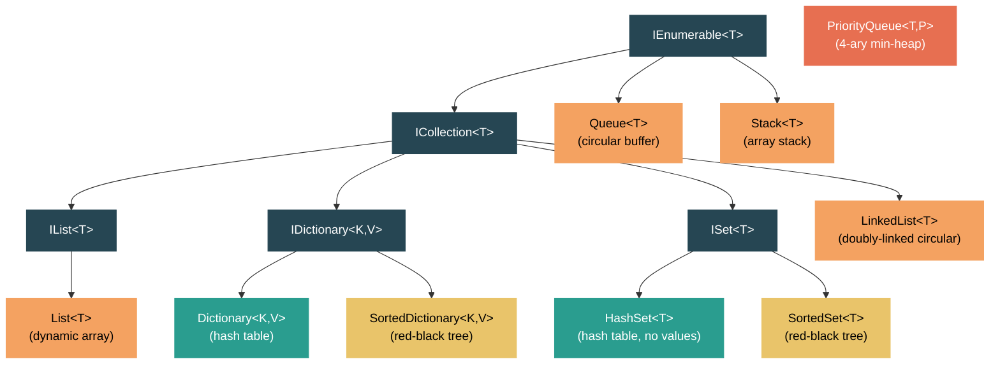

# Level 2: Practitioner — Collections Deep Dive

> **Target profile:** Developer who uses collections daily but doesn't know the internal data structures that power them
> **Estimated effort:** 5 hours
> **Prerequisites:** [Module 2.1 — Generics](02-practitioner-generics.md)
> [Version en espanol](../es/02-practitioner-collections.md)

---

## Learning Objectives

By the end of this module you will be able to:

1. Explain how `List<T>` uses a backing array and doubles its capacity on growth, delivering amortized O(1) `Add`.
2. Describe the dual-array design of `Dictionary<TKey, TValue>` (`_buckets` + `_entries`) and how collision chaining works via the `next` field.
3. Trace a hash-based lookup from hash code computation through bucket indexing to entry chain traversal.
4. Compare hash-based collections (`HashSet<T>`) with tree-based collections (`SortedSet<T>`) in terms of ordering guarantees and Big-O.
5. Explain how `Queue<T>` implements a circular buffer using `_head` and `_tail` pointers within a flat array.
6. Describe how `Stack<T>` uses a simple array with a `_size` pointer, and why `Push` is amortized O(1) while `Pop` is always O(1).
7. Explain the quaternary (4-ary) min-heap structure that powers `PriorityQueue<TElement, TPriority>`.
8. Choose the right collection for a given scenario based on operation complexity, ordering needs, and memory trade-offs.
9. Use BenchmarkDotNet to verify collection performance claims empirically.

---

## Concept Map



---

## Curriculum

### Lesson 1 — List&lt;T&gt;: The Dynamic Array

#### What you'll learn

`List<T>` is the workhorse collection in .NET. Under the hood it is nothing more than a managed array (`T[]`) that grows when it runs out of room. Understanding when and how it grows is the key to writing performant code.

#### The data structure

Open `src/libraries/System.Private.CoreLib/src/System/Collections/Generic/List.cs`. The core fields are:

```csharp
internal T[] _items;   // the backing array
internal int _size;    // number of elements actually stored
internal int _version; // mutation counter for enumerator safety
```

`Capacity` is simply `_items.Length`. `Count` is `_size`. The gap between them is pre-allocated but unused space.

#### How Add works

The `Add` method (line 196) is deceptively simple:

```csharp
public void Add(T item)
{
    _version++;
    T[] array = _items;
    int size = _size;
    if ((uint)size < (uint)array.Length)
    {
        _size = size + 1;
        array[size] = item;
    }
    else
    {
        AddWithResize(item);
    }
}
```

The fast path — when there is room — is a bounds-checked array store: **O(1)**. The slow path calls `AddWithResize`, which calls `Grow`.

#### The growth strategy

`GetNewCapacity` (line 488) implements the doubling strategy:

```csharp
int newCapacity = _items.Length == 0 ? DefaultCapacity : 2 * _items.Length;
```

- **DefaultCapacity** is 4. An empty list allocates nothing (`s_emptyArray`); the first `Add` allocates a 4-element array.
- After that, capacity doubles: 4 -> 8 -> 16 -> 32 -> ...
- The cap is `Array.MaxLength` (~2 billion elements).

**Amortized analysis:** Because each resize copies all existing elements, a single `Add` can be O(n). But since every resize doubles the space, across n insertions the total copy work is n + n/2 + n/4 + ... = O(n). Dividing by n gives **amortized O(1)** per `Add`.

#### Insert is O(n)

`Insert(int index, T item)` (line 770) must shift elements to make room:

```csharp
Array.Copy(_items, index, _items, index + 1, _size - index);
```

This is always O(n - index). Inserting at the front is O(n); appending at the end is O(1) — which is why `Add` exists as a separate fast path.

#### Performance tip

If you know the final size ahead of time, pass it to the constructor:

```csharp
var list = new List<string>(expectedCount); // avoids all resizes
```

#### Source reading exercise

1. Open `List.cs` and find the `GrowForInsertion` method. How does it avoid one extra `Array.Copy` compared to a naive resize-then-shift?
2. Look at the indexer (`this[int index]`). Notice the `(uint)index >= (uint)_size` trick — why does casting to `uint` eliminate a range check?

---

### Lesson 2 — Dictionary&lt;TKey, TValue&gt;: Hash Tables in Practice

#### What you'll learn

`Dictionary<TKey, TValue>` is the most performance-critical collection in the BCL. It uses a hash table with chaining, but the implementation is cleverly packed into two flat arrays rather than using linked list nodes on the heap.

#### The data structure

Open `src/libraries/System.Private.CoreLib/src/System/Collections/Generic/Dictionary.cs`. The key fields:

```csharp
private int[]? _buckets;       // index into _entries; values are 1-based
private Entry[]? _entries;      // flat array of all entries
private int _count;             // next available slot in _entries
private int _freeList;          // head of the free list (reuse deleted slots)
private int _freeCount;         // number of free slots
```

The `Entry` struct (line 1861) packs everything tightly:

```csharp
private struct Entry
{
    public uint hashCode;
    public int next;        // next entry in the collision chain (-1 = end)
    public TKey key;
    public TValue value;
}
```

#### How a lookup works

When you call `dictionary[key]`, the runtime:

1. **Computes the hash code:** `(uint)comparer.GetHashCode(key)` (or `key.GetHashCode()` for value types with no custom comparer).
2. **Finds the bucket:** `GetBucket(hashCode)` returns `ref _buckets[hashCode % _buckets.Length]`. The value in `_buckets` is 1-based (0 means empty).
3. **Walks the chain:** Starting at `_buckets[bucket] - 1`, follow `entries[i].next` until you find a matching `hashCode` AND `Equals` returns true, or reach -1 (not found).

This is **O(1) average**, O(n) worst case (all keys hash to the same bucket).

#### Collision handling

Collisions are resolved by chaining within the `_entries` array. When a new entry collides with an existing one:

```csharp
entry.next = bucket - 1;   // point to the old head of the chain
bucket = index + 1;         // this entry becomes the new head
```

This means each bucket's chain is a singly linked list embedded in the `_entries` array — no separate heap allocations for nodes.

#### Resize and load factor

When `_count == _entries.Length`, `Resize()` is called (line 1246):

```csharp
private void Resize() => Resize(HashHelpers.ExpandPrime(_count), false);
```

The new size is the next prime number greater than `2 * _count`. Using prime sizes reduces clustering. All entries are rehashed into new buckets.

On 64-bit platforms, the runtime uses a fast modulo multiplication (`_fastModMultiplier`) to avoid expensive division.

#### String key optimization

For `Dictionary<string, V>`, the runtime starts with a `NonRandomizedStringEqualityComparer` for performance. If too many collisions occur (detected by `collisionCount > HashHelpers.HashCollisionThreshold`), it automatically switches to a randomized comparer to defend against hash-flooding attacks:

```csharp
if (collisionCount > HashHelpers.HashCollisionThreshold && comparer is NonRandomizedStringEqualityComparer)
{
    Resize(entries.Length, true); // rehash with randomized comparer
}
```

#### Source reading exercise

1. In `TryInsert`, trace what happens when `_freeCount > 0`. How are deleted slots recycled? (Hint: look at how `_freeList` and `StartOfFreeList` interact with the `next` field.)
2. Find `Initialize(int capacity)` — why does it call `HashHelpers.GetPrime(capacity)` instead of using the capacity directly?

---

### Lesson 3 — HashSet&lt;T&gt; and SortedSet&lt;T&gt;: Sets Two Ways

#### What you'll learn

.NET offers two `ISet<T>` implementations: `HashSet<T>` (hash-based, unordered) and `SortedSet<T>` (tree-based, ordered). Understanding their internals helps you choose the right one.

#### HashSet&lt;T&gt; — the valueless dictionary

Open `src/libraries/System.Private.CoreLib/src/System/Collections/Generic/HashSet.cs`. The source comment on line 19 says it all:

> "This uses the same array-based implementation as Dictionary<TKey, TValue>."

The fields are nearly identical to `Dictionary`:

```csharp
private int[]? _buckets;
private Entry[]? _entries;
private int _count;
private int _freeList;
private int _freeCount;
```

The `Entry` struct is the same but without a `value` field — just `hashCode`, `next`, and the element. All the same bucket-indexing, chaining, and resize logic applies.

| Operation | Average | Worst case |
|---|---|---|
| `Add` | O(1) | O(n) |
| `Contains` | O(1) | O(n) |
| `Remove` | O(1) | O(n) |
| `UnionWith` | O(n + m) | O(n * m) |
| `IntersectWith` | O(n) | O(n * m) |

#### SortedSet&lt;T&gt; — the red-black tree

Open `src/libraries/System.Collections/src/System/Collections/Generic/SortedSet.cs`. The header comment explains the structure:

> "A binary search tree is a red-black tree if it satisfies the following red-black properties..."

The core fields are:

```csharp
private Node? root;
private IComparer<T> comparer;
private int count;
```

Each `Node` has `left`, `right`, `parent` references plus a `NodeColor` (Red or Black). The red-black invariants guarantee that the tree height is always O(log n).

The `AddIfNotPresent` method (line 303) traverses the tree top-down, splitting 4-nodes proactively (a top-down 2-3-4 tree encoded as a red-black BST). This ensures that insertion and rebalancing happen in a single pass.

| Operation | Average | Worst case |
|---|---|---|
| `Add` | O(log n) | O(log n) |
| `Contains` | O(log n) | O(log n) |
| `Remove` | O(log n) | O(log n) |
| `Min` / `Max` | O(log n) | O(log n) |
| In-order traversal | O(n) | O(n) |

#### When to choose which

| Criterion | HashSet&lt;T&gt; | SortedSet&lt;T&gt; |
|---|---|---|
| Need elements sorted? | No | Yes |
| Need `Min`/`Max`? | No (O(n) scan) | Yes (O(log n)) |
| Need range queries (`GetViewBetween`)? | No | Yes |
| Care about worst-case per-operation? | No (amortized O(1) is fine) | Yes (guaranteed O(log n)) |
| Memory per element | Lower (flat array) | Higher (node objects on heap) |

#### Source reading exercise

1. In `SortedSet.cs`, find the `Is4Node` property on `Node`. How does the tree detect a 4-node (both children red)?
2. In `HashSet.cs`, look at `ShrinkThreshold` (set to 3). When does the constructor call `TrimExcess`, and why?

---

### Lesson 4 — Queue&lt;T&gt; and Stack&lt;T&gt;: Simple but Subtle

#### What you'll learn

`Queue<T>` and `Stack<T>` are structurally simple, but their implementations reveal smart micro-optimizations. `Queue<T>` uses a circular buffer; `Stack<T>` uses a plain array.

#### Queue&lt;T&gt; — the circular buffer

Open `src/libraries/System.Private.CoreLib/src/System/Collections/Generic/Queue.cs`. The backing fields:

```csharp
private T[] _array;
private int _head;   // index to dequeue from
private int _tail;   // index to enqueue to
private int _size;   // number of elements
```

The array is treated as a ring: after the last slot, indices wrap around to 0. The `MoveNext` method (line 334) handles this:

```csharp
private void MoveNext(ref int index)
{
    int tmp = index + 1;
    if (tmp == _array.Length)
    {
        tmp = 0;
    }
    index = tmp;
}
```

The comment in the source explains why this uses an `if` instead of `%` (modulo): the branch is rarely taken and the JIT produces better code than with a remainder operation.

**Enqueue** (line 167): Writes to `_array[_tail]`, then advances `_tail`. If the array is full, `Grow` reallocates and linearizes the circular data via `SetCapacity`.

**Dequeue** (line 194): Reads from `_array[_head]`, clears the slot (for GC if reference type), then advances `_head`. O(1) always.

**Growth**: Similar doubling strategy to `List<T>`, with a minimum grow of 4. The critical part is `SetCapacity` (line 310), which must handle the wrap-around when copying:

```csharp
if (_head < _tail)
{
    Array.Copy(_array, _head, newarray, 0, _size);
}
else
{
    Array.Copy(_array, _head, newarray, 0, _array.Length - _head);
    Array.Copy(_array, 0, newarray, _array.Length - _head, _tail);
}
```

| Operation | Complexity |
|---|---|
| `Enqueue` | Amortized O(1) |
| `Dequeue` | O(1) |
| `Peek` | O(1) |
| `Contains` | O(n) |

#### Stack&lt;T&gt; — the array stack

Open `src/libraries/System.Collections/src/System/Collections/Generic/Stack.cs`. Even simpler:

```csharp
private T[] _array;
private int _size;   // doubles as the "top of stack" pointer
```

**Push** (line 266): Writes to `_array[_size]` and increments `_size`. If full, calls `PushWithResize` -> `Grow`, which doubles the array via `Array.Resize`.

**Pop** (line 221): Decrements `_size`, reads the element, clears the slot. Notice the bounds check trick:

```csharp
int size = _size - 1;
if ((uint)size >= (uint)array.Length)
{
    ThrowForEmptyStack();
}
```

By casting to `uint`, a negative `size` (from empty stack) becomes a huge positive number that fails the length check — one comparison instead of two.

| Operation | Complexity |
|---|---|
| `Push` | Amortized O(1) |
| `Pop` | O(1) |
| `Peek` | O(1) |
| `Contains` | O(n) |

#### Source reading exercise

1. In `Queue.cs`, find the `Clear` method. Why does it need two `Array.Clear` calls when `_head >= _tail`?
2. In `Stack.cs`, compare `Contains` (uses `Array.LastIndexOf`) with how you might expect a linear search to work. Why search from the top down?

---

### Lesson 5 — PriorityQueue&lt;TElement, TPriority&gt;: The Binary Heap

#### What you'll learn

`PriorityQueue<TElement, TPriority>` is one of the newer collections in .NET (introduced in .NET 6). It implements a min-priority queue backed by a quaternary (4-ary) heap stored in a flat array.

#### The data structure

Open `src/libraries/System.Collections/src/System/Collections/Generic/PriorityQueue.cs`. The key fields:

```csharp
private (TElement Element, TPriority Priority)[] _nodes;
private int _size;
private const int Arity = 4;
private const int Log2Arity = 2;
```

This is **not** a binary heap — it is a 4-ary heap. Each node has up to 4 children instead of 2. The parent-child relationships are computed with bit shifts:

```csharp
private static int GetParentIndex(int index) => (index - 1) >> Log2Arity;       // (i-1) / 4
private static int GetFirstChildIndex(int index) => (index << Log2Arity) + 1;   // i*4 + 1
```

Why 4-ary instead of binary? A 4-ary heap has a shallower tree (log_4(n) levels vs log_2(n)), which reduces the number of comparisons during `MoveUp` (sift-up). The trade-off is that `MoveDown` (sift-down) must compare up to 4 children per level, but cache locality of the flat array often compensates.

#### How Enqueue works

`Enqueue` (line 193) places the new element conceptually at the end of the array, then sifts it up:

```csharp
public void Enqueue(TElement element, TPriority priority)
{
    int currentSize = _size;
    _version++;
    if (_nodes.Length == currentSize)
    {
        Grow(currentSize + 1);
    }
    _size = currentSize + 1;
    MoveUpDefaultComparer((element, priority), currentSize);
}
```

`MoveUpDefaultComparer` (line 716) walks from the new node toward the root, shifting parents down until the heap property is restored:

```csharp
while (nodeIndex > 0)
{
    int parentIndex = GetParentIndex(nodeIndex);
    if (Comparer<TPriority>.Default.Compare(node.Priority, parent.Priority) < 0)
    {
        nodes[nodeIndex] = parent;  // shift parent down
        nodeIndex = parentIndex;
    }
    else break;
}
nodes[nodeIndex] = node;  // place node in its final position
```

This is an insertion-sort-style optimization: instead of swapping at every level, it shifts parents down and writes the new node once at the final position.

#### How Dequeue works

`Dequeue` (line 239) returns `_nodes[0]` (the minimum), then calls `RemoveRootNode` which takes the last element and sifts it down from the root via `MoveDownDefaultComparer` (line 781). The sift-down finds the minimum child among up to 4 children at each level.

#### Complexity

| Operation | Complexity |
|---|---|
| `Enqueue` | O(log_4 n) amortized (array may grow) |
| `Dequeue` | O(4 * log_4 n) = O(log n) |
| `Peek` | O(1) |
| `EnqueueDequeue` | O(log n) — single sift-down |

The `Grow` strategy (line 624) uses a factor of 2 with a minimum growth of 4, same as `Queue<T>`.

#### Heapify: bulk construction

When constructing from a collection, `PriorityQueue` uses the classic Floyd's heap construction algorithm (the `Heapify` method): it starts from the last parent and sifts down each node. This is O(n), faster than enqueueing n elements one by one (which would be O(n log n)).

#### Source reading exercise

1. Find `DequeueEnqueue` (line 263). Why is this more efficient than calling `Dequeue()` followed by `Enqueue()`? (Hint: it avoids one sift-up entirely.)
2. In `Grow`, why is the growth factor 2 with a minimum of 4, rather than the pure doubling used by `List<T>`?

---

### Lesson 6 — Choosing the Right Collection

#### What you'll learn

There is no single "best" collection. The right choice depends on which operations dominate your workload. This lesson provides a decision framework.

#### Decision matrix

| Need | Best collection | Why |
|---|---|---|
| Indexed access by position | `List<T>` | O(1) random access via array index |
| Key-value lookup | `Dictionary<K,V>` | O(1) average hash-based lookup |
| Unique elements, no order | `HashSet<T>` | O(1) add/contains/remove |
| Unique elements, sorted | `SortedSet<T>` | O(log n) with in-order iteration |
| FIFO processing | `Queue<T>` | O(1) enqueue/dequeue |
| LIFO processing (undo, DFS) | `Stack<T>` | O(1) push/pop |
| Process by priority | `PriorityQueue<T,P>` | O(log n) enqueue/dequeue |
| Frequent insert/remove at arbitrary positions | `LinkedList<T>` | O(1) insert/remove *given a node reference* |
| Sorted key-value pairs | `SortedDictionary<K,V>` | O(log n) operations, in-order iteration |

#### Common pitfalls

**1. Using `List<T>` as a queue (removing from index 0):**
Every `RemoveAt(0)` shifts the entire array — O(n). Use `Queue<T>` instead.

**2. Using `Dictionary<K,V>` when you need ordering:**
Dictionaries do not preserve insertion order (entries can be recycled from the free list). Use `SortedDictionary<K,V>` or maintain a separate `List<T>` of keys.

**3. Using `LinkedList<T>` for "better performance":**
`LinkedList<T>` only wins when you have a direct `LinkedListNode<T>` reference and need O(1) insert/remove at that position. For iteration-heavy workloads, the pointer-chasing and poor cache locality of a linked list will be slower than `List<T>`, even with O(n) shifts.

**4. Not pre-sizing collections:**
All array-backed collections (`List<T>`, `Dictionary<K,V>`, `HashSet<T>`, `Queue<T>`, `Stack<T>`, `PriorityQueue<T,P>`) accept an initial capacity. If you know the approximate size, pass it in to avoid resize copies.

#### The LinkedList&lt;T&gt; special case

Open `src/libraries/System.Collections/src/System/Collections/Generic/LinkedList.cs`. It is a **doubly-linked circular list**:

```csharp
internal LinkedListNode<T>? head;
```

`Last` is simply `head?.prev` — because it is circular, the node before `head` is the tail. Insert operations (`InternalInsertNodeBefore`, line 377) are O(1) pointer manipulations:

```csharp
newNode.next = node;
newNode.prev = node.prev;
node.prev!.next = newNode;
node.prev = newNode;
```

But `Find` is O(n) — you must traverse from `head` to locate a node. This is why `LinkedList<T>` is rarely the best choice: to get its O(1) insert benefit, you must already have the node reference.

#### Memory overhead comparison

| Collection | Overhead per element |
|---|---|
| `List<T>` | ~0 bytes (just array slots, some wasted capacity) |
| `Dictionary<K,V>` | ~16-20 bytes (Entry struct: hashCode + next + key + value, plus bucket int) |
| `HashSet<T>` | ~12-16 bytes (Entry struct without value, plus bucket int) |
| `SortedSet<T>` | ~40+ bytes (Node object: left/right/parent refs + color + value + object header) |
| `LinkedList<T>` | ~40+ bytes (LinkedListNode object: next/prev/list refs + value + object header) |
| `PriorityQueue<T,P>` | ~0 extra bytes (tuple array slots, some wasted capacity) |

---

## Source Reading Guide

| File | What to focus on |
|---|---|
| `src/libraries/System.Private.CoreLib/src/System/Collections/Generic/List.cs` | `_items`, `Add`, `GetNewCapacity`, `GrowForInsertion`, `Insert` |
| `src/libraries/System.Private.CoreLib/src/System/Collections/Generic/Dictionary.cs` | `_buckets`, `_entries`, `Entry` struct, `TryInsert`, `Resize`, `Initialize` |
| `src/libraries/System.Private.CoreLib/src/System/Collections/Generic/HashSet.cs` | Same dual-array design as Dictionary; focus on set operations (`UnionWith`, `IntersectWith`) |
| `src/libraries/System.Collections/src/System/Collections/Generic/SortedSet.cs` | `Node`, `AddIfNotPresent`, `Is4Node`, `Split4Node`, rotation methods |
| `src/libraries/System.Private.CoreLib/src/System/Collections/Generic/Queue.cs` | `_head`, `_tail`, `MoveNext`, `SetCapacity`, `Enqueue`, `Dequeue` |
| `src/libraries/System.Collections/src/System/Collections/Generic/Stack.cs` | `Push`, `PushWithResize`, `Pop`, `Grow` |
| `src/libraries/System.Collections/src/System/Collections/Generic/PriorityQueue.cs` | `_nodes`, `Arity`, `MoveUpDefaultComparer`, `MoveDownDefaultComparer`, `Heapify` |
| `src/libraries/System.Collections/src/System/Collections/Generic/LinkedList.cs` | `InternalInsertNodeBefore`, `InternalInsertNodeToEmptyList`, circular structure |

---

## Tools and Techniques

### BenchmarkDotNet

The best way to validate complexity claims is to measure. Create a benchmark project:

```bash
dotnet new console -n CollectionBenchmarks
cd CollectionBenchmarks
dotnet add package BenchmarkDotNet
```

Example benchmark comparing `List<T>.Add` vs `List<T>.Insert(0, item)`:

```csharp
using BenchmarkDotNet.Attributes;
using BenchmarkDotNet.Running;

BenchmarkRunner.Run<CollectionBench>();

[MemoryDiagnoser]
public class CollectionBench
{
    [Params(100, 1_000, 10_000)]
    public int N;

    [Benchmark(Baseline = true)]
    public List<int> ListAdd()
    {
        var list = new List<int>(N);
        for (int i = 0; i < N; i++)
            list.Add(i);
        return list;
    }

    [Benchmark]
    public List<int> ListInsertAtZero()
    {
        var list = new List<int>(N);
        for (int i = 0; i < N; i++)
            list.Insert(0, i);
        return list;
    }

    [Benchmark]
    public Dictionary<int, int> DictionaryAdd()
    {
        var dict = new Dictionary<int, int>(N);
        for (int i = 0; i < N; i++)
            dict[i] = i;
        return dict;
    }

    [Benchmark]
    public Queue<int> QueueEnqueue()
    {
        var queue = new Queue<int>(N);
        for (int i = 0; i < N; i++)
            queue.Enqueue(i);
        return queue;
    }
}
```

Run with: `dotnet run -c Release`

**What to observe:**
- `ListAdd` scales linearly with N (amortized O(1) per operation).
- `ListInsertAtZero` scales quadratically (O(n) per operation, O(n^2) total).
- `DictionaryAdd` scales linearly, similar to `ListAdd`.
- `QueueEnqueue` scales linearly, similar to `ListAdd`.

### Visual Studio Debugger

Set a breakpoint inside `Dictionary.TryInsert` and watch the `collisionCount` variable. Feed keys that produce the same bucket index to see chaining in action.

---

## Self-Assessment

### Knowledge check

1. What is the default initial capacity of `List<T>`? What is it after the first `Add`?
2. Why does `Dictionary<TKey, TValue>` size its arrays to prime numbers?
3. What is the difference between `_count` and `_size` in `Dictionary`? (Trick question: `_count` is the next available index, not the actual element count — the real count is `_count - _freeCount`.)
4. How does `Queue<T>` avoid using modulo (`%`) in its `MoveNext` method, and why?
5. What is the arity of the heap in `PriorityQueue`? Why not use a binary heap?
6. When would you choose `SortedSet<T>` over `HashSet<T>`?

### Coding challenges

1. **Benchmark resize impact:** Create a `List<int>` without specifying capacity and add 1 million elements. Then repeat with `new List<int>(1_000_000)`. Measure the time difference with `Stopwatch` or BenchmarkDotNet.

2. **Visualize hash distribution:** Write a program that creates a `Dictionary<string, int>` with 1000 random strings, then use reflection to access `_buckets` and `_entries` to print the chain length for each bucket. (This requires `System.Reflection` to access private fields.)

3. **Queue vs List as queue:** Benchmark `Queue<T>.Enqueue/Dequeue` vs `List<T>.Add/RemoveAt(0)` for 10,000 operations. Quantify the difference.

4. **Priority queue verification:** Enqueue 1000 random integers with random priorities, then dequeue all. Verify they come out in priority order.

---

## Connections

| Connection | Where to go |
|---|---|
| How does the GC manage all those internal arrays? | Level 3 — Memory Management & GC |
| How does the JIT optimize `EqualityComparer<T>.Default.Equals`? | Level 3 — JIT Compilation |
| Thread-safe collections (`ConcurrentDictionary`, `ConcurrentQueue`) | Level 2 — Concurrency |
| `Span<T>` and `Memory<T>` as collection-adjacent types | Level 2 — Span and Memory |
| LINQ operators that consume these collections | Level 2 — LINQ Internals |
| `ImmutableList<T>`, `ImmutableDictionary<K,V>` | Level 2 — Immutable Collections |

---

## Glossary

| Term | Definition |
|---|---|
| **Amortized O(1)** | An operation that is O(n) in the worst case but averages to O(1) over a sequence of operations, typically because expensive resizes happen exponentially less often. |
| **Bucket** | A slot in a hash table that maps to zero or more entries sharing the same hash index. In `Dictionary`, `_buckets[i]` holds a 1-based index into `_entries`. |
| **Chaining** | Collision resolution strategy where entries with the same bucket index form a linked list. In .NET, the chain is embedded in the `_entries` array via the `next` field. |
| **Circular buffer** | An array where the logical start and end wrap around. Used by `Queue<T>` to avoid shifting elements on dequeue. |
| **Collision** | When two different keys produce the same bucket index after hashing. |
| **4-ary heap** | A heap where each node has up to 4 children. Used by `PriorityQueue` for better cache behavior and fewer sift-up comparisons than a binary heap. |
| **Free list** | A linked list of deleted entry slots in `Dictionary`/`HashSet`, reused before allocating new slots. Encoded in the `next` field using negative values. |
| **Load factor** | The ratio of stored elements to total bucket count. Higher load factors increase collision probability. `Dictionary` resizes when `_count == _entries.Length`. |
| **Prime sizing** | Using prime numbers for hash table size to distribute hash codes more evenly across buckets. |
| **Red-black tree** | A self-balancing BST where each node is colored red or black. Guarantees O(log n) height. Used by `SortedSet<T>`. |
| **Sift-up / Sift-down** | Heap operations that restore the heap property by moving a node toward the root (sift-up) or toward the leaves (sift-down). Called `MoveUp`/`MoveDown` in the source. |

---

## References

- `src/libraries/System.Private.CoreLib/src/System/Collections/Generic/List.cs`
- `src/libraries/System.Private.CoreLib/src/System/Collections/Generic/Dictionary.cs`
- `src/libraries/System.Private.CoreLib/src/System/Collections/Generic/HashSet.cs`
- `src/libraries/System.Collections/src/System/Collections/Generic/SortedSet.cs`
- `src/libraries/System.Private.CoreLib/src/System/Collections/Generic/Queue.cs`
- `src/libraries/System.Collections/src/System/Collections/Generic/Stack.cs`
- `src/libraries/System.Collections/src/System/Collections/Generic/PriorityQueue.cs`
- `src/libraries/System.Collections/src/System/Collections/Generic/LinkedList.cs`
- [.NET API documentation: System.Collections.Generic](https://learn.microsoft.com/en-us/dotnet/api/system.collections.generic)
- [BenchmarkDotNet documentation](https://benchmarkdotnet.org/)
