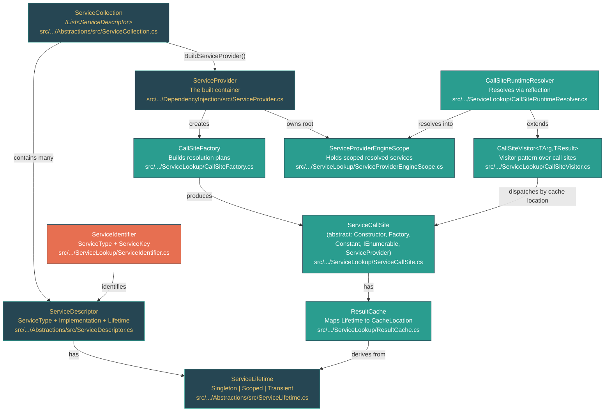

# Level 2: Practitioner -- Dependency Injection: From Pattern to Framework

> **Target profile:** Developer who uses dependency injection daily but has not explored how the container resolves services
> **Estimated effort:** 4 hours
> **Prerequisites:** Module 2.1 (Generics), Level 1 (Foundations)
> [Version en espanol](../es/02-practitioner-dependency-injection.md)

---

## Learning Objectives

After completing this module, you will be able to:

1. **Explain** the Dependency Injection (DI) pattern independently of any framework, and articulate why constructor injection enables testability and loose coupling.
2. **Describe** what a `ServiceDescriptor` contains and how `ServiceCollection` stores registrations as a simple list.
3. **Trace** how `ServiceProvider` is constructed from a `ServiceCollection`, including the `CallSiteFactory` population step and built-in service registration.
4. **Walk through** the resolution pipeline: from `GetService()` to `ServiceAccessor` creation, `CallSiteFactory` lookup, and `CallSiteRuntimeResolver` execution.
5. **Distinguish** between Singleton, Scoped, and Transient lifetimes at the source level, identifying where each caches its resolved instance.
6. **Explain** keyed services (.NET 8+), open generic resolution, and the constructor selection algorithm used by the container.
7. **Diagnose** common DI pitfalls (captive dependencies, scope validation failures, circular dependencies) by understanding the validation code.
8. **Read** the ServiceLookup pipeline source with confidence and locate the code responsible for any DI behavior.

---

## Concept Map



---

## Curriculum

### Lesson 2.4.1: The DI Pattern -- Why Constructor Injection, Before the Framework

**What you will learn:** Dependency injection is a design pattern, not a framework feature. Understanding the pattern first makes the framework implementation obvious.

**The concept:**

Dependency injection means that a class receives the objects it depends on (its *dependencies*) from the outside rather than creating them internally. The most common form is **constructor injection**: dependencies arrive as constructor parameters.

Consider this without any framework:

```csharp
// Without DI -- the class creates its own dependency
public class OrderService
{
    private readonly SqlOrderRepository _repo = new SqlOrderRepository(); // Hard coupling

    public Order GetOrder(int id) => _repo.FindById(id);
}

// With DI -- the class receives its dependency
public class OrderService
{
    private readonly IOrderRepository _repo;

    public OrderService(IOrderRepository repo)  // Injected from outside
    {
        _repo = repo;
    }

    public Order GetOrder(int id) => _repo.FindById(id);
}
```

The DI version is better for three reasons:

1. **Testability** -- You can pass a mock `IOrderRepository` in unit tests.
2. **Loose coupling** -- `OrderService` does not know or care which `IOrderRepository` implementation exists.
3. **Inversion of control** -- The *caller* decides which implementation to provide, not the class itself.

You can do DI manually by newing up objects and passing them. A **DI container** (also called an **IoC container**) automates this: you register which interfaces map to which implementations, and the container constructs entire object graphs for you.

In the `dotnet/runtime` source, the DI container lives in two packages:

- **`Microsoft.Extensions.DependencyInjection.Abstractions`** -- Defines the contracts: `IServiceCollection`, `IServiceProvider`, `ServiceDescriptor`, `ServiceLifetime`. These are the interfaces any DI container can implement.
- **`Microsoft.Extensions.DependencyInjection`** -- The default implementation: `ServiceCollection`, `ServiceProvider`, and the entire `ServiceLookup/` resolution pipeline.

**In the source code:**

The `IServiceCollection` interface (`src/libraries/Microsoft.Extensions.DependencyInjection.Abstractions/src/IServiceCollection.cs`) is remarkably simple -- it is just `IList<ServiceDescriptor>`:

```csharp
public interface IServiceCollection : IList<ServiceDescriptor>
{
}
```

No methods of its own. A service collection is literally a list of descriptors. Everything else -- `AddSingleton<T>()`, `AddTransient<T>()`, `AddScoped<T>()` -- is extension methods.

**Key takeaway:** DI is a pattern you can implement by hand. The framework automates the tedious work of constructing deep object graphs. The abstractions are intentionally minimal: a list of descriptors and a service provider.

---

### Lesson 2.4.2: ServiceCollection and ServiceDescriptor -- Registering Services

**What you will learn:** How services are registered, what a `ServiceDescriptor` contains, and why the collection is just a list.

**The concept:**

When you write `services.AddSingleton<IMyService, MyService>()`, you are adding a `ServiceDescriptor` to a `List<ServiceDescriptor>`. That is all registration is -- building a list of "recipes" for the container.

A `ServiceDescriptor` captures four pieces of information:

| Property | Type | What it is |
|---|---|---|
| `ServiceType` | `Type` | The interface or abstract type consumers will request (e.g., `IOrderRepository`) |
| `Lifetime` | `ServiceLifetime` | How long the resolved instance lives: `Singleton`, `Scoped`, or `Transient` |
| `ServiceKey` | `object?` | Optional key for keyed service registrations (.NET 8+) |
| Implementation | One of three | *How* to create the instance |

The implementation is exactly one of:

1. **`ImplementationType`** (`Type`) -- The container will construct this type via reflection, resolving its constructor parameters recursively.
2. **`ImplementationFactory`** (`Func<IServiceProvider, object>`) -- A factory delegate the container calls, passing itself so the factory can resolve other services.
3. **`ImplementationInstance`** (`object`) -- A pre-built singleton instance. Lifetime is always `Singleton`.

**In the source code:**

Open `src/libraries/Microsoft.Extensions.DependencyInjection.Abstractions/src/ServiceDescriptor.cs`. The private constructor on line 130 shows the three core fields:

```csharp
private ServiceDescriptor(Type serviceType, object? serviceKey, ServiceLifetime lifetime)
{
    Lifetime = lifetime;
    ServiceType = serviceType;
    ServiceKey = serviceKey;
}
```

The three implementation fields are stored separately:
- `_implementationType` (line 153)
- `_implementationInstance` (line 185)
- `_implementationFactory` (line 215)

Each public constructor populates exactly one of these. Notice the `[DynamicallyAccessedMembers(DynamicallyAccessedMemberTypes.PublicConstructors)]` annotation on `_implementationType` -- this tells the trimmer that the container needs to reflect over public constructors of any registered implementation type.

Now look at `ServiceCollection` (`src/libraries/Microsoft.Extensions.DependencyInjection.Abstractions/src/ServiceCollection.cs`). It wraps a `List<ServiceDescriptor>` (line 18) with a read-only check mechanism:

```csharp
public class ServiceCollection : IServiceCollection
{
    private readonly List<ServiceDescriptor> _descriptors = new List<ServiceDescriptor>();
    private bool _isReadOnly;
    // ...
}
```

The `MakeReadOnly()` method (line 110) is called when the provider is built, preventing further modifications. This is important because the `ServiceProvider` constructor takes a snapshot of the descriptors -- adding more after building has no effect.

**Hands-on exercise:**

1. Open `src/libraries/Microsoft.Extensions.DependencyInjection.Abstractions/src/ServiceDescriptor.cs`.
2. Find the constructor that accepts a `Func<IServiceProvider, object>` factory (around line 89). Notice it stores the factory in `_implementationFactory`.
3. Now find the constructor that accepts an `object instance` (around line 57). Notice it forces `ServiceLifetime.Singleton` -- an instance registration always has singleton lifetime because the container returns the same object every time.
4. Read the `IsKeyedService` property (search for it) -- it simply checks whether `ServiceKey` is not null.

**Key takeaway:** `ServiceCollection` is a `List<ServiceDescriptor>`. Each descriptor is a recipe saying "when someone asks for `ServiceType`, create it using this implementation type/factory/instance, with this lifetime." Registration does not create anything -- it just builds the recipe list.

---

### Lesson 2.4.3: ServiceProvider -- Building the Container

**What you will learn:** What happens when `BuildServiceProvider()` is called, how the `CallSiteFactory` is populated, and what built-in services are registered automatically.

**The concept:**

Calling `services.BuildServiceProvider()` triggers the construction of a `ServiceProvider`. This is the transition from "recipe list" to "live container." The constructor in `ServiceProvider.cs` does four critical things:

1. **Creates the root scope** -- A `ServiceProviderEngineScope` that holds singleton instances.
2. **Selects the engine** -- Either a `DynamicServiceProviderEngine` (uses IL emit for performance) or a `RuntimeServiceProviderEngine` (uses reflection, for AOT-constrained environments).
3. **Creates the `CallSiteFactory`** -- The factory that will later build resolution plans (call sites) on demand.
4. **Registers built-in services** -- Four services that exist without any user registration.

**In the source code:**

Open `src/libraries/Microsoft.Extensions.DependencyInjection/src/ServiceProvider.cs`. The constructor (line 52) reveals the entire build process:

```csharp
internal ServiceProvider(ICollection<ServiceDescriptor> serviceDescriptors, ServiceProviderOptions options)
{
    Root = new ServiceProviderEngineScope(this, isRootScope: true);
    _engine = GetEngine();
    _createServiceAccessor = CreateServiceAccessor;
    _serviceAccessors = new ConcurrentDictionary<ServiceIdentifier, ServiceAccessor>();

    CallSiteFactory = new CallSiteFactory(serviceDescriptors);
    // The list of built in services that aren't part of the list of service descriptors
    CallSiteFactory.Add(ServiceIdentifier.FromServiceType(typeof(IServiceProvider)), new ServiceProviderCallSite());
    CallSiteFactory.Add(ServiceIdentifier.FromServiceType(typeof(IServiceScopeFactory)), new ConstantCallSite(typeof(IServiceScopeFactory), Root));
    CallSiteFactory.Add(ServiceIdentifier.FromServiceType(typeof(IServiceProviderIsService)), new ConstantCallSite(typeof(IServiceProviderIsService), CallSiteFactory));
    CallSiteFactory.Add(ServiceIdentifier.FromServiceType(typeof(IServiceProviderIsKeyedService)), new ConstantCallSite(typeof(IServiceProviderIsKeyedService), CallSiteFactory));
    // ...
}
```

The four built-in services are:

| Built-in service | What it resolves to | Call site type |
|---|---|---|
| `IServiceProvider` | The current scope itself | `ServiceProviderCallSite` |
| `IServiceScopeFactory` | The root scope (creates new scopes) | `ConstantCallSite` |
| `IServiceProviderIsService` | The `CallSiteFactory` (knows what is registered) | `ConstantCallSite` |
| `IServiceProviderIsKeyedService` | Same `CallSiteFactory` | `ConstantCallSite` |

This is why you can always inject `IServiceProvider` or `IServiceScopeFactory` without registering them -- they are added automatically.

The `CallSiteFactory` constructor (in `CallSiteFactory.cs`, line 24) takes the descriptor collection and immediately calls `Populate()` (line 35), which indexes all descriptors into a `_descriptorLookup` dictionary keyed by `ServiceIdentifier`. This dictionary enables O(1) lookup when resolving services later. During population, it also validates open generic registrations -- checking that the implementation type is also an open generic with matching arity.

Now look at `ValidateOnBuild` (ServiceProvider.cs, line 73): when this option is `true`, the constructor iterates every descriptor and calls `ValidateService()`, which eagerly builds a call site for each service. This catches configuration errors at startup rather than at first resolution. It is enabled by default in the `Host.CreateDefaultBuilder()` path for development environments.

**Hands-on exercise:**

1. Read the `ServiceProvider` constructor from line 52 to line 96.
2. Find `GetEngine()` (line 297). Notice how it chooses between `DynamicServiceProviderEngine` (for JIT environments) and `RuntimeServiceProviderEngine` (for NativeAOT). The `DisableDynamicEngine` app switch lets you force the reflection-based engine.
3. Read `CallSiteFactory.Populate()` (CallSiteFactory.cs, line 35). Follow the validation it does for open generic types -- it verifies the implementation type is also generic, is not abstract, and has matching generic parameter count.
4. Look at the comment on line 60 of ServiceProvider.cs: "keep this in sync with CallSiteFactory.IsService." This reveals an important maintenance coupling -- the built-in services must be recognized in two places.

**Key takeaway:** Building the provider indexes all descriptors for fast lookup, registers four built-in services, and optionally validates every registration eagerly. The `CallSiteFactory` is the brain of the container -- it translates descriptors into resolution plans.

---

### Lesson 2.4.4: Service Resolution -- The CallSite Pipeline

**What you will learn:** The exact code path from `provider.GetService<T>()` to a constructed object, following the call through `ServiceAccessor`, `CallSiteFactory`, and `CallSiteRuntimeResolver`.

**The concept:**

When you call `provider.GetService(typeof(IMyService))`, the resolution follows a precise pipeline:

```
GetService(Type)
  |
  v
GetService(ServiceIdentifier, Scope)      [ServiceProvider.cs:222]
  |
  v
_serviceAccessors.GetOrAdd(id, CreateServiceAccessor)  [lazy, cached]
  |
  v
CreateServiceAccessor(ServiceIdentifier)   [ServiceProvider.cs:257]
  |
  v
CallSiteFactory.GetCallSite(id, chain)    [builds the plan]
  |
  v
_engine.RealizeService(callSite)           [compiles the plan, or]
CallSiteRuntimeResolver.Resolve(callSite)  [interprets the plan]
  |
  v
Constructed object returned
```

**Step 1: ServiceAccessor lookup.** `ServiceProvider.GetService()` (line 222) uses a `ConcurrentDictionary<ServiceIdentifier, ServiceAccessor>` to cache resolution delegates. On first call for a given type, it invokes `CreateServiceAccessor`.

**Step 2: Call site creation.** `CreateServiceAccessor` (line 257) calls `CallSiteFactory.GetCallSite()`, which builds a tree of `ServiceCallSite` nodes representing the resolution plan.

**Step 3: Call site types.** The factory chooses among five `CallSiteKind` values (from `CallSiteKind.cs`):

| Kind | When used | Call site class |
|---|---|---|
| `Constructor` | Descriptor has `ImplementationType` | `ConstructorCallSite` -- stores `ConstructorInfo` + parameter call sites |
| `Factory` | Descriptor has `ImplementationFactory` | `FactoryCallSite` -- stores the `Func<IServiceProvider, object>` |
| `Constant` | Descriptor has `ImplementationInstance` | `ConstantCallSite` -- stores the pre-built object |
| `IEnumerable` | Resolving `IEnumerable<T>` | `IEnumerableCallSite` -- stores array of child call sites |
| `ServiceProvider` | Resolving `IServiceProvider` itself | `ServiceProviderCallSite` -- returns current scope |

**Step 4: Constructor selection.** For `ConstructorCallSite`, the `CreateConstructorCallSite` method (CallSiteFactory.cs, line 570) uses a specific algorithm:

- If one constructor: use it, resolve all parameters recursively.
- If multiple constructors: sort by parameter count (descending), pick the first one whose parameters are *all* resolvable, verify it is a superset of all other satisfiable constructors (to prevent ambiguity).

**Step 5: Resolution.** The `CallSiteVisitor<TArgument, TResult>` base class (CallSiteVisitor.cs) implements a two-level dispatch:

1. First dispatch by **cache location** (`VisitCallSite`, line 24): `Root` (singleton), `Scope` (scoped), `Dispose` (transient), or `None`.
2. Second dispatch by **call site kind** (`VisitCallSiteMain`, line 39): `Factory`, `Constructor`, `Constant`, `IEnumerable`, or `ServiceProvider`.

The `CallSiteRuntimeResolver` (CallSiteRuntimeResolver.cs) overrides both levels. For `VisitConstructor` (line 48), it recursively resolves all parameter call sites, then invokes `ConstructorInfo.Invoke()` with the resolved values.

**In the source code:**

The singleton optimization in `CreateServiceAccessor` (ServiceProvider.cs, line 266) is elegant:

```csharp
if (callSite.Cache.Location == CallSiteResultCacheLocation.Root)
{
    object? value = CallSiteRuntimeResolver.Instance.Resolve(callSite, Root);
    return new ServiceAccessor { CallSite = callSite, RealizedService = scope => value };
}
```

For singletons, it resolves immediately and creates a closure that returns the cached value directly -- no visitor dispatch on subsequent calls. For non-singletons, it delegates to the engine (which may compile IL for faster resolution).

**Hands-on exercise:**

1. Open `ServiceProvider.cs` and trace a call from `GetService(Type)` (line 103) through `GetService(ServiceIdentifier, scope)` (line 222) to `CreateServiceAccessor` (line 257).
2. Open `CallSiteFactory.cs` and read `CreateCallSite` (line 178). Notice the three-step resolution: `TryCreateExact` -> `TryCreateOpenGeneric` -> `TryCreateEnumerable`. This is the priority order -- exact matches win over open generic matches.
3. Read `CallSiteVisitor.cs` entirely (it is only 88 lines). The two-level dispatch is the architectural core of the resolution engine.
4. In `CallSiteRuntimeResolver.cs`, read `VisitConstructor` (line 48). Follow how it creates a parameter array, recursively resolves each parameter, then calls `ConstructorInfo.Invoke`.

**Key takeaway:** Resolution builds a tree of `ServiceCallSite` nodes (the plan) then executes it with a visitor. The plan is cached per `ServiceIdentifier`, so the expensive reflection work happens only once per service type. Singletons are further optimized by resolving eagerly and caching the value directly.

---

### Lesson 2.4.5: Lifetimes -- Singleton, Scoped, Transient in the Source

**What you will learn:** How each lifetime maps to a cache location, where instances are stored, how scopes form a disposal chain, and why captive dependencies are dangerous.

**The concept:**

The `ServiceLifetime` enum (in `ServiceLifetime.cs`) has three values. Their source-level behavior is entirely determined by the `ResultCache` struct (in `ResultCache.cs`, line 23):

```csharp
public ResultCache(ServiceLifetime lifetime, ServiceIdentifier serviceIdentifier, int slot)
{
    switch (lifetime)
    {
        case ServiceLifetime.Singleton:
            Location = CallSiteResultCacheLocation.Root;
            break;
        case ServiceLifetime.Scoped:
            Location = CallSiteResultCacheLocation.Scope;
            break;
        case ServiceLifetime.Transient:
            Location = CallSiteResultCacheLocation.Dispose;
            break;
    }
    Key = new ServiceCacheKey(serviceIdentifier, slot);
}
```

This mapping drives the entire caching behavior:

| Lifetime | Cache location | Where stored | Behavior |
|---|---|---|---|
| **Singleton** | `Root` | `callSite.Value` (on the call site itself) | One instance for the entire `ServiceProvider`. Created once, locked with `lock(callSite)`. |
| **Scoped** | `Scope` | `scope.ResolvedServices` dictionary | One instance per `ServiceProviderEngineScope`. Created once per scope. |
| **Transient** | `Dispose` | Not cached (but tracked for disposal) | New instance every call. If `IDisposable`, tracked by scope's `_disposables` list. |

**Singleton resolution** (`VisitRootCache` in CallSiteRuntimeResolver.cs, line 80):

The resolved value is stored directly on the `ServiceCallSite.Value` property, with a `lock(callSite)` to prevent double-construction. A fast path (line 82) checks `callSite.Value is object value` before taking the lock. Circular dependency detection uses a `[ThreadStatic]` `HashSet<ServiceCallSite>` -- if the same call site is encountered again on the same thread during resolution, it throws `CircularDependencyException`.

**Scoped resolution** (`VisitScopeCache`, line 126, and `VisitCache`, line 135):

Scoped services are stored in `ServiceProviderEngineScope.ResolvedServices`, a `Dictionary<ServiceCacheKey, object?>`. The scope's `Sync` object (which is the dictionary itself, line 38 of ServiceProviderEngineScope.cs) is used as the lock. Note the special case: if a scoped service is resolved from the root scope (line 130), it falls through to `VisitRootCache` -- effectively becoming a singleton.

**Transient resolution** (`VisitDisposeCache`, line 43):

Transient services are never cached, but `CaptureDisposable` (ServiceProviderEngineScope.cs, line 79) adds any `IDisposable`/`IAsyncDisposable` instances to the scope's `_disposables` list. When the scope is disposed, all captured transient instances are disposed in reverse order.

**Scope disposal:**

`ServiceProviderEngineScope` implements both `IDisposable` and `IAsyncDisposable`. On disposal, it iterates `_disposables` in reverse order, calling `Dispose()` or `DisposeAsync()` on each tracked object. This is the "disposal chain" -- disposing a scope disposes all scoped and transient services resolved within it.

**Captive dependency validation:**

The `CallSiteValidator` (CallSiteValidator.cs) detects the "captive dependency" anti-pattern: a singleton that depends on a scoped service. In `VisitRootCache` (line 90), it sets `state.Singleton = singletonCallSite`. Then in `VisitScopeCache` (line 96), if it finds a scoped call site while a singleton is being resolved, it throws `ScopedInSingletonException`. This only runs when `ValidateScopes` is enabled (typically in development).

It also catches the case of resolving a scoped service from the root scope directly (`ValidateResolution`, line 17) -- throwing `DirectScopedResolvedFromRootException`.

**Hands-on exercise:**

1. Open `ResultCache.cs` and verify the lifetime-to-location mapping in the constructor.
2. In `CallSiteRuntimeResolver.cs`, compare `VisitRootCache` (singletons), `VisitScopeCache` (scoped), and `VisitDisposeCache` (transient). Note the increasing simplicity: singletons need locks and circular dependency checks, scoped needs dictionary lookup, transient just captures for disposal.
3. Open `ServiceProviderEngineScope.cs` and read `CaptureDisposable` (line 79). Notice it checks `service is IDisposable || service is IAsyncDisposable` and adds to `_disposables`. Then find the `Dispose()` method and see how it iterates `_disposables` in reverse.
4. Read `CallSiteValidator.cs` from top to bottom. It is 120 lines and uses the same visitor pattern. Focus on `VisitRootCache` (marks singleton context) and `VisitScopeCache` (detects scoped-in-singleton).

**Key takeaway:** Lifetimes are not magic -- they are cache location choices. Singleton caches on the call site (global), Scoped caches on the scope dictionary (per-scope), Transient never caches (but tracks disposables). The validator catches dangerous combinations at build time when `ValidateScopes` is enabled.

---

### Lesson 2.4.6: Keyed Services and Advanced Patterns

**What you will learn:** How .NET 8 keyed services work at the source level, how open generic resolution creates closed types dynamically, and the constructor selection algorithm for multiple constructors.

**The concept:**

**.NET 8 Keyed Services:**

Before .NET 8, the DI container identified services solely by `Type`. Keyed services add a second dimension: a `ServiceKey` (any `object`). This is implemented through the `ServiceIdentifier` struct (ServiceIdentifier.cs):

```csharp
internal readonly struct ServiceIdentifier : IEquatable<ServiceIdentifier>
{
    public object? ServiceKey { get; }
    public Type ServiceType { get; }
}
```

A `ServiceIdentifier` with `ServiceKey == null` is a non-keyed (traditional) service. With a non-null key, it is a keyed service. The `Equals` method (line 31) compares both type and key -- so `ServiceIdentifier(typeof(ICache), "redis")` and `ServiceIdentifier(typeof(ICache), "memory")` are distinct.

The special value `KeyedService.AnyKey` acts as a wildcard during registration. In `TryCreateExact` (CallSiteFactory.cs, line 209), when a normal lookup fails, the code checks for an `AnyKey` registration:

```csharp
if (serviceIdentifier.ServiceKey != null)
{
    var catchAllIdentifier = new ServiceIdentifier(KeyedService.AnyKey, serviceIdentifier.ServiceType);
    if (_descriptorLookup.TryGetValue(catchAllIdentifier, out descriptor))
    {
        return TryCreateExact(descriptor.Last, serviceIdentifier, callSiteChain, DefaultSlot);
    }
}
```

This enables registering a single factory that handles all keys for a given type.

**Open generic resolution:**

When you register `services.AddSingleton(typeof(IRepository<>), typeof(Repository<>))`, the descriptor's `ServiceType` is an open generic (`IRepository<>`). When someone requests `IRepository<Order>`, the `TryCreateOpenGeneric` method (CallSiteFactory.cs, line 229) detects that the requested type is a *constructed* generic whose definition matches the registered open generic. It then calls `implementationType.MakeGenericType(genericTypeArguments)` (line 553) to create the closed type `Repository<Order>` at runtime.

The `Populate()` method validates this upfront: open generic service types must have open generic implementations with matching arity. The `VerifyOpenGenericServiceTrimmability` switch (line 65 in CallSiteFactory.cs) also verifies that trimming annotations are compatible.

**Constructor selection algorithm:**

The `CreateConstructorCallSite` method (CallSiteFactory.cs, line 570) handles the constructor selection:

1. **Zero constructors:** Throws `NoConstructorMatch`.
2. **One constructor:** Uses it. If it has parameters, resolves each recursively via `CreateArgumentCallSites`.
3. **Multiple constructors:** Sorts by parameter count (descending). Iterates, calling `CreateArgumentCallSites` with `throwIfCallSiteNotFound: false`. The first constructor whose *all* parameters are resolvable becomes the candidate. Then it verifies this candidate is a **superset** of the parameter types of all other satisfiable constructors -- if another constructor has a parameter type not in the best constructor, it throws an ambiguity exception.

This means the container prefers the "greediest" constructor -- the one with the most parameters -- as long as all its dependencies are registered.

**Circular dependency detection:**

The `CallSiteChain` class (CallSiteChain.cs) tracks the current resolution path. Each time `CreateCallSite` enters a new service, it calls `callSiteChain.Add(serviceIdentifier)`. If the same identifier is added twice, `CheckCircularDependency` (line 20) throws. The chain is also used to build a human-readable path in the error message: `A -> B(BImpl) -> C -> A`.

At runtime, the `CallSiteRuntimeResolver` has a separate mechanism for circular dependencies through factory functions: a `[ThreadStatic]` `HashSet<ServiceCallSite>` named `t_resolving` (line 23). This catches cycles that only become visible during resolution (e.g., Factory A resolves B which resolves A).

**Hands-on exercise:**

1. Open `ServiceIdentifier.cs` and read the `Equals` method. Verify that two identifiers are equal only if both `ServiceType` and `ServiceKey` match (with null-key handling).
2. In `CallSiteFactory.cs`, find `TryCreateOpenGeneric` (line 229) and trace how `MakeGenericType` is called (line 553). This is where the container creates closed generic types dynamically.
3. Read `CreateConstructorCallSite` (line 570) and follow the multi-constructor selection. Note the `Array.Sort` on line 606 sorting constructors by parameter count descending.
4. Open `CallSiteChain.cs` and read `CreateCircularDependencyExceptionMessage`. Notice how it builds a resolution path string for the error message.

**Key takeaway:** Keyed services extend service identity from `Type` to `(Type, Key)`, implemented cleanly through `ServiceIdentifier`. Open generics use `MakeGenericType` at resolution time. Constructor selection favors the greediest satisfiable constructor. Circular dependencies are caught both at call-site-build time (via `CallSiteChain`) and at resolution time (via `[ThreadStatic]` tracking).

---

## Source Code Reading Guide

Read these files in order. Each builds on the understanding from the previous one.

| Order | File | What to focus on | Difficulty |
|---|---|---|---|
| 1 | `src/libraries/Microsoft.Extensions.DependencyInjection.Abstractions/src/ServiceLifetime.cs` | The three lifetime values. Simple enum -- but drives the entire caching architecture. | :star: |
| 2 | `src/libraries/Microsoft.Extensions.DependencyInjection.Abstractions/src/IServiceCollection.cs` | Just `IList<ServiceDescriptor>`. Appreciate the minimalism. | :star: |
| 3 | `src/libraries/Microsoft.Extensions.DependencyInjection.Abstractions/src/ServiceDescriptor.cs` | Constructors (lines 23-128), properties (lines 140-215). Understand the three implementation variants. | :star::star: |
| 4 | `src/libraries/Microsoft.Extensions.DependencyInjection.Abstractions/src/ServiceCollection.cs` | `List<ServiceDescriptor>` wrapper with `MakeReadOnly()`. Read the `CheckReadOnly` pattern. | :star: |
| 5 | `src/libraries/Microsoft.Extensions.DependencyInjection/src/ServiceProvider.cs` | Constructor (lines 52-96), `GetService` (line 222), `CreateServiceAccessor` (line 257). The entry point to everything. | :star::star: |
| 6 | `src/libraries/Microsoft.Extensions.DependencyInjection/src/ServiceLookup/ServiceIdentifier.cs` | The `(ServiceKey, ServiceType)` identity struct. Read `Equals` and `GetHashCode`. | :star: |
| 7 | `src/libraries/Microsoft.Extensions.DependencyInjection/src/ServiceLookup/ServiceCallSite.cs` | Abstract base: `ServiceType`, `ImplementationType`, `Kind`, `Cache`, `Value`, `CaptureDisposable`. | :star: |
| 8 | `src/libraries/Microsoft.Extensions.DependencyInjection/src/ServiceLookup/ResultCache.cs` | The lifetime-to-cache-location mapping. Critical 47-line file. | :star::star: |
| 9 | `src/libraries/Microsoft.Extensions.DependencyInjection/src/ServiceLookup/CallSiteFactory.cs` | `Populate` (line 35), `CreateCallSite` (line 178), `CreateConstructorCallSite` (line 570). The brain. | :star::star::star: |
| 10 | `src/libraries/Microsoft.Extensions.DependencyInjection/src/ServiceLookup/CallSiteVisitor.cs` | The two-level visitor dispatch. Only 88 lines -- read it entirely. | :star::star: |
| 11 | `src/libraries/Microsoft.Extensions.DependencyInjection/src/ServiceLookup/CallSiteRuntimeResolver.cs` | `Resolve`, `VisitRootCache`, `VisitScopeCache`, `VisitDisposeCache`, `VisitConstructor`. | :star::star::star: |
| 12 | `src/libraries/Microsoft.Extensions.DependencyInjection/src/ServiceLookup/CallSiteValidator.cs` | Scope validation: `VisitRootCache` sets singleton context, `VisitScopeCache` detects captive deps. | :star::star: |
| 13 | `src/libraries/Microsoft.Extensions.DependencyInjection/src/ServiceLookup/ServiceProviderEngineScope.cs` | `ResolvedServices` dictionary, `CaptureDisposable`, disposal logic. | :star::star: |
| 14 | `src/libraries/Microsoft.Extensions.DependencyInjection/src/ServiceLookup/CallSiteChain.cs` | Circular dependency detection during call site building. | :star::star: |
| 15 | `src/libraries/Microsoft.Extensions.DependencyInjection/src/ServiceLookup/ConstructorCallSite.cs` | `ConstructorInfo` + `ParameterCallSites[]` -- the recursive structure of constructor-based resolution. | :star: |

---

## Diagnostic Tools and Commands

| Tool / Technique | What it does | When to use it |
|---|---|---|
| `ValidateOnBuild = true` | Eagerly validates all service descriptors at container build time | Always in development; catches missing registrations at startup |
| `ValidateScopes = true` | Detects captive dependencies (scoped in singleton) and root scope scoped resolution | Always in development; prevents subtle lifetime bugs |
| `IServiceProviderIsService` | Programmatically check if a service is registered | Debugging registration issues; conditional resolution |
| `ServiceProvider` debugger views | `DebuggerDisplay` and `DebuggerTypeProxy` on `ServiceProvider` and `ServiceCollection` show descriptors and disposables | Step through in Visual Studio/Rider to inspect registrations |
| `DependencyInjectionEventSource` | ETW/EventPipe events for service resolution and provider lifecycle | Production diagnostics; correlate DI activity with `dotnet-trace` |
| `COREHOST_TRACE=1` | Shows host loading including DI-related assembly resolution | When DI assembly loading fails |
| Disposable tracking | Inspect `scope.Disposables` in debugger (internal, via `ServiceProviderEngineScope`) | Diagnosing memory leaks from uncaptured disposables |

---

## Self-Assessment

### Question 1: What are the three ways to provide an implementation in a ServiceDescriptor?

<details>
<summary>Show answer</summary>

1. **ImplementationType** -- A `Type` the container will construct via reflection, resolving constructor parameters recursively.
2. **ImplementationFactory** -- A `Func<IServiceProvider, object>` delegate the container calls, passing itself so the factory can resolve dependencies.
3. **ImplementationInstance** -- A pre-built object. The lifetime is always Singleton because the same instance is returned every time.

These correspond to the three private fields `_implementationType`, `_implementationFactory`, and `_implementationInstance` in `ServiceDescriptor.cs`.

</details>

### Question 2: What four services are registered automatically when you build a ServiceProvider?

<details>
<summary>Show answer</summary>

1. **`IServiceProvider`** -- Resolves to the current scope (via `ServiceProviderCallSite`)
2. **`IServiceScopeFactory`** -- Resolves to the root scope (via `ConstantCallSite`)
3. **`IServiceProviderIsService`** -- Resolves to the `CallSiteFactory` (via `ConstantCallSite`)
4. **`IServiceProviderIsKeyedService`** -- Resolves to the same `CallSiteFactory` (via `ConstantCallSite`)

These are added in the `ServiceProvider` constructor (lines 63-66 of ServiceProvider.cs) after the `CallSiteFactory` is created from user descriptors.

</details>

### Question 3: What is the resolution priority order when CallSiteFactory tries to build a call site?

<details>
<summary>Show answer</summary>

In `CreateCallSite` (CallSiteFactory.cs, line 201):

```csharp
ServiceCallSite? callSite = TryCreateExact(serviceIdentifier, callSiteChain) ??
                           TryCreateOpenGeneric(serviceIdentifier, callSiteChain) ??
                           TryCreateEnumerable(serviceIdentifier, callSiteChain);
```

1. **Exact match** -- A descriptor whose `ServiceType` is the exact requested type
2. **Open generic match** -- A descriptor whose `ServiceType` is an open generic definition of the requested constructed generic type
3. **Enumerable** -- If the requested type is `IEnumerable<T>`, collect all registrations for `T`

If all three return null, the service is not registered and `GetService` returns null.

</details>

### Question 4: How does the container handle multiple constructors on an implementation type?

<details>
<summary>Show answer</summary>

The `CreateConstructorCallSite` method (CallSiteFactory.cs, line 570):

1. Sorts constructors by parameter count, descending
2. Iterates through them, trying to resolve all parameters for each
3. The first constructor whose parameters are *all* resolvable becomes the "best" candidate
4. For subsequent resolvable constructors, it verifies that the best constructor's parameter types are a **superset** of theirs
5. If a later constructor has a parameter type not present in the best constructor, it throws an ambiguity exception

The net effect: the container prefers the "greediest" constructor (most parameters), but rejects ambiguous cases where two constructors each have unique parameter types.

</details>

### Question 5: Where are singleton instances cached vs scoped instances?

<details>
<summary>Show answer</summary>

- **Singleton instances** are cached on `ServiceCallSite.Value` (the `Value` property of the call site object itself). This is global -- the call site is shared across all scopes. Resolution uses `lock(callSite)` for thread safety (`VisitRootCache` in CallSiteRuntimeResolver.cs, line 91).

- **Scoped instances** are cached in `ServiceProviderEngineScope.ResolvedServices`, a `Dictionary<ServiceCacheKey, object?>` local to each scope. Resolution uses `Monitor.Enter(scope.Sync)` for thread safety (`VisitCache` in CallSiteRuntimeResolver.cs, line 146).

- **Transient instances** are not cached at all. If they implement `IDisposable`/`IAsyncDisposable`, they are tracked in `ServiceProviderEngineScope._disposables` for later disposal.

</details>

### Question 6: Why is resolving a Scoped service from the root scope dangerous, and how does the container detect it?

<details>
<summary>Show answer</summary>

Resolving a Scoped service from the root scope effectively makes it a singleton (because the root scope lives for the entire lifetime of the application). This is dangerous because scoped services are designed to be short-lived (e.g., per-request in ASP.NET Core), and keeping them alive as singletons can cause state corruption, resource exhaustion, and memory leaks.

Detection happens in two places:

1. **`CallSiteValidator.ValidateResolution`** (line 17): When `ValidateScopes` is enabled, it checks if the scope is the root scope and the call site has a scoped dependency. If so, it throws `DirectScopedResolvedFromRootException`.

2. **`CallSiteRuntimeResolver.VisitScopeCache`** (line 130): If the current scope *is* the root scope, it delegates to `VisitRootCache`, which stores the value globally -- turning the scoped service into a singleton. This is the "captive" behavior that validation catches.

</details>

### Practical Challenge (60-90 minutes)

**Trace a real resolution path:**

1. Create a console application with the following services:
   ```csharp
   var services = new ServiceCollection();
   services.AddSingleton<ILogger, ConsoleLogger>();
   services.AddScoped<IOrderRepository, SqlOrderRepository>();
   services.AddTransient<IOrderService, OrderService>();
   // OrderService depends on ILogger and IOrderRepository via constructor injection
   ```
2. Without running the code, draw the `ServiceCallSite` tree that `CallSiteFactory` would build for `IOrderService`:
   - Root: `ConstructorCallSite` for `OrderService`
     - Parameter 0: `ConstructorCallSite` for `ConsoleLogger` (cache: Root)
     - Parameter 1: `ConstructorCallSite` for `SqlOrderRepository` (cache: Scope)
   - The root call site has cache location `Dispose` (Transient)
3. Now predict: what happens if you resolve `IOrderService` from the root scope with `ValidateScopes = true`? (Answer: it will throw because `IOrderRepository` is Scoped and would be resolved from the root.)
4. Create a scope and resolve from it instead. Verify the behavior matches your prediction.

---

## Connections

| Direction | Module | Topic |
|---|---|---|
| **Previous** | [2.3: Async/Await and the Task Machinery](02-practitioner-async-await.md) | Understanding async patterns helps with scoped lifetime management in async flows |
| **Next** | [2.5: LINQ: From Query Syntax to Iterator Machines](02-practitioner-linq.md) | LINQ's lazy evaluation model contrasts with DI's eager singleton resolution |
| **Related** | [2.10: Configuration, Options, and the Hosting Model](02-practitioner-hosting.md) | The hosting model builds on DI -- `Host.CreateDefaultBuilder` configures the container |
| **Related** | [2.9: The IDisposable Contract and Resource Management](02-practitioner-disposable.md) | DI's disposal chain relies on the IDisposable contract |
| **Goes deeper** | [3.7: Reflection, Emit, and Source Generators](03-advanced-reflection.md) | DI's `DynamicServiceProviderEngine` uses IL emit for performance |
| **Index** | [Learning Path Index](00-index.md) | Full module listing and self-assessment |

---

## Glossary

| Term (EN) | Termino (ES) | Definition |
|---|---|---|
| **Dependency Injection (DI)** | Dependency Injection (DI) | A design pattern where a class receives its dependencies from the outside rather than creating them internally. The most common form is constructor injection. |
| **IoC Container** | IoC Container | An object that manages the creation and lifetime of services. Also called a DI container. The .NET implementation is `ServiceProvider`. |
| **Service Descriptor** | Service Descriptor | A `ServiceDescriptor` object that describes how to create a service: the service type, implementation strategy, and lifetime. |
| **Service Collection** | Service Collection | An `IServiceCollection` (backed by `List<ServiceDescriptor>`) where service descriptors are registered before building the container. |
| **Service Provider** | Service Provider | The built container (`ServiceProvider`) that resolves services on demand. Created by calling `BuildServiceProvider()`. |
| **Singleton** | Singleton | A lifetime where one instance is created and shared for the entire lifetime of the `ServiceProvider`. Cached at the root scope. |
| **Scoped** | Scoped | A lifetime where one instance is created per `IServiceScope`. In ASP.NET Core, a scope is created per HTTP request. |
| **Transient** | Transient | A lifetime where a new instance is created every time the service is requested. Disposable instances are tracked by the resolving scope. |
| **Call Site** | Call Site | An internal `ServiceCallSite` object representing the resolution plan for a service -- what to construct, how to get parameters, where to cache. |
| **CallSiteFactory** | CallSiteFactory | The internal class that transforms `ServiceDescriptor` registrations into `ServiceCallSite` resolution plans. The "brain" of the container. |
| **Captive Dependency** | Dependencia cautiva | A scoped service injected into a singleton, causing the scoped service to live as long as the singleton (its entire lifetime). Detected by `CallSiteValidator`. |
| **Keyed Service** | Keyed Service | A service identified by both a `Type` and an `object` key, enabling multiple implementations of the same interface distinguished by key. Added in .NET 8. |
| **Service Identifier** | Service Identifier | A `ServiceIdentifier` struct combining `ServiceType` and optional `ServiceKey` to uniquely identify a service registration. |
| **Open Generic** | Generico abierto | A generic type definition like `IRepository<>` registered with the container. Resolved by constructing a closed type (`IRepository<Order>`) via `MakeGenericType` at resolution time. |
| **CallSiteVisitor** | CallSiteVisitor | The abstract base class implementing the visitor pattern over call site trees. Dispatches first by cache location (lifetime), then by call site kind. |

---

## References

| Resource | Type | What it covers |
|---|---|---|
| [Dependency injection in .NET](https://learn.microsoft.com/en-us/dotnet/core/extensions/dependency-injection) | Official docs | Comprehensive guide to using DI in .NET |
| [Dependency injection guidelines](https://learn.microsoft.com/en-us/dotnet/core/extensions/dependency-injection-guidelines) | Official docs | Best practices: service lifetimes, captive dependencies, disposal |
| [Keyed services in .NET 8](https://learn.microsoft.com/en-us/dotnet/core/extensions/dependency-injection#keyed-services) | Official docs | Keyed service registration and resolution patterns |
| [.NET Source Browser -- Microsoft.Extensions.DependencyInjection](https://source.dot.net/#Microsoft.Extensions.DependencyInjection) | Tool | Searchable, indexed view of the DI source code |
| [Andrew Lock -- .NET DI Internals (blog series)](https://andrewlock.net/) | Blog | Deep dives into DI container behavior with source code references |
| [Steve Collins -- Exploring the code behind IHost](https://stevetalkscode.co.uk/) | Blog | How the hosting model uses DI under the hood |
| [Mark Seemann -- Dependency Injection Principles, Practices, and Patterns](https://www.manning.com/books/dependency-injection-principles-practices-and-patterns) | Book | Framework-agnostic DI patterns; composition root, decorators, interceptors |
| [SharpLab](https://sharplab.io/) | Tool | Inspect what the compiler generates for DI extension methods |

---

*Last updated: 2026-04-14*
