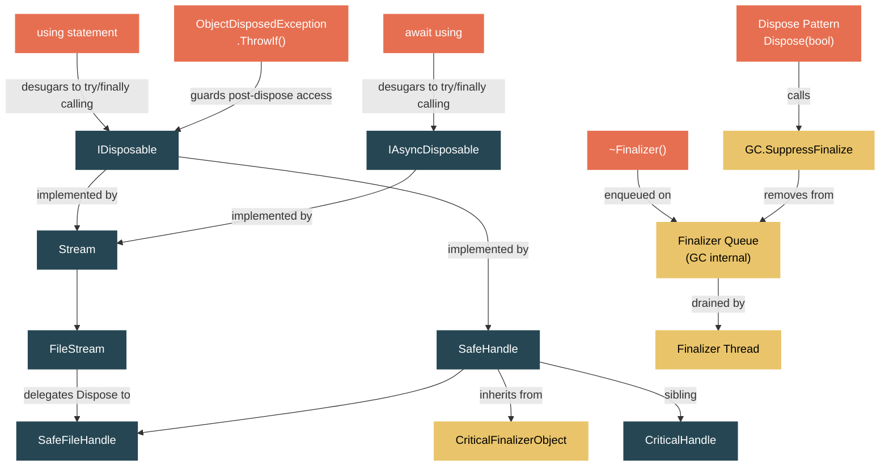

# Level 2: Practitioner — The IDisposable Contract and Resource Management

> **Target profile:** Developer who uses `using` statements but doesn't fully understand finalization, the dispose pattern, or SafeHandle
> **Estimated effort:** 3 hours
> **Prerequisites:** [Module 1.3 — The Type System](01-foundations-type-system.md), [Module 1.6 — Basic I/O](01-foundations-basic-io.md)
> [Version en espanol](../es/02-practitioner-disposable.md)

---

## Learning Objectives

By the end of this module you will be able to:

1. **Explain the IDisposable contract** and the five conditions that `Dispose` must satisfy, as documented in the runtime source itself.
2. **Desugar a `using` statement** into the try/finally block the compiler actually generates, and identify why this matters for exception safety.
3. **Implement the full dispose pattern** with `Dispose(bool)`, a finalizer, and `GC.SuppressFinalize` — and articulate why each piece exists.
4. **Describe the finalization mechanism** — the finalizer queue, the finalizer thread, and why finalizers are expensive and unreliable.
5. **Trace the dispose chain** from a `using (var fs = new FileStream(...))` through `Stream.Dispose`, `FileStream.Dispose(bool)`, to `SafeFileHandle.ReleaseHandle`.
6. **Explain why SafeHandle exists**, how it inherits from `CriticalFinalizerObject`, and how reference counting prevents handle recycling attacks.
7. **Use `IAsyncDisposable` and `await using`** for resources that require asynchronous cleanup.
8. **Apply `ObjectDisposedException.ThrowIf`** as the modern guard pattern for disposed objects.

---

## Concept Map



---

## Curriculum

### Lesson 1 — IDisposable: The Contract

#### What you'll learn
What the `IDisposable` interface promises, what the `using` statement actually compiles to, and why deterministic cleanup matters.

#### The concept

The `IDisposable` interface is one of the simplest in .NET — a single method:

```csharp
public interface IDisposable
{
    void Dispose();
}
```

But the contract behind that method is far richer than the signature suggests. The source file `IDisposable.cs` in the runtime contains an extended comment (lines 16-54) that lays out the **five conditions** every `Dispose` implementation must satisfy:

1. **Be safely callable multiple times.** A second call to `Dispose()` should do nothing — never throw.
2. **Release any resources associated with the instance.** File handles, database connections, native memory — anything the GC cannot clean up on its own.
3. **Call the base class's `Dispose` method**, if there is one.
4. **Suppress finalization** of the class to reduce GC overhead (fewer objects on the finalization queue).
5. **Not throw exceptions** except for truly catastrophic errors like `OutOfMemoryException`.

The source comment also explains the fundamental problem: the garbage collector provides no way to know *when* a finalizer will run. If your class holds an OS resource — a file handle, a network socket — you cannot rely on the GC to clean it up in a timely manner. `IDisposable` solves this by letting the developer choose *exactly* when cleanup happens.

**The `using` statement is syntactic sugar.** The compiler transforms:

```csharp
using (var fs = new FileStream("data.txt", FileMode.Open))
{
    // work with fs
}
```

into:

```csharp
FileStream fs = new FileStream("data.txt", FileMode.Open);
try
{
    // work with fs
}
finally
{
    if (fs != null)
    {
        ((IDisposable)fs).Dispose();
    }
}
```

The `finally` block guarantees that `Dispose()` is called even if an exception is thrown inside the `try` block. This is **deterministic cleanup** — the resource is released at a predictable point in execution, not at some future GC cycle.

The modern C# `using` declaration (without braces) scopes the disposal to the end of the enclosing block:

```csharp
using var fs = new FileStream("data.txt", FileMode.Open);
// fs is disposed at the end of this method/block
```

The compiler generates the same try/finally — the scope boundary just happens to be the enclosing method or block rather than an explicit brace pair.

Notice that the source comment in `IDisposable.cs` (lines 23-26) even mentions an interesting design tension: classes may "privately implement IDisposable and provide a Close method instead, if that name is by far the expected name for objects in that domain (ie, you don't Dispose of a FileStream, you Close it)." This is exactly what `Stream` does — as we will see in Lesson 2.

#### In the source code

| File | What to look at |
|---|---|
| `src/libraries/System.Private.CoreLib/src/System/IDisposable.cs` | The entire file (59 lines) — the interface declaration and the design-rationale comment that is longer than the code |
| `src/libraries/System.Private.CoreLib/src/System/IAsyncDisposable.cs` | The async counterpart — `ValueTask DisposeAsync()` |

#### Hands-on exercise

1. Create a console application. Write a class `ResourceHolder` that implements `IDisposable`:
   ```csharp
   public class ResourceHolder : IDisposable
   {
       private bool _disposed;

       public ResourceHolder() => Console.WriteLine("ResourceHolder created");

       public void DoWork()
       {
           if (_disposed) throw new ObjectDisposedException(nameof(ResourceHolder));
           Console.WriteLine("Working...");
       }

       public void Dispose()
       {
           if (!_disposed)
           {
               Console.WriteLine("Disposing ResourceHolder");
               _disposed = true;
           }
       }
   }
   ```
2. Use it with `using (var r = new ResourceHolder()) { r.DoWork(); }`. Observe the output order.
3. Now throw an exception inside the `using` block. Confirm that `Dispose` is still called.
4. Call `Dispose()` twice. Confirm that the second call does nothing (condition 1 of the contract).
5. Try calling `DoWork()` after `Dispose()`. Observe the `ObjectDisposedException`.

#### Key takeaway

`IDisposable` is a contract, not just an interface. The `using` statement compiles to a try/finally that guarantees `Dispose()` runs — giving you deterministic resource cleanup that the garbage collector alone cannot provide.

---

### Lesson 2 — The Dispose Pattern: Why Dispose(bool)

#### What you'll learn
The full dispose pattern, why it has a `protected virtual void Dispose(bool disposing)` method, and how `GC.SuppressFinalize` ties the pattern together.

#### The concept

The simple `IDisposable` implementation in Lesson 1 works for classes that only hold managed resources. But what about classes that wrap **native resources** — file handles, sockets, unmanaged memory? These need a finalizer as a safety net, and the interaction between `Dispose()` and the finalizer creates the full dispose pattern.

Here is the pattern as practiced throughout the runtime:

```csharp
public class MyResource : IDisposable
{
    private bool _disposed;
    private IntPtr _nativeHandle; // some OS resource

    // Public Dispose — called by the developer (or by `using`)
    public void Dispose()
    {
        Dispose(disposing: true);
        GC.SuppressFinalize(this);
    }

    // Finalizer — called by the GC if Dispose wasn't called
    ~MyResource()
    {
        Dispose(disposing: false);
    }

    // Core logic — protected virtual so subclasses can override
    protected virtual void Dispose(bool disposing)
    {
        if (!_disposed)
        {
            if (disposing)
            {
                // Free MANAGED resources (other IDisposable objects)
                // Safe to touch other managed objects here
            }

            // Free NATIVE resources (handles, unmanaged memory)
            // Must NOT touch other managed objects here when called from finalizer
            if (_nativeHandle != IntPtr.Zero)
            {
                CloseHandle(_nativeHandle);
                _nativeHandle = IntPtr.Zero;
            }

            _disposed = true;
        }
    }
}
```

**Why the `disposing` parameter?** The critical distinction is *who is calling*:

- When `disposing` is `true`, the developer called `Dispose()`. All managed objects are still alive and reachable. You can safely call `.Dispose()` on other objects you own.
- When `disposing` is `false`, the **finalizer** is calling. Other managed objects may have already been finalized and collected — touching them is unsafe. You can only release native resources.

The `IDisposable.cs` source file (lines 49-54) explains this problem clearly: a `StreamWriter` that holds a reference to a `Stream` cannot safely write buffered data in its finalizer, because the GC might have already finalized and collected the `Stream`. This is why `StreamWriter` does not have a finalizer — and why the dispose pattern carefully separates managed from unmanaged cleanup.

**`GC.SuppressFinalize` is the performance link.** When `Dispose()` is called (the `true` path), the method calls `GC.SuppressFinalize(this)` to remove the object from the finalization queue. This means:
- The finalizer thread never has to process this object.
- The object can be collected in a single GC cycle instead of requiring two (one to detect it is unreachable, one after the finalizer runs).

Looking at the actual implementation in `GC.CoreCLR.cs` (lines 359-367):

```csharp
public static unsafe void SuppressFinalize(object obj)
{
    ArgumentNullException.ThrowIfNull(obj);
    MethodTable* pMT = RuntimeHelpers.GetMethodTable(obj);
    if (pMT->HasFinalizer)
    {
        SuppressFinalizeInternal(obj);
    }
}
```

Notice the optimization: if the object's `MethodTable` indicates it has no finalizer, the method is a no-op. The runtime does not waste cycles on objects that cannot be finalized.

**How `Stream` applies this pattern.** In `Stream.cs` (lines 156-172):

```csharp
public void Dispose() => Close();

public virtual void Close()
{
    Dispose(true);
    GC.SuppressFinalize(this);
}

protected virtual void Dispose(bool disposing)
{
    // Note: Never change this to call other virtual methods on Stream
}
```

The comment on `Close()` (line 160) reveals a historical design choice: "When initially designed, Stream required that all cleanup logic went into Close(), but this was thought up before IDisposable was added and never revisited." So `Dispose()` calls `Close()`, which calls `Dispose(true)` and `SuppressFinalize`. The base `Dispose(bool)` is empty — subclasses like `FileStream` override it.

#### In the source code

| File | What to look at |
|---|---|
| `src/libraries/System.Private.CoreLib/src/System/IO/Stream.cs` | `Dispose()` (line 156), `Close()` (line 158), `Dispose(bool)` (line 167) — the full pattern in the base class |
| `src/libraries/System.Private.CoreLib/src/System/IO/FileStream.cs` | `Dispose(bool)` (line 504): `_strategy?.DisposeInternal(disposing)` — delegates to the strategy |
| `src/libraries/System.Private.CoreLib/src/System/IO/FileStream.cs` | Finalizer `~FileStream()` (line 136): "Preserved for compatibility since FileStream has defined a finalizer in past releases" |
| `src/coreclr/System.Private.CoreLib/src/System/GC.CoreCLR.cs` | `SuppressFinalize` (line 359), `ReRegisterForFinalize` (line 377) |

#### Hands-on exercise

1. Extend the `ResourceHolder` from Lesson 1 with the full dispose pattern: add a `~ResourceHolder()` finalizer and the `Dispose(bool)` overload. Add `Console.WriteLine` calls in both paths so you can see which runs.
2. Create a `ResourceHolder` **without** a `using` statement and let it go out of scope. Call `GC.Collect()` followed by `GC.WaitForPendingFinalizers()`. Observe the finalizer running.
3. Now wrap it in `using`. Observe that the finalizer does **not** run (because `SuppressFinalize` removed it from the queue).
4. Create a subclass `DerivedHolder : ResourceHolder` that overrides `Dispose(bool)` and calls `base.Dispose(disposing)`. Verify that both the derived and base cleanup run.
5. **Question to answer:** If you forget `GC.SuppressFinalize(this)` in the `Dispose()` method, what happens? (Answer: the finalizer still runs even after manual disposal, doing redundant work and delaying collection by one GC cycle.)

#### Key takeaway

The `Dispose(bool)` pattern exists to handle two callers — the developer (via `using`) and the GC (via the finalizer). The `disposing` flag tells you which case you are in. `GC.SuppressFinalize` is the bridge that prevents the finalizer from running when the developer has already cleaned up. Every class that directly owns a native resource must implement this pattern.

---

### Lesson 3 — Finalization: The Safety Net

#### What you'll learn
What the finalizer queue is, how the finalizer thread works, why finalization is expensive, and why relying on finalizers is a mistake.

#### The concept

A **finalizer** (the `~ClassName()` syntax in C#, which compiles to a `Finalize` method) is the GC's mechanism for giving an object one last chance to clean up before its memory is reclaimed. But finalization is not free — it is expensive, unpredictable, and can leak resources for extended periods.

**The finalization lifecycle:**

1. **Registration.** When an object with a finalizer is allocated, the GC places it on the **finalization queue** — a special list of objects that need finalization before their memory can be reclaimed.
2. **Detection.** When the GC determines the object is unreachable (no live references), it does *not* collect it immediately. Instead, it moves it from the finalization queue to the **f-reachable queue** and **resurrects** the object temporarily — the object is alive again.
3. **Execution.** A dedicated **finalizer thread** (a background thread managed by the runtime) processes the f-reachable queue. It calls each object's finalizer one at a time, sequentially.
4. **Collection.** Only after the finalizer has run can the object (and any objects it keeps alive) be collected in a subsequent GC cycle.

**This means a finalizable object survives at least one extra GC cycle.** If the object was in Gen0, it gets promoted to Gen1. If it was in Gen1, it gets promoted to Gen2. This is called **graph promotion** — the finalizable object and everything it references get promoted together, increasing GC pressure.

**The finalizer thread is a bottleneck.** There is only one finalizer thread. If a finalizer hangs, blocks, or takes a long time, it delays finalization of all other objects. The runtime gives the finalizer thread a limited amount of time during shutdown — if your finalizer does not complete, it may be killed.

**Order is not guaranteed.** The GC can finalize objects in any order. If object A references object B and both have finalizers, the GC might finalize B before A. This is exactly the `StreamWriter`/`Stream` problem described in `IDisposable.cs` (lines 49-54): the `StreamWriter`'s finalizer cannot safely flush to the `Stream` because the `Stream` might already be finalized.

**`GC.ReRegisterForFinalize`** is the inverse of `SuppressFinalize`. Defined in `GC.CoreCLR.cs` (lines 377-388), it puts an object back on the finalization queue. This is used in rare "resurrection" scenarios — where a finalizer intentionally makes the object reachable again (e.g., by storing `this` in a static field). The comment at line 371 explains: "The other situation where calling ReRegisterForFinalize is useful is inside a finalizer that needs to resurrect itself or an object that it references."

**`CriticalFinalizerObject` provides ordering guarantees.** Defined in `CriticalFinalizerObject.cs`, this abstract base class ensures that derived types' finalizers run *after* all non-critical finalizers. The runtime guarantees this ordering so that critical cleanup (like releasing OS handles) happens last, when other finalizers that might depend on those resources have already completed. `SafeHandle` inherits from `CriticalFinalizerObject` — this is how the runtime ensures that a file handle is not closed while another finalizer is still trying to use it.

#### In the source code

| File | What to look at |
|---|---|
| `src/libraries/System.Private.CoreLib/src/System/IDisposable.cs` | Lines 49-54 — the StreamWriter/Stream finalization-order problem |
| `src/coreclr/System.Private.CoreLib/src/System/GC.CoreCLR.cs` | `SuppressFinalize` (line 359), `ReRegisterForFinalize` (line 377) |
| `src/libraries/System.Private.CoreLib/src/System/Runtime/ConstrainedExecution/CriticalFinalizerObject.cs` | The entire file — a base class with an empty finalizer that the runtime treats specially |
| `src/libraries/System.Private.CoreLib/src/System/IO/FileStream.cs` | The `~FileStream()` finalizer (line 136) — preserved purely for compatibility with derived classes |

#### Hands-on exercise

1. Create a class with a finalizer that writes a timestamp to a static `List<string>`:
   ```csharp
   public class Tracked
   {
       private readonly int _id;
       public Tracked(int id) => _id = id;
       ~Tracked() => Program.FinalizationLog.Add(
           $"Finalized #{_id} at {DateTime.UtcNow:O}");
   }
   ```
2. Allocate 10 `Tracked` objects in a loop and let them go out of scope. Call `GC.Collect()` and `GC.WaitForPendingFinalizers()`. Print the log. Observe the order — it may not match allocation order.
3. Now call `GC.SuppressFinalize` on even-numbered objects before they go out of scope. Observe that only odd-numbered objects appear in the log.
4. Measure the time between object creation and finalization in a release build. Create 100,000 finalizable objects, trigger GC, and measure how long `WaitForPendingFinalizers` blocks.
5. **Question to answer:** Why does the `FileStream` class still define a finalizer (line 136 of `FileStream.cs`) if it delegates all resource management to `SafeFileHandle`? (Answer: for backward compatibility — derived classes may override `Dispose(bool)` and rely on the finalizer calling `Dispose(false)` to trigger their cleanup.)

#### Key takeaway

Finalization is a safety net, not a strategy. Finalizable objects survive extra GC cycles, promote their entire reference graph, and compete for a single finalizer thread. Always call `Dispose()` (or use `using`) to avoid finalization entirely. `GC.SuppressFinalize` is the bridge that removes correctly-disposed objects from the finalization queue.

---

### Lesson 4 — SafeHandle: Wrapping Native Resources

#### What you'll learn
Why `SafeHandle` was introduced, how it extends `CriticalFinalizerObject` to guarantee handle cleanup, how reference counting prevents handle recycling attacks, and how `SafeFileHandle` closes the chain from managed code to the OS.

#### The concept

Before `SafeHandle`, native OS handles were passed around as raw `IntPtr` values. This caused two dangerous problems:

1. **Handle leaks.** If an exception occurred between obtaining a handle and storing it in a managed object, the handle was lost forever.
2. **Handle recycling attacks.** In a race between finalizing one object and using another, the OS could reassign a closed handle number to a new resource. Code that still held the old `IntPtr` would operate on the wrong resource — a security vulnerability.

`SafeHandle` (in `SafeHandle.cs`) solves both problems. Its inheritance chain is:

```
CriticalFinalizerObject
    └── SafeHandle (abstract)
            └── SafeHandleZeroOrMinusOneIsInvalid (abstract)
                    └── SafeFileHandle (sealed)
```

**CriticalFinalizerObject** (the grandparent) ensures that the finalizer runs *after* all ordinary finalizers and is prepared at construction time so that JIT allocation failures cannot prevent it from running.

**SafeHandle's state machine.** The `_state` field (line 30 in `SafeHandle.cs`) packs three pieces of information into a single `int`:

```
 31                                                        2  1   0
+-----------------------------------------------------------+---+---+
|                           Ref count                       | D | C |
+-----------------------------------------------------------+---+---+
```

- **Bit 0 (C):** Closed — the handle has been (or will be) released.
- **Bit 1 (D):** Disposed — `Dispose()` has been called.
- **Ref count (bits 2-31):** The number of active P/Invoke calls or manual `DangerousAddRef` holds.

All transitions use `Interlocked.CompareExchange` for thread safety. The handle is released only when the reference count drops to zero *and* a dispose/finalize operation has been requested.

**The reference counting protocol:**

1. Before a P/Invoke call, the marshaler calls `DangerousAddRef(ref bool success)`, incrementing the ref count. If the handle is already closed, `ObjectDisposedException` is thrown.
2. After the P/Invoke returns, the marshaler calls `DangerousRelease()`, decrementing the ref count.
3. When the count reaches zero and a dispose/finalize has been requested, `ReleaseHandle()` is called — the abstract method that subclasses implement to actually close the OS handle.
4. `Dispose()` (line 99) calls `Dispose(true)` and then `GC.SuppressFinalize(this)`.
5. The finalizer (line 79) calls `Dispose(false)`.
6. Both paths converge on `InternalRelease(disposeOrFinalizeOperation: true)`, which sets the Disposed bit and decrements the ref count.

**SafeFileHandle is the concrete endpoint.** Declared as `sealed partial class SafeFileHandle : SafeHandleZeroOrMinusOneIsInvalid`, it provides the `ReleaseHandle()` implementation. On Unix (`SafeFileHandle.Unix.cs`, line 145):

```csharp
protected override bool ReleaseHandle()
{
    // If DeleteOnClose was requested, delete the file now
    if (_deleteOnClose)
    {
        Interop.Sys.Unlink(_path);
    }
    // Release advisory lock if held
    if (_isLocked)
    {
        Interop.Sys.FLock(handle, Interop.Sys.LockOperations.LOCK_UN);
    }
    // Actually close the file descriptor
    return Interop.Sys.Close(handle) == 0;
}
```

The `IsInvalid` property is inherited from `SafeHandleZeroOrMinusOneIsInvalid` (line 16): `handle == IntPtr.Zero || handle == new IntPtr(-1)`. If the handle is invalid, `ReleaseHandle()` is never called — there is nothing to release.

**The constructor has a subtle design.** In `SafeHandle.cs` (lines 57-77):

```csharp
protected SafeHandle(IntPtr invalidHandleValue, bool ownsHandle)
{
    handle = invalidHandleValue;
    _state = StateBits.RefCountOne; // Ref count 1 and not closed or disposed
    _ownsHandle = ownsHandle;
    if (!ownsHandle)
    {
        GC.SuppressFinalize(this);
    }
    Volatile.Write(ref _fullyInitialized, true);
}
```

If `ownsHandle` is `false`, finalization is suppressed immediately — this SafeHandle is just a wrapper around a handle owned by someone else. The `_fullyInitialized` flag (written with `Volatile.Write` to guarantee visibility) ensures the finalizer skips cleanup if the constructor threw before completing.

**CriticalHandle — the lightweight alternative.** `CriticalHandle.cs` is a sibling of `SafeHandle` that lacks reference counting. It is lighter weight but provides no protection against handle recycling. The file's header comment (lines 14-42) makes this abundantly clear: "This lowers the overhead of using the handle considerably, but leaves the onus on the caller to protect themselves from any recycling effects." In practice, `SafeHandle` is strongly preferred.

#### In the source code

| File | What to look at |
|---|---|
| `src/libraries/System.Private.CoreLib/src/System/Runtime/InteropServices/SafeHandle.cs` | State bitmask (lines 36-54), constructor (line 57), `Dispose()` (line 99), finalizer (line 79), `DangerousAddRef` (line 130), `InternalRelease` (line 189), `ReleaseHandle` (line 128) |
| `src/libraries/System.Private.CoreLib/src/Microsoft/Win32/SafeHandles/SafeHandleZeroOrMinusOneIsInvalid.cs` | The `IsInvalid` implementation — `handle == IntPtr.Zero || handle == new IntPtr(-1)` |
| `src/libraries/System.Private.CoreLib/src/Microsoft/Win32/SafeHandles/SafeFileHandle.cs` | Constructor (line 36), `ObjectDisposedException.ThrowIf(IsClosed, this)` guard (line 52) |
| `src/libraries/System.Private.CoreLib/src/Microsoft/Win32/SafeHandles/SafeFileHandle.Unix.cs` | `ReleaseHandle()` (line 145) — delete-on-close, unlock, and `Interop.Sys.Close` |
| `src/libraries/System.Private.CoreLib/src/System/Runtime/InteropServices/CriticalHandle.cs` | Header comment (lines 1-45) — the design rationale for a handle without ref counting |
| `src/libraries/System.Private.CoreLib/src/System/Runtime/ConstrainedExecution/CriticalFinalizerObject.cs` | The critical finalizer base class |

#### Hands-on exercise

1. Open the .NET Source Browser (source.dot.net) and navigate to `SafeHandle`. Follow the inheritance chain: `CriticalFinalizerObject` -> `SafeHandle` -> `SafeHandleZeroOrMinusOneIsInvalid` -> `SafeFileHandle`. Read each class's declaration.
2. In a console app, create a `FileStream`, then use a debugger to inspect its `_strategy` field. Drill down until you find the `SafeFileHandle` — inspect its `handle` value (the raw OS handle integer), `_state`, and `_ownsHandle`.
3. Call `fileStream.SafeFileHandle.DangerousGetHandle()` to see the raw `IntPtr`. Understand why this is named "dangerous" — it bypasses the reference counting safety.
4. Read the `InternalRelease` method in `SafeHandle.cs` (line 189). Trace the `Interlocked.CompareExchange` loop and identify: (a) when `performRelease` becomes `true`, (b) when the `Disposed` bit is set, (c) when the `Closed` bit is set.
5. **Question to answer:** Why does the `SafeHandle` constructor start with a ref count of 1 (line 60: `_state = StateBits.RefCountOne`)? (Answer: the initial ref count of 1 represents the "dispose" reference. When `Dispose()` or the finalizer calls `InternalRelease`, it decrements this to 0 and closes the handle. Any P/Invoke `DangerousAddRef` calls add additional ref counts above this baseline.)

#### Key takeaway

`SafeHandle` wraps native OS handles with reference counting and critical finalization to guarantee cleanup even in the face of thread aborts, asynchronous exceptions, and P/Invoke races. The inheritance from `CriticalFinalizerObject` ensures the finalizer runs last and is pre-JITted. Always use `SafeHandle` (or a derived class) when wrapping native resources — never pass raw `IntPtr` values between managed and native code.

---

### Lesson 5 — Modern Patterns: IAsyncDisposable and ObjectDisposedException.ThrowIf

#### What you'll learn
How `IAsyncDisposable` enables async cleanup, how `await using` desugars, and how the modern `ObjectDisposedException.ThrowIf` guard simplifies post-dispose protection.

#### The concept

**IAsyncDisposable.** Some resources require asynchronous work during cleanup — flushing buffered data to a network stream, waiting for pending I/O to complete, or releasing a resource on a remote server. For these cases, `IAsyncDisposable` provides:

```csharp
public interface IAsyncDisposable
{
    ValueTask DisposeAsync();
}
```

The `await using` statement desugars to:

```csharp
var resource = new AsyncResource();
try
{
    // work with resource
}
finally
{
    if (resource != null)
    {
        await resource.DisposeAsync();
    }
}
```

**How `Stream` implements both interfaces.** `Stream` (line 14) implements `IDisposable` and `IAsyncDisposable`. Its default `DisposeAsync` (line 174) simply calls `Dispose()` synchronously and returns a completed `ValueTask`:

```csharp
public virtual ValueTask DisposeAsync()
{
    try
    {
        Dispose();
        return default;
    }
    catch (Exception exc)
    {
        return new ValueTask(Task.FromException(exc));
    }
}
```

Subclasses like `FileStream` override `DisposeAsync()` (line 506) to perform asynchronous cleanup:

```csharp
public override async ValueTask DisposeAsync()
{
    await _strategy.DisposeAsync().ConfigureAwait(false);
    if (!_strategy.IsDerived)
    {
        Dispose(false);
        GC.SuppressFinalize(this);
    }
}
```

Notice the subtle design: when `_strategy.IsDerived` is `false` (the `FileStream` was not subclassed), the method calls `Dispose(false)` and `SuppressFinalize` directly. When the stream was subclassed, it lets the base `DisposeAsync()` call `Dispose()` instead, so the derived class's `Dispose(bool)` override runs correctly. This backward-compatibility dance ensures that pre-existing subclasses of `FileStream` that override `Dispose(bool)` continue to work.

**ObjectDisposedException.ThrowIf — the modern guard.** Before this pattern existed, disposed-state checks looked like:

```csharp
if (_disposed)
    throw new ObjectDisposedException(GetType().FullName);
```

The modern `ObjectDisposedException.ThrowIf` (in `ObjectDisposedException.cs`, line 57) condenses this to:

```csharp
ObjectDisposedException.ThrowIf(_disposed, this);
```

The method signature:

```csharp
[StackTraceHidden]
public static void ThrowIf(
    [DoesNotReturnIf(true)] bool condition,
    object instance)
```

Two design details worth noting:
- `[StackTraceHidden]` ensures the `ThrowIf` method itself does not appear in the stack trace — the exception looks like it was thrown from the calling method.
- `[DoesNotReturnIf(true)]` tells the compiler that if `condition` is `true`, the method never returns. This eliminates null-state warnings after the guard.

A type-based overload (line 70) accepts `Type` instead of `object`:

```csharp
ObjectDisposedException.ThrowIf(IsClosed, typeof(SafeFileHandle));
```

`SafeFileHandle` uses this pattern directly. In `SafeFileHandle.cs` (line 52):

```csharp
ObjectDisposedException.ThrowIf(IsClosed, this);
```

And in `SafeHandle.cs` (line 165), during `DangerousAddRef`:

```csharp
ObjectDisposedException.ThrowIf((oldState & StateBits.Closed) != 0, this);
```

**Tracing the full dispose chain: `using` to OS handle release.**

Here is the complete chain when you write `using var fs = new FileStream("data.txt", FileMode.Open);` and the `using` scope ends:

1. The compiler-generated `finally` block calls `((IDisposable)fs).Dispose()`.
2. `Stream.Dispose()` (line 156) calls `Close()`.
3. `Stream.Close()` (line 158) calls `Dispose(true)` then `GC.SuppressFinalize(this)`.
4. `FileStream.Dispose(bool)` (line 504) calls `_strategy?.DisposeInternal(disposing)`.
5. The strategy flushes any buffered data, then disposes its `SafeFileHandle`.
6. `SafeHandle.Dispose()` (line 99) calls `Dispose(true)` then `GC.SuppressFinalize(this)`.
7. `SafeHandle.Dispose(bool)` (line 105) calls `InternalRelease(disposeOrFinalizeOperation: true)`.
8. `InternalRelease` (line 189) decrements the ref count. When it reaches zero, it calls `ReleaseHandle()`.
9. `SafeFileHandle.ReleaseHandle()` calls `Interop.Sys.Close(handle)` (Unix) or `Interop.Kernel32.CloseHandle(handle)` (Windows).
10. The OS file descriptor is released.

This chain — from `using` to `Stream.Dispose` to `FileStream.Dispose(bool)` to `SafeFileHandle.InternalRelease` to `Interop.Sys.Close` — is the path that every file I/O resource follows. Understanding it demystifies what `using` actually does.

#### In the source code

| File | What to look at |
|---|---|
| `src/libraries/System.Private.CoreLib/src/System/IAsyncDisposable.cs` | The complete interface — `ValueTask DisposeAsync()` |
| `src/libraries/System.Private.CoreLib/src/System/IO/Stream.cs` | `DisposeAsync()` (line 174) — the default sync-over-async implementation |
| `src/libraries/System.Private.CoreLib/src/System/IO/FileStream.cs` | `DisposeAsync()` (line 506) — the async override with the `IsDerived` check |
| `src/libraries/System.Private.CoreLib/src/System/ObjectDisposedException.cs` | `ThrowIf(bool, object)` (line 57), `ThrowIf(bool, Type)` (line 70) |
| `src/libraries/System.Private.CoreLib/src/Microsoft/Win32/SafeHandles/SafeFileHandle.cs` | `ThrowIf(IsClosed, this)` usage (line 52) |

#### Hands-on exercise

1. Create a class that implements both `IDisposable` and `IAsyncDisposable`:
   ```csharp
   public class AsyncResource : IDisposable, IAsyncDisposable
   {
       private bool _disposed;

       public void Dispose()
       {
           if (!_disposed)
           {
               Console.WriteLine("Sync dispose");
               _disposed = true;
               GC.SuppressFinalize(this);
           }
       }

       public async ValueTask DisposeAsync()
       {
           if (!_disposed)
           {
               await Task.Delay(100); // simulate async cleanup
               Console.WriteLine("Async dispose");
               _disposed = true;
               GC.SuppressFinalize(this);
           }
       }
   }
   ```
2. Use it with `using var r = new AsyncResource();` (sync dispose). Then use `await using var r = new AsyncResource();` (async dispose). Observe which path each takes.
3. Replace the manual `if (_disposed)` checks with `ObjectDisposedException.ThrowIf`:
   ```csharp
   public void DoWork()
   {
       ObjectDisposedException.ThrowIf(_disposed, this);
       Console.WriteLine("Working...");
   }
   ```
4. Catch the `ObjectDisposedException` and inspect its `ObjectName` property. Note that it contains the type's full name.
5. **Challenge:** Trace the dispose chain on a real `FileStream`. Set breakpoints in `Stream.Dispose`, `Stream.Close`, and (if using Source Link) `FileStream.Dispose(bool)`. Step through and confirm the call order matches the 10-step chain described above.

#### Key takeaway

`IAsyncDisposable` extends the dispose contract to asynchronous scenarios. `ObjectDisposedException.ThrowIf` is the modern, concise guard pattern. The full dispose chain — from `using` through `Stream.Dispose` to `SafeFileHandle.ReleaseHandle` to the OS — is a concrete sequence of method calls, not magic. Understanding this chain is the key to reasoning about resource lifetimes in .NET.

---

## Source Code Reading Guide

These files are ordered for progressive reading. Start with single-star files, then progress to two stars.

| # | File | Difficulty | What you'll learn |
|---|---|---|---|
| 1 | `src/libraries/System.Private.CoreLib/src/System/IDisposable.cs` | Star | The interface itself is one line; the design-rationale comment is the real content — five conditions of the contract |
| 2 | `src/libraries/System.Private.CoreLib/src/System/IAsyncDisposable.cs` | Star | The async counterpart — `ValueTask DisposeAsync()` |
| 3 | `src/libraries/System.Private.CoreLib/src/System/IO/Stream.cs` | Star | `Dispose()` -> `Close()` -> `Dispose(true)` + `SuppressFinalize` — the pattern in practice |
| 4 | `src/libraries/System.Private.CoreLib/src/System/ObjectDisposedException.cs` | Star | `ThrowIf` with `[StackTraceHidden]` and `[DoesNotReturnIf(true)]` attributes |
| 5 | `src/libraries/System.Private.CoreLib/src/System/IO/FileStream.cs` | Star-Star | Finalizer (line 136), `Dispose(bool)` (line 504), `DisposeAsync` (line 506), `SuppressFinalize` in constructor error path (line 57) |
| 6 | `src/libraries/System.Private.CoreLib/src/System/Runtime/ConstrainedExecution/CriticalFinalizerObject.cs` | Star | Entire file (22 lines) — the empty finalizer that the runtime treats as critical |
| 7 | `src/libraries/System.Private.CoreLib/src/System/Runtime/InteropServices/SafeHandle.cs` | Star-Star | State bitmask, ref counting, `InternalRelease`, `ReleaseHandle` — the core of native resource safety |
| 8 | `src/libraries/System.Private.CoreLib/src/Microsoft/Win32/SafeHandles/SafeFileHandle.cs` | Star | The concrete handle — constructor, `ObjectDisposedException.ThrowIf` guard |
| 9 | `src/libraries/System.Private.CoreLib/src/Microsoft/Win32/SafeHandles/SafeFileHandle.Unix.cs` | Star-Star | `ReleaseHandle()` — delete-on-close, unlock advisory lock, `Interop.Sys.Close` |
| 10 | `src/coreclr/System.Private.CoreLib/src/System/GC.CoreCLR.cs` | Star-Star | `SuppressFinalize` and `ReRegisterForFinalize` — the native implementation with `MethodTable` check |

---

## Diagnostic Tools

At Level 2, these tools help you observe disposal and finalization behavior:

| Tool | What it helps you see |
|---|---|
| **Debugger (Visual Studio / VS Code + Source Link)** | Step through `Stream.Dispose` -> `Close` -> `Dispose(true)` -> strategy disposal chain |
| **`GC.Collect()` + `GC.WaitForPendingFinalizers()`** | Force finalization in test programs to observe finalizer execution |
| **`dotnet-counters`** | Monitor `gen-0-gc-count`, `gen-1-gc-count`, `gen-2-gc-count` to see how finalizable objects promote across generations |
| **`dotnet-dump` / `dumpheap -type Tracked`** | Inspect objects on the finalization queue in a memory dump |
| **Process Explorer / `lsof`** | See open file handles for your process — verify that handles are released after disposal |
| **`ObjectDisposedException` in stack traces** | The `[StackTraceHidden]` attribute on `ThrowIf` means the exception appears to originate from your code, not from the guard method |

**Tip:** To see the finalizer thread in Visual Studio, open the **Threads** window (Debug > Windows > Threads). The finalizer thread is named ".NET Finalizer" and runs at above-normal priority.

---

## Self-Assessment

### Knowledge check

1. **List the five conditions** that a `Dispose` implementation must satisfy, as documented in the `IDisposable.cs` source file.

2. **Desugar the following code** into the try/finally the compiler generates:
   ```csharp
   using var conn = new SqlConnection(connString);
   conn.Open();
   // use conn
   ```

3. **Explain why `Dispose(bool)` takes a boolean parameter.** What are the two calling contexts, and what is unsafe to do in each?

4. **A class has a finalizer but the developer always calls `Dispose()`.** What would happen if `GC.SuppressFinalize(this)` were removed from the `Dispose()` method?

5. **Why does `SafeHandle` use reference counting?** Describe the handle-recycling attack that ref counting prevents.

6. **Trace the full dispose chain** from `using var fs = new FileStream(...)` to the OS handle being released. Name each method call in order.

7. **What does `CriticalFinalizerObject` guarantee** about the order of finalizer execution? Why does `SafeHandle` need this?

8. **When should you use `await using` vs `using`?** Give a concrete example where synchronous `Dispose` would be insufficient.

### Practical challenge

Write a class `ManagedTempFile` that:
1. In its constructor, creates a temporary file using `Path.GetTempFileName()` and opens it as a `FileStream`.
2. Implements `IDisposable` with the full dispose pattern (including a finalizer).
3. In `Dispose(bool disposing)`:
   - When `disposing` is `true`: closes the `FileStream`, then deletes the temporary file.
   - When `disposing` is `false`: only ensures the `FileStream`'s `SafeFileHandle` is closed (do not delete the file — the file system state is uncertain in finalization).
4. Uses `ObjectDisposedException.ThrowIf` to guard public methods.
5. Passes this test:
   ```csharp
   string path;
   using (var tmp = new ManagedTempFile())
   {
       path = tmp.Path;
       tmp.Write(Encoding.UTF8.GetBytes("hello"));
       Assert.True(File.Exists(path));
   }
   Assert.False(File.Exists(path)); // file deleted on dispose
   ```

---

## Connections

| Direction | Module | Relationship |
|---|---|---|
| **Previous** | [2.8 — Serialization: System.Text.Json Internals](02-practitioner-json.md) | JSON serializers may work with `Stream`-based disposal patterns |
| **Next** | [2.10 — Configuration, Options, and the Hosting Model](02-practitioner-hosting.md) | The hosting model's `IHost` implements `IAsyncDisposable` |
| **Back** | [1.6 — Basic I/O: Files, Console, and Streams](01-foundations-basic-io.md) | Introduced `Stream`, `FileStream`, and the `using` pattern — this module explains why they work the way they do |
| **Back** | [1.3 — The Type System](01-foundations-type-system.md) | Reference types, the heap, and GC basics — prerequisites for understanding finalization |
| **Forward** | [3.1 — Memory Model: Stack, Heap, Span, and Memory](03-advanced-memory-model.md) | Span/Memory interact with pooled resources that use custom disposal patterns |
| **Forward** | [3.2 — Garbage Collection: Generations, Modes, and Tuning](03-advanced-gc.md) | Deep dive into finalization queues, graph promotion, and GC mechanics |
| **Forward** | [3.10 — Native Interop: P/Invoke and LibraryImport](03-advanced-native-interop.md) | SafeHandle's role in P/Invoke marshaling — how the marshaler calls DangerousAddRef/DangerousRelease |

---

## Glossary

| Term | Definition |
|---|---|
| **IDisposable** | Interface with a single `Dispose()` method for deterministic resource cleanup. The `using` statement automates calls to `Dispose`. |
| **Dispose pattern** | The canonical implementation: `Dispose()` calls `Dispose(true)` + `GC.SuppressFinalize`; a finalizer calls `Dispose(false)`. The `bool` parameter distinguishes managed-safe vs finalizer-only cleanup. |
| **Finalizer** | A `~ClassName()` method called by the GC before reclaiming an object's memory. Runs on a dedicated thread, in unpredictable order. Expensive — causes objects to survive extra GC cycles. |
| **Finalization queue** | A GC-internal list of all allocated objects that have finalizers. Objects are moved to the f-reachable queue when the GC determines they are unreachable. |
| **GC.SuppressFinalize** | Removes an object from the finalization queue. Called during `Dispose()` to prevent the finalizer from running when the developer has already cleaned up. |
| **GC.ReRegisterForFinalize** | Re-adds an object to the finalization queue after it was suppressed. Used in rare resurrection scenarios. |
| **CriticalFinalizerObject** | Abstract base class whose finalizers are guaranteed to run after all non-critical finalizers. Used by `SafeHandle` and `CriticalHandle`. |
| **SafeHandle** | Abstract class wrapping an OS handle (`IntPtr`) with reference counting, critical finalization, and thread-safe state management. Prevents handle leaks and handle recycling attacks. |
| **CriticalHandle** | Lightweight sibling of `SafeHandle` without reference counting. Faster but provides no handle-recycling protection. |
| **SafeFileHandle** | Concrete `SafeHandle` for file descriptors. Inherits from `SafeHandleZeroOrMinusOneIsInvalid`. Its `ReleaseHandle()` calls `close(2)` on Unix or `CloseHandle` on Windows. |
| **IAsyncDisposable** | Interface with `ValueTask DisposeAsync()` for resources requiring asynchronous cleanup. Used with `await using`. |
| **ObjectDisposedException** | Exception thrown when accessing a disposed object. `ThrowIf(bool, object)` is the modern guard pattern. |
| **Handle recycling attack** | A security vulnerability where a closed handle number is reassigned by the OS, and stale code operates on the new (wrong) resource. SafeHandle's ref counting prevents this. |
| **Graph promotion** | When a finalizable object survives a GC cycle (waiting for finalization), it and all objects it references are promoted to the next generation, increasing GC pressure. |

---

## References

| Resource | Type | Relevance |
|---|---|---|
| [.NET Source Browser — IDisposable](https://source.dot.net/#System.Private.CoreLib/src/libraries/System.Private.CoreLib/src/System/IDisposable.cs) | Source | The interface with its design-rationale comment |
| [.NET Source Browser — SafeHandle](https://source.dot.net/#System.Private.CoreLib/src/libraries/System.Private.CoreLib/src/System/Runtime/InteropServices/SafeHandle.cs) | Source | Complete implementation with state machine comments |
| [Microsoft Docs — Implement a Dispose method](https://learn.microsoft.com/en-us/dotnet/standard/garbage-collection/implementing-dispose) | Docs | Official guidance on the dispose pattern |
| [Microsoft Docs — Cleaning up unmanaged resources](https://learn.microsoft.com/en-us/dotnet/standard/garbage-collection/unmanaged) | Docs | Overview of finalizers and IDisposable |
| [Stephen Toub — ConfigureAwait FAQ](https://devblogs.microsoft.com/dotnet/configureawait-faq/) | Blog | Covers `await using` behavior with `ConfigureAwait(false)` |
| [Joe Duffy — SafeHandle (original design notes)](https://joeduffyblog.com/) | Blog | Background on why SafeHandle replaced IntPtr-based patterns |
| [Konrad Kokosa — Pro .NET Memory Management](https://prodotnetmemory.com/) | Book | Chapters on finalization, f-reachable queue, and graph promotion |
| [Book of the Runtime — Finalization](https://github.com/dotnet/runtime/tree/main/docs/design/coreclr/botr) | Deep docs | Runtime internals of the finalization subsystem |

---

*Last updated: 2026-04-14*
