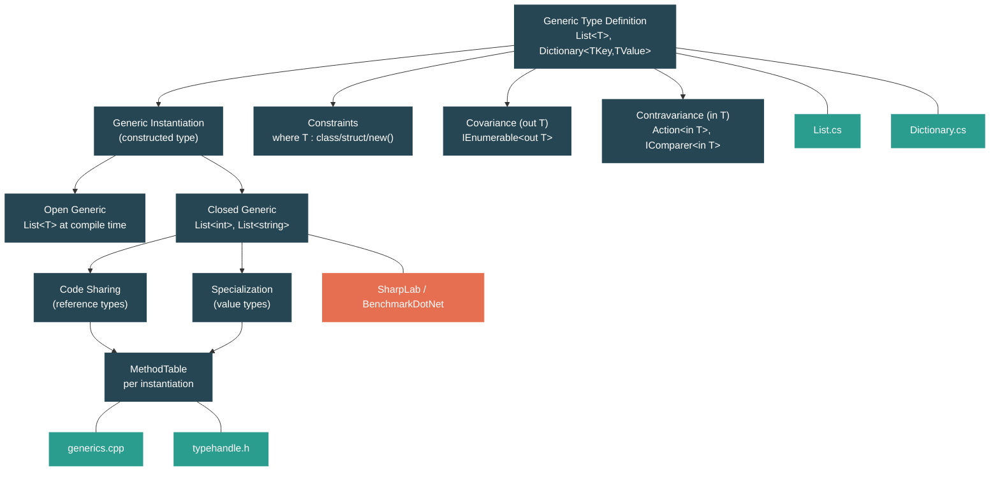

# Level 2: Practitioner — Generics: From Syntax to Runtime Specialization

> **Target profile:** Developer who uses generics daily but doesn't know how the runtime specializes them
> **Estimated effort:** 4 hours
> **Prerequisites:** [Level 1 complete](01-foundations-type-system.md) (especially 1.3 Type System)
> [Version en espanol](../es/02-practitioner-generics.md)

---

## Learning Objectives

By the end of this module you will be able to:

1. Explain why generics were introduced in .NET 2.0 and what problems they solve compared to `ArrayList` and `object`-based APIs.
2. Read generic type definitions in the runtime source and identify how type parameters flow through fields, methods, and interfaces.
3. Describe the six kinds of generic constraints (`where T : class`, `struct`, `new()`, `notnull`, base class, and interface) and explain what each enables at compile time and runtime.
4. Distinguish covariance (`out T`) from contravariance (`in T`) and identify which BCL interfaces use each.
5. Explain how the CoreCLR runtime shares native code for reference-type instantiations but generates specialized code for each value-type instantiation.
6. Trace the path from a generic type definition to a constructed `MethodTable` in the runtime source (`generics.cpp`, `typehandle.h`).
7. Describe how generic methods and generic delegates (`Func<T>`, `Action<T>`) are resolved and dispatched.
8. Identify performance scenarios where generics eliminate boxing and enable JIT devirtualization.

---

## Concept Map



---

## Curriculum

### Lesson 1 — Why Generics Exist

#### What you'll learn

Before .NET 2.0, every general-purpose collection stored `object`. This meant boxing every value type on insertion and type-unsafe casts on retrieval. Generics solved both problems. In this lesson you will understand the cost of the pre-generic world and why `List<T>` replaced `ArrayList`.

#### The concept

Consider the old `System.Collections.ArrayList`:

```csharp
var numbers = new ArrayList();
numbers.Add(42);        // boxing: int -> object (heap allocation)
numbers.Add("hello");   // no compiler error -- type safety lost
int n = (int)numbers[0]; // manual cast required; could throw at runtime
```

Three problems at once:

| Problem | Cause | Cost |
|---|---|---|
| **Boxing** | `Add(object)` forces value types onto the heap | Extra allocation + GC pressure per element |
| **No type safety** | `ArrayList` accepts any `object` | Bugs caught only at runtime, not compile time |
| **Casting overhead** | Every retrieval requires `(int)numbers[i]` | Runtime type check + possible `InvalidCastException` |

Now compare with the generic `List<T>`:

```csharp
var numbers = new List<int>();
numbers.Add(42);         // no boxing: stored directly as int
// numbers.Add("hello"); // compile error: cannot convert string to int
int n = numbers[0];      // no cast needed, returns int
```

Generics provide **type safety at compile time**, **zero boxing for value types**, and **cleaner code without casts**.

#### In the source code

Open `src/libraries/System.Private.CoreLib/src/System/Collections/Generic/List.cs`. The class declaration tells the story:

```csharp
public class List<T> : IList<T>, IList, IReadOnlyList<T>
{
    internal T[] _items;
    internal int _size;
```

The backing store is `T[]` — a typed array. When `T` is `int`, the runtime creates an `int[]` where each element occupies exactly 4 bytes with no object headers, no MethodTable pointers, no boxing. Compare this mentally with `ArrayList`, which uses `object[]` — every `int` stored there would be a 24-byte boxed object on a 64-bit system.

Notice also the static field:

```csharp
private static readonly T[] s_emptyArray = new T[0];
```

The `static` field is per-instantiation: `List<int>` has its own `s_emptyArray` distinct from `List<string>`'s. This is a consequence of how the runtime creates separate state for each generic instantiation.

#### Hands-on exercise

1. Write a micro-benchmark that adds 1 million integers to an `ArrayList` vs a `List<int>`:
   ```csharp
   var arrayList = new System.Collections.ArrayList();
   var genericList = new List<int>();
   var sw = System.Diagnostics.Stopwatch.StartNew();
   for (int i = 0; i < 1_000_000; i++) arrayList.Add(i);
   Console.WriteLine($"ArrayList: {sw.ElapsedMilliseconds}ms");
   sw.Restart();
   for (int i = 0; i < 1_000_000; i++) genericList.Add(i);
   Console.WriteLine($"List<int>: {sw.ElapsedMilliseconds}ms");
   ```
2. Use [SharpLab](https://sharplab.io/) to compile `new ArrayList().Add(42)` and `new List<int>().Add(42)`. Look for the `box` IL instruction in the `ArrayList` version and its absence in the `List<int>` version.
3. Try to `Add("hello")` to a `List<int>` — confirm the compiler rejects it.

#### Key takeaway

Generics are not just syntactic sugar. They change what happens at the IL level and at the runtime level. `List<int>` stores raw integers in a contiguous `int[]` with zero per-element overhead. This is why generics were one of the most impactful features ever added to .NET.

#### Common misconception

> *"Generics are like C++ templates — just text substitution."*
>
> No. C++ templates are expanded at compile time into completely separate code per instantiation. .NET generics are a first-class concept in the type system and IL. The JIT decides at runtime whether to share code (for reference types) or specialize (for value types). The generic type definition exists as a single metadata entity; templates do not.

---

### Lesson 2 — Constraints and Interfaces

#### What you'll learn

Type parameter constraints tell the compiler (and runtime) what capabilities `T` must have. Without constraints, `T` is treated as `object` — you cannot call any methods beyond `ToString`, `Equals`, and `GetHashCode`. In this lesson you will see how constraints unlock algorithms and how the BCL uses generic interfaces like `IComparer<T>` and `IEquatable<T>`.

#### The concept

The six constraint categories:

| Constraint | Syntax | What it enables |
|---|---|---|
| **Reference type** | `where T : class` | `T` can be `null`, can be used as a reference |
| **Value type** | `where T : struct` | No boxing for `T`, `default(T)` is zero-init, cannot be `null` |
| **Constructor** | `where T : new()` | You can write `new T()` inside the generic method |
| **Not-null** | `where T : notnull` | Excludes nullable reference and nullable value types |
| **Base class** | `where T : SomeClass` | Access to `SomeClass` members without casting |
| **Interface** | `where T : IComparable<T>` | Call interface methods directly on `T` |

Constraints are enforced at compile time and verified at JIT time. If a constraint says `where T : struct`, the runtime knows that `T` will never be null and will always be a value type, enabling it to generate tighter code.

#### In the source code

**`Dictionary<TKey, TValue>`** at `src/libraries/System.Private.CoreLib/src/System/Collections/Generic/Dictionary.cs` demonstrates the `notnull` constraint:

```csharp
public class Dictionary<TKey, TValue> : ...
    where TKey : notnull
```

This constraint prevents `Dictionary<string?, int>` from compiling — null keys would break the hash-based lookup.

Inside the constructor you can see how the constraint interacts with performance:

```csharp
// For reference types, we always want to store a comparer instance...
// For value types, if no comparer is provided... we'd prefer to use
// EqualityComparer<TKey>.Default.Equals on every use, enabling the JIT to
// devirtualize and possibly inline the operation.
if (!typeof(TKey).IsValueType)
{
    _comparer = comparer ?? EqualityComparer<TKey>.Default;
}
```

This `typeof(TKey).IsValueType` check is evaluated by the JIT at instantiation time — it becomes a constant `true` or `false`, and the dead branch is eliminated entirely. This is a powerful pattern: generic code that branches on the type parameter, with zero runtime cost because the JIT removes the untaken path.

**`IComparer<T>`** at `src/libraries/System.Private.CoreLib/src/System/Collections/Generic/IComparer.cs`:

```csharp
public interface IComparer<in T> where T : allows ref struct
{
    int Compare(T? x, T? y);
}
```

Notice the `in` keyword (contravariance — we will cover this in Lesson 3) and the `allows ref struct` anti-constraint that permits `ref struct` types like `Span<T>` to be used as `T`.

**`IEquatable<T>`** at `src/libraries/System.Private.CoreLib/src/System/IEquatable.cs`:

```csharp
public interface IEquatable<T> where T : allows ref struct
{
    bool Equals(T? other);
}
```

When a struct implements `IEquatable<T>`, it provides a typed `Equals(T?)` method that avoids boxing. Without it, the only `Equals` available is `Equals(object?)`, which boxes the argument. This is why the runtime source comments in `Dictionary.cs` discuss devirtualization — when the JIT knows the concrete `T`, it can inline `IEquatable<T>.Equals` directly.

#### Hands-on exercise

1. Write a generic method that requires `IComparable<T>`:
   ```csharp
   static T Max<T>(T a, T b) where T : IComparable<T>
       => a.CompareTo(b) >= 0 ? a : b;

   Console.WriteLine(Max(3, 7));       // 7
   Console.WriteLine(Max("apple", "banana")); // "banana"
   ```
2. Try removing the constraint and calling `a.CompareTo(b)` — observe the compiler error.
3. Add a `where T : struct` constraint and confirm that `Max<string>` no longer compiles.
4. Open `Nullable.cs` and note the constraint `where T : struct`. Try `Nullable<string>` — it fails because `string` is a class.

#### Key takeaway

Constraints are not just documentation — they change what the compiler allows and what the JIT can optimize. The `struct` constraint enables zero-boxing guarantees. Interface constraints enable devirtualization. The `notnull` constraint prevents null-related bugs. Always use the tightest constraint that your algorithm requires.

#### Common misconception

> *"If I don't add constraints, my generic code works with everything."*
>
> It compiles, but it cannot do much. Without constraints, `T` is treated as `object`: you cannot call any type-specific methods, you cannot use operators (`+`, `<`), and you cannot guarantee non-null. Unconstrained generics are only useful for storage (like `List<T>`) and identity operations.

---

### Lesson 3 — Covariance and Contravariance

#### What you'll learn

Variance determines whether a generic type can be substituted when the type argument changes along an inheritance hierarchy. `IEnumerable<Dog>` can be used where `IEnumerable<Animal>` is expected (covariance), while `Action<Animal>` can be used where `Action<Dog>` is expected (contravariance). This lesson explains the rules, the BCL examples, and why arrays are a cautionary tale.

#### The concept

**Covariance** (`out T`): The type parameter appears only in *output* positions (return types). If `Dog : Animal`, then `IEnumerable<Dog>` is assignable to `IEnumerable<Animal>`.

```csharp
IEnumerable<Dog> dogs = GetDogs();
IEnumerable<Animal> animals = dogs; // legal: covariance
```

**Contravariance** (`in T`): The type parameter appears only in *input* positions (parameters). If `Dog : Animal`, then `Action<Animal>` is assignable to `Action<Dog>`.

```csharp
Action<Animal> feedAnimal = a => a.Feed();
Action<Dog> feedDog = feedAnimal; // legal: contravariance
```

The intuition:
- **Covariance** is safe for *producers*: if you are only reading `T` values out, a more derived `T` is always safe.
- **Contravariance** is safe for *consumers*: if you are only accepting `T` values in, a less derived `T` is always safe.

Key BCL interfaces:

| Interface | Variance | Direction | Why |
|---|---|---|---|
| `IEnumerable<out T>` | Covariant | Produces `T` values | `GetEnumerator()` returns `T`, never accepts it |
| `IReadOnlyList<out T>` | Covariant | Produces `T` via indexer | `this[int]` returns `T` |
| `IComparer<in T>` | Contravariant | Consumes `T` values | `Compare(T, T)` only takes `T` as input |
| `Action<in T>` | Contravariant | Consumes `T` | `void Action(T obj)` |
| `Func<out TResult>` | Covariant | Produces `TResult` | `TResult Func()` |
| `Func<in T, out TResult>` | Both | `T` in, `TResult` out | Input is contravariant, output is covariant |

**Arrays: broken covariance.** In .NET, `Dog[]` is assignable to `Animal[]`. This was a design decision from .NET 1.0 (before generics existed) to support Java-like patterns. It is unsound:

```csharp
Dog[] dogs = new Dog[10];
Animal[] animals = dogs;    // compiles — array covariance
animals[0] = new Cat();     // compiles — but throws ArrayTypeMismatchException at runtime!
```

The runtime must check every array element write to ensure type safety. This is the "array covariance tax" — a per-write runtime check that generic `IList<T>` (which is invariant) avoids entirely.

#### In the source code

**`IEnumerable<out T>`** at `src/libraries/System.Private.CoreLib/src/System/Collections/Generic/IEnumerable.cs`:

```csharp
public interface IEnumerable<out T> : IEnumerable
    where T : allows ref struct
{
    new IEnumerator<T> GetEnumerator();
}
```

The `out` keyword on `T` is what makes this interface covariant. It constrains the interface so that `T` can only appear in return positions. If someone tried to add a method `void Add(T item)` to this interface, the compiler would reject it — `T` cannot appear as a parameter type in a covariant interface.

**`IComparer<in T>`** at `src/libraries/System.Private.CoreLib/src/System/Collections/Generic/IComparer.cs`:

```csharp
public interface IComparer<in T> where T : allows ref struct
{
    int Compare(T? x, T? y);
}
```

The `in` keyword makes `T` contravariant. `T` appears only as parameter types, never as a return type. This means an `IComparer<Animal>` can compare any two animals — including dogs — so it is safely assignable to `IComparer<Dog>`.

**`Action<in T>`** at `src/libraries/System.Private.CoreLib/src/System/Action.cs`:

```csharp
public delegate void Action<in T>(T obj)
    where T : allows ref struct;
```

Every overload of `Action` marks all type parameters as `in` — they are all contravariant because they all appear only as inputs (the delegate's parameters).

**`IList<T>`** (invariant) at `src/libraries/System.Private.CoreLib/src/System/Collections/Generic/IList.cs`:

```csharp
public interface IList<T> : ICollection<T>
{
    T this[int index] { get; set; }
    // ...
}
```

Notice: no `in` or `out` on `T`. `IList<T>` is *invariant* because `T` appears in both input (`set`) and output (`get`) positions. An `IList<Dog>` is NOT assignable to `IList<Animal>` — if it were, you could insert a `Cat` through the `Animal` reference. This is the correct design that avoids the array covariance problem.

#### Hands-on exercise

1. Test covariance with `IEnumerable`:
   ```csharp
   IEnumerable<string> strings = new List<string> { "a", "b" };
   IEnumerable<object> objects = strings; // works: covariance
   foreach (object o in objects) Console.WriteLine(o);
   ```
2. Test contravariance with `Action`:
   ```csharp
   Action<object> printObj = o => Console.WriteLine(o);
   Action<string> printStr = printObj; // works: contravariance
   printStr("hello");
   ```
3. Demonstrate the array covariance problem:
   ```csharp
   string[] strings = { "a", "b", "c" };
   object[] objects = strings; // compiles (array covariance)
   try { objects[0] = 42; }   // compiles but throws at runtime
   catch (ArrayTypeMismatchException) { Console.WriteLine("Caught!"); }
   ```
4. Confirm that `IList` is invariant:
   ```csharp
   // IList<string> strList = new List<string>();
   // IList<object> objList = strList; // does NOT compile
   ```

#### Key takeaway

Variance is about type substitutability. Covariance (`out`) is for producers, contravariance (`in`) is for consumers, and invariance is for types that do both. Arrays have unsafe built-in covariance from the pre-generic era. Generic interfaces fix this by making the variance explicit and compiler-checked.

#### Common misconception

> *"Covariance and contravariance work on classes, not just interfaces."*
>
> In C#, variance annotations (`in`/`out`) are only allowed on *interfaces* and *delegates*. You cannot make a `class MyList<out T>`. This is because classes can have mutable fields of type `T`, which would break the safety guarantee. Interfaces and delegates restrict how `T` can be used, making variance provably safe.

---

### Lesson 4 — How the Runtime Handles Generics

#### What you'll learn

This is the core of the module. When you write `List<int>` and `List<string>`, the runtime does very different things under the hood. For reference types, it *shares* a single compiled method body using a canonical representation. For value types, it *specializes* — generating a distinct native code body for each type. You will trace this logic through the CoreCLR source.

#### The concept

The CLR's generic implementation follows a **hybrid model**:

**Reference types share code.** `List<string>`, `List<object>`, and `List<Stream>` all use the same native code. This is possible because all reference types are the same size (one pointer) and follow the same calling convention. The runtime uses a *canonical form* — `__Canon` — to represent "any reference type." Only one `MethodTable` is compiled for the canonical form, and all reference-type instantiations point their method bodies to it.

**Value types get specialized code.** `List<int>`, `List<double>`, and `List<Guid>` each get their own native code. This is necessary because:
1. Value types have different sizes (4 bytes for `int`, 8 for `double`, 16 for `Guid`).
2. Value types are stored inline — the `T[]` array layout changes with each `T`.
3. The JIT can optimize specialized code — for example, using SIMD instructions for `int` comparisons.

Each distinct instantiation gets its own `MethodTable`:

```
List<string>  → MethodTable #1 (shares code with all reference-type List<>)
List<object>  → MethodTable #2 (shares code with MethodTable #1)
List<int>     → MethodTable #3 (unique specialized code)
List<double>  → MethodTable #4 (unique specialized code)
```

Every `MethodTable` also carries a *generic dictionary* — a table of type-specific information (type handles, method handles, static field addresses) that the shared code consults when it needs to do type-specific work.

#### In the source code

The canonical form logic lives in `src/coreclr/vm/generics.cpp`. The function `CanonicalizeGenericArg` is the heart of the sharing decision:

```cpp
TypeHandle ClassLoader::CanonicalizeGenericArg(TypeHandle thGenericArg)
{
    CorElementType et = thGenericArg.GetSignatureCorElementType();

    // Reference types all share via the canonical MethodTable
    if (CorTypeInfo::IsObjRef_NoThrow(et))
        RETURN(TypeHandle(g_pCanonMethodTableClass));

    // Value types are NOT shared — each gets its own instantiation
    if (et == ELEMENT_TYPE_VALUETYPE)
    {
        RETURN(TypeHandle(thGenericArg.GetCanonicalMethodTable()));
    }

    RETURN(thGenericArg);
}
```

The key variable is `g_pCanonMethodTableClass` — this is the `__Canon` type, the sentinel that means "any reference type." When the runtime checks whether two instantiations can share code, it canonicalizes each type argument: `string` becomes `__Canon`, `object` becomes `__Canon`, but `int` stays `int`.

The function `IsSharableInstantiation` checks if at least one type argument can be shared:

```cpp
BOOL ClassLoader::IsSharableInstantiation(Instantiation inst)
{
    for (DWORD i = 0; i < inst.GetNumArgs(); i++)
    {
        if (CanonicalizeGenericArg(inst[i]).IsCanonicalSubtype())
            return TRUE;
    }
    return FALSE;
}
```

When a non-canonical instantiation (e.g., `List<string>`) is requested, `CreateTypeHandleForNonCanonicalGenericInstantiation` creates a new `MethodTable` by *copying the canonical one* and patching its generic dictionary:

```cpp
// Create a non-canonical instantiation of a generic type, by
// copying the method table of the canonical instantiation
TypeHandle ClassLoader::CreateTypeHandleForNonCanonicalGenericInstantiation(...)
{
    // Load the canonical instantiation
    canonType = ClassLoader::LoadCanonicalGenericInstantiation(pTypeKey, ...);
    MethodTable* pOldMT = canonType.AsMethodTable();

    // Allocate a new MethodTable
    // Copy vtable entries from the canonical MT
    // Set up the generic dictionary with this instantiation's type args
}
```

In `src/coreclr/vm/typehandle.h`, you can see the design comment that ties everything together:

```cpp
// Generic type instantiations (in C# syntax: C<ty_1,...,ty_n>) are represented by
// MethodTables, i.e. a new MethodTable gets allocated for each such instantiation.
// The entries in these tables (i.e. the code) are, however, often shared.
```

This is the fundamental insight: every closed generic type gets its own `MethodTable` (identity), but the *code* those tables point to may be shared (efficiency).

#### Hands-on exercise

1. Use `typeof()` to inspect generic type identity:
   ```csharp
   Console.WriteLine(typeof(List<string>) == typeof(List<object>)); // False
   Console.WriteLine(typeof(List<string>).GetGenericTypeDefinition()
                  == typeof(List<object>).GetGenericTypeDefinition()); // True
   Console.WriteLine(typeof(List<>)); // List`1 — the open generic type definition
   ```
2. Inspect MethodTable addresses with the debugger. In a Debug build, set a breakpoint and use the Immediate window:
   ```csharp
   var a = new List<string>();
   var b = new List<object>();
   var c = new List<int>();
   // In the debugger, inspect RuntimeHelpers.GetMethodTable(a) vs b vs c
   // a and b have different MethodTables (different identity)
   // but their method code addresses may overlap (shared)
   // c has completely different method code (specialized)
   ```
3. In SharpLab, compile `List<int>.Add(42)` and `List<string>.Add("x")` — examine the JIT ASM. For `int`, you will see the value stored directly into the array. For `string`, you will see a reference assignment through a write barrier (GC tracking).

#### Key takeaway

The CLR's generic implementation is a hybrid: code sharing for reference types (because all references are pointer-sized) and specialization for value types (because they differ in size and layout). This gives you the best of both worlds — compact code for reference types and maximum performance for value types. The canonical form (`__Canon`) is the mechanism that makes sharing possible.

---

### Lesson 5 — Generic Methods and Delegates

#### What you'll learn

Generics are not limited to types. Methods and delegates can also be generic, and the runtime handles them with the same sharing/specialization model. In this lesson you will examine `Func<T>`, `Action<T>`, and generic method resolution.

#### The concept

**Generic methods** introduce their own type parameters, independent of any enclosing generic type:

```csharp
// A generic method on a non-generic class
public static T Identity<T>(T value) => value;

// Usage — the compiler infers T from the argument
int n = Identity(42);        // T inferred as int
string s = Identity("hello"); // T inferred as string
```

The JIT applies the same sharing rules as for types:
- `Identity<string>` and `Identity<object>` share native code.
- `Identity<int>` and `Identity<double>` get separate native code.

**Generic delegates** are the foundation of functional programming in .NET:

```csharp
Func<int, string> converter = n => n.ToString();
Action<string> printer = Console.WriteLine;
```

`Func<T, TResult>` and `Action<T>` are simply delegate types parameterized by their input and output types.

#### In the source code

**`Action<T>`** at `src/libraries/System.Private.CoreLib/src/System/Action.cs`:

```csharp
public delegate void Action<in T>(T obj)
    where T : allows ref struct;
```

The file defines 16 overloads of `Action` (from `Action<T>` through `Action<T1,...,T16>`), each with all parameters marked `in` for contravariance. The `allows ref struct` anti-constraint (added in recent .NET versions) permits passing `Span<T>` and other ref structs to these delegates.

Also in the same file, notice other generic delegates:

```csharp
public delegate int Comparison<in T>(T x, T y)
    where T : allows ref struct;

public delegate TOutput Converter<in TInput, out TOutput>(TInput input)
    where TInput : allows ref struct
    where TOutput : allows ref struct;

public delegate bool Predicate<in T>(T obj)
    where T : allows ref struct;
```

These are the building blocks used throughout LINQ and the collections library. `Comparison<T>` is the delegate version of `IComparer<T>.Compare`. `Predicate<T>` is used by `List<T>.FindAll`, `Array.FindAll`, etc.

**Generic virtual methods (GVM)** are a special case that presents challenges. When a virtual method is also generic, the runtime cannot simply look up a vtable slot — it needs to find the correct specialization at dispatch time. CoreCLR handles this through the *generic dictionary* attached to each `MethodTable`, which caches resolved method instantiations.

#### Hands-on exercise

1. Write a generic method and inspect the JIT output:
   ```csharp
   static T Max<T>(T a, T b) where T : IComparable<T>
       => a.CompareTo(b) >= 0 ? a : b;

   Console.WriteLine(Max(3, 7));         // value-type specialization
   Console.WriteLine(Max("abc", "xyz")); // reference-type shared code
   ```
2. Use `Func<T>` and `Action<T>` with different type arguments:
   ```csharp
   Func<int, bool> isPositive = n => n > 0;
   Func<string, bool> isNonEmpty = s => s.Length > 0;

   Console.WriteLine(isPositive(42));      // True
   Console.WriteLine(isNonEmpty("hello")); // True
   ```
3. Verify delegate variance:
   ```csharp
   // Func<out TResult> — covariant in TResult
   Func<string> getString = () => "hello";
   Func<object> getObject = getString; // works: covariance

   // Action<in T> — contravariant in T
   Action<object> actOnObj = o => Console.WriteLine(o);
   Action<string> actOnStr = actOnObj; // works: contravariance
   ```

#### Key takeaway

Generic methods and delegates follow the same rules as generic types: the JIT shares code for reference-type instantiations and specializes for value types. Generic delegates with variance annotations (`Func<out T>`, `Action<in T>`) provide type-safe higher-order programming that eliminates the need for manual casts.

---

### Lesson 6 — Performance Implications

#### What you'll learn

Generics are not just about type safety — they are a performance tool. In this lesson you will examine how generics eliminate boxing, enable devirtualization, and allow struct-based zero-cost abstractions.

#### The concept

**1. Boxing elimination.** This is the most visible benefit. When you store an `int` in a `List<int>`, no boxing occurs. The `int` goes directly into the `int[]` backing array. Compare:

| Operation | `ArrayList` | `List<int>` |
|---|---|---|
| Add 1M ints | 1M heap allocations (boxing) | 0 heap allocations |
| Memory per int | ~24 bytes (boxed object) | 4 bytes (raw int) |
| GC pressure | High | None |

**2. Devirtualization and inlining.** When the JIT compiles a value-type instantiation, it knows the exact type of `T`. This allows it to:
- Replace virtual calls with direct calls (devirtualization).
- Inline small methods like `IEquatable<T>.Equals`.
- Remove dead branches (e.g., `typeof(T).IsValueType` becomes a constant).

The `Dictionary<TKey, TValue>` constructor demonstrates this explicitly:

```csharp
if (!typeof(TKey).IsValueType)
{
    _comparer = comparer ?? EqualityComparer<TKey>.Default;
}
else if (comparer is not null && comparer != EqualityComparer<TKey>.Default)
{
    _comparer = comparer;
}
```

For `Dictionary<int, string>`, the JIT sees `typeof(int).IsValueType` as `true`, eliminates the first branch, and for the common case where no custom comparer is provided, eliminates the `_comparer` field access entirely — calling `EqualityComparer<int>.Default.Equals` directly, which it can then devirtualize and inline.

**3. Struct generics as zero-cost abstractions.** When a generic type parameter is a struct, the JIT can often eliminate all abstraction overhead. A classic pattern:

```csharp
public struct StructComparer : IComparer<int>
{
    public int Compare(int x, int y) => x.CompareTo(y);
}

// Using a struct as a generic type argument
void Sort<TComparer>(int[] array, TComparer comparer) where TComparer : IComparer<int>
{
    // When TComparer is a struct, the JIT:
    // 1. Generates specialized code for StructComparer
    // 2. Devirtualizes comparer.Compare() to a direct call
    // 3. Inlines the Compare method body
    // Net result: the abstraction costs zero at runtime
}
```

This pattern is used heavily in the BCL sorting implementations (see `ArraySortHelper<T>`) to achieve performance equivalent to hand-written comparison code while maintaining generic flexibility.

**4. Static fields per instantiation.** Each closed generic type has its own copy of static fields. `List<int>` and `List<string>` have separate `s_emptyArray` instances. This is not a performance trick — it is a correctness requirement — but it means that generic types can cache type-specific data without synchronization between instantiations.

#### In the source code

The `Nullable<T>` source at `src/libraries/System.Private.CoreLib/src/System/Nullable.cs` shows the `struct` constraint at work:

```csharp
public partial struct Nullable<T> where T : struct
```

Because `T : struct`, the JIT knows:
- `T` has a fixed, known size at instantiation time.
- No boxing is needed when storing or retrieving `T`.
- `default(T)` is all-zeros, with no null pointer.
- The whole `Nullable<T>` can live on the stack.

The static helper methods `Nullable.Compare<T>` and `Nullable.Equals<T>` use `Comparer<T>.Default` and `EqualityComparer<T>.Default` — generic singleton patterns that the JIT can devirtualize for concrete `T`.

#### Hands-on exercise

1. Use BenchmarkDotNet to compare boxing vs generic performance:
   ```csharp
   [Benchmark]
   public int SumArrayList()
   {
       var list = new ArrayList();
       for (int i = 0; i < 1000; i++) list.Add(i);
       int sum = 0;
       for (int i = 0; i < list.Count; i++) sum += (int)list[i];
       return sum;
   }

   [Benchmark]
   public int SumGenericList()
   {
       var list = new List<int>();
       for (int i = 0; i < 1000; i++) list.Add(i);
       int sum = 0;
       for (int i = 0; i < list.Count; i++) sum += list[i];
       return sum;
   }
   ```
2. In SharpLab, compare the JIT ASM for these two methods and observe:
   - The `ArrayList` version has `box`/`unbox` IL and heap allocation calls in the ASM.
   - The `List<int>` version works directly with `int[]` and contains no heap allocations in the loop.
3. Test the `typeof(T).IsValueType` optimization pattern:
   ```csharp
   static string Describe<T>(T value)
   {
       if (typeof(T).IsValueType)
           return $"Value type: {value}, size matters";
       else
           return $"Reference type: {value}";
   }
   // In SharpLab, compile Describe<int>(42) — confirm only one branch remains in the ASM
   ```

#### Key takeaway

Generics transform .NET performance in three ways: they eliminate boxing for value types, they enable the JIT to devirtualize and inline through generic interfaces, and they allow struct-based type parameters to create zero-cost abstractions. The `Dictionary<TKey, TValue>` source code is a masterclass in exploiting these properties — read it carefully.

---

## Source Code Reading Guide

These are the key files for this module. Difficulty ratings reflect the conceptual complexity for a Level 2 reader.

| # | File | Difficulty | What to look for |
|---|---|---|---|
| 1 | `src/libraries/System.Private.CoreLib/src/System/Collections/Generic/List.cs` | Two stars | `T[]` backing store, `s_emptyArray` per instantiation, how `T` flows through all methods |
| 2 | `src/libraries/System.Private.CoreLib/src/System/Collections/Generic/Dictionary.cs` | Three stars | `where TKey : notnull`, the value-type vs reference-type comparer logic, `IEqualityComparer<TKey>` usage |
| 3 | `src/libraries/System.Private.CoreLib/src/System/Collections/Generic/IEnumerable.cs` | Two stars | `out T` covariance annotation, the `allows ref struct` anti-constraint |
| 4 | `src/libraries/System.Private.CoreLib/src/System/Collections/Generic/IComparer.cs` | Two stars | `in T` contravariance annotation, how it enables sorting algorithms |
| 5 | `src/libraries/System.Private.CoreLib/src/System/Nullable.cs` | Two stars | `where T : struct` constraint, special boxing behavior, why no interfaces |
| 6 | `src/libraries/System.Private.CoreLib/src/System/Action.cs` | Two stars | All 16 `Action` overloads, `in` on every parameter, `Comparison<T>`, `Predicate<T>`, `Converter<TInput, TOutput>` |
| 7 | `src/coreclr/vm/generics.cpp` | Three stars | `CanonicalizeGenericArg`, `IsSharableInstantiation`, `CreateTypeHandleForNonCanonicalGenericInstantiation` |
| 8 | `src/coreclr/vm/typehandle.h` | Three stars | The `TypeHandle` class comment explaining generic instantiation representation via MethodTables |

**Reading strategy**: Start with files 1 and 3 (familiar C# collections). Then read files 5 and 6 (constraints and variance in action). For the runtime internals (files 7 and 8), read the comments first — they explain the design decisions. The code itself is C++ but the logic maps directly to the concepts from Lesson 4.

---

## Diagnostic Tools and Commands

| Tool / Technique | What it shows | How to use |
|---|---|---|
| [SharpLab](https://sharplab.io/) | IL and JIT ASM for generic vs non-generic code | Paste both versions side by side; look for `box`/`unbox` IL and call targets in ASM |
| [BenchmarkDotNet](https://benchmarkdotnet.org/) | Precise performance comparison | Compare `ArrayList` vs `List<T>`, measure allocations with `[MemoryDiagnoser]` |
| `typeof(T)` / `Type.GetGenericTypeDefinition()` | Generic type identity and relationships | `typeof(List<int>).GetGenericTypeDefinition() == typeof(List<>)` |
| `Type.MakeGenericType()` | Construct closed types at runtime | `typeof(List<>).MakeGenericType(typeof(int))` |
| Visual Studio Debugger | Inspect MethodTable addresses per instantiation | Set a breakpoint, use Watch window on `RuntimeHelpers.GetMethodTable(obj)` |
| `dotnet dump` / SOS | View actual MethodTable structures in a running process | `dumpmt -md <address>` shows method descriptors; compare shared vs specialized |
| `DOTNET_JitDisasm` env variable | View JIT output for specific methods | `DOTNET_JitDisasm="List`1:Add"` shows the ASM the JIT produced for `List<T>.Add` |

---

## Self-Assessment

### Questions

1. **Why does `List<int>` avoid boxing while `ArrayList` does not?** Describe what happens in memory when you call `Add(42)` on each.

2. **What constraint does `Dictionary<TKey, TValue>` place on `TKey`, and why?** What would go wrong without it?

3. **Explain why `IEnumerable<Dog>` can be assigned to `IEnumerable<Animal>` but `IList<Dog>` cannot be assigned to `IList<Animal>`.** What is the safety issue with `IList`?

4. **In `generics.cpp`, `CanonicalizeGenericArg` returns `g_pCanonMethodTableClass` for reference types. What is the practical consequence?** How does this affect `List<string>` vs `List<object>` at runtime?

5. **Why does the JIT generate separate native code for `List<int>` and `List<double>` but shares code between `List<string>` and `List<object>`?** What property of value types makes sharing impossible?

6. **Explain the `typeof(TKey).IsValueType` check in `Dictionary`'s constructor.** Why is this not a normal runtime branch? What does the JIT do with it?

7. **What is the difference between an open generic type and a closed generic type?** Give an example of each and explain when each exists.

### Practical Challenge

Write a generic `Cache<TKey, TValue>` class that demonstrates three concepts from this module:

1. Use a `where TKey : notnull` constraint (like `Dictionary`).
2. Accept an `IEqualityComparer<TKey>` parameter and use the `typeof(TKey).IsValueType` pattern from `Dictionary` to optimize comparer storage.
3. Write a method `GetOrAdd(TKey key, Func<TKey, TValue> factory)` that returns the cached value or creates and caches a new one.

Test it with both value-type and reference-type keys. Use SharpLab to inspect the IL and confirm no boxing occurs with `int` keys.

<details>
<summary>Hint</summary>

```csharp
public class Cache<TKey, TValue> where TKey : notnull
{
    private readonly Dictionary<TKey, TValue> _store;

    public Cache(IEqualityComparer<TKey>? comparer = null)
    {
        // The Dictionary constructor already does the IsValueType optimization
        _store = new Dictionary<TKey, TValue>(comparer);
    }

    public TValue GetOrAdd(TKey key, Func<TKey, TValue> factory)
    {
        if (!_store.TryGetValue(key, out TValue? value))
        {
            value = factory(key);
            _store[key] = value;
        }
        return value;
    }
}

// Test with value-type key (specialized, no boxing)
var intCache = new Cache<int, string>();
Console.WriteLine(intCache.GetOrAdd(42, k => k.ToString())); // "42"

// Test with reference-type key (shared code)
var stringCache = new Cache<string, int>();
Console.WriteLine(stringCache.GetOrAdd("hello", k => k.Length)); // 5
```
</details>

---

## Connections

| Direction | Module | Relationship |
|---|---|---|
| **Previous** | [1.3 — The Type System](01-foundations-type-system.md) | You learned about value types, reference types, and boxing. Generics are the type system's answer to the boxing problem. |
| **Next** | [2.2 — Collections Deep Dive](02-practitioner-collections.md) | With generics understood, you can explore how `Dictionary`, `HashSet`, and `Span<T>` use them internally. |
| **Related** | [2.5 — LINQ: From Extension Methods to Expression Trees](02-practitioner-linq.md) | LINQ is built entirely on generic interfaces (`IEnumerable<T>`) and delegates (`Func<T, TResult>`). |
| **Deeper** | [4.2 — Type System Internals](04-expert-type-system.md) | How MethodTables, EEClasses, and generic dictionaries work at the native level. |

---

## Glossary

| Term | Definition |
|---|---|
| **Generic type definition** | A type with one or more type parameters that are not yet specified. Example: `List<T>`, `Dictionary<TKey, TValue>`. In reflection: `typeof(List<>)`. |
| **Constructed type (closed generic)** | A generic type with all type parameters specified. Example: `List<int>`, `Dictionary<string, object>`. Each closed type has its own `MethodTable`. |
| **Open generic** | A generic type where at least one type parameter is still unbound. `List<T>` inside a generic method is open. Open generics cannot be instantiated directly. |
| **Type parameter** | The placeholder (`T`, `TKey`, `TValue`) declared in a generic definition. Replaced by a type argument when the generic is closed. |
| **Constraint** | A `where` clause that restricts which types can be used as a type argument: `class`, `struct`, `new()`, `notnull`, interface, or base class. |
| **Covariance** | A type parameter marked `out` that allows implicit conversion from `G<Derived>` to `G<Base>`. Only in interfaces and delegates, and only in output positions. |
| **Contravariance** | A type parameter marked `in` that allows implicit conversion from `G<Base>` to `G<Derived>`. Only in interfaces and delegates, and only in input positions. |
| **Specialization** | The process by which the JIT generates separate native code for a value-type instantiation. `List<int>` gets its own compiled method bodies distinct from `List<double>`. |
| **Code sharing** | The process by which the JIT reuses the same native code for all reference-type instantiations of a generic. `List<string>` and `List<object>` share the same compiled code. |
| **Canonical form (`__Canon`)** | The internal runtime type used to represent "any reference type" when determining code sharing. All reference-type arguments are replaced with `__Canon` for the shared instantiation. |
| **Generic dictionary** | A per-instantiation data structure attached to a `MethodTable` that stores type-specific information (type handles, method handles) needed by shared generic code. |
| **MethodTable** | The native runtime structure that represents a type at runtime. Each closed generic instantiation has its own `MethodTable`, even if the underlying code is shared. |

---

## References

| Resource | Type | Relevance |
|---|---|---|
| [Book of the Runtime — Type System Overview](https://github.com/dotnet/runtime/blob/main/docs/design/coreclr/botr/type-system.md) | Design doc | Covers generic instantiation, canonical forms, and code sharing |
| [Book of the Runtime — Type Loader](https://github.com/dotnet/runtime/blob/main/docs/design/coreclr/botr/type-loader.md) | Design doc | How generic types are loaded and MethodTables constructed |
| [ECMA-335 Standard, Section II.9 — Generics](https://www.ecma-international.org/publications-and-standards/standards/ecma-335/) | Specification | The formal definition of generics in the CLI |
| [SharpLab](https://sharplab.io/) | Tool | See IL and JIT ASM to compare generic vs non-generic code |
| [BenchmarkDotNet](https://benchmarkdotnet.org/) | Tool | Measure boxing costs and generic performance improvements |
| [Stephen Toub — Performance Improvements in .NET](https://devblogs.microsoft.com/dotnet/) | Blog series | Annual posts covering generic optimizations, devirtualization, and inlining |
| [Jan Kotas — Design of Generics in .NET](https://github.com/dotnet/runtime/blob/main/docs/design/coreclr/botr/generics.md) | Design doc | Internal design decisions for generic implementation in CoreCLR |
| [Andrew Kennedy & Don Syme — Design and Implementation of Generics for the .NET CLR](https://www.microsoft.com/en-us/research/publication/design-and-implementation-of-generics-for-the-net-common-language-runtime/) | Research paper | The original 2001 paper describing the hybrid sharing/specialization model |

---

*Next module: [2.2 — Collections Deep Dive](02-practitioner-collections.md)*
