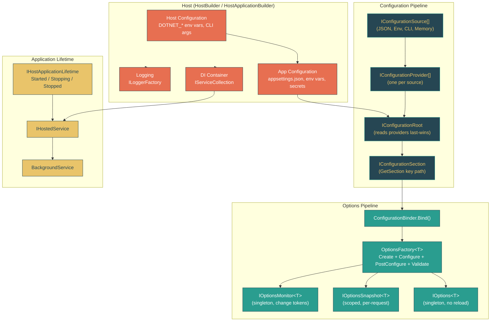

# Level 2: Practitioner -- Configuration, Options, and the Hosting Model

> **Target profile:** Developer who uses `Host.CreateDefaultBuilder` or `HostApplicationBuilder` but wants to understand how configuration sources merge, how options binding works, and how the host wires everything together
> **Estimated effort:** 4 hours
> **Prerequisites:** Module 2.4 (Dependency Injection), Level 1 (Foundations)
> [Version en espanol](../es/02-practitioner-hosting.md)

---

## Learning Objectives

After completing this module, you will be able to:

1. **Trace** the full configuration pipeline from JSON files and environment variables through providers to `IConfiguration`.
2. **Explain** the layered override model and predict which value wins when multiple sources provide the same key.
3. **Compare** `HostBuilder` and `HostApplicationBuilder` and choose the right one for your scenario.
4. **Distinguish** between `IOptions<T>`, `IOptionsSnapshot<T>`, and `IOptionsMonitor<T>` and select the correct one based on reload requirements.
5. **Describe** how `OptionsFactory<T>` creates, configures, post-configures, and validates option instances.
6. **Map** the default logging pipeline from host configuration through `ILoggerFactory` to `ILogger<T>`.
7. **Implement** `IHostedService` and `BackgroundService` and explain the graceful shutdown lifecycle.
8. **Navigate** the relevant source files in `dotnet/runtime` and read them with confidence.

---

## Concept Map



---

## Curriculum

### Lesson 2.10.1: The Configuration Pipeline -- Sources, Providers, and the Layered Override Model

**What you'll learn:** Configuration in .NET is not a single file reader -- it is a pipeline of sources that produce providers, which are queried in order, with the last one winning.

**The concept:**

Imagine a stack of transparent overlays, like overhead projector sheets. Each overlay represents a configuration source: one for `appsettings.json`, one for `appsettings.Development.json`, one for environment variables, one for command-line arguments. When you look down through the stack, the topmost non-transparent value is what you see. That is the **last-wins** override model.

The pipeline has three key abstractions:

| Abstraction | Role | Source file |
|---|---|---|
| `IConfigurationSource` | Describes *how* to create a provider (e.g., "read this JSON file") | Various per-provider packages |
| `IConfigurationProvider` | Actually reads and holds key-value pairs in a flat `Dictionary<string, string?>` | Each provider package (`JsonConfigurationProvider`, etc.) |
| `IConfigurationRoot` | Aggregates all providers, queries them in reverse order (last added wins) | `src/libraries/Microsoft.Extensions.Configuration/src/ConfigurationRoot.cs` |

The `IConfiguration` interface is the public contract for consuming configuration:

```
src/libraries/Microsoft.Extensions.Configuration.Abstractions/src/IConfiguration.cs
```

It exposes:
- `string? this[string key]` -- get/set a value by key
- `GetSection(string key)` -- navigate into a subsection (e.g., `"Logging:LogLevel:Default"`)
- `GetChildren()` -- enumerate immediate child sections
- `GetReloadToken()` -- observe when configuration is reloaded

**The build process (`ConfigurationBuilder`):**

`ConfigurationBuilder` is the simple, build-once version. It collects sources, then calls `Build()` to produce an `IConfigurationRoot`:

```csharp
// src/libraries/Microsoft.Extensions.Configuration/src/ConfigurationBuilder.cs
public IConfigurationRoot Build()
{
    var providers = new List<IConfigurationProvider>();
    foreach (IConfigurationSource source in _sources)
    {
        IConfigurationProvider provider = source.Build(this);
        providers.Add(provider);
    }
    return new ConfigurationRoot(providers);
}
```

Each `IConfigurationSource.Build()` call creates and loads a provider. The resulting `ConfigurationRoot` holds the ordered list and queries them last-to-first.

**The live version (`ConfigurationManager`):**

`HostApplicationBuilder` uses `ConfigurationManager` instead -- a class that is *simultaneously* an `IConfigurationBuilder` and an `IConfigurationRoot`. When you add a source, it immediately builds the provider and makes its values available:

```
src/libraries/Microsoft.Extensions.Configuration/src/ConfigurationManager.cs
```

This means you can read configuration values while still adding sources -- useful during host startup when environment detection depends on already-loaded configuration.

**Key hierarchy: colons as path separators**

Configuration keys use `:` as a path separator. A JSON file like:

```json
{
  "Logging": {
    "LogLevel": {
      "Default": "Information"
    }
  }
}
```

produces the flat key `Logging:LogLevel:Default` with value `"Information"`. Environment variables use `__` (double underscore) as a platform-safe separator, so `Logging__LogLevel__Default=Warning` overrides the same key.

**Source exploration exercise:**

1. Open `src/libraries/Microsoft.Extensions.Configuration/src/ConfigurationBuilder.cs` and read the `Build()` method. Note how it iterates sources and calls `source.Build(this)`.
2. Open `src/libraries/Microsoft.Extensions.Configuration/src/ConfigurationManager.cs` and observe how it implements *both* `IConfigurationBuilder` and `IConfigurationRoot`. Notice the `ReferenceCountedProviderManager` that enables thread-safe reads while sources are being modified.
3. Open `src/libraries/Microsoft.Extensions.Configuration.Abstractions/src/IConfiguration.cs` and read the four members. This is the contract your application code interacts with.

**Key takeaway:** Configuration is not "reading a file." It is an ordered pipeline of providers where later sources override earlier ones, and `ConfigurationManager` makes this pipeline live and mutable during startup.

---

### Lesson 2.10.2: HostBuilder and HostApplicationBuilder -- How the Host Wires DI, Config, and Logging Together

**What you'll learn:** The host is the orchestrator that assembles the configuration pipeline, the DI container, and the logging system into a coherent `IHost` that your application runs within.

**The concept:**

Think of the host as a general contractor building a house. The contractor does not lay bricks or wire outlets directly -- they coordinate specialists (configuration, DI, logging) in the right order and ensure the finished house has working plumbing before anyone moves in.

.NET provides two host builder APIs:

| API | Style | When to use |
|---|---|---|
| `HostBuilder` (callback-based) | Register lambdas that run later during `Build()` | Legacy code, complex multi-stage setup |
| `HostApplicationBuilder` (imperative) | Directly access `.Configuration`, `.Services`, `.Logging` properties | New code (.NET 7+), simpler and more discoverable |

**HostBuilder's deferred execution model:**

```
src/libraries/Microsoft.Extensions.Hosting/src/HostBuilder.cs
```

`HostBuilder` stores lists of callbacks:
- `_configureHostConfigActions` -- configure host-level configuration
- `_configureAppConfigActions` -- configure app-level configuration
- `_configureServicesActions` -- register services

When `Build()` is called, it executes them in a precise order:

```csharp
// HostBuilder.Build() sequence:
InitializeHostConfiguration();    // 1. Build host config (DOTNET_* vars, CLI args)
InitializeHostingEnvironment();   // 2. Determine environment from host config
InitializeHostBuilderContext();   // 3. Create context with environment + host config
InitializeAppConfiguration();     // 4. Build app config (appsettings, env vars, etc.)
InitializeServiceProvider();      // 5. Register all services, build DI container
```

This ordering matters: app configuration can reference the environment name (to load `appsettings.Development.json`), and services can reference the finished configuration.

**HostApplicationBuilder's immediate model:**

```
src/libraries/Microsoft.Extensions.Hosting/src/HostApplicationBuilder.cs
```

`HostApplicationBuilder` uses `ConfigurationManager`, so sources are live as soon as they are added. The constructor does most of the work:

1. Creates a `ConfigurationManager` instance
2. Adds `DOTNET_` environment variables
3. Calls `Initialize()` which sets up the hosting environment and populates base services
4. If defaults are not disabled, calls `ApplyDefaultAppConfiguration()` and `AddDefaultServices()`

**The default configuration source order (what `CreateDefaultBuilder` / defaults give you):**

```
src/libraries/Microsoft.Extensions.Hosting/src/HostingHostBuilderExtensions.cs
```

The `ApplyDefaultAppConfiguration` method adds sources in this order:

1. `appsettings.json` (optional, reload on change)
2. `appsettings.{Environment}.json` (optional, reload on change)
3. `{ApplicationName}.settings.json` (optional, reload on change)
4. `{ApplicationName}.settings.{Environment}.json` (optional, reload on change)
5. User Secrets (Development environment only)
6. Environment variables (all, no prefix filter)
7. Command-line arguments

Because later sources override earlier ones, command-line arguments beat environment variables, which beat user secrets, which beat JSON files. This is the **override pyramid** -- the most specific/dynamic source wins.

**What `AddDefaultServices` registers:**

The host also registers logging defaults:

```csharp
// From HostingHostBuilderExtensions.AddDefaultServices()
services.AddLogging(logging =>
{
    logging.AddConfiguration(hostingContext.Configuration.GetSection("Logging"));
    logging.AddConsole();
    logging.AddDebug();
    logging.AddEventSourceLogger();
});
```

And it registers `IHostApplicationLifetime`, `IHostEnvironment`, `IConfiguration` itself (as a singleton), `IOptions<HostOptions>`, and logging/metrics services.

**The DI container is built last, with validation in Development:**

```csharp
// From HostBuilder.PopulateServiceCollection()
services.AddOptions().Configure<HostOptions>(options =>
    { options.Initialize(hostBuilderContext.Configuration); });
services.AddLogging();
services.AddMetrics();
```

In Development mode, the host enables `ValidateScopes` and `ValidateOnBuild` on the `ServiceProviderOptions`, catching misconfigured DI registrations early.

**Source exploration exercise:**

1. Open `src/libraries/Microsoft.Extensions.Hosting/src/HostBuilder.cs` and read the `Build()` method (around line 152). Follow the five `Initialize*` calls.
2. Open `src/libraries/Microsoft.Extensions.Hosting/src/HostApplicationBuilder.cs` and read the constructor. Notice how `ConfigurationManager` is created at line 89 and sources are added immediately.
3. Open `src/libraries/Microsoft.Extensions.Hosting/src/HostingHostBuilderExtensions.cs` and find `ApplyDefaultAppConfiguration()`. This is where the JSON file order is defined.
4. In the same file, find `AddDefaultServices()` to see the default logging providers.

**Key takeaway:** The host is the assembly point. Whether you use `HostBuilder` (deferred) or `HostApplicationBuilder` (immediate), the end result is the same: a configured `IHost` with configuration, DI, logging, and lifetime management all wired together in the correct order.

---

### Lesson 2.10.3: IOptions\<T\>, IOptionsSnapshot\<T\>, IOptionsMonitor\<T\> -- Binding Configuration to Typed Objects

**What you'll learn:** The Options pattern bridges the gap between the flat key-value world of `IConfiguration` and the strongly typed world of your application's settings classes. The three interfaces serve different reload scenarios.

**The concept:**

Think of `IConfiguration` as a dictionary of strings. Your application should not sprinkle `config["SmtpServer:Host"]` everywhere -- that is fragile and hard to refactor. Instead, you define a POCO class:

```csharp
public class SmtpOptions
{
    public string Host { get; set; } = "localhost";
    public int Port { get; set; } = 25;
}
```

Then bind it:

```csharp
services.Configure<SmtpOptions>(configuration.GetSection("Smtp"));
```

This registers an `IConfigureOptions<SmtpOptions>` that calls `ConfigurationBinder.Bind()` on your section. When your service asks for `IOptions<SmtpOptions>`, the framework creates an instance, applies all `IConfigureOptions<T>`, then all `IPostConfigureOptions<T>`, then runs all `IValidateOptions<T>`.

**The three interfaces and when to use each:**

| Interface | DI Lifetime | Reload behavior | When to use |
|---|---|---|---|
| `IOptions<T>` | Singleton | Never reloads -- reads values once | Settings that never change at runtime |
| `IOptionsSnapshot<T>` | Scoped | Re-reads at each scope boundary (each HTTP request in ASP.NET Core) | Per-request settings that should reflect config changes |
| `IOptionsMonitor<T>` | Singleton | Actively monitors change tokens and fires callbacks | Long-lived services that need to react to config changes immediately |

**How `OptionsFactory<T>` builds an options instance:**

```
src/libraries/Microsoft.Extensions.Options/src/OptionsFactory.cs
```

The `Create(string name)` method follows a strict pipeline:

```csharp
public TOptions Create(string name)
{
    TOptions options = CreateInstance(name);         // 1. new T() via Activator
    foreach (var setup in _setups)                   // 2. Apply IConfigureOptions<T>
    {
        if (setup is IConfigureNamedOptions<T> namedSetup)
            namedSetup.Configure(name, options);
        else if (name == Options.DefaultName)
            setup.Configure(options);
    }
    foreach (var post in _postConfigures)            // 3. Apply IPostConfigureOptions<T>
        post.PostConfigure(name, options);

    // 4. Validate
    foreach (var validate in _validations)
    {
        ValidateOptionsResult result = validate.Validate(name, options);
        if (result.Failed)
            failures.AddRange(result.Failures);
    }
    if (failures.Count > 0)
        throw new OptionsValidationException(name, typeof(T), failures);

    return options;
}
```

The four stages are: **Create -> Configure -> PostConfigure -> Validate**.

**Named options:**

The `name` parameter enables multiple configurations of the same type. For example, you might have two HTTP clients with different retry settings. `IConfigureNamedOptions<T>` receives the name and can conditionally apply. `Options.DefaultName` is `string.Empty`.

**How `IOptionsMonitor<T>` detects changes:**

```
src/libraries/Microsoft.Extensions.Options/src/OptionsMonitor.cs
```

In its constructor, `OptionsMonitor<T>` iterates all `IOptionsChangeTokenSource<T>` and registers a callback on each change token:

```csharp
IDisposable registration = ChangeToken.OnChange(
    source.GetChangeToken,
    InvokeChanged,
    source.Name);
```

When a change token fires (e.g., the JSON file watcher detects a modification), `InvokeChanged` evicts the cached value and re-creates the options via the factory:

```csharp
private void InvokeChanged(string? name)
{
    name ??= Options.DefaultName;
    _cache.TryRemove(name);                    // evict stale value
    TOptions options = Get(name);              // re-create via factory
    _onChange?.Invoke(options, name);           // notify subscribers
}
```

**How `IOptions<T>` differs internally:**

`IOptions<T>` is backed by `UnnamedOptionsManager<T>`, which caches the value in a `volatile` field and never evicts it. Once created, it is frozen for the lifetime of the application. This is why `IOptions<T>` cannot reload.

`IOptionsSnapshot<T>` is backed by `OptionsManager<T>`, which uses a private `OptionsCache<T>`. Because `IOptionsSnapshot<T>` is registered as scoped, a new instance is created per scope, and the cache starts empty, so it re-reads from the factory (which re-reads from the current configuration).

**Source exploration exercise:**

1. Open `src/libraries/Microsoft.Extensions.Options/src/OptionsFactory.cs` and read the `Create()` method. Follow the four stages.
2. Open `src/libraries/Microsoft.Extensions.Options/src/OptionsMonitor.cs` and read the constructor. Understand how change token registration works.
3. Open `src/libraries/Microsoft.Extensions.Options/src/Options.cs` and note that `DefaultName` is `string.Empty`.
4. Open `src/libraries/Microsoft.Extensions.Options/src/UnnamedOptionsManager.cs` and compare it with `OptionsManager.cs` to understand the singleton vs. scoped caching difference.

**Key takeaway:** `IOptions<T>` is frozen, `IOptionsSnapshot<T>` refreshes per scope, and `IOptionsMonitor<T>` refreshes immediately on change. All three use the same `OptionsFactory<T>` pipeline: Create -> Configure -> PostConfigure -> Validate.

---

### Lesson 2.10.4: Configuration Providers -- JSON, Environment Variables, and Command Line

**What you'll learn:** Each configuration source has a specialized provider that reads data from a specific medium and flattens it into the key-value model. Understanding the providers helps you debug "where did this value come from?"

**The concept:**

**JSON Provider:**

```
src/libraries/Microsoft.Extensions.Configuration.Json/src/JsonConfigurationProvider.cs
```

`JsonConfigurationProvider` extends `FileConfigurationProvider`, which handles file watching and reload. The `Load(Stream)` method parses JSON and flattens the tree into colon-separated keys:

```csharp
public override void Load(Stream stream)
{
    Data = JsonConfigurationFileParser.Parse(stream);
}
```

`JsonConfigurationFileParser` walks the JSON tree and produces entries like:

| JSON path | Flat key |
|---|---|
| `{ "Logging": { "LogLevel": { "Default": "Information" } } }` | `Logging:LogLevel:Default` = `"Information"` |
| `{ "AllowedHosts": "*" }` | `AllowedHosts` = `"*"` |
| `{ "Kestrel": { "Endpoints": { "Https": { "Url": "https://+:5001" } } } }` | `Kestrel:Endpoints:Https:Url` = `"https://+:5001"` |

Arrays use numeric indices: `"Items": ["a", "b"]` becomes `Items:0` = `"a"`, `Items:1` = `"b"`.

File-based providers support `reloadOnChange: true`, which uses `IFileProvider` and `FileSystemWatcher` under the hood. When the file changes, the provider re-reads and fires a change token that propagates to `IOptionsMonitor<T>`.

**Environment Variables Provider:**

`EnvironmentVariablesConfigurationProvider` reads all environment variables (or a filtered prefix set). The key transformation:

- `__` (double underscore) is replaced with `:` to support hierarchical keys
- If a prefix is specified (like `DOTNET_`), only matching variables are included, and the prefix is stripped

So `DOTNET_ENVIRONMENT=Production` becomes key `ENVIRONMENT` with value `Production` in the host configuration.

For app configuration (no prefix), `Logging__LogLevel__Default=Warning` becomes `Logging:LogLevel:Default` = `Warning`.

**Command Line Provider:**

`CommandLineConfigurationProvider` parses `--key=value` or `--key value` pairs. Switch mappings allow short flags:

```csharp
var switchMappings = new Dictionary<string, string>
{
    { "-e", "Environment" },
    { "--env", "Environment" }
};
```

**The override pyramid visualized:**

```
Priority (highest wins)
    ^
    |  7. Command-line arguments          --Logging:LogLevel:Default=Error
    |  6. Environment variables           Logging__LogLevel__Default=Warning
    |  5. User Secrets (dev only)         (local dev overrides)
    |  4. {App}.settings.{env}.json       (app-specific per-environment)
    |  3. {App}.settings.json             (app-specific base)
    |  2. appsettings.{env}.json          appsettings.Development.json
    |  1. appsettings.json                (base defaults)
    +-------------------------------------------------->
```

**Debugging configuration:**

When a configuration value is not what you expect, think in terms of the override pyramid. The most common issue is an environment variable silently overriding a JSON value. You can enumerate all providers at runtime:

```csharp
if (config is IConfigurationRoot root)
{
    foreach (var provider in root.Providers)
    {
        if (provider.TryGet("Logging:LogLevel:Default", out string? value))
        {
            Console.WriteLine($"{provider}: {value}");
        }
    }
}
```

**Source exploration exercise:**

1. Open `src/libraries/Microsoft.Extensions.Configuration.Json/src/JsonConfigurationProvider.cs`. Read the entire file -- it is small. Follow `JsonConfigurationFileParser.Parse()` to understand the flattening.
2. Search for `EnvironmentVariablesConfigurationProvider` in `src/libraries/Microsoft.Extensions.Configuration.EnvironmentVariables/src/`. Read how it handles the `__` to `:` transformation.
3. Search for `CommandLineConfigurationProvider` in `src/libraries/Microsoft.Extensions.Configuration.CommandLine/src/`. Read how it parses `--key=value`.

**Key takeaway:** All providers flatten their data into the same `Dictionary<string, string?>` model. JSON nests become colon-separated keys, environment variables use `__` as a separator, and command-line arguments use `--key=value`. The last provider added to the builder wins when keys collide.

---

### Lesson 2.10.5: Logging Integration -- How ILoggerFactory and ILogger\<T\> Are Wired Through the Host

**What you'll learn:** The host wires logging so that `ILogger<T>` is injectable everywhere, logging configuration comes from the `"Logging"` section of `IConfiguration`, and multiple logging providers (console, debug, event source) work in parallel.

**The concept:**

Logging in .NET is a two-layer system:

1. **`ILoggerFactory`** -- a singleton that creates `ILogger` instances. It holds references to all registered `ILoggerProvider` objects (console, debug, event source, third-party).
2. **`ILogger<T>`** -- a lightweight wrapper that routes log calls through the factory to all providers.

When you inject `ILogger<MyService>`, the DI container calls `loggerFactory.CreateLogger("MyApp.MyService")` and returns a logger whose category name is the fully qualified type name.

**How the host wires it:**

In `HostingHostBuilderExtensions.AddDefaultServices()`:

```csharp
services.AddLogging(logging =>
{
    logging.AddConfiguration(hostingContext.Configuration.GetSection("Logging"));
    logging.AddConsole();
    logging.AddDebug();
    logging.AddEventSourceLogger();
});
```

`AddConfiguration()` binds the `"Logging"` section to `LoggerFilterOptions`, which controls minimum log levels per category. A typical configuration:

```json
{
  "Logging": {
    "LogLevel": {
      "Default": "Information",
      "Microsoft.AspNetCore": "Warning",
      "System.Net.Http": "Information"
    },
    "Console": {
      "LogLevel": {
        "Default": "Debug"
      }
    }
  }
}
```

The `LogLevel` at the root level sets defaults for all providers. Provider-specific sections (like `Console`) can override these for individual providers.

**Log filtering pipeline:**

When a log call is made, the filter evaluates:

1. Provider-specific rule (e.g., `Logging:Console:LogLevel:Microsoft` for the console provider and `Microsoft.*` categories)
2. Provider-specific default (e.g., `Logging:Console:LogLevel:Default`)
3. Global category rule (e.g., `Logging:LogLevel:Microsoft`)
4. Global default (e.g., `Logging:LogLevel:Default`)

The first matching rule wins.

**EventSource logging:**

`AddEventSourceLogger()` is the bridge to ETW (Event Tracing for Windows) and EventPipe (cross-platform). This enables `dotnet-trace`, `dotnet-counters`, and other diagnostic tools to capture structured log output from your application without any code changes.

**Source exploration exercise:**

1. In `src/libraries/Microsoft.Extensions.Hosting/src/HostingHostBuilderExtensions.cs`, find `AddDefaultServices()` and read the logging setup block.
2. In `src/libraries/Microsoft.Extensions.Logging/src/`, explore `LoggerFactory.cs` to see how it creates loggers and distributes log calls to providers.
3. Search for `LoggerFilterOptions` to understand how the filtering rules are built from configuration.

**Key takeaway:** The host sets up logging with a configuration-driven filter pipeline and multiple providers. `ILogger<T>` is the injection point, `ILoggerFactory` is the singleton coordinator, and the `"Logging"` section of configuration controls what gets logged where.

---

### Lesson 2.10.6: Hosted Services and Application Lifetime -- IHostedService, BackgroundService, and Graceful Shutdown

**What you'll learn:** The host manages long-running services through `IHostedService` and provides a structured lifecycle with graceful shutdown support.

**The concept:**

An `IHostedService` is any service managed by the host with two lifecycle methods:

```
src/libraries/Microsoft.Extensions.Hosting.Abstractions/src/IHostedService.cs
```

```csharp
public interface IHostedService
{
    Task StartAsync(CancellationToken cancellationToken);
    Task StopAsync(CancellationToken cancellationToken);
}
```

The host starts all registered `IHostedService` instances in registration order during startup and stops them in reverse order during shutdown.

**BackgroundService -- the convenient base class:**

```
src/libraries/Microsoft.Extensions.Hosting.Abstractions/src/BackgroundService.cs
```

`BackgroundService` implements `IHostedService` and provides a simpler model: override `ExecuteAsync(CancellationToken stoppingToken)` with your long-running logic.

The key implementation detail in `StartAsync`:

```csharp
public virtual Task StartAsync(CancellationToken cancellationToken)
{
    _stoppingCts = CancellationTokenSource.CreateLinkedTokenSource(cancellationToken);
    _executeTask = Task.Run(() => ExecuteAsync(_stoppingCts.Token), _stoppingCts.Token);
    return Task.CompletedTask;  // returns immediately -- does not block startup
}
```

Notice: `StartAsync` returns `Task.CompletedTask` immediately. The background work runs on a thread pool thread via `Task.Run()`. This means the host does not wait for your background work to complete before starting the next hosted service.

During shutdown:

```csharp
public virtual async Task StopAsync(CancellationToken cancellationToken)
{
    if (_executeTask == null) return;
    _stoppingCts!.Cancel();     // signal cancellation
    await _executeTask.WaitAsync(cancellationToken).ConfigureAwait(...);
}
```

The host cancels the `stoppingToken`, then waits for `ExecuteAsync` to finish (up to the shutdown timeout).

**IHostApplicationLifetime -- the lifecycle coordinator:**

```
src/libraries/Microsoft.Extensions.Hosting.Abstractions/src/IHostApplicationLifetime.cs
```

This interface exposes three `CancellationToken` properties:

| Token | When it fires |
|---|---|
| `ApplicationStarted` | All `IHostedService.StartAsync` calls have completed |
| `ApplicationStopping` | Shutdown has been requested (Ctrl+C, SIGTERM, or `StopApplication()`) but services are still running |
| `ApplicationStopped` | All `IHostedService.StopAsync` calls have completed |

You can register callbacks on these tokens for cleanup or coordination:

```csharp
lifetime.ApplicationStopping.Register(() =>
{
    // Drain message queue, close connections, etc.
});
```

**The full lifecycle sequence:**

```
1. Host.StartAsync()
   a. For each IHostedService (in registration order):
      - Call StartAsync(cancellationToken)
   b. Fire ApplicationStarted token

2. Host runs (waiting for shutdown signal)

3. Shutdown signal received (Ctrl+C, SIGTERM, StopApplication())
   a. Fire ApplicationStopping token
   b. For each IHostedService (in reverse registration order):
      - Call StopAsync(cancellationToken)
   c. Fire ApplicationStopped token
   d. Dispose IServiceProvider (disposes all IDisposable singletons)
```

**HostOptions controls timeout:**

The host has a configurable `ShutdownTimeout` (default: 30 seconds on .NET 8+, 5 seconds on earlier versions). If services do not stop within this window, the host proceeds anyway. This is configured through the options pattern:

```csharp
services.Configure<HostOptions>(options =>
{
    options.ShutdownTimeout = TimeSpan.FromSeconds(60);
});
```

**Common patterns:**

1. **Queue processor:** `BackgroundService` that dequeues items from a `Channel<T>` and processes them. On shutdown, drain the channel.
2. **Health check poller:** `BackgroundService` with a periodic `Task.Delay` loop that checks external dependencies.
3. **Startup initializer:** `IHostedService` where `StartAsync` does one-time initialization (database migration, cache warming) before the application accepts requests.

**Source exploration exercise:**

1. Read `src/libraries/Microsoft.Extensions.Hosting.Abstractions/src/BackgroundService.cs` in full. Note the `Task.Run` in `StartAsync` and the cancellation flow in `StopAsync`.
2. Read `src/libraries/Microsoft.Extensions.Hosting.Abstractions/src/IHostApplicationLifetime.cs`. Note the three tokens.
3. In `src/libraries/Microsoft.Extensions.Hosting/src/Internal/Host.cs`, search for `StartAsync` and `StopAsync` to see how the host iterates hosted services.

**Key takeaway:** `IHostedService` provides the lifecycle contract, `BackgroundService` simplifies long-running work, and `IHostApplicationLifetime` gives you hooks into the startup/shutdown sequence. The host manages all of this with configurable timeouts and reverse-order shutdown.

---

## Hands-On Exercises

### Exercise 1: Trace a Configuration Value

**Goal:** Given a configuration key like `Logging:LogLevel:Default`, trace where the value comes from through the provider stack.

1. Create a console application with `Host.CreateDefaultBuilder(args)`.
2. Add `appsettings.json` with `"Logging": { "LogLevel": { "Default": "Information" } }`.
3. Set environment variable `Logging__LogLevel__Default=Warning`.
4. Run with `--Logging:LogLevel:Default=Error` on the command line.
5. In your `IHostedService`, resolve `IConfiguration` and print the value. Then cast to `IConfigurationRoot` and enumerate providers to see which one provides the winning value.

**Expected result:** The command-line value (`Error`) wins because it is added last.

### Exercise 2: Compare IOptions, IOptionsSnapshot, and IOptionsMonitor

**Goal:** Observe the reload behavior difference between the three options interfaces.

1. Create an ASP.NET Core application with a `FeatureOptions` class bound to the `"Features"` section.
2. Register it with `services.Configure<FeatureOptions>(config.GetSection("Features"))`.
3. Create three endpoints, each injecting a different interface (`IOptions<FeatureOptions>`, `IOptionsSnapshot<FeatureOptions>`, `IOptionsMonitor<FeatureOptions>`).
4. While the app is running, modify `appsettings.json` and call each endpoint.
5. Observe: `IOptions` returns the old value, `IOptionsSnapshot` returns the new value on the next request, and `IOptionsMonitor` returns the new value immediately.

### Exercise 3: Build a BackgroundService with Graceful Shutdown

**Goal:** Implement a background service that processes items and shuts down cleanly.

1. Create a `BackgroundService` that loops, processing mock items with a `Task.Delay`.
2. Respect the `stoppingToken` -- exit the loop when cancellation is requested.
3. Register an `ApplicationStopping` callback via `IHostApplicationLifetime` that logs "Shutdown initiated."
4. Run the app and press Ctrl+C. Observe the shutdown sequence in the logs.

### Exercise 4: Source Code Walkthrough

**Goal:** Build your mental model by reading the actual implementation.

1. Open `HostBuilder.Build()` and draw the five initialization steps as a sequence diagram.
2. Open `OptionsFactory<T>.Create()` and annotate each stage (Create, Configure, PostConfigure, Validate).
3. Open `OptionsMonitor<T>` constructor and trace how `ChangeToken.OnChange` connects file watchers to cache eviction.

---

## Key Source Files Reference

| File | What to look for |
|---|---|
| `src/libraries/Microsoft.Extensions.Configuration/src/ConfigurationBuilder.cs` | `Build()` -- sources to providers to root |
| `src/libraries/Microsoft.Extensions.Configuration/src/ConfigurationManager.cs` | Dual `IConfigurationBuilder` + `IConfigurationRoot` implementation |
| `src/libraries/Microsoft.Extensions.Configuration/src/ConfigurationRoot.cs` | Last-wins provider query logic |
| `src/libraries/Microsoft.Extensions.Configuration.Abstractions/src/IConfiguration.cs` | The four-member contract |
| `src/libraries/Microsoft.Extensions.Configuration.Json/src/JsonConfigurationProvider.cs` | JSON loading and flattening |
| `src/libraries/Microsoft.Extensions.Hosting/src/HostBuilder.cs` | `Build()` sequence, `PopulateServiceCollection` |
| `src/libraries/Microsoft.Extensions.Hosting/src/HostApplicationBuilder.cs` | Immediate configuration model |
| `src/libraries/Microsoft.Extensions.Hosting/src/HostingHostBuilderExtensions.cs` | Default source order, default services |
| `src/libraries/Microsoft.Extensions.Options/src/OptionsFactory.cs` | Create -> Configure -> PostConfigure -> Validate pipeline |
| `src/libraries/Microsoft.Extensions.Options/src/OptionsMonitor.cs` | Change token subscription and cache eviction |
| `src/libraries/Microsoft.Extensions.Options/src/UnnamedOptionsManager.cs` | Singleton `IOptions<T>` implementation |
| `src/libraries/Microsoft.Extensions.Options/src/OptionsManager.cs` | Scoped `IOptionsSnapshot<T>` implementation |
| `src/libraries/Microsoft.Extensions.Hosting.Abstractions/src/IHostedService.cs` | Two-method lifecycle contract |
| `src/libraries/Microsoft.Extensions.Hosting.Abstractions/src/BackgroundService.cs` | `Task.Run` in `StartAsync`, cancellation in `StopAsync` |
| `src/libraries/Microsoft.Extensions.Hosting.Abstractions/src/IHostApplicationLifetime.cs` | Started/Stopping/Stopped tokens |

---

## Self-Assessment Checklist

- [ ] I can draw the configuration pipeline from sources through providers to `IConfigurationRoot`.
- [ ] I can predict which configuration value wins when the same key exists in `appsettings.json`, an environment variable, and a command-line argument.
- [ ] I can explain the difference between `HostBuilder` (deferred) and `HostApplicationBuilder` (immediate).
- [ ] I know the default source order added by `CreateDefaultBuilder` / `HostApplicationBuilder` defaults.
- [ ] I can choose between `IOptions<T>`, `IOptionsSnapshot<T>`, and `IOptionsMonitor<T>` based on reload requirements.
- [ ] I can describe the four stages of `OptionsFactory<T>.Create()`.
- [ ] I understand how `OptionsMonitor<T>` uses change tokens to detect configuration changes.
- [ ] I can explain how logging configuration in the `"Logging"` section maps to filter rules.
- [ ] I can implement `BackgroundService` and handle graceful shutdown correctly.
- [ ] I know the order of `IHostApplicationLifetime` tokens during startup and shutdown.

---

## What's Next

With the hosting model understood, you are ready to explore:
- **Module 2.11:** HTTP Pipeline and Middleware (how ASP.NET Core builds on the host)
- **Module 2.12:** Advanced DI Patterns (keyed services, decorator pattern, factory registrations)
- **Module 3.x:** Contributor-level deep dives into the configuration and options source code
