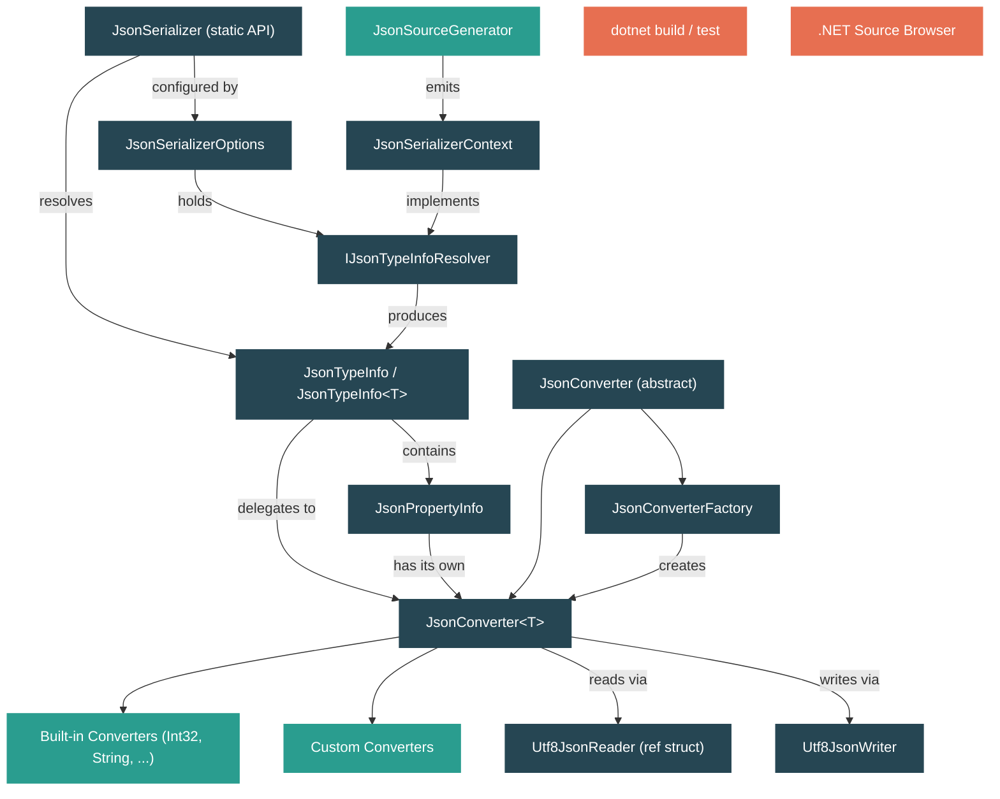

# Level 2: Practitioner — Serialization: System.Text.Json Internals

> **Target profile:** Developer who uses `JsonSerializer.Serialize`/`Deserialize` but doesn't understand the converter pipeline, type metadata system, or source generators
> **Estimated effort:** 4 hours
> **Prerequisites:** [Level 1](01-foundations-ecosystem-overview.md), [Module 2.1](02-practitioner-json.md)
> [Version en espanol](../es/02-practitioner-json.md)

---

## Learning Objectives

By the end of this module you will be able to:

1. **Use `Utf8JsonReader` and `Utf8JsonWriter` directly** and explain why the library is designed around UTF-8 bytes rather than `string`.
2. **Trace a `JsonSerializer.Deserialize<T>` call** from the public API through `JsonTypeInfo`, the converter pipeline, and down to `Utf8JsonReader`.
3. **Explain the `JsonConverter<T>` contract** including the `Read`/`Write` methods, the `TryRead`/`TryWrite` continuation model, and the `JsonConverterFactory` pattern.
4. **Describe how `JsonTypeInfo` works** as the metadata hub that binds a .NET type to its properties, constructor, and converter.
5. **Implement a custom `JsonConverter<T>`** for a type that the built-in converters do not handle.
6. **Explain what the source generator (`JsonSourceGenerator`) produces** and why it eliminates reflection and enables trimming/AOT.
7. **Apply performance best practices** such as reusing `JsonSerializerOptions`, using UTF-8 byte overloads, and streaming large payloads.

---

## Concept Map



---

## Curriculum

### Lesson 1 -- Utf8JsonReader and Utf8JsonWriter: The Low-Level Foundation

#### What you'll learn
How the two low-level types process JSON as raw UTF-8 bytes, why this design avoids transcoding overhead, and how every higher-level API in the library ultimately delegates to them.

#### The concept

System.Text.Json is built on a fundamental design decision: **JSON is processed as UTF-8 bytes, not as `string` (UTF-16)**. This matters because JSON on the wire -- in HTTP responses, files, and message queues -- is almost always UTF-8. By operating directly on `byte[]` / `ReadOnlySpan<byte>`, the library avoids a full UTF-16 transcoding pass that `Newtonsoft.Json` (and older .NET JSON APIs) had to perform.

**`Utf8JsonReader`** is a `ref struct` that provides forward-only, read-only access to UTF-8 encoded JSON. Key characteristics from the source:

- It holds a `ReadOnlySpan<byte> _buffer` for single-segment input or a `ReadOnlySequence<byte> _sequence` for multi-segment (pipelined) input.
- It tracks `_lineNumber`, `_bytePositionInLine`, `_consumed`, and a `BitStack _bitStack` for nesting depth validation.
- Being a `ref struct`, it cannot be boxed or stored on the heap -- this means zero allocations for the reader itself.
- It supports reentrancy for incomplete data: you can read partial JSON, save the `JsonReaderState`, get more bytes, and resume.

**`Utf8JsonWriter`** is a `sealed class` (not a `ref struct`) that writes UTF-8 JSON to an `IBufferWriter<byte>` or `Stream`. Key characteristics:

- It maintains `BytesPending` (written but not flushed) and `BytesCommitted` (flushed to the output).
- It tracks a `_currentDepth` with a bit-flag trick: the highest-order bit indicates whether a list separator is needed before the next value.
- It defaults to RFC 8259-compliant output and throws `InvalidOperationException` if you attempt to write structurally invalid JSON (unless validation is disabled via `JsonWriterOptions`).

When you call `JsonSerializer.Serialize<T>(value)` with a `string` return type, the internal `WriteString` method does this:

1. Rents a `Utf8JsonWriter` and a `PooledByteBufferWriter` from an internal cache (`Utf8JsonWriterCache`).
2. Calls `jsonTypeInfo.Serialize(writer, value)` -- which delegates to the converter pipeline.
3. Transcodes the resulting UTF-8 bytes back to a `string` via `JsonReaderHelper.TranscodeHelper`.

This is why the XML docs repeatedly warn: *"Using a `string` is not as efficient as using UTF-8 methods since the implementation internally uses UTF-8."*

#### In the source code

| File | What to look at |
|---|---|
| `src/libraries/System.Text.Json/src/System/Text/Json/Reader/Utf8JsonReader.cs` | The `ref partial struct` declaration, `_buffer`, `_sequence`, `BytesConsumed`, `TokenStartIndex` |
| `src/libraries/System.Text.Json/src/System/Text/Json/Writer/Utf8JsonWriter.cs` | The `sealed partial class`, `_output` (IBufferWriter), `_stream`, `BytesPending`, `BytesCommitted`, `_currentDepth` |
| `src/libraries/System.Text.Json/src/System/Text/Json/Serialization/JsonSerializer.Write.String.cs` | `WriteString<TValue>` -- rents writer, calls `jsonTypeInfo.Serialize`, transcodes to string |
| `src/libraries/System.Text.Json/src/System/Text/Json/Serialization/JsonSerializer.Read.String.cs` | `ReadFromSpan<TValue>(ReadOnlySpan<char>, ...)` -- transcodes UTF-16 to UTF-8, then delegates to the byte-based path |

#### Hands-on exercise

1. Create a console application and write a simple benchmark that serializes a `Person` object 10,000 times using both `JsonSerializer.Serialize<Person>(person)` (returns `string`) and `JsonSerializer.SerializeToUtf8Bytes<Person>(person)` (returns `byte[]`). Compare the timings with `Stopwatch`. You should see the UTF-8 path is faster because it skips the final transcoding step.

2. Write a small program that uses `Utf8JsonWriter` directly to produce this JSON:
   ```json
   {"name":"Ada","scores":[100,98,95]}
   ```
   Use `writer.WriteStartObject()`, `writer.WriteString(...)`, `writer.WriteStartArray(...)`, `writer.WriteNumberValue(...)`, etc. Then read it back with `Utf8JsonReader`, advancing token by token with `reader.Read()` and printing each `reader.TokenType`.

3. **Question to answer:** In `Utf8JsonWriter`, what does the highest-order bit of `_currentDepth` represent? (Hint: look at the comment on line ~75 of `Utf8JsonWriter.cs`.)

#### Key takeaway
Every JSON operation in System.Text.Json ultimately flows through `Utf8JsonReader` (for deserialization) and `Utf8JsonWriter` (for serialization). String-based APIs are convenience wrappers that transcode to/from UTF-8 internally. When performance matters, use the `ReadOnlySpan<byte>` / `byte[]` overloads directly.

---

### Lesson 2 -- JsonSerializer: The High-Level API

#### What you'll learn
How the public `JsonSerializer.Serialize` and `Deserialize` methods orchestrate the full serialization pipeline by resolving `JsonTypeInfo`, configuring the reader/writer, and delegating to converters.

#### The concept

`JsonSerializer` is a `static partial class` split across many files, one per input/output type: `JsonSerializer.Read.String.cs`, `JsonSerializer.Read.Span.cs`, `JsonSerializer.Read.Stream.cs`, `JsonSerializer.Write.String.cs`, etc. Despite the many overloads, the pattern is always the same:

**Deserialization (Read) pipeline:**

1. **Resolve `JsonTypeInfo<TValue>`**: The overload calls `GetTypeInfo<TValue>(options)` which asks the `JsonSerializerOptions.TypeInfoResolver` to produce a `JsonTypeInfo` for the target type. This is where reflection-based discovery or source-generated metadata is plugged in.
2. **Transcode if needed**: If the input is `string` or `ReadOnlySpan<char>`, the `ReadFromSpan` method transcodes to UTF-8 bytes. For small payloads it uses `stackalloc`; for medium ones, `ArrayPool<byte>.Shared.Rent`; for large ones, a direct allocation. The thresholds are defined in `JsonConstants.StackallocByteThreshold` and `JsonConstants.ArrayPoolMaxSizeBeforeUsingNormalAlloc`.
3. **Create `Utf8JsonReader` and `ReadStack`**: A `JsonReaderState` is built from the options' reader settings. A `ReadStack` is initialized from the `JsonTypeInfo` -- this stack tracks nested objects during deserialization.
4. **Delegate to `JsonTypeInfo.Deserialize`**: This method in turn calls the root converter's `TryRead`, which processes JSON tokens and populates the object graph.

**Serialization (Write) pipeline:**

1. **Resolve `JsonTypeInfo<TValue>`**: Same as above.
2. **Rent a writer**: `Utf8JsonWriterCache.RentWriterAndBuffer` provides a pooled `Utf8JsonWriter` and `PooledByteBufferWriter`.
3. **Delegate to `JsonTypeInfo.Serialize`**: Calls the root converter's `TryWrite`, which produces JSON tokens via `Utf8JsonWriter`.
4. **Produce output**: For `string` overloads, transcode from the writer's UTF-8 buffer. For `byte[]` overloads, copy directly. For `Stream`/`PipeWriter` overloads, flush incrementally.

The three-argument overloads that accept `JsonSerializerContext` skip reflection entirely: they call `GetTypeInfo(context, returnType)` which resolves metadata from the pre-generated context.

#### In the source code

| File | What to look at |
|---|---|
| `src/libraries/System.Text.Json/src/System/Text/Json/Serialization/JsonSerializer.Read.String.cs` | `Deserialize<TValue>(string, options)` -- calls `GetTypeInfo<TValue>`, then `ReadFromSpan` |
| `src/libraries/System.Text.Json/src/System/Text/Json/Serialization/JsonSerializer.Read.Span.cs` | `ReadFromSpan<TValue>(ReadOnlySpan<byte>, ...)` -- creates `Utf8JsonReader`, initializes `ReadStack`, calls `jsonTypeInfo.Deserialize` |
| `src/libraries/System.Text.Json/src/System/Text/Json/Serialization/JsonSerializer.Write.String.cs` | `Serialize<TValue>(value, options)` -- calls `GetTypeInfo<TValue>`, then `WriteString` which rents writer and calls `jsonTypeInfo.Serialize` |
| `src/libraries/System.Text.Json/src/System/Text/Json/Serialization/JsonSerializer.Read.Stream.cs` | Async stream deserialization -- uses continuation-based reading |

#### Hands-on exercise

1. Open `JsonSerializer.Read.String.cs` in the .NET Source Browser. Trace the call from `Deserialize<TValue>(string json, JsonSerializerOptions? options)`:
   - What method is called immediately? (`GetTypeInfo<TValue>`)
   - What does `ReadFromSpan` do with the transcoded bytes?
   - Find the line where `Utf8JsonReader` is constructed -- what is `isFinalBlock` set to and why?

2. Create a small program that deserializes the same JSON string 1000 times. First pass `null` for options (a new default is created internally each time). Then create a single `JsonSerializerOptions` instance and reuse it. Measure the difference. The first approach is slower because `JsonSerializerOptions` must be configured and its resolver cache populated each time.

3. **Question to answer:** In `ReadFromSpan<TValue>(ReadOnlySpan<char>, ...)`, under what condition does the method use `stackalloc` vs `ArrayPool` vs a normal allocation? (Look at the three-way conditional expression.)

#### Key takeaway
`JsonSerializer` is an orchestrator, not a serializer. It resolves metadata (`JsonTypeInfo`), manages memory (pooling writers and transcoding buffers), and delegates the actual read/write work to the converter pipeline. Understanding this separation is the key to customizing behavior at the right layer.

---

### Lesson 3 -- The Converter Pipeline

#### What you'll learn
How `JsonConverter<T>` is the fundamental unit of serialization logic, how the `Read`/`Write` contract works, what `JsonConverterFactory` does, and how to write your own converter.

#### The concept

The converter hierarchy has three levels:

1. **`JsonConverter`** (abstract base): Defines the internal protocol -- `ConverterStrategy`, `TryReadAsObject`, `TryWriteAsObject`, etc. It cannot be directly subclassed by user code because its constructor is `internal`.

2. **`JsonConverter<T>`** (abstract generic): The public extension point. You subclass this and implement:
   - `T? Read(ref Utf8JsonReader reader, Type typeToConvert, JsonSerializerOptions options)` -- consume JSON tokens and return a `T`.
   - `void Write(Utf8JsonWriter writer, T value, JsonSerializerOptions options)` -- produce JSON tokens from a `T`.

3. **`JsonConverterFactory`** (abstract): A pattern for creating converters for open generic types. For example, `NullableConverterFactory` handles `Nullable<T>` for any `T`, and `EnumConverterFactory` handles any `enum`. A factory overrides `CanConvert(Type)` and `CreateConverter(Type, JsonSerializerOptions)`.

**How a converter is invoked during deserialization:**

The internal method `JsonConverter<T>.TryRead` (in `JsonConverterOfT.cs`) is the entry point. It:

1. Checks for `JsonTokenType.Null` -- if the token is null and the converter doesn't handle null, it returns `default(T)` (or throws for non-nullable value types).
2. If `ConverterStrategy == ConverterStrategy.Value` (simple values like `int`, `string`, `bool`), it calls `Read(ref reader, typeToConvert, options)` directly.
3. For internal converters, it skips validation for performance. For external (user) converters, it records the token type, depth, and bytes consumed before calling `Read`, then calls `VerifyRead` afterward to detect converters that leave the reader in an invalid state.
4. For object/collection converters (`ConverterStrategy.Object`), it calls `OnTryRead` which supports continuation -- the method can return `false` to indicate it needs more data (used during async stream deserialization).

**Built-in converters** live under `Serialization/Converters/Value/`. Each is minimal. For example, `Int32Converter`:

```csharp
public override int Read(ref Utf8JsonReader reader, Type typeToConvert, JsonSerializerOptions options)
{
    return reader.GetInt32();
}

public override void Write(Utf8JsonWriter writer, int value, JsonSerializerOptions options)
{
    writer.WriteNumberValue((long)value);
}
```

The converter simply calls one method on the reader or writer. The `ObjectDefaultConverter<T>` is far more complex: it reads `StartObject`, iterates property names, looks up each property in the `JsonTypeInfo`, and recursively calls the property's converter.

#### In the source code

| File | What to look at |
|---|---|
| `src/libraries/System.Text.Json/src/System/Text/Json/Serialization/JsonConverter.cs` | Abstract base: `ConverterStrategy`, `CanUseDirectReadOrWrite`, `RequiresReadAhead`, `ShouldFlush` |
| `src/libraries/System.Text.Json/src/System/Text/Json/Serialization/JsonConverterOfT.cs` | `JsonConverter<T>`: `Read`/`Write` abstract methods, `TryRead` (line ~148), `OnTryRead`/`OnTryWrite` |
| `src/libraries/System.Text.Json/src/System/Text/Json/Serialization/JsonConverterFactory.cs` | Factory pattern: `CreateConverter`, `GetConverterInternal` |
| `src/libraries/System.Text.Json/src/System/Text/Json/Serialization/Converters/Value/Int32Converter.cs` | Minimal value converter example |
| `src/libraries/System.Text.Json/src/System/Text/Json/Serialization/Converters/Object/ObjectDefaultConverter.cs` | Complex object converter: `OnTryRead` with fast path and continuation support |

#### Hands-on exercise

1. Write a custom `JsonConverter<DateOnly>` that serializes `DateOnly` as `"YYYY-MM-DD"` (ISO 8601 date without time). Override `Read` to parse the string with `DateOnly.ParseExact` and `Write` to call `writer.WriteStringValue(value.ToString("yyyy-MM-dd"))`. Register it via `JsonSerializerOptions.Converters.Add(new DateOnlyIsoConverter())` and verify round-trip.

2. Write a `JsonConverterFactory` that handles any `enum` type by serializing it as a lowercase string. Override `CanConvert` to check `typeToConvert.IsEnum`, and `CreateConverter` to construct a generic `LowercaseEnumConverter<T>` via reflection (using `Activator.CreateInstance`).

3. Open `ObjectDefaultConverter.cs` and read the `OnTryRead` method. Identify:
   - Where does it call `jsonTypeInfo.CreateObject()` to instantiate the target type?
   - Where does it call `PopulatePropertiesFastPath` vs the slower continuation-based path?
   - What condition distinguishes the two paths?

4. **Question to answer:** In `JsonConverterFactory`, every `Read`/`Write`/`TryRead`/`TryWrite` override calls `Debug.Fail("We should never get here.")`. Why? (Hint: the factory is always resolved to a concrete `JsonConverter<T>` before serialization begins.)

#### Key takeaway
The converter is where bytes become objects and objects become bytes. `JsonConverter<T>` is a clean two-method contract for value types, but `ObjectDefaultConverter<T>` reveals the complexity beneath object deserialization -- property lookup, constructor parameters, continuation for async streams, and metadata support. `JsonConverterFactory` is the mechanism for handling open generics like `List<T>` and `Nullable<T>`.

---

### Lesson 4 -- JsonTypeInfo and Metadata: How the Serializer Knows Your Types

#### What you'll learn
How `JsonTypeInfo` serves as the central metadata descriptor for a type during serialization, what `JsonPropertyInfo` represents, and how the `IJsonTypeInfoResolver` abstraction lets you swap between reflection and source generation.

#### The concept

When the serializer encounters a type for the first time, it needs to answer several questions: What properties does this type have? What are their names in JSON? What converter handles each property? Does the type have a parameterized constructor? Are there required properties?

All these answers are encapsulated in **`JsonTypeInfo`** (and its generic form `JsonTypeInfo<T>`). This class is the contract between the serializer and the metadata provider.

**Key members of `JsonTypeInfo`:**

- `Type` -- the .NET `System.Type` this metadata describes.
- `Converter` -- the `JsonConverter` that will handle this type's read/write.
- `Kind` -- a `JsonTypeInfoKind` enum: `None` (primitive/value), `Object`, `Enumerable`, or `Dictionary`.
- `CreateObject` -- a `Func<object>` delegate that constructs a new instance for deserialization. For reflection-based metadata, this wraps a call to the default constructor. For source-generated metadata, this is a direct `new T()` call.
- `Properties` -- a collection of `JsonPropertyInfo` objects, one per serializable property/field.
- `OnSerializing` / `OnSerialized` / `OnDeserializing` / `OnDeserialized` -- lifecycle callbacks.
- `ElementType` / `KeyType` -- for collections and dictionaries.

**`JsonPropertyInfo`** describes a single property:

- The JSON property name (pre-encoded as `JsonEncodedText` for fast comparison).
- The `JsonConverter` for that property's type.
- Getter/setter delegates.
- Ignore conditions, required status, ordering.

**`IJsonTypeInfoResolver`** is the pluggable interface that produces `JsonTypeInfo` instances:

- **`DefaultJsonTypeInfoResolver`** uses reflection at runtime to discover properties, constructors, and attributes.
- **`JsonSerializerContext`** (source-generated) implements `IJsonTypeInfoResolver` and returns pre-built `JsonTypeInfo` instances with no reflection.

The resolution pipeline:

1. `JsonSerializer.Deserialize<T>(json, options)` calls `GetTypeInfo<T>(options)`.
2. This asks `options.TypeInfoResolver.GetTypeInfo(typeof(T), options)`.
3. The resolver returns a `JsonTypeInfo<T>` (creating it if needed, then caching it).
4. `EnsureConfigured()` is called to finalize the metadata (resolve converters, build property caches, freeze the instance so it cannot be modified).

#### In the source code

| File | What to look at |
|---|---|
| `src/libraries/System.Text.Json/src/System/Text/Json/Serialization/Metadata/JsonTypeInfo.cs` | Constructor (line ~44): takes `type`, `converter`, `options`. `Kind`, `CreateObject`, `ElementType`, `KeyType` |
| `src/libraries/System.Text.Json/src/System/Text/Json/Serialization/Metadata/JsonPropertyInfo.cs` | Property metadata: name, converter, getter/setter |
| `src/libraries/System.Text.Json/src/System/Text/Json/Serialization/JsonSerializerContext.cs` | `GetTypeInfo(Type)` abstract method, `Options` property, `IsCompatibleWithOptions` |
| `src/libraries/System.Text.Json/src/System/Text/Json/Serialization/Metadata/DefaultJsonTypeInfoResolver.cs` | Reflection-based resolver |

#### Hands-on exercise

1. Write a program that manually constructs a `JsonTypeInfo<T>` using the `JsonTypeInfo.CreateJsonTypeInfo<T>` factory method. Add properties manually with `jsonTypeInfo.CreateJsonPropertyInfo(typeof(string), "name")`. Use this custom type info to serialize an object. This exercise reveals that `JsonTypeInfo` is not magical -- it is data you can construct yourself.

2. In a program that uses `JsonSerializer.Deserialize<T>`, add a `JsonSerializerOptions` with a custom `IJsonTypeInfoResolver` that wraps `DefaultJsonTypeInfoResolver` but adds logging. For each type resolved, print the type name, the `Kind`, and the number of properties. This shows you exactly what the serializer discovers.

3. Open `JsonTypeInfo.cs` and locate the constructor. Note how `Kind` is determined by `GetTypeInfoKind(type, converter)` -- it maps the converter's strategy to a `JsonTypeInfoKind`. **Question to answer:** What `Kind` does `int` get? What about `List<string>`? What about a custom POCO?

#### Key takeaway
`JsonTypeInfo` is the bridge between your .NET types and the serializer's understanding of them. Every property name, every converter binding, every constructor strategy lives here. The `IJsonTypeInfoResolver` abstraction is what makes it possible to swap between reflection (convenient, but slow startup and incompatible with trimming) and source generation (fast, trim-safe, but requires compile-time setup).

---

### Lesson 5 -- Source Generators: Compile-Time Serialization

#### What you'll learn
How the `JsonSourceGenerator` analyzes your types at compile time to emit `JsonSerializerContext` subclasses, why this eliminates reflection and enables AOT/trimming, and what the generated code actually looks like.

#### The concept

The reflection-based path (`DefaultJsonTypeInfoResolver`) has two fundamental problems:

1. **Startup cost**: The first time you serialize a type, the resolver must use reflection to discover properties, constructors, attributes, and build the metadata graph. For complex type hierarchies, this can take tens of milliseconds.
2. **Trimming/AOT incompatibility**: The IL trimmer cannot statically determine which types and members will be accessed via reflection, so it either preserves everything (bloating the binary) or trims too aggressively (causing runtime failures). Native AOT compilation faces the same issue.

The **source generator** (`JsonSourceGenerator`) solves both by doing all the analysis at compile time. You declare a partial class that inherits `JsonSerializerContext` and annotate it with `[JsonSerializable(typeof(MyType))]`:

```csharp
[JsonSerializable(typeof(WeatherForecast))]
internal partial class MyJsonContext : JsonSerializerContext { }
```

At compile time, the generator:

1. **Parses** your types using Roslyn APIs (`JsonSourceGenerator.Parser.cs`). It walks each `[JsonSerializable]`-attributed type, discovers properties, constructors, and attributes, and builds a `TypeGenerationSpec` model.
2. **Emits** C# source code (`JsonSourceGenerator.Emitter.cs`) that creates `JsonTypeInfo` instances with hard-coded property metadata, pre-compiled getter/setter delegates, and direct `new T()` constructors.
3. Generates a **serialize handler** for each type -- a method that directly calls `Utf8JsonWriter.WriteString`, `WriteNumber`, etc., without going through the converter pipeline at all. This is the ultimate fast path.

The generated context class overrides `GetTypeInfo(Type)` with a lookup table:

```csharp
public override JsonTypeInfo? GetTypeInfo(Type type)
{
    if (type == typeof(WeatherForecast)) return WeatherForecast;
    // ... more types
    return null;
}
```

Each property getter like `WeatherForecast` lazily creates the `JsonTypeInfo<WeatherForecast>` with all metadata pre-populated.

**Compatibility checking** (`IsCompatibleWithOptions`): The generated context checks whether the runtime `JsonSerializerOptions` match the options baked in at compile time. If the user has added custom converters, changed number handling, or set a reference handler, the fast path cannot be used and the serializer falls back to the converter pipeline.

#### In the source code

| File | What to look at |
|---|---|
| `src/libraries/System.Text.Json/gen/JsonSourceGenerator.Parser.cs` | The `Parser` class: discovers `[JsonSerializable]` types, walks properties, builds `TypeGenerationSpec` |
| `src/libraries/System.Text.Json/gen/JsonSourceGenerator.Emitter.cs` | The `Emitter` class: generates `JsonSerializerContext` subclass source code. Note the many `const string` fields for type references |
| `src/libraries/System.Text.Json/gen/Model/TypeGenerationSpec.cs` | The model that represents a type's serialization shape |
| `src/libraries/System.Text.Json/gen/Model/PropertyGenerationSpec.cs` | The model for a single property |
| `src/libraries/System.Text.Json/src/System/Text/Json/Serialization/JsonSerializerContext.cs` | The base class: `GetTypeInfo(Type)`, `Options`, `GeneratedSerializerOptions`, `IsCompatibleWithOptions` |

#### Hands-on exercise

1. Create a small project with a `[JsonSerializable(typeof(Person))]` context. Build the project and find the generated source files in `obj/Debug/net*/generated/System.Text.Json.SourceGeneration/`. Read the generated code:
   - Find the `GetTypeInfo` override -- it is a switch/if-chain over types.
   - Find the `CreateJsonTypeInfo` method for your type -- note the pre-built property metadata.
   - Find the serialize handler -- it writes JSON directly without converter dispatch.

2. Add a property of type `Dictionary<string, List<int>>` to your type. Rebuild and see how the generator handles nested generic types. Each generic instantiation gets its own `JsonTypeInfo`.

3. Experiment with `IsCompatibleWithOptions`: Create a `JsonSerializerOptions` with `PropertyNamingPolicy = JsonNamingPolicy.CamelCase` but generate the context without `[JsonSourceGenerationOptions(PropertyNamingPolicy = ...)]`. Observe what happens when you pass this options to `JsonSerializer.Serialize(value, typeof(Person), myContext)`.

4. **Question to answer:** In `JsonSerializerContext.IsCompatibleWithOptions`, which conditions cause the fast path (pre-generated serialize handler) to be rejected? List at least three.

#### Key takeaway
The source generator is not a separate serialization engine -- it produces the same `JsonTypeInfo` and `JsonConverter` abstractions the runtime uses. The difference is that metadata is computed at compile time rather than discovered via reflection, and an optional fast-path handler bypasses the converter pipeline entirely for maximum throughput. Understanding both paths is essential because you will encounter situations where the source generator cannot handle a type (custom converters, polymorphism edge cases), and you need to know what the fallback does.

---

### Lesson 6 -- Performance Patterns and Best Practices

#### What you'll learn
Practical patterns for getting the best performance out of System.Text.Json, including options caching, choosing the right API surface, streaming serialization, and avoiding common pitfalls.

#### The concept

**1. Reuse `JsonSerializerOptions`**

Every `JsonSerializerOptions` instance builds an internal cache of `JsonTypeInfo` objects. If you create a new `JsonSerializerOptions` per call, you pay the full reflection/resolution cost each time. The fix:

```csharp
// BAD: new options every call
string json = JsonSerializer.Serialize(data, new JsonSerializerOptions { PropertyNamingPolicy = JsonNamingPolicy.CamelCase });

// GOOD: static reusable options
private static readonly JsonSerializerOptions s_options = new()
{
    PropertyNamingPolicy = JsonNamingPolicy.CamelCase
};
string json = JsonSerializer.Serialize(data, s_options);
```

The options instance becomes read-only after first use (`MakeReadOnly()`), which is why you cannot modify it after serialization. This is by design -- the frozen state enables thread-safe concurrent access to the type info cache.

**2. Prefer UTF-8 APIs when possible**

As we saw in Lesson 1, the `string`-based APIs transcode to/from UTF-8 internally. If your source is already UTF-8 bytes (e.g., from an HTTP response body), use the `ReadOnlySpan<byte>` or `Stream` overloads:

```csharp
// From HTTP response
byte[] utf8Bytes = await response.Content.ReadAsByteArrayAsync();
var result = JsonSerializer.Deserialize<T>(utf8Bytes, s_options);

// Or even better -- stream directly
using Stream stream = await response.Content.ReadAsStreamAsync();
var result = await JsonSerializer.DeserializeAsync<T>(stream, s_options);
```

**3. Stream large payloads**

For large JSON payloads, avoid loading the entire document into memory. `SerializeAsync`/`DeserializeAsync` with `Stream` use an incremental approach:

- **Write**: The serializer flushes to the stream whenever the internal buffer exceeds a threshold (`FlushThreshold`), determined by `JsonConverter.ShouldFlush`.
- **Read**: The reader processes data in chunks, using the `ReadStack` continuation model to pause and resume across buffer boundaries.

**4. Use source generation in production**

For AOT-deployed applications or latency-sensitive hot paths, source generation eliminates reflection overhead. Even in regular .NET, the generated serialize handlers produce faster code because they skip converter dispatch and write JSON tokens in a straight-line sequence.

**5. Avoid common pitfalls**

- **Capturing `Utf8JsonReader` in a lambda or async method**: It is a `ref struct` and cannot be stored on the heap. If you need to pass reader state across async boundaries, use the `JsonReaderState` instead.
- **Modifying options after first use**: This throws `InvalidOperationException`. Configure everything before the first serialization call.
- **Ignoring `HandleNull`**: Custom converters that need to handle null JSON tokens must override the `HandleNull` property. By default, `null` is handled by the framework before calling your converter.
- **Forgetting `[RequiresUnreferencedCode]`**: If your code uses the reflection-based `Deserialize<T>(json, options)` overloads, it is not trimming-safe. Use the `JsonTypeInfo<T>` overloads or source generation for trim-safe code.

#### In the source code

| File | What to look at |
|---|---|
| `src/libraries/System.Text.Json/src/System/Text/Json/Serialization/JsonSerializer.Write.String.cs` | `WriteString` method: the `Utf8JsonWriterCache.RentWriterAndBuffer` / `ReturnWriterAndBuffer` pooling pattern |
| `src/libraries/System.Text.Json/src/System/Text/Json/Serialization/JsonSerializer.Read.String.cs` | `ReadFromSpan`: the three-tier memory strategy (`stackalloc` / `ArrayPool` / `new byte[]`) |
| `src/libraries/System.Text.Json/src/System/Text/Json/Serialization/JsonConverter.cs` | `ShouldFlush`: how the converter signals that the stream should be flushed |
| `src/libraries/System.Text.Json/src/System/Text/Json/Serialization/JsonSerializer.Read.Stream.cs` | Async stream reading with continuation |

#### Hands-on exercise

1. **Options caching benchmark**: Write a benchmark that deserializes a JSON array of 100 objects. In variant A, create `new JsonSerializerOptions()` per call. In variant B, reuse a static instance. Measure the difference over 1000 iterations. The first variant will be dramatically slower due to repeated metadata resolution.

2. **Streaming exercise**: Create a JSON file with 10,000 array elements. Deserialize it two ways: (a) `File.ReadAllText` + `Deserialize<List<T>>`, and (b) `File.OpenRead` + `DeserializeAsync<List<T>>`. Measure peak memory with `GC.GetTotalMemory(forceFullCollection: true)` before and after. The streaming path should use significantly less peak memory.

3. **Source-gen fast path**: Create a `JsonSerializerContext` for a simple type. Serialize 100,000 instances using (a) `JsonSerializer.Serialize(value, options)` with reflection, and (b) `JsonSerializer.Serialize(value, MyContext.Default.MyType)` with source generation. Compare throughput.

4. **Question to answer:** Open `JsonSerializer.Read.String.cs` and look at the `finally` block in `ReadFromSpan`. Why does it call `utf8.Clear()` before returning the array to the pool? (Hint: the JSON data might contain sensitive information.)

#### Key takeaway
Performance in System.Text.Json comes from three layers: (1) the UTF-8-native foundation avoids transcoding, (2) the options/metadata caching avoids repeated reflection, and (3) source generation avoids reflection entirely. The most common performance mistake is creating new `JsonSerializerOptions` per call -- this single change can improve throughput by 10-100x for repeated serialization of the same types.

---

## Module Summary

The System.Text.Json library is organized in four layers, each building on the one below:

| Layer | Types | Responsibility |
|---|---|---|
| **Byte I/O** | `Utf8JsonReader`, `Utf8JsonWriter` | Read/write JSON tokens as UTF-8 bytes |
| **Converters** | `JsonConverter<T>`, `JsonConverterFactory` | Bridge between JSON tokens and .NET types |
| **Metadata** | `JsonTypeInfo`, `JsonPropertyInfo`, `IJsonTypeInfoResolver` | Describe how types map to JSON structure |
| **Orchestration** | `JsonSerializer`, `JsonSerializerOptions` | Wire everything together, manage memory, provide the public API |

Source generation (`JsonSourceGenerator`) replaces the metadata layer's reflection-based resolver with compile-time code and optionally bypasses the converter layer entirely with direct serialize handlers.

The single most important insight: **`JsonSerializer` is not where serialization happens**. It is the coordinator. The actual work is done by converters reading from `Utf8JsonReader` and writing to `Utf8JsonWriter`, guided by metadata in `JsonTypeInfo`.

---

## Further Reading

- `docs/design/features/system-text-json-source-generator.md` -- Design document for the source generator
- `src/libraries/System.Text.Json/tests/` -- The test suite, excellent for understanding edge cases
- [Microsoft Learn: System.Text.Json overview](https://learn.microsoft.com/dotnet/standard/serialization/system-text-json/overview)
- [Microsoft Learn: How to write custom converters](https://learn.microsoft.com/dotnet/standard/serialization/system-text-json/converters-how-to)
- [Microsoft Learn: Source generation](https://learn.microsoft.com/dotnet/standard/serialization/system-text-json/source-generation)

---

## Self-Assessment Checklist

- [ ] I can explain why System.Text.Json operates on UTF-8 bytes and what the performance implication is for `string`-based APIs.
- [ ] I can trace a `Deserialize<T>` call through the four layers: orchestration, metadata resolution, converter dispatch, and byte reading.
- [ ] I can write a custom `JsonConverter<T>` and a `JsonConverterFactory` and register them correctly.
- [ ] I can explain what `JsonTypeInfo` contains and how `IJsonTypeInfoResolver` plugs in reflection or source-generated metadata.
- [ ] I know what the source generator produces and can find the generated code in my project's `obj/` directory.
- [ ] I know the top three performance pitfalls (new options per call, using string APIs unnecessarily, not streaming large payloads) and how to fix them.
