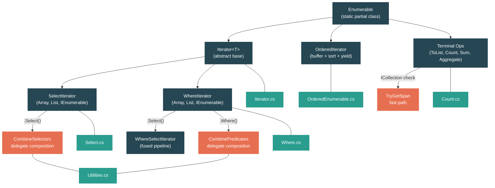

# Level 2: Practitioner — LINQ: From Query Syntax to Iterator Machines

> **Target profile:** Developer who uses LINQ daily but doesn't know how lazy evaluation works or what `Select`/`Where` generate internally
> **Estimated effort:** 4 hours
> **Prerequisites:** [Module 2.1](02-practitioner-generics.md), [Module 2.2](02-practitioner-collections.md)
> [Version en espanol](../es/02-practitioner-linq.md)

---

## Learning Objectives

By the end of this module you will be able to:

1. Explain why calling `.Select()` or `.Where()` does not execute any code, and identify the exact point in the source where execution begins.
2. Trace the state machine inside `IEnumerableSelectIterator.MoveNext()` and explain how `_state` drives the iterator lifecycle.
3. Describe how LINQ fuses consecutive `Where().Select()` calls into a single `WhereSelectIterator` to avoid intermediate allocations.
4. Explain how `CombineSelectors` and `CombinePredicates` compose delegates without creating intermediate iterators.
5. Describe the buffering strategy used by `OrderBy` — why it must materialize the entire source before yielding a single element.
6. Identify the fast paths in `Count()` (ICollection shortcut) and `Sum()` (span-based vectorization) that bypass enumeration entirely.
7. Articulate the allocation cost of a LINQ pipeline and make informed decisions about when LINQ is the wrong tool.
8. Navigate the `System.Linq` source tree and understand the relationship between `Iterator<T>`, its specializations, and the `SpeedOpt` partial class files.

---

## Concept Map



---

## Curriculum

### Lesson 1 — Deferred Execution: Why LINQ is Lazy

#### What you'll learn

When you write `source.Where(x => x > 5).Select(x => x * 2)`, nothing happens. No predicate is evaluated. No multiplication occurs. The chain builds a data structure — an iterator object — that describes what *will* happen when someone finally enumerates the result. This lesson explains the mechanism.

#### The concept

LINQ operators fall into two categories:

| Category | Behavior | Examples |
|---|---|---|
| **Deferred** (lazy) | Returns an iterator object. No elements are processed. | `Select`, `Where`, `OrderBy`, `Take`, `Skip`, `Distinct` |
| **Terminal** (eager) | Enumerates the source immediately. Returns a concrete result. | `ToList`, `ToArray`, `Count`, `Sum`, `First`, `Aggregate` |

Deferred execution means the pipeline is a *description* of work, not the work itself. The work happens only when you:
- Iterate with `foreach`
- Call a terminal operator like `ToList()` or `Count()`
- Manually call `GetEnumerator()` followed by `MoveNext()`

This is possible because every deferred operator returns an object that implements `IEnumerable<T>` but does not enumerate the source during construction. Instead, the constructor stores the source and the delegate (predicate or selector) as fields.

#### In the source code

Open `src/libraries/System.Linq/src/System/Linq/Select.cs`. Look at the main `Select` method (line 13):

```csharp
public static IEnumerable<TResult> Select<TSource, TResult>(
    this IEnumerable<TSource> source, Func<TSource, TResult> selector)
{
    // ... null checks ...

    if (source is TSource[] array)
    {
        if (array.Length == 0)
        {
            return [];
        }
        return new ArraySelectIterator<TSource, TResult>(array, selector);
    }

    if (source is List<TSource> list)
    {
        return new ListSelectIterator<TSource, TResult>(list, selector);
    }

    return new IEnumerableSelectIterator<TSource, TResult>(source, selector);
}
```

Notice what this method does NOT do: it never calls `GetEnumerator()`, never calls `MoveNext()`, never invokes the `selector`. It only creates a new iterator object and returns it. The selector is stored in a field — it will be called later, one element at a time, when someone enumerates.

Now look at the `Iterator<T>` base class in `src/libraries/System.Linq/src/System/Linq/Iterator.cs`:

```csharp
private abstract partial class Iterator<TSource> : IEnumerable<TSource>, IEnumerator<TSource>
{
    private readonly int _threadId = Environment.CurrentManagedThreadId;
    private protected int _state;
    private protected TSource _current = default!;

    public Iterator<TSource> GetEnumerator()
    {
        Iterator<TSource> enumerator =
            _state == 0 && _threadId == Environment.CurrentManagedThreadId
                ? this
                : Clone();
        enumerator._state = 1;
        return enumerator;
    }
}
```

Key design decisions:
1. The iterator is both `IEnumerable<T>` and `IEnumerator<T>` — the same object serves as both the collection-description and the enumerator.
2. `_state` starts at `0`. When `GetEnumerator()` is called, it transitions to `1`. This is the trigger that tells `MoveNext()` to begin work.
3. If `GetEnumerator()` is called on the same thread that created the iterator (the common case), it returns `this` — no allocation. If called from a different thread or a second time, it calls `Clone()` to create a fresh copy.

#### Hands-on exercise

1. Write this code and predict when "Evaluating" prints:
   ```csharp
   var numbers = new[] { 1, 2, 3, 4, 5 };

   var query = numbers.Select(x =>
   {
       Console.WriteLine($"Evaluating {x}");
       return x * 2;
   });

   Console.WriteLine("Query created. Nothing printed yet.");

   foreach (var n in query)
   {
       Console.WriteLine($"Got {n}");
   }
   ```
   You will see that "Evaluating" prints interleaved with "Got" — each element is transformed on demand.

2. Enumerate the same query twice. Verify that the selector runs again both times — LINQ does not cache results.

3. Set a breakpoint inside the `Select` method in `Select.cs`. Confirm it returns immediately without touching the source data.

#### Key takeaway

LINQ operators like `Select` and `Where` are factory methods. They manufacture iterator objects that describe a transformation. No data flows until you start enumerating. This is deferred execution.

#### Common misconception

> *"Calling `.Select()` iterates through the collection once to build the result."*
>
> It does not. `Select` allocates a single small object (the iterator) and returns instantly. If you never enumerate the result, the selector lambda is never called — not even once. This is why you can build complex LINQ chains without performance cost until you actually need the data.

---

### Lesson 2 — Select and Where: The Core Operators

#### What you'll learn

You will trace through the actual `MoveNext()` implementation of `IEnumerableSelectIterator` and `IEnumerableWhereIterator` to understand exactly how iterators produce elements one at a time using a state machine.

#### The concept

An iterator's `MoveNext()` method is a hand-written state machine. The `_state` field tracks where the iterator left off between calls. This is the same pattern the C# compiler generates for `yield return` methods, but LINQ implements it manually for performance.

The state transitions are:

```
State 0: Created (not yet enumerated)
State 1: GetEnumerator() called — ready to begin
State 2: Enumerating (processing elements)
State -1: Disposed (done)
```

#### In the source code

**Select's state machine** — `IEnumerableSelectIterator<TSource, TResult>.MoveNext()` in `Select.cs`:

```csharp
public override bool MoveNext()
{
    switch (_state)
    {
        case 1:
            _enumerator = _source.GetEnumerator();  // first call: get the source enumerator
            _state = 2;
            goto case 2;
        case 2:
            if (_enumerator.MoveNext())              // advance the source
            {
                _current = _selector(_enumerator.Current);  // transform the element
                return true;                          // yield it to the caller
            }
            Dispose();                               // source exhausted
            break;
    }
    return false;
}
```

Walk through this step by step:
1. First call to `MoveNext()`: `_state` is `1`. The iterator calls `_source.GetEnumerator()` to get the underlying enumerator. It stores this in `_enumerator`, transitions to state `2`, and falls through.
2. In state `2`, it calls `_enumerator.MoveNext()`. If there is an element, it applies the selector and stores the result in `_current`. Returns `true`.
3. Each subsequent call to `MoveNext()` enters directly at `case 2` — it just advances the source and transforms the next element.
4. When the source is exhausted (`MoveNext()` returns `false`), it calls `Dispose()` which sets `_state = -1`.

**Where's state machine** — `IEnumerableWhereIterator<TSource>.MoveNext()` in `Where.cs`:

```csharp
public override bool MoveNext()
{
    switch (_state)
    {
        case 1:
            _enumerator = _source.GetEnumerator();
            _state = 2;
            goto case 2;
        case 2:
            while (_enumerator.MoveNext())            // advance until predicate matches
            {
                TSource item = _enumerator.Current;
                if (_predicate(item))                  // test the predicate
                {
                    _current = item;
                    return true;                       // yield the matching element
                }
            }
            Dispose();
            break;
    }
    return false;
}
```

The critical difference: `Where` uses a `while` loop inside state `2`. It keeps advancing the source enumerator until it finds an element that satisfies the predicate — or runs out of elements. Elements that fail the predicate are silently skipped.

**Specialized iterators for arrays and lists**: LINQ provides `ArraySelectIterator`, `ListSelectIterator`, `ArrayWhereIterator`, and `ListWhereIterator`. These skip the `IEnumerator` allocation by iterating directly with an index or a `List<T>.Enumerator` (a struct, avoiding heap allocation). For example, `ArraySelectIterator.MoveNext()`:

```csharp
public override bool MoveNext()
{
    TSource[] source = _source;
    int index = _state - 1;
    if ((uint)index < (uint)source.Length)
    {
        _state++;
        _current = _selector(source[index]);
        return true;
    }
    Dispose();
    return false;
}
```

Here `_state` doubles as the index (offset by 1). No enumerator object is created at all.

#### Hands-on exercise

1. Open `Where.cs` and find `ArrayWhereIterator.MoveNext()`. Trace through it with a source of `[1, 2, 3, 4, 5]` and a predicate of `x => x % 2 == 0`. Write down the value of `_state` and `_current` after each call to `MoveNext()`.

2. Write code that demonstrates Where skipping elements:
   ```csharp
   var evens = new[] { 1, 2, 3, 4, 5 }.Where(x =>
   {
       Console.WriteLine($"Testing {x}");
       return x % 2 == 0;
   });

   foreach (var e in evens)
   {
       Console.WriteLine($"Got {e}");
   }
   // Output: Testing 1, Testing 2, Got 2, Testing 3, Testing 4, Got 4, Testing 5
   ```

3. Compare the types returned by `Select` when called on an array vs a `List<T>` vs a generic `IEnumerable<T>`:
   ```csharp
   int[] arr = { 1, 2, 3 };
   List<int> list = new() { 1, 2, 3 };
   IEnumerable<int> seq = Enumerable.Range(1, 3);

   Console.WriteLine(arr.Select(x => x).GetType().Name);   // ArraySelectIterator
   Console.WriteLine(list.Select(x => x).GetType().Name);  // ListSelectIterator
   Console.WriteLine(seq.Select(x => x).GetType().Name);   // IEnumerableSelectIterator or similar
   ```

#### Key takeaway

`MoveNext()` is the heart of every LINQ operator. Each call advances exactly one position: it pulls one element from the source, applies the transformation or filter, and yields the result. The `_state` field is a simple but effective state machine that manages initialization, iteration, and cleanup.

#### Common misconception

> *"Where evaluates the predicate on all elements before returning any results."*
>
> No. Where evaluates the predicate one element at a time, in response to each `MoveNext()` call. If you call `First()` on a filtered sequence, Where will stop testing elements as soon as it finds the first match.

---

### Lesson 3 — Chaining and Pipeline Fusion

#### What you'll learn

When you write `.Where(p).Select(s)`, LINQ does not create two separate iterators that pass elements between them. Instead, it fuses them into a single `WhereSelectIterator` that applies both the predicate and the selector in one `MoveNext()` call. This lesson examines how this fusion works and when it applies.

#### The concept

Consider this pipeline:

```csharp
var result = source.Where(x => x > 0).Select(x => x * 2);
```

Without fusion, this would create two iterator objects, and each `MoveNext()` on the outer (Select) iterator would call `MoveNext()` on the inner (Where) iterator. That is two virtual method calls per element, plus two separate enumerator objects.

LINQ optimizes this by overriding the `Select` method on `WhereIterator` to return a fused `WhereSelectIterator`:

```csharp
// Inside IEnumerableWhereIterator
public override IEnumerable<TResult> Select<TResult>(Func<TSource, TResult> selector) =>
    new IEnumerableWhereSelectIterator<TSource, TResult>(_source, _predicate, selector);
```

The fused iterator holds both the predicate and the selector, and applies them in a single loop:

```csharp
// Inside IEnumerableWhereSelectIterator.MoveNext()
while (_enumerator.MoveNext())
{
    TSource item = _enumerator.Current;
    if (_predicate(item))
    {
        _current = _selector(item);
        return true;
    }
}
```

Similarly, consecutive `Where` calls are fused using `CombinePredicates`, and consecutive `Select` calls are fused using `CombineSelectors`.

#### In the source code

Open `src/libraries/System.Linq/src/System/Linq/Utilities.cs`:

```csharp
public static Func<TSource, bool> CombinePredicates<TSource>(
    Func<TSource, bool> predicate1, Func<TSource, bool> predicate2) =>
    x => predicate1(x) && predicate2(x);

public static Func<TSource, TResult> CombineSelectors<TSource, TMiddle, TResult>(
    Func<TSource, TMiddle> selector1, Func<TMiddle, TResult> selector2) =>
    x => selector2(selector1(x));
```

These are simple delegate compositions. When you chain `.Where(p1).Where(p2)`, LINQ creates a single `WhereIterator` with the combined predicate `x => p1(x) && p2(x)`. The second `Where` call detects that the source is already a `WhereIterator` and uses `CombinePredicates` instead of wrapping it:

```csharp
// Inside IEnumerableWhereIterator
public override IEnumerable<TSource> Where(Func<TSource, bool> predicate) =>
    new IEnumerableWhereIterator<TSource>(_source, CombinePredicates(_predicate, predicate));
```

Notice that the new iterator's `_source` is the *original* source, not the intermediate `WhereIterator`. The chain is flattened.

The same applies to consecutive Selects. In `IEnumerableSelectIterator`:

```csharp
public override IEnumerable<TResult2> Select<TResult2>(Func<TResult, TResult2> selector) =>
    new IEnumerableSelectIterator<TSource, TResult2>(_source, CombineSelectors(_selector, selector));
```

Two selectors `f` and `g` are composed into `x => g(f(x))`. Only one iterator wraps the original source.

#### The fusion matrix

Here is what each iterator type produces when you chain another operator:

| Starting iterator | `.Where(p)` | `.Select(s)` |
|---|---|---|
| `ArrayWhereIterator` | New `ArrayWhereIterator` with combined predicate | `ArrayWhereSelectIterator` (fused) |
| `ListWhereIterator` | New `ListWhereIterator` with combined predicate | `ListWhereSelectIterator` (fused) |
| `IEnumerableWhereIterator` | New `IEnumerableWhereIterator` with combined predicate | `IEnumerableWhereSelectIterator` (fused) |
| `ArraySelectIterator` | Falls back to generic `WhereIterator` | New `ArraySelectIterator` with combined selector |
| `ListSelectIterator` | Falls back to generic `WhereIterator` | New `ListSelectIterator` with combined selector |
| `IEnumerableSelectIterator` | Falls back to generic `WhereIterator` | New `IEnumerableSelectIterator` with combined selector |

#### Hands-on exercise

1. Verify fusion by checking types:
   ```csharp
   var arr = new[] { 1, 2, 3, 4, 5 };

   // Two separate Wheres — will they fuse?
   var q1 = arr.Where(x => x > 1).Where(x => x < 5);
   Console.WriteLine(q1.GetType().Name); // ArrayWhereIterator — fused into one

   // Where then Select — will they fuse?
   var q2 = arr.Where(x => x > 1).Select(x => x * 2);
   Console.WriteLine(q2.GetType().Name); // ArrayWhereSelectIterator — fused
   ```

2. Count the allocations. A chain of `source.Where(p1).Where(p2).Select(s1).Select(s2)` would naively create 4 iterator objects. Trace through the source to determine how many are actually created.

3. Open `Where.cs` and find the three `WhereSelectIterator` classes (`Array`, `List`, `IEnumerable`). Verify that each one holds both a `_predicate` and a `_selector` field, and applies them in the same `MoveNext()` loop.

#### Key takeaway

LINQ is smarter than it looks. Consecutive `Where` calls are combined into a single predicate. Consecutive `Select` calls are combined into a single selector. `Where().Select()` chains are fused into a single `WhereSelectIterator`. This reduces both the number of allocated objects and the number of virtual calls per element.

#### Common misconception

> *"Every LINQ operator in the chain creates a separate enumerator that pulls from the previous one."*
>
> This is the naive model, and it was true in early LINQ implementations. Modern .NET LINQ aggressively fuses operators. However, fusion only works for specific patterns — inserting an `OrderBy` or `Distinct` in the middle will break the chain, because those operators must buffer the entire source.

---

### Lesson 4 — Terminal Operations: ToList, Count, Aggregate

#### What you'll learn

Terminal operations are where the pipeline finally executes. They consume the iterator by calling `MoveNext()` in a loop. But not all terminal operations enumerate element-by-element — many have fast paths that bypass the iterator entirely.

#### The concept

Terminal operations can be divided by their strategy:

| Strategy | Operations | How they work |
|---|---|---|
| **Enumerate all** | `ToList`, `ToArray`, `Aggregate`, `Sum` | Loop through every element |
| **Enumerate some** | `First`, `Any`, `Take(n).ToList()` | Stop after finding the answer |
| **Skip enumeration** | `Count()` on ICollection, `TryGetNonEnumeratedCount` | Use metadata, never enumerate |

The most important optimization in LINQ terminal operations is **interface checking**. Before enumerating, many operations check whether the source implements `ICollection<T>` or `ICollection`, which provides a `Count` property for free.

#### In the source code

**`Count()`** in `src/libraries/System.Linq/src/System/Linq/Count.cs`:

```csharp
public static int Count<TSource>(this IEnumerable<TSource> source)
{
    if (source is ICollection<TSource> collectionoft)
    {
        return collectionoft.Count;         // O(1) — no enumeration
    }

    if (source is Iterator<TSource> iterator)
    {
        return iterator.GetCount(onlyIfCheap: false);  // iterator may know its count
    }

    if (source is ICollection collection)
    {
        return collection.Count;            // O(1) — non-generic collection
    }

    // Fallback: enumerate everything
    int count = 0;
    using IEnumerator<TSource> e = source.GetEnumerator();
    checked
    {
        while (e.MoveNext()) { count++; }
    }
    return count;
}
```

This is a cascade of type checks. If you call `Count()` on a `List<int>`, it hits the first branch and returns in O(1). If you call it on a LINQ iterator (e.g., `source.Where(...).Count()`), it asks the iterator via `GetCount(onlyIfCheap: false)`, which will enumerate. Only if all shortcuts fail does it fall back to manual enumeration.

The `TryGetNonEnumeratedCount` method is the "peek without executing" variant:

```csharp
public static bool TryGetNonEnumeratedCount<TSource>(this IEnumerable<TSource> source, out int count)
{
    if (source is ICollection<TSource> collectionoft)
    {
        count = collectionoft.Count;
        return true;
    }

    if (source is Iterator<TSource> iterator)
    {
        int c = iterator.GetCount(onlyIfCheap: true);  // only return if cheap
        if (c >= 0) { count = c; return true; }
    }
    // ...
}
```

With `onlyIfCheap: true`, the iterator will only return a count if it can do so without enumerating (e.g., a `Select` over an array knows its count from the array length).

**`ToArray()`** in `src/libraries/System.Linq/src/System/Linq/ToCollection.cs`:

```csharp
public static TSource[] ToArray<TSource>(this IEnumerable<TSource> source)
{
    if (!IsSizeOptimized && source is Iterator<TSource> iterator)
    {
        return iterator.ToArray();  // iterator-specific fast path
    }

    if (source is ICollection<TSource> collection)
    {
        return ICollectionToArray(collection);  // pre-allocate exact size
    }

    return EnumerableToArray(source);  // fallback: grow a buffer
}
```

The ICollection path pre-allocates an array of exactly the right size and copies elements with `CopyTo`. The fallback uses a `SegmentedArrayBuilder` that grows dynamically as it enumerates — this avoids the old pattern of doubling arrays and copying.

**`Sum()`** in `src/libraries/System.Linq/src/System/Linq/Sum.cs` has the most aggressive optimization. When the source is an array or `List<T>`, it extracts a `ReadOnlySpan<T>` and uses SIMD-vectorized summation:

```csharp
private static TResult Sum<TSource, TResult>(this IEnumerable<TSource> source)
{
    if (source.TryGetSpan(out ReadOnlySpan<TSource> span))
    {
        return Sum<TSource, TResult>(span);  // vectorized path
    }

    TResult sum = TResult.Zero;
    foreach (TSource value in source)
    {
        checked { sum += TResult.CreateChecked(value); }
    }
    return sum;
}
```

The `TryGetSpan` method (in `Enumerable.cs`) uses exact type checks to extract a span from `T[]` or `List<T>`:

```csharp
internal static bool TryGetSpan<TSource>(this IEnumerable<TSource> source, out ReadOnlySpan<TSource> span)
{
    if (source.GetType() == typeof(TSource[]))
    {
        span = Unsafe.As<TSource[]>(source);
    }
    else if (source.GetType() == typeof(List<TSource>))
    {
        span = CollectionsMarshal.AsSpan(Unsafe.As<List<TSource>>(source));
    }
    else
    {
        span = default;
        return false;
    }
    return true;
}
```

**`Aggregate()`** in `src/libraries/System.Linq/src/System/Linq/Aggregate.cs` also uses `TryGetSpan`:

```csharp
public static TSource Aggregate<TSource>(this IEnumerable<TSource> source, Func<TSource, TSource, TSource> func)
{
    if (source.TryGetSpan(out ReadOnlySpan<TSource> span))
    {
        result = span[0];
        for (int i = 1; i < span.Length; i++)
        {
            result = func(result, span[i]);
        }
    }
    else
    {
        // IEnumerator-based fallback
    }
}
```

When the source is an array or list, `Aggregate` can iterate over a span — avoiding the enumerator allocation and the virtual dispatch of `MoveNext()`.

#### Hands-on exercise

1. Measure the cost of `Count()` on different sources:
   ```csharp
   var list = Enumerable.Range(0, 1_000_000).ToList();
   var where = list.Where(x => x > 0);

   // This is O(1) — list implements ICollection<int>
   Console.WriteLine(list.Count());

   // This enumerates all 1M elements — Where iterator has no count shortcut
   Console.WriteLine(where.Count());
   ```

2. Use `TryGetNonEnumeratedCount` to check before enumerating:
   ```csharp
   IEnumerable<int> query = Enumerable.Range(0, 100).Where(x => x > 50);
   if (query.TryGetNonEnumeratedCount(out int count))
       Console.WriteLine($"Count known: {count}");
   else
       Console.WriteLine("Count not available without enumeration");
   ```

3. Open `Select.SpeedOpt.cs` and find `IEnumerableSelectIterator.GetCount(bool onlyIfCheap)`. Notice that when `onlyIfCheap` is false, it still runs the selector on every element — because someone might rely on selector side effects being triggered by `Count()`.

#### Key takeaway

Terminal operations are not all equal. `Count()` on a `List<T>` is free. `Sum()` on an array uses SIMD. `ToArray()` on an `ICollection` pre-allocates exactly. But `Count()` on a `.Where()` pipeline must enumerate every element. Understanding these fast paths helps you structure code to take advantage of them.

---

### Lesson 5 — OrderBy and Sorting

#### What you'll learn

`OrderBy` is fundamentally different from `Select` and `Where`. It cannot be lazy on a per-element basis — it must see every element before it can tell you the first one. This lesson examines how LINQ sorts: it buffers the entire source, computes a sort map, and then yields elements via the map.

#### The concept

When you write `source.OrderBy(x => x.Name)`, LINQ:

1. **Buffers** — Copies all elements from the source into an array.
2. **Computes keys** — Applies the key selector to every element, storing keys in a parallel array.
3. **Sorts** — Sorts an index map (not the elements themselves) using the computed keys.
4. **Yields** — When you enumerate, yields `buffer[map[i]]` for each `i` in order.

This means `OrderBy`:
- Always enumerates the entire source (it is "buffered deferred" — deferred until you start enumerating, but then it consumes everything at once).
- Allocates at least two arrays: one for the elements, one for the sort map (indices).
- If using `OrderBy` with a key selector, allocates a third array for the computed keys.

#### In the source code

Open `src/libraries/System.Linq/src/System/Linq/OrderedEnumerable.cs`. The `OrderedIterator<TElement, TKey>.MoveNext()` method:

```csharp
public override bool MoveNext()
{
    int state = _state;

    Initialized:
    if (state > 1)
    {
        int[] map = _map;
        int i = state - 2;
        if ((uint)i < (uint)map.Length)
        {
            _current = _buffer[map[i]];  // yield element at sorted position
            _state++;
            return true;
        }
    }
    else if (state == 1)
    {
        TElement[] buffer = _source.ToArray();  // buffer EVERYTHING
        if (buffer.Length != 0)
        {
            _map = SortedMap(buffer);           // compute sort indices
            _buffer = buffer;
            _state = state = 2;
            goto Initialized;
        }
    }

    Dispose();
    return false;
}
```

The first call to `MoveNext()` (state 1) calls `_source.ToArray()` — this is the moment the entire preceding pipeline gets evaluated. Then `SortedMap(buffer)` creates the sorted index array. Subsequent calls (state > 1) use the map to yield elements in sorted order.

The `SortedMap` method delegates to `EnumerableSorter<TElement>`, which:

```csharp
internal int[] Sort(TElement[] elements, int count)
{
    int[] map = ComputeMap(elements, count);  // [0, 1, 2, ..., n-1]
    QuickSort(map, 0, count - 1);            // sort the indices
    return map;
}
```

`ComputeMap` first calls `ComputeKeys`, which extracts keys:

```csharp
internal override void ComputeKeys(TElement[] elements, int count)
{
    var keys = new TKey[count];
    for (int i = 0; i < keys.Length; i++)
    {
        keys[i] = _keySelector(elements[i]);
    }
    _keys = keys;
}
```

Then `QuickSort` sorts the *index array* by comparing the *keys*. The sort is stable — when two keys are equal, the original order is preserved by comparing indices:

```csharp
internal override int CompareAnyKeys(int index1, int index2)
{
    int c = _comparer.Compare(keys[index1], keys[index2]);
    if (c == 0)
    {
        if (_next is null)
            return index1 - index2;  // stability: preserve original order
        return _next.CompareAnyKeys(index1, index2);  // chain: ThenBy
    }
    return (_descending != (c > 0)) ? 1 : -1;
}
```

**ThenBy** works by chaining sorters. `OrderBy` creates an `EnumerableSorter` with `_next = null`. `ThenBy` creates a new `OrderedIterator` whose parent is the original, and the parent's `GetEnumerableSorter` builds a linked chain of sorters. When comparing, if the primary key is equal, it delegates to `_next` for the tiebreaker.

**ImplicitlyStableOrderedIterator** is a special optimization for types where stability does not matter (like `int`, `long`, `char`). Since two `int` values that compare equal are bit-identical, there is no observable difference between stable and unstable sort. For these types, LINQ skips the index map entirely and sorts the buffer directly using `Span.Sort()`:

```csharp
private static void Sort(Span<TElement> span, bool descending)
{
    if (descending)
        span.Sort(static (a, b) => Comparer<TElement>.Default.Compare(b, a));
    else
        span.Sort();
}
```

#### Hands-on exercise

1. Visualize the buffering behavior:
   ```csharp
   var sorted = Enumerable.Range(1, 5)
       .Select(x => { Console.WriteLine($"Select: {x}"); return x; })
       .OrderBy(x => { Console.WriteLine($"OrderBy key: {x}"); return -x; });

   Console.WriteLine("--- Starting enumeration ---");
   foreach (var item in sorted)
   {
       Console.WriteLine($"Got: {item}");
   }
   ```
   All "Select" messages print before any "Got" messages — OrderBy forces full evaluation of the upstream pipeline.

2. Open `OrderedEnumerable.cs` and find `TypeIsImplicitlyStable<T>()` (it is in `OrderBy.cs`). It checks for integral types where equal values are bit-identical. Add `string` mentally to the list — why is it NOT included? (Because two different string objects can compare as equal but have different reference identity, observable in a stable sort.)

3. Measure the memory impact of sorting a large collection vs filtering it:
   ```csharp
   var data = Enumerable.Range(0, 1_000_000);
   // This allocates nothing beyond the iterator:
   var filtered = data.Where(x => x % 2 == 0);
   // This allocates a 1M-element buffer + keys + map:
   var sorted = data.OrderBy(x => x);
   ```

#### Key takeaway

`OrderBy` is the most expensive common LINQ operator. It buffers the entire source, allocates parallel arrays for keys and sort maps, and performs a full sort — all on the first `MoveNext()` call. This is unavoidable: you cannot know the smallest element without seeing all elements. Use `OrderBy` deliberately, especially on large datasets.

#### Common misconception

> *"OrderBy is deferred, so it's free to add to a pipeline."*
>
> OrderBy is *deferred* in the sense that it does nothing until you enumerate. But once you start enumerating, it immediately consumes the entire upstream pipeline and sorts. "Deferred" does not mean "cheap."

---

### Lesson 6 — Performance Considerations

#### What you'll learn

LINQ is expressive and safe, but it has costs: delegate invocations, iterator allocations, virtual dispatch, and loss of span-based optimizations. This lesson quantifies those costs and helps you decide when LINQ is the right tool and when a manual loop is better.

#### The concept

Every LINQ pipeline pays these costs:

| Cost | Source | Impact |
|---|---|---|
| **Iterator allocation** | Each operator creates a `new XyzIterator(...)` | One small heap object per operator. Fused chains reduce this. |
| **Delegate allocation** | Each lambda becomes a delegate | One allocation per lambda (cached for static lambdas in modern .NET). |
| **Delegate invocation** | `_selector(item)` / `_predicate(item)` per element | Cannot be inlined by the JIT (the delegate target is unknown at JIT time). |
| **Virtual dispatch** | `_enumerator.MoveNext()` and `.Current` | When the source is `IEnumerable<T>`, every MoveNext is a virtual/interface call. |
| **No span access** | LINQ iterators implement `IEnumerable<T>`, not `ReadOnlySpan<T>` | Once you enter the LINQ pipeline, you lose the ability to work with contiguous memory. |
| **GC pressure** | Iterator + enumerator + delegate objects on the heap | In hot loops, this can trigger Gen0 collections. |

#### When LINQ wins

- **Readability**: `items.Where(x => x.IsActive).Select(x => x.Name)` communicates intent better than a manual loop with `if` and `Add`.
- **Composability**: You can build queries dynamically, pass `IEnumerable<T>` to other methods, and chain operators.
- **Correctness**: Deferred execution avoids accidental full-collection copies. Terminal operators handle edge cases (empty collections, null checks).
- **Prototyping and business logic**: When the dataset is small or the operation is not in a hot path, LINQ's overhead is negligible.

#### When to prefer manual loops

- **Hot paths**: If profiling shows a LINQ chain in a hot path, replacing it with a `for` loop over a span can eliminate all delegate and enumerator overhead.
- **Span-based processing**: `Span<T>` and `ReadOnlySpan<T>` do not implement `IEnumerable<T>`. You cannot use LINQ on spans (though `MemoryExtensions` provides some span-native alternatives).
- **Pre-sized output**: When you know the output size, pre-allocating an array and filling it with a `for` loop avoids the `SegmentedArrayBuilder` growth strategy used by `ToArray()`.
- **Avoiding closures**: Lambdas that capture local variables allocate a closure object on every invocation. In tight loops, this matters.

#### Allocation analysis of a real pipeline

Consider this pipeline:

```csharp
int[] data = GetData();
var result = data
    .Where(x => x > 0)        // 1. ArrayWhereIterator (1 allocation)
    .Select(x => x * 2)       // 2. Fused into ArrayWhereSelectIterator (0 extra — fusion!)
    .OrderBy(x => x)          // 3. ImplicitlyStableOrderedIterator (1 allocation)
    .ToList();                 // 4. Forces enumeration
```

Allocations during `ToList()`:
- The `ArrayWhereSelectIterator` (already allocated)
- `OrderBy` creates the `ImplicitlyStableOrderedIterator` (already allocated)
- On first `MoveNext()` of OrderBy: `ToArray()` on the upstream pipeline allocates a buffer
- `Span.Sort()` sorts in-place (no extra array for this path)
- `ToList()` creates the final `List<int>`

Total: 2 iterator objects + 1 intermediate buffer + 1 final List. Compare this to a manual approach:

```csharp
int[] data = GetData();
var result = new List<int>(data.Length);
foreach (int x in data)
{
    if (x > 0)
    {
        result.Add(x * 2);
    }
}
result.Sort();
```

This allocates only the `List<int>` (pre-sized) and performs the sort in-place. No iterators, no delegates, no intermediate buffers.

#### The `IsSizeOptimized` switch

The LINQ source contains a feature switch:

```csharp
[FeatureSwitchDefinition("System.Linq.Enumerable.IsSizeOptimized")]
internal static bool IsSizeOptimized { get; }
```

When enabled (common in Native AOT), LINQ avoids the specialized `ArraySelectIterator`, `ListSelectIterator`, etc., falling back to fewer, more general iterator types. This reduces the number of generic type instantiations (smaller binary) at the cost of less optimal iteration. Understanding this switch helps you interpret benchmark results that differ between JIT and AOT scenarios.

#### Hands-on exercise

1. Use BenchmarkDotNet to compare LINQ vs manual loop:
   ```csharp
   [Benchmark]
   public int LinqSum()
   {
       return data.Where(x => x > 0).Select(x => x * 2).Sum();
   }

   [Benchmark]
   public int ManualSum()
   {
       int sum = 0;
       foreach (int x in data)
       {
           if (x > 0) sum += x * 2;
       }
       return sum;
   }
   ```
   The manual loop will typically be 3-10x faster for large arrays because: no delegate calls, no virtual dispatch, and the JIT can vectorize the arithmetic.

2. Examine what happens when you replace `ToList()` with `ToArray()` on a LINQ pipeline where the source size is known. Check `ToCollection.cs` to see if `ToArray` can pre-allocate.

3. Check whether your LINQ lambda captures a variable:
   ```csharp
   int threshold = 5;
   // This lambda captures 'threshold' — closure allocation per invocation
   var query = data.Where(x => x > threshold);
   ```
   Compare with a static lambda (no capture): `data.Where(static x => x > 0)`.

#### Key takeaway

LINQ's cost is not zero, but it is well-optimized in modern .NET through iterator fusion, span-based fast paths, and specialized iterators for arrays and lists. Use LINQ freely in business logic and cold paths. Profile before replacing LINQ in hot paths — the fusion and fast-path optimizations often make the overhead smaller than you expect.

#### Common misconception

> *"LINQ is always slow; real code should never use it."*
>
> This was more true in .NET Framework. Modern .NET LINQ has been heavily optimized: fused iterators, span extraction, vectorized Sum, pre-sized ToArray for ICollection sources. For most application code, LINQ's readability advantage far outweighs its overhead. Reserve manual loops for code that profiling identifies as a bottleneck.

---

## Source Code Reading Guide

These are the key files for this module, listed in recommended reading order.

| # | File | Difficulty | What to look for |
|---|---|---|---|
| 1 | `src/libraries/System.Linq/src/System/Linq/Iterator.cs` | One star | The `Iterator<T>` base class: `_state`, `_current`, `GetEnumerator()` reuse-or-clone logic, virtual `Select`/`Where` methods. |
| 2 | `src/libraries/System.Linq/src/System/Linq/Select.cs` | Two stars | The `Select` entry point with type checks (array, list, IList). `IEnumerableSelectIterator.MoveNext()` state machine. The `Select` override that calls `CombineSelectors`. |
| 3 | `src/libraries/System.Linq/src/System/Linq/Where.cs` | Two stars | `IEnumerableWhereIterator.MoveNext()` with the `while` loop. `WhereSelectIterator` fusion classes. `Where` override that calls `CombinePredicates`. |
| 4 | `src/libraries/System.Linq/src/System/Linq/Utilities.cs` | One star | `CombinePredicates` and `CombineSelectors` — small but essential for understanding fusion. |
| 5 | `src/libraries/System.Linq/src/System/Linq/Enumerable.cs` | One star | `IsSizeOptimized` feature switch. `TryGetSpan` for arrays and lists. `IsEmptyArray` check. |
| 6 | `src/libraries/System.Linq/src/System/Linq/Count.cs` | One star | The `ICollection<T>` / `ICollection` / `Iterator` / fallback cascade. `TryGetNonEnumeratedCount`. |
| 7 | `src/libraries/System.Linq/src/System/Linq/ToCollection.cs` | Two stars | `ToArray` and `ToList` with `ICollection` fast path and `SegmentedArrayBuilder` fallback. |
| 8 | `src/libraries/System.Linq/src/System/Linq/OrderedEnumerable.cs` | Three stars | `OrderedIterator.MoveNext()` buffer-sort-yield pattern. `EnumerableSorter` chain for ThenBy. `CompareAnyKeys` stability logic. |
| 9 | `src/libraries/System.Linq/src/System/Linq/Sum.cs` | Two stars | `TryGetSpan` for vectorized path. SIMD overflow detection with `Vector<T>`. |
| 10 | `src/libraries/System.Linq/src/System/Linq/Aggregate.cs` | One star | Span-based fast path vs IEnumerator fallback. Three overloads of increasing generality. |

**Reading strategy**: Start with `Iterator.cs` (file 1) — it is short and defines the contract every iterator must follow. Then read `Select.cs` and `Where.cs` (files 2-3) together, focusing on the `MoveNext()` implementations and the fusion methods. Read `Utilities.cs` (file 4) to understand delegate composition. Then explore the terminal operations (files 6-7, 9-10). Save `OrderedEnumerable.cs` (file 8) for last — it is the most complex, with the sorter chain and map-based yielding.

---

## Diagnostic Tools and Commands

| Tool / Technique | What it shows | How to use |
|---|---|---|
| `GetType().Name` on a LINQ query | The actual iterator type (reveals fusion) | `Console.WriteLine(query.GetType().Name)` |
| Debugger step-through | The `MoveNext()` state machine in action | Set breakpoint in `MoveNext()`, step through `foreach` |
| `TryGetNonEnumeratedCount()` | Whether a count is available without enumeration | `source.TryGetNonEnumeratedCount(out int c)` |
| BenchmarkDotNet | Allocation and throughput comparison | Compare LINQ vs manual loop implementations |
| [SharpLab](https://sharplab.io/) | View the lowered code for `yield return` methods | Paste a method with `yield return`, select C# output to see the generated state machine |
| dotnet-counters | GC collection rates during LINQ-heavy workloads | `dotnet-counters monitor --counters System.Runtime` |
| dotMemory / VS Allocation Tracking | Heap allocations per LINQ call | Profile and look for iterator/delegate/closure objects |
| `[MethodImpl(MethodImplOptions.NoInlining)]` | Force a method boundary for profiling | Add to a LINQ-consuming method to see it in profiler call trees |

---

## Self-Assessment

### Questions

1. **What happens when you call `.Select(x => x * 2)` on an array?** Walk through the type checks in `Select.cs` and identify which iterator class is instantiated.

2. **Trace through `IEnumerableWhereIterator.MoveNext()` with a source of `[1, 2, 3]` and a predicate of `x => x == 2`.** What are the values of `_state` and `_current` after each call to `MoveNext()`?

3. **Why does `.Where(p).Select(s)` produce a `WhereSelectIterator` instead of two separate iterators?** What method on the `WhereIterator` is responsible for this fusion?

4. **What is the allocation difference between `list.Count()` and `list.Where(x => x > 0).Count()`**, where `list` is a `List<int>`?

5. **Why does `OrderBy` buffer the entire source on the first `MoveNext()` call?** Could it be implemented lazily? Why or why not?

6. **What does `CombineSelectors` return?** If you chain three consecutive `.Select()` calls, how many iterator objects are created?

### Practical Challenge

Write a method that processes a large dataset (1M+ elements) in two ways:

1. A LINQ pipeline: `data.Where(pred).Select(transform).OrderBy(key).ToList()`
2. A manual implementation using arrays, `for` loops, and `Array.Sort`

Measure and compare:
- Execution time
- Memory allocations (use BenchmarkDotNet's `[MemoryDiagnoser]`)
- Code readability (subjective)

Then try removing `OrderBy` from both versions and re-measure. How much of the LINQ overhead was due to sorting vs the Where/Select chain?

<details>
<summary>Hint</summary>

For the manual version:
```csharp
// Count matching elements first to pre-allocate
int count = 0;
for (int i = 0; i < data.Length; i++)
{
    if (pred(data[i])) count++;
}

// Allocate and fill
var result = new int[count];
int idx = 0;
for (int i = 0; i < data.Length; i++)
{
    if (pred(data[i]))
    {
        result[idx++] = transform(data[i]);
    }
}

Array.Sort(result);
return new List<int>(result);
```

The LINQ version will be slower primarily because of `OrderBy` buffering. The `Where().Select()` portion benefits from fusion and adds relatively little overhead.
</details>

---

## Connections

| Direction | Module | Relationship |
|---|---|---|
| **Previous** | [2.1 — Generics: From Syntax to Runtime Specialization](02-practitioner-generics.md) | LINQ is built on generics — every operator is `<TSource>` or `<TSource, TResult>`. Understanding generic specialization explains why `ArraySelectIterator` is faster than `IEnumerableSelectIterator`. |
| **Previous** | [2.2 — Collections: How List, Dictionary, and HashSet Work Inside](02-practitioner-collections.md) | LINQ's fast paths depend on recognizing `ICollection<T>`, `List<T>`, and `T[]` — the types you studied in Module 2.2. |
| **Related** | [1.3 — The Type System: Values, References, and the Heap](01-foundations-type-system.md) | Iterator objects are reference types on the heap. Delegate allocations involve boxing concepts from Module 1.3. |
| **Deeper** | [3.1 — Memory Model: Stack, Heap, Span, and Memory](03-advanced-memory-model.md) | The `TryGetSpan` optimization in Sum/Aggregate bridges LINQ and span-based processing. |
| **Deeper** | [3.x — Expression Trees and IQueryable](03-advanced-expression-trees.md) | LINQ-to-Objects (this module) evaluates delegates. LINQ-to-SQL/EF uses expression trees to translate queries to SQL — a fundamentally different mechanism. |

---

## Glossary

| Term | Definition |
|---|---|
| **Deferred execution** | The pattern where a LINQ operator returns an iterator object immediately without processing any elements. Execution occurs only when the result is enumerated. |
| **Terminal operation** | A LINQ method that forces enumeration of the pipeline and returns a concrete result (`ToList`, `Count`, `Sum`, `First`, `Aggregate`). |
| **Iterator** | An object that implements both `IEnumerable<T>` and `IEnumerator<T>`, producing elements one at a time via `MoveNext()` and `Current`. In LINQ, the `Iterator<T>` base class in `Iterator.cs`. |
| **State machine** | A pattern where a method's behavior depends on a `_state` field that transitions between values. Used in `MoveNext()` to track initialization, enumeration, and disposal phases. |
| **Pipeline fusion** | The optimization where consecutive LINQ operators are combined into a single iterator. `Where().Select()` becomes `WhereSelectIterator`. `Where().Where()` combines predicates. |
| **CombineSelectors** | A utility in `Utilities.cs` that composes two selectors `f` and `g` into a single delegate `x => g(f(x))`, enabling Select-Select fusion. |
| **CombinePredicates** | A utility that composes two predicates `p1` and `p2` into `x => p1(x) && p2(x)`, enabling Where-Where fusion. |
| **Sort map** | An array of indices used by `OrderBy`. Instead of moving elements, LINQ sorts the index array and yields `buffer[map[i]]`. This avoids copying large elements. |
| **TryGetSpan** | A method on `Enumerable` that attempts to extract a `ReadOnlySpan<T>` from arrays and lists, enabling span-based fast paths in terminal operations like `Sum` and `Aggregate`. |
| **IsSizeOptimized** | A feature switch (`System.Linq.Enumerable.IsSizeOptimized`) that, when enabled, reduces the number of specialized iterator types to minimize binary size (used in Native AOT). |
| **Stable sort** | A sort that preserves the relative order of elements with equal keys. LINQ's `OrderBy` is stable (guaranteed by `index1 - index2` tiebreaker in `CompareAnyKeys`). |

---

## References

| Resource | Type | Relevance |
|---|---|---|
| [System.Linq source — .NET Source Browser](https://source.dot.net/#System.Linq/System/Linq/) | Source | Browsable, indexed version of all LINQ source files |
| [Stephen Toub — Performance Improvements in .NET 8](https://devblogs.microsoft.com/dotnet/performance-improvements-in-net-8/) | Blog | Covers LINQ optimizations including span-based Sum, SegmentedArrayBuilder for ToArray |
| [Jon Skeet — Reimplementing LINQ to Objects](https://codeblog.jonskeet.uk/category/edulinq/) | Blog series | Educational reimplementation that builds every operator from scratch |
| [BenchmarkDotNet](https://benchmarkdotnet.org/) | Tool | The standard .NET micro-benchmarking library for comparing LINQ vs manual approaches |
| [SharpLab](https://sharplab.io/) | Tool | View lowered `yield return` state machines and JIT output for LINQ lambdas |
| [.NET Design Docs — LINQ Optimization](https://github.com/dotnet/runtime/tree/main/docs/design) | Design docs | Internal design decisions for LINQ performance improvements |

---

*Next module: [2.6 — Async/Await: From Task to State Machine](02-practitioner-async-await.md)*
