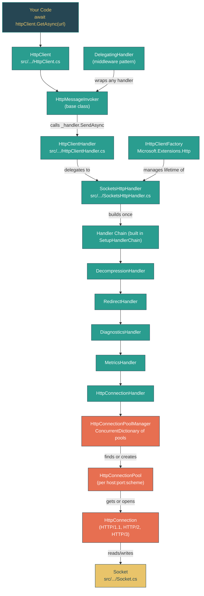

# Level 2: Practitioner -- Networking Fundamentals: HttpClient and Sockets

> **Target profile:** Developer who uses HttpClient but does not understand connection management or the handler pipeline
> **Estimated effort:** 5 hours
> **Prerequisites:** Level 1 complete, Module 2.3 (Async/Await Patterns)
> [Version en espanol](../es/02-practitioner-networking.md)

---

## Learning Objectives

After completing this module, you will be able to:

1. **Trace** an HTTP request from `HttpClient.GetAsync` through the handler chain all the way down to a `Socket`.
2. **Explain** why `HttpClient` should be reused and what happens internally when you dispose it.
3. **Describe** the `DelegatingHandler` middleware pattern and build a custom handler that plugs into the pipeline.
4. **Identify** how `SocketsHttpHandler` manages connection pools, idle timeouts, and connection lifetimes.
5. **Navigate** the `System.Net.Sockets.Socket` class and explain its role as the foundation of all .NET networking.
6. **Articulate** why `IHttpClientFactory` exists and how it solves DNS rotation and handler lifetime problems.
7. **Describe** what happens at the DNS, TLS, and TCP layers when an HTTP request is made.
8. **Read** real connection pooling and handler chain code in the `dotnet/runtime` source and understand the design decisions behind it.

---

## Concept Map



---

## Curriculum

### Lesson 2.7.1: HttpClient -- More Than a Wrapper

**What you'll learn:** `HttpClient` is a thin convenience layer on top of a handler pipeline. Understanding its real structure explains why reusing it matters and why disposing it carelessly causes problems.

**The concept:**

Most developers think of `HttpClient` as "the thing that makes HTTP requests." In reality, it does very little work itself. Look at its class declaration in the source:

```csharp
// src/libraries/System.Net.Http/src/System/Net/Http/HttpClient.cs, line 14
public partial class HttpClient : HttpMessageInvoker
```

`HttpClient` inherits from `HttpMessageInvoker`, which holds a single `HttpMessageHandler` instance. Every convenience method -- `GetAsync`, `PostAsync`, `PutAsync`, `DeleteAsync` -- ultimately calls `base.SendAsync(request, cts.Token)` on the invoker, which calls `_handler.SendAsync(request, cancellationToken)` on the handler.

Here is the chain of ownership when you use the default constructor:

1. `new HttpClient()` calls `new HttpClient(new HttpClientHandler())` (line 138)
2. `HttpClientHandler` creates a `SocketsHttpHandler` as `_underlyingHandler` (line 75, via the type alias `HttpHandlerType`)
3. On the first request, `SocketsHttpHandler.SetupHandlerChain()` builds the full internal pipeline

What `HttpClient` adds on top of the handler:
- **Default headers** (`DefaultRequestHeaders`) applied to every request
- **Base address** (`BaseAddress`) for resolving relative URIs
- **Timeout** (default: 100 seconds) enforced via `CancellationTokenSource`
- **Telemetry** start/stop events for `HttpTelemetry`
- **Cancellation** support via `_pendingRequestsCts`

**Why reuse matters:** When you `new` up an `HttpClient`, you create a new `SocketsHttpHandler`, which creates a new `HttpConnectionPoolManager`, which maintains its own set of TCP connections. If you create and dispose `HttpClient` instances per request, you:
- Throw away warm connections (TCP + TLS already negotiated)
- Leave connections in `TIME_WAIT` state (the OS holds the socket for up to 240 seconds)
- Can exhaust ephemeral ports under load ("socket exhaustion")

**In the source code:**
- `src/libraries/System.Net.Http/src/System/Net/Http/HttpClient.cs` -- The full class. Note the `_operationStarted` flag (line 24): once a request is made, property setters like `Timeout` throw `InvalidOperationException`. This is a deliberate design: the handler chain is built lazily and becomes immutable after first use.
- `src/libraries/System.Net.Http/src/System/Net/Http/HttpMessageInvoker.cs` -- The base class that actually invokes the handler. Lines 67-78 show `SendAsync` calling `_handler.SendAsync`.

**Hands-on exercise:**

1. Open `src/libraries/System.Net.Http/src/System/Net/Http/HttpClient.cs` and find the parameterless constructor. Trace its call through the constructor chain to confirm it creates an `HttpClientHandler`.
2. Search for the `CheckDisposedOrStarted()` method. List all properties that call it. Why does `DefaultRequestHeaders` not call it?
3. Open `HttpMessageInvoker.cs` and read the `SendAsync` method. Notice the telemetry branching: `ShouldSendWithTelemetry(request)`. What additional work does the telemetry path do?
4. Write a small program that creates a single `HttpClient` instance in a `static readonly` field and makes 10 concurrent requests. Compare this with creating a new `HttpClient` for each request. Observe the difference in connection reuse using `netstat` or `ss -tnp`.

**Key takeaway:** `HttpClient` is a lightweight facade. The real work happens in the handler chain it wraps. Reuse `HttpClient` instances to reuse the connection pool underneath.

---

### Lesson 2.7.2: The Handler Chain -- DelegatingHandler and the Middleware Pattern

**What you'll learn:** .NET's HTTP stack uses a linked-list of handlers (similar to middleware in ASP.NET Core) to compose cross-cutting concerns like redirection, decompression, diagnostics, and authentication.

**The concept:**

The pattern hinges on two abstract classes:

```
HttpMessageHandler          (abstract base -- defines SendAsync)
    |
    +-- DelegatingHandler   (abstract -- wraps an InnerHandler, forwards calls)
    |       |
    |       +-- RedirectHandler
    |       +-- DecompressionHandler
    |       +-- DiagnosticsHandler
    |       +-- MetricsHandler
    |       +-- Your custom handlers
    |
    +-- SocketsHttpHandler  (terminal handler -- actually sends bytes)
```

`DelegatingHandler` is the key abstraction. Read its entire source in `src/libraries/System.Net.Http/src/System/Net/Http/DelegatingHandler.cs` -- it is only 99 lines. The critical method:

```csharp
// DelegatingHandler.cs, line 53
protected internal override Task<HttpResponseMessage> SendAsync(
    HttpRequestMessage request, CancellationToken cancellationToken)
{
    ArgumentNullException.ThrowIfNull(request);
    SetOperationStarted();
    return _innerHandler!.SendAsync(request, cancellationToken);
}
```

Each `DelegatingHandler` does something before or after calling `_innerHandler.SendAsync`. This is the classic chain-of-responsibility pattern. You can insert any behavior -- logging, retry, caching, header injection -- by subclassing `DelegatingHandler`.

**How the internal chain is built:** When `SocketsHttpHandler.SetupHandlerChain()` runs (lines 518-562 of `SocketsHttpHandler.cs`), it composes the chain bottom-up:

1. `HttpConnectionHandler` (wraps `HttpConnectionPoolManager`) -- the innermost layer
2. `MetricsHandler` -- records `http.request.duration` metrics
3. `DiagnosticsHandler` -- propagates distributed tracing context
4. `RedirectHandler` -- follows 3xx redirects (if `AllowAutoRedirect` is true)
5. `DecompressionHandler` -- handles gzip/brotli/zstd decompression (if enabled)

The outermost handler is what `SocketsHttpHandler.SendAsync` calls. A request flows inward through the chain; the response flows back outward.

**In the source code:**
- `src/libraries/System.Net.Http/src/System/Net/Http/DelegatingHandler.cs` -- The full middleware base class. Note the `_operationStarted` flag (line 17) and the `CheckDisposedOrStarted()` pattern: once the first request fires, you cannot change `InnerHandler`.
- `src/libraries/System.Net.Http/src/System/Net/Http/SocketsHttpHandler/SocketsHttpHandler.cs` lines 518-562 -- `SetupHandlerChain()` shows the exact order of composition. The `Interlocked.CompareExchange` on line 556 ensures exactly one chain is built even under concurrency.

**Hands-on exercise:**

1. Read the full `DelegatingHandler.cs`. Draw the class hierarchy: `HttpMessageHandler` -> `DelegatingHandler` -> concrete handlers.
2. Write a custom `DelegatingHandler` that logs the request URI and elapsed time:
   ```csharp
   public class TimingHandler : DelegatingHandler
   {
       protected override async Task<HttpResponseMessage> SendAsync(
           HttpRequestMessage request, CancellationToken cancellationToken)
       {
           var sw = Stopwatch.StartNew();
           HttpResponseMessage response = await base.SendAsync(request, cancellationToken);
           sw.Stop();
           Console.WriteLine($"{request.Method} {request.RequestUri} -> {(int)response.StatusCode} in {sw.ElapsedMilliseconds}ms");
           return response;
       }
   }
   ```
3. Use it: `new HttpClient(new TimingHandler { InnerHandler = new HttpClientHandler() })`.
4. Open `SetupHandlerChain()` in `SocketsHttpHandler.cs` and trace what happens when `AllowAutoRedirect` is `false` and `AutomaticDecompression` is `None`. How short is the chain?

**Key takeaway:** The handler chain is a pipeline of composable behaviors. `DelegatingHandler` makes every cross-cutting concern a pluggable module. The internal chain is built lazily and locked after first use.

---

### Lesson 2.7.3: SocketsHttpHandler -- Connection Pooling

**What you'll learn:** `SocketsHttpHandler` manages a pool of TCP connections organized by endpoint. Understanding this pool explains performance characteristics, DNS behavior, and why `PooledConnectionLifetime` is the key setting.

**The concept:**

When a request arrives at the bottom of the handler chain, it reaches `HttpConnectionHandler`, which delegates to `HttpConnectionPoolManager`. The pool manager is a `ConcurrentDictionary<HttpConnectionKey, HttpConnectionPool>` -- one pool per unique combination of scheme + host + port.

The comment at the top of `HttpConnectionPoolManager.cs` (lines 15-29) documents the full flow:

```
(1) HttpConnectionPoolManager.SendAsync:       Proxy lookup
(2) HttpConnectionPoolManager.SendAsyncCore:   Find or create connection pool
(3) HttpConnectionPool.SendAsync:              Handle basic/digest request auth
(4) HttpConnectionPool.SendWithProxyAuthAsync: Handle basic/digest proxy auth
(5) HttpConnectionPool.SendWithRetryAsync:     Get connection from pool or create new;
                                               retry on stale connection failure
(6) HttpConnection.SendAsync:                  Handle negotiate/ntlm connection auth
(7) HttpConnection.SendWithNtProxyAuthAsync:   Handle negotiate/ntlm proxy auth
(8) HttpConnection.SendAsyncCore:              Write request, read response
```

**Connection lifecycle settings on `SocketsHttpHandler`:**

| Property | Default | What it controls |
|---|---|---|
| `PooledConnectionIdleTimeout` | 1 minute | How long an idle connection stays in the pool before being closed |
| `PooledConnectionLifetime` | `Infinite` | Maximum total lifetime of a connection (idle or active). **Set this to rotate DNS.** |
| `MaxConnectionsPerServer` | `int.MaxValue` | Maximum concurrent connections per endpoint |
| `ConnectTimeout` | `Infinite` | Timeout for establishing a new TCP connection |

**The DNS problem:** With default settings, `PooledConnectionLifetime` is infinite. Once a connection is established to IP address `1.2.3.4`, it stays open forever, even if DNS for that hostname now resolves to `5.6.7.8`. This matters for cloud services behind load balancers. Setting `PooledConnectionLifetime = TimeSpan.FromMinutes(2)` forces connections to be recycled, triggering fresh DNS resolution.

**Connection scavenging:** The pool manager runs a cleanup timer (`_cleaningTimer` in `HttpConnectionPoolManager.cs`, lines 97-111). Its frequency is derived from `PooledConnectionIdleTimeout` divided by 4, with a minimum of 1 second. The timer callback calls `RemoveStalePools()`, which walks all pools and prunes expired connections.

The `WeakReference<HttpConnectionPoolManager>` pattern (line 102) prevents the timer from keeping the pool manager alive after the handler is disposed -- a subtle but important detail for avoiding memory leaks.

**In the source code:**
- `src/libraries/System.Net.Http/src/System/Net/Http/SocketsHttpHandler/HttpConnectionPoolManager.cs` -- The pool manager. Lines 15-29 are a must-read architectural overview. Lines 60-139 show initialization: proxy setup, timer configuration, and the weak reference pattern.
- `src/libraries/System.Net.Http/src/System/Net/Http/SocketsHttpHandler/HttpConnectionHandler.cs` -- The thinnest handler in the chain: 36 lines total. It simply forwards to `_poolManager.SendAsync`.
- `src/libraries/System.Net.Http/src/System/Net/Http/SocketsHttpHandler/SocketsHttpHandler.cs` lines 213-241 -- The `PooledConnectionLifetime` and `PooledConnectionIdleTimeout` property declarations.

**Hands-on exercise:**

1. Open `HttpConnectionPoolManager.cs` and read the comment block at lines 15-29. Draw the 8-step flow as a diagram.
2. Find the timer setup code (lines 97-111). Why does it use a `WeakReference`? What would happen if it used a direct reference?
3. Calculate the cleanup timer frequency for these configurations:
   - `PooledConnectionIdleTimeout = 2 minutes` -> timer fires every ??? seconds
   - `PooledConnectionIdleTimeout = 2 seconds` -> timer fires every ??? seconds
   - `PooledConnectionIdleTimeout = Infinite` -> timer fires every ??? seconds
4. Open `HttpConnectionHandler.cs` and read the entire file. Why is authentication checking done here (`_doRequestAuth && !request.IsAuthDisabled()`) rather than deeper in the stack?
5. Write a program that configures `SocketsHttpHandler` directly:
   ```csharp
   var handler = new SocketsHttpHandler
   {
       PooledConnectionLifetime = TimeSpan.FromMinutes(2),
       PooledConnectionIdleTimeout = TimeSpan.FromMinutes(1),
       MaxConnectionsPerServer = 10
   };
   var client = new HttpClient(handler);
   ```

**Key takeaway:** Connection pooling is per-endpoint, managed by `HttpConnectionPoolManager`. The `PooledConnectionLifetime` setting is critical for DNS-sensitive scenarios. The cleanup timer uses weak references to avoid leaking memory when handlers are replaced.

---

### Lesson 2.7.4: Socket -- The Foundation

**What you'll learn:** Every HTTP connection ultimately sits on a `System.Net.Sockets.Socket`. Understanding this class reveals the platform abstraction layer beneath the high-level HTTP API.

**The concept:**

`Socket` implements the Berkeley sockets interface for .NET. Its declaration:

```csharp
// src/libraries/System.Net.Sockets/src/System/Net/Sockets/Socket.cs, line 21
public partial class Socket : IDisposable
```

The `partial` keyword is the first clue that this class has platform-specific implementations. The shared code defines the API surface, while platform-specific files (e.g., `Socket.Unix.cs`, `Socket.Windows.cs`) provide the OS-level plumbing.

**Key fields from the source (lines 23-70):**

| Field | Purpose |
|---|---|
| `_handle` (`SafeSocketHandle`) | The OS socket descriptor, wrapped for safe disposal |
| `_rightEndPoint` | The local endpoint after `Bind()` -- `null` if unbound |
| `_remoteEndPoint` | The remote endpoint after `Connect()` |
| `_isConnected` / `_isDisconnected` | Connection state tracking |
| `_willBlock` / `_willBlockInternal` | Blocking mode: desired vs. actual |
| `_addressFamily` | IPv4 (`InterNetwork`), IPv6 (`InterNetworkV6`), or Unix |
| `_socketType` | Stream (TCP), Dgram (UDP), Raw, etc. |
| `_protocolType` | TCP, UDP, etc. |

**Dual-mode sockets:** The default constructor (line 72) creates a dual-mode socket when the OS supports IPv6:

```csharp
public Socket(SocketType socketType, ProtocolType protocolType)
    : this(OSSupportsIPv6 ? AddressFamily.InterNetworkV6 : AddressFamily.InterNetwork, ...)
{
    if (OSSupportsIPv6DualMode) DualMode = true;
}
```

Dual-mode means a single socket handles both IPv4 and IPv6 connections. This is how .NET avoids needing separate sockets for the two address families on modern OSes.

**The async pattern:** `Socket` has evolved through multiple async patterns across .NET's history:
1. **APM** (Begin/End) -- the original pattern from .NET Framework
2. **EAP** (SocketAsyncEventArgs) -- the high-performance pattern for servers
3. **TAP** (Task-based) -- the modern pattern: `ConnectAsync`, `SendAsync`, `ReceiveAsync` returning `ValueTask`

The TAP methods are what `SocketsHttpHandler` uses internally when establishing connections and transferring data.

**Platform differences:** WASI (WebAssembly System Interface) cannot do blocking operations, which is why line 48 sets `_willBlock = !OperatingSystem.IsWasi()`. This is a concrete example of how the runtime adapts to platform constraints at the socket level.

**In the source code:**
- `src/libraries/System.Net.Sockets/src/System/Net/Sockets/Socket.cs` -- The shared implementation. Lines 23-80 define the state that every socket carries.
- The `SafeSocketHandle` wrapper ensures the OS socket is properly closed even if the `Socket` object is finalized without being disposed.
- `s_IPAddressAnyMapToIPv6` (line 25) -- A pre-computed mapped address used for dual-mode binding. `IPAddress.Any.MapToIPv6()` maps `0.0.0.0` to `::ffff:0.0.0.0`.

**Hands-on exercise:**

1. Open `Socket.cs` and identify all the `partial` markers. These indicate platform-specific code lives in companion files.
2. Search for `Socket.Unix.cs` and `Socket.Windows.cs` in the `System.Net.Sockets` library. Compare how `ConnectAsync` or `SendAsync` is implemented on each platform.
3. Write a minimal TCP echo client using raw `Socket`:
   ```csharp
   using var socket = new Socket(SocketType.Stream, ProtocolType.Tcp);
   await socket.ConnectAsync(new DnsEndPoint("example.com", 80));
   byte[] request = "GET / HTTP/1.0\r\nHost: example.com\r\n\r\n"u8.ToArray();
   await socket.SendAsync(request);
   var buffer = new byte[4096];
   int received = await socket.ReceiveAsync(buffer);
   Console.WriteLine(Encoding.UTF8.GetString(buffer, 0, received));
   ```
4. Compare this with `await new HttpClient().GetStringAsync("http://example.com")`. Count how many layers of abstraction sit between the two.

**Key takeaway:** `Socket` is where .NET meets the operating system. It is a `partial class` with platform-specific implementations, handles both IPv4 and IPv6 via dual-mode, and has evolved through three async patterns. Everything in `System.Net.Http` ultimately reads and writes bytes through a `Socket`.

---

### Lesson 2.7.5: IHttpClientFactory -- Managing Lifetimes

**What you'll learn:** `IHttpClientFactory` solves two problems that direct `HttpClient` usage creates: socket exhaustion from frequent disposal and stale DNS from long-lived instances.

**The concept:**

You now understand two truths that pull in opposite directions:

1. **Do not create/dispose `HttpClient` per request** -- you will exhaust sockets (Lesson 2.7.1)
2. **Do not keep `HttpClient` alive forever** -- you will never re-resolve DNS (Lesson 2.7.3)

`IHttpClientFactory`, defined in `Microsoft.Extensions.Http`, threads this needle. Its contract is one method:

```csharp
// src/libraries/Microsoft.Extensions.Http/src/IHttpClientFactory.cs, line 36
HttpClient CreateClient(string name);
```

Each call returns a **new `HttpClient`** instance, but the underlying `HttpMessageHandler` is **shared and pooled**. The `DefaultHttpClientFactory` (in `DefaultHttpClientFactory.cs`) maintains:

- `_activeHandlers`: A `ConcurrentDictionary<string, Lazy<ActiveHandlerTrackingEntry>>` -- one handler per named client
- `_expiredHandlers`: A `ConcurrentQueue<ExpiredHandlerTrackingEntry>` -- handlers waiting to be GC'd and disposed

**Handler rotation lifecycle:**

1. You call `factory.CreateClient("github")` -- the factory returns a new `HttpClient` wrapping a shared handler from `_activeHandlers`.
2. After the handler's lifetime expires (default: 2 minutes), it is moved from `_activeHandlers` to `_expiredHandlers`. New calls to `CreateClient("github")` get a fresh handler.
3. A cleanup timer (every 10 seconds) checks `_expiredHandlers`. If no `HttpClient` instances reference the old handler (detected via `WeakReference`), it is disposed.
4. The old handler's connections drain gracefully -- existing in-flight requests complete normally.

This design means:
- **`HttpClient` instances are cheap** -- you can create and discard them freely
- **Handlers are expensive and shared** -- the factory manages their lifecycle
- **DNS rotates** -- because handlers are recycled every 2 minutes
- **No socket exhaustion** -- because handlers are pooled, not created per-client

**In the source code:**
- `src/libraries/Microsoft.Extensions.Http/src/IHttpClientFactory.cs` -- The interface. The XML doc comment (lines 25-30) explicitly says: "It is generally not necessary to dispose of the HttpClient."
- `src/libraries/Microsoft.Extensions.Http/src/DefaultHttpClientFactory.cs` -- The implementation. Lines 46-59 show the `_activeHandlers` and `_expiredHandlers` collections. Line 34 defines the 10-second cleanup interval.

**Hands-on exercise:**

1. Read `IHttpClientFactory.cs` completely. Note the XML documentation that explains the disposal model.
2. Open `DefaultHttpClientFactory.cs` and find:
   - The `_activeHandlers` dictionary (line 51)
   - The `_expiredHandlers` queue (line 59)
   - The `DefaultCleanupInterval` of 10 seconds (line 34)
3. Trace what happens when you register named clients:
   ```csharp
   services.AddHttpClient("github", client =>
   {
       client.BaseAddress = new Uri("https://api.github.com/");
   });
   ```
   Find where `AddHttpClient` is defined and how it configures `HttpClientFactoryOptions`.
4. Compare these three approaches and rank them by correctness:
   - `static readonly HttpClient _client = new();` -- Good, but DNS never rotates
   - `using var client = new HttpClient(); ...` -- Bad, socket exhaustion
   - `IHttpClientFactory.CreateClient("name")` -- Best, rotates DNS and pools handlers

**Key takeaway:** `IHttpClientFactory` decouples `HttpClient` lifetime from handler lifetime. You create/discard `HttpClient` instances freely; the factory manages the expensive handlers and their connection pools underneath, recycling them to respect DNS changes.

---

### Lesson 2.7.6: DNS, TLS, and Connection Lifecycle -- Anatomy of a Request

**What you'll learn:** What actually happens when you call `await httpClient.GetAsync("https://api.example.com/data")` -- from DNS resolution through TLS handshake to the HTTP response flowing back up through the handler chain.

**The concept:**

Let us trace a complete HTTPS request through every layer. Assume this is the first request to `api.example.com`:

**Phase 1: Handler chain traversal (outbound)**

```
HttpClient.GetAsync("https://api.example.com/data")
  -> Creates HttpRequestMessage
  -> HttpClient.SendAsync
    -> HttpMessageInvoker.SendAsync (telemetry wrapping)
      -> SocketsHttpHandler.SendAsync
        -> [Handler chain built on first request via SetupHandlerChain]
        -> DecompressionHandler.SendAsync (if enabled -- wraps request Accept-Encoding)
          -> RedirectHandler.SendAsync (if enabled -- will follow 3xx later)
            -> DiagnosticsHandler.SendAsync (starts Activity for distributed tracing)
              -> MetricsHandler.SendAsync (starts timing)
                -> HttpConnectionHandler.SendAsync
                  -> HttpConnectionPoolManager.SendAsync
```

**Phase 2: Connection acquisition**

```
HttpConnectionPoolManager.SendAsyncCore
  -> Looks up pool for key {https, api.example.com, 443}
  -> Pool does not exist -> creates new HttpConnectionPool
    -> HttpConnectionPool.SendWithRetryAsync
      -> No idle connection available -> create new connection
```

**Phase 3: TCP + TLS establishment**

```
Create new connection:
  1. DNS resolution: resolve "api.example.com" -> 93.184.216.34
  2. Socket creation: new Socket(SocketType.Stream, ProtocolType.Tcp)
  3. TCP connect: socket.ConnectAsync(93.184.216.34, 443)
     -> SYN -> SYN-ACK -> ACK (three-way handshake)
  4. TLS handshake: SslStream wraps the socket's NetworkStream
     -> ClientHello (with SNI: api.example.com)
     -> ServerHello + Certificate
     -> Key exchange
     -> Finished
  5. ALPN negotiation determines HTTP version (h2 for HTTP/2, http/1.1 for HTTP/1.1)
```

**Phase 4: HTTP request/response**

```
HttpConnection.SendAsyncCore:
  -> Writes request headers to the stream
  -> Writes request body (if any)
  -> Reads response status line
  -> Reads response headers
  -> Returns HttpResponseMessage (body stream is lazy)
```

**Phase 5: Handler chain traversal (return)**

```
  HttpResponseMessage flows back up:
    MetricsHandler: records http.request.duration
    DiagnosticsHandler: stops Activity
    RedirectHandler: if 3xx, starts a NEW request to the Location header
    DecompressionHandler: wraps response stream with GZipStream/BrotliStream
  -> HttpClient receives response
  -> Your code gets the awaited result
```

**Phase 6: Connection return to pool**

```
After the response body is fully read:
  -> Connection is returned to HttpConnectionPool
  -> Sits idle until next request or PooledConnectionIdleTimeout expires
  -> If PooledConnectionLifetime is exceeded, marked for disposal on next scavenge
```

**On a subsequent request to the same host**, Phases 2-3 are skipped entirely. The pool manager finds the existing pool, the pool finds an idle connection, and the request reuses the already-open TCP+TLS connection. This is why connection reuse dramatically improves latency -- you skip DNS, TCP handshake (1 RTT), and TLS handshake (1-2 RTTs).

**In the source code:**
- `src/libraries/System.Net.Http/src/System/Net/Http/SocketsHttpHandler/HttpConnectionPoolManager.cs` lines 15-29 -- The canonical 8-step flow comment.
- `src/libraries/System.Net.Http/src/System/Net/Http/SocketsHttpHandler/SocketsHttpHandler.cs` lines 518-562 -- Handler chain assembly.
- `src/libraries/System.Net.Http/src/System/Net/Http/SocketsHttpHandler/HttpConnectionHandler.cs` -- The bridge from handler chain to pool manager.

**Hands-on exercise:**

1. Using the 8-step flow from `HttpConnectionPoolManager.cs` and the handler chain from `SocketsHttpHandler.cs`, draw a complete sequence diagram of an HTTPS GET request from `HttpClient.GetAsync` to bytes on a socket.
2. Calculate the latency difference between:
   - **Cold request** (no existing connection): DNS + TCP handshake + TLS handshake + HTTP round-trip
   - **Warm request** (pooled connection): HTTP round-trip only
   - Assume: DNS = 50ms, TCP = 30ms (1 RTT), TLS 1.3 = 30ms (1 RTT), HTTP = 30ms (1 RTT). How much faster is the warm path?
3. Enable .NET networking logging by setting `DOTNET_SYSTEM_NET_HTTP_SOCKETSHTTPHANDLER_LOG` (or use `DiagnosticSource` listeners) and make a request. Observe the DNS, connection, and TLS events.
4. Read the `SetupHandlerChain()` method and determine: in what order does a 302 redirect with gzip compression flow through the handlers? Does decompression happen before or after the redirect? Why does this matter?

**Key takeaway:** An HTTP request traverses 6+ layers between your code and the network. On the first request, DNS + TCP + TLS adds 3+ round-trips of latency. Connection pooling eliminates this overhead for subsequent requests. The handler chain processes the request outbound and the response inbound, with each handler adding a specific behavior.

---

## Source Code Reading Guide

Read these files in order. Each builds understanding of the next layer down.

| Order | File | What to focus on | Difficulty |
|---|---|---|---|
| 1 | `src/libraries/System.Net.Http/src/System/Net/Http/HttpClient.cs` | Constructor chain (lines 138-151), `CheckDisposedOrStarted()` pattern, how convenience methods delegate to `base.SendAsync` | :star::star: |
| 2 | `src/libraries/System.Net.Http/src/System/Net/Http/HttpMessageInvoker.cs` | `SendAsync` (lines 67-78): the single point where `_handler.SendAsync` is called. Telemetry branching. | :star: |
| 3 | `src/libraries/System.Net.Http/src/System/Net/Http/DelegatingHandler.cs` | The full file (99 lines). `InnerHandler` property, `SetOperationStarted()`, immutability after first use. | :star: |
| 4 | `src/libraries/System.Net.Http/src/System/Net/Http/HttpClientHandler.cs` | The `HttpHandlerType` alias (lines 16-23): how the platform selects `SocketsHttpHandler` vs `BrowserHttpHandler`. | :star::star: |
| 5 | `src/libraries/System.Net.Http/src/System/Net/Http/SocketsHttpHandler/SocketsHttpHandler.cs` | `SetupHandlerChain()` (lines 518-562): the handler chain assembly. `SendAsync` (lines 605-635): the lazy chain initialization. | :star::star::star: |
| 6 | `src/libraries/System.Net.Http/src/System/Net/Http/SocketsHttpHandler/HttpConnectionPoolManager.cs` | The flow comment (lines 15-29). Constructor (lines 60-139): timer setup, weak references, proxy resolution. | :star::star::star: |
| 7 | `src/libraries/System.Net.Http/src/System/Net/Http/SocketsHttpHandler/HttpConnectionHandler.cs` | The entire file (36 lines). The thinnest handler -- just bridges to the pool manager. | :star: |
| 8 | `src/libraries/System.Net.Sockets/src/System/Net/Sockets/Socket.cs` | State fields (lines 23-70), dual-mode constructor (lines 72-79), WASI adaptations. | :star::star: |
| 9 | `src/libraries/Microsoft.Extensions.Http/src/IHttpClientFactory.cs` | The interface and its XML documentation. Note the disposal guidance. | :star: |
| 10 | `src/libraries/Microsoft.Extensions.Http/src/DefaultHttpClientFactory.cs` | `_activeHandlers`, `_expiredHandlers`, cleanup timer. Lines 1-100 for the architecture. | :star::star::star: |

---

## Diagnostic Tools and Commands

| Command / Tool | What it does | When to use it |
|---|---|---|
| `netstat -an \| grep ESTABLISHED` | Shows active TCP connections | Verify connection pooling is working -- you should see persistent connections to your target host |
| `netstat -an \| grep TIME_WAIT` | Shows connections in TIME_WAIT state | Diagnose socket exhaustion -- too many TIME_WAIT entries means you are disposing connections too aggressively |
| `DOTNET_SYSTEM_NET_HTTP_USESOCKETSHTTPHANDLER=0` | Falls back to platform HTTP handler | Debugging SocketsHttpHandler-specific issues |
| `dotnet-counters monitor -n MyApp --counters System.Net.Http` | Live HTTP connection metrics | Monitor connection pool size, request rates, and queue depth in real time |
| `dotnet-trace collect -n MyApp --providers System.Net.Http` | Collect detailed HTTP tracing | Capture DNS resolution times, TLS handshake durations, connection reuse rates |
| `curl -v https://example.com` | Shows full HTTP negotiation | Compare what you see in .NET with a raw HTTP exchange: DNS, TCP, TLS, headers |

---

## Self-Assessment

Test your understanding with these questions. Try answering before revealing the answer.

### Question 1: What class does HttpClient inherit from, and what does that base class actually do?

<details>
<summary>Show answer</summary>

`HttpClient` inherits from `HttpMessageInvoker`. The base class holds a reference to an `HttpMessageHandler` and provides `SendAsync`/`Send` methods that delegate to `_handler.SendAsync(request, cancellationToken)`. It also handles telemetry start/stop events. `HttpClient` adds convenience methods (`GetAsync`, `PostAsync`), default headers, base address, and timeout support on top.

</details>

### Question 2: When you call `new HttpClient()`, what handler chain is created?

<details>
<summary>Show answer</summary>

`new HttpClient()` calls `new HttpClient(new HttpClientHandler())`. `HttpClientHandler` creates a `SocketsHttpHandler` as its underlying handler (on non-browser/WASI platforms). On the first request, `SocketsHttpHandler.SetupHandlerChain()` lazily builds the internal chain:

1. `HttpConnectionHandler` (innermost -- wraps `HttpConnectionPoolManager`)
2. `MetricsHandler` (if globally enabled)
3. `DiagnosticsHandler` (if activity propagation is enabled)
4. `RedirectHandler` (if `AllowAutoRedirect` is true -- it is by default)
5. `DecompressionHandler` (if `AutomaticDecompression` is set -- `None` by default)

</details>

### Question 3: Why is PooledConnectionLifetime important in cloud environments?

<details>
<summary>Show answer</summary>

In cloud environments, services often sit behind load balancers that use DNS to distribute traffic. With the default `PooledConnectionLifetime` of `Infinite`, a pooled TCP connection stays open forever, pinned to the IP address resolved when the connection was first established. If the DNS record changes (e.g., a new instance was deployed, or traffic is being rebalanced), the old connection never sees the new IP.

Setting `PooledConnectionLifetime = TimeSpan.FromMinutes(2)` forces connections to be recycled periodically. When a recycled connection is replaced, DNS is re-resolved, picking up any changes. This is why `IHttpClientFactory` sets a handler lifetime by default.

</details>

### Question 4: What is the difference between DelegatingHandler and HttpMessageHandler?

<details>
<summary>Show answer</summary>

`HttpMessageHandler` is the abstract base class that defines `SendAsync(HttpRequestMessage, CancellationToken)`. It is the interface contract for anything that can process an HTTP request.

`DelegatingHandler` extends `HttpMessageHandler` and adds the `InnerHandler` property -- a reference to the next handler in the chain. Its default `SendAsync` implementation simply forwards to `_innerHandler.SendAsync(...)`. Subclasses override `SendAsync` to add behavior before/after calling `base.SendAsync(...)`.

`HttpMessageHandler` is for terminal handlers (like `SocketsHttpHandler`) that actually send bytes. `DelegatingHandler` is for middleware that wraps another handler.

</details>

### Question 5: How does IHttpClientFactory avoid both socket exhaustion and stale DNS?

<details>
<summary>Show answer</summary>

`IHttpClientFactory` separates `HttpClient` lifetime from handler lifetime:

- **Socket exhaustion is avoided** because the underlying `HttpMessageHandler` (and its connection pool) is shared across all `HttpClient` instances for the same named client. You can create and discard `HttpClient` instances freely -- the handlers are pooled.
- **Stale DNS is avoided** because handlers are rotated after a configurable lifetime (default: 2 minutes). When a handler expires, new `CreateClient` calls get a fresh handler with a new connection pool. The old handler is kept alive until all in-flight requests complete, then disposed.

The `DefaultHttpClientFactory` tracks active handlers in `_activeHandlers` and expired-but-still-in-use handlers in `_expiredHandlers`, with a 10-second cleanup timer checking if expired handlers can be safely disposed.

</details>

### Question 6: What are the approximate latency costs of a cold vs. warm HTTPS request?

<details>
<summary>Show answer</summary>

**Cold request** (no existing connection):
1. DNS resolution: ~50ms (varies widely)
2. TCP three-way handshake: 1 RTT (~30ms for nearby servers)
3. TLS 1.3 handshake: 1 RTT (~30ms)
4. HTTP request/response: 1 RTT (~30ms)
- **Total: ~140ms minimum** (3+ round-trips + DNS)

**Warm request** (pooled connection with established TCP + TLS):
1. HTTP request/response: 1 RTT (~30ms)
- **Total: ~30ms** (1 round-trip)

Connection pooling can reduce latency by 70-80% for subsequent requests to the same host. For HTTP/2, multiplexing allows multiple concurrent requests over a single connection, further reducing overhead.

</details>

### Practical Challenge (60-90 minutes)

**Build a "Request Tracer" that visualizes the handler pipeline:**

1. Create three custom `DelegatingHandler` classes: `LoggingHandler`, `RetryHandler`, and `TimingHandler`.
2. Chain them together with an `HttpClientHandler`:
   ```
   LoggingHandler -> RetryHandler -> TimingHandler -> HttpClientHandler
   ```
3. Each handler should print a message before and after calling `base.SendAsync`, showing the request flowing down and the response flowing back up.
4. Make requests to `https://httpbin.org/status/200` and `https://httpbin.org/status/500` (to trigger retry).
5. Observe the order of handler execution in both the success and error paths.
6. Bonus: Look at how `SocketsHttpHandler.SetupHandlerChain()` builds its internal chain. Can you replicate the same pattern (building bottom-up) in your code?

---

## Connections

| Direction | Module | Topic |
|---|---|---|
| **Prerequisites** | Module 2.3: Async/Await Patterns | Understanding `Task`, `ValueTask`, `ConfigureAwait`, and async state machines |
| **Next** | Module 2.8: Serialization -- System.Text.Json Internals | How JSON serialization integrates with `HttpContent` and streaming |
| **Related** | Module 3.x: Advanced Networking -- HTTP/2 and HTTP/3 | Stream multiplexing, QUIC, and `HttpVersionPolicy` |
| **Related** | Module 2.5: Dependency Injection Fundamentals | Understanding `IServiceCollection` and the DI container that powers `IHttpClientFactory` |
| **Index** | [Learning Path Index](00-index.md) | Full module listing and self-assessment |

---

## Glossary

| Term (EN) | Termino (ES) | Definition |
|---|---|---|
| **HttpClient** | HttpClient | A high-level class for sending HTTP requests. Inherits from `HttpMessageInvoker`. Should be reused, not created per request. |
| **HttpMessageHandler** | HttpMessageHandler | Abstract base class for components that send HTTP requests. Defines `SendAsync`. |
| **DelegatingHandler** | DelegatingHandler | A handler that wraps another handler (`InnerHandler`), forming a middleware chain. Override `SendAsync` to add behavior. |
| **SocketsHttpHandler** | SocketsHttpHandler | The default HTTP handler on non-browser platforms. Manages connection pools, TLS, cookies, and the internal handler chain. |
| **HttpConnectionPoolManager** | HttpConnectionPoolManager | Internal class that maintains a `ConcurrentDictionary` of `HttpConnectionPool` instances, one per endpoint (scheme + host + port). |
| **HttpConnectionPool** | HttpConnectionPool | Manages a set of HTTP connections to a single endpoint. Handles connection reuse, creation, and retirement. |
| **Connection pooling** | Connection pooling | Reusing TCP connections across multiple HTTP requests to avoid the overhead of TCP/TLS handshakes. |
| **PooledConnectionLifetime** | PooledConnectionLifetime | Maximum total lifetime of a pooled connection. Forces DNS re-resolution when connections are recycled. |
| **PooledConnectionIdleTimeout** | PooledConnectionIdleTimeout | How long an unused connection stays in the pool before being closed. |
| **IHttpClientFactory** | IHttpClientFactory | A factory that creates `HttpClient` instances with pooled handlers, solving socket exhaustion and stale DNS. |
| **Socket** | Socket | The lowest-level networking primitive in .NET, implementing the Berkeley sockets interface via platform-specific partial classes. |
| **TIME_WAIT** | TIME_WAIT | A TCP state where a closed connection's port remains reserved by the OS for up to 240 seconds, preventing immediate reuse. |
| **TLS** (Transport Layer Security) | TLS (Transport Layer Security) | The encryption protocol that secures HTTPS connections. Negotiated after TCP connect, before HTTP data flows. |
| **ALPN** (Application-Layer Protocol Negotiation) | ALPN (Application-Layer Protocol Negotiation) | A TLS extension that negotiates the application protocol (HTTP/1.1, h2, h3) during the TLS handshake. |
| **Dual-mode socket** | Socket de modo dual | A single socket that handles both IPv4 and IPv6 connections by mapping IPv4 addresses to IPv6 format. |
| **SNI** (Server Name Indication) | SNI (Server Name Indication) | A TLS extension that sends the target hostname during the handshake, allowing multiple HTTPS sites on one IP address. |

---

## References

| Resource | Type | What it covers |
|---|---|---|
| [HttpClient guidelines](https://learn.microsoft.com/en-us/dotnet/fundamentals/networking/http/httpclient-guidelines) | Official docs | Best practices for `HttpClient` usage, including factory patterns |
| [IHttpClientFactory documentation](https://learn.microsoft.com/en-us/dotnet/core/extensions/httpclient-factory) | Official docs | Complete guide to using `IHttpClientFactory` in .NET applications |
| [.NET Networking telemetry](https://learn.microsoft.com/en-us/dotnet/fundamentals/networking/networking-telemetry) | Official docs | How to monitor HTTP connections, DNS, and TLS using EventSource and metrics |
| [Steve Gordon -- HttpClient Internals series](https://www.stevejgordon.co.uk/) | Blog | Deep dives into `SocketsHttpHandler`, connection pooling, and handler chains |
| [HttpConnectionPoolManager.cs source](https://source.dot.net/#System.Net.Http/System/Net/Http/SocketsHttpHandler/HttpConnectionPoolManager.cs) | Source | The annotated flow comment (lines 15-29) is the best architectural overview of the HTTP stack |
| [Stephen Toub -- Performance Improvements in .NET (annual series)](https://devblogs.microsoft.com/dotnet/) | Blog | Covers networking performance improvements with links to relevant PRs |
| [RFC 9110 -- HTTP Semantics](https://www.rfc-editor.org/rfc/rfc9110) | Standard | The authoritative specification for HTTP semantics |
| [Socket programming in .NET](https://learn.microsoft.com/en-us/dotnet/fundamentals/networking/sockets/socket-services) | Official docs | Low-level socket programming guide |
