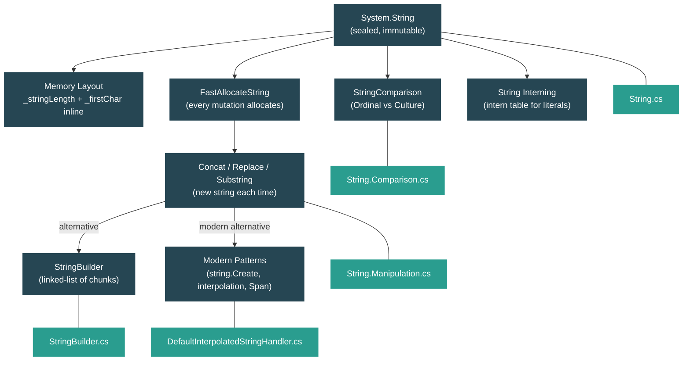

# Level 2: Practitioner — String Handling and Text Processing

> **Target profile:** Developer who uses strings constantly but doesn't understand immutability internals or optimal patterns
> **Estimated effort:** 3 hours
> **Prerequisites:** [Module 1.3 — The Type System](01-foundations-type-system.md)
> [Version en espanol](../es/02-practitioner-strings.md)

---

## Learning Objectives

By the end of this module you will be able to:

1. Describe the internal memory layout of a `System.String` object, including why characters are stored inline rather than in a separate array.
2. Explain why every `Concat`, `Replace`, `Substring`, and `Split` call allocates a new string, referencing the actual runtime source.
3. Articulate why string concatenation in a loop is an O(n^2) pattern and prove it by tracing through the implementation of `string.Concat(string, string)`.
4. Explain `StringBuilder`'s linked-list chunk architecture and when it outperforms concatenation.
5. Choose the correct `StringComparison` mode for a given scenario and explain the correctness risks of using the wrong one.
6. Use modern allocation-avoiding patterns: `string.Create`, interpolated string handlers, and `Span<char>` operations.

---

## Concept Map



---

## Curriculum

### Lesson 1 — String Internals: Immutable by Design

#### What you'll learn

How `System.String` is laid out in memory, why it is sealed and immutable, and what string interning does. You will read the actual fields the runtime uses to store every string in your program.

#### The concept

A string in .NET is not a wrapper around a `char[]`. Characters are stored *inline* in the object itself, right after the length field. This means creating a string requires exactly one heap allocation, not two (one for the object, one for an array).

The memory layout of a string "Hi" on a 64-bit system:

```
+---------------------------+
|  Object Header   (8 B)    |  sync block, GC bits
+---------------------------+
|  MethodTable*    (8 B)    |  pointer to String's type metadata
+---------------------------+
|  _stringLength   (4 B)    |  value: 2
+---------------------------+
|  _firstChar      (2 B)    |  'H'
|  char[1]         (2 B)    |  'i'
|  '\0'            (2 B)    |  null terminator (for C interop)
+---------------------------+
|  padding         (2 B)    |  alignment
+---------------------------+
  Total: ~28 bytes
```

Strings are both **length-prefixed** (`_stringLength`) and **null-terminated** (for interop with native C-style APIs). The characters are UTF-16 (`char` = 2 bytes each).

Three design decisions make this work:

1. **Sealed** -- no subclass can change the layout, so the runtime can trust the field positions.
2. **Immutable** -- because characters are inline and the runtime hands out references freely, mutation would corrupt shared state. Immutability is a safety guarantee.
3. **`MaxLength = 0x3FFFFFDF`** -- approximately 1 billion characters, coordinated with the native GC allocator in `gchelpers.cpp`.

#### In the source code

Open `src/libraries/System.Private.CoreLib/src/System/String.cs`:

```csharp
[Serializable]
[NonVersionable] // This only applies to field layout
public sealed partial class String
    : IComparable, IEnumerable, IConvertible, IEnumerable<char>,
      IComparable<string?>, IEquatable<string?>, ICloneable, ISpanParsable<string>
{
    internal const int MaxLength = 0x3FFFFFDF;

    // These fields map directly onto the fields in an EE StringObject.
    // See object.h for the layout.
    [NonSerialized] private readonly int _stringLength;
    [NonSerialized] private char _firstChar;
}
```

The comment is critical: *"These fields map directly onto the fields in an EE StringObject. See object.h for the layout."* The managed C# field order must match the native C++ structure exactly. `_firstChar` is not an array -- the remaining characters follow it in memory, accessed through pointer arithmetic by methods like `Concat`, `Replace`, and `Substring`.

Also notice that `String.Empty` is initialized by the execution engine at startup and is treated as an intrinsic by the JIT:

```csharp
[Intrinsic]
public static readonly string Empty;
```

**String interning** is handled by the runtime. In CoreCLR, the `Intern` and `IsInterned` methods live in `src/coreclr/System.Private.CoreLib/src/System/String.CoreCLR.cs`:

```csharp
public static string Intern(string str)
{
    ArgumentNullException.ThrowIfNull(str);
    Intern(new StringHandleOnStack(ref str!));
    return str;
}
```

The actual intern table is implemented in native code via a QCall. String literals in your source code are automatically interned by the runtime -- two identical literals in different parts of your code point to the same object.

#### Hands-on exercise

1. Verify interning behavior:
   ```csharp
   string a = "hello";
   string b = "hello";
   Console.WriteLine(ReferenceEquals(a, b)); // True -- same interned object

   string c = new string("hello".ToCharArray());
   Console.WriteLine(ReferenceEquals(a, c)); // False -- 'c' is a new object

   string d = string.Intern(c);
   Console.WriteLine(ReferenceEquals(a, d)); // True -- Intern returns the interned copy
   ```

2. Check `string.Empty`:
   ```csharp
   string e = "";
   Console.WriteLine(ReferenceEquals(e, string.Empty)); // True on modern runtimes
   ```

3. Open `src/libraries/System.Private.CoreLib/src/System/String.cs` and find the `_firstChar` field. Notice it is declared as a single `char`, not `char[]`. Then find `FastAllocateString` -- this is the method that allocates the exact right amount of memory for the string plus its inline characters.

#### Key takeaway

Strings store characters inline in the object. Immutability is not an arbitrary restriction -- it is a safety requirement because the runtime shares string references freely (through interning, through the `+` operator returning references, etc.). Every operation that "modifies" a string must allocate a new one.

#### Common misconception

> *"Strings are backed by a `char[]` internally."*
>
> Not since .NET's inception. The `_firstChar` field is a single `char`, and additional characters follow it in memory through the runtime's special allocation. There is no indirection to a separate array. This is more memory-efficient (one allocation instead of two) and more cache-friendly (the characters are adjacent to the object metadata).

---

### Lesson 2 — String Operations: What Allocates?

#### What you'll learn

Every string "modification" creates a new string on the heap. In this lesson you will trace through the source code of `Concat`, `Replace`, `Substring`, and `Split` to see exactly where the allocations happen and why loop concatenation is an O(n^2) disaster.

#### The concept

Because strings are immutable, every operation that produces a different string must:

1. Calculate the length of the result.
2. Call `FastAllocateString(length)` to allocate a new string on the heap.
3. Copy characters into the new string.
4. Return the new string.

This means `string result = a + b;` is compiled into `string.Concat(a, b)`, which allocates a new string of length `a.Length + b.Length` and copies both sets of characters into it.

**Why loop concatenation is O(n^2):** Consider building a string from 1,000 words:

```csharp
string result = "";
for (int i = 0; i < 1000; i++)
{
    result += words[i]; // calls string.Concat(result, words[i]) each iteration
}
```

On each iteration, `Concat` allocates a new string and copies *all* characters accumulated so far plus the new word. If each word is `w` characters long:

- Iteration 1: copies `w` characters
- Iteration 2: copies `2w` characters
- Iteration 3: copies `3w` characters
- ...
- Iteration n: copies `nw` characters

Total characters copied: `w * (1 + 2 + 3 + ... + n) = w * n*(n+1)/2 = O(n^2 * w)`.

For 1,000 words of 10 characters each, that is roughly 5 million character copies and 1,000 heap allocations -- all of which become garbage immediately except the last one.

#### In the source code

Open `src/libraries/System.Private.CoreLib/src/System/String.Manipulation.cs` and look at `Concat(string?, string?)`:

```csharp
public static string Concat(string? str0, string? str1)
{
    if (IsNullOrEmpty(str0))
    {
        if (IsNullOrEmpty(str1))
        {
            return Empty;
        }
        return str1;
    }

    if (IsNullOrEmpty(str1))
    {
        return str0;
    }

    int str0Length = str0.Length;
    int totalLength = str0Length + str1.Length;

    string result = FastAllocateString(totalLength);   // <-- NEW allocation
    CopyStringContent(result, 0, str0);                // <-- copy all of str0
    CopyStringContent(result, str0Length, str1);        // <-- copy all of str1

    return result;
}
```

Every call to this method allocates a fresh string via `FastAllocateString` and copies *both* inputs entirely via `CopyStringContent` (which calls `Buffer.Memmove`). In a loop, the first argument (`result`) grows every iteration, meaning you re-copy everything you have built so far.

**`Substring`** follows the same pattern. Open the same file and find `InternalSubString`:

```csharp
private string InternalSubString(int startIndex, int length)
{
    string result = FastAllocateString(length);

    Buffer.Memmove(
        elementCount: (uint)length,
        destination: ref result._firstChar,
        source: ref Unsafe.Add(ref _firstChar, (nint)(uint)startIndex));

    return result;
}
```

Every `Substring` call allocates a new string, even if you are extracting a tiny piece of a large string. This is why `ReadOnlySpan<char>` (via `.AsSpan()`) is preferred when you only need to read a slice.

**`Replace(string, string)`** tracks replacement indices on the stack using `ValueListBuilder`, then allocates one result string:

```csharp
public string Replace(string oldValue, string? newValue)
{
    ArgumentException.ThrowIfNullOrEmpty(oldValue);
    newValue ??= Empty;

    var replacementIndices = new ValueListBuilder<int>(stackalloc int[StackallocIntBufferSizeLimit]);
    // ... find all occurrences, then build one result string ...
}
```

This is smarter than doing repeated replacements -- it finds all matches first, then does a single allocation. But it still allocates one new string for the result.

**`Split`** returns a `string[]`, meaning it allocates the array *and* one new string per segment.

#### Hands-on exercise

1. Count allocations mentally. How many string allocations does this code cause?
   ```csharp
   string name = "World";
   string greeting = "Hello, " + name + "!";
   ```
   Answer: The compiler turns this into `string.Concat("Hello, ", name, "!")` (the 3-argument overload), which makes **1** allocation. The compiler is smart enough to batch these.

2. Now count this:
   ```csharp
   string result = "";
   for (int i = 0; i < 5; i++)
   {
       result += i.ToString();
   }
   ```
   Answer: Each `i.ToString()` allocates (5 strings). Each `+=` calls `Concat` and allocates (5 strings). Plus the initial `""` is interned (no allocation). Total: **10** allocations, of which 9 become garbage.

3. Open `String.Manipulation.cs` and find the `Concat(string?, string?, string?)` overload. Notice how it delegates to the 2-argument version when one input is null or empty -- this avoids unnecessary allocations for degenerate cases.

#### Key takeaway

Every string operation that produces a different result calls `FastAllocateString` and copies characters. A single concatenation is fine. Concatenation in a loop is O(n^2) because each iteration re-copies everything built so far. The fix is `StringBuilder`, `string.Create`, or `string.Join`.

#### Common misconception

> *"The compiler/JIT optimizes away string concatenation in loops."*
>
> It does not. The compiler will optimize `"a" + "b"` into `"ab"` at compile time (constant folding), and it will batch adjacent `+` operations into a multi-argument `Concat` call. But it cannot optimize a loop because the number of iterations is not known at compile time. You must use `StringBuilder` or `string.Join` explicitly.

---

### Lesson 3 — StringBuilder: Chunked Mutation

#### What you'll learn

`StringBuilder` avoids the O(n^2) concatenation problem by using a linked list of character buffers (chunks). You will see the actual data structure and understand when `StringBuilder` is the right tool.

#### The concept

`StringBuilder` is internally a **linked list of chunks**, where each chunk is a `char[]`. When you call `Append`, it writes characters into the current chunk. When that chunk is full, it allocates a new chunk and links them together.

```
StringBuilder (current chunk)
   m_ChunkChars:  [H|e|l|l|o|,| |W|o|r|l|d|_|_|_|_]  (16 chars, 12 used)
   m_ChunkLength: 12
   m_ChunkOffset: 26
   m_ChunkPrevious ──→  (previous chunk)
                           m_ChunkChars:  [T|h|i|s| |i|s| |a| |l|o|n|g|e|r|...]
                           m_ChunkLength: 26
                           m_ChunkOffset: 0
                           m_ChunkPrevious ──→ null
```

When you call `ToString()`, it walks the linked list from the end back to the beginning, allocates a single result string, and copies each chunk's characters into the correct position.

The key advantage: **`Append` does not re-copy existing characters**. It writes only the new characters into the current chunk (or allocates a new chunk if needed). This makes building a string incrementally O(n) instead of O(n^2).

#### In the source code

Open `src/libraries/System.Private.CoreLib/src/System/Text/StringBuilder.cs`:

```csharp
public sealed partial class StringBuilder : ISerializable
{
    // A StringBuilder is internally represented as a linked list of blocks
    // each of which holds a chunk of the string.
    internal char[] m_ChunkChars;
    internal StringBuilder? m_ChunkPrevious;
    internal int m_ChunkLength;
    internal int m_ChunkOffset;
    internal int m_MaxCapacity;

    internal const int DefaultCapacity = 16;
    internal const int MaxChunkSize = 8000;
}
```

The comments are illuminating. `MaxChunkSize = 8000` keeps chunk arrays below the Large Object Heap threshold (~85,000 bytes / ~40,000 chars), ensuring they are collected by Gen 0/1 GC instead of the more expensive Gen 2.

The `Append(string?)` method delegates to a private `Append(ref char, int)` that does the real work:

```csharp
private void Append(ref char value, int valueCount)
{
    if (valueCount != 0)
    {
        char[] chunkChars = m_ChunkChars;
        int chunkLength = m_ChunkLength;

        // Fast path: fits in current chunk
        if (((uint)chunkLength + (uint)valueCount) <= (uint)chunkChars.Length)
        {
            // Copy directly into current chunk
            Buffer.Memmove(ref destination, ref value, (nuint)valueCount);
            m_ChunkLength = chunkLength + valueCount;
        }
        else
        {
            AppendWithExpansion(ref value, valueCount);
        }
    }
}
```

Two paths:
1. **Fast path** -- the new data fits in the current chunk. Just `Memmove` the characters and update `m_ChunkLength`. No allocation.
2. **Slow path** (`AppendWithExpansion`) -- fill the rest of the current chunk, then allocate a new chunk and copy the remainder.

The `ToString()` method walks the linked list backwards:

```csharp
public override string ToString()
{
    if (Length == 0) return string.Empty;

    string result = string.FastAllocateString(Length);
    StringBuilder? chunk = this;
    do
    {
        if (chunk.m_ChunkLength > 0)
        {
            Buffer.Memmove(
                ref Unsafe.Add(ref result.GetRawStringData(), chunk.m_ChunkOffset),
                ref MemoryMarshal.GetArrayDataReference(chunk.m_ChunkChars),
                (nuint)chunk.m_ChunkLength);
        }
        chunk = chunk.m_ChunkPrevious;
    }
    while (chunk != null);

    return result;
}
```

One allocation for the final string, then it copies each chunk into the right position using the stored `m_ChunkOffset`.

#### Hands-on exercise

1. Compare the performance:
   ```csharp
   // BAD: O(n^2)
   string result = "";
   for (int i = 0; i < 10_000; i++)
       result += "x";

   // GOOD: O(n)
   var sb = new StringBuilder();
   for (int i = 0; i < 10_000; i++)
       sb.Append('x');
   string result2 = sb.ToString();
   ```
   Time both with `System.Diagnostics.Stopwatch`. The `StringBuilder` version should be orders of magnitude faster for large iteration counts.

2. Pre-size the builder if you know the approximate length:
   ```csharp
   var sb = new StringBuilder(capacity: 10_000);
   ```
   This avoids chunk expansion entirely if your data fits within the initial capacity.

3. Open `StringBuilder.cs` and find `MaxChunkSize = 8000`. Calculate: `8000 chars * 2 bytes/char = 16,000 bytes`, well below the 85,000-byte LOH threshold. This is deliberate -- it keeps chunk arrays in the small object heap for faster GC.

#### Key takeaway

`StringBuilder` replaces O(n^2) re-copying with O(n) appending by using a linked list of chunks. Use it when you are building a string incrementally in a loop or across many method calls. For simple cases (2-4 concatenations on one line), `string.Concat` or `+` is fine -- the compiler already batches those.

#### Common misconception

> *"`StringBuilder` is always faster than `+`."*
>
> Not for a small fixed number of concatenations. `string.Concat("Hello, ", name, "!")` does a single allocation and is faster than creating a `StringBuilder`, appending three times, and calling `ToString()`. The crossover point is typically around 4-6 concatenations, or any time you are concatenating in a loop.

---

### Lesson 4 — Comparison and Culture

#### What you'll learn

String comparison is one of the most common sources of subtle bugs. You will learn the difference between ordinal and culture-aware comparison, see how the runtime dispatches each `StringComparison` mode, and understand why choosing the wrong one can cause data corruption or security vulnerabilities.

#### The concept

.NET offers six comparison modes via the `StringComparison` enum:

| Value | Behavior | Use when... |
|---|---|---|
| `Ordinal` | Byte-by-byte UTF-16 comparison | Comparing identifiers, keys, file paths, protocol tokens |
| `OrdinalIgnoreCase` | Byte-by-byte with ASCII case folding | Case-insensitive technical comparisons (HTTP headers, XML tags) |
| `CurrentCulture` | Linguistic comparison using the thread's current culture | Displaying sorted data to users |
| `CurrentCultureIgnoreCase` | Linguistic, case-insensitive | User-facing case-insensitive search |
| `InvariantCulture` | Linguistic comparison using `CultureInfo.InvariantCulture` | Persisted data that must be consistent across machines |
| `InvariantCultureIgnoreCase` | Invariant, case-insensitive | Same, but case-insensitive |

**The critical rule:** Use `Ordinal` or `OrdinalIgnoreCase` for anything technical (dictionary keys, filenames, URLs, protocol strings). Use culture-aware comparison only for user-facing text.

Why this matters:

- In Turkish culture, `"FILE".ToLower()` produces `"fıle"` (with a dotless i), not `"file"`. An ordinal comparison of `"file"` and `"FILE"` using `ToLower()` in a Turkish locale will fail.
- The German eszett: `"strasse" == "straße"` is `true` under `InvariantCulture` but `false` under `Ordinal`.
- Sorting order varies between cultures: Swedish sorts "a" with ring above after "z", while English sorts it near "a".

#### In the source code

Open `src/libraries/System.Private.CoreLib/src/System/String.Comparison.cs` and look at `Compare(string?, string?, StringComparison)`:

```csharp
public static int Compare(string? strA, string? strB, StringComparison comparisonType)
{
    if (ReferenceEquals(strA, strB))
    {
        CheckStringComparison(comparisonType);
        return 0;
    }

    if (strA == null) { CheckStringComparison(comparisonType); return -1; }
    if (strB == null) { CheckStringComparison(comparisonType); return 1; }

    switch (comparisonType)
    {
        case StringComparison.CurrentCulture:
        case StringComparison.CurrentCultureIgnoreCase:
            return CultureInfo.CurrentCulture.CompareInfo.Compare(strA, strB,
                GetCaseCompareOfComparisonCulture(comparisonType));

        case StringComparison.InvariantCulture:
        case StringComparison.InvariantCultureIgnoreCase:
            return CompareInfo.Invariant.Compare(strA, strB,
                GetCaseCompareOfComparisonCulture(comparisonType));

        case StringComparison.Ordinal:
            return CompareOrdinalHelper(strA, strB);

        case StringComparison.OrdinalIgnoreCase:
            return Ordinal.CompareStringIgnoreCase(
                ref strA.GetRawStringData(), strA.Length,
                ref strB.GetRawStringData(), strB.Length);
    }
}
```

Notice the clear dispatch: ordinal goes to `CompareOrdinalHelper` (fast byte-by-byte comparison), while culture-aware modes delegate to `CompareInfo.Compare` (which invokes ICU or NLS depending on the platform).

The ordinal fast path in `CompareOrdinalHelper` is highly optimized:

```csharp
private static int CompareOrdinalHelper(string strA, string strB)
{
    if (strA._firstChar != strB._firstChar) goto DiffOffset0;
    if (Unsafe.Add(ref strA._firstChar, 1) != Unsafe.Add(ref strB._firstChar, 1)) goto DiffOffset1;
    // ... then falls through to SIMD-optimized SpanHelpers.SequenceCompareTo
}
```

It checks the first two characters manually (to quickly short-circuit common cases), then delegates to a vectorized comparison for the rest of the string.

The `Contains(string)` method shows another optimization. In `String.Searching.cs`:

```csharp
public bool Contains(string value)
{
    if (RuntimeHelpers.IsKnownConstant(value) && value.Length == 1)
    {
        return Contains(value[0]);  // avoid substring search for single-char constants
    }
    return SpanHelpers.IndexOf(ref _firstChar, Length, ref value._firstChar, value.Length) >= 0;
}
```

When the JIT can prove the argument is a constant single-character string (like `str.Contains("x")`), it rewrites the call to the cheaper single-character `Contains(char)` overload.

#### Hands-on exercise

1. Demonstrate the Turkish-I problem:
   ```csharp
   var turkish = new System.Globalization.CultureInfo("tr-TR");
   string upper = "FILE";
   string lower = upper.ToLower(turkish);
   Console.WriteLine(lower);                    // "fıle" (dotless i!)
   Console.WriteLine(lower == "file");           // False
   Console.WriteLine(string.Equals(upper, "file",
       StringComparison.OrdinalIgnoreCase));      // True -- ordinal is safe
   ```

2. Use the right comparison for dictionary keys:
   ```csharp
   // CORRECT: ordinal comparer for technical keys
   var headers = new Dictionary<string, string>(StringComparer.OrdinalIgnoreCase);
   headers["Content-Type"] = "text/html";
   Console.WriteLine(headers["content-type"]); // "text/html"
   ```

3. Open `String.Comparison.cs` and find the `EqualsHelper` method. Note that it calls `SpanHelpers.SequenceEqual` on the raw bytes -- this is the fastest possible equality check, comparing memory directly without any character-level interpretation.

#### Key takeaway

Always explicitly specify `StringComparison` when comparing strings. The parameterless overloads of `Equals`, `Compare`, `IndexOf`, `Contains`, `StartsWith`, and `EndsWith` use `CurrentCulture` by default, which is almost never what you want for technical comparisons. Use `Ordinal` or `OrdinalIgnoreCase` for identifiers, keys, and protocol strings.

#### Common misconception

> *"I can just use `.ToLower()` and compare with `==` for case-insensitive comparison."*
>
> This is wrong for two reasons: (1) `ToLower()` allocates a new string needlessly, and (2) it uses the current culture, which can produce unexpected results (the Turkish-I problem). Use `string.Equals(a, b, StringComparison.OrdinalIgnoreCase)` instead.

---

### Lesson 5 — Modern Patterns: string.Create, Interpolation, and Span

#### What you'll learn

Modern .NET provides ways to build strings with fewer allocations: `string.Create<TState>`, compiled interpolated string handlers, and `Span<char>`-based operations. You will see how these work at the source level and when to use each one.

#### The concept

**`string.Create<TState>`** lets you allocate a string of known length and then fill it via a `SpanAction<char, TState>` callback. The string is created once, you write into it, and the result is immutable from that point:

```csharp
string result = string.Create(10, 42, (span, state) =>
{
    // 'span' is a writable Span<char> backed by the new string's memory
    // 'state' is the 42 you passed in
    for (int i = 0; i < span.Length; i++)
        span[i] = (char)('0' + (state + i) % 10);
});
// result is now "2345678901"
```

This avoids intermediate allocations entirely -- you write directly into the string's buffer.

**Interpolated string handlers** (C# 10+) are the modern replacement for `string.Format`. When you write `$"Hello, {name}!"`, the compiler generates code using `DefaultInterpolatedStringHandler` instead of creating intermediate strings or calling `string.Format`:

```csharp
// What you write:
string greeting = $"Hello, {name}! You are {age} years old.";

// What the compiler generates (approximately):
var handler = new DefaultInterpolatedStringHandler(literalLength: 27, formattedCount: 2);
handler.AppendLiteral("Hello, ");
handler.AppendFormatted(name);
handler.AppendLiteral("! You are ");
handler.AppendFormatted(age);
handler.AppendLiteral(" years old.");
string greeting = handler.ToStringAndClear();
```

**`ReadOnlySpan<char>` and `AsSpan()`** let you work with substrings without allocating:

```csharp
string path = "/api/users/42/profile";

// BAD: allocates a new string
string segment = path.Substring(5, 5);  // "users"

// GOOD: no allocation, just a view into the original string
ReadOnlySpan<char> segment2 = path.AsSpan(5, 5);  // "users" as a span
```

#### In the source code

**`string.Create<TState>`** in `src/libraries/System.Private.CoreLib/src/System/String.cs`:

```csharp
public static string Create<TState>(int length, TState state, SpanAction<char, TState> action)
    where TState : allows ref struct
{
    if (action is null)
        ThrowHelper.ThrowArgumentNullException(ExceptionArgument.action);

    if (length <= 0)
    {
        if (length == 0)
            return Empty;
        throw new ArgumentOutOfRangeException(...);
    }

    string result = FastAllocateString(length);
    action(new Span<char>(ref result.GetRawStringData(), length), state);
    return result;
}
```

Notice: it allocates the string *first* via `FastAllocateString`, then passes a writable `Span<char>` to the callback. The callback writes directly into the string's character buffer. Once the callback returns, the string is treated as immutable. This is safe because the `Span` is stack-only and cannot escape the callback.

**`DefaultInterpolatedStringHandler`** in `src/libraries/System.Private.CoreLib/src/System/Runtime/CompilerServices/DefaultInterpolatedStringHandler.cs`:

```csharp
public ref struct DefaultInterpolatedStringHandler
{
    private const int GuessedLengthPerHole = 11;
    private const int MinimumArrayPoolLength = 256;

    private readonly IFormatProvider? _provider;
    private char[]? _arrayToReturnToPool;
    private Span<char> _chars;
    private int _pos;
}
```

It rents a `char[]` from `ArrayPool<char>.Shared` instead of allocating one, and returns it when `ToStringAndClear()` is called. This means interpolated strings in hot paths produce very little GC pressure -- the buffer is reused across calls.

The constructor pre-sizes the buffer:

```csharp
public DefaultInterpolatedStringHandler(int literalLength, int formattedCount)
{
    _chars = _arrayToReturnToPool = ArrayPool<char>.Shared.Rent(
        GetDefaultLength(literalLength, formattedCount));
    // where GetDefaultLength = literalLength + formattedCount * GuessedLengthPerHole
}
```

**Implicit span conversion** in `String.cs`:

```csharp
[Intrinsic]
public static implicit operator ReadOnlySpan<char>(string? value) =>
    value != null ? new ReadOnlySpan<char>(ref value.GetRawStringData(), value.Length) : default;
```

This is marked `[Intrinsic]` -- the JIT can inline this conversion to essentially zero cost. When you pass a `string` to a method that accepts `ReadOnlySpan<char>`, no allocation or copy occurs. You get a direct view into the string's character data.

#### Hands-on exercise

1. Use `string.Create` to build a hex string without intermediate allocations:
   ```csharp
   byte[] data = { 0xDE, 0xAD, 0xBE, 0xEF };
   string hex = string.Create(data.Length * 2, data, (span, bytes) =>
   {
       for (int i = 0; i < bytes.Length; i++)
       {
           span[i * 2] = "0123456789ABCDEF"[bytes[i] >> 4];
           span[i * 2 + 1] = "0123456789ABCDEF"[bytes[i] & 0xF];
       }
   });
   Console.WriteLine(hex); // "DEADBEEF"
   ```

2. Prefer `AsSpan()` over `Substring()` when you only need to read:
   ```csharp
   string csv = "Alice,30,Engineer";
   // Instead of:
   // string name = csv.Substring(0, csv.IndexOf(','));
   // Use:
   ReadOnlySpan<char> name = csv.AsSpan(0, csv.IndexOf(','));
   Console.WriteLine(name.ToString()); // "Alice" -- allocates only when you need the string
   ```

3. Use `string.Join` instead of manual `StringBuilder` for simple cases:
   ```csharp
   string[] words = { "Hello", "World", "!" };
   string joined = string.Join(' ', words); // single allocation
   ```

4. Open `DefaultInterpolatedStringHandler.cs` and find `MinimumArrayPoolLength = 256`. This means even a small interpolated string rents a 256-char buffer from the pool. The `GuessedLengthPerHole = 11` means the handler estimates each `{expression}` will produce about 11 characters.

#### Key takeaway

Modern .NET provides a spectrum of tools for string construction. For simple cases, `+` and `$""` are fine (the compiler optimizes them). For loops, use `StringBuilder`. For performance-critical code where you know the output length, use `string.Create`. For read-only substring access, use `AsSpan()`. The common thread is: reduce allocations by writing directly into the final buffer or avoiding copies altogether.

#### Common misconception

> *"Interpolated strings (`$""`) are just syntactic sugar for `string.Format` and are equally slow."*
>
> Since C# 10, interpolated strings use `DefaultInterpolatedStringHandler`, which rents a buffer from `ArrayPool` and avoids boxing value-type arguments. It is significantly faster than `string.Format` and produces less GC pressure. The old `string.Format` path is only used when you explicitly call `string.Format(...)`.

---

## Source Code Reading Guide

These are the key files for this module. Difficulty ratings reflect the conceptual complexity for a Level 2 reader.

| # | File | Difficulty | What to look for |
|---|---|---|---|
| 1 | `src/libraries/System.Private.CoreLib/src/System/String.cs` | One star | The `_stringLength` and `_firstChar` fields. `MaxLength`. `FastAllocateString`. The `string.Create<TState>` method. The implicit `ReadOnlySpan<char>` conversion. |
| 2 | `src/libraries/System.Private.CoreLib/src/System/String.Manipulation.cs` | Two stars | `Concat(string?, string?)` -- trace the allocation. `InternalSubString`. `Replace(string, string?)` -- the `ValueListBuilder` pattern. `Split` and its many overloads. |
| 3 | `src/libraries/System.Private.CoreLib/src/System/String.Searching.cs` | One star | `Contains(string)` -- the `IsKnownConstant` JIT optimization. `IndexOf(char)` delegating to `SpanHelpers.IndexOfChar`. |
| 4 | `src/libraries/System.Private.CoreLib/src/System/String.Comparison.cs` | Two stars | `Compare(string?, string?, StringComparison)` -- the six-way switch. `CompareOrdinalHelper` -- the first-two-chars fast path. `EqualsHelper` using `SequenceEqual`. |
| 5 | `src/libraries/System.Private.CoreLib/src/System/Text/StringBuilder.cs` | Two stars | The four chunk fields (`m_ChunkChars`, `m_ChunkPrevious`, `m_ChunkLength`, `m_ChunkOffset`). `DefaultCapacity = 16`. `MaxChunkSize = 8000`. The `Append` fast path vs `AppendWithExpansion`. `ToString()` walking the linked list. |
| 6 | `src/libraries/System.Private.CoreLib/src/System/Runtime/CompilerServices/DefaultInterpolatedStringHandler.cs` | Two stars | `GuessedLengthPerHole = 11`. `ArrayPool<char>.Shared.Rent`. The `ref struct` design preventing heap allocation of the handler itself. |
| 7 | `src/coreclr/System.Private.CoreLib/src/System/String.CoreCLR.cs` | One star | `Intern` and `IsInterned` -- the QCall bridge to native intern table. |

**Reading strategy**: Start with file 1 (String.cs) to understand the layout. Then read file 2 (String.Manipulation.cs) to see how `Concat` and `Substring` work -- this is where the O(n^2) problem becomes visceral. File 5 (StringBuilder.cs) shows the solution. Files 4 and 6 are independent deep dives into comparison and modern patterns.

---

## Diagnostic Tools and Commands

| Tool / Technique | What it shows | How to use |
|---|---|---|
| `dotnet-counters monitor` | Live GC allocation rate | `dotnet-counters monitor --process-id <pid> System.Runtime` -- watch `gc-heap-size` spike during loop concatenation |
| BenchmarkDotNet | Precise allocation and timing comparison | Compare `string +=`, `StringBuilder`, and `string.Create` with `[MemoryDiagnoser]` |
| [SharpLab](https://sharplab.io/) | View lowered C# for interpolated strings | Paste `$"Hello, {name}!"` and see the `DefaultInterpolatedStringHandler` code generated |
| Visual Studio Memory Profiler | Object allocations by type | Profile a loop concatenation to see thousands of short-lived `String` objects |
| `DOTNET_JitDisasm` | JIT disassembly | `DOTNET_JitDisasm=Contains` to see the JIT's treatment of `IsKnownConstant` optimization |
| `string.IsInterned()` | Check if a string is in the intern table | `Console.WriteLine(string.IsInterned(myString) is not null)` |

---

## Self-Assessment

### Questions

1. **Draw the memory layout of the string `"OK"` on a 64-bit system.** Include the object header, MethodTable pointer, `_stringLength`, `_firstChar`, subsequent characters, and null terminator. How many total bytes does it occupy?

2. **Explain why `result += word` in a loop of N iterations causes O(N^2) character copies.** Reference the specific line in `String.Manipulation.cs` where the allocation happens.

3. **A colleague writes `if (input.ToLower() == "file") { ... }`. Name two problems with this code.** What should they write instead?

4. **Why does `StringBuilder` use a linked list of chunks instead of a single resizable array?** What advantage does this have for GC? (Hint: what is `MaxChunkSize` and why was that value chosen?)

5. **When would you choose `string.Create<TState>` over `StringBuilder`?** When would `StringBuilder` still be better?

6. **What does `DefaultInterpolatedStringHandler` use instead of heap-allocating a `char[]`?** Why is this important in hot paths?

### Practical Challenge

Write a `FormatFileSizes` method that takes a `long[]` of byte counts and returns a single string like `"1.5 KB, 3.2 MB, 512 B"`. Implement it three ways:

1. Using `string.Join` and LINQ.
2. Using `StringBuilder`.
3. Using `string.Create` (you will need to calculate the exact length first, or use a two-pass approach).

Benchmark all three with BenchmarkDotNet and `[MemoryDiagnoser]`. Which allocates the least? Which is fastest for 10 items? For 10,000 items?

<details>
<summary>Hint</summary>

```csharp
// Approach 1: LINQ + Join (simplest, but allocates intermediate strings)
string result1 = string.Join(", ", sizes.Select(FormatSize));

// Approach 2: StringBuilder (good for large arrays)
var sb = new StringBuilder();
for (int i = 0; i < sizes.Length; i++)
{
    if (i > 0) sb.Append(", ");
    sb.Append(FormatSize(sizes[i]));
}
string result2 = sb.ToString();

// Approach 3: string.Create (lowest allocations but most complex)
// First pass: calculate total length
// Second pass: write into the span
```

</details>

---

## Connections

| Direction | Module | Relationship |
|---|---|---|
| **Previous** | [1.3 -- The Type System](01-foundations-type-system.md) | Lesson 5 in that module introduced string layout; this module goes deep on operations and performance. |
| **Related** | 2.1 -- Generics | `Dictionary<string, T>` performance depends on the string comparer you choose (Lesson 4). |
| **Related** | 2.3 -- Collections | `string.Split` returns arrays; `string.Join` consumes enumerables; understanding allocation matters for collection pipelines. |
| **Deeper** | 3.1 -- Memory Model: Span and Memory | `ReadOnlySpan<char>` from Lesson 5 is a gateway to the broader Span/Memory ecosystem. |
| **Deeper** | 3.x -- Globalization and ICU | Culture-aware comparison (Lesson 4) dispatches to ICU on modern .NET; a deeper module would cover the full globalization pipeline. |

---

## Glossary

| Term | Definition |
|---|---|
| **Immutable** | An object that cannot be modified after creation. `System.String` is immutable -- every "modification" creates a new string. |
| **`FastAllocateString`** | An internal runtime method that allocates a string of a given length on the managed heap. Called by every string-producing operation. |
| **String interning** | The process by which the runtime maintains a table of unique string instances. Identical string literals share the same object, reducing memory. |
| **Ordinal comparison** | Byte-by-byte comparison of UTF-16 code units. Fast, deterministic, culture-independent. Use for technical identifiers. |
| **Culture-aware comparison** | Comparison that respects linguistic rules (e.g., case folding, character equivalence, sort order). Varies by locale. Use for user-facing text. |
| **StringBuilder** | A mutable string builder that uses a linked list of `char[]` chunks. Avoids the O(n^2) cost of repeated concatenation. |
| **Chunk** | A `char[]` buffer within a `StringBuilder`. Each chunk holds up to `MaxChunkSize` (8,000) characters and is linked to the previous chunk. |
| **`DefaultInterpolatedStringHandler`** | A `ref struct` used by the C# compiler to implement interpolated strings. Rents buffers from `ArrayPool` to minimize allocations. |
| **`ReadOnlySpan<char>`** | A stack-only view into a contiguous region of characters. Can point into a string without copying, enabling zero-allocation substring operations. |
| **`string.Create<TState>`** | A method that allocates a string and lets you write directly into its character buffer via a `Span<char>` callback. Single allocation, no intermediate copies. |
| **`SpanHelpers`** | An internal class containing highly optimized (often SIMD-vectorized) helpers for searching and comparing character sequences. |

---

## References

| Resource | Type | Relevance |
|---|---|---|
| [.NET Source Browser -- System.String](https://source.dot.net/#System.Private.CoreLib/src/System/String.cs) | Source | Browsable, indexed version of the string source files |
| [Stephen Toub -- Performance Improvements in .NET 7 (String section)](https://devblogs.microsoft.com/dotnet/performance_improvements_in_net_7/#strings) | Blog | Detailed walkthrough of string optimizations with benchmarks |
| [Stephen Toub -- String Interpolation in C# 10 and .NET 6](https://devblogs.microsoft.com/dotnet/string-interpolation-in-c-10-and-net-6/) | Blog | Deep dive into `DefaultInterpolatedStringHandler` design and performance |
| [.NET API Guidelines -- String Usage](https://learn.microsoft.com/en-us/dotnet/standard/base-types/best-practices-strings) | Docs | Official guidance on `StringComparison` selection |
| [Pro .NET Memory Management -- Konrad Kokosa](https://prodotnetmemory.com/) | Book | Chapter on string internals, interning, and `StringBuilder` memory behavior |
| [BenchmarkDotNet](https://benchmarkdotnet.org/) | Tool | The standard tool for measuring string operation performance |

---

*Next module: 2.7 -- LINQ Internals and Performance Pitfalls*
