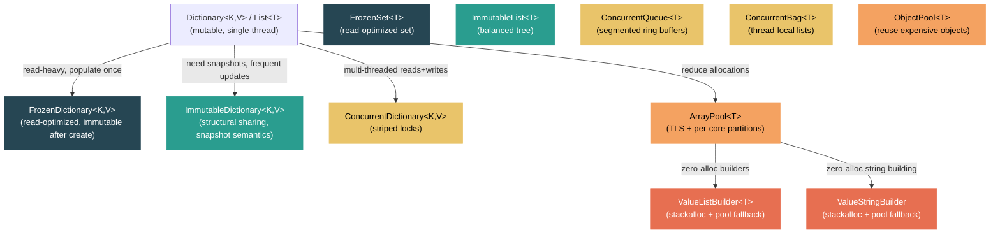

# Level 3: Advanced — High-Performance Collections and Pooling

> **Target profile:** Developer optimizing hot paths who needs to choose between frozen, immutable, concurrent, and pooled collection strategies
> **Estimated effort:** 5 hours
> **Prerequisites:** [Module 2.2 — Collections Deep Dive](02-practitioner-collections.md), [Module 3.1 — Memory Model](03-advanced-memory-model.md)
> [Version en espanol](../es/03-advanced-collections-perf.md)

---

## Learning Objectives

By the end of this module you will be able to:

1. Explain how `FrozenDictionary<TKey, TValue>` analyzes keys at construction time to select specialized lookup strategies, and why this makes reads significantly faster than `Dictionary<TKey, TValue>`.
2. Describe the structural sharing model of `ImmutableDictionary<TKey, TValue>` (sorted int32 key node tree + hash buckets) and contrast it with the flat, read-optimized layout of `FrozenDictionary`.
3. Trace a concurrent read and write through `ConcurrentDictionary<TKey, TValue>` and explain its striped locking scheme with growable lock arrays.
4. Explain the `ConcurrentQueue<T>` segment-based ring buffer architecture and its lock-free enqueue/dequeue fast paths.
5. Describe the tiered caching scheme of `SharedArrayPool<T>` — thread-local storage, per-core partitions, and bucket sizing — and explain why returning arrays promptly matters.
6. Implement the `stackalloc` + `ArrayPool` fallback pattern using `ValueListBuilder<T>` and `ValueStringBuilder`.
7. Choose the correct high-performance collection for a given workload based on read/write ratio, concurrency requirements, and allocation pressure.

---

## Concept Map



---

## Curriculum

### Lesson 1 — FrozenDictionary and FrozenSet: Read-Optimized Collections

#### What you'll learn

`FrozenDictionary<TKey, TValue>` and `FrozenSet<T>` are collections designed for a specific and common scenario: you populate a collection once, then read from it many times. The key insight is that by spending more time at construction, the runtime can build a data structure that is dramatically faster for lookups.

#### The creation pipeline

Open `src/libraries/System.Collections.Immutable/src/System/Collections/Frozen/FrozenDictionary.cs`. The static `Create` method accepts a `ReadOnlySpan<KeyValuePair<TKey, TValue>>` and an optional comparer:

```csharp
public static FrozenDictionary<TKey, TValue> Create<TKey, TValue>(
    IEqualityComparer<TKey>? comparer,
    params ReadOnlySpan<KeyValuePair<TKey, TValue>> source)
    where TKey : notnull
```

The data first goes into a standard `Dictionary<TKey, TValue>` (to deduplicate keys), then `CreateFromDictionary` analyzes the keys to select the best specialized implementation.

#### Specialization by key type

This is where `FrozenDictionary` gets its speed. Look at `CreateFromDictionary` (around line 157). The method branches based on key type and count:

**Value-type keys with default comparer:**
- **Dense integral keys** (`DenseIntegralFrozenDictionary`): If keys are integers in a dense range, uses direct array indexing — O(1) with no hashing at all.
- **Small value-type collections** (10 or fewer items): Uses `SmallValueTypeComparableFrozenDictionary` or `SmallValueTypeDefaultComparerFrozenDictionary`, which can do linear scans that beat hashing due to CPU cache effects.
- **Int32 keys**: `Int32FrozenDictionary` reuses the key storage as hash storage, eliminating an indirection.
- **General value types**: `ValueTypeDefaultComparerFrozenDictionary` enables devirtualization of `Equals`/`GetHashCode`.

**String keys with ordinal comparers:**
- **Length-bucketed dictionaries**: Groups strings by length, so lookups first check length (a single integer comparison) before doing any string comparison.
- **Substring-hashing dictionaries**: `KeyAnalyzer.Analyze` examines all keys to find the minimal substring that uniquely distinguishes them. Instead of hashing the entire string, it hashes just a few characters.

```csharp
// The analyzer finds the optimal substring position and length
KeyAnalyzer.AnalysisResults analysis = KeyAnalyzer.Analyze(
    keys,
    ReferenceEquals(stringComparer, StringComparer.OrdinalIgnoreCase),
    minLength, maxLength);
```

This analysis considers left-justified vs. right-justified substrings, case sensitivity, and whether all characters are ASCII (enabling SIMD-optimized paths).

#### Why reads are faster than Dictionary

| Optimization | Dictionary | FrozenDictionary |
|---|---|---|
| Hash function | Generic, full key | May hash only a substring |
| Bucket lookup | Modulo operation | May use direct array index |
| Collision handling | Linked chain walk | Minimal collisions by design |
| Virtual dispatch | Comparer interface calls | Devirtualized, potentially inlined |
| Memory layout | Entries array + bucket array | Specialized flat layout |

#### When to use FrozenDictionary

- Configuration lookup tables populated at startup
- Route tables in web frameworks
- Enum-to-string mappings
- Any "build once, read millions of times" scenario

#### When NOT to use FrozenDictionary

- Data that changes after construction (it is truly immutable)
- Very small dictionaries that are short-lived (construction cost not amortized)
- When you need concurrent writers (use `ConcurrentDictionary` instead)

#### Source reading exercise

1. Open `FrozenDictionary.cs` and trace the `CreateFromDictionary` method. For string keys, follow the path through `KeyAnalyzer.Analyze` and note how many different specialized implementations exist.
2. Open `SmallValueTypeComparableFrozenDictionary.cs`. How does it use the min/max range of keys to quickly rule out values without any hashing?

---

### Lesson 2 — Immutable Collections: Structural Sharing and Snapshot Semantics

#### What you'll learn

`ImmutableDictionary<TKey, TValue>` and its siblings provide a fundamentally different value proposition from `FrozenDictionary`. Where frozen collections optimize for read speed at the cost of mutability, immutable collections optimize for creating new versions efficiently through structural sharing.

#### The data structure

Open `src/libraries/System.Collections.Immutable/src/System/Collections/Immutable/ImmutableDictionary_2.cs`. The core fields reveal the architecture:

```csharp
private readonly int _count;
private readonly SortedInt32KeyNode<HashBucket> _root;
private readonly Comparers _comparers;
```

The dictionary is a **sorted tree of hash buckets**:
1. Keys are hashed to `int` values.
2. Those hash values are stored in a `SortedInt32KeyNode` — an AVL-balanced binary search tree sorted by hash code.
3. Each node contains a `HashBucket` that holds all key-value pairs with that hash code.

Open `ImmutableDictionary_2.HashBucket.cs` to see the bucket structure:

```csharp
internal readonly struct HashBucket
{
    private readonly KeyValuePair<TKey, TValue> _firstValue;
    private readonly ImmutableList<KeyValuePair<TKey, TValue>>.Node _additionalElements;
}
```

The first value is stored inline (common case: no collisions), with an `ImmutableList` node tree for overflow.

#### How structural sharing works

When you call `dictionary.Add(key, value)`:
1. The hash of `key` is computed.
2. The tree is traversed to the node for that hash bucket.
3. A **new path** is created from the root to the modified node — all other nodes are shared with the previous version.
4. A new `ImmutableDictionary` is returned with the new root.

This means that for a dictionary with N hash buckets, an `Add` operation creates approximately O(log N) new tree nodes. All other nodes are shared between old and new versions. Both versions remain valid and usable.

#### The performance trade-off

| Operation | Dictionary | ImmutableDictionary | FrozenDictionary |
|---|---|---|---|
| Lookup | O(1) avg | O(log N) + O(bucket) | O(1), faster than Dictionary |
| Add | O(1) amortized | O(log N) — new version | N/A (immutable) |
| Memory per version | N/A | Shared nodes | Full copy |
| Thread safety | None | Full (immutable) | Full (immutable) |

#### Builder pattern for bulk construction

Constructing an `ImmutableDictionary` item-by-item is expensive because each `Add` creates a new tree. Use the `Builder` for bulk operations:

```csharp
// Bad: O(n log n) total, n intermediate trees allocated
var dict = ImmutableDictionary<string, int>.Empty;
foreach (var kvp in source)
    dict = dict.Add(kvp.Key, kvp.Value);

// Good: O(n) amortized, single final freeze
var builder = ImmutableDictionary.CreateBuilder<string, int>();
foreach (var kvp in source)
    builder.Add(kvp.Key, kvp.Value);
ImmutableDictionary<string, int> dict = builder.ToImmutable();
```

The `Builder` uses mutable internal structures (like a regular dictionary) and freezes them in a single pass when you call `ToImmutable()`.

#### ImmutableDictionary vs FrozenDictionary — when to use which

| Scenario | Use |
|---|---|
| Populate once at startup, read forever | `FrozenDictionary` |
| Frequent updates producing new versions | `ImmutableDictionary` |
| Need to compare/diff old and new versions | `ImmutableDictionary` |
| Maximum read throughput is the goal | `FrozenDictionary` |
| Functional/event-sourced architecture | `ImmutableDictionary` |

#### Source reading exercise

1. In `ImmutableDictionary_2.cs`, find where `s_FreezeBucketAction` is used. What does "freezing" a bucket do, and when does it happen?
2. Open `ImmutableDictionary_2.Builder.cs`. How does the builder track whether its internal state has been shared with an immutable instance?

---

### Lesson 3 — Concurrent Collections: ConcurrentDictionary and ConcurrentQueue

#### What you'll learn

The `System.Collections.Concurrent` namespace provides collections designed for multi-threaded access without requiring external locking. These collections trade some single-threaded performance for safe, scalable concurrent access.

#### ConcurrentDictionary: striped locking

Open `src/libraries/System.Private.CoreLib/src/System/Collections/Concurrent/ConcurrentDictionary.cs`. The design is built around the `Tables` inner class:

```csharp
private sealed class Tables
{
    internal readonly IEqualityComparer<TKey>? _comparer;
    internal readonly VolatileNode[] _buckets;
    internal readonly ulong _fastModBucketsMultiplier;
    internal readonly object[] _locks;       // striped lock array
    internal readonly int[] _countPerLock;   // per-lock element count
}
```

The key design decisions:

**Striped locking:** Instead of one lock for the entire dictionary, `ConcurrentDictionary` uses an array of locks. Each lock guards a range of buckets. This means threads operating on different buckets can proceed in parallel.

```csharp
private const int MaxLockNumber = 1024;
private static int DefaultConcurrencyLevel => Environment.ProcessorCount;
```

The default concurrency level equals the processor count, and the lock array can grow up to 1024 as the dictionary grows (controlled by `_growLockArray`).

**Volatile tables reference:** The `_tables` field is `volatile`:

```csharp
private volatile Tables _tables;
```

On resize, a completely new `Tables` object is created and published atomically. Readers that captured the old reference continue to work safely against the old table.

**Budget-based resizing:** Each lock tracks the number of elements in its range via `_countPerLock`. A resize is triggered when any single lock's count exceeds `_budget`, not when a global load factor is exceeded. This avoids acquiring all locks just to check if a resize is needed.

#### Read path: mostly lock-free

Reading from `ConcurrentDictionary` does NOT acquire a lock. The `TryGetValue` method:
1. Reads the volatile `_tables` reference.
2. Computes the hash and bucket index.
3. Walks the bucket chain using `Volatile.Read` on each node reference.

This means reads scale linearly with reader threads — no contention.

#### Write path: acquire one lock

A write to `ConcurrentDictionary`:
1. Computes the hash and determines which lock to acquire.
2. Acquires only that one lock.
3. Modifies the bucket chain.
4. Checks if the lock's element count exceeds the budget; if so, triggers a resize (which acquires all locks).

#### ConcurrentQueue: segmented ring buffers

Open `src/libraries/System.Private.CoreLib/src/System/Collections/Concurrent/ConcurrentQueue.cs`. The architecture comment (line 24) is essential reading:

```
// This implementation provides an unbounded, multi-producer multi-consumer queue
// that supports the standard Enqueue/TryDequeue operations...
// It is composed of a linked list of bounded ring buffers, each of which has a
// head and a tail index, isolated from each other to minimize false sharing.
```

Key constants:
```csharp
private const int InitialSegmentLength = 32;
private const int MaxSegmentLength = 1024 * 1024;
```

Each segment is a fixed-size ring buffer. When a segment fills up:
1. It is "frozen" — no more enqueues allowed.
2. A new, larger segment is linked from it.
3. The `_tail` volatile reference is updated to point to the new segment.

When a segment is fully dequeued, the `_head` reference advances to the next segment and the old one becomes garbage.

**Why segments instead of a single array?** This avoids the stop-the-world resize that plagues `Queue<T>`. Enqueues and dequeues on different segments proceed with no contention at all.

#### Snapshot enumeration

`ConcurrentQueue` supports snapshot enumeration:
- All current segments are frozen for enqueues and preserved for observation.
- New enqueues go to new segments.
- Dequeues continue from existing segments without overwriting data.

This lets you safely enumerate the queue while other threads are modifying it, at the cost of allocating new segments for concurrent enqueues.

#### When to use concurrent collections

| Scenario | Collection | Why |
|---|---|---|
| Shared cache, many readers, occasional writers | `ConcurrentDictionary` | Lock-free reads, striped writes |
| Producer-consumer pipeline | `ConcurrentQueue` | Segment-based, minimal contention |
| Work stealing / thread-local work items | `ConcurrentBag` | Thread-local lists, no cross-thread contention on add |
| Read-heavy, data never changes | `FrozenDictionary` | Faster reads, no locking overhead |

#### Source reading exercise

1. In `ConcurrentDictionary.cs`, find the `TryGetValueInternal` method. Confirm that it acquires no locks. How does it safely read the bucket chain?
2. In `ConcurrentQueue.cs`, find the `Enqueue` method. How does it handle the transition from a full segment to a new one?

---

### Lesson 4 — ArrayPool and Object Pooling: Rental Semantics

#### What you'll learn

Allocating and garbage-collecting arrays on hot paths creates GC pressure that degrades throughput and increases tail latency. `ArrayPool<T>` addresses this by allowing you to rent and return arrays, avoiding allocations entirely on steady-state paths.

#### The tiered caching architecture

Open `src/libraries/System.Private.CoreLib/src/System/Buffers/SharedArrayPool.cs`. The class comment describes the three tiers:

```
// The implementation uses a tiered caching scheme, with a small per-thread cache
// for each array size, followed by a cache per array size shared by all threads,
// split into per-core stacks meant to be used by threads running on that core.
```

**Tier 1 — Thread-Local Storage (TLS):**
```csharp
[ThreadStatic]
private static SharedArrayPoolThreadLocalArray[]? t_tlsBuckets;
```

Each thread has one cached array per bucket (size class). This is checked first on `Rent` and populated first on `Return`. No locking is needed because thread-local storage is inherently thread-safe.

**Tier 2 — Per-Core Partitions:**
```csharp
private readonly SharedArrayPoolPartitions?[] _buckets = new SharedArrayPoolPartitions[NumBuckets];
```

If TLS has no array, the pool checks per-core partitions. These are lock-protected stacks, but contention is low because threads on the same core tend to share a partition.

**Tier 3 — New allocation:**
If both tiers are empty, a new array is allocated. For primitive types (except `bool`), `GC.AllocateUninitializedArray<T>` is used to avoid zero-initialization costs:

```csharp
buffer = typeof(T).IsPrimitive && typeof(T) != typeof(bool) ?
    GC.AllocateUninitializedArray<T>(minimumLength) :
    new T[minimumLength];
```

#### Bucket sizing

The pool uses 27 buckets, starting from length 16 and doubling up to ~1 billion:

```csharp
private const int NumBuckets = 27; // 16, 32, 64, ..., 1073741824
```

When you call `Rent(100)`, you get an array of length 128 (the next power of two). This is critical: **the returned array is always at least as large as requested, but may be larger**. Always use the requested length, not `array.Length`, when processing the result.

#### The Return path

On `Return`, the array goes through the tiers in reverse priority:

1. **Into TLS:** The returned array replaces whatever was cached in TLS. If TLS already had an array, that older array is pushed down to the per-core partition.
2. **Into per-core partition:** If the partition is full, the array is simply dropped (not returned). The pool prefers losing an array over unbounded growth.

```csharp
ref SharedArrayPoolThreadLocalArray tla = ref tlsBuckets[bucketIndex];
Array? prev = tla.Array;
tla = new SharedArrayPoolThreadLocalArray(array);
if (prev is not null)
{
    SharedArrayPoolPartitions partitionsForArraySize =
        _buckets[bucketIndex] ?? CreatePerCorePartitions(bucketIndex);
    returned = partitionsForArraySize.TryPush(prev);
}
```

#### Rental semantics: the rules

1. **Always return what you rent.** Not returning arrays degrades pool performance (it must allocate new ones).
2. **Never use the array after returning it.** Another thread may receive it from `Rent` immediately.
3. **Use `clearArray: true` on Return** if the array contained sensitive data or reference types that should be collected.
4. **Never assume the array is zeroed** on Rent. Contents are indeterminate.
5. **Track the requested length, not `array.Length`.** The pool may give you a larger array.

#### The try/finally pattern

```csharp
byte[] buffer = ArrayPool<byte>.Shared.Rent(minimumSize);
try
{
    // Use buffer[0..minimumSize]
    ProcessData(buffer.AsSpan(0, minimumSize));
}
finally
{
    ArrayPool<byte>.Shared.Return(buffer);
}
```

#### ObjectPool (Microsoft.Extensions.ObjectPool)

For objects more complex than arrays, `Microsoft.Extensions.ObjectPool` provides a similar rent/return pattern. It is commonly used in ASP.NET Core for `StringBuilder` instances and similar reusable objects. The pattern is the same: rent, use, return.

The key difference from `ArrayPool`:
- `ArrayPool` pools arrays by size bucket.
- `ObjectPool` pools arbitrary objects and requires a factory (`IPooledObjectPolicy<T>`) that knows how to create and reset them.

#### Source reading exercise

1. In `SharedArrayPool.cs`, trace the `Rent` method from start to finish. Count how many times a lock is acquired in the best case (TLS hit) vs. the worst case (allocation).
2. Find the trimming callback registration (`_trimCallbackCreated`). What triggers the pool to release cached arrays back to the GC?

---

### Lesson 5 — Stack-Allocated Builders: ValueListBuilder and ValueStringBuilder

#### What you'll learn

When building a list or string on a hot path, even renting from `ArrayPool` introduces overhead (the pool lookup, the return, the `try/finally`). For small, known-bounded outputs, the runtime uses `ref struct` builders that start on the stack and fall back to `ArrayPool` only if the initial capacity is exceeded.

#### ValueListBuilder&lt;T&gt;

Open `src/libraries/Common/src/System/Collections/Generic/ValueListBuilder.cs`. This is an `internal ref partial struct`:

```csharp
internal ref partial struct ValueListBuilder<T>
{
    private Span<T> _span;
    private T[]? _arrayFromPool;
    private int _pos;
}
```

The pattern:
1. Construct with a `stackalloc`-ed span for the common case.
2. If the data exceeds the stack buffer, `Grow` rents from `ArrayPool`.
3. `Dispose` returns any rented array.

```csharp
// Usage pattern throughout the runtime:
var vlb = new ValueListBuilder<char>(stackalloc char[256]);
// ... append items ...
ReadOnlySpan<char> result = vlb.AsSpan();
// ... use result ...
vlb.Dispose();
```

**The Grow method** (line 206) implements the doubling strategy:

```csharp
int nextCapacity = Math.Max(
    _span.Length != 0 ? _span.Length * 2 : 4,
    _pos + additionalCapacityBeyondPos);
T[] array = ArrayPool<T>.Shared.Rent(nextCapacity);
_span.CopyTo(array);
```

When growing, it copies from the current span (which might be stack memory) into the rented array. The previous rented array (if any) is returned to the pool, and `_span` is reassigned to the new array.

**Disposal with reference clearing:** For types containing references, the old array is cleared before being returned to the pool, preventing the pool from inadvertently rooting objects:

```csharp
if (RuntimeHelpers.IsReferenceOrContainsReferences<T>())
{
    ArrayPool<T>.Shared.Return(toReturn, pos);
}
else
{
    ArrayPool<T>.Shared.Return(toReturn);
}
```

#### ValueStringBuilder

Open `src/libraries/Common/src/System/Text/ValueStringBuilder.cs`. It follows the same pattern, specialized for `char`:

```csharp
internal ref partial struct ValueStringBuilder
{
    private char[]? _arrayToReturnToPool;
    private Span<char> _chars;
    private int _pos;
}
```

Key features:
- **`ToString()` disposes automatically:** Calling `ToString()` creates the string and calls `Dispose()`, making it safe to use in a single expression.
- **Pinnable reference:** `GetPinnableReference()` enables `fixed (char* c = builder)` for interop scenarios.
- **`NullTerminate()`** appends a NUL character without advancing `_pos`, useful for passing to native code.

#### The stackalloc + ArrayPool fallback pattern

This pattern appears hundreds of times throughout the runtime. Here is the general form:

```csharp
// Choose a stack size that covers the common case
const int StackBufferSize = 256;

// stackalloc for small, ArrayPool for large
char[]? rentedArray = null;
Span<char> buffer = inputLength <= StackBufferSize
    ? stackalloc char[StackBufferSize]
    : (rentedArray = ArrayPool<char>.Shared.Rent(inputLength));

try
{
    // Work with buffer
    int written = FormatInto(buffer);
    ProcessResult(buffer.Slice(0, written));
}
finally
{
    if (rentedArray is not null)
    {
        ArrayPool<char>.Shared.Return(rentedArray);
    }
}
```

This gives you:
- **Zero allocations** for the common case (small inputs stay on the stack).
- **No GC pressure** for the uncommon case (large inputs use pooled arrays).
- **No unbounded stack growth** (the `stackalloc` size is constant).

#### Why ref struct matters

Both `ValueListBuilder<T>` and `ValueStringBuilder` are `ref struct`s. This means:
- They can contain `Span<T>` fields (which point to stack memory).
- They cannot be boxed, stored in fields, or captured by lambdas/`async` methods.
- The compiler enforces that they live on the stack, making it safe to reference `stackalloc` memory.

#### Source reading exercise

1. Search for `new ValueListBuilder<` in `src/libraries/System.Private.CoreLib/src`. Pick two call sites and note the `stackalloc` size chosen. What heuristic determines the stack buffer size?
2. In `ValueStringBuilder.cs`, look at the `ToString()` method. Why does it call `Dispose()` after creating the string? What would happen if it did not?

---

### Lesson 6 — Choosing High-Performance Collections: A Decision Matrix

#### What you'll learn

The .NET runtime provides many collection types that overlap in functionality but differ dramatically in performance characteristics. This lesson synthesizes the previous five into a practical decision framework.

#### Decision matrix by scenario

| Scenario | Best choice | Why |
|---|---|---|
| Configuration loaded at startup, read on every request | `FrozenDictionary` | Specialized lookup strategies, no locking overhead |
| Route table / enum mapping, known at compile time | `FrozenDictionary` / `FrozenSet` | Analyzed key structure enables substring hashing |
| Event-sourced state, need old + new versions | `ImmutableDictionary` | Structural sharing, O(log N) per mutation |
| Functional pipeline passing state through transforms | `ImmutableList` / `ImmutableArray` | Snapshot semantics, no defensive copying |
| Shared cache, high read volume, occasional writes | `ConcurrentDictionary` | Lock-free reads, striped writes |
| Producer-consumer work queue | `ConcurrentQueue` | Segment-based, minimal contention, bounded memory |
| Thread-local work items with stealing | `ConcurrentBag` | Per-thread lists, no contention on add |
| Temporary buffer on a hot path, size bounded | `stackalloc` + `Span<T>` | Zero allocation, stack-fast |
| Temporary buffer, size unknown but usually small | `ValueListBuilder` / `ValueStringBuilder` | Stack start, pool fallback |
| Repeated array allocation of similar sizes | `ArrayPool<T>.Shared.Rent` | Avoids GC pressure, tiered caching |

#### Decision tree

```
Need a collection?
|
+-- Data changes after creation?
|   |
|   +-- YES: Need thread safety?
|   |   |
|   |   +-- YES: ConcurrentDictionary / ConcurrentQueue / ConcurrentBag
|   |   |
|   |   +-- NO: Need old versions?
|   |       |
|   |       +-- YES: ImmutableDictionary / ImmutableList
|   |       |
|   |       +-- NO: Dictionary / List (standard mutable)
|   |
|   +-- NO: FrozenDictionary / FrozenSet
|
Need a temporary buffer?
|
+-- Size known and small (< 512 bytes)?
|   +-- stackalloc + Span<T>
|
+-- Size usually small, occasionally large?
|   +-- ValueListBuilder / ValueStringBuilder
|
+-- Size always large or unpredictable?
    +-- ArrayPool<T>.Shared.Rent/Return
```

#### Performance characteristics comparison

| Collection | Read | Write | Memory overhead | GC pressure | Thread safety |
|---|---|---|---|---|---|
| `Dictionary<K,V>` | O(1) | O(1) amortized | Low | Resize allocs | None |
| `FrozenDictionary<K,V>` | O(1), faster | N/A | Low-medium | Construction only | Full (immutable) |
| `ImmutableDictionary<K,V>` | O(log N) | O(log N) per version | Higher (tree nodes) | Per-mutation | Full (immutable) |
| `ConcurrentDictionary<K,V>` | O(1), no lock | O(1), one lock | Medium (lock array) | Resize allocs | Full (lock-based) |
| `ConcurrentQueue<T>` | O(1), lock-free | O(1), lock-free | Medium (segments) | Segment allocs | Full (lock-free) |

#### Common pitfalls

1. **Using `ImmutableDictionary` when `FrozenDictionary` suffices.** If data is populated once and never modified, `FrozenDictionary` reads are an order of magnitude faster (O(1) vs O(log N)).

2. **Using `ConcurrentDictionary` for read-only data.** `FrozenDictionary` has no locking overhead and uses specialized hash functions. `ConcurrentDictionary` still pays for volatile reads and the striped lock infrastructure even when no writes occur.

3. **Building `ImmutableDictionary` item-by-item.** Always use the `Builder` pattern for bulk construction. Each `Add` on an `ImmutableDictionary` creates a new tree root.

4. **Forgetting to return pooled arrays.** Leaked arrays degrade `ArrayPool` performance. Use `try/finally` or the `ValueListBuilder` pattern that handles return automatically.

5. **Assuming pooled arrays are zeroed.** They are not (unless the previous renter passed `clearArray: true`). Always overwrite or slice to the exact length you need.

6. **Using `stackalloc` with unbounded sizes.** This risks stack overflow. Always cap the `stackalloc` size and fall back to `ArrayPool` for larger inputs.

7. **Using `ConcurrentDictionary.Count` in hot paths.** `Count` must aggregate `_countPerLock` across all locks. Use `IsEmpty` for emptiness checks.

#### Benchmark guidance

When deciding between these collections for your workload, measure with BenchmarkDotNet:

```csharp
[MemoryDiagnoser]
public class CollectionLookupBenchmarks
{
    private Dictionary<string, int> _dict;
    private FrozenDictionary<string, int> _frozen;
    private ConcurrentDictionary<string, int> _concurrent;
    private ImmutableDictionary<string, int> _immutable;

    [GlobalSetup]
    public void Setup()
    {
        var data = Enumerable.Range(0, 1000)
            .Select(i => KeyValuePair.Create($"key_{i}", i))
            .ToArray();

        _dict = new Dictionary<string, int>(data);
        _frozen = data.ToFrozenDictionary();
        _concurrent = new ConcurrentDictionary<string, int>(data);
        _immutable = data.ToImmutableDictionary();
    }

    [Benchmark(Baseline = true)]
    public int Dictionary() => _dict["key_500"];

    [Benchmark]
    public int Frozen() => _frozen["key_500"];

    [Benchmark]
    public int Concurrent() => _concurrent["key_500"];

    [Benchmark]
    public int Immutable() => _immutable["key_500"];
}
```

Typical results (relative to `Dictionary` = 1.0x):
- `FrozenDictionary`: ~0.5-0.7x (faster)
- `ConcurrentDictionary`: ~1.2-1.5x (slightly slower due to volatile reads)
- `ImmutableDictionary`: ~3-5x (slower due to tree traversal)

#### Source reading exercise

1. Write a benchmark that compares `ArrayPool<byte>.Shared.Rent(1024)` + `Return` vs. `new byte[1024]` in a tight loop. Measure both throughput and `Gen0` collections.
2. Create a `FrozenDictionary` from 100 string keys and inspect it with a debugger. What concrete type was selected? Try again with `int` keys — what type is selected?

---

## Summary

This module covered the high-performance collection landscape in .NET:

- **FrozenDictionary/FrozenSet** trade construction time for dramatically faster reads through key analysis and specialized implementations. Use them for any populate-once, read-many scenario.
- **ImmutableDictionary** and its siblings provide snapshot semantics through structural sharing. They shine in functional architectures where you need to compare versions or pass state through transformations.
- **ConcurrentDictionary** uses striped locking and lock-free reads to scale across cores. **ConcurrentQueue** uses segmented ring buffers for minimal-contention producer-consumer patterns.
- **ArrayPool** eliminates allocation pressure through a tiered TLS + per-core caching scheme. Always return what you rent.
- **ValueListBuilder** and **ValueStringBuilder** combine `stackalloc` with `ArrayPool` fallback for zero-allocation builders on hot paths.

The most common mistake is choosing a collection based on its interface rather than its performance profile. Use the decision matrix from Lesson 6 to match your workload to the right collection, and always validate with benchmarks.

---

## Further Reading

- Source: `src/libraries/System.Collections.Immutable/src/System/Collections/Frozen/` — all frozen collection implementations
- Source: `src/libraries/System.Collections.Immutable/src/System/Collections/Immutable/` — immutable collection tree structures
- Source: `src/libraries/System.Private.CoreLib/src/System/Collections/Concurrent/` — concurrent collection implementations
- Source: `src/libraries/System.Private.CoreLib/src/System/Buffers/SharedArrayPool.cs` — the pool's tiered caching
- Source: `src/libraries/Common/src/System/Collections/Generic/ValueListBuilder.cs` — the stackalloc + pool pattern
- Source: `src/libraries/Common/src/System/Text/ValueStringBuilder.cs` — zero-alloc string building
- Docs: `docs/coding-guidelines/` — coding conventions used in the implementations
