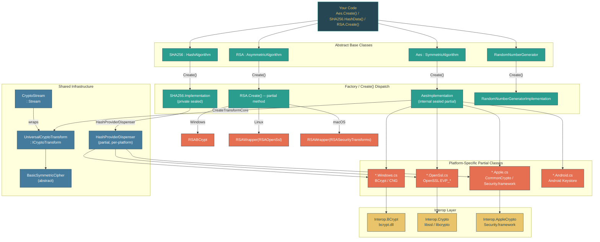

# Level 3: Advanced -- Cryptography and Security Primitives

> **Target profile:** Developer who uses crypto APIs (AES, SHA256, RSA, X509Certificate2) but does not understand how .NET abstracts across platform-specific native crypto backends
> **Estimated effort:** 4 hours
> **Prerequisites:** Level 2 complete, Module 3.10 (Native Interop / basic P/Invoke understanding)
> [Version en espanol](../es/03-advanced-cryptography.md)

---

## Learning Objectives

After completing this module, you will be able to:

1. **Explain** the abstract-base-class + factory pattern used throughout `System.Security.Cryptography` and why `Aes.Create()` returns a different concrete type on each platform.
2. **Trace** a call from `Aes.Create()` through `AesImplementation` to platform-specific partial classes that invoke CNG (Windows), OpenSSL (Linux), or Apple CommonCrypto (macOS).
3. **Describe** the `Interop.BCrypt`, `Interop.Crypto`, and `Interop.AppleCrypto` layers and how they use `LibraryImport` to call native libraries.
4. **Articulate** the CryptoStream / ICryptoTransform pipeline for streaming symmetric encryption and how `UniversalCryptoTransform` bridges all platforms.
5. **Explain** how `SHA256.HashData` reaches `HashProviderDispenser`, which routes to `HashProviderCng` (Windows) or OpenSSL's `EVP_Digest` (Linux).
6. **Describe** how `Rfc2898DeriveBytes` and `Pbkdf2Implementation` delegate to BCrypt's `BCryptKeyDerivation` (Windows) or OpenSSL's `PKCS5_PBKDF2_HMAC` (Linux).
7. **Navigate** the `X509Certificate2` class and understand how certificate stores are abstracted per platform.
8. **Read** the RSA platform-dispatch pattern (`RSA.Create()` returning `RSABCrypt` on Windows vs `RSAWrapper(RSAOpenSsl())` on Linux) and apply the pattern to other algorithms.

---

## Concept Map



---

## Curriculum

### Lesson 3.8.1: The Crypto Architecture -- Abstract Base Classes and Platform Dispatch

**What you'll learn:** .NET cryptography is built on a pattern where abstract base classes define the public API surface and static `Create()` factory methods return platform-specific implementations. The same call compiles and runs on every OS, but the native crypto backend is entirely different.

**The concept:**

Every major crypto algorithm in .NET follows the same structural pattern:

```
AbstractAlgorithm (public API surface)
    |
    +-- Create() factory method returns...
    |
    +-- InternalImplementation (internal sealed partial class)
            |
            +-- InternalImplementation.Windows.cs  -> BCrypt / CNG
            +-- InternalImplementation.OpenSsl.cs  -> OpenSSL libcrypto
            +-- InternalImplementation.Apple.cs    -> CommonCrypto
            +-- InternalImplementation.Android.cs  -> Android Keystore
```

Start with `Aes`. The public class is abstract and defines the contract:

```csharp
// src/libraries/System.Security.Cryptography/src/System/Security/Cryptography/Aes.cs, line 12
public abstract class Aes : SymmetricAlgorithm
{
    protected Aes()
    {
        LegalBlockSizesValue = s_legalBlockSizes.CloneKeySizesArray();
        LegalKeySizesValue = s_legalKeySizes.CloneKeySizesArray();

        BlockSizeValue = 128;
        FeedbackSizeValue = 8;
        KeySizeValue = 256;
        ModeValue = CipherMode.CBC;
    }

    [UnsupportedOSPlatform("browser")]
    public static new Aes Create()
    {
        return new AesImplementation();
    }
```

The `Create()` method returns `AesImplementation`, an `internal sealed partial class`. The word "partial" is the key -- the class is split across multiple files, one per platform:

- `AesImplementation.cs` -- shared logic (key management, `CreateEncryptor`, `CreateDecryptor`)
- `AesImplementation.Windows.cs` -- calls BCrypt via `BasicSymmetricCipherBCrypt`
- `AesImplementation.OpenSsl.cs` -- calls OpenSSL via `OpenSslCipher`
- `AesImplementation.Apple.cs` -- calls CommonCrypto via `AppleCCCryptor`
- `AesImplementation.Android.cs` -- calls OpenSSL (Android bundles its own OpenSSL)

Only one platform file is compiled per target, controlled by MSBuild conditions in the `.csproj`. This means the shared `AesImplementation.cs` can call `CreateTransformCore(...)` without knowing which platform variant provides it -- the compiler resolves it at build time.

The same pattern applies to hashing. `SHA256` is abstract and its `Create()` method returns a private nested `Implementation` class:

```csharp
// src/libraries/System.Security.Cryptography/src/System/Security/Cryptography/SHA256.cs, line 43
public static new SHA256 Create() => new Implementation();
```

The `Implementation` class delegates to `HashProviderDispenser`, which is itself a partial class with platform-specific files:

```csharp
// SHA256.cs, line 193
private sealed class Implementation : SHA256
{
    private readonly HashProvider _hashProvider;

    public Implementation()
    {
        _hashProvider = HashProviderDispenser.CreateHashProvider(HashAlgorithmNames.SHA256);
    }
```

For asymmetric algorithms, the pattern uses partial methods instead. `RSA.Create()` is declared as `public static new partial RSA Create();` -- each platform provides the body:

```csharp
// RSA.Create.Windows.cs
public static new partial RSA Create()
{
    return new RSABCrypt();
}

// RSA.Create.OpenSsl.cs
public static new partial RSA Create()
{
    return new RSAWrapper(new RSAOpenSsl());
}
```

**Why this pattern?** Cryptography is a domain where you cannot afford a managed fallback. Each OS provides a FIPS-validated, hardware-accelerated crypto library. By dispatching at the factory level, .NET can:
1. Use the OS-certified implementation (important for compliance)
2. Access hardware acceleration (AES-NI via CNG, OpenSSL, etc.)
3. Avoid shipping crypto primitives in managed code (security risk)
4. Support OS-specific key storage (Windows certificate store, macOS Keychain, etc.)

**In the source code:**
- `src/libraries/System.Security.Cryptography/src/System/Security/Cryptography/Aes.cs` -- Abstract base class with `Create()` factory
- `src/libraries/System.Security.Cryptography/src/System/Security/Cryptography/AesImplementation.cs` -- Shared partial class with key management
- `src/libraries/System.Security.Cryptography/src/System/Security/Cryptography/AesImplementation.Windows.cs` -- Windows `CreateTransformCore` using BCrypt
- `src/libraries/System.Security.Cryptography/src/System/Security/Cryptography/AesImplementation.OpenSsl.cs` -- Linux `CreateTransformCore` using OpenSSL
- `src/libraries/System.Security.Cryptography/src/System/Security/Cryptography/AesImplementation.Apple.cs` -- macOS `CreateTransformCore` using CommonCrypto
- `src/libraries/System.Security.Cryptography/src/System/Security/Cryptography/RSA.cs` -- Abstract partial class with `partial Create()` declaration
- `src/libraries/System.Security.Cryptography/src/System/Security/Cryptography/RSA.Create.Windows.cs` -- Returns `RSABCrypt`
- `src/libraries/System.Security.Cryptography/src/System/Security/Cryptography/RSA.Create.OpenSsl.cs` -- Returns `RSAWrapper(RSAOpenSsl())`

**Hands-on exercise:**

1. Open `Aes.cs` and confirm that `Create()` returns `new AesImplementation()`. Then open all five `AesImplementation.*.cs` files side by side. Note that each defines the same `CreateTransformCore` method but wraps a different native cipher type.
2. Open `SHA256.cs`, find the nested `Implementation` class, and trace how it delegates to `HashProviderDispenser.CreateHashProvider`. Then open `HashProviderDispenser.Windows.cs` and `HashProviderDispenser.OpenSsl.cs` to see the divergence.
3. Open `RSA.Create.Windows.cs` and `RSA.Create.OpenSsl.cs`. Notice that Windows returns `RSABCrypt` directly while Linux wraps `RSAOpenSsl` in an `RSAWrapper`. Search for `RSAWrapper` to understand why this indirection exists.
4. Search the `System.Security.Cryptography` directory for all files matching `*.NotSupported.cs`. These are the browser/WASM stubs that throw `PlatformNotSupportedException`. Count how many algorithms are unsupported on WebAssembly.

**Key takeaway:** .NET cryptography uses abstract base classes with `Create()` factories that return platform-specific implementations via C# partial classes. The same API surface compiles on every OS, but the native crypto backend is entirely different. This is the central design pattern of the entire library.

---

### Lesson 3.8.2: Platform Abstraction -- CNG, OpenSSL, and Apple CommonCrypto

**What you'll learn:** Each platform's cryptographic backend has different capabilities, APIs, and handle types. The `Interop` layer maps these differences into a uniform internal interface.

**The concept:**

.NET targets four major crypto backends:

| Platform | Native Library | Interop Namespace | Key Handle Type |
|----------|---------------|-------------------|-----------------|
| Windows | BCrypt.dll / NCrypt.dll (CNG) | `Interop.BCrypt`, `Interop.NCrypt` | `SafeAlgorithmHandle`, `SafeKeyHandle` |
| Linux | libcrypto (OpenSSL) | `Interop.Crypto` | `SafeEvpCipherCtxHandle`, `SafeEvpPKeyHandle` |
| macOS | Security.framework (CommonCrypto) | `Interop.AppleCrypto` | `SafeAppleCryptorHandle` |
| Android | Bundled OpenSSL | `Interop.Crypto` (same as Linux) | Same as Linux |

The Interop layer lives in `src/libraries/Common/src/Interop/`, organized by OS and native library:

```
Common/src/Interop/
    Windows/
        BCrypt/
            Interop.BCryptGenRandom.cs
            Interop.BCryptEncryptDecrypt.cs
            Interop.BCryptGenerateSymmetricKey.cs
            ...
    Unix/
        System.Security.Cryptography.Native/
            Interop.Crypto.cs
            Interop.EvpPkey.Rsa.cs
            ...
```

Each Interop file declares a `LibraryImport` (source-generated P/Invoke) binding. Here is the Windows random number generator:

```csharp
// src/libraries/Common/src/Interop/Windows/BCrypt/Interop.BCryptGenRandom.cs
internal static partial class Interop
{
    internal static partial class BCrypt
    {
        internal const int BCRYPT_USE_SYSTEM_PREFERRED_RNG = 0x00000002;

        [LibraryImport(Libraries.BCrypt)]
        internal static unsafe partial NTSTATUS BCryptGenRandom(
            IntPtr hAlgorithm, byte* pbBuffer, int cbBuffer, int dwFlags);
    }
}
```

And the implementation that calls it:

```csharp
// RandomNumberGeneratorImplementation.Windows.cs
internal sealed partial class RandomNumberGeneratorImplementation
{
    private static unsafe void GetBytes(byte* pbBuffer, int count)
    {
        Interop.BCrypt.NTSTATUS status = Interop.BCrypt.BCryptGenRandom(
            IntPtr.Zero, pbBuffer, count,
            Interop.BCrypt.BCRYPT_USE_SYSTEM_PREFERRED_RNG);
        if (status != Interop.BCrypt.NTSTATUS.STATUS_SUCCESS)
            throw Interop.BCrypt.CreateCryptographicException(status);
    }
}
```

The OpenSSL equivalent:

```csharp
// RandomNumberGeneratorImplementation.OpenSsl.cs
internal sealed partial class RandomNumberGeneratorImplementation
{
    private static unsafe void GetBytes(byte* pbBuffer, int count)
    {
        if (!Interop.Crypto.GetRandomBytes(pbBuffer, count))
        {
            throw Interop.Crypto.CreateOpenSslCryptographicException();
        }
    }
}
```

The partial class mechanism means `RandomNumberGeneratorImplementation` has a single shared file defining `GetBytes(byte[])`, `GetBytes(Span<byte>)`, etc., and each calls the platform-specific `GetBytes(byte*, int)` that only exists in one of the platform files.

**CNG vs. OpenSSL -- fundamental differences:**

CNG (Cryptography Next Generation) is handle-based and stateful. You open an algorithm provider, generate a key, and perform operations against the key handle:
```
BCryptOpenAlgorithmProvider -> BCryptGenerateSymmetricKey -> BCryptEncrypt/BCryptDecrypt
```

OpenSSL is context-based. You get a static algorithm pointer (e.g., `EVP_aes_256_cbc()`) and create cipher contexts:
```
EVP_CIPHER_CTX_new -> EVP_EncryptInit_ex -> EVP_EncryptUpdate -> EVP_EncryptFinal_ex
```

Apple CommonCrypto is the simplest: you create a `CCCryptorRef` and feed it data.

The internal classes `BasicSymmetricCipherBCrypt`, `OpenSslCipher`, and `AppleCCCryptor` all extend `BasicSymmetricCipher` (or implement equivalent interfaces), abstracting these differences so that `UniversalCryptoTransform` can work with any of them.

**In the source code:**
- `src/libraries/Common/src/Interop/Windows/BCrypt/Interop.BCryptGenRandom.cs` -- `LibraryImport` for BCrypt RNG
- `src/libraries/Common/src/Interop/Windows/BCrypt/Interop.BCryptEncryptDecrypt.cs` -- Symmetric encryption P/Invoke
- `src/libraries/Common/src/Interop/Unix/System.Security.Cryptography.Native/Interop.Crypto.cs` -- OpenSSL crypto interop
- `src/libraries/Common/src/Interop/Unix/System.Security.Cryptography.Native/Interop.EvpPkey.Rsa.cs` -- RSA via OpenSSL EVP
- `src/libraries/System.Security.Cryptography/src/System/Security/Cryptography/RandomNumberGeneratorImplementation.Windows.cs` -- Windows RNG implementation
- `src/libraries/System.Security.Cryptography/src/System/Security/Cryptography/RandomNumberGeneratorImplementation.OpenSsl.cs` -- OpenSSL RNG implementation
- `src/libraries/System.Security.Cryptography/src/System/Security/Cryptography/RandomNumberGeneratorImplementation.Apple.cs` -- Apple RNG implementation

**Hands-on exercise:**

1. Open `RandomNumberGeneratorImplementation.cs` (the shared file). Read the `FillSpan` method and trace how it calls `GetBytes(byte*, int)`. Then open the `.Windows.cs` and `.OpenSsl.cs` files to see the two implementations of that method.
2. In the `Common/src/Interop/Windows/BCrypt/` directory, count the number of BCrypt interop files. Each one maps to a single Windows API function. Compare this with `Common/src/Interop/Unix/System.Security.Cryptography.Native/` -- OpenSSL groups multiple functions per file.
3. Open `AesImplementation.Windows.cs` and `AesImplementation.OpenSsl.cs` side by side. Both implement `CreateTransformCore` with the same signature. Note the different cipher types: `BasicSymmetricCipherBCrypt` vs `OpenSslCipher`. Follow either to its base class `BasicSymmetricCipher`.
4. Search for `SafeAlgorithmHandle` (Windows) and `SafeEvpCipherCtxHandle` (OpenSSL) to understand how each platform manages native handle lifetime. Both inherit from `SafeHandle`, which calls the appropriate `Free`/`Destroy` function on disposal.

**Key takeaway:** The Interop layer is the seam where .NET's managed crypto API meets the OS-native implementation. Each platform has its own handle types, lifecycle, and API conventions, but the partial class mechanism and `BasicSymmetricCipher` abstraction hide these differences from the crypto algorithms above.

---

### Lesson 3.8.3: Symmetric Encryption -- Aes, CryptoStream, and the Transform Pipeline

**What you'll learn:** Symmetric encryption in .NET flows through a layered pipeline: `Aes` creates an `ICryptoTransform`, which `CryptoStream` wraps to provide a streaming interface. The `UniversalCryptoTransform` bridges padding modes and platform-specific ciphers.

**The concept:**

The symmetric encryption pipeline has four layers:

```
CryptoStream (Stream adapter)
    |
    +-- ICryptoTransform (block-level transform interface)
            |
            +-- UniversalCryptoTransform (padding + block management)
                    |
                    +-- BasicSymmetricCipher (abstract, platform-specific)
                            |
                            +-- BasicSymmetricCipherBCrypt  (Windows)
                            +-- OpenSslCipher               (Linux)
                            +-- AppleCCCryptor              (macOS)
```

**CryptoStream** is the entry point most developers use. It wraps any `Stream` and an `ICryptoTransform`:

```csharp
// src/libraries/System.Security.Cryptography/src/System/Security/Cryptography/CryptoStream.cs, line 14
public class CryptoStream : Stream, IDisposable
{
    private readonly Stream _stream;
    private readonly ICryptoTransform _transform;
    private byte[] _inputBuffer;   // read from _stream before _Transform
    private int _inputBufferIndex;
    private readonly int _inputBlockSize;
    private byte[] _outputBuffer;  // buffered output of _Transform
    private int _outputBufferIndex;
    private readonly int _outputBlockSize;
```

CryptoStream reads (or writes) data in blocks. It fills `_inputBuffer` with `_inputBlockSize` bytes, calls `_transform.TransformBlock`, and stores the result in `_outputBuffer`. When the stream ends, `_transform.TransformFinalBlock` handles the last partial block (applying or removing PKCS7 padding).

**ICryptoTransform** is a simple interface with two key methods:
- `TransformBlock(byte[] inputBuffer, int inputOffset, int inputCount, byte[] outputBuffer, int outputOffset)` -- processes one full block
- `TransformFinalBlock(byte[] inputBuffer, int inputOffset, int inputCount)` -- processes the last block with padding

**UniversalCryptoTransform** implements `ICryptoTransform` and handles padding modes (PKCS7, Zeros, ANSIX923, ISO10126, None). It delegates the actual cipher work to `BasicSymmetricCipher`:

```csharp
// The Create factory in UniversalCryptoTransform selects encrypt or decrypt:
UniversalCryptoTransform.Create(paddingMode, cipher, encrypting);
```

Each platform implements `CreateTransformCore` to instantiate the right cipher. Here is the Windows version:

```csharp
// AesImplementation.Windows.cs
private static UniversalCryptoTransform CreateTransformCore(
    CipherMode cipherMode, PaddingMode paddingMode,
    ReadOnlySpan<byte> key, byte[]? iv,
    int blockSize, int paddingSize, int feedbackSize,
    bool encrypting)
{
    SafeAlgorithmHandle algorithm = AesBCryptModes.GetSharedHandle(cipherMode, feedbackSize);
    BasicSymmetricCipher cipher = new BasicSymmetricCipherBCrypt(
        algorithm, cipherMode, blockSize, paddingSize, key, false, iv, encrypting);
    return UniversalCryptoTransform.Create(paddingMode, cipher, encrypting);
}
```

And the OpenSSL version:

```csharp
// AesImplementation.OpenSsl.cs
private static UniversalCryptoTransform CreateTransformCore(
    CipherMode cipherMode, PaddingMode paddingMode,
    ReadOnlySpan<byte> key, byte[]? iv,
    int blockSize, int paddingSize, int feedback,
    bool encrypting)
{
    IntPtr algorithm = GetAlgorithm(key.Length * 8, feedback * 8, cipherMode);
    BasicSymmetricCipher cipher = new OpenSslCipher(
        algorithm, cipherMode, blockSize, paddingSize, key, iv, encrypting);
    return UniversalCryptoTransform.Create(paddingMode, cipher, encrypting);
}
```

Notice the identical signature and return type. The only difference is the cipher type wrapping the native handle.

**AES-GCM: a different path.** Authenticated encryption (GCM, CCM) does not use `ICryptoTransform` or `CryptoStream` -- it processes the entire message at once because the authentication tag covers the complete ciphertext. `AesGcm` has its own platform-specific files:

- `AesGcm.cs` -- shared API (`Encrypt`, `Decrypt` with nonce, tag, and AAD)
- `AesGcm.OpenSsl.cs` -- uses OpenSSL's `EVP_aead` or cipher context
- `AesGcm.Apple.cs` -- uses CommonCrypto's AEAD support

**"Lite" ciphers:** Recent .NET versions added `*CipherLite` variants (`OpenSslCipherLite`, `BasicSymmetricCipherLiteBCrypt`, `AppleCCCryptorLite`) for the one-shot span-based APIs (`Aes.EncryptCbc`, `Aes.DecryptCbc`). These avoid the `ICryptoTransform` overhead when you have all data available upfront.

**In the source code:**
- `src/libraries/System.Security.Cryptography/src/System/Security/Cryptography/CryptoStream.cs` -- The full stream wrapper. Read the `Read` and `Write` methods to see block buffering in action.
- `src/libraries/System.Security.Cryptography/src/System/Security/Cryptography/AesImplementation.cs` -- Shared partial: `CreateEncryptor` / `CreateDecryptor` delegates to `CreateTransformCore`
- `src/libraries/System.Security.Cryptography/src/System/Security/Cryptography/AesImplementation.Windows.cs` -- Windows `CreateTransformCore` with BCrypt
- `src/libraries/System.Security.Cryptography/src/System/Security/Cryptography/AesImplementation.OpenSsl.cs` -- OpenSSL `CreateTransformCore`
- `src/libraries/System.Security.Cryptography/src/System/Security/Cryptography/AesImplementation.Apple.cs` -- Apple `CreateTransformCore`
- `src/libraries/System.Security.Cryptography/src/System/Security/Cryptography/AesGcm.cs` -- AES-GCM (non-streaming AEAD)

**Hands-on exercise:**

1. Open `CryptoStream.cs`. Read the constructor to understand how it determines read vs. write mode. Then find the `ReadAsync` or `Read` method and trace the loop where it calls `_transform.TransformBlock`. Where does `TransformFinalBlock` get called?
2. Open `AesImplementation.cs` and find `CreateEncryptor()` (the parameterless overload). Trace how it calls `GetKey().UseKey(...)` to pass the key to `CreateTransform`, which calls `CreateTransformCore`. This is the bridge between the shared class and the platform-specific partial.
3. Compare the `CreateTransformCore` implementations across all three platforms. All three take the same parameters and return `UniversalCryptoTransform`. Make a table of the differences: native handle type, cipher class, and how the algorithm is resolved.
4. Open `AesGcm.cs` and compare its API with `Aes`. Note that `AesGcm.Encrypt` takes `nonce`, `plaintext`, `ciphertext`, `tag`, and optional `associatedData` -- there is no `ICryptoTransform`, no `CryptoStream`. Why not? (Because GCM requires a complete ciphertext to compute the authentication tag.)

**Key takeaway:** The ICryptoTransform / CryptoStream pipeline is designed for streaming CBC/CFB/ECB encryption where data can be processed block by block. AES-GCM and other AEAD modes bypass this pipeline entirely. The `UniversalCryptoTransform` class is the glue that applies padding and delegates to the platform-specific `BasicSymmetricCipher`.

---

### Lesson 3.8.4: Hashing and Key Derivation -- SHA256, HMAC, PBKDF2, and Incremental Hashing

**What you'll learn:** Hashing in .NET uses the `HashProviderDispenser` to route to platform-specific implementations. Modern APIs like `SHA256.HashData` bypass the instance pattern entirely. Key derivation functions (PBKDF2) follow the same platform-dispatch pattern.

**The concept:**

There are three ways to hash data in .NET, reflecting the evolution of the API:

**1. Instance-based (classic pattern):**
```csharp
using SHA256 sha = SHA256.Create();
byte[] hash = sha.ComputeHash(data);
```

The `Create()` method returns a nested `Implementation` class that wraps a `HashProvider` obtained from `HashProviderDispenser`:

```csharp
// SHA256.cs, line 191-195
private sealed class Implementation : SHA256
{
    private readonly HashProvider _hashProvider;

    public Implementation()
    {
        _hashProvider = HashProviderDispenser.CreateHashProvider(HashAlgorithmNames.SHA256);
    }
```

`HashProviderDispenser` is a partial class with one file per platform:

| Platform file | Returns |
|---|---|
| `HashProviderDispenser.Windows.cs` | `HashProviderCng` (uses `Interop.BCrypt.BCryptCreateHash`) |
| `HashProviderDispenser.OpenSsl.cs` | OpenSSL-based provider (uses `Interop.Crypto.EvpDigest*`) |
| `HashProviderDispenser.Apple.cs` | CommonCrypto-based provider |
| `HashProviderDispenser.Browser.cs` | SubtleCrypto (Web Crypto API) |

**2. Static one-shot (modern, preferred):**
```csharp
byte[] hash = SHA256.HashData(data);
```

This is more efficient -- it avoids allocating a reusable `HashAlgorithm` instance and can use optimized "one-shot" native calls. Internally it uses `HashStatic<HashTrait>`, a generic helper that dispatches to the platform's one-shot hash function.

**3. Incremental hashing:**
```csharp
using IncrementalHash hash = IncrementalHash.CreateHash(HashAlgorithmName.SHA256);
hash.AppendData(chunk1);
hash.AppendData(chunk2);
byte[] result = hash.GetCurrentHash();
```

`IncrementalHash` wraps a `HashProvider` and supports appending data across multiple calls, useful for streaming scenarios where you do not have all data at once.

**HMAC (Hash-based Message Authentication Code):**

`HMACSHA256` follows the same `HashProviderDispenser` pattern but calls `CreateMacProvider` instead of `CreateHashProvider`. The Windows variant uses `BCryptCreateHash` with the `BCRYPT_ALG_HANDLE_HMAC_FLAG`; OpenSSL uses `HMAC_Init_ex`.

**PBKDF2 / Rfc2898DeriveBytes:**

Password-based key derivation is handled by `Pbkdf2Implementation`, another partial class:

```csharp
// Pbkdf2Implementation.Windows.cs -- uses BCryptKeyDerivation
FillKeyDerivation(password, salt, iterations, hashAlgorithmName, destination);
// ... calls Interop.BCrypt.BCryptGenerateSymmetricKey + BCryptKeyDerivation

// Pbkdf2Implementation.OpenSsl.cs -- uses PKCS5_PBKDF2_HMAC
IntPtr evpHashType = Interop.Crypto.HashAlgorithmToEvp(hashAlgorithmName.Name);
int result = Interop.Crypto.Pbkdf2(password, salt, iterations, evpHashType, destination);
```

Notice the dramatic difference in complexity. The Windows implementation is ~100 lines handling CNG buffer descriptors and pseudo-handles. The OpenSSL implementation is 10 lines calling `Interop.Crypto.Pbkdf2` directly. This reflects CNG's ceremony-heavy API vs. OpenSSL's more direct function calls.

The public API `Rfc2898DeriveBytes.Pbkdf2(...)` is the modern static entry point. The older `new Rfc2898DeriveBytes(password, salt, iterations)` instance pattern still exists for compatibility but delegates to the same `Pbkdf2Implementation`.

**In the source code:**
- `src/libraries/System.Security.Cryptography/src/System/Security/Cryptography/SHA256.cs` -- Abstract class with `HashData` and nested `Implementation`
- `src/libraries/System.Security.Cryptography/src/System/Security/Cryptography/HashProviderDispenser.Windows.cs` -- Windows hash routing (CNG)
- `src/libraries/System.Security.Cryptography/src/System/Security/Cryptography/HashProviderDispenser.OpenSsl.cs` -- OpenSSL hash routing
- `src/libraries/System.Security.Cryptography/src/System/Security/Cryptography/IncrementalHash.cs` -- Incremental hash/HMAC support
- `src/libraries/System.Security.Cryptography/src/System/Security/Cryptography/Pbkdf2Implementation.Windows.cs` -- PBKDF2 via BCrypt
- `src/libraries/System.Security.Cryptography/src/System/Security/Cryptography/Pbkdf2Implementation.OpenSsl.cs` -- PBKDF2 via OpenSSL

**Hands-on exercise:**

1. Open `SHA256.cs` and find both `HashData(ReadOnlySpan<byte>)` (line 64) and `Create()` (line 43). The static method is newer and avoids allocation. Trace `HashData` to `HashStatic<HashTrait>.HashData` and understand the `IHashStatic` interface.
2. Open `HashProviderDispenser.Windows.cs`. Note line 20: `CreateHashProvider` returns `new HashProviderCng(hashAlgorithmId, null)`. Search for `HashProviderCng` to find its implementation. How does it call BCrypt to compute a hash?
3. Compare `Pbkdf2Implementation.Windows.cs` (about 200 lines, handling pseudo-handles, buffer descriptors, and key generation) with `Pbkdf2Implementation.OpenSsl.cs` (about 30 lines). What does this tell you about the relative complexity of the two native APIs?
4. Open `IncrementalHash.cs` and read how `AppendData` and `GetCurrentHash` work. Note that `GetCurrentHash` calls `_hash.FinalizeHashAndReset` -- the provider computes the final hash and resets state for reuse.
5. Write a small test that hashes the same data three ways: `SHA256.HashData(data)`, `SHA256.Create().ComputeHash(data)`, and `IncrementalHash`. Confirm all three produce the same result.

**Key takeaway:** Hashing uses the same platform-dispatch pattern as symmetric encryption, but with `HashProviderDispenser` as the routing layer. Prefer `SHA256.HashData()` for one-shot operations and `IncrementalHash` for streaming. PBKDF2 shows the sharpest contrast between Windows CNG's verbose API and OpenSSL's concise one.

---

### Lesson 3.8.5: Certificates and Asymmetric Crypto -- X509Certificate2, RSA, and ECDSA

**What you'll learn:** Asymmetric cryptography and certificates bring additional platform complexity because they involve key storage, certificate stores, and OS-specific trust models. `X509Certificate2` is the unifying API, but its implementation varies more than any other crypto class.

**The concept:**

**RSA -- the dispatch pattern:**

`RSA.Create()` is a partial method with platform-specific bodies:

```csharp
// RSA.Create.Windows.cs
public static new partial RSA Create()
{
    return new RSABCrypt();
}

// RSA.Create.OpenSsl.cs
public static new partial RSA Create()
{
    return new RSAWrapper(new RSAOpenSsl());
}

// RSA.Create.AppleCrypto.cs (macOS)
public static new partial RSA Create()
{
    return new RSAWrapper(new RSASecurityTransforms());
}
```

On Windows, `RSABCrypt` talks directly to BCrypt. On Linux, `RSAOpenSsl` wraps an OpenSSL `EVP_PKEY`. On macOS, `RSASecurityTransforms` wraps Apple's Security framework.

The `RSAWrapper` on non-Windows platforms exists to handle format conversion (PKCS#1, PKCS#8, XML) in managed code while delegating the actual cryptographic operations to the platform-specific class.

There are also platform-specific public classes for advanced scenarios:
- `RSACng` -- Windows-specific, gives direct access to CNG key properties
- `RSAOpenSsl` -- Linux-specific, allows passing a raw OpenSSL `EVP_PKEY` handle
- `DSACng`, `ECDsaCng`, `ECDsaOpenSsl`, etc. -- similar patterns

**ECDSA follows the same pattern** -- `ECDsa.Create()` returns `ECDsaCng` on Windows, `ECDsaWrapper(ECDsaOpenSsl())` on Linux, `ECDsaWrapper(ECDsaSecurityTransforms())` on macOS.

**X509Certificate2:**

`X509Certificate2` is the primary certificate class. It wraps a certificate's public data (subject, issuer, extensions) and optionally a private key:

```csharp
// X509Certificate2.cs -- lazy-loaded fields
public class X509Certificate2 : X509Certificate
{
    private Oid? _lazySignatureAlgorithm;
    private X500DistinguishedName? _lazySubjectName;
    private X500DistinguishedName? _lazyIssuerName;
    private PublicKey? _lazyPublicKey;
    private AsymmetricAlgorithm? _lazyPrivateKey;
    private X509ExtensionCollection? _lazyExtensions;
```

Certificate stores are the most platform-divergent area:

| Operation | Windows | Linux | macOS |
|---|---|---|---|
| System trust store | Windows Certificate Store | `/etc/ssl/certs/` (file-based) | Keychain |
| User store | `CurrentUser\My` | Typically `~/.dotnet/corefx/cryptography/x509stores/` | Keychain |
| Private key storage | CNG Key Storage Provider | PFX/PKCS#12 in memory or file | Keychain |
| Hardware keys (HSM/TPM) | CNG + KSP | PKCS#11 (via OpenSSL engine) | Secure Enclave |

On Windows, `X509Certificate2` can reference a key stored in CNG without ever exposing the key material -- the key never leaves the CNG provider. On Linux, private keys are typically imported from PFX files and held in managed memory. This fundamental difference affects how `.GetRSAPrivateKey()` works on each platform.

**Signing and verification flow:**

```csharp
// Create a key pair
using RSA rsa = RSA.Create(2048);

// Sign data
byte[] signature = rsa.SignData(data, HashAlgorithmName.SHA256, RSASignaturePadding.Pkcs1);

// Verify
bool valid = rsa.VerifyData(data, signature, HashAlgorithmName.SHA256, RSASignaturePadding.Pkcs1);
```

Under the hood, `SignData` calls `HashData` (using `SHA256.HashData` internally) and then `SignHash`, which calls the platform's signing function:
- Windows: `Interop.BCrypt.BCryptSignHash`
- Linux: `Interop.Crypto.RsaSignHash` (wrapping `EVP_DigestSign`)
- macOS: `Interop.AppleCrypto.GenerateSignature`

**PEM and key import:**

Modern .NET supports PEM directly:
```csharp
RSA rsa = RSA.Create();
rsa.ImportFromPem(pemString);

X509Certificate2 cert = X509Certificate2.CreateFromPem(certPem, keyPem);
```

The PEM parsing is managed code, but key import dispatches to the platform. `ImportRSAPrivateKey` on Windows calls BCrypt's key import; on Linux it calls OpenSSL's `EVP_PKEY` construction.

**In the source code:**
- `src/libraries/System.Security.Cryptography/src/System/Security/Cryptography/RSA.cs` -- Abstract base with `SignData`, `VerifyData`, `ImportFromPem`
- `src/libraries/System.Security.Cryptography/src/System/Security/Cryptography/RSA.Create.Windows.cs` -- Returns `RSABCrypt`
- `src/libraries/System.Security.Cryptography/src/System/Security/Cryptography/RSA.Create.OpenSsl.cs` -- Returns `RSAWrapper(RSAOpenSsl())`
- `src/libraries/System.Security.Cryptography/src/System/Security/Cryptography/RSACng.cs` -- Windows CNG-specific RSA
- `src/libraries/System.Security.Cryptography/src/System/Security/Cryptography/RSAOpenSsl.cs` -- Linux OpenSSL-specific RSA
- `src/libraries/System.Security.Cryptography/src/System/Security/Cryptography/X509Certificates/X509Certificate2.cs` -- Certificate class
- `src/libraries/Common/src/Interop/Windows/BCrypt/Interop.BCryptSignHash.cs` -- Windows signing P/Invoke
- `src/libraries/Common/src/Interop/Unix/System.Security.Cryptography.Native/Interop.EvpPkey.Rsa.cs` -- OpenSSL RSA interop

**Hands-on exercise:**

1. Open `RSA.Create.Windows.cs` and `RSA.Create.OpenSsl.cs`. Note the different return types. Then search for `RSABCrypt` and `RSAOpenSsl` to find their full class definitions. How does each implement `SignHash`?
2. Open `X509Certificate2.cs` and look at the lazy fields. Call `GetRSAPrivateKey()` mentally: it returns an `RSA` instance. What concrete type would it return on Windows vs. Linux? (Hint: search for `GetRSAPrivateKey` in the codebase.)
3. Open `Interop.BCryptSignHash.cs` and `Interop.EvpPkey.Rsa.cs`. Compare the native function signatures. How many parameters does each signing call take? What does this tell you about the API design philosophy?
4. Search for `X509Certificate2.CreateFromPem`. Trace how the PEM is parsed (managed code) and then how the key is imported to the platform-specific RSA/ECDSA implementation.
5. Find all files matching `ECDsa.Create.*.cs`. Confirm that ECDSA follows the exact same platform-dispatch pattern as RSA. How many platforms are supported?

**Key takeaway:** Asymmetric crypto and certificates are the most platform-divergent area of .NET cryptography. The abstract API (`RSA`, `ECDsa`, `X509Certificate2`) provides a clean uniform interface, but underneath, each platform has fundamentally different key storage models, signing APIs, and trust architectures. Understanding these differences is essential for building applications that handle certificates and keys correctly across platforms.

---

## Summary: The Platform Abstraction Pattern

The entire `System.Security.Cryptography` library is built on one architectural principle: **same managed API, different native backend per platform**. The implementation mechanism is:

1. **Abstract base class** defines the public API (`Aes`, `SHA256`, `RSA`, `RandomNumberGenerator`)
2. **Static `Create()` factory** returns a platform-specific concrete type
3. **C# partial classes** split the implementation across `*.Windows.cs`, `*.OpenSsl.cs`, `*.Apple.cs`, `*.Android.cs` files
4. **`Interop.*` P/Invoke layer** uses `LibraryImport` to call the native crypto library
5. **MSBuild conditions** ensure only the correct platform file is compiled

This pattern repeats for every algorithm: symmetric encryption, hashing, key derivation, random number generation, asymmetric crypto, and certificate management. Once you recognize it, you can navigate any algorithm in the library by finding its `Create()` factory and its platform-specific partial files.

```
User code:  Aes.Create().CreateEncryptor()
                |
Abstract:   Aes : SymmetricAlgorithm
                |
Factory:    new AesImplementation()
                |
Shared:     AesImplementation.cs (CreateEncryptor -> CreateTransformCore)
                |
Platform:   AesImplementation.Windows.cs  -->  Interop.BCrypt.*  -->  bcrypt.dll
            AesImplementation.OpenSsl.cs  -->  Interop.Crypto.*  -->  libcrypto.so
            AesImplementation.Apple.cs    -->  Interop.AppleCrypto.* --> Security.framework
```

---

## Further Exploration

- **Post-quantum cryptography:** Search for `MLDsa` and `MLKem` files in the crypto directory. .NET is adding ML-DSA (Module-Lattice Digital Signature Algorithm) and ML-KEM (Module-Lattice Key Encapsulation Mechanism) with the same platform-dispatch pattern.
- **SLH-DSA:** Search for `SlhDsa` -- Stateless Hash-Based Digital Signature Algorithm, another post-quantum addition.
- **`ChaCha20Poly1305`:** An alternative AEAD to AES-GCM. Compare `ChaCha20Poly1305.OpenSsl.cs` with `AesGcm.OpenSsl.cs`.
- **HKDF (HMAC-based Key Derivation Function):** `HKDF.cs` and its platform files show a simpler key derivation pattern.
- **`CryptoConfig`:** The legacy factory-by-name mechanism (the obsolete `Create(string)` overloads). Read `CryptoConfig.cs` to understand why it was deprecated in favor of direct `Create()`.
- **Browser/WASM support:** Open `AesImplementation.NotSupported.cs` and `HashProviderDispenser.Browser.cs` to see how WebAssembly is handled -- SubtleCrypto for hashing, `PlatformNotSupportedException` for most symmetric encryption.
