# Level 3: Advanced -- Diagnostics: dotnet-trace, Counters, and EventPipe

> **Target profile:** Developer who needs to profile and diagnose production .NET applications, understand the runtime's diagnostic infrastructure, and implement custom instrumentation
> **Estimated effort:** 5 hours
> **Prerequisites:** [Level 2](02-practitioner-async-await.md), [Module 3.1 -- Memory Model](03-advanced-memory-model.md)
> [Version en espanol](../es/03-advanced-diagnostics.md)

---

## Learning Objectives

By the end of this module you will be able to:

1. Explain the .NET diagnostics landscape -- the distinct roles of `EventSource`, `DiagnosticSource`, `Activity`, and the `System.Diagnostics.Metrics` API -- and when to use each.
2. Write a custom `EventSource` with strongly-typed events, and explain how EventPipe captures events out-of-process without injecting a profiler.
3. Use `dotnet-counters` to monitor built-in and custom `EventCounter` / `IncrementingEventCounter` metrics in real time.
4. Collect traces with `dotnet-trace`, convert them for PerfView or Speedscope, and diagnose common CPU, allocation, and contention issues.
5. Instrument code with `ActivitySource` and `Activity` for distributed tracing, and explain how W3C TraceContext headers propagate spans across process boundaries.
6. Create custom `Meter`, `Counter<T>`, `Histogram<T>`, and observable instruments, and connect them to OpenTelemetry exporters.

---

## Concept Map

```mermaid
graph TD
    classDef concept fill:#264653,stroke:#264653,color:#ffffff
    classDef source fill:#2a9d8f,stroke:#2a9d8f,color:#ffffff
    classDef tool fill:#e76f51,stroke:#e76f51,color:#ffffff
    classDef external fill:#e9c46a,stroke:#e9c46a,color:#000000

    ES["EventSource<br/>(structured ETW/EventPipe events)"]:::concept
    EL["EventListener<br/>(in-process subscriber)"]:::concept
    EP["EventPipe<br/>(out-of-process transport)"]:::concept
    EC["EventCounter /<br/>IncrementingEventCounter"]:::concept
    NR["NativeRuntimeEventSource<br/>(GC, JIT, ThreadPool events)"]:::concept

    DS["DiagnosticSource<br/>(in-process rich objects)"]:::concept
    DL["DiagnosticListener<br/>(IObservable subscriber)"]:::concept

    AS["ActivitySource<br/>(creates spans)"]:::concept
    ACT["Activity<br/>(a single span / operation)"]:::concept
    W3C["W3C TraceContext<br/>(traceparent header)"]:::external

    METER["Meter<br/>(instrument factory)"]:::concept
    CTR["Counter&lt;T&gt;<br/>(add non-negative values)"]:::concept
    HIST["Histogram&lt;T&gt;<br/>(record distributions)"]:::concept
    GAUGE["ObservableGauge&lt;T&gt;<br/>(snapshot callback)"]:::concept
    ML["MeterListener<br/>(in-process subscription)"]:::concept

    ES_CS["EventSource.cs"]:::source
    EC_CS["EventCounter.cs"]:::source
    NR_CS["NativeRuntimeEventSource.cs"]:::source
    DS_CS["DiagnosticSource.cs"]:::source
    DL_CS["DiagnosticListener.cs"]:::source
    AS_CS["ActivitySource.cs"]:::source
    ACT_CS["Activity.cs"]:::source
    METER_CS["Meter.cs"]:::source
    CTR_CS["Counter.cs"]:::source
    HIST_CS["Histogram.cs"]:::source
    EPD_CS["EventPipeEventDispatcher.cs"]:::source

    COUNTERS["dotnet-counters"]:::tool
    TRACE["dotnet-trace"]:::tool
    PERFVIEW["PerfView / Speedscope"]:::tool
    OTEL["OpenTelemetry SDK"]:::external

    ES --> EL
    ES --> EP
    ES --> EC
    NR --> EP
    DS --> DL
    AS --> ACT
    ACT --> W3C
    METER --> CTR
    METER --> HIST
    METER --> GAUGE
    METER --> ML

    EP --> TRACE
    EC --> COUNTERS
    TRACE --> PERFVIEW
    METER --> OTEL
    AS --> OTEL

    ES --- ES_CS
    EC --- EC_CS
    NR --- NR_CS
    DS --- DS_CS
    DL --- DL_CS
    AS --- AS_CS
    ACT --- ACT_CS
    METER --- METER_CS
    CTR --- CTR_CS
    HIST --- HIST_CS
    EP --- EPD_CS
```



---

## Curriculum

### Lesson 1 -- The Diagnostics Landscape

#### What you'll learn

.NET has four distinct diagnostic subsystems that evolved over different releases. Each serves a different purpose, and production applications typically use several of them together. This lesson gives you a mental map of what each one does and when to reach for it.

#### The concept

| Subsystem | Purpose | Introduced | Key type | Audience |
|---|---|---|---|---|
| **EventSource / EventPipe** | High-volume structured events with schema. Out-of-process collection via EventPipe or ETW. | .NET Framework 4.5 / .NET Core 2.1 | `EventSource` | Infrastructure & runtime teams |
| **DiagnosticSource** | In-process notifications carrying rich, unserialized objects. | .NET Core 1.0 | `DiagnosticSource` | Framework middleware authors |
| **Activity / Distributed Tracing** | Span-based tracing with W3C TraceContext propagation. | .NET Core 2.0 (overhauled in .NET 5) | `ActivitySource`, `Activity` | Application & microservice developers |
| **System.Diagnostics.Metrics** | Modern metrics API (Counter, Histogram, Gauge). Designed for OpenTelemetry. | .NET 6 (stable in .NET 8) | `Meter`, `Counter<T>`, `Histogram<T>` | Everyone |

**How they relate:**

- `DiagnosticSource` is **in-process only**. It passes live C# objects between producer and subscriber. The subscriber must be in the same process -- ASP.NET Core's middleware pipeline uses it to let libraries intercept HTTP requests before serialization.
- `EventSource` events are **serializable** and cross the process boundary via EventPipe (Linux/macOS/Windows) or ETW (Windows). `dotnet-trace` and `dotnet-counters` connect to EventPipe.
- `Activity` and `ActivitySource` handle **distributed tracing** -- they create spans with trace IDs that propagate across HTTP calls. They are the .NET implementation of W3C TraceContext.
- `System.Diagnostics.Metrics` is the **modern replacement** for `EventCounter`. It was designed from the start to integrate with OpenTelemetry and supports dimensional tagging.

#### In the source code

Open `src/libraries/System.Diagnostics.DiagnosticSource/src/System/Diagnostics/DiagnosticSource.cs`:

```csharp
/// This is the basic API to 'hook' parts of the framework. It is like an EventSource
/// (which can also write object), but is intended to log complex objects that can't be serialized.
public abstract partial class DiagnosticSource
{
    public abstract void Write(string name, object? value);
    public abstract bool IsEnabled(string name);
}
```

Key observation: `Write` accepts `object?` -- any CLR object. This is intentional. Unlike `EventSource` (which serializes to bytes), `DiagnosticSource` passes live objects. The trade-off is that it only works in-process.

Now compare with `EventSource` in `src/libraries/System.Private.CoreLib/src/System/Diagnostics/Tracing/EventSource.cs`, which uses `WriteEvent(int eventId, ...)` with primitive parameters that can be serialized to an event stream.

#### Key takeaway

Choose the right subsystem for your scenario: `EventSource` for high-volume structured tracing captured out-of-process; `DiagnosticSource` for in-process middleware interception with rich objects; `Activity` for distributed tracing across services; `Meter`/`Counter`/`Histogram` for metrics with dimensional tags.

#### Common misconception

> *"EventSource and DiagnosticSource do the same thing."*
>
> They serve very different purposes. `DiagnosticSource` passes unserialized objects in-process -- a subscriber can read `HttpRequestMessage` properties directly. `EventSource` serializes primitive data types into an event stream that can be captured by external tools. In fact, there is a bridge class (`DiagnosticSourceEventSource`) that listens to `DiagnosticSource` events and re-publishes them as `EventSource` events for out-of-process collection.

---

### Lesson 2 -- EventSource and EventPipe

#### What you'll learn

`EventSource` is the foundation of .NET's structured event system. EventPipe is the cross-platform transport that captures those events from outside the process without requiring a profiler or ETW. In this lesson you will write a custom `EventSource` and understand how events flow from your code to `dotnet-trace`.

#### The concept

A custom `EventSource` is a class that inherits from `System.Diagnostics.Tracing.EventSource`. Each event is a method decorated with `[Event(id)]`:

```csharp
[EventSource(Name = "MyCompany-MyApp-Orders")]
public sealed class OrderEventSource : EventSource
{
    public static readonly OrderEventSource Log = new();

    [Event(1, Level = EventLevel.Informational, Keywords = Keywords.Checkout)]
    public void OrderPlaced(int orderId, double totalAmount)
    {
        if (IsEnabled(EventLevel.Informational, Keywords.Checkout))
        {
            WriteEvent(1, orderId, totalAmount);
        }
    }

    [Event(2, Level = EventLevel.Warning, Keywords = Keywords.Checkout)]
    public void OrderFailed(int orderId, string reason)
    {
        if (IsEnabled(EventLevel.Warning, Keywords.Checkout))
        {
            WriteEvent(2, orderId, reason);
        }
    }

    public static class Keywords
    {
        public const EventKeywords Checkout = (EventKeywords)0x0001;
        public const EventKeywords Inventory = (EventKeywords)0x0002;
    }
}
```

Naming convention: use a hierarchical name with hyphens (`CompanyName-Product-Component`). This name is what you pass to `dotnet-trace --providers`.

**How EventPipe works:**

1. Your process starts with an EventPipe session inactive.
2. An external tool (`dotnet-trace`, `dotnet-counters`, or a custom `DiagnosticsClient`) connects to the process via a diagnostic IPC channel (Unix domain socket on Linux, named pipe on Windows).
3. The tool sends a command to enable specific providers at specific levels/keywords.
4. EventPipe creates a circular buffer in the target process's memory.
5. `WriteEvent` calls serialize event data into that buffer.
6. A background thread streams buffer contents to the connected tool.
7. No code injection, no profiler attach -- just a shared memory buffer and a transport.

#### In the source code

The `EventSource` design notes at the top of `src/libraries/System.Private.CoreLib/src/System/Diagnostics/Tracing/EventSource.cs` explain the architecture:

```
// PRINCIPLE: EventSource - ETW decoupling
//
// Conceptually an EventSource is something that takes event logging data from the source methods
// to the EventListener that can subscribe to them. Note that CONCEPTUALLY EVENTSOURCES DON'T
// KNOW ABOUT ETW!
```

The `EventPipeEventDispatcher` in `src/libraries/System.Private.CoreLib/src/System/Diagnostics/Tracing/EventPipeEventDispatcher.cs` bridges EventPipe sessions to `EventListener` subscriptions:

```csharp
internal sealed partial class EventPipeEventDispatcher
{
    internal static readonly EventPipeEventDispatcher Instance = new EventPipeEventDispatcher();
    private readonly Dictionary<EventListener, EventListenerSubscription> m_subscriptions = new();
    private ulong m_sessionID;
}
```

The `NativeRuntimeEventSource` in `src/libraries/System.Private.CoreLib/src/System/Diagnostics/Tracing/NativeRuntimeEventSource.cs` is how the runtime itself publishes events (GC, JIT, thread pool). It carries the well-known GUID `E13C0D23-CCBC-4E12-931B-D9CC2EEE27E4` and the provider name `Microsoft-Windows-DotNETRuntime`:

```csharp
[EventSource(Guid = "E13C0D23-CCBC-4E12-931B-D9CC2EEE27E4", Name = EventSourceName)]
internal sealed partial class NativeRuntimeEventSource : EventSource
{
    internal const string EventSourceName = "Microsoft-Windows-DotNETRuntime";
    public static readonly NativeRuntimeEventSource Log = new NativeRuntimeEventSource();
}
```

#### Hands-on exercise

1. Create a console app with the `OrderEventSource` above. Use an in-process `EventListener` to verify events fire:

   ```csharp
   using System.Diagnostics.Tracing;

   var listener = new OrderEventListener();
   OrderEventSource.Log.OrderPlaced(1, 99.95);
   OrderEventSource.Log.OrderFailed(2, "Payment declined");

   class OrderEventListener : EventListener
   {
       protected override void OnEventSourceCreated(EventSource eventSource)
       {
           if (eventSource.Name == "MyCompany-MyApp-Orders")
               EnableEvents(eventSource, EventLevel.Verbose);
       }

       protected override void OnEventWritten(EventWrittenEventArgs eventData)
       {
           Console.WriteLine($"[{eventData.EventName}] {string.Join(", ", eventData.Payload!)}");
       }
   }
   ```

2. Now capture the same events out-of-process. Start your app (add a `Console.ReadLine()` to keep it alive), then in another terminal:

   ```bash
   dotnet-trace collect --process-id <PID> --providers MyCompany-MyApp-Orders
   ```

   Stop with Ctrl+C and open the `.nettrace` file in PerfView or convert to Speedscope format:

   ```bash
   dotnet-trace convert trace.nettrace --format Speedscope
   ```

3. Try filtering by keyword. Change the provider spec to only collect `Checkout` events (keyword `0x0001`):

   ```bash
   dotnet-trace collect --process-id <PID> --providers "MyCompany-MyApp-Orders:0x0001:4"
   ```

   The format is `ProviderName:Keywords:Level`. Level 4 is `Informational`.

#### Key takeaway

`EventSource` provides strongly-typed, schema-driven events with zero overhead when disabled (the `IsEnabled` check short-circuits before any argument serialization). EventPipe captures these events out-of-process through a circular buffer and IPC transport -- no profiler, no ETW dependency, and it works on every platform .NET supports.

---

### Lesson 3 -- dotnet-counters and EventCounters

#### What you'll learn

`EventCounter` and `IncrementingEventCounter` attach to an `EventSource` and publish periodic aggregated metrics. `dotnet-counters` is the command-line tool that subscribes to these counters in real time. The runtime itself publishes dozens of counters through the `System.Runtime` EventSource.

#### The concept

An `EventCounter` aggregates numerical values over a time interval and reports min, max, mean, count, and standard deviation. An `IncrementingEventCounter` reports a rate (count per interval).

```csharp
[EventSource(Name = "MyCompany-MyApp-Orders")]
public sealed class OrderEventSource : EventSource
{
    public static readonly OrderEventSource Log = new();

    private readonly EventCounter _orderAmountCounter;
    private readonly IncrementingEventCounter _ordersPlacedCounter;

    private OrderEventSource()
    {
        _orderAmountCounter = new EventCounter("order-amount", this)
        {
            DisplayName = "Order Amount",
            DisplayUnits = "USD"
        };
        _ordersPlacedCounter = new IncrementingEventCounter("orders-placed", this)
        {
            DisplayName = "Orders Placed",
            DisplayRateTimeScale = TimeSpan.FromSeconds(1)
        };
    }

    public void RecordOrder(double amount)
    {
        _orderAmountCounter.WriteMetric(amount);
        _ordersPlacedCounter.Increment();
    }
}
```

**Built-in runtime counters** are published by the `System.Runtime` EventSource. These include:

| Counter | What it measures |
|---|---|
| `cpu-usage` | Process CPU utilization (%) |
| `working-set` | Process working set (MB) |
| `gc-heap-size` | GC heap size (MB) |
| `gen-0-gc-count` | Gen 0 collections per interval |
| `gen-1-gc-count` | Gen 1 collections per interval |
| `gen-2-gc-count` | Gen 2 collections per interval |
| `threadpool-thread-count` | Number of thread pool threads |
| `threadpool-queue-length` | Thread pool work items queued |
| `exception-count` | Exceptions thrown per interval |
| `monitor-lock-contention-count` | Lock contentions per interval |
| `alloc-rate` | Bytes allocated per interval |
| `assembly-count` | Number of loaded assemblies |
| `active-timer-count` | Active Timer instances |

#### In the source code

Open `src/libraries/System.Private.CoreLib/src/System/Diagnostics/Tracing/EventCounter.cs`:

```csharp
public partial class EventCounter : DiagnosticCounter
{
    public EventCounter(string name, EventSource eventSource) : base(name, eventSource)
    {
        _min = double.PositiveInfinity;
        _max = double.NegativeInfinity;
        // Initialize buffered values array
        Publish();
    }

    public void WriteMetric(float value) => Enqueue((double)value);
    public void WriteMetric(double value) => Enqueue(value);
}
```

Key observations:
1. `EventCounter` inherits from `DiagnosticCounter`, which registers itself with its parent `EventSource`.
2. Values are buffered in a ring buffer (`_bufferedValues`) and periodically flushed.
3. The counter reports aggregated statistics (min, max, mean, count, standard deviation) -- not individual values.
4. `Publish()` in the constructor makes the counter visible to external tools.

#### Hands-on exercise

1. Monitor the built-in runtime counters for any .NET process:

   ```bash
   # Find your process
   dotnet-counters ps

   # Monitor System.Runtime counters with 1-second refresh
   dotnet-counters monitor --process-id <PID> --counters System.Runtime --refresh-interval 1
   ```

   You will see a real-time dashboard with CPU usage, GC counts, thread pool stats, and more.

2. Monitor multiple providers simultaneously:

   ```bash
   dotnet-counters monitor --process-id <PID> \
       --counters System.Runtime,Microsoft.AspNetCore.Hosting,System.Net.Http
   ```

3. Add custom counters to your application using the `OrderEventSource` example above, then monitor them:

   ```bash
   dotnet-counters monitor --process-id <PID> --counters MyCompany-MyApp-Orders
   ```

4. Export counters to CSV for later analysis:

   ```bash
   dotnet-counters collect --process-id <PID> \
       --counters System.Runtime \
       --format csv \
       --output runtime-counters.csv
   ```

5. Diagnose a real scenario -- create a console app that allocates heavily and watch `alloc-rate` and `gc-heap-size` respond:

   ```csharp
   while (true)
   {
       var list = new List<byte[]>();
       for (int i = 0; i < 1000; i++)
           list.Add(new byte[1024]);
       await Task.Delay(100);
   }
   ```

#### Key takeaway

`EventCounter` provides lightweight, aggregated metrics that are always available in production -- the overhead is near-zero when no tool is listening. `dotnet-counters` is your first diagnostic tool to reach for: it requires no code changes, no profiler attach, and gives you instant visibility into CPU, memory, GC, thread pool, and custom application metrics.

#### Common misconception

> *"EventCounters are the same as the new Metrics API."*
>
> They are not. `EventCounter` is the older mechanism, tightly coupled to `EventSource`. The `System.Diagnostics.Metrics` API (`Meter`, `Counter<T>`, `Histogram<T>`) is the modern replacement, designed for dimensional metrics and OpenTelemetry integration. New code should prefer the Metrics API. `dotnet-counters` supports both, but `dotnet-monitor` and OpenTelemetry exporters work best with the new Metrics API.

---

### Lesson 4 -- dotnet-trace and Profiling

#### What you'll learn

`dotnet-trace` captures detailed event traces from a running .NET process. Unlike `dotnet-counters` (which shows aggregated metrics), `dotnet-trace` captures individual events -- every GC, every method JIT compilation, every HTTP request. This lesson covers collection, conversion, and analysis workflows.

#### The concept

**Collection profiles:**

`dotnet-trace` comes with predefined profiles that select useful combinations of providers:

| Profile | What it captures | Use case |
|---|---|---|
| `cpu-sampling` | CPU sampling at ~1000 Hz | Find hot methods consuming CPU |
| `gc-verbose` | Detailed GC events including allocations | Diagnose memory pressure |
| `gc-collect` | GC collection events (lighter than verbose) | Track GC pauses |
| `none` | No default providers (add your own) | Custom tracing |

**Common diagnostic workflows:**

**1. CPU profiling:**

```bash
# Collect CPU samples for 30 seconds
dotnet-trace collect --process-id <PID> --profile cpu-sampling --duration 00:00:30

# Convert for Speedscope (browser-based flamegraph viewer)
dotnet-trace convert trace.nettrace --format Speedscope

# Open in browser
# Upload the .speedscope.json file at https://www.speedscope.app/
```

**2. GC investigation:**

```bash
# Collect GC events
dotnet-trace collect --process-id <PID> \
    --providers Microsoft-Windows-DotNETRuntime:0x1:5

# Keyword 0x1 = GC events, Level 5 = Verbose
```

**3. Contention analysis:**

```bash
# Collect thread contention events
dotnet-trace collect --process-id <PID> \
    --providers "Microsoft-Windows-DotNETRuntime:0x4000:4"

# Keyword 0x4000 = ContentionKeyword
```

**4. Custom combined collection:**

```bash
# Collect CPU samples + GC + your custom EventSource
dotnet-trace collect --process-id <PID> \
    --profile cpu-sampling \
    --providers "Microsoft-Windows-DotNETRuntime:0x1:5,MyCompany-MyApp-Orders"
```

**Provider specification format:**

```
ProviderName:Keywords:Level:FilterData
```

- `Keywords`: Bitmask (hex) selecting event categories
- `Level`: 1=Critical, 2=Error, 3=Warning, 4=Informational, 5=Verbose
- `FilterData`: Key-value pairs for the provider (e.g., `EventCounterIntervalSec=1`)

#### In the source code

The `NativeRuntimeEventSource.Threading.cs` file reveals the keywords used by the runtime provider for threading events:

```csharp
public static partial class Keywords
{
    public const EventKeywords ContentionKeyword = (EventKeywords)0x4000;
    public const EventKeywords ThreadingKeyword = (EventKeywords)0x10000;
    public const EventKeywords ThreadTransferKeyword = (EventKeywords)0x80000000;
    public const EventKeywords WaitHandleKeyword = (EventKeywords)0x40000000000;
}
```

These keywords are what you pass in the provider specification to `dotnet-trace`. The common `Microsoft-Windows-DotNETRuntime` keywords include:

| Keyword hex | Name | Events |
|---|---|---|
| `0x1` | GC | All garbage collection events |
| `0x10` | JIT | Method JIT compilation events |
| `0x100` | Exception | Exception throw events |
| `0x4000` | Contention | Monitor lock contention events |
| `0x10000` | Threading | Thread pool adjustment events |

#### Hands-on exercise

1. **CPU hotspot diagnosis.** Create a console app with an intentional CPU bottleneck:

   ```csharp
   static string SlowHash(string input)
   {
       string result = input;
       for (int i = 0; i < 100_000; i++)
           result = Convert.ToBase64String(
               System.Security.Cryptography.SHA256.HashData(
                   System.Text.Encoding.UTF8.GetBytes(result)));
       return result;
   }
   ```

   Collect a CPU trace, convert to Speedscope, and find `SlowHash` in the flamegraph. Measure what percentage of CPU time it consumes.

2. **GC pressure diagnosis.** Create an app that allocates many short-lived objects and collect a GC verbose trace. Look for:
   - How many Gen 0 collections occur per second
   - Whether Gen 2 collections are happening (they should not for short-lived objects)
   - The pause durations

3. **Contention diagnosis.** Create an app with lock contention:

   ```csharp
   object lockObj = new();
   Parallel.For(0, Environment.ProcessorCount, _ =>
   {
       for (int i = 0; i < 1_000_000; i++)
       {
           lock (lockObj) { /* simulate work */ Thread.SpinWait(100); }
       }
   });
   ```

   Collect a contention trace and measure how many contention events fire per second.

4. **Real-world workflow.** Attach `dotnet-trace` to an ASP.NET Core app under load (use `bombardier` or `hey` to generate traffic), collect CPU samples, and identify the top 5 hottest methods.

#### Key takeaway

`dotnet-trace` is a non-invasive profiler that connects to your production process through EventPipe. The provider/keyword/level system gives you precise control over what events are captured and the associated overhead. Always start with a pre-defined profile (`cpu-sampling` or `gc-collect`), and only add custom providers when you need more specific data.

---

### Lesson 5 -- Activity and Distributed Tracing

#### What you'll learn

When a request flows through multiple services, you need a way to correlate work across process boundaries. `ActivitySource` and `Activity` are the .NET types that create and propagate spans conforming to the W3C TraceContext standard. This lesson covers the API and how spans propagate.

#### The concept

An `Activity` represents a single unit of work (a "span" in OpenTelemetry terminology). Each Activity has:

- **TraceId**: a 128-bit identifier shared by all Activities in the same distributed trace
- **SpanId**: a 64-bit identifier for this specific Activity
- **ParentSpanId**: links to the parent Activity
- **Tags**: key-value metadata (e.g., `http.method=GET`, `http.url=...`)
- **Events**: timestamped log entries within the span
- **Status**: OK, Error, or Unset
- **Duration**: how long the operation took

An `ActivitySource` is the factory that creates Activities. You create one per logical component:

```csharp
// One ActivitySource per library/component -- typically a static field
private static readonly ActivitySource s_activitySource = new("MyCompany.Orders", "1.0.0");

public async Task<Order> PlaceOrderAsync(OrderRequest request)
{
    // StartActivity returns null if no listener is interested
    using Activity? activity = s_activitySource.StartActivity("PlaceOrder");
    activity?.SetTag("order.customer_id", request.CustomerId);
    activity?.SetTag("order.item_count", request.Items.Count);

    try
    {
        Order order = await ProcessOrderAsync(request);
        activity?.SetTag("order.id", order.Id);
        activity?.SetStatus(ActivityStatusCode.Ok);
        return order;
    }
    catch (Exception ex)
    {
        activity?.SetStatus(ActivityStatusCode.Error, ex.Message);
        throw;
    }
}
```

**W3C TraceContext propagation:**

When `HttpClient` sends a request, it automatically injects a `traceparent` header:

```
traceparent: 00-0af7651916cd43dd8448eb211c80319c-b7ad6b7169203331-01
              ^^-^^^^^^^^^^^^^^^^^^^^^^^^^^^^^^^^-^^^^^^^^^^^^^^^^-^^
              ver  trace-id (32 hex)              parent-id (16 hex) flags
```

The receiving service extracts this header and creates a child Activity with the same TraceId but a new SpanId. This is how you get end-to-end traces spanning multiple services.

**ActivityListener** is how you subscribe to Activities. OpenTelemetry's SDK uses it internally:

```csharp
var listener = new ActivityListener
{
    ShouldListenTo = source => source.Name == "MyCompany.Orders",
    Sample = (ref ActivityCreationOptions<ActivityContext> options) =>
        ActivitySamplingResult.AllDataAndRecorded,
    ActivityStarted = activity => Console.WriteLine($"Started: {activity.DisplayName}"),
    ActivityStopped = activity => Console.WriteLine($"Stopped: {activity.DisplayName} ({activity.Duration})")
};
ActivitySource.AddActivityListener(listener);
```

#### In the source code

Open `src/libraries/System.Diagnostics.DiagnosticSource/src/System/Diagnostics/ActivitySource.cs`:

```csharp
public sealed class ActivitySource : IDisposable
{
    private static readonly SynchronizedList<ActivitySource> s_activeSources = new();
    private static readonly SynchronizedList<ActivityListener> s_allListeners = new();
    private SynchronizedList<ActivityListener>? _listeners;
```

Key design observations:
1. There is a global list (`s_activeSources`) of all ActivitySource instances. When a listener is added, it is matched against all existing sources via `ShouldListenTo`.
2. Each ActivitySource maintains its own list of interested listeners (`_listeners`) to avoid scanning the global list on every `StartActivity` call.
3. The constructor iterates all existing listeners and registers interest -- this is how late-registered sources still get picked up by early-registered listeners.

The `Activity` class in `src/libraries/System.Diagnostics.DiagnosticSource/src/System/Diagnostics/Activity.cs` uses `AsyncLocal<Activity?>` to track the current span:

```csharp
public partial class Activity : IDisposable
{
    private static readonly AsyncLocal<Activity?> s_current = new();
    private static readonly ActivitySource s_defaultSource = new(string.Empty);
```

This is critical: `Activity.Current` flows across `await` boundaries via `AsyncLocal`, so child operations automatically inherit the parent span.

#### Hands-on exercise

1. Create a two-level Activity hierarchy:

   ```csharp
   var source = new ActivitySource("Demo.App");
   ActivitySource.AddActivityListener(new ActivityListener
   {
       ShouldListenTo = _ => true,
       Sample = (ref ActivityCreationOptions<ActivityContext> _) =>
           ActivitySamplingResult.AllDataAndRecorded,
       ActivityStopped = a =>
           Console.WriteLine($"  {a.DisplayName}: TraceId={a.TraceId}, SpanId={a.SpanId}, " +
                             $"ParentSpanId={a.ParentSpanId}, Duration={a.Duration}")
   });

   using (Activity? parent = source.StartActivity("HandleRequest"))
   {
       parent?.SetTag("http.method", "GET");

       using (Activity? child = source.StartActivity("QueryDatabase"))
       {
           child?.SetTag("db.system", "postgresql");
           await Task.Delay(50); // Simulate DB query
       }

       using (Activity? child = source.StartActivity("CallExternalApi"))
       {
           child?.SetTag("http.url", "https://api.example.com");
           await Task.Delay(30); // Simulate external call
       }
   }
   ```

   Verify that both children share the parent's TraceId.

2. Trace propagation with HttpClient. Run two ASP.NET Core minimal APIs on different ports. Make the first call the second via `HttpClient`. Inspect the `traceparent` header arriving at the second service and verify the TraceId matches.

3. Connect to OpenTelemetry. Add the `OpenTelemetry.Exporter.Console` package and configure it to export your Activities:

   ```csharp
   builder.Services.AddOpenTelemetry()
       .WithTracing(tracing => tracing
           .AddSource("Demo.App")
           .AddConsoleExporter());
   ```

#### Key takeaway

`ActivitySource`/`Activity` is the .NET implementation of distributed tracing. Activities automatically propagate via `AsyncLocal` and across HTTP boundaries via W3C TraceContext headers. The API is designed to be zero-cost when no listener is attached -- `StartActivity` returns `null` and no Activity object is allocated.

#### Common misconception

> *"You need OpenTelemetry to use distributed tracing in .NET."*
>
> The `ActivitySource`/`Activity` API is built into the runtime -- no third-party package needed to create and propagate spans. OpenTelemetry provides the *exporters* that send your traces to backends (Jaeger, Zipkin, OTLP), but the core tracing infrastructure is in `System.Diagnostics`.

---

### Lesson 6 -- Metrics API (.NET 8+)

#### What you'll learn

The `System.Diagnostics.Metrics` API is the modern metrics system designed for OpenTelemetry compatibility. It replaces `EventCounter` with a richer model supporting dimensional tags, multiple instrument types, and standardized aggregation. This lesson covers `Meter`, the instrument types, and how to connect them to exporters.

#### The concept

**The Meter is the factory:**

```csharp
var meter = new Meter("MyCompany.Orders", "1.0.0");
```

A `Meter` creates instruments. Like `ActivitySource`, the name should be hierarchical and typically maps to a library or component.

**Instrument types:**

| Instrument | Usage pattern | Example |
|---|---|---|
| `Counter<T>` | Call `Add(value)` for monotonically increasing values | Request count, bytes sent |
| `UpDownCounter<T>` | Call `Add(value)` where value can be negative | Active connections, queue depth |
| `Histogram<T>` | Call `Record(value)` for distribution analysis | Request latency, payload size |
| `ObservableCounter<T>` | Provide a callback; polled periodically | Process CPU time, total bytes read |
| `ObservableGauge<T>` | Provide a callback; polled periodically | Temperature, current memory usage |
| `ObservableUpDownCounter<T>` | Provide a callback; polled periodically | Items in a cache (callback-based) |

**Complete example with tags:**

```csharp
public class OrderService
{
    private static readonly Meter s_meter = new("MyCompany.Orders", "1.0.0");
    private static readonly Counter<long> s_ordersPlaced = s_meter.CreateCounter<long>(
        "orders.placed",
        unit: "{orders}",
        description: "Number of orders placed");
    private static readonly Histogram<double> s_orderDuration = s_meter.CreateHistogram<double>(
        "orders.duration",
        unit: "ms",
        description: "Time to process an order");

    public async Task<Order> PlaceOrderAsync(OrderRequest request)
    {
        long startTimestamp = Stopwatch.GetTimestamp();
        try
        {
            Order order = await ProcessAsync(request);

            // Tags provide dimensions for filtering and grouping
            s_ordersPlaced.Add(1,
                new KeyValuePair<string, object?>("order.type", request.Type),
                new KeyValuePair<string, object?>("order.region", request.Region));

            return order;
        }
        finally
        {
            double elapsedMs = Stopwatch.GetElapsedTime(startTimestamp).TotalMilliseconds;
            s_orderDuration.Record(elapsedMs,
                new KeyValuePair<string, object?>("order.type", request.Type));
        }
    }
}
```

**Observable instruments** use callbacks:

```csharp
static readonly ObservableGauge<long> s_memoryGauge = s_meter.CreateObservableGauge(
    "process.memory.usage",
    () => GC.GetTotalMemory(forceFullCollection: false),
    unit: "By",
    description: "Process memory usage");
```

The callback is invoked only when a listener requests a measurement -- zero overhead otherwise.

#### In the source code

Open `src/libraries/System.Diagnostics.DiagnosticSource/src/System/Diagnostics/Metrics/Meter.cs`:

```csharp
public class Meter : IDisposable
{
    private static readonly List<Meter> s_allMeters = new List<Meter>();
    private List<Instrument> _instruments = new List<Instrument>();
```

Key observations:
1. Like `ActivitySource`, there is a global list (`s_allMeters`) for discovery.
2. `_instruments` tracks all instruments created by this Meter.
3. The `IsSupported` feature switch allows trimming away the entire metrics system for AOT scenarios.

Open `src/libraries/System.Diagnostics.DiagnosticSource/src/System/Diagnostics/Metrics/Counter.cs`:

```csharp
public sealed class Counter<T> : Instrument<T> where T : struct
{
    public void Add(T delta) => RecordMeasurement(delta);
    public void Add(T delta, KeyValuePair<string, object?> tag) => RecordMeasurement(delta, tag);
}
```

The `Counter<T>` is a thin wrapper that delegates to `Instrument<T>.RecordMeasurement`. The actual aggregation happens in the listener (e.g., `MeterListener` or OpenTelemetry's SDK).

**Listening to metrics in-process** with `MeterListener`:

```csharp
var listener = new MeterListener();
listener.InstrumentPublished = (instrument, meterListener) =>
{
    if (instrument.Meter.Name == "MyCompany.Orders")
        meterListener.EnableMeasurementEvents(instrument);
};
listener.SetMeasurementEventCallback<long>((instrument, measurement, tags, state) =>
{
    Console.WriteLine($"{instrument.Name}: {measurement}");
});
listener.Start();
```

#### Hands-on exercise

1. Create all three main instrument types (Counter, Histogram, ObservableGauge) and monitor them with `dotnet-counters`:

   ```bash
   dotnet-counters monitor --process-id <PID> --counters MyCompany.Orders
   ```

   `dotnet-counters` supports the new Metrics API in addition to the legacy EventCounters.

2. Add dimensional tags and observe how they appear in the output. Use different `order.type` values and see separate counters per dimension.

3. Connect to OpenTelemetry with a console exporter:

   ```csharp
   builder.Services.AddOpenTelemetry()
       .WithMetrics(metrics => metrics
           .AddMeter("MyCompany.Orders")
           .AddConsoleExporter());
   ```

4. Create an `ObservableGauge` that reports the number of items in a `ConcurrentDictionary`. Add and remove items and observe the gauge change.

5. Use `Histogram` to record request latencies and examine the aggregated output. Histograms report min, max, sum, count, and bucket boundaries by default.

6. **Advanced:** Use `MeterListener` to build a simple in-process metrics dashboard that prints counters every 5 seconds to the console.

#### Key takeaway

The `System.Diagnostics.Metrics` API is the recommended way to add metrics to .NET applications. It supports dimensional tags (unlike `EventCounter`), multiple instrument types for different measurement patterns, and is the native .NET implementation of the OpenTelemetry metrics specification. Instruments are designed to be static fields -- create them once and use them throughout the application's lifetime.

---

## Source Code Reading Guide

These are the key files for this module. Difficulty ratings reflect the conceptual complexity for a Level 3 reader.

| # | File | Difficulty | What to look for |
|---|---|---|---|
| 1 | `src/libraries/System.Diagnostics.DiagnosticSource/src/System/Diagnostics/DiagnosticSource.cs` | One star | The abstract `Write` and `IsEnabled` methods. Compare with EventSource's `WriteEvent`. |
| 2 | `src/libraries/System.Diagnostics.DiagnosticSource/src/System/Diagnostics/DiagnosticListener.cs` | Two stars | The `IObservable<KeyValuePair<string, object?>>` pattern. `AllListeners` static property for discovery. |
| 3 | `src/libraries/System.Private.CoreLib/src/System/Diagnostics/Tracing/EventSource.cs` | Three stars | The design notes at the top are essential reading. `WriteEvent` overloads, manifest vs. self-describing serialization. |
| 4 | `src/libraries/System.Private.CoreLib/src/System/Diagnostics/Tracing/EventCounter.cs` | Two stars | `WriteMetric` queuing into `_bufferedValues`. How min/max/mean aggregation works. |
| 5 | `src/libraries/System.Private.CoreLib/src/System/Diagnostics/Tracing/NativeRuntimeEventSource.cs` | Two stars | The `ProcessEvent` dispatcher. How native runtime events become managed EventSource events. |
| 6 | `src/libraries/System.Private.CoreLib/src/System/Diagnostics/Tracing/NativeRuntimeEventSource.Threading.cs` | Two stars | Keywords, Tasks, and Opcodes definitions. These map directly to `dotnet-trace` provider specs. |
| 7 | `src/libraries/System.Private.CoreLib/src/System/Diagnostics/Tracing/EventPipeEventDispatcher.cs` | Two stars | The bridge between EventPipe sessions and EventListener subscriptions. Session management. |
| 8 | `src/libraries/System.Diagnostics.DiagnosticSource/src/System/Diagnostics/ActivitySource.cs` | Two stars | `s_activeSources` global list, listener matching in the constructor, `StartActivity` returning null when unsampled. |
| 9 | `src/libraries/System.Diagnostics.DiagnosticSource/src/System/Diagnostics/Activity.cs` | Three stars | `AsyncLocal<Activity?>` for current span. TraceId/SpanId generation. The `s_defaultIdFormat` for W3C vs. hierarchical. |
| 10 | `src/libraries/System.Diagnostics.DiagnosticSource/src/System/Diagnostics/Metrics/Meter.cs` | Two stars | `s_allMeters` global list. `CreateCounter`/`CreateHistogram` factory methods. `IsSupported` feature switch. |
| 11 | `src/libraries/System.Diagnostics.DiagnosticSource/src/System/Diagnostics/Metrics/Counter.cs` | One star | Thin wrapper: `Add` delegates to `RecordMeasurement`. Tag overloads for 1, 2, 3 tags plus `ReadOnlySpan`. |
| 12 | `src/libraries/System.Diagnostics.DiagnosticSource/src/System/Diagnostics/Metrics/Histogram.cs` | One star | Same pattern as Counter but with `Record` instead of `Add`. |

**Reading strategy**: Start with file 1 (DiagnosticSource) -- it is short and establishes the "rich object" pattern. Then read file 3's design notes (first 100 lines of EventSource.cs) for the "serializable event" pattern. Files 8-9 cover distributed tracing. Files 10-12 cover the modern metrics API. Files 5-7 are the plumbing that connects everything to EventPipe and external tools.

---

## Diagnostic Tools and Commands

| Tool / Technique | What it shows | How to use |
|---|---|---|
| `dotnet-counters ps` | List running .NET processes | `dotnet-counters ps` |
| `dotnet-counters monitor` | Real-time counter dashboard | `dotnet-counters monitor --process-id <PID> --counters System.Runtime` |
| `dotnet-counters collect` | Export counters to CSV/JSON | `dotnet-counters collect --process-id <PID> --format csv -o metrics.csv` |
| `dotnet-trace collect` | Capture event trace to .nettrace file | `dotnet-trace collect --process-id <PID> --profile cpu-sampling` |
| `dotnet-trace convert` | Convert .nettrace to Speedscope/Chromium format | `dotnet-trace convert trace.nettrace --format Speedscope` |
| `dotnet-trace list-profiles` | Show predefined collection profiles | `dotnet-trace list-profiles` |
| PerfView | Analyze .nettrace or .etl files (Windows) | Open .nettrace, use "Events" view for raw events or "CPU Stacks" for flamegraph |
| [Speedscope](https://www.speedscope.app/) | Browser-based flamegraph viewer | Upload .speedscope.json file |
| `DOTNET_EnableEventPipe=1` | Enable EventPipe at startup (no tool needed) | Set environment variable before starting process |
| `DOTNET_EventPipeConfig` | Configure providers for startup tracing | `DOTNET_EventPipeConfig="Microsoft-Windows-DotNETRuntime:0x1:5"` |
| `dotnet-monitor` | Production-grade diagnostics HTTP API | Deploy alongside your app in containers |

---

## Self-Assessment

Test your understanding with these questions. Try to answer them before looking at the hints.

### Questions

1. **What are the four major diagnostics subsystems in .NET, and when would you use each one?** Give a one-sentence use case for each.

2. **Why does `DiagnosticSource.Write` accept `object?` while `EventSource.WriteEvent` accepts primitives?** What is the architectural trade-off?

3. **What is the provider specification format for `dotnet-trace --providers`?** Write the spec to collect GC events at Verbose level from the runtime provider.

4. **What happens when you call `ActivitySource.StartActivity()` and no `ActivityListener` has registered interest?** Why is this important for performance?

5. **What is the difference between `Counter<T>` and `ObservableCounter<T>`?** When would you use one over the other?

6. **How does `Activity.Current` propagate across `await` boundaries?** What CLR mechanism makes this work?

### Practical Challenge

Build a console application that:

1. Creates a custom `EventSource` with two events (Start and Stop) and an `EventCounter` for latency.
2. Creates an `ActivitySource` that wraps each operation in a span.
3. Creates a `Meter` with a `Counter<long>` for operation count and a `Histogram<double>` for latency.
4. Runs 100 simulated operations, recording data to all three subsystems.
5. Uses an in-process `EventListener` and `MeterListener` to print summary data.

Then, in a separate terminal, use `dotnet-trace` and `dotnet-counters` to observe the events and metrics from outside the process.

<details>
<summary>Hint</summary>

The key structure is:

```csharp
for (int i = 0; i < 100; i++)
{
    using Activity? activity = s_source.StartActivity("DoWork");
    MyEventSource.Log.WorkStarted(i);

    long start = Stopwatch.GetTimestamp();
    await Task.Delay(Random.Shared.Next(10, 100)); // simulated work

    double elapsedMs = Stopwatch.GetElapsedTime(start).TotalMilliseconds;
    s_counter.Add(1);
    s_histogram.Record(elapsedMs);
    MyEventSource.Log.WorkCompleted(i, elapsedMs);
}
```

You will have three parallel views of the same operations: EventSource events in `dotnet-trace`, counter aggregates in `dotnet-counters`, and Activity spans visible to any OpenTelemetry exporter.
</details>

---

## Connections

| Direction | Module | Relationship |
|---|---|---|
| **Previous** | [3.1 -- Memory Model](03-advanced-memory-model.md) | Understanding GC internals helps interpret the GC events captured by `dotnet-trace` and the memory counters shown by `dotnet-counters`. |
| **Prerequisite** | [2.3 -- Async/Await](02-practitioner-async-await.md) | `Activity.Current` propagates via `AsyncLocal`, which is part of the async machinery. Tracing async operations requires understanding how continuations flow. |
| **Related** | [2.8 -- Networking](02-practitioner-networking.md) | `HttpClient` automatically propagates `Activity` context via W3C TraceContext headers. Understanding the networking stack helps you trace distributed calls. |
| **Related** | [2.7 -- Dependency Injection](02-practitioner-dependency-injection.md) | `Meter` and `ActivitySource` are typically registered in DI as singletons. Understanding DI lifetime management is important for correct diagnostics setup. |
| **Deeper** | [3.4 -- Threading Primitives](03-advanced-threading.md) | Thread pool contention events captured by `dotnet-trace` relate directly to synchronization primitives covered in the threading module. |

---

## Glossary

| Term | Definition |
|---|---|
| **EventSource** | A base class for defining structured, strongly-typed events. Events are serializable and can be captured by in-process `EventListener` or out-of-process tools via EventPipe/ETW. |
| **EventPipe** | The cross-platform, out-of-process event transport built into the .NET runtime. Uses IPC (Unix domain sockets or named pipes) to stream events from a circular buffer to external tools. |
| **EventListener** | An in-process subscriber for `EventSource` events. Override `OnEventSourceCreated` and `OnEventWritten` to receive events. |
| **EventCounter** | An aggregating counter attached to an `EventSource`. Reports min, max, mean, count, and standard deviation over a configurable interval. |
| **IncrementingEventCounter** | Like `EventCounter` but reports a rate (increments per interval) rather than aggregated statistics. |
| **DiagnosticSource** | An abstract class for publishing in-process notifications with rich, unserialized object payloads. Used by framework middleware for interception. |
| **DiagnosticListener** | A concrete `DiagnosticSource` that implements `IObservable<KeyValuePair<string, object?>>`. `AllListeners` provides discovery of all active listeners. |
| **ActivitySource** | A factory for creating `Activity` instances (spans). Each source has a name and version. `StartActivity` returns null when no listener is sampling. |
| **Activity** | Represents a single span/operation in a distributed trace. Carries TraceId, SpanId, tags, events, and duration. Stored in `AsyncLocal` as `Activity.Current`. |
| **W3C TraceContext** | The W3C standard for propagating trace context across service boundaries via `traceparent` and `tracestate` HTTP headers. |
| **ActivityListener** | A callback-based subscriber for `Activity` lifecycle events. Controls sampling decisions via the `Sample` delegate. |
| **Meter** | A factory for creating metric instruments (`Counter`, `Histogram`, `Gauge`). Named hierarchically, typically one per library/component. |
| **Counter\<T\>** | A metric instrument that records monotonically increasing values via `Add()`. Most viewers display it as a rate. |
| **Histogram\<T\>** | A metric instrument that records arbitrary values for distribution analysis via `Record()`. Reports min, max, sum, count, and percentiles. |
| **ObservableGauge\<T\>** | A metric instrument that reports point-in-time values via a callback. The callback is only invoked when a listener polls. |
| **MeterListener** | An in-process subscriber for `Meter` instruments. Enables measurement callbacks for specific instruments. |
| **NativeRuntimeEventSource** | The managed EventSource that surfaces native runtime events (GC, JIT, thread pool) to EventPipe and EventListeners. Provider name: `Microsoft-Windows-DotNETRuntime`. |
| **Provider specification** | The format used by `dotnet-trace` to select event sources: `ProviderName:Keywords:Level:FilterData`. |

---

## References

| Resource | Type | Relevance |
|---|---|---|
| [.NET diagnostics documentation](https://learn.microsoft.com/en-us/dotnet/core/diagnostics/) | Official docs | Comprehensive reference for all diagnostic tools and APIs. |
| [EventSource Users Guide](https://github.com/dotnet/runtime/blob/main/src/libraries/System.Diagnostics.Tracing/documentation/EventCounterTutorial.md) | Tutorial | Step-by-step EventCounter tutorial from the dotnet/runtime repo. |
| [DiagnosticSource Users Guide](https://github.com/dotnet/runtime/blob/main/src/libraries/System.Diagnostics.DiagnosticSource/src/DiagnosticSourceUsersGuide.md) | Guide | Detailed guide to DiagnosticSource usage patterns, referenced in the source code itself. |
| [dotnet-trace documentation](https://learn.microsoft.com/en-us/dotnet/core/diagnostics/dotnet-trace) | Official docs | Complete reference for dotnet-trace commands, providers, and profiles. |
| [dotnet-counters documentation](https://learn.microsoft.com/en-us/dotnet/core/diagnostics/dotnet-counters) | Official docs | Reference for dotnet-counters commands and built-in counter providers. |
| [System.Diagnostics.Metrics overview](https://learn.microsoft.com/en-us/dotnet/core/diagnostics/metrics) | Official docs | The modern metrics API guide with examples. |
| [Distributed tracing in .NET](https://learn.microsoft.com/en-us/dotnet/core/diagnostics/distributed-tracing) | Official docs | Activity and ActivitySource usage guide. |
| [OpenTelemetry .NET](https://opentelemetry.io/docs/languages/dotnet/) | External docs | Integration guide for connecting .NET diagnostics to OpenTelemetry exporters. |
| [PerfView tutorial](https://github.com/microsoft/perfview/blob/main/documentation/Vance.Presentations/) | Presentations | Vance Morrison's presentations on using PerfView for .NET performance analysis. |
| [Adam Sitnik -- Diagnosing .NET apps with dotnet-trace](https://adamsitnik.com/ETW-EventCounters-dotnet-trace/) | Blog post | Practical walkthrough of dotnet-trace workflows. |
| [.NET Source Browser -- EventSource.cs](https://source.dot.net/#System.Private.CoreLib/src/System/Diagnostics/Tracing/EventSource.cs) | Source | Browsable, indexed version of EventSource source code. |
| [W3C Trace Context specification](https://www.w3.org/TR/trace-context/) | Standard | The W3C standard implemented by Activity for distributed trace propagation. |

---

*Next module: [3.4 -- Threading Primitives and Synchronization](03-advanced-threading.md)*
