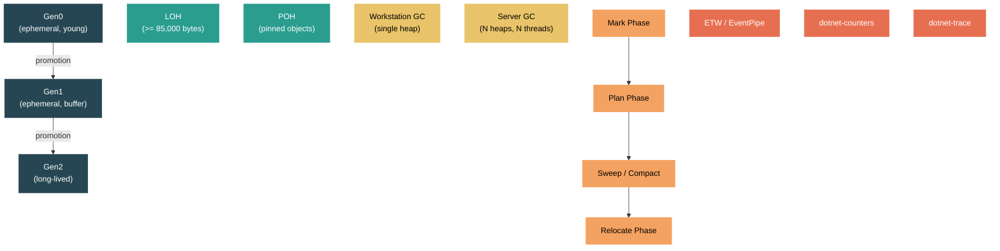

# Level 3: Advanced — Garbage Collection: Generations, Modes, and Tuning

> **Target profile:** Developer who needs to optimize GC behavior, diagnose memory issues, and understand the runtime's memory management internals
> **Estimated effort:** 6 hours
> **Prerequisites:** [Module 3.1](03-advanced-jit.md), Level 2 modules
> [Version en espanol](../es/03-advanced-gc.md)

---

## Learning Objectives

By the end of this module you will be able to:

1. Explain the generational hypothesis and how it drives .NET's Gen0/Gen1/Gen2 design, including allocation budgets and promotion.
2. Identify the triggers that cause a garbage collection and describe each GC phase: mark, plan, sweep/compact, and relocate.
3. Compare Workstation GC and Server GC in terms of thread count, heap structure, and pause characteristics.
4. Describe the Large Object Heap (LOH) and Pinned Object Heap (POH), including the 85,000-byte threshold and fragmentation risks.
5. Configure GC behavior using `DOTNET_*` environment variables, `GCSettings.LatencyMode`, and runtimeconfig.json properties.
6. Diagnose GC issues using ETW events, `dotnet-counters`, and `dotnet-trace`, recognizing patterns like Gen2 storms, LOH fragmentation, and finalization pressure.

---

## Concept Map



---

## Curriculum

### Lesson 1 — The Generational Hypothesis

#### What you'll learn

The .NET GC is built on a foundational observation in computer science: most objects die young. This "generational hypothesis" drives the entire design of the garbage collector. Instead of scanning every object on every collection, the GC divides objects into generations and collects young objects far more frequently than old ones.

#### Generations in the source

Open `src/coreclr/gc/gc.h`. The generation enum at line 109 defines the full hierarchy:

```cpp
enum gc_generation_num
{
    soh_gen0 = 0,
    soh_gen1 = 1,
    soh_gen2 = 2,
    max_generation = soh_gen2,

    loh_generation = 3,
    poh_generation = 4,

    uoh_start_generation = loh_generation,
    total_generation_count = poh_generation + 1,  // 5 total
};
```

There are five logical "generations" -- three for the Small Object Heap (SOH) and two for the Upper Object Heaps (UOH): LOH and POH. The SOH generations (0, 1, 2) are the ones that follow the generational hypothesis.

#### How allocation budgets work

Each generation has a **budget** -- the amount of allocation allowed before a collection is triggered. This is tracked in `gcpriv.h` through the `dynamic_data` structure:

```cpp
ptrdiff_t new_allocation;       // remaining budget for this generation
ptrdiff_t gc_new_allocation;    // snapshot taken at GC start
```

When you allocate a new object, the runtime deducts from Gen0's `new_allocation`. When this budget is exhausted, a Gen0 collection is triggered. The GC then computes a new budget based on survival rates -- if most objects survived, the budget increases; if most died, the budget shrinks.

The function `desired_new_allocation` in `gcpriv.h` (line 3185) is responsible for computing the next budget after each collection:

```cpp
PER_HEAP_METHOD size_t desired_new_allocation(dynamic_data* dd, size_t out, ...);
```

#### Promotion

Objects that survive a Gen0 collection are **promoted** to Gen1. Objects that survive a Gen1 collection are promoted to Gen2. Once in Gen2, objects stay there until a full (Gen2) collection reclaims them.

The `gc_mechanisms` struct in `gcpriv.h` tracks whether promotion happened:

```cpp
class gc_mechanisms
{
public:
    BOOL promotion;        // did promotion occur?
    BOOL demotion;         // did demotion occur? (regions mode)
    int condemned_generation;  // which generation is being collected
    // ...
};
```

**Demotion** is the reverse -- in regions mode, the GC can demote objects back to a younger generation if it determines they are unlikely to be long-lived. This is indicated by the `RI_DEMOTED` flag in the region metadata.

#### Key insight

Gen0 collections are fast because they only scan a small amount of memory. Gen2 collections are expensive because they scan the entire heap. Your primary tuning goal is to minimize Gen2 collections while keeping Gen0/Gen1 collections efficient.

#### Source exploration exercise

1. Open `src/coreclr/gc/gc.h` and read the `gc_generation_num` enum. Note how `max_generation` is `soh_gen2` (value 2), which is what `GC.MaxGeneration` returns in managed code.
2. Open `src/coreclr/gc/gcpriv.h` and search for `dynamic_data`. Observe the `new_allocation` field -- this is the budget counter that triggers collections.
3. Open `src/coreclr/System.Private.CoreLib/src/System/GC.CoreCLR.cs` and find `GetMaxGeneration()` -- it bridges the managed and native worlds.

---

### Lesson 2 — GC Triggers and Phases

#### What you'll learn

A garbage collection doesn't happen at random. It is triggered by specific conditions, and once started, proceeds through well-defined phases. Understanding these phases helps you interpret GC pauses and make sense of diagnostic data.

#### What triggers a GC

The entry comment in `src/coreclr/gc/gc.cpp` (line 12-13) tells us the most common trigger:

```
// The most common case for a GC to be triggered is from the allocator code.
// See code:#try_allocate_more_space where it calls GarbageCollectGeneration.
```

The full set of GC reasons is defined in `gc.h` starting at line 60:

```cpp
enum gc_reason
{
    reason_alloc_soh = 0,       // Gen0 budget exhausted
    reason_induced = 1,         // GC.Collect() called
    reason_lowmemory = 2,       // OS reports low memory
    reason_empty = 3,           // unused
    reason_alloc_loh = 4,       // LOH allocation triggered GC
    reason_oos_soh = 5,         // out of segments (SOH)
    reason_oos_loh = 6,         // out of segments (LOH)
    reason_induced_noforce = 7, // GC.Collect with Optimized mode
    reason_lowmemory_blocking = 9,
    reason_induced_compacting = 10,
    reason_lowmemory_host = 11,
    reason_pm_full_gc = 12,     // provisional mode full GC
    reason_induced_aggressive = 17,  // GCCollectionMode.Aggressive
    reason_max
};
```

The most important ones for day-to-day work:
- **`reason_alloc_soh`**: Gen0 allocation budget exhausted. This is the normal, healthy trigger.
- **`reason_induced`**: Someone called `GC.Collect()`. Usually a red flag -- avoid unless you have a specific reason.
- **`reason_alloc_loh`**: A large object allocation caused a Gen2 collection. LOH allocations always trigger a Gen2 GC if the budget is exceeded.
- **`reason_lowmemory`**: The OS signaled memory pressure. The GC becomes more aggressive.

#### The GC phases

Once triggered, the GC proceeds through distinct phases. The method declarations in `gcpriv.h` lay them out:

```cpp
PER_HEAP_METHOD void mark_phase(int condemned_gen_number);
PER_HEAP_METHOD void plan_phase(int condemned_gen_number);
PER_HEAP_METHOD void relocate_phase(int condemned_gen_number, ...);
PER_HEAP_METHOD void compact_phase(int condemned_gen_number, ...);
```

These phases are implemented in separate source files: `src/coreclr/gc/mark_phase.cpp` and `src/coreclr/gc/plan_phase.cpp`, plus the main `gc.cpp`.

**Phase 1 -- Mark**: The GC walks all roots (stack variables, static fields, GC handles) and recursively marks every reachable object. Unreachable objects are considered garbage.

**Phase 2 -- Plan**: The GC decides what to do with the condemned generation. It determines whether to **sweep** (leave objects in place, build a free list from gaps) or **compact** (slide surviving objects together to eliminate fragmentation). The decision is driven by fragmentation metrics and the `gc_mechanisms.compaction` flag.

**Phase 3a -- Sweep**: If sweeping, the GC builds free lists from the gaps left by dead objects. This is faster than compacting but can lead to fragmentation.

**Phase 3b -- Compact + Relocate**: If compacting, the GC first computes new addresses for all surviving objects, then updates all references (relocate), and finally copies objects to their new locations (compact). Compacting eliminates fragmentation but is more expensive.

#### Background GC (BGC)

For Gen2 collections, the GC can run **concurrently** with your application threads. This is Background GC (BGC), enabled by default. The `gc_mechanisms` struct tracks this:

```cpp
uint32_t concurrent;     // is this a concurrent GC?
BOOL background_p;       // is background GC running?
bgc_state b_state;       // current BGC state
```

BGC has two brief STW (stop-the-world) pauses: one at the start for initial marking, and one at the end for final marking. Between these pauses, your application continues to run while the GC traces the heap in the background.

#### Source exploration exercise

1. In `src/coreclr/gc/gc.h`, read the `gc_reason` enum. Map each reason to a scenario you might encounter.
2. In `src/coreclr/gc/gc.cpp`, look at the comment at line 12 describing the allocation trigger path.
3. In `src/coreclr/gc/gcpriv.h`, find the four phase method declarations (`mark_phase`, `plan_phase`, `relocate_phase`, `compact_phase`).

---

### Lesson 3 — Workstation vs Server GC

#### What you'll learn

The .NET runtime ships with two GC implementations compiled from the same source code. The choice between them fundamentally affects your application's throughput and latency characteristics.

#### One source, two binaries

Look at the top of `src/coreclr/gc/gc.cpp` (lines 61-65):

```cpp
#ifdef SERVER_GC
namespace SVR {
#else // SERVER_GC
namespace WKS {
#endif // SERVER_GC
```

The entire GC is compiled twice -- once into the `WKS` (Workstation) namespace and once into `SVR` (Server). The key compile-time define is `FEATURE_SVR_GC`, and the `MULTIPLE_HEAPS` define in `gcpriv.h` controls the heap architecture:

```cpp
#ifdef MULTIPLE_HEAPS
#define PER_HEAP_FIELD            // instance field on gc_heap
#else
#define PER_HEAP_FIELD static     // single static instance
#endif
```

In Workstation mode, there is a single `gc_heap` with static fields. In Server mode, there are N `gc_heap` instances -- one per logical processor (or as configured by `GCHeapCount`).

#### Workstation GC characteristics

- **One GC heap**, one GC thread
- GC runs on the thread that triggered the allocation
- Designed for **interactive/desktop** applications where low latency matters
- Default for applications that don't opt in to Server GC
- Background GC enabled by default (concurrent Gen2 collections)

#### Server GC characteristics

- **N GC heaps**, N dedicated GC threads (one per logical processor by default)
- Each thread is affinitized to a processor for NUMA locality
- GC threads run at `THREAD_PRIORITY_HIGHEST`
- Designed for **server workloads** (ASP.NET, gRPC services) where throughput matters
- Each heap has its own Gen0/Gen1/Gen2/LOH/POH
- GC pauses affect all threads simultaneously -- all heaps are collected in parallel

#### Choosing between them

| Factor | Workstation | Server |
|--------|-------------|--------|
| Heap count | 1 | N (one per core) |
| GC threads | 0 dedicated | N dedicated |
| Memory usage | Lower | Higher (N heaps) |
| Throughput | Lower | Higher |
| Pause times | Shorter individual pauses | Longer but less frequent |
| Best for | Desktop, mobile, containers with few cores | Web servers, APIs, batch processing |

#### Configuration

In your `.csproj` or `runtimeconfig.json`:

```json
{
  "runtimeOptions": {
    "configProperties": {
      "System.GC.Server": true,
      "System.GC.Concurrent": true
    }
  }
}
```

Or via environment variables:

```bash
export DOTNET_gcServer=1
export DOTNET_gcConcurrent=1
```

These map to the `gcconfig.h` entries:

```cpp
BOOL_CONFIG(ServerGC,    "gcServer",    "System.GC.Server",    false, ...)
BOOL_CONFIG(ConcurrentGC,"gcConcurrent","System.GC.Concurrent",true,  ...)
```

#### Controlling heap count

By default, Server GC creates one heap per logical processor. You can override this with `GCHeapCount`:

```bash
export DOTNET_GCHeapCount=4   # use exactly 4 heaps
```

This is critical in container environments where the container has access to many cores but is CPU-limited. The GC config entry from `gcconfig.h`:

```cpp
INT_CONFIG(HeapCount, "GCHeapCount", "System.GC.HeapCount", 0,
           "Specifies the number of server GC heaps")
```

A value of 0 means "auto-detect from processor count".

#### Source exploration exercise

1. In `src/coreclr/gc/gc.cpp`, observe the `#ifdef SERVER_GC` namespace split.
2. In `src/coreclr/gc/gcpriv.h`, search for `MULTIPLE_HEAPS` and see how per-heap fields become static in Workstation mode.
3. In `src/coreclr/gc/gcconfig.h`, find the `ServerGC`, `ConcurrentGC`, and `HeapCount` entries.

---

### Lesson 4 — LOH and POH

#### What you'll learn

Not all objects go through the generational hierarchy. Objects that are large or pinned get special treatment in dedicated heaps, each with its own allocation and collection characteristics.

#### The Large Object Heap (LOH)

Any object whose size is >= 85,000 bytes goes directly to the LOH, skipping Gen0/Gen1/Gen2 entirely. This threshold is defined in `src/coreclr/gc/gc.h`:

```cpp
#define LARGE_OBJECT_SIZE ((size_t)(85000))
```

And initialized in `gc.cpp`:

```cpp
size_t loh_size_threshold = LARGE_OBJECT_SIZE;
```

You can adjust this threshold (only upward) via the `GCLOHThreshold` config:

```cpp
INT_CONFIG(LOHThreshold, "GCLOHThreshold", "System.GC.LOHThreshold",
           LARGE_OBJECT_SIZE, "Specifies the size that will make objects go on LOH")
```

The enforcement in `interface.cpp` ensures you cannot lower it below 85,000:

```cpp
loh_size_threshold = max(loh_size_threshold, LARGE_OBJECT_SIZE);
```

#### Why LOH is special

LOH objects are collected with Gen2 -- every Gen2 GC also scans the LOH. However, by default the LOH is **not compacted**. Dead objects leave gaps that form a free list, and new large objects are allocated into these gaps. This can cause **fragmentation**: many small gaps that can't satisfy a large allocation, even though the total free space is sufficient.

#### LOH compaction

You can request LOH compaction through the managed API in `src/libraries/System.Private.CoreLib/src/System/Runtime/GCSettings.cs`:

```csharp
public enum GCLargeObjectHeapCompactionMode
{
    Default = 1,      // don't compact LOH
    CompactOnce = 2   // compact LOH on the next full blocking GC, then revert
}
```

Set it before triggering a full GC:

```csharp
GCSettings.LargeObjectHeapCompactionMode = GCLargeObjectHeapCompactionMode.CompactOnce;
GC.Collect();
```

The GC also considers compaction based on the `GCConserveMem` setting, as seen in `plan_phase.cpp`:

```cpp
dprintf(GTC_LOG, ("compacting LOH due to GCConserveMem setting"));
```

#### The Pinned Object Heap (POH) -- .NET 5+

Pinning objects (e.g., for interop with native code) prevents the GC from moving them, which fragments the SOH. The POH solves this by providing a dedicated heap for objects that are born pinned.

The POH is generation 4 in the internal hierarchy:

```cpp
poh_generation = 4,
```

You allocate directly onto the POH using:

```csharp
byte[] buffer = GC.AllocateArray<byte>(4096, pinned: true);
```

In `src/coreclr/System.Private.CoreLib/src/System/GC.CoreCLR.cs`, this maps to:

```csharp
internal enum GC_ALLOC_FLAGS
{
    GC_ALLOC_NO_FLAGS = 0,
    GC_ALLOC_ZEROING_OPTIONAL = 16,
    GC_ALLOC_PINNED_OBJECT_HEAP = 64,
};
```

#### POH vs pinning in SOH

| Aspect | `fixed` / GCHandle pinning | `GC.AllocateArray(pinned: true)` |
|--------|---------------------------|-----------------------------------|
| Heap | SOH (Gen0/1/2) | POH |
| Fragmentation risk | High -- fragments the generation | None -- POH is designed for it |
| Lifetime | Pin duration only | Entire object lifetime |
| Best for | Short-lived pins | Long-lived buffers (I/O, interop) |

#### ETW segment types

The ETW events distinguish heap types in `gc.h`:

```cpp
enum gc_etw_segment_type
{
    gc_etw_segment_small_object_heap = 0,
    gc_etw_segment_large_object_heap = 1,
    gc_etw_segment_read_only_heap = 2,
    gc_etw_segment_pinned_object_heap = 3
};
```

#### Source exploration exercise

1. In `src/coreclr/gc/gc.h`, find `LARGE_OBJECT_SIZE` and the `gc_etw_segment_type` enum.
2. In `src/coreclr/gc/gcconfig.h`, find the `LOHThreshold` configuration entry.
3. In `src/coreclr/System.Private.CoreLib/src/System/Runtime/GCSettings.cs`, read the `GCLargeObjectHeapCompactionMode` enum.
4. In `src/coreclr/System.Private.CoreLib/src/System/GC.CoreCLR.cs`, find `GC_ALLOC_PINNED_OBJECT_HEAP`.

---

### Lesson 5 — GC Configuration Knobs

#### What you'll learn

The GC exposes dozens of tuning knobs through environment variables and `runtimeconfig.json` properties. Understanding the most impactful ones lets you optimize for your specific workload without code changes.

#### Configuration system architecture

All GC configuration is defined in `src/coreclr/gc/gcconfig.h` through a macro-driven system. Each entry follows a pattern:

```cpp
INT_CONFIG(Name, "DOTNET_EnvVar", "System.GC.PropertyName", default, "description")
```

This generates a `GCConfig::GetName()` method that the GC calls at initialization. The runtime checks (in order): environment variables (`DOTNET_*`), `runtimeconfig.json` properties, then falls back to the default.

#### Essential configuration knobs

**Latency modes** (`GCSettings.LatencyMode`):

The managed API exposes five modes, defined in `src/libraries/System.Private.CoreLib/src/System/Runtime/GCSettings.cs`:

```csharp
public enum GCLatencyMode
{
    Batch = 0,                 // maximize throughput, longer pauses OK
    Interactive = 1,           // balance throughput and pause times (default)
    LowLatency = 2,            // minimize pauses, avoid Gen2 unless necessary
    SustainedLowLatency = 3,   // avoid blocking Gen2 GCs entirely
    NoGCRegion = 4             // no GC at all (set via GC.TryStartNoGCRegion)
}
```

These map directly to the native `gc_pause_mode` enum in `gcpriv.h`:

```cpp
enum gc_pause_mode
{
    pause_batch = 0,
    pause_interactive = 1,
    pause_low_latency = 2,
    pause_sustained_low_latency = 3,
    pause_no_gc = 4
};
```

**Memory conservation** (`GCConserveMemory`):

```cpp
INT_CONFIG(GCConserveMem, "GCConserveMemory", "System.GC.ConserveMemory", 0,
           "Specifies how hard GC should try to conserve memory - values 0-9")
```

Values 0-9. Higher values make the GC more aggressive about returning memory to the OS, at the cost of more frequent collections and LOH compaction.

**Hard heap limits**:

```cpp
INT_CONFIG(GCHeapHardLimit, "GCHeapHardLimit", "System.GC.HeapHardLimit", 0,
           "Specifies a hard limit for the GC heap")
INT_CONFIG(GCHeapHardLimitPercent, "GCHeapHardLimitPercent",
           "System.GC.HeapHardLimitPercent", 0,
           "Specifies the GC heap usage as a percentage of the total memory")
```

You can set absolute byte limits or percentages. You can even set per-heap-type limits:

```cpp
INT_CONFIG(GCHeapHardLimitSOH, ...)  // SOH-specific limit
INT_CONFIG(GCHeapHardLimitLOH, ...)  // LOH-specific limit
INT_CONFIG(GCHeapHardLimitPOH, ...)  // POH-specific limit
```

**High memory threshold**:

```cpp
INT_CONFIG(GCHighMemPercent, "GCHighMemPercent", "System.GC.HighMemoryPercent", 0,
           "The percent for GC to consider as high memory")
```

When physical memory usage exceeds this percentage, the GC enters "high memory" mode and becomes more aggressive about collections. The default is 90% on most systems.

**Dynamic Adaptation (DATAS)**:

```cpp
INT_CONFIG(GCDynamicAdaptationMode, "GCDynamicAdaptationMode",
           "System.GC.DynamicAdaptationMode", 1,
           "Enable the GC to dynamically adapt to application sizes.")
```

DATAS (Dynamic Adaptation To Application Sizes) lets the GC automatically adjust heap count and generation budgets based on workload characteristics. Enabled by default since .NET 8+.

#### Regions vs Segments

Modern .NET (8+) uses **regions** instead of the older **segments** model. Regions are smaller, fixed-size memory blocks that can be independently assigned to any generation. This is controlled by the `USE_REGIONS` compile-time define in `gcpriv.h`:

```cpp
#define USE_REGIONS
```

Regions enable features like demotion (moving objects back to younger generations) and more flexible memory management. The region configuration knobs:

```cpp
INT_CONFIG(GCRegionRange, "GCRegionRange", "System.GC.RegionRange", 0, ...)
INT_CONFIG(GCRegionSize,  "GCRegionSize",  "System.GC.RegionSize",  0, ...)
```

#### Container-optimized configuration

For containerized workloads, consider this configuration set:

```json
{
  "runtimeOptions": {
    "configProperties": {
      "System.GC.Server": true,
      "System.GC.HeapCount": 4,
      "System.GC.HeapHardLimitPercent": 75,
      "System.GC.ConserveMemory": 5,
      "System.GC.Concurrent": true
    }
  }
}
```

Equivalent environment variables:

```bash
export DOTNET_gcServer=1
export DOTNET_GCHeapCount=4
export DOTNET_GCHeapHardLimitPercent=75
export DOTNET_GCConserveMemory=5
export DOTNET_gcConcurrent=1
```

#### Additional knobs worth knowing

| Knob | Env Var | Purpose |
|------|---------|---------|
| `RetainVM` | `DOTNET_GCRetainVM` | Keep decommitted segments on standby instead of releasing to OS |
| `NoAffinitize` | `DOTNET_GCNoAffinitize` | Disable CPU affinity for Server GC threads |
| `GCLargePages` | `DOTNET_GCLargePages` | Use OS large pages (2MB) for GC heap |
| `GCCpuGroup` | `DOTNET_GCCpuGroup` | Enable CPU group awareness (machines with >64 cores) |
| `GCNumaAware` | `DOTNET_GCNumaAware` | NUMA-aware allocation (on by default) |

#### Source exploration exercise

1. Open `src/coreclr/gc/gcconfig.h` and read the entire `GC_CONFIGURATION_KEYS` macro. Count how many knobs exist.
2. In `src/libraries/System.Private.CoreLib/src/System/Runtime/GCSettings.cs`, trace how `LatencyMode` setter validates and applies the mode.
3. In `src/coreclr/gc/gcpriv.h`, search for `USE_REGIONS` to see how regions differ from the older segment model.

---

### Lesson 6 — Diagnosing GC Issues

#### What you'll learn

Even with optimal configuration, GC-related performance problems occur. This lesson teaches you to identify, diagnose, and fix the most common GC pathologies using built-in diagnostic tools.

#### Tool 1: dotnet-counters (real-time monitoring)

```bash
dotnet-counters monitor --process-id <PID> \
    --counters System.Runtime[gc-heap-size,gen-0-gc-count,gen-1-gc-count,gen-2-gc-count,gen-0-size,gen-1-size,gen-2-size,loh-size,poh-size,time-in-gc,alloc-rate]
```

Key metrics to watch:
- **`time-in-gc`**: Percentage of time spent in GC. Above 10-15% is concerning.
- **`gen-2-gc-count`**: Rapidly increasing Gen2 counts indicate a "Gen2 storm."
- **`alloc-rate`**: High allocation rates drive frequent GC cycles.
- **`loh-size`**: Growing LOH without corresponding Gen2 collections suggests LOH fragmentation.

#### Tool 2: dotnet-trace (detailed ETW/EventPipe capture)

```bash
dotnet-trace collect --process-id <PID> \
    --providers Microsoft-Windows-DotNETRuntime:0x1:5
```

The GC keyword mask `0x1` captures GC events. Key events to look for:

- **GCStart / GCEnd**: Tells you which generation was collected, the reason, and duration.
- **GCHeapStats**: Post-GC heap sizes for all generations.
- **GCAllocationTick**: Sampled allocation events (every ~100KB) showing what types are being allocated.
- **GCCreateSegment**: When the GC acquires new memory segments -- maps to the ETW segment types from `gc.h`:

```cpp
enum gc_etw_segment_type
{
    gc_etw_segment_small_object_heap = 0,
    gc_etw_segment_large_object_heap = 1,
    gc_etw_segment_read_only_heap = 2,
    gc_etw_segment_pinned_object_heap = 3
};
```

The GC reason in ETW events maps directly to the `gc_reason` enum. If you see `reason_alloc_loh` (4) triggering Gen2 collections, your LOH allocations are causing full GCs.

#### Common pathology 1: Gen2 storms

**Symptoms**: `gen-2-gc-count` increasing rapidly, high `time-in-gc`.

**Cause**: Too many objects surviving to Gen2 (object pools not returning objects, caches growing unbounded, long-lived closures capturing large graphs).

**Diagnosis**:
```bash
dotnet-counters monitor --counters System.Runtime[gen-0-gc-count,gen-2-gc-count,time-in-gc]
```
If `gen-2-gc-count` is more than 1/10th of `gen-0-gc-count`, you have a problem.

**Fixes**:
- Review object lifetimes -- use `dotnet-trace` with `GCAllocationTick` to find hot allocation paths
- Consider `GCSettings.LatencyMode = SustainedLowLatency` to avoid blocking Gen2 GCs
- Use `ArrayPool<T>` and `MemoryPool<T>` to reduce allocations
- Check for finalizable objects that are inadvertently being promoted

#### Common pathology 2: LOH fragmentation

**Symptoms**: `loh-size` is large, `OutOfMemoryException` thrown despite available memory, LOH growing without bound.

**Cause**: Frequent allocation and deallocation of large objects of varying sizes. The free-list allocator can't find contiguous space.

**Diagnosis**: Capture a trace and examine GCHeapStats events. If LOH fragmentation is high, you'll see LOH size growing even though fragmented space is available.

**Fixes**:
- Use `ArrayPool<byte>.Shared` for large byte arrays
- Allocate large arrays in powers-of-2 sizes so free-list reuse is more likely
- Periodically compact the LOH:
```csharp
GCSettings.LargeObjectHeapCompactionMode = GCLargeObjectHeapCompactionMode.CompactOnce;
GC.Collect();
```
- Increase `GCConserveMemory` to encourage LOH compaction:
```bash
export DOTNET_GCConserveMemory=7
```

#### Common pathology 3: Finalization pressure

**Symptoms**: Objects with finalizers are promoted to Gen2 because they can't be collected until the finalizer runs. The finalizer thread becomes a bottleneck.

**Cause**: Types implementing finalizers (or `IDisposable` without calling `GC.SuppressFinalize`). Each finalizable object requires an extra GC cycle to collect -- first it's marked for finalization and placed on the f-reachable queue, then the finalizer thread processes it, and only on the next Gen2 GC is the memory actually freed.

**Diagnosis**: Use `dotnet-counters` to monitor `finalization-queue-length`. If it's growing, finalizers aren't keeping up.

**Fixes**:
- Always call `Dispose()` and `GC.SuppressFinalize(this)` in the Dispose pattern
- Avoid finalizers where possible -- use `SafeHandle` instead
- Consider `GC.WaitForPendingFinalizers()` in extreme cases

#### Common pathology 4: Induced GC overhead

**Symptoms**: Many GCs with `reason_induced` in the trace data.

**Cause**: Code calling `GC.Collect()` explicitly. Each induced GC triggers a full blocking collection by default.

**Diagnosis**: Search your codebase for `GC.Collect()`. Check third-party libraries too.

**Fixes**:
- Remove explicit `GC.Collect()` calls unless absolutely necessary
- If you must induce a GC, use `GC.Collect(generation, GCCollectionMode.Optimized)` to let the GC decide if collection is actually needed

#### Diagnostic workflow checklist

1. **Start with `dotnet-counters`** -- get a real-time overview of heap sizes, GC counts, and time-in-GC.
2. **Identify the generation** -- which generation is being collected too frequently?
3. **Capture a trace** with `dotnet-trace` to get GC events with reasons and durations.
4. **Analyze allocations** -- use `GCAllocationTick` events to find hot allocation paths.
5. **Check configuration** -- is the GC mode (Workstation/Server) appropriate for your workload?
6. **Apply targeted fixes** -- pool allocations, adjust latency mode, or tune heap limits.
7. **Measure again** -- verify your changes actually improved the situation.

#### GC information from managed code

The `GC.GetGCMemoryInfo()` API provides detailed GC statistics without external tools:

```csharp
GCMemoryInfo info = GC.GetGCMemoryInfo(GCKind.FullBlocking);
Console.WriteLine($"Heap size: {info.HeapSizeBytes}");
Console.WriteLine($"Fragmentation: {info.FragmentedBytes}");
Console.WriteLine($"Pause duration: {info.PauseDurations[0]}");
Console.WriteLine($"Concurrent: {info.Concurrent}");
Console.WriteLine($"Compacted: {info.Compacted}");
```

#### Source exploration exercise

1. In `src/coreclr/gc/gc.h`, review the full `gc_reason` enum and the `gc_etw_type` enum (NGC/BGC/FGC).
2. In `src/coreclr/System.Private.CoreLib/src/System/GC.CoreCLR.cs`, find `GetGCMemoryInfo` and trace how it bridges to native code.
3. In `src/coreclr/gc/gcpriv.h`, find the `gc_mechanisms` class and note the `entry_memory_load` / `exit_memory_load` fields -- these are what diagnostic tools report.

---

## Self-Assessment Questions

1. Why does the GC have three SOH generations instead of just two (young/old)?
2. What is the difference between a sweep and a compact, and when does the GC choose each?
3. You deploy a Web API to a 4-core container with 2GB RAM. What GC configuration would you start with?
4. An application's LOH size keeps growing even though LOH objects are short-lived. What is happening and how do you fix it?
5. You see `time-in-gc` at 35%. Your Gen2 count is increasing at 10 collections/second. What are your next diagnostic steps?
6. Why was the Pinned Object Heap introduced in .NET 5? What problem does it solve that `fixed` statements don't?
7. What does `GCConserveMemory=9` do differently from the default, and when would you use it?

---

## Key Source File Map

| File | What it contains |
|------|-----------------|
| `src/coreclr/gc/gc.cpp` | Main GC implementation (~8,800 lines), allocation entry points |
| `src/coreclr/gc/gc.h` | Public enums: `gc_reason`, `gc_generation_num`, `LARGE_OBJECT_SIZE` |
| `src/coreclr/gc/gcpriv.h` | Internal structures: `gc_heap`, `gc_mechanisms`, `dynamic_data`, GC phase declarations |
| `src/coreclr/gc/gcconfig.h` | All GC configuration knobs via `GC_CONFIGURATION_KEYS` macro |
| `src/coreclr/gc/gcinterface.h` | `IGCHeap` interface between GC and runtime (version 5.8) |
| `src/coreclr/gc/mark_phase.cpp` | Mark phase implementation |
| `src/coreclr/gc/plan_phase.cpp` | Plan phase implementation (includes compaction/sweep decision) |
| `src/coreclr/gc/env/gcenv.os.h` | OS memory abstraction (`GCToOSInterface`, virtual memory, NUMA) |
| `src/coreclr/System.Private.CoreLib/src/System/GC.CoreCLR.cs` | Managed `System.GC` class bridging to native GC |
| `src/libraries/System.Private.CoreLib/src/System/Runtime/GCSettings.cs` | `GCLatencyMode`, `GCLargeObjectHeapCompactionMode` |

---

## Further Reading

- [GC Design Doc (BOTR)](docs/design/coreclr/botr/garbage-collection.md) -- the canonical design document referenced at the top of `gc.cpp`
- [GC Configuration](https://learn.microsoft.com/en-us/dotnet/core/runtime-config/garbage-collector) -- official documentation for all GC settings
- [Maoni Stephens' GC blog posts](https://devblogs.microsoft.com/dotnet/author/maoni0/) -- from the GC's lead developer
- [.NET GC Internals (performance profiling)](https://learn.microsoft.com/en-us/dotnet/standard/garbage-collection/) -- MSDN reference
