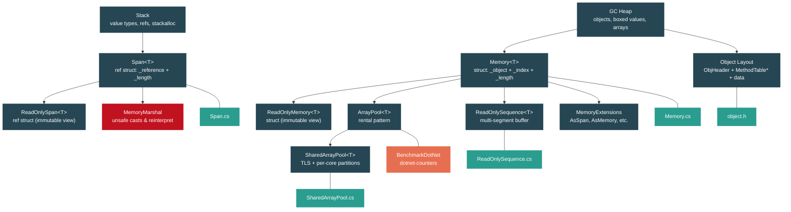

# Level 3: Advanced — Memory Model: Stack, Heap, Span, and Memory

> **Target profile:** Developer who optimizes hot paths, profiles allocations, and reads framework source to understand memory layout
> **Estimated effort:** 6 hours
> **Prerequisites:** [Level 2 complete](02-practitioner-generics.md) (especially 2.1 Generics and [2.9 IDisposable](02-practitioner-disposable.md))
> [Version en espanol](../es/03-advanced-memory-model.md)

---

## Learning Objectives

By the end of this module you will be able to:

1. Explain exactly what goes on the stack versus the heap in .NET, including value types captured by closures, boxed value types, and `stackalloc`'d buffers.
2. Describe the internal layout of a managed object on the GC heap (ObjHeader + MethodTable pointer + instance data) by reading `src/coreclr/vm/object.h`.
3. Explain why `Span<T>` is a `ref struct` (two fields: `ref T _reference` + `int _length`) and what "cannot live on the heap" means in practice.
4. Use `Memory<T>` in async contexts where `Span<T>` is forbidden, and explain the `_object` / `_index` / `_length` triple that makes it work.
5. Implement correct `ArrayPool<T>.Shared` rental patterns, understanding the tiered TLS-then-per-core-partition caching in `SharedArrayPool<T>`.
6. Walk `ReadOnlySequence<T>` segments to process discontiguous buffers from `System.IO.Pipelines`.
7. Use `MemoryMarshal` to cast spans, reinterpret memory, and read structs from raw bytes -- and articulate when this is safe versus undefined behavior.
8. Profile allocation hot paths with BenchmarkDotNet's `[MemoryDiagnoser]`, `dotnet-counters`, and ETW `GC/AllocationTick` events.

---

## Concept Map



---

## Curriculum

### Lesson 1 -- Stack vs Heap Revisited

#### What you'll learn

Most C# developers know "value types go on the stack, reference types go on the heap," but the reality is more nuanced. In this lesson you will learn the actual allocation rules the CLR follows, how `stackalloc` provides explicit stack allocation, and how to identify heap allocations that look like they should be stack-only.

#### The concept

The CLR makes allocation decisions based on **lifetime and escape analysis**, not merely on the type category:

| Scenario | Location | Why |
|---|---|---|
| Local `int x = 42;` | Stack | Value type, does not escape the method |
| `int[] arr = new int[10];` | Heap | Arrays are always reference types |
| `object boxed = 42;` | Heap | Boxing wraps the value in a heap object |
| Local struct in a lambda | Heap | Captured by the closure class (escapes) |
| `Span<byte> buf = stackalloc byte[256];` | Stack | Explicit stack allocation |
| `string s = "hello";` | Heap (interned) | Strings are reference types |

**stackalloc** gives you a contiguous block of memory on the current method's stack frame. The memory is automatically freed when the method returns -- no GC involvement at all. However, you must be careful about size: a large `stackalloc` can cause a `StackOverflowException`.

```csharp
// Safe pattern: guard the size, fall back to ArrayPool
const int StackAllocThreshold = 256;

Span<byte> buffer = inputLength <= StackAllocThreshold
    ? stackalloc byte[StackAllocThreshold]
    : new byte[inputLength];
```

**Object layout on the heap** -- every managed object in the GC heap has this layout (from `object.h`):

```
 ┌───────────────────────┐  ← negative offset
 │  ObjHeader            │     SyncBlock index (4 bytes, +4 bytes padding on 64-bit)
 ├───────────────────────┤  ← address the reference points to (offset 0)
 │  MethodTable*         │     pointer to type metadata (8 bytes on 64-bit)
 ├───────────────────────┤
 │  Instance fields      │     actual data
 └───────────────────────┘
```

The minimum object size is `2 * sizeof(pointer) + ObjHeader` = 24 bytes on 64-bit. This means even an empty `class Empty { }` occupies 24 bytes on the heap.

#### In the source code

Open `src/coreclr/vm/object.h`. Lines 86-93 define the layout constants:

```cpp
#define OBJHEADER_SIZE      (sizeof(DWORD) /* m_alignpad */ + sizeof(DWORD) /* m_SyncBlockValue */)
#define OBJECT_SIZE         TARGET_POINTER_SIZE /* m_pMethTab */
#define OBJECT_BASESIZE     (OBJHEADER_SIZE + OBJECT_SIZE)
```

And the `Object` class (line 126) holds a single field:

```cpp
class Object
{
  protected:
    PTR_MethodTable m_pMethTab;
};
```

Lines 104-107 enforce the minimum:

```cpp
#define MIN_OBJECT_SIZE     (2*TARGET_POINTER_SIZE + OBJHEADER_SIZE)
```

This means every heap object carries overhead: the ObjHeader for synchronization and the MethodTable pointer for type identity. Understanding this overhead is key to knowing when avoiding allocations matters.

#### Hands-on exercise

Create a BenchmarkDotNet project that compares three approaches for summing an array of 1000 integers:

1. Allocate `new int[1000]` inside the benchmark method.
2. Use `stackalloc int[1000]` with a `Span<int>`.
3. Rent from `ArrayPool<int>.Shared`.

Use `[MemoryDiagnoser]` to observe the `Allocated` column. The `stackalloc` and `ArrayPool` versions should show 0 bytes allocated.

```csharp
[MemoryDiagnoser]
public class AllocationBenchmarks
{
    [Benchmark(Baseline = true)]
    public int HeapAllocated()
    {
        int[] arr = new int[1000];
        for (int i = 0; i < arr.Length; i++) arr[i] = i;
        int sum = 0;
        foreach (int n in arr) sum += n;
        return sum;
    }

    [Benchmark]
    public int StackAllocated()
    {
        Span<int> arr = stackalloc int[1000];
        for (int i = 0; i < arr.Length; i++) arr[i] = i;
        int sum = 0;
        foreach (int n in arr) sum += n;
        return sum;
    }

    [Benchmark]
    public int Pooled()
    {
        int[] arr = ArrayPool<int>.Shared.Rent(1000);
        try
        {
            for (int i = 0; i < arr.Length; i++) arr[i] = i;
            int sum = 0;
            for (int i = 0; i < 1000; i++) sum += arr[i];
            return sum;
        }
        finally
        {
            ArrayPool<int>.Shared.Return(arr);
        }
    }
}
```

#### Key takeaway

Stack allocation is free (no GC), but limited in size and scope. Heap allocation is flexible but costs GC pressure. The real art is knowing which allocations are on your hot path and whether they can be eliminated.

#### Common misconception

> "All structs live on the stack."

False. A struct captured by a lambda becomes a field of the compiler-generated closure class, which lives on the heap. A struct stored as a field of a class lives on the heap inside that object. A boxed struct also lives on the heap. The stack is only used when the struct's lifetime is strictly scoped to the method.

---

### Lesson 2 -- Span\<T\>: The Universal Buffer View

#### What you'll learn

`Span<T>` is the most important type in modern high-performance .NET code. You will learn its internal representation, why it is a `ref struct`, what constraints that imposes, and how slicing works without copying memory.

#### The concept

`Span<T>` provides a type-safe, memory-safe view over a contiguous region of memory. It can point to:

- Managed arrays
- Native (unmanaged) memory
- Stack-allocated memory (`stackalloc`)

The key insight is that `Span<T>` stores a **managed reference** directly, not an object reference. This is what makes it universal -- and what makes it a `ref struct`.

**Why ref struct?** A `ref struct` can only live on the stack. It cannot be:

- A field of a class (would put it on the heap)
- Boxed (boxing creates a heap object)
- Used in `async` methods (the state machine is a class/struct on the heap)
- Used as a type argument for non-ref-struct generics

These restrictions exist because the GC cannot track the interior reference (`ref T _reference`) if the `Span<T>` were stored on the heap. The managed reference might point into the middle of an array -- if the GC moved that array during compaction, it would need to update the reference, but it only knows how to update references that are on the stack or in object fields of known types.

**Slicing is free** -- creating a sub-span just adjusts the reference and length. No memory is copied:

```csharp
int[] array = { 0, 1, 2, 3, 4, 5, 6, 7, 8, 9 };
Span<int> full = array;
Span<int> middle = full.Slice(3, 4); // points to {3, 4, 5, 6}, zero copies
middle[0] = 99;                      // array[3] is now 99
```

#### In the source code

Open `src/libraries/System.Private.CoreLib/src/System/Span.cs`. The declaration on line 28 shows everything:

```csharp
public readonly ref struct Span<T>
{
    /// <summary>A byref or a native ptr.</summary>
    internal readonly ref T _reference;
    /// <summary>The number of elements this Span contains.</summary>
    private readonly int _length;
```

Two fields. That is all. On a 64-bit runtime, a `Span<T>` is exactly 16 bytes: 8 bytes for the managed reference and 4 bytes for the length (plus 4 bytes padding for alignment).

The constructor from an array (line 42) uses `MemoryMarshal.GetArrayDataReference` to obtain a managed reference to the first element, bypassing the array object header:

```csharp
_reference = ref MemoryMarshal.GetArrayDataReference(array);
_length = array.Length;
```

The constructor from a pointer (line 110) does a simple cast:

```csharp
public unsafe Span(void* pointer, int length)
{
    if (RuntimeHelpers.IsReferenceOrContainsReferences<T>())
        ThrowHelper.ThrowArgument_TypeContainsReferences(typeof(T));
    _reference = ref *(T*)pointer;
    _length = length;
}
```

Notice the guard: you cannot create a `Span<T>` over unmanaged memory when `T` contains GC references. This prevents the GC from losing track of objects.

Now open `src/libraries/System.Private.CoreLib/src/System/ReadOnlySpan.cs`. It is structurally identical (line 29):

```csharp
public readonly ref struct ReadOnlySpan<T>
{
    internal readonly ref T _reference;
    private readonly int _length;
```

The difference is purely in the API surface: `ReadOnlySpan<T>` exposes no indexer setter and no mutable methods. It is a compile-time contract, not a runtime distinction -- both types have the same memory layout.

#### Hands-on exercise

Write a method that parses comma-separated integers from a `ReadOnlySpan<char>` without allocating any strings:

```csharp
static int[] ParseCsvInts(ReadOnlySpan<char> input)
{
    var result = new List<int>();
    while (!input.IsEmpty)
    {
        int commaIndex = input.IndexOf(',');
        ReadOnlySpan<char> token = commaIndex >= 0
            ? input.Slice(0, commaIndex)
            : input;

        result.Add(int.Parse(token));

        input = commaIndex >= 0
            ? input.Slice(commaIndex + 1)
            : default;
    }
    return result.ToArray();
}
```

Benchmark this against a `string.Split(',')` + `int.Parse()` version. Use `[MemoryDiagnoser]` to observe the allocation difference. The span-based version should allocate only the `List<int>` internals, not the intermediate strings.

#### Key takeaway

`Span<T>` gives you pointer-like performance with full memory safety. Its two-field representation makes slicing a constant-time operation. The `ref struct` constraint is the price you pay for this safety -- it keeps the managed reference trackable by the GC.

#### Common misconception

> "Span<T> is always faster than arrays."

Not exactly. `Span<T>` is a *view* over memory. For simple sequential access of an array you already own, the JIT generates identical code for `array[i]` and `span[i]`. Span shines when you need to avoid allocations (slicing without copying) or write code that is polymorphic over the memory source (array, native, stack).

---

### Lesson 3 -- Memory\<T\>: Span's Async-Safe Sibling

#### What you'll learn

`Span<T>` cannot cross `await` boundaries because it is a `ref struct`. `Memory<T>` solves this by storing an object reference instead of a managed reference, making it safe to store on the heap. You will learn how `Memory<T>` works internally, how `IMemoryOwner<T>` enables lifetime management, and how `Pin()` works for interop.

#### The concept

Consider this scenario: you want to read data from a socket asynchronously and process slices of the buffer. You cannot use `Span<T>` because `async` methods store their local state in a heap-allocated state machine.

```csharp
// This does NOT compile:
async Task ProcessAsync(Span<byte> data) // error: ref struct cannot be parameter of async method
{
    await Task.Delay(1);
    Process(data);
}

// This WORKS:
async Task ProcessAsync(Memory<byte> data)
{
    await Task.Delay(1);
    Process(data.Span); // get a Span<T> when you need it
}
```

`Memory<T>` is a regular `struct` (not a `ref struct`), so it can be stored in fields, passed to async methods, and boxed. It achieves this by using a different internal representation.

**Internal layout** -- `Memory<T>` stores three fields:

| Field | Type | Purpose |
|---|---|---|
| `_object` | `object?` | The backing store: a `T[]`, a `string` (for `Memory<char>`), or a `MemoryManager<T>` |
| `_index` | `int` | Start offset (high bit indicates pre-pinned) |
| `_length` | `int` | Number of elements |

When you call `.Span`, `Memory<T>` reconstructs a `Span<T>` by obtaining a reference from the backing object. This is slightly more expensive than using a `Span<T>` directly (one virtual dispatch or type check), but it is safe across `await` boundaries.

**IMemoryOwner\<T\>** defines an ownership contract: whoever holds the `IMemoryOwner<T>` is responsible for disposing the underlying memory. This is critical when using memory from a pool:

```csharp
using IMemoryOwner<byte> owner = MemoryPool<byte>.Shared.Rent(4096);
Memory<byte> memory = owner.Memory;
// Use memory...
// Disposing 'owner' returns the buffer to the pool
```

**Pinning** -- `Memory<T>.Pin()` returns a `MemoryHandle` that prevents the GC from moving the underlying memory while native code accesses it. The `_index` field uses its highest bit to indicate whether the array was already pinned, avoiding a redundant `GCHandle` allocation.

#### In the source code

Open `src/libraries/System.Private.CoreLib/src/System/Memory.cs`. The struct declaration on line 21 shows the three fields:

```csharp
public readonly struct Memory<T> : IEquatable<Memory<T>>
{
    // The highest order bit of _index is used to discern whether _object is a pre-pinned array.
    private readonly object? _object;
    private readonly int _index;
    private readonly int _length;
```

Lines 23-26 contain an important comment explaining the `_index` high-bit trick:

```csharp
// (_index < 0) => _object is a pre-pinned array, so Pin() will not allocate a new GCHandle
//       (else) => Pin() needs to allocate a new GCHandle to pin the object.
```

The constructor from a `MemoryManager<T>` (line 121) stores the manager as the `_object`:

```csharp
internal Memory(MemoryManager<T> manager, int length)
{
    _object = manager;
    _index = 0;
    _length = length;
}
```

Now compare with `src/libraries/System.Private.CoreLib/src/System/ReadOnlyMemory.cs` (line 21):

```csharp
public readonly struct ReadOnlyMemory<T> : IEquatable<ReadOnlyMemory<T>>
{
    internal readonly object? _object;
    internal readonly int _index;
    internal readonly int _length;
    internal const int RemoveFlagsBitMask = 0x7FFFFFFF;
```

The `RemoveFlagsBitMask` on line 30 strips the high bit from `_index` to get the actual offset. This mask is used when converting the stored index back to a real array offset.

#### Hands-on exercise

Build an async file reader that reads a file in 4 KB chunks using `Memory<byte>` and `IMemoryOwner<byte>`:

```csharp
static async Task<long> CountBytesAsync(string path, byte target)
{
    long count = 0;
    using var owner = MemoryPool<byte>.Shared.Rent(4096);
    Memory<byte> buffer = owner.Memory.Slice(0, 4096);

    await using var stream = File.OpenRead(path);
    int bytesRead;
    while ((bytesRead = await stream.ReadAsync(buffer)) > 0)
    {
        ReadOnlySpan<byte> span = buffer.Span.Slice(0, bytesRead);
        foreach (byte b in span)
        {
            if (b == target) count++;
        }
    }
    return count;
}
```

Compare this with a version that allocates `new byte[4096]` per iteration. Use `dotnet-counters` to monitor `gc-heap-size` and `gen-0-gc-count` during execution.

#### Key takeaway

`Memory<T>` exists because `Span<T>` cannot live on the heap. Use `Span<T>` for synchronous hot paths; use `Memory<T>` when the buffer must survive across `await` or be stored in a field. Always prefer `Span<T>` when you can -- it has less overhead.

#### Common misconception

> "Memory<T> is just a slower Span<T>."

Not quite. `Memory<T>` and `Span<T>` serve different purposes. `Memory<T>` is an ownership/storage type -- it answers "who owns this buffer and where does it live?" `Span<T>` is an access type -- it answers "let me read/write this contiguous region right now." In well-designed code, you store `Memory<T>` and produce `Span<T>` at the point of use.

---

### Lesson 4 -- ArrayPool\<T\>: Renting Instead of Allocating

#### What you'll learn

Allocating and discarding arrays on hot paths creates GC pressure that degrades throughput and tail latencies. `ArrayPool<T>` lets you rent arrays from a shared pool and return them when done. You will learn the tiered caching architecture inside `SharedArrayPool<T>` and the correct rental patterns.

#### The concept

`ArrayPool<T>.Shared` is a singleton pool that caches arrays by size bucket. When you call `Rent(minimumLength)`, the pool returns an array that is **at least** as large as requested (it rounds up to the next power of two). When you call `Return(array)`, the pool reclaims the array for future use.

```csharp
byte[] buffer = ArrayPool<byte>.Shared.Rent(1000);
try
{
    // buffer.Length may be 1024 (next power of two)
    // ONLY use the first 1000 elements!
    ProcessData(buffer.AsSpan(0, 1000));
}
finally
{
    ArrayPool<byte>.Shared.Return(buffer, clearArray: true);
}
```

Critical rules:

1. **Always return** -- failing to return is not a crash, but the pool must allocate a new array next time, defeating the purpose.
2. **Use only the requested length** -- the returned array may be larger. Never assume `buffer.Length == minimumLength`.
3. **Clear sensitive data** -- pass `clearArray: true` to zero the buffer before returning it. This prevents data leaks to the next renter.
4. **Don't double-return** -- returning the same array twice corrupts the pool.
5. **Don't use after return** -- the pool may hand the same array to another thread immediately.

**The tiered architecture** of `SharedArrayPool<T>`:

```
Tier 1: Thread-Local Storage (TLS)
  - One array per bucket per thread
  - Zero contention -- fastest path

Tier 2: Per-Core Partitions
  - SharedArrayPoolPartitions per bucket
  - Lock-protected, but contention is rare
    because threads tend to stay on the same core

Tier 3: New Allocation
  - If both tiers are empty, allocate a new array
  - The array will be pooled when returned
```

#### In the source code

Open `src/libraries/System.Private.CoreLib/src/System/Buffers/ArrayPool.cs`. Line 23 reveals the concrete type:

```csharp
private static readonly SharedArrayPool<T> s_shared = new SharedArrayPool<T>();
```

The field is typed as `SharedArrayPool<T>` (not `ArrayPool<T>`) so the JIT can devirtualize calls when using `ArrayPool<T>.Shared`.

Now open `src/libraries/System.Private.CoreLib/src/System/Buffers/SharedArrayPool.cs`. The caching tiers are visible in the fields (lines 24-36):

```csharp
private const int NumBuckets = 27; // covers arrays up to ~1 GB

[ThreadStatic]
private static SharedArrayPoolThreadLocalArray[]? t_tlsBuckets;

private readonly SharedArrayPoolPartitions?[] _buckets = new SharedArrayPoolPartitions[NumBuckets];
```

The `Rent` method (line 50) implements the tiered lookup:

1. **TLS check** (line 60): Look in `t_tlsBuckets[bucketIndex]` for a cached array. This is the fastest path -- no synchronization needed.
2. **Per-core partitions** (line 76): If TLS is empty, try `_buckets[bucketIndex].TryPop()`. This uses a lock but is partitioned across cores to reduce contention.
3. **New allocation** (line 95): If both caches are empty, allocate a new array with the bucket's canonical size: `Utilities.GetMaxSizeForBucket(bucketIndex)`.

27 buckets cover sizes from 16 to ~1 billion, with each bucket doubling the previous size (16, 32, 64, 128, ..., 1073741824).

#### Hands-on exercise

Write a benchmark that simulates a web server processing HTTP requests. Each "request" needs a temporary 8 KB buffer:

```csharp
[MemoryDiagnoser]
[ThreadingDiagnoser]
public class PoolBenchmarks
{
    [Benchmark(Baseline = true)]
    public int AllocateEveryTime()
    {
        byte[] buffer = new byte[8192];
        buffer[0] = 1;
        return buffer[0];
    }

    [Benchmark]
    public int UseArrayPool()
    {
        byte[] buffer = ArrayPool<byte>.Shared.Rent(8192);
        try
        {
            buffer[0] = 1;
            return buffer[0];
        }
        finally
        {
            ArrayPool<byte>.Shared.Return(buffer);
        }
    }
}
```

Run with multiple threads (`--job short --threads 8`). Observe that the `ArrayPool` version shows ~0 allocations and lower GC pause times.

Then, intentionally "leak" rented buffers by commenting out the `Return` call and observe how `gc-heap-size` grows in `dotnet-counters`.

#### Key takeaway

`ArrayPool<T>.Shared` eliminates GC pressure on hot paths by reusing arrays across calls. The tiered TLS-then-partition architecture ensures that the common case (rent/return on the same thread) has zero synchronization overhead.

#### Common misconception

> "I should use ArrayPool for every array I create."

No. ArrayPool has overhead: the rental lookup, the size rounding (you may waste memory), and the requirement to always return. For short-lived small arrays in cold paths, `new T[]` is simpler and the GC handles it efficiently. Reserve ArrayPool for hot paths where profiling shows significant GC pressure from array allocations.

---

### Lesson 5 -- ReadOnlySequence\<T\>: Multi-Segment Buffers

#### What you'll learn

Network and file I/O often produces data in non-contiguous chunks. `ReadOnlySequence<T>` from `System.Buffers` represents a logical sequence of `ReadOnlyMemory<T>` segments, enabling you to process fragmented data without copying it into a single contiguous buffer.

#### The concept

`System.IO.Pipelines` is built around the idea that data arrives in segments. When you read from a `PipeReader`, you get a `ReadOnlySequence<byte>` that may span multiple buffers:

```
Segment 1: [H, e, l, l]  →  Segment 2: [o, , W, o]  →  Segment 3: [r, l, d]
```

Instead of copying all segments into one array, you iterate over them:

```csharp
static long CountOccurrences(ReadOnlySequence<byte> sequence, byte target)
{
    long count = 0;

    if (sequence.IsSingleSegment)
    {
        // Fast path: no segment walking needed
        foreach (byte b in sequence.FirstSpan)
        {
            if (b == target) count++;
        }
    }
    else
    {
        // Walk each segment
        foreach (ReadOnlyMemory<byte> memory in sequence)
        {
            foreach (byte b in memory.Span)
            {
                if (b == target) count++;
            }
        }
    }
    return count;
}
```

The `IsSingleSegment` fast path is important -- most reads will fit in a single buffer, and checking this avoids the overhead of the segment enumerator.

**SequencePosition** is an opaque marker into the sequence, used to tell the `PipeReader` how much data you consumed:

```csharp
ReadResult result = await reader.ReadAsync();
ReadOnlySequence<byte> buffer = result.Buffer;

// Find the end of a line
SequencePosition? newline = buffer.PositionOf((byte)'\n');
if (newline.HasValue)
{
    ProcessLine(buffer.Slice(0, newline.Value));
    reader.AdvanceTo(buffer.GetPosition(1, newline.Value));
}
else
{
    reader.AdvanceTo(buffer.Start, buffer.End);
}
```

#### In the source code

Open `src/libraries/System.Memory/src/System/Buffers/ReadOnlySequence.cs`. The struct on line 15 stores deconstructed `SequencePosition` pairs:

```csharp
public readonly partial struct ReadOnlySequence<T>
{
    private readonly object? _startObject;
    private readonly object? _endObject;
    private readonly int _startInteger;
    private readonly int _endInteger;
```

`_startObject` and `_endObject` can be `ReadOnlySequenceSegment<T>` nodes, arrays, or `MemoryManager<T>` instances. The integers encode both the position index and type flags using bit manipulation.

The `IsSingleSegment` property (line 44) is a simple reference comparison:

```csharp
public bool IsSingleSegment
{
    get => _startObject == _endObject;
}
```

This is the cheapest possible check -- if both the start and end refer to the same segment object, the sequence is contiguous.

#### Hands-on exercise

Build a simple line-counting pipeline:

1. Create a `Pipe` from `System.IO.Pipelines`.
2. Write a file's contents into the `PipeWriter` in 512-byte chunks.
3. Read from the `PipeReader`, handling `ReadOnlySequence<byte>` that may span multiple segments.
4. Count newlines, being careful to handle the case where `\n` falls at a segment boundary.

Use `SequenceReader<byte>` (from `System.Buffers`) to simplify boundary handling:

```csharp
var reader = new SequenceReader<byte>(sequence);
long lineCount = 0;
while (reader.TryAdvanceTo((byte)'\n'))
{
    lineCount++;
}
```

#### Key takeaway

`ReadOnlySequence<T>` avoids the copy-into-one-buffer antipattern. Always check `IsSingleSegment` first for the fast path. Use `SequenceReader<T>` when you need to parse across segment boundaries -- it handles the complexity for you.

#### Common misconception

> "I should always copy a ReadOnlySequence into an array before processing."

This defeats the entire purpose. The sequence exists precisely so you do not have to allocate a contiguous buffer. Only copy to a contiguous array when the API you are calling demands `Span<T>` or `T[]` and the sequence is multi-segment (and even then, prefer `SequenceReader<T>` or processing segment by segment).

---

### Lesson 6 -- Unsafe Territory: MemoryMarshal and Unsafe

#### What you'll learn

Sometimes the safe APIs are not enough. `MemoryMarshal` and `System.Runtime.CompilerServices.Unsafe` let you cast spans between types, read raw structs from byte buffers, and access the internals of `Memory<T>`. You will learn when these operations are valid and when they invoke undefined behavior.

#### The concept

**Casting spans** -- `MemoryMarshal.Cast<TFrom, TTo>(Span<TFrom>)` reinterprets the bytes of one span as another type:

```csharp
Span<int> ints = stackalloc int[] { 1, 2, 3, 4 };
Span<byte> bytes = MemoryMarshal.AsBytes(ints);
// bytes.Length == 16 (4 ints * 4 bytes each)
// bytes[0] == 1, bytes[4] == 2, etc. (little-endian)
```

This is zero-cost: no memory is copied. The span just reinterprets the same memory. However:

- Both types must be unmanaged (no GC references).
- The length must be evenly divisible when casting to a larger type.
- Endianness matters -- the byte pattern depends on the CPU architecture.

**Reading structs from bytes** -- `MemoryMarshal.Read<T>(ReadOnlySpan<byte>)` reads a struct directly from a byte span:

```csharp
ReadOnlySpan<byte> data = /* from network/file */;
int header = MemoryMarshal.Read<int>(data);
// Equivalent to *(int*)&data[0], but bounds-checked
```

**Getting references** -- `MemoryMarshal.GetReference(Span<T>)` returns a `ref T` to the first element, even for empty spans (where indexing would throw):

```csharp
ref byte first = ref MemoryMarshal.GetReference(span);
// Use Unsafe.Add(ref first, i) for pointer-arithmetic-style access
```

**When safety breaks down:**

| Operation | Risk |
|---|---|
| Casting `Span<A>` to `Span<B>` where sizes differ | Buffer overrun if `sizeof(B) > sizeof(A) * length` |
| `Unsafe.As<TFrom, TTo>(ref x)` on unrelated types | Undefined behavior, GC corruption if TTo has refs |
| `MemoryMarshal.CreateSpan(ref x, 1)` on a heap object field | The span might outlive the object |
| Passing a `ref struct` span to native code without pinning | GC can move the buffer mid-call |

#### In the source code

Open `src/libraries/System.Private.CoreLib/src/System/Runtime/InteropServices/MemoryMarshal.cs`. The `AsBytes` method (line 31) shows the pattern:

```csharp
public static unsafe Span<byte> AsBytes<T>(Span<T> span)
    where T : struct
{
    if (RuntimeHelpers.IsReferenceOrContainsReferences<T>())
        ThrowHelper.ThrowArgument_TypeContainsReferences(typeof(T));

    return new Span<byte>(
        ref Unsafe.As<T, byte>(ref GetReference(span)),
        checked(span.Length * sizeof(T)));
}
```

The guard `IsReferenceOrContainsReferences<T>()` is critical: it prevents you from viewing object references as raw bytes, which would allow corrupting GC-tracked pointers.

Also open `src/libraries/System.Private.CoreLib/src/System/MemoryExtensions.cs`. The `AsSpan` extension (line 26) is how arrays get converted to spans:

```csharp
public static Span<T> AsSpan<T>(this T[]? array, int start)
{
    // ... bounds checking ...
    return new Span<T>(
        ref Unsafe.Add(ref MemoryMarshal.GetArrayDataReference(array),
            (nint)(uint)start),
        array.Length - start);
}
```

Notice the `(nint)(uint)start` cast: the `(uint)` cast forces zero-extension (preventing a negative index from being sign-extended into a huge address), while `(nint)` converts to the native pointer size.

#### Hands-on exercise

Write a binary protocol parser that reads a packet header using `MemoryMarshal`:

```csharp
[StructLayout(LayoutKind.Sequential, Pack = 1)]
readonly struct PacketHeader
{
    public readonly byte Version;
    public readonly byte Type;
    public readonly ushort Length;
    public readonly uint SequenceNumber;
}

static PacketHeader ReadHeader(ReadOnlySpan<byte> data)
{
    if (data.Length < Unsafe.SizeOf<PacketHeader>())
        throw new ArgumentException("Buffer too small for header");

    return MemoryMarshal.Read<PacketHeader>(data);
}

static ReadOnlySpan<byte> ReadPayload(ReadOnlySpan<byte> data)
{
    PacketHeader header = ReadHeader(data);
    return data.Slice(Unsafe.SizeOf<PacketHeader>(), header.Length);
}
```

Then benchmark this against a version that uses `BinaryReader` with a `MemoryStream`. The `MemoryMarshal` version should be significantly faster and allocate zero bytes.

#### Key takeaway

`MemoryMarshal` gives you C-level control over memory interpretation while retaining bounds checking. The key safety rule is: never cast spans of types that contain GC references. The runtime enforces this with `IsReferenceOrContainsReferences<T>()`, but `Unsafe` methods can bypass it -- use those only when you have proven correctness.

#### Common misconception

> "MemoryMarshal.Cast and Unsafe are the same as pointer casts in C."

Not quite. `MemoryMarshal.Cast<TFrom, TTo>` still performs a bounds check (the new length is calculated as `sourceLength * sizeof(TFrom) / sizeof(TTo)`). It also rejects types with GC references. True pointer arithmetic via `Unsafe` skips even these checks -- it is genuinely unsafe, and a mistake can corrupt the GC heap or cause security vulnerabilities.

---

## Source Code Reading Guide

| # | File | Difficulty | What to look for |
|---|---|---|---|
| 1 | `src/libraries/System.Private.CoreLib/src/System/Span.cs` | ★★★ | `ref struct` declaration, `_reference` + `_length` fields, `Slice` method, bounds-checking patterns |
| 2 | `src/libraries/System.Private.CoreLib/src/System/Memory.cs` | ★★★ | `_object`/`_index`/`_length` triple, `MemoryManager<T>` constructor, `Pin()` method, high-bit trick in `_index` |
| 3 | `src/libraries/System.Private.CoreLib/src/System/Buffers/SharedArrayPool.cs` | ★★★★ | Tiered caching: TLS buckets → per-core partitions → fallback allocation, `Rent`/`Return` logic |
| 4 | `src/libraries/System.Private.CoreLib/src/System/Runtime/InteropServices/MemoryMarshal.cs` | ★★★ | `AsBytes`, `Cast`, `GetReference`, `TryGetMemoryManager` -- all the low-level span operations |
| 5 | `src/libraries/System.Private.CoreLib/src/System/MemoryExtensions.cs` | ★★ | `AsSpan`, `AsMemory` -- bridging methods between arrays and spans |
| 6 | `src/libraries/System.Memory/src/System/Buffers/ReadOnlySequence.cs` | ★★★★ | Deconstructed `SequencePosition`, `IsSingleSegment`, bit-flag encoding in `_startInteger`/`_endInteger` |
| 7 | `src/coreclr/vm/object.h` | ★★★★ | Object layout: `OBJHEADER_SIZE`, `OBJECT_BASESIZE`, `MIN_OBJECT_SIZE`, `m_pMethTab` field |
| 8 | `src/libraries/System.Private.CoreLib/src/System/ReadOnlySpan.cs` | ★★ | Compare with `Span.cs` -- identical layout, different API surface |

---

## Diagnostic Tools

| Tool | What it measures | When to use |
|---|---|---|
| **BenchmarkDotNet** `[MemoryDiagnoser]` | Allocations per operation, GC gen collections | Micro-benchmarks of allocation-sensitive code |
| **dotnet-counters** | `gc-heap-size`, `gen-X-gc-count`, `alloc-rate` | Live monitoring of a running application |
| **dotnet-trace** | ETW events including `GC/AllocationTick` | Capturing allocation call stacks in production |
| **VS Memory Profiler** | Object types on the heap, retention paths | Finding memory leaks and unexpected large objects |
| **PerfView** | `GCAllocationTick` ETW events, GC pause analysis | Deep-dive analysis of GC behavior |
| **dotnet-gcdump** | Heap snapshot with type statistics | Analyzing heap composition without a full profiler |

**Quick start with dotnet-counters:**

```bash
# Install the tool
dotnet tool install --global dotnet-counters

# Monitor GC metrics for a running process
dotnet-counters monitor --process-id <PID> --counters System.Runtime[gc-heap-size,gen-0-gc-count,gen-1-gc-count,gen-2-gc-count,alloc-rate]
```

---

## Self-Assessment

### Knowledge checks

1. **You have a local `Span<int>` and try to return it from a method. The compiler rejects it. Why?**
   <details><summary>Answer</summary>A Span may hold a reference to stack-allocated memory or to the interior of a managed object. Returning it would allow the caller to access memory that no longer exists (dangling reference) or that the GC cannot track. The ref struct rules prevent this.</details>

2. **Why does `Memory<T>` store `object? _object` instead of `T[]`?**
   <details><summary>Answer</summary>Because Memory<T> can wrap three different backing stores: a T[], a string (for Memory<char>), or a MemoryManager<T>. Using object? lets a single struct handle all three without separate types.</details>

3. **`ArrayPool<T>.Shared.Rent(100)` returns an array of length 128. You process all 128 elements. Is this correct?**
   <details><summary>Answer</summary>It is not a crash, but it is a logical bug. You requested 100 elements, so only the first 100 are "yours." Elements 100-127 may contain data from a previous renter. Always track the requested length separately.</details>

4. **You call `MemoryMarshal.Cast<byte, int>(byteSpan)` on a span of length 7. What happens?**
   <details><summary>Answer</summary>The resulting Span<int> has length 1 (7 / 4 = 1, truncated). The last 3 bytes are inaccessible through the resulting span. No exception is thrown.</details>

5. **A `ReadOnlySequence<byte>` has `IsSingleSegment == true`. You call `.First.Span`. Is this equivalent to iterating all segments?**
   <details><summary>Answer</summary>Yes. When IsSingleSegment is true, the entire sequence is in the first (and only) segment. Using .FirstSpan is the optimal path and produces the same result as iterating.</details>

### Practical challenge

**Build a zero-allocation CSV line parser.**

Requirements:
- Input: `ReadOnlySequence<byte>` (simulating data from a `PipeReader`).
- Output: yield each line as a `ReadOnlySpan<byte>` (the caller processes it immediately).
- Constraints: zero heap allocations in the parsing loop (no `string`, no `byte[]`, no LINQ).
- Handle the case where a line boundary falls between two segments.
- Benchmark against a `StreamReader.ReadLine()` approach and demonstrate the allocation difference using `[MemoryDiagnoser]`.

Hints:
- Use `SequenceReader<byte>` to handle cross-segment boundary detection.
- Use `stackalloc` or `ArrayPool<byte>` if you need to assemble a cross-segment line into a contiguous buffer.
- Remember that `SequenceReader<byte>.TryReadTo(out ReadOnlySpan<byte> span, (byte)'\n')` only returns a span for single-segment matches; for multi-segment matches it returns a `ReadOnlySequence<byte>`.

---

## Connections

| Direction | Module | Relationship |
|---|---|---|
| **Previous** | [Level 2: Generics](02-practitioner-generics.md) | Generics enable type-safe Span<T>, Memory<T>, ArrayPool<T> |
| **Previous** | [Level 2: IDisposable](02-practitioner-disposable.md) | IMemoryOwner<T> implements IDisposable for pool lifetime |
| **Next** | 3.2 Garbage Collector Internals | Understanding what happens when you *do* allocate on the heap |
| **Related** | 3.3 Object Pooling Patterns | ArrayPool is one instance of a broader pooling strategy |
| **Related** | 3.5 System.IO.Pipelines | ReadOnlySequence<T> is the core abstraction of the Pipelines API |
| **Related** | 3.4 Threading and Synchronization | SharedArrayPool's per-core partitions use lock-based synchronization |

---

## Glossary

| Term | Definition |
|---|---|
| **Span\<T\>** | A `ref struct` that provides a type-safe, memory-safe view over a contiguous region of arbitrary memory (managed, native, or stack). Two fields: `ref T _reference` + `int _length`. |
| **Memory\<T\>** | A regular `struct` that wraps a reference to a memory owner (`T[]`, `string`, or `MemoryManager<T>`). Can be stored on the heap and used in async contexts. |
| **ref struct** | A struct that can only live on the stack. Cannot be boxed, stored in class fields, or used as a type argument for non-ref-struct generics. Enforced by the compiler and runtime. |
| **ArrayPool\<T\>** | An abstract class providing array rental. `ArrayPool<T>.Shared` returns a `SharedArrayPool<T>` that caches arrays in tiered TLS and per-core partition caches. |
| **stackalloc** | A C# keyword that allocates a block of memory on the stack frame. The memory is freed when the method returns. Cannot be used in async methods or iterators. |
| **pinning** | Preventing the GC from moving an object in memory. Required when passing managed memory to native code. `Memory<T>.Pin()` returns a `MemoryHandle` that holds a `GCHandle`. |
| **MemoryMarshal** | A static class providing low-level operations: casting spans between types, reading structs from byte spans, accessing span internals. Guards against GC-reference types. |
| **ReadOnlySequence\<T\>** | A struct representing a logical sequence of `ReadOnlyMemory<T>` segments. Used by `System.IO.Pipelines` to represent discontiguous buffers without copying. |
| **IMemoryOwner\<T\>** | An interface extending `IDisposable` that owns a `Memory<T>`. Disposing returns the memory to its source (e.g., a pool). |
| **MemoryManager\<T\>** | An abstract class that provides a custom backing store for `Memory<T>`. Implementations override `GetSpan()`, `Pin()`, and `Unpin()`. Used for native memory wrappers. |
| **ObjHeader** | The hidden header before every managed object on the GC heap. Contains the sync block index (used for locking, hashing, and COM interop). 4 bytes on 32-bit, 8 bytes on 64-bit. |
| **MethodTable** | The runtime data structure describing a type. Every managed object's first pointer-sized field points to its MethodTable. Contains virtual method slots, interface maps, and GC descriptors. |

---

## References

1. **Source files explored in this module:**
   - `src/libraries/System.Private.CoreLib/src/System/Span.cs`
   - `src/libraries/System.Private.CoreLib/src/System/ReadOnlySpan.cs`
   - `src/libraries/System.Private.CoreLib/src/System/Memory.cs`
   - `src/libraries/System.Private.CoreLib/src/System/ReadOnlyMemory.cs`
   - `src/libraries/System.Private.CoreLib/src/System/Buffers/ArrayPool.cs`
   - `src/libraries/System.Private.CoreLib/src/System/Buffers/SharedArrayPool.cs`
   - `src/libraries/System.Private.CoreLib/src/System/Runtime/InteropServices/MemoryMarshal.cs`
   - `src/libraries/System.Private.CoreLib/src/System/MemoryExtensions.cs`
   - `src/libraries/System.Memory/src/System/Buffers/ReadOnlySequence.cs`
   - `src/coreclr/vm/object.h`

2. **Microsoft documentation:**
   - [Memory- and span-related types](https://learn.microsoft.com/dotnet/standard/memory-and-spans/)
   - [Memory<T> and Span<T> usage guidelines](https://learn.microsoft.com/dotnet/standard/memory-and-spans/memory-t-usage-guidelines)
   - [ArrayPool<T> class](https://learn.microsoft.com/dotnet/api/system.buffers.arraypool-1)
   - [System.IO.Pipelines](https://learn.microsoft.com/dotnet/standard/io/pipelines)

3. **Blog posts and deep dives:**
   - Adam Sitnik: [Span<T>](https://adamsitnik.com/Span/)
   - Stephen Toub: [How Span<T> and Memory<T> work](https://devblogs.microsoft.com/dotnet/)
   - Konrad Kokosa: *Pro .NET Memory Management* (Apress) -- chapters on GC heap layout and object headers

4. **Tools:**
   - [BenchmarkDotNet](https://benchmarkdotnet.org/) -- `[MemoryDiagnoser]`, `[ThreadingDiagnoser]`
   - [dotnet-counters](https://learn.microsoft.com/dotnet/core/diagnostics/dotnet-counters)
   - [dotnet-trace](https://learn.microsoft.com/dotnet/core/diagnostics/dotnet-trace)
   - [PerfView](https://github.com/microsoft/perfview)
