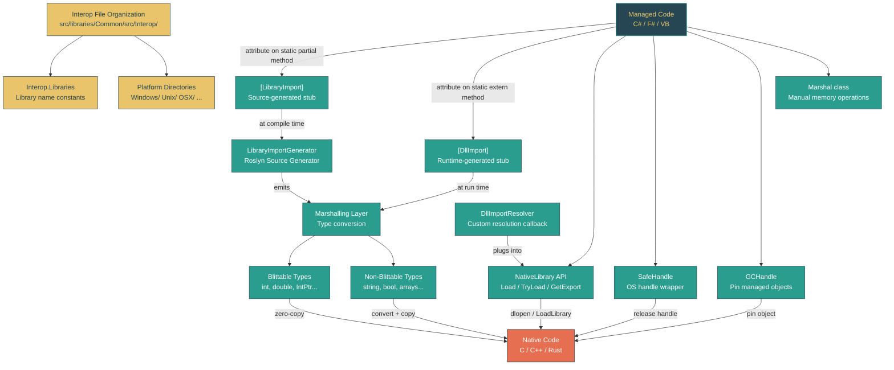

# Level 3: Advanced -- Native Interop: P/Invoke and LibraryImport

> **Target profile:** Developer who needs to call native code from .NET or understand how the BCL does it internally
> **Estimated effort:** 5 hours
> **Prerequisites:** Level 2 complete, Module 3.1 (Memory Model)
> [Version en espanol](../es/03-advanced-native-interop.md)

---

## Learning Objectives

After completing this module, you will be able to:

1. **Explain** how .NET bridges managed and native code through the P/Invoke marshalling layer, and trace the path from a managed call to the native function entry point.
2. **Write** correct `DllImport` declarations for common native APIs, including specifying calling conventions, character sets, and error handling.
3. **Migrate** from `DllImport` to `LibraryImport`, understanding why source-generated interop is preferred and what the generator produces.
4. **Classify** types as blittable or non-blittable and choose the correct marshalling strategy for strings, structs, arrays, and handles.
5. **Navigate** the `dotnet/runtime` Interop file organization -- the `Interop.Libraries` pattern, platform-split directories, and the one-function-per-file convention.
6. **Use** `NativeLibrary.Load`, `TryLoad`, `GetExport`, and `SetDllImportResolver` to dynamically load native libraries and implement plugin scenarios.
7. **Apply** `SafeHandle` and `GCHandle` correctly to prevent resource leaks and pinning bugs in interop code.
8. **Read** real interop code in the `dotnet/runtime` source and understand the design rationale behind its patterns.

---

## Concept Map



---

## Curriculum

### Lesson 3.10.1: The Interop Architecture -- How .NET Calls Native Code

**What you'll learn:** The overall architecture of the P/Invoke system -- what happens when managed code calls a native function, the role of the marshalling layer, and why this boundary exists.

**The concept:**

.NET runs managed code inside a runtime (CoreCLR or Mono) that provides garbage collection, type safety, and exception handling. Native code -- C, C++, Rust libraries, or OS APIs -- runs outside this managed environment. The boundary between these two worlds is called the "interop boundary," and crossing it requires a precise protocol called Platform Invocation Services (P/Invoke).

When you call a native function from C#, the runtime must:

1. **Locate** the native library and function entry point (by name or ordinal).
2. **Marshal** each argument from its managed representation to the native representation the function expects.
3. **Set up the stack frame** according to the native calling convention (cdecl, stdcall, etc.).
4. **Transition** from managed to native execution, temporarily pausing GC tracking for the current thread.
5. **Invoke** the native function.
6. **Marshal** the return value and any out parameters back to managed types.
7. **Capture** error codes (`GetLastError` on Windows, `errno` on Unix) if requested.
8. **Transition** back to managed execution.

This process is called the "P/Invoke stub." Traditionally, the runtime generates this stub at runtime using the JIT compiler. With `LibraryImport`, the stub is generated at compile time by a Roslyn source generator.

**The marshalling layer** is the most complex part. Some types -- called **blittable** types -- have identical layouts in managed and native memory: `int`, `long`, `double`, `IntPtr`, and structs composed only of blittable fields. These can be passed directly with zero copying. Non-blittable types like `string`, `bool` (managed 1 byte, C 4 bytes on Windows), and reference-type arrays require conversion, copying, and sometimes memory allocation.

**Source exploration:**

Open `src/libraries/System.Private.CoreLib/src/System/Runtime/InteropServices/Marshal.cs` and look at the class declaration:

```csharp
// src/libraries/System.Private.CoreLib/src/System/Runtime/InteropServices/Marshal.cs
public static partial class Marshal
{
    /// The default character size for the system. This is always 2 because
    /// the framework only runs on UTF-16 systems.
    public static readonly int SystemDefaultCharSize = 2;
```

Notice `SystemDefaultCharSize = 2` -- .NET strings are always UTF-16 internally. Every interop call that passes a string to a native function expecting `char*` (ANSI) or `char8_t*` (UTF-8) must perform a conversion. This single fact drives much of the marshalling complexity.

**Key insight:** The interop boundary is a **trust boundary**. Managed code has type safety guarantees; native code does not. A bad P/Invoke declaration -- wrong parameter types, wrong calling convention, wrong string marshalling -- will not cause a compile error. It will cause stack corruption, access violations, or silent data corruption at runtime. This is why the `dotnet/runtime` codebase is so meticulous about its interop declarations.

<details>
<summary>Reflection questions</summary>

- Why can't the runtime simply call native functions directly without a marshalling layer?
- What would happen if the GC moved a managed object while native code held a pointer to it?
- Why does .NET use UTF-16 internally when most OS APIs (on Unix) use UTF-8?

</details>

---

### Lesson 3.10.2: DllImport -- The Classic Way

**What you'll learn:** How `DllImport` works, its parameters and limitations, and why the runtime generates the interop stub at run time.

**The concept:**

`DllImport` has been the standard P/Invoke mechanism since .NET Framework 1.0. Look at the attribute definition:

```csharp
// src/libraries/System.Private.CoreLib/src/System/Runtime/InteropServices/DllImportAttribute.cs
[AttributeUsage(AttributeTargets.Method, Inherited = false)]
public sealed class DllImportAttribute : Attribute
{
    public DllImportAttribute(string dllName)
    {
        Value = dllName;
    }

    public string Value { get; }

    public string? EntryPoint;
    public CharSet CharSet;
    public bool SetLastError;
    public bool ExactSpelling;
    public CallingConvention CallingConvention;
    public bool BestFitMapping;
    public bool PreserveSig;
    public bool ThrowOnUnmappableChar;
}
```

A typical `DllImport` declaration looks like this:

```csharp
[DllImport("kernel32.dll", SetLastError = true, CharSet = CharSet.Unicode)]
static extern SafeFileHandle CreateFileW(
    string lpFileName,
    int dwDesiredAccess,
    FileShare dwShareMode,
    IntPtr lpSecurityAttributes,
    FileMode dwCreationDisposition,
    int dwFlagsAndAttributes,
    IntPtr hTemplateFile);
```

Key parameters:

- **`EntryPoint`**: The exported function name. If omitted, the method name is used. On Windows, `CharSet.Unicode` appends "W" (wide) automatically unless `ExactSpelling = true`.
- **`CharSet`**: Controls how `string` parameters are marshalled. `CharSet.Unicode` means UTF-16, `CharSet.Ansi` means the system's ANSI code page. This is a legacy concept -- `LibraryImport` uses the clearer `StringMarshalling` enum instead.
- **`SetLastError`**: If `true`, the runtime captures `GetLastError()` (Windows) or `errno` (Unix) immediately after the native call returns, before any other code can overwrite it. You retrieve it with `Marshal.GetLastPInvokeError()`.
- **`CallingConvention`**: Defaults to `CallingConvention.Winapi` (which resolves to `StdCall` on Windows, `Cdecl` on Unix). Getting this wrong corrupts the stack.
- **`PreserveSig`**: For COM interop. When `false`, the runtime transforms an `HRESULT` return value into an exception.

**The `static extern` pattern:** `DllImport` methods are declared as `static extern` -- no method body. The JIT compiler generates the marshalling stub at the point of first call. This means:

1. Marshalling behavior is not visible in the source code.
2. The generated stub cannot be inspected, debugged, or AOT-compiled easily.
3. Trimming tools cannot analyze what the stub needs, making it hostile to trimmed/NativeAOT scenarios.

**Why `DllImport` is being superseded:** In modern .NET (7+), three forces drive the migration away from `DllImport`:

1. **NativeAOT and trimming**: Runtime stub generation conflicts with ahead-of-time compilation.
2. **Source generators**: Roslyn source generators can produce the same stubs at compile time.
3. **Clarity**: `LibraryImport` makes marshalling explicit and inspectable.

The `dotnet/runtime` codebase has been migrated almost entirely to `LibraryImport`. A search for `[DllImport]` in `src/libraries/Common/src/Interop/` returns no results in the Kernel32 directory -- everything has been converted.

<details>
<summary>Reflection questions</summary>

- What happens if you declare `CallingConvention.Cdecl` but the native function uses `StdCall`?
- Why does `DllImport` offer both `CharSet.Ansi` and `CharSet.Unicode` when .NET strings are always UTF-16?
- What is the risk of forgetting `SetLastError = true` on a function that sets the last error?

</details>

---

### Lesson 3.10.3: LibraryImport -- Source-Generated P/Invoke

**What you'll learn:** How `LibraryImport` replaces `DllImport` with a source generator that produces visible, trimmable, AOT-compatible marshalling code.

**The concept:**

`LibraryImport` is the modern replacement for `DllImport`, introduced in .NET 7. Instead of `static extern`, you write `static partial`:

```csharp
// src/libraries/Common/src/Interop/Windows/Kernel32/Interop.WaitForSingleObject.cs
internal static partial class Interop
{
    internal static partial class Kernel32
    {
        [LibraryImport(Libraries.Kernel32, SetLastError = true)]
        internal static partial int WaitForSingleObject(SafeWaitHandle handle, int timeout);
    }
}
```

Compare this to how `CreateFile` is declared:

```csharp
// src/libraries/Common/src/Interop/Windows/Kernel32/Interop.CreateFile.cs
[LibraryImport(Libraries.Kernel32, EntryPoint = "CreateFileW",
               SetLastError = true, StringMarshalling = StringMarshalling.Utf16)]
private static unsafe partial SafeFileHandle CreateFilePrivate(
    string lpFileName,
    int dwDesiredAccess,
    FileShare dwShareMode,
    SECURITY_ATTRIBUTES* lpSecurityAttributes,
    FileMode dwCreationDisposition,
    int dwFlagsAndAttributes,
    IntPtr hTemplateFile);
```

Look at the `LibraryImportAttribute` definition:

```csharp
// src/libraries/System.Private.CoreLib/src/System/Runtime/InteropServices/LibraryImportAttribute.cs
public sealed class LibraryImportAttribute : Attribute
{
    public LibraryImportAttribute(string libraryName) { LibraryName = libraryName; }
    public string LibraryName { get; }
    public string? EntryPoint { get; set; }
    public StringMarshalling StringMarshalling { get; set; }
    public Type? StringMarshallingCustomType { get; set; }
    public bool SetLastError { get; set; }
}
```

Notice what is **missing** compared to `DllImport`:

- **No `CharSet`** -- replaced by the explicit `StringMarshalling` enum (`Utf8`, `Utf16`, `Custom`).
- **No `CallingConvention`** -- use the `[UnmanagedCallConv]` attribute instead (more flexible, supports `SuppressGCTransition`).
- **No `BestFitMapping` / `ThrowOnUnmappableChar`** -- these legacy ANSI mapping options are gone.
- **No `ExactSpelling`** -- the method name or `EntryPoint` is always used exactly.

**What the generator produces:**

The `LibraryImportGenerator` (at `src/libraries/System.Runtime.InteropServices/gen/LibraryImportGenerator/LibraryImportGenerator.cs`) is a Roslyn `IIncrementalGenerator`. For each `[LibraryImport]` method, it emits a second partial method implementation that contains:

1. A `[DllImport]` declaration with blittable-only parameters (the "raw" native call).
2. Marshalling code that converts managed parameters to their blittable equivalents before the call.
3. Unmarshalling code that converts native return values and out parameters back after the call.
4. Error capture logic if `SetLastError = true`.
5. Cleanup logic in `finally` blocks for allocated memory.

For a simple case like `WaitForSingleObject(SafeWaitHandle, int)`, the generated code handles extracting the raw `IntPtr` from the `SafeWaitHandle`, incrementing its ref count, making the native call, and decrementing the ref count in a `finally` block.

For string parameters, the generated code allocates stack or heap memory, converts the string to the target encoding, calls the native function, and frees the memory.

**Why this is better:**

1. **Visible**: You can inspect the generated code in your IDE (look in the Analyzers node).
2. **Trimmable**: The trimmer can analyze the generated code and remove unused marshalling paths.
3. **AOT-compatible**: No runtime code generation needed.
4. **Debuggable**: You can set breakpoints in the generated marshalling code.

**Migration from DllImport:**

The transformation is mechanical:
- `static extern` becomes `static partial`
- `[DllImport("lib")]` becomes `[LibraryImport("lib")]`
- `CharSet.Unicode` becomes `StringMarshalling = StringMarshalling.Utf16`
- `CharSet.Ansi` becomes `StringMarshalling = StringMarshalling.Utf8` (on Unix) or custom marshalling

There is an analyzer (`SYSLIB1054`) that suggests the migration and a code fixer that performs it automatically.

<details>
<summary>Reflection questions</summary>

- Why does the generator emit a hidden `[DllImport]` internally? What does this tell you about the relationship between the two mechanisms?
- What advantage does `StringMarshalling.Utf8` have over `CharSet.Ansi`?
- Why can't the generator handle generic methods?

</details>

---

### Lesson 3.10.4: Marshalling -- Types Across the Boundary

**What you'll learn:** The rules for passing data between managed and native code, including blittable types, string marshalling, SafeHandle, GCHandle, and struct layout.

**The concept:**

**Blittable types** have identical memory layout in managed and unmanaged code. The runtime can pass them by reference without copying:

| Blittable | Non-Blittable |
|---|---|
| `byte`, `sbyte` | `bool` (managed: 1 byte, C Windows: 4 bytes) |
| `short`, `ushort` | `char` (managed: 2 bytes, C: 1 byte) |
| `int`, `uint` | `string` (managed: object with length prefix) |
| `long`, `ulong` | Arrays of non-blittable types |
| `float`, `double` | Delegates |
| `IntPtr`, `UIntPtr` | Classes |
| `nint`, `nuint` | |
| Structs of only blittable fields | |
| Pointers (`int*`, `void*`) | |

**String marshalling** is the most common source of interop bugs. In the `dotnet/runtime` codebase, you can see three approaches:

```csharp
// UTF-16 for Windows APIs (most Win32 APIs use wide strings)
[LibraryImport(Libraries.Kernel32, EntryPoint = "CreateFileW",
               StringMarshalling = StringMarshalling.Utf16)]

// UTF-8 for Unix APIs (POSIX uses UTF-8/byte strings)
[LibraryImport(Libraries.SystemNative, EntryPoint = "SystemNative_GetNativeIPInterfaceStatistics",
               StringMarshalling = StringMarshalling.Utf8)]

// No string marshalling needed (only numeric/pointer parameters)
[LibraryImport(Libraries.Kernel32, SetLastError = true)]
internal static partial int WaitForSingleObject(SafeWaitHandle handle, int timeout);
```

**SafeHandle -- the right way to hold native handles:**

`SafeHandle` is an abstract class that wraps an OS handle (`IntPtr`) and ensures it is released even if an exception occurs or the GC collects the object:

```csharp
// src/libraries/System.Private.CoreLib/src/System/Runtime/InteropServices/SafeHandle.cs
public abstract partial class SafeHandle : CriticalFinalizerObject, IDisposable
{
    protected IntPtr handle;
    private volatile int _state;  // ref count + closed/disposed flags
    private readonly bool _ownsHandle;
```

The runtime has special knowledge of `SafeHandle`. When you pass a `SafeHandle` as a P/Invoke parameter, the runtime:
1. Increments the handle's reference count.
2. Extracts the raw `IntPtr` for the native call.
3. Decrements the reference count in a `finally` block.
4. Prevents the handle from being closed while the native call is in flight.

This is why the `dotnet/runtime` code passes `SafeHandle` and `SafeFileHandle` instead of raw `IntPtr` wherever possible -- look at the `WriteFile` declaration:

```csharp
// src/libraries/Common/src/Interop/Windows/Kernel32/Interop.WriteFile_SafeHandle_IntPtr.cs
[LibraryImport(Libraries.Kernel32, SetLastError = true)]
internal static unsafe partial int WriteFile(
    SafeHandle handle,    // Not IntPtr!
    byte* bytes,
    int numBytesToWrite,
    out int numBytesWritten,
    IntPtr mustBeZero);
```

**GCHandle -- pinning managed objects:**

When native code needs a pointer to a managed object (e.g., a byte array being written to a socket), the GC must not move that object. `GCHandle` with `GCHandleType.Pinned` prevents this:

```csharp
// src/libraries/System.Private.CoreLib/src/System/Runtime/InteropServices/GCHandle.cs
public partial struct GCHandle : IEquatable<GCHandle>
{
    private IntPtr _handle;
    // Four types: Normal, Weak, WeakTrackResurrection, Pinned
```

- `GCHandleType.Normal`: Prevents collection but does not pin. Used when native code stores a callback reference.
- `GCHandleType.Pinned`: Prevents collection AND movement. Required when native code needs a stable pointer. Only works on blittable types and arrays.
- `GCHandleType.Weak` / `WeakTrackResurrection`: Allows collection. Used for caches or callback tables.

**Struct layout:**

For structs passed to native code, use `[StructLayout]` to control memory layout:

```csharp
[StructLayout(LayoutKind.Sequential)]  // Fields in declaration order (default for structs)
struct POINT { public int X; public int Y; }

[StructLayout(LayoutKind.Explicit)]    // Manual offsets (for unions)
struct OVERLAPPED_UNION
{
    [FieldOffset(0)] public uint Offset;
    [FieldOffset(4)] public uint OffsetHigh;
    [FieldOffset(0)] public IntPtr Pointer;  // Overlaps Offset/OffsetHigh
}
```

<details>
<summary>Reflection questions</summary>

- Why is `bool` non-blittable? What does the `[MarshalAs(UnmanagedType.U1)]` attribute do for it?
- What happens if you pass a `SafeHandle` to a native function that stores the handle for later use (beyond the duration of the call)?
- Why does `GCHandle.Alloc` with `GCHandleType.Pinned` throw for non-blittable types?

</details>

---

### Lesson 3.10.5: The Interop Pattern in dotnet/runtime

**What you'll learn:** How the `dotnet/runtime` repository organizes its thousands of native interop declarations into a maintainable, cross-platform structure.

**The concept:**

The `dotnet/runtime` repository calls hundreds of native functions across Windows, Linux, macOS, FreeBSD, Android, iOS, and WebAssembly. All interop declarations live under a single directory tree:

```
src/libraries/Common/src/Interop/
    Interop.Brotli.cs              # Cross-platform (thin wrappers)
    Interop.zlib.cs
    Interop.Calendar.cs
    Interop.Calendar.iOS.cs        # Platform variant
    Windows/
        Interop.Libraries.cs       # Library name constants for Windows
        Interop.BOOL.cs            # Shared Windows types
        Interop.Errors.cs          # Win32 error constants
        Kernel32/                  # One directory per DLL
            Interop.CreateFile.cs  # One file per function (usually)
            Interop.WriteFile_SafeHandle_IntPtr.cs
            Interop.WaitForSingleObject.cs
            ...
        Advapi32/
        BCrypt/
        ...
    Unix/
        Interop.Libraries.cs       # Library name constants for Unix
        Interop.Errors.cs          # errno constants
        System.Native/             # One directory per shim library
            Interop.Write.cs
            Interop.Read.cs
            ...
        System.Security.Cryptography.Native/
        ...
    OSX/
    Linux/
    Android/
    BSD/
    Browser/
    Wasi/
```

**Pattern 1: Interop.Libraries -- centralized library names.**

Each platform has an `Interop.Libraries.cs` that defines constants for all native library names:

```csharp
// src/libraries/Common/src/Interop/Windows/Interop.Libraries.cs
internal static partial class Interop
{
    internal static partial class Libraries
    {
        internal const string Kernel32 = "kernel32.dll";
        internal const string Advapi32 = "advapi32.dll";
        internal const string BCrypt = "BCrypt.dll";
        internal const string Ws2_32 = "ws2_32.dll";
        internal const string CompressionNative = "System.IO.Compression.Native";
        // ... ~50 entries
    }
}
```

```csharp
// src/libraries/Common/src/Interop/Unix/Interop.Libraries.cs
internal static partial class Interop
{
    internal static partial class Libraries
    {
        internal const string libc = "libc";
        internal const string SystemNative = "libSystem.Native";
        internal const string CryptoNative = "libSystem.Security.Cryptography.Native.OpenSsl";
        internal const string CompressionNative = "libSystem.IO.Compression.Native";
        // ... ~10 entries
    }
}
```

Every P/Invoke declaration references `Libraries.Kernel32` or `Libraries.SystemNative` rather than a string literal. This makes it trivial to change a library name globally and prevents typos.

**Pattern 2: One function per file.**

Each interop function (or small group of related overloads) gets its own file named `Interop.<FunctionName>.cs`. This has several benefits:

- **MSBuild inclusion**: Individual library projects include only the interop files they need via `<Compile Include="..." />`. A library that calls `CreateFile` and `WriteFile` includes those two files; it does not pull in `ReadFile` or `DeleteFile`.
- **Code review**: Changes to one native call are isolated in one file.
- **Cross-reference**: Searching for `Interop.CreateFile.cs` instantly finds the declaration.

**Pattern 3: Partial class nesting.**

All interop declarations share the same partial class structure:

```csharp
internal static partial class Interop
{
    internal static partial class Kernel32  // or Sys, Advapi32, etc.
    {
        [LibraryImport(...)]
        internal static partial ReturnType FunctionName(params...);
    }
}
```

Because everything is `partial`, a library can include files from multiple directories and they all merge into a single `Interop` class at compile time. For example, `System.IO.FileSystem` might include:
- `Interop/Windows/Kernel32/Interop.CreateFile.cs`
- `Interop/Windows/Kernel32/Interop.WriteFile_SafeHandle_IntPtr.cs`
- `Interop/Windows/Kernel32/Interop.CloseHandle.cs`
- `Interop/Unix/System.Native/Interop.Write.cs`
- `Interop/Unix/System.Native/Interop.Open.cs`

The MSBuild conditions select the correct platform files.

**Pattern 4: Platform-specific error handling.**

Windows error codes live in `Interop/Windows/Interop.Errors.cs` as named constants:

```csharp
// src/libraries/Common/src/Interop/Windows/Interop.Errors.cs
internal static partial class Interop
{
    internal static partial class Errors
    {
        internal const int ERROR_SUCCESS = 0x0;
        internal const int ERROR_FILE_NOT_FOUND = 0x2;
        internal const int ERROR_ACCESS_DENIED = 0x5;
        // ... ~100+ constants
    }
}
```

Unix error codes follow a similar pattern in `Interop/Unix/Interop.Errors.cs`.

**Pattern 5: Managed wrapper over private native call.**

Sometimes the native call needs preprocessing. Rather than exposing the raw P/Invoke, the pattern is to make the native call `private` and provide a managed wrapper:

```csharp
// src/libraries/Common/src/Interop/Windows/Kernel32/Interop.CreateFile.cs
[LibraryImport(Libraries.Kernel32, EntryPoint = "CreateFileW",
               SetLastError = true, StringMarshalling = StringMarshalling.Utf16)]
private static unsafe partial SafeFileHandle CreateFilePrivate(
    string lpFileName, int dwDesiredAccess, FileShare dwShareMode,
    SECURITY_ATTRIBUTES* lpSecurityAttributes,
    FileMode dwCreationDisposition, int dwFlagsAndAttributes, IntPtr hTemplateFile);

internal static unsafe SafeFileHandle CreateFile(
    string lpFileName, int dwDesiredAccess, FileShare dwShareMode,
    SECURITY_ATTRIBUTES* lpSecurityAttributes,
    FileMode dwCreationDisposition, int dwFlagsAndAttributes, IntPtr hTemplateFile)
{
    lpFileName = PathInternal.EnsureExtendedPrefixIfNeeded(lpFileName);
    return CreateFilePrivate(lpFileName, dwDesiredAccess, dwShareMode,
        lpSecurityAttributes, dwCreationDisposition, dwFlagsAndAttributes, hTemplateFile);
}
```

Here `CreateFilePrivate` is the raw P/Invoke; `CreateFile` (the internal API) adds the long-path `\\?\` prefix before calling it. This pattern keeps the native boundary clean while adding necessary managed logic.

<details>
<summary>Reflection questions</summary>

- Why does the repository prefer one function per file rather than grouping all Kernel32 functions in a single file?
- How does the `partial class` mechanism allow a single `Interop.Kernel32` class to be spread across hundreds of files?
- Why are the interop files under `Common/src/` rather than inside each library's own `src/` directory?

</details>

---

### Lesson 3.10.6: NativeLibrary -- Dynamic Loading

**What you'll learn:** How to load native libraries at runtime, resolve symbols dynamically, and implement custom library resolution for plugin scenarios.

**The concept:**

Sometimes you cannot declare a P/Invoke at compile time. The library might not exist on all platforms, its path might be user-configurable, or you might be building a plugin system. The `NativeLibrary` class provides the low-level API:

```csharp
// src/libraries/System.Private.CoreLib/src/System/Runtime/InteropServices/NativeLibrary.cs
public static partial class NativeLibrary
{
    // Load by path -- wraps dlopen (Unix) / LoadLibrary (Windows)
    public static IntPtr Load(string libraryPath);
    public static bool TryLoad(string libraryPath, out IntPtr handle);

    // Load with search logic -- uses runtime's probing paths
    public static IntPtr Load(string libraryName, Assembly assembly, DllImportSearchPath? searchPath);
    public static bool TryLoad(string libraryName, Assembly assembly,
                               DllImportSearchPath? searchPath, out IntPtr handle);

    // Get a function pointer -- wraps dlsym (Unix) / GetProcAddress (Windows)
    public static IntPtr GetExport(IntPtr handle, string name);
    public static bool TryGetExport(IntPtr handle, string name, out IntPtr address);

    // Free a loaded library
    public static void Free(IntPtr handle);

    // Register a custom resolver for an assembly's P/Invoke calls
    public static void SetDllImportResolver(Assembly assembly, DllImportResolver resolver);
}
```

**Dynamic loading pattern:**

```csharp
// Load a library, get a function pointer, and call it
IntPtr lib = NativeLibrary.Load("mylib");
try
{
    IntPtr funcPtr = NativeLibrary.GetExport(lib, "my_function");
    // Convert to a delegate and call
    var myFunction = Marshal.GetDelegateForFunctionPointer<MyFunctionDelegate>(funcPtr);
    int result = myFunction(42);
}
finally
{
    NativeLibrary.Free(lib);
}
```

**Custom resolution with `SetDllImportResolver`:**

This is the most powerful feature. You can intercept all P/Invoke library loads for an assembly and redirect them:

```csharp
NativeLibrary.SetDllImportResolver(typeof(MyClass).Assembly, (name, assembly, searchPath) =>
{
    if (name == "mylib")
    {
        // Try a custom path first
        if (NativeLibrary.TryLoad("/opt/mylibs/libmy.so", out IntPtr handle))
            return handle;
    }
    // Fall through to default resolution
    return IntPtr.Zero;
});
```

This is used in the `dotnet/runtime` itself. The `DllImportResolver` delegate signature matches:

```csharp
// src/libraries/System.Private.CoreLib/src/System/Runtime/InteropServices/NativeLibrary.cs
public delegate IntPtr DllImportResolver(string libraryName,
                                         Assembly assembly,
                                         DllImportSearchPath? searchPath);
```

**Resolution order** (when a P/Invoke call triggers library loading):

1. The per-assembly `DllImportResolver` registered via `SetDllImportResolver` (if any).
2. `AssemblyLoadContext.LoadUnmanagedDll`.
3. The default OS loader search (respecting `DllImportSearchPath` flags).
4. `AssemblyLoadContext.ResolvingUnmanagedDllEvent`.

**Plugin scenario:**

```csharp
// A plugin host that loads different native backends
public static class PluginHost
{
    public static void Initialize(string backendPath)
    {
        NativeLibrary.SetDllImportResolver(
            typeof(PluginHost).Assembly,
            (name, assembly, path) =>
            {
                if (name == "backend")
                {
                    return NativeLibrary.Load(
                        Path.Combine(backendPath, GetPlatformLibName("backend")));
                }
                return IntPtr.Zero;
            });
    }

    private static string GetPlatformLibName(string name) =>
        RuntimeInformation.IsOSPlatform(OSPlatform.Windows) ? $"{name}.dll" :
        RuntimeInformation.IsOSPlatform(OSPlatform.OSX) ? $"lib{name}.dylib" :
        $"lib{name}.so";
}
```

**Important:** `SetDllImportResolver` can only be called once per assembly. A second call throws `InvalidOperationException`. The `NativeLibrary` implementation stores the resolver in a `ConditionalWeakTable<Assembly, DllImportResolver>`, so the resolver is collected when the assembly is unloaded.

<details>
<summary>Reflection questions</summary>

- Why does `NativeLibrary.Load` return an `IntPtr` rather than a `SafeHandle`?
- In what scenario would you use `TryLoad` instead of `Load`?
- Why is `SetDllImportResolver` limited to one resolver per assembly?

</details>

---

## Self-Assessment Questions

### Question 1: What is the fundamental difference between `DllImport` and `LibraryImport` in terms of when the marshalling stub is generated?

<details>
<summary>Show answer</summary>

`DllImport` generates the marshalling stub at **runtime** using the JIT compiler. The first time you call a `DllImport` method, the JIT creates a "P/Invoke stub" that handles argument marshalling, the managed-to-native transition, and error capture.

`LibraryImport` generates the marshalling stub at **compile time** using the `LibraryImportGenerator` Roslyn source generator. The generated code is visible in the project output, can be debugged, is compatible with AOT compilation, and can be analyzed by the trimmer. Internally, the generated code emits a `DllImport` declaration with only blittable parameters as the actual native call mechanism.

</details>

### Question 2: Why does the `dotnet/runtime` codebase use `SafeHandle` instead of `IntPtr` for native handles in P/Invoke signatures?

<details>
<summary>Show answer</summary>

`SafeHandle` provides three critical guarantees that `IntPtr` does not:

1. **Ref-counted protection during P/Invoke calls**: The runtime increments the handle's reference count before the native call and decrements it in a `finally` block, preventing the handle from being closed while the native function is using it.
2. **Guaranteed cleanup via the finalizer**: `SafeHandle` inherits from `CriticalFinalizerObject`, ensuring `ReleaseHandle()` runs even during an unhandled exception or `AppDomain` unload.
3. **Race-condition prevention**: The state machine (closed/disposed flags + ref count in a single `volatile int`) prevents double-free bugs and use-after-close bugs that are common with raw `IntPtr`.

</details>

### Question 3: Explain the `Interop.Libraries` pattern and why it exists.

<details>
<summary>Show answer</summary>

Each platform has an `Interop.Libraries` partial class (e.g., `src/libraries/Common/src/Interop/Windows/Interop.Libraries.cs`) that defines `const string` fields for every native library name:

```csharp
internal const string Kernel32 = "kernel32.dll";
internal const string SystemNative = "libSystem.Native";
```

Every `[LibraryImport]` attribute references these constants (`Libraries.Kernel32`) rather than string literals. This exists because:

1. **Single source of truth**: If a library name changes (or differs per build configuration), only one file needs updating.
2. **Compile-time validation**: A typo in `Libraries.Kerne132` fails at compile time; a typo in `"kerne132.dll"` fails at runtime.
3. **Searchability**: You can find all callers of a particular library by searching for the constant name.
4. **Platform separation**: Windows and Unix have different `Interop.Libraries.cs` files, and MSBuild includes the correct one. The same `Libraries.CompressionNative` constant resolves to `"System.IO.Compression.Native"` on Windows and `"libSystem.IO.Compression.Native"` on Unix.

</details>

### Question 4: What makes a type "blittable" and why does it matter for P/Invoke performance?

<details>
<summary>Show answer</summary>

A type is blittable when its managed memory representation is identical to its unmanaged memory representation. This includes: `byte`, `sbyte`, `short`, `ushort`, `int`, `uint`, `long`, `ulong`, `float`, `double`, `nint`/`IntPtr`, `nuint`/`UIntPtr`, pointers, and structs composed exclusively of blittable fields with `LayoutKind.Sequential` or `LayoutKind.Explicit`.

Blittable types matter because:

1. **Zero-copy passing**: The runtime can pass a pointer directly to the managed data without allocating or copying. For a `Span<byte>` or `byte*` buffer, this means the native function reads/writes the same memory.
2. **No marshalling overhead**: Non-blittable types require the runtime to allocate temporary native memory, copy/convert the data, call the native function, then copy/convert back and free the memory.
3. **Pinning is possible**: Only blittable types can be pinned with `GCHandle.Alloc(..., GCHandleType.Pinned)` or `fixed` statements, because their byte layout is meaningful to native code.

Common "gotchas": `bool` is non-blittable (1 byte managed, 4 bytes on Windows BOOL), `char` is non-blittable (2 bytes managed, 1 byte in ANSI C), and `string` is never blittable (it is a managed object with a header, length, and null terminator in a different position than C strings).

</details>

### Question 5: Describe the resolution order when a P/Invoke call needs to load a native library.

<details>
<summary>Show answer</summary>

When a P/Invoke method is called and the native library has not been loaded yet, the runtime follows this resolution order:

1. **Per-assembly DllImportResolver**: If `NativeLibrary.SetDllImportResolver` was called for the calling assembly, that callback is invoked first. If it returns a non-zero handle, resolution stops.
2. **AssemblyLoadContext.LoadUnmanagedDll**: The `AssemblyLoadContext` for the calling assembly gets a chance to load the library. Custom ALCs can override this.
3. **Default OS probing**: The runtime uses the OS loader (`LoadLibrary` on Windows, `dlopen` on Unix) with the search paths specified by `DllImportSearchPath` attributes on the method or assembly. This includes the application directory, system directories, and `PATH`/`LD_LIBRARY_PATH`.
4. **AssemblyLoadContext.ResolvingUnmanagedDllEvent**: As a last resort, the runtime fires this event, allowing any subscriber to provide the library handle.

If all four steps fail, a `DllNotFoundException` is thrown.

</details>

### Question 6: Why does `dotnet/runtime` organize interop files as one-function-per-file under `Common/src/Interop/`?

<details>
<summary>Show answer</summary>

This organization serves multiple purposes:

1. **Selective inclusion**: Each library project (e.g., `System.IO.FileSystem`) includes only the specific interop files it needs via MSBuild `<Compile Include="..." />` items. A library that calls `CreateFile` and `WriteFile` does not pull in declarations for `CreateProcess` or `ReadFile`. This minimizes binary size and avoids unused P/Invoke declarations.
2. **Shared across libraries**: By placing interop files under `Common/src/` rather than inside each library, multiple libraries can share the same declarations. `System.IO.FileSystem` and `System.IO.Pipes` both need `Interop.Kernel32.CloseHandle` -- they include the same file.
3. **Platform isolation**: The directory structure (`Windows/Kernel32/`, `Unix/System.Native/`, `OSX/`) keeps platform-specific code physically separated. MSBuild conditions include the correct directory tree based on the target OS.
4. **Code review clarity**: A PR that changes the `CreateFile` interop declaration touches exactly one file. Reviewers can immediately see which native call changed and verify the signature against the Win32 documentation.

</details>

---

### Practical Challenge (60-90 minutes)

**Build a cross-platform native interop wrapper:**

1. **Create a simple C library** (or use a system one) with two exported functions:
   - A function that takes an `int` and returns an `int` (blittable, simple).
   - A function that takes a string and returns a string (requires marshalling).

2. **Write both `DllImport` and `LibraryImport` declarations** for the same functions. Compare:
   - The `DllImport` version using `static extern` with `CharSet.Unicode`.
   - The `LibraryImport` version using `static partial` with `StringMarshalling.Utf16`.

3. **Inspect the generated code**: Build the project and look in `obj/Debug/net9.0/generated/` for the `LibraryImportGenerator` output. Find:
   - The hidden `[DllImport]` with blittable-only parameters.
   - The marshalling code for string conversion.
   - The `try/finally` cleanup pattern.

4. **Write a `SafeHandle` subclass** for your native library (even if the handle is just a pointer to allocated memory):
   - Override `ReleaseHandle()` to call your library's cleanup function.
   - Use it in a P/Invoke signature and verify it gets released.

5. **Implement `SetDllImportResolver`** to redirect your library load to a custom path:
   - Register a resolver that looks in a `native/` subdirectory.
   - Verify that the P/Invoke call succeeds with the resolver and fails without it (when the library is not on the default search path).

6. **Bonus**: Look at how `src/libraries/Common/src/Interop/Windows/Kernel32/Interop.CreateFile.cs` wraps the raw P/Invoke in a managed method. Implement the same pattern for one of your functions (e.g., validate input before calling native code).

---

## Connections

| Direction | Module | Topic |
|---|---|---|
| **Prerequisites** | Module 3.1: Memory Model | Understanding managed heap, stack, pinning, GC generations |
| **Next** | Module 3.11: Source Generators | How `LibraryImportGenerator` works as a Roslyn incremental generator |
| **Related** | Module 2.4: IDisposable and Resource Management | `SafeHandle` inherits from `CriticalFinalizerObject` and implements `IDisposable` |
| **Related** | Module 3.x: Unsafe Code and Span | `unsafe` context, pointer arithmetic, `Span<T>` in interop scenarios |
| **Related** | Module 3.x: COM Interop | `ComInterfaceGenerator` uses the same source-generation infrastructure |
| **Index** | [Learning Path Index](00-index.md) | Full module listing and self-assessment |

---

## Glossary

| Term (EN) | Termino (ES) | Definition |
|---|---|---|
| **P/Invoke** (Platform Invocation Services) | P/Invoke | The mechanism by which managed code calls native (unmanaged) functions exported from shared libraries (DLLs / .so / .dylib). |
| **Marshalling** | Marshalling | The process of converting data between managed and unmanaged memory representations when crossing the interop boundary. |
| **Blittable type** | Tipo blittable | A type whose managed and unmanaged memory representations are identical, allowing zero-copy passing across the interop boundary. |
| **Non-blittable type** | Tipo no blittable | A type that requires conversion or copying when passed across the interop boundary (e.g., `string`, `bool`, `char`). |
| **DllImport** | DllImport | The classic attribute for declaring P/Invoke methods. The runtime generates the marshalling stub at run time using the JIT. |
| **LibraryImport** | LibraryImport | The modern attribute (NET 7+) for declaring P/Invoke methods. A source generator produces the marshalling stub at compile time. |
| **LibraryImportGenerator** | LibraryImportGenerator | The Roslyn incremental source generator that processes `[LibraryImport]` attributes and emits marshalling code. |
| **SafeHandle** | SafeHandle | An abstract class that wraps a native OS handle with ref-counting, guaranteed cleanup via `CriticalFinalizerObject`, and race-condition protection. |
| **GCHandle** | GCHandle | A struct that creates a GC root to a managed object. `GCHandleType.Pinned` prevents the GC from moving the object, allowing native code to hold a stable pointer. |
| **NativeLibrary** | NativeLibrary | A static class providing APIs to load native libraries (`Load`/`TryLoad`), resolve exported symbols (`GetExport`), and register custom resolvers (`SetDllImportResolver`). |
| **DllImportResolver** | DllImportResolver | A delegate type used with `NativeLibrary.SetDllImportResolver` to intercept and customize native library loading for an assembly. |
| **Calling convention** | Calling convention | The protocol for how function arguments are passed on the stack/registers and who cleans up the stack (e.g., `cdecl`, `stdcall`). |
| **StringMarshalling** | StringMarshalling | An enum (`Utf8`, `Utf16`, `Custom`) that specifies how `string` parameters are converted for native calls in `[LibraryImport]`. |
| **Interop.Libraries** | Interop.Libraries | A partial class in `dotnet/runtime` that defines `const string` fields for native library names, used by all P/Invoke declarations. |
| **SetLastError** | SetLastError | A P/Invoke attribute property that tells the runtime to capture the native error code (`GetLastError`/`errno`) immediately after the native call returns. |

---

## References

| Resource | Type | What it covers |
|---|---|---|
| [P/Invoke documentation](https://learn.microsoft.com/en-us/dotnet/standard/native-interop/pinvoke) | Official docs | Complete guide to Platform Invocation Services |
| [LibraryImport source generator](https://learn.microsoft.com/en-us/dotnet/standard/native-interop/pinvoke-source-generation) | Official docs | Migration guide from `DllImport` to `LibraryImport` |
| [Type marshalling](https://learn.microsoft.com/en-us/dotnet/standard/native-interop/type-marshalling) | Official docs | Rules for how types are converted at the interop boundary |
| [SafeHandle and CriticalHandle](https://learn.microsoft.com/en-us/dotnet/api/system.runtime.interopservices.safehandle) | API docs | SafeHandle class reference and usage patterns |
| [NativeLibrary class](https://learn.microsoft.com/en-us/dotnet/api/system.runtime.interopservices.nativelibrary) | API docs | Dynamic native library loading API reference |
| [Interop best practices](https://learn.microsoft.com/en-us/dotnet/standard/native-interop/best-practices) | Official docs | Performance and correctness guidelines for native interop |
| [Interop source code organization](https://github.com/dotnet/runtime/tree/main/src/libraries/Common/src/Interop) | Source | The actual Interop directory tree discussed in Lesson 5 |
| [LibraryImportGenerator source](https://github.com/dotnet/runtime/tree/main/src/libraries/System.Runtime.InteropServices/gen/LibraryImportGenerator) | Source | The Roslyn source generator that powers `[LibraryImport]` |
| [Stephen Toub -- Performance Improvements in .NET 7 (Interop section)](https://devblogs.microsoft.com/dotnet/performance_improvements_in_net_7/#interop) | Blog | Deep dive into LibraryImport performance benefits and migration |
| [Adam Sitnik -- Handling native libraries](https://devblogs.microsoft.com/dotnet/improvements-in-native-code-interop-in-net-5-0/) | Blog | NativeLibrary API design and usage patterns |
