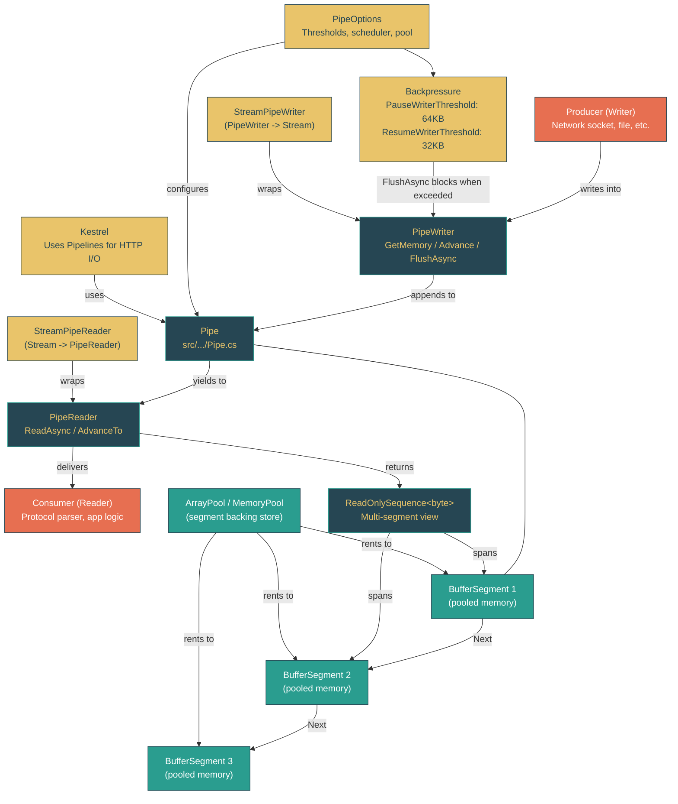

# Level 3: Advanced -- System.IO.Pipelines and High-Performance I/O

> **Target profile:** Developer building high-throughput I/O systems who needs to understand how Pipelines eliminates the buffer management problem
> **Estimated effort:** 5 hours
> **Prerequisites:** Module 3.1 (Memory Model: Span, Memory, and Buffers), Module 2.7 (Networking Fundamentals)
> [Version en espanol](../es/03-advanced-pipelines.md)

---

## Learning Objectives

After completing this module, you will be able to:

1. **Explain** why the traditional `Stream.Read` loop forces a tradeoff between buffer size, memory waste, and parsing complexity -- and how Pipelines eliminates that tradeoff.
2. **Describe** the producer-consumer contract between `PipeWriter` and `PipeReader`: `GetMemory`/`Advance`/`FlushAsync` on the write side, `ReadAsync`/`AdvanceTo` on the read side.
3. **Trace** how `BufferSegment` nodes form a linked list of pooled memory that allows data to flow from writer to reader without copies.
4. **Articulate** how backpressure works through `PauseWriterThreshold` and `ResumeWriterThreshold`, and why the default values (64KB pause, 32KB resume) prevent both memory exhaustion and thrashing.
5. **Navigate** the `Pipe` class internals: `_unconsumedBytes`, `_unflushedBytes`, `_readHead`, `_writingHead`, and the lock-based synchronization that coordinates producer and consumer.
6. **Implement** correct `ReadAsync`/`AdvanceTo` loops that distinguish between "consumed" and "examined" positions, avoiding both data loss and infinite re-reads.
7. **Integrate** Pipelines with existing `Stream`-based code using `StreamPipeReader` and `StreamPipeWriter`, understanding the bridging layer that Kestrel relies on.
8. **Compare** the allocation and throughput characteristics of Pipelines versus traditional `Stream.Read` patterns with concrete performance reasoning.

---

## Concept Map



---

## Curriculum

### Lesson 3.5.1: The Problem Pipelines Solves -- Why Stream.Read Is Not Enough

**What you'll learn:** Traditional `Stream` I/O forces developers to choose between wasteful large buffers and complex partial-read handling. Pipelines restructures the problem by separating buffer ownership from read/write operations.

**The concept:**

Consider the classic network reading pattern:

```csharp
// Traditional Stream.Read loop -- the "buffer management problem"
var buffer = new byte[4096];
while (true)
{
    int bytesRead = await stream.ReadAsync(buffer, 0, buffer.Length);
    if (bytesRead == 0) break;

    // Problem 1: What if our message spans multiple reads?
    // We need to accumulate data, but in which buffer?

    // Problem 2: What if the message is larger than 4096 bytes?
    // We need to resize, but then we copy data.

    // Problem 3: What if we parsed one message but have leftover
    // bytes from the next? We need to shift data to the front.
}
```

This pattern has three fundamental tensions:

**1. Buffer ownership is ambiguous.** The caller allocates the buffer, passes it to `ReadAsync`, gets data back in it, then must decide: keep this buffer while parsing, or copy data out? If you keep the buffer, you cannot read more data until parsing finishes. If you copy, you pay allocation and copy costs.

**2. No backpressure mechanism.** A `Stream` has no way to signal "stop sending, I'm falling behind." A fast producer will fill your buffer, you process it, and the producer fills it again -- with no coordination. If the consumer is slow, the only options are unbounded queuing (memory explosion) or dropping data.

**3. Partial reads require manual bookkeeping.** Network protocols frequently have messages that span multiple reads. The developer must track how many bytes are accumulated, detect message boundaries, handle the case where one read contains the end of one message and the start of the next, and manage the leftover bytes. This is the "buffer management problem" -- and it is the source of a huge class of bugs in network protocol implementations.

Pipelines solves all three problems with a single abstraction:

| Stream Problem | Pipelines Solution |
|---|---|
| Buffer ownership confusion | Pipe owns the buffers. Writer gets a `Memory<byte>` to write into; Reader gets a `ReadOnlySequence<byte>` to read from. Neither allocates or owns the underlying memory. |
| No backpressure | `FlushAsync` blocks the writer when unconsumed data exceeds `PauseWriterThreshold`. The writer resumes when the reader consumes enough to drop below `ResumeWriterThreshold`. |
| Partial read bookkeeping | `AdvanceTo(consumed, examined)` tells the Pipe exactly which bytes were processed and which were looked at but need more data. The Pipe keeps unprocessed bytes available for the next `ReadAsync`. |

The key insight is that Pipelines inverts the buffer relationship. With `Stream`, you create a buffer and hand it to the stream. With Pipelines, the pipe creates buffers and hands them to you. This is why it can pool, reuse, and manage buffer lifetimes without your involvement.

**In the source code:**
- `src/libraries/System.IO.Pipelines/src/System/IO/Pipelines/Pipe.cs` lines 49-83 -- The core state fields. Notice the separation: `_unconsumedBytes` (flushed but not consumed by reader) vs `_unflushedBytes` (written but not flushed). This two-phase tracking is what makes backpressure work precisely.
- `src/libraries/System.IO.Pipelines/src/System/IO/Pipelines/PipeWriter.cs` lines 61-72 -- The `GetMemory`/`GetSpan` contract: the Pipe gives you memory to write into, you tell it how much you wrote with `Advance`.
- `src/libraries/System.IO.Pipelines/src/System/IO/Pipelines/PipeReader.cs` lines 29-32 -- `ReadAsync` returns a `ValueTask<ReadResult>` containing a `ReadOnlySequence<byte>` -- the multi-segment view of all available data.

**Hands-on exercise:**

1. Open `src/libraries/System.IO.Pipelines/src/System/IO/Pipelines/Pipe.cs` and locate the `_unconsumedBytes` and `_unflushedBytes` fields (lines 50-53). Trace how `_unflushedBytes` increments in `AdvanceCore` (line 358) and how it transfers to `_unconsumedBytes` in `CommitUnsynchronized` (line 309). Why are these separate counters?
2. Write a simple Stream-based line reader that handles the case where a line spans two reads. Count the number of buffer copies and allocations you need. Then consider how `ReadOnlySequence<byte>` with `AdvanceTo` would eliminate them.
3. Read the `PipeWriter.GetMemory` doc comment (line 65-71). What happens if you call `GetMemory`, write some bytes, but never call `Advance`? Why is this important to understand?
4. In `PipeOptions.cs`, find the default `PauseWriterThreshold` (line 48: 65536 = 64KB). Calculate how many default-sized segments (4KB each, line 12) this represents. Why is the resume threshold half the pause threshold?

**Key takeaway:** Pipelines eliminates the buffer management problem by owning the buffers, providing backpressure, and tracking consumed/examined positions. The developer writes data into Pipe-owned memory and reads data from Pipe-provided sequences -- never managing buffer lifecycles directly.

---

### Lesson 3.5.2: Pipe, PipeReader, PipeWriter -- The Producer-Consumer Contract

**What you'll learn:** The `Pipe` class mediates between a producer (PipeWriter) and a consumer (PipeReader) through a carefully designed async contract. Understanding the exact sequence of method calls on each side is essential for correctness.

**The concept:**

A `Pipe` is a thread-safe, async-aware, producer-consumer channel for bytes. It exposes two sides:

```
Producer side (PipeWriter)         Consumer side (PipeReader)
─────────────────────────         ────────────────────────────
1. GetMemory(sizeHint)            1. ReadAsync()
   → Memory<byte>                    → ReadResult { Buffer, IsCompleted }
2. Write into the Memory          2. Parse the ReadOnlySequence<byte>
3. Advance(bytesWritten)          3. AdvanceTo(consumed, examined)
4. FlushAsync()                   4. Loop back to ReadAsync()
   → ValueTask<FlushResult>
5. Loop back to GetMemory()       5. Complete() when done
6. Complete() when done
```

**The writer side** follows the `IBufferWriter<byte>` pattern. `PipeWriter` implements this interface:

```csharp
// src/libraries/System.IO.Pipelines/src/System/IO/Pipelines/PipeWriter.cs, line 11
public abstract partial class PipeWriter : IBufferWriter<byte>
```

The critical method sequence:

1. **`GetMemory(sizeHint)`** -- The Pipe allocates (or reuses) a `BufferSegment` and returns a `Memory<byte>` slice of its available space. The `sizeHint` parameter is a minimum: if the current segment has fewer free bytes, a new segment is allocated. If `sizeHint` is 0, any non-empty buffer is returned.

2. **`Advance(bytesWritten)`** -- You tell the Pipe how many of those bytes you actually used. Internally this increments `_unflushedBytes` and `_writingHeadBytesBuffered`, and slides `_writingHeadMemory` forward:

```csharp
// Pipe.cs, lines 356-361
private void AdvanceCore(int bytesWritten)
{
    _unflushedBytes += bytesWritten;
    _writingHeadBytesBuffered += bytesWritten;
    _writingHeadMemory = _writingHeadMemory.Slice(bytesWritten);
}
```

3. **`FlushAsync()`** -- This is where the magic happens. `FlushAsync` calls `CommitUnsynchronized`, which transfers `_unflushedBytes` to `_unconsumedBytes`, updates the `_readTail`, and decides whether to wake the reader. If `_unconsumedBytes` crosses `PauseWriterThreshold`, the writer awaitable is set to uncompleted -- the writer blocks until the reader catches up.

**The reader side** uses `ReadAsync` and `AdvanceTo`:

1. **`ReadAsync()`** -- Returns a `ReadResult` containing a `ReadOnlySequence<byte>` that spans all unconsumed data. If no data is available and the writer has not completed, the call awaits asynchronously.

2. **`AdvanceTo(consumed, examined)`** -- This is the most misunderstood API in Pipelines. It takes two positions:
   - **`consumed`**: Everything before this position is permanently discarded. The Pipe returns consumed `BufferSegment` nodes to the pool.
   - **`examined`**: Everything up to this position has been looked at. If `examined` equals the end of the buffer, the Pipe knows you have seen everything and need more data -- the next `ReadAsync` will wait for the writer.

The distinction between consumed and examined is what makes partial-read handling zero-copy:

```csharp
// Correct pipeline reading loop
while (true)
{
    ReadResult result = await reader.ReadAsync();
    ReadOnlySequence<byte> buffer = result.Buffer;

    // Try to find a complete message
    if (TryParseMessage(buffer, out SequencePosition consumed, out Message message))
    {
        ProcessMessage(message);
        // consumed: everything up to and including the message
        // examined: same as consumed (we successfully parsed)
        reader.AdvanceTo(consumed);
    }
    else
    {
        // Not enough data for a complete message
        // consumed: buffer.Start (nothing consumed)
        // examined: buffer.End (we looked at everything)
        reader.AdvanceTo(buffer.Start, buffer.End);
    }

    if (result.IsCompleted) break;
}
```

If you pass `buffer.Start` as both consumed and examined (a common bug), the Pipe thinks you have not looked at any data and will return the same buffer immediately, creating an infinite loop that burns CPU.

**In the source code:**
- `src/libraries/System.IO.Pipelines/src/System/IO/Pipelines/Pipe.cs` lines 86-111 -- The constructor. Notice that `_writerAwaitable` starts completed (writers can write immediately) while `_readerAwaitable` starts uncompleted (readers wait for data).
- `src/libraries/System.IO.Pipelines/src/System/IO/Pipelines/Pipe.cs` lines 290-334 -- `CommitUnsynchronized`. Line 309: `_unconsumedBytes += _unflushedBytes` transfers the count. Lines 322-328: if unconsumed bytes cross the pause threshold, `_writerAwaitable.SetUncompleted()` blocks the writer.
- `src/libraries/System.IO.Pipelines/src/System/IO/Pipelines/Pipe.cs` lines 453-587 -- `AdvanceReader`. Lines 486-506: the examined-bytes calculation and backpressure release. When `_unconsumedBytes` drops below `ResumeWriterThreshold`, `_writerAwaitable.Complete()` unblocks the writer.
- `src/libraries/System.IO.Pipelines/src/System/IO/Pipelines/PipeReader.cs` lines 66-79 -- `ReadAtLeastAsyncCore`. This is a convenience wrapper that loops `ReadAsync` until at least `minimumSize` bytes are buffered. Notice the `AdvanceTo(buffer.Start, buffer.End)` on line 79: it examines everything but consumes nothing, telling the Pipe to accumulate more data.

**Hands-on exercise:**

1. In `Pipe.cs`, find the constructor (line 93). Why does `_writerAwaitable` start as `completed: true` while `_readerAwaitable` starts as `completed: false`? What would happen if these were reversed?
2. Trace the lifecycle of a single write-flush-read-advance cycle through the source code:
   - Writer calls `GetMemory(100)` -- find `AllocateWriteHeadIfNeeded` (line 161)
   - Writer calls `Advance(50)` -- find `AdvanceCore` (line 356)
   - Writer calls `FlushAsync()` -- find `PrepareFlushUnsynchronized` (line 382) and `CommitUnsynchronized` (line 290)
   - Reader calls `ReadAsync()` -- the reader awaitable was completed by the flush
   - Reader calls `AdvanceTo(consumed, examined)` -- find `AdvanceReader` (line 453)
3. Write a buggy pipeline reading loop where `AdvanceTo(buffer.Start, buffer.Start)` is called when parsing fails. Explain why this creates an infinite busy-wait.
4. In `ReadAtLeastAsyncCore` (PipeReader.cs line 66), explain why the method calls `AdvanceTo(buffer.Start, buffer.End)` rather than not calling `AdvanceTo` at all. What contract would be violated?

**Key takeaway:** The `Pipe` coordinates writer and reader through awaitables and byte counters. The writer-side contract is `GetMemory` -> write -> `Advance` -> `FlushAsync`. The reader-side contract is `ReadAsync` -> parse -> `AdvanceTo(consumed, examined)`. Getting the consumed/examined distinction right is the single most important thing for correct Pipelines usage.

---

### Lesson 3.5.3: Buffer Management -- BufferSegment and the Linked List of Pooled Memory

**What you'll learn:** The Pipe manages memory through a linked list of `BufferSegment` nodes, each backed by pooled arrays. Understanding this structure explains how data flows from writer to reader without copies and how memory is recycled.

**The concept:**

The `BufferSegment` class is the fundamental building block of Pipe's memory management:

```csharp
// src/libraries/System.IO.Pipelines/src/System/IO/Pipelines/BufferSegment.cs, line 10
internal sealed class BufferSegment : ReadOnlySequenceSegment<byte>
{
    private IMemoryOwner<byte>? _memoryOwner;
    private byte[]? _array;
    private BufferSegment? _next;
    private int _end;
    // ...
}
```

Each `BufferSegment` holds either an `IMemoryOwner<byte>` (from a `MemoryPool`) or a `byte[]` (from `ArrayPool<byte>.Shared`). It inherits from `ReadOnlySequenceSegment<byte>`, which provides the `Memory`, `Next`, and `RunningIndex` properties that make it part of a `ReadOnlySequence<byte>`.

The Pipe maintains three critical pointers into the linked list:

```
  _readHead          _readTail / _writingHead
     |                    |
     v                    v
 [Segment A] --> [Segment B] --> [Segment C]
  ^^^^^^^^        ^^^^^^^^        ^^^^^^^^^^
  consumed        unconsumed      writable
  (returned       (available      (writer's
   to pool)        to reader)      workspace)
```

- **`_readHead` / `_readHeadIndex`**: Start of the reader's visible data. Everything before this has been consumed.
- **`_readTail` / `_readTailIndex`**: End of the reader's visible data. Updated when the writer flushes.
- **`_writingHead` / `_writingHeadMemory`**: The segment the writer is currently writing into.

When the writer needs more space than the current segment has, a new segment is allocated and linked:

```csharp
// Pipe.cs, lines 210-214
BufferSegment newSegment = AllocateSegment(sizeHint);
_writingHead.SetNext(newSegment);
_writingHead = newSegment;
```

The `SetNext` method (BufferSegment.cs lines 107-121) links the segments and updates `RunningIndex` -- a running total of bytes across all prior segments. This index is what lets `ReadOnlySequence<byte>` compute its `Length` in O(1) and `Slice` in O(segments):

```csharp
// BufferSegment.cs, lines 125-128
internal static long GetLength(BufferSegment startSegment, int startIndex,
                                BufferSegment endSegment, int endIndex)
{
    return (endSegment.RunningIndex + (uint)endIndex) -
           (startSegment.RunningIndex + (uint)startIndex);
}
```

**Segment pooling** is how the Pipe avoids allocations in steady state. When the reader consumes a segment and calls `AdvanceTo`, the consumed segments are returned to a `BufferSegmentStack`:

```csharp
// Pipe.cs, lines 278-288
private void ReturnSegmentUnsynchronized(BufferSegment segment)
{
    if (_bufferSegmentPool.Count < _options.MaxSegmentPoolSize)
    {
        _bufferSegmentPool.Push(segment);
    }
}
```

And when the writer needs a new segment, it checks the pool first:

```csharp
// Pipe.cs, lines 268-276
private BufferSegment CreateSegmentUnsynchronized()
{
    if (_bufferSegmentPool.TryPop(out BufferSegment? segment))
    {
        return segment;
    }
    return new BufferSegment();
}
```

The pool has a default maximum of 256 segments (PipeOptions.cs line 45). With 4KB segments (PipeOptions.cs line 12), that is up to 1MB of pooled segment objects. The underlying memory for each segment comes from `ArrayPool<byte>.Shared` (or a custom `MemoryPool<byte>`), which has its own pooling layer.

**The Reset lifecycle** of a segment:

1. **Allocate**: `CreateSegmentUnsynchronized()` pops from pool or `new`s
2. **Rent memory**: `RentMemory()` gets a `byte[]` from `ArrayPool` or `IMemoryOwner` from `MemoryPool`
3. **Write**: Writer fills the segment via `GetMemory`/`Advance`
4. **Read**: Reader reads the segment via `ReadOnlySequence<byte>`
5. **Consume**: Reader calls `AdvanceTo`, segment is consumed
6. **Reset**: `BufferSegment.Reset()` releases memory back to pool, clears `Next` and `RunningIndex`
7. **Return**: Segment object is pushed back to `_bufferSegmentPool` for reuse

The `ResetMemory` method (BufferSegment.cs lines 73-92) shows the dual-path cleanup:

```csharp
// BufferSegment.cs, lines 73-92
public void ResetMemory()
{
    IMemoryOwner<byte>? memoryOwner = _memoryOwner;
    if (memoryOwner != null)
    {
        _memoryOwner = null;
        memoryOwner.Dispose();     // Returns to MemoryPool
    }
    else
    {
        ArrayPool<byte>.Shared.Return(_array);  // Returns to ArrayPool
        _array = null;
    }
    Memory = default;
    _end = 0;
    AvailableMemory = default;
}
```

**In the source code:**
- `src/libraries/System.IO.Pipelines/src/System/IO/Pipelines/BufferSegment.cs` -- The full file (136 lines). Read it end to end. Pay attention to `End` (property, line 22) which updates `Memory` on every set, and `WritableBytes` (line 101) which computes remaining space.
- `src/libraries/System.IO.Pipelines/src/System/IO/Pipelines/Pipe.cs` lines 160-266 -- The allocation path. `AllocateWriteHeadIfNeeded` -> `AllocateWriteHeadSynchronized` -> `AllocateSegment` -> `CreateSegmentUnsynchronized` + `RentMemory`. This is the hot path for writes.
- `src/libraries/System.IO.Pipelines/src/System/IO/Pipelines/Pipe.cs` lines 575-581 -- The deallocation path inside `AdvanceReader`. The `while` loop walks from `returnStart` to `returnEnd`, calling `Reset()` and `ReturnSegmentUnsynchronized()` on each consumed segment.
- `src/libraries/System.Memory/src/System/Buffers/ReadOnlySequence.cs` lines 15-45 -- The `ReadOnlySequence<T>` struct. Note `IsSingleSegment` (line 44): when the entire Pipe buffer fits in one segment, `ReadOnlySequence` optimizes to a simple memory range with no linked-list traversal.

**Hands-on exercise:**

1. Open `BufferSegment.cs` and draw the relationship between `AvailableMemory`, `End`, `Memory`, and `WritableBytes`. If `AvailableMemory.Length` is 4096 and `End` is 1000, what is `Memory.Length`? What is `WritableBytes`?
2. In `Pipe.cs`, trace what happens when the writer calls `GetMemory(8192)` but the current segment only has 500 bytes free (line 191: `bytesLeftInBuffer < sizeHint`). Follow the code to `AllocateSegment` and `SetNext`. How many segments are linked at the end?
3. Read `SetNext` in BufferSegment.cs (line 107). Why does it walk the entire chain to update `RunningIndex`? What would break if `RunningIndex` were stale?
4. Open `PipeOptions.cs` and find `InitialSegmentPoolSize` (line 42: 4) and `MaxSegmentPoolSize` (line 45: 256). With 4KB default segments, what is the maximum memory held by the segment pool? Why might this be acceptable even for memory-constrained applications?
5. In `Pipe.cs` line 200, find the branch where `_writingHead.Length == 0`. This handles a specific edge case: the writer called `GetMemory` but never wrote any bytes (or advanced 0). Why does the Pipe reuse the same segment with new memory instead of allocating a new segment?

**Key takeaway:** The Pipe's linked list of pooled `BufferSegment` nodes is what makes zero-copy I/O possible. The writer appends to the tail; the reader reads from the head; consumed segments are recycled back to the pool. In steady state, no memory allocation occurs -- segments and their backing arrays are continuously reused.

---

### Lesson 3.5.4: Backpressure and Flow Control -- Preventing Memory Exhaustion

**What you'll learn:** Pipelines implements backpressure through two thresholds that coordinate writer and reader speeds. This mechanism prevents fast producers from overwhelming slow consumers without requiring any code changes from the developer.

**The concept:**

Backpressure is the mechanism by which a consumer tells a producer "slow down." Without backpressure, a fast network socket writing into a slow parser will accumulate unbounded data in memory -- a common source of out-of-memory crashes in network servers.

`PipeOptions` controls backpressure through two thresholds:

```csharp
// PipeOptions.cs, lines 47-51
// By default, we'll throttle the writer at 64K of buffered data
const int DefaultPauseWriterThreshold = 65536;

// Resume threshold is 1/2 of the pause threshold to prevent thrashing at the limit
const int DefaultResumeWriterThreshold = DefaultPauseWriterThreshold / 2;
```

The two thresholds create a hysteresis band:

```
Memory usage
    |
64K |-------- PauseWriterThreshold --------  Writer BLOCKS (FlushAsync awaits)
    |                                         |
    |            Hysteresis band              |
    |            (no state change)            |
    |                                         |
32K |-------- ResumeWriterThreshold -------  Writer UNBLOCKS (FlushAsync completes)
    |
 0  |_____________________________________________ time
```

Why two thresholds instead of one? With a single threshold, imagine this scenario: the writer produces data at exactly the same rate the reader consumes it. Every time the buffer reaches the threshold, the writer pauses. The reader consumes one byte, the writer resumes, writes one byte, pauses again. This "thrashing" wastes enormous CPU on context switching.

With hysteresis (the gap between pause and resume), the writer pauses at 64KB and does not resume until the reader has consumed enough to reach 32KB. This gives the reader time to make meaningful progress before the writer runs again.

**How it works in the code:**

**Writer pausing** happens in `CommitUnsynchronized` (Pipe.cs lines 318-328):

```csharp
// Pipe.cs, lines 322-328
if (PauseWriterThreshold > 0 &&
    oldLength < PauseWriterThreshold &&
    _unconsumedBytes >= PauseWriterThreshold &&
    !_readerCompletion.IsCompleted)
{
    _writerAwaitable.SetUncompleted();
}
```

This only triggers when `_unconsumedBytes` *crosses* the threshold (was below, now at or above). The `_writerAwaitable.SetUncompleted()` call means the next `FlushAsync` will return an incomplete `ValueTask` -- the writer awaits asynchronously until the reader catches up.

**Writer resuming** happens in `AdvanceReader` (Pipe.cs lines 500-506):

```csharp
// Pipe.cs, lines 500-506
if (oldLength >= ResumeWriterThreshold &&
    _unconsumedBytes < ResumeWriterThreshold)
{
    Debug.Assert(examinedBytes > 0);
    _writerAwaitable.Complete(out completionData);
}
```

When the reader examines data and `_unconsumedBytes` drops below `ResumeWriterThreshold`, `_writerAwaitable.Complete()` wakes the writer.

**The examined-bytes subtlety:** Notice that backpressure is based on *examined* bytes, not consumed bytes. In `AdvanceReader` (line 492):

```csharp
_unconsumedBytes -= examinedBytes;
```

This means that even if the reader has not consumed the data (it might need more data to parse a complete message), examining it counts toward relieving backpressure. This is intentional: the reader has looked at the data and decided it needs more. If backpressure only released on consumption, a reader waiting for a large message could deadlock -- the writer would be paused, unable to send the remaining bytes the reader needs.

**Disabling backpressure:** Setting `PauseWriterThreshold` to 0 disables backpressure entirely -- `FlushAsync` never blocks. This is useful when you want unbounded buffering (e.g., writing to an in-memory pipe where the reader is guaranteed to keep up). But be cautious: without backpressure, a slow reader and fast writer will consume memory without limit.

**The deadlock guard:** The code at Pipe.cs line 319 contains a subtle but critical check:

```csharp
// We only apply back pressure if the reader isn't paused. This is important
// because if it is blocked then this could cause a deadlock.
```

If the reader is waiting for more data (its awaitable is uncompleted) and we also pause the writer, neither side can make progress. The code prevents this by only applying backpressure when the reader has been signaled (its awaitable is completed, meaning it has data to process).

**In the source code:**
- `src/libraries/System.IO.Pipelines/src/System/IO/Pipelines/PipeOptions.cs` lines 47-77 -- The threshold validation logic. Note lines 66-71: a `resumeWriterThreshold` of 0 is coerced to 1, because a threshold of 0 means the writer can never resume once paused.
- `src/libraries/System.IO.Pipelines/src/System/IO/Pipelines/Pipe.cs` lines 290-334 -- `CommitUnsynchronized`. The writer-pause logic is here.
- `src/libraries/System.IO.Pipelines/src/System/IO/Pipelines/Pipe.cs` lines 485-507 -- The examined-bytes calculation and writer-resume logic in `AdvanceReader`.
- `src/libraries/System.IO.Pipelines/src/System/IO/Pipelines/Pipe.cs` line 84 -- `Length` is simply `_unconsumedBytes`, the key counter driving backpressure.

**Hands-on exercise:**

1. In `PipeOptions.cs`, find the validation for `resumeWriterThreshold` (lines 66-71). Why is a value of 0 coerced to 1? What would happen if it stayed 0 and the writer was paused?
2. Trace through `CommitUnsynchronized` (Pipe.cs line 290) with a scenario: `_unconsumedBytes` is 60,000 and the writer flushes 5,000 more bytes. Does the writer pause? Now trace the reader examining 30,000 bytes in `AdvanceReader`. Does the writer resume?
3. Create a Pipe with custom options: `new PipeOptions(pauseWriterThreshold: 1024, resumeWriterThreshold: 512)`. Write a producer that writes 100 bytes at a time and a consumer that reads every 100ms. Observe when `FlushAsync` blocks and unblocks. You can detect blocking by timing how long `FlushAsync` takes.
4. Read the deadlock guard comment at Pipe.cs line 318. Construct a hypothetical scenario where removing this guard would cause a deadlock. (Hint: consider what happens when `_minimumReadBytes` is set and the reader is waiting for more data.)
5. In `PipeOptions.cs` line 74, find the validation: `resumeWriterThreshold > pauseWriterThreshold` throws. Why does this make no sense from a flow-control perspective? What would it mean to resume before you pause?

**Key takeaway:** Backpressure in Pipelines is automatic: if the reader falls behind, `FlushAsync` blocks the writer until the reader catches up. The hysteresis band between pause (64KB) and resume (32KB) prevents thrashing. Backpressure is driven by examined bytes (not consumed), preventing deadlocks when a reader needs more data to parse a complete message.

---

### Lesson 3.5.5: Integrating with Streams and Sockets -- StreamPipeReader/Writer and Kestrel

**What you'll learn:** Pipelines does not replace `Stream` -- it builds on top of it. `StreamPipeReader` and `StreamPipeWriter` bridge the two worlds, and Kestrel's use of Pipelines demonstrates why this architecture matters for real-world high-performance servers.

**The concept:**

Most I/O in .NET ultimately goes through `Stream`: `NetworkStream`, `FileStream`, `SslStream`. Pipelines provides bridge types to wrap any `Stream` as a `PipeReader` or `PipeWriter`:

```csharp
// Create a PipeReader from any Stream
PipeReader reader = PipeReader.Create(stream, new StreamPipeReaderOptions(
    bufferSize: 4096,
    minimumReadSize: 1024,
    leaveOpen: false
));

// Create a PipeWriter from any Stream
PipeWriter writer = PipeWriter.Create(stream, new StreamPipeWriterOptions(
    minimumBufferSize: 4096,
    leaveOpen: false
));
```

**`StreamPipeReader`** (the internal class behind `PipeReader.Create`) wraps a `Stream` and manages its own linked list of `BufferSegment` nodes -- the same segment pooling design as `Pipe`. When you call `ReadAsync`, it reads from the underlying stream into a segment, then presents the accumulated data as a `ReadOnlySequence<byte>`.

```csharp
// src/libraries/System.IO.Pipelines/src/System/IO/Pipelines/StreamPipeReader.cs, lines 13-14
internal sealed class StreamPipeReader : PipeReader
{
    internal const int InitialSegmentPoolSize = 4; // 16K
    internal const int MaxSegmentPoolSize = 256; // 1MB
```

Notice it mirrors the same constants as `Pipe`. The `StreamPipeReader` has its own `_bufferSegmentPool` (line 29) and its own `_readHead` / `_readTail` tracking (lines 21-24). It is essentially a simplified, read-only Pipe.

A key feature of `StreamPipeReader` is the `UseZeroByteReads` option. When enabled, the reader first issues a zero-byte `ReadAsync` on the underlying stream. This tells the stream "wake me up when data is available" without allocating a buffer. Only after the zero-byte read completes does it rent a buffer and read actual data. This is particularly effective with `SslStream` and `NetworkStream`, where a zero-byte read can wait efficiently at the OS level without holding a buffer pinned.

**Kestrel's architecture** is built on Pipelines. In ASP.NET Core's Kestrel web server, each connection has a `Pipe` pair:

```
Network Socket
    |
    v
[Transport Layer]  -- reads from socket, writes into Transport Pipe
    |
Transport Pipe (Pipe #1)
    |
    v
[HTTP Protocol Parser]  -- reads from Transport Pipe, parses HTTP frames
    |
Application Pipe (Pipe #2)
    |
    v
[Your Middleware / Controller]
```

The transport layer reads raw bytes from the socket and writes them into the transport Pipe. The HTTP protocol parser reads from that Pipe, parses request headers and body frames, and writes parsed content into the application Pipe. Your application code reads the request body from the application Pipe.

This design gives Kestrel several advantages:

1. **Zero-copy parsing**: The HTTP parser reads directly from Pipe segments. Header values are `ReadOnlySequence<byte>` slices pointing into the original socket read buffers -- no string allocation until needed.
2. **Natural backpressure**: If the application reads the request body slowly, the application Pipe applies backpressure to the HTTP parser, which stops reading from the transport Pipe, which stops reading from the socket. The TCP window fills, the client slows down. All automatic.
3. **Parallel read/write**: The two Pipes allow the transport to read and write simultaneously. While the application processes a request, the transport can already buffer the next request.

**When to use each pattern:**

| Scenario | Approach |
|---|---|
| Wrapping an existing Stream for pipeline-style parsing | `PipeReader.Create(stream)` |
| Writing pipeline output to an existing Stream | `PipeWriter.Create(stream)` |
| Building a producer-consumer channel between two async operations | `new Pipe()` directly |
| Building a network server with protocol parsing | `Pipe` pair (like Kestrel) |
| Simple one-shot reads | Just use `Stream` -- Pipelines adds complexity you do not need |

**In the source code:**
- `src/libraries/System.IO.Pipelines/src/System/IO/Pipelines/StreamPipeReader.cs` -- The bridge from `Stream` to `PipeReader`. Note the `UseZeroByteReads` option (line 56) and how it issues a zero-length read before allocating buffers.
- `src/libraries/System.IO.Pipelines/src/System/IO/Pipelines/StreamPipeWriter.cs` -- The bridge from `PipeWriter` to `Stream`. It buffers writes into segments and flushes to the underlying stream on `FlushAsync`.
- `src/libraries/System.IO.Pipelines/src/System/IO/Pipelines/StreamPipeReaderOptions.cs` -- Options including `BufferSize`, `MinimumReadSize`, `UseZeroByteReads`, and `LeaveOpen`.
- `src/libraries/System.IO.Pipelines/src/System/IO/Pipelines/StreamPipeExtensions.cs` -- Extension methods for `Stream` to integrate with Pipelines.
- `src/libraries/System.IO.Pipelines/src/System/IO/Pipelines/PipeReader.cs` -- The `Create(Stream, ...)` factory method that instantiates `StreamPipeReader`.

**Hands-on exercise:**

1. Open `StreamPipeReader.cs` and compare its structure to `Pipe.cs`. List the fields they share (segment pool, read head/tail, buffered bytes). What fields does `Pipe` have that `StreamPipeReader` does not? Why?
2. Write a program that reads a large file (100MB+) using three approaches and compare the allocation behavior (use `dotnet-counters` or `GC.GetAllocatedBytesForCurrentThread()`):
   - **Approach A**: `Stream.Read` into a fixed 4KB buffer
   - **Approach B**: `StreamReader.ReadLineAsync` (allocates a string per line)
   - **Approach C**: `PipeReader.Create(fileStream)` with a parsing loop that finds newlines in the `ReadOnlySequence<byte>`
3. Read `StreamPipeReaderOptions` and explain what `MinimumReadSize` controls. If `MinimumReadSize` is 1024 and you call `AdvanceTo` leaving 800 unprocessed bytes, will the next `ReadAsync` issue a stream read or return the existing buffer?
4. Design (on paper) the Pipe topology for a simple echo server: accept a TCP connection, read data from it, and write the same data back. How many Pipes do you need? Where does each pipe sit?
5. Research how Kestrel's `SocketConnection` class (in `aspnetcore` repository) creates its transport-level Pipes. What `PipeOptions` does it use for backpressure thresholds? (Hint: look for `InputOptions` and `OutputOptions` in the ASP.NET Core source.)

**Key takeaway:** `StreamPipeReader` and `StreamPipeWriter` bridge Streams and Pipelines, letting you use pipeline-style parsing on any existing `Stream`. Kestrel's architecture -- a pair of Pipes per connection with the protocol parser in between -- demonstrates how Pipelines enables zero-copy parsing, automatic backpressure, and concurrent read/write. Use `PipeReader.Create(stream)` when you need pipeline parsing; use `Pipe` directly when you need a producer-consumer channel.

---

## Source Code Reading Guide

Read these files in order. Each builds on the understanding from the previous.

| Order | File | What to focus on | Difficulty |
|---|---|---|---|
| 1 | `src/libraries/System.IO.Pipelines/src/System/IO/Pipelines/PipeOptions.cs` | Default threshold values (lines 47-51), segment size (line 12), pool sizes (lines 42-45). This is the simplest file and establishes all the constants referenced elsewhere. | :star: |
| 2 | `src/libraries/System.IO.Pipelines/src/System/IO/Pipelines/BufferSegment.cs` | The entire file (136 lines). Focus on: `End` property setting `Memory` (line 30), `WritableBytes` (line 101), `SetNext` and `RunningIndex` updates (lines 107-121), `ResetMemory` dual-path cleanup (lines 73-92). | :star::star: |
| 3 | `src/libraries/System.IO.Pipelines/src/System/IO/Pipelines/PipeWriter.cs` | The `IBufferWriter<byte>` interface implementation: `GetMemory` (line 72), `GetSpan` (line 80), `Advance` (line 63), `FlushAsync` (line 59). These are abstract methods -- the implementation is in `Pipe.cs`. | :star: |
| 4 | `src/libraries/System.IO.Pipelines/src/System/IO/Pipelines/PipeReader.cs` | `ReadAsync` (line 32), `AdvanceTo` (implicit), `ReadAtLeastAsyncCore` (line 66). Note the `consumed`/`examined` distinction in `AdvanceTo`. | :star::star: |
| 5 | `src/libraries/System.IO.Pipelines/src/System/IO/Pipelines/Pipe.cs` lines 1-120 | State fields (lines 28-83), constructor (lines 93-111). Map each field to its role: buffer pool, reader/writer awaitables, head/tail pointers, byte counters. | :star::star: |
| 6 | `src/libraries/System.IO.Pipelines/src/System/IO/Pipelines/Pipe.cs` lines 126-266 | The write path: `GetMemory` -> `AllocateWriteHeadIfNeeded` -> `AllocateWriteHeadSynchronized` -> `AllocateSegment` -> `CreateSegmentUnsynchronized` + `RentMemory`. Follow the segment allocation and linking. | :star::star::star: |
| 7 | `src/libraries/System.IO.Pipelines/src/System/IO/Pipelines/Pipe.cs` lines 290-416 | The flush path: `CommitUnsynchronized` (byte transfer, backpressure pause), `FlushAsync` -> `PrepareFlushUnsynchronized` (reader wakeup). | :star::star::star: |
| 8 | `src/libraries/System.IO.Pipelines/src/System/IO/Pipelines/Pipe.cs` lines 448-587 | The read/advance path: `AdvanceReader` (examined bytes, backpressure resume, segment return). This is the most complex method. | :star::star::star::star: |
| 9 | `src/libraries/System.IO.Pipelines/src/System/IO/Pipelines/StreamPipeReader.cs` | Lines 1-65: constructor, options, `AdvanceTo`. Compare the structure to `Pipe.cs`. Note the `UseZeroByteReads` optimization. | :star::star: |
| 10 | `src/libraries/System.Memory/src/System/Buffers/ReadOnlySequence.cs` | Lines 1-100: the multi-segment struct. `IsSingleSegment` optimization (line 44), `Start`/`End` positions, the segment-based constructor (line 94). | :star::star::star: |

---

## Diagnostic Tools and Commands

| Command / Tool | What it does | When to use it |
|---|---|---|
| `dotnet-counters monitor -n MyApp --counters System.IO.Pipelines` | Live Pipe metrics (if EventCounters are emitted) | Monitor pipe throughput and buffered bytes in real time |
| `dotnet-trace collect -n MyApp --providers System.Buffers.ArrayPoolEventSource` | Traces ArrayPool rent/return events | Verify that Pipe segments are being properly returned to the pool |
| `dotnet-counters monitor -n MyApp --counters System.Runtime` | GC collection counts and allocation rate | Confirm that Pipelines-based code has lower allocation rates than Stream-based alternatives |
| `dotnet-gcdump collect -n MyApp` | Heap snapshot | Check for leaked `BufferSegment` nodes that were not returned to the pool |
| `BenchmarkDotNet` | Micro-benchmarks with allocation tracking | Compare Pipelines vs Stream parsing performance with `[MemoryDiagnoser]` |
| `DOTNET_JitDisasm=*PipeReader*` | JIT disassembly for Pipe methods | Inspect whether critical methods like `AdvanceTo` are inlined |

---

## Self-Assessment

Test your understanding with these questions. Try answering before revealing the answer.

### Question 1: What are the three fundamental problems with Stream.Read that Pipelines solves?

<details>
<summary>Show answer</summary>

1. **Buffer ownership ambiguity**: With `Stream.Read`, the caller allocates the buffer and must decide whether to keep it during parsing or copy data out. Pipelines owns the buffers -- the writer gets memory from the Pipe, the reader gets a read-only view.

2. **No backpressure**: A `Stream` cannot signal the producer to slow down. Pipelines uses `PauseWriterThreshold` and `ResumeWriterThreshold` to block `FlushAsync` when the consumer falls behind.

3. **Partial read bookkeeping**: With Streams, developers must manually accumulate bytes across reads, detect message boundaries, and manage leftover bytes. Pipelines' `AdvanceTo(consumed, examined)` tells the Pipe exactly what was processed and what needs more data, keeping unprocessed bytes available for the next `ReadAsync`.

</details>

### Question 2: What is the difference between consumed and examined in AdvanceTo?

<details>
<summary>Show answer</summary>

- **`consumed`**: All data before this position is permanently discarded. The Pipe returns the corresponding `BufferSegment` nodes to the pool. You set this to the position after the last fully processed message.

- **`examined`**: All data up to this position has been looked at. If `examined` equals the end of the buffer, the Pipe knows you need more data and the next `ReadAsync` will wait for the writer. You set this to the end of the buffer when you cannot find a complete message.

The key behavior: if `examined` is not at the end of the buffer, `ReadAsync` returns immediately with the remaining data. If `examined` equals `buffer.End`, `ReadAsync` waits for new data from the writer. Setting both to `buffer.Start` when parsing fails creates an infinite busy-loop because the Pipe thinks you have not looked at any data.

</details>

### Question 3: Why are PauseWriterThreshold and ResumeWriterThreshold different values?

<details>
<summary>Show answer</summary>

The gap between the two thresholds creates a hysteresis band that prevents thrashing. If there were a single threshold, the writer would pause, the reader would consume one byte (dropping below the threshold), the writer would resume, write one byte (hitting the threshold again), and pause -- oscillating rapidly and wasting CPU on context switches.

With separate thresholds (default: 64KB pause, 32KB resume), the writer pauses at 64KB and stays paused until the reader reduces unconsumed bytes to 32KB. This ensures the reader makes 32KB of progress before the writer runs again, amortizing the cost of the context switch.

</details>

### Question 4: How does BufferSegment pooling achieve zero-allocation steady state?

<details>
<summary>Show answer</summary>

The `Pipe` maintains a `BufferSegmentStack` that caches up to `MaxSegmentPoolSize` (256) segment objects. When the writer needs a segment, `CreateSegmentUnsynchronized` first tries to pop from the pool before allocating with `new`. When the reader consumes a segment, `ReturnSegmentUnsynchronized` pushes it back to the pool.

Each segment's backing memory comes from `ArrayPool<byte>.Shared` (or a custom `MemoryPool`). When a segment is reset, its memory is returned to the array pool. When a segment is rented, memory is obtained from the array pool.

In steady state -- where the writer writes at roughly the same rate the reader consumes -- the same segment objects and their backing arrays cycle between writer and reader without any `new` allocations or GC pressure. The only allocations happen during startup or when the pipe grows beyond the pool's capacity.

</details>

### Question 5: When should you use PipeReader.Create(stream) versus new Pipe()?

<details>
<summary>Show answer</summary>

**`PipeReader.Create(stream)`** is the right choice when you have an existing `Stream` (e.g., `NetworkStream`, `FileStream`, `SslStream`) and want to use pipeline-style parsing (zero-copy, `ReadOnlySequence<byte>`, consumed/examined tracking) to process its output. The `StreamPipeReader` internally manages the segment list and reads from the stream on your behalf.

**`new Pipe()`** is the right choice when you need a producer-consumer channel between two independent async operations. The producer writes into `pipe.Writer` and the consumer reads from `pipe.Reader`, possibly on different threads. This is the pattern Kestrel uses: one Pipe for transport reads, another for application writes, with the HTTP parser in between.

Rule of thumb: if you are adapting an existing data source, use `PipeReader.Create`. If you are building a channel between components, use `Pipe`.

</details>

### Question 6: What is the role of ReadOnlySequence in the Pipelines architecture?

<details>
<summary>Show answer</summary>

`ReadOnlySequence<byte>` is the data type returned by `PipeReader.ReadAsync()`. It represents a logically contiguous sequence of bytes that may span multiple non-contiguous `BufferSegment` nodes in memory.

When the pipe buffer fits in a single segment, `ReadOnlySequence` degrades to a simple `ReadOnlyMemory<byte>` wrapper (`IsSingleSegment` returns `true`). When data spans multiple segments, it provides an enumerator that walks the linked list of segments.

This design is critical because it allows the reader to see all buffered data as a single logical sequence without copying segments together. Parsing code can search for delimiters, slice at boundaries, and extract sub-sequences -- all without allocating new buffers. The `SequencePosition` type returned by operations like `PositionOf` can be passed directly to `AdvanceTo` to mark consumed/examined positions.

</details>

### Practical Challenge (60-90 minutes)

**Build a line-delimited protocol parser using Pipelines:**

1. Create a `Pipe` and spawn two concurrent tasks: a producer and a consumer.
2. **Producer**: Write random-length lines (10-200 bytes each, terminated by `\n`) into `pipe.Writer` at a rate of 1000 lines per second. After 10,000 lines, call `Complete()`.
3. **Consumer**: Read from `pipe.Reader`, find newline boundaries in the `ReadOnlySequence<byte>`, count complete lines, and verify the total is 10,000. Use the consumed/examined pattern correctly:
   - `consumed` = position after the last `\n` found
   - `examined` = `buffer.End` if no complete line is found, `consumed` otherwise
4. Add backpressure: create the pipe with `new PipeOptions(pauseWriterThreshold: 4096, resumeWriterThreshold: 2048)`. Add timing around `FlushAsync` in the producer to observe when backpressure kicks in.
5. Compare the allocation behavior with an equivalent `MemoryStream` + `StreamReader.ReadLineAsync()` implementation using `GC.GetAllocatedBytesForCurrentThread()`.
6. Bonus: Modify the consumer to introduce artificial delay (e.g., `await Task.Delay(1)` per line). Observe how backpressure automatically throttles the producer.

---

## Connections

| Direction | Module | Topic |
|---|---|---|
| **Prerequisites** | Module 3.1: Memory Model (Span, Memory, and Buffers) | Understanding `Span<T>`, `Memory<T>`, `MemoryPool<T>`, `ArrayPool<T>` |
| **Prerequisites** | Module 2.7: Networking Fundamentals | Sockets, streams, and how data reaches the application |
| **Next** | Module 3.6: Channels and Async Producers/Consumers | `System.Threading.Channels` -- the higher-level producer-consumer abstraction built on similar principles |
| **Related** | Module 2.3: Async/Await Patterns | `ValueTask`, custom awaitables, and how `PipeAwaitable` implements `IValueTaskSource` |
| **Related** | Module 3.x: Kestrel Internals | How ASP.NET Core's web server uses Pipelines for HTTP parsing |
| **Index** | [Learning Path Index](00-index.md) | Full module listing and self-assessment |

---

## Glossary

| Term (EN) | Termino (ES) | Definition |
|---|---|---|
| **Pipe** | Pipe | The central class that coordinates a producer (PipeWriter) and consumer (PipeReader). Manages a linked list of memory segments, byte counters, and awaitables. |
| **PipeReader** | PipeReader | The consumer-side abstraction. `ReadAsync` returns a `ReadOnlySequence<byte>` of buffered data; `AdvanceTo` marks how much was consumed and examined. |
| **PipeWriter** | PipeWriter | The producer-side abstraction. Implements `IBufferWriter<byte>`. `GetMemory`/`GetSpan` provides writable memory; `Advance` reports bytes written; `FlushAsync` commits data and may block for backpressure. |
| **BufferSegment** | BufferSegment | An internal linked-list node that holds a pooled memory block. Inherits from `ReadOnlySequenceSegment<byte>`. Segments are pooled and recycled in steady state. |
| **ReadOnlySequence\<T\>** | ReadOnlySequence\<T\> | A struct representing a logically contiguous sequence of `T` values that may span multiple non-contiguous memory segments. Returned by `PipeReader.ReadAsync`. |
| **SequencePosition** | SequencePosition | An opaque position within a `ReadOnlySequence`. Used with `AdvanceTo` to mark consumed and examined positions. |
| **Backpressure** | Backpressure | The mechanism by which a consumer signals a producer to slow down. In Pipelines, `FlushAsync` blocks when unconsumed bytes exceed `PauseWriterThreshold`. |
| **PauseWriterThreshold** | PauseWriterThreshold | The number of unconsumed bytes at which `FlushAsync` begins blocking the writer. Default: 65,536 (64KB). |
| **ResumeWriterThreshold** | ResumeWriterThreshold | The number of unconsumed bytes at which a paused writer is unblocked. Default: 32,768 (32KB). Must be less than `PauseWriterThreshold`. |
| **Hysteresis** | Histeresis | The gap between pause and resume thresholds that prevents rapid oscillation (thrashing) between paused and running states. |
| **StreamPipeReader** | StreamPipeReader | Internal class that wraps a `Stream` as a `PipeReader`, managing its own segment list and reading from the stream on `ReadAsync`. Created via `PipeReader.Create(stream)`. |
| **StreamPipeWriter** | StreamPipeWriter | Internal class that wraps a `Stream` as a `PipeWriter`, buffering writes in segments and flushing to the stream. Created via `PipeWriter.Create(stream)`. |
| **Zero-byte read** | Lectura de cero bytes | A `ReadAsync` with a zero-length buffer, used to wait for data availability without allocating memory. Supported by `StreamPipeReader` via the `UseZeroByteReads` option. |
| **Consumed** | Consumido | Data that has been fully processed and can be discarded. The first parameter to `AdvanceTo`. |
| **Examined** | Examinado | Data that has been looked at but may need more data to process completely. The second parameter to `AdvanceTo`. |

---

## References

| Resource | Type | What it covers |
|---|---|---|
| [System.IO.Pipelines documentation](https://learn.microsoft.com/en-us/dotnet/standard/io/pipelines) | Official docs | Introduction to Pipelines with usage patterns and examples |
| [David Fowler -- Pipelines guidance](https://github.com/davidfowl/AspNetCoreDiagnosticScenarios/blob/master/Scenarios/Pipelines.md) | Guidance | Common mistakes, best practices, and anti-patterns |
| [Steve Gordon -- An introduction to System.IO.Pipelines](https://www.stevejgordon.co.uk/an-introduction-to-system-io-pipelines) | Blog | Step-by-step walkthrough of Pipelines concepts with benchmarks |
| [Marc Gravell -- Pipelines: a guided tour](https://blog.marcgravell.com/2018/07/pipe-dreams-part-1.html) | Blog | Deep dive into the segment list design and performance characteristics |
| [Pipe.cs source](https://source.dot.net/#System.IO.Pipelines/System/IO/Pipelines/Pipe.cs) | Source | The complete Pipe implementation with all synchronization and state management |
| [Stephen Toub -- Performance Improvements in .NET (annual series)](https://devblogs.microsoft.com/dotnet/) | Blog | Covers Pipelines performance improvements across .NET releases |
| [Kestrel architecture documentation](https://learn.microsoft.com/en-us/aspnet/core/fundamentals/servers/kestrel) | Official docs | How ASP.NET Core's web server uses Pipelines for connection handling |
| [ReadOnlySequence\<T\> design](https://learn.microsoft.com/en-us/dotnet/standard/io/buffers) | Official docs | Working with `ReadOnlySequence<T>`, `SequenceReader<T>`, and multi-segment buffers |
