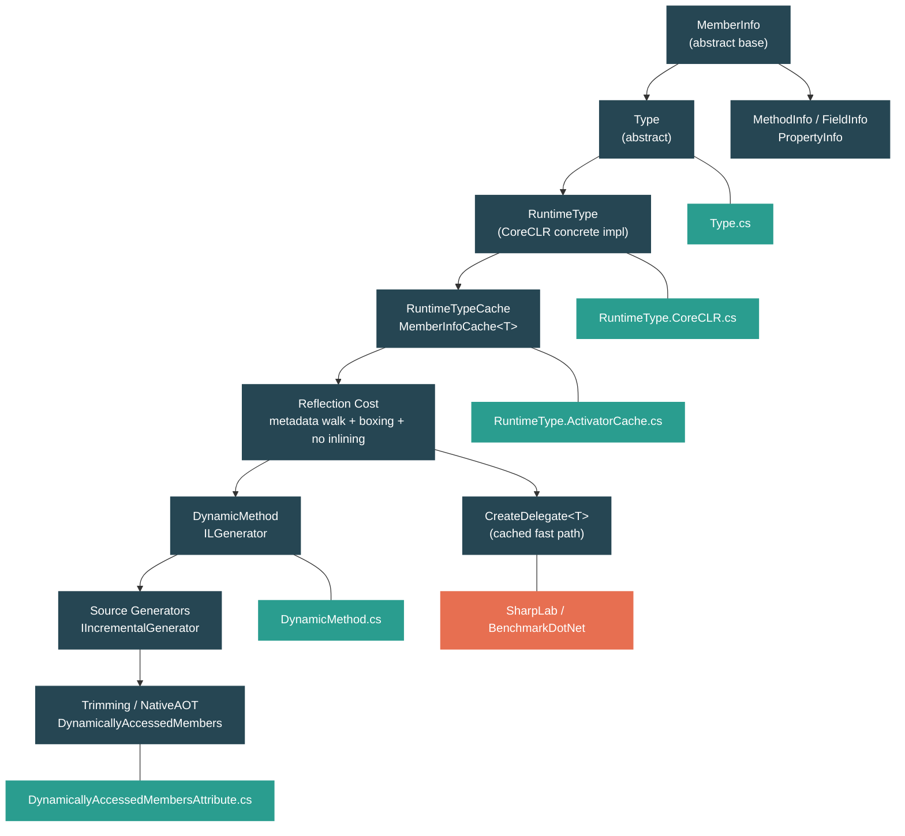

# Level 3: Advanced — Reflection, Emit, and Source Generators

> **Target profile:** Developer who uses reflection but wants to understand its cost and alternatives
> **Estimated effort:** 6 hours
> **Prerequisites:** [Level 2 complete](02-practitioner-generics.md) (especially 2.1 Generics)
> [Version en espanol](../es/03-advanced-reflection.md)

---

## Learning Objectives

By the end of this module you will be able to:

1. Describe the reflection object model hierarchy (`MemberInfo` -> `Type`, `MethodInfo`, `PropertyInfo`, `FieldInfo`) and explain how each maps to CLI metadata tables.
2. Trace the path from `Type.GetType()` to CoreCLR's `RuntimeType` and explain why `Type` is abstract while `RuntimeType` is the concrete implementation you always receive at runtime.
3. Explain why `GetMethod` and `MethodInfo.Invoke` are slow by walking through the `RuntimeTypeCache`, `MemberInfoCache<T>`, and `GetMethodCandidates` machinery.
4. Implement and explain caching strategies using `MethodInfo.CreateDelegate<T>()` to eliminate per-call reflection overhead.
5. Generate IL at runtime using `DynamicMethod` and `ILGenerator`, and explain when dynamic code generation is warranted over other alternatives.
6. Describe the source generator model (`IIncrementalGenerator`) and explain how it replaces reflection-based patterns with compile-time code generation.
7. Explain why NativeAOT and trimming break reflection, how `[DynamicallyAccessedMembers]` preserves metadata, and the fundamental tradeoff between reflection flexibility and ahead-of-time compilation.

---

## Concept Map



---

## Curriculum

### Lesson 1 — The Reflection Object Model

#### What you'll learn

Reflection is the ability to inspect and manipulate type metadata at runtime. Every type, method, field, and property in a .NET assembly has a corresponding reflection object. In this lesson you will understand the class hierarchy that models this metadata and how it maps to the underlying CLI tables.

#### The concept

The reflection hierarchy is rooted in `MemberInfo`:

```
MemberInfo                       (abstract base for all metadata)
  +-- Type                       (abstract: describes a type)
  |     +-- TypeInfo             (richer view, extends Type)
  |           +-- RuntimeType    (CoreCLR's concrete implementation)
  +-- MethodBase                 (abstract: methods and constructors)
  |     +-- MethodInfo           (abstract: describes a method)
  |     |     +-- RuntimeMethodInfo  (CoreCLR concrete)
  |     +-- ConstructorInfo      (abstract: describes a constructor)
  |           +-- RuntimeConstructorInfo
  +-- FieldInfo                  (abstract: describes a field)
  |     +-- RuntimeFieldInfo     (CoreCLR concrete)
  +-- PropertyInfo               (abstract: describes a property)
  |     +-- RuntimePropertyInfo
  +-- EventInfo                  (abstract: describes an event)
        +-- RuntimeEventInfo
```

Every abstract type in the hierarchy defines a contract. The concrete `Runtime*` types are the implementations you actually receive when you call `typeof(Foo)` or `obj.GetType()`. You never directly instantiate `RuntimeType` — the runtime creates it for you.

Each reflection object corresponds to a row in the assembly's metadata tables (defined by ECMA-335):

| Reflection Type | CLI Metadata Table |
|---|---|
| `Type` / `TypeInfo` | TypeDef or TypeRef |
| `MethodInfo` | MethodDef |
| `FieldInfo` | FieldDef |
| `PropertyInfo` | Property |
| `ConstructorInfo` | MethodDef (with `.ctor` / `.cctor` name) |
| `Assembly` | Assembly table |

#### In the source code

Open `src/libraries/System.Private.CoreLib/src/System/Type.cs`. The class declaration reveals the dual inheritance:

```csharp
public abstract partial class Type : MemberInfo, IReflect
{
    protected Type() { }

    public override MemberTypes MemberType => MemberTypes.TypeInfo;
```

`Type` extends `MemberInfo` (it IS a member — a nested type is a member of its enclosing type) and implements `IReflect` (the legacy COM interop reflection interface). The class is `abstract` and `partial` — different files contribute different platform-specific behavior.

Notice how type queries are implemented through the Template Method pattern:

```csharp
public bool IsArray => IsArrayImpl();
protected abstract bool IsArrayImpl();
public bool IsByRef => IsByRefImpl();
protected abstract bool IsByRefImpl();
```

The public `bool` properties delegate to `protected abstract` methods. This lets `RuntimeType` override the implementation with optimized paths (e.g., checking a single flag bit on the `MethodTable`) while the abstract `Type` class defines the API contract.

Open `src/libraries/System.Private.CoreLib/src/System/Reflection/MethodInfo.cs`:

```csharp
public abstract partial class MethodInfo : MethodBase
{
    public override MemberTypes MemberType => MemberTypes.Method;

    public virtual ParameterInfo ReturnParameter => throw NotImplemented.ByDesign;
    public virtual Type ReturnType => throw NotImplemented.ByDesign;
```

`MethodInfo` extends `MethodBase` (shared base with `ConstructorInfo`). The `CreateDelegate` methods are defined here — they are the key to escaping reflection overhead, as we will see in Lesson 3:

```csharp
public virtual Delegate CreateDelegate(Type delegateType) { throw new NotSupportedException(...); }
public T CreateDelegate<T>() where T : Delegate => (T)CreateDelegate(typeof(T));
```

`FieldInfo` and `PropertyInfo` follow the same pattern. Open `src/libraries/System.Private.CoreLib/src/System/Reflection/FieldInfo.cs`:

```csharp
public abstract partial class FieldInfo : MemberInfo
{
    public override MemberTypes MemberType => MemberTypes.Field;
    public abstract FieldAttributes Attributes { get; }
    public abstract Type FieldType { get; }
```

Each reflection type exposes the metadata attributes from its CLI table (`FieldAttributes`, `MethodAttributes`, `TypeAttributes`) as computed properties — `IsStatic`, `IsPublic`, `IsInitOnly` — that are all simple bitmask checks against the `Attributes` value.

#### Hands-on exercise

1. Explore the hierarchy at runtime:
   ```csharp
   Type t = typeof(string);
   Console.WriteLine(t.GetType().FullName); // System.RuntimeType
   MethodInfo m = t.GetMethod("Contains", new[] { typeof(string) });
   Console.WriteLine(m.GetType().FullName); // System.Reflection.RuntimeMethodInfo
   FieldInfo f = typeof(int).GetField("MaxValue");
   Console.WriteLine(f.GetType().FullName); // System.Reflection.RuntimeFieldInfo
   ```
2. Inspect the `MemberInfo` base class:
   ```csharp
   MemberInfo[] members = typeof(List<int>).GetMembers();
   foreach (var group in members.GroupBy(m => m.MemberType))
       Console.WriteLine($"{group.Key}: {group.Count()} members");
   ```
3. Compare `Type` and `TypeInfo`:
   ```csharp
   Type t = typeof(Dictionary<string, int>);
   TypeInfo ti = t.GetTypeInfo(); // same object, richer API
   Console.WriteLine(ReferenceEquals(t, ti)); // True on CoreCLR
   ```

#### Key takeaway

The reflection object model is a hierarchy of abstract classes (`Type`, `MethodInfo`, `FieldInfo`, `PropertyInfo`) that mirror the CLI metadata tables. You never see the concrete `Runtime*` implementations directly, but they are the only types that ever exist at runtime. Every property query (`IsPublic`, `IsStatic`, `IsArray`) is ultimately a bitmask check against metadata attributes.

#### Common misconception

> *"`typeof(string)` creates a new `Type` object each time."*
>
> No. `typeof(T)` always returns the singleton `RuntimeType` instance for that type. The runtime maintains exactly one `RuntimeType` per loaded type. `typeof(string) == typeof(string)` is always `true`, and it is an identity comparison — no deep equality check needed.

---

### Lesson 2 — RuntimeType: The Real Implementation

#### What you'll learn

When you call `Type.GetType("System.String")` or `typeof(string)`, the object you receive is not `Type` — it is `RuntimeType`, CoreCLR's internal sealed class that implements the entire reflection API over live runtime metadata. This lesson traces how type resolution works and what `RuntimeType` caches to make repeated queries efficient.

#### The concept

`Type` is abstract. The runtime cannot return an instance of an abstract class. Instead, CoreCLR's type loader creates a `RuntimeType` for every type it loads. This `RuntimeType` holds a handle to the native `MethodTable` (the runtime's internal type representation) and uses it to answer every query:

```
typeof(string)
  -> [runtime intrinsic]
  -> Locates the MethodTable for System.String
  -> Wraps it in a RuntimeType instance (or returns cached one)
  -> Returns to you as Type
```

The critical performance structure inside `RuntimeType` is the `RuntimeTypeCache`. It caches all member lookups so that the second call to `GetMethods()` does not re-walk the metadata:

```
RuntimeType
  -> RuntimeTypeCache (one per RuntimeType)
       -> MemberInfoCache<RuntimeMethodInfo>     (methods)
       -> MemberInfoCache<RuntimeConstructorInfo> (constructors)
       -> MemberInfoCache<RuntimeFieldInfo>       (fields)
       -> MemberInfoCache<RuntimePropertyInfo>    (properties)
       -> MemberInfoCache<RuntimeEventInfo>       (events)
```

Each `MemberInfoCache<T>` is lazily populated: the first call to `GetMethodList()` walks the metadata and builds the cache; subsequent calls return the cached array. The cache also maintains hash tables for case-sensitive and case-insensitive name lookups.

#### In the source code

Open `src/coreclr/System.Private.CoreLib/src/System/RuntimeType.CoreCLR.cs`. The class declaration:

```csharp
internal sealed partial class RuntimeType : TypeInfo, ICloneable
```

It is `internal` (never exposed as a public type), `sealed` (no further derivation), and `partial` (split across multiple files). It extends `TypeInfo`, which itself extends `Type`.

Inside `RuntimeType`, the `RuntimeTypeCache` is defined as a nested class:

```csharp
internal sealed class RuntimeTypeCache
{
    internal enum CacheType
    {
        Method,
        Constructor,
        Field,
        Property,
        Event,
        Interface,
        NestedType
    }
```

The `MemberInfoCache<T>` nested within it shows the caching strategy:

```csharp
private sealed class MemberInfoCache<T> where T : MemberInfo
{
    private CerHashtable<string, T[]?> m_csMemberInfos;   // case-sensitive
    private CerHashtable<string, T[]?> m_cisMemberInfos;  // case-insensitive
    private T[]? m_allMembers;
    private bool m_cacheComplete;
```

When you call `type.GetMethod("Foo")`, the flow is:

1. `RuntimeType.GetMethodImpl()` calls `GetMethodImplCommon()`.
2. `GetMethodImplCommon()` calls `GetMethodCandidates()`.
3. `GetMethodCandidates()` calls `Cache.GetMethodList(listType, name)`.
4. `GetMethodList()` delegates to `GetMemberList()` which checks the cache.
5. On cache miss, `PopulateMethods()` iterates every method on the type (and its base types) using native `RuntimeTypeHandle.GetIntroducedMethods()`.
6. Each method handle is wrapped in a `RuntimeMethodInfo` and stored.

The `PopulateMethods` function reveals the real cost of the first reflection call:

```csharp
private unsafe RuntimeMethodInfo[] PopulateMethods(Filter filter)
{
    ListBuilder<RuntimeMethodInfo> list = default;
    RuntimeType declaringType = ReflectedType;

    // Walk the type hierarchy
    do
    {
        foreach (RuntimeMethodHandleInternal methodHandle
            in RuntimeTypeHandle.GetIntroducedMethods(declaringType))
        {
            // Filter by name (case-sensitive or case-insensitive)
            if (filter.RequiresStringComparison())
            {
                if (!filter.Match(RuntimeMethodHandle.GetUtf8Name(methodHandle)))
                    continue;
            }

            MethodAttributes methodAttributes =
                RuntimeMethodHandle.GetAttributes(methodHandle);
            // ... compute binding flags, create RuntimeMethodInfo, add to list
        }
    }
    while ((declaringType = declaringType.GetBaseType()!) != null);
```

This walks up the entire inheritance chain, calling into native code (`GetIntroducedMethods`, `GetAttributes`, `GetUtf8Name`) for every method on every type in the hierarchy. This is why the first `GetMethod` call is expensive — and why the caching layer exists.

#### Hands-on exercise

1. Verify that `RuntimeType` is what you get:
   ```csharp
   Type t = Type.GetType("System.String");
   Console.WriteLine(t.GetType().Name);     // RuntimeType
   Console.WriteLine(t.GetType().IsPublic); // False — it's internal
   ```
2. Observe caching by timing repeated calls:
   ```csharp
   var sw = System.Diagnostics.Stopwatch.StartNew();
   for (int i = 0; i < 100_000; i++)
       typeof(string).GetMethod("Contains", new[] { typeof(string) });
   Console.WriteLine($"Cached: {sw.ElapsedMilliseconds}ms");
   // Compare with first call which populates the cache
   ```
3. Explore the cache types:
   ```csharp
   // Each of these populates a different MemberInfoCache<T>
   var methods = typeof(string).GetMethods();        // MemberInfoCache<RuntimeMethodInfo>
   var fields = typeof(string).GetFields();          // MemberInfoCache<RuntimeFieldInfo>
   var props = typeof(string).GetProperties();       // MemberInfoCache<RuntimePropertyInfo>
   var ctors = typeof(string).GetConstructors();     // MemberInfoCache<RuntimeConstructorInfo>
   ```

#### Key takeaway

`RuntimeType` is the single concrete implementation of `Type` on CoreCLR. It wraps a native `MethodTable` handle and lazily builds a `RuntimeTypeCache` containing `MemberInfoCache<T>` for each member kind. The first reflection call on a type pays the cost of walking the metadata; subsequent calls hit the cache. Understanding this two-phase behavior is critical for performance-sensitive code.

#### Common misconception

> *"Each call to `GetMethod()` re-scans the metadata."*
>
> Only the first call does. After the `MemberInfoCache<RuntimeMethodInfo>` is populated, subsequent lookups are hash table lookups against the cached arrays. The real cost is not `GetMethod` itself but what you do with the result — namely `Invoke`, which we cover next.

---

### Lesson 3 — The Cost of Reflection

#### What you'll learn

Reflection is slow. But "slow" is meaningless without understanding why. In this lesson you will trace the `MethodInfo.Invoke` path, understand the sources of overhead (argument validation, boxing, security checks, no JIT inlining), and learn caching strategies that reduce reflection cost by 10-100x.

#### The concept

When you call `methodInfo.Invoke(obj, args)`, here is what happens:

1. **Argument validation**: The runtime checks that the number of arguments matches the parameter count, that each argument is assignable to the parameter type, and that the target object is of the correct type.
2. **Boxing**: All arguments are passed as `object[]`. Value-type arguments must be boxed. Return values are boxed too.
3. **Security checks**: The runtime verifies that the caller has permission to access the member (visibility checks, potentially `ReflectionPermission`).
4. **No JIT optimization**: The call goes through a generic dispatch path. The JIT cannot inline it, cannot devirtualize it, cannot eliminate null checks, and cannot apply any of its normal optimizations.

Compare the cost of three calling strategies:

| Strategy | Relative Cost | Why |
|---|---|---|
| Direct call `obj.Method()` | 1x (baseline) | JIT-compiled, potentially inlined |
| Cached delegate via `CreateDelegate<T>()` | 1-2x | Type-safe delegate call, JIT can inline |
| `MethodInfo.Invoke(obj, args)` | 50-100x | Boxing, validation, no inlining |
| `Type.InvokeMember(...)` | 100-200x | Name lookup + Invoke combined |

The key optimization is `MethodInfo.CreateDelegate<T>()`:

```csharp
// Slow: reflection invoke
MethodInfo method = typeof(string).GetMethod("Contains", new[] { typeof(string) });
bool result = (bool)method.Invoke("hello world", new object[] { "world" }); // boxing!

// Fast: cached delegate
var contains = method.CreateDelegate<Func<string, string, bool>>();
bool result2 = contains("hello world", "world"); // direct call, no boxing
```

`CreateDelegate` compiles a type-safe delegate that calls the method directly. Once created, calling the delegate is nearly as fast as a direct method call — the JIT can inline it, there is no boxing, and no argument validation on every call.

For `Activator.CreateInstance`, CoreCLR has a dedicated fast path through `ActivatorCache`:

```csharp
internal sealed unsafe class ActivatorCache
{
    private readonly delegate*<void*, object?> _pfnAllocator;
    private readonly void* _allocatorFirstArg;
    private readonly delegate*<object?, void> _pfnRefCtor;
```

The `ActivatorCache` stores raw function pointers to the allocator and constructor. After the first call, `Activator.CreateInstance<T>()` becomes a two-step process: call the allocator function pointer to get raw memory, then call the constructor function pointer on it. No reflection dispatch, no `MethodInfo.Invoke` — just managed `calli` instructions through cached function pointers.

#### In the source code

Open `src/coreclr/System.Private.CoreLib/src/System/RuntimeType.CoreCLR.cs` and look at `GetMethodImplCommon`:

```csharp
private MethodInfo? GetMethodImplCommon(
    string? name, int genericParameterCount,
    BindingFlags bindingAttr, Binder? binder,
    CallingConventions callConv,
    Type[]? types, ParameterModifier[]? modifiers)
{
    ListBuilder<MethodInfo> candidates =
        GetMethodCandidates(name, genericParameterCount,
            bindingAttr, callConv, types, false);

    if (candidates.Count == 0)
        return null;

    if (types == null || types.Length == 0)
    {
        MethodInfo firstCandidate = candidates[0];
        if (candidates.Count == 1)
        {
            return firstCandidate;
        }
        // ... ambiguity resolution
    }

    binder ??= DefaultBinder;
    return binder.SelectMethod(bindingAttr, candidates.ToArray(), types, modifiers)
        as MethodInfo;
}
```

Even after the cache is populated, every `GetMethod` call must: build a `ListBuilder` of candidates, apply filtering (`FilterApplyMethodInfo`), handle ambiguity, and potentially invoke the `Binder`. This is overhead that a direct call or cached delegate skips entirely.

Now open `src/coreclr/System.Private.CoreLib/src/System/RuntimeType.ActivatorCache.cs` to see how `Activator.CreateInstance` is optimized:

```csharp
private ActivatorCache(RuntimeType rt)
{
    rt.CreateInstanceCheckThis();

    RuntimeTypeHandle.GetActivationInfo(rt,
        out _pfnAllocator!, out _allocatorFirstArg,
        out _pfnRefCtor!, out _pfnValueCtor!, out _ctorIsPublic);
```

`GetActivationInfo` is a QCall into the runtime that extracts function pointers for allocation and construction. Once cached:

```csharp
[MethodImpl(MethodImplOptions.AggressiveInlining)]
internal object? CreateUninitializedObject(RuntimeType rt)
{
    object? retVal = _pfnAllocator(_allocatorFirstArg);
    GC.KeepAlive(rt);
    return retVal;
}

[MethodImpl(MethodImplOptions.AggressiveInlining)]
internal void CallRefConstructor(object? uninitializedObject)
    => _pfnRefCtor(uninitializedObject);
```

This is as fast as object creation gets — a managed `calli` to a function pointer, with `AggressiveInlining` to eliminate the method call overhead. The `GC.KeepAlive(rt)` ensures the type is not collected while the allocator is using its `MethodTable*`.

#### Hands-on exercise

1. Benchmark the three strategies:
   ```csharp
   var method = typeof(int).GetMethod("CompareTo", new[] { typeof(int) });
   var del = method.CreateDelegate<Func<int, int, int>>();

   // Strategy 1: Direct call
   int a = 42;
   int r1 = a.CompareTo(7);

   // Strategy 2: Cached delegate
   int r2 = del(42, 7);

   // Strategy 3: Reflection invoke
   int r3 = (int)method.Invoke(42, new object[] { 7 });
   ```
   Use `Stopwatch` or BenchmarkDotNet to compare 1M iterations of each.

2. Measure `Activator.CreateInstance` vs `new`:
   ```csharp
   // Fast: direct construction
   var obj1 = new StringBuilder();

   // Slower first call, then cached:
   var obj2 = Activator.CreateInstance<StringBuilder>();
   ```

3. Explore the boxing cost of `Invoke`:
   ```csharp
   MethodInfo m = typeof(int).GetMethod("ToString", Type.EmptyTypes);
   // Every call boxes the int argument AND the return value
   object result = m.Invoke(42, null); // 42 is boxed
   ```

#### Key takeaway

Reflection's overhead comes from four sources: argument boxing into `object[]`, runtime type validation, security checks, and the inability of the JIT to optimize the call. The escape hatch is `MethodInfo.CreateDelegate<T>()`, which compiles a type-safe delegate that the JIT can optimize like any other call. For object creation, `ActivatorCache` caches raw function pointers, making `Activator.CreateInstance` nearly as fast as `new` after the first call.

#### Common misconception

> *"`Activator.CreateInstance` is always slow because it uses reflection."*
>
> On the first call, yes — it must resolve the constructor and build the `ActivatorCache`. But subsequent calls for the same type use cached function pointers (`delegate*<void*, object?>`) and are nearly as fast as `new`. The cache is stored per-type and persists for the lifetime of the process.

---

### Lesson 4 — Reflection.Emit and DynamicMethod

#### What you'll learn

Sometimes you need to generate code at runtime — not just call existing methods through reflection, but create entirely new methods. `System.Reflection.Emit` provides this capability, and `DynamicMethod` is the lightweight entry point. In this lesson you will understand when runtime code generation is appropriate, how `ILGenerator` works, and what `[RequiresDynamicCode]` means for your library's compatibility.

#### The concept

`DynamicMethod` lets you create a method at runtime by emitting IL instructions directly:

```csharp
// Create a method: int Add(int a, int b) => a + b;
var dm = new DynamicMethod("Add", typeof(int), new[] { typeof(int), typeof(int) });
var il = dm.GetILGenerator();
il.Emit(OpCodes.Ldarg_0);    // push a
il.Emit(OpCodes.Ldarg_1);    // push b
il.Emit(OpCodes.Add);        // a + b
il.Emit(OpCodes.Ret);        // return

var add = dm.CreateDelegate<Func<int, int, int>>();
Console.WriteLine(add(3, 4)); // 7
```

The IL you emit is the same IL the C# compiler produces. The JIT compiles it to native code when the delegate is first invoked. After that, calls are as fast as any JIT-compiled method.

Common use cases for Reflection.Emit:

| Use Case | Why Emit? | Alternative Today |
|---|---|---|
| Serialization (JSON/XML) | Generate typed readers/writers per type | Source generators |
| ORM data binding | Generate property setters without reflection | Source generators |
| Expression compilation | `Expression<T>.Compile()` uses Emit internally | Source generators for known shapes |
| Mock frameworks | Generate subclasses at runtime | Still requires Emit |
| AOP / interception | Generate proxy classes | Still requires Emit |

The broader `Reflection.Emit` API includes `AssemblyBuilder`, `ModuleBuilder`, `TypeBuilder`, and `MethodBuilder` — a full set of types for generating entire assemblies at runtime. `DynamicMethod` is the lightweight alternative when you just need a single method without creating a type or assembly.

#### In the source code

Open `src/libraries/System.Private.CoreLib/src/System/Reflection/Emit/DynamicMethod.cs`:

```csharp
public sealed partial class DynamicMethod : MethodInfo
{
    private static Module? s_anonymouslyHostedDynamicMethodsModule;
```

`DynamicMethod` extends `MethodInfo` — a dynamic method IS a method as far as the reflection system is concerned. It can be introspected, its parameters can be queried, and it can create delegates. The `s_anonymouslyHostedDynamicMethodsModule` is a synthetic module that hosts dynamic methods that are not associated with any specific type or module.

Notice the `[RequiresDynamicCode]` attribute on every constructor:

```csharp
[RequiresDynamicCode("Creating a DynamicMethod requires dynamic code.")]
public DynamicMethod(string name,
                     Type? returnType,
                     Type[]? parameterTypes)
```

This attribute is the trimmer/NativeAOT compatibility marker. It signals that this API cannot work in environments that do not support runtime code generation (we cover this in Lesson 6).

Open `src/libraries/System.Private.CoreLib/src/System/Reflection/Emit/ILGenerator.cs`:

```csharp
public abstract class ILGenerator
{
    public abstract void Emit(OpCode opcode);
    public abstract void Emit(OpCode opcode, int arg);
    public abstract void Emit(OpCode opcode, MethodInfo meth);
    // ...
    public abstract Label DefineLabel();
    public abstract void MarkLabel(Label loc);
    public abstract LocalBuilder DeclareLocal(Type localType);
```

`ILGenerator` is abstract — the concrete implementation depends on the runtime. It provides overloads of `Emit` for each operand type (none, `byte`, `int`, `MethodInfo`, `Type`, etc.), plus structural methods for labels, locals, and exception handling (`BeginExceptionBlock`, `BeginCatchBlock`).

The initialization of the dynamic methods module shows how the runtime handles the hosting:

```csharp
private static Module? s_anonymouslyHostedDynamicMethodsModule;
private static readonly object s_anonymouslyHostedDynamicMethodsModuleLock = new object();
```

Dynamic methods need a module to resolve token references. When no specific module or type is provided, the runtime creates a shared anonymous module. This module has no assembly-level permissions restrictions, which is why `DynamicMethod` has a `skipVisibility` parameter — it controls whether the generated IL can access private members of other types.

#### Hands-on exercise

1. Create a dynamic property getter:
   ```csharp
   // Instead of propertyInfo.GetValue(obj) (reflection invoke, boxing)
   // generate a typed delegate

   PropertyInfo prop = typeof(string).GetProperty("Length");
   var dm = new DynamicMethod("GetLength", typeof(int),
       new[] { typeof(string) }, typeof(string).Module);

   var il = dm.GetILGenerator();
   il.Emit(OpCodes.Ldarg_0);
   il.EmitCall(OpCodes.Callvirt, prop.GetGetMethod(), null);
   il.Emit(OpCodes.Ret);

   var getLength = dm.CreateDelegate<Func<string, int>>();
   Console.WriteLine(getLength("hello")); // 5
   ```

2. Compare performance: `PropertyInfo.GetValue` vs emitted delegate:
   ```csharp
   PropertyInfo prop = typeof(string).GetProperty("Length");
   var getter = dm.CreateDelegate<Func<string, int>>();

   // Time 1M iterations of each
   // prop.GetValue("test") — slow (boxing, validation)
   // getter("test") — fast (direct call, no boxing)
   ```

3. Explore the `skipVisibility` parameter:
   ```csharp
   // With skipVisibility: true, you can access private fields
   var dm = new DynamicMethod("ReadPrivate", typeof(object),
       new[] { typeof(object) },
       typeof(List<int>).Module, skipVisibility: true);
   ```

#### Key takeaway

`DynamicMethod` and `ILGenerator` let you generate JIT-compiled methods at runtime. Once the delegate is created, calls are as fast as compiled C#. This makes Emit the traditional solution for performance-critical reflection scenarios — serializers, ORMs, and mock frameworks all use it. However, Emit is incompatible with NativeAOT and trimming, which is why source generators are increasingly preferred.

#### Common misconception

> *"Reflection.Emit is an alternative to reflection."*
>
> Emit is a *complement* to reflection, not a replacement. You typically use reflection to discover the structure of a type (which fields it has, which constructor to call) and then use Emit to generate optimized code for that structure. The discovery is still reflection; Emit just eliminates the per-call reflection overhead.

---

### Lesson 5 — Source Generators: Compile-Time Metaprogramming

#### What you'll learn

Source generators move the work that reflection and Emit do at runtime to compile time. Instead of inspecting types and generating IL when your application runs, a source generator inspects types and generates C# source code when the compiler runs. The result is ordinary code that the JIT can optimize fully — no reflection, no Emit, no runtime cost.

#### The concept

A source generator is a compiler plugin that:

1. Runs during compilation (as part of `dotnet build`).
2. Receives the compilation's syntax trees and semantic model.
3. Generates new C# source files that are added to the compilation.
4. Cannot modify existing source — only add new files.

The modern API is `IIncrementalGenerator` (replacing the older `ISourceGenerator`):

```csharp
[Generator]
public class MyGenerator : IIncrementalGenerator
{
    public void Initialize(IncrementalGeneratorInitializationContext context)
    {
        // Register a pipeline that:
        // 1. Finds types marked with [MyAttribute]
        // 2. Transforms them into a model
        // 3. Generates source code for each

        var pipeline = context.SyntaxProvider
            .ForAttributeWithMetadataName(
                "MyNamespace.MyAttribute",
                predicate: (node, _) => node is ClassDeclarationSyntax,
                transform: (ctx, _) => /* extract model from syntax/symbol */)
            .Where(m => m is not null);

        context.RegisterSourceOutput(pipeline, (spc, model) =>
        {
            spc.AddSource($"{model.Name}.g.cs", /* generated C# source */);
        });
    }
}
```

The "incremental" design means the generator only re-runs when its inputs change. If you modify a file that does not affect the generator's pipeline, it skips regeneration entirely.

What source generators replace:

| Runtime Pattern | Source Generator Equivalent |
|---|---|
| `typeof(T).GetProperties()` loop | Generator emits typed property accessors at compile time |
| `Activator.CreateInstance(type)` | Generator emits `new ConcreteType()` at compile time |
| `JsonSerializer` reflection fallback | `System.Text.Json` source generator emits typed serializer |
| `IServiceProvider` runtime resolution | Generator emits known registrations at compile time |

The `System.Text.Json` source generator is the flagship example in this repository. Instead of using reflection to discover properties at runtime, it generates a `JsonTypeInfo<T>` for each type at compile time, containing pre-computed property metadata, typed getters/setters, and constructor delegates.

#### In the source code

Source generators in the dotnet/runtime repository live alongside the libraries they augment. The JSON source generator, for instance, is at `src/libraries/System.Text.Json/gen/`. Generators are packaged as analyzers and shipped as part of the NuGet package for the library.

The key architectural insight is that source generators produce code that looks like what you would write by hand. A generated serializer for a `Person` class might produce:

```csharp
// Auto-generated — do not edit
internal static void Serialize(Utf8JsonWriter writer, Person value)
{
    writer.WriteStartObject();
    writer.WriteString("name", value.Name);    // direct property access, not reflection
    writer.WriteNumber("age", value.Age);       // no GetProperty/GetValue
    writer.WriteEndObject();
}
```

This generated code has zero reflection overhead. The JIT can inline the property accesses, devirtualize the writer calls, and apply all its normal optimizations.

#### Hands-on exercise

1. Use the JSON source generator in a test project:
   ```csharp
   [JsonSerializable(typeof(Person))]
   internal partial class PersonJsonContext : JsonSerializerContext { }

   public class Person
   {
       public string Name { get; set; }
       public int Age { get; set; }
   }

   // Use the generated context instead of reflection-based serialization
   string json = JsonSerializer.Serialize(
       new Person { Name = "Alice", Age = 30 },
       PersonJsonContext.Default.Person);
   ```

2. Inspect the generated code. After building, look in `obj/Debug/net9.0/generated/` for the `.g.cs` files produced by the generator. Notice the typed property accessors — no reflection.

3. Compare startup time between reflection-based and source-generated JSON serialization. The source-generated version avoids the cold-start penalty of reflection-based type discovery.

#### Key takeaway

Source generators shift metaprogramming from runtime to compile time. They produce ordinary C# code that the JIT optimizes fully. For new library designs, prefer source generators over reflection when the types are known at compile time. The tradeoff: source generators require more upfront engineering and only work for types visible during compilation.

#### Common misconception

> *"Source generators can modify existing source code."*
>
> They cannot. Source generators are *additive only* — they generate new files. If you need to modify behavior of an existing class, you generate a `partial` class that extends it. This constraint is intentional: it means generators cannot break existing code and their output is always inspectable.

---

### Lesson 6 — Trimming and Reflection

#### What you'll learn

NativeAOT and IL trimming compile your application ahead of time, removing unused code to produce small, fast binaries. But reflection discovers members at runtime — the trimmer cannot know which methods or properties you will reflect over. This fundamental tension between reflection and ahead-of-time compilation is resolved through annotations: `[DynamicallyAccessedMembers]`, `[RequiresUnreferencedCode]`, and `[RequiresDynamicCode]`. In this lesson you will understand the tradeoffs and learn to write trimming-safe code.

#### The concept

**The problem**: When the trimmer analyzes your code, it follows static call graphs. If no code calls `Person.Name`, the trimmer removes the property. But if you call `typeof(Person).GetProperty("Name")`, the trimmer sees a string literal — it does not know at compile time that this string refers to `Person.Name`. The property gets trimmed, and `GetProperty` returns `null` at runtime.

**The annotations**:

| Attribute | Meaning | Applied to |
|---|---|---|
| `[DynamicallyAccessedMembers(types)]` | "I will reflect over these member kinds on this type" | Parameters, fields, return values of type `Type` or `string` |
| `[RequiresUnreferencedCode(msg)]` | "This method is unsafe for trimming" | Methods that use reflection in ways the trimmer cannot analyze |
| `[RequiresDynamicCode(msg)]` | "This method generates code at runtime" | Methods using `Reflection.Emit`, `Expression.Compile`, etc. |

Example of a trimming-safe API:

```csharp
// The annotation tells the trimmer: "preserve public properties on T"
public void PrintProperties<[DynamicallyAccessedMembers(
    DynamicallyAccessedMemberTypes.PublicProperties)] T>(T obj)
{
    foreach (var prop in typeof(T).GetProperties())
        Console.WriteLine($"{prop.Name} = {prop.GetValue(obj)}");
}
```

Without the annotation, the trimmer would remove the properties of `T` because it sees no static code accessing them. With the annotation, the trimmer knows to preserve all public properties of whatever type is passed as `T`.

**The hierarchy of trimming safety**:

1. **Best**: No reflection at all. Use source generators, compile-time code generation, or direct code.
2. **Good**: Annotated reflection. Use `[DynamicallyAccessedMembers]` to declare what you need.
3. **Acceptable**: `[RequiresUnreferencedCode]` — you mark the method as unsafe and let the caller decide.
4. **Worst**: Unannotated reflection. The code silently breaks when trimmed.

#### In the source code

Open `src/libraries/System.Private.CoreLib/src/System/Diagnostics/CodeAnalysis/DynamicallyAccessedMembersAttribute.cs`:

```csharp
[AttributeUsage(
    AttributeTargets.Field | AttributeTargets.ReturnValue |
    AttributeTargets.GenericParameter | AttributeTargets.Parameter |
    AttributeTargets.Property | AttributeTargets.Method |
    AttributeTargets.Class | AttributeTargets.Interface |
    AttributeTargets.Struct,
    Inherited = false)]
public sealed class DynamicallyAccessedMembersAttribute : Attribute
{
    public DynamicallyAccessedMembersAttribute(
        DynamicallyAccessedMemberTypes memberTypes)
    {
        MemberTypes = memberTypes;
    }

    public DynamicallyAccessedMemberTypes MemberTypes { get; }
}
```

The attribute can be applied to almost anything — parameters, fields, return values, generic type parameters. The `DynamicallyAccessedMemberTypes` enum is a flags enum with values like `PublicMethods`, `NonPublicFields`, `PublicConstructors`, etc.

Now look at how the runtime uses this attribute. In `RuntimeType.CoreCLR.cs`, the `GetMethodImpl` override is annotated:

```csharp
[DynamicallyAccessedMembers(DynamicallyAccessedMemberTypes.PublicMethods
    | DynamicallyAccessedMemberTypes.NonPublicMethods)]
protected override MethodInfo? GetMethodImpl(
    string name, int genericParameterCount,
    BindingFlags bindingAttr, ...)
```

This tells the trimmer: "when this method is called, preserve both public and non-public methods on the target type." The annotation flows through the trimmer's data-flow analysis — if you call `type.GetMethod("Foo")`, the trimmer follows the `[DynamicallyAccessedMembers]` annotation to determine which members to preserve.

Also notice how `Assembly.DefinedTypes` is annotated:

```csharp
public virtual IEnumerable<TypeInfo> DefinedTypes
{
    [RequiresUnreferencedCode("Types might be removed")]
    get
    {
        Type[] types = GetTypes();
```

The `[RequiresUnreferencedCode]` annotation means: "calling this property may fail after trimming because the trimmer may have removed types." Any code that calls this property will produce a trimmer warning, forcing the developer to either suppress the warning (accepting the risk) or find a trimming-safe alternative.

#### Hands-on exercise

1. Create a trimming-unsafe method and observe the warning:
   ```csharp
   // This produces trimmer warning IL2026
   static void PrintType(string typeName)
   {
       Type? t = Type.GetType(typeName);
       foreach (var m in t?.GetMethods() ?? Array.Empty<MethodInfo>())
           Console.WriteLine(m.Name);
   }
   ```
   Build with `<PublishTrimmed>true</PublishTrimmed>` and observe the warnings.

2. Fix it with annotations:
   ```csharp
   static void PrintType(
       [DynamicallyAccessedMembers(DynamicallyAccessedMemberTypes.PublicMethods)]
       Type type)
   {
       foreach (var m in type.GetMethods())
           Console.WriteLine(m.Name);
   }
   ```

3. Test NativeAOT compatibility:
   ```csharp
   // This works with NativeAOT because the type is statically known
   typeof(string).GetMethods();

   // This may fail because the trimmer cannot know what typeName resolves to
   Type.GetType(someString).GetMethods();
   ```

#### Key takeaway

Trimming and NativeAOT remove unused code at publish time, but reflection discovers code at runtime. The `[DynamicallyAccessedMembers]` attribute bridges this gap by telling the trimmer which members to preserve. `[RequiresUnreferencedCode]` marks methods that cannot be made trimming-safe. `[RequiresDynamicCode]` marks methods that require runtime code generation (Emit, Expression.Compile). For new code, prefer source generators and static patterns that avoid reflection entirely.

#### Common misconception

> *"NativeAOT does not support reflection at all."*
>
> NativeAOT supports reflection for types and members that the compiler can statically determine will be needed. `typeof(MyClass).GetProperties()` works if `MyClass` is referenced in your code. What NativeAOT cannot support is *unbounded* reflection — `Type.GetType(userInput)` for an arbitrary string, or `Assembly.LoadFrom()` loading unknown assemblies. The annotations exist precisely to tell the compiler what reflection your code will perform.

---

## Source Code Reading Guide

These are the key files for this module. Difficulty ratings reflect the conceptual complexity for a Level 3 reader.

| # | File | Difficulty | What to look for |
|---|---|---|---|
| 1 | `src/libraries/System.Private.CoreLib/src/System/Type.cs` | Two stars | Abstract base, `IsArrayImpl`/`IsByRefImpl` Template Method pattern, `IReflect` |
| 2 | `src/libraries/System.Private.CoreLib/src/System/Reflection/MethodInfo.cs` | Two stars | `CreateDelegate<T>()` — the key to escaping reflection overhead |
| 3 | `src/libraries/System.Private.CoreLib/src/System/Reflection/PropertyInfo.cs` | Two stars | `GetValue`/`SetValue` overloads, how indexers are modeled |
| 4 | `src/libraries/System.Private.CoreLib/src/System/Reflection/FieldInfo.cs` | Two stars | `FieldAttributes` bitmask properties, `RuntimeFieldHandle` |
| 5 | `src/libraries/System.Private.CoreLib/src/System/Reflection/Assembly.cs` | Two stars | `DefinedTypes` with `[RequiresUnreferencedCode]`, `s_loadfile` cache |
| 6 | `src/coreclr/System.Private.CoreLib/src/System/RuntimeType.CoreCLR.cs` | Four stars | `RuntimeTypeCache`, `MemberInfoCache<T>`, `PopulateMethods`, `GetMethodCandidates`, `GetMethodImplCommon` |
| 7 | `src/coreclr/System.Private.CoreLib/src/System/RuntimeType.ActivatorCache.cs` | Three stars | Function pointer caching for `Activator.CreateInstance`, `delegate*<void*, object?>` |
| 8 | `src/libraries/System.Private.CoreLib/src/System/Reflection/Emit/DynamicMethod.cs` | Three stars | `[RequiresDynamicCode]`, anonymous hosting module, `skipVisibility` |
| 9 | `src/libraries/System.Private.CoreLib/src/System/Reflection/Emit/ILGenerator.cs` | Three stars | Abstract `Emit` overloads, `DefineLabel`/`MarkLabel` for control flow |
| 10 | `src/libraries/System.Private.CoreLib/src/System/Diagnostics/CodeAnalysis/DynamicallyAccessedMembersAttribute.cs` | Two stars | The trimmer annotation that bridges runtime reflection and ahead-of-time compilation |

**Reading strategy**: Start with files 1-4 to understand the abstract reflection API. Then read file 6 (the most important file) to see how CoreCLR implements it — focus on `RuntimeTypeCache` and `PopulateMethods`. File 7 shows the `Activator.CreateInstance` fast path. Files 8-9 cover Emit. File 10 is short but critical for understanding trimming.

---

## Diagnostic Tools and Commands

| Tool / Technique | What it shows | How to use |
|---|---|---|
| [BenchmarkDotNet](https://benchmarkdotnet.org/) | Precise cost of reflection vs delegates vs direct calls | Compare `Invoke` vs `CreateDelegate<T>()` vs direct call with `[MemoryDiagnoser]` for allocation tracking |
| [SharpLab](https://sharplab.io/) | IL for reflection calls vs direct calls | Paste both versions; observe `callvirt` vs `call` and boxing instructions |
| `dotnet publish -p:PublishTrimmed=true` | Trimmer warnings for unsafe reflection | Shows IL2026/IL2046/IL2075 warnings for unannotated reflection |
| `dotnet publish -r <rid> -p:PublishAot=true` | NativeAOT compatibility | Reveals which reflection patterns survive ahead-of-time compilation |
| `ILSpy` / `ILVerify` | Inspect emitted IL from DynamicMethod | Save emitted method body and decompile to verify correctness |
| `DOTNET_JitDisasm` env variable | View JIT output for delegate vs reflection dispatch | Compare native code for `CreateDelegate` result vs `MethodInfo.Invoke` |
| `typeof(T).GetType().FullName` | Verify concrete runtime type | Confirms you always receive `RuntimeType`, `RuntimeMethodInfo`, etc. |

---

## Self-Assessment

### Questions

1. **Why is `Type` abstract if every runtime call returns a concrete `RuntimeType`?** What design pattern does this represent, and what benefit does it provide?

2. **Trace what happens when you call `typeof(MyClass).GetMethod("Foo")` for the first time.** Name each cache layer and data structure involved, from the `RuntimeType` through `RuntimeTypeCache` to `PopulateMethods`.

3. **Why is `MethodInfo.Invoke(obj, args)` 50-100x slower than a direct method call?** List at least four sources of overhead.

4. **Explain how `MethodInfo.CreateDelegate<Func<string, int>>()` eliminates reflection overhead.** What happens at the JIT level when you call the resulting delegate?

5. **How does `ActivatorCache` make `Activator.CreateInstance` fast after the first call?** What is stored in `_pfnAllocator` and `_pfnRefCtor`?

6. **What does `[DynamicallyAccessedMembers(DynamicallyAccessedMemberTypes.PublicProperties)]` tell the trimmer?** What happens if you omit this annotation and publish with trimming enabled?

7. **When would you choose `DynamicMethod` over a source generator?** Give one scenario where Emit is necessary and one where a source generator is better.

### Practical Challenge

Write a reflection-free property copier that uses three different strategies and benchmark them:

1. **Pure reflection**: `foreach (var prop in type.GetProperties()) destProp.SetValue(dest, srcProp.GetValue(src))`.
2. **Cached delegates**: Use `MethodInfo.CreateDelegate` to create typed getter/setter delegates for each property.
3. **DynamicMethod**: Use `ILGenerator` to emit a method that copies all properties in a single compiled method body.

```csharp
public class Person
{
    public string Name { get; set; }
    public int Age { get; set; }
    public DateTime BirthDate { get; set; }
}
```

<details>
<summary>Hint for Strategy 2</summary>

```csharp
var props = typeof(Person).GetProperties();
var copiers = new List<Action<Person, Person>>();
foreach (var prop in props)
{
    var getter = prop.GetGetMethod().CreateDelegate<Func<Person, object>>();
    var setter = prop.GetSetMethod().CreateDelegate<Action<Person, object>>();
    copiers.Add((src, dst) => setter(dst, getter(src)));
}
// Now use copiers in a loop — much faster than GetValue/SetValue
```

For even better performance, use strongly typed delegates per property type (e.g., `Func<Person, string>` for `Name`, `Func<Person, int>` for `Age`) to avoid boxing value types.
</details>

<details>
<summary>Hint for Strategy 3</summary>

```csharp
var dm = new DynamicMethod("CopyPerson", null,
    new[] { typeof(Person), typeof(Person) },
    typeof(Person).Module, skipVisibility: true);

var il = dm.GetILGenerator();
foreach (var prop in typeof(Person).GetProperties())
{
    il.Emit(OpCodes.Ldarg_1);                              // dest
    il.Emit(OpCodes.Ldarg_0);                              // src
    il.EmitCall(OpCodes.Callvirt, prop.GetGetMethod(), null); // src.get_Prop()
    il.EmitCall(OpCodes.Callvirt, prop.GetSetMethod(), null); // dest.set_Prop(value)
}
il.Emit(OpCodes.Ret);

var copy = dm.CreateDelegate<Action<Person, Person>>();
// copy(source, destination) — compiled, no reflection overhead
```
</details>

---

## Connections

| Direction | Module | Relationship |
|---|---|---|
| **Previous** | [2.1 — Generics](02-practitioner-generics.md) | Generics interact heavily with reflection: `Type.MakeGenericType`, `MethodInfo.MakeGenericMethod`, and the generic dictionary all build on concepts from Module 2.1. |
| **Related** | [2.7 — System.Text.Json](02-practitioner-json.md) | The JSON library's source generator is the best example of replacing reflection with compile-time code generation in this repository. |
| **Deeper** | [3.8 — NativeAOT Internals](03-advanced-nativeaot.md) | How the ahead-of-time compiler analyzes reflection usage and what `rd.xml` / `ILLink.Substitutions.xml` do. |
| **Deeper** | [4.2 — Type System Internals](04-expert-type-system.md) | The native MethodTable and EEClass structures that `RuntimeType` wraps. |

---

## Glossary

| Term | Definition |
|---|---|
| **MemberInfo** | Abstract base class for all reflection objects (types, methods, fields, properties, events). Every member of a type is represented by a subclass of `MemberInfo`. |
| **RuntimeType** | CoreCLR's internal sealed class that is the concrete implementation of `Type`. Every `typeof()` call and `GetType()` call returns a `RuntimeType` instance. |
| **RuntimeTypeCache** | A per-type cache inside `RuntimeType` that stores arrays of `RuntimeMethodInfo`, `RuntimeFieldInfo`, etc. Lazily populated on first reflection query, then reused. |
| **MemberInfoCache\<T\>** | The typed cache within `RuntimeTypeCache` that holds members of a specific kind. Contains hash tables for case-sensitive and case-insensitive name lookups. |
| **CreateDelegate\<T\>()** | Method on `MethodInfo` that compiles a type-safe delegate for the reflected method. Eliminates per-call reflection overhead (no boxing, no validation, JIT can inline). |
| **ActivatorCache** | CoreCLR's internal cache for `Activator.CreateInstance`. Stores function pointers (`delegate*<void*, object?>`) to the allocator and constructor for fast repeated object creation. |
| **DynamicMethod** | A `MethodInfo` subclass that allows generating IL at runtime. Lightweight alternative to full `Reflection.Emit` (no need to create types or assemblies). |
| **ILGenerator** | The API for emitting IL instructions into a `DynamicMethod` or `MethodBuilder`. Provides `Emit`, `DefineLabel`, `DeclareLocal`, and exception handling methods. |
| **IIncrementalGenerator** | The modern source generator API. A compiler plugin that generates C# source files during compilation, replacing runtime reflection with compile-time code generation. |
| **DynamicallyAccessedMembers** | An attribute that tells the trimmer which reflection operations a method will perform, allowing it to preserve the necessary metadata for trimmed/NativeAOT builds. |
| **RequiresUnreferencedCode** | An attribute marking a method as unsafe for trimming. Callers receive a compiler warning, forcing them to acknowledge the trimming risk. |
| **RequiresDynamicCode** | An attribute marking a method as requiring runtime code generation (Emit, Expression.Compile). Incompatible with NativeAOT. |
| **Trimming** | The process of removing unreachable code and metadata from a published application. Reduces binary size but can break reflection that references removed members. |
| **NativeAOT** | Ahead-of-time compilation for .NET that produces a native binary without a JIT. Supports annotated reflection but cannot support unbounded dynamic type loading or Emit. |

---

## References

| Resource | Type | Relevance |
|---|---|---|
| [Book of the Runtime — Type System Overview](https://github.com/dotnet/runtime/blob/main/docs/design/coreclr/botr/type-system.md) | Design doc | Covers RuntimeType, MethodTable, and how reflection maps to native structures |
| [ECMA-335 Standard, Section II.22 — Metadata Tables](https://www.ecma-international.org/publications-and-standards/standards/ecma-335/) | Specification | The formal definition of TypeDef, MethodDef, FieldDef tables that reflection surfaces |
| [Trimming Documentation](https://learn.microsoft.com/en-us/dotnet/core/deploying/trimming/trim-self-contained) | Official docs | How to prepare code for trimming, annotation guide |
| [Source Generator Cookbook](https://github.com/dotnet/roslyn/blob/main/docs/features/incremental-generators.md) | Design doc | IIncrementalGenerator API design and patterns |
| [System.Text.Json Source Generator](https://learn.microsoft.com/en-us/dotnet/standard/serialization/system-text-json/source-generation) | Official docs | Flagship example of replacing reflection with source generation |
| [BenchmarkDotNet](https://benchmarkdotnet.org/) | Tool | Measure reflection vs delegate vs direct call overhead |
| [Andrew Lock — Creating a source generator](https://andrewlock.net/series/creating-a-source-generator/) | Blog series | Practical walkthrough of building an incremental source generator |

---

*Next module: [3.8 — NativeAOT Internals](03-advanced-nativeaot.md)*
