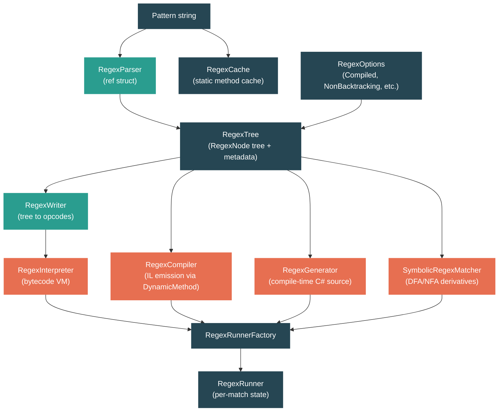

# Level 3: Advanced -- Regular Expressions: The Compiled Engine

> **Target profile:** Developer who uses regex but doesn't understand the engine internals -- parsing, compilation strategies, or when to choose which engine
> **Estimated effort:** 4 hours
> **Prerequisites:** [Level 2 -- String Handling and Text Processing](02-practitioner-strings.md)
> [Version en espanol](../es/03-advanced-regex.md)

---

## Learning Objectives

By the end of this module you will be able to:

1. Trace the full lifecycle of a regex pattern from string to `RegexTree` to execution engine, identifying the key classes at each stage.
2. Explain the tradeoffs between the three execution engines: interpreted (bytecode VM), compiled (IL emission), and source-generated (compile-time C#).
3. Describe how the NonBacktracking engine uses symbolic derivatives and DFA/NFA automata to guarantee linear-time matching, and articulate its limitations.
4. Read the `RegexNode` tree structure and understand how the parser transforms pattern syntax into a normalized internal representation.
5. Make informed decisions about `RegexOptions`, caching strategies, and engine selection for production workloads.

---

## Concept Map



---

## Curriculum

### Lesson 1 -- Regex Architecture: From Pattern to Parse Tree

#### What you'll learn

How a regex pattern string is parsed into a `RegexTree` containing `RegexNode` objects, what optimizations happen during parsing, and how the tree feeds into the different execution strategies.

#### The concept

Every regex in .NET goes through the same front end regardless of which engine ultimately executes it:

```
pattern string
    |
    v
RegexParser  (ref struct -- stack-allocated, single pass)
    |
    v
RegexNode tree  (normalized, optimized AST)
    |
    v
RegexTree  (root node + capture info + FindOptimizations)
    |
    +---> RegexWriter -------> RegexInterpreterCode ---> RegexInterpreter   (default)
    +---> RegexCompiler -----> DynamicMethod IL -------> CompiledRegexRunner (Compiled)
    +---> RegexGenerator ----> C# source code ---------> compiled type      ([GeneratedRegex])
    +---> RegexNodeConverter -> SymbolicRegexNode ------> SymbolicRegexMatcher (NonBacktracking)
```

The `RegexParser` is a `ref struct` -- it cannot escape the stack, which prevents allocations during parsing. It builds the tree in a single pass, maintaining a stack of `RegexNode` objects for nesting.

**RegexNode** is the AST node type. Each node has a `Kind` (from `RegexNodeKind`), optional child nodes, and metadata such as the character (`Ch`), string/set (`Str`), or loop bounds (`M` and `N`). The parser performs significant optimizations during tree construction:

- **Loop flattening**: A loop around a single character (`a*`) becomes a specialized `Oneloop` node rather than a generic `Loop` wrapping a `One` node.
- **String coalescing**: Adjacent single-character nodes are merged into a `Multi` node (e.g., `abc` becomes one node, not three).
- **Atomic promotion**: Greedy loops that cannot backtrack (because what follows cannot match what the loop matches) are promoted to atomic loops, eliminating backtracking overhead.

The `RegexTree` wraps the root `RegexNode` with metadata: capture count, capture name mappings, the `RegexOptions`, and a `RegexFindOptimizations` object that pre-computes strategies for quickly finding where in the input a match could possibly begin (leading anchors, required prefixes, character classes at fixed offsets).

#### In the source code

The parser lives in `src/libraries/System.Text.RegularExpressions/src/System/Text/RegularExpressions/RegexParser.cs`:

```csharp
/// <summary>Builds a tree of RegexNodes from a regular expression.</summary>
internal ref struct RegexParser
{
    private RegexNode? _stack;
    private RegexNode? _group;
    private RegexNode? _alternation;
    private RegexNode? _concatenation;
    private RegexNode? _unit;

    private readonly string _pattern;
    private int _pos;
    // ...
}
```

The fields `_stack`, `_group`, `_alternation`, `_concatenation`, and `_unit` form a manual parse stack. Groups push onto `_stack`, alternation branches accumulate in `_alternation`, and concatenated elements collect in `_concatenation`. This avoids recursion and keeps the parser in a tight, allocation-free loop.

The `RegexNode` class in `RegexNode.cs` stores the tree:

```csharp
internal sealed class RegexNode
{
    private object? Children; // null, one RegexNode, or List<RegexNode>
    public RegexNodeKind Kind { get; private set; }
    public string? Str { get; private set; }   // set string or multi-char literal
    public char Ch { get; private set; }        // single character
    public int M { get; private set; }          // min iterations or capture number
    public int N { get; private set; }          // max iterations or uncapture number
    public RegexOptions Options;
    public RegexNode? Parent;
}
```

The `Children` field is polymorphic: `null` for leaves, a single `RegexNode` for unary operators, or a `List<RegexNode>` for multi-child nodes like concatenation and alternation. This avoids allocating a list for the vast majority of nodes that have zero or one child.

The tree is wrapped in `RegexTree` (in `RegexTree.cs`):

```csharp
internal sealed class RegexTree
{
    public readonly RegexOptions Options;
    public readonly RegexNode Root;
    public readonly RegexFindOptimizations FindOptimizations;
    public readonly int CaptureCount;
    public readonly CultureInfo? Culture;
    public readonly string[]? CaptureNames;
    public readonly Hashtable? CaptureNameToNumberMapping;
    public readonly Hashtable? CaptureNumberSparseMapping;
}
```

#### Key takeaway

The parser and tree are shared infrastructure. Every engine -- interpreter, compiler, source generator, and NonBacktracking -- starts from the same `RegexTree`. The engine selection happens *after* parsing, in the `Regex` constructor.

#### Source files to explore

| File | What to look for |
|------|-----------------|
| `src/libraries/System.Text.RegularExpressions/src/System/Text/RegularExpressions/RegexParser.cs` | The `ScanRegex()` main loop, how groups and alternation are handled |
| `src/libraries/System.Text.RegularExpressions/src/System/Text/RegularExpressions/RegexNode.cs` | `Reduce()` methods that optimize the tree, `SupportsCompilation()` |
| `src/libraries/System.Text.RegularExpressions/src/System/Text/RegularExpressions/RegexNodeKind.cs` | All ~40 node kinds: `One`, `Multi`, `Oneloop`, `Set`, `Capture`, `Alternate`, etc. |
| `src/libraries/System.Text.RegularExpressions/src/System/Text/RegularExpressions/RegexTree.cs` | How `FindOptimizations` is created during construction |
| `src/libraries/System.Text.RegularExpressions/src/System/Text/RegularExpressions/RegexFindOptimizations.cs` | Leading anchor detection, prefix analysis, set-based scanning |

#### Hands-on exercise

1. Open `RegexNodeKind.cs` and catalog the node kinds into categories: character matches (`One`, `Notone`, `Set`), loops (`Oneloop`, `Onelazy`, `Oneloopatomic`), structure (`Concatenate`, `Alternate`, `Capture`), and assertions (`Bol`, `Eol`, `Boundary`).
2. In `RegexNode.cs`, find the `Reduce()` method. Trace what happens when the parser creates a `Loop` node wrapping a single `One` node -- how does it get simplified to `Oneloop`?
3. In `RegexParser.cs`, locate `ScanRegex()`. Follow the flow for the pattern `(a|b)+` -- where does the `Capture` node get created, and when does the `Alternate` branch?

---

### Lesson 2 -- Interpreted vs Compiled: Two Backtracking Engines

#### What you'll learn

How the interpreter works as a bytecode virtual machine, how the compiler emits equivalent logic as MSIL via `DynamicMethod`, and the concrete tradeoffs between them.

#### The concept

.NET has two backtracking engines that implement the same matching semantics but with different performance profiles:

**The Interpreter** (default, no `RegexOptions.Compiled`):

1. `RegexWriter` walks the `RegexNode` tree and emits an array of integer opcodes (`RegexInterpreterCode`).
2. `RegexInterpreter` executes those opcodes in a `switch`-based dispatch loop, maintaining explicit backtracking and stack data structures.
3. Cost: ~zero startup time. Each match pays interpretation overhead (opcode dispatch, bounds checks per instruction).

**The Compiler** (`RegexOptions.Compiled`):

1. `RegexLWCGCompiler` (Lightweight Code Generation Compiler) creates `DynamicMethod` objects.
2. `RegexCompiler` emits MSIL directly via `ILGenerator` -- it translates the `RegexNode` tree into IL instructions that perform the same matching logic the interpreter would, but without the dispatch loop.
3. The JIT compiles the IL into native code on first use.
4. Cost: higher startup time (~1-10ms per regex for IL emission + JIT). Once compiled, matching is significantly faster because the CPU executes native code with no interpretation overhead.

Both engines handle backtracking identically in terms of correctness: they use a backtracking stack to remember decision points and rewind when a path fails. The difference is purely in how instructions are dispatched.

The decision logic in the `Regex` constructor:

```
if (NonBacktracking option is set)
    -> SymbolicRegexRunnerFactory
else if (Compiled option is set AND dynamic code is supported)
    -> RegexLWCGCompiler emits IL -> CompiledRegexRunnerFactory
    -> falls back to interpreter if compilation is not possible
else
    -> RegexInterpreterFactory (bytecode VM)
```

**When to use each:**

| Scenario | Engine | Why |
|----------|--------|-----|
| Regex used once or rarely | Interpreter | No startup cost to amortize |
| Regex used many times in a hot path | Compiled | Startup cost amortized over many matches |
| AOT deployment (no JIT available) | Interpreter (or source generator) | `DynamicMethod` requires JIT |
| Known at compile time | Source generator | Best of both worlds (see Lesson 3) |

#### In the source code

The interpreter's bytecode is generated by `RegexWriter` in `RegexWriter.cs`:

```csharp
/// <summary>Builds a block of regular expression codes (RegexCode)
/// from a RegexTree parse tree.</summary>
internal ref struct RegexWriter
{
    // ...
    public static RegexInterpreterCode Write(RegexTree tree)
    {
        using var writer = new RegexWriter(tree, stackalloc int[EmittedSize],
                                           stackalloc int[IntStackSize]);
        // ...
    }
}
```

The output is a `RegexInterpreterCode` that holds the opcode array, a string table for character classes, and a track count:

```csharp
internal sealed class RegexInterpreterCode(
    RegexFindOptimizations findOptimizations,
    RegexOptions options,
    int[] codes,
    string[] strings,
    int trackcount)
{
    public readonly int[] Codes = codes;       // opcodes + operands
    public readonly string[] Strings = strings; // character class strings
    public readonly int TrackCount = trackcount;
}
```

The interpreter in `RegexInterpreter.cs` processes these opcodes:

```csharp
internal sealed class RegexInterpreter : RegexRunner
{
    private readonly RegexInterpreterCode _code;
    private RegexOpcode _operator;
    private int _codepos;

    private void Advance(int i)
    {
        _codepos += i + 1;
        SetOperator((RegexOpcode)_code.Codes[_codepos]);
    }

    private void Goto(int newpos)
    {
        EnsureStorage(); // grow backtracking stack if needed
        _codepos = newpos;
        SetOperator((RegexOpcode)_code.Codes[newpos]);
    }
}
```

The compiler in `RegexLWCGCompiler.cs` creates `DynamicMethod` objects and delegates to `RegexCompiler` for IL emission:

```csharp
[RequiresDynamicCode("Compiling a RegEx requires dynamic code.")]
internal sealed class RegexLWCGCompiler : RegexCompiler
{
    public RegexRunnerFactory? FactoryInstanceFromCode(
        string pattern, RegexTree regexTree, RegexOptions options, bool hasTimeout)
    {
        if (!regexTree.Root.SupportsCompilation(out _))
            return null;  // fall back to interpreter

        // Creates three DynamicMethods:
        // 1. TryFindNextPossibleStartingPosition
        // 2. TryMatchAtCurrentPosition
        // 3. Scan (the top-level entry point)
        DynamicMethod tryFindNextPossibleStartPositionMethod = ...;
        EmitTryFindNextPossibleStartingPosition();

        DynamicMethod tryMatchAtCurrentPositionMethod = ...;
        EmitTryMatchAtCurrentPosition();

        DynamicMethod scanMethod = ...;
        EmitScan(options, tryFindNextPossibleStartPositionMethod,
                 tryMatchAtCurrentPositionMethod);

        return new CompiledRegexRunnerFactory(scanMethod, ...);
    }
}
```

Note the `[RequiresDynamicCode]` attribute -- this engine cannot function in AOT environments where dynamic code generation is prohibited.

The engine decision happens in the `Regex` constructor in `Regex.cs`:

```csharp
internal Regex(string pattern, RegexOptions options,
               TimeSpan matchTimeout, CultureInfo? culture)
{
    RegexTree tree = Init(pattern, options, matchTimeout, ref culture);

    if ((options & RegexOptions.NonBacktracking) != 0)
    {
        factory = new SymbolicRegexRunnerFactory(tree, options, matchTimeout);
    }
    else
    {
        if (RuntimeFeature.IsDynamicCodeCompiled &&
            (options & RegexOptions.Compiled) != 0)
        {
            factory = Compile(pattern, tree, options,
                              matchTimeout != InfiniteMatchTimeout);
        }
        factory ??= new RegexInterpreterFactory(tree);
    }
}
```

#### Key takeaway

The interpreter and compiler produce identical match results. The interpreter is a bytecode VM with minimal startup cost; the compiler emits native-quality IL with higher startup cost but faster per-match execution. The compiler can fail for certain patterns (returning `null`), in which case the system silently falls back to the interpreter.

#### Source files to explore

| File | What to look for |
|------|-----------------|
| `RegexWriter.cs` | `Write()` method, how `RegexNodeKind` maps to `RegexOpcode` |
| `RegexInterpreterCode.cs` | The opcode array structure, `OpcodeBacktracks()` |
| `RegexOpcode.cs` | All opcodes: `One`, `Multi`, `Oneloop`, `Lazybranch`, etc. |
| `RegexInterpreter.cs` | The main `Go()` dispatch loop, `TrackPush`/`TrackPop` for backtracking |
| `RegexCompiler.cs` | `EmitTryMatchAtCurrentPosition()` -- same structure as interpreter but emitting IL |
| `RegexLWCGCompiler.cs` | `FactoryInstanceFromCode()` -- the `DynamicMethod` creation |
| `Regex.cs` | Constructor lines 87-116 -- the engine selection logic |

#### Hands-on exercise

1. Create a simple regex like `new Regex(@"\d+")` and then `new Regex(@"\d+", RegexOptions.Compiled)`. Use a `Stopwatch` to measure the time to construct each, and the time to run `IsMatch` 100,000 times on each. Observe the tradeoff.
2. In `RegexOpcode.cs`, find the opcodes that correspond to backtracking operations. Cross-reference with `RegexInterpreterCode.OpcodeBacktracks()` to confirm which opcodes push onto the backtracking stack.
3. In `RegexLWCGCompiler.cs`, find `FactoryInstanceFromCode`. Note the three `DynamicMethod` objects. Why are there three separate methods instead of one?

---

### Lesson 3 -- The Source Generator: Compile-Time Regex

#### What you'll learn

How the `[GeneratedRegex]` attribute triggers a Roslyn source generator that produces C# code equivalent to what `RegexCompiler` would emit as IL, why this approach is superior for known-at-compile-time patterns, and what code it actually generates.

#### The concept

Introduced in .NET 7, the regex source generator (`[GeneratedRegex]`) is the recommended approach for any regex pattern known at compile time. It provides all the benefits of `RegexOptions.Compiled` with none of the drawbacks:

| Aspect | `Compiled` | `[GeneratedRegex]` |
|--------|-----------|-------------------|
| Startup cost | IL emission + JIT at runtime | Zero (code already compiled) |
| AOT compatible | No (requires `DynamicMethod`) | Yes (plain C# code) |
| Debuggable | No (opaque IL blob) | Yes (generated `.cs` file in your project) |
| Trimmable | Limited (reflection for `DynamicMethod`) | Fully trimmable |
| Match speed | Native code after JIT | Same or better (more optimization opportunities) |

The source generator works as a Roslyn `IIncrementalGenerator`. It:

1. Finds methods decorated with `[GeneratedRegex(...)]`
2. Parses the regex pattern using the same `RegexParser` and `RegexTree` infrastructure
3. Analyzes the tree for code generation support via `SupportsCodeGeneration()`
4. Emits C# source code that implements a `Regex`-derived class with a custom `RegexRunnerFactory` and `RegexRunner`

The generated code is the C# equivalent of what `RegexCompiler` emits as MSIL. In fact, the comment at the top of `RegexGenerator.Emitter.cs` makes this explicit:

> *"The logic in this file is largely a duplicate of logic in RegexCompiler, emitting C# instead of MSIL."*

**Usage pattern:**

```csharp
public partial class MyValidator
{
    [GeneratedRegex(@"^[a-zA-Z0-9._%+-]+@[a-zA-Z0-9.-]+\.[a-zA-Z]{2,}$",
                    RegexOptions.IgnoreCase)]
    private static partial Regex EmailRegex();
}
```

The generator produces a `RegexGenerator.g.cs` file containing:
- A `Regex`-derived class (e.g., `EmailRegex_0`) inside `System.Text.RegularExpressions.Generated`
- A `RegexRunnerFactory` that creates instances of a generated `RegexRunner`
- The `RegexRunner` with `TryFindNextPossibleStartingPosition()` and `TryMatchAtCurrentPosition()` as plain C# methods
- Helper utilities in a `file static class Utilities`

**What it cannot do:**

Some patterns fall back to a "limited support" mode where the generator emits a wrapper that just calls `new Regex(...)` internally. This happens when:
- The pattern contains case-insensitive backreferences
- The `RegexNode` tree exceeds a compilation depth limit
- The C# language version is below 11

When limited support is triggered, the generator emits a diagnostic (`SYSLIB1045`) to inform the developer.

#### In the source code

The generator entry point is in `src/libraries/System.Text.RegularExpressions/gen/RegexGenerator.cs`:

```csharp
[Generator(LanguageNames.CSharp)]
public partial class RegexGenerator : IIncrementalGenerator
{
    public void Initialize(IncrementalGeneratorInitializationContext context)
    {
        // Pipeline: find [GeneratedRegex] methods -> parse regex -> generate code
        context.SyntaxProvider
            .ForAttributeWithMetadataName(
                GeneratedRegexAttributeName,
                (node, _) => node is MethodDeclarationSyntax
                          or PropertyDeclarationSyntax
                          or IndexerDeclarationSyntax
                          or AccessorDeclarationSyntax,
                GetRegexMethodDataOrFailureDiagnostic)
            .Select(/* parse tree, check support */)
            .Select(/* emit RunnerFactory implementation */);
    }
}
```

The code generation support check is explicit about its limitations:

```csharp
private static bool SupportsCodeGeneration(
    RegexMethod method, LanguageVersion languageVersion,
    [NotNullWhen(false)] out string? reason)
{
    if (languageVersion < LanguageVersion.CSharp11)
    {
        reason = "the language version must be C# 11 or higher.";
        return false;
    }

    if (!node.SupportsCompilation(out reason))
        return false;  // same check the IL compiler uses

    if (HasCaseInsensitiveBackReferences(node))
    {
        reason = "the expression contains case-insensitive backreferences...";
        return false;
    }

    return true;
}
```

The emitter in `RegexGenerator.Emitter.cs` produces the actual C# matching code. It parallels `RegexCompiler` method by method, writing `if`/`else`/`goto` C# code instead of IL instructions.

#### Key takeaway

The source generator is the best option for any pattern known at compile time. It produces the same quality matching code as `RegexOptions.Compiled` but with zero runtime startup cost, full AOT compatibility, trimmability, and debuggability. Use `[GeneratedRegex]` as your default and reserve `RegexOptions.Compiled` for patterns constructed dynamically at runtime.

#### Source files to explore

| File | What to look for |
|------|-----------------|
| `gen/RegexGenerator.cs` | `Initialize()` -- the incremental generator pipeline |
| `gen/RegexGenerator.Parser.cs` | `GetRegexMethodDataOrFailureDiagnostic()` -- how it extracts pattern/options from the attribute |
| `gen/RegexGenerator.Emitter.cs` | `EmitRegexDerivedTypeRunnerFactory()` -- where matching logic becomes C# code |
| `gen/DiagnosticDescriptors.cs` | `SYSLIB1045` and other diagnostics |
| `gen/UpgradeToGeneratedRegexAnalyzer.cs` | Analyzer that suggests upgrading `new Regex(...)` to `[GeneratedRegex]` |

#### Hands-on exercise

1. Create a test project, add a `[GeneratedRegex(@"\d{3}-\d{4}")]` method, build, and examine the generated file at `obj/Debug/net9.0/System.Text.RegularExpressions/System.Text.RegularExpressions.Generator/RegexGenerator.g.cs`. Read through the generated `TryMatchAtCurrentPosition` to see how a simple digit pattern becomes explicit `char.IsAsciiDigit()` calls.
2. Try a pattern that triggers limited support (e.g., a case-insensitive backreference like `@"(\w)\1"` with `RegexOptions.IgnoreCase`). Observe the `SYSLIB1045` diagnostic and examine what the generator produces instead.
3. Compare the generated C# code for `@"abc"` with the MSIL that `RegexCompiler` would produce (you can use tools like ILSpy to decompile the `DynamicMethod`). Note the structural similarity.

---

### Lesson 4 -- The NonBacktracking Engine: Linear-Time Guarantees

#### What you'll learn

How .NET 7's `RegexOptions.NonBacktracking` engine works using symbolic derivatives and finite automata (DFA/NFA), what guarantees it provides, and what features it sacrifices.

#### The concept

The classic backtracking engines (interpreter and compiler) have a worst-case exponential time complexity. The pattern `(a+)+b` against the input `aaaaaaaaaaaaaaac` will cause catastrophic backtracking -- the engine tries exponentially many ways to divide the `a`'s between the inner and outer loops before concluding there is no match. This is the source of ReDoS (Regular expression Denial of Service) attacks.

The NonBacktracking engine solves this by using a fundamentally different algorithm based on **automata theory**. Instead of trying one path and backtracking on failure, it tracks *all possible states simultaneously*:

```
Backtracking engine:        NonBacktracking engine:
  Try path 1                  Process char 1: states = {s0, s1, s2}
  -> fail, backtrack          Process char 2: states = {s1, s3}
  Try path 2                  Process char 3: states = {s2}
  -> fail, backtrack          ...
  Try path 3                  Done: O(n) where n = input length
  -> fail, backtrack
  ...
  O(2^n) in worst case
```

The implementation uses **symbolic regular expression derivatives** -- a technique from formal language theory where, given a regex and a character, you compute a new regex that represents "what's left to match after consuming that character." States in the automaton correspond to these derivative expressions.

**DFA vs NFA mode:**

The engine starts in DFA (Deterministic Finite Automaton) mode, where each state has exactly one transition per input minterm (a set of characters that are treated identically). DFA states are computed lazily and cached. However, some patterns can produce an enormous number of DFA states. When the number of states exceeds `NfaNodeCountThreshold` (125,000), the engine switches to NFA mode, where it tracks multiple states simultaneously using a set. NFA mode is slower per character but still guarantees linear-time processing.

**Minterms:**

Rather than having 65,536 transitions per state (one per possible `char` value), the engine computes **minterms** -- the minimal set of character classes that the regex distinguishes. For example, `\d+` has two minterms: "digits" and "everything else." Each input character is mapped to its minterm via `MintermClassifier`, and transitions are defined over minterms. If there are 64 or fewer minterms, they are represented as `ulong` bit vectors; otherwise, `BitVector` is used.

**Three-phase matching:**

For operations that need the exact match position (not just `IsMatch`), the engine runs in three phases:

1. **Forward scan with `.* prefix`** (`_dotStarredPattern`): Find *if* a match exists and where it *could* end
2. **Reverse scan** (`_reversePattern`): Walk backward from the end to find where the match *started*
3. **Forward scan with original pattern** (`_pattern`): Walk forward from the start to find the precise end

**Limitations:**

| Feature | Supported? |
|---------|-----------|
| Backreferences (`\1`) | No |
| Lookahead / lookbehind | No |
| Atomic groups | No |
| Balancing groups | No |
| Capture groups (numbered) | Yes (since .NET 10, basic support) |
| `RightToLeft` | No |
| `ECMAScript` | No |

#### In the source code

The factory is in `Symbolic/SymbolicRegexRunnerFactory.cs`:

```csharp
internal sealed class SymbolicRegexRunnerFactory : RegexRunnerFactory
{
    internal readonly SymbolicRegexMatcher _matcher;

    public SymbolicRegexRunnerFactory(
        RegexTree regexTree, RegexOptions options, TimeSpan matchTimeout)
    {
        var charSetSolver = new CharSetSolver();
        var bddBuilder = new SymbolicRegexBuilder<BDD>(charSetSolver, charSetSolver);
        var converter = new RegexNodeConverter(bddBuilder,
                                              regexTree.CaptureNumberSparseMapping);

        // Convert the standard RegexNode tree into symbolic form
        SymbolicRegexNode<BDD> rootNode =
            converter.ConvertToSymbolicRegexNode(regexTree.Root);

        // Safety check: reject overly complex patterns
        int threshold = SymbolicRegexThresholds.GetSymbolicRegexSafeSizeThreshold();
        if (threshold != int.MaxValue)
        {
            int size = rootNode.EstimateNfaSize();
            if (size > threshold)
                throw new NotSupportedException(...);
        }

        // Compute minterms and create the appropriate matcher
        BDD[] minterms = rootNode.ComputeMinterms(bddBuilder);
        _matcher = minterms.Length > 64 ?
            SymbolicRegexMatcher<BitVector>.Create(...) :
            SymbolicRegexMatcher<ulong>.Create(...);
    }
}
```

The matcher itself in `Symbolic/SymbolicRegexMatcher.cs` maintains the three patterns for the three-phase matching algorithm:

```csharp
internal sealed partial class SymbolicRegexMatcher<TSet> : SymbolicRegexMatcher
{
    internal readonly SymbolicRegexBuilder<TSet> _builder;
    private readonly MintermClassifier _mintermClassifier;
    internal readonly SymbolicRegexNode<TSet> _dotStarredPattern;  // phase 1
    internal readonly SymbolicRegexNode<TSet> _pattern;            // phase 3
    internal readonly SymbolicRegexNode<TSet> _reversePattern;     // phase 2
}
```

The safety threshold is configurable via `REGEX_NONBACKTRACKING_MAX_AUTOMATA_SIZE`:

```csharp
internal static class SymbolicRegexThresholds
{
    internal const int NfaNodeCountThreshold = 125_000;
    internal const int DefaultSymbolicRegexSafeSizeThreshold = 10_000;
    internal const string SymbolicRegexSafeSizeThreshold_ConfigKeyName =
        "REGEX_NONBACKTRACKING_MAX_AUTOMATA_SIZE";
}
```

#### Key takeaway

The NonBacktracking engine eliminates ReDoS by construction -- its time complexity is always O(n * m) where n is the input length and m is the number of minterms (which is bounded by the pattern complexity, not the input). The cost is feature restrictions (no backreferences, no lookaround) and potentially higher memory usage for complex patterns due to the state space.

#### Source files to explore

| File | What to look for |
|------|-----------------|
| `Symbolic/SymbolicRegexRunnerFactory.cs` | Pattern conversion, minterm computation, matcher creation |
| `Symbolic/SymbolicRegexMatcher.cs` | The three patterns, DFA/NFA state management |
| `Symbolic/SymbolicRegexMatcher.Automata.cs` | DFA state creation, NFA fallback logic |
| `Symbolic/SymbolicRegexNode.cs` | Derivative computation -- the core algorithm |
| `Symbolic/MintermClassifier.cs` | How characters map to minterms |
| `Symbolic/SymbolicRegexThresholds.cs` | DFA-to-NFA threshold and safety limits |
| `Symbolic/RegexNodeConverter.cs` | Converting standard `RegexNode` to `SymbolicRegexNode` |

#### Hands-on exercise

1. Create the classic ReDoS pattern `new Regex(@"(a+)+b", RegexOptions.NonBacktracking)` and test it against `new string('a', 30) + "c"`. Compare the execution time with the same pattern using `RegexOptions.Compiled`. The NonBacktracking engine should complete instantly; the compiled engine will hang.
2. Try using `RegexOptions.NonBacktracking` with a backreference pattern like `@"(\w)\1"`. Observe the `ArgumentException`.
3. Look at `SymbolicRegexThresholds.cs`. The `NfaNodeCountThreshold` is 125,000. Think about what kinds of patterns might generate that many states and why the engine switches to NFA mode instead of simply failing.

---

### Lesson 5 -- Performance Patterns: Choosing the Right Engine

#### What you'll learn

Practical guidelines for selecting the right regex engine, using `RegexOptions` effectively, leveraging caching, and knowing when to avoid regex entirely.

#### The concept

**The decision flowchart:**

```
Is the pattern known at compile time?
├── Yes: Use [GeneratedRegex] ← ALWAYS the first choice
└── No: Is the pattern used repeatedly?
    ├── Yes: Use RegexOptions.Compiled (or cache the Regex instance)
    └── No: Use the default interpreter
        └── Is ReDoS a concern?
            ├── Yes: Use RegexOptions.NonBacktracking
            └── No: Default interpreter is fine
```

**Caching:**

The static methods on `Regex` (`Regex.IsMatch(input, pattern)`) use an internal `RegexCache`. This cache:
- Defaults to 15 entries (`DefaultMaxCacheSize`)
- Uses a `ConcurrentDictionary` for lock-free reads
- Maintains a single `s_lastAccessed` fast-path for the most recently used regex
- Can be resized via `Regex.CacheSize`

For best performance, prefer instance methods over static methods: create a `Regex` instance once and reuse it. The static cache is a convenience, not a performance tool.

```csharp
// Slower: cache lookup on every call
for (int i = 0; i < 1000; i++)
    Regex.IsMatch(inputs[i], @"\d+");

// Faster: one lookup, reuse instance
var regex = new Regex(@"\d+", RegexOptions.Compiled);
for (int i = 0; i < 1000; i++)
    regex.IsMatch(inputs[i]);

// Best: compile-time generated, zero allocation for the Regex object
[GeneratedRegex(@"\d+")]
private static partial Regex DigitRegex();
// ...
for (int i = 0; i < 1000; i++)
    DigitRegex().IsMatch(inputs[i]);
```

**RegexOptions best practices:**

| Option | When to use | Notes |
|--------|------------|-------|
| `None` | Default; pattern used rarely | Interpreter, minimal startup |
| `Compiled` | Dynamic pattern, used many times | ~10x faster matching, ~10ms startup |
| `NonBacktracking` | Untrusted patterns, ReDoS prevention | Linear time, feature-restricted |
| `IgnoreCase` | Case-insensitive matching | Prefer `[aA]` or `(?i:...)` for small sections |
| `CultureInvariant` | Always combine with `IgnoreCase` | Avoid culture-sensitive surprises |
| `Singleline` | `.` should match `\n` | Common for multi-line input parsing |
| `Multiline` | `^`/`$` should match per line | For line-oriented patterns |
| `ExplicitCapture` | Only named captures matter | Reduces capture overhead |

**When NOT to use regex:**

| Task | Better alternative |
|------|--------------------|
| Simple string containment | `string.Contains()` |
| Starts/ends with | `string.StartsWith()` / `EndsWith()` |
| Single character search | `string.IndexOf(char)` |
| Fixed string splitting | `string.Split()` |
| Structured data parsing | Dedicated parsers (JSON, XML, CSV) |
| Simple pattern matching | `SearchValues<string>`, `Span<char>` slicing |

**Span-based matching:**

Modern .NET provides `Regex.IsMatch(ReadOnlySpan<char>)`, `Regex.EnumerateMatches(ReadOnlySpan<char>)`, and `Regex.Count(ReadOnlySpan<char>)`. These avoid allocating `Match` / `MatchCollection` objects when you only need to check for matches, count them, or iterate without creating heap objects.

```csharp
// Allocates Match objects
MatchCollection matches = regex.Matches(bigString);
int count = matches.Count;

// Zero allocation
int count = regex.Count(bigString);

// Zero allocation iteration
foreach (ValueMatch m in regex.EnumerateMatches(bigString.AsSpan()))
{
    // m.Index and m.Length, no heap allocation per match
}
```

**Timeout protection:**

For any regex processing untrusted input, set a `matchTimeout`:

```csharp
var regex = new Regex(pattern, RegexOptions.None, TimeSpan.FromSeconds(1));
```

This causes `RegexMatchTimeoutException` if matching takes too long, protecting against ReDoS even without the NonBacktracking engine.

#### In the source code

The cache implementation is in `Regex.Cache.cs`:

```csharp
internal sealed class RegexCache
{
    private const int DefaultMaxCacheSize = 15;
    private const int MaxExamineOnDrop = 30;

    private static volatile Node? s_lastAccessed;
    private static readonly ConcurrentDictionary<Key, Node> s_cacheDictionary =
        new(concurrencyLevel: 1, capacity: 31);
}
```

The `Regex.Count` and `Regex.EnumerateMatches` methods (in `Regex.Count.cs` and `Regex.EnumerateMatches.cs`) use `ReadOnlySpan<char>` to avoid allocations:

```csharp
// From Regex.Count.cs
public int Count(ReadOnlySpan<char> input) { ... }

// From Regex.EnumerateMatches.cs
public static ValueMatchEnumerator EnumerateMatches(
    ReadOnlySpan<char> input) { ... }
```

#### Key takeaway

The right regex engine depends on three factors: whether the pattern is known at compile time, how often it's used, and whether untrusted input is involved. `[GeneratedRegex]` is the default choice for known patterns. For dynamic patterns, `RegexOptions.Compiled` with instance caching is best for hot paths, the default interpreter for cold paths, and `RegexOptions.NonBacktracking` when ReDoS protection is required. Always consider whether regex is the right tool at all.

#### Source files to explore

| File | What to look for |
|------|-----------------|
| `Regex.Cache.cs` | `RegexCache` internals, `s_lastAccessed` fast path |
| `Regex.Count.cs` | Span-based counting without `MatchCollection` |
| `Regex.EnumerateMatches.cs` | `ValueMatchEnumerator` struct enumerator |
| `Regex.Timeout.cs` | `ValidateMatchTimeout()`, `InfiniteMatchTimeout` |
| `RegexRunner.cs` | `Scan()` base method, timeout checking via `CheckTimeout()` |

#### Hands-on exercise

1. Write a benchmark comparing these four approaches for the pattern `\b\w+@\w+\.\w+\b` on a large text file:
   - `new Regex(pattern)` (interpreter)
   - `new Regex(pattern, RegexOptions.Compiled)`
   - `[GeneratedRegex]`
   - `new Regex(pattern, RegexOptions.NonBacktracking)`
   Measure both construction time and matching time over 10,000 iterations.

2. Examine `Regex.Cache.cs`. What happens when you call `Regex.IsMatch(input, pattern)` with more than 15 different patterns? Trace the eviction logic.

3. Replace a regex-based email validation with a non-regex implementation using `ReadOnlySpan<char>` and `IndexOf`. Compare the performance. For simple, fixed structure patterns, manual parsing is often 10-100x faster.

---

## Engine Comparison Summary

| Characteristic | Interpreter | Compiled | Source Generator | NonBacktracking |
|---------------|-------------|----------|-----------------|-----------------|
| **Activation** | Default | `RegexOptions.Compiled` | `[GeneratedRegex]` | `RegexOptions.NonBacktracking` |
| **Startup cost** | Minimal | Medium (IL + JIT) | Zero | Medium (automaton construction) |
| **Match speed** | Slow (opcode dispatch) | Fast (native code) | Fast (native code) | Medium (DFA transitions) |
| **Worst case** | Exponential | Exponential | Exponential | **Linear** |
| **AOT support** | Yes | No | Yes | Yes |
| **Debuggable** | No | No | Yes | No |
| **Trimmable** | Limited | No | Yes | Limited |
| **Backreferences** | Yes | Yes | Yes | No |
| **Lookaround** | Yes | Yes | Yes | No |
| **Captures** | Yes | Yes | Yes | Basic |
| **Best for** | Rare use | Dynamic hot path | Known patterns | Untrusted input |

---

## Self-Assessment Checklist

Before moving on, verify you can:

- [ ] Draw the pipeline from pattern string through `RegexParser` to `RegexTree` to each engine
- [ ] Explain why `RegexNode.Children` is polymorphic (`null` / single node / list) and what optimization that serves
- [ ] Describe the three DynamicMethods that `RegexLWCGCompiler` creates and why they are separate
- [ ] Explain why `[GeneratedRegex]` is strictly superior to `RegexOptions.Compiled` for compile-time-known patterns
- [ ] Describe the three-phase matching algorithm of the NonBacktracking engine
- [ ] Explain what minterms are and why they reduce the automaton's state space
- [ ] Give a concrete example of catastrophic backtracking and explain why the NonBacktracking engine is immune to it
- [ ] Choose the right engine for: a configuration file parser, a user-facing search field, a log analyzer processing millions of lines, and a web application firewall

---

## Further Reading

- `docs/design/features/regex-source-generator.md` -- Design document for the source generator
- [Regular Expression Improvements in .NET 7](https://devblogs.microsoft.com/dotnet/regular-expression-improvements-in-dotnet-7/) -- Stephen Toub's deep dive
- [Implementing Regex Features in .NET](https://devblogs.microsoft.com/dotnet/regex-performance-improvements-in-dotnet-5/) -- Performance evolution across .NET versions
- `src/libraries/System.Text.RegularExpressions/tests/` -- The regex test suite, excellent for understanding edge cases
