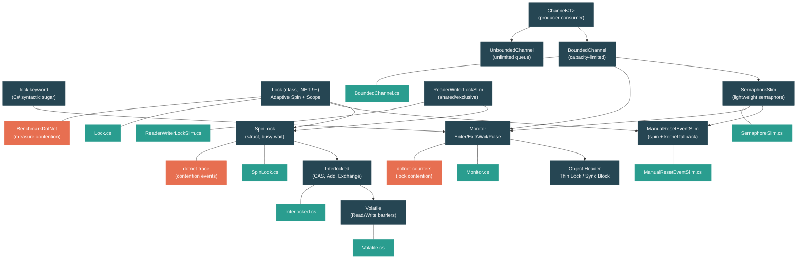

# Level 3: Advanced -- Threading Primitives and Synchronization

> **Target profile:** Developer who needs to understand synchronization primitives deeply -- when to use each one, their performance tradeoffs, and how they are implemented in the .NET runtime
> **Estimated effort:** 6 hours
> **Prerequisites:** [Module 2.3 -- Async/Await](02-practitioner-async-await.md), [Level 2](02-practitioner-generics.md)
> [Version en espanol](../es/03-advanced-threading.md)

---

## Learning Objectives

By the end of this module you will be able to:

1. Explain how the `lock` keyword maps to `Monitor.Enter`/`Monitor.Exit`, how thin locks work via the object header sync block, and the costs of lock inflation.
2. Describe the .NET 9 `Lock` type: its adaptive spin strategy, `_owningThreadId` tracking, `Scope`-based usage pattern, and why a dedicated type outperforms `Monitor` in common scenarios.
3. Use `SemaphoreSlim` and `ManualResetEventSlim` for async-compatible signaling, and explain how they spin before falling back to a kernel wait.
4. Choose correctly between `SpinLock`, `Interlocked` CAS operations, and `Volatile` reads/writes for lock-free synchronization, and explain when spinning is beneficial vs. wasteful.
5. Apply `ReaderWriterLockSlim` correctly in read-heavy workloads and identify scenarios where it hurts rather than helps.
6. Implement producer-consumer patterns using `System.Threading.Channels`, and trace how `BoundedChannel` uses synchronization internally.

---

## Concept Map



---

## Performance Tradeoff Overview

Before diving into each primitive, it helps to have a mental model of the cost spectrum:

| Primitive | Overhead (uncontended) | Overhead (contended) | Supports async `await` | Best for |
|---|---|---|---|---|
| `Interlocked` / CAS | ~1 ns (single CPU instruction) | Low (retry loop) | N/A (lock-free) | Single-variable atomic updates |
| `Volatile.Read/Write` | ~0 ns (memory barrier only) | N/A (no blocking) | N/A | Publish/observe flags and references |
| `SpinLock` | ~5-10 ns | Wastes CPU cycles | No | Ultra-short critical sections (< 1 us), leaf-level locks |
| `Lock` (.NET 9) | ~10-15 ns | Adaptive spin + kernel wait | No | General-purpose mutual exclusion (replaces `lock`) |
| `Monitor` / `lock` | ~15-25 ns (thin lock) | Sync block inflation + kernel wait | No | General-purpose mutual exclusion (legacy) |
| `SemaphoreSlim` | ~20-30 ns | Spin + `Monitor.Wait` + async queue | Yes (`WaitAsync`) | Throttling concurrency, async signaling |
| `ManualResetEventSlim` | ~15-20 ns | Spin + kernel event | No | One-time or reset-based signaling |
| `ReaderWriterLockSlim` | ~30-50 ns | SpinLock + kernel events | No | Read-heavy workloads with rare writes |
| `Channel<T>` | ~50-100 ns | Backpressure via bounded queue | Yes (built-in) | Producer-consumer pipelines |

*Times are approximate and vary by hardware. The key insight is that lower-level primitives are faster but less capable.*

---

## Curriculum

### Lesson 1 -- Monitor and `lock`

#### What you will learn

The `lock` keyword is syntactic sugar for `Monitor.Enter` and `Monitor.Exit`. But what happens at the CPU level? In this lesson you will understand thin locks, sync blocks, and lock inflation -- the mechanism the runtime uses to keep uncontended locks fast while supporting full-featured blocking when needed.

#### The concept

When you write:

```csharp
lock (obj)
{
    // critical section
}
```

The compiler transforms this into:

```csharp
bool lockTaken = false;
try
{
    Monitor.Enter(obj, ref lockTaken);
    // critical section
}
finally
{
    if (lockTaken)
        Monitor.Exit(obj);
}
```

The `ref bool lockTaken` parameter is critical for correctness. If a `ThreadAbortException` fires between `Enter` and the `try`, the lock might be taken without the `finally` ever releasing it. The `ref lockTaken` pattern ensures the runtime knows whether it actually acquired the lock.

Looking at the source in `Monitor.cs`, the `Enter` method is marked `AggressiveInlining`:

```csharp
[MethodImpl(MethodImplOptions.AggressiveInlining)]
public static void Enter(object obj, ref bool lockTaken)
{
    if (lockTaken)
        ThrowLockTakenException();

    Enter(obj);
    lockTaken = true;
}
```

The actual lock acquisition is a partial method -- it is implemented differently by CoreCLR and Mono. On CoreCLR, it goes through the object header's sync block mechanism.

**The three stages of a Monitor lock:**

1. **Thin lock (fast path)**: The runtime stores the owning thread's ID directly in the object header. A single `Interlocked.CompareExchange` is all it takes. Cost: ~15-25 ns.

2. **Lock inflation**: When contention occurs (another thread tries to acquire the lock), the runtime "inflates" the thin lock into a full sync block. The sync block is a runtime data structure that supports waiting queues, `Monitor.Wait`/`Pulse`, and hash code storage. This inflation is a one-time cost per object.

3. **Kernel wait**: Once inflated, waiting threads enter a kernel wait (an OS event). This involves a context switch, costing thousands of CPU cycles (~1-10 us depending on OS and hardware).

**Why `lock` requires a reference type:**

Every object in .NET has a header (the "object header word") that can store either:
- A thin lock (thread ID + recursion count)
- A sync block index (pointing to a richer structure)
- A hash code

These uses are mutually exclusive in the header, which is why `lock` on an object that also calls `GetHashCode()` forces immediate sync block allocation. The sync block stores the hash code, the lock state, and the wait queues together.

#### In the source code

Open `src/libraries/System.Private.CoreLib/src/System/Threading/Monitor.cs`:

The managed side is a thin wrapper. `TryEnter` delegates to the partial method:

```csharp
public static bool TryEnter(object obj, TimeSpan timeout)
    => TryEnter(obj, WaitHandle.ToTimeoutMilliseconds(timeout));
```

The `Wait`, `Pulse`, and `PulseAll` methods are also defined here. `Wait` is notably marked `[UnsupportedOSPlatform("browser")]` because WebAssembly (without threads) cannot block.

The actual lock implementation lives in the runtime-specific partial classes:
- CoreCLR: `src/coreclr/System.Private.CoreLib/src/System/Threading/Monitor.CoreCLR.cs`
- Mono: `src/mono/System.Private.CoreLib/src/System/Threading/Monitor.Mono.cs`

#### Hands-on exercise

1. Demonstrate thin lock vs. inflated lock behavior:
   ```csharp
   object obj = new object();

   // Thin lock -- single thread, no contention
   var sw = Stopwatch.StartNew();
   for (int i = 0; i < 10_000_000; i++)
   {
       lock (obj) { }
   }
   Console.WriteLine($"Uncontended: {sw.ElapsedMilliseconds} ms");

   // Now force contention with two threads
   long count = 0;
   sw.Restart();
   var t1 = Task.Run(() => { for (int i = 0; i < 5_000_000; i++) lock (obj) count++; });
   var t2 = Task.Run(() => { for (int i = 0; i < 5_000_000; i++) lock (obj) count++; });
   Task.WaitAll(t1, t2);
   Console.WriteLine($"Contended: {sw.ElapsedMilliseconds} ms, count={count}");
   ```

2. Observe the hash code effect -- call `obj.GetHashCode()` before the lock loop and measure again. On some runtimes, forcing the hash code into the sync block changes the lock's fast path.

3. Use `dotnet-counters` to monitor lock contention:
   ```bash
   dotnet-counters monitor --counters System.Runtime[monitor-lock-contention-count] --process-id <pid>
   ```

#### Key takeaway

`Monitor` (and the `lock` keyword) use a layered strategy: a cheap thin lock for the uncontended case, inflating to a sync block with kernel waits when contention occurs. This makes uncontended locks very fast (~15-25 ns) but means contended locks pay the cost of sync block allocation and OS kernel transitions. For new code on .NET 9+, the `Lock` type (Lesson 2) improves on this design.

#### Common misconception

> *"`lock` always involves a kernel call."*
>
> False. Uncontended locks use a thin lock mechanism that is entirely user-mode. Only when another thread is actually waiting does the runtime fall back to kernel-level synchronization. In most well-designed applications, the majority of lock acquisitions are uncontended.

---

### Lesson 2 -- The New Lock Type (.NET 9)

#### What you will learn

.NET 9 introduced `System.Threading.Lock`, a dedicated lock class that outperforms `Monitor` in common scenarios. In this lesson you will understand its adaptive spin strategy, `Scope`-based usage pattern, and why a purpose-built type can beat the general-purpose `Monitor`.

#### The concept

The `Lock` class was introduced because `Monitor` has fundamental limitations:

1. **Any object can be a lock target**: This means every object header must reserve bits for locking, and it prevents optimizations that require knowledge of what is used as a lock.
2. **No type safety**: Nothing prevents you from accidentally locking on a value type (which gets boxed, creating a new object each time -- a silent bug).
3. **Sync block overhead**: The thin lock / sync block inflation mechanism is clever but adds complexity and limits optimization opportunities.

`Lock` solves these by being a dedicated class with its own internal state:

```csharp
public sealed class Lock
{
    private int _owningThreadId;
    private uint _state;        // bit-packed: locked flag, has-waiters, spinner count
    private uint _recursionCount;
    private short _spinCount;   // adaptive spin counter
    private AutoResetEvent? _waitEvent;  // lazy-allocated for blocking
    // ...
}
```

Key design decisions visible in the source:

**Adaptive spinning**: The `_spinCount` field starts at `SpinCountNotInitialized` (= `short.MinValue`). The runtime measures whether spinning is effective on the current hardware and adjusts:

```csharp
private const short DefaultMaxSpinCount = 22;
private const short DefaultAdaptiveSpinPeriod = 100;
private const short SpinSleep0Threshold = 10;
```

When `_spinCount` is positive, threads spin that many iterations before blocking. When zero, a thread tests whether spinning would help. When negative, it counts contentions until it tries spinning again. This adaptive approach means the lock automatically tunes itself to the workload.

**Scope pattern**: The `EnterScope()` method returns a `ref struct Scope` that exits the lock when disposed:

```csharp
[MethodImpl(MethodImplOptions.AggressiveInlining)]
public Scope EnterScope() => new Scope(this, EnterAndGetCurrentThreadId());
```

This enables the clean usage pattern:

```csharp
private readonly Lock _lock = new();

void DoWork()
{
    using (_lock.EnterScope())
    {
        // critical section
    }
}
```

The `Scope` is a `ref struct`, so it cannot escape the stack -- it has zero heap allocation.

**Fast path**: The `TryEnter_Inlined` method shows the fast path:

```csharp
private int TryEnter_Inlined(int timeoutMs)
{
    int currentThreadId = ManagedThreadId.CurrentManagedThreadIdUnchecked;
    if (currentThreadId != UninitializedThreadId && State.TryLock(this))
    {
        _owningThreadId = currentThreadId;
        return currentThreadId;
    }
    return TryEnterSlow(timeoutMs, currentThreadId);
}
```

The fast path is a single atomic operation (`TryLock`) followed by a field write. If it succeeds, no further work is needed. The `TryEnterSlow` method handles recursion, spinning, and blocking.

**No static constructor**: The comment in the source is revealing:

```csharp
// NOTE: Lock must not have a static (class) constructor, as Lock itself is used to synchronize
// class construction. If Lock has its own class constructor, this can lead to infinite recursion.
// All static data in Lock must be lazy-initialized.
```

This constraint forces all static fields (`s_maxSpinCount`, `s_isSingleProcessor`, etc.) to be lazily initialized.

#### In the source code

Open `src/libraries/System.Private.CoreLib/src/System/Threading/Lock.cs`:

The `TryEnterSlow` method (line 349+) reveals the full contention strategy:

1. Check for recursion (`_owningThreadId == currentThreadId`) -- if so, increment `_recursionCount`.
2. If `timeoutMs == 0`, return immediately (TryEnter semantics).
3. Notify the debugger via `Debugger.NotifyOfCrossThreadDependency()` -- this helps VS detect potential deadlocks during FuncEval.
4. Lazy-initialize statics if needed.
5. Adaptive spin loop: the first spinner does a full-length spin (`maxSpinCount = 22` iterations) to test effectiveness. Subsequent spinners use the adapted count.
6. If spinning fails, block on `_waitEvent` (an `AutoResetEvent`, lazily allocated).

The `ExitImpl` method shows the fast exit path:

```csharp
private void ExitImpl()
{
    if (_recursionCount == 0)
    {
        _owningThreadId = 0;
        State state = State.Unlock(this);
        if (state.HasAnyWaiters)
        {
            SignalWaiterIfNecessary(state);
        }
    }
    else
    {
        _recursionCount--;
    }
}
```

Exit is also fast: reset the owner, atomically unlock, and only signal waiters if any exist.

#### Hands-on exercise

1. Benchmark `Lock` vs. `Monitor` under contention:
   ```csharp
   // Using BenchmarkDotNet
   private readonly Lock _lock = new();
   private readonly object _monitor = new();

   [Benchmark]
   public void LockType()
   {
       using (_lock.EnterScope()) { }
   }

   [Benchmark]
   public void MonitorLock()
   {
       lock (_monitor) { }
   }

   // Run with varying thread counts: 1, 2, 4, 8
   ```

2. Observe the adaptive spin behavior. Create a lock with artificial hold time and measure how the spin count adapts:
   ```csharp
   var lk = new Lock();
   // Short hold -- spinning should be effective
   Parallel.For(0, 1_000_000, _ =>
   {
       lk.Enter();
       // no work -- instant release
       lk.Exit();
   });
   ```

3. Compare the `EnterScope` pattern with traditional `Enter`/`Exit`:
   ```csharp
   var lk = new Lock();

   // Pattern 1: EnterScope (recommended)
   using (lk.EnterScope())
   {
       // If an exception occurs here, the lock is still released
   }

   // Pattern 2: Manual Enter/Exit
   lk.Enter();
   try
   {
       // critical section
   }
   finally
   {
       lk.Exit();
   }
   ```

#### Key takeaway

`Lock` is the recommended mutual exclusion primitive for .NET 9+. It avoids the object header / sync block machinery, uses adaptive spinning tuned to the hardware, and provides a type-safe `Scope`-based API. The fast path is a single CAS operation. The adaptive spin strategy means the lock automatically learns whether spinning is effective for the current contention pattern.

#### Common misconception

> *"The Lock type is non-recursive."*
>
> Actually, `Lock` does support recursion. Looking at `TryEnterSlow`, if `_owningThreadId == currentThreadId`, it increments `_recursionCount`. The documentation says the calling thread "should exit the lock as many times as it had entered the lock." However, unlike `Monitor`, `Lock` tracks recursion in a dedicated field rather than in the sync block, which is more efficient.

---

### Lesson 3 -- SemaphoreSlim and ManualResetEventSlim

#### What you will learn

`SemaphoreSlim` and `ManualResetEventSlim` are the "slim" versions of their kernel-based counterparts. They spin in user-mode before falling back to kernel waits, and `SemaphoreSlim` is the only built-in synchronization primitive that supports `async` waiting via `WaitAsync()`. In this lesson you will understand their internal structure and when to use each one.

#### The concept

**SemaphoreSlim** controls access to a resource pool by maintaining a count. Unlike a lock (binary: held or not), a semaphore allows N concurrent accessors:

```csharp
// Allow up to 3 concurrent database connections
var semaphore = new SemaphoreSlim(initialCount: 3, maxCount: 3);

async Task UseDatabaseAsync()
{
    await semaphore.WaitAsync(); // decrement count; block if zero
    try
    {
        await QueryDatabaseAsync();
    }
    finally
    {
        semaphore.Release(); // increment count
    }
}
```

Looking at the internal fields in `SemaphoreSlim.cs`:

```csharp
private volatile int m_currentCount;      // current semaphore count
private readonly int m_maxCount;           // maximum allowed
private int m_waitCount;                   // number of sync waiters
private int m_countOfWaitersPulsedToWake;  // optimization to avoid waking too many
private readonly StrongBox<bool> m_lockObjAndDisposed; // lock object + disposed flag
private TaskNode? m_asyncHead;             // linked list of async waiters
private TaskNode? m_asyncTail;
```

The async waiters are stored as a linked list of `TaskNode` objects, where each `TaskNode` is itself a `Task<bool>`:

```csharp
private sealed class TaskNode : Task<bool>
{
    internal TaskNode? Prev, Next;
    internal TaskNode() : base((object?)null, TaskCreationOptions.RunContinuationsAsynchronously) { }
}
```

This is a clever design: the `TaskNode` IS the `Task<bool>` that `WaitAsync()` returns, so there is no extra allocation for the promise -- the linked list node and the returned task are the same object.

Note `RunContinuationsAsynchronously` -- this ensures that releasing the semaphore does not synchronously run the waiter's continuation, which could lead to unbounded stack depth or lock re-entrancy issues.

**ManualResetEventSlim** is a signal that can be set or reset. All threads waiting on it are released when it is set. It packs its state into a single `int`:

```csharp
private volatile int m_combinedState;

// Bit layout:
// Bit 31:      signaled state (1 = set)
// Bit 30:      disposed
// Bits 19-29:  spin count (up to 2047)
// Bits 0-18:   number of waiters
```

The `DEFAULT_SPIN_SP = 1` constant shows that on single-processor machines, minimal spinning is done. On multi-processor machines, the default spin count is higher, because another processor might release the event while we spin.

The "slim" strategy for both is the same:

1. **Check state immediately** -- if the semaphore has count > 0 or the event is set, succeed without blocking.
2. **Spin** -- burn CPU cycles checking the state, hoping it changes before we need a kernel transition.
3. **Kernel wait** -- if spinning did not succeed, fall back to a real OS wait (`Monitor.Wait` for `SemaphoreSlim`, `ManualResetEvent` for `ManualResetEventSlim`).

#### In the source code

Open `src/libraries/System.Private.CoreLib/src/System/Threading/SemaphoreSlim.cs`:

The `m_lockObjAndDisposed` field uses `StrongBox<bool>` as both the `lock` object (for `Monitor.Enter`) and a disposed flag. This saves one object allocation per semaphore.

The async path (`WaitAsync`) creates a `TaskNode`, appends it to the linked list, and returns it. When `Release()` is called, it checks the async waiters first:

```csharp
// Simplified Release logic:
if (m_asyncHead is not null)
{
    // Wake an async waiter -- complete their TaskNode
}
else if (m_waitCount > 0)
{
    // Wake a sync waiter via Monitor.Pulse
}
```

Open `src/libraries/System.Private.CoreLib/src/System/Threading/ManualResetEventSlim.cs`:

The bit-packed `m_combinedState` is modified atomically using `Interlocked.CompareExchange`. The spin count (bits 19-29) allows up to 2047 spin iterations before falling back to the kernel event. The kernel event (`ManualResetEvent`) is lazily allocated only when a thread actually needs to block.

#### Hands-on exercise

1. Implement a rate limiter using `SemaphoreSlim`:
   ```csharp
   var limiter = new SemaphoreSlim(10); // max 10 concurrent operations

   var tasks = Enumerable.Range(0, 100).Select(async i =>
   {
       await limiter.WaitAsync();
       try
       {
           Console.WriteLine($"Processing {i} (active: {10 - limiter.CurrentCount})");
           await Task.Delay(100);
       }
       finally
       {
           limiter.Release();
       }
   });

   await Task.WhenAll(tasks);
   ```

2. Compare `ManualResetEventSlim` with `ManualResetEvent`:
   ```csharp
   var slim = new ManualResetEventSlim(false);
   var heavy = new ManualResetEvent(false);

   // Benchmark: set and wait cycles
   var sw = Stopwatch.StartNew();
   for (int i = 0; i < 1_000_000; i++)
   {
       slim.Set();
       slim.Wait();
       slim.Reset();
   }
   Console.WriteLine($"Slim: {sw.ElapsedMilliseconds} ms");

   sw.Restart();
   for (int i = 0; i < 1_000_000; i++)
   {
       heavy.Set();
       heavy.WaitOne();
       heavy.Reset();
   }
   Console.WriteLine($"Heavy: {sw.ElapsedMilliseconds} ms");
   ```

3. Observe what happens when you release a `SemaphoreSlim` beyond its max count:
   ```csharp
   var sem = new SemaphoreSlim(1, maxCount: 1);
   sem.Release(); // throws SemaphoreFullException
   ```

#### Key takeaway

`SemaphoreSlim` is the go-to primitive when you need async-compatible synchronization or when you want to limit concurrency to N. `ManualResetEventSlim` is ideal for one-time or reset-based signaling where all waiters should be released simultaneously. Both use the same spin-then-block strategy to avoid kernel transitions in the common case. The key advantage of `SemaphoreSlim` over all other primitives is `WaitAsync()` -- it is the only built-in synchronization primitive that integrates cleanly with async/await.

#### Common misconception

> *"SemaphoreSlim with count=1 is the same as a lock."*
>
> Not exactly. A `SemaphoreSlim(1,1)` provides mutual exclusion, but it is NOT re-entrant: if the same thread calls `Wait()` twice without `Release()`, it deadlocks. A `lock` / `Monitor` tracks the owning thread and allows the same thread to enter multiple times. Additionally, `SemaphoreSlim` has no concept of ownership -- any thread can `Release()`, not just the one that called `Wait()`.

---

### Lesson 4 -- SpinLock and Interlocked

#### What you will learn

Sometimes you do not need a full lock at all. `Interlocked` provides atomic CPU operations for single-variable updates. `SpinLock` provides a lightweight mutual exclusion primitive that busy-waits instead of blocking. In this lesson you will learn when spinning wins, how CAS (Compare-And-Swap) operations work, and the role of memory barriers.

#### The concept

**Interlocked operations** map directly to CPU instructions. On x86, `Interlocked.CompareExchange` maps to the `lock cmpxchg` instruction. These are the fastest possible synchronization operations because they have no syscall overhead:

```csharp
// Atomic increment -- no lock needed
Interlocked.Increment(ref counter);

// CAS loop -- the fundamental lock-free pattern
int original, desired;
do
{
    original = value;
    desired = Transform(original);
} while (Interlocked.CompareExchange(ref value, desired, original) != original);
```

The CAS pattern works because `CompareExchange` atomically:
1. Reads the current value of `value`
2. Compares it with `original`
3. If they match, replaces `value` with `desired`
4. Returns the value that was in `value` before the operation

If the return value does not match `original`, another thread modified `value` between our read and our CAS attempt, so we retry.

Looking at the `Interlocked.cs` source:

```csharp
[MethodImpl(MethodImplOptions.AggressiveInlining)]
[CLSCompliant(false)]
public static uint Increment(ref uint location) =>
    Add(ref location, 1);

[MethodImpl(MethodImplOptions.AggressiveInlining)]
[CLSCompliant(false)]
public static uint Decrement(ref uint location) =>
    (uint)Add(ref Unsafe.As<uint, int>(ref location), -1);
```

`Increment` and `Decrement` are implemented in terms of `Add`. `Add` itself is a partial method backed by the runtime's JIT, which emits the appropriate CPU instruction (`lock xadd` on x86).

**Volatile** provides memory ordering guarantees without atomicity:

```csharp
// Ensures the read sees the most recent write from any thread
bool flag = Volatile.Read(ref _isComplete);

// Ensures all preceding writes are visible before this write
Volatile.Write(ref _isComplete, true);
```

Looking at `Volatile.cs`, the implementation uses a clever `Unsafe.As` trick:

```csharp
private struct VolatileBoolean { public volatile bool Value; }

public static bool Read(ref readonly bool location) =>
    Unsafe.As<bool, VolatileBoolean>(ref Unsafe.AsRef(in location)).Value;
```

The runtime reinterprets the memory location as a `volatile` field, which guarantees the CPU inserts appropriate memory barriers. On x86, `volatile` reads generate no extra instructions (the memory model is strong enough), but on ARM they emit `ldar` (load-acquire) and `stlr` (store-release) instructions.

The `Volatile.ReadBarrier()` and `Volatile.WriteBarrier()` methods are explicit memory fences -- they prevent the CPU and compiler from reordering reads/writes across the barrier.

**SpinLock** is a mutual exclusion primitive that busy-waits:

```csharp
private SpinLock _spinLock = new SpinLock();

void DoWork()
{
    bool lockTaken = false;
    try
    {
        _spinLock.Enter(ref lockTaken);
        // critical section -- must be VERY short
    }
    finally
    {
        if (lockTaken) _spinLock.Exit();
    }
}
```

From the source, `SpinLock` has two modes encoded in its `_owner` field:

```csharp
// Mode 1 -- Ownership tracking (default):
//   High bit = 0, remaining bits = owning thread's managed ID
//   Value of 0 = lock available
//
// Mode 2 -- Performance mode (enableThreadOwnerTracking: false):
//   High bit = 1, low bit = lock held (1) or available (0)
private volatile int _owner;
```

**CRITICAL**: `SpinLock` is a `struct`. This means:
- Passing it by value creates a copy -- the copy is independent and useless
- Storing it in a `readonly` field means every access copies it
- You must pass it `ref` or store it in a mutable field

The SpinLock documentation in the source warns explicitly:

> "Spin locks can be used for leaf-level locks where the object allocation implied by using a Monitor, in size or due to garbage collection pressure, is overly expensive."

#### In the source code

Open `src/libraries/System.Private.CoreLib/src/System/Threading/SpinLock.cs`:

The `_owner` field uses `volatile` -- every read is a volatile read. The two modes are distinguished by the high bit (`LOCK_ID_DISABLE_MASK = 0x80000000`).

The constants reveal the wait strategy:

```csharp
private const int SLEEP_ONE_FREQUENCY = 40;       // After 40 yields, Sleep(1)
private const int TIMEOUT_CHECK_FREQUENCY = 10;    // Check timeout every 10 yields
```

This shows that SpinLock is not purely spinning -- after 40 iterations, it starts calling `Thread.Sleep(1)` to yield the processor. This prevents complete CPU starvation under heavy contention.

Open `src/libraries/System.Private.CoreLib/src/System/Threading/Volatile.cs`:

On 32-bit platforms, reading a 64-bit value atomically requires special handling:

```csharp
public static long Read(ref readonly long location) =>
#if TARGET_64BIT
    (long)Unsafe.As<long, VolatileIntPtr>(ref Unsafe.AsRef(in location)).Value;
#else
    // On 32-bit machines, we use Interlocked, since an ordinary volatile read would not be atomic.
    Interlocked.CompareExchange(ref Unsafe.AsRef(in location), 0, 0);
#endif
```

On 32-bit, a `long` read is not atomic (it requires two 32-bit reads, and another thread could modify the value between them). The trick of `CompareExchange(ref val, 0, 0)` atomically reads the value by comparing with 0 and replacing with 0 -- which is a no-op that returns the current value, but atomically.

Open `src/libraries/System.Private.CoreLib/src/System/Threading/Interlocked.cs`:

The `[Intrinsic]` attribute on many methods signals the JIT to replace the method body with a CPU instruction. For example, `Exchange` for `sbyte` is marked `[Intrinsic]` -- the JIT will emit `lock xchg` rather than calling the method.

#### Hands-on exercise

1. Implement a lock-free counter using CAS:
   ```csharp
   int counter = 0;

   Parallel.For(0, 1_000_000, _ =>
   {
       Interlocked.Increment(ref counter);
   });

   Console.WriteLine($"Counter: {counter}"); // Should be exactly 1,000,000
   ```

2. Implement a lock-free stack using CAS:
   ```csharp
   class Node<T> { public T Value; public Node<T>? Next; }

   Node<int>? head = null;

   void Push(int value)
   {
       var node = new Node<int> { Value = value };
       Node<int>? original;
       do
       {
           original = head;
           node.Next = original;
       } while (Interlocked.CompareExchange(ref head, node, original) != original);
   }
   ```

3. Benchmark `SpinLock` vs. `Lock` vs. `Interlocked` for a simple counter:
   ```csharp
   // Interlocked -- no lock, just atomic add
   [Benchmark] public void InterlockedIncrement() => Interlocked.Increment(ref _counter);

   // SpinLock -- busy wait
   [Benchmark]
   public void SpinLockIncrement()
   {
       bool taken = false;
       try { _spinLock.Enter(ref taken); _counter++; }
       finally { if (taken) _spinLock.Exit(); }
   }

   // Lock -- adaptive spin + kernel
   [Benchmark]
   public void LockIncrement()
   {
       using (_lock.EnterScope()) { _counter++; }
   }
   ```

4. Demonstrate the `Volatile` ordering guarantee:
   ```csharp
   int data = 0;
   bool ready = false;

   // Producer
   Task.Run(() =>
   {
       data = 42;                      // write data first
       Volatile.Write(ref ready, true); // then publish the flag (with write barrier)
   });

   // Consumer
   while (!Volatile.Read(ref ready)) { } // read flag with read barrier
   Console.WriteLine(data);               // guaranteed to see 42
   ```

#### Key takeaway

Use `Interlocked` when you can express your operation as a single atomic update (increment, exchange, CAS loop). Use `Volatile` when you need to publish or observe a flag or reference without a full lock. Use `SpinLock` only for ultra-short critical sections where the allocation of a `Lock`/`Monitor` is unacceptable (leaf-level locks in data structures), and NEVER hold a `SpinLock` across any blocking or allocating operation. For everything else, use `Lock` or `SemaphoreSlim`.

#### Common misconception

> *"Volatile and Interlocked are interchangeable."*
>
> No. `Volatile.Read/Write` provides memory ordering but NOT atomicity for types wider than the native word size. On 32-bit platforms, `Volatile.Read(ref long)` actually falls back to `Interlocked.CompareExchange` to get atomicity. `Interlocked` operations are both atomic AND provide full memory barriers. The distinction matters on ARM and other weakly-ordered architectures.

---

### Lesson 5 -- ReaderWriterLockSlim

#### What you will learn

When reads vastly outnumber writes, `ReaderWriterLockSlim` can provide better throughput than a simple lock. But it has a higher baseline cost and surprising pitfalls. In this lesson you will understand its three modes, its internal use of `SpinLock`, and when it actually helps.

#### The concept

`ReaderWriterLockSlim` supports three levels of access:

| Mode | Concurrent readers? | Concurrent writers? | Use case |
|---|---|---|---|
| Read | Yes (unlimited) | No | Querying shared data |
| Write | No (exclusive) | No | Modifying shared data |
| Upgradeable Read | Yes (one upgradeable + N readers) | No | Read-then-conditionally-write |

```csharp
var rwLock = new ReaderWriterLockSlim();
var cache = new Dictionary<string, object>();

// Multiple threads can read simultaneously
object? Read(string key)
{
    rwLock.EnterReadLock();
    try { return cache.GetValueOrDefault(key); }
    finally { rwLock.ExitReadLock(); }
}

// Only one thread can write at a time (blocks readers too)
void Write(string key, object value)
{
    rwLock.EnterWriteLock();
    try { cache[key] = value; }
    finally { rwLock.ExitWriteLock(); }
}

// Read, then upgrade to write if needed
void AddIfMissing(string key, object value)
{
    rwLock.EnterUpgradeableReadLock();
    try
    {
        if (!cache.ContainsKey(key))
        {
            rwLock.EnterWriteLock();
            try { cache[key] = value; }
            finally { rwLock.ExitWriteLock(); }
        }
    }
    finally { rwLock.ExitUpgradeableReadLock(); }
}
```

Looking at the source, `ReaderWriterLockSlim` is significantly more complex than other primitives:

```csharp
public class ReaderWriterLockSlim : IDisposable
{
    private readonly bool _fIsReentrant;
    private SpinLock _spinLock;             // internal spin lock for state transitions
    private uint _numWriteWaiters;
    private uint _numReadWaiters;
    private uint _numWriteUpgradeWaiters;
    private uint _numUpgradeWaiters;
    private int _upgradeLockOwnerId;
    private int _writeLockOwnerId;
    private EventWaitHandle? _writeEvent;
    private EventWaitHandle? _readEvent;
    private EventWaitHandle? _upgradeEvent;
    private EventWaitHandle? _waitUpgradeEvent;
    // ...
}
```

Key observations:

1. **Uses `SpinLock` internally**: The `_spinLock` field protects state transitions. This is an ultra-short spin -- it only guards the bookkeeping, not the actual critical section.

2. **Four event wait handles**: Each type of waiter has its own kernel event. These are lazily allocated (most usage never needs all four).

3. **Per-thread tracking via `ReaderWriterCount`**: A `[ThreadStatic]` linked list tracks how many read, write, and upgrade locks each thread holds:

   ```csharp
   internal sealed class ReaderWriterCount
   {
       public long lockID;
       public int readercount;
       public int writercount;
       public int upgradecount;
       public ReaderWriterCount? next;
   }
   ```

   The `lockID` is a numeric ID (not a reference) to avoid preventing garbage collection of the lock.

4. **Recursion policy**: By default (`LockRecursionPolicy.NoRecursion`), recursive locking throws `LockRecursionException`. You can opt in with `SupportsRecursion`, but the docs and the .NET team strongly discourage it.

**When ReaderWriterLockSlim hurts:**

The baseline cost of `EnterReadLock` is higher than a simple `Monitor.Enter` because it must:
1. Acquire the internal `SpinLock`
2. Look up or create the thread's `ReaderWriterCount`
3. Modify shared state
4. Release the internal `SpinLock`

If reads are not overwhelmingly dominant (e.g., > 10:1 read-to-write ratio) or if the critical section is very short, a simple `Lock` or `Monitor` will outperform `ReaderWriterLockSlim`. The reader-writer lock only wins when the critical section is long enough that allowing concurrent readers provides meaningful throughput gains.

#### In the source code

Open `src/libraries/System.Private.CoreLib/src/System/Threading/ReaderWriterLockSlim.cs`:

The `ReaderWriterCount` is a `[ThreadStatic]` linked list. Each thread walks this list to find its count for a given lock. The search uses a numeric `lockID` rather than a direct reference to avoid preventing garbage collection of `ReaderWriterLockSlim` instances.

The comment in the source is instructive:

> "A reader-writer lock implementation that is intended to be simple, yet very efficient. In particular only 1 interlocked operation is taken for any lock operation (we use spin locks to achieve this). The spin lock is never held for more than a few instructions."

The four kernel events (`_writeEvent`, `_readEvent`, `_upgradeEvent`, `_waitUpgradeEvent`) each serve a specific purpose:
- `_writeEvent`: threads waiting to acquire the write lock
- `_readEvent`: threads waiting to acquire a read lock (released in bulk when the write lock is freed)
- `_upgradeEvent`: thread waiting to acquire the upgrade lock
- `_waitUpgradeEvent`: thread upgrading from upgrade lock to write lock

#### Hands-on exercise

1. Benchmark read-heavy workloads with different read-to-write ratios:
   ```csharp
   // Vary the readRatio: 100, 50, 10, 2
   int readRatio = 100;
   var rwLock = new ReaderWriterLockSlim();
   var simpleLock = new Lock();
   int sharedData = 0;

   void TestRWLock()
   {
       Parallel.For(0, 1_000_000, i =>
       {
           if (i % readRatio == 0)
           {
               rwLock.EnterWriteLock();
               try { sharedData++; }
               finally { rwLock.ExitWriteLock(); }
           }
           else
           {
               rwLock.EnterReadLock();
               try { _ = sharedData; }
               finally { rwLock.ExitReadLock(); }
           }
       });
   }
   ```

2. Observe the pitfall of forgetting to exit:
   ```csharp
   var rwLock = new ReaderWriterLockSlim();
   rwLock.EnterReadLock();
   // Oops, forgot ExitReadLock
   rwLock.EnterWriteLock(); // DEADLOCK -- the write lock waits for readers to exit
   ```

3. Test recursive locking behavior:
   ```csharp
   var rwLock = new ReaderWriterLockSlim(LockRecursionPolicy.NoRecursion);
   rwLock.EnterReadLock();
   try
   {
       rwLock.EnterReadLock(); // Throws LockRecursionException
   }
   catch (LockRecursionException ex)
   {
       Console.WriteLine($"Caught: {ex.Message}");
   }
   finally
   {
       rwLock.ExitReadLock();
   }
   ```

#### Key takeaway

`ReaderWriterLockSlim` trades higher per-operation overhead for concurrent reader throughput. It only pays off when (1) reads outnumber writes by at least 10:1, (2) the critical section is long enough to amortize the overhead, and (3) you have enough concurrent reader threads to benefit from shared access. For short critical sections or balanced read/write workloads, a simple `Lock` is faster and simpler. Always prefer `LockRecursionPolicy.NoRecursion` -- recursive reader-writer locks are a common source of subtle bugs.

#### Common misconception

> *"ReaderWriterLockSlim is always better than a simple lock for read-heavy workloads."*
>
> Not if the critical section is short. The overhead of `ReaderWriterLockSlim` includes acquiring an internal `SpinLock`, looking up per-thread counts, and modifying shared state -- all before you even enter your critical section. For a read that takes < 1 us, this overhead dominates, and a simple `Lock` that completes the entire acquire-read-release cycle faster is the better choice.

---

### Lesson 6 -- Channels: Producer-Consumer Patterns

#### What you will learn

`System.Threading.Channels` provides a high-performance, async-compatible producer-consumer queue. In this lesson you will understand bounded vs. unbounded channels, how `BoundedChannel` implements backpressure, and how channels use the synchronization primitives from previous lessons internally.

#### The concept

Channels separate producers from consumers with a thread-safe queue:

```csharp
// Bounded channel -- producers block/wait when full
var channel = Channel.CreateBounded<WorkItem>(new BoundedChannelOptions(capacity: 100)
{
    FullMode = BoundedChannelFullMode.Wait,
    SingleReader = false,
    SingleWriter = false
});

// Producer
async Task ProduceAsync(ChannelWriter<WorkItem> writer)
{
    for (int i = 0; i < 1000; i++)
    {
        await writer.WriteAsync(new WorkItem(i));
    }
    writer.Complete();
}

// Consumer
async Task ConsumeAsync(ChannelReader<WorkItem> reader)
{
    await foreach (var item in reader.ReadAllAsync())
    {
        await ProcessAsync(item);
    }
}
```

Looking at the `BoundedChannel.cs` source:

```csharp
internal sealed class BoundedChannel<T> : Channel<T>
{
    private readonly BoundedChannelFullMode _mode;
    private readonly int _bufferedCapacity;
    private readonly Deque<T> _items = new Deque<T>();
    private BlockedReadAsyncOperation<T>? _blockedReadersHead;    // linked list
    private BlockedWriteAsyncOperation<T>? _blockedWritersHead;   // linked list
    private WaitingReadAsyncOperation? _waitingReadersHead;       // linked list
    private WaitingWriteAsyncOperation? _waitingWritersHead;      // linked list
    private readonly bool _runContinuationsAsynchronously;
    private Exception? _doneWriting;
}
```

Key design points:

1. **`Deque<T>` for items**: A double-ended queue stores buffered items. This is more efficient than a `ConcurrentQueue<T>` because the channel controls its own synchronization.

2. **Linked lists for waiters**: Blocked readers, blocked writers, waiting readers, and waiting writers each have their own linked list. When an item is written, the channel first checks for a blocked reader to hand it to directly (avoiding the buffer entirely). Only if no reader is waiting does it buffer the item.

3. **`_runContinuationsAsynchronously`**: When true (the default), completing a waiter's operation is posted to the thread pool rather than running synchronously on the producer's thread. This prevents a producer from accidentally running consumer code on its thread.

4. **`BoundedChannelFullMode`**: Controls what happens when the channel is full:
   - `Wait` -- producer blocks until space is available (backpressure)
   - `DropNewest` -- the newest buffered item is dropped
   - `DropOldest` -- the oldest buffered item is dropped
   - `DropWrite` -- the item being written is dropped

5. **`_itemDropped` callback**: When using a drop mode, a delegate can be called for each dropped item (for logging or cleanup).

The `_completion` field is a `TaskCompletionSource` that is completed when the channel is closed and all items are consumed. This allows consumers to `await channel.Reader.Completion`.

The constructor shows how reader and writer singletons are created:

```csharp
internal BoundedChannel(int bufferedCapacity, BoundedChannelFullMode mode,
    bool runContinuationsAsynchronously, Action<T>? itemDropped)
{
    _bufferedCapacity = bufferedCapacity;
    _mode = mode;
    _runContinuationsAsynchronously = runContinuationsAsynchronously;
    _itemDropped = itemDropped;
    _completion = new TaskCompletionSource(
        runContinuationsAsynchronously
            ? TaskCreationOptions.RunContinuationsAsynchronously
            : TaskCreationOptions.None);

    Reader = new BoundedChannelReader(this);
    Writer = new BoundedChannelWriter(this);
}
```

The `BoundedChannelReader` internally caches singleton `BlockedReadAsyncOperation` and `WaitingReadAsyncOperation` objects for the common case where a single consumer reuses the same channel reader repeatedly. This avoids allocating a new operation object for every `ReadAsync` call.

**When to use channels vs. other synchronization:**

| Pattern | Best primitive |
|---|---|
| Single shared variable | `Interlocked` |
| Critical section | `Lock` or `Monitor` |
| Limiting concurrency | `SemaphoreSlim` |
| One-time signal | `ManualResetEventSlim` |
| Data pipeline / work queue | `Channel<T>` |
| Read-heavy shared state | `ReaderWriterLockSlim` (if critical section is long enough) |

Channels naturally compose with async/await, handle backpressure, and decouple producers from consumers. They are the preferred pattern for work queues over manual implementations using `ConcurrentQueue<T>` + `SemaphoreSlim`.

#### In the source code

Open `src/libraries/System.Threading.Channels/src/System/Threading/Channels/BoundedChannel.cs`:

The `BoundedChannelReader` has pooled singleton operations:

```csharp
private sealed class BoundedChannelReader : ChannelReader<T>
{
    internal readonly BoundedChannel<T> _parent;
    private readonly BlockedReadAsyncOperation<T> _readerSingleton;
    private readonly WaitingReadAsyncOperation _waiterSingleton;
}
```

These singletons are marked `pooled: true`, meaning they can be reused across calls. When a `ReadAsync` call completes, the operation is reset and reused for the next call from the same reader. This dramatically reduces allocation pressure in high-throughput scenarios.

The synchronization within `BoundedChannel` uses `lock (SyncObj)` for thread safety -- the channel uses a simple monitor lock internally, which is sufficient because the critical sections are short (just queue/dequeue and linked list manipulation).

#### Hands-on exercise

1. Build a pipeline with bounded channels:
   ```csharp
   var stage1 = Channel.CreateBounded<int>(10);
   var stage2 = Channel.CreateBounded<string>(10);

   // Producer
   var producer = Task.Run(async () =>
   {
       for (int i = 0; i < 100; i++)
       {
           await stage1.Writer.WriteAsync(i);
           Console.WriteLine($"Produced: {i}");
       }
       stage1.Writer.Complete();
   });

   // Transform
   var transformer = Task.Run(async () =>
   {
       await foreach (int item in stage1.Reader.ReadAllAsync())
       {
           await stage2.Writer.WriteAsync($"Item-{item}");
       }
       stage2.Writer.Complete();
   });

   // Consumer
   var consumer = Task.Run(async () =>
   {
       await foreach (string item in stage2.Reader.ReadAllAsync())
       {
           Console.WriteLine($"Consumed: {item}");
       }
   });

   await Task.WhenAll(producer, transformer, consumer);
   ```

2. Compare `BoundedChannelFullMode` behaviors:
   ```csharp
   var dropOldest = Channel.CreateBounded<int>(new BoundedChannelOptions(3)
   {
       FullMode = BoundedChannelFullMode.DropOldest
   });

   // Write 5 items into capacity-3 channel
   for (int i = 1; i <= 5; i++)
       dropOldest.Writer.TryWrite(i);

   dropOldest.Writer.Complete();

   // Read -- should see 3, 4, 5 (oldest items 1 and 2 were dropped)
   await foreach (int item in dropOldest.Reader.ReadAllAsync())
       Console.Write($"{item} ");
   ```

3. Measure throughput with different channel sizes and producer/consumer counts:
   ```csharp
   var channel = Channel.CreateBounded<int>(capacity);
   var sw = Stopwatch.StartNew();
   int totalItems = 1_000_000;

   var producers = Enumerable.Range(0, producerCount).Select(p => Task.Run(async () =>
   {
       for (int i = 0; i < totalItems / producerCount; i++)
           await channel.Writer.WriteAsync(i);
   })).ToArray();

   var consumers = Enumerable.Range(0, consumerCount).Select(c => Task.Run(async () =>
   {
       while (await channel.Reader.WaitToReadAsync())
           while (channel.Reader.TryRead(out _)) { }
   })).ToArray();

   await Task.WhenAll(producers);
   channel.Writer.Complete();
   await Task.WhenAll(consumers);

   Console.WriteLine($"{totalItems / sw.Elapsed.TotalSeconds:N0} items/sec");
   ```

#### Key takeaway

`System.Threading.Channels` is the built-in solution for producer-consumer patterns. `BoundedChannel` provides backpressure to prevent producers from overwhelming consumers. The implementation uses pooled operation objects to minimize allocations, direct handoff to bypass the buffer when a reader is waiting, and `RunContinuationsAsynchronously` to prevent scheduling inversions. For data pipelines, channels are almost always the right choice over hand-rolled `ConcurrentQueue` + `SemaphoreSlim` combinations.

#### Common misconception

> *"Channels are slow because they use `lock` internally."*
>
> The `lock` inside channels protects only the queue manipulation and linked list bookkeeping -- typically < 100 ns of work. The channel's design ensures that the lock is held for the absolute minimum time, and the pooled singletons mean that in the common single-reader case, there are zero allocations per read. In benchmarks, `Channel<T>` consistently outperforms hand-rolled solutions.

---

## Source Code Reading Guide

These are the key files for this module. Difficulty ratings reflect the conceptual complexity for a Level 3 reader.

| # | File | Difficulty | What to look for |
|---|---|---|---|
| 1 | `src/libraries/System.Private.CoreLib/src/System/Threading/Monitor.cs` | One star | `Enter` with `ref lockTaken` pattern, `AggressiveInlining`, platform-unsupported annotations for browser. |
| 2 | `src/libraries/System.Private.CoreLib/src/System/Threading/Lock.cs` | Three stars | `TryEnter_Inlined` fast path, `TryEnterSlow` adaptive spin loop, `State` bit packing, `Scope` ref struct, `ExitImpl` with conditional waiter signaling. |
| 3 | `src/libraries/System.Private.CoreLib/src/System/Threading/SemaphoreSlim.cs` | Two stars | `m_currentCount` volatile field, `TaskNode` as linked list node AND returned Task, `StrongBox<bool>` dual-purpose lock object, async waiter queue. |
| 4 | `src/libraries/System.Private.CoreLib/src/System/Threading/ManualResetEventSlim.cs` | Two stars | `m_combinedState` bit packing (signal + disposed + spin count + waiters), lazy kernel event allocation, `DEFAULT_SPIN_SP`. |
| 5 | `src/libraries/System.Private.CoreLib/src/System/Threading/SpinLock.cs` | Two stars | Dual-mode `_owner` field (tracking vs. performance), `SLEEP_ONE_FREQUENCY`, value-type warnings in XML docs. |
| 6 | `src/libraries/System.Private.CoreLib/src/System/Threading/Interlocked.cs` | One star | `[Intrinsic]` attribute, `Increment`/`Decrement` delegating to `Add`, `Unsafe.As` casts for unsigned types. |
| 7 | `src/libraries/System.Private.CoreLib/src/System/Threading/Volatile.cs` | Two stars | `VolatileBoolean` struct trick, 32-bit `long` fallback to `Interlocked.CompareExchange`, `ReadBarrier`/`WriteBarrier`. |
| 8 | `src/libraries/System.Private.CoreLib/src/System/Threading/ReaderWriterLockSlim.cs` | Three stars | `ReaderWriterCount` per-thread linked list, `SpinLock` for internal state, four event wait handles, `lockID` for GC safety. |
| 9 | `src/libraries/System.Threading.Channels/src/System/Threading/Channels/BoundedChannel.cs` | Two stars | `Deque<T>` buffer, blocked/waiting reader-writer linked lists, pooled singletons, `RunContinuationsAsynchronously`. |
| 10 | `src/libraries/System.Private.CoreLib/src/System/Threading/ManualResetEventSlim.cs` | One star | Compare with `SemaphoreSlim` -- both use spin-then-block, but different internal state representations. |

**Reading strategy**: Start with files 1 and 6 (one star) -- they are thin wrappers that show the API surface. Then read file 7 to understand memory ordering, which underpins everything else. Files 3, 4, and 5 (two stars) show the spin-then-block pattern from three different angles. File 2 (the Lock type) is the most instructive for understanding modern synchronization design. File 8 is the most complex -- read it last, when you understand how the simpler primitives work. File 9 shows how channels compose these primitives into a higher-level abstraction.

---

## Diagnostic Tools and Commands

| Tool / Technique | What it shows | How to use |
|---|---|---|
| `dotnet-counters` | Lock contention count, thread pool metrics | `dotnet-counters monitor --counters System.Runtime[monitor-lock-contention-count] --process-id <pid>` |
| `dotnet-trace` | Contention events with timestamps and durations | `dotnet-trace collect --providers Microsoft-Windows-DotNETRuntime:0x4000:4 --process-id <pid>` |
| BenchmarkDotNet | Measure lock acquisition latency, throughput under contention | Use `[ThreadingDiagnoser]` to see thread pool usage, `[MemoryDiagnoser]` for allocations |
| Visual Studio Concurrency Visualizer | Thread timeline showing lock waits, context switches | Extension > Analyze > Concurrency Visualizer |
| `SemaphoreSlim.CurrentCount` | How many permits are available | Log or watch in debugger: `Console.WriteLine(sem.CurrentCount)` |
| `ReaderWriterLockSlim.CurrentReadCount` | Number of threads holding read locks | `Console.WriteLine(rwLock.CurrentReadCount)` |
| `Lock.IsHeldByCurrentThread` | Whether the current thread owns the lock | Assert in debug: `Debug.Assert(myLock.IsHeldByCurrentThread)` |
| `SpinLock.IsHeld` / `IsHeldByCurrentThread` | Lock state inspection | Useful in debug assertions; `IsHeldByCurrentThread` only works with thread tracking enabled |
| PerfView | ETW events for lock contention, thread creation, GC pauses | `PerfView.exe /GCCollectOnly /ThreadTime collect` |

---

## Self-Assessment

Test your understanding with these questions. Try to answer them before looking at the hints.

### Questions

1. **What are the three stages of a `Monitor` lock?** What triggers the transition from one stage to the next?

2. **Why does the `Lock` class (.NET 9) avoid having a static constructor?** What problem would a static constructor cause?

3. **How does `SemaphoreSlim.WaitAsync()` avoid allocating a new Task for each call in the single-consumer case?** What type serves as both the linked list node and the returned Task?

4. **On a 32-bit platform, how does `Volatile.Read(ref long)` ensure atomicity?** Why is a regular volatile read insufficient?

5. **SpinLock is a `struct`. What happens if you accidentally store it in a `readonly` field?** Why is this dangerous?

6. **Under what conditions does `ReaderWriterLockSlim` perform worse than a simple `Lock`?** What is the minimum read-to-write ratio where it typically starts to help?

### Practical Challenge

Build a thread-safe bounded cache with the following requirements:

1. Use `ReaderWriterLockSlim` for the underlying dictionary
2. Use `SemaphoreSlim` to limit concurrent cache population (at most 3 concurrent fetches)
3. Use a `Channel<string>` to log cache events asynchronously
4. Benchmark it against a version that uses a simple `Lock` for everything

Measure throughput at different read-to-write ratios (100:1, 10:1, 2:1) and determine the crossover point where `ReaderWriterLockSlim` stops being worth the complexity.

<details>
<summary>Hint</summary>

```csharp
class BoundedCache<TKey, TValue> where TKey : notnull
{
    private readonly Dictionary<TKey, TValue> _cache = new();
    private readonly ReaderWriterLockSlim _rwLock = new();
    private readonly SemaphoreSlim _fetchLimiter = new(3);
    private readonly Channel<string> _logChannel = Channel.CreateUnbounded<string>();
    private readonly Func<TKey, Task<TValue>> _factory;

    public async Task<TValue> GetOrAddAsync(TKey key)
    {
        // 1. Try read lock first
        _rwLock.EnterReadLock();
        try
        {
            if (_cache.TryGetValue(key, out var cached))
                return cached;
        }
        finally { _rwLock.ExitReadLock(); }

        // 2. Limit concurrent fetches
        await _fetchLimiter.WaitAsync();
        try
        {
            // 3. Double-check with write lock
            _rwLock.EnterWriteLock();
            try
            {
                if (!_cache.TryGetValue(key, out var cached))
                {
                    cached = await _factory(key);
                    _cache[key] = cached;
                    _logChannel.Writer.TryWrite($"Cached: {key}");
                }
                return cached;
            }
            finally { _rwLock.ExitWriteLock(); }
        }
        finally { _fetchLimiter.Release(); }
    }
}
```

For the benchmark, you will likely find that at 100:1, `ReaderWriterLockSlim` wins. At 2:1, the simple `Lock` wins due to lower per-operation overhead.
</details>

---

## Connections

| Direction | Module | Relationship |
|---|---|---|
| **Previous** | [2.3 -- Async/Await](02-practitioner-async-await.md) | Async/await builds on the synchronization primitives covered here. `SemaphoreSlim.WaitAsync()` is the bridge between async code and synchronization. |
| **Prerequisite** | [2.1 -- Generics](02-practitioner-generics.md) | `Channel<T>` and `SemaphoreSlim`'s `TaskNode` are generic types. Understanding value types is essential for `SpinLock` (a struct). |
| **Related** | [2.2 -- Collections](02-practitioner-collections.md) | `ConcurrentDictionary`, `ConcurrentQueue`, and other concurrent collections use the same primitives internally (`SpinLock`, `Interlocked`, `Monitor`). |
| **Deeper** | [4.7 -- Thread Pool Internals](04-internals-threadpool.md) | The thread pool is the execution engine behind `Task.Run`, `SemaphoreSlim.WaitAsync` continuations, and channel operations. |
| **Related** | [1.4 -- Control Flow](01-foundations-control-flow.md) | Exception handling in `try/finally` blocks is critical for correct lock release. |

---

## Glossary

| Term | Definition |
|---|---|
| **Monitor** | A static class providing mutual exclusion via `Enter`/`Exit` and signaling via `Wait`/`Pulse`. Underlies the `lock` keyword. Uses the object header's sync block for state. |
| **Thin lock** | An optimized lock representation where the owning thread ID is stored directly in the object header. Used for uncontended `Monitor` locks. |
| **Sync block** | A runtime data structure allocated when a thin lock is "inflated" due to contention. Stores the lock state, wait queues, hash code, and other per-object data. |
| **Lock (.NET 9)** | A dedicated mutual exclusion class (`System.Threading.Lock`) with adaptive spinning, `Scope`-based usage, and owner tracking. Preferred over `Monitor` for new code. |
| **Adaptive spin** | A strategy where the number of spin iterations is adjusted at runtime based on whether spinning has been effective. Used by `Lock` and `ManualResetEventSlim`. |
| **SemaphoreSlim** | A lightweight semaphore that limits concurrent access to a resource. Supports `WaitAsync()` for async-compatible synchronization. Spins before falling back to kernel waits. |
| **ManualResetEventSlim** | A lightweight signal that can be set (releasing all waiters) or reset. Spins in user-mode before falling back to a kernel `ManualResetEvent`. |
| **SpinLock** | A value-type mutual exclusion primitive that busy-waits. Suited for ultra-short critical sections where the cost of a heap-allocated lock is unacceptable. |
| **Interlocked** | A static class providing atomic CPU operations: `Increment`, `Decrement`, `Add`, `Exchange`, `CompareExchange`. Maps directly to CPU instructions. |
| **CAS (Compare-And-Swap)** | An atomic operation that compares a memory location with an expected value and, if they match, replaces it with a new value. The foundation of lock-free programming. Exposed as `Interlocked.CompareExchange`. |
| **Volatile** | A static class providing memory-ordered reads and writes. `Volatile.Read` inserts a read barrier (acquire fence); `Volatile.Write` inserts a write barrier (release fence). Does not provide atomicity for multi-word values on 32-bit platforms. |
| **Memory barrier** | A CPU instruction that prevents reordering of reads and/or writes across it. Required on weakly-ordered architectures (ARM) to ensure visibility of shared data. |
| **ReaderWriterLockSlim** | A synchronization primitive allowing concurrent reads but exclusive writes. Has higher per-operation overhead than `Lock` but enables parallel read access. |
| **Channel<T>** | A thread-safe producer-consumer queue from `System.Threading.Channels`. Supports bounded (backpressure) and unbounded modes, with async read/write operations. |
| **BoundedChannel** | A `Channel<T>` with a fixed capacity. When full, producers either wait (backpressure), or items are dropped per the configured `BoundedChannelFullMode`. |
| **Backpressure** | A flow-control mechanism where producers are slowed down when consumers cannot keep up. `BoundedChannel` with `FullMode = Wait` implements this naturally. |
| **Lock inflation** | The process of upgrading a thin lock to a full sync block when contention is detected. A one-time cost per object that enables kernel-level waiting. |

---

## References

| Resource | Type | Relevance |
|---|---|---|
| [Threading in C# -- Joseph Albahari](https://www.albahari.com/threading/) | Online book | Comprehensive guide to .NET threading covering all primitives in depth. Free online. |
| [Stephen Toub -- ConfigureAwait FAQ](https://devblogs.microsoft.com/dotnet/configureawait-faq/) | Blog post | Essential reading for understanding how synchronization contexts interact with async code. |
| [Stephen Toub -- An Introduction to System.Threading.Channels](https://devblogs.microsoft.com/dotnet/an-introduction-to-system-threading-channels/) | Blog post | The definitive introduction to channels by the .NET team. |
| [Lock type proposal (dotnet/runtime #34812)](https://github.com/dotnet/runtime/issues/34812) | GitHub issue | Design discussion for the .NET 9 `Lock` type, covering rationale and alternatives considered. |
| [Writing High-Performance .NET Code -- Ben Watson](https://www.writinghighperf.net/) | Book | Covers lock contention, memory models, and performance measurement for .NET applications. |
| [SpinLock and SpinWait -- Microsoft Docs](https://learn.microsoft.com/en-us/dotnet/standard/threading/spinlock) | Documentation | Official guidance on when SpinLock is appropriate. |
