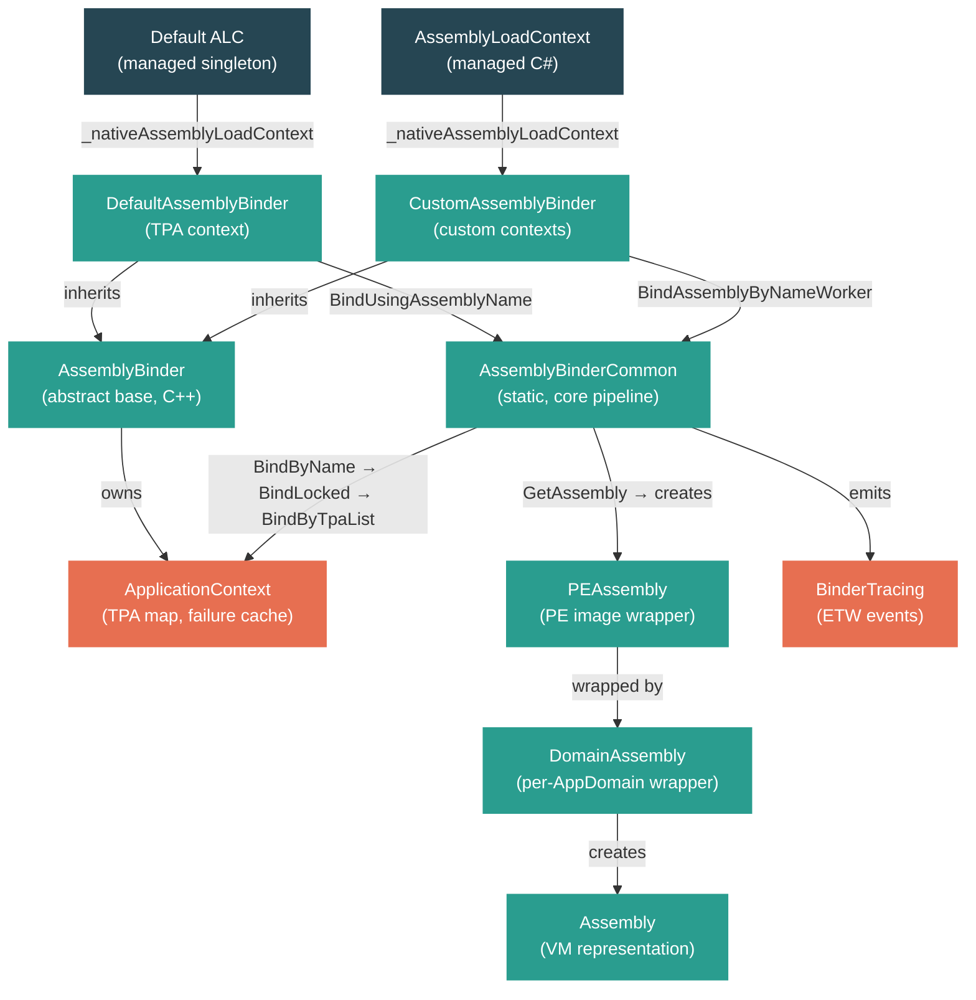

# Level 4: Internals — Assembly Loading: Binder, ALC, and Fusion

> **Target profile:** Developer who understands managed AssemblyLoadContext usage and now wants to follow the native binding pipeline inside CoreCLR
> **Estimated effort:** 6 hours
> **Prerequisites:** [Module 1.5 — Assemblies foundations](01-foundations-assemblies.md), Module 4.1
> [Version en espanol](../es/04-internals-assembly-loading.md)

---

## Learning Objectives

By the end of this module you will be able to:

1. Describe the three-level binder hierarchy: `AssemblyBinder` (base), `DefaultAssemblyBinder`, and `CustomAssemblyBinder`.
2. Trace the full binding resolution pipeline from `BindAssembly` through `BindByName`, `BindLocked`, `BindByTpaList`, and fallback to app paths.
3. Explain how the managed `AssemblyLoadContext` maps to the native `CustomAssemblyBinder` (or `DefaultAssemblyBinder`) via `_nativeAssemblyLoadContext`.
4. Describe how `PEAssembly`, `DomainAssembly`, and `Assembly` (native) represent loaded assemblies in the VM.
5. Explain assembly version compatibility rules and how `FUSION_E_REF_DEF_MISMATCH` is produced.
6. Use binder tracing events (`AssemblyLoadStart`/`AssemblyLoadStop`, `ResolutionAttempted`) and environment variables to diagnose binding failures.

---

## Concept Map



---

## Lesson 1: The Assembly Binder Architecture

### What you'll learn

The native class hierarchy that powers every assembly resolution in CoreCLR: `AssemblyBinder`, `DefaultAssemblyBinder`, and `CustomAssemblyBinder`.

### The concept

Every time your managed code says `Assembly.Load(...)` or the JIT encounters a missing type reference, the request eventually reaches native C++ code in the **binder** subsystem. The binder is not a single class — it is a hierarchy with a clear division of responsibilities:

**`AssemblyBinder`** (`src/coreclr/vm/assemblybinder.h`) is the abstract base class. It defines the contract:

```cpp
class AssemblyBinder
{
public:
    HRESULT BindAssemblyByName(AssemblyNameData* pAssemblyNameData, BINDER_SPACE::Assembly** ppAssembly);
    virtual HRESULT BindUsingPEImage(PEImage* pPEImage, bool excludeAppPaths, BINDER_SPACE::Assembly** ppAssembly) = 0;
    virtual HRESULT BindUsingAssemblyName(BINDER_SPACE::AssemblyName* pAssemblyName, BINDER_SPACE::Assembly** ppAssembly) = 0;
    virtual AssemblyLoaderAllocator* GetLoaderAllocator() = 0;
    virtual bool IsDefault() = 0;
    // ...
};
```

Every binder owns an `ApplicationContext` (via `m_appContext`), which holds the TPA list, app paths, an execution context cache of already-loaded assemblies, and a failure cache. The binder also holds an `INT_PTR m_ptrAssemblyLoadContext` — this is the GCHandle pointing back to the managed `AssemblyLoadContext` object.

**`DefaultAssemblyBinder`** (`src/coreclr/binder/inc/defaultassemblybinder.h`) is the binder for the default load context — the one that loads framework and application assemblies at startup. There is exactly one per process. Its `IsDefault()` returns `true`. It is configured with:
- **TPA list** (Trusted Platform Assemblies) — the semicolon-separated list of full paths to framework assemblies
- **Platform Resource Roots** — directories where satellite assemblies for framework assemblies are found
- **App Paths** — additional directories to probe for application assemblies

**`CustomAssemblyBinder`** (`src/coreclr/binder/inc/customassemblybinder.h`) is created for each user-defined `AssemblyLoadContext`. It holds a pointer to the `DefaultAssemblyBinder` (`m_pDefaultBinder`) so it can fall back to the default context. It also tracks its `AssemblyLoaderAllocator` for collectible contexts.

The key relationship: one managed `AssemblyLoadContext` instance maps to exactly one native `AssemblyBinder` instance (either `DefaultAssemblyBinder` or `CustomAssemblyBinder`).

### In the source code

The base class lives in `src/coreclr/vm/assemblybinder.h`. Notice the `GetAppContext()` method returns the binder's private `ApplicationContext`:

```cpp
inline BINDER_SPACE::ApplicationContext* GetAppContext()
{
    return &m_appContext;
}
```

The `DefaultAssemblyBinder` is defined in `src/coreclr/binder/inc/defaultassemblybinder.h` and implemented in `src/coreclr/binder/defaultassemblybinder.cpp`. Look at `BindAssemblyByNameWorker`:

```cpp
HRESULT DefaultAssemblyBinder::BindAssemblyByNameWorker(
    BINDER_SPACE::AssemblyName *pAssemblyName,
    BINDER_SPACE::Assembly **ppCoreCLRFoundAssembly,
    bool excludeAppPaths)
{
    // CoreLib should be bound using BindToSystem
    _ASSERTE(!pAssemblyName->IsCoreLib());

    hr = AssemblyBinderCommon::BindAssembly(this,
                                            pAssemblyName,
                                            excludeAppPaths,
                                            ppCoreCLRFoundAssembly);
    // ...
}
```

Notice it delegates to `AssemblyBinderCommon::BindAssembly` — the static workhorse class. `DefaultAssemblyBinder` does not implement binding logic itself; it orchestrates calls to the common pipeline and handles the managed fallback when binding fails.

The `CustomAssemblyBinder` (in `src/coreclr/binder/customassemblybinder.cpp`) documents its resolution order in comments:

```
// 1) Lookup the assembly within the LoadContext itself. If assembly is found, use it.
// 2) Invoke the LoadContext's Load method implementation. If assembly is found, use it.
// 3) Lookup the assembly within DefaultBinder (except for satellite requests).
// 4) Invoke the LoadContext's ResolveSatelliteAssembly method (for satellite requests).
// 5) Invoke the LoadContext's Resolving event. If assembly is found, use it.
// 6) Raise exception.
```

### Hands-on exercise

1. Open `src/coreclr/vm/assemblybinder.h` and list all virtual methods. For each one, note whether it returns an HRESULT or a pointer.
2. Open `src/coreclr/binder/inc/defaultassemblybinder.h`. Compare its public interface with `customassemblybinder.h`. What method does `CustomAssemblyBinder` have that `DefaultAssemblyBinder` does not? (Hint: look for `SetupContext` and `PrepareForLoadContextRelease`.)
3. Search for `SetAssemblyLoadContext` in `assemblybinder.h`. This is where the managed-to-native link is established. Trace backward: where is this called during `AssemblyLoadContext` construction?

### Key takeaways

- `AssemblyBinder` is the abstract base; `DefaultAssemblyBinder` handles the default (TPA) context; `CustomAssemblyBinder` handles user-created ALCs.
- Both concrete binders delegate core binding logic to `AssemblyBinderCommon`.
- Each binder owns an `ApplicationContext` that caches binding results and holds probe paths.
- The `m_ptrAssemblyLoadContext` field is the bridge back to the managed world.

---

## Lesson 2: Binding Resolution Pipeline

### What you'll learn

The step-by-step sequence of how `AssemblyBinderCommon` resolves an assembly name to a loaded PE image, including TPA probing, app paths, and satellite resource handling.

### The concept

When a binding request reaches `AssemblyBinderCommon::BindAssembly`, a carefully orchestrated pipeline executes. Here is the full sequence:

**Step 1: Acquire the application context lock.** Binding is serialized per `ApplicationContext` using a critical section. This prevents race conditions when multiple threads try to load the same assembly.

**Step 2: `BindByName`.** This is the top-level name-based resolution:
- First, check the **failure cache**. If this assembly name previously failed to bind, return the cached failure immediately. This avoids repeatedly probing the filesystem for assemblies that do not exist.
- Validate the architecture (x64, ARM64, etc.).
- Call `BindLocked`.

**Step 3: `BindLocked`.** This tries two strategies in order:
1. **`FindInExecutionContext`** — look up the assembly name in the `ExecutionContext` hash table. If found, perform a version compatibility check. If the already-loaded version satisfies the request, return it. If not, return `FUSION_E_APP_DOMAIN_LOCKED` (or `FUSION_E_REF_DEF_MISMATCH` for TPA assemblies).
2. **`BindByTpaList`** — if the assembly was not found in the execution context, probe the filesystem.

**Step 4: `BindByTpaList`.** This is where the actual filesystem probing happens, in the following order:

For **satellite assemblies** (non-neutral culture):
1. Probe the single-file bundle (if applicable)
2. Probe Platform Resource Roots
3. Probe App Paths (culture subdirectories)

For **regular assemblies**:
1. Probe the single-file bundle using `AssemblyProbeExtension::Probe`
2. Look up the assembly's simple name in the **TPA map** (`SimpleNameToFileNameMap`). The TPA list is a pre-parsed hash table mapping simple names to full file paths — this is not a directory scan but a direct lookup.
3. If not in TPA (or ref-def mismatch on TPA), probe **App Paths** using `BindAssemblyByProbingPaths`.

**Step 5: `RegisterAndGetHostChosen`.** After finding a candidate, register it in the execution context. If another thread bound the same assembly concurrently (the context version changed), retry the entire bind from the top.

**Step 6: Version compatibility.** At each stage where an assembly is found, `IsCompatibleAssemblyVersion` checks whether the found version satisfies the request. The rule is straightforward: each version component (major, minor, build, revision) of the found assembly must be greater than or equal to the requested component. An unspecified requested component matches any value.

### In the source code

The entry point is in `src/coreclr/binder/assemblybindercommon.cpp`, starting at `BindAssembly`:

```cpp
HRESULT AssemblyBinderCommon::BindAssembly(
    AssemblyBinder      *pBinder,
    AssemblyName        *pAssemblyName,
    bool                 excludeAppPaths,
    Assembly           **ppAssembly)
{
    // Tracing happens outside the binder lock
    BinderTracing::ResolutionAttemptedOperation tracer{pAssemblyName, pBinder, 0, hr};

Retry:
    {
        CRITSEC_Holder contextLock(pApplicationContext->GetCriticalSectionCookie());
        IF_FAIL_GO(BindByName(pApplicationContext, pAssemblyName, ...));
        kContextVersion = pApplicationContext->GetVersion();
    } // lock released

    // RegisterAndGetHostChosen may return S_FALSE to indicate retry
    hr = RegisterAndGetHostChosen(pApplicationContext, kContextVersion, &bindResult, &hostBindResult);
    if (hr == S_FALSE)
    {
        bindResult.Reset();
        goto Retry;
    }
    // ...
}
```

The `goto Retry` pattern is deliberate: it ensures that under high concurrency, the bind loop converges. By design, each retry either succeeds or finds the assembly that another thread already loaded.

The TPA lookup in `BindByTpaList` is a hash table lookup, not a directory walk:

```cpp
SimpleNameToFileNameMap * tpaMap = pApplicationContext->GetTpaList();
const SimpleNameToFileNameMapEntry *pTpaEntry = tpaMap->LookupPtr(simpleName.GetUnicode());
```

This is why the TPA list must be fully populated at startup — the binder never scans directories for platform assemblies.

### Hands-on exercise

1. In `src/coreclr/binder/assemblybindercommon.cpp`, find the `BindByTpaList` function. Read the block comment above it (starting at line ~804). Diagram the probe order on paper.
2. Set a breakpoint (or add a printf) in `FindInExecutionContext`. Load the same assembly twice from managed code. Observe that the second load hits the execution context cache and returns immediately.
3. Find the `FailureCache` class in `src/coreclr/binder/inc/failurecache.hpp`. What data structure does it use? (It is an `SHash`.) Why is caching failures important for startup performance?

### Key takeaways

- Binding is serialized per `ApplicationContext` using a critical section lock.
- The failure cache avoids repeated filesystem probes for missing assemblies.
- TPA resolution is a hash table lookup (O(1)), not a directory scan.
- App path probing is a linear search through configured directories.
- Concurrent binding is handled by a retry loop with version stamping on the context.

---

## Lesson 3: AssemblyLoadContext at the VM Level

### What you'll learn

How the managed `System.Runtime.Loader.AssemblyLoadContext` class connects to the native `CustomAssemblyBinder` or `DefaultAssemblyBinder`, and how callbacks flow in both directions.

### The concept

The managed `AssemblyLoadContext` (in `System.Private.CoreLib`) is the public API that developers interact with. But it is a thin wrapper around the native binder. Understanding the bridge between managed and native is critical for debugging binding issues.

**Construction: Managed to Native.** When you call `new AssemblyLoadContext("MyContext")`, the constructor chains to:

```csharp
_nativeAssemblyLoadContext = InitializeAssemblyLoadContext(thisHandlePtr, representsTPALoadContext, isCollectible);
```

This P/Invoke (`AssemblyNative_InitializeAssemblyLoadContext`) does the following in native code:
1. Creates a `CustomAssemblyBinder` instance (or returns the existing `DefaultAssemblyBinder` if `representsTPALoadContext` is true).
2. Calls `SetAssemblyLoadContext()` on the binder, passing the GCHandle to the managed object.
3. Returns the native binder pointer as `IntPtr`, which is stored in `_nativeAssemblyLoadContext`.

This establishes a bidirectional link: managed holds a native pointer; native holds a GCHandle to managed.

**Load requests: Native calls Managed.** When the native binder cannot resolve an assembly through its own paths (TPA, app paths), it calls back into managed code. The key function is `RuntimeInvokeHostAssemblyResolver`, declared at the top of `assemblybindercommon.cpp`:

```cpp
extern HRESULT RuntimeInvokeHostAssemblyResolver(
    INT_PTR pAssemblyLoadContextToBindWithin,
    BINDER_SPACE::AssemblyName *pAssemblyName,
    DefaultAssemblyBinder *pDefaultBinder,
    AssemblyBinder *pBinder,
    BINDER_SPACE::Assembly **ppLoadedAssembly);
```

This function uses the GCHandle (`pAssemblyLoadContextToBindWithin`) to get the managed ALC object and invokes its `Load()` override. If `Load()` returns null, it then falls through to the `Resolving` event.

For the `DefaultAssemblyBinder`, this callback sequence is:
1. Try native binding (TPA + app paths)
2. On failure, initialize the managed default ALC if needed
3. Call `RuntimeInvokeHostAssemblyResolver` which invokes the managed `Resolving` event

For the `CustomAssemblyBinder`, the sequence (documented in the source) is:
1. Look up in this binder's execution context
2. Call managed `Load()` override
3. Fall back to `DefaultAssemblyBinder` (TPA lookup, excluding app paths for non-satellite)
4. Call managed `ResolveSatelliteAssembly()` (for satellite assemblies)
5. Fire managed `Resolving` event
6. Raise `FileNotFoundException`

**Collectibility.** When an `AssemblyLoadContext` is created with `isCollectible: true`, the native `CustomAssemblyBinder` is allocated using a dedicated `AssemblyLoaderAllocator`. When the managed ALC is unloaded, `PrepareForLoadContextRelease` converts the weak GCHandle to a strong one (preventing premature GC), and `ReleaseLoadContext` eventually tears down the native binder and its loader allocator, freeing all memory associated with the loaded assemblies.

### In the source code

The managed side lives in two files:

- `src/libraries/System.Private.CoreLib/src/System/Runtime/Loader/AssemblyLoadContext.cs` — portable logic: constructor, events, `LoadFromAssemblyName`, `Unload`, state machine.
- `src/coreclr/System.Private.CoreLib/src/System/Runtime/Loader/AssemblyLoadContext.CoreCLR.cs` — CoreCLR-specific P/Invokes.

In the CoreCLR-specific file, notice the `LibraryImport` declarations:

```csharp
[LibraryImport(RuntimeHelpers.QCall, EntryPoint = "AssemblyNative_InitializeAssemblyLoadContext")]
private static partial IntPtr InitializeAssemblyLoadContext(IntPtr ptrAssemblyLoadContext,
    [MarshalAs(UnmanagedType.Bool)] bool fRepresentsTPALoadContext,
    [MarshalAs(UnmanagedType.Bool)] bool isCollectible);

[LibraryImport(RuntimeHelpers.QCall, EntryPoint = "AssemblyNative_LoadFromPath", StringMarshalling = StringMarshalling.Utf16)]
private static partial void LoadFromPath(IntPtr ptrNativeAssemblyBinder, string? ilPath, string? niPath,
    ObjectHandleOnStack retAssembly);
```

The `IntPtr ptrNativeAssemblyBinder` parameter in `LoadFromPath` is the `_nativeAssemblyLoadContext` field — the raw pointer to the C++ `AssemblyBinder` object.

The `_nativeAssemblyLoadContext` field is declared in the portable file:

```csharp
private readonly IntPtr _nativeAssemblyLoadContext;
```

Note the comment: "If you modify this field, you must also update the `AssemblyLoadContextBaseObject` structure in `object.h`." This is because the VM accesses this field directly from C++ via known offsets in the managed object layout.

### Hands-on exercise

1. Open `AssemblyLoadContext.cs` and find the constructor that calls `InitializeAssemblyLoadContext`. Trace the `representsTPALoadContext` parameter — when is it `true`? (Hint: look for the `DefaultAssemblyLoadContext` subclass.)
2. Search for `RuntimeInvokeHostAssemblyResolver` in the `src/coreclr/vm/` directory. Find where it invokes the managed `Load` method. What happens if `Load` returns null?
3. Create a custom `AssemblyLoadContext` and override `Load`. Set a breakpoint in `CustomAssemblyBinder::BindUsingAssemblyName` (native) and in your managed `Load` method. Observe the call sequence: native -> managed -> native.

### Key takeaways

- The managed `AssemblyLoadContext` holds a raw `IntPtr` to the native `AssemblyBinder`.
- The native binder holds a GCHandle pointing back to the managed ALC.
- Load requests flow native-first: the binder tries its own paths before calling managed overrides.
- Collectible ALCs use a dedicated `AssemblyLoaderAllocator` that can be torn down on unload.
- The `Load()` override is invoked via `RuntimeInvokeHostAssemblyResolver` when native binding fails.

---

## Lesson 4: PEAssembly and Assembly Objects

### What you'll learn

How the VM internally represents a loaded assembly through the layered objects `PEAssembly`, `DomainAssembly`, and `Assembly`.

### The concept

When the binder successfully resolves an assembly to a file on disk (or a byte array in memory), the VM must create internal data structures to represent it. There are three layers, each with a distinct responsibility:

**`PEAssembly`** (`src/coreclr/vm/peassembly.h`) is the lowest-level representation. It wraps a `PEImage` (the memory-mapped PE file) and provides access to:
- Metadata (via `IMDInternalImport`)
- PE headers and layout information
- Machine type validation (x64 vs ARM64 vs MSIL)
- Display name and path

A `PEAssembly` can be created from multiple sources:
1. An HMODULE (for IJW/native DLLs loaded by the OS)
2. A path on disk (the most common case)
3. A byte array (for `Assembly.Load(byte[])`)
4. Dynamic/reflection-emit (placeholder, no actual PE)

The comment in `peassembly.h` explains: "Although a PEAssembly is usually a disk based PE file, it is not always the case. Thus it is a conscious decision to not export access to the PE file directly."

**`Assembly`** (`src/coreclr/vm/assembly.hpp` / `assembly.cpp`) is the VM-level representation of the assembly. It owns:
- The `Module` (which holds the metadata and method tables)
- The `PEAssembly`
- Security attributes and friend assembly declarations
- A pointer back to its `DomainAssembly`

The global counter `g_cAssemblies` tracks how many assemblies exist in the process.

**`DomainAssembly`** (`src/coreclr/vm/domainassembly.h`) is the per-AppDomain wrapper. In modern .NET (single AppDomain), there is exactly one `DomainAssembly` per `Assembly`. Its constructor creates the `Assembly`:

```cpp
DomainAssembly::DomainAssembly(PEAssembly* pPEAssembly, LoaderAllocator* pLoaderAllocator, AllocMemTracker* memTracker)
    : m_pAssembly(NULL)
{
    NewHolder<Assembly> assembly = Assembly::Create(pPEAssembly, memTracker, pLoaderAllocator);
    assembly->SetDomainAssembly(this);
    m_pAssembly = assembly.Extract();
}
```

Notice that `Assembly::Create` is the factory, and `DomainAssembly` immediately links itself via `SetDomainAssembly`.

**Loading levels.** Assembly loading is not atomic — it proceeds through stages tracked by the `FileLoadLevel` enum in `assemblyspec.hpp`:

```
FILE_LOAD_CREATE          // Lock + FileLoadLock created
FILE_LOAD_ALLOCATE        // DomainAssembly + Assembly allocated
FILE_LOAD_BEGIN
FILE_LOAD_BEFORE_TYPE_LOAD
FILE_LOAD_EAGER_FIXUPS
FILE_LOAD_DELIVER_EVENTS
FILE_LOADED               // Loaded but not active
FILE_ACTIVE               // Constructors run, fully usable
```

This staged loading prevents circular dependency deadlocks: an assembly can be in `FILE_LOADED` state (its types are visible) before `FILE_ACTIVE` (its module initializer has run).

### In the source code

In the binder subsystem, there is also a `BINDER_SPACE::Assembly` class (in `src/coreclr/binder/inc/assembly.hpp`) — do not confuse it with the VM's `Assembly`. The binder assembly is a lightweight handle that holds the `PEImage` and the `AssemblyName`. It is the binder's "result object" that gets passed up to the VM, which then creates the full `PEAssembly` → `Assembly` → `DomainAssembly` chain.

The validation in `peassembly.cpp` includes architecture checks:

```cpp
static void ValidatePEFileMachineType(PEAssembly *pPEAssembly)
{
    DWORD peKind;
    DWORD actualMachineType;
    pPEAssembly->GetPEKindAndMachine(&peKind, &actualMachineType);

    if (actualMachineType == IMAGE_FILE_MACHINE_I386 && ((peKind & (peILonly | pe32BitRequired)) == peILonly))
        return;    // Image is marked CPU-agnostic.

    if (actualMachineType != IMAGE_FILE_MACHINE_NATIVE && actualMachineType != IMAGE_FILE_MACHINE_NATIVE_NI)
    {
        COMPlusThrow(kBadImageFormatException, IDS_CLASSLOAD_WRONGCPU, name.GetUnicode());
    }
}
```

This is why loading an x64 assembly on ARM64 fails with `BadImageFormatException` — the check happens at the `PEAssembly` level.

### Hands-on exercise

1. Open `src/coreclr/vm/domainassembly.h`. Notice that `DomainAssembly` is marked `final` — it cannot be subclassed. Why is this appropriate for modern .NET (single AppDomain)?
2. Search for `Assembly::Create` in `src/coreclr/vm/assembly.cpp`. List the parameters it takes. What does the `AllocMemTracker` do?
3. In `src/coreclr/vm/assemblyspec.hpp`, read the `FileLoadLevel` enum. Draw a state diagram showing the transitions. When does the assembly become visible to other code? When does the module initializer run?

### Key takeaways

- `PEAssembly` wraps the raw PE image and metadata. It is the binder's output.
- `Assembly` (VM) is the runtime representation that owns the Module and type system data.
- `DomainAssembly` bridges the AppDomain to the Assembly. In modern .NET, this is 1:1.
- Loading progresses through staged levels (`FILE_LOAD_CREATE` to `FILE_ACTIVE`) to handle circular dependencies.
- Do not confuse `BINDER_SPACE::Assembly` (binder result) with the VM's `Assembly` (runtime object).

---

## Lesson 5: Version Binding and Conflict Resolution

### What you'll learn

How the binder handles version mismatches, what `FUSION_E_REF_DEF_MISMATCH` means, and the rules for determining assembly compatibility.

### The concept

Version conflicts are among the most common assembly loading problems. The binder has explicit rules for when a found assembly satisfies a request.

**The compatibility function.** `IsCompatibleAssemblyVersion` in `assemblybindercommon.cpp` implements a component-by-component comparison:

```
For each version component (Major, Minor, Build, Revision):
  - If the requested component is unspecified → compatible (wildcard match)
  - If the found component is unspecified but requested is specified → incompatible
  - If requested > found → incompatible
  - If requested < found → compatible (higher version satisfies)
  - If equal → check next component
```

This means: **a higher version of the found assembly always satisfies a lower version request**, as long as all specified components match or exceed. An assembly requesting version 2.0 is satisfied by version 3.0, but not by version 1.5.

**Ref-Def mismatch.** When `BindLocked` finds an assembly in the execution context but the version check fails, it produces `FUSION_E_APP_DOMAIN_LOCKED`. For TPA assemblies, this is converted to `FUSION_E_REF_DEF_MISMATCH`:

```cpp
bool isCompatible = IsCompatibleAssemblyVersion(pAssemblyName, pAssembly->GetAssemblyName());
hr = isCompatible ? S_OK : FUSION_E_APP_DOMAIN_LOCKED;

// TPA binder returns FUSION_E_REF_DEF_MISMATCH for incompatible version
if (hr == FUSION_E_APP_DOMAIN_LOCKED && isTpaListProvided)
    hr = FUSION_E_REF_DEF_MISMATCH;
```

The distinction matters: `FUSION_E_APP_DOMAIN_LOCKED` means "a different version is already loaded in this context" (permanent failure). `FUSION_E_REF_DEF_MISMATCH` means "the found assembly does not match the reference" (may trigger fallback to managed resolver).

**TPA wins over App Paths.** When an assembly with the same simple name exists in both TPA and App Paths, the binder applies a precedence rule: if the TPA assembly's full name (simple name + culture + public key token) matches the app assembly, TPA wins. If the names differ (different assembly entirely, same simple name), the app assembly is used.

**`AssemblySpec` and `AssemblyName`.** Two related but different classes participate in binding:
- `BINDER_SPACE::AssemblyName` (in `src/coreclr/binder/inc/assemblyname.hpp`) — the binder's own representation of an assembly identity, used throughout the binding pipeline.
- `AssemblySpec` (in `src/coreclr/vm/assemblyspec.hpp`) — the VM-level binding request. It wraps a `BaseAssemblySpec` and adds the `AppDomain` context, parent assembly, and fallback binder.

`AssemblySpec` includes the fallback binder concept: when a ref-emitted assembly requests a load, the `m_pFallbackBinder` is set to ensure the load context of the requesting assembly is used.

### In the source code

The version compatibility logic is at the top of `src/coreclr/binder/assemblybindercommon.cpp`:

```cpp
bool IsCompatibleAssemblyVersion(AssemblyName *pRequestedName, AssemblyName *pFoundName)
{
    AssemblyVersion *pRequestedVersion = pRequestedName->GetVersion();
    AssemblyVersion *pFoundVersion = pFoundName->GetVersion();

    if (!pRequestedVersion->HasMajor())
        return true; // Unspecified requested version matches anything

    if (!pFoundVersion->HasMajor() || pRequestedVersion->GetMajor() > pFoundVersion->GetMajor())
        return false;

    if (pRequestedVersion->GetMajor() < pFoundVersion->GetMajor())
        return true;

    // ... repeat for Minor, Build, Revision
}
```

The `TestCandidateRefMatchesDef` function performs identity matching (name, culture, public key token) without version. It is used to verify that a TPA assembly actually corresponds to the requested assembly before applying the version check.

In `src/coreclr/vm/assemblyspec.hpp`, notice the `FileLoadLevel` enum that tracks assembly loading stages. The `FILE_LOAD_ALLOCATE` stage is where `AssemblySpec` transitions into an actual `DomainAssembly`/`Assembly` pair. Before that, the spec can fail at any point without leaving partially-loaded state.

### Hands-on exercise

1. Write a small test: create two assemblies with the same name but different versions. Load the lower version first via the default ALC, then try to load the higher version. What error do you get?
2. Reverse the experiment: load the higher version first, then request the lower version. Does it succeed? (Yes — higher satisfies lower.)
3. In `assemblybindercommon.cpp`, find the `BindByTpaList` code path where `fPartialMatchOnTpa` is set to `true`. Under what condition does the binder prefer the TPA assembly over an app path assembly?

### Key takeaways

- Higher versions satisfy lower version requests (forward-compatible).
- `FUSION_E_APP_DOMAIN_LOCKED` = wrong version already loaded in this context.
- `FUSION_E_REF_DEF_MISMATCH` = found assembly identity does not match the reference (triggers fallback).
- TPA takes precedence over app paths when the full assembly name matches.
- `AssemblySpec` (VM) and `BINDER_SPACE::AssemblyName` (binder) represent assembly identity at different layers.

---

## Lesson 6: Diagnostics — Binder Tracing

### What you'll learn

How to use ETW events, environment variables, and the `BinderTracing` classes to diagnose assembly binding failures.

### The concept

Assembly binding failures are notoriously difficult to diagnose. The binder subsystem provides multiple layers of diagnostic instrumentation.

**ETW Events.** The primary tracing mechanism uses Event Tracing for Windows (ETW) and EventPipe (cross-platform). Two event classes bracket every bind operation:

- **`AssemblyLoadStart`** — fired when binding begins. Includes the requested assembly name, requesting assembly, and the ALC name.
- **`AssemblyLoadStop`** — fired when binding completes. Includes the result assembly name, path, and whether it was cached.

Between these, for each resolution stage, a **`ResolutionAttempted`** event fires, indicating which stage was tried and whether it succeeded. The stages correspond to the `BinderTracing::ResolutionAttemptedOperation::Stage` enum:

```cpp
enum class Stage : uint16_t
{
    FindInLoadContext = 0,
    AssemblyLoadContextLoad = 1,
    ApplicationAssemblies = 2,
    DefaultAssemblyLoadContextFallback = 3,
    ResolveSatelliteAssembly = 4,
    AssemblyLoadContextResolvingEvent = 5,
    AppDomainAssemblyResolveEvent = 6,
};
```

This means a single bind operation can fire up to 7 `ResolutionAttempted` events (one per stage), plus the start/stop brackets.

**`BinderTracing` classes.** There are two main classes in `src/coreclr/binder/inc/bindertracing.h`:

- `AssemblyBindOperation` — wraps the start/stop events. Created with an `AssemblySpec`, it fires `AssemblyLoadStart` in the constructor and `AssemblyLoadStop` in the destructor (RAII pattern).
- `ResolutionAttemptedOperation` — tracks the stages. Its `GoToStage()` method fires the event for the previous stage (assumed failed) and moves to the next.

**Environment variables.** For quick debugging without ETW tools:
- `DOTNET_AssemblyLoadContextDebug=1` — enables diagnostic output from the managed ALC.
- `DOTNET_TraceTPA=1` — shows TPA list during startup.

**`dotnet-trace` and `PerfView`.** For production-grade diagnostics:
```bash
dotnet-trace collect --providers Microsoft-Windows-DotNETRuntime:4 --process-id <PID>
```
The provider keyword `4` (Loader) enables all assembly load events. The resulting `.nettrace` file can be opened in PerfView or Visual Studio.

**Managed tracing.** The managed ALC also emits tracing from `AssemblyLoadContext.CoreCLR.cs`:

```csharp
[LibraryImport(RuntimeHelpers.QCall, EntryPoint = "AssemblyNative_TraceResolvingHandlerInvoked")]
[return: MarshalAs(UnmanagedType.Bool)]
internal static partial bool TraceResolvingHandlerInvoked(string assemblyName, string handlerName,
    string? alcName, string? resultAssemblyName, string? resultAssemblyPath);
```

These QCall methods fire events at each point where a managed handler is invoked, providing full visibility into the managed portion of the resolution.

**`PathProbed` events.** Every filesystem probe (TPA lookup, app path scan, satellite search) fires a `PathProbed` event with the path attempted and the HRESULT. This lets you reconstruct the exact sequence of directories the binder searched.

### In the source code

The tracing implementation lives in `src/coreclr/binder/bindertracing.cpp`. The `FireAssemblyLoadStart` function:

```cpp
void FireAssemblyLoadStart(const BinderTracing::AssemblyBindOperation::BindRequest &request)
{
    if (!EventEnabledAssemblyLoadStart())
        return;

    GUID activityId = GUID_NULL;
    GUID relatedActivityId = GUID_NULL;
    ActivityTracker::Start(&activityId, &relatedActivityId);

    FireEtwAssemblyLoadStart(
        GetClrInstanceId(),
        request.AssemblyName,
        request.AssemblyPath,
        request.RequestingAssembly,
        request.AssemblyLoadContext,
        request.RequestingAssemblyLoadContext,
        &activityId,
        &relatedActivityId);
}
```

Notice the `EventEnabledAssemblyLoadStart()` guard — the tracing has zero overhead when no listener is attached. The `ActivityTracker` provides activity IDs for correlating start/stop pairs across threads.

The `ResolutionAttemptedOperation::GoToStage` method shows the stage-transition pattern:

```cpp
void GoToStage(Stage stage)
{
    // Going to a different stage should only happen if the current stage failed.
    TraceStage(m_stage, m_hr, m_pFoundAssembly);
    m_stage = stage;
    m_exceptionMessage.Clear();
}
```

### Hands-on exercise

1. Run a simple .NET application with `dotnet-trace`:
   ```bash
   dotnet-trace collect --providers Microsoft-Windows-DotNETRuntime:4 -- dotnet run
   ```
   Open the trace in PerfView. Find the `AssemblyLoadStart`/`AssemblyLoadStop` events. How many assemblies are loaded during startup of a "Hello World" app?

2. Deliberately cause a binding failure by referencing a non-existent assembly version. Collect a trace and examine the `ResolutionAttempted` events. Which stages are tried before the failure?

3. In `src/coreclr/binder/bindertracing.cpp`, find the `FireAssemblyLoadStop` function. Notice it reads the result assembly's display name and path. What happens if `resultAssembly` is null (binding failed)?

4. Search for `PathProbed` calls in `assemblybindercommon.cpp`. Count how many different `PathSource` values exist. Map each to the probe stage it represents.

### Key takeaways

- ETW/EventPipe events bracket every bind operation with start/stop pairs and per-stage resolution events.
- The `BinderTracing` classes use RAII — construction fires start, destruction fires stop.
- `ResolutionAttempted` events fire for each failed stage, providing a step-by-step record of the binding attempt.
- `PathProbed` events record every filesystem path the binder checked.
- Tracing has zero overhead when no listener is attached, thanks to `EventEnabled*()` guards.
- Use `dotnet-trace` with provider keyword `4` (Loader) to capture binding diagnostics in production.

---

## Summary and What's Next

In this module you traced the full assembly loading pipeline from the managed `AssemblyLoadContext` through the native binder subsystem to the creation of VM objects.

**Key points to remember:**

1. **Three binder classes:** `AssemblyBinder` (abstract base) → `DefaultAssemblyBinder` (TPA context) → `CustomAssemblyBinder` (user ALCs). Both concrete binders delegate to `AssemblyBinderCommon`.

2. **The binding pipeline:** `BindAssembly` → `BindByName` (failure cache check) → `BindLocked` (execution context lookup) → `BindByTpaList` (bundle → TPA map → app paths).

3. **Managed-native bridge:** The managed `_nativeAssemblyLoadContext` field holds the native binder pointer. The native `m_ptrAssemblyLoadContext` holds a GCHandle to the managed ALC. Load requests flow native-first with managed fallback.

4. **VM object chain:** `BINDER_SPACE::Assembly` (binder result) → `PEAssembly` (PE image wrapper) → `Assembly` (VM representation) → `DomainAssembly` (per-domain wrapper).

5. **Version rules:** Higher versions satisfy lower requests. `FUSION_E_REF_DEF_MISMATCH` triggers fallback to managed resolvers.

6. **Diagnostics:** ETW events at every stage, `PathProbed` for every filesystem check, `ResolutionAttempted` for every resolution stage.

### Further reading

| Resource | Location |
|----------|----------|
| Binder source code | `src/coreclr/binder/` |
| VM assembly objects | `src/coreclr/vm/assembly.cpp`, `peassembly.h`, `domainassembly.h` |
| Managed ALC | `src/libraries/System.Private.CoreLib/src/System/Runtime/Loader/AssemblyLoadContext.cs` |
| CoreCLR ALC P/Invokes | `src/coreclr/System.Private.CoreLib/src/System/Runtime/Loader/AssemblyLoadContext.CoreCLR.cs` |
| Assembly binder design doc | `docs/design/features/assembly-loading.md` (if present) |
| `AssemblySpec` | `src/coreclr/vm/assemblyspec.hpp` |
| Binder tracing | `src/coreclr/binder/bindertracing.cpp`, `src/coreclr/binder/inc/bindertracing.h` |

### Next module

Module 4.7 will explore the **Type Loader** — how the VM resolves type references, builds `MethodTable` structures, and handles generic instantiation once assemblies are loaded.
