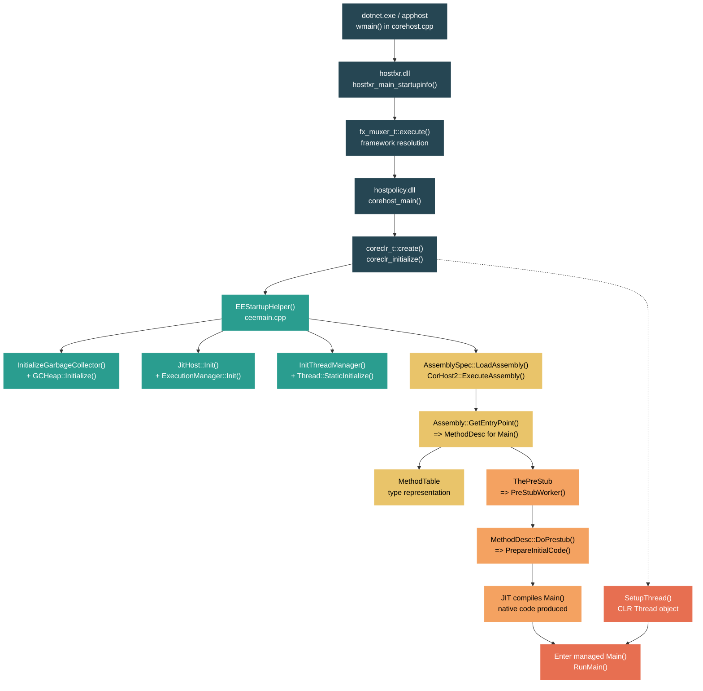

# Level 4: Internals — CLR Startup: From `dotnet` to `Main()`

> **Target profile:** Developer who understands CLR mechanics, JIT behavior, and GC tuning, and wants to trace execution through the native host chain into the runtime engine
> **Estimated effort:** 8 hours
> **Prerequisites:** Level 3 complete (Memory Model, GC, Threading, Native Interop)
> [Version en espanol](../es/04-internals-clr-startup.md)

---

## Learning Objectives

By the end of this module you will be able to:

1. Trace the complete native call chain from `dotnet.exe`'s `wmain()` through hostfxr, hostpolicy, and into `coreclr_initialize`.
2. Identify the key functions in `ceemain.cpp` that compose `EEStartupHelper()` and explain the initialization order of GC, JIT, thread manager, type system, and debugger.
3. Describe how the entry assembly is located, loaded via `AssemblySpec::LoadAssembly`, and how `CorHost2::ExecuteAssembly` bridges to managed code.
4. Explain the role of `MethodTable` in representing a type at runtime and how `Assembly::GetEntryPoint()` resolves to a `MethodDesc` for `Main()`.
5. Walk through the prestub mechanism -- from `ThePreStub` through `PreStubWorker` to `MethodDesc::DoPrestub` -- and explain how `Main()` gets JIT-compiled on first call.
6. Describe how `SetupThread()` creates the CLR Thread object for the main OS thread, what `InitializationForManagedThreadInNative` does, and how the transition to managed code occurs.
7. Use `DOTNET_TRACE_HOST` and SOS/WinDbg/LLDB to observe the startup sequence in a live process.
8. Explain the difference between `coreclr_initialize` (runtime bootstrap) and `coreclr_execute_assembly` (assembly execution) in the hosting API.

---

## Concept Map



---

## Curriculum

### Lesson 1 — The Native Host Chain: dotnet.exe to coreclr_initialize

#### What you'll learn

When you type `dotnet MyApp.dll`, multiple native libraries cooperate in a precise chain before the CLR even starts. Understanding this chain is essential for diagnosing startup failures, custom hosting scenarios, and single-file deployment.

#### The concept

The .NET host architecture has three distinct layers, each a separate native shared library:

1. **The host executable** (`dotnet.exe` or `apphost`) -- the OS process entry point. It resolves the location of `hostfxr` and calls into it.
2. **hostfxr** (`hostfxr.dll`/`libhostfxr.so`) -- the framework resolver. It reads `runtimeconfig.json`, resolves framework versions, finds `hostpolicy`, and calls into it.
3. **hostpolicy** (`hostpolicy.dll`/`libhostpolicy.so`) -- the runtime policy layer. It builds the TPA (Trusted Platform Assemblies) list, resolves dependencies, and calls `coreclr_initialize` to bootstrap the CLR.

This separation exists so that the host can be patched independently of the runtime, and so that different hosting modes (self-contained, framework-dependent, single-file bundles) share the same core logic.

#### In the source code

**Entry point: `src/native/corehost/corehost.cpp`**

The OS calls `wmain()` (Windows) or `main()` (Unix) at line 310/312:

```cpp
#if defined(_WIN32)
int __cdecl wmain(const int argc, const pal::char_t* argv[])
#else
int main(const int argc, const pal::char_t* argv[])
#endif
{
    trace::setup();
    // ...
    int exit_code = exe_start(argc, argv);
    // ...
}
```

The `exe_start()` function (line 121) resolves the hostfxr library path using `hostfxr_resolver_t`, then calls `hostfxr_main_startupinfo()`:

```cpp
int exe_start(const int argc, const pal::char_t* argv[])
{
    // Resolve host path, app path...
    hostfxr_resolver_t fxr{app_root};
    // ...
    rc = hostfxr_main_startupinfo(argc, argv, host_path_cstr, dotnet_root_cstr, app_path_cstr);
}
```

**hostfxr: `src/native/corehost/fxr/hostfxr.cpp`**

The `hostfxr_main_startupinfo` function (line 52) delegates to `fx_muxer_t::execute()`:

```cpp
SHARED_API int HOSTFXR_CALLTYPE hostfxr_main_startupinfo(...)
{
    trace_hostfxr_entry_point(_X("hostfxr_main_startupinfo"));
    host_startup_info_t startup_info(host_path, dotnet_root, app_path);
    return fx_muxer_t::execute(pal::string_t(), argc, argv, startup_info, nullptr, 0, nullptr);
}
```

**Framework resolution: `src/native/corehost/fxr/fx_muxer.cpp`**

`fx_muxer_t::execute()` (line 548) detects the operating mode (apphost, dotnet muxer, etc.), parses arguments, and calls `handle_exec_host_command()`, which eventually loads hostpolicy and calls `corehost_main`.

**hostpolicy: `src/native/corehost/hostpolicy/hostpolicy.cpp`**

`corehost_main()` (line 410) initializes the hostpolicy context and calls `run_app()`, which first ensures the runtime is created via `create_coreclr()`.

**CoreCLR creation: `src/native/corehost/hostpolicy/coreclr.cpp`**

`coreclr_t::create()` (line 29) binds to the coreclr shared library, then calls `coreclr_initialize` -- the C API exported by `src/coreclr/dlls/mscoree/exports.cpp`. This is the handoff from the host layer into the CLR engine.

#### Hands-on exercise

1. **Trace the host chain with environment variables:**
   ```bash
   # On Windows (cmd):
   set DOTNET_TRACE_HOST=1
   dotnet MyApp.dll

   # On Linux/macOS:
   DOTNET_TRACE_HOST=1 dotnet MyApp.dll
   ```
   Observe the output lines prefixed with `--- Invoked hostfxr_main_startupinfo` and `--- Invoked hostpolicy`. Each line maps to a function entry point you just read.

2. **Set a breakpoint at the handoff:** Using WinDbg or LLDB, attach to a .NET process at startup and set breakpoints on `coreclr_initialize`. Observe the call stack -- you should see the full chain: `exe_start` -> `hostfxr_main_startupinfo` -> `fx_muxer_t::execute` -> `corehost_main` -> `create_coreclr` -> `coreclr_initialize`.

3. **Inspect the properties passed to coreclr_initialize:** In the `create_coreclr()` function in `hostpolicy.cpp` (line 48), the `coreclr_properties` are logged when tracing is enabled. These include `TRUSTED_PLATFORM_ASSEMBLIES`, `APP_PATHS`, and other critical configuration. Set `DOTNET_TRACE_HOST=1` and look for property names in the output.

#### Key takeaway

The startup chain is a deliberate layered design: each library has a single responsibility (resolve host -> resolve framework -> resolve dependencies -> initialize CLR). This separation enables the host to be patched independently and supports diverse deployment modes.

#### Common misconception

Many developers believe `dotnet.exe` directly loads the CLR. In reality, three separate native libraries are loaded sequentially, each performing resolution work. In self-contained deployments, the apphost (a renamed copy of the host executable) has the managed assembly path embedded directly in its binary image (see the `EMBED_HASH_FULL_UTF8` marker in `corehost.cpp`).

---

### Lesson 2 — EEStartup: Bootstrapping the Runtime

#### What you'll learn

Once `coreclr_initialize` is called, the CLR's Execution Engine (EE) must initialize dozens of subsystems in a precise order. This lesson traces through `EEStartupHelper()` -- the function that brings the entire runtime to life.

#### The concept

The EE startup is a single-threaded, sequential initialization. A spin lock (`g_EEStartupLock`) ensures only one thread performs startup. The function `EnsureEEStarted()` acquires this lock, checks if startup has already completed, and if not, calls `EEStartup()` which delegates to `EEStartupHelper()`.

The initialization order matters: you cannot initialize the JIT before the GC exists (because JIT allocations may trigger GC), and you cannot create Thread objects before the thread manager is initialized.

#### In the source code

**File: `src/coreclr/vm/ceemain.cpp`**

`EnsureEEStarted()` (line 258) is the public entry point:

```cpp
HRESULT EnsureEEStarted()
{
    // ...
    DangerousNonHostedSpinLockHolder lockHolder(&g_EEStartupLock);
    if (!g_fEEStarted && !g_fEEInit && SUCCEEDED(g_EEStartupStatus))
    {
        g_dwStartupThreadId = GetCurrentThreadId();
        EEStartup();
        // ...
    }
}
```

`EEStartupHelper()` (line 593) is where the real work happens. Here is the initialization order with approximate line numbers:

| Step | Line | Function/Action | Purpose |
|------|------|----------------|---------|
| 1 | 617 | `GetSystemInfo()` | Cache CPU info |
| 2 | 632 | `EEConfig::Setup()` | Parse runtime configuration |
| 3 | 647 | `PendingTypeLoadTable::Init()` | Type loading infrastructure |
| 4 | 649 | `ExecutableAllocator::StaticInitialize()` | Allocator for JIT code |
| 5 | 656 | `Thread::StaticInitialize()` | Thread subsystem statics |
| 6 | 662 | `JITInlineTrackingMap::StaticInitialize()` | JIT inline tracking |
| 7 | 670 | `TieredCompilationManager::StaticInitialize()` | Tiered compilation |
| 8 | 690 | `InitThreadManager()` | Full thread manager |
| 9 | 695 | `EventPipeAdapter::Initialize()` | Diagnostics pipeline |
| 10 | 802 | `StubManager::InitializeStubManagers()` | Stub dispatch infrastructure |
| 11 | 806 | `PEImage::Startup()` | PE image loading |
| 12 | 810 | `CoreLibBinder::Startup()` | Bind to System.Private.CoreLib types |
| 13 | 819 | `InitializeGarbageCollector()` | Create GC subsystem |
| 14 | 834 | `SystemDomain::Attach()` | Create the default AppDomain |
| 15 | 838 | `ExecutionManager::Init()` | Code manager for JIT output |
| 16 | 844 | `JitHost::Init()` | JIT compiler host interface |
| 17 | 858 | `InitializeDebugger()` | Managed debugger support |
| 18 | 878 | `InitPreStubManager()` | Prestub dispatch |
| 19 | 892 | `SyncBlockCache::Start()` | Object synchronization |
| 20 | 897 | `g_pGCHeap->Initialize()` | Actually initialize the GC heap |
| 21 | 927 | `SetupThread()` | Create Thread object for the startup thread |

Note that the GC is created in two phases: `InitializeGarbageCollector()` creates the subsystem data structures, and `g_pGCHeap->Initialize()` (line 897) actually initializes the heap -- this split is necessary because write barriers must be set up between the two phases (line 888-889).

#### Hands-on exercise

1. **Read the full startup sequence:** Open `src/coreclr/vm/ceemain.cpp` starting at line 593 and read through `EEStartupHelper()` to the end. Note the `IfFailGo` macros -- any failure jumps to `ErrExit` and aborts startup.

2. **Use ETW to observe startup events:**
   ```bash
   dotnet-trace collect --providers Microsoft-Windows-DotNETRuntime:0x80000:5 -- dotnet MyApp.dll
   ```
   Look for the `EEStartupStart_V1` and `EEStartupEnd_V1` events -- these bracket the entire `EEStartupHelper()` execution.

3. **Set breakpoints in the startup path:** With WinDbg attached at process start:
   ```
   bp coreclr!EEStartupHelper
   bp coreclr!InitializeGarbageCollector
   bp coreclr!SetupThread
   ```
   Step through and observe the order. Note the thread ID remains the same throughout -- startup is single-threaded.

#### Key takeaway

`EEStartupHelper()` is the single most important function in the CLR bootstrap. It initializes approximately 20 subsystems in a carefully ordered sequence. Understanding this order explains why certain operations fail if attempted too early (for example, you cannot allocate managed objects until after `g_pGCHeap->Initialize()` completes).

#### Common misconception

Developers often think the GC "starts" at a single point. In reality, GC initialization is split across `InitializeGarbageCollector()` (creates data structures), write barrier initialization (JIT helpers), and `g_pGCHeap->Initialize()` (makes the heap usable). Only after all three are complete can managed allocations occur.

---

### Lesson 3 — Assembly Loading at Startup

#### What you'll learn

After the runtime is initialized, the host calls `coreclr_execute_assembly` to run the application. This triggers a chain that loads the entry assembly, resolves its dependencies, and prepares to find the `Main()` method.

#### The concept

Assembly loading at startup follows a specific path:

1. hostpolicy calls `coreclr_t::execute_assembly()`, which calls the CLR's exported `coreclr_execute_assembly` function.
2. Inside the CLR, this maps to `CorHost2::ExecuteAssembly()`, which operates on the default AppDomain.
3. `AssemblySpec::LoadAssembly()` loads the PE image, reads its metadata, and creates an `Assembly` object with its `Module`.
4. The assembly's entry point token (stored in the PE header's CLI metadata) is resolved to a `MethodDesc`.

#### In the source code

**hostpolicy side: `src/native/corehost/hostpolicy/hostpolicy.cpp`**

`run_app_for_context()` (line 204) calls `coreclr->execute_assembly()`:

```cpp
int run_app_for_context(const hostpolicy_context_t &context, int argc, const pal::char_t **argv)
{
    // Convert args to CLR strings...
    unsigned int exit_code;
    auto hr = context.coreclr->execute_assembly(
        (int32_t)argv_local.size(),
        argv_local.data(),
        managed_app.data(),
        &exit_code);
    // ...
}
```

**CLR side: `src/coreclr/dlls/mscoree/exports.cpp`**

`coreclr_execute_assembly` (line 473) translates string arguments and calls `host->ExecuteAssembly()`.

**CorHost2: `src/coreclr/vm/corhost.cpp`**

`CorHost2::ExecuteAssembly()` (line 256) performs the core work:

```cpp
HRESULT CorHost2::ExecuteAssembly(DWORD dwAppDomainId, LPCWSTR pwzAssemblyPath, ...)
{
    // Ensure a Thread exists for the current OS thread
    Thread *pThread = GetThreadNULLOk();
    if (pThread == NULL)
    {
        pThread = SetupThreadNoThrow(&hr);
    }
    // ...
    Assembly *pAssembly = AssemblySpec::LoadAssembly(pwzAssemblyPath);
    // ...
    arguments = SetCommandLineArgs(pwzAssemblyPath, argc, argv);
    DWORD retval = pAssembly->ExecuteMainMethod(&arguments, false);
}
```

Note the three critical steps: (1) ensure a Thread object exists, (2) load the assembly, (3) execute Main.

**Assembly entry: `src/coreclr/vm/assembly.cpp`**

`Assembly::GetEntryPoint()` (line 1428) reads the entry point token from the module's PE metadata and resolves it to a `MethodDesc`. This token is the `EntryPointToken` field in the CLI header.

#### Hands-on exercise

1. **Examine an assembly's entry point token:**
   ```bash
   dotnet tool install -g dotnet-ildasm  # or use ildasm on Windows
   ildasm MyApp.dll /metadata /header
   ```
   Look for `Entry Point Token` in the CLI header. This is the metadata token that `Assembly::GetEntryPoint()` resolves.

2. **Use SOS to inspect the loaded assembly:**
   ```
   # In WinDbg with SOS loaded:
   !DumpDomain
   !DumpAssembly <address>
   !DumpModule <module_address>
   ```
   Observe the module's entry point method. Compare the token you found with `ildasm` to the one SOS reports.

3. **Set a breakpoint on assembly load:**
   ```
   bp coreclr!AssemblySpec::LoadAssembly
   ```
   When hit, examine the assembly path argument. Then continue and set `bp coreclr!Assembly::GetEntryPoint` to see the entry point resolution.

#### Key takeaway

Assembly loading at startup is not a simple "file open" operation. It involves PE image mapping, metadata parsing, assembly identity resolution, and creation of runtime data structures (`Assembly`, `Module`, `PEAssembly`). The entry point token in the CLI header is the metadata bridge between the PE file and the CLR's type system.

#### Common misconception

The entry assembly is not loaded by the host. The host passes a file path string to `coreclr_execute_assembly`. The actual loading -- PE parsing, metadata binding, and Assembly object creation -- happens entirely inside the CLR via `AssemblySpec::LoadAssembly()`.

---

### Lesson 4 — Type Loading and MethodTable Creation

#### What you'll learn

Before `Main()` can be called, the CLR must load the type that contains it. This triggers the type loader, which creates the fundamental runtime representation of a type: the `MethodTable`. Understanding MethodTables is essential because they are the "hot" data structure the runtime uses during every method call, type check, and virtual dispatch.

#### The concept

When the CLR encounters a type for the first time (e.g., the class containing `Main()`), the type loader:

1. Reads the type's metadata (fields, methods, interfaces, base class).
2. Creates an `EEClass` -- the "cold" data structure with compile-time information.
3. Creates a `MethodTable` -- the "hot" data structure with runtime dispatch information.
4. Lays out the `MethodDesc` entries for each method, including virtual slots and interface slots.
5. Builds the GC descriptor so the collector knows which fields are references.

The MethodTable is pointed to by the first pointer-sized word of every managed object on the GC heap. It is the type system's central dispatch table.

#### In the source code

**MethodTable definition: `src/coreclr/vm/methodtable.h`**

The MethodTable includes (among many other things):
- The vtable slot array (for virtual dispatch)
- Interface map (for interface dispatch)
- Pointer to the `EEClass` (cold data)
- GC information
- Base size for object allocation

**ceemain.cpp** describes the key data structures at line 43-51:

```
// #MajorDataStructures. The major data structures associated with the runtime are
//     * code:Thread - the additional thread state the runtime needs.
//     * code:AppDomain - The managed version of a process
//     * code:Assembly - The unit of deployment and versioning
//     * code:Module - represents a Module (DLL or EXE).
//     * code:MethodTable - represents the 'hot' part of a type (needed during normal execution)
//     * code:EEClass - represents the 'cold' part of a type (used during compilation, interop, ...)
//     * code:MethodDesc - represents a Method
//     * code:FieldDesc - represents a Field.
```

**Type loading: `src/coreclr/vm/clsload.cpp`**

The class loader (`ClassLoader`) processes the metadata and builds the MethodTable. The method `ClassLoader::LoadTypeDefThrowing()` is the primary entry point for loading a type by its metadata token.

**methodtable.cpp: `src/coreclr/vm/methodtable.cpp`**

This file contains the MethodTable's instance methods -- allocation helpers, interface dispatch, GC info access, etc. The file's includes (lines 1-60) reveal its dependencies: `clsload.hpp`, `method.hpp`, `class.h`, `field.h`, `gcdesc.h`, `jitinterface.h`, `virtualcallstub.h`.

#### Hands-on exercise

1. **Dump a MethodTable with SOS:**
   ```
   # In WinDbg/LLDB with SOS:
   !Name2EE MyApp.dll MyApp.Program
   !DumpMT -md <MethodTable address>
   ```
   This shows every method slot, its JIT status, and the MethodDesc address. Find the entry for `Main` and note whether it shows as "PreJIT", "JIT", or "NONE" (not yet compiled).

2. **Inspect the EEClass-to-MethodTable relationship:**
   ```
   !DumpClass <EEClass address>
   ```
   The EEClass points back to the MethodTable. Note the field layout information in the EEClass versus the dispatch table in the MethodTable.

3. **Observe type loading with ETW:**
   ```bash
   dotnet-trace collect --providers Microsoft-Windows-DotNETRuntime:0x8:5 -- dotnet MyApp.dll
   ```
   The `TypeLoadStart` and `TypeLoadStop` events show you every type loaded during startup, including the entry type.

#### Key takeaway

The MethodTable is the most frequently accessed data structure in the CLR. Every object header points to one, every method call consults one, and every type check reads one. The split between MethodTable (hot, runtime dispatch) and EEClass (cold, metadata/interop) is a deliberate performance optimization -- keeping the hot path data compact and cache-friendly.

#### Common misconception

Developers often think of "a type" as a single data structure. In the CLR, a loaded type is represented by at least three distinct structures: the metadata token (in the PE file), the `EEClass` (cold compile-time data), and the `MethodTable` (hot runtime data). The MethodTable is what the runtime actually uses during execution.

---

### Lesson 5 — The Prestub and First JIT Compilation

#### What you'll learn

When `Main()` is called for the first time, its native code does not yet exist. The method's entry point is a small piece of code called the **prestub** that triggers JIT compilation. This lesson traces the path from the prestub through the JIT compiler to the final native code.

#### The concept

Every method in the CLR has an entry point from the moment its MethodTable is created, even if the method has never been compiled. This entry point is a **precode** -- a small stub that, when called, redirects to `ThePreStub`. The prestub is a runtime-generated assembly stub that:

1. Saves register state into a `TransitionBlock`.
2. Calls `PreStubWorker()` in C++.
3. `PreStubWorker` calls `MethodDesc::DoPrestub()`, which triggers JIT compilation.
4. After compilation, the precode is patched to point directly to the JIT-compiled code.
5. Subsequent calls skip the prestub entirely and go directly to native code.

This is a key example of **lazy compilation** -- methods are compiled only when first called, spreading JIT cost across the application's lifetime rather than concentrating it at startup.

#### In the source code

**Prestub entry: `src/coreclr/vm/prestub.cpp`**

`PreStubWorker()` (line 1832) is the C++ function called by the assembly prestub:

```cpp
extern "C" PCODE STDCALL PreStubWorker(TransitionBlock* pTransitionBlock, MethodDesc* pMD)
{
    // ...
    if (CURRENT_THREAD == NULL || !CURRENT_THREAD->PreemptiveGCDisabled())
    {
        pbRetVal = PreStubWorker_Preemptive(pTransitionBlock, pMD, CURRENT_THREAD);
    }
    else
    {
        // Typical case: cooperative mode
        PrestubMethodFrame frame(pTransitionBlock, pMD);
        // ...
        pbRetVal = pMD->DoPrestub(pDispatchingMT, CallerGCMode::Coop);
    }
}
```

`MethodDesc::DoPrestub()` (line 2146) is the core function:

```cpp
PCODE MethodDesc::DoPrestub(MethodTable *pDispatchingMT, CallerGCMode callerGCMode)
{
    // Debug checks, GC stress...
    STRESS_LOG1(LF_CLASSLOADER, LL_INFO10000, "DoPrestub: method %p\n", this);

    // Check for code versioning (tiered compilation)
#ifdef FEATURE_CODE_VERSIONING
    if (IsVersionable())
    {
        pCode = GetCodeVersionManager()->PublishVersionableCodeIfNecessary(this, ...);
        // ...
    }
#endif

    // If already JIT-compiled, just backpatch
    if (!ShouldCallPrestub())
    {
        pCode = DoBackpatch(pMT, pDispatchingMT, true);
        goto Return;
    }

    // CODE CREATION
    if (IsIL() || IsNoMetadata())
    {
        pCode = PrepareInitialCode(callerGCMode);
    }
    // ...
}
```

The `PrepareInitialCode()` call is what ultimately invokes the JIT compiler (RyuJIT). After compilation, the method's precode is atomically patched to point to the new native code via `GetOrCreatePrecode()->SetTargetInterlocked(pCode)`.

**The comment in ceemain.cpp** (line 82-84) summarizes the prestub architecture:

```
// * Precode - Every method needs entry point for other code to call even if that native code does not
//     actually exist yet. To support this methods can have code:Precode that is an entry point that exists
//     and will call the JIT compiler if the code does not yet exist.
```

#### Hands-on exercise

1. **Observe the prestub with SOS before and after JIT:**
   ```
   # Before Main() is called:
   !DumpMT -md <MethodTable>
   # Note the "NONE" JIT status for Main

   # Set breakpoint:
   bp coreclr!PreStubWorker

   # After continuing past the breakpoint:
   !DumpMT -md <MethodTable>
   # Now Main shows "JIT" status with a code address
   ```

2. **Trace JIT compilation with ETW:**
   ```bash
   dotnet-trace collect --providers Microsoft-Windows-DotNETRuntime:0x10:5 -- dotnet MyApp.dll
   ```
   The `MethodJittingStarted` event fires for every method compiled by the JIT, including `Main()`. Note the timestamp -- for a simple app, `Main` is one of the first methods JIT-compiled.

3. **Use `DOTNET_JitDisasm` to see the generated code:**
   ```bash
   # On Windows (cmd):
   set DOTNET_JitDisasm=Program:Main
   dotnet MyApp.dll

   # On Linux/macOS:
   DOTNET_JitDisasm="Program:Main" dotnet MyApp.dll
   ```
   This prints the assembly code generated by RyuJIT for `Main()`. This is the native code that replaces the prestub after first call.

4. **Examine tiered compilation:** By default, methods are first compiled at Tier 0 (fast, less optimized) and later recompiled at Tier 1 (fully optimized). Set `DOTNET_TieredCompilation=0` to force all methods to compile at the highest optimization level on first call, and compare the JIT output.

#### Key takeaway

The prestub is the bridge between "method exists in metadata" and "method has native code." Every method starts with a prestub, and the first call pays the JIT cost. After compilation, the prestub is atomically replaced with a direct jump to native code. This lazy compilation model means startup only pays for methods actually called.

#### Common misconception

The JIT does not compile all methods at startup. Only methods that are actually called trigger the prestub -> JIT path. In a large application, most methods are never called during startup and remain as prestubs. ReadyToRun (R2R) precompilation changes this equation by providing pre-compiled code that avoids the prestub for AOT-compiled methods.

---

### Lesson 6 — Thread Initialization and Managed Entry

#### What you'll learn

The final step before `Main()` executes is setting up the managed thread. The CLR needs a `Thread` object that wraps the OS thread, provides GC cooperation, exception handling frames, and a managed `System.Threading.Thread` counterpart. This lesson covers how the main thread transitions from native to managed code.

#### The concept

When `CorHost2::ExecuteAssembly()` runs, it is executing on the OS thread that called `coreclr_execute_assembly`. This thread does not yet have a CLR `Thread` object. The transition involves:

1. **`SetupThread()`** -- Creates a CLR `Thread` object, associates it with the current OS thread, and registers it with the `ThreadStore`.
2. **GC mode transition** -- The thread starts in preemptive mode (GC can run without its cooperation) and transitions to cooperative mode when entering managed code.
3. **`InitializationForManagedThreadInNative()`** -- Performs managed-thread-specific initialization (e.g., autorelease pool on macOS).
4. **`RunMain()`** -- Actually invokes the managed `Main()` method through the EE's call dispatching mechanism.

#### In the source code

**Thread creation: `src/coreclr/vm/threads.cpp`**

`SetupThread()` (line 597) creates the CLR Thread object:

```cpp
Thread* SetupThread()
{
    Thread* pThread;
    if ((pThread = GetThreadNULLOk()) != NULL)
        return pThread;  // Already set up

    // First time we've seen this thread in the runtime:
    pThread = new Thread();
    SetupTLSForThread();
    pThread->InitThread();
    pThread->PrepareApartmentAndContext();
    ThreadStore::AddThread(pThread);
    SetThread(pThread);
    // ...
}
```

Key details:
- `SetupTLSForThread()` configures Thread Local Storage so the runtime can quickly find the Thread object from any code path.
- `ThreadStore::AddThread()` registers the thread so the GC can enumerate and suspend it.
- `SetThread()` stores the Thread pointer in TLS.

**Main thread initialization in ceemain.cpp** (line 927):

After `g_pGCHeap->Initialize()` completes, `SetupThread()` is called to create the Thread object for the startup thread:

```cpp
_ASSERTE(GetThreadNULLOk() == NULL);
SetupThread();
```

This assertion confirms that no Thread object exists before this point -- even though `EEStartupHelper` has been running code, it has been running without a managed Thread (in a special startup mode).

**Entry to managed code: `src/coreclr/vm/assembly.cpp`**

`Assembly::ExecuteMainMethod()` (line 1338) is the bridge:

```cpp
INT32 Assembly::ExecuteMainMethod(PTRARRAYREF *stringArgs, bool captureException)
{
    Thread *pThread = GetThread();
    pThread->SetBackground(FALSE);  // Main thread is foreground

    GCX_COOP();  // Enter cooperative GC mode

    pMeth = GetEntryPoint();  // Resolve MethodDesc for Main()

    // Set the root assembly
    AppDomain::GetCurrentDomain()->SetRootAssembly(pMeth->GetAssembly());

    // Initialize the managed thread representation
    Thread::InitializationForManagedThreadInNative(pThread);

    // Run managed startup hooks
    RunManagedStartup();

    // Execute Main()
    hr = RunMain(pMeth, &iRetVal, stringArgs, captureException);

    Thread::CleanUpForManagedThreadInNative(pThread);
}
```

Note the `GCX_COOP()` macro -- this transitions the thread to cooperative mode, meaning the GC must wait for this thread to reach a safe point before collecting. This is the standard mode for executing managed code.

**`InitializationForManagedThreadInNative`** (threads.cpp line 1806):

```cpp
void Thread::InitializationForManagedThreadInNative(_In_ Thread* pThread)
{
#ifdef FEATURE_OBJCMARSHAL
    GCX_COOP_THREAD_EXISTS(pThread);
    UnmanagedCallersOnlyCaller createAutoreleasePool(...);
    createAutoreleasePool.InvokeThrowing();
#endif
}
```

On non-Apple platforms this is essentially a no-op, but on macOS/iOS it sets up the Objective-C autorelease pool for interop.

#### Hands-on exercise

1. **Observe thread setup with SOS:**
   ```
   # Break after SetupThread:
   bp coreclr!Assembly::ExecuteMainMethod
   g
   !Threads
   ```
   You should see one managed thread (the main thread) with its OS thread ID. Note the GC mode column.

2. **Watch the GC mode transition:**
   ```
   bp coreclr!Assembly::ExecuteMainMethod
   g
   # At this point, examine thread's GC mode:
   !Thread
   # Should show "Preemptive" at the function entry
   # Step past GCX_COOP():
   # Should show "Cooperative"
   ```

3. **Trace the RunMain call:**
   ```bash
   dotnet-trace collect --providers Microsoft-Windows-DotNETRuntime:0x10:5 -- dotnet MyApp.dll
   ```
   Look for the `MethodJittingStarted` event for `Main` -- this fires during `RunMain()` when the prestub triggers JIT compilation for the entry method.

4. **Verify startup hooks:** The `RunManagedStartup()` call executes startup hooks registered via `DOTNET_STARTUP_HOOKS`. Create a simple startup hook DLL and set the environment variable to observe it being loaded before `Main()`:
   ```bash
   set DOTNET_STARTUP_HOOKS=MyStartupHook.dll
   dotnet MyApp.dll
   ```

#### Key takeaway

The transition from native to managed code is not a simple function call. It requires creating a CLR Thread object, registering with the GC's thread store, transitioning to cooperative GC mode, and setting up managed-side state. The `Assembly::ExecuteMainMethod` function is the orchestrator that brings all these pieces together and finally calls `RunMain()` to enter your application's `Main()` method.

#### Common misconception

The "main thread" is not special to the CLR -- it is an OS thread like any other, wrapped in a CLR Thread object via `SetupThread()`. What makes it the "main thread" is that `Assembly::ExecuteMainMethod()` calls `pThread->SetBackground(FALSE)`, marking it as a foreground thread. The process stays alive as long as any foreground thread is running.

---

## Source Reading Guide

The files below are listed in order of reading priority for this module. The star rating indicates difficulty: more stars means more C++ complexity and prerequisite knowledge.

| Stars | File | What to look for |
|-------|------|-----------------|
| ⭐⭐⭐ | `src/native/corehost/corehost.cpp` | `wmain()` / `main()`, `exe_start()` -- the OS entry point and host resolution |
| ⭐⭐⭐ | `src/native/corehost/fxr/hostfxr.cpp` | `hostfxr_main_startupinfo()` -- the hostfxr entry points and `fx_muxer_t::execute()` delegation |
| ⭐⭐⭐ | `src/native/corehost/hostpolicy/hostpolicy.cpp` | `corehost_main()`, `run_app()`, `run_app_for_context()` -- the hostpolicy flow from init to assembly execution |
| ⭐⭐⭐ | `src/native/corehost/hostpolicy/coreclr.cpp` | `coreclr_t::create()`, `execute_assembly()` -- the bridge to the CLR's C API |
| ⭐⭐⭐⭐ | `src/coreclr/dlls/mscoree/exports.cpp` | `coreclr_initialize()`, `coreclr_execute_assembly()` -- CLR exported functions |
| ⭐⭐⭐⭐ | `src/coreclr/vm/corhost.cpp` | `CorHost2::ExecuteAssembly()` -- the managed assembly execution entry point |
| ⭐⭐⭐⭐⭐ | `src/coreclr/vm/ceemain.cpp` | `EEStartupHelper()` -- the 800+ line function that initializes the entire runtime |
| ⭐⭐⭐⭐ | `src/coreclr/vm/assembly.cpp` | `Assembly::ExecuteMainMethod()`, `GetEntryPoint()` -- entry method resolution and execution |
| ⭐⭐⭐⭐⭐ | `src/coreclr/vm/prestub.cpp` | `PreStubWorker()`, `MethodDesc::DoPrestub()` -- the prestub mechanism and JIT trigger |
| ⭐⭐⭐⭐ | `src/coreclr/vm/threads.cpp` | `SetupThread()`, `InitializationForManagedThreadInNative()` -- thread creation and managed entry |
| ⭐⭐⭐⭐ | `src/coreclr/vm/methodtable.cpp` | General MethodTable operations -- the central runtime type representation |
| ⭐⭐⭐ | `src/coreclr/vm/methodtable.h` | MethodTable structure definition -- vtable slots, interface map, base size |

---

## Tools for Exploring CLR Startup

### DOTNET_TRACE_HOST

The simplest way to observe the host chain:

```bash
# Windows cmd:
set DOTNET_TRACE_HOST=1
dotnet MyApp.dll

# Linux/macOS:
DOTNET_TRACE_HOST=1 dotnet MyApp.dll
```

Output includes timestamped trace messages from corehost, hostfxr, and hostpolicy showing each function entry, path resolution, and property configuration.

### SOS Debugger Extension

SOS (Son of Strike) provides CLR-aware commands in WinDbg and LLDB:

```
# Load SOS (WinDbg):
.loadby sos coreclr

# Key commands for startup analysis:
!Threads          - List all managed threads
!DumpDomain       - Show AppDomain and loaded assemblies
!DumpAssembly     - Show assembly details
!DumpModule       - Show module metadata
!DumpMT -md       - Show MethodTable with all method slots
!Name2EE          - Resolve a managed type name to EE structures
!DumpStack        - Show managed + native interleaved stack
!bpmd             - Set breakpoint on a managed method
```

### WinDbg / LLDB for Native Debugging

For tracing the native startup chain:

```
# WinDbg: Break on CLR initialization
bp coreclr!EnsureEEStarted
bp coreclr!EEStartupHelper
bp coreclr!coreclr_execute_assembly

# LLDB equivalent:
b EnsureEEStarted
b EEStartupHelper
b coreclr_execute_assembly
```

### ETW / EventPipe

Runtime startup events:

```bash
# Collect startup events:
dotnet-trace collect --providers Microsoft-Windows-DotNETRuntime:0xFFFF:5 -- dotnet MyApp.dll

# Key event keywords:
# 0x10    - JIT events (MethodJittingStarted)
# 0x8     - Loader events (TypeLoad, AssemblyLoad)
# 0x80000 - Startup events (EEStartup)
```

### DOTNET_JitDisasm

View JIT output for specific methods:

```bash
# Windows:
set DOTNET_JitDisasm=Program:Main
# Linux/macOS:
DOTNET_JitDisasm="Program:Main"
```

---

## Self-Assessment

After completing this module, you should be able to answer:

1. **Trace the chain:** Name the four native libraries involved in startup (from OS entry to CLR init) and the key function each provides.
2. **EEStartup ordering:** Why must `InitializeGarbageCollector()` be called before `SystemDomain::Attach()`? Why must write barriers be initialized between `InitializeGarbageCollector()` and `g_pGCHeap->Initialize()`?
3. **Assembly loading:** What is the difference between `coreclr_initialize` and `coreclr_execute_assembly`? Which one triggers `EEStartupHelper`?
4. **MethodTable:** Why is the type representation split between MethodTable and EEClass? Which one does the GC heap object header point to?
5. **Prestub:** A method has been JIT-compiled. Describe what happens on the second call to that method -- does it go through the prestub again?
6. **Thread setup:** At what point during startup does the first CLR Thread object get created? What function creates it?
7. **GC modes:** What is "cooperative mode" and why must the thread be in cooperative mode to execute managed code?
8. **Debugging:** You set `DOTNET_TRACE_HOST=1` and see output from hostfxr but not from hostpolicy. What does this tell you about where startup failed?

---

## Connections to Other Modules

| Module | Relationship |
|--------|-------------|
| [Level 3: GC](03-advanced-gc.md) | Lesson 2 shows when and how the GC is initialized during EEStartup. The GC heap must be ready before any managed allocation. |
| [Level 3: Threading](03-advanced-threading.md) | Lesson 6 covers how the main Thread is created. All managed threads go through a similar `SetupThread` -> `HasStarted` path. |
| [Level 3: Native Interop](03-advanced-native-interop.md) | The entire host chain (Lessons 1-3) is native C++ code using platform abstractions. The `coreclr_initialize` / `coreclr_execute_assembly` APIs are the same ones custom hosts use. |
| [Level 3: Diagnostics](03-advanced-diagnostics.md) | ETW/EventPipe are initialized during EEStartup (Lesson 2). The diagnostic tools used throughout this module (dotnet-trace, SOS) are covered in detail there. |
| Level 4: JIT Internals (upcoming) | Lesson 5 traces execution up to the JIT compiler call. The JIT internals module will continue from `PrepareInitialCode()` into RyuJIT's compilation pipeline. |
| Level 4: Type System Internals (upcoming) | Lesson 4 introduces MethodTable and EEClass. The type system internals module will cover the full type loader, generic instantiation, and interface dispatch in depth. |

---

## Glossary

| Term | Definition |
|------|-----------|
| **apphost** | A renamed copy of the native host executable that has the target managed DLL path embedded in its binary image. Created by `dotnet publish`. |
| **hostfxr** | Host framework resolver -- the native library that reads `runtimeconfig.json` and resolves framework versions. |
| **hostpolicy** | Host policy library -- builds the Trusted Platform Assemblies list and calls `coreclr_initialize`. |
| **coreclr_initialize** | The C API exported by the CoreCLR shared library that bootstraps the Execution Engine. |
| **coreclr_execute_assembly** | The C API that loads and executes a managed assembly's entry point. |
| **EEStartup** | Execution Engine Startup -- the function in `ceemain.cpp` that initializes all CLR subsystems. |
| **EEClass** | The "cold" representation of a loaded type, containing metadata, field layout, and interop data. |
| **MethodTable** | The "hot" representation of a loaded type, containing the vtable, interface map, and GC info. Every managed object's header points to its MethodTable. |
| **MethodDesc** | The runtime representation of a method -- contains metadata token, JIT status, and native code pointer. |
| **Prestub / Precode** | A small code stub that serves as a method's entry point before JIT compilation. Calling it triggers the JIT. |
| **PreStubWorker** | The C++ function called by the prestub assembly stub. It calls `MethodDesc::DoPrestub()` to trigger compilation. |
| **TPA** | Trusted Platform Assemblies -- the flat list of assembly paths that the runtime can load from. Built by hostpolicy. |
| **Cooperative mode** | GC mode where the thread must reach a safe point before the GC can proceed. Required for executing managed code. |
| **Preemptive mode** | GC mode where the GC can proceed without waiting for the thread. Used when executing native code. |
| **TransitionBlock** | A structure that saves register state when transitioning between native stubs and C++ runtime code. |
| **SystemDomain** | The root domain in the CLR that owns the default AppDomain and the shared (system) assemblies. |

---

## References

1. **Book of the Runtime (BOTR):** `docs/design/coreclr/botr/` -- Official design documentation for CLR internals.
2. **BOTR: Intro to the CLR:** `docs/design/coreclr/botr/botr-faq.md` -- Referenced in `ceemain.cpp` line 41.
3. **BOTR: Type Loader:** `docs/design/coreclr/botr/type-loader.md` -- Referenced in `ceemain.cpp` line 99.
4. **BOTR: Threading:** `docs/design/coreclr/botr/threading.md` -- Referenced in `ceemain.cpp` line 92.
5. **Host design:** `docs/design/features/host-components.md` -- Architecture of dotnet host, hostfxr, hostpolicy.
6. **Native hosting API:** `docs/design/features/native-hosting.md` -- The `coreclr_initialize` / `coreclr_execute_assembly` API specification.
7. **SOS debugging:** `docs/workflow/debugging/coreclr/debugging-runtime.md` -- How to use SOS with WinDbg/LLDB.
8. **ceemain.cpp table of contents:** `src/coreclr/vm/ceemain.cpp` lines 26-110 -- Hyperlinked guide to the entire runtime codebase.
