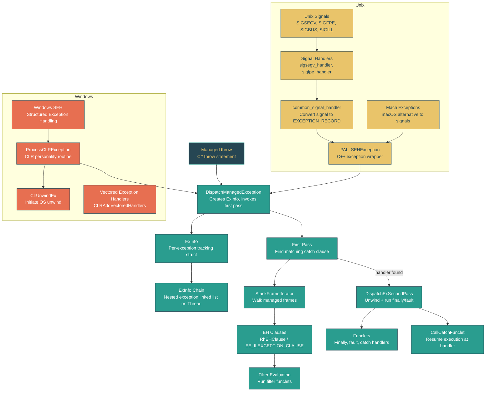

# Level 4: Internals -- Exception Handling Machinery

> **Target profile:** Runtime engineer or advanced contributor who wants to understand how the CLR dispatches, tracks, and unwinds exceptions at the native level
> **Estimated effort:** 6 hours
> **Prerequisites:** Module 1.4 (Control Flow), Module 4.1 (CLR Startup)
> [Version en espanol](../es/04-internals-exceptions.md)

---

## Learning Objectives

After completing this module, you will be able to:

1. **Describe** the two-pass exception model (find handler, then unwind) used by the CLR and explain why each pass exists.
2. **Trace** the code path from a managed `throw` through `DispatchManagedException`, `ExInfo` creation, the first-pass handler search, and the second-pass unwind via `DispatchExSecondPass`.
3. **Explain** how Windows SEH integrates with the CLR through `ProcessCLRException`, the personality routine, and `ClrUnwindEx`.
4. **Explain** how the PAL (Platform Abstraction Layer) maps Unix signals (SIGSEGV, SIGFPE, etc.) to `EXCEPTION_RECORD` structures via `common_signal_handler` and `PAL_SEHException`.
5. **Navigate** the `ExInfo` chain on a `Thread`, understanding how nested and rethrown exceptions are tracked, and what the `StackRange`, `ExceptionFlags`, and `EHClauseInfo` fields represent.
6. **Read** the stack-walking code (`StackFrameIterator`, `CrawlFrame`) used during exception dispatch and understand how EH clauses (`RhEHClause`, `EE_ILEXCEPTION_CLAUSE`) are matched.
7. **Assess** the performance cost of exception handling at the native level and explain why exceptions are considered expensive.

---

## Concept Map



---

## Lesson 1: Exception Handling Overview -- The Two-Pass Model

### Why Two Passes?

The CLR uses a **two-pass** exception dispatch model, the same fundamental model used by the Windows SEH infrastructure:

1. **First pass (search/find):** Walk the stack looking for a matching `catch` clause. Run filter funclets if present. The stack is **not** modified during this phase.
2. **Second pass (unwind):** Once a handler is found, walk the stack again from the throw point to the handler, running `finally` and `fault` blocks along the way, then transfer control to the `catch` handler.

This design exists because:

- Filters need to inspect the stack in its **original state** before any unwinding occurs. A filter that calls `Environment.StackTrace` or examines local variables must see the unmodified stack.
- The debugger needs a first-chance notification with the full stack intact.
- If no handler is found, the runtime can trigger fail-fast with the complete call chain for diagnostics.

### The Entry Point: DispatchManagedException

When managed code executes a `throw`, the JIT-compiled code eventually calls into `DispatchManagedException`. There are several overloads, but the central one is:

```cpp
// src/coreclr/vm/exceptionhandling.cpp, line ~1565
VOID DECLSPEC_NORETURN DispatchManagedException(
    OBJECTREF throwable,
    CONTEXT* pExceptionContext,
    EXCEPTION_RECORD* pExceptionRecord,
    ExKind exKind)
```

This function:

1. Creates an `ExInfo` struct on the stack, linking it into the thread's exception chain.
2. Builds an `EXCEPTION_RECORD` with code `EXCEPTION_COMPLUS` if none was supplied.
3. Invokes the managed first-pass code via `Ex.RhThrowEx(throwable, &exInfo)`.
4. On return from the first pass (handler found), calls `DispatchExSecondPass(&exInfo)`.
5. **Never returns** -- it either resumes at the catch handler or terminates the process.

### Source Exploration

Open `src/coreclr/vm/exceptionhandling.cpp` and locate `DispatchManagedException` (around line 1565). Observe:

- The `ExInfo` is constructed with the current thread, exception record, context, and exception kind.
- On Windows, special handling exists for `STATUS_LONGJUMP` to support cross-managed-frame longjmp.
- The `EXCEPTION_COMPLUS` code is the CLR's internal marker distinguishing managed exceptions from native ones.

> **Key file:** `src/coreclr/vm/exceptionhandling.h` -- declares all the entry points (`ProcessCLRException`, `DispatchManagedException`, `DispatchExSecondPass`, `CallDescrWorkerUnwindFrameChainHandler`).

### Exercises

1. Open `src/coreclr/vm/exceptionhandling.cpp` and find the `g_exceptionCount` counter (around line 128). Where is it incremented? What ETW event does the runtime fire when an exception is thrown?
2. Read the comment block starting at line 74 of `exceptionhandling.cpp` about functions and funclets. In your own words, explain why catch clauses are "pulled out of line" and what information is lost.
3. Find the `EXCEPTION_COMPLUS` constant in the codebase. How does `IsComPlusException` determine whether an `EXCEPTION_RECORD` came from managed code?

---

## Lesson 2: SEH on Windows -- Structured Exception Handling

### How Windows SEH Works (Brief Review)

Windows provides Structured Exception Handling at the OS level. The key concepts are:

- **EXCEPTION_RECORD**: A structure describing the exception (code, address, flags, parameters).
- **Personality routine**: A per-function callback registered in the unwind tables. The OS calls it during both passes to let the runtime handle exceptions for that frame.
- **Two passes**: The OS dispatcher calls personality routines with `EXCEPTION_UNWINDING` flag cleared (first pass) or set (second pass).

### ProcessCLRException: The CLR Personality Routine

Every JIT-compiled method has `ProcessCLRException` registered as its personality routine via the unwind tables generated by `codeman.cpp`:

```cpp
// src/coreclr/vm/exceptionhandling.cpp, line ~559
EXTERN_C EXCEPTION_DISPOSITION __cdecl
ProcessCLRException(
    IN     PEXCEPTION_RECORD   pExceptionRecord,
    IN     PVOID               pEstablisherFrame,
    IN OUT PCONTEXT            pContextRecord,
    IN OUT PDISPATCHER_CONTEXT pDispatcherContext)
```

During the **first pass** (searching), `ProcessCLRException`:

1. Skips breakpoints (`STATUS_BREAKPOINT`, `STATUS_SINGLE_STEP`) -- those belong to the debugger.
2. Fail-fasts on corrupted-state exceptions.
3. Calls `ClrUnwindEx` to trigger the OS second pass, or `CallRtlUnwind` on x86.

During the **second pass** (unwinding), it:

1. Retrieves the current `ExInfo` from the thread's exception state.
2. Checks for debugger interception.
3. Creates the throwable from the `EXCEPTION_RECORD` via `ExInfo::CreateThrowable`.
4. Calls `DispatchManagedException(oref, pContextRecord, pExceptionRecord)` to enter the CLR's own dispatch logic.

The critical insight is that on Windows, the OS drives the initial dispatch. The CLR **hooks into** the OS mechanism through the personality routine, then takes over.

### Vectored Exception Handlers

During initialization (`InitializeExceptionHandling`, around line 162), the CLR also installs vectored exception handlers via `CLRAddVectoredHandlers()`. These handle:

- Hardware exceptions (access violations, divide by zero) that occur in JIT-compiled code.
- Converting Windows exception codes to managed exception types.

### Source Exploration

In `src/coreclr/vm/exceptionhandling.cpp`:

- Find `ProcessCLRException` (line ~559). Notice the `#ifndef HOST_UNIX` guard -- this function only runs on Windows.
- Observe the first-pass / second-pass split: `if (!(pExceptionRecord->ExceptionFlags & EXCEPTION_UNWINDING))`.
- Find where `pDispatcherContext->LanguageHandler` is set to `ProcessCLRException` (around line 1842) -- this is how the personality routine is registered in the unwind tables for funclets.

In `src/coreclr/vm/codeman.cpp`:

- Search for `ProcessCLRException` to find where the personality routine is emitted into the code heap (around line 2599).

### Exercises

1. Trace what happens when a `DivideByZeroException` is thrown by hardware (not by a managed `throw`). Starting from the Windows exception dispatcher, how does control flow through the VEH, `ProcessCLRException`, and into `DispatchManagedException`?
2. In `ProcessCLRException`, what does the `TSNC_SkipManagedPersonalityRoutine` flag do, and why is it necessary?
3. What is `INVALID_RESUME_ADDRESS` (defined in `exceptionhandling.h` as `0x000000000000bad0`) and why does the CLR use it?

---

## Lesson 3: PAL Exception Handling on Unix -- Signal-Based Handling

### The Challenge on Unix

Unix systems have no equivalent to Windows SEH. Instead:

- **Hardware faults** (null dereference, illegal instruction, etc.) are delivered as **POSIX signals** (SIGSEGV, SIGILL, SIGFPE, SIGBUS).
- **Stack unwinding** uses `libunwind` rather than OS unwind tables (though the format is compatible).
- **macOS** has an alternative mechanism through **Mach exceptions** instead of signals for some exception types.

The **Platform Abstraction Layer (PAL)** in `src/coreclr/pal/` bridges this gap, converting signals into `EXCEPTION_RECORD` structures that the rest of the runtime can process uniformly.

### Signal Handler Registration

During PAL initialization, `SEHInitializeSignals` (in `src/coreclr/pal/src/exception/signal.cpp`, line ~166) registers handlers for:

| Signal | Handler | Mapped Exception |
|--------|---------|-----------------|
| SIGSEGV | `sigsegv_handler` | `NullReferenceException` or `StackOverflowException` |
| SIGFPE | `sigfpe_handler` | `DivideByZeroException` or `ArithmeticException` |
| SIGBUS | `sigbus_handler` | `AccessViolationException` |
| SIGILL | `sigill_handler` | `ExecutionEngineException` |
| SIGTRAP | `sigtrap_handler` | Debugger breakpoint |
| SIGABRT | `sigabrt_handler` | Process abort |

Key details:

- SIGSEGV runs on an **alternate stack** (`SA_ONSTACK`) so that stack overflow can be handled even when the main stack is exhausted.
- A dedicated stack-overflow handler stack is allocated (`g_stackOverflowHandlerStack`) sized to handle the minimal recovery path.
- On macOS, `HAVE_MACH_EXCEPTIONS` is defined and Mach exception ports are used instead of signals for some faults.

### common_signal_handler: The Conversion Point

All individual signal handlers funnel into `common_signal_handler` (line ~1104):

```cpp
static bool common_signal_handler(
    int code, siginfo_t *siginfo, void *sigcontext,
    int numParams, ...)
```

This function:

1. Converts the `siginfo_t` and native `ucontext` into a Windows-compatible `EXCEPTION_RECORD` and `CONTEXT`.
2. Uses `CONTEXTGetExceptionCodeForSignal` to map the signal code to a Windows exception code.
3. Constructs a `PAL_SEHException` (a C++ exception wrapping the EXCEPTION_RECORD and CONTEXT).
4. Calls into the registered hardware exception handler (`g_hardwareExceptionHandler`), which is `HandleHardwareException` in the VM.

### PAL_SEHException and the C++ Exception Bridge

On Unix, the PAL uses **C++ exceptions** (`throw`/`catch`) as the unwinding mechanism between native frames. The `PAL_SEHException` class wraps an `EXCEPTION_RECORD` and `CONTEXT`:

```
Signal fires --> signal handler --> common_signal_handler
    --> PAL_SEHException constructed
    --> C++ throw propagates through native frames
    --> Caught at managed/native boundary
    --> DispatchManagedException(PAL_SEHException&, isHardwareException)
```

The `DispatchManagedException(PAL_SEHException&, bool)` overload (line ~956) captures the context and converts the PAL exception into a managed throwable before entering the standard dispatch path.

### Mach Exceptions on macOS

On macOS, some hardware exceptions are delivered via Mach exception ports rather than signals. The file `src/coreclr/pal/src/exception/machexception.cpp` implements:

- A dedicated exception port (`s_ExceptionPort`) that receives exception messages from the kernel.
- A message loop that converts Mach exception messages into the same `PAL_SEHException` format.
- Forwarding logic for exceptions that don't belong to the CLR.

### Source Exploration

- Open `src/coreclr/pal/src/exception/signal.cpp` and find `SEHInitializeSignals` (line ~166). Trace the calls to `handle_signal` for each signal type.
- Find `sigsegv_handler` (line ~674) and observe the stack-overflow detection logic -- how does the handler determine whether the SIGSEGV is a stack overflow vs. a null dereference?
- In `common_signal_handler` (line ~1104), observe how the native `ucontext` is converted to a `CONTEXT` via `CONTEXTFromNativeContext`.
- Look at `src/coreclr/pal/src/exception/seh.cpp` and find `SEHInitialize` -- note that it simply delegates to `SEHInitializeSignals`.

### Exercises

1. In `signal.cpp`, the SIGSEGV handler uses `SA_ONSTACK`. Why is this flag critical for stack-overflow handling? What would happen without it?
2. Find the `StackOverflowFlag` constant (line ~132). How is it combined with SIGSEGV to indicate a stack overflow vs. a null reference?
3. What signals does the PAL explicitly **not** handle (see the comments about SIGKILL, SIGSTOP)? Why?
4. On macOS, explain why Mach exceptions are preferred over signals for some exception types.

---

## Lesson 4: The ExInfo Chain -- Tracking In-Flight Exceptions

### The ExInfo Structure

Every in-flight exception is tracked by an `ExInfo` struct (defined in `src/coreclr/vm/exinfo.h`). This is the runtime's central bookkeeping structure during exception dispatch:

```cpp
struct ExInfo
{
    PTR_ExInfo     m_pPrevNestedInfo;    // Previous ExInfo in chain
    OBJECTHANDLE   m_hThrowable;         // Handle to thrown exception object
    DAC_EXCEPTION_POINTERS m_ptrs;       // EXCEPTION_RECORD + CONTEXT
    EHClauseInfo   m_EHClauseInfo;       // Current funclet info
    ExceptionFlags m_ExceptionFlags;     // State flags
    DWORD          m_ExceptionCode;      // Exception code
    StackRange     m_ScannedStackRange;  // Low/high bounds of unwound stack
    CONTEXT*       m_pExContext;         // Context for stack frame iterator
    OBJECTREF      m_exception;          // Actual exception object reference
    ExKind         m_kind;               // Software, hardware, rethrown
    uint8_t        m_passNumber;         // 1 or 2
    uint32_t       m_idxCurClause;       // Index of current EH clause
    StackFrameIterator m_frameIter;      // Stack walker state
    Frame*         m_pFrame;             // Initial explicit frame
    PCODE          m_pCatchHandler;      // Address of catch handler
    TADDR          m_handlingFrameSP;    // SP of frame handling exception
    EE_ILEXCEPTION_CLAUSE m_ClauseForCatch; // The catch clause found in pass 1
    // ... additional fields for debugger, Watson, ARM64, etc.
};
```

### The Chain: Nested Exceptions

The `m_pPrevNestedInfo` field links `ExInfo` structures into a **singly-linked list** per thread, ordered from most-recent to oldest. This chain handles:

- **Nested exceptions:** An exception thrown inside a `finally` or `fault` block creates a new `ExInfo` linked to the outer one.
- **Rethrown exceptions:** A `throw;` (without operand) creates a new `ExInfo` but shares state with the original.

The chain is managed through:

- **`ExInfo` constructor:** Links the new ExInfo to the thread's current tracker.
- **`ExInfo::PopExInfos(Thread*, void* targetSp)`:** Removes ExInfo entries whose SP is below the target during unwind.

### StackRange: Tracking Progress

The `StackRange` class within `ExInfo` tracks which stack frames have been processed:

- `m_sfLowBound` / `m_sfHighBound`: The range of stack pointers scanned during exception dispatch.
- `IsSupersededBy(StackFrame sf)`: Returns true if a new exception's frame is within or above the existing range (nested exception supersedes the outer one).
- `CombineWith(...)`: Merges the scanned range of a nested tracker with its parent when the nested exception escapes.

### Exception Kinds (ExKind)

The `ExKind` enum (in `src/coreclr/vm/exkind.h`) classifies the exception:

- `Throw`: Normal managed throw.
- `HardwareFault` / `InstructionFaultFlag`: Hardware-generated (null dereference, divide by zero).
- `Rethrow`: A `throw;` statement.

This classification affects how the runtime records the stack trace (rethrows preserve the original trace) and how hardware exceptions are handled (the faulting instruction context differs from a software throw).

### Platform Differences in ExInfo

Note the conditional compilation in `ExInfo`:

```cpp
#ifdef TARGET_UNIX
    BYTE m_padding[2 * sizeof(void*) + sizeof(DWORD)];
#else
    EHWatsonBucketTracker m_WatsonBucketTracker;
```

On Windows, `ExInfo` includes Watson (error reporting) data for crash bucketing. On Unix, this is replaced with padding to keep field offsets consistent -- the managed EH code accesses these structs by offset, so layout must match across platforms.

### Source Exploration

- Open `src/coreclr/vm/exinfo.h` and read the `ExInfo` structure (line ~42). Note the `StackRange` inner class and the chain pointer `m_pPrevNestedInfo`.
- Find `PopExInfos` in `exceptionhandling.cpp` -- how does it decide which ExInfo entries to remove?
- Search for `ExKind` in `src/coreclr/vm/exkind.h` to see all the exception kind flags.

### Exercises

1. Draw the `ExInfo` chain for the following scenario: Method A throws exception E1, method B's `finally` block throws E2, and E2 is caught in method C. How many ExInfo nodes exist at each point?
2. Why must the `ExInfo` field layout be padded identically on Windows and Unix? What would break if the offsets differed?
3. Find the `m_passNumber` field. When does it transition from 1 to 2? What code performs this transition?

---

## Lesson 5: Stack Walking for Exception Dispatch

### The Stack Frame Iterator

Exception dispatch requires walking the call stack twice (first pass and second pass). The CLR uses `StackFrameIterator` (embedded in each `ExInfo`) to enumerate managed frames:

- **`SfiInitWorker`**: Initializes the iterator from the exception context.
- **`SfiNextWorker`**: Advances to the next managed frame, crossing native-to-managed boundaries as needed.

Each frame is represented by a `CrawlFrame` (defined in `src/coreclr/vm/stackwalk.h`), which abstracts:

- **Frameless (JIT-compiled) methods:** Unwound using metadata from the JIT's unwind tables.
- **Framed methods:** Explicit `Frame` objects pushed on the stack by the runtime (P/Invoke stubs, GC transitions, etc.).

### EH Clause Matching

For each managed frame, the runtime enumerates the method's EH clauses to find a matching handler. The clause structures are:

**`RhEHClause`** (in `exinfo.h`):
```cpp
struct RhEHClause
{
    RhEHClauseKind _clauseKind;   // Typed, Fault, Filter, Unused
    unsigned _tryStartOffset;      // IL offset where try begins
    unsigned _tryEndOffset;        // IL offset where try ends
    BYTE *_filterAddress;          // Filter funclet address (if filter)
    BYTE *_handlerAddress;         // Handler funclet address
    void *_pTargetType;            // Exception type to match (if typed)
    BOOL _isSameTry;               // Multiple handlers for same try
};
```

**`EE_ILEXCEPTION_CLAUSE`** (used by the JIT manager):
- Mirrors the IL exception handling table from the method's metadata.
- Enumerated via `InitializeEHEnumeration` / `GetNextEHClause` on the `IJitManager`.

### The Matching Algorithm (First Pass)

For each frame during the first pass:

1. Get the control PC (the instruction pointer at the point of the exception or the call site).
2. Enumerate all EH clauses for the method, ordered from **inside-out** (most nested first).
3. For each clause, check if the control PC falls within the `[tryStartOffset, tryEndOffset)` range.
4. If it's a **typed catch**: Check if the thrown exception's type is assignable to the clause's target type.
5. If it's a **filter**: Invoke the filter funclet. If it returns `EXCEPTION_EXECUTE_HANDLER`, we have a match.
6. **Fault/finally** clauses are skipped during the first pass (they execute during the second pass).

When a match is found, the `ExInfo` records:

- `m_pCatchHandler`: Address of the catch funclet.
- `m_handlingFrameSP`: Stack pointer of the frame containing the handler.
- `m_ClauseForCatch`: The matching clause.
- `m_idxCurClause`: Index of the clause.

### The Unwind (Second Pass): DispatchExSecondPass

`DispatchExSecondPass` (line ~4286) performs the second pass:

```cpp
void DECLSPEC_NORETURN DispatchExSecondPass(ExInfo *pExInfo)
{
    // Re-initialize iterator from the exception context
    // Walk frames from throw point to handler frame
    for (; isValid && (SP <= handlingFrameSP); ...)
    {
        // Run finally/fault funclets for each frame
        InvokeSecondPass(pExInfo, startIdx);
    }
    // Transfer to the catch handler
    CallCatchFunclet(pExInfo->m_exception, pCatchHandler, ...);
    UNREACHABLE();
}
```

Key observations:

- The second pass re-walks the stack from the throw point, not from the current frame.
- `InvokeSecondPass` invokes `finally` and `fault` funclets for each frame between the throw and the handler.
- `CallCatchFunclet` transfers control to the catch handler and **never returns** to this function.
- Explicit frames (P/Invoke stubs, etc.) are popped via `PopExplicitFrames` during the unwind.

### Funclets: The Code Behind EH Clauses

JIT-compiled `catch`, `finally`, `fault`, and `filter` blocks are emitted as **funclets** -- separate pieces of code physically located after the main method body but logically part of it. The comment at line 74 of `exceptionhandling.cpp` explains:

> "All funclets are ripped out of line from the main function. Finally clauses are pulled out of line and replaced by calls to the funclets. Catch clauses, however, are simply pulled out of line."

This means:

- The JIT must duplicate EH clause entries to cover funclets that are logically protected by outer try blocks.
- Clause ordering (inside-out) is critical -- the personality routine relies on this.
- Funclets share the same stack frame as their parent method, but the runtime must carefully manage register state.

### Source Exploration

- In `exceptionhandling.cpp`, find `DispatchExSecondPass` (line ~4286). Trace how `SfiInitWorker` and `SfiNextWorker` drive the second-pass walk.
- In `src/coreclr/vm/stackwalk.h`, read the `CrawlFrame` class (line ~45) and its description of the "poor man's virtual methods" pattern.
- In `src/coreclr/vm/codeman.cpp`, search for `InitializeEHEnumeration` to see how EH clause tables are read from the JIT's metadata.

### Exercises

1. Why does the second pass need to re-walk the stack from the throw point rather than continuing from where the first pass stopped?
2. In the funclet model, why must EH clauses be duplicated for funclets nested within try blocks? Draw an example with nested try/catch/finally to illustrate.
3. What happens if a `finally` block throws an exception during the second pass? Trace the code path -- how does the ExInfo chain handle this nested exception?
4. Find where `CallCatchFunclet` is called. Why does the comment say `UNREACHABLE()` after it?

---

## Lesson 6: Performance Impact -- Why Exceptions Are Expensive

### The Zero-Cost Happy Path

Modern CLR exception handling is designed for **zero cost on the non-exception path**:

- No runtime overhead when `try` blocks are entered -- no registration, no stack manipulation.
- EH metadata (clause tables, unwind information) is stored in static read-only data.
- Guard pages (for stack overflow detection) are set up once per thread.

The cost is entirely in the **exception path**.

### What Makes the Exception Path Expensive

When an exception is thrown, the runtime must:

1. **Capture context** (`RtlCaptureContext` or equivalent): Save all CPU registers. This is a full context capture including floating-point and SIMD registers.

2. **Allocate and initialize ExInfo**: Construct the tracking structure, link it into the chain, create an object handle for the throwable.

3. **First-pass stack walk**: Walk every frame between the throw point and the handler:
   - For each managed frame: look up the `EECodeInfo`, enumerate EH clauses, perform type checks.
   - For filters: invoke a funclet call (including GC transition overhead).
   - Increment `g_exceptionCount` and fire ETW events.

4. **Second-pass stack walk**: Walk the stack again:
   - For each frame: run `finally` and `fault` funclets.
   - Pop explicit frames, update GC roots.
   - On Windows: interact with the OS unwind mechanism (`RtlUnwindEx`).
   - On Unix: propagate through native frames using C++ exceptions.

5. **Stack trace capture**: Building the managed stack trace string involves another stack walk, string allocations, and symbol resolution.

6. **Cross-domain costs**: On Windows, Watson bucket computation. Debugger first-chance notifications. Profiler callbacks.

### The Hot Path Impact

Even though exceptions don't cost anything when not thrown, their presence affects the JIT:

- **Methods with try/catch cannot be inlined** in some cases (the JIT avoids inlining methods with exception handling in certain configurations).
- **Register allocation**: The JIT must ensure that variables live across `try` boundaries are spilled to the stack or stored in callee-saved registers, because funclets may need access to them.
- **Code layout**: Funclets are emitted out-of-line, which can affect instruction cache locality.

### Windows vs. Unix Performance Characteristics

| Aspect | Windows | Unix |
|--------|---------|------|
| First-pass mechanism | OS-driven SEH dispatch | CLR-driven stack walk |
| Native frame crossing | OS handles natively | C++ exception propagation |
| Stack overflow detection | Guard page + VEH | SIGSEGV + alternate stack |
| Unwind tables | PE `.pdata` / `.xdata` sections | DWARF `.eh_frame` sections |
| Error reporting | Watson integration | None (pad for layout compat) |

On Unix, crossing native frames during exception propagation requires constructing and throwing a C++ exception (`PAL_SEHException`), which adds the cost of C++ exception handling (DWARF unwinding, destructor calls) on top of the CLR's own processing.

### Measuring Exception Cost

The runtime tracks exceptions via:

- `g_exceptionCount` (in `exceptionhandling.cpp`, line ~128): Atomic counter incremented for every exception.
- **ETW events**: `ExceptionThrown_V1` fired by `ETW::ExceptionLog::ExceptionThrown` with exception type, message, and stack.
- **Performance counters**: Available through `dotnet-counters` (`System.Runtime` provider, `exception-count`).

### Exercises

1. Using the `g_exceptionCount` counter as a starting point, find where `UpdatePerformanceMetrics` is called. What information does the ETW event carry?
2. A developer argues "exceptions are zero-cost in .NET." Write a precise rebuttal explaining what is and isn't zero-cost.
3. Compare the unwind cost on Windows (where the OS does the heavy lifting via `RtlUnwindEx`) vs. Unix (where the CLR must use C++ exceptions to cross native frames). Which has more overhead for a mixed managed/native call stack?
4. A performance-critical method uses exceptions for control flow (e.g., catching `FormatException` in a parse loop). Estimate the overhead categories from the list above and suggest an alternative pattern.

---

## Key Source Files Reference

| File | Purpose |
|------|---------|
| `src/coreclr/vm/exceptionhandling.cpp` | Core exception dispatch: `ProcessCLRException`, `DispatchManagedException`, `DispatchExSecondPass` |
| `src/coreclr/vm/exceptionhandling.h` | Declarations for exception dispatch functions, `CLRUnwindStatus`, `EHFuncletType` |
| `src/coreclr/vm/excep.h` | `ThrowCallbackType`, `LFH` enum, `NULL_AREA_SIZE`, utility declarations |
| `src/coreclr/vm/excep.cpp` | `IsExceptionFromManagedCode`, helpers for determining exception origin |
| `src/coreclr/vm/exinfo.h` | `ExInfo` struct, `RhEHClause`, `RhEHClauseKind`, `StackRange` |
| `src/coreclr/vm/exkind.h` | `ExKind` enum (Throw, HardwareFault, Rethrow, etc.) |
| `src/coreclr/vm/stackwalk.h` | `CrawlFrame`, stack walking infrastructure |
| `src/coreclr/vm/codeman.cpp` | EH clause enumeration, personality routine registration |
| `src/coreclr/pal/src/exception/signal.cpp` | Unix signal handlers, `common_signal_handler` |
| `src/coreclr/pal/src/exception/seh.cpp` | PAL SEH initialization, `PAL_SetHardwareExceptionHandler` |
| `src/coreclr/pal/src/exception/seh-unwind.cpp` | libunwind-based stack unwinding for Unix |
| `src/coreclr/pal/src/exception/machexception.cpp` | macOS Mach exception handling |

---

## Self-Assessment Checklist

- [ ] I can diagram the two-pass exception model and explain why both passes are necessary.
- [ ] I can trace a managed `throw` from the C# statement through `DispatchManagedException` to `CallCatchFunclet`.
- [ ] I understand how `ProcessCLRException` integrates with Windows SEH as the CLR's personality routine.
- [ ] I can explain how Unix signals are converted to `EXCEPTION_RECORD` structures through the PAL.
- [ ] I can describe the ExInfo chain and how nested exceptions are tracked.
- [ ] I understand how the StackFrameIterator and EH clause tables work together to find catch handlers.
- [ ] I can articulate why exceptions are expensive and list the specific cost categories.
- [ ] I can compare the Windows and Unix exception handling paths and identify their key differences.

---

## Further Reading

- [ECMA-335 Partition I, Section 12.4.2](https://www.ecma-international.org/publications-and-standards/standards/ecma-335/) -- CLI Exception Handling
- [Windows SEH documentation](https://learn.microsoft.com/en-us/windows/win32/debug/structured-exception-handling)
- `docs/design/coreclr/botr/` in the repository -- Book of the Runtime chapters on exception handling
- [.NET Exception Performance](https://learn.microsoft.com/en-us/dotnet/standard/exceptions/best-practices) -- Best practices for exception usage
