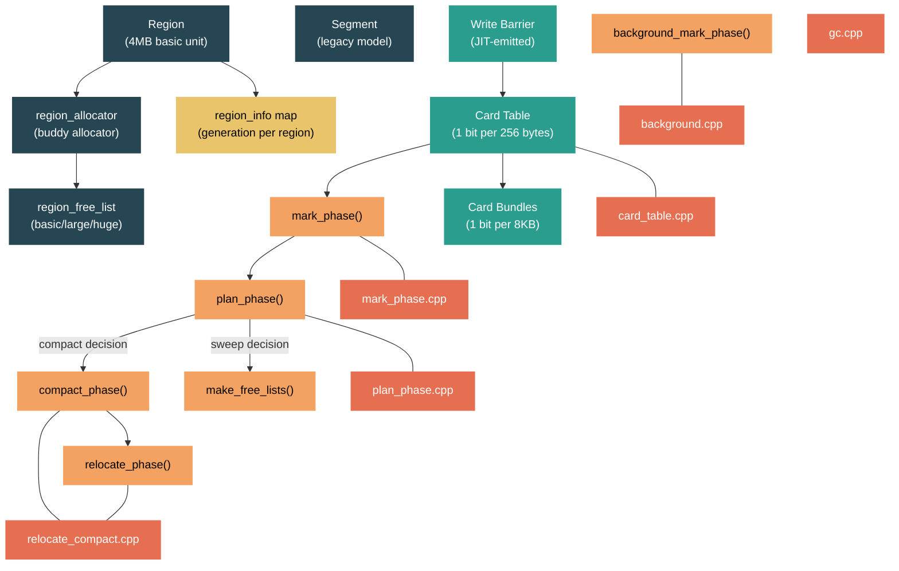

# Level 4: Internals -- GC Internals: Regions, Mark Phase, and Write Barriers

> **Target profile:** Runtime developer or contributor who needs to navigate the GC source code, understand its internal data structures, and reason about collector behavior at the C++ level
> **Estimated effort:** 12 hours
> **Prerequisites:** [Module 3.2 -- GC at Level 3](03-advanced-gc.md), [Module 4.2 -- Type System](04-internals-type-system.md)
> **Source difficulty:** ⭐⭐⭐⭐⭐ -- `gc.cpp` and its companion files total over 40,000 lines of heavily macro-guarded C++. This module gives you a map, not exhaustive coverage.
> [Version en espanol](../es/04-internals-gc-deep.md)

---

## Learning Objectives

By the end of this module you will be able to:

1. Describe the region-based heap model (`USE_REGIONS`), how regions are allocated, how they map dynamically to generations, and how this differs from the legacy segment model.
2. Trace the mark phase through `gc_heap::mark_phase()`, understanding root scanning, the mark stack, mark lists, and how cross-generation references are discovered.
3. Explain the role of write barriers and card tables in tracking stores to older generations, including the bitwise region write barrier introduced for the region model.
4. Walk through the plan phase to understand plug trees, gap calculation, and the compaction-vs-sweep decision.
5. Describe how compaction moves objects and updates references, and how pinned objects constrain compaction.
6. Outline the Background GC (BGC) lifecycle: concurrent marking, foreground ephemeral collections during BGC, and concurrent sweeping.

---

## Concept Map



---

## A Note on Navigating the GC Source

Before diving into lessons, you need to understand the physical layout. The GC source has been split from a single monolithic `gc.cpp` (which was once ~37,000 lines) into multiple files:

| File | Purpose |
|------|---------|
| `src/coreclr/gc/gc.cpp` | Core data structures, initialization, helper functions. Still ~8,800 lines. Includes the other `.cpp` files. |
| `src/coreclr/gc/mark_phase.cpp` | `mark_phase()`, `mark_through_cards_for_segments()`, mark stack operations |
| `src/coreclr/gc/plan_phase.cpp` | `plan_phase()`, plug tree construction, sweep-vs-compact decisions |
| `src/coreclr/gc/relocate_compact.cpp` | `relocate_phase()`, `compact_phase()`, object movement |
| `src/coreclr/gc/background.cpp` | `background_mark_phase()`, `background_sweep()`, BGC lifecycle |
| `src/coreclr/gc/collect.cpp` | `gc1()`, `garbage_collect()` -- the top-level collection orchestrator |
| `src/coreclr/gc/card_table.cpp` | Card table and card bundle operations |
| `src/coreclr/gc/regions_segments.cpp` | Segment mapping table, region-to-generation mapping |
| `src/coreclr/gc/region_allocator.cpp` | `region_allocator` -- the buddy allocator for region memory |
| `src/coreclr/gc/region_free_list.cpp` | Free region management (basic/large/huge lists) |
| `src/coreclr/gc/sweep.cpp` | `make_free_lists()`, sweep operations |
| `src/coreclr/gc/allocation.cpp` | Object allocation paths, segment/region acquisition |
| `src/coreclr/gc/gcpriv.h` | All internal structures: `gc_heap`, `heap_segment`, `dynamic_data`, `region_info` |
| `src/coreclr/gc/gcconfig.h` | All configuration knobs (`GC_CONFIGURATION_KEYS` macro) |
| `src/coreclr/gc/gcinterface.h` | `IGCHeap` interface, `WriteBarrierParameters`, version numbers |

The code is pervasively guarded by `#ifdef` macros. The most important ones:

| Macro | Meaning |
|-------|---------|
| `USE_REGIONS` | Region-based heap (default since .NET 8). Without it, you get legacy segments. |
| `MULTIPLE_HEAPS` | Server GC with per-CPU heaps |
| `BACKGROUND_GC` | Background (concurrent) GC support |
| `FEATURE_CARD_MARKING_STEALING` | Work-stealing for card table scanning in Server GC |

When reading the source, you will frequently see paired `#ifdef USE_REGIONS` / `#else` blocks. The region path is the modern one; the else path is legacy. Focus on the `USE_REGIONS` path.

---

## Curriculum

### Lesson 1 -- Regions vs Segments: The New Region-Based GC

#### What you'll learn

.NET 8 switched the default GC heap model from **segments** to **regions**. This is one of the most significant GC architectural changes in the runtime's history. Understanding regions is the key to understanding everything else in this module.

#### The legacy segment model (pre-.NET 8)

In the old model, each generation owned one or more large **segments** -- contiguous virtual memory blocks, typically 256MB on 64-bit systems. Segments were linked in a list, and each segment belonged to exactly one generation. Promotion meant moving objects from one segment (or range within a segment) to another.

The problem: segments were large and inflexible. A Gen0 segment that happened to contain a few long-lived pinned objects could not be reclaimed. Memory was committed in large chunks and returned slowly to the OS.

#### The region model

Under `USE_REGIONS`, the heap is divided into small, fixed-size **regions**. The default basic region size is 4MB (configurable via `GCRegionSize`). The key insight: **a region's generation is not fixed**. A region that starts as Gen0 can be promoted to Gen1 or Gen2 without moving any objects -- the GC simply updates a mapping table.

The `region_allocator` in `src/coreclr/gc/region_allocator.cpp` manages the global address space. It works like a buddy allocator with a bitmap:

```cpp
// region_allocator.cpp
bool region_allocator::init (uint8_t* start, uint8_t* end, size_t alignment,
                             uint8_t** lowest, uint8_t** highest)
{
    region_alignment = alignment;
    large_region_alignment = LARGE_REGION_FACTOR * alignment;  // 8x basic = 32MB
    global_region_start = (uint8_t*)align_region_up ((size_t)actual_start);
    // ...
    size_t total_num_units = (global_region_end - global_region_start) / region_alignment;
    total_free_units = (uint32_t)total_num_units;
    uint32_t* unit_map = new (nothrow) uint32_t[total_num_units];
    // ...
}
```

The allocator maintains a `unit_map` where each entry represents one basic region. Busy blocks and free blocks are tracked by writing their size into the start and end entries of each block (a boundary-tag scheme). The `LARGE_REGION_FACTOR` is 8, meaning large regions (for LOH) are 8x the basic size (32MB by default).

#### Three kinds of free regions

Regions come in three sizes, managed by separate free lists in `region_free_list`:

```cpp
// gcpriv.h
enum free_region_kind
{
    basic_free_region,    // 4MB (SOH)
    large_free_region,    // 32MB (LOH)
    huge_free_region,     // >32MB (very large allocations)
    count_free_region_kinds = 3,
};
```

Each `gc_heap` maintains its own `free_regions[count_free_region_kinds]` array. Regions that are no longer needed go onto these free lists instead of being immediately decommitted. They age in the free list (tracked by `age_in_free` on the `heap_segment` structure) and are eventually decommitted if not reused:

```cpp
// gcpriv.h, inside class heap_segment
#define AGE_IN_FREE_TO_DECOMMIT_BASIC 20  // 20 GCs before decommitting a basic region
#define AGE_IN_FREE_TO_DECOMMIT_LARGE 5
#define AGE_IN_FREE_TO_DECOMMIT_HUGE  2
```

#### The region-to-generation mapping

Each region knows its current generation (`gen_num`) and its planned generation after GC (`plan_gen_num`). This information is encoded in the `region_info` enum using bit packing:

```cpp
// gcpriv.h
enum region_info : uint8_t
{
    // lowest 2 bits: current generation number
    RI_GEN_0 = 0x0,
    RI_GEN_1 = 0x1,
    RI_GEN_2 = 0x2,
    RI_GEN_MASK = 0x3,

    // flags in the middle bits
    RI_SIP = 0x4,         // Sweep In Plan
    RI_DEMOTED = 0x8,     // Region was demoted to a younger generation

    // top 2 bits: planned generation number
    RI_PLAN_GEN_SHR = 0x6,
    RI_PLAN_GEN_0 = 0x00,
    RI_PLAN_GEN_1 = 0x40,
    RI_PLAN_GEN_2 = 0x80,
    RI_PLAN_GEN_MASK = 0xC0,
};
```

The GC maintains a flat array `map_region_to_generation_skewed` indexed by `address >> min_segment_size_shr`. This allows the write barrier to determine any pointer's generation with a single shift and table lookup -- no pointer chasing.

#### Demotion: regions going backwards

With segments, objects could only be promoted (young to old). With regions, **demotion** is possible: a Gen2 region with mostly dead objects can be reclassified as Gen1 or even Gen0. The `RI_DEMOTED` flag tracks this. This is a major advantage: the GC can reclaim Gen2 regions without doing a full Gen2 collection.

#### The heap_segment structure (reused for regions)

Despite the name, the `heap_segment` class in `gcpriv.h` (line ~6202) is reused for regions:

```cpp
class heap_segment
{
public:
    uint8_t*    allocated;       // end of allocated objects
    uint8_t*    committed;       // end of committed memory
    uint8_t*    reserved;        // end of reserved memory
    uint8_t*    used;            // high watermark
    uint8_t*    mem;             // start of usable memory
    size_t      flags;           // 12 bits of flags
    PTR_heap_segment next;       // linked list
    uint8_t*    background_allocated;  // for BGC

#ifdef USE_REGIONS
    size_t      survived;
    uint8_t     gen_num;
    bool        swept_in_plan_p;
    int         plan_gen_num;
    int         age_in_free;      // how long in free list
    uint8_t*    free_list_head;   // per-region free list
    // ...
#endif
};
```

#### Source exploration exercise

1. Open `src/coreclr/gc/region_allocator.cpp` and read the `init()` function. Follow how `make_busy_block()` and `make_free_block()` work -- this is a boundary-tag allocator.
2. In `gcpriv.h`, find the `region_info` enum and the `free_region_kind` enum. Note how `region_free_list` manages the three kinds.
3. In `gcconfig.h`, find `GCRegionSize` and `GCRegionRange`. These are the user-facing knobs for region configuration.
4. Search for `get_region_gen_num` in `gc.cpp` to see how the runtime looks up a region's generation from an arbitrary address.

---

### Lesson 2 -- The Mark Phase: Object Graph Traversal

#### What you'll learn

The mark phase is where the GC discovers which objects are alive. It is the most performance-critical phase -- every reachable object must be visited, and the traversal must be correct even while dealing with pinned objects, interior pointers, and (in BGC) concurrent mutations.

#### Entry point

The mark phase begins in `gc_heap::mark_phase()` at line 2892 of `mark_phase.cpp`:

```cpp
void gc_heap::mark_phase (int condemned_gen_number)
{
    assert (settings.concurrent == FALSE);  // non-concurrent mark only

    ScanContext sc;
    sc.thread_number = heap_number;
    sc.promotion = TRUE;
    sc.concurrent = FALSE;

    BOOL full_p = (condemned_gen_number == max_generation);
    // ...
}
```

The function receives the condemned generation number. For a Gen0 collection, `condemned_gen_number` is 0; for a full GC, it is `max_generation` (2).

#### Phase 1: Initialize generation data

The mark phase starts by clearing per-generation statistics:

```cpp
for (int gen_idx = 0; gen_idx <= gen_to_init; gen_idx++)
{
    dynamic_data* dd = dynamic_data_of (gen_idx);
    dd_begin_data_size (dd) = generation_size (gen_idx) -
                               dd_fragmentation (dd) -
#ifdef USE_REGIONS
                               0;  // no start object adjustment needed for regions
#else
                               get_generation_start_size (gen_idx);
#endif
    dd_survived_size (dd) = 0;
    dd_pinned_survived_size (dd) = 0;
    // ...
}
```

Notice the `USE_REGIONS` difference: with regions, there is no per-generation "start object" to subtract.

#### Phase 2: Scan roots

After initialization, the mark phase scans each category of roots, draining the mark queue after each:

```cpp
// 1. Sized refs (if full GC)
GCScan::GcScanSizedRefs(GCHeap::Promote, condemned_gen_number, max_generation, &sc);
drain_mark_queue();

// 2. Stack roots
GCScan::GcScanRoots(GCHeap::Promote, condemned_gen_number, max_generation, &sc);
drain_mark_queue();

// 3. Background GC roots (if BGC is running concurrently)
scan_background_roots (GCHeap::Promote, heap_number, &sc);
drain_mark_queue();

// 4. Finalization queue
finalize_queue->GcScanRoots(GCHeap::Promote, heap_number, 0);
drain_mark_queue();
```

The `GCHeap::Promote` callback is the heart of marking. For each root reference, it checks whether the object is in the condemned generation range and, if so, marks it (sets a bit in the mark array for BGC, or sets the mark bit in the object header for foreground GC).

#### Phase 3: Cross-generation references via card tables

For non-full GCs, the mark phase must also find references from older generations pointing into the condemned generations. This is where card tables come in (covered in detail in Lesson 3):

```cpp
// mark_phase.cpp, line ~3240
mark_through_cards_for_segments(mark_object_fn, FALSE THIS_ARG);

// For each UOH generation:
mark_through_cards_for_uoh_objects(mark_object_fn, i, FALSE THIS_ARG);
```

The function `mark_through_cards_for_segments()` at line 3815 walks the card table to find dirty cards, then scans the objects in those card ranges for references into the condemned generation.

#### The mark stack and mark queue

When the GC encounters a marked object, it needs to recursively scan that object's references. To avoid deep recursion (which could overflow the stack with deeply nested object graphs), the GC uses an explicit **mark stack** and a **mark queue**:

```cpp
void gc_heap::reset_mark_stack()
{
    // mark_stack_array is used as both the pinned plug queue
    // and the mark stack during mark phase
}
```

The `drain_mark_queue()` function processes objects on the mark queue, following their references and marking transitively reachable objects.

#### The mark list optimization

For ephemeral (Gen0/Gen1) collections, the GC can use a **mark list** -- a sorted array of pointers to marked objects. This avoids having to walk the entire heap to find marked objects during the plan phase:

```cpp
// Checked during plan_phase:
if ((condemned_gen_number < max_generation) &&
    (mark_list_index <= mark_list_end))
{
    // Sort the mark list for efficient plan-phase processing
    _sort (&mark_list[0], mark_list_index - 1, 0);
    use_mark_list = TRUE;
}
```

If the mark list overflows (too many objects marked), the optimization is disabled and the plan phase falls back to walking objects directly.

#### Pinned objects during marking

Pinned objects are recorded on the **pinned plug queue** (`mark_stack_array` repurposed). A "plug" is a contiguous run of objects. A pinned plug is a plug that contains at least one pinned object and therefore cannot be moved during compaction:

```cpp
void gc_heap::set_pinned_info (uint8_t* last_pinned_plug, size_t plug_len, generation* gen)
{
    mark& m = mark_stack_array[mark_stack_tos];
    assert (m.first == last_pinned_plug);
    m.len = plug_len;
    // ...
    mark_stack_tos++;
}
```

#### Source exploration exercise

1. Open `mark_phase.cpp` and read from line 2892 (`mark_phase` entry) through line ~3180 where root scanning happens. Note the ordering: sized refs, stack roots, background roots, finalization queue.
2. Search for `drain_mark_queue` -- this is called after each root category. Understanding the mark queue is key to understanding how the GC avoids recursion.
3. Find `mark_through_cards_for_segments` at line 3815 and read the first 50 lines. This is the card-table-driven cross-generation scan.
4. Look at `mark_stack_array` declarations in `gcpriv.h` to understand how the same array serves as both the mark stack and pinned plug queue.

---

### Lesson 3 -- Write Barriers and Card Tables

#### What you'll learn

The generational GC can only work efficiently because it has a mechanism to track **cross-generation stores** -- when a pointer in an older generation is updated to point to an object in a younger generation. Without this tracking, every GC would need to scan the entire heap. Write barriers and card tables are the mechanism.

#### What is a write barrier?

Every time managed code writes a reference into a heap object, the JIT (or interpreter) emits a **write barrier** -- a small code sequence that notifies the GC of the store. On x64, this is a hand-written assembly routine. The `WriteBarrierManager` in `src/coreclr/vm/writebarriermanager.h` selects the appropriate barrier at runtime:

```cpp
// writebarriermanager.h
enum WriteBarrierType
{
    WRITE_BARRIER_UNINITIALIZED,
    WRITE_BARRIER_PREGROW64,        // heap below ephemeral
    WRITE_BARRIER_POSTGROW64,       // heap above ephemeral
    WRITE_BARRIER_SVR64,            // server GC
    WRITE_BARRIER_BYTE_REGIONS64,   // region bytewise barrier
    WRITE_BARRIER_BIT_REGIONS64,    // region bitwise barrier (default)
    // ... write-watch variants ...
    WRITE_BARRIER_BUFFER
};
```

#### Card tables: the core data structure

A **card table** is a byte array where each entry covers a fixed range of heap addresses. Historically, one card covered 256 bytes of heap. When the write barrier detects a cross-generation store, it "dirties" the corresponding card by setting a bit.

The card table layout is defined alongside other bookkeeping in `gc.cpp`:

```cpp
// gc.cpp
uint32_t*   gc_heap::card_table;
size_t      gc_heap::card_table_element_layout[total_bookkeeping_elements + 1];
```

The `card_table_info` class wraps the card table with metadata:

```cpp
// gc.cpp
class card_table_info
{
    unsigned    recount;
    uint8_t*    lowest_address;
    size_t      size;
    uint32_t*   next_card_table;  // linked list when resized
    uint8_t*    highest_address;
    short*      brick_table;
    uint32_t*   card_bundle_table;
    uint32_t*   mark_array;       // for background GC
};
```

Note: the card table, brick table, card bundle table, and mark array are all allocated as one contiguous block and accessed via offsets from the card table pointer.

#### Card bundles: a second level of filtering

Scanning all cards in a large heap is expensive. **Card bundles** add a second level of indirection: each bit in the card bundle table covers an entire card word (32 cards = 8KB of heap). During the mark phase, the GC first checks card bundles to skip large clean regions:

```cpp
// card_table.cpp
void gc_heap::card_bundle_set (size_t cardb)
{
    uint32_t bits = (1 << card_bundle_bit (cardb));
    set_bundle_bits (&card_bundle_table [card_bundle_word (cardb)], bits);
}
```

The hierarchy is:
- **Card bundle** (1 bit) covers 32 cards = 8KB of heap
- **Card** (1 bit in a uint32_t word) covers 256 bytes of heap
- The GC scans: bundles -> dirty cards -> objects in dirty card ranges

#### The region write barrier

With the region model, the write barrier must determine whether a store crosses a generation boundary. Since regions can be any generation, the barrier needs to look up both the source and destination generations. This is done via the `region_to_generation_table`:

```cpp
// gc.cpp
void region_write_barrier_settings (WriteBarrierParameters* args,
                                    gc_heap::region_info* map_region_to_generation_skewed,
                                    uint8_t region_shr)
{
    switch (GCConfig::GetGCWriteBarrier())
    {
    default:
    case GCConfig::WRITE_BARRIER_REGION_BIT:
        // bitwise region write barrier is the default now
        args->region_to_generation_table = (uint8_t*)map_region_to_generation_skewed;
        args->region_shr = region_shr;
        args->region_use_bitwise_write_barrier = true;
        break;
    // ...
    }
}
```

The bitwise barrier works by shifting the address right by `region_shr` bits to get a region index, looking up the generation in the table, and comparing source and destination generations. If the destination is younger, the card is dirtied.

#### How mark_through_cards_for_segments works

During the mark phase, `mark_through_cards_for_segments()` walks dirty cards to find cross-generation references:

```cpp
void gc_heap::mark_through_cards_for_segments (card_fn fn, BOOL relocating ...)
{
    // Walk from oldest generation down
    heap_segment* seg = heap_segment_rw (generation_start_segment (oldest_gen));
    uint8_t* beg = get_soh_start_object (seg, oldest_gen);
    uint8_t* end = compute_next_end (seg, low);

    // For each dirty card word:
    //   For each dirty card in the word:
    //     Walk objects in the card range
    //     For each reference field in each object:
    //       If reference points into condemned generation, call fn()
}
```

The function scans older generation segments, looking at dirty cards to find objects that might reference younger generation objects. During the relocate phase, the same function is called with `relocate_address` instead of `mark_object_fn` to update references after compaction.

#### Write barrier synchronization

When the heap layout changes (resize, new regions), the write barrier's embedded constants must be updated atomically. The `stomp_write_barrier_ephemeral()` and `stomp_write_barrier_resize()` functions handle this, protected by `write_barrier_spin_lock`:

```cpp
// gc.cpp
static GCSpinLock write_barrier_spin_lock;

// regions_segments.cpp -- updating the barrier during region changes
write_barrier_spin_lock.holding_thread = GCToEEInterface::GetThread();
stomp_write_barrier_ephemeral (new_ephemeral_low, new_ephemeral_high,
                               map_region_to_generation_skewed, (uint8_t)min_segment_size_shr);
write_barrier_spin_lock.lock = -1;
```

#### Source exploration exercise

1. Open `src/coreclr/vm/writebarriermanager.h` and read the `WriteBarrierType` enum. Then open `writebarriermanager.cpp` and find `NeedDifferentWriteBarrier` to see how the runtime selects the barrier type.
2. In `gc.cpp`, find `region_write_barrier_settings()` (line ~1909) and read all three paths: bitwise, bytewise, and server.
3. In `card_table.cpp`, read the card bundle operations (`card_bundle_set`, `card_bundle_clear`). Note the `MULTIPLE_HEAPS` atomic operations.
4. In `gcinterface.h`, read the `WriteBarrierParameters` struct (line ~59). This is the contract between the GC and the execution engine for barrier updates.

---

### Lesson 4 -- The Plan Phase: Plug Trees and Compaction Decisions

#### What you'll learn

The plan phase is the "brain" of the GC. It decides what happens to every object in the condemned generations: should the region be swept (leaving gaps as free space)? Should it be compacted (objects moved to eliminate gaps)? Or can the entire region be recycled? The plan phase builds data structures that the subsequent phases consume.

#### Entry point

`gc_heap::plan_phase()` begins at line 3226 of `plan_phase.cpp`:

```cpp
void gc_heap::plan_phase (int condemned_gen_number)
{
    size_t old_gen2_allocated = 0;
    size_t old_gen2_size = 0;

    if (condemned_gen_number == (max_generation - 1))
    {
        old_gen2_allocated = generation_free_list_allocated (generation_of (max_generation));
        old_gen2_size = generation_size (max_generation);
    }

    assert (settings.concurrent == FALSE);
    // ...
}
```

#### Plugs and gaps

The fundamental concept in the plan phase is the **plug**. A plug is a contiguous run of marked (surviving) objects with no gaps between them. The spaces between plugs (containing dead objects) are **gaps**.

During the plan phase, the GC walks through each region identifying plugs and gaps. For each plug, it records:
- Where the plug starts
- Its length
- Whether it is pinned (cannot be moved)
- The gap before it (dead space that can be reclaimed)

#### The mark list in plan phase

For ephemeral collections, if the mark list did not overflow, the plan phase uses the sorted mark list to quickly find surviving objects instead of walking the entire heap:

```cpp
if ((condemned_gen_number < max_generation) &&
    (mark_list_index <= mark_list_end))
{
    _sort (&mark_list[0], mark_list_index - 1, 0);
    use_mark_list = TRUE;
}
```

#### Sweep In Plan (SIP) -- the region optimization

With regions, the plan phase can make a per-region decision. If a region has a low survival rate, it can be **swept in plan** (`RI_SIP` flag) -- the GC builds free lists directly during the plan phase without needing to compact the region. This is marked in the region's `region_info`:

```cpp
// gcpriv.h
RI_SIP = 0x4,  // Sweep In Plan flag
```

A region marked SIP has its brick table rebuilt to point to objects (not tree nodes), and subsequent phases know to skip it during compaction. The `swept_in_plan_p` field on `heap_segment` tracks this:

```cpp
// gcpriv.h, heap_segment
bool swept_in_plan_p;  // This region was swept during plan
```

#### Generation planning for regions

For each region, the plan phase decides a **planned generation** (`plan_gen_num`). This is where regions shine: a Gen0 region with high survival gets planned as Gen1 (promotion), while a Gen2 region with very low survival might get planned as Gen0 (demotion).

The planned generation is stored both on the `heap_segment` structure and in the `region_info` map (the top 2 bits, shifted by `RI_PLAN_GEN_SHR`).

#### The compaction decision

The GC decides between sweep and compact based on multiple factors:
- **Fragmentation**: If there is too much fragmentation, compaction is preferred
- **Pinning**: Heavy pinning constrains compaction
- **Ephemeral budget**: If the GC needs more contiguous space for the next generation's allocations
- **User request**: `GCSettings.LargeObjectHeapCompactionMode = CompactOnce`

The plan phase records the decision in `settings.compaction` and `settings.sweeping`.

#### Source exploration exercise

1. Open `plan_phase.cpp` and read from line 3226 through ~3300. Note the mark list sorting and the per-generation setup.
2. Search for `swept_in_plan` in `plan_phase.cpp` to see the SIP decision logic.
3. In `gcpriv.h`, search for `plan_gen_num` to see how planned generation numbers are used across the codebase.
4. Search for `should_compact` or `decide_on_compacting` in the GC source to find the compaction decision logic.

---

### Lesson 5 -- Compaction and Relocation

#### What you'll learn

When the plan phase decides to compact, the GC must physically move objects to new locations and then update every reference in the entire heap (and all roots) to point to the new locations. This is the most expensive operation the GC can perform, but it eliminates fragmentation and restores cache locality.

#### The relocate phase

`gc_heap::relocate_phase()` at line 1395 of `relocate_compact.cpp` updates all references to point to objects' new locations (computed during the plan phase):

```cpp
void gc_heap::relocate_phase (int condemned_gen_number,
                              uint8_t* first_condemned_address)
{
    ScanContext sc;
    sc.promotion = FALSE;  // we're relocating, not promoting

    // 1. Relocate stack roots
    GCScan::GcScanRoots(GCHeap::Relocate, condemned_gen_number, max_generation, &sc);

    // 2. Relocate survivors within condemned regions
    relocate_survivors(condemned_gen_number, first_condemned_address);

    // 3. Relocate references from older generations via card tables
    mark_through_cards_for_segments(&gc_heap::relocate_address, TRUE THIS_ARG);

    // 4. Relocate references in UOH
    mark_through_cards_for_uoh_objects(&gc_heap::relocate_address, i, TRUE THIS_ARG);
}
```

The same `mark_through_cards_for_segments` function used during marking is reused here, but with `relocate_address` as the callback instead of `mark_object_fn`. This is an elegant design: the card table scan logic is written once and parameterized by the operation.

#### The compact phase

`gc_heap::compact_phase()` at line 1992 physically moves objects:

```cpp
void gc_heap::compact_phase (int condemned_gen_number,
                             uint8_t* first_condemned_address,
                             BOOL clear_cards)
{
    reset_pinned_queue_bos();
    update_oldest_pinned_plug();

    int stop_gen_idx = get_stop_generation_index (condemned_gen_number);
    for (int i = condemned_gen_number; i >= stop_gen_idx; i--)
    {
        generation* condemned_gen = generation_of (i);
        heap_segment* current_heap_segment = get_start_segment (condemned_gen);
#ifdef USE_REGIONS
        if (!current_heap_segment)
            continue;  // empty generation (region was recycled)

        size_t current_brick = brick_of (heap_segment_mem (current_heap_segment));
#else
        size_t current_brick = brick_of (first_condemned_address);
#endif
        // Walk bricks and move plugs to their planned destinations
        // ...
    }
}
```

The compact phase walks through condemned regions using the **brick table**. Bricks are small lookup structures (one per 2KB-4KB of heap) that map address ranges to plug trees. The compaction code follows the brick table entries, finds each plug, and `memcpy`s it to its planned new location.

#### Pinning constraints

Pinned objects cannot be moved. During compaction, the GC must work around them:
1. Pinned plugs are left in place
2. Other plugs are moved to fill gaps around pinned plugs
3. This can leave fragmentation around pinned objects

The pinned plug queue (built during mark phase) is consumed during compaction:

```cpp
void gc_heap::compact_phase (...)
{
    reset_pinned_queue_bos();
    update_oldest_pinned_plug();
    // As we encounter pinned plugs, we skip them and
    // plan gaps around them
}
```

This is why pinned objects are expensive: they constrain compaction and can cause fragmentation in exactly the generation (often Gen2) where fragmentation is most harmful.

#### Region-specific compaction behavior

With regions, compaction has an additional optimization: if all objects in a region died, the region can be **recycled** -- returned to the free region list without any copying. Only regions with surviving objects need actual compaction.

Also, regions that were swept in plan (`swept_in_plan_p == true`) are skipped during compaction entirely. Their brick tables have already been rebuilt to point to objects rather than tree nodes.

#### LOH compaction

LOH compaction is special and opt-in. It is triggered by `GCSettings.LargeObjectHeapCompactionMode` and handled separately:

```cpp
#ifdef FEATURE_LOH_COMPACTION
    if (loh_compacted_p)
    {
        compact_loh();
    }
#endif
```

#### Source exploration exercise

1. Open `relocate_compact.cpp` and read `relocate_phase()` from line 1395. Note the symmetry with `mark_phase` -- both scan roots, then scan older generations via cards.
2. Read `compact_phase()` from line 1992. Note the region-specific `if (!current_heap_segment) continue` check.
3. Search for `pinned_plug` in `mark_phase.cpp` to see how pinned plugs are recorded during marking.
4. Search for `compact_loh` to understand LOH compaction as a separate code path.

---

### Lesson 6 -- Background GC and Concurrent Collection

#### What you'll learn

Background GC (BGC) allows the GC to perform a Gen2 collection concurrently with mutator threads. This is critical for latency-sensitive applications because full Gen2 collections on large heaps can take hundreds of milliseconds. BGC splits the work into concurrent phases that run alongside application code, with brief suspension points.

#### BGC lifecycle overview

A background GC proceeds through these phases:

1. **Initial mark** (STW): Suspend all threads, scan roots, mark directly reachable objects. Brief pause.
2. **Concurrent mark**: Resume application threads. A dedicated BGC thread traverses the object graph. Mutator writes are tracked via the mark array (separate from the regular mark bits).
3. **Final mark** (STW): Suspend again to process objects that were modified during concurrent mark (overflow handling).
4. **Concurrent sweep**: Resume application threads. The BGC thread sweeps Gen2 regions, building free lists.

During concurrent mark and sweep, **ephemeral GCs (Gen0/Gen1) can still occur**. These are called foreground GCs and coordinate with the BGC thread.

#### Entry point: background_mark_phase

The BGC mark phase starts in `gc_heap::background_mark_phase()` at line 1658 of `background.cpp`:

```cpp
void gc_heap::background_mark_phase ()
{
    verify_mark_array_cleared();

    ScanContext sc;
    sc.promotion = TRUE;
    sc.concurrent = FALSE;  // initial mark is STW

    assert (settings.concurrent);

    // Scan roots (while suspended)
    sc.concurrent = TRUE;
    GCScan::GcScanRoots(background_promote_callback,
                        max_generation, max_generation, &sc);

    // Scan finalization queue
    finalize_queue->GcScanRoots(background_promote_callback, heap_number, 0);
    // ...
}
```

Notice that `background_promote_callback` is used instead of `GCHeap::Promote`. The background promote callback uses the **mark array** (a separate bitmap) instead of the object header mark bits, because foreground GCs may be running concurrently and using the regular mark bits.

#### The mark array

The mark array is a bitmap separate from the card table, used exclusively by BGC:

```cpp
// From card_table_info:
uint32_t* mark_array;  // accessed via card_table_mark_array()
```

During concurrent mark, the BGC thread sets bits in the mark array for each reachable object. The mark array is allocated as part of the card table bookkeeping block, so it covers the same address range.

#### Concurrent mark: tracking mutations

While the BGC thread is marking, application threads continue allocating and modifying objects. The write barrier is responsible for notifying the BGC of changes. For regions, this is handled by the same card-dirtying mechanism -- the BGC will re-scan dirty cards during its revisit phase.

The BGC uses `background_overflow_p` (in region mode) to track whether the mark stack overflowed:

```cpp
#ifdef USE_REGIONS
    background_overflow_p = FALSE;
#else
    background_min_overflow_address = MAX_PTR;
    background_max_overflow_address = 0;
#endif
```

If overflow occurs, the BGC must walk the heap to find unmarked but reachable objects.

#### Foreground GCs during BGC

When an ephemeral GC is triggered during BGC (because Gen0 budget is exhausted), the GC must coordinate:
- The foreground GC uses object header mark bits (not the mark array)
- The foreground GC can promote objects to Gen1/Gen2
- Both GCs must agree on which objects are alive

This coordination is one of the most complex parts of the GC. The `settings.concurrent` flag and various `background_running_p()` checks throughout the mark and plan phases handle this.

#### Background sweep

After concurrent marking completes, the BGC sweeps Gen2 to build free lists. This also happens concurrently:

```cpp
// background.cpp, line ~3728
void gc_heap::background_sweep()
{
    // Walk Gen2 regions, building free lists for dead objects
    // This runs while application threads are active
    // ...
}
```

The sweep phase walks each Gen2 region and creates free list entries for dead object ranges. With regions, entire dead regions can be returned to the free region list.

#### BGC and region interaction

BGC interacts with the region model in several ways:
- During concurrent sweep, entire regions with no survivors can be recycled immediately
- The `background_allocated` pointer on each `heap_segment` tracks where allocation reached when BGC started
- New allocations during BGC go above `background_allocated` and are implicitly considered live
- Region generation changes must be coordinated with BGC's view of the heap

#### Source exploration exercise

1. Open `background.cpp` and read `background_mark_phase()` from line 1658. Note the initial STW root scan, then the transition to concurrent marking.
2. Search for `background_sweep` in `background.cpp` (line ~3728) and read the sweep loop.
3. In `collect.cpp`, find `gc1()` (line 86) and read the `if (settings.concurrent)` branch to see how BGC is launched.
4. Search for `background_running_p` across the GC source to see how foreground GCs coordinate with an active BGC.

---

## Self-Assessment Questions

1. Why does the region model allow demotion (moving a region to a younger generation) while the segment model did not? What makes this possible?
2. Describe the hierarchy of data structures the write barrier uses: what does the barrier check, and what does it write? How does the bitwise region barrier differ from the legacy ephemeral-range check?
3. If you see high Gen2 GC pause times but low Gen2 promotion rates, what might the plan phase be deciding, and what GC tuning could help?
4. Explain why the mark phase calls `drain_mark_queue()` after scanning each root category. What problem does this solve?
5. What is the difference between a "plug" and a "gap" in the plan phase? How do pinned plugs affect compaction efficiency?
6. Why does Background GC need a separate mark array instead of using the regular object header mark bits?
7. An application uses many pinned buffers for I/O. Under the region model, how does this affect GC behavior differently than under the segment model?

---

## Key Source File Map

| File | What it contains |
|------|-----------------|
| `src/coreclr/gc/gc.cpp` | Core initialization, data structures, `stomp_write_barrier_*` functions, `region_write_barrier_settings()` |
| `src/coreclr/gc/gcpriv.h` | `gc_heap`, `heap_segment`, `region_info`, `free_region_kind`, `dynamic_data`, phase method declarations |
| `src/coreclr/gc/mark_phase.cpp` | `mark_phase()`, `mark_through_cards_for_segments()`, pinned plug queue, mark list |
| `src/coreclr/gc/plan_phase.cpp` | `plan_phase()`, plug/gap analysis, SIP decisions, generation planning |
| `src/coreclr/gc/relocate_compact.cpp` | `relocate_phase()`, `compact_phase()`, `compact_loh()` |
| `src/coreclr/gc/background.cpp` | `background_mark_phase()`, `background_sweep()`, concurrent marking logic |
| `src/coreclr/gc/collect.cpp` | `gc1()`, `garbage_collect()` -- top-level orchestration |
| `src/coreclr/gc/card_table.cpp` | Card bundle set/clear, card table growth |
| `src/coreclr/gc/regions_segments.cpp` | Segment mapping table, region-to-generation mapping, write barrier updates |
| `src/coreclr/gc/region_allocator.cpp` | Buddy allocator for region virtual memory |
| `src/coreclr/gc/region_free_list.cpp` | Free region list management (basic/large/huge) |
| `src/coreclr/gc/sweep.cpp` | `make_free_lists()`, sweep operations |
| `src/coreclr/gc/gcconfig.h` | `GCRegionSize`, `GCRegionRange`, `GCWriteBarrier`, all configuration knobs |
| `src/coreclr/gc/gcinterface.h` | `WriteBarrierParameters`, `WriteBarrierOp`, `IGCHeap` interface |
| `src/coreclr/vm/writebarriermanager.h` | `WriteBarrierManager`, runtime write barrier selection |

---

## Further Reading

- [GC Design Doc (BOTR)](docs/design/coreclr/botr/garbage-collection.md) -- the canonical design document
- [Regions Design Doc](https://github.com/dotnet/runtime/blob/main/docs/design/coreclr/gc/regions.md) -- design rationale for the region model
- [Maoni Stephens' blog](https://devblogs.microsoft.com/dotnet/author/maoni0/) -- GC lead developer's posts on internals
- [.NET GC Internals (MSDN)](https://learn.microsoft.com/en-us/dotnet/standard/garbage-collection/) -- official reference
- [Pro .NET Memory Management (Konrad Kokosa)](https://prodotnetmemory.com/) -- the most detailed book on .NET GC internals
