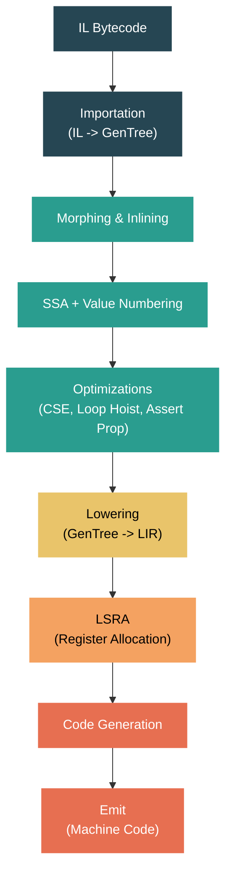

# Level 4: Internals — JIT Compilation: RyuJIT Internals

> **Target profile:** Runtime engineer or advanced contributor who needs to understand, debug, or modify the .NET JIT compiler
> **Estimated effort:** 12 hours
> **Prerequisites:** Level 3 modules, [Module 4.2](04-internals-type-system.md)
> [Version en espanol](../es/04-internals-jit.md)

---

## Learning Objectives

By the end of this module you will be able to:

1. Trace the full compilation pipeline from IL bytecode through GenTree IR to native machine code, identifying each major phase.
2. Explain the `Compiler` object's role as the per-method compilation context and how it orchestrates the phase pipeline.
3. Read and interpret GenTree IR nodes, understanding the tree-based intermediate representation and its key node types.
4. Describe the major optimization phases -- morphing, inlining, SSA construction, value numbering, CSE, loop hoisting, and assertion propagation.
5. Explain how Linear Scan Register Allocation (LSRA) assigns physical registers to virtual variables.
6. Use JIT diagnostic knobs (`DOTNET_JitDump`, `DOTNET_JitDisasm`, `DOTNET_JitDiffableDasm`) to inspect and debug JIT behavior.

---

## Concept Map



---

## A Note on Complexity

This is one of the most complex areas of the entire .NET runtime. The JIT compiler in `src/coreclr/jit/` consists of hundreds of thousands of lines of C++ spread across over 100 source files. A single compilation pass may traverse more than 80 distinct phases. This module provides a structured overview of the pipeline -- enough to orient you when reading the source or debugging JIT behavior -- but mastering every phase would take months of focused study. Do not be discouraged if the code feels overwhelming at first; even veteran runtime engineers consult the JIT documentation regularly.

---

## Source Reading Guide

| Difficulty | File | Purpose |
|------------|------|---------|
| ★★★★ | `src/coreclr/jit/compiler.h` | The `Compiler` class -- the central object for a JIT compilation |
| ★★★★ | `src/coreclr/jit/compiler.cpp` | `compCompile()` -- the master phase pipeline driver |
| ★★★★ | `src/coreclr/jit/compphases.h` | Complete ordered list of all compilation phases |
| ★★★★ | `src/coreclr/jit/gentree.h` | `GenTree` struct -- the IR node type |
| ★★★★★ | `src/coreclr/jit/importer.cpp` | IL import -- converts bytecode to GenTree |
| ★★★★★ | `src/coreclr/jit/morph.cpp` | Tree morphing and global optimizations |
| ★★★★★ | `src/coreclr/jit/optimizer.cpp` | Loop optimizations, block weights |
| ★★★★★ | `src/coreclr/jit/lsra.h` | `LinearScan` class -- register allocation |
| ★★★★ | `src/coreclr/jit/codegencommon.cpp` | Architecture-independent code generation |
| ★★★★ | `src/coreclr/jit/jitconfigvalues.h` | All JIT configuration knobs |
| ★★★★ | `src/coreclr/jit/flowgraph.cpp` | Control flow graph manipulation |
| ★★★★★ | `src/coreclr/jit/lsra.cpp` | LSRA implementation |

---

## Curriculum

### Lesson 1 — RyuJIT Architecture Overview

#### What you'll learn

RyuJIT is the production JIT compiler for CoreCLR. Every time the runtime needs to execute a managed method for the first time (or re-compile it for tiered compilation), it invokes RyuJIT to transform IL bytecode into native machine code. Understanding the overall architecture is the foundation for everything else in this module.

#### The Compiler object

Open `src/coreclr/jit/compiler.h`. The opening comment tells you the essential design:

```cpp
//  Represents the method data we are currently JIT-compiling.
//  An instance of this class is created for every method we JIT.
//  This contains all the info needed for the method. So allocating a
//  a new instance per method makes it thread-safe.
//  It should be used to do all the memory management for the compiler run.
```

The `Compiler` class is enormous -- it contains the entire state for a single method's compilation. When the EE (Execution Engine) asks RyuJIT to compile a method, the entry point is `CILJit::compileMethod()`, which creates a `Compiler` instance and calls its `compCompile()` method.

Key design decisions:
- **One Compiler per method**: Thread safety comes from isolation. Each method gets its own `Compiler` instance with its own arena allocator.
- **Arena allocation**: All memory for a compilation is allocated from a single arena and freed in bulk when the compilation is done. No individual `delete` calls.
- **Phase-driven**: Compilation proceeds through a fixed sequence of phases. Each phase is a method on the `Compiler` class, invoked via `DoPhase()`.

#### The phase pipeline

Open `src/coreclr/jit/compiler.cpp` at the `compCompile()` function (around line 4305). The comment says it all:

```cpp
// This is the most interesting 'toplevel' function in the JIT. It goes through
// the operations of importing, morphing, optimizations and code generation.
```

The function calls `DoPhase()` repeatedly, once for each compilation phase. The complete list of phases is defined in `src/coreclr/jit/compphases.h`. Here are the major groups:

**1. Import (IL -> GenTree)**
- `PHASE_PRE_IMPORT` -- prepare data structures
- `PHASE_IMPORTATION` -- the main IL-to-tree conversion via `fgImport()`
- `PHASE_POST_IMPORT` -- cleanup after import

**2. Morph (tree transformations)**
- `PHASE_MORPH_INIT` -- prepare for morphing
- `PHASE_MORPH_INLINE` -- inline callee methods
- `PHASE_LOCAL_MORPH` -- simplify local variable accesses
- `PHASE_MORPH_GLOBAL` -- global tree morphing via `fgMorphBlocks()`

**3. Flow Graph Optimization**
- `PHASE_OPTIMIZE_FLOW` -- control flow simplification
- `PHASE_FIND_LOOPS` -- natural loop discovery
- `PHASE_CLONE_LOOPS` -- loop cloning for optimization
- `PHASE_UNROLL_LOOPS` -- loop unrolling

**4. SSA and High-Level Optimization**
- `PHASE_BUILD_SSA` -- SSA form construction (liveness, dominance frontiers, phi insertion, renaming)
- `PHASE_VALUE_NUMBER` -- value numbering
- `PHASE_HOIST_LOOP_CODE` -- loop-invariant code motion
- `PHASE_VN_COPY_PROP` -- VN-based copy propagation
- `PHASE_OPTIMIZE_VALNUM_CSES` -- common sub-expression elimination
- `PHASE_ASSERTION_PROP_MAIN` -- assertion propagation
- `PHASE_OPTIMIZE_BRANCHES` -- redundant branch optimization

**5. Lowering and Register Allocation**
- `PHASE_RATIONALIZE` -- convert HIR to LIR (linear IR)
- `PHASE_LOWERING` -- platform-specific lowering
- `PHASE_LINEAR_SCAN` -- register allocation (LSRA)

**6. Code Generation**
- `PHASE_GENERATE_CODE` -- emit machine instructions
- `PHASE_EMIT_CODE` -- encode and finalize the code buffer
- `PHASE_EMIT_GCEH` -- emit GC info and EH tables

#### Inlinees use the same pipeline

A subtle but important detail: when RyuJIT inlines a method, it creates a *separate* `Compiler` instance for the inlinee and runs it through the early phases (import, some morphing). If the inline attempt succeeds, the inlinee's trees are grafted into the caller's trees. This is visible in `compCompile()`:

```cpp
// If we're importing for inlining, we're done.
if (compIsForInlining())
{
    return;
}
```

#### Exercise

1. Open `src/coreclr/jit/compphases.h` and count the total number of phases. Note which phases have `hasChildren = true` (these are parent phases that group sub-phases).
2. In `compCompile()`, find where the pipeline splits between optimized and non-optimized code paths. Look for `opts.OptimizationEnabled()`.
3. Search for `DoPhase` calls in `compiler.cpp`. Notice how each phase returns a `PhaseStatus` that indicates whether the phase modified anything.

---

### Lesson 2 — IL Import and GenTree IR

#### What you'll learn

The import phase is where IL bytecode becomes the JIT's internal representation: a tree-based IR called GenTree. Understanding GenTree is essential because every subsequent phase reads and transforms these trees.

#### IL Import

Open `src/coreclr/jit/importer.cpp`. The file header describes the process:

```cpp
//  Imports the given method and converts it to semantic trees
```

The importer walks the IL bytecode instruction by instruction. It maintains an evaluation stack (mirroring the IL evaluation stack) and converts each IL opcode into one or more GenTree nodes. For example:
- `ldarg.0` pushes a `GT_LCL_VAR` node onto the evaluation stack
- `ldfld` pops an object reference and creates a `GT_IND` (indirection) node
- `add` pops two values and creates a `GT_ADD` node
- `call` creates a `GT_CALL` node with the arguments as children

The key function is `impPushOnStack()`, which pushes a GenTree node onto the simulated stack:

```cpp
void Compiler::impPushOnStack(GenTree* tree, typeInfo ti)
{
    stackState.esStack[stackState.esStackDepth].seTypeInfo = ti;
    stackState.esStack[stackState.esStackDepth++].val      = tree;
}
```

Each basic block's IL is imported into a linked list of `Statement` nodes, where each statement holds a tree rooted at a GenTree node.

#### The GenTree structure

Open `src/coreclr/jit/gentree.h`. The comment at the top describes the core concept:

```cpp
//  This is the node in the semantic tree graph. It represents the operation
//  corresponding to the node, and other information during code-gen.
```

The `GenTree` struct is the fundamental IR node. Every expression, operation, and side effect in the JIT is represented as a `GenTree`. The two most important fields are:

```cpp
genTreeOps gtOper; // The operation (GT_ADD, GT_CALL, GT_LCL_VAR, etc.)
var_types  gtType; // The type of the result (TYP_INT, TYP_REF, TYP_FLOAT, etc.)
```

GenTree nodes are classified by their arity:

```cpp
enum GenTreeOperKind
{
    GTK_SPECIAL = 0x00, // special operator
    GTK_LEAF    = 0x01, // leaf    operator (no children)
    GTK_UNOP    = 0x02, // unary   operator (one child)
    GTK_BINOP   = 0x04, // binary  operator (two children)
};
```

Subclasses extend `GenTree` for specific operations:
- `GenTreeOp` -- binary operations (`GT_ADD`, `GT_MUL`, `GT_AND`, etc.) with `gtOp1` and `gtOp2` children
- `GenTreeCall` -- method calls with argument lists and calling convention info
- `GenTreeLclVar` -- local variable references
- `GenTreeIntCon` -- integer constants
- `GenTreeIndir` -- memory indirections (loads/stores)

#### Tree structure example

Consider the C# expression `a + b * c` where all are local `int` variables. After import, RyuJIT represents this as:

```
       GT_ADD (TYP_INT)
      /              \
GT_LCL_VAR(a)    GT_MUL (TYP_INT)
                /              \
        GT_LCL_VAR(b)    GT_LCL_VAR(c)
```

Each statement in a basic block holds a tree like this. Multiple statements form the block's statement list.

#### HIR vs LIR

RyuJIT uses two forms of the GenTree IR:
- **HIR (High-level IR)**: Tree-structured. Nodes have parent-child relationships. Used from import through the optimization phases. Statements contain expression trees.
- **LIR (Linear IR)**: After rationalization (`PHASE_RATIONALIZE`), the trees are flattened into a linear sequence. Each node appears exactly once in execution order. LIR is used during lowering, register allocation, and code generation.

The transition from HIR to LIR is one of the most important transformations in the pipeline.

#### Exercise

1. Open `src/coreclr/jit/gentreeopsdef.h` and browse the `GT_*` opcode definitions. How many different opcodes exist?
2. In `gentree.h`, find the `GenTreeOp` struct. Locate the `gtOp1` and `gtOp2` fields -- these are the left and right children of a binary operation.
3. Read through the first 100 lines of `importer.cpp`. Notice how `impPushOnStack` and the IL opcode switch work together to build trees.

---

### Lesson 3 — Optimization Phases

#### What you'll learn

Between import and code generation, RyuJIT runs dozens of optimization phases. This lesson covers the most important ones. Each phase transforms the GenTree IR to produce faster code.

#### Morphing

Morphing (`src/coreclr/jit/morph.cpp`) is the first major transformation pass. The function `fgMorphInit()` prepares the compiler state, then `fgMorphBlocks()` walks every tree in every block and applies transformations.

Morphing does many things:
- **Constant folding**: `3 + 5` becomes `8`
- **Strength reduction**: multiplying by a power of two becomes a shift
- **Canonicalization**: puts trees into a standard form for later optimizations
- **Address mode formation**: combines base + index + offset into a single addressing mode
- **Type coercion**: inserts casts where needed

The morph phase is one of the oldest and largest parts of the JIT. It runs before SSA is built, so it operates on the raw tree form.

#### Inlining

Inlining happens during `PHASE_MORPH_INLINE` via `fgInline()`. When the JIT encounters a `GT_CALL` node, it evaluates whether the callee is profitable to inline based on:
- Method size (IL byte count)
- Call site profitability (hot vs. cold path)
- Profile-guided data (if available)
- Recursive depth limits

If inlining proceeds, a new `Compiler` instance is created for the callee, its IL is imported, and the resulting trees are substituted for the `GT_CALL` node. The `InlineStrategy` and `InlinePolicy` classes (in `src/coreclr/jit/inline.h`) control the heuristics.

#### SSA Construction

After morphing, if optimizations are enabled, the JIT builds SSA (Static Single Assignment) form during `PHASE_BUILD_SSA`. This is a standard compiler technique where each variable is assigned exactly once, and phi functions are inserted at control flow merge points.

SSA construction has four sub-phases:
1. **Liveness analysis** (`PHASE_BUILD_SSA_LIVENESS`) -- determine which variables are live at each program point
2. **Dominance frontier computation** (`PHASE_BUILD_SSA_DF`) -- compute where phi functions are needed
3. **Phi insertion** (`PHASE_BUILD_SSA_INSERT_PHIS`) -- insert phi nodes at merge points
4. **Renaming** (`PHASE_BUILD_SSA_RENAME`) -- rename all variable uses to their SSA versions

Once SSA is built, each `GT_LCL_VAR` node carries an SSA number that identifies the specific definition it refers to.

#### Value Numbering

Value numbering (`PHASE_VALUE_NUMBER`) assigns a unique "value number" to each expression. Two expressions with the same value number are guaranteed to produce the same result. This enables many downstream optimizations.

For example, if `x = a + b` and later `y = a + b` (with no changes to `a` or `b`), both additions get the same value number. CSE can then replace the second computation with a reference to the first.

The value numbering implementation lives in `src/coreclr/jit/valuenum.h` and `valuenum.cpp`.

#### Common Sub-Expression Elimination (CSE)

CSE (`PHASE_OPTIMIZE_VALNUM_CSES`) identifies expressions that appear multiple times and replaces them with a single computation stored in a temporary variable. It relies on value numbering to identify equivalent expressions.

The implementation is in `src/coreclr/jit/optcse.cpp` and `optcse.h`. The CSE heuristic weighs the cost of the extra temporary variable (register pressure) against the savings from avoiding redundant computation.

#### Loop Optimizations

The optimizer (`src/coreclr/jit/optimizer.cpp`) handles several loop transformations:

- **Loop discovery** (`PHASE_FIND_LOOPS`): Identifies natural loops using dominance information. The `FlowGraphNaturalLoop` class represents a detected loop.
- **Loop cloning** (`PHASE_CLONE_LOOPS`): Creates a fast-path copy of a loop for cases where bounds checks can be eliminated.
- **Loop unrolling** (`PHASE_UNROLL_LOOPS`): Replicates the loop body to reduce iteration overhead for small, fixed-count loops.
- **Loop-invariant code motion** (`PHASE_HOIST_LOOP_CODE`): Moves computations that don't change between iterations out of the loop.
- **Induction variable optimization** (`PHASE_OPTIMIZE_INDUCTION_VARIABLES`): Simplifies and strength-reduces loop counter computations.

#### Assertion Propagation

Assertion propagation (`PHASE_ASSERTION_PROP_MAIN`) tracks facts that are known to be true at various program points. For example, after a null check succeeds, the variable is known to be non-null. This information is used to:
- Eliminate redundant null checks
- Remove unnecessary bounds checks
- Simplify conditional branches

#### The optimization loop

One important detail visible in `compCompile()` around line 4736:

```cpp
while (++opts.optRepeatIteration <= opts.optRepeatCount)
{
    // SSA, value numbering, CSE, assertion prop, etc.
}
```

The SSA-based optimizations can run in a loop (`JitOptRepeat`). Each iteration may discover new optimization opportunities created by previous passes.

#### Exercise

1. In `compphases.h`, list all optimization phases that have "loop" in their name. How many different loop transformations does RyuJIT perform?
2. Open `compiler.cpp` around line 4700. Find where `doSsa`, `doValueNum`, `doCse`, and `doAssertionProp` are configured. Notice how each depends on the previous one.
3. Search `jitconfigvalues.h` for `JitDoSsa`, `JitDoCopyProp`, and `JitDoAssertionProp`. These are the knobs that enable/disable individual optimizations in debug builds.

---

### Lesson 4 — Register Allocation (LSRA)

#### What you'll learn

After optimizations and lowering, the JIT must assign physical registers to all the virtual variables and temporaries. RyuJIT uses Linear Scan Register Allocation (LSRA), a well-known algorithm that balances allocation quality with compilation speed.

#### Why register allocation matters

Modern CPUs can access registers orders of magnitude faster than memory. The register allocator's job is to keep the most frequently used values in registers while minimizing the cost of "spilling" values to the stack when registers run out. A good register allocator can make a 2-5x difference in the performance of generated code.

#### The LinearScan class

Open `src/coreclr/jit/lsra.h`. The `LinearScan` class at line 625 is the main register allocator:

```cpp
class LinearScan : public RegAllocInterface
{
    // This is the main driver
    virtual PhaseStatus doRegisterAllocation();
};
```

LSRA has three sub-phases, visible in `compphases.h`:
1. `PHASE_LINEAR_SCAN_BUILD` -- build intervals
2. `PHASE_LINEAR_SCAN_ALLOC` -- allocate registers
3. `PHASE_LINEAR_SCAN_RESOLVE` -- resolve cross-block mismatches

#### Core concepts

**Intervals**: Each variable or temporary that needs a register is represented as an `Interval`. An interval tracks the range of LIR locations where the value is live.

**RefPositions**: Each use or definition of a variable creates a `RefPosition`. RefPositions are ordered linearly (hence "linear scan") and the allocator walks through them in order, making allocation decisions.

**LsraLocation**: A linearized ordering of all nodes. Each node gets two locations -- one for uses and non-final defs, and one for the final def:

```cpp
typedef unsigned int LsraLocation;
```

**Register types**: Variables are categorized into integer registers, float registers, and (on x86/x64 with SIMD) mask registers:

```cpp
#define IntRegisterType   TYP_INT
#define FloatRegisterType TYP_FLOAT
#define MaskRegisterType  TYP_MASK
```

#### How LSRA works

1. **Build intervals** (`buildIntervals`): Walk the LIR in each block. For each node, create RefPositions for its uses and defs. Track which variables are live and where they need registers.

2. **Allocate registers** (`allocateRegisters`): Walk all RefPositions in linear order. For each:
   - If a register is available, assign it
   - If no register is free, choose a victim to spill (evict from its register and store to stack)
   - Spill decisions use heuristics based on weight (frequency of use) and distance to next use

3. **Resolve** (`resolveRegisters`): After allocation, adjacent blocks may disagree about which register holds a variable. The resolution phase inserts moves (copies or reloads) at block boundaries to ensure consistency.

#### Spilling

When there are more live values than available registers, the allocator must "spill" some values to memory. Spilling inserts:
- A **store** at the spill point (write the register to the stack)
- A **reload** at the next use point (read the stack back into a register)

The allocator tries to minimize spills in hot code and prefers spilling values that won't be used again soon.

#### Exercise

1. In `lsra.h`, find the `Interval` class and the `RefPosition` class. What fields do they contain?
2. Search `jitconfigvalues.h` for `JitLsraStats` and `JitLsraOrdering`. These let you see LSRA statistics and change the heuristic ordering.
3. Open `compphases.h` and find `PHASE_LINEAR_SCAN`. Note its three sub-phases.

---

### Lesson 5 — Code Generation

#### What you'll learn

After register allocation, the JIT generates actual machine code. This is the final translation from the GenTree IR (now in LIR form with physical registers assigned) into the target architecture's instruction encoding.

#### Lowering: preparing for codegen

Before register allocation, the lowering phase (`src/coreclr/jit/lower.h`, `lower.cpp`) transforms the IR from a high-level representation into something closer to machine instructions:
- Decomposes complex operations into sequences of simpler ones
- Chooses addressing modes (base + index * scale + offset)
- Selects specific machine instruction forms
- Marks nodes with register requirements (e.g., "this must be in RAX")

Lowering is target-specific. The main class is `Lowering` in `lower.h`, with target-specific overrides in files like `lowerxarch.cpp` and `lowerarmarch.cpp`.

#### The emitter

Open `src/coreclr/jit/codegencommon.cpp`. Code generation methods are common across architectures. The header describes:

```cpp
// Code Generator Common:
//   Methods common to all architectures and register allocation strategies
```

The actual machine instruction encoding is handled by the `emitter` class (`src/coreclr/jit/emit.h`, `emit.cpp`). The emitter:
- Encodes each instruction into bytes
- Resolves branch offsets and labels
- Handles alignment requirements
- Tracks GC info for each instruction (which registers hold GC references)

Architecture-specific emitter code lives in:
- `emitxarch.cpp` -- x86/x64
- `emitarm.cpp` -- ARM32
- `emitarm64.cpp` -- ARM64

#### The codegen walkthrough

Code generation (`PHASE_GENERATE_CODE`) walks the LIR for each block and, for each GenTree node, calls a `genCodeFor*` method. For example:
- `GT_ADD` calls `genCodeForBinary()` which emits an `add` instruction
- `GT_CALL` calls `genCallInstruction()` which sets up arguments, emits the call, and handles the return value
- `GT_STORE_LCL_VAR` emits a move from a register to a stack location

After code generation, `PHASE_EMIT_CODE` finalizes the instruction stream:
- Resolves forward branch targets
- Applies loop alignment padding
- Produces the final byte buffer

`PHASE_EMIT_GCEH` then generates the GC info tables and exception handling tables that the runtime uses for stack walking and garbage collection.

#### Platform-specific code generation

RyuJIT supports multiple architectures. The code generation files are split by platform:
- `codegenxarch.cpp` -- x86/x64 specific
- `codegenarm.cpp` -- ARM32 specific
- `codegenarm64.cpp` -- ARM64 specific
- `codegencommon.cpp` -- shared logic

Each platform has its own instruction set, register file, and calling convention. The lowering phase and emitter handle these differences so that the optimization phases can remain largely platform-independent.

#### Exercise

1. Open `src/coreclr/jit/emit.h` and find the `emitter` class. Browse the instruction group (`insGroup`) structure that represents a block of encoded instructions.
2. Search for `genCodeForBinary` in the codebase. How does it differ between `codegenxarch.cpp` and `codegenarm64.cpp`?
3. In `compphases.h`, find the final four phases: `PHASE_GENERATE_CODE`, `PHASE_EMIT_CODE`, `PHASE_EMIT_GCEH`, `PHASE_POST_EMIT`. These are the last steps before the native code is handed back to the runtime.

---

### Lesson 6 — JIT Configuration and Debugging

#### What you'll learn

RyuJIT has an extensive set of configuration knobs for diagnosing and debugging JIT behavior. These are invaluable when investigating performance issues, verifying that optimizations fire, or debugging incorrect code generation.

#### Configuration knob architecture

Open `src/coreclr/jit/jitconfigvalues.h`. This file defines all JIT configuration variables using macros:

```cpp
// Debug-only configs
CONFIG_INTEGER(name, key, defaultValue)
CONFIG_STRING(name, key)
CONFIG_METHODSET(name, key)

// Available in release builds too
RELEASE_CONFIG_INTEGER(name, key, defaultValue)
RELEASE_CONFIG_METHODSET(name, key)
```

`CONFIG_*` macros define knobs only available in Debug/Checked builds. `RELEASE_CONFIG_*` macros define knobs available in all builds (including Release). Environment variables use the `DOTNET_` prefix (e.g., `DOTNET_JitDisasm`).

#### JitDisasm -- viewing generated assembly

The most commonly used knob. Available in Release builds:

```bash
# Disassemble a specific method
DOTNET_JitDisasm="MyClass::MyMethod" dotnet run

# Disassemble all methods
DOTNET_JitDisasm="*" dotnet run

# Produce diff-friendly output (no addresses, no pointer values)
DOTNET_JitDisasmDiffable=1 DOTNET_JitDisasm="*" dotnet run
```

`JitDisasm` shows the final native assembly for matched methods. This is the output most performance engineers look at.

Additional JitDisasm options:
- `DOTNET_JitDisasmSummary=1` -- print a one-line summary for every jitted method (name, code size)
- `DOTNET_JitDisasmWithCodeBytes=1` -- include hex encoding of each instruction
- `DOTNET_JitDisasmWithAlignmentBoundaries=1` -- show cache line boundaries

#### JitDump -- the full compilation trace

Available only in Debug/Checked builds, `JitDump` produces an extremely verbose trace of the entire compilation process:

```bash
DOTNET_JitDump="MyClass::MyMethod" dotnet run 2>jitdump.txt
```

The dump includes:
- The IL bytecode
- The imported GenTree IR after each phase
- SSA numbers and value numbers
- LSRA interval tables and allocation decisions
- The final generated code

A `JitDump` for a single method can be thousands of lines long. It is the primary tool for understanding *why* the JIT made a specific decision.

Related knobs:
- `DOTNET_JitDumpASCII=1` -- use only ASCII in tree dumps (default)
- `DOTNET_JitDumpVerboseTrees=1` -- more detailed tree display
- `DOTNET_JitDumpBeforeAfterMorph=1` -- show each tree before and after morphing

#### JitDumpFg -- flow graph visualization

For understanding control flow:

```bash
# Dump flow graph in DOT format for Graphviz
DOTNET_JitDumpFg="MyClass::MyMethod" DOTNET_JitDumpFgDot=1 dotnet run
```

This produces `.dot` files that can be visualized with Graphviz, showing basic blocks, edges, and loop structure. You can control which phase's flow graph to dump:

```bash
DOTNET_JitDumpFgPhase="optclone" dotnet run
```

#### LSRA diagnostics

```bash
# Display LSRA statistics (1=text, 2=csv, 3=summary)
DOTNET_JitLsraStats=1 dotnet run

# Change LSRA heuristic ordering
DOTNET_JitLsraOrdering="ABCDE" dotnet run
```

#### Optimization control knobs (Debug/Checked builds)

These let you selectively disable optimizations to isolate bugs:

```bash
DOTNET_JitDoSsa=0               # Disable SSA construction
DOTNET_JitDoValueNumber=0       # Disable value numbering
DOTNET_JitDoCopyProp=0          # Disable copy propagation
DOTNET_JitDoAssertionProp=0     # Disable assertion propagation
DOTNET_JitDoRedundantBranchOpts=0  # Disable redundant branch opts
DOTNET_JitDoLoopHoisting=0      # Disable loop hoisting
```

This is extremely useful for bisecting JIT bugs: if disabling a specific optimization makes a bug disappear, you know which phase to investigate.

#### AltJit -- using an alternate JIT

```bash
# Use a different JIT DLL for specific methods
DOTNET_AltJit="MyMethod" DOTNET_AltJitName="clrjit2.dll" dotnet run
```

This is used for A/B testing JIT changes.

#### Practical debugging workflow

1. **Performance investigation**: Start with `DOTNET_JitDisasm` to see the generated code. Compare with `DOTNET_JitDiffableDasm=1` to get diff-friendly output for before/after comparisons.

2. **Optimization verification**: Use `DOTNET_JitDump` to trace through the optimization phases. Check whether CSE, inlining, or loop hoisting fired as expected.

3. **Codegen bug**: Use the optimization control knobs to bisect which phase introduced the bug. Then use `DOTNET_JitDump` focused on that phase.

4. **Register allocation issues**: Use `DOTNET_JitLsraStats` and the LSRA dump in `JitDump` to understand spilling decisions.

#### Exercise

1. Write a simple C# program with a tight loop. Run it with `DOTNET_JitDisasm="*"` and examine the generated assembly.
2. Run the same program with `DOTNET_JitDump="*"` (Debug/Checked build). Find the SSA phase output and the value numbering output in the dump.
3. Search `jitconfigvalues.h` for all `RELEASE_CONFIG_*` knobs. These are the ones available in production builds -- they're the most important for real-world diagnostics.

---

## Summary

RyuJIT transforms IL bytecode into native machine code through a pipeline of over 80 phases. The central `Compiler` object manages all state for a single method's compilation. IL is imported into a tree-based IR (GenTree), optimized through morphing, SSA construction, value numbering, CSE, loop transformations, and assertion propagation, then lowered to a linear form, register-allocated via LSRA, and finally emitted as machine code.

The key files to remember:
- `compiler.h` / `compiler.cpp` -- the `Compiler` class and the `compCompile()` phase driver
- `compphases.h` -- the ordered list of all phases
- `gentree.h` -- the `GenTree` IR node
- `importer.cpp` -- IL import
- `morph.cpp` -- tree morphing
- `optimizer.cpp` -- loop optimizations
- `lsra.h` / `lsra.cpp` -- register allocation
- `jitconfigvalues.h` -- diagnostic knobs

---

## Further Reading

- [RyuJIT Overview](https://github.com/dotnet/runtime/blob/main/docs/design/coreclr/jit/ryujit-overview.md) -- the official JIT design document
- [JIT Dump Output](https://github.com/dotnet/runtime/blob/main/docs/design/coreclr/jit/viewing-jit-dumps.md) -- how to read JitDump output
- `docs/design/coreclr/jit/` -- the full collection of JIT design documents
- [LSRA design](https://github.com/dotnet/runtime/blob/main/docs/design/coreclr/jit/lsra-detail.md) -- detailed LSRA documentation

---

## Glossary

| Term | Definition |
|------|-----------|
| **RyuJIT** | The production JIT compiler used by CoreCLR |
| **GenTree** | The tree-based intermediate representation (IR) used by RyuJIT |
| **HIR** | High-level IR -- tree-structured form used during optimization |
| **LIR** | Linear IR -- flattened form used during lowering and codegen |
| **SSA** | Static Single Assignment -- each variable defined exactly once |
| **Value Numbering** | Assigns IDs to expressions; equal IDs mean equal values |
| **CSE** | Common Sub-Expression Elimination -- avoids redundant computation |
| **LSRA** | Linear Scan Register Allocation -- assigns physical registers |
| **Interval** | LSRA concept: the live range of a value needing a register |
| **RefPosition** | LSRA concept: a point where a value is defined or used |
| **Spilling** | Evicting a register to memory when registers are exhausted |
| **Lowering** | Transforming IR to be closer to machine instructions |
| **Emitter** | The component that encodes machine instructions into bytes |
| **Morphing** | Early tree transformation pass (constant folding, canonicalization) |
| **Tiered compilation** | Compiling methods first at low quality (fast), then at high quality (slow) if hot |
