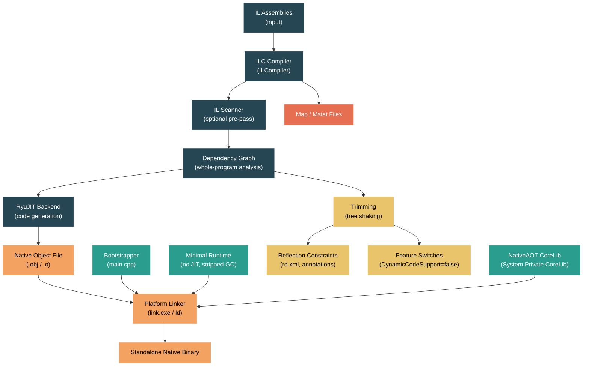

# Level 4: Internals — NativeAOT Compilation

> **Target profile:** Developer who wants to understand how .NET applications are compiled ahead-of-time into standalone native executables, including the ILC compiler pipeline, the minimal runtime, and the tradeoffs versus JIT and ReadyToRun
> **Estimated effort:** 8 hours
> **Prerequisites:** [Module 4.3 — JIT Compilation](04-internals-jit.md), [Module 4.9 — ReadyToRun](04-internals-r2r.md)
> [Version en espanol](../es/04-internals-nativeaot.md)

---

## Learning Objectives

By the end of this module you will be able to:

1. Explain where NativeAOT fits relative to JIT and ReadyToRun, articulating the tradeoffs of fully ahead-of-time compilation (no JIT, no dynamic loading, smaller footprint, faster startup).
2. Trace the ILC compiler pipeline from IL input through dependency graph analysis to native object file output, identifying the roles of the scanner, the dependency framework, and the RyuJIT backend.
3. Describe the NativeAOT minimal runtime architecture -- what it includes from CoreCLR, what it strips, and how the bootstrapper initializes the process.
4. Explain how whole-program analysis and trimming remove unreachable code, and how conditional and dynamic dependencies in the dependency graph enable precise tree shaking.
5. Identify which reflection and dynamic features work under NativeAOT, which require annotations or rd.xml, and which are fundamentally incompatible, and apply `DynamicallyAccessedMembers` attributes and feature switches to resolve warnings.
6. Publish a NativeAOT application using `dotnet publish`, analyze binary size with map/mstat files, and diagnose common deployment issues.

---

## Concept Map



---

## Curriculum

### Lesson 1 — NativeAOT vs JIT vs ReadyToRun: Where NativeAOT Fits

#### What you'll learn

NativeAOT is the third compilation strategy in the .NET ecosystem, alongside JIT (just-in-time) and ReadyToRun (R2R). Each makes fundamentally different tradeoffs. Understanding where NativeAOT fits -- and what it gives up -- is essential before diving into its internals.

#### The compilation spectrum

| Property | JIT | ReadyToRun | NativeAOT |
|----------|-----|------------|-----------|
| When code is compiled | At runtime, method-by-method | Ahead-of-time + JIT fallback | Fully ahead-of-time |
| Runtime required | Full CoreCLR | Full CoreCLR | Minimal stripped runtime |
| Dynamic code generation | Full (`Reflection.Emit`, `DynamicMethod`) | Full | **Not supported** |
| Assembly loading | Full (`Assembly.Load`, plugins) | Full | **Not supported** |
| Deployment | Framework-dependent or self-contained | Self-contained with R2R images | Single native executable |
| Startup time | Slowest (JIT on first call) | Fast (pre-compiled hot paths) | **Fastest** (no JIT at all) |
| Steady-state throughput | Highest (PGO, tiered compilation) | Good | Good (whole-program optimizations) |
| Binary size | Smallest (IL only) | Larger (IL + native code) | **Smallest self-contained** (no IL, trimmed) |
| Reflection | Full | Full | **Constrained** (requires annotations) |

#### The design philosophy from the source

The official design document at `docs/design/coreclr/botr/ilc-architecture.md` opens with this framing:

> ILC (IL Compiler) is an ahead of time compiler that transforms programs in CIL (Common Intermediate Language) into a target language or instruction set to be executed on a stripped down CoreCLR runtime.

The key phrase is "stripped down CoreCLR runtime." NativeAOT does not invent a new runtime from scratch. It reuses CoreCLR's GC, threading, and exception handling, but removes the JIT compiler, the type loader (for types not known at compile time), and the metadata reader that supports dynamic assembly loading.

#### What NativeAOT gives you

1. **Single native executable**: No `dotnet` host needed. The output is an EXE or shared library indistinguishable from a C/C++ binary.
2. **Fast startup**: Measured in low single-digit milliseconds for "Hello World" -- there is no JIT compilation at startup.
3. **Small working set**: No IL metadata in memory, no JIT compiler loaded, no type system for runtime type generation.
4. **Native debuggability**: Debug with `gdb`, `lldb`, `WinDbg`, or Visual Studio's native debugger with full source-level stepping.
5. **Predictable performance**: No JIT warmup, no tiered recompilation -- the first call is as fast as the thousandth.

#### What NativeAOT takes away

1. **No `Reflection.Emit` or `DynamicMethod`**: Code cannot be generated at runtime.
2. **No `Assembly.LoadFile` / `Assembly.Load`**: You cannot load new assemblies dynamically.
3. **Constrained reflection**: Only types/members that the compiler can statically discover (or that you explicitly root) are available via reflection.
4. **No COM interop on non-Windows** (limited even on Windows).
5. **Potentially larger binary than framework-dependent deployments**: The runtime and all libraries are linked in.

#### The high-level architecture

The NativeAOT documentation at `docs/workflow/building/coreclr/nativeaot.md` describes five major components:

1. **The AOT compiler (ILC)** -- built on a shared codebase with crossgen2 at `src/coreclr/tools/aot/`. Where crossgen2 generates R2R modules for the full CoreCLR, ILC generates native object files for the stripped runtime.
2. **The minimal runtime** -- NativeAOT-specific files at `src/coreclr/nativeaot/Runtime/`, plus shared code from `src/coreclr/`. Built into a static library.
3. **The bootstrapper** -- at `src/coreclr/nativeaot/Bootstrap/`. Contains the native `main()` that initializes the runtime and dispatches to managed code.
4. **The core libraries** -- `System.Private.CoreLib`, `System.Private.Reflection.*`, `System.Private.TypeLoader` at `src/coreclr/nativeaot/`.
5. **MSBuild integration** -- at `src/coreclr/nativeaot/BuildIntegration/`. The `.targets` files that hook into `dotnet publish`.

#### Source exploration exercise

1. Read `docs/design/coreclr/botr/ilc-architecture.md` -- the first three paragraphs explain the ahead-of-time vs JIT distinction and why both remain valuable.
2. Open `docs/workflow/building/coreclr/nativeaot.md` and read the "High Level Overview" section. Note how it describes ILC as generating "self-describing data structures for a stripped down version of CoreCLR."
3. List the contents of `src/coreclr/nativeaot/` and match each directory to the five components above.

---

### Lesson 2 — The ILC Compiler Pipeline

#### What you'll learn

ILC (IL Compiler) takes your application's IL assemblies and all referenced libraries as input, and produces a single native object file. This lesson traces the entire pipeline: from parsing command-line arguments, through dependency graph construction, IL scanning, code generation, and object writing.

#### The compilation driver

The entry point is `src/coreclr/tools/aot/ILCompiler/Program.cs`. The `Program` class parses the command-line options defined in `ILCompilerRootCommand.cs`:

```csharp
namespace ILCompiler
{
    internal sealed class Program
    {
        private readonly ILCompilerRootCommand _command;
        // ...
        public int Run()
        {
            string outputFilePath = Get(_command.OutputFilePath);
            // ...
        }
    }
}
```

The `ILCompilerRootCommand` class at the same path defines a comprehensive set of options. Some key ones:

- `--out` / `-o`: Output file path
- `--optimize` / `-O`: Enable optimizations (implies IL scanning)
- `--scan`: Use the IL scanner for optimized code generation
- `--rdxml`: RD.XML files that root additional types for reflection
- `--descriptor`: ILLink.Descriptor files for trimming directives
- `--dgmllog`: Serialize the dependency graph to DGML for debugging
- `--map`: Generate a map file showing what was emitted
- `--mstat`: Generate size statistics

The driver configures a `CompilationBuilder`, which is the factory for the entire compilation pipeline. The builder allows the driver to plug in policies for vtable generation, reflection metadata, devirtualization, and more.

#### The dependency analysis framework

The heart of ILC is dependency analysis. Located at `src/coreclr/tools/aot/ILCompiler.DependencyAnalysisFramework/`, this framework builds a directed graph where:

- **Object nodes** represent artifacts that become bytes in the output (compiled method bodies, type metadata structures, vtable entries).
- **General dependency nodes** represent abstract properties of the program ("virtual method X is called somewhere") that influence which object nodes exist.

Edges represent a "requires" relationship. The `Compilation` class in `src/coreclr/tools/aot/ILCompiler.Compiler/Compiler/Compilation.cs` wires this together:

```csharp
public abstract class Compilation : ICompilation
{
    protected readonly DependencyAnalyzerBase<NodeFactory> _dependencyGraph;
    protected readonly NodeFactory _nodeFactory;
    // ...
    protected Compilation(
        DependencyAnalyzerBase<NodeFactory> dependencyGraph,
        NodeFactory nodeFactory,
        IEnumerable<ICompilationRootProvider> compilationRoots,
        // ...)
    {
        _dependencyGraph.ComputeDependencyRoutine += ComputeDependencyNodeDependencies;
        NodeFactory.AttachToDependencyGraph(_dependencyGraph);

        var rootingService = new RootingServiceProvider(nodeFactory, _dependencyGraph.AddRoot);
        foreach (var rootProvider in compilationRoots)
            rootProvider.AddCompilationRoots(rootingService);
        // ...
    }
}
```

The compilation starts with **roots** (typically the `Main()` method, plus anything rooted by rd.xml or descriptors). The graph expands by following dependencies until a fixed point is reached.

#### Three types of dependencies

The ILC architecture document describes three dependency edge types, each serving a different purpose:

1. **Static dependencies**: If node A is in the graph and declares it needs node B, then B is also in the graph. This is the most common type.
2. **Conditional dependencies**: Node A depends on node B, but **only if** node C is also in the graph. This powers the vtable optimization -- a vtable slot for `Bar::VirtualMethod` is only needed if `Foo::VirtualMethod` is actually called somewhere.
3. **Dynamic dependencies**: Node A can inspect other nodes in the graph and inject new dependencies based on what it sees. Used sparingly (primarily for generic virtual methods), because they are expensive.

#### The DependencyAnalysis directory

The `src/coreclr/tools/aot/ILCompiler.Compiler/Compiler/DependencyAnalysis/` directory contains over 150 node types. Some important ones:

- `EETypeNode.cs` / `ConstructedEETypeNode.cs`: The `MethodTable` data structures that describe types at runtime.
- `MethodCodeNode.cs`: A compiled method body.
- `GCStaticsNode.cs`: Static fields that contain GC references.
- `ReflectionInvokeMapNode.cs`: Metadata enabling reflection invocation.
- `FrozenStringNode.cs`: String literals pre-allocated in the frozen heap.
- `VTableSliceNode.cs`: A type's vtable entries.

#### The IL Scanner

Before full compilation, ILC can run an optional **IL scanner** pass. The `ILScanner` class in `src/coreclr/tools/aot/ILCompiler.Compiler/Compiler/ILScanner.cs` builds the same dependency graph that the real compilation would, but without generating native code:

```csharp
internal sealed class ILScanner : Compilation, IILScanner
{
    // Analyzes IL without generating machine code
    // Builds a conservative superset of the dependency graph
    // Results feed into the real compilation for optimization
}
```

The scanner's graph is a strict superset of the real compilation's graph because it does not model optimizations like inlining and devirtualization. But the insights it produces are valuable: it can assign stable vtable slot numbers, determine which interfaces are actually used, and identify which generic instantiations exist. These results let the real compilation generate better code (e.g., inlining vtable lookups).

The `--scan` flag enables scanning; `-O` (optimize) implies it.

#### Code generation with RyuJIT

ILC reuses **RyuJIT** -- the same JIT compiler used by CoreCLR -- as its code generation backend. The difference is that instead of emitting code into a memory buffer at runtime, RyuJIT emits relocatable code into an object node. The backend is in `src/coreclr/tools/aot/ILCompiler.RyuJit/`.

ILC also supports an LLVM backend for WebAssembly (in the `runtimelab` experimental branch).

#### Object writing

The final phase serializes all marked object nodes into a platform-native object file:
- **COFF** (`.obj`) with CodeView debug info on Windows
- **ELF** (`.o`) with DWARF debug info on Linux
- **Mach-O** (`.o`) with DWARF debug info on macOS

The platform's native linker (`link.exe`, `ld`, `clang`) then links this object file with the bootstrapper and runtime static library to produce the final executable.

#### Source exploration exercise

1. Open `src/coreclr/tools/aot/ILCompiler/ILCompilerRootCommand.cs` and read the first 100 lines. Count how many `Option<>` fields there are -- each is a compiler switch.
2. Open `src/coreclr/tools/aot/ILCompiler.Compiler/Compiler/Compilation.cs` and find the constructor. Trace how roots are added via `ICompilationRootProvider`.
3. List `src/coreclr/tools/aot/ILCompiler.Compiler/Compiler/DependencyAnalysis/` and note how many node types exist (over 150). Read the names to get a sense of what artifacts appear in the output.
4. Open `src/coreclr/tools/aot/ILCompiler.Compiler/Compiler/ILScanner.cs` and read the class doc comment explaining that it builds a "conservative superset" of the dependency graph.

---

### Lesson 3 — The Minimal Runtime

#### What you'll learn

NativeAOT does not ship the full CoreCLR runtime. It uses a stripped-down version that removes the JIT, the type loader (for unknown types), and the IL metadata reader, while retaining the GC, threading, exception handling, and stack walking. This lesson examines the minimal runtime's architecture and how the bootstrapper gets everything started.

#### The bootstrapper: from `main()` to managed code

The file `src/coreclr/nativeaot/Bootstrap/main.cpp` is the native entry point for every NativeAOT executable. It is a compact ~265-line file that does three critical things:

1. **Initializes the runtime** by calling `RhInitialize()`.
2. **Registers the OS module** -- informing the runtime about the memory layout of managed code sections, unboxing stubs, and class library functions.
3. **Dispatches to managed code** via `__managed__Main(argc, argv)`.

The module registration is particularly interesting. ILC places compiled managed code into specially named linker sections (`.managedcode$A` through `.managedcode$Z` on Windows, `__managedcode` on Unix). The bootstrapper passes the addresses of these sections to the runtime so it knows the memory range of managed code:

```cpp
if (!RhRegisterOSModule(
    osModule,
    (void*)&__managedcode_a, (uint32_t)((char *)&__managedcode_z - (char*)&__managedcode_a),
    (void*)&__unbox_a, (uint32_t)((char *)&__unbox_z - (char*)&__unbox_a),
    (void **)&c_classlibFunctions, _countof(c_classlibFunctions)))
{
    return -1;
}
```

For shared libraries (DLLs / `.so`), a different path is used: the `NATIVEAOT_DLL` preprocessor define selects `__managed__Startup()` instead of `__managed__Main`, and initialization is deferred via `RhSetRuntimeInitializationCallback`.

#### What the minimal runtime includes

The runtime source lives at `src/coreclr/nativeaot/Runtime/`. Key files:

| File | Purpose |
|------|---------|
| `RuntimeInstance.cpp` / `.h` | The singleton runtime instance, manages thread store and module registration |
| `MiscHelpers.cpp` | Low-level helpers: spin waits, yields, module enumeration |
| `GCHelpers.cpp` | GC integration: allocation, write barriers |
| `EHHelpers.cpp` | Exception handling dispatch |
| `StackFrameIterator.cpp` | Stack walking for GC and exceptions |
| `MethodTable.cpp` | Minimal MethodTable operations (type identity, casting) |
| `ObjectLayout.cpp` / `.h` | Object header and layout definitions |
| `TypeManager.cpp` | Manages type metadata loaded from the compiled module |
| `CachedInterfaceDispatch_Aot.cpp` | Interface dispatch using cached stubs |
| `FinalizerHelpers.cpp` | Finalizer thread management |
| `ThunksMapping.cpp` | Thunk pools for runtime-generated dispatch stubs |

The runtime also has platform-specific directories (`amd64/`, `arm64/`, `arm/`) containing assembly-language helpers for transitions between managed and native code, GC write barriers, and exception dispatch.

#### What the minimal runtime does NOT include

- **No JIT compiler**: There is no `clrjit.dll` / `libclrjit.so`. All code is compiled ahead of time.
- **No IL reader**: The runtime cannot parse ECMA-335 metadata from assemblies.
- **No full type loader**: Types not known at compile time cannot be constructed at runtime (with one exception -- the `System.Private.TypeLoader` library provides limited generic instantiation support).
- **No `System.Reflection.Emit`**: There is no infrastructure for emitting IL or native code at runtime.
- **No profiling/debugging APIs** like `ICorProfiler` or `ICorDebug`.

#### The GC in NativeAOT

NativeAOT uses the same GC source code as CoreCLR (`src/coreclr/gc/`). However, the build integration at `src/coreclr/nativeaot/Runtime/` selects a specific configuration. The `clrgc.enabled.cpp` and `clrgc.disabled.cpp` files control whether the full GC is linked in or a minimal stub is used.

By default, NativeAOT supports both Workstation and Server GC modes, and the `RhConfig` system (in `RhConfig.cpp` / `RhConfig.h`) reads environment variables at startup to configure GC behavior.

#### NativeAOT's System.Private.CoreLib

NativeAOT has its own variant of CoreLib at `src/coreclr/nativeaot/System.Private.CoreLib/`. Files like `Activator.NativeAot.cs`, `GC.NativeAot.cs`, and `Array.NativeAot.cs` provide NativeAOT-specific implementations of core APIs. For example, `Activator.NativeAot.cs` implements `CreateInstance<T>()` using compiler intrinsics rather than runtime reflection:

```csharp
public static unsafe T CreateInstance<
    [DynamicallyAccessedMembers(DynamicallyAccessedMemberTypes.PublicParameterlessConstructor)] T>()
{
    // Grab the pointer to the default constructor of the type.
    // If T doesn't have a default constructor, the intrinsic returns a marker pointer.
    IntPtr defaultConstructor = DefaultConstructorOf<T>();
    // ...
}
```

This shows a recurring theme: NativeAOT replaces runtime discovery with compile-time resolution. The compiler knows the constructor address at compile time and bakes it directly into the code.

The NativeAOT CoreLib also has its own reflection implementation at `src/coreclr/nativeaot/System.Private.Reflection.Execution/` which works against pre-generated metadata tables rather than reading IL metadata on the fly.

#### Source exploration exercise

1. Read `src/coreclr/nativeaot/Bootstrap/main.cpp` end to end. Trace the path from `wmain`/`main` through `InitializeRuntime()` to `__managed__Main`. Note the linker section magic for module boundaries.
2. List `src/coreclr/nativeaot/Runtime/` and categorize the `.cpp` files into GC helpers, exception handling, type system, and thread management.
3. Open `src/coreclr/nativeaot/System.Private.CoreLib/src/System/Activator.NativeAot.cs` and compare its `CreateInstance<T>` implementation with the one you would find in the regular CoreLib. Note the `DefaultConstructorOf<T>()` intrinsic.
4. Browse `src/coreclr/nativeaot/Runtime/RhConfig.h` to see what environment variables the minimal runtime reads at startup.

---

### Lesson 4 — Trimming and Whole-Program Optimization

#### What you'll learn

One of NativeAOT's most powerful features is whole-program analysis: because ILC sees every assembly the program will ever use, it can aggressively remove unreachable code and data. This is the trimming (tree shaking) that makes NativeAOT binaries small. This lesson explains how the dependency graph enables precise trimming and what whole-program optimizations ILC applies.

#### How trimming works: it's the dependency graph

Unlike the ILLinker (which operates on IL assemblies and removes unused types/members as a separate pass), NativeAOT's trimming is **built into the compilation itself**. The dependency graph only contains nodes that are transitively reachable from the roots. Anything not in the graph simply does not exist in the output.

This is more precise than IL-level trimming because the graph is built during compilation, which means:

1. **Devirtualization** reduces the set of reachable methods: if the compiler can prove a virtual call only ever targets one implementation, it replaces the virtual call with a direct call. The unused override never enters the graph.
2. **Generic instantiation tracking** means only the specific `List<int>` and `List<string>` that your code uses are compiled -- not every possible instantiation.
3. **Conditional dependencies** (Lesson 2) ensure vtable slots are only generated when the virtual method is actually called.

#### The vtable optimization in detail

The ILC architecture document provides a detailed example. Consider:

```csharp
abstract class Foo
{
    public abstract void VirtualMethod();
    public virtual void UnusedVirtualMethod() { }
}

class Bar : Foo
{
    public override void VirtualMethod() { }
    public override void UnusedVirtualMethod() { }
}
```

If `UnusedVirtualMethod` is never called anywhere in the program, the conditional dependency from `Bar`'s `ConstructedEETypeNode` to `Bar::UnusedVirtualMethod` never activates. The method body is never compiled, and the vtable slot is never emitted. This is something a JIT-based runtime cannot do -- it must always include every virtual method in the vtable because new code could be loaded at runtime.

#### The VTableSliceProvider

The `VTableSliceProvider` class is one of the pluggable policies mentioned in the ILC architecture. The compilation driver can choose between:

- **Full vtables**: Every virtual method declared in the type hierarchy gets a slot (safe but wasteful).
- **Lazy vtables**: Only virtual methods with confirmed usage get slots (aggressive, requires whole-program knowledge from the scanner).

In practice, NativeAOT with `-O` uses the scanner to build lazy vtables, then uses the scanner results to assign stable slot numbers for the real compilation.

#### Sealed types and devirtualization

ILC has whole-program visibility and can determine that a type is effectively sealed even when it isn't declared `sealed`. If no type in the entire program overrides a particular virtual method, ILC can devirtualize the call. The `VirtualMethodCallHelper.cs` file in the `Compiler` directory participates in this analysis.

#### Feature switches

NativeAOT defaults to disabling several runtime features to reduce binary size. The MSBuild targets at `src/coreclr/nativeaot/BuildIntegration/Microsoft.NETCore.Native.targets` set these defaults:

```xml
<PropertyGroup>
  <EventSourceSupport Condition="$(EventSourceSupport) == ''">false</EventSourceSupport>
  <DynamicCodeSupport Condition="'$(DynamicCodeSupport)' == ''">false</DynamicCodeSupport>
  <UseSizeOptimizedLinq Condition="'$(UseSizeOptimizedLinq)' == ''">true</UseSizeOptimizedLinq>
</PropertyGroup>
```

When `DynamicCodeSupport` is `false`, the compiler substitutes method bodies that would use `Reflection.Emit` with implementations that throw `PlatformNotSupportedException`. This is done through the `SubstitutionProvider` and `SubstitutedILProvider` classes in the compiler, which can replace method bodies based on feature switch values.

The `BodySubstitution.cs` and `BodySubstitutionParser.cs` files handle parsing substitution XML files that the linker and NativeAOT compiler share.

#### Analyzing binary size

ILC provides several tools for understanding what ended up in the binary:

- **Map file** (`<IlcGenerateMapFile>true</IlcGenerateMapFile>`): An XML file listing every object node, its size, and its section. This shows exactly what contributes to the binary.
- **Mstat file** (`<IlcGenerateMstatFile>true</IlcGenerateMstatFile>`): A structured .NET assembly encoding size information about types, methods, and blobs. More compact and machine-parseable than the map file.
- **DGML graph** (`<IlcGenerateDgmlFile>true</IlcGenerateDgmlFile>`): A graph visualization file showing the dependency graph. Useful for answering "why was this method included?"

#### Source exploration exercise

1. Open `src/coreclr/nativeaot/BuildIntegration/Microsoft.NETCore.Native.targets` and find the feature switch defaults. Note how `DynamicCodeSupport` is `false` by default.
2. List `src/coreclr/tools/aot/ILCompiler.Compiler/Compiler/` and find files related to substitution: `SubstitutionProvider.cs`, `SubstitutedILProvider.cs`, `BodySubstitution.cs`. Read the first 30 lines of each.
3. Open `src/coreclr/tools/aot/ILCompiler.Compiler/Compiler/DependencyAnalysis/VTableSliceNode.cs` and observe how vtable slices are modeled as dependency nodes.
4. Read `src/coreclr/nativeaot/docs/optimizing.md` for instruction-set targeting options that influence code generation quality.

---

### Lesson 5 — Reflection and Dynamic Features in NativeAOT

#### What you'll learn

The hardest conceptual shift for developers moving to NativeAOT is the constrained reflection model. Since there is no IL metadata at runtime and no ability to load new code, the compiler must pre-generate all reflection metadata. This lesson explains what works, what doesn't, and how to make your code NativeAOT-compatible.

#### What works without changes

Many common reflection patterns are statically analyzable and work out of the box:

- `typeof(Foo)` -- the compiler sees the type reference and includes its metadata.
- `Activator.CreateInstance<T>()` where `T` is known at compile time.
- `nameof()` expressions.
- `Type.GetType("MyNamespace.MyType")` where the string is a compile-time constant in the same assembly.
- Attribute reading via `GetCustomAttributes()` on types/members the compiler can see.
- Serialization libraries that use source generators (e.g., `System.Text.Json` with `JsonSerializerContext`).

#### What requires annotations

When the compiler cannot statically determine which types or members will be accessed via reflection, you must provide hints. The primary mechanism is the `[DynamicallyAccessedMembers]` attribute:

```csharp
// Tell the compiler: whatever type flows into 'type', preserve its public constructors
void CreateInstance([DynamicallyAccessedMembers(DynamicallyAccessedMemberTypes.PublicConstructors)] Type type)
{
    Activator.CreateInstance(type);
}
```

The compiler's dataflow analysis (in `src/coreclr/tools/aot/ILCompiler.Compiler/Compiler/Dataflow/`) tracks how `Type` values flow through the program. Files like `FlowAnnotations.cs`, `MethodBodyScanner.cs`, and `HandleCallAction.cs` implement this analysis. When the analysis finds a pattern it cannot resolve statically, it emits a trim warning (e.g., `IL2026`, `IL2057`, `IL2075`).

#### The rd.xml escape hatch

For cases where annotations are insufficient (e.g., third-party libraries you cannot modify), NativeAOT supports rd.xml files. The format is documented at `src/coreclr/nativeaot/docs/rd-xml-format.md`:

```xml
<Directives xmlns="http://schemas.microsoft.com/netfx/2013/01/metadata">
  <Application>
    <Assembly Name="MyLibrary">
      <Type Name="MyNamespace.MyType" Dynamic="Required All" />
    </Assembly>
  </Application>
</Directives>
```

This tells ILC to root all methods of `MyNamespace.MyType`, ensuring they are compiled and their metadata is available for reflection. The `RdXmlRootProvider.cs` in `src/coreclr/tools/aot/ILCompiler/` parses these files and adds them as compilation roots.

ILC also supports ILLink descriptor XML files (via `--descriptor`) and substitution XML files (via `--substitution`), sharing the same format as the ILLinker.

#### What fundamentally does NOT work

These features are incompatible with NativeAOT's closed-world model:

- **`System.Reflection.Emit`**: No IL can be emitted at runtime. Libraries that use this (like some older serializers, ORMs, or expression tree compilation) must migrate to source generators.
- **`Assembly.LoadFile` / `Assembly.LoadFrom`**: Cannot load new assemblies.
- **`Type.MakeGenericType` with types not seen at compile time**: If the compiler never sees `List<Foo>`, it cannot generate code for it. However, if the instantiation is statically reachable somewhere in the program, it works.
- **Dynamic `DllImport`** (loading native libraries by name at runtime with `NativeLibrary.Load` works, but `DllImport` with `EntryPoint` requires the symbol to be resolvable at link time).

#### Feature switches for libraries

Libraries can declare feature switches that NativeAOT respects. When a feature is disabled, the compiler substitutes the check with a constant `false`, and the trimmer removes the unreachable code. This is configured via `RuntimeHostConfigurationOption` items in MSBuild:

```xml
<RuntimeHostConfigurationOption Include="System.Linq.Expressions.CanEmitObjectArrayDelegate"
                                Value="false"
                                Trim="true" />
```

The `Trim="true"` attribute tells the compiler the value is fixed at compile time, enabling dead code elimination.

#### The trim analysis warnings

NativeAOT and the ILLinker share the same warning infrastructure. The key warning codes:

| Code | Meaning |
|------|---------|
| `IL2026` | Method with `[RequiresUnreferencedCode]` is called |
| `IL2057` | Unrecognized `Type.GetType` string |
| `IL2070`-`IL2075` | `DynamicallyAccessedMembers` annotation mismatch |
| `IL2104` | Assembly with `[UnconditionalSuppressMessage]` at assembly level |
| `IL3050` | Method with `[RequiresDynamicCode]` is called |

The `--notrimwarn` ILC flag suppresses trim analysis warnings. The `<IlcTreatWarningsAsErrors>` MSBuild property (defaults to `$(TreatWarningsAsErrors)`) controls whether they are errors.

#### Source exploration exercise

1. Open `src/coreclr/tools/aot/ILCompiler.Compiler/Compiler/Dataflow/FlowAnnotations.cs` and read the class summary. This is the entry point for the dataflow analysis that tracks `DynamicallyAccessedMembers`.
2. Read `src/coreclr/nativeaot/docs/rd-xml-format.md` end to end. Try writing an rd.xml that would root all methods of a hypothetical `MyApp.Services.UserService` type.
3. Open `src/coreclr/tools/aot/ILCompiler/RdXmlRootProvider.cs` and see how rd.xml directives become compilation roots.
4. Browse `src/coreclr/nativeaot/System.Private.CoreLib/src/System/Reflection/` and note the NativeAOT-specific reflection files. Compare `Assembly.NativeAot.cs` with its CoreCLR counterpart to see how reflection queries are resolved against pre-generated tables.

---

### Lesson 6 — Building and Deploying NativeAOT

#### What you'll learn

This lesson covers the practical side: how to publish a NativeAOT application, how the MSBuild integration orchestrates ILC and the platform linker, how to analyze the resulting binary, and how to diagnose common issues.

#### Publishing with NativeAOT

The simplest path is adding `<PublishAot>true</PublishAot>` to your `.csproj`:

```xml
<PropertyGroup>
  <PublishAot>true</PublishAot>
</PropertyGroup>
```

Then publish with a runtime identifier:

```bash
dotnet publish -r win-x64 -c Release
```

This triggers the MSBuild targets at `src/coreclr/nativeaot/BuildIntegration/Microsoft.NETCore.Native.targets`. The publish process:

1. **IL compilation**: `dotnet build` compiles your C# to IL as usual.
2. **ILC invocation**: The targets invoke `ilc` (the ILC compiler) with a response file containing all assemblies, references, and compiler flags.
3. **Object file generation**: ILC produces a `.obj` (Windows) or `.o` (Unix) file.
4. **Native linking**: The targets invoke the platform linker (`link.exe` on Windows, `clang`/`gcc` on Linux/macOS) to link the object file with the bootstrapper, the minimal runtime static library, and any native libraries.
5. **Output**: A standalone native executable appears in the publish directory.

#### The response file

When ILC runs, it reads a response file (`.ilc.rsp`) that contains all its arguments. You can find this file in `obj/<Configuration>/<TFM>/<RID>/native/` after publishing. It is useful for debugging -- you can modify it and re-run `ilc` directly.

#### Cross-architecture compilation

NativeAOT supports targeting ARM64 from an x64 host and vice versa on both Windows and Linux:

```bash
dotnet publish -r win-arm64 -c Release
```

Cross-OS compilation (e.g., Linux from Windows) is **not** supported. The `compiling.md` doc at `src/coreclr/nativeaot/docs/` describes the cross-compilation setup, including sysroot configuration for Linux.

#### Producing shared libraries

NativeAOT can produce shared libraries (`.dll`/`.so`/`.dylib`) instead of executables:

```xml
<PropertyGroup>
  <OutputType>Library</OutputType>
  <PublishAot>true</PublishAot>
  <NativeLib>Shared</NativeLib>
</PropertyGroup>
```

Methods marked with `[UnmanagedCallersOnly]` are exported as C-callable entry points. The bootstrapper uses the `NATIVEAOT_DLL` path, calling `__managed__Startup()` at load time rather than `__managed__Main()`.

#### Diagnosing binary size

For a "Hello World" app, a NativeAOT binary on Linux x64 is roughly 1-3 MB (depending on trimming and optimization settings). For real applications, sizes of 10-30 MB are typical. Use these diagnostic properties to understand what contributes to size:

```xml
<PropertyGroup>
  <IlcGenerateMapFile>true</IlcGenerateMapFile>
  <IlcGenerateMstatFile>true</IlcGenerateMstatFile>
  <IlcGenerateDgmlFile>true</IlcGenerateDgmlFile>
</PropertyGroup>
```

The **map file** is the most immediately useful. It is an XML file listing every object node that was emitted, with its size and section. Search for large entries to find bloat.

The **mstat file** provides aggregate statistics about types and methods. The `IlcGenerateMetadataLog` property generates a CSV log of all metadata that was emitted for reflection.

#### Common issues and solutions

| Issue | Cause | Solution |
|-------|-------|----------|
| `IL2026` / `IL3050` warnings | Code uses reflection or dynamic code | Add `[DynamicallyAccessedMembers]`, use source generators, or add rd.xml entries |
| `MissingMetadataException` at runtime | Type/method not preserved for reflection | Root the type in rd.xml or use `[DynamicDependency]` |
| Large binary size | Unused features pulled in | Set feature switches (`EventSourceSupport=false`, etc.), check map file for large contributors |
| Linking errors | Missing native libraries | Install platform-specific prerequisites (build-essential, clang, etc.) |
| `PlatformNotSupportedException` | Feature disabled by default | Check if a feature switch is disabling the code path; set it to `true` if needed |
| Slow publish time | Full compilation every time | Use the `--scan` optimization; consider multi-file compilation for development (not shipping) |

#### Optimizing for size vs speed

The `IlcInstructionSet` property controls which CPU instruction sets are targeted:

```xml
<!-- Target modern x64 CPUs -->
<IlcInstructionSet>avx2,bmi2,fma,pclmul,popcnt,aes</IlcInstructionSet>

<!-- Target whatever the build machine supports -->
<IlcInstructionSet>native</IlcInstructionSet>
```

The `OptimizationPreference` property controls the optimization direction:

```xml
<OptimizationPreference>Speed</OptimizationPreference>  <!-- favor runtime speed -->
<OptimizationPreference>Size</OptimizationPreference>    <!-- favor binary size -->
```

#### Building the toolchain from source

For contributors working on NativeAOT itself, the build command is:

```bash
# Windows
build.cmd clr.aot+libs -rc Debug -lc Release

# Linux / macOS
./build.sh clr.aot+libs -rc Debug -lc Release
```

This builds the ILC compiler, the minimal runtime, and the class libraries. The `docs/workflow/building/coreclr/nativeaot.md` document provides the full developer workflow, including how to override `IlcToolsPath` to test a local compiler build against your project.

#### Source exploration exercise

1. Open `src/coreclr/nativeaot/BuildIntegration/Microsoft.NETCore.Native.targets` and trace the MSBuild targets that invoke ILC and the platform linker. Note the `IlcCompile` target and how it constructs the response file.
2. Publish a simple "Hello World" with `<PublishAot>true</PublishAot>` and examine the generated `.ilc.rsp` response file. Note the assemblies and flags passed to the compiler.
3. Enable `<IlcGenerateMapFile>true</IlcGenerateMapFile>` and examine the generated map XML. Find the largest method bodies and data structures.
4. Read `src/coreclr/nativeaot/docs/troubleshooting.md` for the complete list of diagnostic switches.

---

## Key Files Quick Reference

| Path | Description |
|------|-------------|
| `src/coreclr/tools/aot/ILCompiler/` | ILC compiler driver (entry point, command line parsing) |
| `src/coreclr/tools/aot/ILCompiler.Compiler/Compiler/` | Core compiler: dependency analysis, trimming, scanning |
| `src/coreclr/tools/aot/ILCompiler.Compiler/Compiler/DependencyAnalysis/` | 150+ node types modeling the output artifacts |
| `src/coreclr/tools/aot/ILCompiler.DependencyAnalysisFramework/` | Generic dependency graph framework |
| `src/coreclr/tools/aot/ILCompiler.RyuJit/` | RyuJIT code generation backend for ILC |
| `src/coreclr/nativeaot/Runtime/` | Minimal runtime (C/C++): GC helpers, EH, stack walking |
| `src/coreclr/nativeaot/Bootstrap/main.cpp` | Native `main()` bootstrapper |
| `src/coreclr/nativeaot/System.Private.CoreLib/` | NativeAOT-specific CoreLib implementations |
| `src/coreclr/nativeaot/System.Private.Reflection.Execution/` | Reflection against pre-generated metadata |
| `src/coreclr/nativeaot/System.Private.TypeLoader/` | Limited runtime type instantiation |
| `src/coreclr/nativeaot/BuildIntegration/` | MSBuild targets for `dotnet publish` integration |
| `src/coreclr/nativeaot/docs/` | NativeAOT user documentation (rd.xml, optimizing, troubleshooting) |
| `docs/design/coreclr/botr/ilc-architecture.md` | ILC compiler architecture design document |
| `docs/workflow/building/coreclr/nativeaot.md` | Developer workflow for building NativeAOT from source |

---

## Self-Assessment Questions

1. **Conceptual**: Why can NativeAOT remove unused virtual method bodies while JIT cannot? What mechanism in the dependency graph enables this?
2. **Tracing**: Starting from `Main()`, trace how ILC discovers that `List<int>.Add` needs to be compiled. What nodes and edges would appear in the dependency graph?
3. **Practical**: You receive an `IL2026` warning about `System.Text.Json.JsonSerializer.Serialize`. What are your three options for resolving it in a NativeAOT build?
4. **Architecture**: Explain the role of the IL scanner. Why is running it optional, and when would you skip it?
5. **Debugging**: Your NativeAOT binary is 25 MB for what should be a simple application. Describe the diagnostic steps you would take using map and mstat files.
6. **Tradeoffs**: A teammate proposes using NativeAOT for a plugin-based application that loads assemblies dynamically. What do you advise, and what alternatives would you suggest?

---

## Further Reading

- [ILC Compiler Architecture (BOTR)](../../docs/design/coreclr/botr/ilc-architecture.md) -- the definitive design document
- [NativeAOT Developer Workflow](../../docs/workflow/building/coreclr/nativeaot.md) -- building and testing from source
- [NativeAOT User Documentation](../../src/coreclr/nativeaot/docs/README.md) -- compiling, optimizing, troubleshooting
- [RD.XML Format Reference](../../src/coreclr/nativeaot/docs/rd-xml-format.md) -- rooting types for reflection
- [Official Microsoft Documentation](https://learn.microsoft.com/dotnet/core/deploying/native-aot/) -- publishing and deployment guide
- [Managed Type System (BOTR)](../../docs/design/coreclr/botr/managed-type-system.md) -- type system shared between ILC and crossgen2
