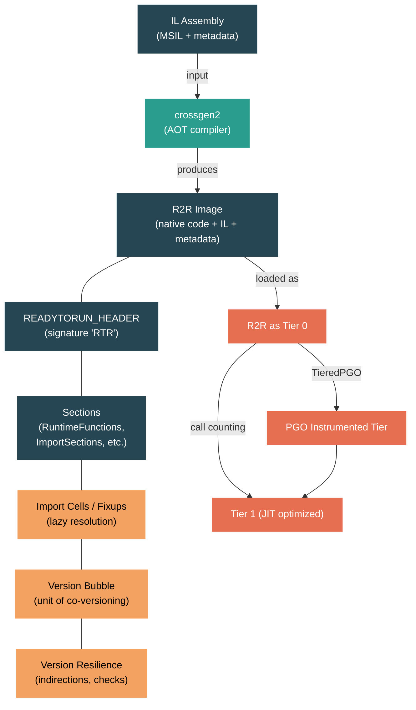

# Level 4: Internals — ReadyToRun (R2R) and Crossgen2

> **Target profile:** Runtime engineer or performance specialist who needs to understand how .NET achieves fast startup through ahead-of-time compilation while preserving version resilience
> **Estimated effort:** 6 hours
> **Prerequisites:** [Module 4.3 — JIT Compilation](04-internals-jit.md), [Module 4.4 — Tiered Compilation](04-internals-tiered-compilation.md)
> [Version en espanol](../es/04-internals-r2r.md)

---

## Learning Objectives

By the end of this module you will be able to:

1. Explain the startup latency problem that motivates ahead-of-time compilation and how ReadyToRun differs from both traditional AOT and the legacy NGEN approach.
2. Describe the R2R file format at a structural level: READYTORUN_HEADER, sections, import cells, and how native code coexists with full IL metadata inside a single assembly.
3. Trace the crossgen2 compilation pipeline from input MSIL assemblies through dependency analysis, RyuJIT code generation, and R2R image emission.
4. Articulate the version resilience contract, including version bubbles, cross-module indirections, fixup kinds, and the restrictions on value type layout.
5. Explain how R2R pre-compiled code participates in the tiered compilation pipeline -- how it serves as Tier 0, when and how it gets promoted to optimized Tier 1, and how PGO interacts with R2R.
6. Use `PublishReadyToRun`, composite images, and related MSBuild properties to build R2R-enabled applications and measure their startup improvement.

---

## Concept Map



---

## Curriculum

### Lesson 1 — Why Ahead-of-Time Compilation

#### What you'll learn

Every time a .NET application starts, the JIT compiler must convert IL to native code before any method can execute. For large applications with thousands of methods, this "JIT tax" adds significant startup latency and power consumption. ReadyToRun exists to pre-compile methods ahead of time so the runtime can execute native code immediately, without waiting for JIT compilation.

#### The problem in concrete terms

Consider a typical ASP.NET application. At startup, the framework loads hundreds of assemblies and calls thousands of methods before the first HTTP request can be served. Without R2R, every one of those method calls triggers JIT compilation. The JIT must:

1. Parse the IL byte stream
2. Build an intermediate representation
3. Run optimization passes
4. Emit machine code
5. Install the code and patch call sites

Even with Tiered Compilation's quick-jit mode (unoptimized Tier 0), this adds measurable latency. For client applications, cloud functions, and containerized microservices, startup time directly affects user experience and cold-start costs.

#### Why not just use traditional AOT?

Traditional ahead-of-time compilation (like NativeAOT or C++ compilation) produces a self-contained native binary. That approach works well when you control the entire application, but it has a fundamental limitation: **the compiled code is brittle**. If any dependency changes its type layout, adds a field, or modifies a virtual method table, the pre-compiled code becomes invalid.

The .NET ecosystem depends on independent library versioning. You should be able to update `System.Text.Json` without recompiling every library that depends on it. Traditional AOT cannot support this -- it bakes in assumptions about exact type layouts, vtable offsets, and field positions.

#### NGEN vs ReadyToRun

.NET had an earlier solution called NGEN (Native Image Generator). NGEN produced native images, but treated them as a **cache** -- if anything changed, the entire NGEN image was discarded and regenerated. This worked for desktop scenarios but was unsuitable for deployment:

- NGEN images were machine-specific and generated at install time
- They could not be distributed in NuGet packages
- Any framework update invalidated all NGEN images

The design document in `docs/design/coreclr/botr/readytorun-overview.md` (line 23-25) captures the key distinction:

> A native file format carries a strong guarantee that the file will continue to run despite updates and improvements to the runtime or framework.

ReadyToRun solves this by producing native images that are **version resilient** -- they continue to work even when dependencies are updated, at the cost of some indirection overhead for cross-module references.

#### Source exploration exercise

1. Open `docs/design/coreclr/botr/readytorun-overview.md` and read the "Motivation" and "Problem Constraints" sections (lines 1-35). Note how the document frames R2R as giving managed code the deployment characteristics of unmanaged code.
2. Open `src/coreclr/inc/readytorun.h` and find the `READYTORUN_SIGNATURE` constant (`0x00525452`). Decode the ASCII: `R`, `T`, `R` -- "RTR" for ReadyToRun.
3. Look at the version history comments in `readytorun.h` (lines 27-58). Notice how major version bumps indicate breaking format changes while minor versions add backwards-compatible sections.

---

### Lesson 2 — The ReadyToRun File Format

#### What you'll learn

An R2R assembly is a standard CLI PE file with extra native data grafted onto it. It retains the complete IL and metadata from the original assembly -- meaning the JIT can always fall back to IL for any method that was not pre-compiled or whose pre-compiled code is rejected at runtime.

#### The READYTORUN_HEADER

The entry point to all R2R data is the `READYTORUN_HEADER` structure, defined in `src/coreclr/inc/readytorun.h` (lines 70-77):

```cpp
struct READYTORUN_HEADER
{
    DWORD                   Signature;      // READYTORUN_SIGNATURE (0x00525452)
    USHORT                  MajorVersion;
    USHORT                  MinorVersion;

    READYTORUN_CORE_HEADER  CoreHeader;
};
```

The `CoreHeader` contains a `Flags` field and `NumberOfSections`, followed by a sorted array of `READYTORUN_SECTION` entries. Each section has a `Type` (enum `ReadyToRunSectionType`) and an `IMAGE_DATA_DIRECTORY` pointing to the section's data.

For single-file R2R images, the CLI header's `ManagedNativeHeader` field points to this structure. For composite images (multiple assemblies compiled together), the header is located via the `RTR_HEADER` export symbol.

#### Key sections

The `ReadyToRunSectionType` enum (lines 101-136) defines the sections. The most important ones:

| Section | Purpose |
|---------|---------|
| `RuntimeFunctions` (102) | Maps native code ranges to methods. The runtime uses this to find GC info and exception handlers for a given instruction pointer. |
| `MethodDefEntryPoints` (103) | Links method definition tokens to their pre-compiled native entry points. |
| `ImportSections` (101) | Contains "import cells" -- pointer-sized slots that are lazily fixed up at runtime to point at external methods, types, or helper routines. |
| `AvailableTypes` (108) | A hash table of types defined in the image, used for fast type lookup. |
| `InstanceMethodEntryPoints` (109) | Entry points for instantiated generic methods. |
| `ManifestMetadata` (112) | Additional metadata for assemblies referenced by the R2R image. |
| `ComponentAssemblies` (115) | In composite images, points to per-assembly sub-headers. |

#### Import sections and delay loading

The `READYTORUN_IMPORT_SECTION` structure (lines 187-195) is central to version resilience:

```cpp
struct READYTORUN_IMPORT_SECTION
{
    IMAGE_DATA_DIRECTORY         Section;          // The import cells
    ReadyToRunImportSectionFlags Flags;            // Eager vs. lazy
    ReadyToRunImportSectionType  Type;             // What kind of imports
    BYTE                         EntrySize;
    DWORD                        Signatures;       // RVA to fixup signatures
    DWORD                        AuxiliaryData;    // GC info for helper calls
};
```

Each import cell is a pointer-sized slot. Initially, eager cells are resolved at module load, while lazy cells point to a delay-load helper. When native code needs to call a method in another module, it does an indirect call through an import cell:

```asm
CALL [PTR_TARGET_METHOD]    ; indirect call through import cell
```

The first time this executes, the delay-load helper resolves the target, patches the cell, and transfers control. Subsequent calls go directly through the patched pointer -- a single indirection.

#### The IL fallback

Because the R2R image retains complete IL and metadata, the runtime can always fall back to JIT compilation if:

- A method was not pre-compiled (partial compilation with `--partial` flag)
- The pre-compiled code fails a version resilience check at load time
- An instruction set check fails (code was compiled for AVX2 but the CPU only supports SSE4.2)

This fallback is implemented in `src/coreclr/vm/prestub.cpp`. The method `GetPrecompiledR2RCode` (line 466) first tries to find R2R code; if it fails, the normal JIT path takes over.

#### Source exploration exercise

1. Open `src/coreclr/inc/readytorun.h` and read the `READYTORUN_HEADER`, `READYTORUN_CORE_HEADER`, and `READYTORUN_SECTION` structures. Note how the section array is sorted by type for binary search.
2. Read the `ReadyToRunSectionType` enum. Count how many sections have been added across versions -- notice how each addition bumps only the minor version, preserving backward compatibility.
3. Open `src/coreclr/vm/readytoruninfo.cpp` and read `ReadyToRunCoreInfo::FindSection` (line 74). It performs a linear scan of the sorted section array. Consider why a linear scan is acceptable here (hint: there are typically fewer than 20 sections).
4. Open `src/coreclr/vm/readytoruninfo.h` and examine the `ReadyToRunCoreInfo` class (lines 27-49). Note the `m_fForbidLoadILBodyFixups` flag -- this prevents new fixups from being processed after a certain point in loading.

---

### Lesson 3 — Crossgen2 Architecture

#### What you'll learn

Crossgen2 is the tool that produces R2R images. It is a managed application written in C# that uses RyuJIT as its code generation backend. Understanding its architecture helps you reason about what optimizations are possible at AOT time and what must be deferred to runtime.

#### The compilation pipeline

The crossgen2 entry point is `src/coreclr/tools/aot/crossgen2/Program.cs`. The command-line interface is defined in `Crossgen2RootCommand.cs`, which exposes a rich set of options including:

- `--composite`: Compile multiple assemblies into a single R2R image
- `--inputbubble`: Define a version bubble spanning multiple assemblies
- `--opt-cross-module`: Enable selective cross-module inlining
- `--partial`: Only compile methods that are guaranteed to be version-resilient
- `--resilient`: Continue compilation even if some methods fail

The compilation is orchestrated by `ReadyToRunCodegenCompilation` in `src/coreclr/tools/aot/ILCompiler.ReadyToRun/Compiler/ReadyToRunCodegenCompilation.cs`. The pipeline proceeds as:

1. **Input loading**: MSIL assemblies and their references are loaded into the type system
2. **Root determination**: The compilation roots are established -- all methods in the input assemblies (or a subset based on profile data)
3. **Dependency analysis**: A graph-based dependency analyzer walks from the roots, discovering all methods, types, and fixups needed
4. **Compilation**: Each method is compiled by RyuJIT into native code, with cross-module references encoded as fixups rather than direct addresses
5. **Emission**: The native code, fixup tables, GC info, exception tables, and debug info are assembled into the R2R output image

#### The dependency graph

Crossgen2 uses a dependency analysis framework (`ILCompiler.DependencyAnalysisFramework`) to determine what must be included in the output. When RyuJIT compiles a method, it reports dependencies: "this method calls that method," "this code references that type," "this method needs a fixup for that field offset."

The `ReadyToRunCodegenNodeFactory` in `src/coreclr/tools/aot/ILCompiler.ReadyToRun/Compiler/DependencyAnalysis/ReadyToRunCodegenNodeFactory.cs` creates the graph nodes. Each compiled method becomes a `MethodWithGCInfo` node. Each external reference becomes an import node in an appropriate import section.

#### Compilation module groups

The `ReadyToRunCompilationModuleGroupBase` class in `src/coreclr/tools/aot/ILCompiler.ReadyToRun/Compiler/ReadyToRunCompilationModuleGroupBase.cs` determines what is "inside" and "outside" the compilation unit. This decision drives:

- Whether a method call can be a direct call or must go through an import cell
- Whether a type's layout can be assumed fixed or needs a runtime check
- Whether inlining across module boundaries is allowed

The `GetReadyToRunFlags()` method (line 140) sets flags like `READYTORUN_FLAG_MultiModuleVersionBubble` and `READYTORUN_FLAG_UnrelatedR2RCode` based on the compilation configuration.

#### RyuJIT as the backend

Crossgen2 does not have its own code generator. It hosts RyuJIT (the same JIT compiler used at runtime) through the `JitInterface` layer in `src/coreclr/tools/aot/ILCompiler.ReadyToRun/JitInterface/`. The critical difference from runtime JIT compilation is that crossgen2's JIT interface answers questions differently:

- "What is the offset of this field?" -- For cross-bubble types, the answer is "I don't know; emit a fixup."
- "Can I inline this method?" -- For cross-bubble methods without `[NonVersionable]`, the answer is "No."
- "What is the vtable slot for this virtual?" -- For cross-bubble virtuals, the answer is "Use a fixup."

This is where version resilience is enforced at compile time: the JIT interface prevents the code generator from baking in assumptions that might not hold at runtime.

#### Source exploration exercise

1. Open `src/coreclr/tools/aot/crossgen2/Crossgen2RootCommand.cs` and browse the full list of command-line options. Note options like `--inputbubble`, `--composite`, `--compilebubblegenerics`, and `--resilient`. Consider what each implies about compilation strategy.
2. List the files in `src/coreclr/tools/aot/ILCompiler.ReadyToRun/Compiler/`. Identify the classes that contain "ReadyToRun" in their name -- each represents a distinct aspect of the AOT compilation process.
3. Open `src/coreclr/tools/aot/ILCompiler.ReadyToRun/Compiler/ReadyToRunCompilationModuleGroupBase.cs` and find the `GetReadyToRunFlags()` method. Trace how the flags are determined from the compilation configuration.
4. List the files in `src/coreclr/tools/aot/ILCompiler.ReadyToRun/Compiler/DependencyAnalysis/ReadyToRun/`. This directory contains the node types that make up the R2R dependency graph.

---

### Lesson 4 — Version Resilience

#### What you'll learn

Version resilience is the defining characteristic of ReadyToRun. It is what separates R2R from traditional AOT compilation. This lesson explores the mechanisms that allow pre-compiled native code to continue working even when the types and methods it depends on change between compile time and runtime.

#### The fundamental problem

When the JIT compiles code at runtime, it has perfect information: it knows the exact layout of every type, the exact offset of every field, the exact vtable slot of every virtual method. It can inline methods, devirtualize calls, and compute constants. All of this information is current because it comes from the same runtime session.

R2R code is compiled ahead of time, potentially against a different version of its dependencies than the one present at runtime. If `System.Text.Json` adds a private field to an internal class, or if `System.Collections` changes the vtable layout of a generic collection, the R2R code must still work correctly.

#### Version bubbles

The concept of a **version bubble** is the primary tool for managing the tension between performance and resilience. A version bubble is a set of assemblies that are guaranteed to be updated together as a unit.

Within a version bubble, the compiler can make all the same assumptions the JIT would: direct calls, inlined methods, known field offsets. Across version bubbles, every assumption must go through an indirection or a runtime check.

The overview document (`docs/design/coreclr/botr/readytorun-overview.md`, lines 97-109) states the key principle:

> Code of methods and types that do NOT span version bubbles does NOT pay a performance penalty.

In practice, the .NET SDK itself is a single version bubble -- all the framework assemblies (`System.Runtime`, `System.Collections`, `System.Net.Http`, etc.) are compiled together. Application code is typically in a separate version bubble from the framework.

#### Fixup kinds

When R2R code needs to reference something outside its version bubble, it uses a **fixup**. The `ReadyToRunFixupKind` enum in `src/coreclr/inc/readytorun.h` (lines 249-315) defines every kind of fixup:

```cpp
enum ReadyToRunFixupKind
{
    READYTORUN_FIXUP_TypeHandle              = 0x10,
    READYTORUN_FIXUP_MethodEntry             = 0x13,
    READYTORUN_FIXUP_FieldHandle             = 0x12,
    READYTORUN_FIXUP_VirtualEntry            = 0x16,
    READYTORUN_FIXUP_NewObject               = 0x1C,
    READYTORUN_FIXUP_FieldBaseOffset         = 0x26,
    READYTORUN_FIXUP_FieldOffset             = 0x27,
    READYTORUN_FIXUP_Check_TypeLayout        = 0x2A,
    READYTORUN_FIXUP_Check_FieldOffset       = 0x2B,
    READYTORUN_FIXUP_Check_VirtualFunctionOverride = 0x33,
    // ... many more
};
```

Each fixup type represents a different kind of cross-bubble reference. Some examples:

- **`MethodEntry`**: "I need a pointer to method X." Resolved lazily via the delay-load helper.
- **`FieldBaseOffset`**: "I need the base size of class Y so I can access fields in a subclass." Resolved eagerly at image load to a `uint32` value.
- **`Check_TypeLayout`**: "Verify that type Z has the same layout (size, alignment, GC map) as when I compiled this code. If not, discard my pre-compiled code for methods that depend on this type."
- **`Verify_TypeLayout`**: Similar to `Check_TypeLayout`, but a mismatch causes a hard runtime failure instead of a silent fallback to JIT.

The `Check_` fixups are particularly interesting. They implement a "trust but verify" strategy: the compiler generates code assuming a particular layout, but embeds a check that the runtime validates at load time. If the check fails, the pre-compiled code for that method is rejected and the runtime falls back to JIT compilation.

#### Cross-bubble field access pattern

The overview document describes the code generated for accessing a field across a version bubble (`docs/design/coreclr/botr/readytorun-overview.md`, lines 179-186):

```asm
MOV TMP, [SIZE_OF_BASECLASS]                   ; load base class size from fixup cell
MOV EAX, [RCX + TMP + subfield_OffsetInSubClass] ; access field with dynamic offset

.data
SIZE_OF_BASECLASS: UINT32  ; filled in at load time with actual base class size
```

This is one extra instruction compared to the JIT-compiled version (which would have a compile-time constant offset). The extra cost is minimal -- under 1% even in tight loops -- and is an excellent candidate for CSE (common subexpression elimination) when multiple fields of the same class are accessed.

#### Cross-bubble method calls

For cross-bubble non-virtual calls, the pattern is an indirect call through an import cell:

```asm
CALL [PTR_TARGET_METHOD]     ; indirect call through lazily-resolved import cell

.data
PTR_TARGET_METHOD: PTR = DELAY_LOAD_HELPER  ; initially points to resolver
```

On first call, the delay-load helper resolves the target method, patches the import cell with the actual address, and transfers control. All subsequent calls go through a single pointer indirection -- identical to the performance cost of calling a DLL function in unmanaged code.

#### Virtual dispatch: VSD and version resilience

For virtual method calls across version bubbles, R2R uses Virtual Stub Dispatch (VSD). VSD allocates one import cell **per call site** rather than per target. The cell initially points to a lookup stub, which is progressively specialized:

1. First call: generic lookup stub, resolves the target, patches the cell to a monomorphic stub
2. Monomorphic stub: checks the type of `this`, dispatches directly if it matches, falls back to polymorphic lookup otherwise
3. Polymorphic stub: uses a hash table for multiple types

VSD is naturally version resilient because it never assumes a fixed vtable layout. The overview document notes (line 286):

> Interface dispatch is version resilient with no performance penalty.

#### Value type restrictions

Value types (structs) present the hardest versioning challenge because they are "inlined" wherever they are used. The R2R specification introduces one restriction beyond what IL allows (`docs/design/coreclr/botr/readytorun-overview.md`, lines 84-86):

> It is a breaking change to change the number or type of any (including private) fields of a public value type (struct).

This restriction exists because struct layout is baked into the calling convention, stack frame layout, and register allocation of any code that uses the struct. Making this resilient would require indirecting every struct access, which would negate the performance benefit of using structs in the first place.

#### The fixup resolution path at runtime

When the runtime loads an R2R module, the fixup processing happens in `src/coreclr/vm/prestub.cpp`. The `DynamicHelperFixup` function (line 3257) handles delayed fixup resolution:

```cpp
PCODE DynamicHelperFixup(TransitionBlock * pTransitionBlock,
                          TADDR * pCell,
                          DWORD sectionIndex,
                          Module * pModule,
                          ReadyToRunFixupKind * pKind, ...)
```

It reads the fixup signature from the import section, decodes the kind and target, resolves the target through the type system, and patches the import cell. The `ReadyToRunFixupKind` determines what action to take: load a type handle, resolve a method entry point, compute a field offset, or verify a layout assumption.

#### Source exploration exercise

1. Open `src/coreclr/inc/readytorun.h` and read the full `ReadyToRunFixupKind` enum (lines 249-315). Note the pattern of `Check_*` vs `Verify_*` fixups. Consider when you would use each: `Check_` for graceful degradation, `Verify_` for catching incompatible breaking changes.
2. Open `src/coreclr/vm/prestub.cpp` and search for `DynamicHelperFixup` (line 3257). Read through the switch statement that handles different fixup kinds. Notice how field, method, and type fixups each have distinct resolution paths.
3. Read `docs/design/coreclr/botr/readytorun-overview.md`, sections on "Instance Field access" (line 171) and "Non-Virtual Method Calls" (line 215). Pay attention to the performance analysis for each indirection pattern.
4. Open `src/coreclr/vm/readytoruninfo.h` and find the `VersionResilientStringHash` class (line 113). This specialized hash implementation is used for type and method lookups in R2R images -- it must produce identical hashes across different runtime versions.

---

### Lesson 5 — R2R and Tiered Compilation Interaction

#### What you'll learn

ReadyToRun and Tiered Compilation are complementary features. R2R provides fast initial code, and Tiered Compilation replaces it with optimized JIT-compiled code for hot methods. Understanding their interaction is essential for reasoning about application performance from startup through steady state.

#### R2R as Tier 0

When the runtime loads a method from an R2R image, the pre-compiled code serves as the method's initial code -- effectively replacing the quick-jit Tier 0 that would normally be generated. The method `GetPrecompiledR2RCode` in `src/coreclr/vm/prestub.cpp` (line 466) handles this lookup:

```cpp
PCODE MethodDesc::GetPrecompiledR2RCode(PrepareCodeConfig* pConfig)
{
    PCODE pCode = (PCODE)NULL;
    Module * pModule = GetModule();
    if (pModule->IsReadyToRun())
    {
        pCode = pModule->GetReadyToRunInfo()->GetEntryPoint(this, pConfig, TRUE);
    }
    // ... generic lookup fallback ...
    return pCode;
}
```

If R2R code is found, it is used directly. If not, the method falls through to JIT compilation.

#### Optimization tier finalization

The function `FinalizeOptimizationTierForTier0Load` in `prestub.cpp` (line 1261) determines how R2R code fits into the tiering pipeline:

```cpp
bool PrepareCodeConfig::FinalizeOptimizationTierForTier0Load()
{
    switch (GetCodeVersion().GetOptimizationTier())
    {
        case NativeCodeVersion::OptimizationTier0:
            break;  // Normal case: will tier up

        case NativeCodeVersion::OptimizationTierOptimized:
            shouldTier = false;  // R2R code is final
            break;

        case NativeCodeVersion::OptimizationTier0Instrumented:
            // Adjust back -- R2R code is not instrumented
            GetCodeVersion().SetOptimizationTier(NativeCodeVersion::OptimizationTier0);
            break;
    }
    // ...
}
```

In the common case, R2R code starts at `OptimizationTier0` and is eligible for promotion. The runtime installs call counters just as it would for JIT-compiled Tier 0 code. When a method becomes "hot" (its call counter reaches the threshold), it is queued for recompilation at a higher tier.

#### R2R with PGO (Profile-Guided Optimization)

When TieredPGO is enabled, the interaction becomes more nuanced. The code in `src/coreclr/vm/tieredcompilation.cpp` (line 273) shows the special handling:

```cpp
if (ExecutionManager::IsReadyToRunCode(currentNativeCodeVersion.GetNativeCode()))
{
    // We definitely don't want to use unoptimized instrumentation tier for hot R2R:
    // 1) It will produce a lot of new compilations for small methods inlined in R2R
    // 2) Noticeable performance regression from fast R2R to slow instrumented Tier0
    nextTier = NativeCodeVersion::OptimizationTier1Instrumented;
}
```

For R2R methods, the runtime skips the unoptimized instrumented tier (Tier 0 Instrumented) and goes directly to Tier 1 Instrumented. The rationale is pragmatic:

1. R2R code is already optimized to a reasonable degree -- dropping to unoptimized instrumented code would be a visible regression
2. R2R images often inline small helper methods; the unoptimized tier would need to re-expand those inlines, triggering many new compilations
3. Tier 1 Instrumented code is more expensive to compile but runs much faster than Tier 0 Instrumented

The full tiering path for an R2R method with PGO enabled is:

```
R2R code (Tier 0) -> Tier 1 Instrumented -> Tier 1 Optimized (with PGO data)
```

Without PGO:

```
R2R code (Tier 0) -> Tier 1 Optimized
```

#### Methods that opt out of tiering

Some R2R methods may be marked `OptimizationTierOptimized`, meaning the R2R code is considered final and no further tiering occurs. This is used for methods where the R2R code is already fully optimized (e.g., within a single version bubble where all optimizations were possible at compile time) or where re-JITting would not provide any benefit.

#### Generic method lookup

R2R handles generics specially. The `GetPrecompiledR2RCode` function shows a multi-step lookup:

1. Check the method's own module for R2R code
2. For generic instantiations, check an "alternate generic location" computed from the first generic argument (this is where crossgen2 places cross-module generic code)
3. Check the linked list of "unrelated R2R modules" -- modules that contain generic instantiations not naturally associated with any particular assembly

This three-step lookup is necessary because a generic method like `List<MyType>.Add()` might be compiled into the R2R image for `MyType`'s assembly rather than `System.Collections`'s assembly.

#### Source exploration exercise

1. Read `src/coreclr/vm/prestub.cpp`, function `GetPrecompiledR2RCode` (line 466). Trace the three-step generic lookup. Consider why the "unrelated R2R modules" list exists and what it implies for startup time.
2. Read `FinalizeOptimizationTierForTier0Load` (line 1261 in prestub.cpp). Note the `OptimizationTier0Instrumented` case -- it adjusts back to plain Tier 0 because R2R code is not instrumented.
3. Open `src/coreclr/vm/tieredcompilation.cpp` and find the R2R-specific PGO tier selection logic (around line 273). Trace the decision tree: which tier is selected for R2R methods vs. IL-only methods?
4. Search for `IsEligibleForTieredCompilation` in `src/coreclr/vm/method.cpp` (around line 3051). Notice that the eligibility check differs when the method's module is R2R.

---

### Lesson 6 — Building with ReadyToRun

#### What you'll learn

Now that you understand the format, the compiler, and the runtime support, this lesson covers the practical side: how to produce R2R images, when to use composite images, and how to measure the impact.

#### PublishReadyToRun

The simplest way to enable R2R is the `PublishReadyToRun` MSBuild property:

```xml
<PropertyGroup>
    <PublishReadyToRun>true</PublishReadyToRun>
</PropertyGroup>
```

Or on the command line:

```bash
dotnet publish -c Release -p:PublishReadyToRun=true
```

This invokes crossgen2 during the publish step. The SDK passes the application assemblies to crossgen2 along with all referenced framework assemblies. The output replaces the original IL assemblies with R2R versions that contain both native code and the original IL.

The build integration is defined in `eng/testing/tests.readytorun.targets` in this repository. For the SDK's public-facing integration, the `PublishReadyToRun` property triggers crossgen2 invocation as a publish step.

#### Composite images

By default, crossgen2 compiles each assembly independently (single-file mode). With `--composite`, multiple assemblies are compiled into a single R2R binary. This enables cross-module optimizations within the composite:

```bash
crossgen2 --composite -o output.dll assembly1.dll assembly2.dll assembly3.dll
```

Composite images treat all input assemblies as a single version bubble. This means:

- Cross-module inlining is possible between the component assemblies
- Direct calls replace import cell indirections
- Field offsets can be hardcoded
- Type layout checks are unnecessary

The trade-off is that all component assemblies must be updated together. If any one changes, the entire composite must be recompiled.

In the SDK, you can enable composite mode with:

```xml
<PropertyGroup>
    <PublishReadyToRun>true</PublishReadyToRun>
    <PublishReadyToRunComposite>true</PublishReadyToRunComposite>
</PropertyGroup>
```

#### Crossgen2 options for advanced scenarios

The `Crossgen2RootCommand.cs` file reveals several advanced options:

- **`--inputbubble`**: Extends the version bubble to include referenced assemblies. Methods in input assemblies can optimize against referenced assemblies as if they were in the same module.
- **`--compilebubblegenerics`**: Compile generic instantiations that involve types from multiple modules within the bubble. Without this, cross-module generics are deferred to JIT.
- **`--opt-cross-module`**: Enable cross-module inlining for specific assemblies. Takes a list of assembly names whose methods can be inlined.
- **`--partial`**: Only compile methods for which all version resilience constraints can be satisfied. Methods with unresolvable dependencies are left as IL. This is the default for framework assemblies.
- **`--embed-pgo-data`**: Embed profile-guided optimization data (from MIBC files) into the R2R image. The runtime uses this to make better tiering decisions.
- **`--hot-cold-splitting`**: Split method bodies into hot and cold parts. Hot code is placed together for better instruction cache utilization.

#### Measuring the impact

To measure the startup improvement from R2R, use the following approach:

1. **Baseline**: Publish without R2R and measure startup time
   ```bash
   dotnet publish -c Release -o out-nor2r
   time ./out-nor2r/MyApp
   ```

2. **R2R**: Publish with R2R and measure
   ```bash
   dotnet publish -c Release -p:PublishReadyToRun=true -o out-r2r
   time ./out-r2r/MyApp
   ```

3. **R2R Composite**: Publish with composite mode
   ```bash
   dotnet publish -c Release -p:PublishReadyToRun=true -p:PublishReadyToRunComposite=true -o out-composite
   time ./out-composite/MyApp
   ```

For more precise measurement, use `dotnet-trace` to capture events:

```bash
dotnet-trace collect --providers Microsoft-Windows-DotNETRuntime:0x4000080018:5 -- ./out-r2r/MyApp
```

The `JitCompilationStart` events will show how many methods are still being JIT-compiled at startup. With R2R, this number should drop dramatically -- ideally to near zero for the framework assemblies.

Key metrics to compare:
- **Time to first request** (for web applications)
- **Number of JIT compilations during startup** (via `JitCompilationStart` events)
- **Assembly size** (R2R images are larger because they contain both native code and IL)
- **Working set** (R2R code is memory-mapped, so only touched pages are loaded)

#### Size trade-offs

R2R images are significantly larger than IL-only assemblies because they contain both the original IL/metadata and the pre-compiled native code. Typical size increases are 2-3x. For size-sensitive deployments:

- Use `--partial` to only pre-compile hot methods (guided by PGO data)
- Use `--strip-debug-info` to remove debug information from the R2R image
- Consider composite mode, which can share helper code across assemblies

#### Source exploration exercise

1. Open `eng/testing/tests.readytorun.targets` and read how the test infrastructure invokes crossgen2.
2. Open `src/coreclr/tools/aot/crossgen2/Crossgen2RootCommand.cs` and study the `--composite`, `--inputbubble`, and `--partial` options. Consider how these options map to the version bubble concepts from Lesson 4.
3. Build a small console application with and without `PublishReadyToRun`. Compare the file sizes of the output assemblies. Use `dotnet-trace` or `DOTNET_JitDisasm` to verify that framework methods are not being JIT-compiled in the R2R case.
4. If you have this repository built, try running crossgen2 directly on a single assembly:
   ```bash
   dotnet src/coreclr/tools/aot/crossgen2/crossgen2.dll --reference <framework-dlls> -o output.dll input.dll
   ```

---

## Summary

ReadyToRun solves the startup latency problem of JIT compilation by pre-compiling methods ahead of time while preserving the ability to update libraries independently. The key architectural decisions are:

1. **Retain full IL and metadata** in the output image, enabling JIT fallback for any method
2. **Use indirections (import cells)** for all cross-version-bubble references, with lazy resolution via delay-load helpers
3. **Embed verification fixups** (`Check_*` and `Verify_*`) that validate compile-time assumptions at runtime
4. **Treat version bubbles as the optimization boundary** -- code within a bubble pays no resilience overhead; code crossing bubbles pays one indirection per reference
5. **Integrate with tiered compilation** so that R2R code serves as a fast initial tier, with the JIT producing optimized replacements for hot methods

The crossgen2 tool implements this by hosting RyuJIT in an AOT context, where the JIT interface enforces version resilience by refusing to answer questions about cross-bubble types. The result is a format that gives managed code the deployment characteristics of unmanaged code: directly executable, independently updatable, and clearly defined.

---

## Quick Reference

| Concept | Location in Source |
|---------|-------------------|
| R2R header structure | `src/coreclr/inc/readytorun.h` (lines 60-77) |
| Section types enum | `src/coreclr/inc/readytorun.h` (lines 101-136) |
| Fixup kinds enum | `src/coreclr/inc/readytorun.h` (lines 249-315) |
| Runtime R2R info | `src/coreclr/vm/readytoruninfo.h`, `readytoruninfo.cpp` |
| R2R code lookup | `src/coreclr/vm/prestub.cpp`, `GetPrecompiledR2RCode` (line 466) |
| Fixup resolution | `src/coreclr/vm/prestub.cpp`, `DynamicHelperFixup` (line 3257) |
| Tier selection for R2R | `src/coreclr/vm/tieredcompilation.cpp` (line 273) |
| Crossgen2 entry point | `src/coreclr/tools/aot/crossgen2/Program.cs` |
| Crossgen2 CLI options | `src/coreclr/tools/aot/crossgen2/Crossgen2RootCommand.cs` |
| Compilation orchestration | `src/coreclr/tools/aot/ILCompiler.ReadyToRun/Compiler/ReadyToRunCodegenCompilation.cs` |
| Module group logic | `src/coreclr/tools/aot/ILCompiler.ReadyToRun/Compiler/ReadyToRunCompilationModuleGroupBase.cs` |
| R2R format design | `docs/design/coreclr/botr/readytorun-overview.md` |
| R2R format specification | `docs/design/coreclr/botr/readytorun-format.md` |

---

## Further Reading

- [ReadyToRun Overview (BOTR)](../../docs/design/coreclr/botr/readytorun-overview.md) -- The design document covering motivation, version resilience philosophy, and code generation strategies
- [ReadyToRun Format (BOTR)](../../docs/design/coreclr/botr/readytorun-format.md) -- The detailed binary format specification
- [Crossgen2 Compilation Model](../../docs/design/coreclr/botr/ilc-architecture.md) -- Architecture of the ILC/crossgen2 compilation pipeline
- [Dynamic PGO and Instrumented Tiers](../../docs/design/features/DynamicPgo-InstrumentedTiers.md) -- How PGO interacts with R2R tiering
