# Level 4: Internals -- Thread Pool Internals and Work Stealing

> **Target profile:** Developer who wants to understand how the .NET thread pool decides how many threads to run, how work items flow through queues, and how the hill climbing algorithm finds an optimal thread count using signal processing
> **Estimated effort:** 6 hours
> **Prerequisites:** [Module 3.4 -- Threading Primitives](03-advanced-threading.md), [Module 2.3 -- Async/Await](02-practitioner-async-await.md)
> [Version en espanol](../es/04-internals-threadpool.md)

---

## Learning Objectives

By the end of this module you will be able to:

1. Describe the architecture of the `PortableThreadPool` -- how worker threads are created, managed, and retired, including the role of the gate thread and the LIFO semaphore.
2. Explain the two-level queue design: the global `ConcurrentQueue`-based work queue and the per-thread `WorkStealingQueue` deques, including the enqueue fast path and the dequeue priority order.
3. Trace the work stealing algorithm step by step -- how an idle thread picks a random starting index and steals from the head of another thread's local deque while the owner pops from the tail.
4. Explain the hill climbing algorithm's use of Fourier analysis (the Goertzel algorithm) to extract a signal from throughput noise, and how it adjusts the thread count based on the phase relationship between thread-count waves and throughput waves.
5. Describe how IO completion integrates with the thread pool on Windows (IO completion ports, poller threads) and how async callbacks re-enter the work queue.
6. Use `DOTNET_ThreadPool_*` environment variables and `dotnet-counters` to monitor and tune thread pool behavior in production.

---

## Concept Map

```mermaid
graph TD
    classDef concept fill:#264653,stroke:#264653,color:#ffffff
    classDef source fill:#2a9d8f,stroke:#2a9d8f,color:#ffffff
    classDef tool fill:#e76f51,stroke:#e76f51,color:#ffffff
    classDef perf fill:#e9c46a,stroke:#e9c46a,color:#000000

    TP["PortableThreadPool<br/>(singleton)"]:::concept
    WORKER["WorkerThread<br/>(managed thread)"]:::concept
    GATE["GateThread<br/>(starvation detection)"]:::concept
    HC["HillClimbing<br/>(signal-based tuning)"]:::concept
    TC["ThreadCounts<br/>(packed ulong state)"]:::concept
    WQ["ThreadPoolWorkQueue<br/>(dispatch hub)"]:::concept
    GQ["Global Queue<br/>(ConcurrentQueue)"]:::concept
    LQ["WorkStealingQueue<br/>(per-thread deque)"]:::concept
    WSL["WorkStealingQueueList<br/>(array of all deques)"]:::concept
    ITEM["IThreadPoolWorkItem<br/>(Execute interface)"]:::concept
    SEM["LowLevelLifoSemaphore<br/>(LIFO wake order)"]:::concept
    IO["IOCompletionPoller<br/>(Windows IOCP)"]:::concept
    BLOCK["Blocking Adjustment<br/>(cooperative blocking)"]:::concept

    PTP_CS["PortableThreadPool.cs"]:::source
    WT_CS["PortableThreadPool.WorkerThread.cs"]:::source
    GT_CS["PortableThreadPool.GateThread.cs"]:::source
    HC_CS["PortableThreadPool.HillClimbing.cs"]:::source
    WQ_CS["ThreadPoolWorkQueue.cs"]:::source
    IO_CS["PortableThreadPool.IO.Windows.cs"]:::source

    COUNTERS["dotnet-counters<br/>(thread pool metrics)"]:::tool
    TRACE["dotnet-trace<br/>(ThreadPool events)"]:::tool
    ENV["DOTNET_ThreadPool_*<br/>(env config)"]:::tool

    TP --> WORKER
    TP --> GATE
    TP --> HC
    TP --> TC
    TP --> IO
    TP --> BLOCK
    WORKER --> SEM
    WORKER --> WQ
    WQ --> GQ
    WQ --> LQ
    WQ --> WSL
    LQ --> ITEM
    GQ --> ITEM
    GATE --> HC

    TP --- PTP_CS
    WORKER --- WT_CS
    GATE --- GT_CS
    HC --- HC_CS
    WQ --- WQ_CS
    IO --- IO_CS

    TP --- COUNTERS
    TP --- TRACE
    TP --- ENV
```



---

## Architecture Overview

The .NET thread pool is not a simple "fixed pool of threads." It is a dynamic, self-tuning system built from several cooperating components:

| Component | File | Responsibility |
|---|---|---|
| `PortableThreadPool` | `PortableThreadPool.cs` | Singleton that owns all state: thread counts, min/max threads, CPU utilization. |
| `WorkerThread` | `PortableThreadPool.WorkerThread.cs` | Creates OS threads, runs the dispatch loop, manages timeouts and exit. |
| `GateThread` | `PortableThreadPool.GateThread.cs` | Periodic background thread (500 ms) for starvation detection and CPU measurement. |
| `HillClimbing` | `PortableThreadPool.HillClimbing.cs` | Signal-theory algorithm that adjusts `NumThreadsGoal`. |
| `ThreadCounts` | `PortableThreadPool.ThreadCounts.cs` | Packed `ulong` with three fields: `NumProcessingWork`, `NumExistingThreads`, `NumThreadsGoal`. |
| `ThreadPoolWorkQueue` | `ThreadPoolWorkQueue.cs` | The dispatch hub: global queues, local deques, work stealing, the `Dispatch()` loop. |
| `IOCompletionPoller` | `PortableThreadPool.IO.Windows.cs` | Windows IOCP integration for async IO completions. |

*All files live under `src/libraries/System.Private.CoreLib/src/System/Threading/`.*

---

## Curriculum

### Lesson 1 -- Thread Pool Architecture

#### What you will learn

How `PortableThreadPool` is structured as a singleton, how worker threads are created and retired, and the role of the LIFO semaphore and the gate thread.

#### The concept

The portable thread pool (the managed implementation used by modern .NET) is a singleton:

```csharp
public static readonly PortableThreadPool ThreadPoolInstance = new PortableThreadPool();
```

Its constructor initializes `_minThreads` to `Environment.ProcessorCount` and `_maxThreads` to `short.MaxValue` (32,767) on 64-bit, or 1,023 on 32-bit. These are the bounds within which the hill climbing algorithm operates.

**Thread Counts -- the heart of state management:**

All mutable thread-count state is packed into a single `ulong` via the `ThreadCounts` struct:

```csharp
private struct ThreadCounts
{
    // Packed into a single ulong for atomic operations
    private ulong _data;

    public short NumProcessingWork { get; set; }    // bits 0-15
    public short NumExistingThreads { get; set; }   // bits 16-31
    public short NumThreadsGoal { get; set; }       // bits 32-47
    // bit 63: IsSaturated flag
}
```

This design allows the pool to atomically read or compare-and-swap all three counters at once, avoiding the classic TOCTOU (time-of-check-time-of-use) bugs that plague multi-field state.

**Worker thread lifecycle:**

1. **Creation**: `CreateWorkerThread()` creates a background thread with `UnsafeStart()` (no `ExecutionContext` flow) and registers it as a thread pool thread.

2. **Wait loop**: Each worker sits on a `LowLevelLifoSemaphore`. When work arrives, the pool signals the semaphore, waking the most recently blocked thread (LIFO order). LIFO waking is deliberate -- it keeps hot CPU caches relevant and lets rarely-used threads time out.

3. **Dispatch**: The awakened worker calls `WorkerDoWork()`, which clears the `_hasOutstandingThreadRequest` flag and calls `ThreadPoolWorkQueue.Dispatch()`.

4. **Timeout and exit**: If a worker waits longer than `ThreadPoolThreadTimeoutMs` (default: 20 seconds) without being signaled, it exits -- but only after checking that `NumExistingThreads > NumProcessingWork` to avoid premature exit while work is pending.

**The gate thread:**

A separate long-running thread that wakes every 500 ms to:
- Measure CPU utilization
- Detect starvation (if there is a pending thread request and no work has been dispatched recently)
- Handle cooperative blocking adjustments (when `Monitor.Wait` or similar calls block pool threads)

When starvation is detected, the gate thread forcibly increases `NumThreadsGoal` by one and tells hill climbing about it:

```csharp
HillClimbing.ThreadPoolHillClimber.ForceChange(
    newNumThreadsGoal,
    HillClimbing.StateOrTransition.Starvation);
```

#### In the source code

Open `src/libraries/System.Private.CoreLib/src/System/Threading/PortableThreadPool.cs` and look at:

- Lines 14-28: `MaxPossibleThreadCount`, `DefaultMaxWorkerThreadCount` -- platform-specific limits
- Lines 30-31: `CpuUtilizationHigh` (95%) and `CpuUtilizationLow` (80%) -- thresholds that gate hill climbing decisions
- Lines 84-118: The `CacheLineSeparated` struct -- each field is on its own cache line to prevent false sharing between threads
- Lines 135-170: The constructor -- min/max initialization, initial `NumThreadsGoal = _minThreads`

Open `src/libraries/System.Private.CoreLib/src/System/Threading/PortableThreadPool.WorkerThread.cs`:

- Lines 48-63: The `LowLevelLifoSemaphore` -- created with `MaxPossibleThreadCount` capacity and a configurable spin count
- Lines 67-76: `CreateWorkerThread()` -- notice `UnsafeStart()` to avoid capturing `ExecutionContext`
- Lines 78-131: `WorkerThreadStart()` -- the outer loop that waits on the semaphore and handles timeout
- Lines 133-158: `WorkerDoWork()` -- the inner loop that dispatches work items

#### Hands-on exercise

1. Open `PortableThreadPool.ThreadCounts.cs` and study the `TryIncrementProcessingWork()` method. Draw a diagram showing how the "Saturated" flag (bit 63) works: when `NumProcessingWork >= NumThreadsGoal`, the method sets the flag instead of incrementing. What happens next when `TryDecrementProcessingWork()` is called? Why is this two-phase approach necessary?

2. Set `DOTNET_ThreadPool_ThreadTimeoutMs=5000` and write a console app that queues 100 fast work items, then sleeps for 10 seconds. Use `ThreadPool.ThreadCount` to observe threads being created and then timing out. Compare with the default 20-second timeout.

3. Examine `CacheLineSeparated` and count how many cache lines (64 bytes each) it occupies. Why is `_hasOutstandingThreadRequest` separated from `counts`? What would happen if they shared a cache line?

#### Key takeaways

- The thread pool packs three 16-bit counters into a single `ulong` for atomic state management.
- LIFO semaphore waking keeps hot caches warm and lets cold threads time out naturally.
- The gate thread provides a safety net: if work items stop getting dispatched, it forces more threads regardless of hill climbing's opinion.

---

### Lesson 2 -- The Work Queue

#### What you will learn

The two-level queue architecture: global `ConcurrentQueue` for cross-thread enqueuing and per-thread `WorkStealingQueue` deques for fast local operations. You will also understand the dequeue priority order.

#### The concept

When you call `ThreadPool.QueueUserWorkItem(callback)`, the work item ends up in `ThreadPoolWorkQueue.Enqueue()`:

```csharp
public void Enqueue(object callback, bool forceGlobal)
{
    ThreadPoolWorkQueueThreadLocals? tl;
    if (!forceGlobal && (tl = ThreadPoolWorkQueueThreadLocals.threadLocals) != null)
    {
        tl.workStealingQueue.LocalPush(callback);
    }
    else
    {
        workItems.Enqueue(callback);  // global ConcurrentQueue<object>
    }

    ThreadPool.EnsureWorkerRequested();
}
```

**The decision tree:**

- If the current thread is already a thread pool worker and `forceGlobal` is false, the item goes into that thread's **local deque** (its `WorkStealingQueue`). This is the fast path -- no contention with other threads.
- Otherwise, the item goes into the **global queue** (`workItems`), which is a `ConcurrentQueue<object>`.

On high-core-count machines (> 32 processors), additional **assignable global queues** are created to reduce contention:

```csharp
private static readonly int s_assignableWorkItemQueueCount =
    Environment.ProcessorCount <= 32 ? 0 :
        (Environment.ProcessorCount + 15) / 16;
```

Each worker thread gets assigned to one of these queues, spreading the write pressure.

**The dequeue priority order:**

When a worker thread calls `Dequeue()`, it checks queues in this specific order:

1. **Its own local deque** (`tl.workStealingQueue.LocalPop()`) -- LIFO order (pop from tail)
2. **High-priority global queue** (`highPriorityWorkItems`) -- used by the runtime for timer completions and continuation Tasks
3. **Assigned global queue** (`tl.assignedGlobalWorkItemQueue`) -- only on high-core machines
4. **Main global queue** (`workItems`) -- FIFO order
5. **Other assignable global queues** -- starting at a random index to avoid herding
6. **Other threads' local deques** (work stealing) -- steal from head, starting at random index

This ordering is carefully designed: local work first (hot cache, no contention), then global work (FIFO fairness), then stealing (last resort, cross-thread).

**Why LIFO for local, FIFO for global:**

- Local LIFO exploits temporal locality -- the most recently pushed item is likely the most cache-warm.
- Global FIFO prevents starvation -- items that arrived first get processed first.
- Stealing from the head of another thread's deque takes the oldest (coldest) item, minimizing cache interference with the owner thread.

#### In the source code

Open `src/libraries/System.Private.CoreLib/src/System/Threading/ThreadPoolWorkQueue.cs`:

- Lines 30-31: `ThreadPoolWorkQueue` class declaration
- Lines 32-97: `WorkStealingQueueList` -- static management of all per-thread deques, using CAS-based array replacement
- Lines 418-452: Queue field declarations -- `workItems`, `highPriorityWorkItems`, assignable queues
- Lines 572-603: `Enqueue()` -- the entry point showing the local-vs-global decision
- Lines 699-786: `Dequeue()` -- the full priority chain, including the work-stealing loop at the bottom

Notice the `IThreadPoolWorkItem` interface in `IThreadPoolWorkItem.cs` -- it is a single-method interface:

```csharp
public interface IThreadPoolWorkItem
{
    void Execute();
}
```

Every work item in the pool implements this interface. `Task` also works as a work item through a different code path (the `Debug.Assert` at line 574 confirms that a callback is either an `IThreadPoolWorkItem` or a `Task`, never both).

#### Hands-on exercise

1. Read the `Enqueue()` method and trace what happens when a `Task.Run(() => ...)` call is made from a non-pool thread vs. from within another pool work item. Which queue does each end up in?

2. Look at the `s_assignableWorkItemQueueCount` calculation. On a 128-core machine, how many assignable queues would be created? How does `ProcessorsPerAssignableWorkItemQueue` (16) relate to the expected contention level?

3. In the `Dequeue()` method, find the work-stealing loop (around line 764). The loop starts at a random index `(randomValue % c)` and wraps around. Why is randomization important here? What would happen if all idle threads always started stealing from queue index 0?

#### Key takeaways

- The two-level queue design (local deques + global FIFO) is the foundation of thread pool performance.
- Local deques are LIFO for cache warmth; global queues are FIFO for fairness.
- On high-core machines, multiple global queues reduce contention.
- The dequeue priority order is: local, high-priority global, assigned global, main global, other globals, steal.

---

### Lesson 3 -- Work Stealing

#### What you will learn

The `WorkStealingQueue` data structure is a lock-free deque (double-ended queue). The owning thread pushes and pops from the tail (LIFO, no locking on the fast path), while stealing threads take from the head (FIFO, with a `SpinLock`). This lesson explains the synchronization protocol in detail.

#### The concept

The `WorkStealingQueue` is based on the classic Chase-Lev deque, adapted for .NET:

```
        head                                    tail
         |                                       |
         v                                       v
  +------+------+------+------+------+------+------+
  | item | item | item | item | item | item | item |
  +------+------+------+------+------+------+------+
         ^                                       ^
     steal here                             push/pop here
     (FIFO, locked)                         (LIFO, lock-free)
```

**Key fields:**

```csharp
internal volatile object?[] m_array = new object[INITIAL_SIZE]; // 32 slots
private volatile int m_mask = INITIAL_SIZE - 1;                 // for bitwise modulo
private volatile int m_headIndex = START_INDEX;                 // steal pointer
private volatile int m_tailIndex = START_INDEX;                 // push/pop pointer
private SpinLock m_foreignLock = new SpinLock(false);           // guards head
```

The array size is always a power of two, so `index & m_mask` gives the array slot -- no expensive modulo division.

**LocalPush (the owner thread):**

```csharp
public void LocalPush(object obj)
{
    int tail = m_tailIndex;
    if (tail < m_headIndex + m_mask)  // at least 2 slots available
    {
        m_array[tail & m_mask] = obj;
        m_tailIndex = tail + 1;       // volatile write publishes the item
    }
    else
    {
        // Contention path: lock, possibly double the array
    }
}
```

The fast path requires zero synchronization -- just a volatile write to `m_tailIndex`. The store to the array slot happens before the tail update because `m_tailIndex` is volatile, providing acquire/release semantics.

**LocalPop (the owner thread):**

```csharp
private object? LocalPopCore()
{
    int tail = m_tailIndex;
    tail--;
    Interlocked.Exchange(ref m_tailIndex, tail);  // full fence

    if (m_headIndex <= tail)
    {
        // Fast path: no race with stealers
        int idx = tail & m_mask;
        object? obj = Volatile.Read(ref m_array[idx]);
        m_array[idx] = null;
        return obj;
    }
    else
    {
        // Slow path: race with a stealer on the last element
        // Take the foreign lock to resolve
    }
}
```

The `Interlocked.Exchange` is critical: it ensures the tail decrement is visible to stealing threads before the owner reads the item. Without this fence, a stealer might not see the decremented tail and try to steal the same item the owner is popping.

**TrySteal (a foreign thread):**

```csharp
public object? TrySteal(ref bool missedSteal)
{
    if (CanSteal)  // m_headIndex < m_tailIndex
    {
        bool taken = false;
        m_foreignLock.TryEnter(ref taken);
        if (taken)
        {
            int head = m_headIndex;
            Interlocked.Exchange(ref m_headIndex, head + 1);  // full fence

            if (head < m_tailIndex)
            {
                int idx = head & m_mask;
                object? obj = Volatile.Read(ref m_array[idx]);
                m_array[idx] = null;
                return obj;
            }
            else
            {
                m_headIndex = head;  // restore, the queue is empty
            }
        }
        missedSteal = true;  // couldn't get the lock
    }
    return null;
}
```

Key observations:
- Stealing uses `TryEnter` (non-blocking) -- if the lock is held by another stealer, the thread just marks `missedSteal = true` and moves on. This prevents convoy effects.
- The `missedSteal` flag is used by the dispatch loop: if a steal failed due to contention, the pool ensures another worker thread will come back and try again.
- The `Interlocked.Exchange` on `m_headIndex` creates the necessary memory fence so the subsequent `m_tailIndex` read is fresh.

**The randomized scan:**

When a thread has no local work and the global queues are empty, it steals:

```csharp
WorkStealingQueue[] queues = WorkStealingQueueList.Queues;
int c = queues.Length;
int maxIndex = c - 1;
for (int i = (int)(randomValue % (uint)c); c > 0; i = i < maxIndex ? i + 1 : 0, c--)
{
    WorkStealingQueue otherQueue = queues[i];
    if (otherQueue != localWsq && otherQueue.CanSteal)
    {
        workItem = otherQueue.TrySteal(ref missedSteal);
        if (workItem != null) return workItem;
    }
}
```

Starting from a random index prevents "herding" -- without randomization, all idle threads would converge on the same victim, creating a hot spot of contention on one deque's `m_foreignLock`.

#### In the source code

Open `src/libraries/System.Private.CoreLib/src/System/Threading/ThreadPoolWorkQueue.cs`:

- Lines 99-115: `WorkStealingQueue` field declarations -- the deque array, head/tail indices, foreign lock
- Lines 117-180: `LocalPush()` -- fast path and the array-doubling slow path
- Lines 273-334: `LocalPop()` / `LocalPopCore()` -- the LIFO pop with fence
- Lines 337-384: `CanSteal` property and `TrySteal()` -- the FIFO steal with `SpinLock`
- Lines 764-783: The work-stealing scan in `Dequeue()` with randomized start

#### Hands-on exercise

1. Draw the head and tail indices for a `WorkStealingQueue` through this sequence of operations:
   - Thread A does `LocalPush(x1)`, `LocalPush(x2)`, `LocalPush(x3)`
   - Thread B does `TrySteal()` -- which item does it get?
   - Thread A does `LocalPop()` -- which item does it get?
   - Verify that the remaining item is `x2`.

2. In `LocalPopCore()`, there is a race when only one element remains. The owner decrements the tail, then checks if `head <= tail`. A stealer increments the head. Draw the interleaving where both think they got the last item, and explain how the `m_foreignLock` resolves it.

3. In debug builds, `START_INDEX` is set to `int.MaxValue`. Find the `LocalPush_HandleTailOverflow()` method. Why does the bit-masking trick work to reset indices without moving items in the array?

#### Key takeaways

- The `WorkStealingQueue` is a Chase-Lev deque: the owner pushes/pops from the tail (lock-free fast path), stealers take from the head (with a `SpinLock`).
- `Interlocked.Exchange` provides the memory fences that make the protocol correct.
- Randomized start indices for the stealing scan prevent thundering-herd contention.
- `missedSteal` ensures no work items fall through the cracks when lock contention occurs.

---

### Lesson 4 -- The Hill Climbing Algorithm

#### What you will learn

This is the most intellectually interesting part of the thread pool. Hill climbing uses signal processing -- specifically the Goertzel algorithm for Discrete Fourier Transform -- to determine whether adding or removing threads improves throughput, even in the presence of noise. This lesson explains the algorithm in full.

#### The concept

The fundamental problem: how many threads should the pool run? Too few and you leave CPU idle. Too many and you waste memory, cause excessive context switching, and may actually decrease throughput due to lock contention.

**The naive approach (and why it fails):**

A simple hill climbing algorithm would:
1. Add a thread.
2. Measure throughput.
3. If throughput improved, add another. If not, remove one.

This fails because throughput is noisy. Network latency spikes, GC pauses, and other processes all inject random variation. A naive algorithm would oscillate wildly, mistaking noise for signal.

**The .NET approach: signal extraction via wave injection:**

The thread pool deliberately varies the thread count in a periodic wave pattern and then uses Fourier analysis to see whether throughput varies at the same frequency. The key insight:

> If changing the thread count at frequency F causes throughput to change at frequency F, then thread count changes are affecting throughput. If throughput varies at frequency F regardless of what we do with the thread count, that is just noise.

**Step by step:**

1. **Wave injection**: The algorithm alternates the thread count between `controlSetting` and `controlSetting + waveMagnitude` with a period of `_wavePeriod` (default: 4 samples). This creates a square wave in the thread count signal.

2. **Sample collection**: Every `_currentSampleMs` (10-200 ms, randomized), the algorithm records the throughput (completions/second) and the thread count.

3. **Goertzel algorithm**: After collecting enough samples (at least `_wavePeriod * 3`), the algorithm computes the Fourier component of the throughput signal at the wave frequency using the Goertzel algorithm (a computationally efficient single-frequency DFT):

   ```csharp
   private Complex GetWaveComponent(double[] samples, int numSamples, double period)
   {
       double w = 2 * Math.PI / period;
       // Goertzel algorithm: http://en.wikipedia.org/wiki/Goertzel_algorithm
   }
   ```

4. **Noise estimation**: The algorithm also computes the Fourier components at adjacent frequencies. These represent noise -- signal power at frequencies we are not deliberately injecting. The average noise level determines our confidence in the measurement.

5. **Phase analysis**: The key calculation is the ratio of the throughput wave to the thread-count wave:

   ```csharp
   ratio = (throughputWaveComponent - (_targetThroughputRatio * threadWaveComponent))
           / threadWaveComponent;
   ```

   - If the real part of `ratio` is positive, adding threads improves throughput.
   - If negative, adding threads hurts throughput.
   - If the ratio is mostly imaginary (90 degrees out of phase), the effect is indeterminate.

6. **Confidence-weighted move**: The move direction is scaled by confidence (signal-to-noise ratio):

   ```csharp
   double move = Math.Min(1.0, Math.Max(-1.0, ratio.Real));
   move *= Math.Min(1.0, Math.Max(0.0, confidence));
   ```

7. **Non-linear gain**: Small moves (near the optimum) are attenuated, while large moves (far from optimum) are amplified:

   ```csharp
   move = Math.Pow(Math.Abs(move), _gainExponent) * (move >= 0.0 ? 1 : -1) * gain;
   ```

   This gives fast ramp-up without wild oscillations near the target.

8. **CPU utilization gate**: Even if the algorithm wants to add threads, it refuses if CPU utilization exceeds 95%:

   ```csharp
   if (move > 0.0 && threadPoolInstance._cpuUtilization > CpuUtilizationHigh)
       move = 0.0;
   ```

**The state machine:**

The algorithm tracks its state for diagnostics and logging:

| State | Meaning |
|---|---|
| `Warmup` | Not enough samples yet to do frequency analysis |
| `Initializing` | Thread count was changed externally; resetting the control setting |
| `ClimbingMove` | Normal operation: moving based on the throughput/thread ratio |
| `Stabilizing` | Thread wave magnitude is too small to detect a signal |
| `Starvation` | The gate thread forced a thread count increase |
| `ThreadTimedOut` | A worker timed out and exited |
| `CooperativeBlocking` | Blocking adjustment added threads |

**Randomized sample intervals:**

The sample interval is randomized between `_sampleIntervalMsLow` (10 ms) and `_sampleIntervalMsHigh` (200 ms):

```csharp
_currentSampleMs = _randomIntervalGenerator.Next(_sampleIntervalMsLow, _sampleIntervalMsHigh + 1);
```

This prevents correlation with other periodic events (GC, other processes' thread pools, timer ticks) that could produce false signals.

#### In the source code

Open `src/libraries/System.Private.CoreLib/src/System/Threading/PortableThreadPool.HillClimbing.cs`:

- Lines 14-79: Field declarations -- all the tuning constants and sample history arrays
- Lines 81-111: Constructor -- loads all config values from environment/AppContext
- Lines 113-162: `Update()` entry point -- accumulates samples and checks for accuracy
- Lines 173-230: Sample recording and Fourier analysis setup
- Lines 231-277: Goertzel computation and noise estimation, ratio and confidence calculation
- Lines 280-345: Move calculation, non-linear gain, CPU gate, new thread count computation
- Lines 367-382: Return the new thread count and randomized next sample interval

Open `src/libraries/System.Private.CoreLib/src/System/Threading/PortableThreadPool.HillClimbing.Complex.cs` for the `Complex` struct used in the Fourier calculations.

#### Hands-on exercise

1. Hill climbing collects throughput samples. If the thread count wave has a period of 4 samples and the algorithm requires at least `_wavePeriod * WaveHistorySize` (4 * 8 = 32) samples, how long does it take (in wall-clock time) before the algorithm can make its first adjustment, assuming a sample interval of 100 ms? What happens during this warmup period?

2. The `_targetThroughputRatio` (default: 0.15) is subtracted from the raw ratio. This is a bias toward adding threads. Why? What happens with a CPU-bound workload where more threads just increase context switching? How does the confidence calculation prevent overcorrection?

3. Set `DOTNET_HillClimbing_Disable=1` and run a workload that mixes CPU-bound and IO-bound work. Compare thread count behavior (via `ThreadPool.ThreadCount` polled every 100 ms) with and without hill climbing. When hill climbing is disabled, the pool relies entirely on starvation detection -- observe the 500 ms staircase pattern.

4. Read the accuracy filter at line 155:

   ```csharp
   if (_totalSamples > 0 && ((currentThreadCount - 1.0) / numCompletions) >= _maxSampleError)
   ```

   Why is the error proportional to `threadCount / completions`? What real-world scenario would cause high error (many threads, few completions)?

#### Key takeaways

- Hill climbing injects a deliberate wave in thread count and uses Fourier analysis to detect whether throughput responds at the same frequency.
- The Goertzel algorithm efficiently computes a single frequency component without a full FFT.
- Confidence weighting prevents the algorithm from chasing noise.
- Non-linear gain gives fast ramp-up and stable convergence.
- The 95% CPU gate prevents thread over-subscription on compute-bound workloads.

---

### Lesson 5 -- IO Completion and Async Integration

#### What you will learn

How async IO completions re-enter the thread pool, the role of IO completion ports on Windows, and how poller threads bridge the OS async IO model with the managed thread pool.

#### The concept

When you `await` an async IO operation (e.g., `HttpClient.GetAsync()`), the thread pool is involved at two points:
1. **Before the await**: The calling code runs on a pool thread (or another context).
2. **After the await**: The IO completion callback must run on *some* thread. That thread comes from the pool.

On Windows, the bridge is the **IO Completion Port (IOCP)**:

```csharp
nint port = Interop.Kernel32.CreateIoCompletionPort(
    new IntPtr(-1), IntPtr.Zero, UIntPtr.Zero, numConcurrentThreads);
```

The portable thread pool creates dedicated **IO completion poller threads** that wait on the IOCP:

```csharp
private static int DetermineIOCompletionPollerCount()
{
    int processorsPerPoller = AppContextConfigHelper.GetInt32Config(
        "System.Threading.ThreadPool.ProcessorsPerIOPollerThread", 12, false);
    return (Environment.ProcessorCount - 1) / processorsPerPoller + 1;
}
```

On a 12-core machine, there is 1 poller thread. On a 48-core machine, there are 4.

**The IO flow:**

1. An async socket/file operation is started and associated with the IOCP.
2. When the OS completes the IO, it posts a completion packet to the IOCP.
3. An `IOCompletionPoller` thread dequeues the completion and, by default, posts the continuation as a work item back into the `ThreadPoolWorkQueue`.
4. A regular worker thread picks it up and runs the continuation.

**Why not run continuations on the poller thread?**

By default, continuations are dispatched to worker threads because the poller thread must return to polling quickly. If a continuation blocks, it would stall the poller and delay all subsequent IO completions on that port.

However, the `DOTNET_SYSTEM_NET_SOCKETS_INLINE_COMPLETIONS=1` setting allows continuations to run directly on the poller thread. This can reduce latency (avoiding one thread hop) but risks poller starvation if continuations block:

```csharp
private static readonly bool UnsafeInlineIOCompletionCallbacks =
    Environment.GetEnvironmentVariable("DOTNET_SYSTEM_NET_SOCKETS_INLINE_COMPLETIONS") == "1";
```

**On Unix:**

Linux uses `epoll`, macOS uses `kqueue`. The `SocketAsyncEngine` handles these, but the concept is the same: dedicated poller threads watching for IO readiness, posting continuations back to the thread pool.

#### In the source code

Open `src/libraries/System.Private.CoreLib/src/System/Threading/PortableThreadPool.IO.Windows.cs`:

- Lines 13-16: IOCP port handles, per-instance
- Lines 18-30: `DetermineIOCompletionPortCount()` -- number of IOCP handles (default: 1)
- Lines 32-76: `DetermineIOCompletionPollerCount()` -- number of poller threads per port
- Lines 78-99: `InitializeIOOnWindows()` / `CreateIOCompletionPort()` -- actual IOCP creation

#### Hands-on exercise

1. Write a program that makes 1,000 concurrent HTTP requests using `HttpClient`. Monitor the thread pool with `dotnet-counters`:
   ```
   dotnet-counters monitor --counters System.Runtime[threadpool-thread-count,threadpool-completed-items-count,threadpool-queue-length]
   ```
   Observe the relationship between pending IO, thread count, and queue length.

2. Try setting `DOTNET_SYSTEM_NET_SOCKETS_INLINE_COMPLETIONS=1` and compare latency (using a stopwatch per request) with the default behavior. Under what load level does inlining help? When does it hurt?

3. On the `DetermineIOCompletionPollerCount()` calculation: on a 128-core server running a high-throughput API, how many poller threads are created by default? When might you want to increase `ProcessorsPerIOPollerThread`?

#### Key takeaways

- IO completions arrive on dedicated poller threads and are re-posted to the work queue by default.
- Inlining IO continuations can reduce latency but risks stalling poller threads.
- The number of poller threads scales with processor count: roughly 1 per 12 cores by default.
- On Windows, IOCP is the kernel mechanism; on Linux, `epoll`; on macOS, `kqueue`.

---

### Lesson 6 -- Configuration and Monitoring

#### What you will learn

The thread pool exposes dozens of knobs via environment variables and AppContext settings, plus rich telemetry through EventSource and `dotnet-counters`. This lesson catalogs the most important ones and explains when to use them.

#### The concept

**Core configuration variables:**

| Variable | Default | Purpose |
|---|---|---|
| `DOTNET_ThreadPool_ForceMinWorkerThreads` | 0 (use ProcessorCount) | Override minimum thread count |
| `DOTNET_ThreadPool_ForceMaxWorkerThreads` | 0 (use platform max) | Override maximum thread count |
| `DOTNET_ThreadPool_ThreadTimeoutMs` | 20000 | How long an idle worker waits before exiting |
| `DOTNET_ThreadPool_ThreadsToKeepAlive` | 0 | Number of threads that never time out (-1 = all) |
| `DOTNET_ThreadPool_UnfairSemaphoreSpinLimit` | 9 | Spin iterations before a worker blocks on the semaphore |
| `DOTNET_ThreadPool_DisableStarvationDetection` | false | Disable the gate thread's starvation heuristic |
| `DOTNET_ThreadPool_DebugBreakOnWorkerStarvation` | false | Break into debugger on starvation (diagnostic) |
| `DOTNET_ThreadPool_CpuUtilizationIntervalMs` | 1 (every gate period) | CPU sampling interval; 0 disables CPU tracking |

**Hill climbing configuration:**

| Variable | Default | Purpose |
|---|---|---|
| `DOTNET_HillClimbing_Disable` | false | Completely disable hill climbing |
| `DOTNET_HillClimbing_WavePeriod` | 4 | Period of the thread-count wave (in samples) |
| `DOTNET_HillClimbing_MaxWaveMagnitude` | 20 | Maximum amplitude of the injected wave |
| `DOTNET_HillClimbing_WaveHistorySize` | 8 | Number of wave periods to analyze |
| `DOTNET_HillClimbing_Bias` | 15 | Bias toward adding threads (hundredths) |
| `DOTNET_HillClimbing_TargetSignalToNoiseRatio` | 300 | Required SNR for confident moves (hundredths) |
| `DOTNET_HillClimbing_MaxChangePerSecond` | 4 | Rate limiter for thread count changes |
| `DOTNET_HillClimbing_SampleIntervalLow` | 10 | Minimum sample interval (ms) |
| `DOTNET_HillClimbing_SampleIntervalHigh` | 200 | Maximum sample interval (ms) |
| `DOTNET_HillClimbing_GainExponent` | 200 | Non-linear gain (hundredths; 2.0 = quadratic) |
| `DOTNET_HillClimbing_ErrorSmoothingFactor` | 1 | Smoothing for noise estimate (hundredths) |
| `DOTNET_HillClimbing_MaxSampleErrorPercent` | 15 | Max acceptable sample error before accumulating more data |

**IO configuration:**

| Variable | Default | Purpose |
|---|---|---|
| `DOTNET_ThreadPool_IOCompletionPortCount` | 1 | Number of IOCP handles (Windows only) |
| `DOTNET_SYSTEM_NET_SOCKETS_THREAD_COUNT` | (auto) | Override exact number of IO poller threads |
| `DOTNET_SYSTEM_NET_SOCKETS_INLINE_COMPLETIONS` | 0 | Inline IO continuations on poller threads |

**Monitoring with `dotnet-counters`:**

```bash
dotnet-counters monitor -p <pid> --counters \
  "System.Runtime[threadpool-thread-count,threadpool-completed-items-count,threadpool-queue-length,threadpool-io-thread-count]"
```

Key metrics:

| Counter | What it means |
|---|---|
| `threadpool-thread-count` | Current number of worker threads |
| `threadpool-completed-items-count` | Work items completed per second (throughput) |
| `threadpool-queue-length` | Number of pending work items in all queues |
| `threadpool-io-thread-count` | Number of IO completion threads |

**Monitoring with `dotnet-trace`:**

The thread pool emits ETW/EventPipe events via `NativeRuntimeEventSource`:

- `ThreadPoolWorkerThreadStart` / `ThreadPoolWorkerThreadStop`
- `ThreadPoolWorkerThreadWait`
- `ThreadPoolWorkerThreadAdjustmentSample` -- raw throughput sample
- `ThreadPoolWorkerThreadAdjustmentAdjustment` -- thread count change with reason
- `ThreadPoolWorkerThreadAdjustmentStats` -- detailed hill climbing stats

To capture a trace:

```bash
dotnet-trace collect -p <pid> --providers "Microsoft-Windows-DotNETRuntime:0x10000:5"
```

The `0x10000` keyword is the `ThreadingKeyword` that enables thread pool events.

**Common tuning scenarios:**

1. **Sync-over-async code** (calling `.Result` on tasks): The pool detects starvation every 500 ms and adds one thread. If you need 100 blocked threads, it takes 50 seconds to ramp up. Fix: set `ThreadPool.SetMinThreads(100, 100)` as a band-aid, but the real fix is removing the sync-over-async.

2. **Burst workloads**: Hill climbing is optimized for steady-state. For burst workloads, the ramp-up delay may be noticeable. Setting a higher `ForceMinWorkerThreads` keeps threads warm.

3. **High CPU utilization**: If the CPU is pegged at 95%+, hill climbing refuses to add threads even if the queue is growing. This is usually correct (more threads would just add contention), but if the CPU usage is from external processes, you may need to disable the CPU gate by setting `DOTNET_ThreadPool_CpuUtilizationIntervalMs=0`.

#### In the source code

Configuration loading is distributed across the source files:

- `PortableThreadPool.cs` lines 33-36: `ForcedMinWorkerThreads`, `ForcedMaxWorkerThreads`
- `PortableThreadPool.cs` lines 53-66: `ThreadPoolThreadTimeoutMs`
- `PortableThreadPool.WorkerThread.cs` lines 17-43: `ThreadsToKeepAlive`, semaphore spin count
- `PortableThreadPool.HillClimbing.cs` lines 81-111: All hill climbing parameters
- `PortableThreadPool.GateThread.cs` lines 25-39: Starvation detection and CPU utilization config

#### Hands-on exercise

1. Create a benchmark that simulates a sync-over-async scenario:
   ```csharp
   for (int i = 0; i < 200; i++)
       ThreadPool.QueueUserWorkItem(_ => Task.Delay(1000).Result);
   ```
   Monitor the thread count ramp-up over time. Then set `DOTNET_ThreadPool_ForceMinWorkerThreads=200` and observe the difference.

2. Capture a `dotnet-trace` with thread pool events from a web server under load. Open it in PerfView or `dotnet-trace convert` to SpeedScope format. Find the `ThreadPoolWorkerThreadAdjustmentAdjustment` events and trace how hill climbing reacted to load changes.

3. Write a script that monitors `threadpool-queue-length` over time. If the queue length is consistently > 0 and `threadpool-thread-count` is not increasing, what might be happening? (Hint: check CPU utilization and whether the 95% gate is blocking hill climbing.)

#### Key takeaways

- The thread pool has a rich set of configuration knobs, but most applications should not need to tune them.
- `dotnet-counters` gives real-time visibility into thread pool health.
- `dotnet-trace` with the `ThreadingKeyword` captures detailed hill climbing decision events.
- The most common tuning scenario is sync-over-async, where `SetMinThreads` is a band-aid and removing the blocking code is the real fix.

---

## Summary

The .NET thread pool is a sophisticated system that balances responsiveness, throughput, and resource efficiency:

1. **Architecture**: A singleton `PortableThreadPool` manages worker threads via a LIFO semaphore, with a gate thread providing starvation safety.

2. **Work queues**: Two levels -- global FIFO queues for fairness, per-thread LIFO deques for cache warmth.

3. **Work stealing**: A Chase-Lev deque lets idle threads steal from busy threads' local queues, with randomized scanning to avoid contention.

4. **Hill climbing**: The algorithm intentionally injects thread-count waves and uses Fourier analysis to detect the causal relationship between thread count and throughput -- extracting signal from noise.

5. **IO integration**: Dedicated poller threads bridge OS async IO (IOCP, epoll, kqueue) with the managed work queue.

6. **Configuration**: Dozens of knobs allow fine-grained control, but the defaults work well for most workloads.

The thread pool embodies a recurring theme in systems programming: the right algorithm is not the most complex one, but the one that degrades gracefully under uncertainty. Hill climbing's use of signal processing to distinguish causation from correlation, the LIFO semaphore that naturally retires cold threads, and the work-stealing deque that balances parallelism without centralized coordination -- these are engineering choices that have been refined over many years and remain among the most elegant subsystems in the .NET runtime.

---

## Further Reading

- Source files in `src/libraries/System.Private.CoreLib/src/System/Threading/`:
  - `PortableThreadPool.cs`, `PortableThreadPool.WorkerThread.cs`, `PortableThreadPool.GateThread.cs`
  - `PortableThreadPool.HillClimbing.cs`, `PortableThreadPool.HillClimbing.Complex.cs`
  - `ThreadPoolWorkQueue.cs`, `PortableThreadPool.IO.Windows.cs`
  - `PortableThreadPool.ThreadCounts.cs`, `PortableThreadPool.Blocking.cs`
- [The .NET Thread Pool (MSDN docs)](https://learn.microsoft.com/en-us/dotnet/standard/threading/the-managed-thread-pool)
- [Hill Climbing algorithm explanation (Joe Duffy)](https://joeduffyblog.com/)
- [Chase-Lev deque paper: "Dynamic Circular Work-Stealing Deque"](https://doi.org/10.1145/1073970.1073974)
- [Goertzel algorithm (Wikipedia)](https://en.wikipedia.org/wiki/Goertzel_algorithm)
- `docs/workflow/testing/` -- how to run threading tests in the repository
