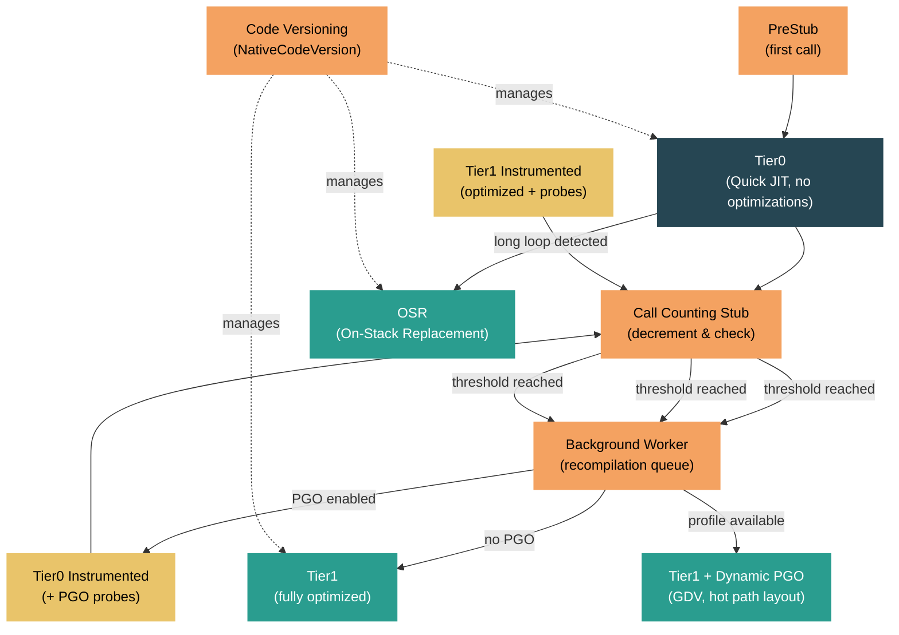

# Level 4: Internals — Tiered Compilation and Dynamic PGO

> **Target profile:** Developer or runtime contributor who wants to understand how the .NET runtime progressively optimizes code at runtime, from quick Tier0 JIT to fully optimized Tier1 with profile-guided optimization
> **Estimated effort:** 6 hours
> **Prerequisites:** [Module 4.3](04-internals-jit.md) (JIT Compiler)
> [Version en espanol](../es/04-internals-tiered-compilation.md)

---

## Learning Objectives

By the end of this module you will be able to:

1. Explain why tiered compilation exists and describe the startup-vs-throughput tradeoff that Tier0 and Tier1 address.
2. Describe how call counting stubs work, including the threshold mechanism and the tiering delay that protects application startup.
3. Explain how the code versioning infrastructure allows multiple native code versions of the same method to coexist safely.
4. Trace the Dynamic PGO pipeline from Tier0 instrumentation through profile data collection to optimized Tier1 compilation with guarded devirtualization.
5. Describe On-Stack Replacement (OSR) and how it enables tiering for methods with long-running loops.
6. Configure and diagnose tiered compilation using `DOTNET_*` environment variables and ETW/EventPipe events.

---

## Concept Map



---

## Curriculum

### Lesson 1 — Why Tiered Compilation

#### What you'll learn

Before .NET Core 3.0, the JIT had a binary choice: either compile a method with full optimizations (slow compile, fast run) or with minimal optimizations (fast compile, slow run). Tiered compilation resolves this conflict by allowing the runtime to compile a method multiple times, starting fast and progressively optimizing the methods that matter.

#### The startup-vs-throughput tradeoff

When an application starts, hundreds or thousands of methods need to be JIT-compiled. Most of them will only execute a handful of times during initialization. Spending time on full optimization for these methods wastes startup time. However, the hot inner loops of your application benefit enormously from inlining, loop unrolling, register allocation, and other expensive optimizations.

Tiered compilation splits the difference:

- **Tier0 (Quick JIT)**: Compile fast with minimal optimizations. The code runs but is not fully optimized. This gets the application running quickly.
- **Tier1 (Optimized)**: For methods that prove to be "hot" through call counting, recompile with full optimizations. The optimized code replaces the Tier0 version.

#### The optimization tier enum

The full set of tiers is defined in `src/coreclr/vm/codeversion.h`:

```cpp
enum OptimizationTier
{
    OptimizationTier0,              // Quick JIT, no optimizations
    OptimizationTier1,              // Fully optimized
    OptimizationTier1OSR,           // Optimized, entered via On-Stack Replacement
    OptimizationTierOptimized,      // Pre-optimized (R2R, aggressive opt)
    OptimizationTier0Instrumented,  // Tier0 + PGO instrumentation probes
    OptimizationTier1Instrumented,  // Tier1 + PGO instrumentation probes
};
```

Note that `OptimizationTierOptimized` is used for methods that are not eligible for tiered compilation -- they receive a single optimized compilation. This includes methods with the `[MethodImpl(MethodImplOptions.AggressiveOptimization)]` attribute and ReadyToRun (R2R) precompiled code.

#### Initial tier selection

The `TieredCompilationManager::GetInitialOptimizationTier` method in `src/coreclr/vm/tieredcompilation.cpp` decides what tier a method starts at:

```cpp
NativeCodeVersion::OptimizationTier TieredCompilationManager::GetInitialOptimizationTier(
    PTR_MethodDesc pMethodDesc)
{
    if (!pMethodDesc->IsEligibleForTieredCompilation())
    {
        return NativeCodeVersion::OptimizationTierOptimized;
    }
    return (NativeCodeVersion::OptimizationTier)g_pConfig->TieredCompilation_DefaultTier();
}
```

A method is eligible for tiered compilation if:
- Tiered compilation is enabled globally (`DOTNET_TieredCompilation=1`, the default)
- The method is not marked `AggressiveOptimization`
- The method is a managed method (not a native stub, intrinsic, etc.)

#### The tiering pipeline at a glance

The full pipeline for a single method looks like this:

1. **First call**: Method hits the PreStub, gets JIT-compiled at Tier0 (quick, unoptimized).
2. **Call counting**: A call counting stub is installed that decrements a counter on each invocation.
3. **Threshold reached**: When the counter hits zero, the method is queued for promotion.
4. **Background recompilation**: A background thread compiles the method at a higher tier.
5. **Code activation**: The new, optimized code replaces the old entry point.

With Dynamic PGO enabled (the default since .NET 8), there is an additional instrumentation step between Tier0 and Tier1 that collects profile data.

#### Source exploration exercise

1. Open `src/coreclr/vm/codeversion.h` and find the `OptimizationTier` enum. Note the six distinct tiers and how `OptimizationTier1OSR` is separate from `OptimizationTier1`.
2. Open `src/coreclr/vm/tieredcompilation.cpp` and read the comment block at lines 17-51 titled "Overall workflow." This is the authoritative description of the tiering pipeline.
3. Open `src/coreclr/inc/clrconfigvalues.h` and search for `TieredCompilation`. Note that it defaults to `1` (enabled).

---

### Lesson 2 — Call Counting and Promotion

#### What you'll learn

The runtime needs a mechanism to determine which methods are "hot" enough to warrant recompilation. This is done through call counting -- each Tier0 method gets a small counting stub that decrements a counter on each invocation. When the counter reaches zero, the method is promoted to a higher tier.

#### Call counting architecture

The call counting system is implemented in `src/coreclr/vm/callcounting.h` and `src/coreclr/vm/callcounting.cpp`. The header contains an extensive design document in its opening comments. The key components are:

**CallCountingInfo**: A data structure associated with each `NativeCodeVersion` being counted. It holds the remaining call count and a pointer to the counting stub.

```cpp
CallCountingManager::CallCountingInfo::CallCountingInfo(
    NativeCodeVersion codeVersion,
    CallCount callCountThreshold)
    : m_codeVersion(codeVersion),
      m_callCountingStub(nullptr),
      m_remainingCallCount(callCountThreshold),
      m_stage(Stage::StubIsNotActive)
{
}
```

**CallCountingStub**: A small piece of hand-written machine code that:
1. Decrements the `m_remainingCallCount` field
2. If nonzero, jumps directly to the method's native code
3. If zero, calls `OnCallCountThresholdReachedStub` to trigger promotion

On x64, there are two stub variants: a short stub that uses IP-relative branches (used when the target code is within 2GB range) and a long stub for distant targets. Other architectures use a single stub type.

#### The call count threshold

The threshold is configured in `src/coreclr/inc/clrconfigvalues.h`:

```cpp
// Debug builds use a low threshold for faster testing
#ifdef _DEBUG
    #define TC_CallCountThreshold (2)
    #define TC_CallCountingDelayMs (1)
#else
    #define TC_CallCountThreshold (30)
    #define TC_CallCountingDelayMs (100)
#endif

RETAIL_CONFIG_DWORD_INFO(EXTERNAL_TC_CallCountThreshold,
    W("TC_CallCountThreshold"), TC_CallCountThreshold,
    "Number of times a method must be called in tier 0 after which it is "
    "promoted to the next tier.")
```

In release builds, a method must be called **30 times** before it is promoted. This can be tuned with `DOTNET_TC_CallCountThreshold`.

#### The tiering delay

During application startup, many methods are called for the first time in rapid succession. Promoting all of them immediately would flood the background compilation queue and compete with startup-critical work. To address this, the runtime implements a **tiering delay**.

When the first Tier0 method is called, `HandleCallCountingForFirstCall` creates a list of methods pending call counting and starts a background worker:

```cpp
void TieredCompilationManager::HandleCallCountingForFirstCall(MethodDesc* pMethodDesc)
{
    // ...
    SArray<MethodDesc *> *methodsPendingCounting = m_methodsPendingCountingForTier1;
    if (methodsPendingCounting != nullptr)
    {
        methodsPendingCounting->Append(pMethodDesc);
        ++m_countOfNewMethodsCalledDuringDelay;
        // ...
    }
}
```

The delay is **100ms** by default (`DOTNET_TC_CallCountingDelayMs`). During this window, new methods are queued but their call counting stubs are not yet installed. Once the delay expires, call counting is activated for all queued methods simultaneously.

On single-processor machines, the delay is multiplied by a configurable factor (`DOTNET_TC_DelaySingleProcMultiplier`) to avoid competing with the application thread for CPU time.

#### The promotion flow

When a call counting stub fires (counter reaches zero), the sequence is:

1. `OnCallCountThresholdReachedStub` (assembly helper) calls into the runtime
2. `CallCountingManager::OnCallCountThresholdReached` enqueues completion of call counting
3. The background worker thread processes the completion, calling `AsyncPromoteToTier1`
4. `AsyncPromoteToTier1` creates a new `NativeCodeVersion` at the target tier and adds it to `m_methodsToOptimize`
5. The background worker calls `OptimizeMethod` which JIT-compiles and activates the new version

#### Source exploration exercise

1. Open `src/coreclr/vm/callcounting.h` and read the "Outline of phases" comment at the top. Follow the three phases: starting call counting, threshold reached, and cleanup.
2. Open `src/coreclr/vm/callcounting.cpp` and find `CallCountingInfo::CallCountingInfo`. Note how `m_remainingCallCount` is initialized with the threshold.
3. Open `src/coreclr/inc/clrconfigvalues.h` and find all the `TC_*` configuration entries. Note the debug vs. release threshold differences.

---

### Lesson 3 — Code Versioning

#### What you'll learn

Tiered compilation means a single method can have multiple native code versions alive simultaneously -- a Tier0 version still running on some threads, a Tier1 version ready to activate, and perhaps an instrumented version in between. The code versioning infrastructure manages these coexisting versions safely.

#### NativeCodeVersion

The core abstraction is `NativeCodeVersion` in `src/coreclr/vm/codeversion.h`. Each instance represents one compiled version of a method:

```cpp
class NativeCodeVersion
{
public:
    PCODE GetNativeCode() const;       // The compiled code pointer
    bool IsFinalTier() const;          // Is this the last tier?

    enum OptimizationTier
    {
        OptimizationTier0,
        OptimizationTier1,
        OptimizationTier1OSR,
        OptimizationTierOptimized,
        OptimizationTier0Instrumented,
        OptimizationTier1Instrumented,
    };

    OptimizationTier GetOptimizationTier() const;
    void SetOptimizationTier(OptimizationTier tier);
};
```

A `NativeCodeVersion` can be the "default" version (the original compilation stored directly in the `MethodDesc`) or a "non-default" version tracked via `NativeCodeVersionNode` objects in a linked list.

#### ILCodeVersion

Above `NativeCodeVersion` sits `ILCodeVersion`, which represents a specific version of a method's IL. Under normal operation there is only one IL version per method, but ReJIT (profiler-driven re-compilation) can create additional IL versions. Each `ILCodeVersion` can have multiple `NativeCodeVersion` children -- for example, one at Tier0 and one at Tier1.

The hierarchy is:

```
MethodDesc
  -> ILCodeVersion (default)
       -> NativeCodeVersion (Tier0)
       -> NativeCodeVersion (Tier0 Instrumented)
       -> NativeCodeVersion (Tier1 + PGO)
  -> ILCodeVersion (ReJIT #1)  [if profiler is attached]
       -> NativeCodeVersion (Tier0)
       -> NativeCodeVersion (Tier1)
```

#### CodeVersionManager

The `CodeVersionManager` is the central coordinator. It owns the lock that protects all code versioning data structures. Both the tiered compilation manager and the call counting manager acquire this lock when modifying code versions.

Key operations:
- `AddNativeCodeVersion`: Creates a new native code version node for a method at a given tier
- `SetActiveNativeCodeVersion`: Switches which version of a method is currently "active" (i.e., the one called by new invocations)

#### How code entry points are updated

When a new Tier1 version is ready, the runtime needs to redirect future calls to the new code. This is done through the method's **precode** -- a small stub at a stable address that indirect-jumps to the current native code. Updating the precode's target is an atomic pointer write, so it is safe even while other threads are calling the old version.

The `ActivateCodeVersion` method in `src/coreclr/vm/tieredcompilation.cpp` handles this:

```cpp
void TieredCompilationManager::OptimizeMethod(NativeCodeVersion nativeCodeVersion)
{
    if (CompileCodeVersion(nativeCodeVersion))
    {
        ActivateCodeVersion(nativeCodeVersion);
    }
}
```

Threads already executing the old Tier0 code will continue running it until they return. New calls go through the updated precode and land in the Tier1 code. There is no need to pause or synchronize threads for the transition.

#### The IsFinalTier check

Before queuing a method for promotion, the runtime checks `IsFinalTier()`:

```cpp
_ASSERTE(!currentNativeCodeVersion.IsFinalTier());
```

A code version is "final" if it is at `OptimizationTier1`, `OptimizationTier1OSR`, or `OptimizationTierOptimized`. These versions will not be promoted further. Instrumented tiers (`Tier0Instrumented`, `Tier1Instrumented`) are not final -- they exist only to collect profile data and will be promoted once data is collected.

#### Source exploration exercise

1. Open `src/coreclr/vm/codeversion.h` and trace the class hierarchy: `NativeCodeVersion` -> `NativeCodeVersionNode` -> `MethodDescVersioningState` -> `CodeVersionManager`.
2. In the same file, find `IsFinalTier()` and verify which optimization tiers are considered final.
3. Open `src/coreclr/vm/tieredcompilation.cpp` and find `OptimizeMethod`. Trace the call to `CompileCodeVersion` and `ActivateCodeVersion`.

---

### Lesson 4 — Dynamic PGO

#### What you'll learn

Dynamic Profile-Guided Optimization (Dynamic PGO) is the most impactful tiered compilation feature. Instead of jumping straight from Tier0 to Tier1, the runtime inserts an instrumented tier that collects runtime profile data -- branch probabilities, call target frequencies, type distributions. The Tier1 JIT then uses this data to make dramatically better optimization decisions.

#### The Dynamic PGO pipeline

With Dynamic PGO enabled (`DOTNET_TieredPGO=1`, the default since .NET 8), the promotion path for a typical method becomes:

1. **Tier0**: Quick JIT, no optimizations, no instrumentation
2. **Call count threshold reached**: Method is queued for promotion
3. **Tier0 Instrumented** (or Tier1 Instrumented for R2R code): The method is recompiled with instrumentation probes inserted
4. **Call count threshold reached again**: Method is queued for final promotion
5. **Tier1 + PGO data**: The method is compiled with full optimizations, using the collected profile data

The tier selection logic is in `TieredCompilationManager::AsyncPromoteToTier1`:

```cpp
if (g_pConfig->TieredPGO())
{
    if (currentNativeCodeVersion.GetOptimizationTier() == NativeCodeVersion::OptimizationTier0 &&
        g_pConfig->TieredPGO_InstrumentOnlyHotCode())
    {
        if (ExecutionManager::IsReadyToRunCode(currentNativeCodeVersion.GetNativeCode()))
        {
            // R2R -> optimized instrumented tier (to avoid regression)
            nextTier = NativeCodeVersion::OptimizationTier1Instrumented;
        }
        else
        {
            // JIT Tier0 -> unoptimized instrumented tier (better profiles)
            nextTier = NativeCodeVersion::OptimizationTier0Instrumented;
        }
    }
}
```

Note the distinction between R2R and JIT-compiled code:
- **R2R code** goes to `Tier1Instrumented` (optimized + probes) because dropping from fast R2R to slow unoptimized instrumented code would cause a noticeable regression.
- **JIT Tier0 code** goes to `Tier0Instrumented` (unoptimized + probes) because it produces better profile data -- the JIT can instrument inlinees since it has not yet inlined anything.

#### Profile instrumentation in the JIT

The JIT's profile instrumentation is implemented in `src/coreclr/jit/fgprofile.cpp`. When compiling an instrumented tier, the JIT inserts two types of probes:

**Edge count probes**: The `EfficientEdgeCountInstrumentor` inserts counters on control-flow edges. Rather than instrumenting every edge (which would be expensive), it uses a minimum spanning tree algorithm -- only non-tree edges need counters, and tree-edge counts can be reconstructed mathematically.

```cpp
schemaElem.InstrumentationKind = m_compiler->opts.compCollect64BitCounts
    ? ICorJitInfo::PgoInstrumentationKind::EdgeLongCount
    : ICorJitInfo::PgoInstrumentationKind::EdgeIntCount;
```

**Type/method profile probes**: For virtual calls and delegate invocations, the JIT inserts probes that record the actual types and methods seen at each call site. This is the data that enables guarded devirtualization (GDV).

#### PgoManager: storing and retrieving profile data

The `PgoManager` class in `src/coreclr/vm/pgo.h` and `src/coreclr/vm/pgo.cpp` is responsible for storing and retrieving PGO data. Each `LoaderAllocator` has its own PGO data, and the data is keyed by `MethodDesc`.

```cpp
class PgoManager
{
public:
    static HRESULT getPgoInstrumentationResults(
        MethodDesc* pMD,
        BYTE **pAllocatedData,
        ICorJitInfo::PgoInstrumentationSchema** ppSchema,
        UINT32 *pCountSchemaItems,
        BYTE** pInstrumentationData,
        ICorJitInfo::PgoSource* pPgoSource);

    static HRESULT allocPgoInstrumentationBySchema(
        MethodDesc* pMD,
        ICorJitInfo::PgoInstrumentationSchema* pSchema,
        UINT32 countSchemaItems,
        BYTE** pInstrumentationData);
};
```

When the JIT compiles an instrumented method, it calls `allocPgoInstrumentationBySchema` to allocate memory for the counters. During instrumented execution, the counters are incremented directly in-place. When the method is later promoted to Tier1, the JIT calls `getPgoInstrumentationResults` to read back the collected data.

The JIT checks whether profile data is available and trustworthy in `src/coreclr/jit/fgprofile.cpp`:

```cpp
bool Compiler::fgHaveProfileData()
{
    return (fgPgoSchema != nullptr);
}

bool Compiler::fgHaveTrustedProfileWeights()
{
    switch (fgPgoSource)
    {
        case ICorJitInfo::PgoSource::Dynamic:  // from instrumentation
        case ICorJitInfo::PgoSource::Blend:    // merged sources
        case ICorJitInfo::PgoSource::Text:     // from text file
            return true;
        default:
            return false;
    }
}
```

#### Guarded devirtualization (GDV)

The most visible optimization enabled by Dynamic PGO is **guarded devirtualization**. When the type profile at a virtual call site shows that a particular type dominates (e.g., 95% of calls go to `ConcreteClass.Method`), the JIT generates a type check followed by a direct call:

```csharp
// Before GDV (virtual dispatch)
obj.VirtualMethod();

// After GDV (pseudo-code the JIT generates)
if (obj.GetType() == typeof(ConcreteClass))
    ConcreteClass.Method(obj);  // direct call, can be inlined
else
    obj.VirtualMethod();        // fallback to virtual dispatch
```

The direct call can then be inlined, which unlocks further optimizations like constant folding and dead code elimination within the inlined body. This is often the single largest performance win from Dynamic PGO.

#### Source exploration exercise

1. Open `src/coreclr/vm/tieredcompilation.cpp` and find the `AsyncPromoteToTier1` method. Trace the `#ifdef FEATURE_PGO` block to understand how the runtime chooses between `Tier0Instrumented` and `Tier1Instrumented`.
2. Open `src/coreclr/jit/fgprofile.cpp` and search for `EfficientEdgeCountInstrumentor`. Read how it instruments edges rather than blocks.
3. Open `src/coreclr/vm/pgo.h` and read the `PgoManager` class interface. Note the `getPgoInstrumentationResults` and `allocPgoInstrumentationBySchema` methods.
4. In `src/coreclr/jit/fgprofile.cpp`, search for `ClassProfile` and `MethodProfile` to see how type-profile probes are added.

---

### Lesson 5 — On-Stack Replacement (OSR)

#### What you'll learn

Tiered compilation has a blind spot: methods with long-running loops. A method that enters a tight loop at Tier0 will spend all its time in the unoptimized version -- call counting only fires when the method is called, not while it is executing. On-Stack Replacement (OSR) solves this by allowing the runtime to replace a running method's code while it is still executing, mid-loop.

#### The problem: Tier0 loop traps

Consider a method like:

```csharp
void ProcessAll(List<Item> items)
{
    foreach (var item in items)  // may iterate millions of times
    {
        Process(item);
    }
}
```

At Tier0, this loop runs without any optimizations. The call counting stub only triggers when `ProcessAll` itself is called. If `ProcessAll` is called once with a million items, it will spend its entire execution in Tier0 code -- the call counting threshold is never reached from inside the loop.

#### Patchpoints

OSR works by inserting **patchpoints** at the back-edges of loops during Tier0 compilation. A patchpoint is a call to the `JIT_HELP_PATCHPOINT` helper at a specific IL offset. The helper tracks how many times the patchpoint has been hit.

The `PerPatchpointInfo` structure in `src/coreclr/vm/onstackreplacement.h` tracks the state:

```cpp
struct PerPatchpointInfo
{
    PCODE m_osrMethodCode;      // The OSR method entry point (NULL initially)
    LONG m_patchpointCount;     // Hit counter
    LONG m_flags;               // patchpoint_triggered, patchpoint_invalid

    enum
    {
        patchpoint_triggered = 0x1,
        patchpoint_invalid = 0x2
    };
};
```

Each time the loop's back-edge is executed, the patchpoint counter increments. Two configuration values control the behavior (from `src/coreclr/inc/clrconfigvalues.h`):

```
DOTNET_OSR_CounterBump = 1000   // Counter reload value when a patchpoint is hit
DOTNET_OSR_HitLimit = 10        // Number of callbacks before triggering OSR
```

Once the hit limit is reached, the runtime JIT-compiles an OSR version of the method. This version is compiled at `OptimizationTier1OSR` and includes the full set of optimizations. The OSR version is specialized to enter at the specific IL offset of the patchpoint, with all local variables and stack state transferred from the Tier0 frame.

#### OnStackReplacementManager

The `OnStackReplacementManager` in `src/coreclr/vm/onstackreplacement.h` manages the mapping from patchpoints to their per-patchpoint state. It uses a hash table keyed by the combination of function start address and IL offset:

```cpp
class OnStackReplacementManager
{
public:
    static void StaticInitialize();
    PerPatchpointInfo* GetPerPatchpointInfo(PCODE funcStart, int ilOffset);

private:
    JitPatchpointTable m_jitPatchpointTable;
};
```

It is initialized at runtime startup in `ceemain.cpp`:

```cpp
OnStackReplacementManager::StaticInitialize();
```

#### The OSR transition

When the patchpoint fires and the OSR method is ready, the transition happens:

1. The Tier0 patchpoint helper detects that `m_osrMethodCode` is now set
2. The runtime constructs a new stack frame for the OSR method, transferring local variable values
3. Execution jumps into the OSR method at the patchpoint's IL offset
4. The Tier0 frame is abandoned (it will be cleaned up when the stack unwinds)

The `PatchpointInfo` structure (defined under `FEATURE_ON_STACK_REPLACEMENT` in `codeversion.h`) captures the mapping of local variable locations between the Tier0 and OSR frames, ensuring that all state is preserved across the transition.

#### Quick JIT for loops

By default, Tier0 Quick JIT handles methods with loops. This is controlled by `DOTNET_TC_QuickJitForLoops` (default: `1` on non-debug builds). When enabled, methods with loops are compiled at Tier0 with patchpoints. When disabled, methods with loops skip Tier0 entirely and go straight to optimized compilation.

#### Source exploration exercise

1. Open `src/coreclr/vm/onstackreplacement.h` and read the `PerPatchpointInfo` structure. Note the `m_patchpointCount` and `m_osrMethodCode` fields.
2. Open `src/coreclr/vm/onstackreplacement.cpp` and read `GetPerPatchpointInfo`. Trace how it lazily creates patchpoint tracking entries.
3. In `src/coreclr/inc/clrconfigvalues.h`, find `OSR_CounterBump` and `OSR_HitLimit`. Consider why the hit limit is 10 rather than 1 -- compiling an OSR method is expensive, and the runtime wants to be sure the loop is genuinely long-running before investing in it.

---

### Lesson 6 — Configuration and Diagnostics

#### What you'll learn

Tiered compilation and Dynamic PGO expose a rich set of configuration knobs and diagnostic events. This lesson covers the most important settings, how to observe tiering behavior in real applications, and how to troubleshoot common issues.

#### Essential configuration variables

All tiered compilation settings are defined in `src/coreclr/inc/clrconfigvalues.h`. The most important ones:

| Variable | Default | Description |
|----------|---------|-------------|
| `DOTNET_TieredCompilation` | `1` | Master switch for tiered compilation |
| `DOTNET_TC_QuickJit` | `1` | Enable Tier0 quick JIT (if disabled, all methods go straight to optimized) |
| `DOTNET_TC_QuickJitForLoops` | `1` (release) | Allow quick JIT for methods with loops (enables OSR) |
| `DOTNET_TC_CallCountThreshold` | `30` (release) | Number of calls before promotion |
| `DOTNET_TC_CallCountingDelayMs` | `100` (release) | Startup tiering delay in milliseconds |
| `DOTNET_TieredPGO` | `1` | Enable Dynamic PGO instrumentation |
| `DOTNET_TieredPGO_InstrumentOnlyHotCode` | `1` | Only instrument methods that reach call count threshold |
| `DOTNET_OSR_CounterBump` | `1000` | Counter reload value when a patchpoint is hit |
| `DOTNET_OSR_HitLimit` | `10` | Number of patchpoint callbacks before triggering OSR |

#### Disabling tiered compilation

For debugging or benchmarking, you may want to disable tiering entirely:

```bash
# Disable all tiered compilation -- every method compiled with full optimizations
export DOTNET_TieredCompilation=0

# Disable only Dynamic PGO -- still use tiering but skip instrumentation
export DOTNET_TieredPGO=0

# Disable Quick JIT -- every method goes directly to optimized (no Tier0)
export DOTNET_TC_QuickJit=0
```

Be aware that `DOTNET_TieredCompilation=0` will increase startup time significantly, as every method gets fully optimized on first call.

#### Observing tiering with ETW/EventPipe

The runtime emits ETW (Windows) and EventPipe (cross-platform) events for tiered compilation. The key events are:

**TieredCompilation/Pause and Resume**: Fired when the tiering delay starts and ends.

**MethodJittingStarted**: Includes the optimization tier, allowing you to distinguish Tier0 vs. Tier1 compilations.

**MethodLoad / MethodLoadVerbose**: Includes the `OptimizationTier` field, telling you what tier the loaded code is at.

To capture tiering events:

```bash
# Capture JIT events including tier information
dotnet-trace collect --process-id <PID> \
    --providers Microsoft-Windows-DotNETRuntime:0x10:5
```

The JIT keyword mask `0x10` captures JIT compilation events. Verbose level 5 includes the optimization tier.

#### Using dotnet-counters for tiering metrics

```bash
dotnet-counters monitor --process-id <PID> \
    --counters System.Runtime[methods-jitted-count,time-in-jit,il-bytes-jitted]
```

Watch for:
- **`methods-jitted-count`** increasing in bursts: This indicates the tiering delay has expired and a batch of methods is being promoted.
- **`time-in-jit`** spikes: Background Tier1 recompilation is happening.

#### Diagnostic JIT dumps

For deep investigation, the JIT can dump its intermediate representation. Set:

```bash
# Dump JIT output for a specific method
export DOTNET_JitDump=MethodName

# Show optimization tier in JIT dump output
export DOTNET_JitDisasmTiers=1
```

The JIT dump will show which tier is being compiled and, for Tier1, whether PGO data was available:

```
; Tier-1 compilation
; optimized using Dynamic PGO
; edge weights are valid
; 2 classes profiled at 1 call site
```

#### Troubleshooting common scenarios

**Scenario: Application startup is slow**
- Check if tiered compilation is disabled (`DOTNET_TieredCompilation=0`). Re-enable it.
- If many methods have loops, ensure `TC_QuickJitForLoops` is enabled.
- Consider increasing `TC_CallCountingDelayMs` if background compilation is interfering with startup.

**Scenario: Steady-state performance is worse than expected**
- Ensure `DOTNET_TieredPGO=1` (default) -- Dynamic PGO significantly improves Tier1 quality.
- Check that hot methods are actually reaching Tier1. Use ETW events to verify.
- If methods are not reaching the call count threshold, consider lowering `TC_CallCountThreshold`.

**Scenario: A specific method is not being optimized**
- Verify it is eligible for tiered compilation (not `AggressiveOptimization`, not a stub).
- Check if it is a loop-heavy method that might need OSR rather than call-count-based promotion.
- Use `DOTNET_JitDump=MethodName` to see what tier it compiles at.

#### Source exploration exercise

1. Open `src/coreclr/inc/clrconfigvalues.h` and search for all `TC_`, `TieredPGO`, and `OSR_` entries. Count the total number of tiering-related configuration knobs.
2. In `src/coreclr/vm/tieredcompilation.cpp`, search for `ETW::CompilationLog::TieredCompilation`. Note where Pause and Resume events are emitted.
3. Try running a simple .NET application with `DOTNET_TC_CallCountThreshold=2` and `DOTNET_JitDisasmTiers=1` to observe rapid promotion.

---

## Self-Assessment Questions

1. Why does the runtime use a tiering delay during startup instead of immediately installing call counting stubs?
2. A method is called 1,000 times per second but has never been promoted to Tier1. What could explain this?
3. Why does R2R code go to `Tier1Instrumented` while JIT Tier0 code goes to `Tier0Instrumented` during Dynamic PGO?
4. Explain how guarded devirtualization (GDV) uses type profile data to convert a virtual call into a direct call.
5. A method contains a `while (true)` loop that runs for minutes. Without OSR, what tier does it execute at? With OSR, describe the transition.
6. You see that `DOTNET_TieredPGO=0` improved performance for a specific workload. What might explain this?
7. How does the code versioning infrastructure ensure that threads running old Tier0 code are not disrupted when Tier1 code is activated?

---

## Key Source File Map

| File | What it contains |
|------|-----------------|
| `src/coreclr/vm/tieredcompilation.h` | `TieredCompilationManager` class declaration -- orchestrates the tiering pipeline |
| `src/coreclr/vm/tieredcompilation.cpp` | Implementation: tiering delay, promotion queue, background worker, `OptimizeMethod` |
| `src/coreclr/vm/callcounting.h` | `CallCountingManager` and call counting stub design document |
| `src/coreclr/vm/callcounting.cpp` | Call counting stub creation, threshold reached handling, stub cleanup |
| `src/coreclr/vm/codeversion.h` | `NativeCodeVersion`, `ILCodeVersion`, `CodeVersionManager` -- code versioning infrastructure |
| `src/coreclr/vm/codeversion.cpp` | Code versioning implementation, `AddNativeCodeVersion` |
| `src/coreclr/vm/pgo.h` | `PgoManager` -- stores and retrieves profile data for Dynamic PGO |
| `src/coreclr/vm/pgo.cpp` | PGO data management, text format import/export |
| `src/coreclr/jit/fgprofile.cpp` | JIT-side profile instrumentation: edge counts, type profiles, GDV probes |
| `src/coreclr/vm/onstackreplacement.h` | `OnStackReplacementManager`, `PerPatchpointInfo` |
| `src/coreclr/vm/onstackreplacement.cpp` | OSR patchpoint tracking and management |
| `src/coreclr/inc/clrconfigvalues.h` | All `DOTNET_*` configuration knobs for tiering, PGO, and OSR |

---

## Further Reading

- [Tiered Compilation Design Doc](docs/design/coreclr/botr/tiered-compilation.md) -- the original design document
- [Dynamic PGO blog post](https://devblogs.microsoft.com/dotnet/performance_improvements_in_net_7/#pgo) -- detailed explanation from the .NET team
- [On-Stack Replacement Design](docs/design/coreclr/botr/on-stack-replacement.md) -- OSR design document
- [.NET Runtime Configuration](https://learn.microsoft.com/en-us/dotnet/core/runtime-config/compilation) -- official documentation for JIT and tiering settings
- [Andy Ayers' blog posts on PGO](https://devblogs.microsoft.com/dotnet/author/andya/) -- from the engineer who implemented Dynamic PGO
