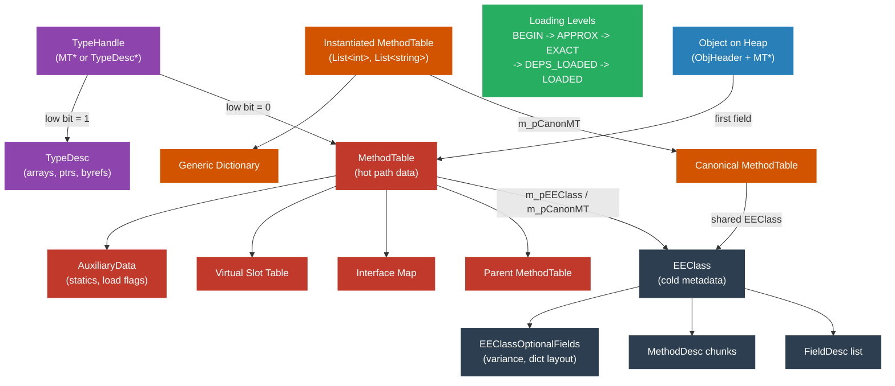

# Level 4: Internals — The Type System: MethodTable, EEClass, and TypeDesc

> **Target profile:** Runtime contributor or advanced debugger who needs to understand how the CLR represents types in memory at the native VM layer
> **Estimated effort:** 10 hours
> **Prerequisites:** [Module 4.1](04-internals-jit.md), Level 3 modules
> [Version en espanol](../es/04-internals-type-system.md)
> **Difficulty:** Source reading guide difficulty level 4-5 out of 5

---

## Learning Objectives

By the end of this module you will be able to:

1. Diagram the memory layout of a managed object on the GC heap, including ObjHeader, MethodTable pointer, and instance field data.
2. Enumerate the critical fields of a MethodTable and explain what each encodes: flags, base size, virtual slot count, interface count, parent pointer, and the EEClass/CanonMT union.
3. Explain why the runtime splits type metadata between MethodTable (hot) and EEClass (cold), and list the data that lives on each side of the split.
4. Describe how TypeDesc and its subclasses (ParamTypeDesc, TypeVarTypeDesc, FnPtrTypeDesc) represent types that are not plain classes or structs.
5. Trace the five class-loading levels (CLASS_LOAD_BEGIN through CLASS_LOADED) and explain why multi-phase loading is necessary for recursive and generic types.
6. Explain how generic type instantiations produce per-instantiation MethodTables, when EEClasses are shared across compatible instantiations, and how generic dictionaries provide instantiation-specific data to shared code.

---

## Concept Map



---

## Curriculum

### Lesson 1 -- Object Layout in Memory

#### What you'll learn

Every managed object on the GC heap has a precise, predictable layout. Understanding this layout is essential for debugging memory corruption, interpreting SOS/DAC output, and reading GC source code. The layout is simpler than most people expect.

#### The object header

Every heap object is preceded by an **ObjHeader**, which sits at a _negative_ offset from the object reference itself. In `src/coreclr/vm/object.h` (line 86-93), the size is defined:

```cpp
#ifdef TARGET_64BIT
#define OBJHEADER_SIZE      (sizeof(DWORD) /* m_alignpad */ + sizeof(DWORD) /* m_SyncBlockValue */)
#else
#define OBJHEADER_SIZE      sizeof(DWORD) /* m_SyncBlockValue */
#endif
```

On 64-bit systems, the ObjHeader is 8 bytes (4-byte alignment pad + 4-byte sync block index). On 32-bit, it is 4 bytes. The sync block index is used to attach extra data to an object -- lock state, COM interop information, hash codes. Most objects have a sync block index of zero, meaning no SyncBlock has been allocated.

When code says "object reference" it means a pointer to the start of the `Object` structure, which is _after_ the ObjHeader. The GC sees the ObjHeader at a negative offset.

#### The MethodTable pointer

The very first field at the object reference is the MethodTable pointer, defined in `src/coreclr/vm/object.h` (line 126-131):

```cpp
class Object
{
  protected:
    PTR_MethodTable m_pMethTab;
    // ... instance fields follow
};
```

This single pointer is what allows the runtime to determine the type of any object. The GC uses it to know the size and GC layout of the object. Virtual method dispatch reads the vtable from it. Casting checks it. Reflection follows it to metadata.

During GC, the low bit of `m_pMethTab` can be temporarily set as a mark bit (`MARKED_BIT = 0x1`). The `GetMethodTable()` accessor asserts this bit is clear during normal operation; `GetGCSafeMethodTable()` masks it off.

#### Object size calculation

The comment in `object.h` (line 67-73) explains the universal size formula:

```
MT->GetBaseSize() + (OBJECTTYPEREF->GetSizeField() * MT->GetComponentSize())
```

For fixed-size objects (ordinary classes and structs), `ComponentSize` is zero, so the size is simply `BaseSize`. For arrays and strings, `ComponentSize` is the per-element size, and `GetSizeField()` returns the element count from the `m_NumComponents` field that immediately follows `m_pMethTab`.

The minimum object size is defined as:

```cpp
#define MIN_OBJECT_SIZE     (2*TARGET_POINTER_SIZE + OBJHEADER_SIZE)
```

On 64-bit, that is 24 bytes (8 ObjHeader + 8 MethodTable pointer + 8 minimum). This ensures even an empty object is large enough for the GC's free-list mechanism.

#### Putting it all together: memory layout diagram

```
             ┌──────────────────────────┐
             │  ObjHeader (sync block)  │  ← negative offset from obj ref
             │  (4 or 8 bytes)          │
obj ref ──>  ├──────────────────────────┤
             │  MethodTable*            │  ← m_pMethTab (pointer-sized)
             ├──────────────────────────┤
             │  [m_NumComponents]       │  ← only for arrays/strings
             ├──────────────────────────┤
             │  Instance field 1        │
             │  Instance field 2        │
             │  ...                     │
             └──────────────────────────┘
```

#### Source exploration exercise

1. Open `src/coreclr/vm/object.h` and read the `Object` class. Note that `m_pMethTab` is the only declared field -- instance data is laid out by the type loader beyond the fixed fields.
2. Search for `OBJHEADER_SIZE` and `OBJECT_BASESIZE` in the same file. Verify the sizes for your platform.
3. Open `src/coreclr/vm/syncblk.h` and look at the `ObjHeader` class. Notice that it lives at offset `-OBJHEADER_SIZE` from the object.

---

### Lesson 2 -- MethodTable: The Runtime's Type Descriptor

#### What you'll learn

MethodTable is the central data structure of the CLR type system. It is the "hot" structure -- the one that is accessed on virtually every operation involving an object. The comment at line 947-956 of `methodtable.h` summarizes it:

> A MethodTable is the fundamental representation of type in the runtime. It is this structure that objects point at. It holds the size and GC layout of the type, as well as the dispatch table for virtual dispatch.

#### Critical fields

The private fields of MethodTable are declared starting at line 3951 of `src/coreclr/vm/methodtable.h`. Here are the most important ones:

| Field | Type | Purpose |
|-------|------|---------|
| `m_dwFlags` | `DWORD` | Primary flags. Low WORD is component size for arrays/strings (`HasComponentSize()`). |
| `m_BaseSize` | `DWORD` | Total allocated size including ObjHeader, for fixed-size objects. |
| `m_dwFlags2` | `DWORD` | Secondary flags (`WFLAGS2_ENUM`). |
| `m_wNumVirtuals` | `WORD` | Number of virtual method slots. |
| `m_wNumInterfaces` | `WORD` | Number of implemented interfaces. |
| `m_pParentMethodTable` | `PTR_MethodTable` | Parent class's MethodTable (null for `System.Object`). |
| `m_pModule` | `PTR_Module` | The module that defines this type. |
| `m_pAuxiliaryData` | `PTR_MethodTableAuxiliaryData` | Statics, load-state flags, and non-virtual slots. |
| `m_pEEClass` / `m_pCanonMT` | union | Points to EEClass (canonical MT) or to the canonical MethodTable (instantiated generics). |
| `m_pPerInstInfo` / `m_ElementTypeHnd` | union | Generic dictionaries or array element type. |
| `m_pInterfaceMap` | `PTR_InterfaceInfo` | Array of `InterfaceInfo_t` for each implemented interface. |

After the fixed fields, the MethodTable contains variable-length data in this order:

1. **Virtual slot table** -- one pointer-sized entry per virtual method
2. **Optional members** -- rare data (extra interface info)
3. **PerInstInfo** -- pointers to generic dictionaries (for generic types)
4. **Interface map** -- `InterfaceInfo_t` array
5. **Generic instantiation and dictionary** -- type arguments and cached lookups

#### The EEClass/CanonMT union

This is one of the most important design details in the runtime. The field `m_pCanonMT` (which shares storage with `m_pEEClass`) uses the low bit to discriminate:

```cpp
enum LowBits {
    UNION_EECLASS     = 0,   // pointer to EEClass. This MT is the canonical MT.
    UNION_METHODTABLE = 1,   // pointer to canonical MethodTable.
};
```

- If the low bit is 0, this MethodTable IS the canonical one, and the pointer goes directly to its EEClass.
- If the low bit is 1, this is an instantiated generic MethodTable, and the pointer (with the low bit masked off) leads to the canonical MethodTable, which in turn points to the shared EEClass.

The inline accessor in `methodtable.inl` (line 27-56) shows the two-step lookup:

```cpp
FORCEINLINE PTR_EEClass MethodTable::GetClassWithPossibleAV()
{
    TADDR addr = m_pCanonMT;
    LowBits lowBits = union_getLowBits(addr);
    if (lowBits == UNION_EECLASS)
    {
        return PTR_EEClass(addr);
    }
    else
    {
        TADDR canonicalMethodTable = union_getPointer(addr);
        return PTR_MethodTable(canonicalMethodTable)->m_pEEClass;
    }
}
```

#### The virtual slot table

Virtual method dispatch works by indexing into the vtable embedded in the MethodTable. The slot count is `m_wNumVirtuals`. Each slot holds a pointer to the entry point of a MethodDesc. Interface dispatch uses a different mechanism (Virtual Stub Dispatch), but the vtable is the foundation for class-hierarchy virtual calls.

#### AuxiliaryData: where load state lives

The `MethodTableAuxiliaryData` structure (line 315 of `methodtable.h`) holds per-type flags that change over the lifetime of the type:

- `enum_flag_Initialized` -- the class's static constructor has run
- `enum_flag_IsNotFullyLoaded` -- the type is still being loaded
- `enum_flag_HasApproxParent` -- the parent pointer is approximate (not yet exact)
- `enum_flag_DependenciesLoaded` -- all type dependencies are loaded

This separation from MethodTable itself is intentional: these flags are written to during class initialization and loading, while the MethodTable core fields are effectively immutable after loading completes.

#### Source exploration exercise

1. Open `src/coreclr/vm/methodtable.h`, go to line 3951, and read the private field declarations through line 4014. Map each field to the table above.
2. In `methodtable.inl`, read `GetClassWithPossibleAV()` and `GetClass()`. Understand the low-bit tagging scheme.
3. Search for `cdac_data<MethodTable>` at the bottom of `methodtable.h` (line 4140). This gives you the exact offsets used by the diagnostic data-access layer -- useful for debugger tool development.

---

### Lesson 3 -- EEClass: The Shared Type Metadata

#### What you'll learn

The split between MethodTable and EEClass is one of the most important architectural decisions in the CLR. The comment at the top of `class.h` (line 10-20) is explicit about the motivation:

> NOTE: Even though EEClass is considered to contain cold data (relative to MethodTable), these data structures *are* touched (especially during startup as part of soft-binding). As a result, and given the number of EEClasses allocated for large assemblies, the size of this structure can have a direct impact on performance, especially startup performance.

#### Why the split?

The runtime separates type metadata into two tiers:

1. **MethodTable (hot):** Data accessed on every object operation -- GC layout, virtual dispatch, casting. Lives in the working set.
2. **EEClass (cold):** Data accessed only during reflection, class loading, debugging, and uncommon operations. Kept out of the working set to reduce memory pressure.

The design guideline from `class.h` (line 681-693) is clear:

> At compile-time, we are happy to touch both MethodTable and EEClass. However, at runtime we want to restrict ourselves to the MethodTable. This is critical for common code paths, where we want to keep the EEClass out of our working set. For uncommon code paths, like throwing exceptions or strange Contexts issues, it's okay to access the EEClass.

If you are writing runtime code and calling `GetClass()`, you should stop and ask whether you really need EEClass data, or if MethodTable already has what you need.

#### EEClass fields

The private fields (line 1669-1711 of `class.h`) include:

| Field | Type | Purpose |
|-------|------|---------|
| `m_rpOptionalFields` | `PTR_EEClassOptionalFields` | Pointer to rarely-used fields (variance, dictionary layout, COM interop). |
| `m_pMethodTable` | `PTR_MethodTable` | Back-pointer to the canonical MethodTable. Used only by SOS/debugging. |
| `m_pFieldDescList` | `PTR_FieldDesc` | Array of field descriptors for all fields in the type. |
| `m_pChunks` | `PTR_MethodDescChunk` | Linked list of MethodDesc chunks holding all method descriptors. |
| `m_dwAttrClass` | `DWORD` | TypeDef attributes from metadata (sealed, abstract, interface, visibility). |
| `m_VMFlags` | `DWORD` | Runtime-specific flags (has finalizer, has layout, etc.). |
| `m_NormType` | `BYTE` | The normalized `CorElementType` of this type. |
| `m_cbBaseSizePadding` | `BYTE` | Padding bytes included in MethodTable's BaseSize. |
| `m_NumInstanceFields` | `WORD` | Count of instance fields. |
| `m_NumMethods` | `WORD` | Total method count. |
| `m_NumStaticFields` | `WORD` | Count of static fields. |
| `m_NumNonVirtualSlots` | `WORD` | Count of non-virtual method slots. |

#### EEClassOptionalFields

To keep EEClass small, rarely-needed data is pushed into `EEClassOptionalFields` (line 604-665 of `class.h`). This includes:

- `m_pDictLayout` -- The DictionaryLayout for generic types, describing what slots are needed beyond the type arguments.
- `m_pVarianceInfo` -- Per-type-parameter variance annotations (covariant, contravariant, none). Only allocated for generic types with variance.

An EEClass only allocates this optional block if it needs at least one of these fields.

#### EEClass sharing with generics

A key consequence of the MethodTable/EEClass split: for generic types, the EEClass is **shared** across compatible instantiations. From `class.h` (line 667-676):

> For most types there is a one-to-one mapping between MethodTable* and EEClass*. However this is not the case for instantiated types where code and representation are shared between compatible instantiations (e.g. List<string> and List<object>). Then a single EEClass structure is shared between multiple MethodTable structures.

This means `List<string>` and `List<object>` have different MethodTables but point to the same EEClass. The MethodTable holds the instantiation-specific data (type arguments, interface map with instantiated interfaces), while the EEClass holds what is common (method descriptors, field descriptors, attribute flags).

#### The allocation of EEClass

EEClass instances are allocated on the `LoaderHeap` (line 35-53 of `class.cpp`):

```cpp
void *EEClass::operator new(size_t size, LoaderHeap *pHeap, AllocMemTracker *pamTracker)
{
    void *p = pamTracker->Track(pHeap->AllocMem(S_SIZE_T(size)));
    return p;
}
```

The memory comes from VirtualAlloc and is never individually freed -- it lives as long as the LoaderAllocator (and thus the Assembly or AssemblyLoadContext) is alive. This is why unloading requires AssemblyLoadContext: there is no per-type deallocation.

#### Source exploration exercise

1. Open `src/coreclr/vm/class.h` and read the comment block from line 667 to 713. This is the definitive explanation of the EEClass/MethodTable relationship.
2. Read the private field declarations from line 1669-1711. Match them against the table above.
3. Open `src/coreclr/vm/class.h` line 604 and read `EEClassOptionalFields`. Note how `m_pDictLayout` and `m_pVarianceInfo` are stored here to keep the base EEClass small.

---

### Lesson 4 -- TypeDesc: Arrays, Pointers, and Type Parameters

#### What you'll learn

Not every type in the CLR can be represented by a MethodTable. The TypeDesc hierarchy handles the "edge cases" that are actually quite common: byref types, pointer types, function pointer types, and generic type parameters.

#### TypeHandle: the universal type identity

Before diving into TypeDesc, you need to understand TypeHandle. From `typehandle.h` (line 53-63):

> A TypeHandle is the FUNDAMENTAL concept of type identity in the CLR. Two types are equal if and only if their type handles are equal. A TypeHandle is a pointer-sized structure that encodes everything you need to know about what kind of type you are dealing with.

A TypeHandle can point at:

1. **A MethodTable** -- for classes, structs, arrays, and generic instantiations
2. **A TypeDesc** -- for byrefs, pointers, function pointers, and generic type parameters

The disambiguation is done with the low bit. If the low bit is set (which is impossible for a normally-aligned pointer), the TypeHandle is a TypeDesc. The TypeDesc itself stores a `CorElementType` in its low byte to further discriminate.

#### The TypeDesc base class

Defined in `src/coreclr/vm/typedesc.h` (line 31-213), TypeDesc is a compact base:

```cpp
class TypeDesc
{
public:
    // Low 8 bits: CorElementType discriminator
    // Higher bits: flags (IsCollectible, IsNotFullyLoaded, HasTypeEquivalence, etc.)
    DWORD _typeAndFlags;

    // Runtime type object handle
    RUNTIMETYPEHANDLE _exposedClassObject;
};
```

The `CorElementType` stored in the low byte tells you exactly what kind of TypeDesc this is:
- `ELEMENT_TYPE_BYREF` -- a byref (`ref int`)
- `ELEMENT_TYPE_PTR` -- a pointer (`int*`)
- `ELEMENT_TYPE_FNPTR` -- a function pointer (`delegate*<int, void>`)
- `ELEMENT_TYPE_VAR` -- a class-level generic type parameter (`T` in `class Foo<T>`)
- `ELEMENT_TYPE_MVAR` -- a method-level generic type parameter (`T` in `void Bar<T>()`)

#### ParamTypeDesc: byrefs and pointers

For types that modify another type (byref, pointer), `ParamTypeDesc` (line 228-278) adds a single field:

```cpp
class ParamTypeDesc : public TypeDesc {
protected:
    TypeHandle m_Arg;  // The type being modified (e.g., "int" for "int*")
};
```

So `int*` is a ParamTypeDesc with `CorElementType = ELEMENT_TYPE_PTR` and `m_Arg = TypeHandle(int)`. Similarly, `ref string` is a ParamTypeDesc with `ELEMENT_TYPE_BYREF` and `m_Arg = TypeHandle(string)`.

Note that arrays are NOT represented by ParamTypeDesc. Arrays have full MethodTables (with vtable slots for `IList<T>`, etc.). The comment in `typedesc.h` is explicit:

> ParamTypeDescs only include byref, array and pointer types. They do NOT include instantiations of generic types, which are represented by MethodTables.

The "array" mention here is slightly misleading -- ParamTypeDesc handles single-dimensional zero-bound arrays in some code paths, but the canonical runtime representation for arrays is a MethodTable with `m_ElementTypeHnd` set.

#### TypeVarTypeDesc: generic type variables

For generic parameters like `T` in `List<T>`, `TypeVarTypeDesc` (line 300-398) stores:

```cpp
class TypeVarTypeDesc : public TypeDesc
{
    PTR_Module m_pModule;           // Module containing the generic definition
    mdToken m_typeOrMethodDef;      // TypeDef or MethodDef token of the owner
    mdGenericParam m_token;         // GenericParam metadata token
    unsigned int m_index;           // Position (0-based) in the type parameter list
    TypeHandle* m_constraints;      // Cached array of constraint types
    DWORD m_numConstraintsWithFlags;// Constraint count + flags about loading state
};
```

The `CorElementType` distinguishes class-level (`ELEMENT_TYPE_VAR`) from method-level (`ELEMENT_TYPE_MVAR`) type parameters. The constraints are loaded lazily and cached for future use.

#### FnPtrTypeDesc: function pointers

C# 9 introduced function pointers (`delegate*<int, string, void>`). These are represented by `FnPtrTypeDesc` (line 428-514):

```cpp
class FnPtrTypeDesc : public TypeDesc
{
    PTR_Module m_pLoaderModule;
    DWORD m_NumArgs;
    BYTE m_CallConv;
    TypeHandle m_RetAndArgTypes[1]; // Variable-length: [0]=return type, [1..N]=arg types
};
```

#### Source exploration exercise

1. Open `src/coreclr/vm/typehandle.h` and read lines 53-80. Understand the two-case discrimination (MethodTable vs. TypeDesc).
2. Open `src/coreclr/vm/typedesc.h` and read the `TypeDesc` base class (line 31-213). Trace the `_typeAndFlags` encoding.
3. In the same file, read `ParamTypeDesc` (line 228-278) and `TypeVarTypeDesc` (line 300-398). Note how constraints for generic parameters are loaded lazily.

---

### Lesson 5 -- Type Loading Levels

#### What you'll learn

Type loading is not atomic. A type goes through multiple well-defined levels before it is fully usable. This phased approach is necessary to handle recursive type definitions, mutual dependencies, and generic constraint validation -- all without deadlocking or producing inconsistent state.

#### The five loading levels

`src/coreclr/vm/classloadlevel.h` defines the entire progression:

```cpp
enum ClassLoadLevel
{
    CLASS_LOAD_BEGIN,           // Placeholder before type is created
    CLASS_LOAD_APPROXPARENTS,   // Type created, parent/interfaces approximate
    CLASS_LOAD_EXACTPARENTS,    // Parent and interface types exact, hierarchy loaded
    CLASS_DEPENDENCIES_LOADED,  // All dependent types fully loaded
    CLASS_LOADED,               // Final level: constraints verified, fully usable
};
```

#### CLASS_LOAD_BEGIN

This is the initial placeholder before the type has been created or located. No MethodTable exists yet.

#### CLASS_LOAD_APPROXPARENTS

The type has been created (MethodTable and EEClass allocated), but generic type arguments in the parent class and interfaces are filled in with **approximate** information. For example, if we are loading `MyList<int>` which extends `List<int>`, the parent might temporarily be `List<__Canon>` (the canonical representative) rather than the exact `List<int>`.

At this level, the vtable contents and dictionary are based on approximate type arguments. The `enum_flag_HasApproxParent` bit is set in AuxiliaryData.

#### CLASS_LOAD_EXACTPARENTS

The generic arguments for parent class and interfaces are now exact. The entire hierarchy (parent chain and interface list) is loaded to at least this level. However, other dependent types (like field types or generic arguments used elsewhere) may still be at a lower level.

The `enum_flag_HasApproxParent` bit is cleared.

#### CLASS_DEPENDENCIES_LOADED

The type itself and all its dependents (parent hierarchy, generic arguments, canonical MethodTable, etc.) are fully loaded. For generic instantiations, the constraints have **not** yet been verified. This level is the "structurally complete" state.

#### CLASS_LOADED

This is the final level. It is a read-only verification phase that changes no state other than flipping the `IsFullyLoaded()` bit. The verification includes:

- Generic constraint checking (do type arguments satisfy their constraints?)
- Access checks for value-type field types
- Detection of expanding recursive generic cycles

The comment in `classloadlevel.h` explains why this is separate:

> This is a "read-only" verification phase that changes no state other than to flip the IsFullyLoaded() bit. We use this phase to do conformity checks (which can't be done in an earlier phase) on the class in a recursion-proof manner.

#### Why multi-phase loading?

Consider this scenario:

```csharp
class A<T> : B<A<T>> { }
class B<U> { }
```

To load `A<int>`, we need its parent `B<A<int>>`, which requires `A<int>` itself as a type argument. Without multi-phase loading, this would be infinite recursion or deadlock.

The phased approach breaks the cycle: we can create `A<int>` at APPROXPARENTS with an approximate parent, then later come back and set the exact parent once enough structure exists. The `RecursionGraph` in `src/coreclr/vm/generics.h` is specifically designed to detect problematic (expanding) cycles while permitting safe ones.

#### Tracking load level in the data structures

- **MethodTable** tracks its load level via `MethodTableAuxiliaryData::m_dwFlags` bits: `enum_flag_IsNotFullyLoaded`, `enum_flag_DependenciesLoaded`, `enum_flag_HasApproxParent`.
- **TypeDesc** tracks its load level via `_typeAndFlags`: `enum_flag_IsNotFullyLoaded`, `enum_flag_DependenciesLoaded`.

Both provide a `GetLoadLevel()` method that reads these flags and returns the appropriate `ClassLoadLevel`.

#### Source exploration exercise

1. Read `src/coreclr/vm/classloadlevel.h` in its entirety (it is only 71 lines). Memorize the five levels.
2. Search for `IsNotFullyLoaded` in `methodtable.h` to see how the load flags are checked.
3. Read the `RecursionGraph` comment in `src/coreclr/vm/generics.h` (line 27-80). Understand why expanding cycles are rejected but non-expanding cycles like `A<T> : B<A<T>>` are permitted.

---

### Lesson 6 -- Generic Type Instantiation in the VM

#### What you'll learn

Generic type instantiation is where all the pieces come together. When you write `List<int>` in C#, the runtime creates a new MethodTable for `List<int>` that is distinct from `List<string>`. But to save memory and JIT time, the runtime shares as much as possible between compatible instantiations.

#### Canonical MethodTables

For every generic type definition, there is a **canonical** MethodTable. For `List<T>`, the canonical MethodTable is `List<__Canon>`, where `__Canon` (also known as `System.__Canon`) is a special internal type representing "any reference type."

The canonical MethodTable:
- Points directly to the shared EEClass (low bit = 0 in the `m_pEEClass` union)
- Holds the shared vtable entries (code that works for any compatible instantiation)
- Is the type used for code sharing among all reference-type instantiations

When `List<string>` is created, its MethodTable stores a tagged pointer to `List<__Canon>`:

```cpp
m_pCanonMT = (TADDR)pCanonicalMT | MethodTable::UNION_METHODTABLE;
```

To get the EEClass, the runtime follows the two-hop path: instantiated MT -> canonical MT -> EEClass.

#### When is code shared?

Code sharing follows these rules:
- **All reference-type instantiations share code** with the canonical instantiation. `List<string>`, `List<object>`, and `List<Exception>` all share the same JIT-compiled method bodies.
- **Value-type instantiations get unique code.** `List<int>` has its own method bodies because `int` has a different size and GC layout than reference types.
- **Mixed instantiations are shared where possible.** `Dictionary<string, int>` shares code with `Dictionary<object, int>` but not with `Dictionary<string, long>`.

The EEClass is shared whenever the vtable contents are shared. Since all reference-type instantiations share the same code, they share the same EEClass. Value-type instantiations that require different code get their own MethodTable but may still share the EEClass if the vtable layout is identical.

The comment in `methodtable.h` (line 130-143) explains:

> Generic type instantiations are represented by MethodTables, i.e. a new MethodTable gets allocated for each such instantiation. The entries in these tables (i.e. the code) are, however, often shared. In particular, a MethodTable's vtable contents (and hence method descriptors) may be shared between compatible instantiations.

#### Generic dictionaries

When shared code needs to do something instantiation-specific (like `new T()` or `typeof(T)`), it cannot hardcode the answer because the code is shared across instantiations. Instead, it looks up the answer in a **generic dictionary**.

The dictionary structure is defined in `src/coreclr/vm/genericdict.h`. The comment at line 18-44 explains:

> A dictionary is a cache of handles associated with particular instantiations of generic classes and generic methods, containing:
> - the instantiation itself (a list of TypeHandles)
> - handles created on demand at runtime when code shared between multiple instantiations needs to lookup an instantiation-specific handle

Dictionary entries can be:
- `TypeHandle` -- for type arguments and TypeSpec tokens
- `MethodDesc*` -- for method lookups
- `FieldDesc*` -- for field lookups
- Code pointers -- for entry-point caching

The `DictionaryLayout` class (shared via the EEClassOptionalFields's `m_pDictLayout`) describes the slot structure:

```cpp
class DictionaryLayout
{
    WORD m_numSlots;  // current number of non-type-argument slots
    // ...
};
```

In DEBUG builds, the dictionary starts with only 1 slot to stress the expansion logic. In release builds, it starts with 4.

#### PerInstInfo: the dictionary chain

Each generic MethodTable has a `m_pPerInstInfo` field that points to an array of dictionary pointers -- one for each level of the class hierarchy that is generic. This is the `GenericsDictInfo` structure:

```cpp
struct GenericsDictInfo
{
    WORD m_wNumDicts;    // Total dictionaries including inherited ones
    WORD m_wNumTyPars;   // Type parameters for this type (not including parent's)
};
```

If `MyList<T>` extends `List<T>`, then `MyList<int>` has two dictionaries in its PerInstInfo: one for `List<int>` and one for `MyList<int>`.

#### Interface map instantiation

For generic types, the interface map is instantiated per MethodTable. From `methodtable.h` (line 144-148):

> For generic types the interface map lists generic interfaces.
> For instantiated types the interface map lists instantiated interfaces.
> e.g. for `C<T> : I<T>, J<string>`, the interface map for `C` lists `I` and `J`, while the interface map for `C<int>` lists `I<int>` and `J<string>`.

Each `InterfaceInfo_t` in the map holds a `PTR_MethodTable` pointing to the instantiated interface MethodTable.

#### The MethodTableBuilder

The actual construction of MethodTables from metadata is handled by the `MethodTableBuilder` class (declared in `src/coreclr/vm/class.h` line 614 as a friend of EEClass, and defined in `src/coreclr/vm/methodtablebuilder.h`). This is one of the most complex classes in the entire runtime, responsible for:

- Enumerating methods and fields from metadata
- Computing vtable layout
- Resolving interface implementations
- Handling explicit layout (StructLayout)
- Setting up the generic dictionary
- Validating type safety

If you need to understand how a MethodTable is born, `MethodTableBuilder` is the place to look. But be warned -- it is thousands of lines of intricate logic.

#### Source exploration exercise

1. In `src/coreclr/vm/methodtable.h`, find the `UNION_EECLASS` and `UNION_METHODTABLE` constants (line 3978-3981). Understand how the single pointer field serves double duty.
2. Open `src/coreclr/vm/genericdict.h` and read lines 18-44 (the dictionary overview comment). Trace the `DictionaryEntryKind` enum to understand what can be cached.
3. Look at the `GenericsDictInfo` struct in `methodtable.h` (line 282-295). Notice how `m_wNumDicts` accounts for inherited dictionaries.
4. (Advanced) Open `src/coreclr/vm/methodtablebuilder.h` and scan the class declaration. Note the nested `bmt*` structures that represent intermediate state during type building.

---

## Key Source Files Reference

| File | What it contains |
|------|-----------------|
| `src/coreclr/vm/object.h` | Object layout, ObjHeader sizes, GC size formula |
| `src/coreclr/vm/methodtable.h` | MethodTable class, flags, field layout, optional members |
| `src/coreclr/vm/methodtable.inl` | Inline accessors (GetClass, GetCanonicalMethodTable) |
| `src/coreclr/vm/methodtable.cpp` | MethodTable methods, MethodDataCache |
| `src/coreclr/vm/class.h` | EEClass, EEClassOptionalFields, MethodTable/EEClass commentary |
| `src/coreclr/vm/class.cpp` | EEClass allocation, destruction |
| `src/coreclr/vm/typedesc.h` | TypeDesc, ParamTypeDesc, TypeVarTypeDesc, FnPtrTypeDesc |
| `src/coreclr/vm/typehandle.h` | TypeHandle (the universal type identity) |
| `src/coreclr/vm/classloadlevel.h` | ClassLoadLevel enum and phase descriptions |
| `src/coreclr/vm/genericdict.h` | Dictionary, DictionaryLayout, DictionaryEntryKind |
| `src/coreclr/vm/generics.h` | RecursionGraph, generic loading helpers |
| `src/coreclr/vm/methodtablebuilder.h` | MethodTableBuilder (type construction from metadata) |

---

## Further Reading

- **Book of the Runtime (BotR):** [Type System Overview](https://github.com/dotnet/runtime/blob/main/docs/design/coreclr/botr/type-system.md) -- the canonical design document for the CLR type system. This module provides source-level detail that complements BotR's architectural overview.
- **BotR Type Loader Design:** [Type Loader](https://github.com/dotnet/runtime/blob/main/docs/design/coreclr/botr/type-loader.md) -- detailed explanation of the class loading pipeline and how MethodTableBuilder works.
- **SOS Debugging:** Run `!DumpMT -md <address>` and `!DumpClass <address>` in WinDbg/LLDB with SOS to see MethodTable and EEClass fields for live objects. Cross-reference the output with the field tables in this module.

---

## Self-Assessment Checklist

- [ ] I can draw the memory layout of a heap object from ObjHeader through instance fields without looking at notes.
- [ ] I can list five critical MethodTable fields and explain what each does.
- [ ] I can explain why `GetClass()` is a two-hop operation for generic instantiations.
- [ ] I understand the hot/cold split rationale and can name three pieces of data on each side.
- [ ] I can describe when two generic instantiations share the same EEClass.
- [ ] I can list the five class-loading levels in order and explain why APPROXPARENTS exists.
- [ ] I can explain what a generic dictionary is and why shared code needs one.
- [ ] I know the difference between TypeHandle, MethodTable, and TypeDesc.
