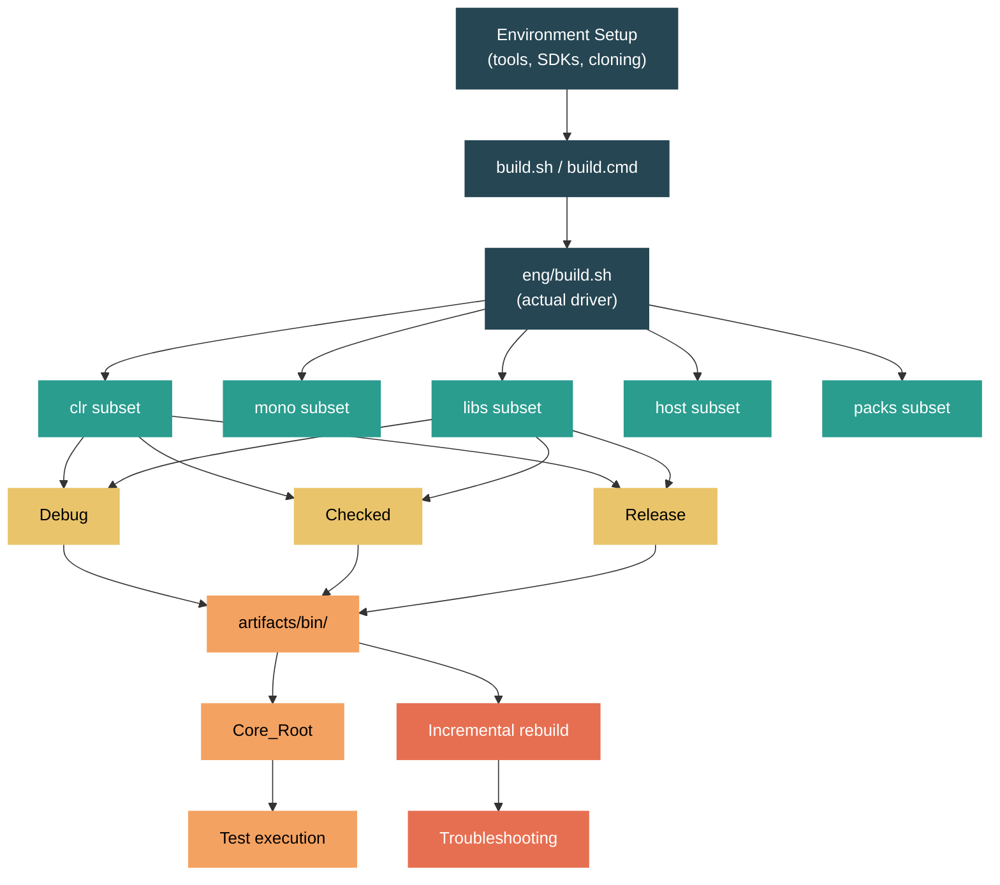

# Level 5: Expert / Contributor -- Building the Runtime from Source

> **Target profile:** Developer ready to contribute to `dotnet/runtime` who needs to build, iterate, and test locally
> **Estimated effort:** 8 hours
> **Prerequisites:** Level 4 complete
> [Version en espanol](../es/05-expert-building.md)

---

## Learning Objectives

By the end of this module you will be able to:

1. Set up a build environment on Windows, Linux, or macOS with all required tools and dependencies.
2. Explain the build subset system -- `clr`, `mono`, `libs`, `host`, `packs` -- and how subsets compose via `+`.
3. Execute a full baseline build of CoreCLR + Libraries and understand the output artifact structure.
4. Choose the correct configuration flags (`-rc`, `-lc`, `-hc`, `-c`) and configuration levels (Debug, Checked, Release) for your workflow.
5. Perform fast incremental rebuilds after modifying CoreLib, a single library, or native runtime code.
6. Diagnose and fix common build failures including SDK mismatches, warnings-as-errors, and stale artifacts.

---

## Concept Map



---

## Source Reading Guide

| Difficulty | File | Purpose |
|------------|------|---------|
| ★★ | `build.sh` | Entry point -- delegates to `eng/build.sh` (or `build.cmd` to `eng/build.ps1` on Windows) |
| ★★ | `build.cmd` | Windows entry point -- invokes `eng/build.ps1` via PowerShell |
| ★★★ | `eng/build.sh` | The actual build driver. Parses all CLI flags and invokes MSBuild |
| ★★★★ | `eng/Subsets.props` | Defines all subsets (`clr`, `mono`, `libs`, etc.) and their sub-components |
| ★★ | `global.json` | Pins SDK version and Arcade tooling versions |
| ★★★ | `eng/Versions.props` | Product version, major/minor/patch, prerelease labels |
| ★★ | `docs/workflow/requirements/windows-requirements.md` | Windows build prerequisites |
| ★★ | `docs/workflow/requirements/linux-requirements.md` | Linux build prerequisites |
| ★★ | `docs/workflow/requirements/macos-requirements.md` | macOS build prerequisites |
| ★★★ | `docs/workflow/building/coreclr/README.md` | CoreCLR build guide -- output paths, Core_Root, cross-compilation |
| ★★★ | `docs/workflow/building/libraries/README.md` | Libraries build guide -- daily workflow, framework flags |
| ★★ | `docs/workflow/building/mono/README.md` | Mono build guide -- mobile, WASM scenarios |
| ★★ | `CLAUDE.md` | Repository overview and canonical build commands |

---

## Curriculum

### Lesson 1 -- Prerequisites and Environment Setup

#### What you'll learn

Before building the runtime, you need a correct environment. A missing tool or wrong SDK version is the single most common cause of build failures for first-time contributors. This lesson walks through what's required on each platform and how the repository manages its own SDK.

#### The concept

The `dotnet/runtime` repo requires platform-specific native toolchains (C/C++ compilers, CMake, linkers) in addition to the .NET SDK. The repository pins its own SDK version in `global.json`, so you don't need to install a .NET SDK separately -- the build system will download the exact version it needs into the `.dotnet/` directory at the repo root.

However, you *do* need the native toolchain. The requirements differ by platform:

**Windows:**
- Visual Studio 2022 (17.8+) with the ".NET desktop development" and "Desktop development with C++" workloads
- Git for Windows with long paths enabled (`git config --system core.longpaths true`)
- Windows long paths enabled at the OS level
- The repo includes a `.vsconfig` file you can import into Visual Studio Installer

**Linux (Debian/Ubuntu):**
- `build-essential`, `clang`, `cmake` (3.26+), `lld`, `llvm`, `ninja-build`
- Libraries: `libicu-dev`, `libkrb5-dev`, `liblttng-ust-dev`, `libssl-dev`
- Helper script: `eng/common/native/install-dependencies.sh`

**macOS:**
- Xcode developer tools
- `cmake` (3.26+), `icu4c`, `pkg-config`, `python3`, `ninja` (installable via Homebrew)
- Helper script: `eng/common/native/install-dependencies.sh`

#### In the source code

Open `global.json` at the repository root:

```json
{
  "sdk": {
    "version": "11.0.100-preview.3.26170.106",
    "allowPrerelease": true,
    "rollForward": "major"
  },
  "tools": {
    "dotnet": "11.0.100-preview.3.26170.106"
  }
}
```

The `sdk.version` field is the exact .NET SDK the build requires. When you run `build.sh` or `build.cmd`, the Arcade build infrastructure checks `.dotnet/dotnet` (or `.dotnet/dotnet.exe` on Windows). If the correct SDK isn't there, it downloads it automatically. The `rollForward: "major"` policy provides flexibility, but the build always targets the pinned version.

Now open `eng/Versions.props`:

```xml
<PropertyGroup>
    <ProductVersion>11.0.0</ProductVersion>
    <MajorVersion>11</MajorVersion>
    <MinorVersion>0</MinorVersion>
    <PatchVersion>0</PatchVersion>
    <PreReleaseVersionLabel>preview</PreReleaseVersionLabel>
    <PreReleaseVersionIteration>4</PreReleaseVersionIteration>
</PropertyGroup>
```

This tells you the product is targeting .NET 11 Preview 4. Every artifact built from the repo will carry this version.

#### Hands-on exercise

1. Clone the repository if you haven't already: `git clone https://github.com/dotnet/runtime.git`
2. Verify your platform prerequisites by checking the appropriate document under `docs/workflow/requirements/`.
3. On Linux/macOS, run `eng/common/native/install-dependencies.sh` and verify it completes without errors.
4. On Windows, open Visual Studio Installer and import the `.vsconfig` file from the repo root.
5. Read `global.json` and note the SDK version. Confirm that `.dotnet/` either doesn't exist yet (the build will create it) or contains the matching SDK.

#### Key takeaway

The build system is self-bootstrapping for the .NET SDK -- you don't install it yourself. But native toolchains (C++ compiler, CMake, linker) must be installed manually. Get these right before attempting your first build.

#### Common misconception

"I need to install the .NET SDK from the official download page." No -- the repo downloads its own SDK into `.dotnet/`. Installing a system-wide SDK can actually cause version conflicts. After building, set your PATH: `export PATH="$(pwd)/.dotnet:$PATH"` to use the repo-local SDK.

---

### Lesson 2 -- Understanding Build Subsets

#### What you'll learn

The `dotnet/runtime` repo is huge -- a full build of everything takes over an hour. The subset system lets you build only the components you're working on. Understanding subsets is essential for productive iteration.

#### The concept

A **subset** is a named group of projects within the repository. The main top-level subsets are:

| Subset | What it builds |
|--------|---------------|
| `clr` | CoreCLR runtime: native VM, JIT, GC, CoreLib, ILC, native tools |
| `mono` | Mono runtime: for mobile, WASM, embedded scenarios |
| `libs` | Managed class libraries (BCL): System.Collections, System.Net.Http, etc. |
| `host` | Native host executables: `dotnet`, `hostfxr`, `hostpolicy` |
| `packs` | NuGet packages and installers for distribution |
| `tools` | Supporting tools like ILLink and cDAC |

You combine subsets with `+`:

```bash
./build.sh clr+libs          # CoreCLR and libraries
./build.sh mono+libs          # Mono and libraries
./build.sh clr+libs+host      # CoreCLR, libraries, and host
```

When you pass no subset, the default is `clr+mono+libs+tools+host+packs` -- everything.

Each top-level subset expands to finer-grained sub-subsets. For example, `clr` expands to:

```
clr.native + clr.corelib + clr.tools + clr.nativecorelib + clr.packages
+ clr.nativeaotlibs + clr.crossarchtools + host.native
```

You can target individual sub-subsets for surgical rebuilds:

```bash
./build.sh clr.corelib        # Only managed CoreLib
./build.sh clr.jit            # Only the JIT compiler
./build.sh libs.sfx           # Only the shared framework libraries
```

#### In the source code

Open `eng/Subsets.props`. The file begins with a clear comment:

```xml
<!--
    This file defines the list of projects to build and divides them into subsets.
    Examples:
      ./build.sh host.native         -- builds only the .NET host
      ./build.sh libs+host.native    -- builds the .NET host and also managed libraries
      ./build.sh -test host.tests    -- builds and executes installer test projects
-->
```

The default subsets are defined around line 72:

```xml
<DefaultSubsets>clr+mono+libs+tools+host+packs</DefaultSubsets>
```

The expansion logic starts around line 175:

```xml
<_subset>$(_subset.Replace('+clr+', '+$(DefaultCoreClrSubsets)+'))</_subset>
<_subset>$(_subset.Replace('+mono+', '+$(DefaultMonoSubsets)+'))</_subset>
<_subset>$(_subset.Replace('+libs+', '+$(DefaultLibrariesSubsets)+'))</_subset>
<_subset>$(_subset.Replace('+host+', '+$(DefaultHostSubsets)+'))</_subset>
<_subset>$(_subset.Replace('+packs+', '+$(DefaultPacksSubsets)+'))</_subset>
```

This is simple string replacement -- when you say `clr`, the build system replaces it with the full list of CoreCLR sub-subsets. The `DefaultCoreClrSubsets` property is defined around line 111:

```xml
<DefaultCoreClrSubsets>clr.native+clr.corelib+clr.tools+clr.nativecorelib+clr.packages
  +clr.nativeaotlibs+clr.crossarchtools+host.native</DefaultCoreClrSubsets>
```

Below that, the file defines `SubsetName` items that describe each sub-subset:

```xml
<SubsetName Include="Clr" Description="The full CoreCLR runtime." />
<SubsetName Include="Clr.Runtime" Description="The CoreCLR .NET runtime." />
<SubsetName Include="Clr.Jit" Description="The JIT for the CoreCLR .NET runtime." />
<SubsetName Include="Clr.Native" Description="All CoreCLR native non-test components." />
```

#### Hands-on exercise

1. Open `eng/Subsets.props` and find the `DefaultSubsets` property. Note how it changes for mobile targets (`TargetsMobile`).
2. Run `./build.sh -subset help` (or `build.cmd -subset help` on Windows) to see the full list of available subsets printed to the console.
3. Trace what happens when you specify `clr+libs`: follow the string replacement chain in `Subsets.props` and write down the full list of sub-subsets that will build.
4. Find the `DefaultLibrariesSubsets` property. Note it includes `libs.native+libs.sfx+libs.oob+libs.pretest`.

#### Key takeaway

Subsets are the primary mechanism for controlling what you build. For day-to-day library work, `clr+libs` is your baseline. For CoreCLR VM work, you often just need `clr`. Always use the most specific subset possible to minimize build time.

#### Common misconception

"I need to build `mono` every time." Unless you're working on Mono or mobile/WASM targets, you never need the `mono` subset. Similarly, you rarely need `host` or `packs` unless you're working on the installer or creating distributable packages.

---

### Lesson 3 -- Your First Build: CoreCLR + Libraries

#### What you'll learn

This lesson walks you through the most common baseline build -- CoreCLR runtime plus the managed libraries -- step by step. You'll understand what the build produces and where artifacts land.

#### The concept

The canonical first build for a contributor working on CoreCLR or the libraries is:

```bash
# Linux/macOS
./build.sh clr+libs -rc release

# Windows
build.cmd clr+libs -rc release
```

This builds:
- CoreCLR runtime in Release configuration (optimized native code, no debug assertions)
- Libraries in Debug configuration (the default, with full debugging support)

This combination is the recommended daily workflow because:
1. You rarely modify the runtime's native code, so a Release build avoids the overhead of debug assertions on every library test run.
2. Library code is what you'll iterate on most often, so Debug configuration gives you full debugging information.
3. It's the same combination the CI uses for most library testing.

**Expected timing:** A clean build on a modern machine (8+ cores, SSD) takes approximately 20-40 minutes. Subsequent builds are much faster because the build system caches intermediate results.

#### The build pipeline

When you run `./build.sh clr+libs -rc release`, here's what happens:

1. `build.sh` at the repo root is a thin wrapper that delegates to `eng/build.sh`.
2. `eng/build.sh` parses your flags and invokes MSBuild with the appropriate properties.
3. MSBuild evaluates `eng/Subsets.props` to expand `clr+libs` into sub-subsets.
4. Each sub-subset is built in dependency order:
   - `clr.native` -- compiles the native C++ runtime (VM, GC, JIT)
   - `clr.corelib` -- compiles `System.Private.CoreLib` (the managed half of CoreLib)
   - `clr.nativecorelib` -- compiles the native half of CoreLib (crossgen2 to create R2R image)
   - `clr.tools` -- builds Crossgen2, ILC, and other managed tools
   - `libs.native` -- compiles native shims for libraries
   - `libs.sfx` -- compiles the shared framework libraries (the main BCL)
   - `libs.oob` -- compiles out-of-band (NuGet-distributed) libraries
   - `libs.pretest` -- prepares the test host layout

#### Artifact locations

After a successful build, the key output directories are:

| Path | Contents |
|------|----------|
| `artifacts/bin/coreclr/<OS>.<Arch>.<Config>/` | CoreCLR native binaries: `libcoreclr.so`, `corerun`, `System.Private.CoreLib.dll` |
| `artifacts/bin/runtime/<TFM>-<OS>-<Config>-<Arch>/` | Combined runtime + libraries output |
| `artifacts/obj/` | Intermediate build files (can be safely deleted for clean builds) |
| `artifacts/log/` | Build logs |
| `.dotnet/` | The repo-local .NET SDK |

The most important binary is `corerun` (or `corerun.exe` on Windows) -- it's a minimal host that loads CoreCLR and runs a managed assembly directly, bypassing the full `dotnet` host. This is the primary tool for running runtime tests.

#### Hands-on exercise

1. Run the baseline build:
   ```bash
   # Linux/macOS
   ./build.sh clr+libs -rc release

   # Windows
   build.cmd clr+libs -rc release
   ```
2. While it builds, watch the output. Note the phase transitions: restoring NuGet packages, building native code (CMake/make), building managed code (MSBuild).
3. After it completes, explore the `artifacts/bin/coreclr/` directory. Find `corerun` and `System.Private.CoreLib.dll`.
4. Set up the repo-local SDK:
   ```bash
   export PATH="$(pwd)/.dotnet:$PATH"
   ```
5. Verify the SDK works: `dotnet --version` should print the version from `global.json`.

#### Key takeaway

`./build.sh clr+libs -rc release` is the canonical first build. It typically takes 20-40 minutes on a clean repo. After this, you can iterate on individual libraries using `dotnet build` directly without re-running the full build script.

#### Common misconception

"I should build everything in Debug." Building CoreCLR native code in Debug is extremely slow at runtime because it enables costly assertion checks on every operation. For library development, `-rc release` (Release runtime) with Debug libraries is the sweet spot. Only use `-rc debug` or `-rc checked` when you need to debug the runtime itself.

---

### Lesson 4 -- Configuration Flags

#### What you'll learn

The build system supports three configuration levels (Debug, Checked, Release) and four separate configuration flags for different components. Choosing the right combination avoids wasting hours on unnecessarily slow builds or missing diagnostic information.

#### The concept

**Three configuration levels:**

| Configuration | Assertions | Native Optimizations | Managed Optimizations | Use case |
|--------------|-----------|---------------------|----------------------|----------|
| **Debug** | Enabled | Disabled | Disabled | Debugging native runtime code |
| **Checked** | Enabled | Enabled | N/A (CoreCLR only) | Running runtime tests -- fast enough with safety nets |
| **Release** | Disabled | Enabled | Enabled | Performance benchmarks, library development |

**Checked** is unique to CoreCLR. It keeps assertion checks active (catching bugs early) but enables compiler optimizations in the native code (so the runtime runs at reasonable speed). This is the configuration used in CI for running the CoreCLR test suite.

**Four configuration flags:**

| Flag | Short | Controls | Default |
|------|-------|----------|---------|
| `-runtimeConfiguration` | `-rc` | CoreCLR/Mono native runtime | Debug |
| `-librariesConfiguration` | `-lc` | Managed libraries (BCL) | Debug |
| `-hostConfiguration` | `-hc` | Native host (`dotnet`, `hostfxr`) | Debug |
| `-configuration` | `-c` | Default for all unqualified subsets | Debug |

The `-c` flag sets the default for any component that doesn't have a specific flag. The specific flags (`-rc`, `-lc`, `-hc`) override `-c` for their respective component.

#### In the source code

Open `eng/build.sh` and look at the usage output (lines 24-42):

```
--configuration (-c)            Build configuration: Debug, Release or Checked.
                                Checked is exclusive to the CLR subset.
--hostConfiguration (-hc)       Host build configuration: Debug, Release or Checked.
--librariesConfiguration (-lc)  Libraries build configuration: Debug or Release.
--runtimeConfiguration (-rc)    Runtime build configuration: Debug, Release or Checked.
```

Notice that `-lc` only accepts Debug or Release (not Checked) -- Checked is a CoreCLR-specific concept that controls native assertion behavior.

#### Common build recipes

Here are the recommended builds from `CLAUDE.md` for different workflows:

| Workflow | Command | Why |
|----------|---------|-----|
| Library development | `./build.sh clr+libs -rc release` | Fast runtime, debuggable libraries |
| CoreCLR debugging | `./build.sh clr+libs` | Debug runtime (default), debug libraries |
| Runtime test suite | `./build.sh clr+libs -lc release -rc checked` | Checked runtime (assertions + optimization), Release libraries (fast tests) |
| Performance benchmarks | `./build.sh clr+libs -rc release -lc release` | Everything optimized |
| Building installers | `./build.sh clr+libs+host -rc release -lc release` | Full release build including host |
| CoreLib development | `./build.sh clr+libs -rc checked` | Checked runtime with assertions for catching CoreLib bugs |
| WASM libraries | `./build.sh mono+libs -os browser` | Mono runtime for browser target |

#### The apphost warning

A subtle gotcha from `docs/workflow/building/coreclr/README.md`:

> When building CoreCLR, the `apphost` will also get constructed as part of the build. However, `apphost` belongs to the `host` subset. This means that if you only pass the `runtimeConfiguration` and/or the `librariesConfiguration` flag to your builds, then the `apphost` will get built in `Debug`. This will result in issues when trying to build the tests.

The fix: when building for tests, always include `-c` alongside `-rc`:

```bash
./build.sh clr+libs -rc checked -c release
```

#### Hands-on exercise

1. Build CoreCLR in Checked configuration with Release libraries:
   ```bash
   ./build.sh clr+libs -rc checked -lc release
   ```
2. Compare the output directory names. You should see directories like `artifacts/bin/coreclr/linux.x64.Checked/` and `artifacts/bin/runtime/net11.0-linux-Release-x64/`.
3. Find `corerun` in the Checked build output and run it with no arguments -- it should print a usage message.
4. Re-build with just `-c debug` (no `-rc` or `-lc`) and note that all components default to Debug.

#### Key takeaway

Use `-rc` to control the runtime, `-lc` for libraries, and `-c` as a catch-all default. The most productive daily configuration for library development is `-rc release` with default Debug libraries. For runtime test development, use `-rc checked -lc release`.

#### Common misconception

"Checked is just Debug with a different name." No -- Checked has native compiler optimizations enabled, which makes it significantly faster than Debug. The only thing it keeps from Debug is the assertion checks. A Checked build might be 3-5x faster than Debug for runtime-intensive workloads while still catching assertion violations.

---

### Lesson 5 -- Incremental Builds and Iteration

#### What you'll learn

After the initial 20-40 minute build, you should almost never need to run the full build again. This lesson teaches you to rebuild only what changed, cutting iteration times from minutes to seconds.

#### The concept

The build system's incremental support varies by component:

**1. Modifying a managed library** -- Use `dotnet build` directly:

```bash
cd src/libraries/System.Collections/src
dotnet build
```

This takes seconds, not minutes. The `dotnet build` command uses the already-built runtime and only recompiles the changed library. You can also build and run tests:

```bash
cd src/libraries/System.Collections
dotnet build
dotnet build /t:test ./tests/System.Collections.Tests.csproj
```

**2. Modifying System.Private.CoreLib** -- Use a targeted rebuild:

CoreLib spans multiple directories and has both managed and native components. When you change CoreLib code, use this command:

```bash
./build.sh clr.corelib+clr.nativecorelib+libs.pretest -rc checked
```

This rebuilds the managed CoreLib, creates the native image, and updates the test host -- typically 2-5 minutes instead of 20-40.

**3. Modifying native runtime code (C++)** -- Rebuild the native subset:

```bash
./build.sh clr.native -rc checked
```

If you changed only the JIT:

```bash
./build.sh clr.jit -rc checked
```

**4. Running CoreCLR runtime tests** -- Generate Core_Root then run individual tests:

```bash
# Generate Core_Root layout (one-time after build)
src/tests/build.sh -generatelayoutonly x64 Checked

# Set CORE_ROOT
export CORE_ROOT=$(pwd)/artifacts/tests/coreclr/linux.x64.Checked/Tests/Core_Root

# Run a single test
cd artifacts/tests/coreclr/linux.x64.Checked/<test-path>/
$CORE_ROOT/corerun <TestName>.dll
# Exit code 100 = pass
```

#### The inner loop for library development

The fastest iteration cycle for library work:

```bash
# One-time baseline (if not done already):
./build.sh clr+libs -rc release

# Daily iteration:
export PATH="$(pwd)/.dotnet:$PATH"
cd src/libraries/System.Text.Json/src
dotnet build                                    # rebuild the library
cd ../tests
dotnet build /t:test                           # build and run tests
```

Visual Studio users can also open a solution directly:

```bash
# Windows
build.cmd -vs System.Text.Json
```

This generates and opens a filtered solution that includes only the relevant projects, giving you full IDE support with IntelliSense.

#### In the source code

The incremental behavior is controlled by MSBuild's standard up-to-date check mechanism. Each project's `.csproj` or `.proj` file declares its inputs and outputs. MSBuild skips the build if all outputs are newer than all inputs.

For native code, CMake's own incremental build system handles file-level dependency tracking. The `clr.native` subset invokes CMake, which only recompiles the `.cpp` files that changed (or whose headers changed).

#### Hands-on exercise

1. After your baseline build, make a trivial change to a library (e.g., add a comment to a file in `src/libraries/System.Collections/src/`).
2. Rebuild just that library with `dotnet build` from the `src/` directory. Note the time.
3. Run the tests: `dotnet build /t:test` from the `tests/` directory. Note which tests run.
4. Now make a change to `src/libraries/System.Private.CoreLib/src/System/Object.cs` (add a comment). Rebuild CoreLib:
   ```bash
   ./build.sh clr.corelib+clr.nativecorelib+libs.pretest -rc checked
   ```
5. Compare the rebuild time of a single library (step 2) vs CoreLib (step 4).

#### Key takeaway

After the baseline build, use `dotnet build` for library changes (seconds), and targeted sub-subsets like `clr.corelib` or `clr.jit` for runtime changes (minutes). Never re-run the full `clr+libs` build unless you've pulled significant changes from upstream.

#### Common misconception

"I need to run `./build.sh` every time I change a library." No. The build script is for top-level orchestration. For individual library development, `dotnet build` is faster because it only rebuilds the single project and uses the already-built runtime as a dependency. The build script becomes necessary only when you change cross-cutting infrastructure or need to rebuild the runtime itself.

---

### Lesson 6 -- Troubleshooting Build Failures

#### What you'll learn

Build failures are inevitable, especially after pulling new changes or switching branches. This lesson covers the most common failures and their fixes, so you spend your time contributing instead of fighting the build system.

#### The concept

Build failures in `dotnet/runtime` fall into a few common categories:

**1. Warnings treated as errors**

By default, the build treats warnings as errors. This is strict on purpose for CI, but can block you during active development. To disable it:

```bash
export TreatWarningsAsErrors=false
./build.sh clr+libs -rc release
```

Or pass it as an MSBuild property:

```bash
./build.sh clr+libs -rc release /p:TreatWarningsAsErrors=false
```

**2. SDK version mismatch**

If you see errors about missing SDK versions or incompatible tools, the repo-local SDK may be stale:

```bash
# Delete the local SDK and let the build re-download it
rm -rf .dotnet
./build.sh clr+libs -rc release
```

On Windows:
```cmd
rmdir /s /q .dotnet
build.cmd clr+libs -rc release
```

**3. Stale artifacts after branch switch or major pull**

After `git pull` or branch switching, intermediate artifacts can become inconsistent:

```bash
# Nuclear option: clean everything
git clean -xdf
./build.sh clr+libs -rc release
```

Or more surgically:

```bash
# Clean just the build artifacts
rm -rf artifacts/bin artifacts/obj
./build.sh clr+libs -rc release
```

**4. NuGet restore failures**

Network issues or package source problems:

```bash
# Clear the NuGet cache and retry
dotnet nuget locals all --clear
./build.sh clr+libs -rc release
```

**5. CMake or native build failures**

If native compilation fails (especially after updating Visual Studio or system compilers):

```bash
# Clean native build artifacts specifically
rm -rf artifacts/obj/coreclr
./build.sh clr.native -rc release
```

On Windows, make sure the correct Visual Studio workloads are still installed after updates.

**6. Long path issues (Windows)**

The repo has deep directory structures. Ensure long paths are enabled:

```powershell
git config --system core.longpaths true
```

And enable long paths in Windows itself via the registry or Group Policy.

#### Diagnostic tools

When a build fails and the console output isn't enough, use these approaches:

- **Binary log**: Add `-bl` to get a detailed MSBuild binary log in `artifacts/log/`:
  ```bash
  ./build.sh clr+libs -rc release -bl
  ```
  Open the `.binlog` file with the [MSBuild Structured Log Viewer](https://msbuildlog.com/) for a searchable, hierarchical view of the entire build.

- **Verbose output**: Increase MSBuild verbosity:
  ```bash
  ./build.sh clr+libs -rc release -v detailed
  ```

- **Build logs**: Check `artifacts/log/` for per-project log files that often contain more detail than the console output.

#### In the source code

The `TreatWarningsAsErrors` behavior is set in the repo's `Directory.Build.props` files and can be overridden by the environment variable. The `CLAUDE.md` file at the repo root documents this:

```
### Disabling warnings-as-errors during development
export TreatWarningsAsErrors=false
```

The SDK bootstrapping logic lives in `eng/common/tools.sh` (Linux/macOS) and `eng/common/tools.ps1` (Windows). These scripts read `global.json` and download the matching SDK if it's not already present.

#### Hands-on exercise

1. Intentionally cause a warning in a library file (e.g., declare an unused variable in `src/libraries/System.Collections/src/` code).
2. Try to build -- confirm the build fails with "warning as error."
3. Set `export TreatWarningsAsErrors=false` and rebuild -- confirm it now succeeds with a warning.
4. Revert your change and unset the environment variable.
5. Run `./build.sh clr+libs -rc release -bl` and open the resulting `.binlog` file to explore the build structure.
6. Practice the clean build flow: delete `artifacts/`, rebuild, and note the time difference vs an incremental build.

#### Key takeaway

Most build failures fall into five categories: warnings-as-errors, SDK mismatch, stale artifacts, NuGet issues, and native toolchain problems. Knowing the fix for each saves hours. When in doubt, `git clean -xdf` followed by a fresh build resolves almost everything -- it just costs you 20-40 minutes.

#### Common misconception

"If the build fails, something is fundamentally broken." Most build failures are environmental or artifact-related, not code bugs. Before investigating deeply, try: (1) `export TreatWarningsAsErrors=false`, (2) delete `artifacts/obj/` and retry, (3) delete `.dotnet/` and retry. These three steps resolve 90% of first-time build issues.

---

## Tools and Environment

| Tool | Purpose | Where to get it |
|------|---------|----------------|
| `build.sh` / `build.cmd` | Entry point for all builds | Repo root |
| `corerun` | Minimal host for running managed code against your build | `artifacts/bin/coreclr/<OS>.<Arch>.<Config>/` |
| `.dotnet/dotnet` | Repo-local SDK for `dotnet build`, `dotnet test` | Auto-downloaded during first build |
| MSBuild Structured Log Viewer | Analyze `.binlog` files from `-bl` builds | [msbuildlog.com](https://msbuildlog.com/) |
| CMake | Required for native C++ builds | Platform package manager or cmake.org |
| Ninja | Fast native build backend (used by CMake) | Platform package manager |

---

## Self-Assessment

Answer these questions to verify your understanding:

1. What is the recommended baseline build command for library development? Why is `-rc release` preferred over the default?
2. What does the `clr` subset expand to in `eng/Subsets.props`? Name at least four sub-subsets.
3. How does `Checked` configuration differ from `Debug` and `Release`? When would you choose each?
4. After changing a file in `src/libraries/System.Text.Json/src/`, what is the fastest way to rebuild and test?
5. What does `global.json` control and why shouldn't you install the .NET SDK system-wide for runtime development?
6. You pull new changes and the build fails with "error CS8032: An instance of analyzer cannot be created." What should you try first?
7. What is `Core_Root` and how do you generate it?
8. You want to debug a CoreCLR assertion failure. What build configuration should you use and why?

---

## Connections

| Direction | Module | Relationship |
|-----------|--------|-------------|
| Prerequisite | [4.1 CLR Startup](04-internals-clr-startup.md) | Understanding `corerun` and host behavior |
| Next | [5.2 Runtime Test Infrastructure](05-expert-testing.md) | Uses the build output from this module to run tests |
| Next | [5.5 Adding a New BCL API](05-expert-new-api.md) | Library builds and ref/src structure |
| Related | [5.3 Contributing a JIT Change](05-expert-jit-contribution.md) | Uses `clr.jit` subset for targeted JIT rebuilds |
| Related | [5.6 The Mono Runtime](05-expert-mono.md) | Uses `mono+libs` subset |
| Related | [5.7 WebAssembly](05-expert-wasm.md) | Uses `mono+libs -os browser` subset |

---

## Glossary

| Term | Definition |
|------|-----------|
| **Subset** | A named group of projects in the build system, defined in `eng/Subsets.props`. Controls what gets built. |
| **CoreCLR** | The primary .NET execution engine, written in C/C++, including the JIT, GC, and type system. |
| **Mono** | An alternative lightweight runtime used for mobile, WASM, and embedded scenarios. |
| **CoreLib** | `System.Private.CoreLib` -- the fundamental managed library containing `Object`, `String`, `Array`, etc. Spans three directories in the repo. |
| **Core_Root** | A test layout directory containing the runtime, all libraries, and test tools. The primary way to run CoreCLR tests. |
| **corerun** | A minimal native host that loads CoreCLR directly, bypassing the full `dotnet` host. Used for testing. |
| **Checked** | A CoreCLR-specific build configuration: native optimizations enabled, assertions enabled. Faster than Debug, safer than Release. |
| **Arcade** | The shared build infrastructure (MSBuild SDKs, scripts) used across .NET repositories. Lives in `eng/common/`. |
| **TFM** | Target Framework Moniker, e.g., `net11.0`. Identifies which .NET version the code targets. |
| **R2R** | ReadyToRun -- ahead-of-time compiled native images that speed up startup. CoreLib is always R2R-compiled. |
| **Binary log (.binlog)** | A structured MSBuild log format that captures every evaluation, target, and task. Invaluable for debugging build issues. |

---

## References

| Resource | Type | Relevance |
|----------|------|-----------|
| [Building CoreCLR](docs/workflow/building/coreclr/README.md) | Repo docs | Detailed CoreCLR build guide |
| [Building Libraries](docs/workflow/building/libraries/README.md) | Repo docs | Library build workflow and daily iteration |
| [Building Mono](docs/workflow/building/mono/README.md) | Repo docs | Mono build for mobile and WASM |
| [Windows Requirements](docs/workflow/requirements/windows-requirements.md) | Repo docs | Windows tool prerequisites |
| [Linux Requirements](docs/workflow/requirements/linux-requirements.md) | Repo docs | Linux package prerequisites |
| [macOS Requirements](docs/workflow/requirements/macos-requirements.md) | Repo docs | macOS tool prerequisites |
| [Workflow README](docs/workflow/README.md) | Repo docs | Overview of all build and test workflows |
| [MSBuild Structured Log Viewer](https://msbuildlog.com/) | Tool | Analyze binary logs from failed builds |
| [.NET Source Browser](https://source.dot.net/) | Tool | Search the runtime source online |
| [CLAUDE.md](CLAUDE.md) | Repo docs | Canonical build commands and conventions |

---

*This module is the gateway to contributing to dotnet/runtime. Once you can build and iterate confidently, everything else in Level 5 becomes practical.*

*Last updated: 2026-04-14*
