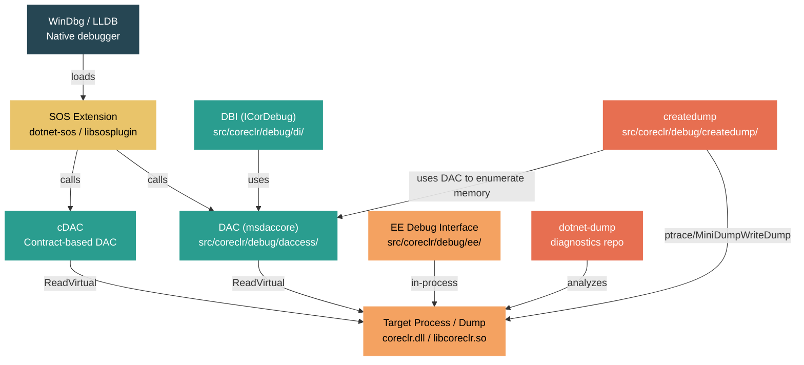

# Level 5: Expert — Debugging the Runtime with SOS, LLDB, and WinDbg

> **Target profile:** Runtime contributor or performance engineer who needs to debug the CLR itself at the native level -- inspecting managed objects from a native debugger, analyzing crash dumps, and understanding the DAC
> **Estimated effort:** 8 hours
> **Prerequisites:** Module 4.1 (CLR Startup), Module 5.1
> [Version en espanol](../es/05-expert-debugging.md)

---

## Learning Objectives

By the end of this module you will be able to:

1. Describe the four-layer debugging architecture of the CLR: the execution engine debug interface (EE), the Data Access Component (DAC), the Debug Interface (DBI/ICorDebug), and SOS.
2. Install and load SOS in both WinDbg and LLDB, and execute fundamental commands to inspect a live .NET process.
3. Use SOS commands (`DumpObj`, `DumpMT`, `DumpHeap`, `GCRoot`, `ClrStack`) to inspect managed state from a native debugger.
4. Set breakpoints in VM code (e.g., `MethodDesc::DoPrestub`, `JIT_New`), step through JIT compilation, and correlate managed and native frames.
5. Generate crash dumps with `createdump` and `dotnet-dump`, and analyze production dumps to diagnose common failures (stack overflow, access violation, deadlock).
6. Explain what the DAC is, why it exists, how `PTR_` types enable out-of-process inspection, and how the cDAC (contract-based DAC) is evolving the architecture.

---

## Concept Map



---

## Curriculum

### Lesson 1 — The Debugging Architecture: DAC, DBI, SOS, and the EE Debug Interface

#### What you'll learn

Before you can effectively debug the .NET runtime, you need to understand how the debugging components fit together. Unlike typical application debugging, managed debugging requires a specialized architecture because objects move in memory (GC), types are loaded lazily, and code is JIT-compiled at runtime.

#### The concept

The .NET debugging architecture has four major layers:

**1. The Execution Engine Debug Interface (`src/coreclr/debug/ee/`)**

This is the in-process debug support. The `Debugger` class (declared in `debugger.h`) runs on a helper thread inside the target process. It handles breakpoint insertion, stepping, function evaluation, and communicates with the debugger process through an IPC event channel. Key files:

- `debugger.cpp` / `debugger.h` -- the main `Debugger` class, the Runtime Controller
- `controller.cpp` -- `DebuggerController` manages breakpoints and steppers
- `funceval.cpp` -- function evaluation (the ability to call managed methods from the debugger)
- `rcthread.cpp` -- the Runtime Controller Thread that processes debug events

The EE debug interface responds to events like "module loaded," "breakpoint hit," or "exception thrown" and communicates them to the out-of-process debugger.

**2. The Data Access Component (DAC) (`src/coreclr/debug/daccess/`)**

The DAC is a special build of parts of the runtime that can read the runtime's state out-of-process -- from another process or from a dump file. It is built from the same sources as the runtime itself but compiled with the `DACCESS_COMPILE` preprocessor define. This means it reuses the actual runtime algorithms for traversing data structures, but all memory access goes through `ReadVirtual` calls to a data target interface.

The DAC produces `msdaccore.dll` (Windows) or `libmscordaccore.so` (Linux) / `libmscordaccore.dylib` (macOS). Key files:

- `daccess.cpp` -- the `ClrDataAccess` implementation, DAC entry point
- `request.cpp` -- implements the `ISOSDacInterface`, the API surface that SOS calls
- `dacimpl.h` -- central header with address conversion macros (`TO_CDADDR`, `CLRDATA_ADDRESS_TO_TADDR`)
- `enummem.cpp` -- memory region enumeration for minidump generation
- `dacdbiimpl.cpp` -- DAC-side implementation of the DBI interface

**3. The Debug Interface (DBI) (`src/coreclr/debug/di/`)**

DBI implements the `ICorDebug` family of COM interfaces, which is the public managed debugging API used by Visual Studio and other debuggers. It runs in the debugger process and uses the DAC for out-of-process inspection. Key files:

- `process.cpp` -- `CordbProcess`, the debugger-side representation of the target
- `module.cpp` -- `CordbModule`, represents loaded assemblies
- `rsthread.cpp` -- `CordbThread`, thread inspection
- `shimprocess.cpp` -- the shim layer that bridges old and new debugging APIs

**4. SOS (Son of Strike)**

SOS is a debugger extension that provides human-readable commands for inspecting managed state. It lives in the [diagnostics repo](https://github.com/dotnet/diagnostics) (not in the runtime repo) and calls into the DAC through `ISOSDacInterface`. SOS is what you use when you type `!DumpObj` in WinDbg or `sos DumpObj` in LLDB.

#### In the source code

The relationship between these components is visible in the directory structure:

```
src/coreclr/debug/
    ee/           -- In-process debug support (Debugger, DebuggerController)
    daccess/      -- DAC: out-of-process data access
    di/           -- DBI: ICorDebug implementation
    inc/          -- Shared headers (dacdbiinterface.h, dbgipcevents.h)
    createdump/   -- Crash dump generation utility
    debug-pal/    -- Platform abstraction for debug primitives
    shared/       -- Shared transport code (dbgtransportsession.cpp)
    runtimeinfo/  -- Runtime info structures exported for debuggers
```

In `src/coreclr/debug/daccess/request.cpp`, you can see how SOS requests are handled. Every SOS-facing function uses the `SOSDacEnter()` / `SOSDacLeave()` macros:

```cpp
#define SOSDacEnter()   \
    DAC_ENTER();        \
    HRESULT hr = S_OK;  \
    EX_TRY              \
    {

#define SOSDacLeave()   \
    }                   \
    EX_CATCH            \
    {                   \
        if (!DacExceptionFilter(GET_EXCEPTION(), this, &hr)) \
        {               \
            EX_RETHROW; \
        }               \
    }                   \
    EX_END_CATCH        \
    DAC_LEAVE();
```

This pattern ensures that all DAC operations are properly guarded -- the DAC mutex is acquired, exceptions are caught and translated to HRESULTs, and any errors in reading target memory are handled gracefully instead of crashing the debugger.

#### Hands-on exercise

1. Build a Debug configuration of CoreCLR: `build.cmd -s clr -c Debug` (Windows) or `./build.sh -s clr -c Debug` (Linux/macOS).
2. After building, locate the DAC binary in `artifacts/bin/coreclr/<os>.<arch>.Debug/`:
   - Windows: `mscordaccore.dll`
   - Linux: `libmscordaccore.so`
   - macOS: `libmscordaccore.dylib`
3. Also locate `createdump` in the same directory.
4. Open `src/coreclr/debug/daccess/dacimpl.h` and read the address conversion macros at the top (lines 21-100). Identify `TO_CDADDR`, `CLRDATA_ADDRESS_TO_TADDR`, and `CORDB_ADDRESS_TO_TADDR`. Notice the comment about sign-extension vs. zero-extension.

#### Key takeaway

Managed debugging is fundamentally different from native debugging because the runtime's state is opaque to a standard native debugger. The four-layer architecture -- EE (in-process), DAC (out-of-process reader), DBI (public API), and SOS (human-friendly commands) -- exists to bridge this gap. The DAC is the most critical piece: it lets tools read runtime data structures from a dead process (dump file) using the same algorithms the live runtime uses.

---

### Lesson 2 — Setting Up SOS: Installation, Loading, and Basic Commands

#### What you'll learn

SOS is your primary tool for inspecting managed state from a native debugger. This lesson covers how to install it, load it in WinDbg and LLDB, and run your first commands against a live .NET process.

#### The concept

SOS (Son of Strike -- a nod to "Lightning Strike," the original CLR project codename) is a debugger extension that translates low-level runtime data structures into human-readable output. It is maintained in the [dotnet/diagnostics](https://github.com/dotnet/diagnostics) repository and ships as a global tool (`dotnet-sos`) or bundled with WinDbg.

**Installation methods:**

```bash
# Method 1: Install as a global tool (recommended for LLDB)
dotnet tool install -g dotnet-sos
dotnet-sos install

# Method 2: WinDbg (recent versions) ships with SOS built in
# Just open a .NET process and SOS commands are available automatically

# Method 3: Manual loading (for custom SOS builds)
# In LLDB:
plugin load /path/to/libsosplugin.so    # Linux
plugin load /path/to/libsosplugin.dylib  # macOS

# In WinDbg:
.load /path/to/sos.dll
```

**Loading in WinDbg:**

In modern WinDbg (WinDbg Preview / WinDbgX), SOS is loaded automatically when you attach to or open a dump of a .NET process. For older versions or custom builds:

```
0:000> .loadby sos coreclr
0:000> !DumpDomain
```

The `.loadby` command loads `sos.dll` from the same directory as `coreclr.dll` in the target process.

**Loading in LLDB:**

After `dotnet-sos install`, LLDB is configured to auto-load SOS. For manual sessions:

```
(lldb) plugin load /path/to/libsosplugin.so
(lldb) sos Help
```

Note: only LLDB is supported for SOS on Linux/macOS. GDB does not support the SOS plugin.

#### Essential SOS commands

Here is the core command set you should know:

| Command | Purpose |
|---------|---------|
| `Help` | List all SOS commands |
| `ClrStack` | Show managed call stack for the current thread |
| `ClrStack -a` | Show managed stack with parameters and locals |
| `DumpObj <addr>` | Display the fields of a managed object |
| `DumpMT <addr>` | Display MethodTable information for a type |
| `DumpHeap -stat` | Summary of all managed objects on the heap |
| `DumpHeap -type <name>` | Find objects of a specific type |
| `GCRoot <addr>` | Find what keeps an object alive |
| `Threads` | List all managed threads |
| `PrintException` | Display the current exception |
| `DumpStack` | Show mixed native+managed stack |
| `DumpDomain` | Show all AppDomains and loaded assemblies |
| `EEHeap -gc` | Show GC heap layout and sizes |
| `VerifyHeap` | Validate GC heap integrity |
| `IP2MD <addr>` | Map an instruction pointer to a MethodDesc |
| `DumpIL <MethodDesc>` | Show IL for a method |
| `DumpLog` | Display the stress log (Debug builds) |

#### Hands-on exercise: Your first SOS session

**On Windows with WinDbg:**

1. Build and run a simple .NET console app that allocates objects in a loop (to keep it alive):
   ```csharp
   var list = new List<string>();
   for (int i = 0; ; i++)
   {
       list.Add($"Item {i}");
       if (i % 10000 == 0)
       {
           Console.WriteLine($"Count: {list.Count}");
           Thread.Sleep(1000);
       }
   }
   ```
2. Attach WinDbg to the process: **File > Attach to Process**.
3. Break execution (Ctrl+Break) and run:
   ```
   0:000> !Threads
   0:000> ~0s
   0:000> !ClrStack
   0:000> !DumpHeap -stat
   0:000> !DumpHeap -type System.String -stat
   ```
4. Pick an address from the `DumpHeap` output and inspect it:
   ```
   0:000> !DumpObj <address>
   ```

**On Linux with LLDB:**

1. Start the same app under LLDB:
   ```bash
   lldb -- /path/to/corerun /path/to/App.dll
   ```
2. After `dotnet-sos install`, start the process:
   ```
   (lldb) process launch -s
   (lldb) process handle -s false SIGUSR1
   (lldb) breakpoint set -n coreclr_execute_assembly
   (lldb) process continue
   ```
3. Once the breakpoint hits:
   ```
   (lldb) process continue
   ```
   Wait for the app to be running, then interrupt with Ctrl+C:
   ```
   (lldb) sos Threads
   (lldb) sos ClrStack
   (lldb) sos DumpHeap -stat
   ```

#### Key takeaway

SOS is the essential bridge between native debuggers and managed state. On Windows, WinDbg auto-loads it; on Linux/macOS, install with `dotnet-sos install` and use LLDB. The commands are case-sensitive in LLDB. Master the core set (`ClrStack`, `DumpObj`, `DumpHeap`, `GCRoot`, `Threads`) and you can diagnose most managed issues from a native debugger.

---

### Lesson 3 — Inspecting Managed State: DumpObj, DumpMT, DumpHeap, and GCRoot

#### What you'll learn

This lesson goes deep into the most important SOS commands for understanding managed object state. You will learn to trace from an object reference to its type, examine its fields, find all objects of a given type on the heap, and determine what keeps an object rooted.

#### The concept

When the CLR allocates a managed object, it has a precise layout in memory:

```
+-------------------+
| Object Header     |  <-- sync block index, hash code, lock info
+-------------------+
| MethodTable ptr   |  <-- first field of the object; points to type info
+-------------------+
| Field 1           |
| Field 2           |
| ...               |
+-------------------+
```

Every object starts with a pointer to its `MethodTable` (the runtime's type descriptor). SOS uses this pointer to interpret the rest of the object's memory. This is why `DumpObj` works: it reads the MethodTable pointer, looks up the field layout, and displays the fields by name and type.

#### DumpObj in depth

```
0:000> !DumpObj 00007ff8a0012340
Name:        System.Collections.Generic.List`1[[System.String]]
MethodTable: 00007ff87c5e6a80
EEClass:     00007ff87c5e4d10
Tracked Type: false
Size:        32(0x20) bytes
File:        System.Private.CoreLib.dll
Fields:
      MT    Field   Offset                 Type VT     Attr    Value Name
7ff87c4e...  400... 8     System.String[]   0 instance 7ff8a00... _items
7ff87c4b...  400... 16    System.Int32      1 instance       42 _size
7ff87c4b...  400... 20    System.Int32      1 instance       43 _version
```

Key information:
- **MethodTable** -- the address of the type descriptor. Pass this to `!DumpMT` to see type details.
- **EEClass** -- the static type descriptor (shared across instantiations of the same generic type). Contains method lists, interface maps, etc.
- **Size** -- the total object size in bytes, including the MethodTable pointer.
- **Fields** -- for each field: the MethodTable of the field type, the offset, whether it's a value type (VT=1) or reference (VT=0), and the current value.

#### DumpMT in depth

```
0:000> !DumpMT -md 00007ff87c5e6a80
EEClass:         00007ff87c5e4d10
Module:          00007ff87c481000
Name:            System.Collections.Generic.List`1[[System.String]]
mdToken:         0000000002000...
File:            System.Private.CoreLib.dll
BaseSize:        0x20
ComponentSize:   0x0
DomainNeutral:   false
Number of IFaces in IFaceMap: 8
--------------------------------------
MethodDesc Table
   Entry       MethodDesc    JIT Name
7ff87c5e6b10 7ff87c5e5a20   NONE System.Object.Finalize()
7ff87c5e6b18 7ff87c5e5a28    JIT System.Object.ToString()
...
7ff87c5e6c20 7ff87c5e5b48    JIT System.Collections.Generic.List`1.Add(System.String)
```

The `-md` flag shows the MethodDesc table -- every method, whether it has been JIT-compiled, and the entry point address. This is invaluable for understanding whether code is being compiled and what method implementations are in use.

#### DumpHeap: Finding objects on the heap

```
0:000> !DumpHeap -stat
Statistics:
      MT    Count    TotalSize Class Name
7ff87c4e...    15,000    360,000 System.String
7ff87c4b...     1,200     28,800 System.Int32[]
7ff87c5e...         1         32 System.Collections.Generic.List`1[[System.String]]
...
Total 16,201 objects, 388,832 bytes

0:000> !DumpHeap -type System.String
         Address          MT     Size
00007ff8a0012380 7ff87c4e... 46
00007ff8a00123b0 7ff87c4e... 48
...
```

Use `-stat` for a summary, `-type <name>` to find instances of a specific type, and `-mt <addr>` to find all instances of a specific MethodTable.

#### GCRoot: Why is an object alive?

```
0:000> !GCRoot 00007ff8a0012340
Thread 1234:
    rsp:00000012abcdef -> 00007ff8a0012340 (System.Collections.Generic.List`1[[System.String]])

Found 1 unique roots (run '!GCRoot -all' for all roots).
```

`GCRoot` walks the GC's root set (stack roots, static fields, handle tables, finalizer queue) and shows every chain that keeps the object alive. This is the single most important command for diagnosing memory leaks.

#### Hands-on exercise

1. Attach to or open a dump of a .NET process that has been running for a while.
2. Run `!DumpHeap -stat` and identify the most numerous type.
3. Pick one instance: `!DumpHeap -mt <MT> -max 1` and note the address.
4. Inspect it: `!DumpObj <addr>`.
5. If it has reference-type fields, follow one: `!DumpObj <field_value>`.
6. Now check whether the original object is rooted: `!GCRoot <addr>`.
7. Examine the MethodTable: `!DumpMT -md <MT>`. Find a method marked "JIT" and note its MethodDesc address.
8. Use `!DumpIL <MethodDesc>` to see the IL for that method.

#### Key takeaway

The combination of `DumpHeap` (find objects), `DumpObj` (inspect an object), `DumpMT` (understand its type), and `GCRoot` (understand why it is alive) forms the core investigation loop for any managed memory or state question. These commands work because the DAC can read the MethodTable pointer from each object and use the runtime's own type layout algorithms to interpret the memory.

---

### Lesson 4 — Debugging JIT and Runtime Code: Breakpoints in the VM

#### What you'll learn

When you need to debug the runtime itself -- not just managed code, but the C++ VM code that makes managed code run -- you need different techniques. This lesson covers setting breakpoints in the JIT, stepping through method compilation, and correlating managed frames with native code.

#### The concept

The runtime's C++ code lives in `coreclr.dll` (or `libcoreclr.so`). When you attach a native debugger, you can set breakpoints in any exported or symbolicated function. The most common scenarios for runtime debugging are:

1. **Tracing JIT compilation** -- break when a method is about to be compiled
2. **Tracing object allocation** -- break when objects are allocated
3. **Tracing GC behavior** -- break on GC triggers or collections
4. **Tracing type loading** -- break when types are loaded

#### Key breakpoint targets

| Function | File | What it does |
|----------|------|-------------|
| `MethodDesc::DoPrestub` | `src/coreclr/vm/prestub.cpp` | Called when a method is first invoked (before JIT) |
| `PreStubWorker` | `src/coreclr/vm/prestub.cpp` | The prestub worker that triggers JIT compilation |
| `jitNativeCode` | `src/coreclr/vm/jitinterface.cpp` | Entry into the JIT compiler |
| `Compiler::compCompile` | `src/coreclr/jit/compiler.cpp` | The JIT's main compilation method |
| `JIT_New` | `src/coreclr/vm/jithelpers.cpp` | Allocates a new managed object |
| `JIT_NewArr1` | `src/coreclr/vm/jithelpers.cpp` | Allocates a new managed array |
| `GCHeap::GarbageCollect` | GC source | Triggers a GC collection |
| `EEStartupHelper` | `src/coreclr/vm/ceemain.cpp` | Runtime startup |
| `MethodTable::DoFullyLoad` | `src/coreclr/vm/methodtable.cpp` | Type loading |
| `coreclr_execute_assembly` | `src/coreclr/hosts/corerun/` | Assembly execution |

#### Workflow: Stepping through JIT compilation

**In WinDbg:**

```
0:000> bp coreclr!MethodDesc::DoPrestub
0:000> g
Breakpoint 0 hit
coreclr!MethodDesc::DoPrestub:
0:000> ?? ((coreclr!MethodDesc*)this)->m_pszDebugMethodName
char * "Main"
0:000> ?? ((coreclr!MethodDesc*)this)->m_pszDebugClassName
char * "Program"
```

The `m_pszDebugMethodName` and `m_pszDebugClassName` fields exist only in Debug builds and are extremely useful for conditional breakpoints:

```
0:000> bp coreclr!MethodDesc::DoPrestub ".if (poi(@@(this->m_pszDebugMethodName)) == 'M') { } .else { gc }"
```

**In LLDB:**

```
(lldb) breakpoint set -n MethodDesc::DoPrestub
(lldb) process continue
Process stopped: MethodDesc::DoPrestub
(lldb) p this->m_pszDebugMethodName
(const char *) "Main"
(lldb) p this->m_pszDebugClassName
(const char *) "Program"
```

#### Workflow: Tracing an allocation

To understand where objects of a specific type come from:

```
0:000> bp coreclr!JIT_New
0:000> g
Breakpoint 0 hit
0:000> !DumpMT @rcx
Name:        MyApp.Customer
0:000> !ClrStack
```

In `JIT_New`, the first argument (`rcx` on x64 Windows, `rdi` on x64 Linux) is the MethodTable of the type being allocated. You can use `!DumpMT` to check if it is the type you care about, and `!ClrStack` to see which managed method triggered the allocation.

#### Correlating managed and native frames

Use `!DumpStack` to see interleaved managed and native frames. You can also use `!IP2MD <instruction_pointer>` to map any instruction pointer from a native stack trace to its MethodDesc:

```
0:000> !IP2MD 00007ff8`1234abcd
MethodDesc:   00007ff8a000beef
Method Name:  MyApp.Program.ProcessData(Int32)
Class:        00007ff8a000bc00
MethodTable:  00007ff8a000bd20
mdToken:      0000000006000005
Module:       00007ff8a0001000
IsJitted:     yes
CodeAddr:     00007ff8`12349000
```

#### Using DOTNET environment variables for tracing

Before resorting to a debugger, you can often get useful information through runtime diagnostics:

```bash
# Trace JIT compilation decisions
export DOTNET_JitDisasm="Main"           # Dump JIT disassembly for a specific method
export DOTNET_JitDump="Main"             # Full JIT dump (extremely verbose)
export DOTNET_JitDiffableDasm=1          # Disassembly in a diff-friendly format

# Trace type loading
export DOTNET_TypeLoaderLog=1

# Trace host resolution
export DOTNET_TRACE_HOST=1

# Trace GC activity
export DOTNET_GCLog=gc.log
```

These environment variables are available in Debug and Checked builds. Release builds support only a subset.

#### Hands-on exercise

1. Build the runtime in Debug configuration: `build.cmd -s clr -c Debug`.
2. Start your test app under WinDbg or LLDB using `corerun`:
   - WinDbg: `windbg corerun.exe MyApp.dll`
   - LLDB: `lldb -- ./corerun MyApp.dll`
3. Set a breakpoint on `MethodDesc::DoPrestub`.
4. Run and observe. Each time the breakpoint hits, inspect `this->m_pszDebugMethodName` to see which method is being compiled.
5. Set a conditional breakpoint that only stops for your `Main` method.
6. When stopped in `DoPrestub`, step into the function and trace the path through `PrepareInitialCode` into the JIT.

#### Key takeaway

The runtime is a C++ program and you can debug it with standard native debugging techniques. The trick is knowing where to set breakpoints and how to interpret the state. Debug builds of the runtime include extra fields (`m_pszDebugMethodName`, etc.) that make this dramatically easier. Always build the clr subset in Debug or Checked configuration when doing runtime development work.

---

### Lesson 5 — Crash Dump Analysis: createdump, dotnet-dump, and Production Debugging

#### What you'll learn

Production crashes require post-mortem analysis. This lesson covers how the .NET runtime generates crash dumps, the different dump types, and how to analyze them using both native debuggers and managed-only tooling.

#### The concept

When a .NET process crashes (unhandled exception, access violation, stack overflow), the runtime can automatically generate a dump file. On all platforms, this is handled by `createdump`, a dedicated utility in `src/coreclr/debug/createdump/`.

**How createdump works:**

1. The runtime's PAL (Platform Abstraction Layer) intercepts the fatal signal/exception.
2. It forks (Linux/macOS) or invokes `createdump` (Windows) as a child process.
3. `createdump` attaches to the crashing process via ptrace (Linux) or uses `MiniDumpWriteDump` (Windows).
4. It loads the DAC and calls `ICLRDataEnumMemoryRegions` to enumerate all managed memory regions that should be included.
5. It writes the dump in the platform-native format (ELF core on Linux, Mach-O core on macOS, Windows minidump on Windows).

The key insight is that `createdump` uses the DAC to determine which memory regions contain managed state. This is why .NET dumps can be much smaller than full core dumps while still containing enough information for managed debugging.

#### Dump types

| Value | Type | What's included |
|-------|------|----------------|
| 1 | MiniDumpNormal | Stack traces only, minimal GC heap |
| 2 | MiniDumpWithPrivateReadWriteMemory | GC heaps + stack traces (default) |
| 3 | MiniDumpFilterTriage | Minimal, for crash reporting pipelines |
| 4 | MiniDumpWithFullMemory | Everything -- like a full core dump |

#### Configuring automatic dump generation

```bash
# Enable automatic dump on crash
export DOTNET_DbgEnableMiniDump=1

# Set dump type (2 = with GC heaps, recommended for managed debugging)
export DOTNET_DbgMiniDumpType=2

# Set dump location (use %p for PID, %e for executable name)
export DOTNET_DbgMiniDumpName=/tmp/coredump.%p

# Enable diagnostic output from createdump itself
export DOTNET_CreateDumpDiagnostics=1

# Also generate a JSON crash report
export DOTNET_EnableCrashReport=1
```

#### Using dotnet-dump for managed-only analysis

`dotnet-dump` is a cross-platform managed-only dump analysis tool. It does not require a native debugger and runs on any platform:

```bash
# Install
dotnet tool install -g dotnet-dump

# Collect a dump from a running process
dotnet-dump collect -p <pid>

# Analyze a dump
dotnet-dump analyze /tmp/coredump.12345
```

Inside the `dotnet-dump` REPL, you get all the SOS commands:

```
> clrstack
> dumpheap -stat
> dumpobj 0x7ff8a0012340
> gcroot 0x7ff8a0012340
> printexception
> threads
```

#### Workflow: Analyzing a crash dump

**Step 1: Get the exception**

```
0:000> !PrintException
Exception object: 00007ff8a0099000
Exception type:   System.NullReferenceException
Message:          Object reference not set to an instance of an object.
InnerException:   <none>
StackTrace (generated):
    SP               IP               Function
    000000129ABCDEF0 00007FF812345678 MyApp.dll!MyApp.DataProcessor.Transform()+0x42
```

**Step 2: Examine the faulting thread**

```
0:000> !ClrStack -a
OS Thread Id: 0x1234 (0)
        Child SP               IP Call Site
000000129ABCDEF0 00007FF812345678 MyApp.DataProcessor.Transform()
    PARAMETERS:
        this (0x000000129ABCDF00) = 0x00007ff8a0098000
    LOCALS:
        0x000000129ABCDF10 = 0x0000000000000000  <-- null!
```

**Step 3: Inspect the object**

```
0:000> !DumpObj 0x00007ff8a0098000
Name:        MyApp.DataProcessor
Fields:
      MT    Field   Offset  Type      VT  Attr    Value Name
7ff87c4e...  4000001 8       System.Object 0 instance 0000000000000000 _data
```

Now you can see that `_data` is null, which caused the `NullReferenceException`.

**Step 4: Understand the bigger picture**

```
0:000> !Threads
0:000> !EEHeap -gc
0:000> !VerifyHeap
```

Check whether the heap is corrupted, whether there are deadlocked threads, and the overall memory state.

#### In the source code

The createdump implementation in `src/coreclr/debug/createdump/` is relatively straightforward:

- `main.cpp` / `createdumpmain.cpp` -- entry point, argument parsing
- `crashinfo.cpp` -- gathers process state (threads, registers, modules)
- `crashinfounix.cpp` -- Linux-specific: reads from `/proc/<pid>/maps`, uses ptrace
- `crashinfowindows.cpp` -- Windows-specific: uses MiniDumpWriteDump
- `dumpwriterelf.cpp` -- writes ELF core dump format
- `dumpwritermacho.cpp` -- writes Mach-O core dump format
- `datatarget.cpp` -- implements `ICorDebugDataTarget` for reading process memory

#### Hands-on exercise

1. Create a .NET app that will crash:
   ```csharp
   object? obj = null;
   Console.WriteLine(obj!.ToString()); // NullReferenceException
   ```
2. Run it with dump generation enabled:
   ```bash
   export DOTNET_DbgEnableMiniDump=1
   export DOTNET_DbgMiniDumpType=2
   export DOTNET_DbgMiniDumpName=/tmp/crash.dmp
   dotnet run
   ```
3. Open the dump:
   - WinDbg: `windbg -z /tmp/crash.dmp`
   - LLDB: `lldb --core /tmp/crash.dmp`
   - dotnet-dump: `dotnet-dump analyze /tmp/crash.dmp`
4. Use `!PrintException`, `!ClrStack -a`, and `!DumpObj` to trace the null reference.

#### Key takeaway

The `createdump` utility uses the DAC to enumerate managed memory regions, producing dumps that are much smaller than full core dumps while retaining all the managed state needed for debugging. Configure `DOTNET_DbgEnableMiniDump=1` and `DOTNET_DbgMiniDumpType=2` in production to automatically capture crash dumps. Use `dotnet-dump` for cross-platform analysis when you don't have a native debugger available.

---

### Lesson 6 — DAC: The Data Access Component in Depth

#### What you'll learn

The DAC is the foundation that makes all managed debugging possible. This lesson examines how it works at the implementation level: how `PTR_` types enable out-of-process memory reading, how the DAC cache operates, and how the new contract-based DAC (cDAC) is evolving the architecture.

#### The concept

The fundamental challenge of out-of-process debugging is this: the runtime's C++ code contains algorithms that know how to traverse its own data structures (MethodTables, MethodDescs, GC heaps, etc.), but that code normally runs in-process. The DAC's solution is elegant: build the same runtime code into a separate DLL, but redefine pointer types so that every memory access goes through a `ReadVirtual` call to the debugger's data target.

**How PTR_ types work:**

In a normal (non-DAC) build:

```cpp
typedef DPTR(class MethodTable) PTR_MethodTable;
// expands to:
typedef MethodTable* PTR_MethodTable;
```

In a DAC build:

```cpp
typedef DPTR(class MethodTable) PTR_MethodTable;
// expands to:
typedef __DPtr<MethodTable> PTR_MethodTable;
```

`__DPtr<MethodTable>` is a template class that stores a target address (a `TADDR` -- a plain integer). When you dereference it (operator `->` or `*`), it:

1. Checks the DAC cache for this target address
2. If not found, calls `ReadVirtual` on the data target to read `sizeof(MethodTable)` bytes from the target process
3. Stores the result in the DAC cache, keyed by target address
4. Returns a host pointer to the cached copy

This means that code like:

```cpp
MethodTable* pMT = pObj->GetMethodTable();
DWORD flags = pMT->GetFlags();
```

works identically in both the runtime and the DAC. In the runtime, it's simple pointer chasing. In the DAC, each `->` triggers a `ReadVirtual` from the target process and returns a pointer to a cached local copy.

#### The DAC cache

The DAC maintains a hash table of `DAC_INSTANCE` entries, each containing:

- The target address
- The size of the data
- The marshaled (host-side) copy of the data

Between debugger stop/continue events, the cache is valid. When the target resumes, the cache is flushed because the GC may have moved objects, new types may have loaded, etc.

#### DAC entry points

There are two main API surfaces the DAC exposes:

1. **`ISOSDacInterface`** (in `request.cpp`) -- used by SOS. Functions like `GetObjectData`, `GetMethodTableData`, `GetThreadStoreData` that return structured data about runtime objects.

2. **`ICorDebugDataTarget`** (in `dacdbiimpl.cpp`) -- used by DBI (ICorDebug). A more fine-grained API for the Visual Studio debugger.

Every function in `request.cpp` that serves SOS follows this pattern:

```cpp
HRESULT ClrDataAccess::GetObjectData(CLRDATA_ADDRESS addr, struct DacpObjectData *objectData)
{
    SOSDacEnter();
    // ... read from target using PTR_ types ...
    SOSDacLeave();
    return hr;
}
```

#### The DACCESS_COMPILE define

The key preprocessor define that controls DAC compilation is `DACCESS_COMPILE`. When set:

- `PTR_` types become `__DPtr<>` templates (out-of-process marshaling)
- `GVAL_DECL` / `SVAL_DECL` macros expose global/static variables through the DAC table
- Code guarded by `#ifndef DACCESS_COMPILE` is excluded (invasive operations that write to target memory)
- `SUPPORTS_DAC` contracts are enforced

#### The DAC table

Global variables that the DAC needs to access are registered in `src/coreclr/inc/dacvars.h`. At build time, their addresses are collected into a table (`g_dacTable`) that is exported from the runtime DLL. When the DAC loads, it reads this table from the target to know where each global lives in the target's address space.

#### The evolution: cDAC (contract-based DAC)

The traditional DAC has a tight coupling to the runtime's internal layout: it must be built from the exact same source and match the runtime binary exactly. This creates versioning challenges. The new **cDAC** (contract-based Data Access Component) addresses this through data contracts.

In `src/coreclr/debug/daccess/cdac.h`, you can see the `CDAC` class:

```cpp
class CDAC final
{
public:
    static CDAC Create(uint64_t descriptorAddr, ICorDebugDataTarget *pDataTarget,
                       IUnknown* legacyImpl);
    void CreateSosInterface(IUnknown** sos);
    void CreateDacDbiInterface(IUnknown** dbi);
};
```

The cDAC reads a contract descriptor embedded in the runtime binary that describes data layouts and algorithms. This means a single cDAC reader can work with multiple runtime versions, as long as the contracts are compatible. The contract definitions live in `docs/design/datacontracts/` and cover areas like:

- `Object.md` -- how to read managed objects
- `RuntimeTypeSystem.md` -- how to traverse type information
- `ExecutionManager.md` -- how to map code addresses to methods
- `GC.md` -- how to walk the GC heap

The data descriptors that feed these contracts are in `src/coreclr/debug/datadescriptor-shared/`.

#### Hands-on exercise

1. Open `src/coreclr/inc/daccess.h` and read the large comment block at the top. Find the definitions of `DPTR`, `VPTR`, `GPTR`, `GVAL`, `SPTR`, and `SVAL`. Understand that in a non-DAC build, `DPTR(Foo)` is just `Foo*`.

2. Open `src/coreclr/debug/daccess/request.cpp` and find the `GetObjectData` function. Trace how it:
   - Takes a `CLRDATA_ADDRESS` (target address of an object)
   - Converts it to a `PTR_Object` using `OBJECTREF_TO_OBJECT`
   - Reads the MethodTable pointer from the object
   - Populates the `DacpObjectData` structure

3. Open `src/coreclr/inc/dacvars.h` and look at the global variable declarations. These are the "entry points" into the target address space -- the starting points from which the DAC can reach all runtime data structures.

4. Browse `docs/design/datacontracts/Object.md` to see how the cDAC contract describes object layout. Compare with the traditional DAC approach in `request.cpp`.

#### Key takeaway

The DAC is one of the most clever pieces of engineering in the .NET runtime. By redefining pointer types at compile time, it transforms the runtime's own data structure traversal code into an out-of-process reader. Understanding `PTR_` types and `DACCESS_COMPILE` is essential for any runtime contributor, because any code that touches runtime data structures must be "DACized" to remain debuggable. The cDAC represents the future direction, decoupling the debugger tools from the exact runtime binary version through self-describing data contracts.

---

## Summary and Further Reading

### What you've learned

1. The .NET debugging architecture has four layers: EE debug interface (in-process), DAC (out-of-process data access), DBI (ICorDebug API), and SOS (human-friendly commands).
2. SOS is installed via `dotnet-sos install` and provides commands like `DumpObj`, `DumpHeap`, `GCRoot`, and `ClrStack` for inspecting managed state from native debuggers.
3. The core investigation loop is: find objects (`DumpHeap`), inspect them (`DumpObj`), understand their types (`DumpMT`), trace their roots (`GCRoot`).
4. The runtime is a C++ program you can debug with standard techniques. Key breakpoint targets include `MethodDesc::DoPrestub`, `JIT_New`, and `Compiler::compCompile`.
5. `createdump` uses the DAC to generate targeted dumps that include managed state. Configure `DOTNET_DbgEnableMiniDump=1` for production crash dumps.
6. The DAC works by redefining `PTR_` types to perform `ReadVirtual` calls, enabling the runtime's own algorithms to run out-of-process.

### Source files to explore

| File | Why it matters |
|------|---------------|
| `src/coreclr/debug/daccess/dacimpl.h` | Address conversion macros, DAC instance types |
| `src/coreclr/debug/daccess/request.cpp` | SOS-facing DAC API (`ISOSDacInterface`) |
| `src/coreclr/debug/daccess/daccess.cpp` | `ClrDataAccess` implementation |
| `src/coreclr/debug/ee/debugger.h` | In-process debug support (`Debugger` class) |
| `src/coreclr/debug/ee/controller.cpp` | Breakpoint and stepper management |
| `src/coreclr/debug/createdump/crashinfo.cpp` | Dump generation: process state gathering |
| `src/coreclr/debug/di/process.cpp` | DBI: debugger-side process representation |
| `src/coreclr/inc/daccess.h` | `DPTR`, `VPTR`, `GPTR` macros |
| `src/coreclr/inc/dacvars.h` | Global variable declarations for DAC table |
| `docs/design/coreclr/botr/dac-notes.md` | Detailed DAC design document |
| `docs/design/datacontracts/Object.md` | cDAC contract for managed objects |

### Related learning resources

- [BOTR: DAC Notes](https://github.com/dotnet/runtime/blob/main/docs/design/coreclr/botr/dac-notes.md) -- the definitive DAC design doc
- [SOS documentation](https://github.com/dotnet/diagnostics/blob/main/documentation/sos-debugging-extension.md) -- full SOS command reference
- [dotnet/diagnostics repo](https://github.com/dotnet/diagnostics) -- SOS, dotnet-dump, dotnet-trace, and other diagnostic tools
- [Cross-platform minidump generation](https://github.com/dotnet/runtime/blob/main/docs/design/coreclr/botr/xplat-minidump-generation.md) -- how createdump works on each platform
- [Data Contracts design](https://github.com/dotnet/runtime/tree/main/docs/design/datacontracts) -- the cDAC contract specifications

### Self-assessment questions

1. What is the difference between the DAC and SOS? Which one depends on the other?
2. Why must the DAC binary match the exact runtime binary version? How does the cDAC address this?
3. In DAC code, what is the difference between `TADDR`, `PTR_VOID`, and `PTR_MethodTable`? When would you use each?
4. You have a dump where `!VerifyHeap` reports corruption. What other commands would you run to diagnose the problem?
5. A customer reports that their .NET 9 service crashes every 4 hours with no dump file. What environment variables would you tell them to set?
6. You added a new field to `MethodDesc` in the runtime. What must you also do to ensure the DAC and SOS still work correctly?
7. Explain the path from typing `!DumpObj 0x7ff8a0012340` in WinDbg to the actual bytes being read from the target process.
