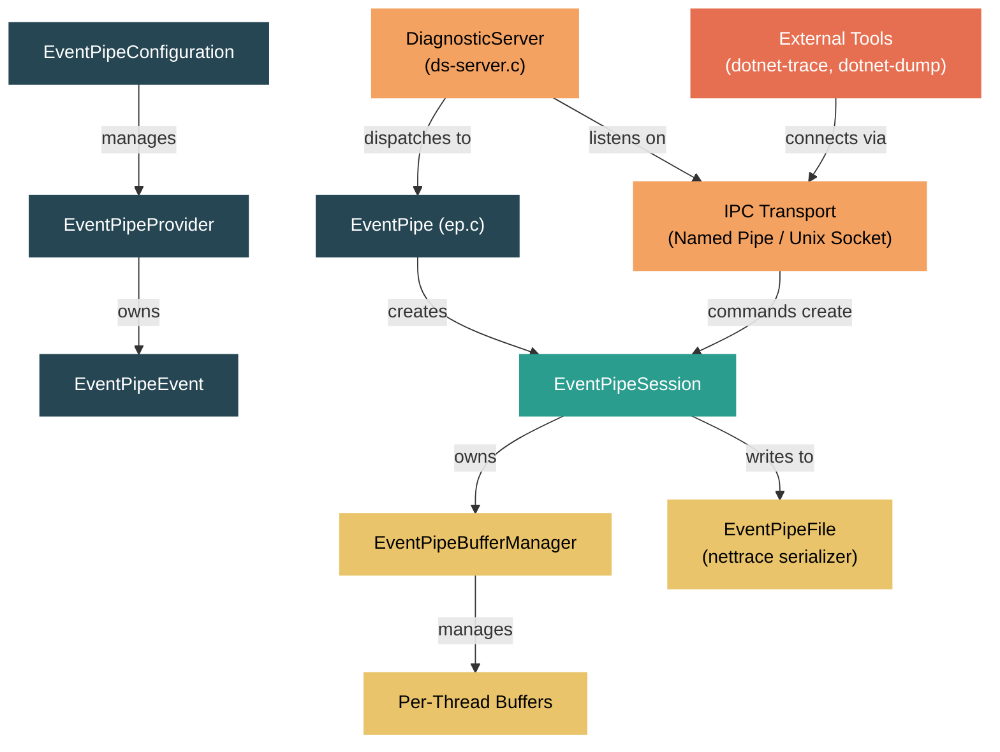

# Level 5: Expert / Contributor — The EventPipe and Diagnostic Server

> **Target profile:** Runtime contributor who needs to understand, extend, or debug the out-of-process diagnostic infrastructure
> **Estimated effort:** 6 hours
> **Prerequisites:** [Module 3.9: Diagnostics at Level 3](03-advanced-diagnostics.md), [Module 5.1](05-expert-contribution-workflow.md)
> [Version en espanol](../es/05-expert-eventpipe.md)

---

## Learning Objectives

By the end of this module you will be able to:

1. Describe the full EventPipe architecture: providers, events, sessions, buffers, and the streaming thread.
2. Explain how the Diagnostic Server accepts IPC connections and dispatches command sets (EventPipe, Dump, Profiler, Process).
3. Trace the lifecycle of an EventPipe session from creation through event writing to final flush.
4. Understand the per-thread buffer system, the buffer manager, and how events are serialized to the nettrace format.
5. Add a new runtime event to the EventPipe infrastructure end-to-end.
6. Explain how external tools (`dotnet-trace`, `dotnet-dump`, `dotnet-monitor`) communicate with the runtime over the diagnostic IPC protocol.

---

## Concept Map



---

## Source Reading Guide

| Difficulty | File | Purpose |
|------------|------|---------|
| ★★★★ | `src/native/eventpipe/ep.h` | Core EventPipe globals, state, session array |
| ★★★★ | `src/native/eventpipe/ep.c` | `ep_enable()`, `ep_disable()`, `write_event()` -- the heart of EventPipe |
| ★★★★ | `src/native/eventpipe/ep-provider.h` | `EventPipeProvider` struct -- keywords, level, event list |
| ★★★★ | `src/native/eventpipe/ep-event.h` | `EventPipeEvent` -- event ID, keywords, level, metadata, enabled mask |
| ★★★★ | `src/native/eventpipe/ep-session.h` | `EventPipeSession` -- session type, buffer manager, streaming thread |
| ★★★★★ | `src/native/eventpipe/ep-buffer-manager.h` | `EventPipeBufferManager` -- per-thread buffer list, sequence points |
| ★★★★ | `src/native/eventpipe/ep-buffer.h` | `EventPipeBuffer` -- circular write/read-only buffer, linked list |
| ★★★★ | `src/native/eventpipe/ep-config.h` | `EventPipeConfiguration` -- singleton provider registry |
| ★★★★★ | `src/native/eventpipe/ds-server.c` | Diagnostic Server main loop, command dispatch |
| ★★★★ | `src/native/eventpipe/ds-protocol.h` | `DiagnosticsIpcHeader` -- magic, commandset, commandid wire format |
| ★★★★ | `src/native/eventpipe/ds-types.h` | Command set enums (Dump, EventPipe, Profiler, Process) |
| ★★★★ | `src/native/eventpipe/ds-eventpipe-protocol.h` | CollectTracing / StopTracing command payloads |
| ★★★★ | `src/native/eventpipe/ds-ipc.h` | IPC stream factory, port abstraction |
| ★★★★ | `src/native/eventpipe/ds-ipc-pal-namedpipe.h` | Windows named-pipe transport implementation |
| ★★★★ | `src/native/eventpipe/ds-ipc-pal-socket.h` | Unix domain socket transport implementation |
| ★★★★ | `src/native/eventpipe/README.md` | Official guide to the code, data type macros, getter/setter patterns |
| ★★★★ | `src/coreclr/vm/eventpipeadapter.h` | CoreCLR C++ adapter wrapping the shared C library |
| ★★★★ | `src/coreclr/vm/eventpipeinternal.h` | QCall entry points from managed `EventPipeInternal` |
| ★★★★ | `src/coreclr/vm/diagnosticserveradapter.h` | CoreCLR adapter for Diagnostic Server init/shutdown |
| ★★★★ | `src/coreclr/vm/eventing/eventpipe/ep-rt-coreclr.h` | CoreCLR runtime-specific implementations of `ep-rt-*` contracts |

---

## Curriculum

### Lesson 1 — EventPipe Architecture

#### What you'll learn

EventPipe is the cross-platform in-process eventing subsystem of the .NET runtime. Originally the runtime relied on ETW (Event Tracing for Windows), but EventPipe was created so that the same structured tracing could work on Linux, macOS, and every other platform .NET targets. The implementation is written in C (not C++) so it can be shared between both the CoreCLR and Mono runtimes.

#### Historical context

The code was originally C++ inside CoreCLR. It was then rewritten in C and extracted into `src/native/eventpipe/` so that both CoreCLR and Mono could link against it. Each runtime provides a thin "runtime adapter" layer that implements platform-specific primitives (locks, threads, allocations) defined by the `ep-rt-*` headers. CoreCLR's adapter lives in `src/coreclr/vm/eventing/eventpipe/`, and Mono's in `src/mono/mono/eventpipe/`.

#### The global state machine

Open `src/native/eventpipe/ep.h`. The first lines after the includes reveal the global state:

```c
extern volatile EventPipeState _ep_state;
extern volatile EventPipeSession *_ep_sessions [EP_MAX_NUMBER_OF_SESSIONS];
extern volatile uint32_t _ep_number_of_sessions;
extern volatile uint64_t _ep_allow_write;
```

EventPipe operates as a state machine with three states: `NOT_INITIALIZED`, `INITIALIZED`, and `SHUTTING_DOWN`. The `_ep_sessions` array holds up to `EP_MAX_NUMBER_OF_SESSIONS` concurrent sessions (currently 64). The `_ep_allow_write` bitmask controls which sessions are actively accepting events -- each bit corresponds to a session index.

#### Core types

The architecture is built around five fundamental types:

1. **`EventPipeConfiguration`** (singleton, `ep-config.h`): The global registry of all providers. It maintains a linked list of `EventPipeProvider` objects and owns a special "config provider" used for metadata events.

2. **`EventPipeProvider`** (`ep-provider.h`): A namespace for events. Each provider has a name (e.g., `"Microsoft-DotNETCore-SampleProfiler"`), current keywords, level, a list of events, and a callback that fires when the provider is enabled/disabled.

3. **`EventPipeEvent`** (`ep-event.h`): A specific event type within a provider. It carries an event ID, version, keywords, level, metadata (schema), and an `enabled_mask` bitmask indicating which sessions have it enabled.

4. **`EventPipeSession`** (`ep-session.h`): Represents an active tracing session. It owns a `BufferManager` for in-memory buffering, a streaming thread for IPC/file sessions, and records the set of provider configurations that control which events are active.

5. **`EventPipeBufferManager`** (`ep-buffer-manager.h`): Manages per-thread buffer lists, sequence points for timestamp ordering, and the reading logic that drains buffers to the serializer.

#### The write path (fast path)

When runtime code calls `ep_write_event()` (or the managed `EventSource.WriteEvent`), the hot path is:

1. Check the event's `enabled_mask` -- if zero, return immediately (no active listeners).
2. For each active session bit, call into the session's buffer manager.
3. The buffer manager finds the current thread's buffer (or allocates a new one).
4. The event instance is serialized directly into the buffer.
5. No locks are taken on the write path under normal conditions -- the per-thread design makes writes lock-free.

This design is critical for performance: writing an event when nobody is listening is essentially a single atomic load that reads zero and returns.

#### Exercises

1. **Trace the init sequence**: In `ep.c`, find `ep_init()`. List the initialization steps (config init, sample profiler init, etc.) and note when threads are allowed to start.
2. **Count the sessions**: Read `ep.h` and find `EP_MAX_NUMBER_OF_SESSIONS`. Why is this a compile-time constant rather than dynamic?
3. **Follow a write**: Starting from `write_event()` in `ep.c`, trace the code path through to `ep_buffer_manager_write_event()`. Identify where the per-thread buffer is located.

---

### Lesson 2 — The Diagnostic Server

#### What you'll learn

The Diagnostic Server is a separate subsystem from EventPipe. It is an IPC-based RPC server that runs inside the .NET process, listening for commands from external tools. Creating EventPipe sessions is just one of several commands it supports.

#### IPC transport layer

The server communicates via platform-specific IPC mechanisms:

- **Windows**: Named pipes at `\\.\pipe\dotnet-diagnostic-{pid}` (see `ds-ipc-pal-namedpipe.h`)
- **Linux/macOS**: Unix domain sockets at `$TMPDIR/dotnet-diagnostic-{pid}-{disambiguation}-socket` (see `ds-ipc-pal-socket.h`)
- **Browser (WASM)**: WebSocket-based transport (see `ds-ipc-pal-websocket.h`)

The transport is abstracted behind the `DiagnosticsIpc` type and the `IpcStreamFactory`, which manages multiple listening ports and handles polling for incoming connections.

#### The wire protocol

Open `src/native/eventpipe/ds-protocol.h`. Every message starts with a `DiagnosticsIpcHeader`:

```c
struct _DiagnosticsIpcHeader {
    uint8_t magic [14];     // "DOTNET_IPC_V1\0"
    uint16_t size;          // total packet size (header + payload)
    uint8_t commandset;     // which subsystem to target
    uint8_t commandid;      // specific command within that set
    uint16_t reserved;
};
```

The header is exactly 20 bytes. After it comes a variable-length payload whose schema depends on the command.

#### Command sets

Open `src/native/eventpipe/ds-types.h`. The server supports four command sets:

| CommandSet | ID | Purpose |
|---|---|---|
| `DS_SERVER_COMMANDSET_DUMP` | `0x01` | Generate core dumps (`dotnet-dump`) |
| `DS_SERVER_COMMANDSET_EVENTPIPE` | `0x02` | Start/stop tracing sessions (`dotnet-trace`) |
| `DS_SERVER_COMMANDSET_PROFILER` | `0x03` | Attach/startup profiler |
| `DS_SERVER_COMMANDSET_PROCESS` | `0x04` | Process info, env vars, resume runtime |

Within the EventPipe command set, there are multiple versions of the `CollectTracing` command (0x02 through 0x06), each adding new fields like stackwalk control, rundown keywords, and event filtering. The `StopTracing` command is `0x01`.

#### Server main loop

The diagnostic server runs on its own thread. In `ds-server.c`, the `ds_server_init()` function sets up the IPC stream factory and starts the listener. The main loop:

1. Calls `ds_ipc_stream_factory_get_next_available_stream()` to poll for an incoming connection.
2. On connection, reads the `DiagnosticsIpcHeader`.
3. Dispatches based on `commandset`: calls `ds_eventpipe_protocol_helper_handle_ipc_message()`, `ds_dump_protocol_helper_handle_ipc_message()`, `ds_profiler_protocol_helper_handle_ipc_message()`, or `ds_process_protocol_helper_handle_ipc_message()`.
4. Each handler parses its specific payload, executes the command, and sends a response.

#### The connect/advertise handshake

When the diagnostic server starts listening, it can operate in two modes:

- **Listen mode** (default): The server creates a named pipe or socket and waits for tools to connect.
- **Connect mode** (reverse): The server actively connects to a specified endpoint. The tool (like `dotnet-monitor`) listens, and the runtime connects out. This is configured via `DOTNET_DiagnosticPorts`.

In connect mode, the server sends an **advertise message** first, which includes a cookie (GUID) and the process information. The tool uses this cookie to correlate responses.

#### Startup pause

The server supports pausing the runtime at startup via `ds_server_pause_for_diagnostics_monitor()`. When `DOTNET_DiagnosticPorts` specifies `suspend` mode, the runtime blocks until an external tool sends a `ResumeRuntime` command. This is critical for collecting events from process start (e.g., assembly loading events, JIT events).

#### Exercises

1. **Find the pipe name**: In `ds-ipc-pal-namedpipe.c`, find where the named pipe path is constructed. What is the format string?
2. **Map the dispatch**: In `ds-server.c`, find the switch statement (or if-chain) that dispatches based on command set. List all the command sets handled.
3. **Reverse connection**: Search for `DOTNET_DiagnosticPorts` in the codebase. How does the runtime parse the environment variable to configure connect-mode ports?

---

### Lesson 3 — Event Providers and Sessions

#### What you'll learn

This lesson covers how providers register events, how sessions specify which events to enable, and how the enable/disable lifecycle propagates through the system.

#### Provider registration

Providers are created through `ep_config_create_provider()` in `ep-config.h`. The function:

1. Allocates a new `EventPipeProvider` with the given name and callback.
2. Adds it to the configuration's provider list.
3. If any sessions are already active and request this provider name, the provider is immediately enabled.

There are two ways providers come into existence:

- **Runtime-defined providers**: Created during runtime initialization for built-in events (GC, JIT, loader, etc.). These are registered before any sessions exist.
- **Managed EventSource providers**: Created when managed code instantiates an `EventSource`. The `EventPipeInternal_CreateProvider` QCall bridges from managed code to native.

#### Event definition

Events are added to a provider via `ep_provider_add_event()` (`ep-provider.c`). Each event needs:

- **Event ID**: Unique within the provider.
- **Keywords**: Bitmask for filtering (e.g., `GCKeyword = 0x1`, `LoaderKeyword = 0x8`).
- **Level**: Verbosity from `LogAlways(0)` through `Critical(1)`, `Error(2)`, `Warning(3)`, `Informational(4)`, `Verbose(5)`.
- **Metadata**: Serialized schema describing the event name and parameter types.

The metadata is generated by `ep_metadata_generator_generate_event_metadata()` in `ep-metadata-generator.h`. It produces a binary blob encoding the event name, parameters (type + name pairs), and version.

#### Session creation

When `ep_enable()` is called (either from the diagnostic server or in-process), it:

1. Generates a session index (0-63).
2. Creates an `EventPipeSession` with the requested configuration:
   - **Session type**: `FILE` (write to disk), `IPC` (stream to tool), `LISTENER` (in-process callback), or `SYNCHRONOUS` (synchronous callback).
   - **Circular buffer size**: Memory budget in MB.
   - **Serialization format**: Currently nettrace v4.
   - **Provider configs**: Which providers to enable, at what keywords and level.
3. Creates an `EventPipeBufferManager` for the session.
4. Calls `ep_config_enable()` which walks all registered providers and enables matching events.
5. Sets the session's bit in `_ep_allow_write` to start accepting events.
6. For IPC/FILE sessions, creates a streaming thread that periodically flushes buffers.

#### The enable cascade

When a session enables a provider, the system:

1. Finds all `EventPipeEvent` objects belonging to that provider.
2. For each event, computes whether it should be enabled based on keywords and level matching.
3. Sets the event's `enabled_mask` bit for this session.
4. Invokes the provider's callback function, notifying it about the new level/keywords. This is how `EventSource` in managed code learns that listeners are active.

The disable path reverses this: clearing the `enabled_mask` bits and invoking the callback with disabled state.

#### Session provider configuration

The `EventPipeSessionProviderList` (`ep-session-provider.h`) stores the per-session provider configurations. Each entry specifies:

```
provider_name: "Microsoft-Windows-DotNETRuntime"
keywords: 0x1      (GCKeyword)
level: Informational (4)
filter_data: ""     (optional string passed to provider callback)
```

When a session is created with multiple provider configs, the system enables each one independently. A provider's effective keywords and level are the union across all active sessions.

#### Exercises

1. **Keyword matching**: In `ep-provider.c`, find `provider_compute_event_enable_mask()`. Explain the algorithm: how are keywords and level combined to determine if an event is enabled for a given session?
2. **Provider callback**: Search for `EventPipeCallback` type. What parameters does the callback receive? How does managed `EventSource` use this to toggle its `IsEnabled` property?
3. **Multiple sessions**: If Session A enables `GCKeyword` at `Informational` and Session B enables `GCKeyword` at `Verbose`, what events get written? To which session(s)?

---

### Lesson 4 — The EventPipe Buffer System

#### What you'll learn

The buffer system is the performance-critical core of EventPipe. It must handle high-throughput event writing from many threads with minimal contention while maintaining event ordering guarantees for readers.

#### Design goals

1. **Lock-free writes**: The write path (hot path) must not take global locks.
2. **Bounded memory**: The circular buffer has a configurable size limit.
3. **Ordered reads**: Events must be emitted to the output file in timestamp order, even though they originate from different threads.

#### Per-thread buffer architecture

Open `src/native/eventpipe/ep-buffer-manager.h`. The `EventPipeBufferManager` maintains:

```c
struct _EventPipeBufferManager {
    dn_list_t *thread_session_state_list;  // list of per-thread states
    dn_list_t *sequence_points;             // timestamp ordering markers
    ep_rt_wait_event_handle_t rt_wait_event; // signal for reader thread
    ep_rt_spin_lock_handle_t rt_lock;       // protects buffer allocation
    EventPipeSession *session;
    // ... reader thread state ...
};
```

Each thread that writes events gets its own `EventPipeThreadSessionState` and `EventPipeBufferList`. The buffer list is an intrusive linked list of `EventPipeBuffer` objects, ordered from oldest (head) to newest (tail).

#### Buffer lifecycle

An individual `EventPipeBuffer` (`ep-buffer.h`) has a simple lifecycle:

1. **WRITABLE**: The buffer is allocated for a specific thread. Only that thread writes into it. The buffer has a `current` pointer that advances as events are written, up to a `limit` pointer.
2. **READ_ONLY**: When the buffer is full (or during flush), the buffer manager converts it to read-only. A reader thread can then iterate through the events.

The transition from WRITABLE to READ_ONLY is protected by the buffer manager's lock, but individual writes within a WRITABLE buffer are not -- only the owning thread writes to it.

```c
struct _EventPipeBuffer {
    ep_timestamp_t creation_timestamp;
    EventPipeThread *writer_thread;
    uint8_t *buffer;       // start of allocation
    uint8_t *current;      // next write position
    uint8_t *limit;        // end of allocation
    EventPipeBuffer *prev_buffer;
    EventPipeBuffer *next_buffer;
    volatile uint32_t state;  // WRITABLE or READ_ONLY
    uint32_t event_sequence_number;
};
```

Events are written as `EventPipeEventInstance` objects directly into the buffer memory. Each instance is 8-byte aligned (`EP_BUFFER_ALIGNMENT_SIZE`), with the data payload immediately following the header.

#### Buffer allocation strategy

When a thread needs to write an event and its current buffer is full (or it has none), `buffer_manager_allocate_buffer_for_thread()` in `ep-buffer-manager.c`:

1. Tries to reserve memory against the session's circular buffer budget using `buffer_manager_try_reserve_buffer()`.
2. If the budget is exceeded, returns `NULL` -- the event is dropped (write is "suspended").
3. If space is available, allocates a new buffer and inserts it at the tail of the thread's buffer list.

The buffer size is at least the requested event size, clamped to a minimum and maximum.

#### Sequence points and ordered reading

Events arrive in per-thread order but the reader must emit them in global timestamp order. The buffer manager uses **sequence points** to solve this:

1. Periodically (or when forced), the streaming thread creates a sequence point.
2. A sequence point captures the current buffer position and sequence number for every active thread.
3. When reading, the reader advances through events in all threads up to the next sequence point, picking the event with the smallest timestamp at each step (merge-sort style).

This approach avoids global ordering during writes (expensive) and instead batches the ordering work into the reader thread (which is not on the hot path).

#### The streaming thread

For IPC and FILE session types, the session creates a dedicated streaming thread that:

1. Sleeps until woken by a timer or the `rt_wait_event`.
2. Walks all per-thread buffer lists.
3. Converts filled buffers to READ_ONLY.
4. Reads events in timestamp order across all threads.
5. Serializes them to `EventPipeFile` which writes the nettrace format.
6. Returns read buffers to the free pool.

The `EventPipeFile` (`ep-file.h`) is the serializer. It manages three block types:
- **EventBlock**: Batches of event data.
- **MetadataBlock**: Event schema definitions.
- **StackBlock**: Compressed call stacks.

#### Exercises

1. **Buffer sizing**: In `ep-buffer-manager.c`, find the buffer allocation code. What is the minimum buffer size? How is the size clamped?
2. **Dropped events**: Follow the code path when `buffer_manager_try_reserve_buffer()` returns false. How does the system signal that events are being dropped?
3. **Sequence point walk**: In the buffer manager, find the code that iterates events across threads in timestamp order. Describe the algorithm.

---

### Lesson 5 — Adding a New Runtime Event

#### What you'll learn

This lesson is a practical guide to adding a new event to the .NET runtime. This is one of the most common contributions to the EventPipe subsystem.

#### Overview of the event pipeline

Runtime events in CoreCLR flow through multiple layers:

```
Native runtime code (C/C++)
   -> FireEtw* macros (eventing/EtwEvents.h)
      -> ETW on Windows (if enabled)
      -> EventPipe provider write (if session active)
         -> Per-thread buffer
            -> Streaming thread -> nettrace output
```

The `FireEtw*` macros are code-generated from event manifest XML files. When you add a new event, you modify the manifest and the build system regenerates the macros.

#### Step-by-step guide

**Step 1: Define the event in the manifest**

The event manifest files are typically found in `src/coreclr/vm/ClrEtwAll.man` (or equivalent event source definitions). You define:

- Event ID (unique within the provider)
- Event name
- Keywords (which category it belongs to)
- Level (verbosity)
- Parameters (typed fields)

**Step 2: Add the event to the managed EventSource (if needed)**

If the event should also be writable from managed code, you add a corresponding method to the appropriate `EventSource` class. For runtime-internal events, this step may be skipped.

**Step 3: Fire the event from runtime code**

At the point in runtime code where the event should be emitted, call the generated `FireEtw<EventName>()` macro. For example:

```cpp
// In src/coreclr/vm/gchelpers.cpp or similar
FireEtwGCAllocationTick_V4(
    AllocationAmount,
    AllocationKind,
    GetClrInstanceId(),
    AllocationAmount64,
    TypeID,
    TypeName,
    HeapIndex,
    Address,
    ObjectSize);
```

**Step 4: Register in the EventPipe provider**

The build system automatically generates the EventPipe provider registration code from the manifest. The generated code:

1. Creates an `EventPipeProvider` for the provider name (e.g., `"Microsoft-Windows-DotNETRuntime"`).
2. Calls `ep_provider_add_event()` for each event defined in the manifest.
3. Generates the metadata blob describing the event schema.

**Step 5: Test the event**

Write a test that:

1. Starts an EventPipe session enabling the relevant provider/keyword.
2. Triggers the code path that fires the event.
3. Reads back the events from the session and verifies the event appears with correct data.

EventPipe tests live in `src/tests/tracing/eventpipe/`. A typical test:

```csharp
// Create a session enabling our provider
var providers = new List<EventPipeProvider>
{
    new EventPipeProvider("Microsoft-Windows-DotNETRuntime",
        EventLevel.Informational, (long)ClrTraceEventParser.Keywords.GC)
};

using (var session = EventPipeSession.Create(providers))
{
    // Trigger the event
    GC.Collect();

    // Read events from the session
    var source = new EventPipeEventSource(session.EventStream);
    source.Clr.GCStart += (data) => { /* validate */ };
    source.Process();
}
```

#### Working with the generated code

The event generation infrastructure uses several files:

- **Manifest files**: XML descriptions of events, providers, keywords, and tasks.
- **Generated headers**: The build produces `FireEtw*` macros that handle the dual dispatch to ETW and EventPipe.
- **Build targets**: MSBuild/CMake targets that invoke the generation tools.

Important: never hand-edit the generated files (`.g.cs`, generated headers). Always modify the source manifests and rebuild.

#### Adding a managed-only EventSource event

For purely managed events (not runtime-internal), the process is simpler:

```csharp
[EventSource(Name = "MyCustom-EventSource")]
public sealed class MyEventSource : EventSource
{
    public static readonly MyEventSource Log = new();

    [Event(1, Level = EventLevel.Informational, Keywords = Keywords.General)]
    public void MyOperation(string operationName, int duration)
    {
        if (IsEnabled())
            WriteEvent(1, operationName, duration);
    }

    public static class Keywords
    {
        public const EventKeywords General = (EventKeywords)0x0001;
    }
}
```

Under the hood, `EventSource` automatically creates an `EventPipeProvider` and `EventPipeEvent` objects through the `EventPipeInternal_CreateProvider` and `EventPipeInternal_DefineEvent` QCalls.

#### Exercises

1. **Find a real event**: In `src/coreclr/vm/gchelpers.cpp` or `src/coreclr/vm/jitinterface.cpp`, find a `FireEtw*` call. Trace it back to its event definition.
2. **Metadata generation**: Read `ep_metadata_generator_generate_event_metadata()` in `ep-metadata-generator.h`. What binary format does the metadata use for parameter types?
3. **QCall bridge**: Read `src/coreclr/vm/eventpipeinternal.cpp` function `EventPipeInternal_DefineEvent`. What parameters does it receive? How does it call through to `ep_provider_add_event()`?

---

### Lesson 6 — Diagnostic Tools Protocol

#### What you'll learn

This lesson explains how external diagnostic tools communicate with the runtime, covering the full round-trip of a typical `dotnet-trace collect` session.

#### Tool-side architecture

The .NET diagnostic tools (`dotnet-trace`, `dotnet-dump`, `dotnet-counters`, `dotnet-monitor`) all use the `Microsoft.Diagnostics.NETCore.Client` NuGet package, which implements the client side of the diagnostic IPC protocol. The key class is `DiagnosticsClient`:

```csharp
var client = new DiagnosticsClient(processId);
// Start an EventPipe session
using var session = client.StartEventPipeSession(providers);
// Read the nettrace stream
using var source = new EventPipeEventSource(session.EventStream);
```

#### The full trace collection flow

Here is the complete sequence when `dotnet-trace collect -p <pid>` runs:

**1. Discovery**
The tool enumerates diagnostic endpoints by looking for `dotnet-diagnostic-{pid}` named pipes or socket files.

**2. Connection**
The tool opens the IPC connection. On the server side, `ds_ipc_stream_factory_get_next_available_stream()` accepts it.

**3. CollectTracing command**
The tool sends a `DiagnosticsIpcHeader` with:
- `commandset = 0x02` (EventPipe)
- `commandid = 0x06` (CollectTracing5, the latest version)

Followed by the `EventPipeCollectTracingCommandPayload`:
```c
struct _EventPipeCollectTracingCommandPayload {
    uint8_t *incoming_buffer;
    dn_vector_t *provider_configs;
    uint32_t circular_buffer_size_in_mb;
    EventPipeSerializationFormat serialization_format;
    bool rundown_requested;
    bool stackwalk_requested;
    uint64_t rundown_keyword;
    EventPipeSessionType session_type;
};
```

**4. Session creation**
The server calls `ep_enable()` with the deserialized options, creating the session, buffer manager, and streaming thread.

**5. Response**
The server sends back a response with the `SessionID` (uint64).

**6. Event streaming**
The streaming thread in the runtime writes nettrace-formatted data to the IPC stream. The tool reads from the same stream, accumulating data into a `.nettrace` file.

**7. Stop command**
When the user hits Ctrl+C (or a duration expires), the tool sends a `StopTracing` command:
- `commandset = 0x02` (EventPipe)
- `commandid = 0x01`
- Payload: `SessionID`

**8. Rundown**
Before stopping, if rundown was requested, the runtime fires a batch of events describing the current state (loaded assemblies, JIT-compiled methods, etc.). This provides the decoder with the context needed to resolve method names and assemblies.

**9. Cleanup**
The session is disabled, buffers are flushed and freed, and the IPC connection is closed.

#### The nettrace format

The streaming data uses the **nettrace** serialization format, also known as the "FastSerialization" format. It consists of:

1. **File header**: Magic bytes, serializer version, minimum reader version.
2. **Object stream**: A sequence of serialized objects:
   - **MetadataBlock**: Event schema definitions (provider name, event name, parameter types).
   - **EventBlock**: Batched event data with compressed headers.
   - **StackBlock**: Compressed call stack data referenced by event instances.
   - **SequencePointBlock**: Markers for timestamp ordering.
3. **NullReference**: End-of-stream sentinel.

The format is designed for streaming: blocks can be decoded independently, and the reader does not need to seek backward.

#### Dump collection protocol

When `dotnet-dump collect` runs:

1. Connects to the diagnostic IPC.
2. Sends `DS_SERVER_COMMANDSET_DUMP` / `DS_DUMP_COMMANDID_GENERATE_CORE_DUMP3`.
3. The payload includes the output file path, dump type (mini, heap, triage, full), and flags.
4. The runtime generates the dump and sends a success/failure response.

#### The profiler attach protocol

The `DS_SERVER_COMMANDSET_PROFILER` commands allow attaching a profiler DLL to a running process:

1. `ATTACH_PROFILER`: Specifies the profiler CLSID, path, and optional client data.
2. `STARTUP_PROFILER`: Configures a profiler to load at startup (via `DOTNET_DiagnosticPorts` suspend mode).

#### dotnet-monitor: continuous monitoring

`dotnet-monitor` uses the reverse-connect mode. Instead of connecting to a process, it listens on a port and processes connect to it. The flow:

1. `dotnet-monitor` starts and creates a listening endpoint.
2. The runtime, configured with `DOTNET_DiagnosticPorts=<endpoint>,connect`, connects out on startup.
3. The runtime sends an advertise message with process info and a cookie.
4. `dotnet-monitor` can then send commands (start/stop traces, request dumps, etc.) at any time.

This architecture is critical for containerized environments where the monitoring tool may be a sidecar that cannot predict process IDs.

#### Exercises

1. **Protocol versioning**: Look at the `EventPipeCommandId` enum in `ds-types.h`. There are commands `COLLECT_TRACING` through `COLLECT_TRACING_5`. What new capabilities were added in each version?
2. **Build a minimal client**: Using the information in this lesson, outline the byte sequence you would send over a named pipe to start a simple EventPipe session enabling `"Microsoft-Windows-DotNETRuntime"` at Informational level.
3. **Reverse connection**: Find where the advertise cookie is generated (`ds_ipc_advertise_cookie_v1_init` in `ds-protocol.c`). What does the cookie contain and why is it needed?

---

## Key Takeaways

1. **EventPipe is shared C code** -- the `src/native/eventpipe/` directory is compiled by both CoreCLR and Mono, with each runtime providing its own `ep-rt-*` adapter layer.
2. **The Diagnostic Server is separate from EventPipe** -- it is a general-purpose IPC command server that happens to support EventPipe session management alongside dump generation, profiler attachment, and process inspection.
3. **Per-thread buffers eliminate write contention** -- the buffer system is designed so that writing an event never blocks another thread's writes, making the hot path nearly lock-free.
4. **Sessions are the unit of control** -- each session independently specifies which providers/events are active, has its own buffer budget, and its own streaming thread.
5. **Adding events is manifest-driven** -- the code generation pipeline produces the dual-dispatch macros (ETW + EventPipe) from XML manifests, so you modify the manifest rather than hand-writing event code.
6. **The diagnostic protocol is versioned and extensible** -- CollectTracing has evolved through 5 versions, each backward-compatible, adding new capabilities without breaking older tools.

---

## Further Reading

- [Official EventPipe README](../../src/native/eventpipe/README.md) -- code navigation guide for the C implementation
- [Diagnostic IPC protocol spec](https://github.com/dotnet/diagnostics/blob/main/documentation/design-docs/ipc-protocol.md) -- the canonical protocol documentation
- [EventPipe design doc](https://learn.microsoft.com/dotnet/core/diagnostics/eventpipe) -- Microsoft Learn overview
- [dotnet-trace documentation](https://learn.microsoft.com/dotnet/core/diagnostics/dotnet-trace) -- the primary diagnostic tool
- [dotnet-monitor documentation](https://learn.microsoft.com/dotnet/core/diagnostics/dotnet-monitor) -- continuous monitoring architecture
- [`src/coreclr/vm/eventing/eventpipe/`](../../src/coreclr/vm/eventing/eventpipe/) -- CoreCLR runtime adapter layer
