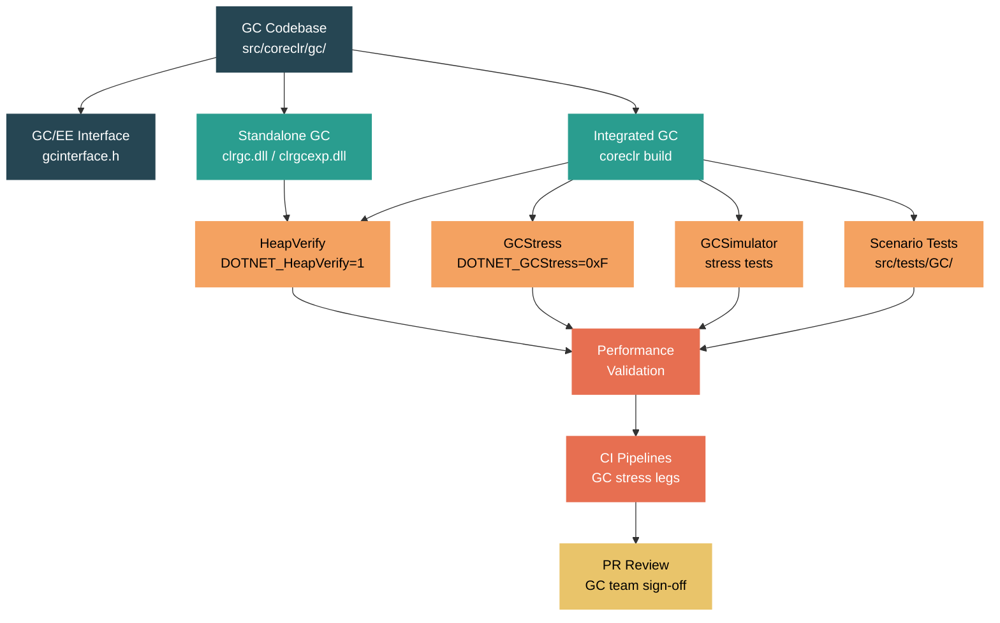

# Level 5: Expert / Contributor -- Contributing a GC Change

> **Target profile:** Runtime contributor preparing to submit their first (or fifth) pull request touching the GC. You already understand GC internals from Module 4.5; now you need to know how to build, test, validate, and ship a change without breaking every .NET application on the planet.
> **Estimated effort:** 12 hours
> **Prerequisites:** [Module 4.5 -- GC Deep](04-internals-gc-deep.md), Module 5.1 (Build System), Module 5.2 (Testing Infrastructure)
> **Source difficulty:** Extreme -- the GC is the single most correctness-critical subsystem in the runtime. A one-byte mistake in a write barrier or mark phase can silently corrupt the heap and crash applications hours later.
> [Version en espanol](../es/05-expert-gc-contribution.md)

---

## Learning Objectives

By the end of this module you will be able to:

1. Navigate the full GC codebase (`src/coreclr/gc/`) confidently, knowing which file owns which phase, how the code is conditionally compiled, and where the public interface boundaries lie.
2. Build the GC in both integrated and standalone mode, enabling fast iteration cycles.
3. Use HeapVerify, GCStress, and the GC stress tests to validate changes before submitting a PR.
4. Run the GCSimulator and targeted scenario tests to detect regressions.
5. Understand the PR review expectations specific to GC changes -- what reviewers look for, what CI pipelines run, and what performance validation is expected.
6. Assess the blast radius of a GC change and choose the right testing strategy accordingly.

---

## Why GC Changes Are Uniquely Dangerous

Before diving into the curriculum, understand why GC contributions demand extraordinary care:

- **Silent corruption.** A GC bug may not crash immediately. It may corrupt a single object reference that is only read minutes, hours, or days later. Heap corruption is the hardest category of bug to diagnose.
- **Universal blast radius.** Every managed application uses the GC. A regression does not affect one library -- it affects everything from ASP.NET Core to Unity games.
- **Concurrency hazards.** The GC interacts with every thread in the process. Background GC runs concurrently with mutator threads. Server GC runs multiple GC threads in parallel. Race conditions may reproduce only under specific timing on specific hardware.
- **Platform matrix.** The GC runs on Windows, Linux, macOS, Android, iOS, and WebAssembly. Architecture-specific write barriers exist for x64, ARM64, x86, and ARM. A change to a shared path must not break any platform.

The testing infrastructure described in this module exists specifically to catch these problems. Use all of it.

---

## Concept Map



---

## Curriculum

### Lesson 1 -- The GC Codebase Structure

#### What you will learn

How the GC source is organized, what each file does, and how the conditional compilation model works.

#### File map

The GC lives entirely within `src/coreclr/gc/`. Module 4.5 introduced the major files; here is the full inventory a contributor needs:

| File | Lines (approx.) | Purpose |
|------|-----------------|---------|
| `gc.cpp` | 8,800 | Core data structures, helpers, `gc_rand`, feature ifdefs. Includes other `.cpp` files via the `gcwks.cpp`/`gcsvr.cpp` mechanism. |
| `mark_phase.cpp` | 4,200 | `mark_phase()`, mark stack, mark lists, root scanning integration |
| `plan_phase.cpp` | 8,400 | `plan_phase()`, plug trees, gap calculation, compact/sweep decision, pinned object handling |
| `sweep.cpp` | 600 | `make_free_lists()`, free object construction |
| `background.cpp` | 4,600 | BGC lifecycle: concurrent marking, foreground ephemeral GCs during BGC, concurrent sweep |
| `collect.cpp` | 1,700 | `garbage_collect()`, `gc1()` -- top-level collection orchestration |
| `allocation.cpp` | 5,900 | Object allocation paths, allocation contexts, segment/region acquisition |
| `card_table.cpp` | 2,000 | Card table and card bundle operations for cross-generation reference tracking |
| `relocate_compact.cpp` | 2,300 | `relocate_phase()`, `compact_phase()`, object relocation |
| `regions_segments.cpp` | 2,400 | Segment mapping table, region-to-generation mapping |
| `region_allocator.cpp` | 500 | Buddy allocator for region memory blocks |
| `region_free_list.cpp` | 500 | Free region list management (basic/large/huge) |
| `memory.cpp` | 500 | Low-level memory commit/decommit helpers |
| `finalization.cpp` | 700 | Finalization queue operations |
| `init.cpp` | 1,550 | GC initialization, write watch detection |
| `diagnostics.cpp` | 1,800 | Heap verification, diagnostic output, ETW helpers |
| `dynamic_heap_count.cpp` | 1,500 | Dynamic heap count adjustment (DATAS) |
| `dynamic_tuning.cpp` | 2,900 | BGC tuning, servo loop for memory goal tracking |
| `no_gc.cpp` | 930 | No-GC region support |
| `interface.cpp` | 2,750 | `IGCHeap` implementation, GCStress integration |
| `gcconfig.h` | 200 | All configuration knobs via `GC_CONFIGURATION_KEYS` macro |
| `gcpriv.h` | ~7,000+ | The giant private header: `gc_heap`, `heap_segment`, `dynamic_data`, all internal types |
| `gcinterface.h` | ~600 | Public GC interface: `IGCHeap`, `gc_alloc_context`, handle types, version numbers |
| `gcinterface.ee.h` | ~300 | `IGCToCLR` and `IGCToCLREventSink` -- what the GC calls back into the EE |

**Total across the phase files and gc.cpp: over 45,000 lines of C++.**

#### The compilation model

The GC is compiled twice -- once for workstation GC and once for server GC:

```cpp
// gcwks.cpp
namespace WKS {
#include "gcimpl.h"
#include "gcpriv.h"
// ... all the phase includes ...
}

// gcsvr.cpp
#define SERVER_GC 1
namespace SVR {
#include "gcimpl.h"
#include "gcpriv.h"
// ... all the phase includes ...
}
```

This means every function in gc.cpp and its companion files exists in two copies (WKS and SVR namespaces). When `MULTIPLE_HEAPS` is defined (server GC), per-heap fields are instance members; when it is not (workstation), they become `static` -- controlled by the `PER_HEAP_FIELD` macros in `gcpriv.h`:

```cpp
#ifdef MULTIPLE_HEAPS
#define PER_HEAP_FIELD
#define PER_HEAP_FIELD_MAINTAINED
// ... instance fields
#else
#define PER_HEAP_FIELD static
#define PER_HEAP_FIELD_MAINTAINED static
// ... static fields
#endif
```

#### Key ifdef macros

| Macro | Meaning | Default |
|-------|---------|---------|
| `USE_REGIONS` | Region-based heap (vs legacy segments) | On since .NET 8 for most targets |
| `MULTIPLE_HEAPS` | Server GC | Defined in SVR build |
| `BACKGROUND_GC` | Concurrent/background GC | On by default |
| `FEATURE_SVR_GC` | Server GC feature available | On for most platforms |
| `VERIFY_HEAP` | Heap verification code compiled in | On for standalone builds, debug/checked builds |
| `STRESS_HEAP` | GCStress support compiled in | On for checked builds |
| `GC_CONFIG_DRIVEN` | Extra config-driven behavior | On for standalone builds |
| `BUILD_AS_STANDALONE` | Building as loadable DLL | Standalone GC only |
| `FEATURE_CONSERVATIVE_GC` | Conservative stack scanning | On for standalone, interpreter |

#### Source exploration exercise

1. Open `src/coreclr/gc/gcsvr.cpp` and `src/coreclr/gc/gcwks.cpp`. See how they include the same set of files under different namespaces.
2. In `gcpriv.h`, search for `PER_HEAP_FIELD_MAINTAINED` and note how fields are annotated by their lifecycle category (maintained, single-GC, alloc-only, init-only, diagnostic-only). This annotation system helps you understand what must be preserved across GCs.
3. Open `CMakeLists.txt` in the gc directory. Note the `GC_SOURCES` list and how `FEATURE_STANDALONE_GC` adds `clrgc` and `clrgcexp` as shared library targets.

---

### Lesson 2 -- The GC/EE Interface

#### What you will learn

How the GC communicates with the execution engine through versioned interfaces, and why this matters for your changes.

#### The interface boundary

The GC and the execution engine (EE) communicate through two formally versioned interfaces defined in `gcinterface.h`:

```cpp
// gcinterface.h
#define GC_INTERFACE_MAJOR_VERSION 5
#define GC_INTERFACE_MINOR_VERSION 8

#define EE_INTERFACE_MAJOR_VERSION 4
```

- **`IGCHeap`** (GC side): The interface the EE calls into the GC. Defined in `gcinterface.h`. Methods include `Alloc()`, `GarbageCollect()`, `GetGcLatencyMode()`, `WaitForFullGCApproach()`, and dozens more.
- **`IGCToCLR`** (EE side): The interface the GC calls into the EE. Defined in `gcinterface.ee.h`. Methods include `SuspendEE()`, `RestartEE()`, `GcScanRoots()`, `GcEnumAllocContexts()`, `StompWriteBarrier()`.
- **`IGCToCLREventSink`**: The eventing interface for GC ETW events. Also in `gcinterface.ee.h`.

#### Version discipline

Breaking changes to `IGCHeap` require bumping `GC_INTERFACE_MAJOR_VERSION`. Non-breaking additions bump the minor version. This versioning exists because the GC can be loaded as a standalone DLL (`clrgc.dll`), meaning the GC and EE may be at different version levels. If you add a new method to `IGCHeap`, you must bump the minor version. If you change an existing method signature, you must bump the major version.

#### The standalone GC path

When a standalone GC is loaded (via `DOTNET_GCName` or `DOTNET_GCPath`), the runtime loads the GC DLL and calls `GC_VersionInfo` to check compatibility:

```cpp
// gcload.cpp -- simplified
void LoadGC(const char* path)
{
    GC_VersionInfoFunction versionInfo = GetProcAddress(lib, "GC_VersionInfo");
    VersionInfo vi;
    versionInfo(&vi);
    if (vi.MajorVersion != GC_INTERFACE_MAJOR_VERSION)
        FAIL("Incompatible GC interface version");
    // minor version mismatch is OK
}
```

The standalone GC uses `gcenv.ee.standalone.inl` to implement the EE callbacks through function pointers rather than direct calls.

#### What this means for your changes

- If your change is purely internal to the GC (e.g., changing how `plan_phase` calculates pin gaps), no interface change is needed.
- If your change adds a new allocation flag or a new `IGCHeap` method, you must update the interface version and potentially the managed `GC` class in `System.Private.CoreLib`.
- If your change modifies `WriteBarrierParameters` or the write barrier contract, it affects both the GC and the JIT. This is a cross-component change requiring coordination with JIT reviewers.

#### The GCSample: a minimal EE

The `src/coreclr/gc/sample/` directory contains `GCSample.cpp` -- a minimal program that initializes the GC without the full CoreCLR runtime. It implements simplified versions of all `IGCToCLR` callbacks:

```cpp
// GCSample.cpp -- demonstrates standalone GC initialization
// - Trivial SuspendEE/RestartEE (single-threaded, nothing to suspend)
// - Trivial GcScanRoots (no stack roots)
// - Trivial GcEnumAllocContexts (single allocation context)
```

This sample is invaluable for understanding the minimal contract the GC requires from its host. If your change adds a new callback, you should update GCSample as well.

#### Source exploration exercise

1. Read `src/coreclr/gc/gcinterface.h` from the top. Note the version constants, then scroll to the `IGCHeap` class (around line 600+). Count how many methods it has -- this is the full API surface.
2. Read `src/coreclr/gc/gcinterface.ee.h`. Note how `IGCToCLR` has `SuspendEE()`, `RestartEE()`, `GcScanRoots()` -- the essential callbacks the GC needs.
3. Open `src/coreclr/gc/sample/GCSample.cpp` and `gcenv.ee.cpp`. Trace how a minimal object allocation works without any runtime.

---

### Lesson 3 -- Building and Testing GC Changes

#### What you will learn

How to build the GC quickly for fast iteration, and how to run the baseline test suite.

#### The full build (first time)

Before making any GC changes, you need a complete baseline build. The GC is part of `coreclr`, so:

```bash
# Windows
./build.cmd clr+libs+host

# Linux/macOS
./build.sh clr+libs+host
```

This takes up to 40 minutes. After it completes, configure the SDK:

```bash
export PATH="$(pwd)/.dotnet:$PATH"
```

#### Fast rebuild: CoreCLR only

After your baseline build, when you modify GC source files, you only need to rebuild the `clr` subset:

```bash
# Checked configuration (includes VERIFY_HEAP, STRESS_HEAP)
./build.sh clr -rc checked

# Release configuration (for performance testing)
./build.sh clr -rc release
```

The checked configuration is essential during development because it compiles in heap verification (`VERIFY_HEAP`) and GC stress (`STRESS_HEAP`) support. Always develop in checked first, then validate in release.

#### Standalone GC build

The standalone GC builds as a separate shared library. This is defined in `CMakeLists.txt`:

```cmake
# From src/coreclr/gc/CMakeLists.txt
if(FEATURE_STANDALONE_GC)
  # clrgcexp: standalone + regions (USE_REGIONS)
  add_library_clr(clrgcexp SHARED ${GC_SOURCES})
  target_compile_definitions(clrgcexp PRIVATE -DUSE_REGIONS)

  # clrgc: standalone + segments (legacy)
  add_library_clr(clrgc SHARED ${GC_SOURCES})

  add_definitions(-DBUILD_AS_STANDALONE)
  add_definitions(-DFEATURE_CONSERVATIVE_GC)
  add_definitions(-DVERIFY_HEAP)
  add_definitions(-DGC_CONFIG_DRIVEN)
endif()
```

Note that the standalone build always enables `VERIFY_HEAP` and `GC_CONFIG_DRIVEN`. There are two DLLs:
- `clrgcexp.dll` -- regions mode (`USE_REGIONS`)
- `clrgc.dll` -- legacy segments mode

To test with the standalone GC:

```bash
# Point the runtime at your standalone GC
export DOTNET_GCName=clrgcexp
# or
export DOTNET_GCPath=/path/to/clrgcexp.so
```

#### Running the GC test suite

GC tests live in `src/tests/GC/`. The directory structure is:

```
src/tests/GC/
  API/            -- Tests for GC public API (GC.Collect, GC.GetGeneration, etc.)
  Coverage/       -- Code coverage helpers
  Features/       -- Feature-specific tests (BGC, finalizer, LOH compaction, pinning, etc.)
  LargeMemory/    -- Tests requiring large memory
  Performance/    -- Performance benchmarks
  Regressions/    -- Regression tests for specific bugs
  Scenarios/      -- Complex scenario tests (GCSimulator, stress, etc.)
  Stress/         -- Stress test framework and tests
```

To build and run GC tests:

```bash
# Build test infrastructure (from repo root)
src/tests/build.sh -GenerateLayoutOnly x64 Release

# Set up Core_Root
export CORE_ROOT=$(pwd)/artifacts/tests/coreclr/$(uname -s).x64.Release/Tests/Core_Root

# Run a specific test
cd artifacts/tests/coreclr/$(uname -s).x64.Release/GC/<TestPath>/
$CORE_ROOT/corerun <TestName>.dll
# Exit code 100 = pass
```

#### The development cycle

A productive GC development cycle looks like this:

1. **Edit** the GC source in `src/coreclr/gc/`.
2. **Rebuild** with `./build.sh clr -rc checked` (2-5 minutes depending on what changed).
3. **Run HeapVerify** on a simple test to check basic correctness (see Lesson 4).
4. **Run GCStress** on a broader set to catch subtle issues (see Lesson 4).
5. **Run the GC test suite** to catch regressions.
6. **Profile** with a release build if your change is performance-sensitive.
7. Repeat.

#### Disabling warnings-as-errors during development

```bash
export TreatWarningsAsErrors=false
```

This is useful during early prototyping but should be removed before submitting a PR.

#### Source exploration exercise

1. Open `src/coreclr/gc/CMakeLists.txt` and trace how `GC_SOURCES` is assembled. Note how the standalone GC targets (`clrgc`, `clrgcexp`) are only built when `FEATURE_STANDALONE_GC` is on.
2. Run `ls src/tests/GC/Features/` and note the feature-specific test directories. If your change touches BGC, you should run `Features/BackgroundGC/`. If it touches finalization, run `Features/Finalizer/`.
3. Build the GC in checked mode and confirm the build succeeds before making changes. This is your known-good baseline.

---

### Lesson 4 -- GC Stress Testing

#### What you will learn

The GCStress modes, HeapVerify levels, and how to use them to find bugs in your changes before anyone else does.

#### HeapVerify: the first line of defense

HeapVerify walks the entire managed heap and validates its structural integrity. It is controlled by the `DOTNET_HeapVerify` environment variable (or `COMPlus_HeapVerify` for older runtimes). The values are bitmask flags defined in `gcconfig.h`:

```cpp
enum HeapVerifyFlags {
    HEAPVERIFY_NONE             = 0,
    HEAPVERIFY_GC               = 1,    // Verify heap at beginning and end of each GC
    HEAPVERIFY_BARRIERCHECK     = 2,    // Verify write barrier correctness
    HEAPVERIFY_SYNCBLK          = 4,    // Verify sync block scanning

    // Mitigation flags (reduce overhead):
    HEAPVERIFY_NO_RANGE_CHECKS  = 0x10, // Skip bounds checking
    HEAPVERIFY_NO_MEM_FILL      = 0x20, // Skip filling freed memory with pattern
    HEAPVERIFY_POST_GC_ONLY     = 0x40, // Only verify after GC (not before)
    HEAPVERIFY_DEEP_ON_COMPACT  = 0x80  // Deep verification only on compacting GCs
};
```

**Recommended usage during development:**

```bash
# Full heap verification (slow but thorough)
export DOTNET_HeapVerify=1

# Heap + write barrier verification
export DOTNET_HeapVerify=3

# Post-GC only (faster for large heaps)
export DOTNET_HeapVerify=0x41

# Full verification with deep compaction checks
export DOTNET_HeapVerify=0x81
```

HeapVerify is implemented in `diagnostics.cpp`. When enabled, `verify_heap()` is called at GC entry and exit (see `collect.cpp` lines 450+ where `verify_heap(FALSE)` and `verify_heap(TRUE)` are called). It walks every object on the heap, checks method table pointers, validates object sizes, checks that references point to valid objects, and verifies free object integrity.

**How it catches bugs:** If your change causes an object reference to point at freed memory, or a card table to miss a cross-generation reference, HeapVerify will detect it on the next GC. The earlier you enable it, the closer to the root cause the failure will be.

#### GCStress: forcing GC at every opportunity

GCStress forces garbage collections at every allocation or at specific JIT-inserted GC poll points. It is controlled by `DOTNET_GCStress` and is only available in checked/debug builds (requires `STRESS_HEAP`). The values are:

| Value | Meaning |
|-------|---------|
| `0x1` | GC on every allocation |
| `0x2` | GC on every JIT-emitted GC poll |
| `0x4` | GC on every JIT-emitted GC transition (harder stress) |
| `0x8` | GC with unique stack crawl at every stress point |
| `0xF` | All of the above (maximum stress) |

**Important:** GCStress is extremely slow. A test that runs in 1 second normally may take 10 minutes under GCStress. Use it on small, targeted tests, not the entire test suite.

```bash
# Basic GC stress on allocations
export DOTNET_GCStress=1

# Full GC stress (very slow)
export DOTNET_GCStress=0xF

# Run a targeted test under GC stress
$CORE_ROOT/corerun MyGCTest.dll
```

GCStress integration lives in `src/coreclr/gc/interface.cpp`:

```cpp
// interface.cpp (simplified)
if (GCStress<cfg_any>::IsEnabled())
{
    // Force a GC here
}
```

Note the comment in `gc.h`:

```cpp
// GCStress does not currently work with Standalone GC
```

This means you must test GCStress with the integrated (non-standalone) checked build.

#### Combining HeapVerify and GCStress

The most powerful debugging combination is running both together:

```bash
export DOTNET_GCStress=1
export DOTNET_HeapVerify=3
$CORE_ROOT/corerun SmallTest.dll
```

This forces a GC on every allocation and verifies the heap's integrity at each GC. It is incredibly slow but catches the most subtle bugs. If a write barrier is missing a case, if a mark phase skips a reference, or if plan phase miscalculates a plug boundary -- this combination will find it.

#### The GC stress test suite

The dedicated stress tests in `src/tests/GC/Stress/Tests/` exercise specific patterns:

| Test | What it stresses |
|------|-----------------|
| `GCSimulator.cs` | Configurable object lifetime patterns, multithreaded allocation/collection |
| `GCVariant.cs` | GC behavior under different configurations |
| `StressAllocator.cs` | Pure allocation throughput and GC triggering |
| `pinstress.cs` | Pinned object handling during GC |
| `allocationwithpins.cs` | Mixed allocation with pinning patterns |
| `concurrentspin2.cs` | Concurrent GC with spinning threads |
| `LargeObjectAlloc*.cs` | LOH allocation patterns (4 variants) |
| `ExpandHeap.cs` | Heap expansion and contraction |
| `plug.cs` / `PlugGaps.cs` | Fragmentation and plug handling |
| `doubLinkStay.cs` / `SingLinkStay.cs` | Linked list lifetime patterns |
| `RedBlackTree.cs` / `DirectedGraph.cs` | Complex object graph structures |

The stress framework in `src/tests/GC/Stress/Framework/` provides a reliability harness (`ReliabilityFramework.cs`) that can run tests repeatedly with configurable parameters.

#### What to run for your change

| Change type | Minimum testing |
|-------------|----------------|
| Mark phase change | HeapVerify=3 + GCStress=1 on GCSimulator, plus `Features/BackgroundGC/` tests |
| Plan/compact change | HeapVerify=0x81 (deep on compact) + pinstress + PlugGaps |
| Allocation path change | StressAllocator + allocationwithpins + LargeObjectAlloc* |
| Write barrier change | HeapVerify=3 (barrier check) + full GC test suite + GCStress=0xF on small tests |
| Finalization change | `Features/Finalizer/` + `Scenarios/FinalNStruct/` |
| Region management change | ExpandHeap + GCSimulator (server mode) |
| Card table change | HeapVerify=2 + GCStress=1 + `Features/BackgroundGC/` |

#### Source exploration exercise

1. In `src/coreclr/gc/gcconfig.h`, find the `HeapVerifyFlags` enum (around line 190). Read each flag's comment.
2. In `src/coreclr/gc/diagnostics.cpp`, search for `verify_heap`. Read how it walks objects and validates method tables.
3. In `src/coreclr/gc/collect.cpp`, find where `verify_heap` is called (around line 450). Note that it runs before and after the GC, controlled by `HEAPVERIFY_POST_GC_ONLY`.
4. Open `src/tests/GC/Stress/Tests/GCSimulator.cs` and read the first 100 lines to understand the lifetime simulation model.

---

### Lesson 5 -- GC Simulation and Validation

#### What you will learn

How to use the GCSimulator, scenario tests, and GC configuration knobs to validate correctness under varied conditions.

#### The GCSimulator

The GCSimulator (`src/tests/GC/Stress/Tests/GCSimulator.cs`) is a managed test that creates configurable workloads to exercise the GC. It models objects with different lifetime categories:

```csharp
public enum LifeTimeENUM
{
    Short,    // objects that die young (Gen0 collection)
    Medium,   // objects that survive into Gen1
    Long      // objects that live to Gen2
}
```

Objects are stored in containers (arrays or binary trees), and a `LifeTimeStrategy` determines when objects should be replaced (killed). This simulates real-world allocation patterns where some objects are short-lived (request data) and others are long-lived (caches, singletons).

The GCSimulator project is at `src/tests/GC/Scenarios/GCSimulator/` and the stress variant is at `src/tests/GC/Stress/Tests/GCSimulator.csproj`.

#### Scenario tests

The `src/tests/GC/Scenarios/` directory contains focused scenario tests:

| Directory | Tests |
|-----------|-------|
| `GCSimulator/` | Configurable allocation simulator |
| `GCStress/` | Managed stress scenarios |
| `GCBench/` | Benchmark workloads |
| `ServerModel/` | Server GC scenarios |
| `Affinity/` | Processor affinity handling |
| `DoublinkList/`, `SingLinkList/`, `BinTree/` | Different graph structures |
| `Rootmem/` | Root tracking scenarios |
| `Resurrection/` | Object resurrection from finalizers |
| `FragMan/` | Fragmentation management |
| `WeakReference/` | Weak reference behavior during GC |
| `NDPin/` | Native/managed interop pinning |
| `LeakGen/`, `MinLeakGen/`, `LeakWheel/` | Leak detection scenarios |

#### Feature-specific tests

The `src/tests/GC/Features/` directory contains tests for specific GC features:

| Directory | Feature |
|-----------|---------|
| `BackgroundGC/` | Concurrent/background GC behavior |
| `Finalizer/` | Finalization ordering and timing |
| `Pinning/` | Pinned object handling |
| `LOHCompaction/` | Large Object Heap compaction |
| `LOHFragmentation/` | LOH fragmentation behavior |
| `HeapExpansion/` | Heap growth scenarios |
| `KeepAlive/` | `GC.KeepAlive` behavior |
| `SustainedLowLatency/` | Low-latency mode behavior |
| `PartialCompaction/` | Partial compaction behavior |
| `Bridge/` | GC bridge (Xamarin/Android) |

#### Configuration-driven testing

The GC has extensive configuration knobs (see `gcconfig.h`). When validating a change, you should test with different configurations to ensure your change works across modes:

```bash
# Server GC
export DOTNET_gcServer=1

# Workstation GC (default)
export DOTNET_gcServer=0

# Force compaction on every GC
export DOTNET_gcForceCompact=1

# Reduce LOH threshold (more objects go to LOH)
export DOTNET_GCLOHThreshold=10000

# Conservative GC mode
export DOTNET_gcConservative=1

# Enable GC logging
export DOTNET_GCLogEnabled=1
export DOTNET_GCLogFile=gc.log
export DOTNET_GCLogFileSize=1000000

# Heap hard limit (test constrained memory)
export DOTNET_GCHeapHardLimit=0x10000000  # 256MB
```

#### GC logging for debugging

When tracking down a bug in your change, GC logging produces detailed output about each collection:

```bash
export DOTNET_GCLogEnabled=1
export DOTNET_GCLogFile=gc_debug.log
export DOTNET_GCLogFileSize=10000000  # 10MB
```

The log shows per-GC details: condemned generation, reasons for condemnation, heap sizes before and after, promotion amounts, and timing. This is your primary debugging tool when HeapVerify catches a problem and you need to understand what the GC was doing when things went wrong.

#### The config log

There is also a config log that dumps all active GC configuration:

```bash
export DOTNET_GCConfigLogEnabled=1
export DOTNET_GCConfigLogFile=gc_config.log
```

This is useful for confirming that your test environment is configured the way you think it is.

#### Multi-configuration validation matrix

Before submitting a PR, run your tests across this minimum matrix:

| Configuration | Environment variables |
|---------------|---------------------|
| Workstation GC + HeapVerify | `DOTNET_HeapVerify=1` |
| Server GC + HeapVerify | `DOTNET_gcServer=1 DOTNET_HeapVerify=1` |
| Workstation + GCStress | `DOTNET_GCStress=1 DOTNET_HeapVerify=1` |
| Workstation + ForceCompact | `DOTNET_gcForceCompact=1 DOTNET_HeapVerify=1` |
| Server GC + multiple heaps | `DOTNET_gcServer=1 DOTNET_GCHeapCount=4 DOTNET_HeapVerify=1` |

If your change affects BGC, add:

| Configuration | Environment variables |
|---------------|---------------------|
| BGC enabled (default) | `DOTNET_gcConcurrent=1 DOTNET_HeapVerify=1` |
| BGC disabled | `DOTNET_gcConcurrent=0 DOTNET_HeapVerify=1` |

#### Source exploration exercise

1. List `src/tests/GC/Scenarios/` and pick three scenario directories. Open the `.cs` file in each and read the first 50 lines to understand what workload pattern each tests.
2. In `gcconfig.h`, read through the full `GC_CONFIGURATION_KEYS` macro. Pay attention to which knobs have public `System.GC.*` names (these are the supported API surface) versus those that are internal-only (NULL for the public key).
3. Run a simple managed test (e.g., a Hello World) with `DOTNET_GCLogEnabled=1` and read the generated log. Get familiar with the log format before you need to debug a real problem.

---

### Lesson 6 -- The PR Process for GC Changes

#### What you will learn

What the review expectations are for GC pull requests, how CI validates GC changes, and how to structure your PR for success.

#### The review team

GC changes in dotnet/runtime are reviewed by the GC team. The primary reviewer is typically the GC team lead (historically Maoni Stephens, the GC architect). GC PRs receive more scrutiny than most other changes in the repository because of the blast radius described at the top of this module.

Expect multiple rounds of review. This is normal and healthy -- not a sign that your change is bad.

#### Structuring your PR

A GC pull request should include:

1. **Clear description of the problem being solved.** What is the bug, performance issue, or feature gap? Link to any related issues.

2. **Explanation of the approach.** Why this solution over alternatives? For non-trivial changes, explain the design.

3. **Scope of the change.** Explicitly state which GC modes are affected:
   - Workstation vs Server
   - Background vs non-concurrent
   - Regions vs segments
   - Which platforms

4. **Test results.** At minimum:
   - HeapVerify=1 results on affected scenarios
   - GCStress results on small targeted tests
   - Before/after for performance-sensitive changes
   - CI pipeline results

5. **Performance data (if applicable).** For changes that could affect throughput or latency:
   - GC pause time distributions
   - Allocation throughput
   - Memory usage
   - Use the GC performance benchmarks in `src/tests/GC/Performance/`

#### CI pipeline legs for GC

When you submit a PR touching `src/coreclr/gc/`, CI automatically runs several test legs:

- **GC stress legs:** Run subsets of the test suite with `DOTNET_GCStress` enabled.
- **Heap verification legs:** Run with `DOTNET_HeapVerify` enabled.
- **Server GC legs:** Run with server GC enabled.
- **Multiple platforms:** Windows x64, Linux x64, Linux ARM64 at minimum.

Watch these legs carefully. A failure in a GC stress leg is almost never a flaky test -- it is almost always a real bug.

#### Common review feedback patterns

Based on the patterns in GC code, reviewers commonly ask about:

1. **Thread safety.** Is your change safe when multiple GC threads are running (server GC)? Is it safe when a BGC is in progress and an ephemeral GC interrupts?

2. **Region vs segment correctness.** Does your change work under both `USE_REGIONS` and the legacy path? Note that the `clrgc.dll` (segments) and `clrgcexp.dll` (regions) are both built and tested.

3. **Write barrier implications.** If you change how objects are laid out or how generations are tracked, does the write barrier still function correctly?

4. **Finalization ordering.** If your change affects object liveness decisions, could it change finalization ordering in ways that break existing applications?

5. **Memory regression.** Does your change increase baseline memory usage? Even a small per-object overhead multiplied by millions of objects can be significant.

6. **Configuration interaction.** Does your change interact correctly with the full set of GC configuration knobs? Consider edge cases like `GCHeapHardLimit`, `gcForceCompact`, and `gcConservative`.

#### Performance validation

For performance-sensitive changes, the review team may ask you to run the GC performance benchmarks:

```bash
# Build performance tests
cd src/tests/GC/Performance/Tests
dotnet build

# Run with different configurations
$CORE_ROOT/corerun GCPerfTest.dll
```

Additionally, the .NET team maintains internal performance lab infrastructure that runs microbenchmarks and real-world workloads. Major GC changes are typically run through this lab before merging.

#### The safety checklist

Before marking your PR as ready for review, verify:

- [ ] Built and ran in checked configuration with `VERIFY_HEAP`
- [ ] Ran with `DOTNET_HeapVerify=1` on relevant test scenarios
- [ ] Ran with `DOTNET_GCStress=1` on at least one small test
- [ ] Tested with both Server GC and Workstation GC (if change affects shared code)
- [ ] Tested with both `gcConcurrent=1` and `gcConcurrent=0` (if change touches BGC paths)
- [ ] Ran the GC test suite (`src/tests/GC/`)
- [ ] No new compiler warnings introduced
- [ ] Interface version bumped if `IGCHeap` or `IGCToCLR` was modified
- [ ] GCSample updated if a new EE callback was added
- [ ] Commit message explains what changed and why

#### A word on incremental changes

Large GC changes are extremely hard to review and extremely risky. If your feature involves a significant change, consider:

1. **Split into phases.** Ship the scaffolding first (new configuration knob, new data structure), then the behavioral change.
2. **Feature flags.** Gate the new behavior behind a configuration knob so it can be enabled/disabled without a code change.
3. **Reversibility.** Make it easy to revert. If your change is behind a flag, the revert is just flipping the default.

The GC has many `#ifdef` blocks and configuration knobs precisely because of this incremental approach.

#### Source exploration exercise

1. Search the dotnet/runtime GitHub issue tracker for closed PRs with "gc" in the title. Read the PR descriptions and review comments on 2-3 merged GC PRs to understand the review culture.
2. Look at the `GC_CONFIGURATION_KEYS` in `gcconfig.h` and note how many experimental features are gated behind flags (especially the `BGCFLTuning*` knobs). This is the incremental approach in action.
3. Open `src/coreclr/gc/gc.h` and read the comment about GCStress not working with standalone GC. Understand what this implies about your testing strategy.

---

## Key Files Quick Reference

| Path | Why you need it |
|------|----------------|
| `src/coreclr/gc/gc.cpp` | Core GC code, entry point for understanding data structures |
| `src/coreclr/gc/gcpriv.h` | All internal types: `gc_heap`, `heap_segment`, per-heap fields |
| `src/coreclr/gc/gcinterface.h` | Public GC interface, version numbers |
| `src/coreclr/gc/gcinterface.ee.h` | EE-side interface the GC calls |
| `src/coreclr/gc/gcconfig.h` | All configuration knobs |
| `src/coreclr/gc/collect.cpp` | Top-level collection orchestration |
| `src/coreclr/gc/diagnostics.cpp` | Heap verification implementation |
| `src/coreclr/gc/interface.cpp` | `IGCHeap` implementation, GCStress hooks |
| `src/coreclr/gc/CMakeLists.txt` | Build configuration, standalone GC targets |
| `src/coreclr/gc/sample/GCSample.cpp` | Minimal standalone GC host |
| `src/tests/GC/Stress/Tests/` | Stress tests (GCSimulator, pinstress, etc.) |
| `src/tests/GC/Features/` | Feature-specific tests |
| `src/tests/GC/Scenarios/` | Scenario tests |
| `docs/design/coreclr/botr/garbage-collection.md` | GC design document (BOTR) |

---

## Summary

Contributing a GC change is one of the highest-impact contributions you can make to the .NET runtime -- and one of the highest-risk. The key takeaways from this module:

1. **Know the codebase layout.** The 19+ files in `src/coreclr/gc/` are organized by phase (mark, plan, sweep, compact, background) and by concern (allocation, regions, configuration, diagnostics). The `#ifdef` macros create a matrix of compilation paths.

2. **Respect the interface.** The GC/EE interface is versioned and must be treated as a contract. Standalone GC compatibility is a hard requirement.

3. **Build in checked mode.** This is non-negotiable. Checked builds include the verification and stress infrastructure that catches bugs.

4. **Use HeapVerify and GCStress aggressively.** HeapVerify catches structural corruption. GCStress amplifies timing-dependent bugs. Together they are your safety net.

5. **Test across configurations.** Workstation, server, concurrent, non-concurrent, compacting, sweeping -- your change must work in all modes.

6. **The blast radius is universal.** A GC bug affects every .NET application. The review process and testing requirements exist to protect millions of users. Embrace the scrutiny.

---

## Further Reading

- `docs/design/coreclr/botr/garbage-collection.md` -- the Book of the Runtime GC chapter
- [Maoni Stephens' blog](https://maoni0.medium.com/) -- the GC architect's writings on GC design decisions
- _The Garbage Collection Handbook_ (Jones, Hosking, Moss) -- academic foundations
- _Pro .NET Memory Management_ (Kokosa) -- practical .NET GC deep dive
- `docs/coding-guidelines/` -- general contribution guidelines
- `docs/workflow/building/coreclr/` -- detailed CoreCLR build instructions
- `docs/workflow/testing/coreclr/` -- detailed CoreCLR test instructions
