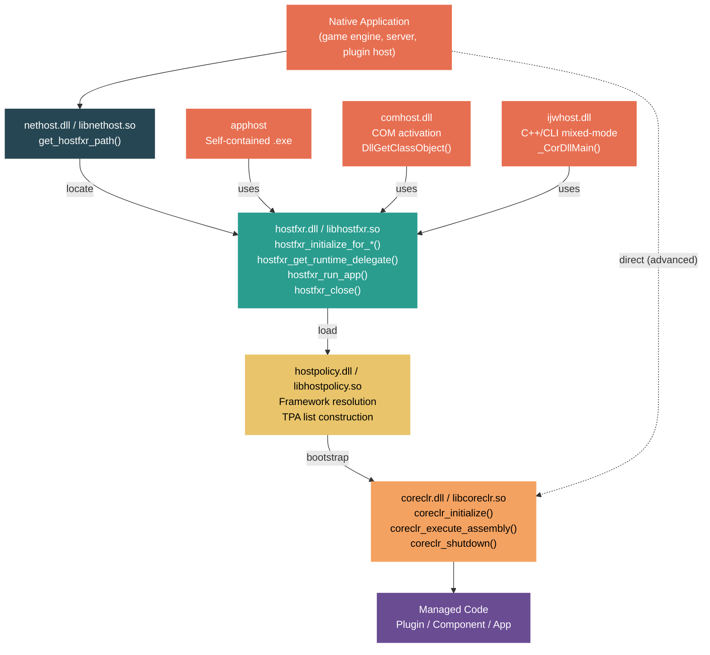

# Level 5: Expert / Contributor — Custom Hosting and the Native Hosting API

> **Target profile:** Developer embedding the CLR in native applications -- game engines, desktop shells, server processes, or plugin frameworks that host .NET managed code
> **Estimated effort:** 6 hours
> **Prerequisites:** [Module 4.1: CLR Startup](04-internals-clr-startup.md), [Module 3.10: Native Interop](03-advanced-native-interop.md)
> [Version en espanol](../es/05-expert-hosting.md)

---

## Learning Objectives

By the end of this module you will be able to:

1. Describe the four-layer hosting architecture (nethost, hostfxr, hostpolicy, coreclr) and the responsibility of each layer.
2. Use the `nethost` library to discover installed .NET runtimes and locate `hostfxr` from a native application.
3. Initialize the hosting components using `hostfxr_initialize_for_runtime_config` and `hostfxr_initialize_for_dotnet_command_line`, and explain when to use each.
4. Load managed assemblies and obtain native function pointers to managed methods via `hostfxr_get_runtime_delegate` and the `load_assembly_and_get_function_pointer` delegate.
5. Explain how `apphost` is customized for self-contained and single-file deployment scenarios, and how to build a custom native host.
6. Describe how `comhost` and `ijwhost` leverage the hosting API for COM activation and mixed-mode C++/CLI scenarios.
7. Use the low-level `coreclr_initialize` / `coreclr_execute_assembly` / `coreclr_shutdown` API for direct runtime embedding when the higher-level API is not suitable.
8. Debug hosting failures using `DOTNET_TRACE_HOST`, error writer callbacks, and native debuggers.

---

## Concept Map



---

## Curriculum

### Lesson 1 -- The Hosting API Landscape: Four Layers

#### What you'll learn

The .NET hosting API is organized into four distinct native libraries that form a layered stack. Understanding which layer to use -- and when -- is the first decision every native host must make.

#### The concept

The four layers, from outermost to innermost:

| Layer | Library | Responsibility |
|-------|---------|----------------|
| **nethost** | `nethost.dll` / `libnethost.so` | Discover installed runtimes. Locate `hostfxr`. |
| **hostfxr** | `hostfxr.dll` / `libhostfxr.so` | Initialize hosting context. Resolve frameworks. Provide runtime delegates. Run applications. |
| **hostpolicy** | `hostpolicy.dll` / `libhostpolicy.so` | Process `.deps.json`. Build TPA list. Load `coreclr`. |
| **coreclr** | `coreclr.dll` / `libcoreclr.so` | Initialize the execution engine. JIT, GC, type system. Execute managed code. |

Most native hosts interact only with **nethost** and **hostfxr**. The hostpolicy and coreclr layers are loaded and managed transparently by hostfxr. Direct use of coreclr is reserved for advanced embedding scenarios where you need full control over runtime configuration.

The design rationale for this layering is documented in `docs/design/features/native-hosting.md`:

> "The proposal is to add a new host library `nethost` which can be used by native host to easily locate `hostfxr`. Going forward the library could also include easy-to-use APIs for common scenarios."

Each built-in .NET host (apphost, comhost, ijwhost) is essentially a thin wrapper that locates hostfxr and calls its APIs. A custom native host follows the same pattern.

#### In the source code

**nethost header: `src/native/corehost/nethost/nethost.h`**

The entire public surface of nethost is a single function:

```c
NETHOST_API int NETHOST_CALLTYPE get_hostfxr_path(
    char_t * buffer,
    size_t * buffer_size,
    const struct get_hostfxr_parameters *parameters);
```

**hostfxr header: `src/native/corehost/hostfxr.h`**

The hostfxr API surface includes initialization, property management, delegate acquisition, and cleanup:

```c
// Key function pointer typedefs:
hostfxr_initialize_for_dotnet_command_line_fn  // Initialize for running an app
hostfxr_initialize_for_runtime_config_fn       // Initialize for loading components
hostfxr_get_runtime_property_value_fn          // Read runtime properties
hostfxr_set_runtime_property_value_fn          // Set runtime properties (before runtime load)
hostfxr_get_runtime_delegate_fn                // Get delegates to load/call managed code
hostfxr_run_app_fn                             // Run a managed application
hostfxr_close_fn                               // Close host context
```

**coreclr header: `src/coreclr/hosts/inc/coreclrhost.h`**

The low-level coreclr API provides direct runtime control:

```c
coreclr_initialize(...)        // Create and start CLR host, create app domain
coreclr_execute_assembly(...)  // Run a managed assembly's entry point
coreclr_create_delegate(...)   // Get native function pointer to managed method
coreclr_shutdown(...)          // Unload app domain and stop CLR
```

**Delegate types: `src/native/corehost/hostfxr.h` lines 27-38**

The `hostfxr_delegate_type` enum defines the available runtime delegates:

```c
enum hostfxr_delegate_type
{
    hdt_com_activation,
    hdt_load_in_memory_assembly,
    hdt_winrt_activation,
    hdt_com_register,
    hdt_com_unregister,
    hdt_load_assembly_and_get_function_pointer,  // Main one for custom hosts
    hdt_get_function_pointer,                     // .NET 5+
    hdt_load_assembly,                            // .NET 8+
    hdt_load_assembly_bytes,                      // .NET 8+
};
```

#### Hands-on exercise

1. **Map the layers in your filesystem:** On a machine with .NET installed, locate all four libraries. On Windows with a typical install:
   ```
   nethost:    C:\Program Files\dotnet\packs\Microsoft.NETCore.App.Host.win-x64\<ver>\runtimes\win-x64\native\nethost.dll
   hostfxr:    C:\Program Files\dotnet\host\fxr\<ver>\hostfxr.dll
   hostpolicy: C:\Program Files\dotnet\shared\Microsoft.NETCore.App\<ver>\hostpolicy.dll
   coreclr:    C:\Program Files\dotnet\shared\Microsoft.NETCore.App\<ver>\coreclr.dll
   ```
   On Linux, replace `.dll` with `.so` and look under `/usr/share/dotnet/`.

2. **Read the design document:** Open `docs/design/features/native-hosting.md` and read the "Longer term vision" section. Note the four-step model: Locate hosting components -> Initialize host context -> Load managed code -> Access/execute managed code. Compare this to the four layers.

3. **Examine a built-in host:** Look at `src/native/corehost/apphost/standalone/hostfxr_resolver.cpp`. The apphost is a minimal host that resolves hostfxr and calls into it. Your custom host will follow this same pattern.

#### Key takeaway

The four-layer architecture exists so that native hosts can work with SDK-produced artifacts (runtimeconfig.json, deps.json) without reimplementing framework resolution. Unless you have a very specific reason to bypass the upper layers, always start with nethost + hostfxr.

#### Common misconception

Many developers try to directly load `coreclr.dll` and call `coreclr_initialize`. While this works, it means you must manually handle framework resolution, TPA list construction, and all runtime properties. The hostfxr API does all of this automatically by reading your `.runtimeconfig.json`.

---

### Lesson 2 -- nethost: Finding the Runtime

#### What you'll learn

The first step in any native hosting scenario is locating the hostfxr library on the target machine. The `nethost` library provides a single, cross-platform function to accomplish this.

#### The concept

`nethost` is designed to be redistributed with your native application. It is a small, stable library with a single export: `get_hostfxr_path()`. The function searches for an installed .NET runtime in the following order:

1. If `dotnet_root` is specified in the parameters, search under that path.
2. If `assembly_path` is specified, search as if that assembly were an apphost (useful for self-contained layouts).
3. Otherwise, use environment variables (`DOTNET_ROOT`) and global registration (Windows registry, `/etc/dotnet/install_location` on Linux).

The function returns the full path to `hostfxr.dll` / `libhostfxr.so`. Your native host then loads this library dynamically and resolves the function pointers it needs.

#### In the source code

**Header: `src/native/corehost/nethost/nethost.h`**

The parameters structure controls search behavior:

```c
struct get_hostfxr_parameters {
    size_t size;
    const char_t *assembly_path;  // Optional: path to component assembly
    const char_t *dotnet_root;    // Optional: explicit .NET root directory
};
```

**Implementation: `src/native/corehost/nethost/nethost.cpp` lines 20-59**

The implementation first validates inputs, then delegates to `fxr_resolver`:

```cpp
NETHOST_API int NETHOST_CALLTYPE get_hostfxr_path(
    char_t * buffer,
    size_t * buffer_size,
    const struct get_hostfxr_parameters *parameters)
{
    if (buffer_size == nullptr)
        return StatusCode::InvalidArgFailure;

    trace::setup();
    error_writer_scope_t writer_scope(swallow_trace);
    // ...
    if (parameters != nullptr && parameters->dotnet_root != nullptr)
    {
        // Use explicit dotnet root
        if (!fxr_resolver::try_get_path_from_dotnet_root(dotnet_root, &fxr_path))
            return StatusCode::CoreHostLibMissingFailure;
    }
    else
    {
        // Use environment/global registration
        if (!fxr_resolver::try_get_path(root_path, &dotnet_root, &fxr_path))
            return StatusCode::CoreHostLibMissingFailure;
    }
    // Copy fxr_path to buffer...
}
```

Note the `swallow_trace` error writer at line 14 -- nethost intentionally suppresses trace output because it is running inside a process it does not own. The host can opt into tracing separately.

#### Hands-on exercise

1. **Write a minimal native host that locates hostfxr.** This is the foundation for everything that follows:

   ```c
   // locate_hostfxr.c
   #include <stdio.h>
   #include <nethost.h>

   int main()
   {
       char_t buffer[1024];
       size_t buffer_size = sizeof(buffer) / sizeof(char_t);

       int rc = get_hostfxr_path(buffer, &buffer_size, NULL);
       if (rc != 0)
       {
           printf("Failed to locate hostfxr: 0x%x\n", rc);
           return 1;
       }

       printf("hostfxr found at: %ls\n", buffer);  // %s on Linux
       return 0;
   }
   ```

   Link against `nethost.lib` (Windows) or `libnethost.a` (Linux/macOS). The headers and library are in the `Microsoft.NETCore.App.Host.<rid>` NuGet package under `runtimes/<rid>/native/`.

2. **Test with explicit dotnet_root:** Modify the example to pass a `get_hostfxr_parameters` with `dotnet_root` pointing to a specific .NET installation. Verify it finds the hostfxr under that path.

3. **Test with assembly_path:** Create a self-contained published app (`dotnet publish -r <rid> --self-contained`). Pass the output assembly path as `assembly_path`. Observe that `get_hostfxr_path` now returns the hostfxr from the self-contained layout rather than the global install.

4. **Handle the buffer-too-small case:** Pass a `buffer_size` of 1. The function returns `0x80008098` (`HostApiBufferTooSmall`) and sets `buffer_size` to the required size. Allocate the correct buffer and retry.

#### Key takeaway

`nethost` is deliberately minimal -- one function, no state, no runtime dependency. It exists so that your native application does not need to hardcode .NET installation paths or implement the runtime discovery logic itself.

#### Common misconception

`nethost` does not load the runtime. It only locates `hostfxr`. After `get_hostfxr_path` succeeds, you must dynamically load the returned library path (via `LoadLibrary`/`dlopen`) and resolve the hostfxr function pointers yourself.

---

### Lesson 3 -- hostfxr: Initializing and Running Managed Code

#### What you'll learn

Once you have loaded `hostfxr`, you use its API to initialize a hosting context, optionally configure runtime properties, and then either run a managed application or load managed components and call their methods from native code.

#### The concept

There are two initialization paths, each for a different scenario:

| Function | Scenario | Use when... |
|----------|----------|-------------|
| `hostfxr_initialize_for_dotnet_command_line` | Running an application | You want to execute a managed app's `Main()` entry point in-process. |
| `hostfxr_initialize_for_runtime_config` | Loading components | You want to load managed assemblies and call specific methods from native code. |

Both return a `hostfxr_handle` that represents the initialized host context. Key rules:

- **Neither function loads the runtime.** They only prepare configuration (resolve frameworks, process deps.json, compute runtime properties).
- **Only the first context in the process** can set runtime properties. Subsequent contexts are "secondary" and read-only.
- **You must call `hostfxr_close`** on every handle you obtain.

After initialization, you either:
- Call `hostfxr_run_app` to run the managed application (blocks until the app exits), or
- Call `hostfxr_get_runtime_delegate` to get function pointers for loading and calling managed code.

The most commonly used delegate type is `hdt_load_assembly_and_get_function_pointer`, which loads a managed assembly in an isolated `AssemblyLoadContext` and returns a native function pointer to a specified static method.

#### In the source code

**hostfxr initialization types: `src/native/corehost/hostfxr.h` lines 83-88**

```c
struct hostfxr_initialize_parameters
{
    size_t size;
    const char_t *host_path;     // Path to the native host executable
    const char_t *dotnet_root;   // Path to .NET installation root
};
```

**Runtime delegate for loading components: `src/native/corehost/hostfxr.h` lines 259-283**

`hostfxr_get_runtime_delegate` starts the runtime (if not already started) and returns a function pointer for the requested delegate type. For `hdt_load_assembly_and_get_function_pointer`, the returned delegate has this signature:

```c
int load_assembly_and_get_function_pointer(
    const char_t *assembly_path,      // Path to the managed assembly
    const char_t *type_name,          // Assembly-qualified type name
    const char_t *method_name,        // Static method name
    const char_t *delegate_type_name, // Delegate type, or NULL for default, or -1 for UnmanagedCallersOnly
    void         *reserved,           // Must be NULL
    void        **delegate);          // Out: native function pointer
```

**Test code showing complete flow: `src/native/corehost/test/nativehost/host_context_test.cpp`**

The test suite in this file demonstrates the full API sequence, including parallel initialization from multiple threads, property inspection, and secondary context creation.

#### Hands-on exercise

1. **Build a complete component host.** This is the canonical pattern for hosting .NET plugins:

   ```c
   // Step 1: Locate hostfxr (from Lesson 2)
   get_hostfxr_path(buffer, &buffer_size, NULL);
   void *lib = load_library(buffer);

   // Step 2: Get hostfxr function pointers
   hostfxr_initialize_for_runtime_config_fn init_fptr =
       get_export(lib, "hostfxr_initialize_for_runtime_config");
   hostfxr_get_runtime_delegate_fn get_delegate_fptr =
       get_export(lib, "hostfxr_get_runtime_delegate");
   hostfxr_close_fn close_fptr =
       get_export(lib, "hostfxr_close");

   // Step 3: Initialize for component loading
   hostfxr_handle cxt = NULL;
   int rc = init_fptr(L"MyPlugin.runtimeconfig.json", NULL, &cxt);
   // rc == 0: first context. rc == 1: runtime already loaded (secondary context).

   // Step 4: Get the load_assembly_and_get_function_pointer delegate
   load_assembly_and_get_function_pointer_fn load_and_get = NULL;
   rc = get_delegate_fptr(cxt, hdt_load_assembly_and_get_function_pointer,
                          (void**)&load_and_get);

   // Step 5: Load a managed assembly and get a function pointer
   typedef int (CORECLR_DELEGATE_CALLTYPE *plugin_entry_fn)(void *arg, int arg_size);
   plugin_entry_fn plugin_entry = NULL;
   rc = load_and_get(
       L"MyPlugin.dll",
       L"MyPlugin.PluginClass, MyPlugin",
       L"Entry",
       NULL,      // default delegate type
       NULL,      // reserved
       (void**)&plugin_entry);

   // Step 6: Call the managed method!
   int result = plugin_entry(NULL, 0);

   // Step 7: Cleanup
   close_fptr(cxt);
   ```

2. **Set runtime properties before loading:** Between steps 3 and 4, use `hostfxr_set_runtime_property_value` to configure runtime behavior:
   ```c
   hostfxr_set_runtime_property_value_fn set_prop =
       get_export(lib, "hostfxr_set_runtime_property_value");
   set_prop(cxt, L"STARTUP_HOOKS", L"MyStartupHook.dll");
   set_prop(cxt, L"System.GC.Server", L"true");
   ```
   This is only allowed on the first host context before the runtime loads.

3. **Use UnmanagedCallersOnly:** Instead of passing `NULL` as the delegate type, pass `UNMANAGEDCALLERSONLY_METHOD` (value `-1` cast to `const char_t*`). The target managed method must be decorated with `[UnmanagedCallersOnly]` and use blittable types. This avoids the marshalling overhead of delegate-based interop.

4. **Register an error writer:** Before initialization, register a callback to capture error messages:
   ```c
   hostfxr_set_error_writer_fn set_writer =
       get_export(lib, "hostfxr_set_error_writer");
   set_writer(my_error_callback);
   ```
   The error writer is per-thread and will receive messages from both hostfxr and hostpolicy.

5. **Run a managed application in-process:** Use `hostfxr_initialize_for_dotnet_command_line` + `hostfxr_run_app` to run a full .NET application inside your native process. Note that `hostfxr_run_app` blocks until the managed app exits and can only be called once per process.

#### Key takeaway

The hostfxr API provides a two-phase model: initialize (resolve frameworks, prepare configuration) then execute (load managed code or run app). This split gives the native host a window to inspect and modify runtime properties between the two phases. For component-hosting scenarios, the `load_assembly_and_get_function_pointer` delegate is the primary mechanism for calling managed code from native code.

#### Common misconception

Calling `hostfxr_initialize_for_runtime_config` does not load the runtime. The runtime is loaded lazily the first time you call `hostfxr_get_runtime_delegate` or `hostfxr_run_app`. This means you can initialize the context, modify properties, and even close it without the runtime ever being loaded.

---

### Lesson 4 -- Custom App Hosts: apphost, Self-Contained, and Single-File

#### What you'll learn

The `apphost` is the .NET-provided native executable that acts as the entry point for published applications. Understanding how it works is essential for building custom hosts that need similar capabilities -- self-contained deployment, single-file bundles, or custom error handling.

#### The concept

When you run `dotnet publish`, the SDK produces an `apphost` -- a native executable (`.exe` on Windows, ELF binary on Linux) with the target assembly path embedded directly in its binary image. The apphost is a copy of the generic host executable with two customizations:

1. **Embedded assembly path:** A placeholder string in the binary is overwritten with the relative path to the managed DLL (e.g., `MyApp.dll`).
2. **Embedded bundle marker:** For single-file deployments, a marker at a known offset in the binary indicates the location of the bundled assemblies.

The apphost's execution flow is:
1. Read the embedded assembly path from the binary image.
2. Locate hostfxr (using the same `fxr_resolver` logic that nethost uses).
3. Call `hostfxr_main_startupinfo` with the host path, dotnet root, and app path.
4. hostfxr takes over from here -- resolving frameworks, loading hostpolicy, and starting the runtime.

For self-contained deployments, the apphost finds hostfxr next to itself (in the publish output directory) rather than in a global .NET installation. For single-file deployments, the bundle marker tells the host infrastructure to extract or map bundled assemblies from the single executable.

#### In the source code

**Bundle marker: `src/native/corehost/apphost/bundle_marker.cpp`**

The bundle marker is a structure embedded in the apphost binary at build time. For single-file apps, the SDK writes the actual bundle offset here:

```cpp
static int64_t bundle_marker()
{
    // Contains the bundle_header_offset if this is a single-file bundle
    // Otherwise contains a sentinel value (0)
}
```

**Windows-specific error handling: `src/native/corehost/apphost/apphost.windows.cpp`**

The Windows apphost includes GUI-awareness detection and Event Log reporting:

```cpp
bool is_gui_application()
{
    // Reads PE subsystem from the module header
    UINT16 subsystem = reinterpret_cast<IMAGE_NT_HEADERS*>(...)->OptionalHeader.Subsystem;
    return subsystem == IMAGE_SUBSYSTEM_WINDOWS_GUI;
}
```

If the apphost is a GUI application and encounters a startup error, it shows a message box rather than printing to stderr. Errors are also written to the Windows Event Log.

**Main entry: `src/native/corehost/corehost.cpp`**

The `exe_start()` function (used by apphost) reads the embedded app path, resolves hostfxr, and calls into it. The standalone apphost variant in `src/native/corehost/apphost/standalone/hostfxr_resolver.cpp` handles the case where hostfxr is located relative to the apphost itself (self-contained layout).

#### Hands-on exercise

1. **Examine an apphost binary:** Publish a simple app and open the resulting `.exe` in a hex editor. Search for your DLL name (e.g., `MyApp.dll`) -- it appears as an embedded string. This is the placeholder that was overwritten during `dotnet publish`.

2. **Build a custom host with GUI error dialogs:** Write a Windows native host that, on failure, shows a `MessageBox` instead of writing to stderr. Use the same pattern as `apphost.windows.cpp`:
   ```c
   if (is_gui_application())
       MessageBox(NULL, error_message, L"Startup Error", MB_ICONERROR);
   else
       fprintf(stderr, "%ls\n", error_message);
   ```

3. **Compare framework-dependent vs self-contained resolution:** Publish the same app both ways:
   ```bash
   dotnet publish -o fd_out
   dotnet publish -r win-x64 --self-contained -o sc_out
   ```
   Run both with `DOTNET_TRACE_HOST=1`. Compare the hostfxr resolution paths. In the self-contained case, hostfxr is found adjacent to the executable. In the framework-dependent case, it is found in the global .NET installation.

4. **Examine single-file bundle structure:** Publish a single-file app:
   ```bash
   dotnet publish -r win-x64 --self-contained /p:PublishSingleFile=true -o sf_out
   ```
   The resulting executable contains all assemblies bundled after the native binary. Set `DOTNET_TRACE_HOST=1` and observe the bundle extraction/mapping trace messages.

#### Key takeaway

The apphost is not a black box -- it is a straightforward native program that embeds a path, locates hostfxr, and calls a single entry point. Understanding its structure enables you to build custom hosts with identical deployment models (self-contained, single-file) while adding your own initialization logic, error handling, or plugin architecture.

#### Common misconception

A common belief is that single-file deployment requires a special runtime. In fact, the same runtime is used -- the difference is entirely in the host layer. The apphost contains a bundle marker that tells hostpolicy to read assemblies from the executable's embedded data rather than from disk. The runtime itself is unchanged.

---

### Lesson 5 -- COM and IJW Hosting

#### What you'll learn

Two specialized hosts -- `comhost` and `ijwhost` -- leverage the hosting API for specific interop scenarios. Understanding their implementation reveals how the hosting API supports diverse activation models beyond simple function pointer calls.

#### The concept

**comhost** is a native DLL that acts as a COM server for managed .NET classes. It enables native COM clients to activate .NET objects via standard COM mechanisms (`CoCreateInstance`, `DllGetClassObject`). The workflow:

1. The COM infrastructure calls `DllGetClassObject` on the comhost DLL.
2. comhost reads a CLSID map embedded in the DLL (mapping COM CLSIDs to managed type names).
3. comhost uses the hostfxr API to initialize the runtime and get a `get_function_pointer` delegate.
4. It calls into `Internal.Runtime.InteropServices.ComActivator` in System.Private.CoreLib to create the managed COM object.
5. The class factory is returned to the COM client.

**ijwhost** handles C++/CLI mixed-mode assemblies (It Just Works interop). When a mixed-mode DLL is loaded, the loader calls `_CorDllMain` (exported by ijwhost) instead of the regular `DllMain`. ijwhost:

1. Validates the PE has a managed header.
2. Patches the vtable entries with bootstrap thunks that will trigger runtime initialization on first call.
3. When a managed method is first called, the thunk loads the runtime, loads the assembly into memory, and resolves the managed method.

Both hosts share the pattern of using `load_fxr_and_get_delegate` -- a helper that locates hostfxr, initializes a context from a `.runtimeconfig.json` adjacent to the host DLL, and gets a runtime delegate.

#### In the source code

**comhost: `src/native/corehost/comhost/comhost.cpp`**

The COM activation entry point at line 196:

```cpp
COM_API HRESULT STDMETHODCALLTYPE DllGetClassObject(
    _In_ REFCLSID rclsid,
    _In_ REFIID riid,
    _Outptr_ LPVOID FAR* ppv)
{
    // 1. Look up CLSID in embedded map
    clsid_map map;
    RETURN_HRESULT_IF_EXCEPT(map = comhost::get_clsid_map());
    clsid_map::const_iterator iter = map.find(rclsid);
    if (iter == std::end(map))
        return CLASS_E_CLASSNOTAVAILABLE;

    // 2. Get COM activation delegate via hostfxr
    com_delegates act;
    int ec = get_com_delegate(hostfxr_delegate_type::hdt_com_activation, &app_path, act, &load_context);

    // 3. Call managed ComActivator to create class factory
    com_activation_context cxt { rclsid, riid, app_path.c_str(), ... };
    act.delegate(&cxt, load_context);

    // 4. Query the class factory for the requested interface
    hr = classFactory->QueryInterface(riid, ppv);
}
```

The comhost also implements `DllRegisterServer`/`DllUnregisterServer` (lines 561-665) for COM registration, writing CLSID entries to the Windows registry.

**CLSID map: `src/native/corehost/comhost/clsidmap.cpp`**

The CLSID map is a JSON structure embedded in the comhost DLL at build time. It maps COM CLSIDs to assembly-qualified managed type names.

**ijwhost: `src/native/corehost/ijwhost/ijwhost.cpp`**

The mixed-mode entry point at line 69:

```cpp
IJW_API BOOL STDMETHODCALLTYPE _CorDllMain(HINSTANCE hInst, DWORD dwReason, LPVOID lpReserved)
{
    PEDecoder pe(hInst);

    if (dwReason == DLL_PROCESS_ATTACH)
    {
        if (!pe.HasCorHeader())
            return FALSE;
        // Install bootstrap thunks that will trigger runtime loading
        if (!patch_vtable_entries(pe))
            return FALSE;
    }
    // ...
    if (dwReason == DLL_PROCESS_DETACH)
        release_bootstrap_thunks(pe);
}
```

The bootstrap thunks (`src/native/corehost/ijwhost/bootstrap_thunk_chunk.cpp`) are small code stubs that intercept calls to managed methods. On first call, the thunk triggers `get_load_in_memory_assembly_delegate` which loads the mixed-mode assembly via hostfxr.

**ijwhost directory contents:**

```
ijwhost.cpp           - Main entry (_CorDllMain)
ijwhost.h             - Declarations
ijwthunk.cpp          - Thunk patching logic
bootstrap_thunk_chunk.cpp/h - Executable thunk allocation
pedecoder.cpp/h       - PE image parsing
corhdr.h              - COR header definitions
amd64/                - x64-specific thunk code
arm64/                - ARM64-specific thunk code
i386/                 - x86-specific thunk code
```

#### Hands-on exercise

1. **Examine COM activation flow:** Create a managed COM-visible class:
   ```csharp
   [ComVisible(true)]
   [Guid("12345678-1234-1234-1234-123456789ABC")]
   public class MyComObject : IMyInterface
   {
       public int DoWork() => 42;
   }
   ```
   Publish with `<EnableComHosting>true</EnableComHosting>`. Examine the generated `.comhost.dll` and its adjacent `.runtimeconfig.json`. Register with `regsvr32 MyLib.comhost.dll`.

2. **Trace COM activation:** Set `DOTNET_TRACE_HOST=1` before activating the COM object from a native client. Observe the hostfxr initialization, runtime loading, and managed delegate call.

3. **Read the CLSID map:** The CLSID map is embedded in the comhost DLL. Use a tool to extract strings from the DLL and find the JSON mapping `{"clsid": "...", "assembly": "...", "type": "..."}`.

4. **Examine ijwhost architecture:** Look at the bootstrap thunks in `src/native/corehost/ijwhost/amd64/` (or your target architecture). Each thunk preserves registers, calls the managed method loader, and then jumps to the resolved method address. This is analogous to the CLR's prestub mechanism from Module 4.1.

#### Key takeaway

comhost and ijwhost demonstrate that the hosting API is flexible enough to support fundamentally different activation models -- COM class factories and C++/CLI vtable patching -- using the same underlying hostfxr mechanism. Both follow the pattern: locate hostfxr, initialize context from adjacent runtimeconfig.json, get a delegate, call managed code.

#### Common misconception

comhost does not implement COM itself. It is a thin native shim that satisfies the COM infrastructure's requirements (`DllGetClassObject`, `DllRegisterServer`) and delegates to the managed `ComActivator` class in System.Private.CoreLib. The actual COM object creation and marshalling happens in managed code.

---

### Lesson 6 -- Advanced: Direct coreclr Hosting

#### What you'll learn

For maximum control over the runtime -- specifying exact TPA lists, bypassing framework resolution, or embedding .NET in environments where the standard hosting stack is unavailable -- you can use the low-level coreclr API directly.

#### The concept

The coreclr API (`coreclrhost.h`) provides five functions:

| Function | Purpose |
|----------|---------|
| `coreclr_initialize` | Create CLR host, create app domain, start the runtime |
| `coreclr_set_error_writer` | Register error callback |
| `coreclr_execute_assembly` | Run a managed assembly's `Main()` |
| `coreclr_create_delegate` | Get native function pointer to a managed method |
| `coreclr_shutdown` / `coreclr_shutdown_2` | Stop the CLR and unload the app domain |

Using this API means you are responsible for:
- Locating `coreclr.dll`/`libcoreclr.so` yourself.
- Building the full list of Trusted Platform Assemblies (TPA) -- every framework assembly the runtime needs.
- Setting all runtime properties (`TRUSTED_PLATFORM_ASSEMBLIES`, `APP_PATHS`, `NATIVE_DLL_SEARCH_DIRECTORIES`, etc.).
- Managing the runtime lifecycle (there is no framework resolution, no deps.json processing, no runtimeconfig.json support).

This approach is appropriate for:
- **Game engines** embedding .NET as a scripting runtime with a fixed set of known assemblies.
- **Minimal embedded environments** where the full .NET SDK hosting stack is not available.
- **Custom sandboxing** where you need precise control over what assemblies are available.

#### In the source code

**coreclr API: `src/coreclr/hosts/inc/coreclrhost.h`**

The `coreclr_initialize` function creates the runtime:

```c
CORECLR_HOSTING_API(coreclr_initialize,
    const char* exePath,                // Path to the host executable
    const char* appDomainFriendlyName,  // Display name for the app domain
    int propertyCount,                  // Number of property key-value pairs
    const char** propertyKeys,          // Property keys
    const char** propertyValues,        // Property values
    void** hostHandle,                  // Out: host handle
    unsigned int* domainId);            // Out: app domain ID
```

The critical properties you must set:

```c
const char *propertyKeys[] = {
    "TRUSTED_PLATFORM_ASSEMBLIES",       // Semicolon-separated list of all framework assemblies
    "APP_PATHS",                          // Paths to search for application assemblies
    "NATIVE_DLL_SEARCH_DIRECTORIES",     // Paths for native library resolution
    "APP_CONTEXT_BASE_DIRECTORY",        // Base directory for the application
};
```

**hostpolicy bridge: `src/native/corehost/hostpolicy/coreclr.cpp` lines 29-80**

The `coreclr_t::create()` function shows exactly how hostpolicy calls `coreclr_initialize`:

```cpp
pal::hresult_t coreclr_t::create(
    const pal::string_t& libcoreclr_path,
    const char* exe_path,
    const char* app_domain_friendly_name,
    const coreclr_property_bag_t &properties,
    std::unique_ptr<coreclr_t> &inst)
{
    if (!coreclr_bind(libcoreclr_path))
    {
        trace::error(_X("Failed to bind to CoreCLR at '%s'"), libcoreclr_path.c_str());
        return StatusCode::CoreClrBindFailure;
    }

    // Convert property bag to parallel key/value arrays
    // ...

    hr = coreclr_contract.coreclr_initialize(
        exe_path,
        app_domain_friendly_name,
        propertyCount,
        keys.data(),
        values.data(),
        &host_handle,
        &domain_id);
}
```

This is exactly what you would write in a custom direct host -- the only difference is that hostpolicy has already computed the property values from deps.json files.

**coreclr_create_delegate: `src/coreclr/hosts/inc/coreclrhost.h` lines 104-124**

```c
CORECLR_HOSTING_API(coreclr_create_delegate,
    void* hostHandle,
    unsigned int domainId,
    const char* entryPointAssemblyName,  // Simple assembly name (not path)
    const char* entryPointTypeName,      // Fully qualified type name
    const char* entryPointMethodName,    // Method name
    void** delegate);                     // Out: function pointer
```

Unlike `load_assembly_and_get_function_pointer` from hostfxr, this function uses assembly names (not paths) and resolves types from already-loaded assemblies.

#### Hands-on exercise

1. **Build a minimal direct host.** This example demonstrates the game engine / embedded scenario:

   ```c
   // direct_host.c - Minimal coreclr embedding
   #include "coreclrhost.h"

   int main()
   {
       // 1. Load coreclr library
       void *coreclr_lib = load_library("path/to/coreclr.dll");
       coreclr_initialize_ptr init = get_export(coreclr_lib, "coreclr_initialize");
       coreclr_create_delegate_ptr create_del = get_export(coreclr_lib, "coreclr_create_delegate");
       coreclr_shutdown_ptr shutdown = get_export(coreclr_lib, "coreclr_shutdown");

       // 2. Build TPA list (must include ALL framework assemblies)
       char tpa_list[65536] = {0};
       build_tpa_list("path/to/shared/Microsoft.NETCore.App/<ver>/", tpa_list);

       // 3. Initialize the runtime
       const char *keys[] = {
           "TRUSTED_PLATFORM_ASSEMBLIES",
           "APP_PATHS",
       };
       const char *values[] = {
           tpa_list,
           "path/to/my/app/",
       };

       void *host_handle;
       unsigned int domain_id;
       init("direct_host", "MyDomain", 2, keys, values, &host_handle, &domain_id);

       // 4. Get function pointer to managed method
       typedef int (*plugin_fn)(int);
       plugin_fn managed_add;
       create_del(host_handle, domain_id,
                  "MyPlugin", "MyPlugin.Calculator", "Add",
                  (void**)&managed_add);

       // 5. Call managed code!
       int result = managed_add(42);

       // 6. Shutdown
       shutdown(host_handle, domain_id);
   }
   ```

2. **Build the TPA list correctly.** The TPA must include every assembly the runtime needs. Enumerate all `.dll` files in the shared framework directory:
   ```c
   void build_tpa_list(const char *framework_dir, char *tpa_list)
   {
       // For each .dll in framework_dir:
       //   append full path + ";" (or ":" on Unix) to tpa_list
   }
   ```
   Missing a single framework assembly will cause mysterious `FileNotFoundException` at runtime.

3. **Compare hostfxr vs direct hosting.** Run the same managed code through both approaches. With `DOTNET_TRACE_HOST=1`, observe that the hostfxr path produces extensive trace output from framework resolution and deps.json processing. The direct coreclr path has no such output -- you are on your own.

4. **Game engine scenario:** Imagine a game engine that loads .NET scripts as plugins. Each plugin is a managed DLL in a known directory. The game engine:
   - Initializes coreclr once at startup with a TPA list containing the framework and a shared API assembly.
   - For each plugin, calls `coreclr_create_delegate` to get function pointers to well-known entry points (`OnLoad`, `OnUpdate`, `OnDestroy`).
   - Calls these function pointers on the game loop thread.
   - Calls `coreclr_shutdown` on exit.

   This is precisely how engines like Unity (historically) and custom game engines embed the CLR.

5. **Lifecycle management:** Call `coreclr_shutdown_2` instead of `coreclr_shutdown` to get the latched exit code -- the last exit code set by managed code via `Environment.ExitCode`.

#### Key takeaway

Direct coreclr hosting gives you maximum control at the cost of maximum responsibility. You must handle everything that hostfxr/hostpolicy normally do: locating assemblies, building the TPA list, setting properties. Use this approach only when you have a good reason to bypass the standard hosting stack -- typically when embedding .NET in a non-.NET application with a fixed, known set of assemblies.

#### Common misconception

`coreclr_initialize` does not just "start" the runtime -- it performs the entire `EEStartupHelper()` sequence from Module 4.1 (GC, JIT, type system, thread manager initialization). Once initialized, the runtime cannot be re-initialized in the same process. `coreclr_shutdown` shuts down the runtime permanently; you cannot initialize it again.

---

## Source Reading Guide

The files below are listed in order of reading priority for this module. The star rating indicates difficulty: more stars means more C++ complexity and prerequisite knowledge.

| Stars | File | What to look for |
|-------|------|-----------------|
| ++ | `src/native/corehost/nethost/nethost.h` | The single `get_hostfxr_path` export -- the entire nethost API surface |
| ++ | `src/native/corehost/hostfxr.h` | All hostfxr function pointer typedefs -- initialization, properties, delegates, cleanup |
| ++ | `src/coreclr/hosts/inc/coreclrhost.h` | The low-level coreclr hosting API -- 5 functions for direct embedding |
| +++ | `src/native/corehost/nethost/nethost.cpp` | nethost implementation -- fxr_resolver delegation, trace suppression |
| +++ | `src/native/corehost/apphost/bundle_marker.cpp` | Bundle marker structure for single-file deployment |
| +++ | `src/native/corehost/apphost/apphost.windows.cpp` | Windows-specific apphost behavior -- GUI detection, Event Log |
| +++ | `src/native/corehost/apphost/standalone/hostfxr_resolver.cpp` | How apphost locates hostfxr in self-contained layouts |
| ++++ | `src/native/corehost/hostpolicy/coreclr.cpp` | How hostpolicy bridges to coreclr_initialize -- property bag conversion |
| ++++ | `src/native/corehost/comhost/comhost.cpp` | COM activation flow -- DllGetClassObject, CLSID map, managed delegate calls |
| ++++ | `src/native/corehost/ijwhost/ijwhost.cpp` | C++/CLI mixed-mode hosting -- _CorDllMain, bootstrap thunks |
| ++++ | `src/native/corehost/test/nativehost/host_context_test.cpp` | Complete test scenarios for the hosting API -- parallel init, property inspection |
| +++++ | `docs/design/features/native-hosting.md` | Full design specification -- rationale, synchronization rules, version compat |

---

## Tools for Exploring the Hosting API

### DOTNET_TRACE_HOST

The most important debugging tool for hosting scenarios:

```bash
# Windows cmd:
set DOTNET_TRACE_HOST=1
MyNativeHost.exe

# Linux/macOS:
DOTNET_TRACE_HOST=1 ./my_native_host
```

This produces timestamped trace output from hostfxr and hostpolicy showing every resolution step, property value, and decision point.

### Error Writer Callback

Register a callback to capture errors programmatically:

```c
hostfxr_set_error_writer_fn set_writer =
    get_export(hostfxr_lib, "hostfxr_set_error_writer");

void my_error_handler(const char_t *message) {
    log_to_file("HOSTFXR ERROR: %s\n", message);
}

set_writer(my_error_handler);
```

The error writer is per-thread. The previously registered writer is returned so you can chain or restore it.

### Native Debugger Breakpoints

For tracing the hosting flow with WinDbg or LLDB:

```
# Break on hosting API calls:
bp nethost!get_hostfxr_path
bp hostfxr!hostfxr_initialize_for_runtime_config
bp hostfxr!hostfxr_get_runtime_delegate
bp hostpolicy!corehost_main
bp coreclr!coreclr_initialize

# LLDB equivalents:
b get_hostfxr_path
b hostfxr_initialize_for_runtime_config
b coreclr_initialize
```

### Environment Diagnostics

```bash
# Windows:
dotnet --info                # Show installed runtimes and SDKs
dotnet --list-runtimes       # Just installed runtimes
dotnet --list-sdks           # Just installed SDKs

# Programmatic equivalent via hostfxr:
hostfxr_get_dotnet_environment_info(NULL, NULL, my_callback, my_context);
```

---

## Self-Assessment

After completing this module, you should be able to answer:

1. **Layer selection:** Your game engine needs to load .NET plugin DLLs and call specific methods. Which hosting API layer should you use -- nethost+hostfxr, or direct coreclr? What are the tradeoffs?
2. **Initialization paths:** Explain the difference between `hostfxr_initialize_for_dotnet_command_line` and `hostfxr_initialize_for_runtime_config`. When would you use each?
3. **Runtime properties:** You want to enable server GC for your hosted runtime. At what point in the hosting sequence can you set this property? What happens if you try to set it after the runtime has loaded?
4. **Secondary contexts:** A COM component is activated while your native host already has the runtime running. What happens when `hostfxr_initialize_for_runtime_config` is called? What return code indicates this scenario?
5. **TPA construction:** You are using the direct coreclr API. Your managed code throws `FileNotFoundException` for `System.Text.Json`. What is the most likely cause?
6. **COM hosting:** Trace the call path from a native `CoCreateInstance` call through comhost to the managed `ComActivator`. How many hosting layers are involved?
7. **Error handling:** Your custom host initializes successfully but `hostfxr_get_runtime_delegate` returns a non-zero code. How would you diagnose this? Name two debugging approaches.
8. **Lifecycle:** Can you call `coreclr_initialize` twice in the same process? What about `hostfxr_initialize_for_runtime_config`?

---

## Connections to Other Modules

| Module | Relationship |
|--------|-------------|
| [Level 4: CLR Startup](04-internals-clr-startup.md) | Lesson 6 picks up exactly where Module 4.1 begins. `coreclr_initialize` triggers the same `EEStartupHelper()` sequence covered there. |
| [Level 3: Native Interop](03-advanced-native-interop.md) | The hosting API is itself a native interop boundary. `UnmanagedCallersOnly` methods (used with `hdt_load_assembly_and_get_function_pointer`) are covered in the interop module. |
| [Level 4: Assembly Loading](04-internals-assembly-loading.md) | The `load_assembly_and_get_function_pointer` delegate creates an isolated `AssemblyLoadContext`. The assembly loading module covers ALC internals and dependency resolution. |
| [Level 4: NativeAOT](04-internals-nativeaot.md) | NativeAOT-compiled libraries can be hosted without the CLR at all -- they export native functions directly. This is an alternative to the hosting API for some embedding scenarios. |
| [Level 2: Hosting](02-practitioner-hosting.md) | The managed hosting model (Generic Host, `IHostBuilder`) runs on top of the native hosting infrastructure covered here. |

---

## Glossary

| Term | Definition |
|------|-----------|
| **nethost** | Small, redistributable native library whose sole purpose is to locate `hostfxr` on the system. Ships with `Microsoft.NETCore.App.Host.<rid>` NuGet package. |
| **hostfxr** | Host framework resolver. Reads `.runtimeconfig.json`, resolves framework references, provides the primary hosting API. |
| **hostpolicy** | Host policy library. Processes `.deps.json`, builds the TPA list, loads `coreclr`. Managed transparently by hostfxr. |
| **host context** | Opaque handle (`hostfxr_handle`) representing an initialized hosting state. Must be closed with `hostfxr_close`. |
| **first host context** | The first context initialized in a process. Can set runtime properties and will load the runtime. All subsequent contexts are secondary. |
| **secondary host context** | Any context initialized after the first. Read-only for properties, must be compatible with the running runtime. |
| **TPA** | Trusted Platform Assemblies. A semicolon-separated list of full paths to every assembly the runtime is allowed to load from the default context. |
| **apphost** | The native executable produced by `dotnet publish`. Contains an embedded path to the managed DLL and a bundle marker for single-file. |
| **comhost** | Native DLL that acts as a COM server. Maps CLSIDs to managed types via an embedded JSON map. |
| **ijwhost** | Native DLL that enables C++/CLI mixed-mode assemblies. Patches vtable entries with bootstrap thunks. |
| **bundle marker** | A structure in the apphost binary that indicates whether (and where) bundled assemblies are embedded for single-file deployment. |
| **runtime delegate** | A function pointer obtained via `hostfxr_get_runtime_delegate`. Different delegate types support different operations (load assembly, get function pointer, COM activation). |
| **UnmanagedCallersOnly** | A .NET attribute marking a static method as directly callable from native code without delegate marshalling. Used with `UNMANAGEDCALLERSONLY_METHOD` delegate type. |
| **load_assembly_and_get_function_pointer** | The primary runtime delegate for component hosting. Loads an assembly into an isolated ALC and returns a function pointer to a managed method. |
| **coreclr_initialize** | Low-level C API exported by coreclr that bootstraps the Execution Engine. Requires manual TPA and property configuration. |
| **error writer** | A per-thread callback function that receives error messages from hostfxr and hostpolicy. Registered via `hostfxr_set_error_writer`. |

---

## References

1. **Native Hosting Design:** `docs/design/features/native-hosting.md` -- The authoritative specification for the hosting API, including synchronization rules and version compatibility.
2. **Host Components Design:** `docs/design/features/host-components.md` -- Architecture of the .NET host layer (apphost, hostfxr, hostpolicy).
3. **COM Activation Design:** `docs/design/features/COM-activation.md` -- How COM hosting works in .NET.
4. **IJW Activation Design:** `docs/design/features/IJW-activation.md` -- How C++/CLI mixed-mode hosting works.
5. **nethost header:** `src/native/corehost/nethost/nethost.h` -- The complete nethost API.
6. **hostfxr header:** `src/native/corehost/hostfxr.h` -- The complete hostfxr API with documentation comments.
7. **coreclr hosting header:** `src/coreclr/hosts/inc/coreclrhost.h` -- The low-level coreclr embedding API.
8. **coreclr_delegates header:** `src/native/corehost/coreclr_delegates.h` -- Function pointer signatures for runtime delegates.
9. **Official tutorial:** [Write a custom .NET host](https://learn.microsoft.com/dotnet/core/tutorials/netcore-hosting) -- Microsoft's step-by-step guide.
10. **NuGet package:** `Microsoft.NETCore.App.Host.<rid>` -- Contains nethost headers, libraries, and the apphost template binary.
