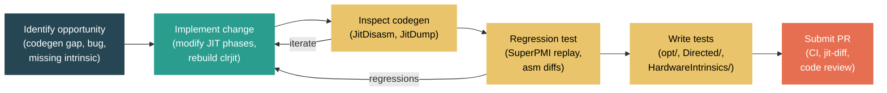

# Level 5: Expert — Contributing a JIT Change

> **Target profile:** Experienced .NET developer or compiler engineer ready to contribute an optimization, bug fix, or new intrinsic to RyuJIT
> **Estimated effort:** 12 hours
> **Prerequisites:** [Module 4.3 — JIT Internals](04-internals-jit.md), Module 5.1, Module 5.2
> [Version en espanol](../es/05-expert-jit-contribution.md)

---

## Learning Objectives

By the end of this module you will be able to:

1. Classify common JIT change types (optimization, bug fix, new intrinsic, lowering improvement) and identify where in the pipeline each belongs.
2. Set up an efficient JIT development workflow that rebuilds only the JIT DLL for rapid iteration.
3. Use `DOTNET_JitDisasm` and `DOTNET_JitDump` to inspect before/after codegen and trace the IR through compiler phases.
4. Use SuperPMI for replay-based regression testing and assembly diff generation to measure the impact of a change.
5. Write and organize JIT tests following the repository's conventions and verify they run correctly.
6. Navigate the PR process for JIT changes, including CI expectations, jit-diff reports, and code review norms.

---

## Concept Map



---

## Source Reading Guide

| Difficulty | File / Directory | Purpose |
|------------|-----------------|---------|
| ★★★★ | `src/coreclr/jit/` (305 files) | The entire JIT codebase |
| ★★★★ | `src/coreclr/jit/jitconfigvalues.h` | All JIT config knobs (JitDisasm, JitDump, JitStress, etc.) |
| ★★★★ | `src/coreclr/jit/compiler.h` | The `Compiler` class -- central compilation context |
| ★★★★ | `src/coreclr/jit/compphases.h` | Complete ordered list of compilation phases |
| ★★★★★ | `src/coreclr/jit/optimizer.cpp` | Loop optimizations, block cloning |
| ★★★★★ | `src/coreclr/jit/morph.cpp` | Tree morphing and global optimizations |
| ★★★★ | `src/coreclr/jit/assertionprop.cpp` | Assertion propagation |
| ★★★★ | `src/coreclr/jit/valuenum.cpp` | Value numbering |
| ★★★★ | `src/coreclr/jit/codegenxarch.cpp` | x64 code generation |
| ★★★★ | `src/coreclr/jit/hwintrinsic.h` | Hardware intrinsic definitions |
| ★★★★ | `src/coreclr/tools/superpmi/readme.md` | SuperPMI architecture and usage |
| ★★★★ | `src/coreclr/scripts/superpmi.py` | SuperPMI automation script |
| ★★★★ | `src/coreclr/scripts/superpmi.md` | superpmi.py documentation |
| ★★★★ | `docs/design/coreclr/jit/viewing-jit-dumps.md` | How to inspect JIT output |
| ★★★★ | `docs/design/coreclr/jit/ryujit-overview.md` | RyuJIT architecture overview |
| ★★★ | `src/tests/JIT/opt/` | JIT optimization test suites |
| ★★★ | `src/tests/JIT/Directed/` | Directed JIT tests |
| ★★★ | `src/tests/JIT/HardwareIntrinsics/` | Hardware intrinsic tests |

---

## Curriculum

### Lesson 1 — Anatomy of a JIT Change

#### What you'll learn

Before writing any code, you need to understand the landscape of JIT changes. The RyuJIT codebase in `src/coreclr/jit/` consists of over 300 source files implementing a compilation pipeline with 80+ distinct phases. Changes to this codebase fall into a few well-defined categories, each with its own patterns and expectations.

#### Categories of JIT changes

**1. Optimization improvements**

These are the most common type of JIT contribution. You notice that the JIT produces suboptimal code for a certain pattern and you add or improve an optimization pass. Examples include:

- Improving loop unrolling heuristics (see `PHASE_UNROLL_LOOPS` and `JitUnrollLoopMaxIterationCount` in `jitconfigvalues.h`)
- Enhancing CSE (common sub-expression elimination) in `optcse.cpp`
- Better dead store elimination (`PHASE_VN_BASED_DEAD_STORE_REMOVAL`)
- Improved redundant branch removal (`PHASE_OPTIMIZE_BRANCHES`)
- Better loop cloning or hoisting (in `optimizer.cpp`)

An optimization change typically modifies code within an existing phase or adds logic to an existing pass. It should produce measurably better codegen for the target pattern without regressing other patterns.

**2. Bug fixes**

JIT bugs manifest as miscompilations (wrong code generated), crashes (asserts in Debug/Checked builds), or hangs. A JIT bug fix typically:

- Identifies the exact phase where the IR goes wrong (using JitDump)
- Corrects the specific transformation that produces the incorrect IR or codegen
- Adds a regression test that would have caught the bug

Bug fixes are often the most straightforward entry point for new contributors because the problem is already well-defined: there is a test case that produces wrong results, and you need to make it correct.

**3. New hardware intrinsics**

When new CPU instruction sets appear (or existing ones need more coverage), the JIT must learn to recognize and emit them. This involves:

- Adding entries to `hwintrinsic.h` and the corresponding `hwintrinsiclistxarch.h` (or arm64 equivalent)
- Implementing importation of the intrinsic in `hwintrinsicxarch.cpp`
- Adding lowering and codegen logic
- Adding emitter support for the new instruction encoding

**4. Lowering and codegen improvements**

These changes operate in the back-end phases. The lowering phase (`PHASE_LOWERING`) transforms the high-level GenTree IR into forms that map directly to machine instructions. Improvements here might include:

- Combining multiple IR nodes into a single machine instruction
- Better addressing mode selection
- Instruction selection improvements for specific patterns

#### Where changes live in the pipeline

The compilation pipeline defined in `src/coreclr/jit/compphases.h` proceeds through these major groups. Knowing where your change belongs is critical:

| Pipeline Stage | Key Phases | Typical Change Type |
|---------------|------------|-------------------|
| Import | `PHASE_IMPORTATION` | New intrinsic recognition |
| Morph | `PHASE_MORPH_INLINE`, `PHASE_MORPH_GLOBAL` | Pattern simplification, folding |
| Flow Optimization | `PHASE_FIND_LOOPS`, `PHASE_CLONE_LOOPS`, `PHASE_UNROLL_LOOPS` | Loop optimizations |
| SSA/VN | `PHASE_BUILD_SSA`, `PHASE_VALUE_NUMBER` | Analysis improvements |
| High-Level Opt | `PHASE_OPTIMIZE_VALNUM_CSES`, `PHASE_HOIST_LOOP_CODE`, `PHASE_ASSERTION_PROP_MAIN` | New/improved optimizations |
| Lowering | `PHASE_LOWERING` | Instruction selection |
| Reg Alloc | `PHASE_LINEAR_SCAN` | Allocation heuristics |
| Code Gen | `PHASE_GENERATE_CODE` | New instruction encoding |

#### Config knobs as a discovery tool

The JIT exposes hundreds of configuration knobs defined in `src/coreclr/jit/jitconfigvalues.h`. These are invaluable for understanding what can be tuned and for isolating behavior. The knob declaration macros tell you whether a setting is available in Release or only in Debug/Checked builds:

```cpp
// Available in Release builds:
RELEASE_CONFIG_INTEGER(JitCloneLoopsSizeLimit, "JitCloneLoopsSizeLimit", 400)

// Available only in Debug/Checked builds:
CONFIG_INTEGER(JitNoCSE, "JitNoCSE", 0)          // Disables CSE
CONFIG_INTEGER(JitNoHoist, "JitNoHoist", 0)       // Disables loop hoisting
CONFIG_INTEGER(JitNoUnroll, "JitNoUnroll", 0)     // Disables loop unrolling
CONFIG_INTEGER(JitNoForwardSub, "JitNoForwardSub", 0)
```

You can disable individual optimizations using `DOTNET_JitNoCSE=1`, `DOTNET_JitNoHoist=1`, etc. This is extremely useful when diagnosing which optimization pass is responsible for a miscompilation.

#### Exercise

1. Open `src/coreclr/jit/jitconfigvalues.h` and find five config knobs that disable specific optimizations (look for `JitNo*` patterns).
2. Open `src/coreclr/jit/compphases.h` and identify which phase group (Import, Morph, SSA, Lowering, CodeGen) each of these disabled optimizations belongs to.
3. Look at the `src/tests/JIT/opt/` directory. List the subdirectories and match each to an optimization pass in `compphases.h`.

---

### Lesson 2 — Setting Up for JIT Development

#### What you'll learn

Building the entire runtime takes 30-40 minutes. For productive JIT development, you need a workflow that rebuilds only the JIT DLL and runs your test in seconds. This lesson covers the build commands, environment setup, and fast iteration patterns that JIT developers use daily.

#### The baseline build

Before making any changes, you need a complete build. On Windows:

```cmd
build.cmd clr+libs -rc checked
```

On Linux/macOS:

```bash
./build.sh clr+libs -rc checked
```

The `-rc checked` flag builds CoreCLR in the Checked configuration, which includes asserts and diagnostic output (`JitDump`, `JitStress`) that are essential for JIT development. The Release configuration strips these out for performance. Most JIT work uses Checked.

This baseline build takes time, but you only need to do it once (or when you pull major changes from upstream).

#### Rebuilding just the JIT

After you modify JIT source files, you do **not** need to rebuild everything. The JIT is a standalone shared library (`clrjit.dll` on Windows, `libclrjit.so` on Linux, `libclrjit.dylib` on macOS). Rebuild only the JIT subset:

```cmd
:: Windows
build.cmd clr.jit -rc checked
```

```bash
# Linux/macOS
./build.sh clr.jit -rc checked
```

This takes roughly 30-60 seconds depending on your machine. The output lands in:

```
artifacts/bin/coreclr/<os>.<arch>.Checked/clrjit.dll
```

#### Setting up the test environment

To run your test program against the locally-built runtime, use `corerun` from Core_Root:

```bash
# Generate Core_Root layout (one-time after baseline build)
src/tests/build.sh -GenerateLayoutOnly x64 Checked

# Point to Core_Root
export CORE_ROOT=$(pwd)/artifacts/tests/coreclr/<os>.x64.Checked/Tests/Core_Root
```

On Windows, use `set` instead of `export`. Now you can run any .NET assembly with the locally-built runtime:

```bash
$CORE_ROOT/corerun MyTest.dll
```

#### The fast iteration loop

Here is the development cycle you should internalize:

```
1. Edit JIT source in src/coreclr/jit/
2. Rebuild: build.cmd clr.jit -rc checked     (~30-60 sec)
3. Run test: $CORE_ROOT/corerun MyTest.dll     (~1-2 sec)
4. Inspect: set DOTNET_JitDisasm=MyMethod       (see codegen)
5. Repeat
```

If you also need the JIT's internal diagnostic output, use a Checked build and set `DOTNET_JitDump`:

```bash
# Show IR dump for a specific method
export DOTNET_JitDump=MyMethod
$CORE_ROOT/corerun MyTest.dll > jitdump.txt 2>&1
```

#### Disabling warnings-as-errors during development

While iterating on a change, you may want to suppress warnings being treated as errors:

```bash
export TreatWarningsAsErrors=false
```

Remember to fix all warnings before submitting your PR.

#### Cross-platform considerations

The JIT source is largely shared across architectures, but platform-specific code lives in dedicated files:

- `codegenxarch.cpp`, `codegenarm64.cpp` -- code generation per architecture
- `emitxarch.cpp`, `emitarm64.cpp` -- instruction encoding per architecture
- `lowerxarch.cpp`, `lowerarm64.cpp` -- lowering per architecture
- `targetamd64.h`, `targetarm64.h` -- target-specific constants

If your change touches shared code, you should think about whether it affects all targets or only one. If it changes an arch-specific file, it only needs testing on that platform (though CI will verify all platforms).

#### Exercise

1. Build the runtime in Checked configuration. Time the full build.
2. Make a trivial whitespace change in `src/coreclr/jit/morph.cpp` and rebuild using `build.cmd clr.jit -rc checked` (or `build.sh`). Time this incremental build.
3. Write a small C# program with a method you can identify by name. Compile it with `dotnet build`. Run it with `$CORE_ROOT/corerun` and verify it works.
4. Set `DOTNET_JitDisasm=<YourMethodName>` and confirm you see assembly output.

---

### Lesson 3 — Using JitDisasm and JitDump

#### What you'll learn

The JIT provides two major diagnostic output modes: `JitDisasm` (which shows the final generated assembly) and `JitDump` (which shows the complete IR evolution through every phase). Mastering both is essential for understanding what the JIT does, verifying your change works, and diagnosing bugs.

#### JitDisasm — inspecting generated code

`DOTNET_JitDisasm` is available in all builds (Release, Checked, and Debug). It prints the assembly code the JIT generates for specified methods. The full documentation is in `docs/design/coreclr/jit/viewing-jit-dumps.md`.

**Basic usage:**

```bash
# Disassemble a specific method
export DOTNET_JitDisasm=MyMethod

# Disassemble all methods
export DOTNET_JitDisasm=*

# Disassemble methods matching a pattern
export DOTNET_JitDisasm="MyClass:*"
```

**Useful companion settings:**

```bash
# Make output diff-friendly (replace pointer values with stable placeholders)
export DOTNET_JitDisasmDiffable=1

# Show only optimized compilations (skip Tier-0)
export DOTNET_JitDisasmOnlyOptimized=1

# Print a summary of all JIT-compiled methods
export DOTNET_JitDisasmSummary=1

# Show alignment boundaries
export DOTNET_JitDisasmWithAlignmentBoundaries=1

# Show code bytes alongside disassembly
export DOTNET_JitDisasmWithCodeBytes=1
```

**Before/after workflow:**

When developing an optimization, you typically want to compare the codegen before and after your change. The workflow is:

```bash
# 1. Build the baseline JIT
build.cmd clr.jit -rc checked
# 2. Save the baseline disasm
export DOTNET_JitDisasm=TargetMethod
export DOTNET_JitDisasmDiffable=1
$CORE_ROOT/corerun Test.dll > before.asm 2>&1

# 3. Make your change, rebuild
build.cmd clr.jit -rc checked
# 4. Capture the new disasm
$CORE_ROOT/corerun Test.dll > after.asm 2>&1

# 5. Diff them
diff before.asm after.asm
```

#### Method name patterns

The `DOTNET_JitDisasm` variable accepts rich method-name patterns as documented in `viewing-jit-dumps.md`:

- `Main` -- any method named Main
- `MyClass:MyMethod` -- class-qualified
- `*Canon*` -- wildcard matching
- `myassembly!*` -- assembly-scoped (use `!` separator)
- `MyClass:MyMethod(int,int)` -- signature-qualified
- `MyClass[int]:MyMethod` -- with generic instantiation

#### JitDump — tracing the full compilation

`DOTNET_JitDump` is available only in Debug and Checked builds. It produces an enormously detailed dump of the IR at every phase. This is how you trace exactly what the JIT does to a method:

```bash
export DOTNET_JitDump=MyMethod
$CORE_ROOT/corerun Test.dll > jitdump.txt 2>&1
```

The output file can be hundreds of thousands of lines for a single method. It shows:

1. **Phase headers**: `*************** Starting PHASE Importation` -- marking the beginning of each phase
2. **IR trees**: The GenTree representation after each phase that modifies the IR
3. **BasicBlock lists**: The control flow graph
4. **SSA information**: SSA variable numbering, phi nodes
5. **Value numbers**: VN assignments for expressions
6. **LSRA details**: Register allocation decisions
7. **Final codegen**: The emitted machine code

#### Reading a JitDump

The key pattern for using JitDump is to search for the phase that concerns you. For example, if you are working on CSE, search for:

```
*************** Starting PHASE Optimize Valnum CSEs
```

Then look at the IR trees before and after that phase. Each tree is displayed in a hierarchical format:

```
[000015] ---XG+------         *  CALL      int    Program:Compute(int):int
[000013] ----------- arg0 in rcx +--*  LCL_VAR   int    V01 arg1
```

The columns show: tree node ID, flags, operator, type, and operands.

#### Additional JitDump controls

```bash
# Dump verbose SSA information
export DOTNET_JitDumpVerboseSsa=1

# Dump flowgraph in DOT format (viewable with Graphviz)
export DOTNET_JitDumpFg=MyMethod
export DOTNET_JitDumpFgDir=/tmp/fgdumps
export DOTNET_JitDumpFgDot=1

# Show each tree before and after morphing
export DOTNET_JitDumpBeforeAfterMorph=1
```

#### The Disasmo Visual Studio extension

For developers working in Visual Studio, the [Disasmo](https://github.com/EgorBo/Disasmo) extension provides a graphical interface for viewing JIT disassembly without using the command line. It shows the generated code for any method directly in the IDE.

#### Exercise

1. Write a C# method that contains a simple loop summing an array. Run it with `DOTNET_JitDisasm` set to your method name. Identify the loop in the generated assembly.
2. Run the same method with `DOTNET_JitDump` and redirect to a file. Open the file and find the `PHASE_FIND_LOOPS` section. Verify that the JIT identified your loop.
3. Add `DOTNET_JitDumpBeforeAfterMorph=1` and find a tree that was simplified during morphing.
4. Try `DOTNET_JitNoUnroll=1` to disable loop unrolling and compare the codegen with and without it.

---

### Lesson 4 — SuperPMI: Replay-Based Testing

#### What you'll learn

SuperPMI (Super Program Method Information) is the JIT team's primary tool for regression testing and diff analysis. It allows you to replay thousands of real-world method compilations against your modified JIT without running any managed code. Understanding SuperPMI is non-negotiable for JIT contributions.

#### What SuperPMI is

SuperPMI works in two phases, as described in `src/coreclr/tools/superpmi/readme.md`:

1. **Collection**: During normal .NET execution, a shim DLL intercepts all communication between the JIT and the runtime (the EE interface). It records every question the JIT asks and the runtime's answers into `.MC` (method context) files. These are merged into `.MCH` files.

2. **Playback**: SuperPMI loads a JIT DLL directly and replays each recorded method compilation, providing the saved EE answers. No runtime needed. This means you can test your JIT change against thousands of method compilations in minutes.

The tools live in `src/coreclr/tools/superpmi/`:

```
superpmi/              -- the replay driver
superpmi-shared/       -- shared utilities
superpmi-shim-collector/ -- the collection shim DLL
superpmi-shim-counter/   -- counts compilations
superpmi-shim-simple/    -- simple pass-through shim
mcs/                   -- MCH file manipulation tool
```

#### The superpmi.py script

In practice, you rarely use the SuperPMI tools directly. Instead, use `src/coreclr/scripts/superpmi.py`, which automates collection, replay, and diff generation. The full documentation is at `src/coreclr/scripts/superpmi.md`.

**Replay (assertion checking):**

```bash
# Replay all pre-collected contexts against your JIT
# This checks for asserts/crashes in your modified JIT
python3 src/coreclr/scripts/superpmi.py replay
```

The script automatically:
- Finds your built JIT in the artifacts directory
- Downloads pre-computed MCH collections from Azure (if not already cached)
- Runs SuperPMI replay against your JIT
- Reports any assertion failures

**ASM diffs (codegen comparison):**

```bash
# Compare codegen between baseline and your modified JIT
python3 src/coreclr/scripts/superpmi.py asmdiffs
```

This is the most important command for optimization work. It:
- Determines a baseline JIT (downloaded from the rolling build system based on your branch point from `main`)
- Compiles every method context with both the baseline and diff JITs
- Reports which methods produce different codegen
- Can generate detailed per-method diffs for analysis

**Useful options:**

```bash
# Use a specific MCH file
python3 src/coreclr/scripts/superpmi.py replay -mch_files path/to/collection.mch

# Filter to specific collections
python3 src/coreclr/scripts/superpmi.py asmdiffs -filter tests

# Specify a custom baseline JIT
python3 src/coreclr/scripts/superpmi.py asmdiffs -base_jit_path path/to/baseline/clrjit.dll

# Pass JIT options during replay
python3 src/coreclr/scripts/superpmi.py replay -jitoption JitStress=1
```

#### Understanding asm diffs output

When `asmdiffs` finds differences, it reports statistics like:

```
Total methods: 250,000
Methods with diffs: 42
    Improvements: 38  (code size decreased)
    Regressions:  4   (code size increased)
```

A good optimization change shows many improvements and zero regressions. If you have regressions, you need to investigate each one to determine whether they are acceptable trade-offs or indicate a problem.

The script can also generate detailed diff files. Each diff shows the baseline and modified assembly side-by-side, making it easy to see exactly what changed.

#### SuperPMI in CI

When you submit a PR that touches JIT code, the CI pipeline automatically runs SuperPMI replay and asmdiffs. The results appear as a comment on the PR. This is how reviewers assess the impact of your change across a broad set of real-world methods. Regressions in CI asmdiffs will be scrutinized by reviewers.

#### Manual collection

If you need to collect SuperPMI data for a specific scenario (e.g., your particular test case), you can do a manual collection:

```bash
# Collect contexts while running a scenario
python3 src/coreclr/scripts/superpmi.py collect -output_mch_path my_collection.mch -- \
    $CORE_ROOT/corerun MyTest.dll
```

This produces an MCH file containing all the method compilations that occurred during your test run. You can then replay against this targeted collection.

#### Exercise

1. Run `python3 src/coreclr/scripts/superpmi.py replay` against your Checked build. Verify no assertion failures.
2. Make a trivial change to the JIT (e.g., adjust a constant threshold) and run `python3 src/coreclr/scripts/superpmi.py asmdiffs`. Observe the diff output format.
3. Read `src/coreclr/tools/superpmi/readme.md` in its entirety. Identify the roles of the `superpmi`, `mcs`, and `superpmi-shim-collector` tools.
4. Run `python3 src/coreclr/scripts/superpmi.py list-collections` to see what pre-computed collections are available for your platform.

---

### Lesson 5 — Writing JIT Tests

#### What you'll learn

Every JIT change needs tests. The test infrastructure under `src/tests/JIT/` is large and has specific conventions. This lesson covers the test organization, how to write effective JIT tests, and how to verify they actually execute.

#### Test directory organization

The `src/tests/JIT/` directory is organized by test category:

| Directory | Purpose |
|-----------|---------|
| `opt/` | Optimization-specific tests (CSE, hoisting, inlining, loops, etc.) |
| `Directed/` | Directed tests for specific features (arrays, structs, IL patterns, etc.) |
| `HardwareIntrinsics/` | Tests for hardware intrinsic APIs |
| `Regression/` | Historical regression tests (organized by era: `JitBlue/`, `Dev14/`, etc.) |
| `RyuJIT/` | RyuJIT-specific tests |
| `Generics/` | Generic type/method tests |
| `SIMD/` | SIMD type tests |
| `Stress/` | Stress tests |
| `Performance/` | Performance benchmarks |
| `superpmi/` | SuperPMI collection and test infrastructure |
| `Intrinsics/` | Intrinsic method tests |
| `Math/` | Math function tests |
| `PGO/` | Profile-guided optimization tests |
| `IL_Conformance/` | IL specification conformance tests |

Within `opt/`, there are subdirectories for individual optimization passes:

```
opt/AssertionPropagation/   opt/CSE/            opt/Cloning/
opt/DSE/                    opt/Devirtualization/ opt/ForwardSub/
opt/GuardedDevirtualization/ opt/HeadTailMerge/   opt/Hoisting/
opt/Inline/                 opt/InstructionCombining/ opt/Loops/
opt/ObjectStackAllocation/  opt/RedundantBranch/  opt/SSA/
opt/ValueNumbering/         opt/Vectorization/    ...
```

#### Test structure

A typical JIT test is a C# program with a `Main` method that returns `100` on success (this is the convention -- exit code 100 means pass). Here is an example pattern:

```csharp
// Licensed to the .NET Foundation under one or more agreements.
// The .NET Foundation licenses this file to you under the MIT license.

using System;
using System.Runtime.CompilerServices;
using Xunit;

public class MyOptTest
{
    [MethodImpl(MethodImplOptions.NoInlining)]
    static int TestPattern(int[] arr)
    {
        // The code pattern you're testing
        int sum = 0;
        for (int i = 0; i < arr.Length; i++)
        {
            sum += arr[i];
        }
        return sum;
    }

    [Fact]
    public static int TestEntryPoint()
    {
        int[] arr = { 1, 2, 3, 4, 5 };
        int result = TestPattern(arr);
        if (result != 15)
        {
            return 0; // fail
        }
        return 100; // pass
    }
}
```

Key conventions:

- **`[MethodImpl(MethodImplOptions.NoInlining)]`**: Prevents the method under test from being inlined, ensuring it gets compiled as a standalone method. This is critical because inlining would merge it into the caller and you could not inspect it with `JitDisasm`.
- **Return 100 for pass**: The test infrastructure checks for exit code 100.
- **`[Fact]` on the entry point**: The test runner uses xUnit conventions.
- **Add to existing files when possible**: The testing conventions in CLAUDE.md specify to add new tests to existing test files rather than creating new ones.

#### IL-level tests

For patterns that cannot be expressed in C#, or where you need precise control over the IL, write tests in IL directly. These live in `src/tests/JIT/Directed/IL/` and elsewhere:

```il
.assembly extern mscorlib {}
.assembly MyTest {}

.class public auto ansi TestClass extends [mscorlib]System.Object
{
    .method public hidebysig static int32 Main() cil managed
    {
        .entrypoint
        // Your IL here
        ldc.i4 100
        ret
    }
}
```

#### Ensuring tests are listed in the project

Check whether the directory you are adding a test to has a `.csproj` that explicitly lists source files. If it does, you must add your new file. If it uses a wildcard pattern (`**/*.cs`), your file will be picked up automatically.

#### Building and running tests

```bash
# Build a specific test project
cd src/tests/JIT/opt/CSE/
dotnet build

# Run a specific test project
dotnet build /t:test ./tests/CSETest.csproj

# Build CoreCLR tests (generates Core_Root)
src/tests/build.sh x64 Checked

# Run a single test with corerun (exit code 100 = pass)
$CORE_ROOT/corerun path/to/MyTest.dll
echo $?   # Should print 100
```

#### Test categories and priority

Tests have priority levels. Priority 0 tests run in the standard CI pipeline. Priority 1 tests require the `-priority1` flag:

```bash
src/tests/build.sh -Test path/to/test.csproj x64 Checked -priority1
```

New optimization tests usually go in as Priority 0 unless they are expensive to run.

#### Using test filters and counting

After running your test, always verify it actually executed. The test infrastructure can silently skip tests. Use filters and check output counts:

```bash
# Run with filtering and verify count
dotnet test --filter "FullyQualifiedName~MyOptTest" --logger "console;verbosity=detailed"
```

#### Exercise

1. Navigate to `src/tests/JIT/opt/` and pick a subdirectory that matches an optimization you are interested in. Read two or three existing tests to understand the conventions.
2. Write a simple test that verifies a known JIT optimization works. Use `[MethodImpl(MethodImplOptions.NoInlining)]` on the method under test. Return 100 on pass.
3. Build and run your test with `$CORE_ROOT/corerun`. Verify exit code 100.
4. Run the same test with `DOTNET_JitDisasm` to confirm the optimization you expect is present in the generated code.

---

### Lesson 6 — The PR Process for JIT Changes

#### What you'll learn

Submitting a JIT change is more than pushing code. The dotnet/runtime repository has a thorough review process for JIT changes, with automated CI checks, SuperPMI diffs, and an engaged community of reviewers. This lesson walks through the complete PR lifecycle for a JIT contribution.

#### Before opening a PR

**1. Verify correctness locally**

Run your new tests and existing relevant tests:

```bash
# Run your specific test
$CORE_ROOT/corerun MyTest.dll
# Expected: exit code 100

# Run SuperPMI replay to check for asserts
python3 src/coreclr/scripts/superpmi.py replay
```

**2. Check for regressions**

Run SuperPMI asmdiffs to understand the full codegen impact:

```bash
python3 src/coreclr/scripts/superpmi.py asmdiffs
```

Document the results. Good optimization PRs show:
- Clear improvements in the target pattern
- No regressions, or well-understood and acceptable ones
- Code size neutral or positive overall

**3. Clean up your code**

- Remove debugging artifacts (`printf`, temporary knobs)
- Follow the coding style in `.editorconfig` (Allman braces, four spaces, `_camelCase` for fields)
- Add the file header to any new files
- Write clear comments explaining non-obvious logic
- Ensure warnings are clean (`TreatWarningsAsErrors` must pass)

#### Opening the PR

**Title**: Keep it under 70 characters, descriptive of the change. Examples:
- "JIT: Improve CSE for hoisted bounds checks"
- "JIT: Fix assertion failure in loop cloning"
- "JIT: Add Avx512 Compress intrinsic"

**Description**: Include:
- **What** the change does (1-2 sentences)
- **Why** -- what codegen gap or bug motivated it
- **Before/after** -- include JitDisasm output showing the improvement (for optimizations)
- **SuperPMI results** -- code size changes, number of diffs
- **Test plan** -- what tests were added or used to verify

Example PR description structure:

```markdown
## Summary
Improve loop cloning to handle array bounds checks that are loop-invariant
but were previously missed because the array was loaded through a field access.

## Motivation
Pattern from ASP.NET's JsonReader hot path. The JIT was emitting a bounds check
inside the loop even though the array length does not change.

## Codegen improvement
<before/after JitDisasm snippets>

## SuperPMI results
- libraries.pmi: 12 improvements, 0 regressions, -48 bytes total
- benchmarks.run: 3 improvements, 0 regressions, -16 bytes total
```

#### CI checks for JIT PRs

When you open a PR touching `src/coreclr/jit/`, the CI system runs:

1. **Build**: The JIT is built on all supported platforms (Windows x64, Linux x64, Linux arm64, macOS arm64, etc.)
2. **JIT stress tests**: The test suite runs with various `JitStress` modes enabled
3. **SuperPMI replay**: Ensures no assertions fire
4. **SuperPMI asmdiffs**: Generates diffs between your change and the baseline, posted as a PR comment
5. **Priority 0 tests**: Standard test suite
6. **Formatting checks**: Code style verification

The asmdiffs comment on your PR is one of the most important artifacts. Reviewers will examine it to understand the scope and impact of your change.

#### Code review expectations

JIT changes are typically reviewed by the JIT team members. Common review feedback includes:

- **Phase ordering concerns**: "Does this optimization depend on running after value numbering?"
- **Edge cases**: "What happens when the loop has a try/catch inside it?"
- **Debug/Checked parity**: "Does this work correctly in both Release and Checked builds?"
- **Cross-platform impact**: "Did you verify this on ARM64?"
- **Test coverage**: "Can you add a test that covers the specific pattern from the bug report?"
- **Performance data**: "What do the SuperPMI diffs look like for benchmarks?"

Be prepared for multiple rounds of review. JIT changes affect every .NET application, so the bar for correctness is high.

#### After merge

After your PR merges:
- The change enters the nightly build pipeline
- It may be included in SuperPMI collections for future regression checking
- If issues are found, the JIT team may revert and ask for a fix

#### Community norms

The dotnet/runtime JIT community values:
- **Clear commit messages** that explain the "why"
- **Incremental PRs** -- prefer small, focused changes over large sweeping ones
- **Data-driven decisions** -- always include SuperPMI diffs for optimization changes
- **Respectful engagement** -- reviewers are volunteers; respond to feedback constructively
- **Issue tracking** -- link your PR to the relevant GitHub issue

#### Exercise

1. Browse recent merged PRs that modify `src/coreclr/jit/`. Find one optimization PR and one bug fix PR. Study their descriptions, test coverage, and SuperPMI diff comments.
2. Find a GitHub issue labeled `area-CodeGen-coreclr` and `good-first-issue` (or `help wanted`). Read the discussion to understand the problem.
3. Draft a PR description for a hypothetical JIT change: pick any optimization you noticed during the earlier lessons and write up what you would include in the PR.
4. Read the CI asmdiffs comment on an existing JIT PR. Understand what the numbers mean (total methods, methods with diffs, improvements vs. regressions).

---

## End-to-End Walkthrough: Contributing an Optimization

This section ties all six lessons together into a complete narrative. We will walk through the process of contributing a hypothetical optimization from start to finish.

### Step 1: Identify the opportunity

You notice that for a specific code pattern -- say, a loop that checks `array.Length` in the condition and also uses it in the body -- the JIT emits redundant `Length` loads. You verify this with:

```bash
export DOTNET_JitDisasm=ProcessArray
export DOTNET_JitDisasmDiffable=1
$CORE_ROOT/corerun Test.dll > before.asm 2>&1
```

You see the `Length` field loaded twice in the hot loop. You suspect assertion propagation or CSE should catch this.

### Step 2: Diagnose with JitDump

```bash
export DOTNET_JitDump=ProcessArray
$CORE_ROOT/corerun Test.dll > jitdump.txt 2>&1
```

You search the dump for `PHASE_OPTIMIZE_VALNUM_CSES` and discover that CSE does identify the common expression but chooses not to hoist it because a heuristic threshold is not met.

### Step 3: Implement the fix

You modify the heuristic in `src/coreclr/jit/optcse.cpp` (or whichever file is relevant). You rebuild:

```bash
build.cmd clr.jit -rc checked
```

### Step 4: Verify the codegen improvement

```bash
export DOTNET_JitDisasm=ProcessArray
export DOTNET_JitDisasmDiffable=1
$CORE_ROOT/corerun Test.dll > after.asm 2>&1
diff before.asm after.asm
```

You confirm the redundant load is eliminated.

### Step 5: Regression check with SuperPMI

```bash
python3 src/coreclr/scripts/superpmi.py replay
python3 src/coreclr/scripts/superpmi.py asmdiffs
```

Replay shows no assertion failures. Asmdiffs show improvements and no regressions.

### Step 6: Write a test

You add a test to the appropriate directory under `src/tests/JIT/opt/CSE/` (or whichever optimization you modified). The test exercises the specific pattern and returns 100 on success.

### Step 7: Submit the PR

You push your branch, open a PR with a clear description including before/after codegen and SuperPMI results, and wait for CI. You respond to reviewer feedback, iterate as needed, and eventually the change merges.

---

## Summary

Contributing to the .NET JIT compiler is demanding but deeply rewarding. The key skills are:

1. **Understanding the pipeline** -- knowing where your change belongs among the 80+ phases
2. **Fast iteration** -- rebuilding only `clr.jit` and testing with `corerun`
3. **Diagnostic mastery** -- using `JitDisasm` for codegen and `JitDump` for full IR traces
4. **SuperPMI fluency** -- replay for correctness, asmdiffs for impact measurement
5. **Test discipline** -- every change needs a test, following the repository conventions
6. **Community engagement** -- clear PRs, data-driven claims, responsive to feedback

The JIT team maintains a world-class compiler that runs on billions of devices. Your contributions make .NET faster for everyone.

---

## Further Reading

- `docs/design/coreclr/jit/ryujit-overview.md` -- RyuJIT architecture
- `docs/design/coreclr/jit/ryujit-tutorial.md` -- RyuJIT tutorial
- `docs/design/coreclr/jit/viewing-jit-dumps.md` -- Complete guide to JIT diagnostics
- `docs/design/coreclr/jit/JitOptimizerPlanningGuide.md` -- Optimizer planning guide
- `src/coreclr/tools/superpmi/readme.md` -- SuperPMI architecture
- `src/coreclr/scripts/superpmi.md` -- superpmi.py documentation
- Design docs in `docs/design/coreclr/jit/` covering specific topics: inlining, loop optimizations, struct handling, GC barriers, guarded devirtualization, and more
