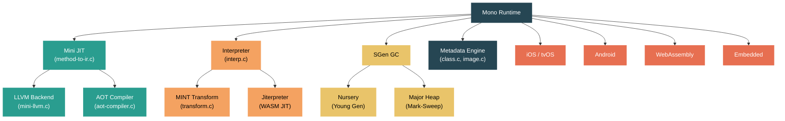

# Level 5: Expert — The Mono Runtime: Architecture and Differences

> **Target profile:** Runtime engineer, platform specialist, or contributor who needs to understand Mono as the alternative .NET execution engine and when to use it over CoreCLR
> **Estimated effort:** 10 hours
> **Prerequisites:** Level 4 modules (CoreCLR understanding), particularly [Module 4.5: JIT Compilation](04-internals-jit.md) and [Module 4.4: GC Deep Dive](04-internals-gc-deep.md)
> [Version en espanol](../es/05-expert-mono.md)

---

## Learning Objectives

By the end of this module you will be able to:

1. Describe Mono's architecture and its four major subsystems: the mini JIT, the interpreter, SGen GC, and the metadata engine.
2. Compare Mono and CoreCLR across key dimensions -- JIT design, GC strategy, AOT compilation, target platforms, and performance tradeoffs.
3. Explain how the Mono JIT (mini) compiles CIL to native code, and how its optional LLVM backend provides deeper optimizations.
4. Describe SGen's generational garbage collection design including nursery allocation, the major heap mark-sweep collector, and card table write barriers.
5. Explain the Mono interpreter's role, its MINT opcode transformation pipeline, tiered execution, and the jiterpreter (WASM JIT-on-interpreter).
6. Identify the platforms where Mono is the primary runtime -- iOS, Android, tvOS, WebAssembly, and embedded -- and the technical constraints that make it the right choice.

---

## Concept Map



---

## Why Two Runtimes?

The dotnet/runtime repository contains two distinct execution engines: CoreCLR and Mono. This is not an accident or legacy debt -- each runtime exists because it excels in scenarios where the other cannot. CoreCLR is optimized for server and desktop workloads with its powerful RyuJIT compiler and sophisticated GC. Mono is optimized for constrained environments -- mobile devices, WebAssembly, and platforms where JIT compilation is forbidden by the operating system (iOS) or impossible by design (WASM without specific extensions).

Understanding *both* runtimes is essential for anyone contributing to the .NET ecosystem, because changes to shared code (System.Private.CoreLib, the BCL) must work correctly on both engines.

---

## Source Reading Guide

| Difficulty | File | Purpose |
|------------|------|---------|
| ★★★★ | `src/mono/mono/mini/mini.h` | Central header for the Mono JIT -- defines `MonoInst`, compilation context |
| ★★★★ | `src/mono/mono/mini/driver.c` | Mono JIT entry point -- `mono_jit_exec_internal()`, execution mode selection |
| ★★★★★ | `src/mono/mono/mini/method-to-ir.c` | CIL-to-IR conversion -- the Mono equivalent of RyuJIT's importer |
| ★★★★★ | `src/mono/mono/mini/mini-llvm.c` | LLVM backend -- translates Mono IR to LLVM IR for deep optimization |
| ★★★★ | `src/mono/mono/mini/aot-compiler.c` | Ahead-of-Time compiler -- generates native code at build time |
| ★★★★ | `src/mono/mono/sgen/sgen-gc.h` | SGen GC main header -- generational GC data structures |
| ★★★★ | `src/mono/mono/sgen/sgen-nursery-allocator.c` | Nursery (young gen) allocation with TLABs |
| ★★★★ | `src/mono/mono/sgen/sgen-marksweep.c` | Major heap collector -- mark-sweep with block allocation |
| ★★★★★ | `src/mono/mono/mini/interp/interp.c` | The interpreter main loop -- executes MINT opcodes |
| ★★★★ | `src/mono/mono/mini/interp/transform.c` | CIL-to-MINT transformation pipeline |
| ★★★★ | `src/mono/mono/mini/interp/tiering.c` | Interpreter tiering -- optimized re-transformation of hot methods |
| ★★★★★ | `src/mono/mono/mini/interp/jiterpreter.c` | Jiterpreter -- WebAssembly JIT for interpreter hot traces |
| ★★★★ | `src/mono/mono/metadata/class.c` | Type system -- class loading and layout |
| ★★★★ | `src/mono/mono/metadata/image.c` | Assembly/module image loading |
| ★★★ | `src/mono/System.Private.CoreLib/src/System/GC.Mono.cs` | Mono-specific GC managed surface |

---

## Curriculum

### Lesson 1 — Mono Architecture Overview

#### What you'll learn

Mono is a .NET runtime with a long history -- originally created by Ximian in 2001 (you can see the original copyright headers in `src/mono/mono/mini/interp/interp.c`), later developed by Novell, then Xamarin, and now Microsoft. It was integrated into the dotnet/runtime repository to share the same BCL and tooling with CoreCLR. Despite this unification, Mono retains its own JIT compiler, garbage collector, interpreter, type system, and AOT pipeline.

#### The four pillars

Mono's architecture rests on four major subsystems:

**1. The Mini JIT** (`src/mono/mono/mini/`)

The Mono JIT is called "mini" (a historical name from when it replaced the original "JIT" compiler). Its core job is the same as RyuJIT: convert CIL bytecode to native machine code. The key file is `method-to-ir.c`, which transforms CIL instructions into Mono's internal IR -- a sequence of `MonoInst` nodes. Unlike RyuJIT's tree-based GenTree IR, Mono's IR is a linear sequence of instructions that maps more directly to machine operations.

Open `src/mono/mono/mini/mini.h` and note how `MonoInst` is defined as the fundamental IR node. The compilation pipeline proceeds: CIL -> MonoInst IR -> architecture-specific lowering -> native code emission.

Architecture support is split into per-platform files:
- `mini-amd64.c`, `mini-arm64.c`, `mini-arm.c`, `mini-riscv.c`, `mini-ppc.c`, `mini-s390x.c`, `mini-wasm.c`
- Corresponding trampoline files: `tramp-amd64.c`, `tramp-arm64.c`, etc.
- CPU description files: `cpu-amd64.mdesc`, `cpu-arm64.mdesc`, `cpu-wasm.mdesc`, etc.

**2. The Interpreter** (`src/mono/mono/mini/interp/`)

Mono includes a full CIL interpreter that can execute managed code without generating native machine code. This is critical for platforms where JIT compilation is impossible (iOS prohibits writable+executable memory, WASM historically lacked JIT support). The interpreter transforms CIL into an intermediate opcode set called MINT (Mono INTerpreter opcodes), defined in `mintops.def`, then executes them in a dispatch loop in `interp.c`.

**3. SGen GC** (`src/mono/mono/sgen/`)

SGen ("Simple Generational") is Mono's garbage collector. Like CoreCLR's GC, it is generational, but its design is quite different. SGen has a nursery (young generation) with TLAB-based allocation and a major heap that uses a mark-sweep collector organized in fixed-size blocks. The nursery can be configured in two modes: simple and split.

**4. The Metadata Engine** (`src/mono/mono/metadata/`)

The metadata subsystem handles loading assemblies (`image.c`), resolving types (`class.c`, `class-init.c`), laying out objects in memory (`class-setup-vtable.c`), and managing the type system. It reads PE/COFF images and ECMA-335 metadata tables. This is analogous to CoreCLR's type system in `src/coreclr/vm/`, but implemented in C rather than C++.

#### How they connect

When Mono starts, `driver.c` initializes the runtime and selects the execution mode:

```c
static void mono_runtime_set_execution_mode (int mode);
static void mono_runtime_set_execution_mode_full (int mode, gboolean override);
```

The execution mode determines whether methods are JIT-compiled, interpreted, or AOT-compiled. Mono supports mixed mode, where some methods use the JIT and others use the interpreter -- a capability that CoreCLR does not have.

#### System.Private.CoreLib: the runtime bridge

Mono has its own runtime-specific CoreLib code in `src/mono/System.Private.CoreLib/src/System/`. These files follow the naming convention `*.Mono.cs` -- for example, `GC.Mono.cs`, `Object.Mono.cs`, `String.Mono.cs`, `RuntimeType.Mono.cs`. They implement the same public API surface as their CoreCLR counterparts (`*.CoreCLR.cs`), but call into Mono's native runtime via `[MethodImpl(MethodImplOptions.InternalCall)]` attributes.

The shared, runtime-agnostic code lives in `src/libraries/System.Private.CoreLib/`. When you edit shared CoreLib code, you must ensure it compiles and works correctly with *both* runtimes.

#### Exercise

1. Open `src/mono/mono/mini/driver.c` and find the `mono_runtime_set_execution_mode` function. What execution modes does Mono support?
2. Compare `src/mono/System.Private.CoreLib/src/System/GC.Mono.cs` with `src/coreclr/System.Private.CoreLib/src/System/GC.CoreCLR.cs`. Note how both define the same `GC` partial class but with different internal call declarations.
3. List the architecture-specific files in `src/mono/mono/mini/` (the `mini-*.c` files). How many target architectures does Mono support?

---

### Lesson 2 — Mono vs CoreCLR: Feature Comparison

#### What you'll learn

Understanding when to use each runtime requires understanding their tradeoffs. This lesson provides a systematic comparison across every major dimension.

#### Compilation strategies

| Aspect | CoreCLR | Mono |
|--------|---------|------|
| Primary JIT | RyuJIT (highly optimizing, 80+ phases) | Mini JIT (faster compile, fewer optimization passes) |
| Tiered compilation | Tier-0 (minimal opts) -> Tier-1 (full opts) | Interpreter -> JIT (interpreter tiering available) |
| AOT | NativeAOT (full static compilation, separate toolchain) | Mono AOT (compatible with JIT fallback, LLVM backend option) |
| LLVM support | No (uses its own codegen) | Yes -- optional LLVM backend for deeply optimized AOT code |
| Interpreter | No | Yes -- full CIL interpreter with MINT transformation |
| Mixed mode | No | Yes -- interpreter + JIT coexist in the same process |

**Key insight**: CoreCLR's RyuJIT is a more sophisticated JIT that produces better optimized code for server/desktop workloads. Mono's mini JIT compiles faster but with fewer optimizations -- it trades peak throughput for startup speed and lower memory overhead. On platforms where JIT is impossible, Mono's interpreter and AOT compiler fill the gap.

#### Garbage collection

| Aspect | CoreCLR GC | Mono SGen |
|--------|-----------|-----------|
| Architecture | Generational (Gen0/Gen1/Gen2) + LOH + POH | Generational (nursery + major heap) |
| Young gen | Ephemeral segment with bump allocation | Nursery with TLABs, two modes (simple/split) |
| Old gen | Mark-sweep-compact with regions (or segments) | Mark-sweep with fixed-size blocks |
| Compaction | Yes (can compact Gen2) | No full compaction (mark-sweep only for major heap) |
| Concurrent | Background GC for Gen2 | Concurrent mark for major collections |
| Server mode | Yes (per-CPU heaps) | No dedicated server mode |
| Configuration | Extensive (`GCConserveMemory`, `GCHeapCount`, etc.) | Simpler configuration surface |

**Key insight**: CoreCLR's GC is designed for server workloads with large heaps, offering compaction, server mode with per-CPU heaps, and extensive tuning knobs. SGen is designed for smaller heaps typical of mobile and embedded scenarios, prioritizing low pause times and low memory overhead.

#### Target platforms

| Platform | CoreCLR | Mono |
|----------|---------|------|
| Windows (x64, ARM64) | Primary | Supported |
| Linux (x64, ARM64) | Primary | Supported |
| macOS (x64, ARM64) | Primary | Supported |
| iOS / tvOS | Not supported | **Primary** (AOT required) |
| Android | Not supported | **Primary** (JIT or AOT) |
| WebAssembly | Not supported | **Primary** (interpreter + jiterpreter) |
| Embedded / constrained | Not the focus | **Primary** |

**Key insight**: CoreCLR dominates on server and desktop. Mono dominates on mobile, web client, and embedded. The choice is primarily driven by the target platform, not by preference.

#### Performance tradeoffs

- **Startup time**: Mono with interpreter has near-instant startup (no compilation delay). CoreCLR with tiered compilation starts at Tier-0 (fast JIT) and promotes to Tier-1 (optimized) over time.
- **Peak throughput**: CoreCLR's RyuJIT Tier-1 code typically outperforms Mono's mini JIT. Mono with LLVM AOT can match or exceed CoreCLR for specific workloads.
- **Memory footprint**: Mono's interpreter has a smaller code memory footprint (no native code buffers). SGen's simpler design uses less GC metadata. This matters on mobile and WASM.
- **Binary size**: Mono AOT produces smaller binaries than NativeAOT for the same application, which is critical for mobile app size limits and WASM download sizes.

#### Exercise

1. Build a simple "Hello World" console app and compare the output of `./build.sh clr+libs` vs `./build.sh mono+libs`. Note the different artifacts produced in `artifacts/`.
2. Look at the `cpu-wasm.mdesc` file in `src/mono/mono/mini/`. This file defines the machine description for WebAssembly as a target architecture -- a concept that does not exist in CoreCLR. Why does Mono need this?
3. Open `src/mono/System.Private.CoreLib/src/System/Threading/` and compare it with `src/coreclr/System.Private.CoreLib/src/System/Threading/`. Note the different threading primitives.

---

### Lesson 3 — The Mono JIT (Mini)

#### What you'll learn

The Mono JIT, historically called "mini," is a method-at-a-time JIT compiler. It is simpler and faster than RyuJIT, optimized for quick compilation rather than peak code quality. This lesson covers its compilation pipeline and optional LLVM backend.

#### The compilation pipeline

The main compilation function lives in `src/mono/mono/mini/method-to-ir.c`. The file header describes its purpose:

```c
/**
 * \file
 * Convert CIL to the JIT internal representation
 */
```

The pipeline stages are:

**1. CIL Import (`method-to-ir.c`)**

CIL bytecode is decoded instruction-by-instruction and converted into a sequence of `MonoInst` nodes. Each `MonoInst` represents one operation in Mono's IR. Unlike RyuJIT's tree-based GenTree, Mono's IR is flat -- more like a sequence of three-address instructions.

**2. Optimization passes**

After import, Mono applies a set of optimization passes. These are simpler than RyuJIT's 80+ phases:
- **abc removal** (`abcremoval.c`): Array bounds check elimination
- **Branch optimization** (`branch-opts.c`): Simplify conditional branches
- **Constant folding** (`cfold.c`): Evaluate constant expressions at compile time
- **Deadcode elimination**: Remove unreachable instructions
- **SSA-based optimizations** (when enabled)

**3. Architecture-specific lowering**

The optimized IR is lowered to target-specific instructions. Each architecture has a `mini-<arch>.c` file:
- `mini-amd64.c` -- x86-64 code generation
- `mini-arm64.c` -- AArch64 code generation
- `mini-wasm.c` -- WebAssembly code generation
- And more: ARM32, RISC-V, PPC, S390x

**4. Register allocation (`mini-codegen.c`)**

Mono uses a simpler register allocator than RyuJIT's LSRA. It performs linear scan allocation in a single pass over the instruction stream.

**5. Code emission**

Native machine code is emitted directly into a code buffer. Architecture-specific emission is handled in the same `mini-<arch>.c` files.

#### The LLVM backend

One of Mono's distinctive features is its optional LLVM backend. Open `src/mono/mono/mini/mini-llvm.c`:

```c
/**
 * \file
 * llvm "Backend" for the mono JIT
 */
```

When the LLVM backend is active, instead of lowering Mono's IR directly to machine code, the JIT translates `MonoInst` nodes to LLVM IR. LLVM then applies its full suite of optimizations -- loop vectorization, auto-vectorization, aggressive inlining, and machine-level optimizations that Mono's own backend cannot match.

The LLVM backend is particularly important for AOT compilation. When building for iOS or Android with full optimization, the Mono AOT compiler uses LLVM to produce high-quality native code at build time.

Key files for LLVM integration:
- `mini-llvm.c` -- the main translation from Mono IR to LLVM IR
- `mini-llvm-cpp.cpp` -- C++ wrappers for the LLVM C++ API
- `llvm-jit.cpp` -- LLVM-based JIT (as opposed to AOT)
- `llvmonly-runtime.c` -- runtime support when running in LLVM-only mode

#### AOT compilation

The Mono AOT compiler (`src/mono/mono/mini/aot-compiler.c`) pre-compiles assemblies to native code at build time. This is fundamentally different from CoreCLR's NativeAOT:

- **Mono AOT**: Compiles individual assemblies. Can coexist with JIT/interpreter fallback. Uses the same mini JIT pipeline (optionally with LLVM backend) but outputs to object files instead of memory.
- **NativeAOT**: Whole-program compilation. Produces a standalone native executable. No JIT fallback possible.

Mono AOT is used on platforms that forbid JIT compilation (iOS) and to improve startup time on platforms that allow it (Android). The AOT output includes:
- Pre-compiled native code for each method
- Metadata for reflection and generics
- Trampolines for transitions between AOT and non-AOT code

The WASM-specific AOT code lives in `aot-runtime-wasm.c`, handling the unique constraints of the WebAssembly execution environment.

#### Exercise

1. Open `src/mono/mono/mini/method-to-ir.c` and search for `CEE_ADD` (the CIL add instruction). Trace how it creates a `MonoInst` for addition. Compare this with how RyuJIT imports `CEE_ADD` in `src/coreclr/jit/importer.cpp`.
2. List all the `cpu-*.mdesc` files in `src/mono/mono/mini/`. These machine description files define the instruction patterns for each target architecture. Read the header comments in `cpu-amd64.mdesc`.
3. In `mini-llvm.c`, search for `LLVMBuildAdd`. This shows where Mono's IR is translated to LLVM's `add` instruction. How does this differ from the direct code generation path in `mini-amd64.c`?

---

### Lesson 4 — SGen: Mono's Garbage Collector

#### What you'll learn

SGen (Simple Generational GC) is Mono's garbage collector. While it shares the generational concept with CoreCLR's GC, its implementation differs significantly. Understanding SGen is essential for diagnosing memory behavior on Mono-powered platforms.

#### Architecture overview

Open `src/mono/mono/sgen/sgen-gc.h`. The file header describes:

```c
/**
 * \file
 * Simple generational GC.
 */
```

SGen divides the managed heap into two spaces:

**The Nursery (young generation)**

All new objects are allocated in the nursery. When the nursery fills up, a minor collection copies surviving objects to the major heap. The nursery implementation lives in `sgen-nursery-allocator.c`.

Key design details from the source:
```c
/*
 * The young generation is divided into fragments. This is because
 * we can hand one fragments to a thread for lock-less fast alloc and
 * because the young generation ends up fragmented anyway by pinned objects.
 */
```

SGen uses Thread-Local Allocation Buffers (TLABs) for fast, lock-free allocation. Each thread gets a fragment of the nursery and allocates from it using simple pointer bumping. This is similar in concept to CoreCLR's allocation contexts, but the implementation is different.

Two nursery modes are available:
- **Simple nursery** (`sgen-simple-nursery.c`): Standard copying collector
- **Split nursery** (`sgen-split-nursery.c`): Divides nursery into two halves for different aging behavior

The nursery clear policy (`NurseryClearPolicy` in `sgen-gc.h`) controls when freed nursery memory is zeroed:
```c
typedef enum {
    CLEAR_AT_GC,
    CLEAR_AT_TLAB_CREATION,
    CLEAR_AT_TLAB_CREATION_DEBUG
} NurseryClearPolicy;
```

Clearing at TLAB creation is faster but more complex. Clearing at GC time is safer for debugging.

**The Major Heap (old generation)**

Long-lived objects that survive nursery collections are promoted to the major heap. Open `src/mono/mono/sgen/sgen-marksweep.c`:

```c
/**
 * \file
 * The Mark & Sweep major collector.
 */
```

The major collector uses a block-based mark-sweep algorithm. Key constants:

```c
#define MS_BLOCK_SIZE_MIN (1024 * 16)  // 16KB minimum block size

#ifndef TARGET_WASM
#define MS_BLOCK_ALLOC_NUM  32  // Allocate 32 blocks at a time
#else
#define MS_BLOCK_ALLOC_NUM  1   // WASM: one block at a time (no partial munmap)
#endif
```

Note the WASM-specific adjustment: because WebAssembly does not support `munmap` on partial memory ranges, the allocator must work with individual blocks rather than contiguous groups.

#### Card tables and write barriers

SGen uses a card table (`sgen-cardtable.c`) to track references from the major heap to the nursery. When old-generation code writes a reference to a young-generation object, the write barrier marks the corresponding card as dirty. During minor collections, only dirty cards need scanning rather than the entire major heap.

#### Pinning

When native code holds references to managed objects, those objects cannot be moved during collection. SGen's pinning subsystem (`sgen-pinning.c`) handles this by marking objects as "pinned" -- they stay in place and the collector works around them. The nursery allocator creates fragments between pinned objects:

```c
/*
 * scan starts is an array of pointers to objects equally spaced in the allocation area
 * They let use quickly find pinned objects from pinning pointers.
 */
```

#### Large Object Space (LOS)

Objects too large for regular blocks are allocated in the Large Object Space (`sgen-los.c`). These are always collected during major collections and are never moved.

#### Finalization and weak references

`sgen-fin-weak-hash.c` handles the interaction between GC and finalizers. Objects with finalizers require special treatment during collection -- they cannot be reclaimed until their finalizer runs. SGen maintains queues of finalizable objects and processes weak references during the mark phase.

#### How SGen differs from CoreCLR's GC

| Aspect | SGen | CoreCLR GC |
|--------|------|-----------|
| Generations | 2 (nursery + major) | 3 (Gen0 + Gen1 + Gen2) + LOH + POH |
| Young gen collection | Copying collector (moves survivors) | Mark within ephemeral segment, then compact |
| Old gen collection | Mark-sweep (no compaction) | Mark-sweep-compact (can compact) |
| Allocation | TLABs in nursery fragments | Allocation contexts in ephemeral segment |
| Server mode | None | Per-CPU heaps |
| Background | Concurrent major mark | Background Gen2 collection |
| Tuning | Simpler, fewer knobs | Extensive configuration |
| Implementation language | C | C++ |

#### Exercise

1. Open `src/mono/mono/sgen/sgen-alloc.c` and find the fast allocation path. How does TLAB bump-pointer allocation work?
2. Read the `sgen-conf.h` file. What tunable parameters does SGen expose? Compare the number of configuration options with CoreCLR's GC.
3. Search for `SGEN_HEAVY_BINARY_PROTOCOL` in `sgen-conf.h`. This debug feature logs detailed GC events. How would you enable it?
4. Open `sgen-marksweep.c` and find where `MS_BLOCK_ALLOC_NUM` is defined differently for WASM. Why can't WASM allocate blocks in groups?

---

### Lesson 5 — The Mono Interpreter

#### What you'll learn

The Mono interpreter is one of its most important differentiators from CoreCLR. It executes managed code without generating native machine code, which is essential for platforms that prohibit JIT compilation. This lesson covers the interpreter's architecture, the MINT opcode system, tiered optimization, and the jiterpreter innovation for WebAssembly.

#### Why an interpreter?

Three technical constraints drive the need for an interpreter:

1. **iOS and similar platforms** enforce W^X (Write XOR Execute) memory policies. Applications cannot allocate memory that is both writable and executable. JIT compilation is impossible because it requires writing machine code to memory and then executing it.
2. **WebAssembly** (historically) had no mechanism for runtime code generation. While newer WASM proposals add some JIT capability, the interpreter remains the baseline execution mode.
3. **Hot reload and debuggability**: The interpreter can execute modified code immediately without recompilation, enabling .NET Hot Reload on Mono.

#### The MINT opcode system

Open `src/mono/mono/mini/interp/mintops.def`. This file defines the complete set of MINT (Mono INTerpreter) opcodes. CIL bytecodes are not executed directly -- they are transformed into MINT opcodes that are more efficient for interpretation.

The transformation pipeline lives in `src/mono/mono/mini/interp/transform.c`:

```c
/**
 * \file
 * transform CIL into different opcodes for more
 * efficient interpretation
 */
```

The transformer:
1. Reads CIL bytecodes from the method's IL body
2. Converts them to MINT opcodes with stack slot offsets pre-computed
3. Resolves metadata tokens to runtime pointers
4. Applies optimizations specific to the interpreter (superinstruction formation, constant propagation)

The stack type system for MINT is defined in `interp-internals.h`:

```c
#define MINT_TYPE_I1 0
#define MINT_TYPE_U1 1
#define MINT_TYPE_I2 2
#define MINT_TYPE_U2 3
#define MINT_TYPE_I4 4
#define MINT_TYPE_I8 5
#define MINT_TYPE_R4 6
#define MINT_TYPE_R8 7
#define MINT_TYPE_O  8   // object reference
#define MINT_TYPE_VT 9   // value type
```

#### The interpreter main loop

Open `src/mono/mono/mini/interp/interp.c`. The main dispatch loop reads MINT opcodes and executes them. The interpreter maintains its own evaluation stack (separate from the native thread stack) with a default size of 1MB:

```c
#define INTERP_STACK_SIZE (1024*1024)
#define INTERP_REDZONE_SIZE (8*1024)
```

Values on the interpreter stack are represented by the `stackval` union, which can hold 32-bit integers, 64-bit integers, floats, doubles, object references, or pointers to value type storage.

The interpreter supports SIMD operations (`interp-simd.c`) and intrinsic optimizations (`interp-intrins.c`) to reduce the performance gap with JIT-compiled code.

#### Interpreter tiering

Mono's interpreter includes a tiering system (`src/mono/mono/mini/interp/tiering.c` and `tiering.h`). When a method's entry count exceeds a threshold, the interpreter re-transforms it with more aggressive optimizations:

```c
#define INTERP_TIER_ENTRY_LIMIT 1000
```

The tiering system:
1. Counts method entries
2. When a method exceeds `INTERP_TIER_ENTRY_LIMIT` invocations, triggers re-transformation
3. Creates a new `InterpMethod` with `optimized = TRUE`
4. Patches all call sites to point to the new, optimized method

From the source in `tiering.c`:
```c
static InterpMethod*
tier_up_method (InterpMethod *imethod, ThreadContext *context)
{
    g_assert (enable_tiering);
    InterpMethod *new_imethod = get_tier_up_imethod (imethod);
    // ... re-transform with optimizations ...
}
```

This is conceptually similar to CoreCLR's tiered compilation, but operates entirely within the interpreter -- no JIT code is generated. The optimized transformation applies more aggressive constant propagation, dead code elimination, and super-instruction merging.

#### The jiterpreter: JIT-on-interpreter for WebAssembly

One of the most innovative pieces of Mono's interpreter is the **jiterpreter** (`src/mono/mono/mini/interp/jiterpreter.c` and `jiterpreter.h`). It exists exclusively for the WebAssembly platform (`#if HOST_BROWSER`).

The jiterpreter works by identifying hot traces in the interpreter dispatch loop and compiling them to WebAssembly functions at runtime. It is essentially a tracing JIT that sits on top of the interpreter:

```c
// mono_interp_tier_prepare_jiterpreter will return these special values
// TRAINING indicates that the hit count is not high enough yet
#define JITERPRETER_TRAINING 0
// NOT_JITTED indicates that the trace was not jitted
#define JITERPRETER_NOT_JITTED 1
```

How it works:
1. The interpreter executes MINT opcodes normally
2. Hot backwards branches and method entries are detected via counters
3. When a threshold is reached, the trace of MINT opcodes is analyzed
4. A WebAssembly function is generated that directly implements the trace
5. Future executions of that trace call the compiled WASM function instead of interpreting

The jiterpreter bridges the gap between the interpreter's portability and JIT compilation's performance, specifically for the WASM platform. It uses Emscripten's ability to compile C to WASM to generate these runtime functions.

Key jiterpreter structures:
```c
typedef struct {
    guint16 opcode;
    guint16 relative_fn_ptr;
    guint32 trace_index;
} JiterpreterOpcode;
```

The jiterpreter maintains tables for different trace types (from `jiterpreter.h`):
- `JITERPRETER_TABLE_TRACE` -- general interpreter traces
- `JITERPRETER_TABLE_JIT_CALL` -- JIT-compiled call wrappers
- `JITERPRETER_TABLE_INTERP_ENTRY_STATIC_*` -- entry points for static methods

#### Mixed mode execution

Mono uniquely supports running the interpreter and JIT side-by-side in the same process. A method can be interpreted while calling into a JIT-compiled method, and vice versa. This enables scenarios like:
- AOT-compiled code calling dynamically loaded code (which runs in the interpreter)
- Hot Reload changing a method implementation (interpreter executes the new code, JIT code continues for unchanged methods)
- Gradual JIT warmup alongside interpreter execution

#### Exercise

1. Open `src/mono/mono/mini/interp/mintops.def` and count the number of MINT opcodes defined. Compare this with the CIL opcode count (around 220). Why might the interpreter have more opcodes than CIL?
2. In `interp.c`, search for the main dispatch code. How does the interpreter dispatch between opcodes (switch statement, computed goto, or something else)?
3. Read `jiterpreter.c` and find where `emscripten.h` is included. This confirms the jiterpreter is WebAssembly-specific. Search for `JITERPRETER_TRAINING` to see how the training phase works.
4. In `tiering.c`, find `get_tier_up_imethod`. What fields are copied from the old `InterpMethod` to the new one? Why is `optimized` set to `TRUE`?

---

### Lesson 6 — Mono Targets: Mobile, WASM, and Embedded

#### What you'll learn

Mono's primary value proposition is running .NET on platforms where CoreCLR cannot. This lesson covers the specific technical requirements and adaptations for each major Mono target platform.

#### iOS and tvOS

Apple platforms enforce strict code signing and W^X (Write XOR Execute) memory policies:
- Applications cannot allocate memory as both writable and executable
- All executable code must be present in the signed application bundle
- JIT compilation is forbidden at runtime

Mono's response: **Full AOT compilation** at build time using the LLVM backend for optimization. The Mono AOT compiler (`aot-compiler.c`) pre-compiles every method to native ARM64 code, which is included in the application bundle. The interpreter serves as a fallback for code that cannot be AOT-compiled (generic virtual methods with specific type arguments not known at build time, reflection-heavy code).

The build infrastructure for Apple platforms lives in:
- `src/mono/msbuild/` -- MSBuild integration for iOS/tvOS/macCatalyst builds
- Platform-specific runtime code in `mini-darwin.c` -- Darwin (macOS/iOS) specific initialization

#### Android

Android allows JIT compilation, so Mono has more flexibility:
- **Default mode**: JIT compilation with the mini JIT
- **AOT mode**: Optional pre-compilation for faster startup (used by .NET MAUI apps)
- **Mixed mode**: AOT for framework code + JIT for application code
- **Interpreter**: Available as fallback

Android-specific considerations:
- Lower memory availability than desktop -- SGen's compact design helps
- ARM and ARM64 architecture support via `mini-arm.c` and `mini-arm64.c`
- Integration with Android's Bionic libc rather than glibc

#### WebAssembly (WASM)

WebAssembly is one of Mono's most distinctive targets. The WASM support spans multiple directories:
- `src/mono/browser/` -- Browser-specific runtime integration (JavaScript interop, DOM access)
- `src/mono/wasm/` -- WASM build infrastructure, test assets, workload definitions
- `src/mono/mono/mini/mini-wasm.c` -- WASM architecture backend for the mini JIT
- `src/mono/mono/mini/exceptions-wasm.c` -- WASM-specific exception handling
- `src/mono/mono/mini/tramp-wasm.c` -- WASM trampolines
- `src/mono/mono/mini/cpu-wasm.mdesc` -- WASM machine description

WASM execution modes:
1. **Interpreter only**: The default mode. CIL is transformed to MINT and interpreted. No native code generation.
2. **AOT + interpreter**: Framework assemblies are AOT-compiled to WASM. Application code can be interpreted or AOT-compiled.
3. **Jiterpreter**: Hot interpreter traces are compiled to WASM functions at runtime, significantly improving performance for computational code.

WASM-specific GC adaptations (from `sgen-marksweep.c`):
```c
#ifndef TARGET_WASM
#define MS_BLOCK_ALLOC_NUM  32
#else
#define MS_BLOCK_ALLOC_NUM  1   // WASM: can't partially free memory ranges
#endif
```

WASM-specific interpreter adaptations (from `interp-internals.h`):
```c
#ifdef TARGET_WASM
#define INTERP_NO_STACK_SCAN 1
#endif
```

This disables stack scanning on WASM because WebAssembly's stack is not directly accessible to user code. The interpreter must track GC roots explicitly.

#### WASI (WebAssembly System Interface)

The `src/mono/wasi/` directory contains support for running .NET on WASI -- the system interface standard for WebAssembly outside the browser. This enables server-side WASM workloads using Mono.

#### Building for each platform

The build system uses subset flags to target different platforms:

```bash
# CoreCLR for server/desktop (the default)
./build.sh clr+libs

# Mono for general use
./build.sh mono+libs

# Mono for WebAssembly (browser)
./build.sh mono+libs -os browser

# Mono for Android
./build.sh mono+libs -os android -arch arm64

# Mono for iOS (with AOT)
./build.sh mono+libs -os iossimulator -arch arm64
```

#### The Mono execution mode matrix

| Platform | JIT | Interpreter | AOT | Jiterpreter | Mixed Mode |
|----------|-----|-------------|-----|-------------|------------|
| Desktop (Linux/Win/Mac) | Yes | Yes | Yes | No | Yes |
| Android | Yes | Yes | Yes | No | Yes |
| iOS / tvOS | No (forbidden) | Yes (fallback) | Yes (required) | No | AOT + interp |
| WebAssembly | No | Yes (default) | Yes | Yes | AOT + interp + jiterp |
| WASI | No | Yes | Yes | No | AOT + interp |

#### When to choose Mono vs CoreCLR

**Choose CoreCLR when:**
- Building server applications (ASP.NET Core, gRPC, microservices)
- Building desktop applications on Windows/Linux/macOS
- Peak throughput is the priority
- You need Server GC with per-CPU heaps
- You need GC compaction for long-running processes

**Choose Mono when:**
- Targeting iOS, tvOS, or macCatalyst (CoreCLR is not available)
- Targeting Android (Mono is the official runtime for .NET MAUI)
- Building Blazor WebAssembly applications
- Binary size and memory footprint are critical constraints
- You need interpreter support for Hot Reload or dynamic code loading
- Targeting embedded or IoT devices with limited resources

In most cases, the choice is made by the target platform, not by the developer. The .NET SDK and workload system automatically selects the appropriate runtime.

#### Exercise

1. Build the WASM runtime: `./build.sh mono+libs -os browser`. Examine the output in `artifacts/bin/mono/browser.wasm.Release/` to see what artifacts Mono produces for WASM.
2. Open `src/mono/mono/mini/mini-wasm.c` and compare its size with `mini-amd64.c`. Why is the WASM backend significantly simpler?
3. Read `src/mono/browser/README.md` for an overview of the browser integration layer. What JavaScript APIs does it expose?
4. Examine the `src/mono/wasm/features.md` and `src/mono/wasm/threads.md` files for documentation on WASM-specific features and threading support.

---

## Summary

Mono is not a "lesser" runtime -- it is a purpose-built execution engine for platforms and scenarios where CoreCLR cannot operate. Its four major subsystems -- the mini JIT, the interpreter, SGen GC, and the metadata engine -- work together to provide .NET execution on iOS, Android, WebAssembly, and embedded devices.

The key architectural decisions that distinguish Mono:
- **The interpreter** enables execution on platforms that forbid JIT compilation (iOS, WASM) and powers Hot Reload
- **The LLVM backend** provides deeply optimized AOT code for mobile platforms
- **SGen's compact design** fits the memory constraints of mobile and WASM environments
- **The jiterpreter** innovates on the interpreter model by JIT-compiling hot traces to WASM
- **Mixed mode execution** (JIT + interpreter in one process) provides flexibility no other .NET runtime offers

Key files to remember:
- `src/mono/mono/mini/method-to-ir.c` -- the core CIL-to-IR compiler
- `src/mono/mono/mini/mini-llvm.c` -- the LLVM backend
- `src/mono/mono/mini/aot-compiler.c` -- the AOT compiler
- `src/mono/mono/sgen/sgen-gc.h` -- SGen GC definitions
- `src/mono/mono/mini/interp/interp.c` -- the interpreter main loop
- `src/mono/mono/mini/interp/jiterpreter.c` -- the WASM jiterpreter
- `src/mono/System.Private.CoreLib/` -- Mono-specific managed runtime bridge

---

## Further Reading

- `docs/design/mono/` -- Mono design documents within the runtime repository
- [Mono Project documentation](https://www.mono-project.com/docs/) -- historical Mono documentation
- `src/mono/wasm/features.md` -- WASM-specific feature documentation
- `src/mono/wasm/threads.md` -- WASM threading documentation
- [Blazor WebAssembly documentation](https://learn.microsoft.com/aspnet/core/blazor/) -- the primary consumer of Mono WASM

---

## Glossary

| Term | Definition |
|------|-----------|
| **Mini** | Mono's JIT compiler (historical name from replacing the original "JIT" compiler) |
| **MonoInst** | The IR node type in Mono's JIT -- a linear instruction representation |
| **LLVM backend** | Optional Mono JIT backend that translates IR to LLVM IR for deep optimization |
| **AOT (Mono)** | Ahead-of-Time compilation using the Mono JIT pipeline, outputs native code at build time |
| **SGen** | Simple Generational GC -- Mono's garbage collector |
| **Nursery** | SGen's young generation -- where all new objects are allocated |
| **Major heap** | SGen's old generation -- mark-sweep collector with fixed-size blocks |
| **TLAB** | Thread-Local Allocation Buffer -- per-thread nursery fragment for lock-free allocation |
| **MINT** | Mono Interpreter opcodes -- the transformed opcode set executed by the interpreter |
| **Jiterpreter** | WASM-specific tracing JIT that compiles hot interpreter traces to WebAssembly functions |
| **Mixed mode** | Running the interpreter and JIT side-by-side in the same Mono process |
| **W^X** | Write XOR Execute -- security policy on iOS/tvOS that forbids JIT compilation |
| **Pinning** | Marking objects as immovable during GC -- critical for native interop |
| **Card table** | Bitmap tracking old-to-young references for efficient minor GC |
| **WASI** | WebAssembly System Interface -- standard for running WASM outside the browser |
