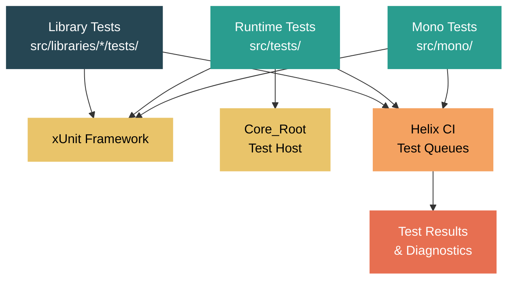

# Level 5: Expert / Contributor -- The Runtime Test Infrastructure

> **Target profile:** Developer ready to contribute tests and investigate failures in the dotnet/runtime repository
> **Estimated effort:** 6 hours
> **Prerequisites:** [Module 5.1](05-expert-build-system.md), basic familiarity with xUnit
> [Version en espanol](../es/05-expert-testing.md)

---

## Learning Objectives

By the end of this module you will be able to:

1. Distinguish between the three major test categories (library tests, CoreCLR runtime tests, Mono tests) and navigate their directory structures.
2. Build and run library tests using `dotnet build /t:Test`, apply xUnit filters, and verify that your tests actually executed.
3. Build the Core_Root test host, generate test layouts, and run individual runtime tests with `corerun`.
4. Write new tests following the repository's xUnit conventions for both library and runtime test projects.
5. Understand how tests are packaged and dispatched to Helix queues in CI, and read CI test results.
6. Reproduce CI test failures locally, diagnose flaky tests, and handle test timeouts.

---

## Concept Map



---

## Source Reading Guide

| Difficulty | Path | Purpose |
|------------|------|---------|
| ★★ | `docs/workflow/testing/libraries/testing.md` | Library test guide -- build, run, filter |
| ★★ | `docs/workflow/testing/coreclr/testing.md` | CoreCLR runtime test guide -- Core_Root, priorities |
| ★★★ | `src/tests/Directory.Build.props` | MSBuild properties for all runtime tests (priorities, paths) |
| ★★★ | `src/tests/Common/dir.common.props` | Shared build properties for test projects |
| ★★★ | `src/tests/Common/XUnitWrapperGenerator/` | Source generator that wraps runtime tests in xUnit runners |
| ★★ | `src/tests/Common/CoreCLRTestLibrary/` | Shared utilities: `TestFramework.cs`, `Utilities.cs`, `PlatformDetection.cs` |
| ★★★ | `src/tests/build.cmd` / `build.sh` | Test build scripts -- flags, priorities, layouts |
| ★★★ | `src/tests/run.sh` / `run.cmd` | Test runner scripts -- stress modes, parallel execution |
| ★★★★ | `src/tests/Common/helixpublishwitharcade.proj` | How tests are packaged and sent to Helix queues |
| ★★ | `eng/testing/` | Runner templates, test configuration, platform-specific runners |

---

## Curriculum

### Lesson 1 -- Test Organization: Library Tests vs Runtime Tests vs Mono Tests

#### What you'll learn

The dotnet/runtime repository has three fundamentally different categories of tests. Understanding which category a test belongs to determines how you build it, run it, and where you find results.

#### Library tests (`src/libraries/*/tests/`)

Library tests validate the managed class libraries (BCL). Each library has its own test project directly alongside its source:

```
src/libraries/System.Collections/
    ref/                          # Reference assembly
    src/                          # Implementation
    tests/                        # Test project
        System.Collections.Tests.csproj
        BitArray/
        Generic/
        StructuralComparisonsTests.cs
```

These tests use standard xUnit (`[Fact]`, `[Theory]`, `[InlineData]`) and run with the normal `dotnet test` infrastructure. The test project targets `$(NetCoreAppCurrent)` and references a testhost that includes the locally-built runtime and libraries.

A library test `.csproj` typically looks like:

```xml
<Project Sdk="Microsoft.NET.Sdk">
  <PropertyGroup>
    <TargetFramework>$(NetCoreAppCurrent)</TargetFramework>
    <TestRuntime>true</TestRuntime>
  </PropertyGroup>
  <ItemGroup>
    <Compile Include="$(CommonTestPath)System\Collections\CollectionAsserts.cs"
             Link="Common\System\Collections\CollectionAsserts.cs" />
    <!-- test source files -->
  </ItemGroup>
</Project>
```

Notice the `$(CommonTestPath)` references -- many test utilities are shared across library test projects via `src/libraries/Common/tests/`.

#### Runtime tests (`src/tests/`)

Runtime tests (also called "CoreCLR tests") exercise the runtime engine itself: the JIT compiler, GC, type loader, interop, exception handling, and more. They live under `src/tests/` with this top-level structure:

```
src/tests/
    JIT/           # JIT compiler tests (largest category)
    GC/            # Garbage collector tests
    Loader/        # Assembly/type loading tests
    Interop/       # Native interop tests
    baseservices/  # Core runtime services
    tracing/       # EventPipe, diagnostics tracing
    reflection/    # Reflection-specific tests
    nativeaot/     # NativeAOT-specific tests
    Exceptions/    # Exception handling tests
    Regressions/   # Regression tests for specific bugs
    Common/        # Shared infrastructure and utilities
    build.cmd      # Windows build script
    build.sh       # Unix build script
    run.cmd        # Windows test runner
    run.sh         # Unix test runner
```

Runtime tests are different from library tests in several important ways:

1. **They require Core_Root**: A special folder containing the built runtime plus libraries, used as the test host.
2. **They have priorities**: Tests are tagged with `CLRTestPriority` (0, 1, 2). Only priority 0 builds by default.
3. **Return code convention**: Individual runtime tests traditionally return exit code 100 for pass, anything else for fail.
4. **Merged test runners**: Multiple test projects are grouped into "merged runners" that execute them sequentially in a single process.

#### Mono tests

Mono tests reuse the library test infrastructure but target the Mono runtime. You build them with:

```bash
./build.sh mono+libs+libs.tests -test
```

Some tests have `[ActiveIssue]` annotations for Mono-specific issues, and certain test categories are excluded via MSBuild conditions on `RuntimeFlavor`.

#### Key insight: which test infrastructure to use

| What you're testing | Test location | How to build & run |
|---|---|---|
| A managed API in a BCL library | `src/libraries/<Lib>/tests/` | `dotnet build /t:Test` |
| JIT behavior, codegen quality | `src/tests/JIT/` | `src/tests/build.sh` + Core_Root |
| GC behavior, stress scenarios | `src/tests/GC/` | `src/tests/build.sh` + Core_Root |
| Type loading, assembly binding | `src/tests/Loader/` | `src/tests/build.sh` + Core_Root |
| Native interop (P/Invoke, COM) | `src/tests/Interop/` | `src/tests/build.sh` + Core_Root |
| Diagnostics, EventPipe | `src/tests/tracing/` | `src/tests/build.sh` + Core_Root |

#### Exercise

1. Navigate to `src/libraries/System.Collections/tests/` and examine the `.csproj`. Count how many `$(CommonTestPath)` references it uses -- these represent shared test base classes.
2. Navigate to `src/tests/JIT/` and list the subdirectories. Each represents a major area of JIT testing.
3. Open `src/tests/Directory.Build.props` and find the `CLRTestPriorityToBuild` property. Note how it defaults to 0.

---

### Lesson 2 -- Running Library Tests

#### What you'll learn

Library tests are the most common tests you will interact with as a contributor. This lesson covers the complete workflow from building through running with filters.

#### Prerequisites: building the runtime and libraries

Before any library tests can run, you need a built runtime and libraries:

```bash
# Build CoreCLR runtime (release) + libraries (debug) -- the typical dev config
./build.sh -subset clr+libs -rc Release
```

**Important**: If you rebuild `System.Private.CoreLib`, you must also run the `libs.pretest` subset to copy it into the testhost:

```bash
./build.sh clr.corelib+clr.nativecorelib+libs.pretest -rc checked
```

#### Building and running tests for a single library

The recommended workflow is to `cd` into the test directory and invoke the `Test` MSBuild target:

```bash
cd src/libraries/System.Collections/tests
dotnet build /t:Test
```

This single command builds the test project and runs all tests. Output goes to the console, and a detailed XML log is written to `artifacts/bin/System.Collections.Tests/Debug/net10.0/testResults.xml` (the exact TFM varies).

#### Filtering tests

You can filter tests at several levels of granularity:

**By class:**
```bash
dotnet build /t:Test /p:XUnitOptions="-class Test.ClassUnderTests"
```

**By method (fully qualified):**
```bash
dotnet build /t:Test /p:XunitMethodName=System.Collections.Tests.BitArray_GetSetTests.Get_Set
```

**By method via XUnitOptions:**
```bash
dotnet build /t:test /p:XUnitOptions="-method System.Collections.Tests.BitArray_GetSetTests.Get_Set"
```

#### Running outer loop tests

Some tests are marked as "outer loop" -- they are slower or more comprehensive and don't run in the default inner loop:

```bash
dotnet build /t:Test /p:Outerloop=true
```

#### Speeding up iteration

When iterating on a test, two flags save time:

- `/p:testnobuild=true` -- skips the build step (use only if you have not changed code)
- `--no-restore` -- skips NuGet restore (use if packages haven't changed)

Combined:
```bash
dotnet build --no-restore /t:test /p:testnobuild=true /p:XUnitOptions="-method Namespace.Class.Method" tests/FunctionalTests
```

#### Checking run counts

A common mistake is running filtered tests and seeing "0 tests executed" without noticing. Always check the summary line in the output:

```
Tests run: 42, Errors: 0, Failures: 0, Skipped: 3
```

If `Tests run` is 0, your filter is wrong or the tests were excluded by a platform/category condition.

#### Running all library tests

To build and run the full library test suite:

```bash
./build.sh -subset libs.tests -test -c Release
```

This is slow (many hours). For CI purposes, it is split across Helix machines.

#### Exercise

1. Build and run the `System.Collections` tests: `cd src/libraries/System.Collections/tests && dotnet build /t:Test`.
2. Re-run with a filter targeting only `BitArray` tests: `/p:XUnitOptions="-class System.Collections.Tests.BitArray_CtorTests"`. Verify the run count dropped.
3. Try adding `/p:testnobuild=true` and confirm the tests run faster (no rebuild).

---

### Lesson 3 -- Runtime Tests and Core_Root

#### What you'll learn

Runtime tests (under `src/tests/`) use a different mechanism than library tests. They run against a special "Core_Root" directory that contains the fully-built runtime. This lesson walks through the complete workflow.

#### Step 1: Build the runtime and libraries

Runtime tests need a built CoreCLR and libraries:

```bash
# Typical: Checked runtime + Release libraries
./build.sh clr+libs -rc Checked
```

#### Step 2: Generate Core_Root

Core_Root is a self-contained directory with the runtime binaries, JIT, GC, and all required library assemblies. Generate it with:

```bash
# Windows
.\src\tests\build.cmd generatelayoutonly

# Linux/macOS
./src/tests/build.sh -GenerateLayoutOnly
```

The output appears at:
```
artifacts/tests/coreclr/<OS>.<Arch>.<Configuration>/Tests/Core_Root/
```

For example: `artifacts/tests/coreclr/windows.x64.Debug/Tests/Core_Root/`

#### Step 3: Build tests

**Build all tests (slow -- avoid unless needed):**
```bash
./src/tests/build.sh
```

**Build a single test project:**
```bash
./src/tests/build.sh -test:JIT/Directed/ConstantFolding/folding_extends_int32_on_64_bit_hosts.csproj
```

**Build a directory of tests:**
```bash
./src/tests/build.sh -dir:JIT/Directed/ConstantFolding
```

**Build a subtree:**
```bash
./src/tests/build.sh -tree:JIT/Methodical
```

**Include priority 1 tests (priorities are cumulative):**
```bash
./src/tests/build.sh -tree:JIT/Methodical -priority1
```

#### Step 4: Run tests

**Run all built tests:**
```bash
./src/tests/run.sh x64 checked
```

**Run an individual test:**
```bash
export CORE_ROOT=$(pwd)/artifacts/tests/coreclr/<OS>.x64.Checked/Tests/Core_Root
cd artifacts/tests/coreclr/<OS>.x64.Checked/<test-path>/
$CORE_ROOT/corerun <TestName>.dll
```

For runtime tests that return exit code 100, you can verify:
```bash
$CORE_ROOT/corerun MyTest.dll
echo $?  # Should be 100 for pass
```

Alternatively, each test generates a `.sh` or `.cmd` script you can run directly:
```bash
./MyTest.sh -coreroot=/path/to/Core_Root
```

#### Merged test runners

Modern runtime tests use "merged test runners" -- a single executable that runs multiple test assemblies sequentially. These are identified by `<Import Project="$(TestSourceDir)MergedTestRunner.targets" />` in the `.csproj`.

You can filter within a merged runner:
```bash
./MergedRunner.sh "Namespace.ClassName.MethodName"
```

The filter supports substring matching and `FullyQualifiedName=...` or `DisplayName~...` syntax.

#### Tests requiring process isolation

Some tests manipulate global state (environment variables, current directory) and must run in their own process. These are marked with:

```xml
<RequiresProcessIsolation>true</RequiresProcessIsolation>
```

The merged runner launches them as subprocesses automatically.

#### Stress modes

The `run.sh` script supports various stress modes for exhaustive testing:

```bash
# JIT stress
./src/tests/run.sh x64 checked --jitstress=2

# GC stress
./src/tests/run.sh x64 checked --gcstresslevel=4

# JIT min-opts (disable optimizations)
./src/tests/run.sh x64 checked --jitminopts
```

#### Test results

After a full run, results appear in:
- `artifacts/log/TestRun_<Arch>_<Config>.html` -- HTML summary
- `artifacts/log/TestRunResults_<OS>_<Arch>_<Config>.err` -- list of failures
- `artifacts/tests/coreclr/<OS>.<Arch>.<Config>/Reports/` -- per-test output and error logs

Each test's report folder contains:
- `<Test>.output.txt` -- all output logged by the test
- `<Test>.error.txt` -- crash information from `corerun`

#### Exercise

1. Generate Core_Root for a Debug build: `./src/tests/build.sh -GenerateLayoutOnly`.
2. Build a single test: `./src/tests/build.sh -test:JIT/Directed/ConstantFolding/folding_extends_int32_on_64_bit_hosts.csproj`.
3. Run it with `corerun` and verify the exit code is 100.
4. Open `src/tests/JIT/Directed/ConstantFolding/folding_extends_int32_on_64_bit_hosts.cs` and read the test -- it is a simple `[Fact]` test returning 100 on success.

---

### Lesson 4 -- Writing a New Test

#### What you'll learn

This lesson covers the conventions for writing tests in both the library and runtime test suites, including xUnit patterns, project setup, and common pitfalls.

#### Writing a library test

Library tests use standard xUnit. The repository conventions (from `CLAUDE.md`) are:

1. **Prefer `[Theory]` with `[InlineData]`/`[MemberData]`** over multiple duplicate `[Fact]` methods.
2. **Add new tests to existing test files** rather than creating new ones when the scope fits.
3. **Do not emit "Act", "Arrange", or "Assert" comments**.
4. **Do not add regression comments** citing issue/PR numbers unless explicitly asked.
5. **Ensure new files are listed in the `.csproj`** if other files in that folder are.
6. **Use filters and check run counts** to confirm tests actually executed.

A typical library test method:

```csharp
[Theory]
[InlineData(0)]
[InlineData(1)]
[InlineData(75)]
[InlineData(int.MaxValue)]
public void Count_ReturnsExpectedValue(int count)
{
    var list = new List<int>(Enumerable.Range(0, count));
    Assert.Equal(count, list.Count);
}
```

When adding a new test file, ensure it appears in the `.csproj`:

```xml
<ItemGroup>
  <Compile Include="Generic\List\List.Generic.Tests.MyNewFeature.cs" />
</ItemGroup>
```

Some libraries use shared common test base classes. For example, collection tests inherit from interfaces like `ICollection.Generic.Tests` defined in `src/libraries/Common/tests/System/Collections/`. Check the existing test project to see if there is a base class you should extend.

#### Writing a runtime test

Runtime tests follow slightly different conventions. A simple JIT test looks like this (from `src/tests/JIT/Directed/ConstantFolding/`):

```csharp
// Licensed to the .NET Foundation under one or more agreements.
// The .NET Foundation licenses this file to you under the MIT license.

using Xunit;

public class FoldingExtendsInt32On64BitHostsTest
{
    [Fact]
    public static int TestEntryPoint()
    {
        var r1 = 31;
        var s1 = 0b11 << r1;

        if (s1 == 0b11 << 31)
        {
            return 100;  // Pass
        }

        return -1;  // Fail
    }
}
```

Key conventions:
- The `[Fact]` entry point returns `int` -- 100 means pass.
- The method is named `TestEntryPoint` (convention, not requirement).
- The project file is minimal:

```xml
<Project Sdk="Microsoft.NET.Sdk">
  <PropertyGroup>
    <Optimize>True</Optimize>
    <DebugType>None</DebugType>
  </PropertyGroup>
  <ItemGroup>
    <Compile Include="$(MSBuildProjectName).cs" />
  </ItemGroup>
</Project>
```

The `XUnitWrapperGenerator` (a source generator in `src/tests/Common/XUnitWrapperGenerator/`) automatically wraps these tests into xUnit-compatible runners.

#### Test priorities

Set the test priority in the `.csproj`:

```xml
<PropertyGroup>
  <CLRTestPriority>1</CLRTestPriority>
</PropertyGroup>
```

Priority 0 (default) tests run in every CI build. Priority 1 tests run less frequently. Only add priority 1+ if the test is slow or covers edge cases.

#### Process isolation

If your test modifies process-wide state, mark it:

```xml
<PropertyGroup>
  <RequiresProcessIsolation>true</RequiresProcessIsolation>
</PropertyGroup>
```

Common reasons: environment variable manipulation, custom `Main` method, loading native libraries, or requiring specific app manifests.

#### Shared test utilities

Runtime tests can use `CoreCLRTestLibrary` (in `src/tests/Common/CoreCLRTestLibrary/`), which provides:

- `TestFramework.cs` -- logging and basic test framework helpers
- `Utilities.cs` -- common utility methods
- `PlatformDetection.cs` -- OS/architecture detection
- `Generator.cs` -- random value generators for fuzzing

Library tests use a separate set of shared utilities in `src/libraries/Common/tests/`.

#### Finding which runner runs your test

After adding a runtime test, you need to know which merged runner project includes it:

1. Check the test's own `.csproj` -- if it has `<RequiresProcessIsolation>true</RequiresProcessIsolation>` or imports `MergedTestRunner.targets`, it runs itself.
2. Otherwise, look in parent directories for a `.csproj` with `<Import Project="$(TestSourceDir)MergedTestRunner.targets" />`. That runner's `MergedTestProjectReference` items will glob-include your test.

#### Exercise

1. Create a hypothetical test for a new `List<T>` method. Write a `[Theory]` with `[InlineData]` covering edge cases.
2. Open `src/tests/JIT/Directed/ConstantFolding/folding_extends_int32_on_64_bit_hosts.csproj` and note its simplicity -- just `<Optimize>` and a single `<Compile>`. Compare with a library test `.csproj`.
3. Find the merged runner for the `JIT/Directed` subtree. Look for `*.csproj` files in `src/tests/JIT/Directed/` containing `MergedTestRunner.targets`.

---

### Lesson 5 -- Test Infrastructure: Helix and CI

#### What you'll learn

In CI, the dotnet/runtime tests don't run on the build machine. They are packaged as work items and dispatched to **Helix**, a distributed test execution system. Understanding this pipeline is essential for diagnosing CI-only failures.

#### The Helix system

Helix is a test execution service maintained by the .NET team (via the `arcade` SDK). The core flow is:

1. **Build phase**: CI builds the runtime and test binaries.
2. **Package phase**: Tests are grouped into "work items" -- archives containing test binaries and a run script.
3. **Submit phase**: Work items are submitted to Helix queues (e.g., `Ubuntu.2204.Amd64.Open`, `Windows.10.Amd64.Open`).
4. **Execute phase**: Helix agents on target machines download and execute each work item.
5. **Report phase**: Results (xUnit XML) are uploaded back and aggregated.

The packaging is defined in `src/tests/Common/helixpublishwitharcade.proj`. This MSBuild project creates `HelixWorkItem` items with:
- `PayloadDirectory` or `PayloadArchive` -- the test files
- `Command` -- the shell command to run the test
- Pre/post commands for environment setup

#### Helix queues

Each queue represents a specific OS/architecture combination. Examples from the project file:

- `Ubuntu.2204.Amd64.Open` -- Ubuntu 22.04, x64
- `Windows.10.Amd64.Open` -- Windows 10, x64
- `OSX.1200.ARM64.Open` -- macOS 12, ARM64

The `.Open` suffix means the queue is available for open-source (community) builds. Internal queues exist for signed builds.

#### Test scenarios in CI

The Helix project supports multiple test "scenarios" configured via properties:

| Property | Description |
|----------|-------------|
| `_Scenarios` | Test scenario name (e.g., `normal`, `jitstress`, `gcstress`) |
| `_RunCrossGen2` | Run with ReadyToRun/Crossgen2 |
| `_GcSimulatorTests` | Run GC simulator tests |
| `_LongRunningGCTests` | Run long-running GC tests |
| `_TieringTest` | Run tiered compilation tests |
| `_NativeAotTest` | Run NativeAOT tests |

#### Runner templates

The `eng/testing/` directory contains runner templates for each platform:

```
eng/testing/
    RunnerTemplate.cmd       # Windows runner
    RunnerTemplate.sh        # Linux/macOS runner
    WasmRunnerTemplate.sh    # WebAssembly
    AndroidRunnerTemplate.sh # Android
    AppleRunnerTemplate.sh   # iOS/tvOS/Mac Catalyst
```

These templates are filled in with test-specific parameters during the packaging phase.

#### Reading CI test results

When a CI build fails tests, you can investigate through:

1. **Azure DevOps**: The build summary shows failed tests with their output.
2. **Helix logs**: Each work item has downloadable logs including `console.log` and `testResults.xml`.
3. **Runfo** (https://runfo.azurewebsites.net/): A tool for searching test failure history across builds.

Look for patterns:
- A test that fails consistently on one OS but passes on others suggests a platform-specific bug.
- A test that fails intermittently is "flaky" and needs special handling (see Lesson 6).

#### Library tests in CI

Library tests also run through Helix but use a different submission path. The `libs.tests` subset in the build infrastructure handles packaging:

```bash
# What CI effectively runs:
./build.sh -subset clr+libs+libs.tests -test -rc Release
```

Each library test project becomes a separate Helix work item.

#### Exercise

1. Open `src/tests/Common/helixpublishwitharcade.proj` and find the `HelixWorkItem` definitions. Note the `Command` property -- this is what actually runs on the Helix agent.
2. Browse `eng/testing/` and examine `RunnerTemplate.sh`. Note the placeholders that get filled during packaging.
3. In a CI build failure, practice navigating from the Azure DevOps build summary to the Helix work item logs.

---

### Lesson 6 -- Debugging Failing Tests

#### What you'll learn

Test failures are inevitable in a repository this large. This lesson covers the practical skills for reproducing failures locally, understanding flaky tests, and working with timeouts.

#### Reproducing CI failures locally

The most important skill is reproducing a CI failure on your local machine. Follow these steps:

**For library test failures:**

```bash
# 1. Build the same configuration as CI
./build.sh -subset clr+libs -rc Release

# 2. Navigate to the test project
cd src/libraries/<LibraryName>/tests

# 3. Run the specific failing test
dotnet build /t:Test /p:XunitMethodName=Namespace.Class.FailingMethod
```

**For runtime test failures:**

```bash
# 1. Build runtime and libraries
./build.sh clr+libs -rc Checked

# 2. Generate Core_Root
./src/tests/build.sh -GenerateLayoutOnly

# 3. Build the specific test
./src/tests/build.sh -test:path/to/test.csproj

# 4. Set CORE_ROOT and run
export CORE_ROOT=$(pwd)/artifacts/tests/coreclr/<OS>.x64.Checked/Tests/Core_Root
cd artifacts/tests/coreclr/<OS>.x64.Checked/<test-path>/
$CORE_ROOT/corerun <TestName>.dll
```

#### Platform-specific failures

If a test fails only on a specific OS (e.g., Linux ARM64) and you don't have that hardware:

1. Check if there is a Docker image for that platform.
2. Look for platform-specific code paths using `#if` or `RuntimeInformation` checks.
3. Check if the test has `[PlatformSpecific]` or `[SkipOnPlatform]` attributes that might be missing.
4. Sometimes the failure is in the test itself -- it makes assumptions about path separators, line endings, or locale.

#### Using stress modes to reproduce intermittent failures

CI runs various stress modes that can expose timing-dependent bugs:

```bash
# JIT stress -- forces different compilation strategies
./src/tests/run.sh x64 checked --jitstress=2

# GC stress -- triggers GC at unusual points
./src/tests/run.sh x64 checked --gcstresslevel=4

# Force min-opts -- disables JIT optimizations
./src/tests/run.sh x64 checked --jitminopts
```

For library tests, you can set stress environment variables manually:

```bash
export DOTNET_GCStress=4
cd src/libraries/<Lib>/tests
dotnet build /t:Test
```

#### Dealing with flaky tests

A flaky test passes sometimes and fails sometimes, usually due to timing, resource contention, or external dependencies. The repository has infrastructure for this:

1. **`[ActiveIssue]` attribute**: Temporarily disables a test while the underlying bug is investigated:
   ```csharp
   [ActiveIssue("https://github.com/dotnet/runtime/issues/12345")]
   [Fact]
   public void FlakeyTest() { ... }
   ```

2. **Category exclusions**: Tests can be excluded from CI with:
   ```csharp
   [OuterLoop]  // Only runs in outer loop, not every CI build
   ```

3. **CI category filtering**:
   ```bash
   ./build.sh -subset libs.tests -test /p:WithoutCategories=IgnoreForCI
   ```

If you discover a new flaky test, the protocol is:
1. File a GitHub issue describing the failure pattern.
2. Add `[ActiveIssue("url")]` to disable the test temporarily.
3. Investigate the root cause.
4. Fix and remove the `[ActiveIssue]`.

#### Test timeouts

Tests have timeouts at multiple levels:

- **Per-test**: xUnit enforces per-test timeouts for library tests.
- **Per-work-item**: Helix has per-work-item timeouts (configured in `helixpublishwitharcade.proj` via `_TimeoutPerTestInMinutes` and `_TimeoutPerTestCollectionInMinutes`).
- **Per-build**: The CI pipeline has overall build timeouts.

When a test times out in CI but not locally, common causes are:
- The CI machine is slower (shared, less memory).
- Debug builds are significantly slower than Release.
- GC/JIT stress modes multiply execution time dramatically.

To diagnose, check the test log for the last operation before the timeout, and consider adding instrumentation or splitting the test into smaller units.

#### Runtime test output files

For runtime test failures, the reports directory contains detailed diagnostics:

```
artifacts/tests/coreclr/<OS>.<Arch>.<Config>/Reports/<TestPath>/
    <TestName>.output.txt    # All test output
    <TestName>.error.txt     # Crash/error information from corerun
```

The `.error.txt` file is particularly valuable for crashes -- it may contain native stack traces, assertion messages, or access violation details.

#### Using diagnostic environment variables

For JIT-related failures, diagnostic knobs help narrow down the problem:

```bash
# Dump JIT IR for a specific method
export DOTNET_JitDump="Namespace.Class:Method"

# Show disassembly of JIT-compiled methods
export DOTNET_JitDisasm="Namespace.Class:Method"

# Disable tiered compilation (simplify repro)
export DOTNET_TieredCompilation=0
```

For GC-related failures:

```bash
# Enable detailed GC logging
export DOTNET_GCLog=gc.log

# Force specific GC modes
export DOTNET_gcServer=1
export DOTNET_GCHeapCount=4
```

#### Exercise

1. Pick a library test and intentionally break it (e.g., change an `Assert.Equal` expected value). Build and run it. Observe the failure output format.
2. Run the same test with `/p:Outerloop=true` and compare which additional tests appear.
3. Set `export DOTNET_TieredCompilation=0` before running a test, then unset it and run again. Note any behavior differences.
4. Open `src/tests/Common/helixpublishwitharcade.proj` and find the timeout configuration properties. Consider what timeout values would be appropriate for different test categories.

---

## Self-Assessment Checklist

Before moving on, verify you can answer these questions:

- [ ] What is the difference between `src/libraries/*/tests/` and `src/tests/`?
- [ ] How do you run tests for a single library? What is the MSBuild target?
- [ ] What is Core_Root and why do runtime tests need it?
- [ ] How do you build Core_Root without building all tests?
- [ ] What does exit code 100 mean for a runtime test?
- [ ] What xUnit attributes does this repository prefer (`[Fact]` vs `[Theory]`)?
- [ ] What is a merged test runner and how do you filter tests within it?
- [ ] What is Helix and how do tests get dispatched to it?
- [ ] How do you mark a flaky test and what is the expected process?
- [ ] What diagnostic environment variables help debug JIT-related test failures?

---

## Further Reading

- `docs/workflow/testing/coreclr/testing.md` -- Complete CoreCLR test documentation
- `docs/workflow/testing/libraries/testing.md` -- Complete library test documentation
- `docs/workflow/testing/using-corerun-and-coreroot.md` -- Deep dive on `corerun` and Core_Root
- `docs/workflow/testing/coreclr/test-configuration.md` -- Runtime test configuration properties
- `docs/workflow/testing/coreclr/requiresprocessisolation.md` -- When tests need process isolation
- `src/tests/Common/XUnitWrapperGenerator/` -- Source generator that creates xUnit wrappers for runtime tests

---

## What's Next

With a thorough understanding of the test infrastructure, you are now equipped to:
- Validate any changes you make to the runtime or libraries with confidence.
- Contribute new tests for bugs you find or features you implement.
- Investigate and fix CI failures that block PRs.

Continue to the next module in Level 5 to learn about the build system in depth.
