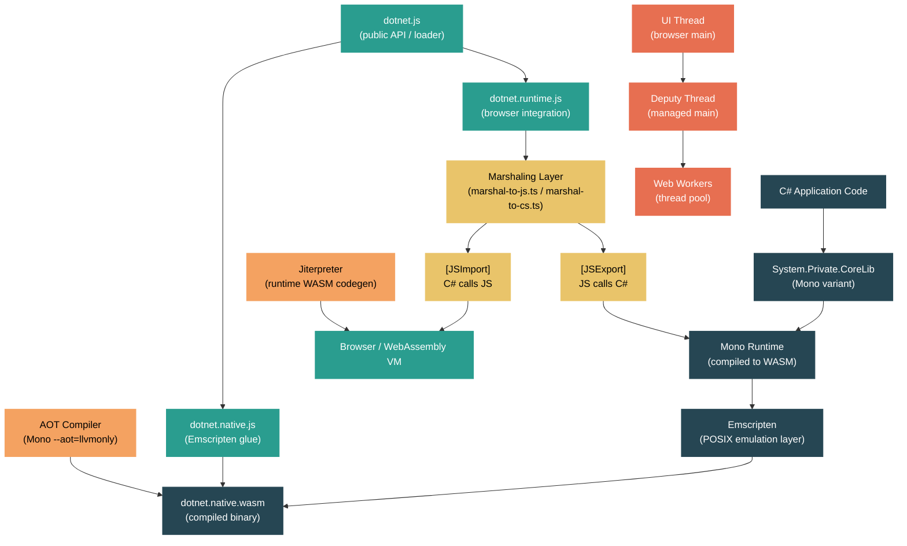

# Level 5: Expert / Contributor — WebAssembly and the Browser Runtime

> **Target profile:** Developer who wants to understand how .NET runs inside the browser via WebAssembly, including the Mono WASM runtime, the JavaScript interop bridge, threading on WASM, AOT compilation for WASM, and how Blazor WebAssembly leverages all of it
> **Estimated effort:** 8 hours
> **Prerequisites:** [Module 5.6 — Mono Runtime](../en/04-internals-nativeaot.md) (Mono familiarity assumed)
> [Version en espanol](../es/05-expert-wasm.md)

---

## Learning Objectives

By the end of this module you will be able to:

1. Explain the architecture of .NET on WebAssembly -- how the Mono runtime is compiled to a `.wasm` binary via Emscripten and how the JavaScript host bootstraps it inside a browser or Node.js environment.
2. Trace the full lifecycle of a `[JSImport]` call from C# into JavaScript and a `[JSExport]` call from JavaScript into managed code, identifying the marshaling layers on both the TypeScript and C# sides.
3. Describe the WASM build pipeline -- from `dotnet build` through Emscripten compilation to the `AppBundle/_framework` output structure, including the roles of `dotnet.js`, `dotnet.native.js`, `dotnet.runtime.js`, and `dotnet.native.wasm`.
4. Explain the threading model on WASM -- how `SharedArrayBuffer` and Web Workers enable multi-threading, the roles of the UI thread, deputy thread, and IO thread, and the fundamental limitations browsers impose.
5. Describe why AOT compilation matters for WASM performance, how the Mono AOT compiler produces WebAssembly, and how the Jiterpreter optimizes interpreted code at runtime.
6. Articulate how Blazor WebAssembly uses the .NET WASM runtime, how its component model dispatches between JS and managed code, and what performance characteristics follow from this architecture.

---

## Concept Map



---

## Curriculum

### Lesson 1 --- .NET on WebAssembly: The Architecture

#### What you will learn

Running .NET inside a browser is something that should not work -- browsers have no concept of a CLR, garbage collectors, or managed exceptions. Yet .NET applications run in the browser every day. This lesson explains the remarkable engineering that makes it possible: the Mono runtime compiled to WebAssembly via Emscripten, a JavaScript host that bootstraps and feeds it, and a layered architecture that bridges two fundamentally different worlds.

#### The big picture: Mono compiled to WebAssembly

The .NET browser runtime is the **Mono runtime** (not CoreCLR) compiled as a WebAssembly module using the [Emscripten](https://emscripten.org/) toolchain. Emscripten takes C/C++ source code and produces:

1. **`dotnet.native.wasm`** -- the Mono runtime itself (GC, interpreter, type system, exception handling) compiled as a WebAssembly binary.
2. **`dotnet.native.js`** -- Emscripten's JavaScript "glue" providing POSIX emulation: file system, environment variables, memory management, and threading primitives.

On top of this, the dotnet/runtime repository provides:

3. **`dotnet.js`** -- the public JavaScript API and loader. This is what applications import.
4. **`dotnet.runtime.js`** -- the browser integration layer written in TypeScript. This is the heart of the interop system.
5. **`dotnet.boot.js`** -- a manifest of all assets with integrity hashes and configuration flags.

The file `src/mono/browser/runtime/globals.ts` defines the environment detection logic that underpins everything:

```typescript
export const ENVIRONMENT_IS_NODE = typeof process == "object" && ...;
export const ENVIRONMENT_IS_WEB_WORKER = typeof importScripts == "function";
export const ENVIRONMENT_IS_WEB = typeof window == "object" || ...;
export const ENVIRONMENT_IS_SHELL = !ENVIRONMENT_IS_WEB && !ENVIRONMENT_IS_NODE;
```

This allows the same runtime to operate in browsers, Node.js, V8 shell, and web workers.

#### The startup sequence

The boot process is orchestrated by the TypeScript loader at `src/mono/browser/runtime/loader/`. The entry point is `src/mono/browser/runtime/loader/index.ts`:

```typescript
const dotnet: DotnetHostBuilder = new HostBuilder();
dotnet.withConfig(/*! dotnetBootConfig */{});
export { dotnet, exit };
```

The `HostBuilder` class at `src/mono/browser/runtime/loader/run.ts` implements a fluent API that applications use:

```javascript
import { dotnet } from './_framework/dotnet.js';
await dotnet.run();
```

When `run()` is called, the startup proceeds through these phases, coordinated by `src/mono/browser/runtime/startup.ts`:

1. **Configuration** -- `configureRuntimeStartup()` sets up console output and checks for required WASM features (SIMD, exception handling).
2. **Emscripten initialization** -- `configureEmscriptenStartup()` hooks into Emscripten's module lifecycle (`instantiateWasm`, `preRun`, `postRun`, `onRuntimeInitialized`).
3. **WASM instantiation** -- The `dotnet.native.wasm` binary is downloaded and instantiated via `WebAssembly.instantiateStreaming()`.
4. **Asset loading** -- Managed assemblies (`.dll` or Webcil `.wasm`), ICU data, timezone data, and satellite assemblies are downloaded and loaded into the Emscripten virtual file system.
5. **Runtime initialization** -- The C function `mono_wasm_load_runtime` is called via Emscripten's "cwraps" mechanism, starting the Mono runtime.
6. **Managed exports binding** -- `init_managed_exports()` in `src/mono/browser/runtime/managed-exports.ts` locates the `System.Runtime.InteropServices.JavaScript` assembly and binds managed entry points like `CallEntrypoint` and `BindAssemblyExports`.
7. **Entry point dispatch** -- The managed `Main()` method is invoked via `call_entry_point()`.

#### The native C layer

The C files `src/mono/browser/runtime/driver.c` and `src/mono/browser/runtime/runtime.c` are the bridge between the TypeScript host and the Mono C API. `runtime.c` contains shared code used by both the browser (`HOST_BROWSER`) and WASI (`HOST_WASI`) targets:

```c
#ifdef __EMSCRIPTEN__
#define HOST_BROWSER 1
#else
#define HOST_WASI 1
#endif
```

`driver.c` is browser-specific. It includes Emscripten headers and provides exports like `SystemInteropJS_RegisterGCRoot` which the JavaScript marshaling layer calls to register managed object references with the GC.

#### WASI: the other WASM target

The same Mono runtime also targets WASI (WebAssembly System Interface) for non-browser environments. The `src/mono/wasm/host/wasi/` directory contains `WasiEngineHost.cs` and `WasiEngineArguments.cs` for running .NET on WASI runtimes like wasmtime and wasmer. WASI provides a standardized system interface without browser APIs, enabling server-side and CLI WASM scenarios.

#### The Emscripten version

The file `src/mono/browser/emscripten-version.txt` pins the exact Emscripten version used to compile the runtime. This matters because WebAssembly feature support (SIMD, exception handling, threads) depends on the Emscripten version, and mismatches between the JavaScript glue and the WASM binary cause runtime errors.

#### Source exploration exercise

1. Open `src/mono/browser/runtime/loader/index.ts` and note how it creates a `HostBuilder` and exports the `dotnet` object. This is the public API entry point.
2. Read the first 100 lines of `src/mono/browser/runtime/startup.ts` and trace the imports -- notice how it pulls in marshalers, profilers, thread support, and the jiterpreter.
3. Open `src/mono/browser/runtime/runtime.c` and observe the `#ifdef HOST_BROWSER` / `HOST_WASI` split. This single file targets both platforms.
4. Read `src/mono/browser/runtime/globals.ts` and identify how the runtime detects whether it is running in a browser, Node.js, a web worker, or a shell.
5. Browse the `src/mono/wasm/features.md` file for a comprehensive list of configurable browser features (threading, SIMD, exception handling, fetch, WebSocket).

---

### Lesson 2 --- The JavaScript Interop Bridge

#### What you will learn

The most remarkable aspect of .NET on WebAssembly is the ability to call JavaScript from C# and C# from JavaScript -- seamlessly, with type marshaling, across the WASM boundary. This lesson dissects the interop bridge from both sides: the managed `[JSImport]`/`[JSExport]` attributes, the source generator that produces marshaling stubs, and the TypeScript runtime that executes the actual calls.

#### The managed API: JSImport and JSExport

The `System.Runtime.InteropServices.JavaScript` library at `src/libraries/System.Runtime.InteropServices.JavaScript/` provides two core attributes:

**`[JSImport]`** -- marks a `static partial` method as a proxy for a JavaScript function:

```csharp
[JSImport("window.alert")]
public static partial void Alert(string message);

[JSImport("sum", "my-math-module")]
public static partial int Sum(int a, int b);
```

The attribute accepts a function name (with dot notation for nested objects) and an optional module name. Modules must be loaded first via `JSHost.ImportAsync()`.

**`[JSExport]`** -- marks a method as callable from JavaScript:

```csharp
[JSExport]
public static string Greet(string name) => $"Hello, {name}!";
```

Both attributes are decorated with `[SupportedOSPlatform("browser")]`, indicating they are only meaningful on the browser/WASM platform.

The `JSHost` class at `src/libraries/System.Runtime.InteropServices.JavaScript/src/System/Runtime/InteropServices/JavaScript/JSHost.cs` provides the global entry points:

- `JSHost.GlobalThis` -- a proxy for JavaScript's `globalThis`
- `JSHost.DotnetInstance` -- a proxy for the .NET runtime's JavaScript module
- `JSHost.ImportAsync()` -- dynamically imports an ES6 module for use with `[JSImport]`

#### The source generator

The `[JSImport]` and `[JSExport]` attributes are meaningless without the associated source generator. At build time, the generator produces marshaling stubs that:

1. Allocate a stack frame on the interop marshaling stack.
2. Marshal each argument from its .NET type to a representation the JavaScript side understands.
3. Invoke the JavaScript function (for imports) or dispatch to the managed method (for exports).
4. Marshal the return value back.

The marshaling types are defined in `src/libraries/System.Runtime.InteropServices.JavaScript/src/System/Runtime/InteropServices/JavaScript/Marshaling/` and `JSMarshalerType.cs`. Supported type mappings include:

| C# Type | JavaScript Type | Notes |
|---------|----------------|-------|
| `int`, `float`, `double` | `number` | Direct value transfer |
| `long` | `BigInt` | Requires browser BigInt support |
| `string` | `string` | UTF-16 encoded |
| `bool` | `boolean` | |
| `byte[]` | `Uint8Array` | Array copy or view |
| `Task` | `Promise` | Async bridging |
| `Action` / `Func<>` | `Function` | Delegate wrapping |
| `JSObject` | Any JS object | Opaque proxy handle |
| `DateTime` | `Date` | |
| `Exception` | `Error` | |

#### The TypeScript marshaling runtime

The actual interop execution happens in the TypeScript runtime at `src/mono/browser/runtime/`. The key files are:

- **`invoke-js.ts`** -- handles `[JSImport]` calls. When C# calls a JS-imported method, the runtime resolves the function handle, deserializes arguments from the interop stack frame, calls the JavaScript function, and marshals the return value back.

- **`invoke-cs.ts`** -- handles `[JSExport]` calls. When JavaScript calls an exported C# method, the function `mono_wasm_bind_cs_function()` creates a JavaScript wrapper that marshals arguments into the interop format and dispatches to the managed method.

- **`marshal-to-js.ts`** -- contains marshalers from C# types to JavaScript types. The function `initialize_marshalers_to_js()` registers a marshaler for every supported `MarshalerType`:

```typescript
cs_to_js_marshalers.set(MarshalerType.String, marshal_string_to_js);
cs_to_js_marshalers.set(MarshalerType.Task, marshal_task_to_js);
cs_to_js_marshalers.set(MarshalerType.JSObject, _marshal_js_object_to_js);
// ... 25+ type marshalers
```

- **`marshal-to-cs.ts`** -- contains the reverse direction marshalers.

- **`cwraps.ts`** -- declares the C functions exported from the WASM module that the TypeScript runtime calls. This is the low-level binding between the JavaScript layer and the C runtime:

```typescript
const fn_signatures: SigLine[] = [
    [false, "mono_wasm_load_runtime", null, ["number", "number", ...]],
    [false, "mono_wasm_add_assembly", "number", ["string", "number", "number"]],
    [true, "mono_wasm_assembly_load", "number", ["string"]],
    // ...
];
```

#### The GC handle system

When a managed object crosses the interop boundary, it cannot be passed as a raw pointer because the GC might move it. Instead, the runtime uses **GC handles** -- stable integer identifiers that pin a reference to a managed object. The file `src/mono/browser/runtime/gc-handles.ts` manages these handles.

Similarly, JavaScript objects are tracked by **JS handles** -- integers registered in a table on the JavaScript side. The `JSObject` class in C# holds a JS handle, and the GC integration ensures that when the C# proxy is collected, the JavaScript object is released.

#### How a [JSImport] call flows end to end

1. C# code calls `Alert("hello")` which is a source-generated partial method.
2. The generated stub allocates a stack frame and marshals the `string` argument using the interop marshaling infrastructure.
3. The stub calls into the runtime, which transitions to the JavaScript side via `SystemInteropJS_InvokeJSImportST()` in `invoke-js.ts`.
4. The TypeScript code resolves the bound JavaScript function by its function handle.
5. Arguments are deserialized from the stack frame using the registered marshalers.
6. The JavaScript function is called.
7. The return value is marshaled back to the C# stack frame.
8. Control returns to the managed caller.

#### Source exploration exercise

1. Read `src/libraries/System.Runtime.InteropServices.JavaScript/src/System/Runtime/InteropServices/JavaScript/JSImportAttribute.cs` and `JSExportAttribute.cs`. Note the `[SupportedOSPlatform("browser")]` decoration.
2. Open `src/mono/browser/runtime/invoke-js.ts` and find `SystemInteropJS_InvokeJSImportST`. Trace how it resolves the function handle and dispatches the call.
3. Open `src/mono/browser/runtime/invoke-cs.ts` and read `mono_wasm_bind_cs_function`. Note how it builds arg marshalers and creates a closure for the bound function.
4. Read the first 60 lines of `src/mono/browser/runtime/marshal-to-js.ts` and enumerate all the `MarshalerType` values registered. Count how many type conversions are supported.
5. Open `src/mono/browser/runtime/managed-exports.ts` and read `init_managed_exports()`. This is how the JavaScript runtime discovers and binds the managed-side interop infrastructure.

---

### Lesson 3 --- Building for WASM

#### What you will learn

Building a .NET application for WebAssembly involves a unique pipeline that goes far beyond `dotnet build`. This lesson traces the entire build chain: from your C# source to the `AppBundle/_framework` directory that a web server hosts. You will understand the roles of Emscripten, Webcil, the wasm-tools workload, and the MSBuild targets that orchestrate it all.

#### The build pipeline overview

When you build a .NET WASM application, the pipeline has two major phases:

1. **Managed compilation**: Standard `dotnet build` compiles C# to IL assemblies (`.dll`), just like any other .NET target.
2. **WASM packaging**: The MSBuild targets at `src/mono/wasm/build/` and `src/mono/browser/build/` take the IL assemblies and the pre-compiled Mono WASM runtime, and package them into the `AppBundle` output directory.

For most developers, the pre-compiled Mono WASM runtime ships as part of the `Microsoft.NETCore.App.Runtime.Mono.browser-wasm` NuGet package. You do not need to compile Mono from source.

#### The MSBuild targets

The file `src/mono/wasm/build/WasmApp.Common.targets` is the orchestrator. Its header documents dozens of MSBuild properties:

```xml
<!-- Required public properties: -->
<!-- $(EMSDK_PATH) - points to the emscripten sdk location -->

<!-- Public properties (optional): -->
<!-- $(WasmAppDir)        - AppBundle dir -->
<!-- $(WasmBuildNative)   - Whether to build the native executable -->
<!-- $(RunAOTCompilation) - Defaults to false -->
<!-- $(WasmEnableThreads) - Enable multi-threading -->
<!-- $(WasmEnableSIMD)    - Enable WASM SIMD -->
<!-- $(WasmEnableExceptionHandling) - Enable WASM EH -->
```

Key properties that control the build:

| Property | Default | Effect |
|----------|---------|--------|
| `RunAOTCompilation` | `false` | Ahead-of-time compile IL to WASM |
| `WasmBuildNative` | `false` | Rebuild the Mono native binary |
| `WasmEnableThreads` | `false` | Enable multi-threading support |
| `WasmEnableSIMD` | `true` | Use WASM SIMD instructions |
| `WasmEnableExceptionHandling` | `true` | Use WASM native exception handling |
| `WasmEnableWebcil` | `true` | Convert .dll to Webcil .wasm format |
| `InvariantGlobalization` | `false` | Disable ICU globalization data |

#### The output structure

The `_framework` directory of an `AppBundle` contains:

```
_framework/
  dotnet.js              -- Public API entry point
  dotnet.native.js       -- Emscripten POSIX emulation
  dotnet.runtime.js      -- Browser integration (TypeScript runtime)
  dotnet.boot.js         -- Asset manifest with integrity hashes
  dotnet.native.wasm     -- Compiled Mono runtime binary
  System.Private.CoreLib.wasm  -- Core library (Webcil format)
  MyApp.wasm             -- Your application assembly (Webcil format)
  *.wasm                 -- Other managed assemblies in Webcil format
```

#### Webcil: assemblies disguised as WASM

By default since .NET 8, managed assemblies are wrapped in **Webcil** format -- a container that gives `.dll` files a `.wasm` extension and WebAssembly-compatible headers. This is purely a packaging concern, not a change to the IL inside. The motivation is pragmatic: corporate firewalls and virus scanners flag `.dll` downloads, but `.wasm` files pass through without issue. The property `WasmEnableWebcil` controls this; setting it to `false` reverts to plain `.dll` files.

#### Native rebuild

When you set `WasmBuildNative=true` or enable AOT (`RunAOTCompilation=true`), the build pipeline invokes Emscripten to recompile the Mono runtime. This requires the `wasm-tools` workload:

```bash
dotnet workload install wasm-tools
```

You can also link custom C code into the runtime:

```xml
<NativeFileReference Include="my_native_lib.c" />
```

The Emscripten compilation is controlled by properties like `EmccLinkOptimizationFlag`, `EmccCompileOptimizationFlag`, `EmccInitialHeapSize` (default ~32 MB), and `EmccMaximumHeapSize` (default 2 GB).

#### Building from source (contributor workflow)

Contributors building the WASM runtime from the dotnet/runtime repository use:

```bash
# Build Mono + libraries for browser target
./build.sh mono+libs -os browser

# Build with threading enabled
./build.sh mono+libs -os browser /p:WasmEnableThreads=true
```

The samples at `src/mono/sample/wasm/` provide working examples:

- `browser/` -- minimal browser application
- `browser-threads/` -- multi-threaded browser application
- `browser-advanced/` -- advanced interop scenarios
- `console-node/` -- Node.js console application
- `console-v8/` -- V8 shell application

#### The browser vs WASI split

The build system produces two distinct targets:

- **browser** (`-os browser`): Targets the browser JavaScript environment via Emscripten.
- **WASI** (`-os wasi`): Targets the WASI system interface for non-browser WASM runtimes.

Both share the Mono runtime C code (conditioned with `HOST_BROWSER` / `HOST_WASI` in `runtime.c`) but diverge in the JavaScript integration layer. The browser target includes the full TypeScript runtime; WASI has a minimal host.

#### Source exploration exercise

1. Open `src/mono/wasm/build/WasmApp.Common.targets` and read the property documentation in the first 100 lines. Count how many configurable properties exist.
2. Browse the `src/mono/sample/wasm/` directory. Open `src/mono/sample/wasm/browser/` and examine its structure as a minimal WASM application.
3. Read `src/mono/wasm/features.md` for the comprehensive feature documentation including SIMD, exception handling, threading, HTTP, WebSocket, globalization, and AOT.
4. Check `src/mono/browser/emscripten-version.txt` for the pinned Emscripten version.
5. List `src/mono/wasm/host/` and read `Program.cs` to understand the development server that hosts WASM applications for testing.

---

### Lesson 4 --- Threading on WASM

#### What you will learn

Threading in the browser is profoundly different from threading on a desktop operating system. There are no OS threads, no shared memory by default, and the browser's main thread must never be blocked. Yet .NET on WASM supports multi-threading through a creative use of Web Workers, `SharedArrayBuffer`, and Emscripten's pthread emulation. This lesson explains how it all fits together, and why certain things simply cannot work the way desktop developers expect.

#### The fundamental constraint

A browser's main thread runs the event loop that handles user input, layout, painting, and JavaScript execution. **Blocking the main thread** (e.g., `Thread.Sleep()`, `Monitor.Enter()`, `Task.Wait()`) freezes the entire browser tab. This is not a .NET limitation -- it is a browser architecture constraint that applies to all code.

WebAssembly inherits this constraint. A WASM module running on the main thread cannot make synchronous blocking calls.

#### SharedArrayBuffer and Web Workers

Multi-threading on WASM relies on two browser features:

1. **`SharedArrayBuffer`** -- a JavaScript object that provides a shared memory region accessible from multiple workers. This is the WebAssembly equivalent of shared process memory.
2. **Web Workers** -- background JavaScript execution contexts that run on separate OS threads. Each worker has its own JavaScript global scope but can share memory via `SharedArrayBuffer`.

For security reasons, `SharedArrayBuffer` requires specific HTTP headers:

```
Cross-Origin-Embedder-Policy: require-corp
Cross-Origin-Opener-Policy: same-origin
```

Without these headers, the browser disables `SharedArrayBuffer` and multi-threading is unavailable.

#### Emscripten's pthread layer

Emscripten implements POSIX pthreads on top of Web Workers and `SharedArrayBuffer`. When Mono calls `pthread_create()`, Emscripten:

1. Takes a pre-allocated Web Worker from a worker pool.
2. Shares the WASM memory (backed by `SharedArrayBuffer`) with the worker.
3. Runs the thread function on the worker.

The .NET threading configuration is enabled with `<WasmEnableThreads>true</WasmEnableThreads>`. This compiles the Mono runtime with `__EMSCRIPTEN_THREADS__` defined and enables the `FEATURE_WASM_MANAGED_THREADS` preprocessor symbol in the libraries.

#### The three special threads

The threading model in `src/mono/browser/runtime/pthreads/` defines three special thread roles:

1. **UI Thread** (`ui-thread.ts`) -- this is the browser's main thread. It runs the JavaScript event loop, handles DOM events, and manages Web Worker creation. The UI thread must never block. The file `src/mono/browser/runtime/pthreads/ui-thread.ts` handles message dispatching from workers.

2. **Deputy Thread** (`deputy-thread.ts`) -- a Web Worker that acts as the "managed main thread." When threads are enabled, the actual .NET `Main()` method runs on the deputy thread, not on the browser main thread. This allows managed code to use blocking operations (like `Thread.Sleep()`) without freezing the browser. The deputy thread is created during startup:

```typescript
export function mono_wasm_start_deputy_thread_async () {
    monoThreadInfo.isDeputy = true;
    monoThreadInfo.threadName = "Managed Main Deputy";
    // ...
    await start_runtime();
    runtimeHelpers.proxyGCHandle = install_main_synchronization_context(...);
}
```

3. **IO Thread** (`io-thread.ts`) -- a dedicated worker for asynchronous I/O operations that need JavaScript API access (fetch, WebSocket).

#### Thread types and identification

The `src/mono/browser/runtime/pthreads/shared.ts` file reveals the full taxonomy of thread types tracked by the runtime:

```typescript
const threadType = !monoThreadInfo.isRegistered ? "emsc"
    : monoThreadInfo.isUI ? "-UI-"
        : monoThreadInfo.isDeputy ? "dpty"
            : monoThreadInfo.isIo ? "-IO-"
                : monoThreadInfo.isTimer ? "timr"
                    : monoThreadInfo.isLongRunning ? "long"
                        : monoThreadInfo.isThreadPoolGate ? "gate"
                            : monoThreadInfo.isDebugger ? "dbgr"
                                : monoThreadInfo.isThreadPoolWorker ? "pool"
                                    : monoThreadInfo.isExternalEventLoop ? "jsww"
                                        : monoThreadInfo.isBackground ? "back"
                                            : "norm";
```

This gives us: UI thread, deputy, IO, timer, long-running, thread pool gate, debugger, thread pool workers, JS web workers with external event loops, background threads, and normal threads.

#### JS interop and thread affinity

JavaScript objects have **thread (Web Worker) affinity**. A `WebSocket` or DOM element created on one worker cannot be used from another. This means `[JSImport]` and `[JSExport]` calls are tied to the thread where they were established.

The `JSSynchronizationContext` (in `src/libraries/System.Runtime.InteropServices.JavaScript/src/System/Runtime/InteropServices/JavaScript/JSSynchronizationContext.cs`) helps manage this: after an `await`, instead of resuming on any thread pool thread, the continuation resumes on the original worker thread that owns the JavaScript objects.

The `threads.md` documentation at `src/mono/wasm/threads.md` explains:

> The JavaScript objects have thread (web worker) affinity. You can't use DOM, WebSocket or their promises on any other web worker than the original one. Therefore we have JSSynchronizationContext which is helping the user code to stay on that thread.

#### Communication between threads

Threads communicate via Emscripten's `postMessage` system, which the .NET runtime wraps in a structured message protocol. The `WorkerToMainMessageType` and `MainToWorkerMessageType` enums define the message vocabulary:

- `preload`, `deputyCreated`, `deputyStarted`, `deputyReady` -- startup coordination
- `killThread` -- thread termination
- `allAssetsLoaded` -- signal that all managed assemblies are in memory

#### Limitations

Threading on WASM has significant limitations compared to desktop .NET:

1. **No blocking on the UI thread**: `Task.Wait()`, `Thread.Sleep()`, `Monitor.Enter()` on the browser main thread will deadlock or throw.
2. **Worker pool is pre-allocated**: Web Workers are expensive to create, so Emscripten pre-allocates a pool. Running out of workers causes thread creation to fail.
3. **No `Thread.Abort()`**: Not supported on any modern .NET platform, and especially not on WASM.
4. **JS interop limited to owning thread**: You cannot pass `JSObject` references between threads.
5. **COOP headers required**: Without the security headers, everything falls back to single-threaded mode.

#### Source exploration exercise

1. Read `src/mono/wasm/threads.md` end to end. Note the discussion of the browser thread, deputy thread, and the FIXME about JS interop on dedicated threads.
2. Open `src/mono/browser/runtime/pthreads/deputy-thread.ts` and trace the deputy thread's startup sequence. Note how it calls `start_runtime()` and `install_main_synchronization_context()`.
3. Read `src/mono/browser/runtime/pthreads/shared.ts` and examine the thread type classification logic.
4. Open `src/mono/browser/runtime/pthreads/ui-thread.ts` and find the message handler that processes messages from worker threads.
5. Read `src/mono/wasm/features.md` section on multi-threading for the security header requirements and current limitations.

---

### Lesson 5 --- AOT Compilation for WASM

#### What you will learn

When .NET runs in interpreted mode on WASM, performance is significantly lower than native JavaScript. AOT (ahead-of-time) compilation addresses this by compiling IL directly into WebAssembly instructions, eliminating the interpreter overhead. This lesson covers the AOT pipeline, the Jiterpreter (a fascinating middle ground), and the tradeoffs between interpreter, Jiterpreter, and full AOT.

#### Why AOT matters for WASM

On desktop, the JIT compiler translates IL to native machine code at runtime, achieving near-native performance. On WASM, there is no JIT -- the browser's WebAssembly engine is the JIT, and it only understands WASM instructions. The Mono runtime on WASM runs IL through its **interpreter**, which is significantly slower because every IL opcode is dispatched through a C switch statement compiled to WASM.

AOT compilation solves this by pre-compiling IL methods into native WASM functions at build time. These compiled functions are included in `dotnet.native.wasm` alongside the runtime, and the browser's WASM JIT can optimize them just like any other WebAssembly code.

#### The three execution tiers

| Mode | How it works | Performance | Download size |
|------|-------------|-------------|---------------|
| **Interpreter** | Mono interpreter executes IL opcodes one by one | Slowest (10-100x slower than native JS) | Smallest |
| **Jiterpreter** | Runtime generates WASM functions for hot interpreter traces | Medium (2-10x improvement over interpreter) | Slightly larger |
| **AOT** | IL pre-compiled to WASM at build time | Fastest (approaching native JS performance) | Largest |

#### Enabling AOT

AOT is enabled by adding to your `.csproj`:

```xml
<PropertyGroup>
    <RunAOTCompilation>true</RunAOTCompilation>
</PropertyGroup>
```

This is effective only when publishing (`dotnet publish`). During development builds, the interpreter is used for faster iteration.

AOT requires the `wasm-tools` workload:

```bash
dotnet workload install wasm-tools
```

#### The AOT compilation pipeline

When AOT is enabled, the build pipeline:

1. **IL compilation**: C# is compiled to IL assemblies as usual.
2. **Mono AOT compiler**: The Mono AOT compiler (not to be confused with NativeAOT/ILC) processes each assembly, translating IL methods to LLVM IR.
3. **LLVM backend**: LLVM compiles the IR to WebAssembly object files (`.o`).
4. **Emscripten linking**: Emscripten links the AOT object files with the Mono runtime and Emscripten glue into a single `dotnet.native.wasm`.

The Mono AOT compiler uses `--aot=llvmonly` mode for WASM, which means all code goes through LLVM -- there is no "mini" native code generation path as on other Mono platforms.

#### The Jiterpreter: runtime WASM generation

The **Jiterpreter** is one of the most creative pieces of engineering in the .NET WASM stack. Defined across several files at `src/mono/browser/runtime/jiterpreter*.ts`, it addresses the performance gap when AOT is not used.

The core idea: instead of interpreting IL opcodes one by one, the Jiterpreter identifies frequently executed sequences of opcodes ("traces") and generates WebAssembly functions at runtime that execute those traces directly. This is essentially a JIT compiler that targets WASM, running inside WASM.

From `src/mono/browser/runtime/jiterpreter.ts`:

```typescript
export const trace = 0;
export const
    traceOnError = false,
    traceAbortLocations = false,
    countCallTargets = false,
    nullCheckCaching = true,
    maxCallHandlerReturnAddresses = 3,
    summaryStatCount = 30;
```

The Jiterpreter works by:

1. **Monitoring** interpreter dispatch to identify hot traces (frequently executed sequences of opcodes).
2. **Compiling** those traces into WebAssembly function bodies using the `WasmBuilder` class.
3. **Installing** the compiled functions into the WebAssembly function table, replacing the interpreter dispatch for those traces.

The generated WASM functions operate directly on the interpreter's stack and memory, avoiding the per-opcode dispatch overhead.

The Jiterpreter is enabled by default for non-AOT builds. It can be disabled with:

```xml
<BlazorWebAssemblyJiterpreter>false</BlazorWebAssemblyJiterpreter>
```

#### Interpreter PGO

The file `src/mono/browser/runtime/interp-pgo.ts` implements **interpreter profile-guided optimization**. During execution, the runtime records which interpreter opcodes are executed most frequently. This profile data can be saved and loaded on subsequent runs, allowing the Jiterpreter to immediately compile hot paths without a warmup period.

Enable it via the `HostBuilder` API:

```javascript
await dotnet
    .withInterpreterPgo(true, /* autoSaveDelay */ 30000)
    .run();
```

#### AOT vs file size tradeoffs

AOT-compiled assemblies produce larger `dotnet.native.wasm` files because the compiled WASM code is embedded directly. For a typical Blazor application:

- **Interpreter only**: ~2-3 MB for `dotnet.native.wasm`, plus IL assemblies
- **AOT**: ~10-20 MB for `dotnet.native.wasm` (IL assemblies can be stripped with `WasmStripILAfterAOT`)

The `WasmStripILAfterAOT` property (default `true`) removes IL method bodies from assemblies after AOT compilation, since the native code is used instead. This reduces the total download size but makes the IL unavailable for reflection or debugging.

#### IL trimming

IL trimming (`<PublishTrimmed>true</PublishTrimmed>` with `<TrimMode>full</TrimMode>`) removes unused code before AOT compilation, reducing both download size and AOT compilation time. However, trimming can break code that uses reflection or dynamic patterns -- the same warnings and mitigations from NativeAOT apply (see Module 4.10).

#### Source exploration exercise

1. Open `src/mono/browser/runtime/jiterpreter.ts` and read the first 80 lines. Note the configuration constants and the design philosophy comments.
2. Open `src/mono/browser/runtime/jiterpreter-support.ts` and find the `WasmBuilder` type. This is the runtime WASM code generator.
3. Read `src/mono/browser/runtime/interp-pgo.ts` to understand how interpreter profile data is collected and loaded.
4. Browse `src/mono/wasm/features.md` sections on AOT and the Jiterpreter for the user-facing documentation.
5. Open `src/mono/wasm/build/WasmApp.Common.targets` and find the `RunAOTCompilation` property and related AOT settings.

---

### Lesson 6 --- Blazor WebAssembly Under the Hood

#### What you will learn

Blazor WebAssembly is the most visible consumer of .NET on WASM. Millions of developers use it without understanding the runtime beneath. This lesson connects the dots: how Blazor's component model sits on top of the WASM runtime, how its JS-to-managed bridge works, and what performance characteristics follow from the architecture.

#### Blazor on top of the WASM runtime

Blazor WebAssembly is not a separate runtime -- it is a set of managed libraries that run on the exact same Mono WASM runtime described in this module. The Blazor framework:

1. **Downloads and boots the .NET runtime** using the same `dotnet.js` loader described in Lesson 1.
2. **Uses `[JSExport]` and `[JSImport]`** for its JS interop, though it wraps them in its own `IJSRuntime` abstraction.
3. **Runs its component rendering pipeline** entirely in managed code on the WASM runtime.
4. **Communicates DOM diffs to the browser** via JavaScript interop -- Blazor never directly manipulates the DOM from C#.

#### The render cycle

When a Blazor component's state changes:

1. The managed `Renderer` re-executes the component's `BuildRenderTree()` method.
2. The renderer computes a diff between the old and new render trees.
3. The diff is serialized and sent to JavaScript via the interop bridge.
4. JavaScript applies the diff to the actual DOM.

This means every DOM update crosses the WASM-JavaScript boundary. The cost of this crossing is why Blazor applications can feel slower than equivalent React or Vue applications for DOM-heavy operations.

#### The JS interop surface

Blazor WebAssembly uses a specific set of interop entry points that the runtime recognizes. Looking at `src/mono/browser/runtime/invoke-cs.ts`, there is even a special case for Blazor's core methods:

```typescript
if (WasmEnableThreads && shortClassName === "DefaultWebAssemblyJSRuntime"
    && namespaceName === "Microsoft.AspNetCore.Components.WebAssembly.Services"
    && (methodName === "BeginInvokeDotNet" || methodName === "EndInvokeJS"
        || methodName === "ReceiveByteArrayFromJS")) {
    res_marshaler_type = MarshalerType.DiscardNoWait;
}
```

This shows that the runtime has Blazor-specific optimizations built in -- these three methods use a `DiscardNoWait` marshaling mode that avoids the overhead of marshaling a return value and waiting for completion, since Blazor's dispatch protocol handles results through a separate callback path.

#### Blazor's three hosting models

Understanding the WASM runtime helps clarify why Blazor offers three hosting models:

1. **Blazor WebAssembly** -- runs entirely in the browser. Your C# code runs on the Mono WASM runtime. No server required after initial download. This is what this module describes.

2. **Blazor Server** -- runs on the server using CoreCLR. The browser only receives DOM diffs via SignalR. No WASM involved.

3. **Blazor United / Auto** (since .NET 8) -- starts with server-side rendering, then transitions to WASM once the runtime downloads. This uses both hosting models, making understanding the WASM runtime crucial for diagnosing the transition behavior.

#### Performance characteristics

The WASM runtime architecture directly determines Blazor's performance profile:

| Aspect | Characteristic | Root cause |
|--------|---------------|------------|
| **Initial load** | 2-10+ seconds | Downloading ~2-20 MB of runtime + assemblies |
| **Computational** | Slower than JS (interpreter) or comparable (AOT) | IL interpretation overhead or native WASM execution |
| **DOM updates** | Slower than JS frameworks | Every update crosses the interop boundary |
| **Memory** | Higher than native JS | Full .NET runtime + GC + assemblies in memory |
| **Startup after cache** | Fast | Runtime cached by the browser |

#### Optimizing Blazor WASM applications

Using the knowledge from this module, you can optimize Blazor WASM applications:

1. **Enable AOT** for computationally intensive applications (see Lesson 5).
2. **Enable IL trimming** to reduce download size.
3. **Use lazy loading** for assemblies not needed on initial render (`<BlazorWebAssemblyLoadAllGlobalizationData>` and `<LazyAssemblyLoading>`).
4. **Enable the Jiterpreter** (on by default) for non-AOT builds.
5. **Enable interpreter PGO** for faster warm starts.
6. **Minimize JS interop calls** -- batch DOM operations where possible.
7. **Consider multi-threading** for CPU-bound work (see Lesson 4), keeping in mind the COOP header requirements.

#### The `_framework` folder in a Blazor application

A published Blazor WASM application's `_framework` folder is identical to the generic WASM `_framework` described in Lesson 3. Blazor adds:

- `blazor.boot.json` -- Blazor's extended boot configuration (a superset of `dotnet.boot.js` information).
- `blazor.webassembly.js` -- Blazor's JavaScript entry point that orchestrates the `dotnet.js` loader with Blazor-specific initialization.

#### Source exploration exercise

1. In `src/mono/browser/runtime/invoke-cs.ts`, find the Blazor-specific `DiscardNoWait` optimization. Read the surrounding code to understand when and why it activates.
2. Open `src/mono/browser/runtime/managed-exports.ts` and note `CallEntrypoint` and `BindAssemblyExports`. Blazor's startup calls these same entry points.
3. Browse `src/mono/sample/wasm/blazor-frame/` if it exists, or `src/mono/sample/wasm/browser-frame/` for examples of how the runtime team tests Blazor-like scenarios.
4. Re-read the output structure in `src/mono/wasm/features.md` section on "Project folder structure" and map it to a real Blazor application's published output.

---

## Key Files Quick Reference

| Path | Description |
|------|-------------|
| `src/mono/browser/runtime/` | TypeScript/JavaScript runtime -- the browser integration layer |
| `src/mono/browser/runtime/loader/` | Loader: `dotnet.js` entry point, `HostBuilder`, configuration |
| `src/mono/browser/runtime/startup.ts` | Runtime startup orchestration |
| `src/mono/browser/runtime/invoke-js.ts` | `[JSImport]` call dispatch (C# to JS) |
| `src/mono/browser/runtime/invoke-cs.ts` | `[JSExport]` call dispatch (JS to C#) |
| `src/mono/browser/runtime/marshal-to-js.ts` | Marshalers: C# types to JavaScript types |
| `src/mono/browser/runtime/marshal-to-cs.ts` | Marshalers: JavaScript types to C# types |
| `src/mono/browser/runtime/cwraps.ts` | C function bindings (TypeScript to WASM exports) |
| `src/mono/browser/runtime/managed-exports.ts` | Managed method bindings (TypeScript to C# exports) |
| `src/mono/browser/runtime/pthreads/` | Threading: UI thread, deputy, workers, shared state |
| `src/mono/browser/runtime/jiterpreter*.ts` | Jiterpreter: runtime WASM code generation |
| `src/mono/browser/runtime/driver.c` | Browser-specific C driver (GC roots, debugging) |
| `src/mono/browser/runtime/runtime.c` | Shared C runtime (browser + WASI) |
| `src/mono/wasm/build/` | MSBuild targets for WASM app packaging |
| `src/mono/wasm/host/` | Development server for testing WASM apps |
| `src/mono/wasm/threads.md` | Threading architecture documentation |
| `src/mono/wasm/features.md` | Comprehensive feature configuration guide |
| `src/mono/sample/wasm/` | Sample applications (browser, threads, Node.js) |
| `src/libraries/System.Runtime.InteropServices.JavaScript/` | Managed JS interop library (`[JSImport]`, `[JSExport]`) |

---

## Self-Assessment Questions

1. **Conceptual**: Explain why the Mono runtime is used for WASM instead of CoreCLR. What properties of Mono make it suitable for compilation to WebAssembly?

2. **Tracing**: A C# method decorated with `[JSImport("fetch")]` is called. Trace the complete call path from the managed callsite through the source-generated stub, through the TypeScript runtime (`invoke-js.ts`, marshaling), to the actual JavaScript `fetch()` call.

3. **Architecture**: Why does the multi-threaded WASM runtime use a "deputy thread" for the managed main method instead of running it on the browser's main thread? What would go wrong if it ran on the main thread?

4. **Practical**: You are deploying a Blazor WASM application and users report that it does not work on their corporate network. They see `SharedArrayBuffer is not defined` errors. What is the cause, and what are your two options?

5. **Performance**: Explain the three execution tiers (interpreter, Jiterpreter, AOT) and when you would choose each. A customer has a WASM application with heavy mathematical computation but needs fast initial load -- what do you recommend?

6. **Build pipeline**: Describe what happens differently during `dotnet publish` vs `dotnet build` for a WASM project with `<RunAOTCompilation>true</RunAOTCompilation>`. Why is AOT only applied during publish?

---

## Further Reading

- [WebAssembly Feature Configuration](../../src/mono/wasm/features.md) -- comprehensive guide to all WASM build properties
- [Threading on WASM](../../src/mono/wasm/threads.md) -- threading architecture and limitations
- [Jiterpreter Design](../../docs/design/mono/jiterpreter.md) -- detailed design of the runtime WASM code generator
- [JavaScript Interop Documentation](https://learn.microsoft.com/aspnet/core/client-side/dotnet-interop) -- official Microsoft docs for `[JSImport]`/`[JSExport]`
- [Blazor WebAssembly Documentation](https://learn.microsoft.com/aspnet/core/blazor/) -- official Blazor documentation
- [WebAssembly Roadmap](https://webassembly.org/roadmap/) -- browser support for WASM features
- [Emscripten Documentation](https://emscripten.org/docs/) -- the toolchain that compiles Mono to WASM
