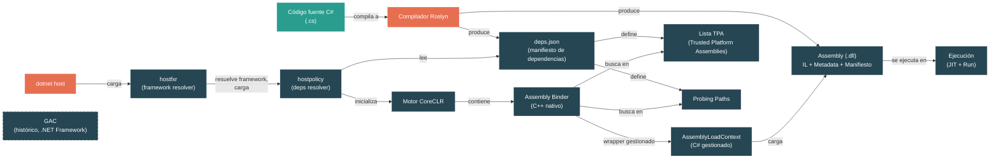

# Nivel 1: Fundamentos — Assemblies, Namespaces y el Loader

> **Perfil objetivo:** Desarrollador que usa namespaces y referencia paquetes NuGet pero no sabe cómo el runtime encuentra y carga los assemblies
> **Esfuerzo estimado:** 3 horas
> **Prerrequisitos:** [Módulos 1.1–1.4](01-foundations-ecosystem-overview.md)
> [English version](../en/01-foundations-assemblies.md)

---

## Objetivos de Aprendizaje

Al finalizar este módulo vas a poder:

1. Explicar la diferencia entre un namespace y un assembly, y por qué no se mapean uno-a-uno.
2. Describir qué contiene físicamente un archivo `.dll`: código IL, metadata y manifiesto.
3. Leer un `AssemblyName` y explicar qué significa cada componente (nombre, versión, cultura, public key token).
4. Trazar cómo el runtime encuentra un assembly al arrancar usando `deps.json` y probing paths.
5. Identificar el rol de `AssemblyLoadContext` como un límite de aislamiento para assemblies cargados.
6. Explicar la cadena de hosts: `dotnet` -> `hostfxr` -> `hostpolicy` -> CoreCLR.
7. Usar `dotnet --info`, `dotnet publish` e ILSpy/`ildasm` para inspeccionar assemblies.
8. Navegar el código fuente del assembly binder en `src/coreclr/binder/`.

---

## Mapa Conceptual



---

## Lección 1: ¿Qué es un Assembly?

### Qué vas a aprender

Qué es realmente un assembly de .NET, más allá de "un archivo compilado."

### El concepto

Cuando compilás código C#, el compilador no produce código máquina nativo. Produce un **assembly** — un archivo `.dll` (o `.exe`) que contiene tres cosas:

1. **Intermediate Language (IL):** Instrucciones independientes de la plataforma que el compilador JIT va a convertir después en código nativo. Pensá en IL como un bytecode portable, similar al bytecode de Java pero diseñado para el CLR.

2. **Metadata:** Una descripción completa de cada tipo, método, campo, propiedad y evento definido en el assembly. El runtime usa la metadata para verificar seguridad de tipos, resolver llamadas a métodos y soportar reflection. La metadata es la razón por la cual podés hacer `typeof(Foo).GetMethods()` en tiempo de ejecución — esa información está embebida en el archivo.

3. **Manifiesto:** Una sección especial de la metadata que describe el assembly en sí: su nombre, versión, cultura, public key token, y la lista de otros assemblies de los que depende. El manifiesto es lo que convierte una colección de tipos en una unidad versionada e identificable.

Un assembly es la **unidad de despliegue, versionado y seguridad** en .NET. No versionás clases o namespaces individuales — versionás assemblies.

Así se ve la identidad de un assembly:

```
System.Runtime, Version=9.0.0.0, Culture=neutral, PublicKeyToken=b03f5f7f11d50a3a
```

Cada parte importa:
- **Name:** `System.Runtime` — el nombre simple, que coincide con el nombre del archivo sin la extensión
- **Version:** `9.0.0.0` — versión de cuatro partes (major.minor.build.revision)
- **Culture:** `neutral` — para assemblies no-satélite (no localizados)
- **PublicKeyToken:** `b03f5f7f11d50a3a` — un hash de la clave pública del publicador, usado para verificar identidad

### En el código fuente

La representación gestionada de un assembly vive en `src/libraries/System.Private.CoreLib/src/System/Reflection/Assembly.cs`. Abrilo y observá:

```csharp
public abstract partial class Assembly : ICustomAttributeProvider, ISerializable
{
    // ...
    public virtual string? FullName => throw NotImplemented.ByDesign;
    public virtual string Location => throw NotImplemented.ByDesign;
    public virtual MethodInfo? EntryPoint => throw NotImplemented.ByDesign;
    // ...
    public virtual Stream? GetManifestResourceStream(string name) { throw NotImplemented.ByDesign; }
    public virtual string[] GetManifestResourceNames() { throw NotImplemented.ByDesign; }
}
```

Es una clase abstracta — la implementación real viene del runtime. CoreCLR provee `RuntimeAssembly`, Mono provee la suya. La keyword `partial` te dice que parte de esta clase está en este archivo, y el resto está en archivos específicos del runtime.

La identidad del assembly se parsea en `AssemblyName` en `src/libraries/System.Private.CoreLib/src/System/Reflection/AssemblyName.cs`:

```csharp
public sealed partial class AssemblyName : ICloneable, IDeserializationCallback, ISerializable
{
    private string? _name;
    private byte[]? _publicKey;
    private byte[]? _publicKeyToken;
    private CultureInfo? _cultureInfo;
    private Version? _version;
    // ...
}
```

Estos campos se mapean directamente a los componentes de identidad que describimos arriba.

### Ejercicio práctico

1. Creá una nueva app de consola: `dotnet new console -n AssemblyExplorer`
2. Agregá este código a `Program.cs`:
   ```csharp
   using System.Reflection;

   // Inspeccionar el assembly actual
   Assembly me = Assembly.GetExecutingAssembly();
   Console.WriteLine($"Nombre: {me.GetName().Name}");
   Console.WriteLine($"Versión: {me.GetName().Version}");
   Console.WriteLine($"Ubicación: {me.Location}");
   Console.WriteLine();

   // Inspeccionar un assembly del framework
   Assembly runtime = typeof(object).Assembly;
   Console.WriteLine($"CoreLib: {runtime.FullName}");
   Console.WriteLine($"Ubicación: {runtime.Location}");
   Console.WriteLine();

   // Listar todos los assemblies cargados
   foreach (Assembly asm in AppDomain.CurrentDomain.GetAssemblies())
   {
       Console.WriteLine($"  {asm.GetName().Name} v{asm.GetName().Version}");
   }
   ```
3. Ejecutá con `dotnet run` y observá la salida. Notá cuántos assemblies se cargan incluso para un programa trivial.

### Conclusión clave

Un assembly no es simplemente "un archivo compilado." Es un paquete versionado y auto-descriptivo de código IL y metadata que el runtime puede identificar, verificar y cargar de forma independiente.

---

## Lección 2: Namespaces vs. Assemblies

### Qué vas a aprender

Por qué namespaces y assemblies son conceptos independientes, y cómo se relacionan en la práctica.

### El concepto

Una de las fuentes de confusión más comunes en .NET: **namespaces y assemblies no son la misma cosa, y no se mapean uno-a-uno.**

Un **namespace** es una herramienta organizativa de tiempo de compilación. Agrupa tipos relacionados para evitar colisiones de nombres. El runtime no conoce ni le importan los namespaces al momento de cargar — resuelve tipos por su nombre completo (namespace + nombre de tipo) *dentro* de un assembly.

Un **assembly** es una unidad de despliegue del runtime. Es lo que el loader realmente carga.

La relación es de muchos-a-muchos:

- **Un assembly puede contener tipos de muchos namespaces.** Por ejemplo, `System.Runtime.dll` contiene tipos en `System`, `System.Collections`, `System.Collections.Generic`, `System.Reflection`, `System.Threading`, y docenas más de namespaces.

- **Un namespace puede abarcar muchos assemblies.** Por ejemplo, tipos en el namespace `System.Collections.Generic` viven en `System.Runtime.dll` (para `List<T>`, `Dictionary<TKey, TValue>`), `System.Collections.dll` (para `SortedList<TKey, TValue>`), y otros.

Por eso `using System.Collections.Generic;` no es lo mismo que "referenciar el assembly `System.Collections.Generic`" — no existe tal assembly. La directiva `using` es sobre resolución de namespaces en el compilador; las referencias a assemblies son sobre qué archivos `.dll` necesita el runtime.

### Ejemplo del mundo real

Considerá este código:

```csharp
using System.Collections.Generic;  // namespace
using System.Text.Json;             // namespace

var list = new List<string>();       // List<T> vive en System.Runtime.dll
var json = JsonSerializer.Serialize(list); // JsonSerializer vive en System.Text.Json.dll
```

Se usan dos namespaces. Se cargan dos assemblies. Pero no hay correspondencia entre los nombres de los namespaces y los nombres de los assemblies — `List<T>` está en el namespace `System.Collections.Generic` pero en el assembly `System.Runtime`.

### En el código fuente

Mirá la estructura del directorio `src/libraries/`. Cada subdirectorio es un **proyecto de library** que se compila en un assembly:

```
src/libraries/System.Runtime/             -> produce System.Runtime.dll
src/libraries/System.Text.Json/           -> produce System.Text.Json.dll
src/libraries/System.Collections/         -> produce System.Collections.dll
```

Ahora mirá dentro de `src/libraries/System.Runtime/src/`. Vas a encontrar archivos fuente cuyos tipos pertenecen a muchos namespaces diferentes — `System`, `System.Collections.Generic`, `System.Globalization`, etc. — todos compilados en un solo `System.Runtime.dll`.

### Ejercicio práctico

1. En tu proyecto `AssemblyExplorer`, agregá este código:
   ```csharp
   // ¿Dónde vive realmente List<T>?
   Type listType = typeof(List<int>);
   Console.WriteLine($"Namespace de List<int>: {listType.Namespace}");
   Console.WriteLine($"Assembly de List<int>:  {listType.Assembly.GetName().Name}");
   Console.WriteLine();

   // ¿Dónde vive JsonSerializer?
   // (agregá: using System.Text.Json; y un PackageReference si es necesario)
   Type jsonType = typeof(System.Text.Json.JsonSerializer);
   Console.WriteLine($"Namespace de JsonSerializer: {jsonType.Namespace}");
   Console.WriteLine($"Assembly de JsonSerializer:  {jsonType.Assembly.GetName().Name}");
   ```
2. Ejecutá y observá: los namespaces no coinciden con los nombres de los assemblies.

### Conclusión clave

Los namespaces organizan código para los desarrolladores en tiempo de compilación. Los assemblies empaquetan código para el runtime en tiempo de carga. Son conceptos ortogonales que comparten convenciones de nomenclatura por conveniencia.

---

## Lección 3: El Assembly Loader — Cómo el Runtime Encuentra Tu Código

### Qué vas a aprender

El proceso paso a paso que el runtime usa para localizar y cargar assemblies, centrado en `deps.json` y probing paths.

### El concepto

Cuando tu programa referencia un tipo de otro assembly, el runtime necesita encontrar el archivo `.dll` en disco. Esto no es magia — hay un algoritmo de resolución bien definido.

#### El archivo deps.json

Cuando compilás una aplicación .NET, el SDK genera un archivo llamado `<NombreApp>.deps.json` junto a tu salida. Este es el **manifiesto de dependencias** — un archivo JSON que lista cada assembly que tu aplicación necesita, junto con:

- El paquete NuGet que lo provee (y su versión)
- La ruta relativa al `.dll` dentro del layout del paquete
- El tipo de asset (runtime, nativo, recursos)
- Información de versión del assembly y del archivo

Un ejemplo simplificado:

```json
{
  "runtimeTarget": {
    "name": ".NETCoreApp,Version=v9.0"
  },
  "targets": {
    ".NETCoreApp,Version=v9.0": {
      "MyApp/1.0.0": {
        "runtime": {
          "MyApp.dll": {}
        }
      },
      "System.Text.Json/9.0.0": {
        "runtime": {
          "lib/net9.0/System.Text.Json.dll": {}
        }
      }
    }
  }
}
```

#### El pipeline de resolución

Cuando el runtime necesita cargar un assembly, pasa por este pipeline:

1. **Verificar si ya está cargado.** El binder mantiene un cache de assemblies ya cargados en el `AssemblyLoadContext` actual. Si lo encuentra, retorna inmediatamente.

2. **Verificar la lista TPA (Trusted Platform Assemblies).** Al arrancar, `hostpolicy` lee `deps.json` y construye una lista plana de cada assembly que la app necesita, con rutas completas de archivos. Esta es la lista TPA. Los assemblies del framework (como `System.Runtime.dll`) vienen del runtime pack; los assemblies de la app vienen de la salida de publicación.

3. **Probar rutas adicionales.** Si no se encuentra en la lista TPA, el binder prueba directorios adicionales (directorio de la app, shared stores, cache de paquetes NuGet) según las rutas configuradas en `deps.json`.

4. **Invocar resolución gestionada.** Si el binder nativo no puede encontrar el assembly, hace un callback al código gestionado — el método `AssemblyLoadContext.Load()` y el evento `Resolving` — dándole a tu código la oportunidad de proveer el assembly.

5. **Fallar.** Si nadie provee el assembly, se lanza una `FileNotFoundException`.

#### Cómo se lee deps.json

El parseo de `deps.json` ocurre en código nativo C++, en el componente `hostpolicy`. La clase clave es `deps_json_t` en `src/native/corehost/hostpolicy/deps_format.h`:

```cpp
class deps_json_t
{
    // Una entrada por cada tipo de asset: runtime (.dll), resources (satélite), native (.so/.dll)
    std::vector<deps_entry_t> m_deps_entries[deps_entry_t::asset_types::count];
    // ...
};
```

Cada entrada de dependencia (`deps_entry_t` en `src/native/corehost/hostpolicy/deps_entry.h`) tiene:

```cpp
struct deps_entry_t
{
    enum asset_types { runtime = 0, resources, native, count };

    pal::string_t library_name;
    pal::string_t library_version;
    asset_types asset_type;
    deps_asset_t asset;
    // ...
};
```

El resolver (`deps_resolver_t` en `src/native/corehost/hostpolicy/deps_resolver.h`) construye la lista TPA y los probing paths a partir de estas entradas:

```cpp
class deps_resolver_t
{
    // Orden de resolución para búsqueda TPA.
    bool resolve_tpa_list(pal::string_t* output, ...);

    // Orden de resolución para búsqueda de culture y DLL nativas.
    bool resolve_probe_dirs(deps_entry_t::asset_types asset_type, ...);
};
```

### En el código fuente

El pipeline completo, desde el host hasta el runtime:

| Paso | Archivo | Qué hace |
|------|---------|----------|
| 1 | `src/native/corehost/fxr/hostfxr.cpp` | Punto de entrada; llama a `fx_muxer_t::execute()` |
| 2 | `src/native/corehost/fxr/fx_muxer.cpp` | Resuelve versiones del framework, carga `hostpolicy` |
| 3 | `src/native/corehost/hostpolicy/hostpolicy.cpp` | Crea `deps_resolver_t`, construye lista TPA, arranca CoreCLR |
| 4 | `src/native/corehost/hostpolicy/deps_resolver.cpp` | Lee `deps.json`, resuelve probing paths |
| 5 | `src/coreclr/binder/assemblybindercommon.cpp` | Assembly binder nativo — encuentra y carga archivos `.dll` |
| 6 | `src/coreclr/binder/defaultassemblybinder.cpp` | Binder por defecto para assemblies vinculados por TPA |

### Ejercicio práctico

1. Compilá y publicá tu app `AssemblyExplorer`:
   ```bash
   dotnet publish -c Release -o ./published
   ```
2. Abrí el directorio `published/` y buscá `AssemblyExplorer.deps.json`.
3. Abrí el archivo en un editor de texto. Encontrá la sección `"targets"`.
4. Para cada library listada, anotá:
   - El nombre del paquete y su versión
   - Las entradas `"runtime"` (los archivos `.dll` que el runtime va a cargar)
   - Cómo difieren los assemblies del framework de tu assembly de app
5. También mirá `AssemblyExplorer.runtimeconfig.json` — esto le dice a `hostfxr` qué shared framework usar.

### Conclusión clave

El runtime no busca en el disco al azar. Lee `deps.json` para construir una lista precisa de assemblies y sus ubicaciones, y después usa probing paths como fallback. Toda la resolución ocurre en código nativo C++ antes de que tu `Main()` gestionado se ejecute.

---

## Lección 4: AssemblyLoadContext — Límites de Aislamiento

### Qué vas a aprender

Qué es `AssemblyLoadContext`, por qué existe y cómo provee aislamiento de assemblies.

### El concepto

En .NET Framework, todos los assemblies cargados en un `AppDomain` compartían un namespace plano de assemblies cargados. Si dos plugins necesitaban versiones diferentes de la misma library, tenías un conflicto. La única solución era crear `AppDomain`s separados, que eran pesados y tenían semánticas de comunicación complejas.

.NET (Core) reemplazó el aislamiento por `AppDomain` con **`AssemblyLoadContext`** (ALC) — un mecanismo liviano para cargar assemblies en contextos aislados dentro del mismo proceso.

#### Propiedades clave de AssemblyLoadContext:

- **Cada ALC es un conjunto independiente de assemblies cargados.** Dos ALCs pueden cargar versiones diferentes del mismo assembly simultáneamente.
- **Siempre existe un ALC Default.** Contiene los assemblies cargados al arrancar desde la lista TPA. No se puede descargar.
- **Se pueden crear ALCs custom para escenarios de plugins.** Cada plugin obtiene su propio ALC, aislando sus dependencias.
- **Los ALCs collectible se pueden descargar.** Cuando establecés `isCollectible: true`, el ALC (y todos sus assemblies) puede ser recolectado por el garbage collector cuando ya no hay referencias.

#### El orden de búsqueda para un ALC custom

Cuando un `AssemblyLoadContext` custom necesita resolver un assembly, sigue un orden específico. Esto está documentado directamente en el código del binder nativo en `src/coreclr/binder/customassemblybinder.cpp`:

```
1) Buscar el assembly dentro del LoadContext mismo. Si lo encuentra, usarlo.
2) Invocar la implementación del método Load del LoadContext. Si lo encuentra, usarlo.
3) Buscar el assembly dentro del DefaultBinder (excepto para requests de satélite). Si lo encuentra, usarlo.
4) Invocar el método ResolveSatelliteAssembly del LoadContext (para requests de satélite). Si lo encuentra, usarlo.
5) Invocar el evento Resolving del LoadContext. Si lo encuentra, usarlo.
6) Lanzar excepción.
```

Esto significa que un ALC custom puede sobreescribir assemblies del contexto por defecto retornándolos desde su método `Load()` (paso 2), pero los assemblies del framework de la lista TPA también están disponibles como fallback (paso 3).

### En el código fuente

La superficie de API pública está definida en `src/libraries/System.Runtime.Loader/ref/System.Runtime.Loader.cs`:

```csharp
public partial class AssemblyLoadContext
{
    public AssemblyLoadContext(string? name, bool isCollectible = false) { }
    public static AssemblyLoadContext Default { get { throw null; } }
    public static IEnumerable<AssemblyLoadContext> All { get { throw null; } }
    public IEnumerable<Assembly> Assemblies { get { throw null; } }
    public bool IsCollectible { get { throw null; } }

    protected virtual Assembly? Load(AssemblyName assemblyName) { throw null; }
    public Assembly LoadFromAssemblyPath(string assemblyPath) { throw null; }
    public Assembly LoadFromStream(Stream assembly) { throw null; }
    public void Unload() { }

    public event Func<AssemblyLoadContext, AssemblyName, Assembly?>? Resolving;
    public event Action<AssemblyLoadContext>? Unloading;
}
```

La implementación específica de CoreCLR está en `src/coreclr/System.Private.CoreLib/src/System/Runtime/Loader/AssemblyLoadContext.CoreCLR.cs`. Notá el puente P/Invoke al binder nativo:

```csharp
[LibraryImport(RuntimeHelpers.QCall, EntryPoint = "AssemblyNative_InitializeAssemblyLoadContext")]
private static partial IntPtr InitializeAssemblyLoadContext(IntPtr ptrAssemblyLoadContext,
    bool fRepresentsTPALoadContext, bool isCollectible);
```

Cada `AssemblyLoadContext` gestionado tiene un objeto binder nativo correspondiente. El ALC `Default` se mapea a `DefaultAssemblyBinder` (`src/coreclr/binder/defaultassemblybinder.cpp`), y los ALCs custom se mapean a `CustomAssemblyBinder` (`src/coreclr/binder/customassemblybinder.cpp`).

### Ejercicio práctico

1. Creá un plugin loader simple para ver el aislamiento del ALC en acción:
   ```csharp
   using System.Reflection;
   using System.Runtime.Loader;

   // Ver en qué ALC está el assembly principal
   Assembly mainAsm = Assembly.GetExecutingAssembly();
   var mainAlc = AssemblyLoadContext.GetLoadContext(mainAsm);
   Console.WriteLine($"ALC del assembly principal: {mainAlc?.Name ?? "Default"}");
   Console.WriteLine($"Es Default: {mainAlc == AssemblyLoadContext.Default}");
   Console.WriteLine();

   // Listar todos los ALCs y sus assemblies
   foreach (var alc in AssemblyLoadContext.All)
   {
       Console.WriteLine($"ALC: {alc.Name ?? "(sin nombre)"}, Collectible: {alc.IsCollectible}");
       foreach (var asm in alc.Assemblies)
       {
           Console.WriteLine($"  - {asm.GetName().Name}");
       }
   }
   ```
2. Ejecutá y observá: todos tus assemblies están en el ALC `Default`.
3. (Bonus) Creá un ALC custom y cargá un assembly en él:
   ```csharp
   var myAlc = new AssemblyLoadContext("MyPluginContext", isCollectible: true);
   // myAlc.LoadFromAssemblyPath("ruta/al/plugin.dll");
   ```

### Conclusión clave

`AssemblyLoadContext` es la API gestionada para aislamiento de assemblies. El ALC Default contiene los assemblies de tu aplicación principal. Los ALCs custom te permiten cargar plugins con sus propios grafos de dependencias, y los ALCs collectible se pueden descargar para liberar memoria.

---

## Lección 5: La Cadena de Hosts Nativos — De `dotnet` a CoreCLR

### Qué vas a aprender

La secuencia de componentes nativos que se ejecutan antes de que tu código gestionado corra: `dotnet` -> `hostfxr` -> `hostpolicy` -> CoreCLR.

### El concepto

Cuando escribís `dotnet run` o ejecutás una aplicación publicada, una cadena de componentes nativos (C/C++) corre antes de que tu método `Main()` de C# se ejecute:

#### 1. El ejecutable host (`dotnet` o `apphost`)

- Para `dotnet run`: el ejecutable `dotnet` es un **muxer** — decide si invocar el SDK (para comandos como `build`, `test`) o ejecutar una aplicación.
- Para apps publicadas: el `apphost` es un pequeño ejecutable nativo (por ejemplo, `MyApp.exe` en Windows) que conoce la ruta al `.dll` de la app.

#### 2. hostfxr (Framework Resolver)

**Fuente:** `src/native/corehost/fxr/`

`hostfxr` es una library nativa compartida (`hostfxr.dll` / `libhostfxr.so`) responsable de:
- Leer `runtimeconfig.json` para determinar qué versión del shared framework usar
- Localizar la versión correcta del framework en disco (resolución de versiones, políticas de roll-forward)
- Cargar `hostpolicy`

El punto de entrada es `hostfxr_main` en `src/native/corehost/fxr/hostfxr.cpp`, que delega a `fx_muxer_t::execute()` en `src/native/corehost/fxr/fx_muxer.cpp`.

#### 3. hostpolicy (Dependency Resolver)

**Fuente:** `src/native/corehost/hostpolicy/`

`hostpolicy` es el componente que:
- Lee `deps.json` para entender todas las dependencias
- Construye la lista TPA (Trusted Platform Assemblies) — una lista separada por punto y coma de rutas completas a cada assembly que la app podría necesitar
- Construye los probing paths de libraries nativas
- Inicializa CoreCLR pasando estas listas como propiedades

La función central `create_coreclr()` en `src/native/corehost/hostpolicy/hostpolicy.cpp` llama a `coreclr_t::create()`, que carga la library compartida del CLR y llama a su función de inicialización.

#### 4. CoreCLR

Una vez que CoreCLR está inicializado:
- Configura el GC, JIT, sistema de tipos y thread pool
- Crea el `AssemblyLoadContext` por defecto (que se mapea a `DefaultAssemblyBinder`)
- Carga y compila con JIT el assembly del punto de entrada de tu aplicación
- Llama a tu método `Main()`

#### La secuencia completa

```
dotnet MyApp.dll
  |
  v
dotnet (muxer) -- ¿es un comando del SDK? No, es una app.
  |
  v
hostfxr -- lee MyApp.runtimeconfig.json
         -- resuelve framework: Microsoft.NETCore.App 9.0.x
         -- encuentra hostpolicy en el directorio del framework
  |
  v
hostpolicy -- lee MyApp.deps.json + deps.json del framework
            -- construye lista TPA: [rutas completas a ~150 assemblies]
            -- construye probing paths nativos
            -- llama a coreclr_initialize() con estas propiedades
  |
  v
CoreCLR -- inicializa GC, JIT, sistema de tipos
         -- crea AssemblyLoadContext Default
         -- carga MyApp.dll de la lista TPA
         -- compila Main() con JIT
         -- llama a Main()
  |
  v
¡Tu código C# se ejecuta!
```

### En el código fuente

| Componente | Archivos clave |
|------------|---------------|
| hostfxr | `src/native/corehost/fxr/hostfxr.cpp` — puntos de entrada (`hostfxr_main`, etc.) |
| | `src/native/corehost/fxr/fx_muxer.cpp` — resolución de framework y carga de `hostpolicy` |
| | `src/native/corehost/fxr/fx_resolver.cpp` — lógica de roll-forward de versiones |
| hostpolicy | `src/native/corehost/hostpolicy/hostpolicy.cpp` — `create_coreclr()` |
| | `src/native/corehost/hostpolicy/deps_resolver.cpp` — lee `deps.json`, construye TPA |
| | `src/native/corehost/hostpolicy/deps_format.cpp` — parsea el formato JSON |
| Binder de CoreCLR | `src/coreclr/binder/assemblybindercommon.cpp` — `BindAssembly()` |
| | `src/coreclr/binder/defaultassemblybinder.cpp` — lado nativo del ALC por defecto |
| | `src/coreclr/binder/customassemblybinder.cpp` — lado nativo de ALCs custom |

### Ejercicio práctico

1. Ejecutá `dotnet --info` y examiná la salida. Encontrá:
   - La versión y ubicación del runtime (acá es donde viven `hostfxr` y el framework)
   - La ruta del shared framework (donde viven `System.Runtime.dll` y compañía)
2. Navegá al directorio del shared framework listado por `dotnet --info`. Listá los archivos — vas a ver cientos de archivos `.dll`. Estos son los candidatos TPA.
3. Habilitá el tracing del host para ver el proceso completo de resolución:
   ```bash
   # En Linux/macOS:
   DOTNET_TRACE_HOST=1 dotnet run 2>&1 | head -100

   # En Windows (PowerShell):
   $env:DOTNET_TRACE_HOST=1; dotnet run 2>&1 | Select-Object -First 100
   ```
   Buscá líneas que muestren `hostfxr`, `hostpolicy`, el parseo de `deps.json` y la construcción de la lista TPA.

### Conclusión clave

Antes de que tu `Main()` se ejecute, tres componentes nativos — `hostfxr`, `hostpolicy` y CoreCLR — ya resolvieron tu framework, parsearon tus dependencias, construyeron una lista completa de rutas a assemblies e inicializaron el runtime. Entender esta cadena explica por qué ciertos errores (como framework faltante o versiones incompatibles) ocurren antes de que cualquier código gestionado se ejecute.

---

## Guía de Lectura del Código Fuente

Estos archivos están ordenados de más accesibles a más complejos. Todos son relevantes a dificultad de Nivel 1.

| # | Archivo | Dificultad | Qué buscar |
|---|---------|-----------|------------|
| 1 | `src/libraries/System.Private.CoreLib/src/System/Reflection/AssemblyName.cs` | Fácil | Los campos que definen la identidad de un assembly: `_name`, `_version`, `_publicKey`, `_cultureInfo` |
| 2 | `src/libraries/System.Private.CoreLib/src/System/Reflection/Assembly.cs` | Fácil | La API abstracta: `FullName`, `Location`, `GetTypes()`, `GetManifestResourceStream()` |
| 3 | `src/libraries/System.Runtime.Loader/ref/System.Runtime.Loader.cs` | Fácil | La superficie de API pública de `AssemblyLoadContext` — todos los métodos y eventos disponibles |
| 4 | `src/native/corehost/hostpolicy/deps_entry.h` | Medio | El struct `deps_entry_t` — cómo se representa una entrada de dependencia en código nativo |
| 5 | `src/native/corehost/hostpolicy/deps_format.h` | Medio | La clase `deps_json_t` — cómo se parsea y almacena el archivo `deps.json` completo |
| 6 | `src/native/corehost/hostpolicy/deps_resolver.h` | Medio | La clase `deps_resolver_t` — construcción de la lista TPA y probing, incluyendo `probe_paths_t` |
| 7 | `src/coreclr/binder/customassemblybinder.cpp` | Medio | El orden de búsqueda de 6 pasos para ALCs custom (documentado en comentarios alrededor de la línea ~42) |
| 8 | `src/coreclr/System.Private.CoreLib/src/System/Runtime/Loader/AssemblyLoadContext.CoreCLR.cs` | Medio | Cómo el `AssemblyLoadContext` gestionado se conecta al código nativo vía P/Invokes `LibraryImport` |

---

## Herramientas de Diagnóstico

Estas herramientas te ayudan a inspeccionar assemblies y entender el proceso de carga. Todas son apropiadas para Nivel 1.

### `dotnet --info`
Muestra los SDKs, runtimes instalados y sus rutas. Usalo para encontrar dónde viven los assemblies del framework en disco.

### Inspección de la salida de `dotnet publish`
Después de publicar, examiná el directorio de salida. Vas a encontrar el `.dll` de tu app, `deps.json`, `runtimeconfig.json`, y (para publicaciones self-contained) todos los assemblies del framework.

### ILSpy o `ildasm`
ILSpy (gratis, GUI multiplataforma) e `ildasm` (parte del SDK) te permiten abrir un `.dll` e inspeccionar su código IL, metadata y manifiesto. Usá ILSpy para:
- Ver los tipos y namespaces dentro de un assembly
- Ver el manifiesto del assembly (nombre, versión, referencias)
- Leer código IL de métodos individuales

### `DOTNET_TRACE_HOST=1`
Configurá esta variable de entorno antes de ejecutar tu app para ver salida detallada del tracing del host. Muestra cada paso de la cadena `hostfxr` -> `hostpolicy` -> CoreCLR, incluyendo el parseo de `deps.json` y la construcción de la lista TPA.

### Eventos de `AssemblyLoadContext`
Suscribite a eventos en tu código:
```csharp
AssemblyLoadContext.Default.Resolving += (alc, name) =>
{
    Console.WriteLine($"Resolviendo: {name}");
    return null; // dejar que continúe la resolución por defecto
};
```

---

## Autoevaluación

### Preguntas conceptuales

1. **Un compañero de trabajo dice "el assembly `System.Collections.Generic`." ¿Qué está mal con esa afirmación?**

2. **¿Qué tres cosas contiene un archivo assembly `.dll`?**

3. **Obtenés una `FileNotFoundException` para `MyLibrary.dll` en tiempo de ejecución. El archivo existe en tu directorio `bin/`. ¿Cuál es una causa probable?**

4. **Explicá por qué el `AssemblyLoadContext` Default no se puede descargar.**

5. **¿Qué es la lista TPA, y qué componente nativo la construye?**

6. **En el orden de búsqueda del ALC custom, ¿por qué el paso 3 (verificar Default binder) viene después del paso 2 (invocar método Load)?**

### Desafío práctico

**Construí un mini inspector de assemblies:**

Creá una aplicación de consola que tome una ruta a un `.dll` como argumento de línea de comandos e imprima:
- El nombre completo del assembly (nombre, versión, cultura, public key token)
- El número de tipos definidos en el assembly
- La lista de assemblies referenciados (otros assemblies de los que depende)
- En qué `AssemblyLoadContext` fue cargado

Usá `Assembly.LoadFrom()` o `AssemblyLoadContext.Default.LoadFromAssemblyPath()` y las APIs de reflection que aprendiste.

Salida esperada:
```
Assembly: System.Text.Json, Version=9.0.0.0, Culture=neutral, PublicKeyToken=cc7b13ffcd2ddd51
Tipos: 312
Referencias:
  System.Runtime, Version=9.0.0.0
  System.Collections, Version=9.0.0.0
  System.Memory, Version=9.0.0.0
  ...
Contexto de carga: Default
```

---

## Conexiones

| Dirección | Módulo | Relación |
|-----------|--------|----------|
| Anterior | [1.4 — Flujo de Control, Excepciones y el Call Stack](01-foundations-control-flow.md) | Ahora sabés qué carga el runtime; antes aprendiste cómo lo ejecuta |
| Siguiente | [1.6 — I/O Básico: Archivos, Consola y Streams](01-foundations-basic-io.md) | Las libraries de I/O son assemblies cargados por los mecanismos que acabás de aprender |
| Relacionado | [1.2 — Estructura de Proyectos y el Sistema de Build](01-foundations-project-structure.md) | El sistema de build produce assemblies y `deps.json` — ahora sabés qué son |
| Relacionado | [1.7 — Tu Primera Lectura del Código Fuente del Runtime](01-foundations-first-source-reading.md) | Navegaste archivos fuente reales en este módulo; 1.7 va a formalizar esa habilidad |
| Más profundo | [4.6 — Carga de Assemblies: Binder, ALC y Fusion](04-internals-assembly-loading.md) | El Nivel 4 profundiza en el binder nativo, unificación de versiones y binding tracing |

---

## Glosario

| Término | Definición |
|---------|-----------|
| **Assembly** | Un archivo `.dll` o `.exe` que contiene código IL, metadata y un manifiesto. La unidad de despliegue, versionado y carga en .NET. |
| **Manifiesto** | La sección de la metadata de un assembly que describe al assembly en sí: nombre, versión, cultura, public key token y referencias a dependencias. |
| **IL (Intermediate Language)** | El conjunto de instrucciones independiente de plataforma al que C# se compila. También llamado MSIL o CIL. El compilador JIT lo convierte a código nativo en tiempo de ejecución. |
| **Metadata** | Descripciones estructuradas de tipos, métodos, campos y otros elementos almacenados dentro de un assembly. Usada por el runtime para seguridad de tipos, reflection y binding. |
| **Namespace** | Una agrupación organizativa de tipos en tiempo de compilación. No tiene semántica directa de carga en el runtime. |
| **AssemblyLoadContext (ALC)** | Un objeto gestionado que representa un conjunto aislado de assemblies cargados. Cada ALC puede cargar versiones diferentes del mismo assembly. |
| **deps.json** | Un archivo JSON generado en tiempo de build que lista todas las dependencias de una aplicación con sus rutas y versiones. Leído por `hostpolicy` al arrancar. |
| **Probing** | El proceso de buscar en directorios un archivo assembly. El runtime hace probing en el directorio de la app, shared stores y rutas especificadas en `deps.json`. |
| **TPA (Trusted Platform Assemblies)** | Una lista plana de rutas completas de archivos a cada assembly que la aplicación podría necesitar, construida por `hostpolicy` a partir de `deps.json`. Pasada a CoreCLR en la inicialización. |
| **hostfxr** | La library nativa de resolución de framework. Lee `runtimeconfig.json`, resuelve la versión del framework y carga `hostpolicy`. |
| **hostpolicy** | La library nativa de resolución de dependencias. Lee `deps.json`, construye la lista TPA y probing paths, e inicializa CoreCLR. |
| **Assembly binder** | El componente nativo C++ dentro de CoreCLR (`src/coreclr/binder/`) que realmente localiza y carga archivos assembly, verificando la lista TPA y probing paths. |
| **runtimeconfig.json** | Un archivo JSON que especifica qué shared framework (y versión) requiere la aplicación. Leído por `hostfxr`. |

---

## Referencias

| Recurso | Tipo | Relevancia |
|---------|------|-----------|
| [Carga de assemblies en .NET](https://learn.microsoft.com/es-es/dotnet/core/dependency-loading/overview) | Documentación oficial | Panorama completo del modelo de carga de dependencias |
| [Documentación de AssemblyLoadContext](https://learn.microsoft.com/es-es/dotnet/core/dependency-loading/understanding-assemblyloadcontext) | Documentación oficial | Explicación detallada del comportamiento y uso de ALC |
| [Diseño del host del runtime .NET](https://github.com/dotnet/runtime/blob/main/docs/design/features/host-components.md) | Documento de diseño | Arquitectura de `hostfxr` y `hostpolicy` |
| [Especificación del formato deps.json](https://github.com/dotnet/sdk/blob/main/documentation/specs/runtime-configuration-file.md) | Especificación | Especificación completa de los formatos `deps.json` y `runtimeconfig.json` |
| [Book of the Runtime — Diseño del Assembly Loader](https://github.com/dotnet/runtime/tree/main/docs/design/coreclr/botr) | Documentación profunda | Diseño interno de CoreCLR del assembly binder |
| [ILSpy](https://github.com/icsharpcode/ILSpy) | Herramienta | Navegador y decompilador de assemblies gratuito y open-source |

---

*Última actualización: 2026-04-14*
