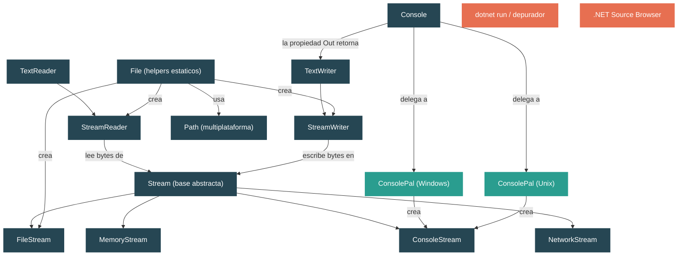

# Nivel 1: Fundamentos — I/O Basico: Archivos, Consola y Streams

> **Perfil objetivo:** Desarrollador que usa `File.ReadAllText` y `Console.WriteLine` pero no entiende la abstraccion Stream que los sustenta
> **Esfuerzo estimado:** 3 horas
> **Prerequisitos:** [Modulos 1.1-1.5](01-foundations-ecosystem-overview.md)
> [English version](../en/01-foundations-basic-io.md)

---

## Objetivos de Aprendizaje

Al final de este modulo vas a poder:

1. **Explicar la abstraccion `Stream`** y por que es la base de todo el I/O en .NET.
2. **Rastrear lo que hace `Console.WriteLine`** desde la llamada managed a traves de `ConsolePal` hasta el handle del sistema operativo.
3. **Distinguir entre los metodos de conveniencia de `File` y los enfoques basados en `FileStream`** y articular cuando conviene cada uno.
4. **Identificar implementaciones de I/O especificas de cada plataforma** (Windows vs Unix) en el codigo fuente de `dotnet/runtime` y explicar por que estan separadas.
5. **Usar `StreamReader` y `StreamWriter`** y entender el rol del encoding en el puente entre bytes y caracteres.
6. **Describir la relacion entre `TextWriter`, `StreamWriter` y `Stream`** en el pipeline de salida de la consola.
7. **Usar `System.IO.Path`** correctamente para manipulacion de rutas multiplataforma.
8. **Aplicar el patron dispose** a streams y explicar por que no hacerlo causa fugas de recursos.

---

## Mapa Conceptual



---

## Contenido

### Leccion 1 — Console.WriteLine: Rastreando la Llamada

#### Lo que vas a aprender
Como una sola linea de C# — `Console.WriteLine("hola")` — viaja a traves de cuatro capas de abstraccion antes de que los bytes lleguen a tu terminal.

#### El concepto

Cuando llamas a `Console.WriteLine(string)`, el runtime no invoca directamente una funcion del sistema operativo. En cambio, una cadena de objetos coopera:

1. **`Console.WriteLine`** (en `Console.cs`, linea ~858) llama a `Out.WriteLine(value)`.
2. **`Console.Out`** es un `TextWriter` — especificamente un `StreamWriter` envuelto en `TextWriter.Synchronized(...)`. Se inicializa de forma lazy la primera vez que se accede a `Out` (linea ~209): `CreateOutputWriter(ConsolePal.OpenStandardOutput())`.
3. **`CreateOutputWriter`** (linea ~237) construye un `StreamWriter` con `AutoFlush = true`, un buffer de 256 bytes, y el `OutputEncoding` actual con su preambulo BOM removido.
4. **`ConsolePal.OpenStandardOutput()`** es el punto de entrada especifico de la plataforma.
   - En **Windows**, llama a `Interop.Kernel32.GetStdHandle(STD_OUTPUT_HANDLE)` y retorna un `WindowsConsoleStream` (linea ~70 en `ConsolePal.Windows.cs`).
   - En **Unix**, abre el file-descriptor 1 via `SafeFileHandle` y retorna un `UnixConsoleStream` (linea ~54 en `ConsolePal.Unix.cs`).
5. El metodo `StreamWriter.Write` codifica el string a bytes usando el `Encoding`, luego llama a `Stream.Write(byte[], ...)` sobre el `ConsoleStream` subyacente.
6. La subclase de `ConsoleStream` llama al SO — `WriteFile` en Windows, `write(2)` en Unix.

La idea clave: **`Console.Out` es simplemente un `StreamWriter` que envuelve un `Stream` especifico de la plataforma**. No hay nada magico en la salida por consola — sigue exactamente la misma abstraccion Stream que el I/O de archivos o de red.

#### En el codigo fuente

| Archivo | Que mirar |
|---|---|
| `src/libraries/System.Console/src/System/Console.cs` | Propiedad `Out` (linea ~188), `CreateOutputWriter` (linea ~237), `WriteLine` (linea ~858) |
| `src/libraries/System.Console/src/System/ConsolePal.Windows.cs` | `OpenStandardOutput()` (linea ~34), `GetStandardFile` (linea ~55), `WindowsConsoleStream` |
| `src/libraries/System.Console/src/System/ConsolePal.Unix.cs` | `OpenStandardOutput()` (linea ~52), `UnixConsoleStream` |
| `src/libraries/System.Console/src/System/ConsolePal.Unix.ConsoleStream.cs` | `UnixConsoleStream.Write` (linea ~49) — la ultima llamada antes del SO |
| `src/libraries/System.Console/src/System/IO/ConsoleStream.cs` | Clase base abstracta `ConsoleStream` — configura `CanRead`/`CanWrite` segun `FileAccess` |

#### Ejercicio practico

1. Crea una aplicacion de consola nueva: `dotnet new console -n TraceConsole`.
2. Pone un breakpoint en `Console.WriteLine("hola")`.
3. Usando la funcion "Step Into" de tu IDE (asegurate de tener habilitado "Enable .NET Framework source stepping" o "Source Link"), avanza paso a paso hasta llegar al metodo `StreamWriter.Write`.
4. En el depurador, inspecciona `Console.Out` — nota que su tipo es `TextWriter+SyncTextWriter`. Expandi sus campos para encontrar el `StreamWriter` interno y el campo `_stream` adentro.
5. **Pregunta para responder:** ¿A que esta configurado el campo `_encoding`? ¿Cual es el valor de `_autoFlush`?

#### Idea clave

`Console.WriteLine` es azucar sintactico sobre un `StreamWriter` que envuelve un `Stream` especifico de la plataforma conectado al handle de salida estandar del SO. No hay APIs especiales de "consola" a nivel managed — solo el patron universal Stream + TextWriter.

---

### Leccion 2 — La Abstraccion Stream

#### Lo que vas a aprender
Por que `System.IO.Stream` es el contrato universal de I/O en .NET y que significan sus operaciones fundamentales.

#### El concepto

`Stream` es una clase abstracta que representa una secuencia de bytes de la que se puede leer, escribir, o ambas. Esta declarada en `System.IO.Stream` y hereda de `MarshalByRefObject`, implementando tanto `IDisposable` como `IAsyncDisposable`.

El **contrato fundamental** consiste en estos miembros abstractos:

| Miembro | Proposito |
|---|---|
| `bool CanRead` | ¿Se puede leer de este stream? |
| `bool CanWrite` | ¿Se puede escribir en este stream? |
| `bool CanSeek` | ¿Se puede saltar a posiciones arbitrarias? |
| `long Length` | Tamanio total del stream (si es seekable) |
| `long Position` | Posicion actual de lectura/escritura (si es seekable) |
| `int Read(byte[], int, int)` | Lee bytes en un buffer, retorna la cantidad leida |
| `void Write(byte[], int, int)` | Escribe bytes desde un buffer |
| `long Seek(long, SeekOrigin)` | Mueve la posicion de lectura/escritura |
| `void Flush()` | Empuja los datos en buffer al destino subyacente |

Cada stream concreto — `FileStream`, `MemoryStream`, `NetworkStream`, `ConsoleStream`, `GZipStream` — implementa este mismo contrato. Codigo que acepta un parametro `Stream` funciona con cualquiera de ellos.

**Por que importa:** Como la interfaz es uniforme, la BCL puede componer streams libremente. Un `StreamReader` no le importa si su stream subyacente viene de un archivo, un socket de red, o un buffer en memoria. Un `GZipStream` puede envolver cualquier stream para agregar compresion. Esta composabilidad es uno de los patrones mas poderosos del diseno de I/O de .NET.

Fijate en el metodo `CopyTo` (linea ~49 en `Stream.cs`): alquila un buffer de `ArrayPool<byte>.Shared`, lee en un loop y escribe al destino. Este es un ejemplo concreto de como `Stream` habilita transferencia de datos generica y eficiente entre cualquier par de endpoints de I/O.

El singleton `Stream.Null` (linea ~16) es un stream que descarta todas las escrituras y retorna cero bytes en las lecturas — el patron null-object aplicado al I/O.

#### En el codigo fuente

| Archivo | Que mirar |
|---|---|
| `src/libraries/System.Private.CoreLib/src/System/IO/Stream.cs` | Declaracion de clase (linea ~14), miembros abstractos (lineas ~29-36), `CopyTo` (linea ~49), `Dispose` (linea ~156) |

#### Ejercicio practico

1. Escribi un programa que cree un `MemoryStream`, escriba los bytes de "Hola, Stream!" usando `stream.Write(bytes, 0, bytes.Length)`, resetee `Position` a 0, y luego los lea de vuelta.
2. Ahora cambia el programa para usar `Stream.CopyTo` para copiar de un `MemoryStream` a otro.
3. **Desafio:** Crea un metodo `void ProcessData(Stream input, Stream output)` que lea todos los bytes de `input` y los escriba en `output`. Probalo con dos instancias de `MemoryStream`, luego probalo con un `FileStream` como output. Nota que no tuviste que cambiar el metodo — ese es el poder de la abstraccion.

#### Idea clave

`Stream` es una abstraccion de I/O orientada a bytes y secuencial. Toda operacion de I/O en .NET — archivos, consola, red, compresion, encriptacion — pasa por este contrato. Entender `Stream` significa entender todo el I/O de .NET.

---

### Leccion 3 — Archivos: De la Conveniencia al Control

#### Lo que vas a aprender
Los tres niveles de I/O de archivos en .NET: metodos estaticos de `File`, `StreamReader`/`StreamWriter`, y `FileStream` — y cuando conviene cada uno.

#### El concepto

.NET provee tres niveles de acceso a archivos, cada uno ofreciendo mas control a costa de mas codigo:

**Nivel 1: Metodos de conveniencia de `File`** — Lee o escribe un archivo entero en una sola llamada.

```csharp
string content = File.ReadAllText("data.txt");           // retorna el archivo entero como string
string[] lines = File.ReadAllLines("data.txt");           // retorna un array de lineas
byte[] bytes   = File.ReadAllBytes("data.bin");            // retorna bytes crudos
File.WriteAllText("output.txt", "Hola");                   // escribe y cierra
```

Si miras `File.ReadAllText` en el codigo fuente (`File.cs`, linea ~649), vas a ver que crea un `StreamReader` internamente y llama a `ReadToEnd()`:

```csharp
public static string ReadAllText(string path, Encoding encoding)
{
    Validate(path, encoding);
    using StreamReader sr = new StreamReader(path, encoding, detectEncodingFromByteOrderMarks: true);
    return sr.ReadToEnd();
}
```

Estos metodos son geniales para archivos chicos y scripts. **No** son adecuados para archivos grandes porque cargan todo el contenido en memoria.

**Nivel 2: `StreamReader` / `StreamWriter`** — Acceso orientado a caracteres, linea por linea.

`StreamReader` (declarado en `StreamReader.cs`) envuelve un `Stream` y agrega lectura de caracteres con encoding. Mantiene un buffer de bytes (1024 bytes por defecto — ver linea ~27) y un buffer de caracteres, decodificando bytes a caracteres usando el `Encoding` y `Decoder` configurados.

Detalles clave del codigo fuente:
- Campo `_stream` (linea ~30): el stream de bytes subyacente.
- Campos `_encoding` y `_decoder` (lineas ~31-32): el par de encoding usado para conversion de bytes a caracteres.
- `_detectEncoding` (linea ~53): si se debe auto-detectar el encoding desde un BOM al inicio.
- `_closable` (linea ~70): controla si hacer dispose del `StreamReader` tambien cierra el stream subyacente.

`StreamWriter` (declarado en `StreamWriter.cs`) es la imagen espejo: codifica caracteres a bytes y los escribe en un `Stream`. Su campo `_autoFlush` (linea ~39) determina si cada `Write` tambien hace flush — esta en `true` para `Console.Out` pero por defecto es `false` para escritores de archivos.

**Nivel 3: `FileStream`** — Acceso a nivel de bytes con control total.

`FileStream` (`FileStream.cs`) extiende `Stream` y te da control sobre el modo de archivo, acceso, comparticion, tamanio de buffer y comportamiento async. Internamente, delega a un `FileStreamStrategy` (linea ~19): el runtime selecciona una estrategia especifica de la plataforma en tiempo de construccion. La jerarquia de estrategias es:

- `FileStreamStrategy` (base abstracta en `Strategies/FileStreamStrategy.cs`)
- `OSFileStreamStrategy` (logica compartida a nivel del SO)
- `UnixFileStreamStrategy` / `SyncWindowsFileStreamStrategy` / `AsyncWindowsFileStreamStrategy` (especificas de plataforma)
- `BufferedFileStreamStrategy` (envuelve cualquiera de las anteriores para agregar buffering en espacio de usuario)

#### En el codigo fuente

| Archivo | Que mirar |
|---|---|
| `src/libraries/System.Private.CoreLib/src/System/IO/File.cs` | `ReadAllText` (linea ~649), `OpenText` (linea ~29), `Create` (linea ~62), `DefaultBufferSize` (linea ~27) |
| `src/libraries/System.Private.CoreLib/src/System/IO/StreamReader.cs` | Campos de la clase (lineas ~27-70), la relacion entre buffers de bytes y caracteres |
| `src/libraries/System.Private.CoreLib/src/System/IO/StreamWriter.cs` | `_autoFlush` (linea ~39), `_encoding` (linea ~33), campos de buffer |
| `src/libraries/System.Private.CoreLib/src/System/IO/FileStream.cs` | Campo `_strategy` (linea ~19), `DefaultBufferSize` (linea ~15) |
| `src/libraries/System.Private.CoreLib/src/System/IO/Strategies/FileStreamStrategy.cs` | Base abstracta para todas las estrategias de plataforma |
| `src/libraries/System.Private.CoreLib/src/System/IO/Strategies/UnixFileStreamStrategy.cs` | Implementacion Unix |
| `src/libraries/System.Private.CoreLib/src/System/IO/Strategies/SyncWindowsFileStreamStrategy.cs` | Implementacion sincrona de Windows |

#### Ejercicio practico

1. Crea un archivo de texto con ~100 lineas de contenido.
2. Escribi tres programas que lean el archivo:
   - **Programa A:** `File.ReadAllLines()` — observa que retorna un `string[]` completo.
   - **Programa B:** `using var reader = new StreamReader("archivo.txt"); while (reader.ReadLine() is { } line) { ... }` — observa que procesas una linea a la vez.
   - **Programa C:** `using var fs = new FileStream("archivo.txt", FileMode.Open, FileAccess.Read); byte[] buffer = new byte[64]; int bytesRead; while ((bytesRead = fs.Read(buffer, 0, buffer.Length)) > 0) { ... }` — observa que lees bytes crudos.
3. **Pregunta para responder:** Si el archivo fuera de 2 GB, ¿cual enfoque se quedaria sin memoria primero? ¿Por que?

#### Idea clave

Los metodos estaticos de `File` son wrappers sobre `StreamReader`/`StreamWriter`, que a su vez son wrappers sobre `FileStream`. Cada capa agrega conveniencia pero quita control. Para archivos chicos usa `File.*`, para procesamiento linea por linea usa `StreamReader`, para control a nivel de bytes o archivos grandes usa `FileStream` directamente.

---

### Leccion 4 — I/O Especifico de Plataforma

#### Lo que vas a aprender
Como .NET maneja la diferencia fundamental entre el I/O de Windows y Unix sin exponer detalles de plataforma al codigo de la aplicacion.

#### El concepto

Las libraries de I/O de .NET tienen que funcionar en Windows, Linux, macOS, Android, iOS, WASI y WebAssembly. El runtime logra esto a traves de un patron consistente: **clases parciales con archivos especificos de plataforma**.

Considera como `Console` llega al SO:

**En Windows** (`ConsolePal.Windows.cs`):
- `OpenStandardOutput()` llama a `Interop.Kernel32.GetStdHandle(STD_OUTPUT_HANDLE)` para obtener el handle de Win32.
- Crea un `WindowsConsoleStream` que usa `WriteFile` (para encoding basado en bytes) o `WriteConsole` (para Unicode) dependiendo de si la consola esta redirigida y el encoding.
- Los caracteres invalidos de path incluyen `\`, `:`, `*`, `?`, `<`, `>`, `"`, `|` y caracteres de control.

**En Unix** (`ConsolePal.Unix.cs`):
- `OpenStandardOutput()` crea un `SafeFileHandle` para el file-descriptor 1 (stdout) y retorna un `UnixConsoleStream`.
- `UnixConsoleStream.Write` llama a `ConsolePal.WriteFromConsoleStream`, que en ultima instancia llama a `write(2)`.
- Los caracteres invalidos de path incluyen solo `\0` — casi todo lo demas es legal en una ruta Unix.

El mismo patron se aplica a `System.IO.Path`:
- `Path.cs` (compartido) define la superficie de la API publica.
- `Path.Windows.cs` agrega caracteres invalidos especificos de Windows y logica de rutas UNC.
- `Path.Unix.cs` agrega restricciones minimas especificas de Unix.

El sistema de build selecciona que archivo de plataforma compilar usando atributos `Condition` en el `.csproj`. Nunca vas a ver un `#if WINDOWS` en el `Path.cs` principal — la separacion es a nivel de archivo.

Este patron aparece en toda la pila de I/O:
- `FileStreamStrategy` tiene `UnixFileStreamStrategy`, `SyncWindowsFileStreamStrategy` y `AsyncWindowsFileStreamStrategy`.
- `ConsolePal` tiene archivos para Windows, Unix, Android, iOS, Browser y WASI.
- `File` tiene `File.cs` (compartido) y delega a `FileSystem` que tiene implementaciones especificas de plataforma.

#### En el codigo fuente

| Archivo | Que mirar |
|---|---|
| `src/libraries/System.Console/src/System/ConsolePal.Windows.cs` | `OpenStandardOutput` (linea ~34), `WindowsConsoleStream`, llamadas a `GetStdHandle` |
| `src/libraries/System.Console/src/System/ConsolePal.Unix.cs` | `OpenStandardOutput` (linea ~52), file-descriptor 1, `UnixConsoleStream` |
| `src/libraries/System.Console/src/System/ConsolePal.Unix.ConsoleStream.cs` | Metodo `Write` (linea ~49) |
| `src/libraries/System.Private.CoreLib/src/System/IO/Path.Windows.cs` | `GetInvalidFileNameChars` — 36 caracteres invalidos (linea ~15) |
| `src/libraries/System.Private.CoreLib/src/System/IO/Path.Unix.cs` | `GetInvalidFileNameChars` — solo `\0` y `/` (linea ~12) |
| `src/libraries/System.Private.CoreLib/src/System/IO/Strategies/UnixFileStreamStrategy.cs` | Estrategia de archivos Unix |
| `src/libraries/System.Private.CoreLib/src/System/IO/Strategies/SyncWindowsFileStreamStrategy.cs` | Estrategia sincrona de archivos Windows |

#### Ejercicio practico

1. En el .NET Source Browser (https://source.dot.net/), busca `ConsolePal` y navega todas las variantes de plataforma. Conta cuantas plataformas tienen su propia implementacion.
2. Escribi un programa que imprima `Path.DirectorySeparatorChar`, `Path.AltDirectorySeparatorChar` y `Path.GetInvalidFileNameChars().Length`. Ejecutalo (o investiga la salida esperada) en Windows y Linux. Nota las diferencias.
3. **Pregunta para responder:** ¿Por que .NET usa clases parciales con archivos separados en vez de directivas del preprocesador `#if`? (Pista: pensa en legibilidad, testing y code review.)

#### Idea clave

El I/O especifico de plataforma se maneja con clases parciales en archivos separados — uno por plataforma. El sistema de build incluye solo el archivo relevante. El codigo de la aplicacion nunca ve las diferencias de plataforma porque la superficie de la API publica (`Console`, `File`, `Stream`, `Path`) es la misma en todas partes.

---

### Leccion 5 — Rutas y el Sistema de Archivos

#### Lo que vas a aprender
Como `System.IO.Path` provee manipulacion de rutas multiplataforma y por que nunca deberias concatenar strings con `"/"` o `"\\"` para construir rutas.

#### El concepto

`System.IO.Path` (`Path.cs`) es una `static partial class` que provee metodos para manipular rutas del sistema de archivos sin tocar el sistema de archivos real. Su principio de diseno central: **las rutas son strings, pero tienen una gramatica especifica de la plataforma**.

Metodos clave y lo que hacen:

| Metodo | Proposito |
|---|---|
| `Path.Combine(a, b)` | Une dos segmentos de ruta usando el separador correcto |
| `Path.GetFullPath(path)` | Resuelve una ruta relativa a una absoluta |
| `Path.GetFileName(path)` | Extrae `"archivo.txt"` de `"/home/usuario/archivo.txt"` |
| `Path.GetExtension(path)` | Extrae `".txt"` |
| `Path.GetDirectoryName(path)` | Extrae `"/home/usuario"` |
| `Path.GetTempPath()` | Retorna el directorio temporal del SO |
| `Path.GetRandomFileName()` | Genera un nombre `"xxxxxxxx.xxx"` criptograficamente aleatorio |
| `Path.ChangeExtension(path, ext)` | Reemplaza o remueve la extension |

Diferencias criticas de plataforma (del codigo fuente):

```
Path.DirectorySeparatorChar:      '\' en Windows, '/' en Unix
Path.AltDirectorySeparatorChar:   '/' en Windows, '/' en Unix
Path.VolumeSeparatorChar:         ':' en Windows, '/' en Unix
Path.PathSeparator:               ';' en Windows, ':' en Unix
```

Estos se definen via constantes de `PathInternal` — los campos `readonly` publicos en `Path.cs` (lineas ~18-21) delegan a `PathInternal.DirectorySeparatorChar` etc., que son constantes de tiempo de compilacion en archivos especificos de plataforma.

**Por que existe `Path.Combine`:** Concatenar rutas ingenuamente con `"/"` falla con rutas UNC de Windows, rutas con raiz en un drive, y rutas que ya terminan con un separador. `Path.Combine` maneja todos estos casos borde. Nunca construyas rutas con concatenacion de strings.

#### En el codigo fuente

| Archivo | Que mirar |
|---|---|
| `src/libraries/System.Private.CoreLib/src/System/IO/Path.cs` | Campos de separadores (lineas ~18-21), `ChangeExtension` (linea ~42), `KeyLength` para nombres aleatorios (linea ~25) |
| `src/libraries/System.Private.CoreLib/src/System/IO/Path.Windows.cs` | `GetInvalidFileNameChars` — el conjunto completo de caracteres prohibidos en Windows |
| `src/libraries/System.Private.CoreLib/src/System/IO/Path.Unix.cs` | `GetInvalidFileNameChars` — solo `\0` y `/` prohibidos, `GetFullPath` con semantica Unix |

#### Ejercicio practico

1. Escribi un programa que:
   ```csharp
   string dir = Path.GetTempPath();
   string file = Path.GetRandomFileName();
   string full = Path.Combine(dir, file);
   Console.WriteLine($"Dir temp:  {dir}");
   Console.WriteLine($"Aleatorio: {file}");
   Console.WriteLine($"Combinado: {full}");
   Console.WriteLine($"Extension: {Path.GetExtension(full)}");
   Console.WriteLine($"Dir name:  {Path.GetDirectoryName(full)}");
   ```
2. Proba `Path.Combine("/home/usuario", "/etc/passwd")`. ¿Que pasa? Lee la documentacion o el codigo fuente para entender por que `Path.Combine` retorna el segundo argumento cuando tiene raiz.
3. **Desafio:** Escribi un metodo utilitario que sanee un nombre de archivo provisto por el usuario reemplazando todos los caracteres en `Path.GetInvalidFileNameChars()` con `'_'`. Probalo con nombres invalidos estilo Windows y Unix.

#### Idea clave

`Path` es una clase utilitaria sin estado que manipula strings de rutas segun las reglas de la plataforma. Siempre usa `Path.Combine` en vez de concatenacion de strings, y siempre usa `Path.GetInvalidFileNameChars` en vez de hardcodear caracteres prohibidos. Los archivos de clases parciales especificos de plataforma aseguran el comportamiento correcto en cada SO.

---

## Guia de Lectura de Codigo Fuente

Estos archivos estan ordenados para lectura progresiva. Empeza con los archivos marcados con una estrella, luego avanza a dos estrellas.

| # | Archivo | Dificultad | Lo que vas a aprender |
|---|---|---|---|
| 1 | `src/libraries/System.Console/src/System/Console.cs` | Estrella | Como se inicializan `Out`, `Error` e `In` de forma lazy; como `WriteLine` delega a `Out` |
| 2 | `src/libraries/System.Console/src/System/IO/ConsoleStream.cs` | Estrella | La base abstracta agnositca de plataforma para streams de consola |
| 3 | `src/libraries/System.Console/src/System/ConsolePal.Windows.cs` | Estrella | Como se obtienen los handles estandar de Windows via `GetStdHandle` |
| 4 | `src/libraries/System.Console/src/System/ConsolePal.Unix.cs` | Estrella | Como los file descriptors 0/1/2 de Unix se convierten en objetos `Stream` managed |
| 5 | `src/libraries/System.Private.CoreLib/src/System/IO/Stream.cs` | Estrella-Estrella | La base abstracta completa de `Stream` — todos los miembros abstractos, `CopyTo`, `Dispose`, metodos async |
| 6 | `src/libraries/System.Private.CoreLib/src/System/IO/File.cs` | Estrella | Metodos de conveniencia y como delegan a `StreamReader`/`FileStream` |
| 7 | `src/libraries/System.Private.CoreLib/src/System/IO/FileStream.cs` | Estrella-Estrella | El patron `_strategy` — como `FileStream` delega a estrategias especificas de plataforma |
| 8 | `src/libraries/System.Private.CoreLib/src/System/IO/Path.cs` | Estrella | Constantes de separadores y manipulacion de rutas sin estado |

---

## Herramientas de Diagnostico

En el Nivel 1, vas a usar estas herramientas para explorar el comportamiento de I/O:

| Herramienta | Lo que te ayuda a ver |
|---|---|
| **Depurador (Visual Studio / VS Code + Source Link)** | Entra paso a paso en codigo de la BCL para ver la inicializacion de `Console.Out`, `StreamWriter.Write`, `FileStream.Read` |
| **`dotnet run`** | Ejecuta programas de consola y observa la salida estandar/error |
| **Explorador del sistema de archivos** | Verifica que los archivos creados por `File.WriteAllText` o `FileStream` aparezcan con el contenido y encoding esperados |
| **`hexdump` / editor hexadecimal** | Inspecciona bytes crudos escritos a archivos para verificar encoding (BOM UTF-8, finales de linea) |
| **`Console.OutputEncoding`** | Imprimilo en tiempo de ejecucion para ver que encoding esta usando tu consola |

**Tip:** Para entrar paso a paso en codigo fuente de la BCL desde Visual Studio, anda a **Tools > Options > Debugging > General** y habilita **"Enable .NET Framework source stepping"** y **"Enable Source Link support"**. En VS Code, la extension de C# soporta navegacion por Source Link automaticamente.

---

## Autoevaluacion

### Verificacion de conocimiento

1. **¿Que tipo retorna `Console.Out`?** Explica por que es un `TextWriter` y no un `StreamWriter` o un `Stream`.

2. **¿Cual es la diferencia entre `Stream.Flush()` y `Stream.Dispose()`?** ¿Cuando llamarias a cada uno?

3. **¿Por que `File.ReadAllText` crea un `StreamReader` internamente** en vez de usar `FileStream` directamente?

4. **Si te olvidas de hacer dispose de un `FileStream`**, ¿que recurso se pierde? ¿Como lo notarias eventualmente?

5. **¿Como decide .NET si usar `SyncWindowsFileStreamStrategy` o `AsyncWindowsFileStreamStrategy`?** (Pista: mira el parametro `isAsync` y `FileOptions.Asynchronous`.)

6. **¿Cual es el valor de `Path.GetInvalidFileNameChars().Length` en Windows vs Unix?** ¿Por que la diferencia es tan grande?

### Desafio practico

Escribi un programa llamado `FileCopy` que:
1. Acepte una ruta de origen y una ruta de destino desde argumentos de linea de comandos.
2. Abra el origen como un `FileStream` con `FileAccess.Read`.
3. Abra el destino como un `FileStream` con `FileMode.Create`.
4. Copie datos usando un buffer manual `byte[]` de 8192 bytes en un loop (NO uses `Stream.CopyTo` — el punto es practicar el loop de Read/Write).
5. Haga dispose correctamente de ambos streams usando sentencias `using`.
6. Imprima la cantidad de bytes copiados.

Despues refactoriza el programa para usar `Stream.CopyTo` y compara el codigo. Reflexiona sobre lo que `CopyTo` hace internamente (pista: mira `Stream.cs` linea ~49 — usa `ArrayPool<byte>.Shared.Rent` y el mismo loop de Read/Write).

---

## Conexiones

| Direccion | Modulo | Relacion |
|---|---|---|
| **Anterior** | [1.5 — Assemblies, Namespaces y el Loader](01-foundations-assemblies.md) | Los assemblies contienen los tipos como `Stream` y `File` que ahora entendes |
| **Siguiente** | [1.7 — Tu Primera Lectura del Codigo Fuente del Runtime](01-foundations-first-source-reading.md) | Vas a aplicar las habilidades de lectura de codigo desarrolladas aca en todo el repositorio |
| **Relacionado** | [1.3 — El Sistema de Tipos](01-foundations-type-system.md) | `IDisposable` (el patron dispose para streams) es un concepto fundamental del sistema de tipos |
| **Futuro** | [2.9 — El Contrato de IDisposable](02-practitioner-disposable.md) | Profundizacion sobre por que `using` importa para recursos basados en Stream |
| **Futuro** | [3.5 — System.IO.Pipelines](03-advanced-pipelines.md) | La evolucion de alto rendimiento del patron Stream |

---

## Glosario

| Termino | Definicion |
|---|---|
| **Stream** | Clase base abstracta (`System.IO.Stream`) que representa una secuencia de bytes que se puede leer, escribir o navegar. El contrato universal de I/O en .NET. |
| **FileStream** | Implementacion concreta de `Stream` para leer/escribir archivos en disco. Delega a estrategias especificas de plataforma internamente. |
| **MemoryStream** | Un `Stream` respaldado por un array de bytes en memoria en vez de un recurso externo. Util para testing e I/O en memoria. |
| **TextReader / TextWriter** | Clases abstractas para I/O orientado a caracteres (no a bytes). `StreamReader` y `StreamWriter` hacen de puente entre `TextReader`/`TextWriter` y `Stream`. |
| **StreamReader** | Lee caracteres de un `Stream` usando un encoding especificado. Maneja deteccion de BOM, buffering y decodificacion de bytes a caracteres. |
| **StreamWriter** | Escribe caracteres en un `Stream` usando un encoding especificado. Maneja codificacion de caracteres a bytes y auto-flush opcional. |
| **Encoding** | Define un mapeo entre caracteres y bytes (ej., UTF-8, UTF-16). `StreamReader` y `StreamWriter` usan un `Encoding` para convertir entre los dos. |
| **Buffer** | Un array temporal de bytes o caracteres usado para agrupar operaciones de I/O por eficiencia. Tanto `StreamReader` (1024 bytes por defecto) como `FileStream` (4096 bytes por defecto) mantienen buffers internos. |
| **Flush** | Fuerza que los datos en buffer se escriban al stream o dispositivo subyacente. El modo auto-flush (`StreamWriter.AutoFlush = true`) hace flush despues de cada escritura. |
| **Dispose** | Libera recursos no gestionados (handles de archivos, descriptores del SO) que un stream mantiene. La sentencia `using` llama a `Dispose()` automaticamente. No hacer dispose causa fugas de handles. |
| **Abstraccion de plataforma** | El patron de usar clases parciales con archivos especificos de plataforma (`.Windows.cs`, `.Unix.cs`) para que una unica API publica funcione en todos los sistemas operativos. |
| **ConsolePal** | La capa interna de abstraccion de plataforma para I/O de consola. Existen implementaciones separadas para Windows, Unix, Android, iOS, Browser y WASI. |
| **FileStreamStrategy** | El patron de estrategia interno usado por `FileStream` para delegar a implementaciones de I/O de archivos especificas de plataforma. |
| **ConsoleStream** | Clase base abstracta interna para streams de I/O de consola especificos de plataforma (`WindowsConsoleStream`, `UnixConsoleStream`). |

---

## Referencias

| Recurso | Tipo | Relevancia |
|---|---|---|
| [.NET Source Browser — System.IO.Stream](https://source.dot.net/#System.Private.CoreLib/src/libraries/System.Private.CoreLib/src/System/IO/Stream.cs) | Codigo fuente | Navega la clase `Stream` completa con referencias cruzadas |
| [.NET Source Browser — System.Console](https://source.dot.net/#System.Console/src/System/Console.cs) | Codigo fuente | Navega la implementacion de consola con todas las variantes de plataforma |
| [Microsoft Docs — File and Stream I/O](https://learn.microsoft.com/en-us/dotnet/standard/io/) | Documentacion | Vista general oficial de la jerarquia de tipos de I/O |
| [Microsoft Docs — How to: Read and Write to a Newly Created Data File](https://learn.microsoft.com/en-us/dotnet/standard/io/how-to-read-and-write-to-a-newly-created-data-file) | Tutorial | Guia paso a paso usando `FileStream`, `BinaryWriter`, `BinaryReader` |
| [Stephen Toub — Performance Improvements in .NET (serie)](https://devblogs.microsoft.com/dotnet/) | Blog | Cubre la refactorizacion de estrategias de `FileStream`, `RandomAccess` y otras mejoras de rendimiento de I/O |
| [Book of the Runtime](https://github.com/dotnet/runtime/tree/main/docs/design/coreclr/botr) | Documentacion profunda | Contexto sobre como el runtime interactua con el SO |

---

*Ultima actualizacion: 2026-04-14*
